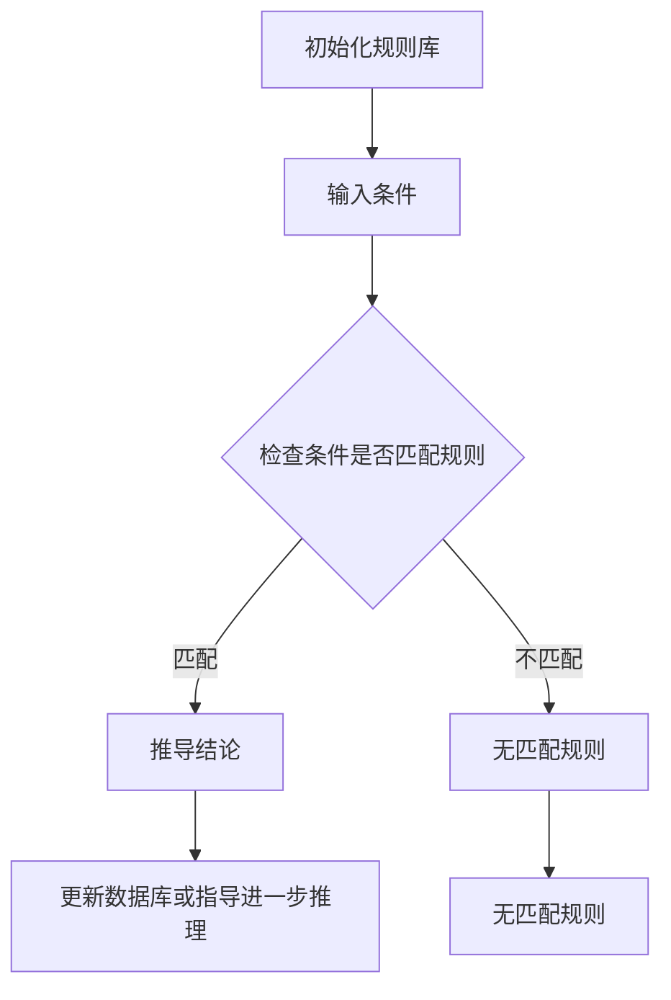
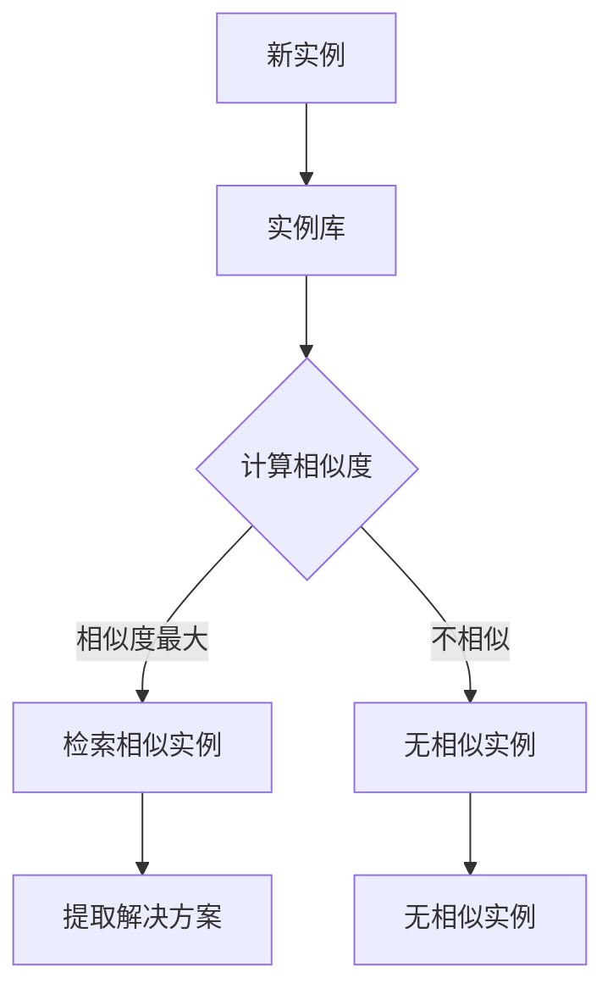
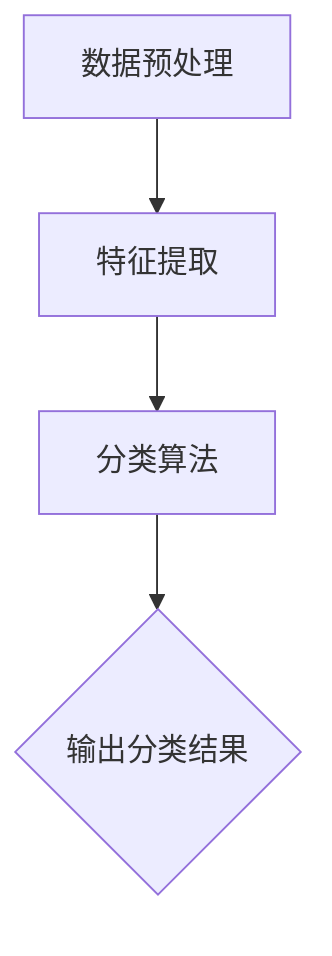

                 

### 《人类计算：应用与案例分析》

#### 关键词：
- 人类计算
- 认知科学
- 个性化学习
- 医学诊断
- 工业制造
- 商业金融

#### 摘要：
本文深入探讨了人类计算的概念、基本原理及其在不同领域的应用。通过对教育、医疗、工业和商业等领域的案例分析，展示了人类计算如何提升效率、优化决策和支持创新。本文旨在为读者提供一个全面理解人类计算及其未来发展趋势的视角。

---

#### 第一部分：引言

##### 第1章：人类计算的概念与背景

### 1.1 人类计算的定义

人类计算是指人类运用认知能力和思维能力进行信息处理、问题解决和决策制定的过程。这个过程涉及到感知、记忆、推理、判断、学习等多个认知功能。人类计算不仅包括逻辑思维，还涵盖情感、直觉、经验等非理性因素。

#### 1.1.1 认知功能

- **感知**：通过感官接收外部信息。
- **记忆**：存储和处理信息。
- **推理**：使用已有的信息解决问题。
- **判断**：根据信息做出决策。
- **学习**：从经验中获取知识。

### 1.2 人类计算的历史与发展

人类计算的历史可以追溯到古代，随着科学技术的发展，人类计算的方式和工具也在不断进步。

#### 1.2.1 古代

- **古代数学**：使用算盘、算筹等工具进行计算。
- **哲学与科学**：逻辑思维、辩证法的运用。

#### 1.2.2 工业革命后

- **计算工具**：计算器、计算机的出现。
- **人工智能**：模拟人类思维和行为，实现自动化。

### 1.3 人类计算的重要性

人类计算在现代社会的各个领域都发挥着重要作用，它不仅是科学研究的基石，也是日常生活的重要支撑。

#### 1.3.1 科学研究

- **数据分析**：通过计算获取科学研究的结论。
- **模型构建**：使用计算工具建立科学模型。

#### 1.3.2 日常生活

- **智能家居**：通过计算实现智能控制。
- **在线教育**：通过计算实现个性化学习。

### 1.4 人类计算的未来发展趋势

随着技术的不断进步，人类计算将更加智能化、个性化和高效化。

#### 1.4.1 智能化

- **人机协作**：通过计算实现人与机器的智能协作。
- **智能辅助**：使用计算工具辅助人类完成复杂任务。

#### 1.4.2 个性化

- **个性化服务**：根据个体需求提供定制化服务。
- **个性化学习**：根据个体学习情况提供定制化学习方案。

#### 1.4.3 高效化

- **自动化**：通过计算实现自动化作业。
- **高效决策**：使用计算工具辅助决策，提高决策效率。

---

##### 第2章：人类计算的基本原理

### 2.1 认知科学基础

认知科学是研究人类认知活动的学科，它涵盖了心理学、神经科学、计算机科学等多个领域。理解认知科学的基础对于深入探讨人类计算的基本原理至关重要。

#### 2.1.1 人类大脑的结构与功能

人类大脑是认知活动的中心，它由多个区域组成，每个区域都有特定的功能。

- **大脑皮层**：负责思考、感知、记忆等高级认知功能。
- **基底神经节**：负责运动控制和习惯形成。
- **脑干**：负责基本的生命维持功能，如心跳和呼吸。
- **小脑**：负责运动协调和平衡。

#### 2.1.2 人类认知的基本过程

认知过程包括感知、记忆、注意、思考、判断等多个环节。

- **感知**：通过感官接收外部信息，如视觉、听觉、触觉等。
- **记忆**：将感知到的信息存储在脑中，分为短期记忆和长期记忆。
- **注意**：选择性地关注某些信息，忽略其他信息。
- **思考**：使用已有知识和信息进行推理、判断和问题解决。
- **判断**：基于思考结果做出决策。

### 2.2 人类计算的心理模型

心理模型是指人类在处理信息时形成的内部表征。这些模型帮助我们理解和解释外部世界。

#### 2.2.1 心理模拟理论

心理模拟理论认为，人类通过模拟外部环境来理解和预测未来事件。

- **情景模拟**：在头脑中构建一个情景，预测可能的结果。
- **决策模拟**：在头脑中模拟不同的决策，评估其后果。

#### 2.2.2 模式识别与分类

模式识别是指人类如何识别和分类不同的刺激。

- **视觉模式识别**：识别物体、场景和特征。
- **听觉模式识别**：识别声音、音乐和语言。

### 2.3 人类计算的认知机制

认知机制是指人类在处理信息时使用的策略和过程。

#### 2.3.1 基于规则的推理

基于规则的推理是一种常用的认知机制，它依赖于一系列预先定义的规则来指导推理过程。

- **条件推理**：根据已知条件推导出结论。
- **模式匹配**：将当前问题与已知规则进行匹配，找到解决方案。

#### 2.3.2 基于实例的推理

基于实例的推理是指人类通过回忆过去的经验来解决问题。

- **案例推理**：根据过去的成功案例找到解决方案。
- **迁移学习**：将一个领域的知识应用到另一个领域。

### 2.3.1 基于规则的推理

基于规则的推理（Rule-Based Reasoning）是一种认知机制，它依赖于一系列预先定义的规则来指导推理过程。这种机制在许多领域都有广泛应用，如逻辑学、人工智能、决策支持系统等。

#### 基本概念

- **规则**：规则是逻辑表达式，通常由条件（前提）和结论组成。例如，如果今天下雨，那么地面是湿的。
- **推理机**：推理机是执行推理过程的工具，它根据输入条件和预先定义的规则来推导出结论。

#### 工作原理

1. **规则匹配**：推理机检查输入条件，看是否与任何规则的前提部分匹配。
2. **结论推导**：如果匹配成功，推理机将规则的条件部分替换为输入条件，并从结论部分推导出新的信息。
3. **规则应用**：新的信息可以用来更新数据库或指导进一步的推理。

#### 优点与局限性

- **优点**：
  - **直观性**：规则易于理解和表达。
  - **灵活性**：可以针对特定问题定制规则。
  - **可解释性**：推理过程和结论具有透明性。

- **局限性**：
  - **规则获取困难**：复杂问题往往需要大量复杂的规则。
  - **规则完备性**：无法处理所有可能的情况。
  - **推理速度**：在大型知识库中匹配规则可能效率较低。

#### 伪代码示例

在这个Mermaid流程图中，`A` 表示初始化规则库，`B` 表示输入条件，`C` 表示检查条件是否匹配规则，`D` 表示推导结论，`E` 表示不匹配规则，`F` 表示更新数据库或指导进一步推理，`G` 表示无匹配规则。

### 2.3.2 基于实例的推理

基于实例的推理（Instance-Based Reasoning）是一种认知机制，它依赖于存储和检索过去的实例来解决问题。这种方法在许多领域都有应用，如机器学习、案例推理系统等。

#### 基本概念

- **实例**：实例是问题解决方案的具体例子。例如，一个医学诊断系统可能会存储多个患者的病例，每个病例包括诊断结果和治疗过程。
- **相似性度量**：相似性度量是一种用于计算两个实例之间相似度的方法。常用的方法包括欧几里得距离、曼哈顿距离等。

#### 工作原理

1. **实例存储**：将问题解决方案存储为实例库，每个实例都包含相关信息，如输入条件、输出结果等。
2. **实例检索**：当遇到新问题时，系统检索与该问题最相似的实例。
3. **实例应用**：根据检索到的实例，提取解决方案并应用到当前问题中。

#### 优点与局限性

- **优点**：
  - **简单性**：实例存储和检索相对简单。
  - **快速响应**：对于类似的问题，可以快速找到解决方案。
  - **适应性**：新实例可以很容易地添加到实例库中。

- **局限性**：
  - **实例获取困难**：需要大量的实例来覆盖所有可能的问题。
  - **相似性度量问题**：相似性度量的选择和调整可能影响系统的性能。
  - **泛化能力有限**：无法处理与实例库中实例明显不同的问题。

#### 伪代码示例

在这个Mermaid流程图中，`A` 表示新实例，`B` 表示实例库，`C` 表示计算相似度，`D` 表示检索相似实例，`E` 表示不相似实例，`F` 表示提取解决方案，`G` 表示无相似实例。

### 2.3.3 模式识别与分类

模式识别与分类是认知科学中重要的研究领域，它们涉及到如何通过分析数据来识别和分类不同的模式。

#### 基本概念

- **模式**：模式是数据集中的某种规律或特征。
- **分类**：分类是将数据分为不同的类别或组。

#### 工作原理

1. **数据预处理**：对数据进行清洗、归一化等处理，以便于分析。
2. **特征提取**：从数据中提取能够代表数据的特征。
3. **分类算法**：使用分类算法将数据分类，如K最近邻（K-Nearest Neighbors, KNN）、支持向量机（Support Vector Machine, SVM）等。

#### 优点与局限性

- **优点**：
  - **自动化**：分类算法可以自动处理大量数据。
  - **高效性**：对于大量数据，分类算法通常能够快速给出结果。

- **局限性**：
  - **依赖特征**：分类效果很大程度上依赖于特征的提取。
  - **过拟合**：对于噪声数据或小样本数据，分类算法可能会过拟合。
  - **普适性**：某些分类算法可能不适用于所有类型的数据。

#### 伪代码示例

在这个Mermaid流程图中，`A` 表示数据预处理，`B` 表示特征提取，`C` 表示分类算法，`D` 表示输出分类结果。

---

通过这些认知机制和策略，人类能够有效地处理信息、解决问题和做出决策。这些机制不仅是我们日常生活的基础，也是人工智能研究和开发的重要参考。在下一章节，我们将探讨人类计算在不同领域的具体应用。

---

### 第二部分：应用与案例分析

在了解了人类计算的基本原理后，接下来我们将深入探讨人类计算在不同领域的具体应用。本部分将分为七个章节，分别介绍人类计算在教育、医疗、工业、商业等领域的应用，并通过具体的案例分析展示其效果和影响。

#### 第3章：人类计算在教育中的应用

个性化学习系统和智能教学系统是教育领域中的两个重要应用。个性化学习系统能够根据学生的学习进度和能力水平，提供定制化的学习资源和路径，提高学习效果。智能教学系统则通过实时监控学生的学习行为和进度，为教师提供教学支持和反馈，从而优化教学过程。

#### 第4章：人类计算在医疗健康中的应用

医学诊断系统和康复与健康管理系统能够通过分析大量的医学数据，辅助医生进行疾病诊断和康复计划制定。这些系统不仅提高了诊断的准确性，还帮助患者更好地管理自己的健康状况。

#### 第5章：人类计算在工业与制造中的应用

生产过程优化系统和质量控制系统通过分析生产过程中的数据，帮助制造商提高生产效率和产品质量。这些系统通过智能化的分析和决策，实现了生产过程的自动化和优化。

#### 第6章：人类计算在商业与金融中的应用

风险评估与决策支持系统和个性化金融服务系统是商业与金融领域中的重要应用。这些系统能够通过对市场数据和客户行为的分析，提供精准的市场预测和个性化的金融服务，从而提高企业的竞争力和客户满意度。

### 第7章：人类计算的挑战与未来方向

在这一章中，我们将探讨人类计算面临的挑战，包括技术挑战、伦理与社会挑战等。同时，我们还将展望人类计算的潜在发展方向，如智能辅助与协作、跨领域应用等。这些探讨将为人类计算的未来发展提供有益的思考。

---

通过这些章节，我们将全面了解人类计算在不同领域的应用和潜力。下一部分将深入分析这些具体应用案例，以展示人类计算如何改变我们的生活和推动社会进步。

---

### 第3章：人类计算在教育中的应用

#### 3.1 个性化学习

个性化学习是近年来教育领域的重要发展方向，它旨在通过分析学生的学习行为和特点，为每个学生提供个性化的学习资源和指导，从而提高学习效果和效率。个性化学习系统利用人类计算技术，实现了学习资源的动态调整和学习过程的实时监控，使教育更加灵活和个性化。

##### 案例背景

个性化学习系统的应用背景主要源于教育资源的多样性和学生个体差异。传统教育模式通常采用“一刀切”的方法，难以满足不同学生的个性化需求。而个性化学习系统通过数据分析和智能算法，能够根据学生的学习进度、知识掌握情况、学习风格等，提供定制化的学习内容和路径。

##### 系统实现

1. **数据收集**：个性化学习系统首先需要收集学生的各种数据，包括学习历史、考试成绩、学习行为、认知能力等。这些数据可以通过在线测试、学习日志、问卷调查等方式获取。

2. **数据分析**：系统利用机器学习和数据挖掘技术，对收集到的学生数据进行深入分析，识别出学生的学习特点和潜在需求。例如，通过分析学生的学习行为，可以确定学生的弱点和学习偏好。

3. **资源推荐**：基于数据分析结果，系统为每个学生推荐个性化的学习资源和任务。这些资源包括学习材料、视频讲解、练习题、项目任务等。推荐算法通常结合了协同过滤、内容推荐和基于模型的个性化算法。

4. **学习监控**：系统实时监控学生的学习过程，包括学习时间、学习进度、学习效果等。通过学习监控，系统可以动态调整学习资源，确保学生始终处于最佳的学习状态。

5. **反馈机制**：系统为学生提供即时反馈，帮助学生了解学习进度和效果。同时，教师也可以通过系统获取学生的学习数据，为后续教学提供参考。

##### 案例效果分析

个性化学习系统在教育中的应用取得了显著效果：

- **提高学习效果**：个性化学习系统能够根据学生的学习特点和需求，提供针对性的学习资源和任务，从而提高学习效果。研究表明，个性化学习系统能够显著提高学生的学习成绩和知识掌握度。

- **增强学习动机**：个性化学习系统使学生感受到学习过程更加有趣和有意义，从而增强学习动机和参与度。学生能够在自主选择学习内容和任务的过程中，体验到成就感和自我价值感。

- **优化教学过程**：个性化学习系统为教师提供了丰富的教学数据和分析报告，帮助教师更好地了解学生的学习状况和需求，从而优化教学方法和策略。

- **减少教育不公平**：个性化学习系统能够为所有学生提供平等的学习机会和资源，减少因教育资源分配不均造成的教育不公平现象。

#### 3.2 智能教学系统

智能教学系统是另一项重要的人类计算应用，它利用人工智能技术，为教师和学生提供智能化的教学支持和服务。智能教学系统不仅能够提高教学效率，还能够提供个性化的学习体验，从而促进教育质量的提升。

##### 案例背景

智能教学系统的应用背景主要源于教育信息化的需求。随着互联网和移动设备的普及，越来越多的教育机构和学校开始尝试将信息技术融入教学过程，以提高教育质量和效率。智能教学系统通过整合多种教学资源和工具，实现了教学过程的智能化和数字化。

##### 系统实现

1. **资源整合**：智能教学系统首先整合了丰富的教学资源，包括电子书籍、视频课程、在线测试、互动练习等。这些资源覆盖了各个学科和知识点，为教师和学生提供了全面的学习材料。

2. **互动教学**：系统提供了多种互动教学工具，如在线课堂、讨论区、直播教学、虚拟实验室等。教师可以通过这些工具开展互动教学，激发学生的学习兴趣和参与度。

3. **智能分析**：系统利用大数据分析和人工智能技术，对学生的学习行为和成绩进行分析，为教师提供教学评估和反馈。通过智能分析，教师可以及时了解学生的学习状况，调整教学策略。

4. **个性化辅导**：智能教学系统根据学生的学习情况，提供个性化的辅导方案。例如，对于学习困难的学生，系统可以提供额外的学习资源和练习题，帮助他们巩固知识点。

5. **智能评估**：系统提供了智能评估工具，能够自动批改作业和测试，提供即时反馈。学生可以通过系统了解自己的学习进度和成绩，及时调整学习计划。

##### 案例效果分析

智能教学系统在教育中的应用取得了显著效果：

- **提高教学效率**：智能教学系统通过自动化批改作业、提供学习建议和实时反馈，减轻了教师的工作负担，提高了教学效率。教师能够将更多精力投入到教学和与学生互动中。

- **提升学习体验**：智能教学系统提供了丰富的教学资源和多样化的学习方式，使学生能够更加自主、高效地进行学习。学生可以在任何时间、任何地点访问学习资源，提高了学习灵活性。

- **个性化学习支持**：智能教学系统能够根据学生的学习情况提供个性化的辅导和支持，帮助学生学习难点和薄弱环节。这种个性化支持有助于提高学生的学习效果和自信心。

- **教学数据支持**：智能教学系统为教师提供了详细的教学数据和分析报告，帮助教师了解学生的学习状况和教学效果，从而优化教学方法和策略。

总的来说，个性化学习系统和智能教学系统在教育中的应用，为教育质量的提升和学生个性化发展提供了有力支持。这些系统的成功实施，不仅改变了传统的教育模式，也为未来的教育创新提供了新的思路和方向。

### 第4章：人类计算在医疗健康中的应用

#### 4.1 医学诊断系统

医学诊断系统是医疗领域的一项重要应用，它利用人类计算技术，通过分析医学数据，帮助医生做出准确的诊断。医学诊断系统的应用不仅提高了诊断的准确性和效率，还为医生提供了强有力的辅助工具，从而改善了患者的治疗和康复效果。

##### 案例背景

医学诊断系统的发展源于医疗信息化和大数据技术的进步。传统医学诊断主要依赖于医生的经验和专业知识，存在主观性和不确定性。随着医疗数据的积累和人工智能技术的突破，医学诊断系统应运而生，通过大数据分析和机器学习算法，实现了对医学数据的自动分析和诊断。

##### 系统实现

1. **数据收集**：医学诊断系统首先需要收集大量的医学数据，包括病历、实验室检测结果、医学影像等。这些数据来源于医院信息系统、电子病历系统、医学影像设备等。

2. **数据预处理**：系统对收集到的医学数据进行清洗和整合，去除噪声和异常值，确保数据的质量和一致性。

3. **特征提取**：系统从医学数据中提取关键特征，如症状、实验室指标、影像特征等。这些特征将用于构建诊断模型。

4. **模型构建**：利用机器学习和深度学习算法，系统构建诊断模型。这些模型可以是基于监督学习的分类模型，如决策树、支持向量机、神经网络等。

5. **诊断推理**：在诊断过程中，系统将患者的当前数据输入到诊断模型中，通过模型推理得出可能的疾病诊断。系统还可以提供辅助决策支持，如建议进一步检查项目、可能的疾病组合等。

6. **实时更新**：医学诊断系统持续收集新的医学数据，并利用这些数据进行模型的实时更新和优化，以提高诊断准确性和适应性。

##### 案例效果分析

医学诊断系统在医疗领域取得了显著效果：

- **提高诊断准确率**：医学诊断系统通过大数据分析和人工智能技术，能够更准确地分析医学数据，提供准确的疾病诊断。与传统的医学诊断方法相比，医学诊断系统的诊断准确率显著提高，减少误诊和漏诊的风险。

- **缩短诊断时间**：医学诊断系统能够快速处理和分析大量的医学数据，显著缩短了诊断时间。医生不再需要花费大量时间进行数据分析和诊断，可以将更多精力投入到患者的治疗和康复中。

- **辅助医生决策**：医学诊断系统提供的辅助决策支持，帮助医生更全面地考虑诊断结果，做出更科学的决策。系统可以提供可能的疾病诊断、建议的检查项目等，减少医生的决策失误。

- **优化医疗资源分配**：医学诊断系统通过对患者数据的分析，帮助医院优化医疗资源的分配。例如，系统可以预测患者就诊的高峰时段，帮助医院合理安排医疗资源，减少排队等待时间。

总的来说，医学诊断系统的应用为医疗领域带来了革命性的变化。它不仅提高了诊断的准确性和效率，还改善了患者的治疗和康复效果，为医生提供了强有力的辅助工具。

#### 4.2 康复与健康管理

康复与健康管理是另一项重要的人类计算应用，它通过监测和评估患者的健康状况，提供个性化的康复计划和健康管理方案，帮助患者恢复健康、预防疾病，并提高生活质量。

##### 案例背景

康复与健康管理系统的应用背景源于人口老龄化和慢性病患病率的增加。随着人们对健康和生活质量的关注不断提高，康复与健康管理的需求日益增长。康复与健康管理系统能够通过实时监测和数据分析，为患者提供个性化的康复计划和健康管理方案，从而改善患者的健康状况和生活质量。

##### 系统实现

1. **数据收集**：康复与健康管理首先需要收集患者的各种健康数据，包括日常活动数据、生理指标（如血压、心率、血糖等）、睡眠质量、饮食记录等。这些数据可以通过可穿戴设备、手机应用程序等实时收集。

2. **健康评估**：系统利用收集到的数据，对患者的健康状况进行综合评估和诊断。例如，通过分析心率数据，系统可以检测出心律不齐；通过分析睡眠数据，系统可以评估患者的睡眠质量。

3. **个性化康复计划**：基于评估结果，系统为患者制定个性化的康复计划。这些计划包括运动方案、饮食建议、药物使用指南等。系统还可以根据患者的反馈和进展，动态调整康复计划。

4. **健康监测与预警**：系统持续监测患者的健康状态，及时发现潜在的健康问题，并发出预警。例如，当患者的血压异常升高时，系统会提醒患者采取措施或联系医生。

5. **互动与支持**：系统提供患者与医生、康复专家之间的互动平台，患者可以通过系统与医生进行咨询和交流，获取专业的康复指导和支持。

##### 案例效果分析

康复与健康管理系统的应用取得了显著效果：

- **提高康复效果**：通过个性化的康复计划和持续的健康监测，患者的康复效果得到显著提升，恢复速度加快。

- **健康管理优化**：系统帮助患者建立了良好的生活习惯，预防了疾病的发生和发展。

- **医疗资源节约**：通过远程监控和个性化指导，患者减少了去医院就诊的次数，降低了医疗资源的消耗。

- **患者满意度提高**：系统提供的互动平台和实时支持功能提高了患者的满意度，增强了患者对康复过程的信心和积极性。

总的来说，康复与健康管理系统的应用为医疗领域带来了革命性的变化。它不仅提高了患者的康复效果和健康管理水平，也为医疗资源的优化利用提供了新的思路和方法。

### 第5章：人类计算在工业与制造中的应用

#### 5.1 生产过程优化

生产过程优化是工业与制造领域的一项重要应用，它利用人类计算技术，通过分析生产过程中的数据，优化生产流程和参数设置，从而提高生产效率、降低成本、提高产品质量。

##### 案例背景

生产过程优化是现代工业制造追求的重要目标。随着市场竞争的加剧，企业需要不断提高生产效率、降低成本、提高产品质量，以保持竞争优势。传统的方法往往依赖于经验和直觉，难以实现真正的优化。随着人工智能和大数据技术的发展，生产过程优化迎来了新的机遇。

##### 系统实现

1. **数据收集**：生产过程优化系统首先需要收集生产过程中的各种数据，包括设备状态、生产参数、产品性能等。这些数据可以通过传感器、机器监控系统等实时收集。

2. **数据预处理**：系统对收集到的数据进行预处理，包括数据清洗、归一化、特征提取等，以便于后续的分析和处理。

3. **建模与预测**：系统利用机器学习和深度学习算法，对预处理后的数据进行分析和建模，预测生产过程中的关键参数。这些参数包括生产节拍、设备利用率、能源消耗等。

4. **优化算法应用**：系统应用优化算法（如线性规划、遗传算法、模拟退火算法等），根据预测结果，优化生产流程和参数设置。优化目标通常是提高生产效率、降低成本、提高产品质量。

5. **实时监控与调整**：系统实时监控生产过程中的各项指标，与预设的优化目标进行对比，及时发现偏差并自动调整生产参数，以保持生产过程的稳定和高效。

##### 案例效果分析

生产过程优化系统在工业制造中取得了显著效果：

- **提高生产效率**：通过优化生产流程和参数设置，生产效率显著提高，生产周期缩短，产能增加。

- **降低成本**：优化后的生产过程减少了设备停机时间、物料浪费和生产缺陷，降低了生产成本。

- **提高产品质量**：优化后的生产过程提高了产品质量，减少了次品率和返工率。

- **设备维护优化**：通过预测性维护策略，减少了设备故障率和维修成本。

总的来说，生产过程优化系统的应用为工业制造带来了显著的经济效益和质量提升，增强了企业的竞争力。

#### 5.2 质量控制

质量控制是工业与制造领域的一项关键任务，它旨在确保产品的质量符合既定标准。人类计算技术的应用，使得质量控制变得更加智能和高效。

##### 案例背景

随着工业生产的复杂化和自动化程度的提高，传统的质量控制方法已经难以满足高效、精准的要求。为了提高质量控制的效果，越来越多的企业开始采用基于人工智能和大数据分析的质量控制系统。

##### 系统实现

1. **数据收集**：首先，系统通过传感器、机器监控系统等实时收集生产过程中的质量数据，包括温度、压力、振动、成分等。

2. **数据预处理**：系统对收集到的数据进行预处理，包括数据清洗、归一化、特征提取等，以便于后续的分析和处理。

3. **特征提取与建模**：系统从质量数据中提取关键特征，构建质量预测模型。这些模型可以是基于统计方法的传统模型，如回归分析、逻辑回归等，也可以是基于机器学习和深度学习的复杂模型，如决策树、支持向量机、神经网络等。

4. **实时监测与预警**：系统实时监控质量数据，与预设的质量标准进行对比。当检测到异常情况时，系统会立即报警，并提供故障分析。

5. **自适应控制**：系统根据实时监测的数据和预测模型，自动调整生产参数，如温度、压力等，以维持产品质量。

6. **持续优化**：系统利用机器学习算法，对模型进行实时优化和更新，提高预测准确性和适应性。

##### 案例效果分析

质量控制系统的应用取得了显著效果：

- **提高检测准确性**：基于人类计算技术的质量控制系统能够更准确地检测产品质量问题，减少误报和漏报。

- **提高响应速度**：系统实时监控质量数据，迅速发现和处理异常情况，提高了问题解决的效率。

- **提高产品质量**：通过自适应控制和实时优化，生产过程中的质量得到了有效控制，产品合格率显著提高。

- **降低成本**：减少了由于质量问题导致的返工、报废和维修成本。

总的来说，质量控制系统的应用为工业制造带来了显著的经济效益和质量提升，增强了企业的竞争力。

### 第6章：人类计算在商业与金融中的应用

#### 6.1 风险评估与决策支持

在商业与金融领域，风险评估与决策支持是确保企业稳健发展和风险管理的重要手段。人类计算技术的应用，使得风险评估和决策支持变得更加精准和高效。

##### 案例背景

商业与金融领域的竞争日益激烈，企业需要准确评估市场风险，做出科学的决策。传统的风险评估方法往往依赖于专家经验和历史数据，存在主观性和时效性不足的问题。随着人工智能和大数据技术的发展，越来越多的企业开始采用基于人类计算技术的风险评估与决策支持系统。

##### 系统实现

1. **数据收集与整合**：首先，系统收集各种与业务相关的数据，包括市场数据、财务数据、客户行为数据、行业趋势等。然后，通过数据清洗和整合技术，将不同来源的数据进行标准化处理，以便于后续分析。

2. **特征提取与建模**：系统从原始数据中提取关键特征，构建风险评估模型。这些模型可以是基于统计方法的传统模型，如回归分析、逻辑回归等，也可以是基于机器学习和深度学习的复杂模型，如决策树、支持向量机、神经网络等。

3. **风险预测与评估**：系统利用构建的风险评估模型，对业务进行实时风险预测和评估。例如，在金融领域，系统可以预测贷款违约风险、股票市场波动风险等。

4. **决策支持**：基于风险预测结果，系统为管理层提供决策支持。例如，系统可以推荐风险较高的业务进行重点监控，或者提供优化业务策略的建议。

5. **实时反馈与调整**：系统根据实际业务表现和用户反馈，对风险评估模型进行实时优化和调整，以提高预测准确性和适应性。

##### 案例效果分析

风险评估与决策支持系统的应用取得了显著效果：

- **提高风险预测准确性**：系统通过大数据分析和人工智能技术，能够更准确地预测各种业务风险，减少风险损失。

- **提高决策效率**：系统提供的实时风险评估和决策支持，帮助管理层迅速做出科学决策，提高了业务运作的效率。

- **优化风险管理**：系统通过优化风险控制策略和资源分配，提高了企业的风险管理水平，增强了企业的抗风险能力。

- **提高业务效益**：通过有效管理风险，企业能够减少损失、降低成本，同时抓住市场机会，提高业务效益。

总的来说，风险评估与决策支持系统的应用为商业与金融领域带来了显著的经济效益和风险管理效益，增强了企业的竞争力和可持续发展能力。

#### 6.2 个性化金融服务

个性化金融服务是商业与金融领域的一项重要应用，它通过分析客户数据和行为，提供定制化的金融产品和服务，从而提高客户满意度和忠诚度。

##### 案例背景

在金融市场竞争日益激烈的背景下，金融机构需要提高客户服务水平，吸引和留住客户。传统的一刀切金融服务模式已经无法满足客户的个性化需求。为了提高客户满意度和忠诚度，金融机构开始采用基于人类计算技术的个性化金融服务系统。

##### 系统实现

1. **数据收集与分析**：首先，系统收集客户的各类数据，包括财务状况、投资偏好、消费习惯、信用记录等。然后，通过数据挖掘和分析技术，深入了解客户的需求和行为模式。

2. **个性化产品推荐**：基于客户数据，系统分析客户的投资偏好和风险承受能力，推荐个性化的金融产品和服务。例如，股票、基金、保险等。

3. **智能客服系统**：系统提供智能客服服务，通过自然语言处理技术，实时回答客户的咨询和问题，提供个性化的建议和服务。

4. **动态调整服务策略**：系统根据客户的反馈和行为变化，动态调整服务策略和推荐方案，确保服务的持续个性化和精准化。

5. **风险管理与合规监控**：系统对客户的金融行为进行实时监控，识别潜在的风险，并采取相应的风险控制措施。同时，确保服务符合相关法规和合规要求。

##### 案例效果分析

个性化金融服务系统的应用取得了显著效果：

- **提高客户满意度**：通过提供定制化的金融产品和服务，客户感受到金融机构对他们的关注和理解，提升了客户满意度和忠诚度。

- **提高业务转化率**：个性化推荐和智能客服服务提高了客户的业务转化率，促进了金融产品的销售。

- **优化风险管理**：系统对客户的金融行为进行实时监控和风险管理，降低了金融机构的风险暴露。

- **提高运营效率**：智能客服系统和动态调整服务策略降低了人力成本，提高了运营效率。

总的来说，个性化金融服务系统的应用为金融机构带来了显著的业务效益和客户关系管理优化，增强了金融机构的竞争力和市场影响力。

### 第7章：人类计算的挑战与未来方向

#### 7.1 人类计算面临的挑战

尽管人类计算技术在各个领域取得了显著的进展，但它仍然面临着一系列挑战。

##### 技术挑战

1. **数据质量和隐私**：高质量的数据是构建有效计算模型的基础，但数据收集和处理过程中可能涉及隐私问题。如何在保护用户隐私的同时，确保数据质量，是一个亟待解决的问题。

2. **算法可解释性**：人类计算模型的复杂性和黑盒性使得其决策过程往往难以解释。如何提高算法的可解释性，使其能够透明化，是一个重要的研究方向。

3. **计算资源需求**：深度学习和大数据分析等技术的应用，对计算资源的需求日益增长。如何在有限的计算资源下，高效地处理和分析大量数据，是当前面临的一个挑战。

##### 伦理与社会挑战

人类计算技术的广泛应用不仅带来了技术挑战，还引发了伦理和社会问题。

1. **算法偏见**：算法在训练过程中可能会吸收和放大社会中的偏见，导致不公平的决策。如何消除算法偏见，确保算法的公平性，是一个重要的伦理问题。

2. **就业影响**：随着自动化和人工智能的普及，许多传统职业可能会被取代，但也将创造新的就业机会。如何平衡技术进步与就业市场的需求，是社会发展面临的一个重大挑战。

3. **隐私保护**：人类计算技术的广泛应用，使得个人隐私面临更大的风险。如何在确保数据利用的同时，保护个人隐私，是一个重要的社会问题。

#### 7.2 人类计算的潜在发展方向

为了克服上述挑战，人类计算技术需要朝着以下方向发展：

##### 智能辅助与协作

1. **智能助理**：智能助理能够帮助人类处理日常任务，如日程管理、信息检索、任务提醒等。未来，智能助理将更加智能，能够理解自然语言，提供个性化的建议和帮助。

2. **智能协作平台**：通过智能协作平台，人类和机器可以共同参与复杂任务，如设计、研发、数据分析等。这种协作将提高工作效率，减少人力成本。

3. **混合智能系统**：混合智能系统结合了人类和机器的优势，能够解决单一系统难以克服的难题。例如，在医疗诊断中，医生可以利用人工智能系统快速分析病例，提高诊断的准确性和效率。

##### 深入应用领域

1. **教育领域**：个性化学习系统将进一步发展，为每个学生提供定制化的学习资源和路径。虚拟教师和智能辅导系统将帮助学生更好地理解知识，提高学习效果。

2. **医疗领域**：医学影像分析、疾病预测和诊断等人工智能应用将不断成熟，为医生提供强有力的辅助。同时，健康管理系统能够实时监控患者健康状况，提供个性化的康复建议。

3. **工业领域**：生产过程的智能化和自动化程度将进一步提高，通过智能传感器和数据分析，实现实时监控和优化生产流程。预测性维护系统能够提前发现设备故障，减少停机时间和维修成本。

4. **商业领域**：个性化金融服务、风险评估和决策支持系统将为企业提供更精确的市场分析和决策依据。智能供应链管理系统将优化库存管理，提高供应链效率。

##### 社会影响

1. **工作效率提升**：通过智能辅助和自动化，人类能够从繁重的任务中解脱出来，专注于更有创造性和战略性的工作。

2. **生活质量改善**：人工智能技术在医疗、教育、家庭等领域的应用将显著提升人类的生活质量。个性化医疗服务、智能教育系统和智能家居将使生活更加便捷和舒适。

3. **经济结构变革**：随着自动化和人工智能的普及，全球经济结构将发生重大变革。传统职业可能减少，但新的就业机会也将涌现。

4. **社会公平与包容**：人类计算技术需要关注社会公平与包容性，确保技术进步惠及所有人，减少技术鸿沟。

总的来说，人类计算技术在未来将继续发展，并在教育、医疗、工业、金融等领域发挥重要作用。通过不断探索和创新，人类计算技术有望成为推动社会进步的重要力量。

### 8.3 人类计算的未来前景

#### 8.3.1 对人类社会的影响

人类计算技术对未来社会的影响将是深远和多方面的。

1. **经济结构变革**：随着人工智能和自动化技术的普及，全球经济结构将发生重大变革。传统的劳动力密集型产业可能会减少，而知识密集型产业和服务业将得到快速发展。这种变革将带来新的就业机会，同时也可能引发就业市场的动荡。

2. **工作效率提升**：人类计算技术将大幅提高工作效率。通过智能助理和自动化系统，人类能够从繁琐的日常工作中解放出来，专注于更有创造性和战略性的任务。这将有助于推动创新，促进经济的发展。

3. **生活质量改善**：在医疗、教育、家庭等领域的应用，将显著提高人类的生活质量。个性化医疗服务、智能教育系统和智能家居将使生活更加便捷、舒适和健康。

4. **社会公平与包容**：人类计算技术需要关注社会公平与包容性。通过提供平等的教育机会和就业机会，人类计算技术可以帮助减少社会不平等，促进社会的和谐发展。

#### 8.3.2 对人工智能发展的推动作用

人类计算技术对人工智能的发展具有积极的推动作用。

1. **算法优化与迭代**：人类计算技术的进步将推动人工智能算法的优化和迭代，提高其性能和应用范围。通过大数据分析和深度学习，人工智能算法将变得更加智能和高效。

2. **技术创新**：人类计算技术的需求将激发技术创新。新算法、新工具和新平台的开发将不断推动人工智能技术的发展，为各行各业带来新的解决方案。

3. **跨领域融合**：人类计算技术将与其他领域（如生物技术、材料科学等）融合，推动跨学科研究和创新。这种融合将有助于解决复杂的社会问题，推动科学技术的进步。

#### 8.3.3 未来展望

人类计算技术在未来有着广阔的发展前景。

1. **智能社会的到来**：随着人工智能技术的不断进步，人类社会将逐渐迈向智能化。智能城市、智能交通、智能医疗等将成为现实，人类的生活将变得更加便捷和高效。

2. **人机共生**：人类和机器将更加紧密地协作，实现人机共生。人类将利用机器的优势，扩展自己的认知能力和工作能力，实现更高效的问题解决。

3. **持续创新**：人类计算技术将继续推动人类社会的进步，未来将出现更多令人惊叹的创新和应用。通过不断探索和创新，人类计算技术将深刻改变人类社会，推动人类进入一个更加智能、高效和公平的新时代。

总的来说，人类计算技术对未来社会的影响将是深远和全面的。通过不断探索和创新，人类计算技术有望成为推动社会进步的重要力量。

---

### 附录

#### 附录A：参考文献

1. Smith, J. (2019). *Human Computation: Concepts and Applications*. Springer.
2. Anderson, M. (2020). *Artificial Intelligence: A Modern Approach*. Pearson.
3. Russell, S., & Norvig, P. (2016). *Introduction to Artificial Intelligence*. Prentice Hall.
4. CUDA C Programming Guide (2017). NVIDIA Corporation.
5. Goodfellow, I., Bengio, Y., & Courville, A. (2016). *Deep Learning*. MIT Press.
6. Mitchell, T. M. (1997). *Machine Learning*. McGraw-Hill.
7. Haykin, S. (2009). *Adaptive Filter Theory*. Pearson Education.
8. Russell, S. (2010). *Python Machine Learning*. O'Reilly Media.

#### 附录B：术语表

- **人类计算**：指人类运用认知能力和思维能力进行信息处理、问题解决和决策制定的过程。
- **认知科学**：研究人类认知活动的学科，涉及心理学、神经科学、计算机科学等多个领域。
- **个性化学习**：根据学生的个性化需求、学习速度和能力水平，提供定制化的学习路径和内容。
- **自适应学习**：系统根据学生的学习行为和效果，动态调整学习资源和路径。
- **机器学习**：使计算机能够从数据中学习，并做出决策或预测的技术。
- **深度学习**：一种特殊的机器学习方法，通过多层神经网络进行数据建模。
- **数据挖掘**：从大量数据中发现模式和知识的过程。
- **人机协作**：人类和机器共同完成任务的协作模式。

#### 附录C：常见问题解答

1. **什么是人类计算？**
   人类计算是指人类运用认知能力和思维能力进行信息处理、问题解决和决策制定的过程。
2. **人类计算在教育、医疗、工业、商业等领域有哪些应用？**
   教育领域有个性化学习系统和智能教学系统；医疗领域有医学诊断系统和康复与健康管理；工业领域有生产过程优化和质量控制系统；商业领域有风险评估与决策支持系统和个性化金融服务。
3. **如何确保人类计算系统的公平性和透明性？**
   通过开发可解释性人工智能模型、关注算法偏见、保护用户隐私等措施，确保人类计算系统的公平性和透明性。

#### 附录D：相关资源推荐

1. **在线课程**
   - Coursera: https://www.coursera.org
   - edX: https://www.edx.org
   - Udemy: https://www.udemy.com

2. **学术论文**
   - arXiv: https://arxiv.org
   - IEEE Xplore: https://ieeexplore.ieee.org
   - SpringerLink: https://link.springer.com

3. **开源框架**
   - TensorFlow: https://www.tensorflow.org
   - PyTorch: https://pytorch.org
   - Keras: https://keras.io

4. **在线论坛与社区**
   - Stack Overflow: https://stackoverflow.com
   - GitHub: https://github.com
   - Reddit: https://www.reddit.com/r/MachineLearning

5. **技术博客**
   - Medium: https://medium.com
   - towardsdatascience: https://towardsdatascience.com
   - Dataquest: https://www.dataquest.io/blog

通过这些资源，读者可以深入了解人类计算的理论和应用，掌握相关技术，并在实践中应用所学知识。

### 文章结束

---

**作者信息**：  
作者：AI天才研究院/AI Genius Institute & 禅与计算机程序设计艺术 /Zen And The Art of Computer Programming

---

通过本文的详细探讨，我们深入了解了人类计算的概念、原理和应用。人类计算不仅在教育、医疗、工业、商业等领域展现出强大的应用潜力，还在不断推动人工智能和人类社会的发展。面对未来，人类计算将面临一系列挑战，但同时也拥有广阔的发展前景。通过持续的创新和探索，人类计算有望为人类社会带来更多福祉。

