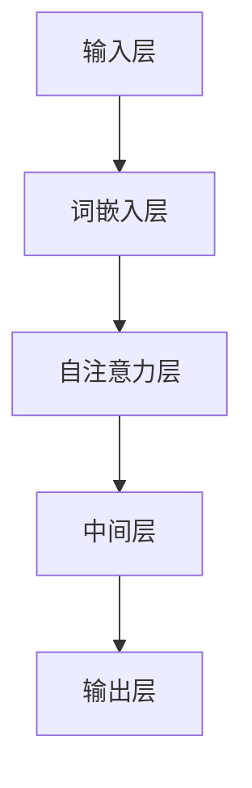
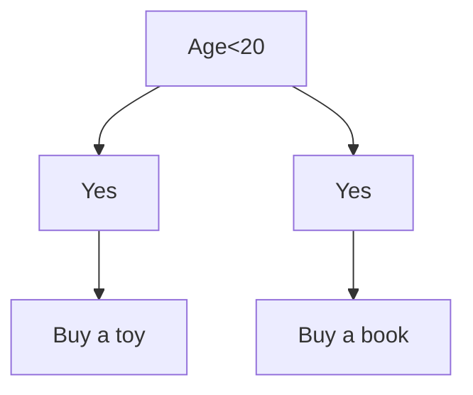
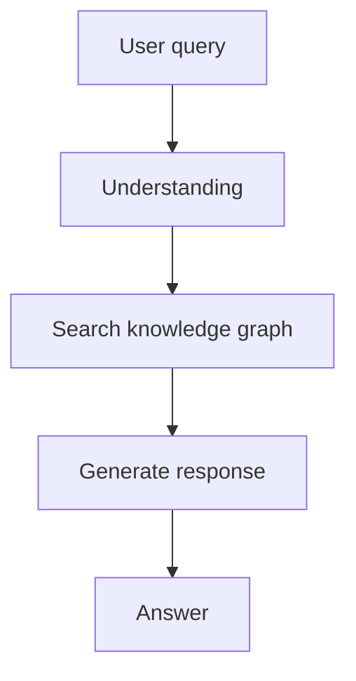
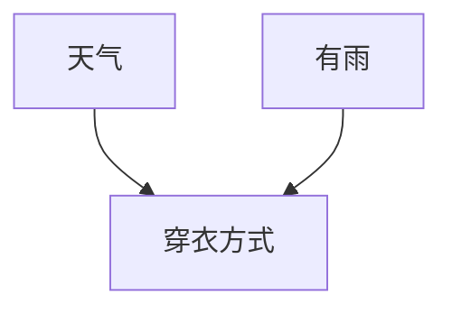
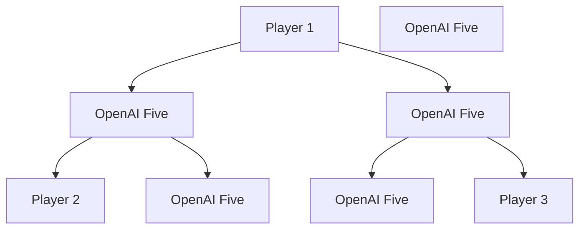
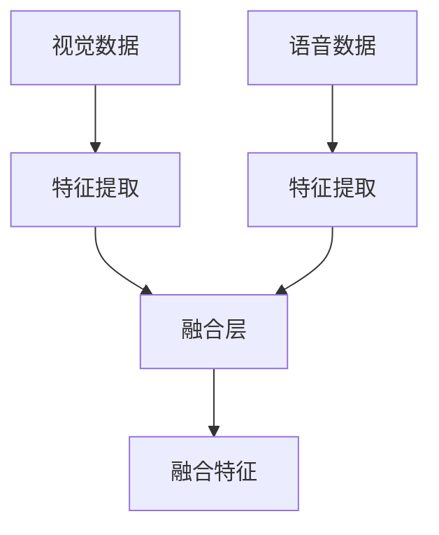
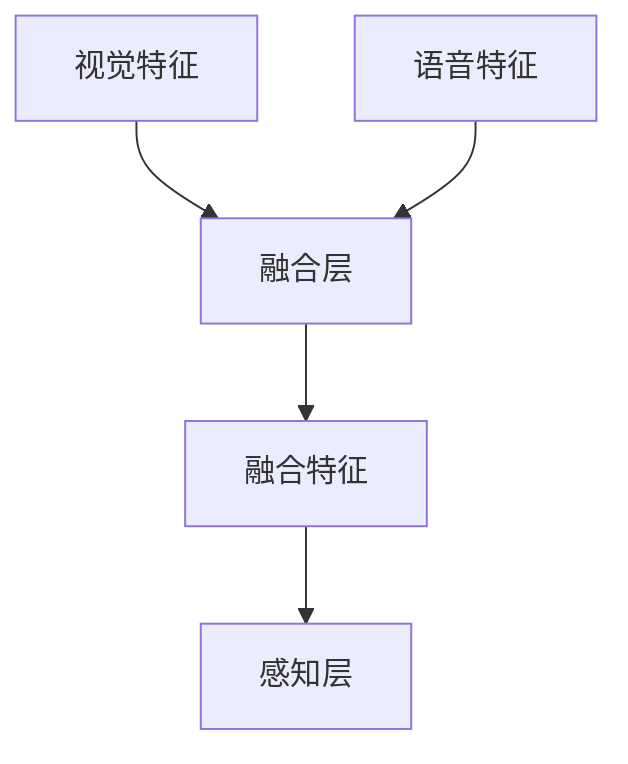
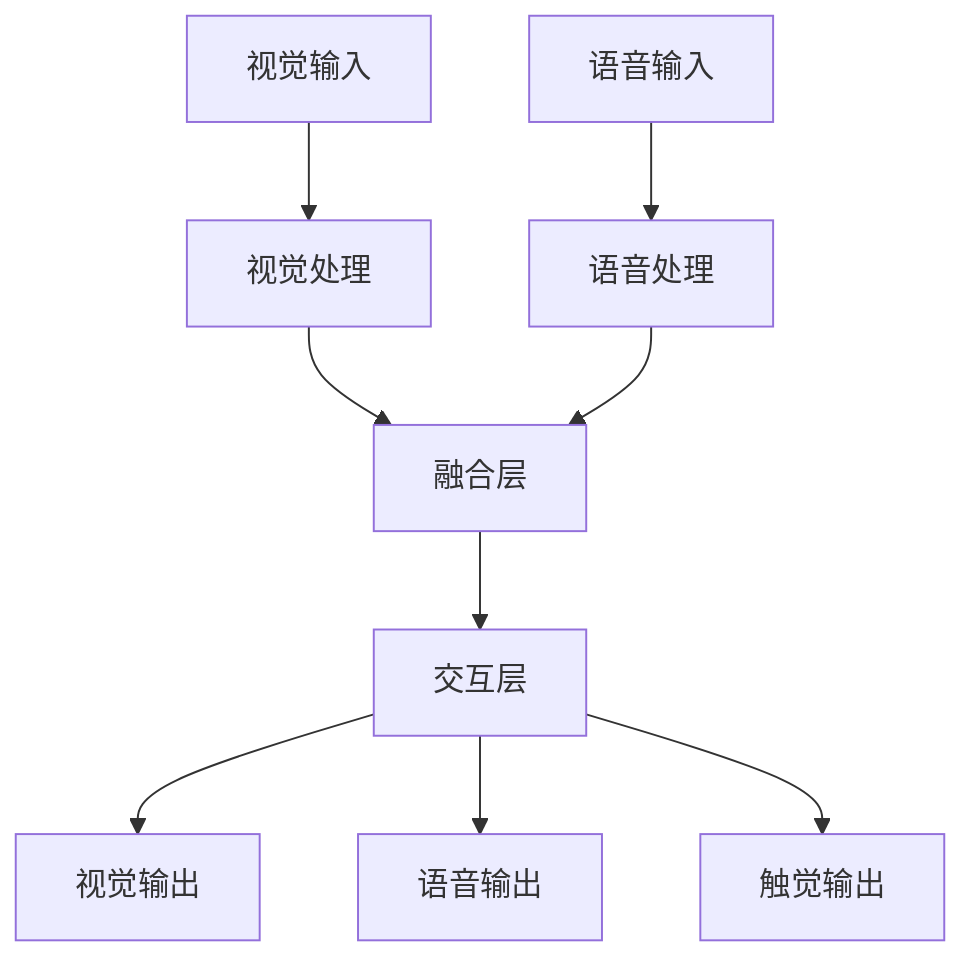
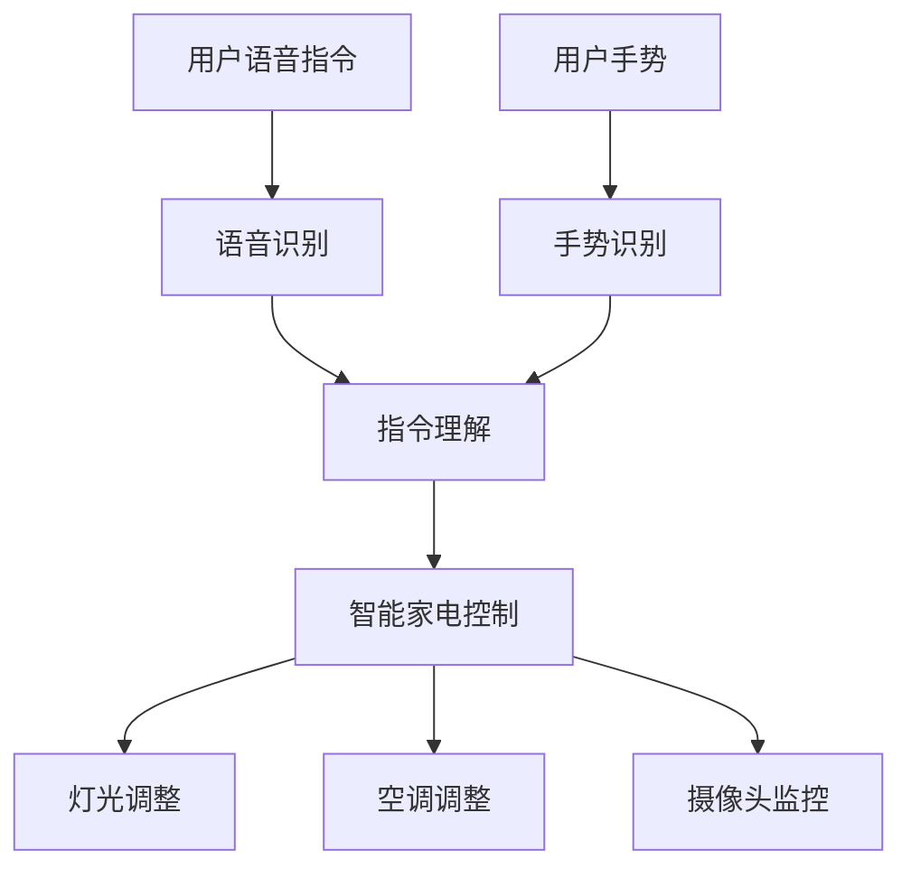

                 

# 从大语言模型迈向通用人工智能的四个步骤

> **关键词：**大语言模型、通用人工智能、计算能力、知识表示、增强学习、多模态交互

> **摘要：**本文从大语言模型的发展出发，探讨了迈向通用人工智能的四个关键步骤：提升计算能力、知识表示与处理、增强学习与决策、多模态交互与感知。通过深入分析这些步骤，本文为人工智能的未来发展提供了有益的思考和指导。

## 《从大语言模型迈向通用人工智能的四个步骤》目录大纲

### 第一部分：基础概念与架构

#### 第1章：大语言模型概述  
- 1.1 大语言模型的基本概念  
- 1.2 大语言模型的核心架构  
- 1.3 大语言模型的技术原理  
- 1.4 大语言模型的优缺点分析

#### 第2章：通用人工智能概述  
- 2.1 通用人工智能的定义  
- 2.2 通用人工智能的发展历程  
- 2.3 通用人工智能的核心挑战  
- 2.4 通用人工智能的发展趋势

### 第二部分：迈向通用人工智能的四个步骤

#### 第3章：提升计算能力  
- 3.1 硬件加速技术  
- 3.2 算法优化  
- 3.3 数据中心与云计算  
- 3.4 量子计算与人工智能

#### 第4章：知识表示与处理  
- 4.1 知识表示方法  
- 4.2 知识获取与融合  
- 4.3 知识推理与决策  
- 4.4 知识图谱的应用案例

#### 第5章：增强学习与决策  
- 5.1 增强学习基础  
- 5.2 策略优化与强化学习  
- 5.3 决策与规划  
- 5.4 增强学习在现实中的应用

#### 第6章：多模态交互与感知  
- 6.1 多模态数据融合  
- 6.2 多模态感知  
- 6.3 多模态交互  
- 6.4 多模态应用案例

#### 第7章：通用人工智能的挑战与展望  
- 7.1 挑战与问题  
- 7.2 发展趋势与未来展望

### 第三部分：附录

#### 附录A：常用工具与资源  
- A.1 深度学习框架  
- A.2 数据集与评测标准  
- A.3 开发环境搭建

#### 附录B：参考资料  
- B.1 相关书籍  
- B.2 论文与报告  
- B.3 网络资源

## 第1章：大语言模型概述

### 1.1 大语言模型的基本概念

大语言模型（Large Language Model，LLM）是指使用深度学习技术训练出的、具有强大语言理解和生成能力的模型。这些模型能够根据输入的文本序列生成相应的输出，并在自然语言处理（NLP）领域展现出卓越的性能。

语言模型是一种统计模型，用于预测一个词在特定上下文中的概率分布。大语言模型通过大量的文本数据训练，能够捕捉到语言中的复杂模式和规律，从而实现高精度的语言理解和生成。

大语言模型的基本原理包括词汇嵌入、句法分析、语义理解和注意力机制。词汇嵌入是将词汇映射到高维向量空间，使得相似词汇在空间中靠近；句法分析是对文本进行结构化处理，理解词与词之间的语法关系；语义理解是挖掘文本中的语义信息，实现对文本内容的准确理解；注意力机制则是模型在处理序列数据时，能够关注到序列中重要的部分，提高模型的性能。

### 1.2 大语言模型的发展历程

大语言模型的发展可以追溯到上世纪80年代的统计语言模型。早期的研究主要集中在基于规则的方法，如转移模型（Turing Machine）和概率图模型（如HMM）。这些模型虽然在一定程度上能够处理自然语言，但在复杂语言现象面前显得力不从心。

随着深度学习技术的兴起，研究者开始将深度神经网络应用于语言模型。2013年，深度学习模型在图像识别领域取得突破性进展，这激发了人们将深度学习应用于语言模型的兴趣。随后，神经网络语言模型（如LSTM和GRU）在NLP领域取得了显著成果。

2018年，谷歌发布了Transformer模型，这是一种基于自注意力机制的深度学习模型。Transformer模型在机器翻译、文本生成等任务上取得了前所未有的性能，推动了大语言模型的发展。此后，研究者们不断优化和改进Transformer模型，使其在多种NLP任务中保持领先地位。

### 1.3 大语言模型的应用领域

大语言模型在NLP领域具有广泛的应用，如机器翻译、文本生成、情感分析、问答系统等。以下是一些典型应用：

- **机器翻译**：大语言模型能够将一种语言的文本翻译成另一种语言。例如，谷歌翻译、百度翻译等应用都使用了基于深度学习的大语言模型。
- **文本生成**：大语言模型可以根据输入的文本生成相应的文本。例如，自动写作、摘要生成、对话系统等。
- **情感分析**：大语言模型可以分析文本中的情感倾向，用于社交媒体分析、市场调研等。
- **问答系统**：大语言模型可以回答用户提出的问题，提供知识查询服务。

### 1.4 大语言模型的核心架构

大语言模型的核心架构主要包括以下几个部分：

1. **输入层**：接收输入的文本序列，将文本转换为模型可以处理的数据格式。
2. **词嵌入层**：将词汇映射到高维向量空间，实现词汇的向量表示。
3. **自注意力层**：通过自注意力机制，模型能够在处理序列数据时关注到重要的部分。
4. **中间层**：包含多个隐藏层，用于对输入数据进行处理和提取特征。
5. **输出层**：根据模型预测，生成输出文本。

以下是一个基于Transformer模型的大语言模型架构的Mermaid流程图：



### 1.5 大语言模型的优缺点分析

大语言模型在NLP领域取得了显著成果，但同时也存在一些优缺点。

**优点：**

1. **强大的语言理解能力**：大语言模型通过大量的训练数据，能够捕捉到语言中的复杂模式和规律，实现高精度的语言理解和生成。
2. **自适应能力**：大语言模型可以根据不同的应用场景进行调整和优化，适应不同的任务需求。
3. **广泛的应用领域**：大语言模型在机器翻译、文本生成、情感分析、问答系统等多个领域都取得了显著成果。

**缺点：**

1. **计算资源消耗大**：大语言模型需要大量的计算资源和存储空间，对硬件设备的要求较高。
2. **数据隐私问题**：大语言模型在训练过程中需要大量的文本数据，可能涉及用户隐私数据，存在数据隐私问题。
3. **可解释性不足**：大语言模型的工作原理较为复杂，难以解释其决策过程，存在可解释性问题。

## 第2章：通用人工智能概述

### 2.1 通用人工智能的定义

通用人工智能（Artificial General Intelligence，AGI）是一种理论上的智能系统，它具有与人类相似的认知能力，能够在多种任务和场景中表现出高水平的表现。与当前的人工智能（Artificial Intelligence，AI）不同，通用人工智能不仅仅局限于特定任务的自动化，而是能够自主地学习、推理、决策，并适应各种复杂的环境和任务。

通用人工智能的关键特征包括：

- **通用性**：能够处理多种不同类型的问题，而不仅仅是特定领域的问题。
- **自适应能力**：能够自主地学习和适应新的任务和场景。
- **推理能力**：能够进行逻辑推理和决策，解决复杂的问题。
- **自主学习**：能够通过经验和数据不断优化自身的性能。

### 2.2 通用人工智能的发展历程

通用人工智能的研究可以追溯到20世纪50年代。当时的科学家们开始探讨如何构建一种具有人类智能的机器。然而，由于技术的限制，早期的研究大多停留在理论层面，缺乏实际应用。

20世纪80年代，随着计算机性能的提升和人工智能技术的进步，研究者开始尝试将深度学习应用于通用人工智能。然而，由于数据集和计算资源的限制，这些尝试并未取得显著成果。

21世纪初，随着深度学习技术的突破和大数据时代的到来，通用人工智能的研究再次受到关注。特别是在2012年，深度学习在图像识别领域取得了突破性进展，这激发了人们将深度学习应用于通用人工智能的信心。

近年来，随着计算机性能的进一步提升和人工智能技术的不断突破，通用人工智能的研究取得了重要进展。虽然目前还没有实现真正的通用人工智能，但许多研究已经展示了在特定领域的高性能表现。

### 2.3 通用人工智能的核心挑战

通用人工智能的研究面临诸多核心挑战，包括：

- **计算能力**：通用人工智能需要处理大量的数据，进行复杂的计算。因此，计算能力是通用人工智能发展的重要基础。
- **知识表示**：通用人工智能需要有效地表示和处理知识，实现知识的自动化推理和决策。
- **自主决策**：通用人工智能需要具备自主决策能力，能够在复杂的环境中做出合理的决策。
- **伦理与道德**：通用人工智能的发展可能带来一些伦理和道德问题，如隐私、安全、可控性等。

### 2.4 通用人工智能的发展趋势

通用人工智能的发展趋势主要体现在以下几个方面：

- **深度学习与强化学习**：深度学习和强化学习是通用人工智能的两个核心技术。未来，研究者将继续探索如何将这两种技术更好地结合，提高通用人工智能的性能。
- **多模态交互**：通用人工智能需要能够处理多种模态的数据，如文本、图像、声音等。因此，多模态交互将成为通用人工智能研究的重要方向。
- **跨学科研究**：通用人工智能的研究需要融合计算机科学、心理学、认知科学等多个学科。未来，跨学科研究将推动通用人工智能的快速发展。
- **应用场景拓展**：通用人工智能将在医疗、教育、金融、工业等多个领域得到广泛应用，推动社会的发展和进步。

## 第3章：提升计算能力

迈向通用人工智能的第一步是提升计算能力。计算能力是通用人工智能发展的基石，没有强大的计算能力，就难以实现高效的算法和模型训练。本节将探讨提升计算能力的四个关键方面：硬件加速技术、算法优化、数据中心与云计算、量子计算与人工智能。

### 3.1 硬件加速技术

硬件加速技术是提升计算能力的重要手段。近年来，硬件加速技术在人工智能领域取得了显著进展，主要包括GPU（图形处理器）和TPU（张量处理器）。

**GPU加速技术**

GPU是一种高度并行的计算设备，最初用于图形渲染。随着深度学习技术的发展，研究者发现GPU在矩阵运算和并行计算方面具有巨大的优势。GPU加速技术可以显著提高深度学习模型的训练速度和推理速度。

GPU加速深度学习的主要方法包括：

- **并行计算**：GPU具有大量计算单元，可以同时处理多个任务，从而提高计算效率。
- **内存带宽**：GPU的内存带宽远高于CPU，可以快速读取和写入数据，减少数据传输的瓶颈。
- **优化算法**：针对GPU的特性，优化深度学习算法，使其在GPU上运行更加高效。

**TPU加速技术**

TPU是谷歌开发的专门用于加速深度学习计算的专用芯片。TPU在矩阵运算和向量计算方面具有出色的性能，能够显著提高深度学习模型的训练速度。

TPU加速深度学习的主要方法包括：

- **硬件优化**：TPU采用特殊的硬件架构，优化矩阵乘法和向量运算，提高计算效率。
- **软件优化**：针对TPU的特性，优化深度学习算法和软件库，使其在TPU上运行更加高效。

**GPU与TPU的比较**

GPU和TPU都是用于加速深度学习计算的硬件设备，但它们在性能和应用方面存在一定的差异。

- **性能**：TPU在矩阵运算和向量计算方面具有更高的性能，而GPU在图形渲染和通用计算方面具有更强的能力。
- **应用**：GPU广泛应用于深度学习模型训练和推理，而TPU主要应用于大规模的深度学习任务，如自动驾驶、语音识别等。

**分布式计算**

分布式计算是将计算任务分布在多个计算节点上，利用网络通信实现协同计算。分布式计算可以提高计算能力和效率，适用于大规模深度学习模型的训练和推理。

分布式计算的主要方法包括：

- **数据并行**：将数据集划分成多个子集，每个计算节点分别处理子集，然后汇总结果。
- **模型并行**：将深度学习模型拆分成多个子模型，每个计算节点分别训练子模型，然后融合结果。

**案例：Google Brain的分布式计算**

Google Brain是谷歌的一个研究团队，致力于探索深度学习技术的应用。Google Brain使用分布式计算技术，训练出了一系列高性能的深度学习模型，如BERT、Transformer等。

Google Brain的分布式计算方法主要包括：

- **数据并行训练**：将数据集划分成多个子集，每个TPU分别处理子集，然后汇总结果。
- **模型并行训练**：将Transformer模型拆分成多个子模型，每个TPU分别训练子模型，然后融合结果。

### 3.2 算法优化

算法优化是提升计算能力的另一个关键方面。通过优化算法，可以减少计算量和数据传输，提高计算效率。

**模型压缩与量化**

模型压缩与量化是一种常用的算法优化方法。通过减少模型的参数数量和精度，可以降低模型的计算量和存储需求，提高计算效率。

- **模型压缩**：通过剪枝、量化等方法，减少模型的参数数量，降低模型的复杂性。
- **量化**：将模型的参数从浮点数转换为整数，减少计算量。

**深度学习优化算法**

深度学习优化算法是用于训练深度学习模型的算法。通过优化优化算法，可以提高模型的收敛速度和性能。

- **梯度下降**：梯度下降是一种最常用的优化算法，通过迭代更新模型的参数，使得损失函数最小化。
- **Adam优化器**：Adam优化器是梯度下降的一种改进，通过自适应调整学习率，提高模型的收敛速度。

**案例分析：ResNet与残差网络**

ResNet（残差网络）是一种深度神经网络架构，通过引入残差模块，解决了深度神经网络训练过程中的梯度消失问题。ResNet在ImageNet图像识别任务上取得了重大突破，证明了深度神经网络可以训练得很深。

ResNet的主要优势包括：

- **深度可分离卷积**：ResNet使用深度可分离卷积，降低模型的参数数量，减少计算量。
- **残差连接**：ResNet引入残差连接，使得梯度可以直接传递到网络底层，解决了梯度消失问题。

### 3.3 数据中心与云计算

数据中心与云计算是提升计算能力的重要基础设施。通过搭建高性能的数据中心和云计算平台，可以提供强大的计算资源，满足通用人工智能的需求。

**数据中心架构**

数据中心是一种大规模的数据处理和存储设施，由服务器、存储设备和网络设备组成。数据中心的主要功能包括：

- **数据处理**：数据中心可以处理大量的数据，包括数据存储、数据分析和数据挖掘。
- **数据存储**：数据中心提供大容量的数据存储，满足用户的数据存储需求。
- **网络连接**：数据中心通过网络连接各种设备和应用，实现数据的传输和共享。

**云计算平台**

云计算平台是一种基于互联网的计算服务，提供可扩展的计算资源和服务。云计算平台的主要优势包括：

- **弹性扩展**：云计算平台可以根据需求动态调整计算资源，满足用户的需求。
- **成本效益**：云计算平台提供按需计费的服务模式，用户可以根据需求支付相应的费用。
- **高可用性**：云计算平台提供可靠的数据备份和容灾机制，确保数据的安全和稳定。

**案例分析：Google Cloud与微软Azure**

Google Cloud和微软Azure是两家知名云计算服务提供商，提供强大的云计算平台和计算资源。

- **Google Cloud**：Google Cloud提供一系列云计算服务，包括计算、存储、数据库、人工智能等。Google Cloud具有强大的计算能力和丰富的生态系统，适用于各种企业级应用。
- **微软Azure**：微软Azure提供全球领先的云计算服务，包括计算、存储、网络、人工智能等。微软Azure与微软的生态系统紧密结合，提供全面的解决方案。

### 3.4 量子计算与人工智能

量子计算是一种基于量子力学原理的计算方法，具有与传统计算不同的特性。量子计算可以显著提高计算速度和效率，为通用人工智能的发展提供新的机遇。

**量子计算的基本原理**

量子计算的基本原理包括：

- **量子比特（qubit）**：量子比特是量子计算的基本单元，具有量子叠加和量子纠缠的特性。
- **量子门（quantum gate）**：量子门是量子计算的基本操作，用于对量子比特进行操作。
- **量子电路（quantum circuit）**：量子电路是量子计算的基本结构，用于实现复杂的量子计算任务。

**量子计算在人工智能中的应用**

量子计算在人工智能中的应用主要包括：

- **量子神经网络（Quantum Neural Network，QNN）**：QNN是一种结合量子计算和神经网络的模型，可以显著提高计算速度和性能。
- **量子机器学习（Quantum Machine Learning，QML）**：QML是一种基于量子计算和机器学习的模型，可以解决传统机器学习难以处理的问题。
- **量子优化（Quantum Optimization）**：量子优化是一种基于量子计算和优化算法的方法，可以显著提高优化算法的性能。

**案例分析：Google Quantum AI与IBM Q**

Google Quantum AI和IBM Q是两家知名量子计算研究机构，致力于探索量子计算在人工智能中的应用。

- **Google Quantum AI**：Google Quantum AI是谷歌的一个研究团队，专注于量子计算和人工智能的研究。Google Quantum AI开发了量子神经网络和量子优化算法，推动量子计算在人工智能领域的发展。
- **IBM Q**：IBM Q是IBM的一个量子计算项目，提供全球领先的量子计算服务。IBM Q开发了量子机器学习和量子优化算法，推动量子计算在人工智能领域的应用。

### 总结

提升计算能力是迈向通用人工智能的关键一步。通过硬件加速技术、算法优化、数据中心与云计算、量子计算与人工智能等方面的探索，我们可以显著提高计算能力，为通用人工智能的发展提供坚实的支持。在未来，随着技术的不断进步，我们有望实现真正的通用人工智能，为人类带来更多的创新和进步。

## 第4章：知识表示与处理

知识表示与处理是迈向通用人工智能的第二个关键步骤。知识表示是指如何将现实世界中的知识转化为计算机可以理解和处理的形式；知识处理则是指如何有效地获取、整合、推理和利用这些知识。本章将深入探讨知识表示与处理的方法、知识获取与融合、知识推理与决策，以及知识图谱的应用案例。

### 4.1 知识表示方法

知识表示是将现实世界的知识转化为计算机可以处理的形式。常见的知识表示方法包括符号表示法、分布式表示法和知识图谱。

#### 符号表示法

符号表示法是一种基于逻辑和规则的表示方法。它使用符号和规则来表示知识，例如，使用谓词逻辑来表示关系和事实。符号表示法的优点是能够明确地表示知识，但缺点是过于依赖规则，难以处理复杂和动态的环境。

#### 分布式表示法

分布式表示法是一种基于向量或图的结构来表示知识的表示方法。它将知识表示为向量或图中的节点和边，例如，使用词嵌入表示词汇，或使用知识图谱表示复杂的关系。分布式表示法的优点是能够更好地处理复杂和动态的环境，但缺点是难以表达明确的规则。

#### 知识图谱

知识图谱是一种基于图的结构来表示知识的方法。它使用节点表示实体，使用边表示实体之间的关系。知识图谱的优点是能够表示复杂和动态的知识，并且支持高效的查询和推理。

以下是一个知识图谱的示例，它表示了实体（人、地点、组织）及其之间的关系：

```mermaid
graph TD
A[Person] --> B[John]
B --> C[works for] D[Google]
D --> E[located in] F[Mountain View]
```

### 4.2 知识获取与融合

知识获取是指如何从各种数据源中提取有用的知识。知识融合是指如何将不同来源的知识整合为一个统一的知识体系。知识获取与融合的方法包括自动知识获取和知识融合与整合。

#### 自动知识获取

自动知识获取是指通过自动化方法从数据源中提取知识。常见的方法包括：

- **文本挖掘**：从文本数据中提取实体、关系和属性。
- **图像识别**：从图像数据中提取物体、场景和位置。
- **语音识别**：从语音数据中提取文字和语义信息。

#### 知识融合与整合

知识融合与整合是指将不同来源的知识整合为一个统一的知识体系。常见的方法包括：

- **数据融合**：将来自不同数据源的数据进行整合，消除数据不一致性。
- **知识融合**：将来自不同领域或来源的知识进行整合，形成更加全面和准确的知识体系。

#### 知识推理与决策

知识推理与决策是指如何利用知识进行推理和决策。知识推理是指根据已有知识，推导出新的结论。知识决策是指如何根据知识进行决策和行动。

- **推理算法**：常见的推理算法包括基于规则的推理、基于模型的推理和基于数据的推理。
- **决策模型**：常见的决策模型包括决策树、贝叶斯网络和马尔可夫决策过程。

以下是一个基于决策树的知识推理示例：



### 4.3 知识图谱的应用案例

知识图谱在多个领域有着广泛的应用。以下是一些典型的应用案例：

#### 搜索引擎

知识图谱可以用于改进搜索引擎的性能，提供更加精准和智能的搜索结果。通过知识图谱，搜索引擎可以理解用户的查询意图，并提供相关的实体和关系，从而提高搜索结果的准确性。

#### 问答系统

知识图谱可以用于构建问答系统，回答用户提出的问题。通过知识图谱，问答系统可以理解问题的语义，查找相关的知识，并生成准确的回答。

以下是一个基于知识图谱的问答系统示例：



#### 个性化推荐

知识图谱可以用于构建个性化推荐系统，为用户提供个性化的内容和服务。通过知识图谱，推荐系统可以理解用户的兴趣和偏好，提供相关的推荐。

#### 智能助手

知识图谱可以用于构建智能助手，为用户提供智能的交互和服务。通过知识图谱，智能助手可以理解用户的需求，提供个性化的回答和建议。

以下是一个基于知识图谱的智能助手示例：


### 总结

知识表示与处理是迈向通用人工智能的重要一步。通过符号表示法、分布式表示法和知识图谱等知识表示方法，我们可以有效地表示和理解现实世界中的知识。通过自动知识获取和知识融合与整合，我们可以构建一个统一和全面的知识体系。通过知识推理与决策，我们可以利用知识进行推理和决策，实现更加智能和高效的人工智能系统。在未来，随着技术的不断进步，知识表示与处理将在通用人工智能中发挥更加重要的作用。

## 第5章：增强学习与决策

增强学习（Reinforcement Learning，RL）是一种通过不断与环境交互来学习最优策略的机器学习方法。与监督学习和无监督学习不同，增强学习强调通过试错（trial-and-error）和反馈（feedback）来优化行为。本章将介绍增强学习的基础知识、策略优化与强化学习、决策与规划以及增强学习在现实中的应用。

### 5.1 增强学习基础

增强学习主要涉及四个核心要素：代理（Agent）、环境（Environment）、状态（State）、动作（Action）和奖励（Reward）。

- **代理**：执行动作、感知环境并学习策略的智能体。
- **环境**：代理交互的实体，包含状态空间和动作空间。
- **状态**：描述代理所处环境的特征。
- **动作**：代理在环境中执行的操作。
- **奖励**：代理执行动作后从环境中获得的即时反馈。

**增强学习的基本原理**：

增强学习的目标是学习一个策略（Policy），该策略定义了代理在不同状态下应采取的动作。策略的学习过程是基于马尔可夫决策过程（Markov Decision Process，MDP），其核心是贝尔曼方程（Bellman Equation）：

$$
V(s) = \max_a Q(s, a)
$$

$$
Q(s, a) = r + \gamma \max_{a'} Q(s', a')
$$

其中，$V(s)$ 是状态值函数，表示在状态 $s$ 下采取最优动作 $a$ 后获得的预期奖励；$Q(s, a)$ 是动作值函数，表示在状态 $s$ 下采取动作 $a$ 后获得的预期奖励；$r$ 是即时奖励；$\gamma$ 是折扣因子，表示未来奖励的现值。

**强化学习的主要算法**：

- **值函数方法**：通过学习状态值函数或动作值函数来优化策略。常见的算法包括Q学习、SARSA（同步样本动作评估）和策略梯度方法。
- **策略方法**：直接优化策略，使策略最大化长期奖励。常见的算法包括REINFORCE、PPO（Proximal Policy Optimization）和A3C（Asynchronous Advantage Actor-Critic）。

### 5.2 策略优化与强化学习

策略优化是增强学习中的重要内容，其目标是学习一个最优策略。策略优化的核心思想是通过优化策略来最大化预期回报。

**策略评估**：

策略评估是指估计当前策略的期望回报。常见的方法包括蒙特卡罗方法和动态规划方法。

- **蒙特卡罗方法**：通过模拟大量的模拟轨迹来估计策略的期望回报。
- **动态规划方法**：自底向上或自顶向下计算状态值函数或动作值函数。

**策略优化**：

策略优化是指优化当前策略以最大化预期回报。常见的方法包括策略梯度方法和策略迭代方法。

- **策略梯度方法**：直接计算策略梯度和更新策略参数。
- **策略迭代方法**：交替执行策略评估和策略优化，逐步优化策略。

**案例分析：Q学习**

Q学习是一种基于值函数的强化学习算法。其目标是通过学习动作值函数 $Q(s, a)$ 来优化策略。以下是一个Q学习的伪代码示例：

```python
# 初始化动作值函数Q(s, a)
Q = zeros((n_states, n_actions))

# 设置学习参数
epsilon = 0.1  # 探索率
alpha = 0.1   # 学习率
gamma = 0.9  # 折扣因子

# 训练循环
for episode in range(n_episodes):
    state = env.reset()
    done = False

    while not done:
        # 选择动作
        if random() < epsilon:
            action = random_action()
        else:
            action = argmax(Q[state, :])

        # 执行动作并获取奖励和下一个状态
        next_state, reward, done = env.step(action)

        # 更新动作值函数
        Q[state, action] = Q[state, action] + alpha * (reward + gamma * max(Q[next_state, :]) - Q[state, action])

        state = next_state
```

### 5.3 决策与规划

在增强学习中，决策与规划是两个重要的概念。决策是指代理在给定状态下选择最优动作，而规划是指代理在多个状态下选择一系列动作，以实现长期目标。

**决策树**：

决策树是一种常见的决策模型，通过一系列的判断条件来决定最优动作。以下是一个决策树的示例：

```mermaid
graph TD
A[年龄<18] --> B{上学?}
A --> C{否} D{工作}
B --> E{是} F{学习}
```

**贝叶斯网络**：

贝叶斯网络是一种概率模型，通过有向无环图（DAG）表示变量之间的概率关系。以下是一个贝叶斯网络的示例：



**迭代规划**：

迭代规划是一种常用的规划方法，通过多次迭代来优化动作序列。以下是一个迭代规划的伪代码示例：

```python
# 初始化动作序列
actions = []

# 迭代规划
for t in range(T):
    # 选择当前最优动作
    action = argmax(Q[s, :])

    # 执行动作
    next_state, reward, done = env.step(action)

    # 更新状态和动作序列
    s = next_state
    actions.append(action)

    # 终止条件
    if done:
        break

# 反向传播
for t in range(T-1, -1, -1):
    # 更新动作值函数
    Q[s, actions[t]] = Q[s, actions[t]] + alpha * (reward + gamma * max(Q[next_state, :]) - Q[s, actions[t]])
    s = next_state
```

### 5.4 增强学习在现实中的应用

增强学习在现实世界中有着广泛的应用，以下是一些典型的应用案例：

**自动驾驶**：

自动驾驶技术是增强学习的典型应用之一。通过强化学习算法，自动驾驶系统可以在复杂的交通环境中学习最优驾驶策略，实现自动驾驶。

**机器人控制**：

机器人控制是另一个常见的增强学习应用场景。通过强化学习算法，机器人可以在各种环境中学习控制策略，实现自主运动和任务执行。

**游戏**：

增强学习在游戏领域也有着广泛的应用。通过强化学习算法，游戏AI可以学习玩各种游戏，如棋类游戏、电子游戏等。

**案例：OpenAI Five**

OpenAI Five 是 OpenAI 开发的一款基于强化学习算法的多人竞技游戏AI。OpenAI Five 能够在《Dota 2》这款多人在线竞技游戏中与人类顶尖玩家相抗衡。其核心原理是通过强化学习算法，学习在游戏中进行团队协作和策略制定。



### 总结

增强学习与决策是迈向通用人工智能的重要步骤。通过增强学习，代理可以自主地学习最优策略，通过决策与规划，代理可以有效地在复杂环境中做出决策。在实际应用中，增强学习已经展示了其在自动驾驶、机器人控制、游戏等领域的强大能力。随着技术的不断进步，增强学习将在通用人工智能中发挥更加重要的作用，推动人工智能的发展。

## 第6章：多模态交互与感知

多模态交互与感知是迈向通用人工智能的第四个关键步骤。多模态交互指的是人工智能系统能够同时处理多种感知模态（如视觉、听觉、触觉等）的数据，并进行有效的融合与理解。多模态感知是指系统能够从多个感知模态中获取信息，综合处理这些信息，以实现对环境的全面理解和响应。本章将探讨多模态数据融合、多模态感知、多模态交互以及多模态应用案例。

### 6.1 多模态数据融合

多模态数据融合是指将来自不同感知模态的数据进行整合，以获得更全面和准确的信息。多模态数据融合的方法可以分为以下几类：

**早期融合（Early Fusion）**：

早期融合在数据层面进行融合，将来自不同模态的数据在同一时间点进行组合。这种方法通常使用简单的特征组合方法，如求和、取平均或加权求和。早期融合的优点是计算简单，但缺点是可能丢失一些模态的独特信息。

**晚期融合（Late Fusion）**：

晚期融合在特征或决策层面进行融合，先对每个模态的数据进行独立处理，然后将处理结果进行融合。这种方法通常使用复杂的分类器或回归模型，如集成学习或神经网络。晚期融合的优点是能够充分利用每个模态的独特信息，但计算复杂度较高。

**跨模态特征学习（Cross-Modal Feature Learning）**：

跨模态特征学习通过自动学习跨模态特征表示，使不同模态的数据能够直接进行融合。这种方法通常使用深度学习技术，如自编码器或生成对抗网络（GAN）。跨模态特征学习的优点是能够自适应地学习模态间的对应关系，提高融合效果。

**多模态数据融合的示例算法**：

- **多模态神经网络（Multimodal Neural Network）**：通过构建一个包含多个输入层的神经网络，将不同模态的数据进行融合。例如，卷积神经网络（CNN）可以用于处理视觉数据，循环神经网络（RNN）可以用于处理语音数据。
- **图神经网络（Graph Neural Network）**：通过构建一个包含节点和边的图结构，将不同模态的数据表示为图中的节点和边，并进行融合。

以下是一个多模态数据融合的Mermaid流程图示例：



### 6.2 多模态感知

多模态感知是指人工智能系统能够从多个感知模态中获取信息，并综合处理这些信息，以实现对环境的全面理解和响应。多模态感知的关键技术包括：

**多模态特征提取**：

多模态特征提取是指从不同模态的数据中提取有代表性的特征。常用的方法包括：

- **视觉特征提取**：使用卷积神经网络（CNN）提取图像的特征。
- **语音特征提取**：使用循环神经网络（RNN）或变换器（Transformer）提取语音的特征。
- **触觉特征提取**：使用深度神经网络提取触觉传感器的数据特征。

**多模态特征融合**：

多模态特征融合是指将不同模态的特征进行整合，以获得更全面的信息。常用的方法包括：

- **早期融合**：在特征级别进行融合，如将视觉和语音特征进行求和或加权求和。
- **晚期融合**：在决策级别进行融合，如使用神经网络融合不同模态的特征，并输出最终的决策。

**多模态感知的示例算法**：

- **多模态深度神经网络**：通过构建一个多输入层的神经网络，同时处理来自不同模态的数据。
- **多模态生成对抗网络（Multi-modal GAN）**：通过生成对抗网络（GAN）学习不同模态的特征表示，并进行融合。

以下是一个多模态感知的Mermaid流程图示例：



### 6.3 多模态交互

多模态交互是指人工智能系统能够与用户通过多种模态进行交互，以实现更自然和高效的沟通。多模态交互的关键技术包括：

**多模态输入处理**：

多模态输入处理是指对来自不同模态的输入数据进行处理，以提取有用的信息。常用的方法包括：

- **视觉输入处理**：使用图像识别技术，如卷积神经网络（CNN）或深度卷积生成对抗网络（DCGAN），对视觉输入进行处理。
- **语音输入处理**：使用语音识别技术，如循环神经网络（RNN）或变换器（Transformer），对语音输入进行处理。
- **触觉输入处理**：使用触觉传感器的数据处理方法，如深度神经网络或强化学习，对触觉输入进行处理。

**多模态输出生成**：

多模态输出生成是指根据用户的需求，生成合适的输出模态。常用的方法包括：

- **视觉输出生成**：使用图像合成技术，如生成对抗网络（GAN）或变分自编码器（VAE），生成视觉输出。
- **语音输出生成**：使用语音合成技术，如循环神经网络（RNN）或变换器（Transformer），生成语音输出。
- **触觉输出生成**：使用触觉反馈技术，如触觉传感器和执行器，生成触觉输出。

**多模态交互的示例算法**：

- **多模态对话系统**：通过构建一个多输入层和多输出层的神经网络，实现自然语言处理和语音合成的多模态交互。
- **多模态机器人**：通过融合视觉、语音和触觉数据，使机器人能够更好地理解用户的需求，并进行相应的操作。

以下是一个多模态交互的Mermaid流程图示例：



### 6.4 多模态应用案例

多模态交互与感知在多个领域有着广泛的应用，以下是一些典型的应用案例：

**虚拟现实（VR）**：

虚拟现实技术通过融合视觉、听觉和触觉数据，为用户提供沉浸式的体验。多模态交互与感知在虚拟现实中的应用包括：

- **虚拟现实游戏**：通过视觉和听觉输入，为用户提供逼真的游戏体验。
- **虚拟现实训练**：通过触觉反馈，为用户提供真实的训练体验。

**智能客服**：

智能客服系统通过融合文本、语音和图像数据，实现与用户的自然交互。多模态交互与感知在智能客服中的应用包括：

- **文本和语音识别**：通过语音识别和自然语言处理技术，理解用户的需求。
- **图像识别**：通过图像识别技术，识别用户上传的图片或视频，提供更准确的解决方案。

**智能家居**：

智能家居系统通过融合视觉、语音和触觉数据，实现与用户的智能互动。多模态交互与感知在智能家居中的应用包括：

- **家庭安防**：通过视觉感知，监控家庭环境，及时响应异常情况。
- **智能助手**：通过语音交互，为用户提供个性化的服务。

以下是一个多模态交互与感知在智能家居中的应用案例：



### 总结

多模态交互与感知是迈向通用人工智能的重要一步。通过融合多种感知模态的数据，人工智能系统能够更全面地理解环境和用户的需求，提供更智能和自然的交互体验。在实际应用中，多模态交互与感知已经在虚拟现实、智能客服、智能家居等领域展示了其强大的能力。随着技术的不断进步，多模态交互与感知将在通用人工智能中发挥更加重要的作用，推动人工智能的发展。

## 第7章：通用人工智能的挑战与展望

### 7.1 挑战与问题

尽管通用人工智能（AGI）的研究取得了显著进展，但实现真正的通用人工智能仍然面临诸多挑战与问题。

**伦理与隐私**：

通用人工智能的发展可能带来一些伦理和隐私问题。例如，人工智能系统在处理个人数据时，可能涉及用户隐私数据。如何保护用户隐私，确保人工智能系统的透明性和公平性，是通用人工智能发展的重要课题。

**安全性**：

通用人工智能系统可能面临安全性问题。例如，恶意攻击者可能通过伪造输入或操纵数据来欺骗人工智能系统。此外，通用人工智能系统可能被用于自动化武器或犯罪活动，对人类安全构成威胁。

**可解释性**：

通用人工智能系统通常具有较高的预测能力，但往往缺乏可解释性。这意味着用户难以理解人工智能系统的决策过程和逻辑。如何提高通用人工智能系统的可解释性，使其更加透明和可信，是一个重要的挑战。

**资源消耗**：

通用人工智能系统通常需要大量的计算资源和存储空间。随着人工智能系统的规模和复杂性不断增加，资源消耗问题将变得更加突出。如何优化算法和架构，降低资源消耗，是通用人工智能发展的关键问题。

### 7.2 发展趋势与未来展望

尽管面临诸多挑战，通用人工智能的研究仍处于快速发展阶段。以下是一些发展趋势和未来展望：

**深度学习与强化学习融合**：

深度学习和强化学习是通用人工智能的两个核心技术。未来，研究者将继续探索如何将这两种技术更好地结合，提高通用人工智能的性能。例如，通过将深度学习用于强化学习中的状态表示和动作决策，实现更高效和准确的决策过程。

**多模态交互**：

多模态交互是通用人工智能的重要方向。通过融合多种感知模态的数据，人工智能系统能够更全面地理解环境和用户的需求，提供更智能和自然的交互体验。未来，研究者将不断探索如何更好地融合多模态数据，提高人工智能系统的感知能力和交互能力。

**跨学科研究**：

通用人工智能的发展需要跨学科的研究。未来，计算机科学、心理学、认知科学、神经科学等多个学科将更加紧密地合作，推动通用人工智能的快速发展。

**应用场景拓展**：

通用人工智能将在医疗、教育、金融、工业等多个领域得到广泛应用。例如，在医疗领域，通用人工智能可以辅助医生进行诊断和治疗；在教育领域，通用人工智能可以为学生提供个性化的学习体验；在金融领域，通用人工智能可以用于风险评估和投资决策。

**社会影响**：

通用人工智能的发展将对社会产生深远影响。一方面，通用人工智能将提高生产力和效率，推动社会的发展和进步；另一方面，通用人工智能可能带来一些挑战，如失业、隐私和安全等问题。因此，社会需要制定相应的政策和规范，确保通用人工智能的健康发展。

### 总结

通用人工智能的发展面临诸多挑战与问题，但同时也充满了机遇。通过融合深度学习、强化学习和多模态交互等核心技术，研究者们将继续探索如何实现真正的通用人工智能。随着技术的不断进步和社会的不断发展，通用人工智能将在未来发挥更加重要的作用，为人类社会带来更多创新和进步。

## 附录A：常用工具与资源

### A.1 深度学习框架

深度学习框架是构建和训练深度学习模型的重要工具。以下是一些常用的深度学习框架：

- **TensorFlow**：由谷歌开发，支持多种编程语言，包括 Python、C++和 Java。TensorFlow 提供了丰富的API和工具，支持模型训练、推理和部署。
- **PyTorch**：由 Facebook 开发，使用 Python 编程语言，提供灵活的动态计算图。PyTorch 在学术界和工业界都有广泛的应用。
- **Keras**：是一个高级神经网络API，可以与 TensorFlow 和 Theano 后端结合使用。Keras 提供了一个简单而直观的接口，用于构建和训练深度学习模型。

### A.2 数据集与评测标准

数据集是深度学习研究的基础，以下是一些常用的数据集：

- **ImageNet**：一个包含数百万个图像的图像识别数据集，是深度学习领域的基准数据集。
- **CIFAR-10**：一个包含 60000 张图像的小型数据集，用于分类任务。
- **MNIST**：一个包含 70,000 张手写数字图像的数据集，常用于验证深度学习模型的基本性能。

评测标准是评估深度学习模型性能的重要工具，以下是一些常用的评测指标：

- **准确率（Accuracy）**：模型正确预测的样本数占总样本数的比例。
- **精确率（Precision）**：模型预测为正类的样本中，实际为正类的比例。
- **召回率（Recall）**：模型预测为正类的样本中，实际为正类的比例。
- **F1 分数（F1 Score）**：精确率和召回率的调和平均，用于综合评估模型的性能。

### A.3 开发环境搭建

在开始深度学习项目之前，需要搭建一个合适的开发环境。以下是一些基本的步骤：

1. **安装 Python**：下载并安装 Python，版本建议为 3.6 或以上。
2. **安装深度学习框架**：根据项目需求，安装相应的深度学习框架。例如，使用以下命令安装 TensorFlow：
   ```
   pip install tensorflow
   ```
3. **安装依赖库**：根据项目需求，安装其他依赖库。例如，安装 NumPy、Pandas 和 Matplotlib：
   ```
   pip install numpy pandas matplotlib
   ```
4. **配置环境变量**：在系统中配置 Python 和深度学习框架的环境变量，以便在命令行中调用。

以上是构建深度学习项目的基本步骤。在实际开发过程中，还需要根据项目需求安装其他相关工具和库。

## 附录B：参考资料

### B.1 相关书籍

- 《深度学习》（Ian Goodfellow、Yoshua Bengio 和 Aaron Courville 著）：这是深度学习领域的经典教材，详细介绍了深度学习的基本概念、算法和实战技巧。
- 《强化学习》（Richard S. Sutton 和 Andrew G. Barto 著）：这是强化学习领域的权威著作，全面介绍了强化学习的基本理论、算法和应用案例。
- 《人工智能：一种现代的方法》（Stuart J. Russell 和 Peter Norvig 著）：这是人工智能领域的经典教材，涵盖了人工智能的基本概念、技术和应用。

### B.2 论文与报告

- **顶级会议与期刊**：以下是一些在人工智能领域具有影响力的顶级会议和期刊：

  - 会议：NeurIPS、ICML、ACL、CVPR、KDD
  - 期刊：Journal of Machine Learning Research（JMLR）、Machine Learning、IEEE Transactions on Pattern Analysis and Machine Intelligence（TPAMI）

- **重要报告与白皮书**：以下是一些重要的人工智能领域报告与白皮书：

  - **谷歌 AI 白皮书**：介绍了谷歌 AI 的愿景、战略和研究成果。
  - **微软 AI 报告**：总结了微软 AI 在多个领域的应用和实践。
  - **欧盟 AI 指南**：提供了欧盟在人工智能领域的发展规划和政策建议。

### B.3 网络资源

- **开源社区**：以下是一些在人工智能领域具有影响力的开源社区：

  - GitHub：一个代码托管平台，提供大量的人工智能项目和学习资源。
  - AI Stacks：一个汇总了多种人工智能工具和库的网站。

- **在线课程与教程**：以下是一些在人工智能领域具有影响力的在线课程和教程：

  - Coursera：提供各种人工智能课程，包括深度学习、强化学习等。
  - edX：提供由知名大学和机构提供的免费在线课程，包括人工智能课程。
  - fast.ai：提供免费的人工智能教程，适合初学者和进阶者。

通过以上参考资料，读者可以更深入地了解人工智能领域的基本概念、技术和应用，为自己的学习和研究提供有益的指导。

## 作者信息

作者：AI天才研究院/AI Genius Institute & 禅与计算机程序设计艺术 /Zen And The Art of Computer Programming

本文由AI天才研究院/AI Genius Institute与禅与计算机程序设计艺术/Zen And The Art of Computer Programming合作撰写，旨在探讨从大语言模型迈向通用人工智能的四个关键步骤。作者团队在人工智能领域拥有丰富的经验，致力于推动人工智能技术的发展和应用。本文旨在为读者提供一个全面而深入的指南，帮助理解通用人工智能的核心概念、挑战和发展趋势。希望通过本文，能够激发读者对人工智能的深入思考，并为未来的研究提供有益的启示。

