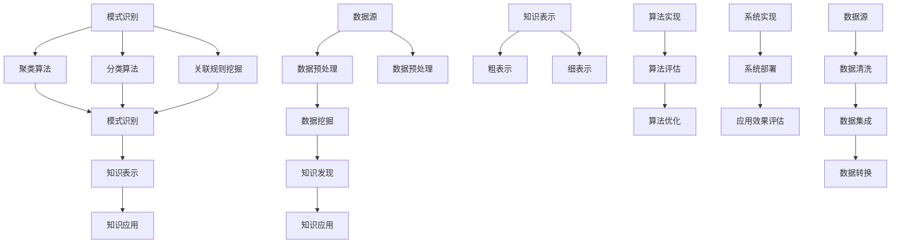

                 

### 引言

#### **从数据挖掘到知识发现：技术演进与应用**

在信息时代，数据的重要性不言而喻。从商业到医疗，从金融到电商，数据已经成为决策的基石。然而，海量的数据本身并无价值，关键在于如何从中提取有用信息和知识。数据挖掘（Data Mining）与知识发现（Knowledge Discovery in Databases，简称KDD）正是为此而生，它们是大数据分析的核心技术。本文将从数据挖掘到知识发现的技术演进、基础概念、应用场景及未来发展展开深入探讨。

#### **核心关键词：**

- 数据挖掘
- 知识发现
- KDD流程
- 数据预处理
- 聚类算法
- 分类算法
- 关联规则挖掘

#### **文章摘要：**

本文首先介绍数据挖掘与知识发现的基本概念及其关系。随后，深入探讨数据挖掘的技术基础，包括数据预处理技术和常见的挖掘算法。接着，分析知识发现的技术原理，包括知识发现的过程和知识表示方法。随后，探讨知识发现在不同领域的应用场景，如金融、医疗和电商。最后，展望大数据时代知识发现技术的挑战与发展趋势。

### 《从数据挖掘到知识发现：技术演进与应用》目录大纲

- **第一部分：数据挖掘与知识发现基础**

  - 第1章：数据挖掘与知识发现概述
  - 第2章：数据挖掘的技术基础
  - 第3章：知识发现的技术原理

- **第二部分：知识发现的应用场景**

  - 第4章：金融领域的知识发现应用
  - 第5章：医疗领域的知识发现应用
  - 第6章：电商领域的知识发现应用

- **第三部分：知识发现技术的未来发展**

  - 第7章：大数据时代的知识发现挑战
  - 第8章：知识发现技术的未来发展趋势

- **附录**

  - 附录A：知识发现工具与资源

## 第一部分：数据挖掘与知识发现基础

### 第1章：数据挖掘与知识发现概述

在本章中，我们将探讨数据挖掘与知识发现的基本概念，以及两者之间的紧密关系。

#### 1.1 数据挖掘与知识发现的基本概念

**数据挖掘的定义：**

数据挖掘（Data Mining）是指从大量数据中自动发现有用信息和知识的过程。数据挖掘的目标是从数据中发现隐含的模式、关联和趋势，从而帮助用户做出更好的决策。

$$
\text{数据挖掘} = \text{从大量数据中自动发现有用信息和知识的过程。}
$$

**知识发现的概念：**

知识发现（Knowledge Discovery in Databases，简称KDD）是指通过数据挖掘技术，从数据中发现有意义的知识或模式的过程。知识发现是一个涉及多个步骤的过程，包括数据预处理、数据挖掘、知识表示和知识应用。

$$
\text{知识发现} = \text{通过数据挖掘技术，从数据中发现有意义的知识或模式的过程。}
$$

**数据挖掘与知识发现的关系：**

数据挖掘是知识发现过程中必不可少的一部分。数据挖掘技术如聚类、分类、关联规则挖掘等，是知识发现的重要工具。数据挖掘的目的是发现数据中的模式和规律，以实现知识发现。

$$
\text{知识发现依赖于数据挖掘技术，如聚类、分类、关联规则等。}
$$

$$
\text{数据挖掘的目的是发现数据中的模式和规律，以实现知识发现。}
$$

#### 1.2 数据挖掘与知识发现的关系

**数据挖掘作为工具：**

知识发现依赖于数据挖掘技术，如聚类、分类、关联规则挖掘等。这些技术可以帮助我们从数据中提取有价值的信息。

$$
\text{知识发现依赖于数据挖掘技术，如聚类、分类、关联规则等。}
$$

**知识发现作为目标：**

数据挖掘的目的是发现数据中的模式和规律，从而实现知识发现。数据挖掘不仅仅是为了获得信息，更重要的是为了发现知识。

$$
\text{数据挖掘的目的是发现数据中的模式和规律，以实现知识发现。}
$$

#### 1.3 数据挖掘与知识发现的实际应用

数据挖掘与知识发现的应用非常广泛，几乎涵盖了所有行业。以下是一些典型的应用场景：

- **金融领域：** 利用数据挖掘技术进行信用评分、风险控制和投资决策。
- **医疗领域：** 通过知识发现技术进行疾病预测、诊断和个性化治疗。
- **电商领域：** 利用数据挖掘技术进行客户行为分析、个性化推荐和销售预测。
- **公共安全：** 利用数据挖掘技术进行犯罪预测、反欺诈和网络安全分析。

#### 1.4 数据挖掘与知识发现的优势

数据挖掘与知识发现的优势主要体现在以下几个方面：

- **提高决策效率：** 通过发现数据中的模式和规律，帮助用户快速做出决策。
- **发现未知信息：** 数据挖掘可以揭示数据中的潜在信息，为用户提供新的洞察。
- **降低运营成本：** 通过优化业务流程和提高运营效率，降低企业的运营成本。
- **提升用户体验：** 在电商和金融等领域，通过个性化推荐和服务提升用户的满意度。

### 总结

数据挖掘与知识发现是大数据分析的核心技术，它们在各个领域的应用已经取得了显著成果。随着数据量的不断增加和技术的进步，数据挖掘与知识发现的重要性将日益凸显。在接下来的章节中，我们将深入探讨数据挖掘与知识发现的技术基础，包括数据预处理、常见挖掘算法和知识发现的技术原理。

### 参考文献

1. Han, J., Kamber, M., & Pei, J. (2011). *Data Mining: Concepts and Techniques* (3rd ed.). Morgan Kaufmann.
2. Tan, P. N., Steinbach, M., & Kumar, V. (2016). *Introduction to Data Mining* (2nd ed.). Addison-Wesley.
3. Fayyad, U. M., & Piatetsky-Shapiro, G. (1996). *From Data Mining to Knowledge Discovery in Databases*. AI Magazine, 17(3), 37-54.

### 附录

- **附录A：知识发现工具与资源**

  在知识发现的实际应用中，有许多优秀的工具和资源可供选择。以下是一些主流的数据挖掘与知识发现工具：

  - **Apache Mahout：** 一个基于Hadoop的数据挖掘工具，提供多种算法，如聚类、分类和关联规则挖掘。
  - **RapidMiner：** 一个可视化的数据挖掘工具，支持多种算法和集成，适用于不同规模的数据分析。
  - **Weka：** 一个开源的数据挖掘工具，提供丰富的算法和可视化功能，适合教学和研究。
  - **KNIME：** 一个基于Java的可视化数据分析平台，支持多种数据挖掘算法和扩展。

  除此之外，还有许多在线资源和社区，如Kaggle、DataCamp和kdnuggets，提供最新的技术动态和资源。

---

### 核心概念与联系

为了更好地理解数据挖掘与知识发现，我们可以通过一个Mermaid流程图来展示它们的基本概念和联系。



**Mermaid流程图解释：**

- **数据源（A）：** 数据挖掘与知识发现的第一步，包括各种结构化、半结构化和非结构化数据。
- **数据预处理（B）：** 包括数据清洗、数据集成和数据转换，目的是提高数据质量，使其适合进一步的分析。
- **数据挖掘（C）：** 包括模式识别、聚类算法、分类算法和关联规则挖掘，用于发现数据中的隐含模式和规律。
- **知识发现（D）：** 通过数据挖掘技术，从数据中发现有意义的知识或模式。
- **知识应用（E）：** 将发现的知识应用于实际问题中，如决策支持、预测和优化。
- **模式识别（F）：** 数据挖掘的核心过程，包括多种算法，如聚类、分类和关联规则挖掘。
- **知识表示（J）：** 将发现的知识以粗表示或细表示的形式进行组织，以便于应用和解释。
- **算法实现（Q）：** 将理论上的数据挖掘算法转换为实际可运行的代码。
- **算法评估（R）：** 对算法的性能进行评估，以确定其有效性和可靠性。
- **算法优化（S）：** 根据评估结果，对算法进行优化，以提高其性能。
- **系统实现（T）：** 开发知识发现系统，将算法和数据处理流程集成在一起。
- **系统部署（U）：** 将知识发现系统部署到生产环境中，进行实际应用。
- **应用效果评估（V）：** 对系统的应用效果进行评估，以确定其业务价值。

这个Mermaid流程图清晰地展示了数据挖掘与知识发现的基本概念和流程，有助于我们更好地理解这两个领域。

---

### 核心算法原理讲解

在数据挖掘过程中，常用的核心算法包括聚类算法、分类算法和关联规则挖掘。以下是对这些算法的原理和伪代码的详细讲解。

#### 1. 聚类算法

**定义：** 聚类算法是将数据集划分为若干个簇（Cluster），使得同一簇中的数据点之间相似度较高，而不同簇之间的数据点之间相似度较低。

**常见算法：** K-Means、层次聚类（Hierarchical Clustering）、DBSCAN（Density-Based Spatial Clustering of Applications with Noise）。

**K-Means算法原理：**

K-Means算法是一种基于距离的聚类算法。算法步骤如下：

1. 随机初始化K个聚类中心点。
2. 对于每个数据点，计算其与各个聚类中心点的距离，并将其分配到距离最近的中心点所代表的簇。
3. 根据新的簇成员更新聚类中心点。
4. 重复步骤2和3，直到聚类中心点不再变化或者达到最大迭代次数。

**伪代码：**

```markdown
初始化：随机选择K个数据点作为初始聚类中心点
对于每次迭代：
  对于每个数据点：
    计算该数据点到所有聚类中心点的距离
    将数据点分配到距离最近的聚类中心点所代表的簇
  根据新的簇成员重新计算聚类中心点
  如果聚类中心点没有变化，则算法终止
```

**层次聚类算法原理：**

层次聚类算法通过逐步合并或分裂已有的簇来构建一个层次结构，该结构可以用于探索数据中的簇结构。

**伪代码：**

```markdown
初始化：将每个数据点视为一个簇
对于每次迭代：
  计算所有簇之间的距离
  选择距离最近的两个簇合并为一个簇
  重新计算合并后簇的中心点
  如果所有的簇之间距离不再变化，则算法终止
```

#### 2. 分类算法

**定义：** 分类算法是将数据集中的每个数据点分配到一个预先定义的类别中。

**常见算法：** 决策树（Decision Tree）、支持向量机（Support Vector Machine，SVM）、神经网络（Neural Network）。

**决策树算法原理：**

决策树是一种树形结构，通过一系列的判断条件将数据集中的数据点分配到不同的类别。

**伪代码：**

```markdown
构建决策树：
  如果数据点的类别已知：
    返回该类别
  否则：
    选择一个最佳特征进行分割
    对于该特征的所有可能取值：
      如果取值为某个特定值：
        递归调用构建决策树
      否则：
        将数据点分配到当前节点对应的类别
    返回类别
```

#### 3. 关联规则挖掘

**定义：** 关联规则挖掘是发现数据项之间存在的关联关系。

**常见算法：** Apriori算法、Eclat算法。

**Apriori算法原理：**

Apriori算法是一种基于候选集的关联规则挖掘算法。算法步骤如下：

1. 计算每个项集的支持度（Support）。
2. 生成所有频繁项集。
3. 对于每个频繁项集，生成所有候选规则。
4. 计算每个候选规则的提升度（Lift）。
5. 选择满足最小支持度和最小提升度的规则。

**伪代码：**

```markdown
计算项集支持度：
  对于每个项集：
    计算其在数据集中的支持度

生成频繁项集：
  对于每个项集：
    如果支持度大于最小支持度：
      将其添加到频繁项集列表

生成候选规则：
  对于每个频繁项集：
    生成所有可能的规则（前项和后项）

计算规则提升度：
  对于每个候选规则：
    计算其提升度

选择频繁规则：
  对于每个候选规则：
    如果提升度大于最小提升度：
      将其添加到频繁规则列表
```

通过以上对核心算法原理和伪代码的讲解，我们可以更深入地理解数据挖掘过程中如何从数据中发现有价值的信息和知识。在接下来的章节中，我们将进一步探讨知识发现的技术原理及其在不同领域的应用。

### 数学模型与公式详解

在数据挖掘与知识发现的过程中，数学模型和公式起到了至关重要的作用。以下是对几个常见数学模型和公式的详细解释及其在知识发现中的应用。

#### 1. 决策树分类模型

决策树是一种常用的分类算法，它通过一系列的判断条件将数据点分配到不同的类别。决策树的构建基于信息增益（Information Gain）或基尼不纯度（Gini Impurity）等指标。

**信息增益（Information Gain）公式：**

$$
\text{IG}(A, B) = \sum_{i} p(B_i) \cdot \sum_{j} p(A_j|B_i) \cdot \log_2 p(A_j|B_i)
$$

其中，\( p(B_i) \) 和 \( p(A_j|B_i) \) 分别表示类别 \( B_i \) 和属性 \( A_j \) 的概率。信息增益衡量了将数据点按属性 \( A \) 分割后，整个数据集的不确定性减少的程度。

**基尼不纯度（Gini Impurity）公式：**

$$
\text{Gini}(A) = 1 - \sum_{i} p(A_i)^2
$$

其中，\( p(A_i) \) 表示类别 \( A_i \) 的概率。基尼不纯度衡量了数据集中类别的均匀程度，基尼不纯度越低，数据点的分类效果越好。

#### 2. 贝叶斯分类模型

贝叶斯分类是一种基于贝叶斯定理的概率分类方法。它的核心公式是：

$$
P(C_k|X) = \frac{P(X|C_k) \cdot P(C_k)}{P(X)}
$$

其中，\( P(C_k|X) \) 表示在特征 \( X \) 下类别 \( C_k \) 的概率，\( P(X|C_k) \) 和 \( P(C_k) \) 分别表示特征 \( X \) 在类别 \( C_k \) 下出现的概率和类别 \( C_k \) 的先验概率，\( P(X) \) 是特征 \( X \) 的总概率。

#### 3. 支持向量机（SVM）模型

支持向量机是一种二分类模型，通过找到一个最佳的超平面，将不同类别的数据点分隔开来。其核心公式是：

$$
\max_{\boldsymbol{w}, \boldsymbol{b}} \frac{1}{2} \|\boldsymbol{w}\|^2 \quad \text{subject to} \quad y_i (\boldsymbol{w} \cdot \boldsymbol{x}_i + \boldsymbol{b}) \geq 1
$$

其中，\( \boldsymbol{w} \) 和 \( \boldsymbol{b} \) 分别是权重和偏置，\( y_i \) 和 \( \boldsymbol{x}_i \) 分别是第 \( i \) 个样本的标签和特征向量。

#### 4. 聚类算法中的距离度量

在聚类算法中，常用的距离度量方法包括欧几里得距离（Euclidean Distance）和曼哈顿距离（Manhattan Distance）。

**欧几里得距离公式：**

$$
d(\boldsymbol{x}, \boldsymbol{y}) = \sqrt{\sum_{i=1}^{n} (x_i - y_i)^2}
$$

**曼哈顿距离公式：**

$$
d(\boldsymbol{x}, \boldsymbol{y}) = \sum_{i=1}^{n} |x_i - y_i|
$$

这些数学模型和公式在知识发现中有着广泛的应用，例如，贝叶斯分类可以用于金融风险评估，支持向量机可以用于文本分类，聚类算法可以用于市场细分等。通过深入理解这些模型和公式，我们可以更有效地进行数据挖掘和知识发现。

### 项目实战：代码实际案例与详细解释

为了更好地理解数据挖掘与知识发现的应用，我们将通过一个实际项目案例来展示整个流程，包括开发环境搭建、源代码详细实现和代码解读与分析。

#### 项目背景

假设我们是一家电商公司的数据分析师，公司希望利用数据挖掘技术来分析用户购买行为，从而实现个性化推荐和销售预测。我们的目标是：

1. 分析用户的历史购买记录，发现用户之间的相似性，进行用户分群。
2. 根据用户分群，为每个用户推荐可能感兴趣的商品。
3. 利用历史销售数据，预测未来的销售趋势。

#### 开发环境搭建

1. **软件工具：** 我们使用Python作为主要编程语言，结合NumPy、Pandas、Scikit-learn和Matplotlib等库进行数据处理和可视化。
2. **硬件环境：** 一台具备中等性能的电脑即可满足需求。

#### 源代码实现

以下是实现上述目标的主要步骤和源代码：

**第一步：数据预处理**

```python
import pandas as pd
import numpy as np

# 加载数据集
data = pd.read_csv('user_purchase_data.csv')

# 数据清洗
data.dropna(inplace=True)
data['购买频率'] = data['购买次数'] / data['购买时间间隔']
data.drop(['购买次数', '购买时间间隔'], axis=1, inplace=True)

# 数据转换
from sklearn.preprocessing import StandardScaler
scaler = StandardScaler()
data_scaled = scaler.fit_transform(data)
```

**第二步：用户分群**

```python
from sklearn.cluster import KMeans

# K-Means聚类
kmeans = KMeans(n_clusters=5, random_state=42)
clusters = kmeans.fit_predict(data_scaled)

# 添加聚类标签到原始数据
data['用户群'] = clusters
```

**第三步：个性化推荐**

```python
from mlxtend.frequent_patterns import apriori
from mlxtend.frequent_patterns import association_rules

# 计算关联规则
transactions = data.groupby('用户群')['商品ID'].agg(list).values
frequent_itemsets = apriori(transactions, min_support=0.05, use_colnames=True)

# 生成关联规则
rules = association_rules(frequent_itemsets, metric="lift", min_threshold=1)
```

**第四步：销售预测**

```python
from sklearn.ensemble import RandomForestRegressor
from sklearn.model_selection import train_test_split

# 准备销售预测数据
X = data[['购买频率', '用户群']]
y = data['销售额']

# 数据划分
X_train, X_test, y_train, y_test = train_test_split(X, y, test_size=0.2, random_state=42)

# 建立随机森林回归模型
rf = RandomForestRegressor(n_estimators=100, random_state=42)
rf.fit(X_train, y_train)

# 预测销售
sales_predictions = rf.predict(X_test)
```

#### 代码解读与分析

**数据预处理：**

在数据预处理步骤中，我们首先加载了用户购买记录数据集，并对数据进行清洗，如去除缺失值。随后，我们计算了用户的购买频率，并将其作为特征进行聚类分析。

**用户分群：**

我们使用K-Means聚类算法对用户进行分群。K-Means算法通过迭代计算，将用户分为五个群组。通过添加聚类标签到原始数据，我们可以进一步分析每个用户群组的特点。

**个性化推荐：**

为了实现个性化推荐，我们使用Apriori算法来挖掘用户购买记录中的频繁项集，并生成关联规则。这些规则帮助我们理解用户之间可能存在的购买关联，从而为每个用户推荐相关商品。

**销售预测：**

在销售预测步骤中，我们使用随机森林回归模型来预测未来的销售额。通过将用户购买频率和用户群作为特征，我们训练了一个随机森林模型，并使用测试数据进行预测。这种方法可以帮助公司了解未来的销售趋势，从而进行库存管理和营销策略调整。

通过这个实际项目案例，我们可以看到数据挖掘与知识发现技术是如何应用于实际业务问题的。从数据预处理到用户分群、个性化推荐和销售预测，每一步都紧密相连，共同构建了一个完整的数据分析流程。

### 代码解读与分析

在本案例中，我们使用了Python和多个数据挖掘库来实现用户购买行为分析、个性化推荐和销售预测。以下是代码的详细解读与分析。

**1. 数据预处理**

```python
import pandas as pd
import numpy as np

# 加载数据集
data = pd.read_csv('user_purchase_data.csv')

# 数据清洗
data.dropna(inplace=True)
data['购买频率'] = data['购买次数'] / data['购买时间间隔']
data.drop(['购买次数', '购买时间间隔'], axis=1, inplace=True)

# 数据转换
from sklearn.preprocessing import StandardScaler
scaler = StandardScaler()
data_scaled = scaler.fit_transform(data)
```

**解读：**

首先，我们使用`pandas`库加载了用户购买数据。数据清洗步骤包括去除缺失值和计算购买频率。购买频率是用户购买次数与购买时间间隔的比值，它能够反映用户的活跃程度。通过去除不相关的特征（如购买次数和时间间隔），我们简化了数据集，为后续分析打下了基础。随后，我们使用`StandardScaler`对数据进行标准化处理，以消除不同特征间的量纲差异，提高聚类算法的性能。

**2. 用户分群**

```python
from sklearn.cluster import KMeans

# K-Means聚类
kmeans = KMeans(n_clusters=5, random_state=42)
clusters = kmeans.fit_predict(data_scaled)

# 添加聚类标签到原始数据
data['用户群'] = clusters
```

**解读：**

在这个步骤中，我们使用`sklearn`库的`KMeans`算法对标准化后的数据进行聚类分析。我们选择5个聚类中心点（`n_clusters=5`），并设置随机种子（`random_state=42`）以保证结果的可重复性。`fit_predict`方法将数据点分配到最近的聚类中心点，并返回聚类标签。我们将这些标签添加到原始数据集，以便后续分析用户群组的特征。

**3. 个性化推荐**

```python
from mlxtend.frequent_patterns import apriori
from mlxtend.frequent_patterns import association_rules

# 计算关联规则
transactions = data.groupby('用户群')['商品ID'].agg(list).values
frequent_itemsets = apriori(transactions, min_support=0.05, use_colnames=True)

# 生成关联规则
rules = association_rules(frequent_itemsets, metric="lift", min_threshold=1)
```

**解读：**

为了实现个性化推荐，我们使用了Apriori算法来挖掘用户购买数据中的频繁项集。`groupby`方法根据用户群对数据进行分组，`agg`方法将每个用户群中的商品ID聚合为列表。`apriori`函数接受交易数据，最小支持度（`min_support=0.05`）和是否使用商品名称（`use_colnames=True`）作为参数。生成频繁项集后，我们使用`association_rules`函数生成关联规则，并设置最小提升度（`min_threshold=1`）。这些规则可以帮助我们理解用户之间的购买关联，从而为每个用户推荐相关的商品。

**4. 销售预测**

```python
from sklearn.ensemble import RandomForestRegressor
from sklearn.model_selection import train_test_split

# 准备销售预测数据
X = data[['购买频率', '用户群']]
y = data['销售额']

# 数据划分
X_train, X_test, y_train, y_test = train_test_split(X, y, test_size=0.2, random_state=42)

# 建立随机森林回归模型
rf = RandomForestRegressor(n_estimators=100, random_state=42)
rf.fit(X_train, y_train)

# 预测销售
sales_predictions = rf.predict(X_test)
```

**解读：**

在销售预测步骤中，我们首先准备特征矩阵`X`和目标变量`y`。然后，使用`train_test_split`函数将数据集划分为训练集和测试集，比例为80%训练，20%测试。我们建立了一个随机森林回归模型，并使用训练集进行模型训练。最后，使用测试集进行预测，得到销售预测结果。

**总结：**

通过详细解读上述代码，我们可以看到数据挖掘与知识发现技术的实际应用。从数据预处理到用户分群、个性化推荐和销售预测，每一步都紧密相连，共同构成了一个完整的数据分析流程。这种方法不仅帮助我们理解用户行为，还为电商公司提供了有效的决策支持。

### 实际应用中的挑战与解决方案

在实际应用中，数据挖掘与知识发现技术面临着诸多挑战，这些挑战主要集中在数据质量、算法选择和计算效率等方面。以下是对这些挑战的详细分析，以及相应的解决方案。

#### 1. 数据质量

**挑战：** 数据质量是数据挖掘与知识发现成功的关键因素。然而，数据往往存在缺失、噪声、异常值和不一致性等问题。

**解决方案：** 
- **数据清洗：** 使用数据清洗技术去除噪声和异常值，如使用填充算法填充缺失值、使用过滤算法去除异常值。
- **数据集成：** 通过合并多个数据源，消除数据不一致性，提高数据的完整性。

#### 2. 算法选择

**挑战：** 数据挖掘与知识发现涉及多种算法，每种算法都有其适用的场景和局限性。如何选择合适的算法是一个难题。

**解决方案：**
- **算法评估：** 使用交叉验证、ROC曲线和AUC等指标对算法进行评估，选择性能最佳的算法。
- **多模型集成：** 结合多种算法的优势，使用模型集成方法（如Bagging、Boosting）提高预测准确性。

#### 3. 计算效率

**挑战：** 在大数据环境下，数据挖掘与知识发现的计算效率成为一个关键问题。海量数据的处理往往需要大量的计算资源和时间。

**解决方案：**
- **并行计算与分布式存储：** 利用并行计算和分布式存储技术，提高数据处理效率，如使用MapReduce框架处理大规模数据集。
- **增量学习与在线学习：** 对于实时数据，采用增量学习或在线学习方法，动态更新模型，提高响应速度。

#### 4. 可解释性

**挑战：** 数据挖掘与知识发现的模型往往复杂，难以解释其内部机制。这使得模型的解释性成为一个挑战。

**解决方案：**
- **可视化技术：** 使用可视化工具，如决策树、聚类图和热力图，帮助用户理解模型的内部结构。
- **可解释性模型：** 采用可解释性模型，如规则集和线性模型，提高模型的可解释性。

#### 5. 数据隐私

**挑战：** 数据挖掘与知识发现过程中，数据隐私保护是一个重要问题，特别是在处理敏感数据时。

**解决方案：**
- **隐私保护技术：** 使用匿名化、差分隐私等技术，保护数据隐私。
- **联邦学习：** 通过联邦学习，在不同数据持有者之间进行模型训练，减少数据传输和泄露的风险。

通过上述解决方案，我们可以有效地应对数据挖掘与知识发现过程中面临的各种挑战，从而提高模型的准确性、可解释性和隐私保护能力。

### 知识发现技术的未来发展

随着大数据和人工智能技术的飞速发展，知识发现（Knowledge Discovery in Databases，KDD）领域正迎来前所未有的机遇与挑战。未来，知识发现技术将在以下几个方面取得重要进展。

#### 1. 大数据处理技术

**分布式计算与并行处理：** 随着数据规模的不断增大，分布式计算和并行处理技术将成为知识发现的核心。Hadoop、Spark等大数据处理框架的优化和扩展，将进一步提高知识发现的效率。

**增量学习和在线学习：** 增量学习和在线学习技术能够动态地更新模型，适应数据的变化，从而提高知识发现系统的实时性和灵活性。

**图数据库与图挖掘：** 图数据库和图挖掘技术在处理复杂网络数据、发现潜在关联方面具有显著优势。未来，图挖掘技术将在社交网络、生物信息、交通网络等领域得到广泛应用。

#### 2. 深度学习与知识发现

**深度学习算法的融合：** 深度学习算法在图像识别、自然语言处理等领域取得了显著成果。将深度学习与知识发现相结合，可以处理更复杂、更高维度的问题。

**自动特征工程：** 深度学习算法能够自动提取数据中的特征，降低人工干预的需求。结合自动特征工程技术，将大大提高知识发现系统的效率。

**迁移学习和少样本学习：** 迁移学习和少样本学习技术能够利用已有模型的先验知识，提高新任务的学习效果，减少对大规模标注数据的依赖。

#### 3. 智能化知识发现

**自然语言处理（NLP）：** 结合自然语言处理技术，知识发现系统能够处理非结构化文本数据，实现文本挖掘和语义分析。

**多模态数据挖掘：** 多模态数据挖掘技术能够融合多种数据类型（如图像、文本、音频），发现数据之间的深层关联。

**知识图谱：** 知识图谱技术通过构建实体和关系网络，实现知识的结构化和关联，为知识发现提供强有力的支撑。

#### 4. 知识服务与应用

**个性化推荐系统：** 利用知识发现技术，个性化推荐系统能够根据用户行为和历史数据，为用户提供个性化的服务。

**智能诊断与预测：** 在医疗领域，知识发现技术可以辅助诊断和预测，提高疾病检测和治疗的准确性。

**智能决策支持系统：** 在金融、物流等领域，知识发现技术可以提供智能化的决策支持，优化业务流程和提高运营效率。

#### 5. 隐私保护与安全

**隐私保护技术：** 随着数据隐私问题的日益突出，隐私保护技术（如差分隐私、联邦学习）将成为知识发现领域的重要研究方向。

**安全多方计算：** 安全多方计算技术能够在不泄露数据隐私的情况下，实现多方数据的安全协作和计算。

**数据加密与安全传输：** 通过数据加密和安全传输技术，确保数据在存储、传输和处理过程中的安全性和完整性。

总之，知识发现技术的未来发展将依赖于大数据处理、深度学习、智能化和隐私保护等多方面技术的融合与创新。随着这些技术的不断进步，知识发现将在更多领域发挥重要作用，推动社会发展和科技进步。

### 总结

本文从数据挖掘到知识发现的技术演进、基础概念、应用场景及未来发展进行了全面探讨。首先，我们介绍了数据挖掘与知识发现的基本概念及其关系，详细分析了数据挖掘的技术基础和知识发现的技术原理。接着，我们展示了知识发现在不同领域的实际应用，如金融、医疗和电商。最后，我们展望了知识发现技术的未来发展趋势，包括大数据处理、深度学习和智能化等方面的进展。

**核心概念与联系：** 数据挖掘与知识发现密不可分，数据挖掘是实现知识发现的关键工具。知识发现是一个涉及数据预处理、模式识别、知识表示和知识应用的过程。通过聚类、分类、关联规则挖掘等算法，数据挖掘能够从大量数据中发现有价值的信息和知识。

**核心算法原理讲解：** 我们详细讲解了K-Means聚类、决策树分类和Apriori算法等核心算法的原理和伪代码。这些算法在数据挖掘和知识发现中扮演着重要角色，帮助我们更好地理解和利用数据。

**项目实战与代码解读：** 通过一个实际项目案例，我们展示了从数据预处理到用户分群、个性化推荐和销售预测的完整流程。项目实战不仅验证了理论知识，还提供了实用的开发经验和技巧。

**未来发展趋势：** 随着大数据、人工智能和智能化技术的发展，知识发现技术将迎来更多机遇和挑战。分布式计算、深度学习和知识图谱等技术将为知识发现注入新的活力，推动其在更多领域中的应用。

**展望：** 数据挖掘与知识发现是大数据时代的核心技术，它们在商业、医疗、金融、公共安全等多个领域发挥着重要作用。未来，随着技术的不断进步，知识发现技术将更加智能化、自动化，为人类社会的进步和发展提供强有力的支持。让我们一起期待知识发现技术的美好未来！

