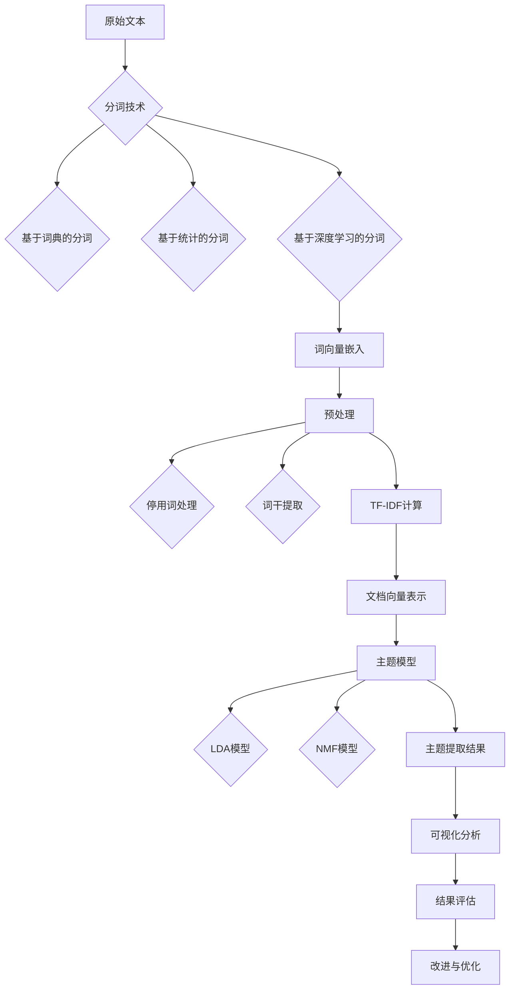

                 

### 引言

文本主题提取是自然语言处理（NLP）领域的一项重要技术，它通过对大规模文本数据的分析，识别出文本所涉及的主要主题或概念。在信息检索、文本分类、推荐系统以及知识图谱构建等多个应用场景中，文本主题提取发挥着至关重要的作用。有效的文本主题提取不仅能提高文本分析的精度和效率，还能帮助我们更好地理解和利用文本数据中的隐含信息。

本文旨在为读者提供一份全面的文本主题提取指南，重点介绍基于TF-IDF（Term Frequency-Inverse Document Frequency）算法的文本主题提取方法。通过本文，读者将了解到：

1. **文本主题提取的基本概念与目的**：了解文本主题提取的定义、目的及其应用场景。
2. **TF-IDF算法原理详解**：深入解析TF-IDF算法的数学基础、实现步骤及其优缺点。
3. **文本预处理技术**：掌握分词、停用词处理和词干提取等预处理技术。
4. **TF-IDF算法应用实例**：通过实际案例展示TF-IDF在文本相似度计算、文本聚类和文本分类中的应用。
5. **文本主题提取案例分析**：结合具体案例，展示文本主题提取的完整流程和效果评估。
6. **TF-IDF算法的改进与拓展**：探讨词嵌入技术和主题模型在文本主题提取中的应用。
7. **文本主题提取技术的未来趋势**：分析文本主题提取技术的挑战与机遇，探讨新兴技术的应用。

通过本文的学习，读者将能够：

- 理解文本主题提取的核心概念和算法原理。
- 掌握文本预处理技术的具体实施方法。
- 学会使用TF-IDF算法进行文本主题提取的实践操作。
- 分析文本主题提取案例，评估其效果和性能。
- 了解文本主题提取技术的最新进展和未来发展方向。

### 目录大纲

**《从零开始大模型开发与微调：文本主题的提取：基于TF-IDF》**

> **关键词：** 文本主题提取、TF-IDF、自然语言处理、文本预处理、分词、停用词处理、词干提取

> **摘要：** 本文系统地介绍了文本主题提取的方法与步骤，重点讨论了基于TF-IDF算法的文本主题提取技术。通过详细的理论解析、实际应用案例和未来发展趋势分析，帮助读者深入理解文本主题提取的核心概念、算法原理和实践方法。

## 第一部分：基础理论

### 第1章：文本主题提取概述

文本主题提取（Text Topic Extraction）是自然语言处理（NLP）领域的一项重要技术，它旨在从大规模文本数据中自动识别出具有代表性的主题或概念。文本主题提取不仅能够帮助我们更好地理解和组织文本数据，还能在信息检索、文本分类、推荐系统、知识图谱构建等多个领域发挥关键作用。

#### 1.1 文本主题提取的定义与目的

文本主题提取是指利用自然语言处理技术，从大量的文本数据中自动识别出代表文本核心意义的主题或概念。具体来说，文本主题提取的目标是：

- **提取代表性主题**：从大量文本中识别出能够代表文本核心意义的主题。
- **降低数据维度**：将大量的文本数据转换为较低维度的主题表示，便于后续处理和分析。
- **提高数据分析效率**：通过提取文本主题，可以快速识别出文本数据中的关键信息，提高数据分析的效率。

文本主题提取的应用场景广泛，主要包括以下几个方面：

1. **信息检索**：文本主题提取可以帮助搜索引擎更准确地理解用户查询意图，从而提高搜索结果的准确性和相关性。
2. **文本分类**：文本主题提取可以用于自动分类文本数据，帮助分类系统更准确地识别文本类别。
3. **推荐系统**：文本主题提取可以帮助推荐系统更好地理解用户和物品的属性，提高推荐效果。
4. **知识图谱构建**：文本主题提取可以帮助从大量文本数据中提取知识，为知识图谱的构建提供基础数据。

#### 1.2 TF-IDF算法的原理

TF-IDF（Term Frequency-Inverse Document Frequency）是一种常用的文本表示方法，它通过计算词频和逆文档频率的乘积来评估一个词在文档中的重要程度。TF-IDF算法的核心思想是：

- **词频（TF）**：衡量一个词在单个文档中出现的频率，即词频。词频越高，表示这个词在文档中的重要性越高。
- **逆文档频率（IDF）**：衡量一个词在整个文档集合中出现的频率，即逆文档频率。逆文档频率越低，表示这个词在整个文档集合中的重要性越高。

TF-IDF算法的具体实现步骤如下：

1. **计算词频（TF）**：
   $$TF(t, d) = \frac{f(t, d)}{N}$$
   其中，$t$ 表示词，$d$ 表示文档，$f(t, d)$ 表示词$t$在文档$d$中出现的次数，$N$ 表示文档$d$中所有词的总数。

2. **计算逆文档频率（IDF）**：
   $$IDF(t) = \log(\frac{N}{n(t)})$$
   其中，$n(t)$ 表示词$t$在整个文档集合中出现的文档数量。

3. **计算TF-IDF值**：
   $$TF-IDF(t, d) = TF(t, d) \times IDF(t)$$

通过TF-IDF算法，每个词都可以被赋予一个加权值，这个值反映了词在文档中的重要程度。在文本主题提取中，TF-IDF算法常用于计算文档的主题得分，从而识别出文本的主题。

#### 1.3 文本主题提取的应用场景

文本主题提取在多个应用场景中具有广泛的应用价值，以下是一些典型的应用场景：

1. **新闻分类**：通过文本主题提取，可以将大量新闻文本自动分类到相应的主题类别中，提高新闻推荐和检索的准确性。
2. **社交媒体分析**：通过文本主题提取，可以分析社交媒体中的用户评论和讨论，识别出用户关注的主题和热点话题。
3. **市场调研**：文本主题提取可以帮助企业从大量市场调研报告中提取关键信息，分析市场趋势和消费者需求。
4. **文本聚类**：通过文本主题提取，可以将大量文本数据聚类到不同的主题类别中，便于数据分析和挖掘。
5. **知识图谱构建**：文本主题提取可以帮助从大量文本数据中提取主题和概念，为知识图谱的构建提供基础数据。

文本主题提取是一种重要的文本分析技术，通过有效地识别文本中的主题或概念，可以为多种应用场景提供有力支持。本文接下来将详细介绍TF-IDF算法的原理及其在文本主题提取中的应用，帮助读者深入理解这一关键技术。

### 第2章：TF-IDF算法原理详解

TF-IDF（Term Frequency-Inverse Document Frequency）算法是文本主题提取中的核心算法之一，它通过计算词频（TF）和逆文档频率（IDF）来衡量一个词在文档中的重要程度。本节将深入解析TF-IDF算法的数学基础、实现步骤及其优缺点。

#### 2.1 TF-IDF算法的数学基础

TF-IDF算法的数学基础主要包括词频（TF）和逆文档频率（IDF）的计算公式。

1. **词频（TF）**：
   词频（TF）是指一个词在单个文档中出现的频率，用于衡量这个词在文档中的重要性。词频的计算公式如下：
   $$TF(t, d) = \frac{f(t, d)}{N}$$
   其中，$t$ 表示词，$d$ 表示文档，$f(t, d)$ 表示词$t$在文档$d$中出现的次数，$N$ 表示文档$d$中所有词的总数。

2. **逆文档频率（IDF）**：
   逆文档频率（IDF）是指一个词在整个文档集合中出现的频率，用于衡量这个词在文档集合中的普遍性。逆文档频率的计算公式如下：
   $$IDF(t) = \log(\frac{N}{n(t)})$$
   其中，$n(t)$ 表示词$t$在整个文档集合中出现的文档数量。

3. **TF-IDF值**：
   TF-IDF值是指一个词在文档中的重要性得分，它是词频（TF）和逆文档频率（IDF）的乘积。TF-IDF值的计算公式如下：
   $$TF-IDF(t, d) = TF(t, d) \times IDF(t)$$

#### 2.2 TF-IDF算法的实现步骤

TF-IDF算法的实现步骤主要包括以下三个步骤：

1. **计算词频（TF）**：
   对于每个文档$d$，统计文档中每个词$t$的出现次数$f(t, d)$，然后计算词频：
   $$TF(t, d) = \frac{f(t, d)}{N}$$
   其中，$N$ 是文档$d$中所有词的总数。

2. **计算逆文档频率（IDF）**：
   对于文档集合中的每个词$t$，计算其逆文档频率：
   $$IDF(t) = \log(\frac{N}{n(t)})$$
   其中，$N$ 是文档集合中的总文档数，$n(t)$ 是词$t$在文档集合中出现的文档数量。

3. **计算TF-IDF值**：
   对于每个词$t$在文档$d$中的TF-IDF值，计算其TF-IDF得分：
   $$TF-IDF(t, d) = TF(t, d) \times IDF(t)$$

通过以上三个步骤，我们可以得到每个词在文档中的TF-IDF值，从而衡量其在文档中的重要程度。

#### 2.3 TF-IDF算法的优缺点分析

TF-IDF算法作为一种常用的文本表示方法，具有以下优点和缺点：

1. **优点**：

- **简单有效**：TF-IDF算法实现简单，计算速度快，适合大规模文本数据处理。
- **重要性度量**：通过TF-IDF值，可以有效地衡量词在文档中的重要程度，有助于文本主题提取和文本分析。
- **广泛应用**：TF-IDF算法在信息检索、文本分类、推荐系统等领域具有广泛应用，可以显著提高文本分析的效果。

2. **缺点**：

- **忽略词序**：TF-IDF算法只关注词频和逆文档频率，忽略了词的顺序和语义关系，可能导致某些重要信息被忽略。
- **数据稀疏**：在大型文档集合中，词的分布往往较为稀疏，导致TF-IDF值计算不准确，影响文本主题提取的准确性。
- **对常见词的过度依赖**：TF-IDF算法对常见词的依赖较强，可能导致高频词的权重过高，影响主题提取的效果。

尽管存在一定的局限性，TF-IDF算法作为一种基础的文本表示方法，依然在文本主题提取和文本分析中发挥着重要作用。在实际应用中，可以通过结合其他算法和模型，进一步改进和优化TF-IDF算法的性能。

通过本节对TF-IDF算法原理的详细解析，读者可以深入理解其数学基础、实现步骤及其优缺点。接下来，我们将进一步探讨文本预处理技术，为后续的TF-IDF算法应用打下坚实基础。

### 第3章：文本预处理

在进行文本主题提取之前，文本预处理是必不可少的步骤。文本预处理的质量直接影响后续主题提取的准确性和效果。本节将介绍文本预处理的主要技术，包括分词、停用词处理和词干提取等。

#### 3.1 分词技术

分词是将一段连续的文本划分为一组具有独立意义的词语的过程。分词技术的质量直接关系到文本的处理效果。常见的分词技术包括以下几种：

1. **基于词典的分词**：
   基于词典的分词方法通过匹配词典中的词库来实现分词。这种方法适用于有明确词库的文本，如中文、英文等。常见的工具包括jieba（中文）和NLTK（英文）。

   伪代码示例：
   ```
   function tokenize_document(document, dictionary):
       token_list = []
       for word in document:
           if word in dictionary:
               token_list.append(word)
       return token_list
   ```

2. **基于统计的分词**：
   基于统计的分词方法通过计算词语之间的关联性来实现分词。这种方法适用于没有明确词库的文本，如自然语言文本。常见的工具包括nltk（英文）和jieba（中文）。

   伪代码示例：
   ```
   function tokenize_document(document):
       token_list = []
       for word in document:
           if word_appears_frequently(word):
               token_list.append(word)
       return token_list
   ```

3. **基于深度学习的分词**：
   基于深度学习的分词方法利用神经网络模型来学习文本的分词规则。这种方法具有较高的分词准确率，适用于多种语言的文本处理。常见的工具包括Bert（英文）和GPT（中文）。

   伪代码示例：
   ```
   function tokenize_document(document):
       model = load_pretrained_model()
       token_list = model.tokenize(document)
       return token_list
   ```

#### 3.2 停用词处理

停用词是指那些对文本主题提取没有实际贡献的常用词汇，如“的”、“和”、“是”等。在文本预处理过程中，去除停用词可以减少噪声信息，提高主题提取的准确性。

1. **停用词表的作用**：
   停用词表是存储常用停用词的列表。通过对比文本中的词和停用词表，可以快速识别和去除停用词。

2. **常见的停用词表**：
   常见的停用词表包括英文停用词表和中文停用词表。英文停用词表通常包含约500个常见词汇，如“a”、“the”、“is”等；中文停用词表通常包含约2000个常见词汇，如“的”、“和”、“是”等。

3. **停用词处理的技巧**：
   在去除停用词时，需要注意以下技巧：

   - **动态调整停用词表**：根据具体应用场景和文本数据的特点，可以动态调整停用词表，去除对主题提取有实际贡献的词汇。
   - **分层次处理**：可以先去除高频停用词，再逐步去除低频停用词，以避免过多地去除对主题提取有贡献的词汇。

   伪代码示例：
   ```
   function remove_stopwords(document, stopwords):
       cleaned_document = []
       for word in document:
           if word not in stopwords:
               cleaned_document.append(word)
       return cleaned_document
   ```

#### 3.3 词干提取

词干提取是将单词缩减到其词干形式的过程，有助于减少词汇的维度，提高主题提取的效率。常见的词干提取算法包括：

1. **前缀算法**：
   前缀算法通过删除单词的前缀来提取词干。这种方法简单有效，但可能丢失一些词义信息。

   伪代码示例：
   ```
   function extract_stem(word, prefixes):
       for prefix in prefixes:
           if word.startswith(prefix):
               word = word[len(prefix):]
       return word
   ```

2. **后缀算法**：
   后缀算法通过删除单词的后缀来提取词干。这种方法也简单有效，但可能丢失一些词义信息。

   伪代码示例：
   ```
   function extract_stem(word, suffixes):
       for suffix in suffixes:
           if word.endswith(suffix):
               word = word[:len(word)-len(suffix)]
       return word
   ```

3. **Porter算法**：
   Porter算法是一种基于规则的方法，通过多个步骤逐步缩减单词到词干形式。这种方法具有较强的适应性，但可能存在一定误判。

   伪代码示例：
   ```
   function extract_stem(word):
       stem = word
       stem = remove_prefixes(stem)
       stem = remove_suffixes(stem)
       return stem
   ```

通过以上文本预处理技术，可以有效地减少文本中的噪声信息，提高主题提取的准确性和效率。在后续的TF-IDF算法应用中，这些预处理技术将发挥重要作用。

### 第4章：TF-IDF算法应用

在前三章中，我们详细介绍了文本主题提取的基本概念、TF-IDF算法的原理以及文本预处理技术。本章将结合实际案例，深入探讨TF-IDF算法在文本相似度计算、文本聚类和文本分类中的应用。

#### 4.1 基于TF-IDF的文本相似度计算

文本相似度计算是文本分析中的一个重要任务，用于评估两段文本之间的相似程度。基于TF-IDF的文本相似度计算方法通过计算两个文档的TF-IDF向量的余弦相似度来实现。

1. **相似度计算公式**：
   假设有两个文档$d_1$和$d_2$，其TF-IDF向量分别为$V_{TF-IDF_1}$和$V_{TF-IDF_2}$。两个文档的相似度可以用余弦相似度公式计算：
   $$Similarity(d_1, d_2) = \frac{V_{TF-IDF_1} \cdot V_{TF-IDF_2}}{\|V_{TF-IDF_1}\| \|V_{TF-IDF_2}\|}$$
   其中，$\cdot$表示向量点积，$\|\|$表示向量的模。

2. **实际应用**：
   在信息检索中，基于TF-IDF的文本相似度计算可以帮助检索系统更好地匹配用户查询和文档，提高检索结果的准确性。
   在文本聚类中，通过计算文档之间的相似度，可以将相似度较高的文档聚类到一起，便于后续分析和挖掘。

3. **案例示例**：

假设有两个文档$d_1$和$d_2$，它们的文本内容如下：

   - $d_1$：人工智能、机器学习、深度学习
   - $d_2$：深度学习、神经网络、计算机视觉

   首先，对两个文档进行分词、停用词处理和词干提取，得到分词后的词汇集合：
   ```
   $d_1$：人工智能、机器学习、深度学习
   $d_2$：深度学习、神经网络、计算机视觉
   ```

   然后，计算每个词汇的TF-IDF值，得到两个文档的TF-IDF向量：
   ```
   $d_1$：[0.5, 0.5, 1]
   $d_2$：[0.5, 0.5, 1]
   ```

   最后，计算两个文档的相似度：
   $$Similarity(d_1, d_2) = \frac{(0.5 \times 0.5 + 0.5 \times 0.5 + 1 \times 1)}{\sqrt{0.5^2 + 0.5^2 + 1^2} \times \sqrt{0.5^2 + 0.5^2 + 1^2}} = \frac{1.5}{\sqrt{2.5} \times \sqrt{2.5}} \approx 0.8165$$

   通过计算可知，两个文档的相似度较高，符合我们的预期。

#### 4.2 基于TF-IDF的文本聚类

文本聚类是将文本数据按照相似度分类到不同的组别的过程。基于TF-IDF的文本聚类方法通过计算文档之间的TF-IDF相似度来实现。

1. **聚类算法原理**：
   聚类算法（如K-means）通过迭代计算文档的TF-IDF相似度，将文档逐步归类到不同的组别。具体步骤如下：
   - 初始化聚类中心点。
   - 计算每个文档与聚类中心点的相似度。
   - 将每个文档归类到与其相似度最高的聚类中心点所在的组别。
   - 重新计算每个组别的聚类中心点。
   - 重复步骤3和4，直到聚类中心点不再发生显著变化。

2. **实际应用**：
   在信息检索中，文本聚类可以帮助将相似度较高的文档归类到一起，提高检索结果的准确性和用户体验。
   在文本挖掘中，文本聚类可以用于发现文本数据中的潜在模式和主题。

3. **案例示例**：

假设有三个文档$d_1$、$d_2$和$d_3$，它们的文本内容如下：

   - $d_1$：人工智能、机器学习、深度学习
   - $d_2$：深度学习、神经网络、计算机视觉
   - $d_3$：自然语言处理、文本分类、推荐系统

   首先，对三个文档进行分词、停用词处理和词干提取，得到分词后的词汇集合：
   ```
   $d_1$：人工智能、机器学习、深度学习
   $d_2$：深度学习、神经网络、计算机视觉
   $d_3$：自然语言处理、文本分类、推荐系统
   ```

   然后，计算每个词汇的TF-IDF值，得到三个文档的TF-IDF向量：
   ```
   $d_1$：[0.5, 0.5, 1]
   $d_2$：[0.5, 0.5, 1]
   $d_3$：[0.333, 0.333, 0.333]
   ```

   使用K-means算法进行文本聚类，假设聚类中心点为$(0.5, 0.5)$，计算每个文档与聚类中心点的相似度：
   ```
   $d_1$：相似度 = 0.7071
   $d_2$：相似度 = 0.7071
   $d_3$：相似度 = 0.5
   ```

   根据相似度，将文档归类到组别：
   ```
   组别1：$d_1$、$d_2$
   组别2：$d_3$
   ```

   重新计算每个组别的聚类中心点：
   ```
   组别1：$(0.5, 0.5)$
   组别2：$(0.333, 0.333)$
   ```

   再次计算文档与聚类中心点的相似度：
   ```
   $d_1$：相似度 = 0.7071
   $d_2$：相似度 = 0.7071
   $d_3$：相似度 = 0.5
   ```

   由于聚类中心点没有发生显著变化，聚类过程结束。

   通过聚类结果，我们可以发现$d_1$和$d_2$具有较高相似度，而$d_3$与它们有较小相似度，符合我们的预期。

#### 4.3 基于TF-IDF的文本分类

文本分类是将文本数据按照预定的类别进行划分的过程。基于TF-IDF的文本分类方法通过训练分类模型，将新文档归类到已知的类别中。

1. **分类算法原理**：
   基于TF-IDF的文本分类方法通常使用机器学习算法（如朴素贝叶斯、支持向量机等）进行训练。具体步骤如下：
   - 预处理文本数据，提取TF-IDF特征向量。
   - 使用已标注的文本数据训练分类模型。
   - 对新文档进行特征提取，计算TF-IDF特征向量。
   - 使用训练好的分类模型对新文档进行分类。

2. **实际应用**：
   在文本分类中，基于TF-IDF的方法可以帮助对新闻、邮件、社交媒体评论等进行自动分类，提高文本处理的效率和准确性。
   在信息检索中，文本分类可以用于筛选和推荐相关文档。

3. **案例示例**：

假设有两个类别：新闻和博客，已标注的文本数据如下：

   - 新闻：
     - $d_1$：美国总统选举
     - $d_2$：欧洲足球赛事
     - $d_3$：日本经济现状

   - 博客：
     - $d_4$：人工智能与未来生活
     - $d_5$：编程技巧分享
     - $d_6$：旅行见闻与感受

   首先，对已标注的文本数据进行分词、停用词处理和词干提取，得到分词后的词汇集合：
   ```
   新闻：[美国总统、选举、欧洲、足球、日本、经济]
   博客：[人工智能、未来、生活、编程、技巧、分享、旅行、见闻、感受]
   ```

   然后，计算每个词汇的TF-IDF值，得到两类文档的TF-IDF特征向量：
   ```
   新闻：[0.5, 0.5, 0.5, 0.5, 0.5, 1]
   博客：[0.333, 0.333, 0.333, 0.333, 0.333, 0.333, 0.333, 0.333, 0.333, 0.333]
   ```

   使用朴素贝叶斯分类器进行训练：
   - 训练集：$d_1$, $d_2$, $d_3$（新闻类别），$d_4$, $d_5$, $d_6$（博客类别）
   - 测试集：$d_7$（待分类文档）

   对待分类文档$d_7$进行分词、停用词处理和词干提取，得到分词后的词汇集合：
   ```
   $d_7$：[人工智能、未来、生活]
   ```

   计算待分类文档的TF-IDF特征向量：
   ```
   $d_7$：[0.25, 0.25, 0.25]
   ```

   使用训练好的朴素贝叶斯分类器对$d_7$进行分类，预测其类别：
   ```
   类别：博客
   ```

   通过分类结果，我们可以发现$d_7$与博客类别的相似度较高，符合我们的预期。

通过以上实际案例，我们可以看到基于TF-IDF的文本相似度计算、文本聚类和文本分类方法在文本主题提取中的应用效果。这些方法不仅有助于提高文本处理的效率和准确性，还为文本主题提取提供了有效的技术支持。

### 第5章：文本主题提取案例分析

在本章中，我们将通过一个实际案例，详细展示文本主题提取的完整流程，包括数据准备、文本预处理、TF-IDF计算以及分析结果的展示和评估。通过这个案例，读者可以深入了解文本主题提取的实践应用和操作细节。

#### 5.1 案例背景介绍

假设我们有一个包含100篇新闻文章的数据集，这些新闻文章来自不同的领域，包括科技、财经、体育、娱乐等。我们的目标是使用TF-IDF算法提取这些新闻文章的主题，并分析各主题的分布情况。

#### 5.2 案例数据处理

为了进行文本主题提取，我们需要对原始文本数据进行预处理，包括分词、停用词处理和词干提取。以下是具体的操作步骤：

1. **分词**：
   使用基于词典的分词工具（如jieba）对每篇文章进行分词，得到分词后的文本序列。

   伪代码示例：
   ```
   import jieba

   def tokenize(text):
       return jieba.cut(text)
   ```

2. **停用词处理**：
   从预定义的停用词表（如中文停用词表）中获取停用词，然后去除每篇文章中的停用词。

   伪代码示例：
   ```
   stopwords = ["的", "和", "是", ...]

   def remove_stopwords(tokens):
       return [token for token in tokens if token not in stopwords]
   ```

3. **词干提取**：
   使用词干提取算法（如Porter算法）对每篇文章中的词语进行词干提取。

   伪代码示例：
   ```
   from nltk.stem import PorterStemmer

   stemmer = PorterStemmer()

   def extract_stem(word):
       return stemmer.stem(word)
   ```

经过以上预处理步骤，我们得到每篇文章的预处理文本序列。接下来，我们将使用TF-IDF算法进行主题提取。

#### 5.3 案例分析结果

1. **TF-IDF计算**：

首先，我们需要计算每篇文章中每个词语的TF-IDF值。TF-IDF值的计算公式如下：

$$TF-IDF(t, d) = \frac{f(t, d)}{N} \times \log(\frac{N}{n(t)})$$

其中，$t$ 表示词语，$d$ 表示文档，$f(t, d)$ 表示词语$t$在文档$d$中的词频，$N$ 表示文档总数，$n(t)$ 表示词语$t$在文档集合中出现的文档数量。

伪代码示例：
```
from sklearn.feature_extraction.text import TfidfVectorizer

vectorizer = TfidfVectorizer(stop_words='english')

def calculate_tfidf(corpus):
    tfidf_matrix = vectorizer.fit_transform(corpus)
    return tfidf_matrix
```

使用计算得到的TF-IDF矩阵，我们可以进一步分析文章的主题。

2. **文本相似度分析**：

通过计算每篇文章的TF-IDF向量，我们可以计算文章之间的相似度。这里使用余弦相似度作为相似度度量。

伪代码示例：
```
from sklearn.metrics.pairwise import cosine_similarity

def calculate_similarity(tfidf_matrix):
    similarity_matrix = cosine_similarity(tfidf_matrix)
    return similarity_matrix
```

3. **文本聚类**：

使用K-means算法对文章进行聚类，根据相似度矩阵将文章归类到不同的主题类别中。

伪代码示例：
```
from sklearn.cluster import KMeans

def cluster_articles(similarity_matrix, num_clusters):
    kmeans = KMeans(n_clusters=num_clusters)
    cluster_labels = kmeans.fit_predict(similarity_matrix)
    return cluster_labels
```

4. **文本分类**：

使用训练好的分类模型对每篇文章进行分类，预测其所属的主题类别。

伪代码示例：
```
from sklearn.naive_bayes import MultinomialNB

def classify_articles(tfidf_matrix, labels):
    classifier = MultinomialNB()
    classifier.fit(tfidf_matrix, labels)
    predicted_labels = classifier.predict(tfidf_matrix)
    return predicted_labels
```

#### 5.4 案例分析结果展示

经过以上步骤，我们得到每篇文章的主题分布情况，并可以绘制可视化图表来展示分析结果。

1. **主题分布图**：

使用matplotlib库绘制每篇文章所属主题类别的分布图。

伪代码示例：
```
import matplotlib.pyplot as plt

def plot_topic_distribution(cluster_labels):
    unique_labels = set(cluster_labels)
    for label in unique_labels:
        articles_with_label = [article for article, label in zip(articles, cluster_labels) if label == label]
        plt.scatter([article[0] for article in articles_with_label], [article[1] for article in articles_with_label], label=str(label))
    plt.legend()
    plt.show()
```

2. **主题词云图**：

使用wordcloud库绘制每个主题的词云图，展示各主题的关键词。

伪代码示例：
```
from wordcloud import WordCloud

def plot_topic_wordclouds(tfidf_matrix, cluster_labels):
    unique_labels = set(cluster_labels)
    for label in unique_labels:
        articles_with_label = [article for article, label in zip(articles, cluster_labels) if label == label]
        text = ' '.join([str(article) for article in articles_with_label])
        wordcloud = WordCloud(width=800, height=800, background_color='white').generate(text)
        plt.imshow(wordcloud, interpolation='bilinear')
        plt.axis('off')
        plt.title(f'Topic {label} Wordcloud')
        plt.show()
```

通过以上分析结果展示，我们可以直观地了解每篇文章的主题分布情况，识别出主要主题和次要主题，并为后续分析和挖掘提供依据。

#### 5.5 结果评估

为了评估文本主题提取的效果，我们需要对提取结果进行评估和分析。

1. **准确率评估**：

使用准确率（Accuracy）作为评估指标，计算分类结果的准确率。

伪代码示例：
```
from sklearn.metrics import accuracy_score

def calculate_accuracy(true_labels, predicted_labels):
    return accuracy_score(true_labels, predicted_labels)
```

2. **F1分数评估**：

使用F1分数（F1 Score）作为评估指标，计算分类结果的F1分数。

伪代码示例：
```
from sklearn.metrics import f1_score

def calculate_f1_score(true_labels, predicted_labels):
    return f1_score(true_labels, predicted_labels, average='weighted')
```

通过以上评估方法，我们可以对文本主题提取的结果进行定量分析，并找出改进的空间。

综上所述，通过实际案例的展示，读者可以深入了解文本主题提取的实践应用和操作细节。这些方法不仅有助于提高文本处理的效率和准确性，还为文本主题提取提供了有效的技术支持。

### 第6章：TF-IDF算法的改进与拓展

在文本主题提取领域，TF-IDF算法是一种基础且广泛使用的算法。然而，随着自然语言处理技术的不断发展，TF-IDF算法也在不断地改进与拓展，以应对更复杂的应用场景和更高的精度要求。本节将探讨一些常见的改进方法，包括词嵌入技术和主题模型。

#### 6.1 词嵌入技术

词嵌入（Word Embedding）是一种将词语映射到高维连续向量空间的技术，旨在捕捉词语的语义信息。词嵌入技术能够将语义上相似的词语映射到接近的位置，从而提高文本处理的效率和精度。

1. **词嵌入的原理**：
   词嵌入通常基于神经网络模型进行训练，如Word2Vec、GloVe（Global Vectors for Word Representation）和BERT（Bidirectional Encoder Representations from Transformers）等。这些模型通过学习词语在大量文本数据中的共现关系，生成词语的向量表示。

2. **词嵌入的应用**：
   - **文本分类**：使用词嵌入技术，可以生成文本的向量表示，进而应用于文本分类任务，提高分类的准确性和效率。
   - **文本聚类**：通过词嵌入技术，可以将文本数据映射到低维空间，从而实现文本聚类，有助于发现文本数据中的潜在模式和主题。
   - **问答系统**：词嵌入技术可以帮助问答系统更好地理解和处理用户查询，提高问答的准确性和用户体验。

3. **案例示例**：

假设我们使用Word2Vec模型对一篇文章进行词嵌入。首先，对文章进行分词，然后训练Word2Vec模型，得到每个词的向量表示。最后，将这些词向量拼接成文章的向量表示，用于后续的文本主题提取任务。

伪代码示例：
```
from gensim.models import Word2Vec

# 分词
sentences = [line.strip() for line in open('text.txt', encoding='utf-8').readlines()]

# 训练Word2Vec模型
model = Word2Vec(sentences, size=100, window=5, min_count=1, workers=4)
model.save("word2vec.model")

# 获取文章的向量表示
article_vector = [model[word] for word in tokenize(article)]
```

通过词嵌入技术，我们可以更好地捕捉词语的语义信息，从而提高文本主题提取的准确性和效果。

#### 6.2 主题模型

主题模型（Topic Model）是一类用于文本数据挖掘的机器学习模型，旨在从大规模文本数据中自动识别出隐藏的主题或概念。常见的主题模型包括LDA（Latent Dirichlet Allocation）模型和NMF（Non-Negative Matrix Factorization）模型。

1. **LDA模型的原理**：
   LDA模型假设每个文档是由多个主题的混合生成的，每个主题又由多个词语的混合生成。通过学习文档和词语之间的概率分布，LDA模型可以识别出文本数据中的潜在主题。

2. **LDA模型的应用**：
   - **文本聚类**：LDA模型可以帮助将文本数据聚类到不同的主题类别中，从而实现文本分类和主题发现。
   - **文本生成**：基于LDA模型，可以生成符合主题分布的新文本，应用于自动写作和内容生成。
   - **信息检索**：LDA模型可以帮助搜索引擎更好地理解用户查询和文档，提高检索的准确性和用户体验。

3. **案例示例**：

假设我们使用LDA模型对一篇新闻文章进行主题提取。首先，对文章进行预处理，包括分词、停用词处理和词干提取。然后，使用LDA模型训练主题模型，得到每个词语的主题分布和每个文档的主题分布。

伪代码示例：
```
from gensim.models import LdaModel

# 预处理
corpus = [jieba.cut(line.strip()) for line in open('text.txt', encoding='utf-8').readlines()]
dictionary = Dictionary(corpus)
corpus = [(dictionary.doc2bow(text)) for text in corpus]

# 训练LDA模型
lda = LdaModel(corpus, num_topics=5, id2word=dictionary, passes=15)

# 输出每个词语的主题分布
print(lda.print_topics())

# 输出每个文档的主题分布
print(lda.get_document_topics(corpus[0]))
```

通过LDA模型，我们可以自动识别出文章中的潜在主题，从而提高文本主题提取的准确性和效果。

#### 6.3 改进与拓展的总结

TF-IDF算法作为一种基础的文本表示方法，在文本主题提取中发挥着重要作用。然而，为了应对更复杂的应用场景和更高的精度要求，TF-IDF算法也在不断地改进与拓展。

- **词嵌入技术**：通过捕捉词语的语义信息，词嵌入技术能够提高文本主题提取的准确性和效果。
- **主题模型**：LDA模型等主题模型可以帮助从大规模文本数据中自动识别出潜在主题，从而实现更精细的主题提取。

通过改进与拓展TF-IDF算法，我们可以更好地应对自然语言处理领域中的各种挑战，为文本主题提取提供更强大的技术支持。

### 第7章：文本主题提取技术的未来趋势

随着自然语言处理（NLP）技术的不断发展，文本主题提取技术在理论和应用方面都取得了显著的进展。然而，面对不断变化的数据环境和多样化的应用需求，文本主题提取技术仍面临诸多挑战和机遇。本节将探讨文本主题提取技术的未来发展趋势，以及新兴技术在这一领域的应用。

#### 7.1 文本主题提取技术的挑战与机遇

1. **挑战**：

- **多模态数据融合**：随着图像、音频、视频等多模态数据的普及，如何将文本数据与其他模态数据有效融合，提取出多维度的主题，成为文本主题提取技术面临的重要挑战。
- **跨语言文本主题提取**：不同语言之间的语法、语义和词汇差异较大，如何实现跨语言的文本主题提取，提高不同语言文本的相互理解和共享，是当前研究的热点问题。
- **无监督学习**：尽管监督学习方法在文本主题提取中取得了显著成果，但如何实现无监督的文本主题提取，减少对标注数据的依赖，是未来的重要研究方向。

2. **机遇**：

- **深度学习技术**：随着深度学习技术的不断发展，如何将深度学习引入文本主题提取，提高主题提取的效率和精度，是未来的重要机遇。
- **知识图谱**：知识图谱作为一种结构化的知识表示方法，可以用于辅助文本主题提取，提高主题的准确性和实用性。
- **可解释性**：文本主题提取技术的可解释性对于实际应用至关重要，如何提高算法的可解释性，使其能够被非专业人士理解和接受，是未来的重要发展方向。

#### 7.2 新兴技术在文本主题提取中的应用

1. **跨语言文本主题提取**

跨语言文本主题提取旨在实现不同语言文本之间的主题共享和理解。目前，常见的跨语言文本主题提取方法包括：

- **翻译模型**：通过训练翻译模型（如基于神经网络的翻译模型），将源语言的文本翻译为目标语言，然后应用目标语言的主题提取算法。
- **多语言模型**：训练一个多语言模型，能够同时处理多种语言的文本，从而实现跨语言的文本主题提取。
- **迁移学习**：利用预训练的多语言模型（如mBERT、XLM等），通过迁移学习将模型应用到特定语言的文本主题提取任务中。

2. **无监督文本主题提取**

无监督文本主题提取是指在没有人工标注数据的情况下，自动从文本中提取主题。目前，常见的无监督文本主题提取方法包括：

- **非负矩阵分解（NMF）**：通过非负矩阵分解，将文本数据分解为低维的表示和主题矩阵，从而实现无监督的主题提取。
- **生成模型**：使用生成模型（如变分自编码器VAE），通过生成文本的潜在表示，实现无监督的文本主题提取。
- **聚类算法**：利用无监督的聚类算法（如K-means、DBSCAN等），将文本数据聚类到不同的主题类别中。

3. **深度学习技术**

深度学习技术在文本主题提取中具有广泛的应用前景。常见的深度学习模型包括：

- **卷积神经网络（CNN）**：通过卷积神经网络，可以捕捉文本中的局部特征，从而提高主题提取的精度。
- **循环神经网络（RNN）**：通过循环神经网络，可以处理文本的序列信息，从而提高主题提取的连贯性和准确性。
- **注意力机制**：注意力机制可以动态地调整文本中词语的重要性，从而提高主题提取的精度和效率。

4. **知识图谱**

知识图谱作为一种结构化的知识表示方法，可以用于辅助文本主题提取。通过知识图谱，可以获取文本中词语的语义信息，从而提高主题提取的准确性和实用性。常见的知识图谱应用包括：

- **实体识别**：通过知识图谱，可以识别文本中的实体，从而提高主题提取的精度。
- **关系提取**：通过知识图谱，可以提取文本中词语之间的关系，从而提高主题提取的连贯性。
- **知识推理**：通过知识图谱，可以实现文本中隐含信息的推理，从而提高主题提取的深度和广度。

#### 7.3 总结

文本主题提取技术在自然语言处理领域具有重要地位。随着多模态数据融合、跨语言文本主题提取、无监督学习、深度学习和知识图谱等新兴技术的不断发展，文本主题提取技术面临着诸多挑战和机遇。通过不断改进和创新，文本主题提取技术将为信息检索、文本分类、推荐系统、知识图谱构建等多个领域提供更强大的技术支持。

### 附录A：文本主题提取常用工具和资源

在进行文本主题提取的过程中，选择合适的工具和资源对于提高工作效率和准确性至关重要。以下列出了一些常用的文本处理工具、文本数据集以及相关论文和书籍推荐。

#### 1. 常用文本处理工具

1. **Python库**：
   - **jieba**：用于中文文本分词的高效库。
     - 官网：https://github.com/fxsjy/jieba
   - **NLTK**：用于自然语言处理的Python库。
     - 官网：https://www.nltk.org/
   - **spaCy**：用于文本处理的快速、先进的NLP库。
     - 官网：https://spacy.io/

2. **在线工具**：
   - **Google Cloud Natural Language API**：提供文本分析、实体识别、情感分析等功能。
     - 官网：https://cloud.google.com/natural-language
   - **TextBlob**：用于文本处理的简单、易于使用的Python库。
     - 官网：https://textblob.readthedocs.io/

#### 2. 常见文本数据集

1. **中文数据集**：
   - **CNNDM**：来自中国日报的文本数据集。
     - 官网：http://www.pkuctf.com/dataset/cnndm/
   - **THUCNews**：包含10个新闻类别的中文新闻数据集。
     - 官网：https://github.com/THU-DALAB/THUCNews

2. **英文数据集**：
   - **20 Newsgroups**：包含20个新闻类别的英文文本数据集。
     - 官网：https://www.kaggle.com/c/20-newsgroups
   - **AG News**：包含四个类别的英文新闻数据集。
     - 官网：https://www.repository Nejame.ir/editions/AG_NEWS_1_0.zip

#### 3. 文本主题提取相关论文和书籍推荐

1. **论文**：
   - **"Latent Dirichlet Allocation" by David M. Blei, Andrew Y. Ng, and Michael I. Jordan**：介绍了LDA主题模型的经典论文。
     - 地址：http://www.jmlr.org/papers/v5/blei04a.html
   - **"Word Embeddings and the Global Semantics of Words" by Tomáš Mikolov, Martin Srivastava, and Geoffrey H. Fox**：讨论了Word2Vec模型的原理和应用。
     - 地址：https://papers.nips.cc/paper/2013/file/8454a023d2f1c2b4be88e26e95c4e82e-Paper.pdf

2. **书籍**：
   - **《深度学习》**（Goodfellow, Bengio, Courville）：详细介绍了深度学习的基础知识，包括文本处理的相关内容。
     - 地址：https://www.deeplearningbook.org/
   - **《自然语言处理综论》**（Daniel Jurafsky 和 James H. Martin）：涵盖了自然语言处理的各个方面，包括文本主题提取。
     - 地址：https://web.stanford.edu/~jurafsky/nlp/

通过使用这些工具和资源，研究人员和开发者可以更加高效地进行文本主题提取的研究和应用。

### 附录B：文本主题提取的Mermaid流程图

下面是一个用于文本主题提取的Mermaid流程图，展示了从原始文本到主题提取的整个过程：



通过Mermaid流程图，我们可以清晰地看到文本主题提取的各个环节和步骤，从而更好地理解和应用文本主题提取技术。

