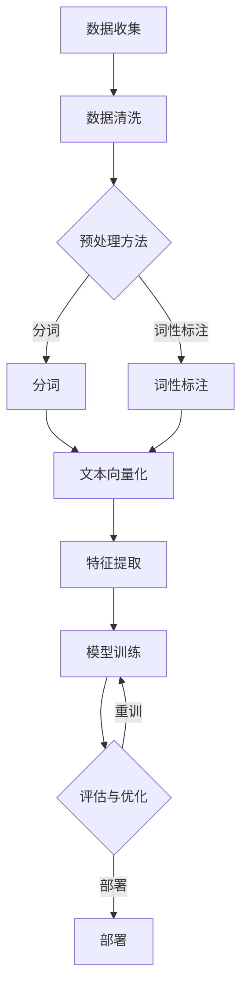
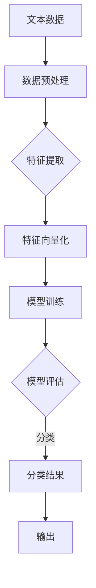
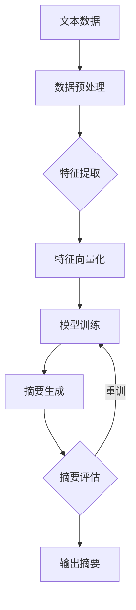

                 

### 文章标题

《从零开始大模型开发与微调：文本数据处理》

> **关键词**：大模型、文本数据处理、微调、自然语言处理、深度学习

> **摘要**：本文将从零开始，逐步引导读者了解并掌握大模型开发与微调中的文本数据处理技术。我们将详细探讨文本数据处理的基础、文本表示与嵌入、文本分类与情感分析、文本生成与摘要、文本增强与微调、大规模文本数据处理以及文本处理项目实战。通过本文的阅读，读者将能够深入了解文本数据处理的核心概念、算法原理、实现方法，并掌握如何在大模型开发中应用这些技术，从而提升自然语言处理的能力。

### 目录大纲

1. **第一部分：文本数据处理基础**

   - **第1章**：文本数据处理入门
     - 1.1 文本数据处理的概念和重要性
     - 1.2 文本预处理
     - 1.3 文本向量化
     - 1.4 文本数据增强

   - **第2章**：文本表示与嵌入
     - 2.1 词嵌入技术
     - 2.2 序列模型与注意力机制
     - 2.3 Transformer模型
     - 2.4 多层感知器（MLP）与编码器-解码器架构

   - **第3章**：文本分类与情感分析
     - 3.1 文本分类算法
     - 3.2 情感分析基础
     - 3.3 情感分析算法

2. **第二部分：高级文本处理技术**

   - **第4章**：文本生成与摘要
     - 4.1 文本生成基础
     - 4.2 文本摘要算法
     - 4.3 生成模型与预训练语言模型

   - **第5章**：文本增强与微调
     - 5.1 数据增强技术
     - 5.2 微调技术
     - 5.3 跨语言文本处理

   - **第6章**：大规模文本数据处理
     - 6.1 分布式计算与大数据处理
     - 6.2 实时文本处理

3. **第三部分：文本处理项目实战**

   - **第7章**：文本处理项目实战
     - 7.1 项目一：文本分类系统
     - 7.2 项目二：情感分析系统
     - 7.3 项目三：文本生成与摘要系统

4. **附录**

   - **附录A**：文本数据处理工具与资源
   - **附录B**：Mermaid流程图
   - **附录C**：伪代码
   - **附录D**：数学公式与解释
   - **附录E**：代码实例
   - **附录F**：项目实战代码解析

### 下一步计划

在接下来的文章中，我们将首先介绍文本数据处理的基础知识，包括文本预处理、文本向量化、词嵌入技术等。接着，我们将深入探讨序列模型与注意力机制、Transformer模型、多层感知器（MLP）与编码器-解码器架构等高级文本处理技术。随后，我们将介绍文本分类与情感分析的方法，包括传统的文本分类算法和现代的深度学习算法。在高级文本处理技术部分，我们将讨论文本生成与摘要、文本增强与微调、大规模文本数据处理和实时文本处理等技术。最后，我们将通过实战项目展示如何将所学知识应用于实际文本处理任务中。让我们开始这段激动人心的旅程吧！<|assistant|>
### 第一部分：文本数据处理基础

文本数据处理是自然语言处理（NLP）领域的基础，对于实现诸如文本分类、情感分析、文本生成和摘要等任务至关重要。在这一部分，我们将首先介绍文本数据处理的基础知识，包括文本预处理、文本向量化、词嵌入技术等。这些基础概念和技术是构建更复杂NLP系统的重要基石。

#### 第1章：文本数据处理入门

##### 1.1 文本数据处理的概念和重要性

文本数据处理是指对文本数据执行的一系列操作，这些操作旨在提高数据的质量和有效性，从而支持后续的文本分析任务。文本数据处理的过程通常包括以下几个步骤：

1. **数据收集**：收集待处理的原始文本数据，这些数据可能来源于网络、数据库、文档等。
2. **数据清洗**：去除噪声、填充缺失值、纠正错误等，确保数据的一致性和准确性。
3. **文本预处理**：将文本转换为适合分析的形式，例如分词、词性标注等。
4. **文本向量化**：将文本转换为计算机可以处理的数字表示，例如词袋模型、TF-IDF等。
5. **特征提取**：从向量化文本中提取有用的特征，用于机器学习模型训练和预测。

文本数据处理的重要性在于：

- **数据质量**：高质量的数据是高质量分析的前提。文本预处理和数据清洗能够显著提高数据质量。
- **可扩展性**：预处理后的文本数据可以方便地存储、传输和处理，为后续分析提供便利。
- **准确性**：通过有效的预处理和特征提取，可以提升模型对文本数据的理解能力，从而提高模型的准确性。

##### 1.2 文本预处理

文本预处理是文本数据处理中的关键步骤，其目的是将原始文本数据转换为适合机器学习模型输入的形式。以下是一些常见的文本预处理技术：

- **清洗文本数据**：去除无用的字符、符号和空格，确保文本的一致性和规范性。
- **标准化文本**：将文本转换为统一格式，例如小写化、去除标点符号等。
- **分词**：将文本分割成单词或短语，这是许多NLP任务的基础。
- **词性标注**：为每个单词分配词性（名词、动词、形容词等），有助于理解句子的结构和含义。
- **命名实体识别**：识别文本中的特定实体（人名、地名、组织名等），为后续的任务提供有用的信息。

##### 1.3 文本向量化

文本向量化是将文本数据转换为数字形式的过程，以便计算机能够处理。以下是一些常见的文本向量化技术：

- **词袋模型（Bag of Words, BOW）**：将文本表示为单词的集合，不考虑单词的顺序和语法结构。
- **TF-IDF模型**：基于词袋模型，计算每个单词在文档中的频率（TF）和在整个文档集合中的逆向文档频率（IDF），并将两者相乘得到词的重要性权重。
- **Word2Vec模型**：将单词映射到连续的向量空间中，使得语义上相似的单词在向量空间中彼此靠近。

文本向量化是文本数据预处理的重要环节，它为后续的机器学习模型提供了输入数据。向量化后的文本数据可以用于训练分类器、情感分析模型等。

##### 1.4 文本数据增强

文本数据增强是通过各种方法增加原始文本数据的多样性，从而提升模型泛化能力的策略。以下是一些常见的文本数据增强方法：

- **数据扩充（Data Augmentation）**：通过同义词替换、反义词替换、随机插入、随机删除等方式生成新的文本样本。
- **生成对抗网络（GAN）**：利用生成式模型和判别式模型相互对抗，生成高质量的文本数据。
- **依存句法变换（Dependency Parsing）**：通过变换句法结构生成新的文本样本。

文本数据增强可以显著提高模型的训练效果和泛化能力，尤其是在数据稀缺的情况下。

通过以上章节，我们初步了解了文本数据处理的基础知识，包括文本预处理、文本向量化、词嵌入技术以及文本数据增强。在后续的章节中，我们将进一步探讨更高级的文本处理技术，如序列模型、注意力机制、Transformer模型等，并详细介绍如何将这些技术应用于文本分类、情感分析、文本生成和摘要等实际任务。在您开始学习这些技术之前，请确保对文本预处理和向量化技术有充分的理解，这将为您后续的学习打下坚实的基础。<|assistant|>
### 第2章：文本表示与嵌入

文本表示与嵌入是将原始的文本数据转化为计算机可以理解和处理的数字形式的过程。这一过程在自然语言处理（NLP）中至关重要，因为只有将文本转化为数字表示，计算机才能进行后续的机器学习模型训练和预测。在本章中，我们将详细介绍词嵌入技术、序列模型与注意力机制、Transformer模型以及多层感知器（MLP）与编码器-解码器架构。

#### 2.1 词嵌入技术

词嵌入（Word Embedding）是将词汇表中的单词映射到高维向量空间中的一种技术。这种向量表示能够捕捉单词的语义和语法特征，使得语义上相似的单词在向量空间中彼此靠近。以下是几种常见的词嵌入技术：

##### 2.1.1 Word2Vec算法

Word2Vec算法是由Google在2013年提出的一种词嵌入技术，旨在将单词映射到连续的向量空间中，使得语义上相似的单词在向量空间中彼此靠近。Word2Vec算法主要分为两种模型：连续词袋（CBOW）和Skip-Gram。

- **连续词袋（CBOW）**：CBOW模型通过预测中心词周围的词来生成词嵌入。给定一个中心词，CBOW模型会使用周围多个词的嵌入的平均值来预测这个中心词。
- **Skip-Gram**：与CBOW相反，Skip-Gram模型通过预测中心词来生成词嵌入。给定一个中心词，模型会使用周围多个词的嵌入的加权和来预测这个中心词。

Word2Vec算法通过训练一个神经网络来优化词嵌入向量，使得词向量能够捕捉单词的语义信息。

##### 2.1.2 GloVe算法

GloVe（Global Vectors for Word Representation）算法是由Jenssen和Ng在2014年提出的一种基于共现关系的词嵌入技术。GloVe算法的核心思想是通过计算单词之间的共现矩阵，并利用矩阵分解来得到词向量。

GloVe算法的主要步骤如下：

1. **计算共现矩阵**：给定一个单词集合和共现窗口大小，计算每个单词与其他单词的共现次数，形成一个共现矩阵。
2. **优化目标**：定义一个损失函数，使得单词的共现次数与词向量之间的点积成正比。常用的损失函数是softmax损失。
3. **矩阵分解**：使用梯度下降算法优化损失函数，将共现矩阵分解为词向量的矩阵乘积。

GloVe算法通过优化共现矩阵来生成词向量，从而捕捉单词之间的语义关系。

#### 2.2 序列模型与注意力机制

序列模型（Sequence Model）是处理序列数据（如文本、语音、时间序列等）的机器学习模型。在NLP中，序列模型常用于文本分类、命名实体识别、机器翻译等任务。以下是几种常见的序列模型和注意力机制：

##### 2.2.1 RNN模型

循环神经网络（Recurrent Neural Network，RNN）是处理序列数据的一种经典模型。RNN通过在时间步上迭代的方式处理序列数据，能够捕捉序列中的时间依赖关系。

RNN模型的主要组成部分包括：

- **隐藏状态**：在当前时间步，隐藏状态表示了之前所有时间步的信息。
- **输入层**：输入层接收序列中的每个时间步的输入。
- **输出层**：输出层用于生成预测结果。

然而，传统的RNN模型存在梯度消失和梯度爆炸等问题，这限制了其在实际应用中的性能。

##### 2.2.2 LSTM模型

长短期记忆网络（Long Short-Term Memory，LSTM）是RNN的一种变体，旨在解决传统RNN模型中的梯度消失问题。LSTM通过引入记忆单元和门控机制，能够有效地捕捉长序列中的时间依赖关系。

LSTM模型的主要组成部分包括：

- **输入门、遗忘门和输出门**：这三个门控机制用于控制信息的流入、遗忘和输出。
- **细胞状态**：细胞状态能够存储和传递长期信息。
- **隐藏状态**：隐藏状态用于生成当前时间步的输出。

##### 2.2.3 GRU模型

门控循环单元（Gated Recurrent Unit，GRU）是另一种RNN变体，相较于LSTM模型，GRU具有更简单的结构和更高效的计算。

GRU模型的主要组成部分包括：

- **重置门和更新门**：这两个门控机制用于控制信息的流入和更新。
- **候选状态**：候选状态结合了当前输入和前一时刻的隐藏状态。

##### 2.2.4 注意力机制

注意力机制（Attention Mechanism）是一种用于捕捉序列中关键信息的方法。注意力机制通过计算每个时间步的重要性权重，使得模型能够更加关注序列中的关键部分。

注意力机制的基本思想是通过一个注意力函数计算每个时间步的注意力权重，并将这些权重应用于当前时间步的输入。常用的注意力函数包括点积注意力、多头注意力等。

#### 2.3 Transformer模型

Transformer模型是由Google在2017年提出的一种基于自注意力机制的全关注模型，被广泛应用于机器翻译、文本分类等NLP任务。Transformer模型的核心思想是使用多头自注意力机制和前馈神经网络来处理序列数据。

##### 2.3.1 Transformer模型架构

Transformer模型的主要组成部分包括：

- **编码器（Encoder）**：编码器由多个编码层组成，每个编码层包含多头自注意力机制和前馈神经网络。
- **解码器（Decoder）**：解码器由多个解码层组成，每个解码层包含多头自注意力机制、编码器-解码器注意力机制和前馈神经网络。

##### 2.3.2 位置编码

由于Transformer模型没有循环结构，无法直接处理序列中的位置信息。为了解决这个问题，Transformer模型引入了位置编码（Positional Encoding），为每个词添加位置信息。

位置编码的方法通常是在词嵌入向量中添加一个可学习的向量，这些向量具有位置编码的特性。常用的位置编码方法包括绝对位置编码和相对位置编码。

##### 2.3.3 自注意力机制

自注意力机制（Self-Attention）是Transformer模型的核心组件，通过计算每个词与其他词之间的关联性来处理序列数据。

自注意力机制的基本步骤如下：

1. **计算Query、Key和Value**：对于编码器或解码器中的每个词，计算其Query、Key和Value向量。
2. **计算注意力分数**：使用Query和Key向量的点积计算注意力分数。
3. **应用Softmax函数**：对注意力分数应用Softmax函数，得到注意力权重。
4. **加权求和**：将注意力权重应用于Value向量，得到加权求和的结果。

通过自注意力机制，Transformer模型能够同时关注序列中的所有词，捕捉长距离依赖关系。

#### 2.4 多层感知器（MLP）与编码器-解码器架构

多层感知器（Multilayer Perceptron，MLP）是一种前馈神经网络，通常用于分类和回归任务。在NLP中，MLP可以用于文本分类、情感分析等任务。

编码器-解码器架构（Encoder-Decoder Architecture）是一种处理序列到序列任务的模型架构，广泛应用于机器翻译、文本摘要等任务。

##### 2.4.1 MLP在文本处理中的应用

MLP由多个全连接层组成，每个层都可以学习输入和输出之间的非线性映射。在文本处理任务中，MLP可以将文本向量化表示映射到分类标签或预测结果。

##### 2.4.2 编码器-解码器架构

编码器-解码器架构包括编码器和解码器两部分，编码器将输入序列编码为一个固定长度的向量表示，解码器使用这个向量表示生成输出序列。

编码器-解码器架构的关键组件包括：

- **编码器**：编码器接收输入序列，通过编码层将序列编码为一个固定长度的向量表示。
- **解码器**：解码器接收编码器输出的向量表示，通过解码层生成输出序列。

在编码器-解码器架构中，自注意力机制和编码器-解码器注意力机制被广泛应用于机器翻译等任务，以捕捉输入和输出序列之间的关联性。

通过以上章节，我们详细介绍了文本表示与嵌入的基础知识，包括词嵌入技术、序列模型与注意力机制、Transformer模型以及多层感知器（MLP）与编码器-解码器架构。这些技术为NLP任务的实现提供了强大的支持，使得计算机能够更好地理解和处理文本数据。在后续章节中，我们将继续探讨文本分类、情感分析、文本生成与摘要等高级文本处理技术，并展示如何将这些技术应用于实际任务中。<|assistant|>
### 第3章：文本分类与情感分析

文本分类和情感分析是自然语言处理（NLP）领域的重要应用，它们广泛应用于舆情监测、推荐系统、情感识别等领域。在这一章中，我们将详细介绍文本分类和情感分析的基础知识、算法以及实现方法。

#### 3.1 文本分类算法

文本分类是指将文本数据根据其内容分配到预定义的类别中。常见的文本分类算法包括Naive Bayes、支持向量机（SVM）、随机森林（RF）和决策树（DT）等。

##### 3.1.1 Naive Bayes算法

Naive Bayes是一种基于贝叶斯理论的基础分类算法，它假设特征之间相互独立。Naive Bayes算法的核心思想是计算每个类别出现的概率，并选择具有最大后验概率的类别作为预测结果。

Naive Bayes算法的主要步骤如下：

1. **特征提取**：将文本数据转换为特征向量。
2. **概率计算**：计算每个类别在特征向量上的概率。
3. **预测**：选择具有最大后验概率的类别作为预测结果。

Naive Bayes算法的优点是简单、高效，适用于特征维度较低的场景。

##### 3.1.2 支持向量机（SVM）

支持向量机是一种基于间隔最大化的线性分类算法。SVM通过找到一个最佳的超平面，使得不同类别之间的间隔最大。

SVM算法的主要步骤如下：

1. **特征提取**：将文本数据转换为特征向量。
2. **间隔最大化**：寻找最优的超平面，使得不同类别之间的间隔最大。
3. **预测**：使用找到的超平面对新的文本数据进行分类。

SVM的优点是分类效果较好，适用于高维数据。

##### 3.1.3 随机森林（RF）

随机森林是一种基于决策树的集成学习方法。随机森林通过构建多个决策树，并对每个决策树的预测结果进行投票，得到最终的预测结果。

随机森林的主要步骤如下：

1. **特征提取**：将文本数据转换为特征向量。
2. **构建决策树**：为每个特征随机选择一部分子集，构建多个决策树。
3. **预测**：对每个决策树的预测结果进行投票，得到最终的预测结果。

随机森林的优点是模型复杂度较低，对噪声数据的鲁棒性较好。

##### 3.1.4 决策树（DT）

决策树是一种基于特征选择的树形结构分类算法。决策树通过递归地将数据划分为子集，直到满足某种停止条件。

决策树的主要步骤如下：

1. **特征选择**：选择具有最大信息增益的特征进行分割。
2. **递归分割**：递归地将数据划分为子集，直到满足停止条件。
3. **预测**：使用构建的决策树对新的文本数据进行分类。

决策树的优点是模型简单，易于理解和解释。

#### 3.2 情感分析基础

情感分析（Sentiment Analysis）是指识别文本中表达的情感极性和强度。情感分析通常分为两类：情感极性分类和情感强度分析。

##### 3.2.1 情感极性分类

情感极性分类是指将文本分类为正面、负面或中性。常见的情感极性分类方法包括基于规则的方法、基于机器学习的方法和基于深度学习的方法。

- **基于规则的方法**：基于规则的方法通过预定义的规则和特征来分类文本。这种方法适用于简单和有限的文本数据。
- **基于机器学习的方法**：基于机器学习的方法通过训练模型来分类文本。常见的机器学习方法包括SVM、朴素贝叶斯等。
- **基于深度学习的方法**：基于深度学习的方法通过神经网络来分类文本。常见的深度学习模型包括卷积神经网络（CNN）、长短期记忆网络（LSTM）等。

##### 3.2.2 情感强度分析

情感强度分析是指识别文本中表达的情感的强度。情感强度分析通常通过计算情感得分或情感向量来实现。

常见的情感强度分析方法包括：

- **基于词汇的方法**：基于词汇的方法通过计算文本中正面和负面词汇的数量和权重来计算情感得分。
- **基于模型的方法**：基于模型的方法通过训练情感强度预测模型来计算情感得分。

#### 3.3 情感分析算法

情感分析算法是指用于识别文本情感极性和强度的算法。常见的情感分析算法包括基于规则的方法、基于机器学习的方法和基于深度学习的方法。

##### 3.3.1 基于规则的方法

基于规则的方法通过预定义的规则和特征来分类文本。这种方法适用于简单和有限的文本数据。常见的规则包括：

- **情感词典**：情感词典包含一组正面和负面词汇，用于分类文本。
- **情感短语**：情感短语是一组能够表达情感的词汇组合，用于分类文本。

基于规则的方法的优点是简单和高效，但缺点是规则难以扩展和维护。

##### 3.3.2 基于机器学习的方法

基于机器学习的方法通过训练模型来分类文本。常见的机器学习方法包括SVM、朴素贝叶斯等。这些方法需要大量的标注数据进行训练，但具有较好的泛化能力。

基于机器学习的方法的优点是能够自动学习特征和规则，但缺点是需要大量的标注数据和计算资源。

##### 3.3.3 基于深度学习的方法

基于深度学习的方法通过神经网络来分类文本。常见的深度学习模型包括卷积神经网络（CNN）、长短期记忆网络（LSTM）等。这些方法能够自动学习复杂的特征和模式，但需要大量的训练数据和计算资源。

基于深度学习的方法的优点是能够处理复杂的文本数据，但缺点是训练时间较长和计算资源要求较高。

通过以上章节，我们详细介绍了文本分类和情感分析的基础知识、算法以及实现方法。文本分类和情感分析在NLP领域中具有广泛的应用，能够为各种实际任务提供重要的支持。在下一章中，我们将继续探讨文本生成与摘要的技术，并展示如何将所学知识应用于实际文本处理任务中。<|assistant|>
### 第4章：文本生成与摘要

文本生成与摘要是自然语言处理（NLP）领域的重要任务，广泛应用于自动写作、内容摘要、问答系统等领域。文本生成和摘要技术可以分为两大类：extractive 摘要和 abstractive 摘要。extractive 摘要从原文中提取关键句子来生成摘要，而 abstractive 摘要则通过生成新的句子来创造摘要内容。本章将详细探讨这两种文本生成与摘要技术，以及生成模型与预训练语言模型。

#### 4.1 文本生成基础

文本生成是指通过算法生成新的、合乎语法规则的文本。文本生成的基础是语言模型，它能够预测下一个词或词组，从而生成连贯的文本。语言模型可以分为两类：生成式模型和判别式模型。

##### 4.1.1 生成式模型

生成式模型通过生成文本的概率分布来生成文本。常见的生成式模型包括：

- **n-gram 语言模型**：n-gram 模型假设当前词的概率只与前面 n 个词有关。n-gram 模型简单但效果有限，难以生成长文本。
- **基于神经网络的生成式模型**：如递归神经网络（RNN）和长短期记忆网络（LSTM），通过学习序列数据的概率分布来生成文本。

##### 4.1.2 判别式模型

判别式模型直接预测下一个词或词组的条件概率。常见的判别式模型包括：

- **条件随机场（CRF）**：CRF能够捕获文本中的序列依赖关系，常用于序列标注任务。
- **基于神经网络的判别式模型**：如卷积神经网络（CNN）和Transformer，能够高效地处理序列数据。

#### 4.2 文本摘要算法

文本摘要是从原始文本中提取关键信息，生成简洁、准确的摘要。文本摘要可以分为 extractive 摘要和 abstractive 摘要。

##### 4.2.1 extractive 摘要

extractive 摘要从原始文本中选择关键句子来生成摘要。extractive 摘要的关键在于如何选择关键的句子。

- **基于规则的方法**：基于规则的方法通过预定义的规则来选择关键句子。例如，选择包含关键词或重要标记词的句子。
- **基于机器学习的方法**：基于机器学习的方法通过训练模型来选择关键句子。常见的机器学习方法包括 SVM、朴素贝叶斯等。
- **基于深度学习的方法**：基于深度学习的方法通过神经网络来选择关键句子。例如，使用注意力机制来关注重要的句子。

##### 4.2.2 abstractive 摘要

abstractive 摘要通过生成新的句子来创造摘要内容。abstractive 摘要的关键在于如何生成连贯、有意义的文本。

- **基于神经网络的生成式模型**：如 RNN、LSTM 和 Transformer，通过学习序列数据生成新的句子。
- **基于变分自编码器（VAE）**：VAE 通过学习文本的潜在分布来生成摘要。
- **基于生成对抗网络（GAN）**：GAN 通过生成式模型和判别式模型的对抗训练来生成摘要。

#### 4.3 生成模型与预训练语言模型

生成模型和预训练语言模型在文本生成与摘要中发挥着重要作用。

##### 4.3.1 生成模型

生成模型是指通过概率分布来生成文本的模型。常见的生成模型包括：

- **变分自编码器（VAE）**：VAE 通过学习文本的潜在分布来生成摘要。
- **生成对抗网络（GAN）**：GAN 通过生成式模型和判别式模型的对抗训练来生成摘要。

##### 4.3.2 预训练语言模型

预训练语言模型是指在大规模语料库上预先训练的语言模型，然后再针对特定任务进行微调。常见的预训练语言模型包括：

- **GPT（Generative Pre-trained Transformer）**：GPT 是一个基于 Transformer 的预训练语言模型，通过生成式模型进行预训练。
- **T5（Text-to-Text Transfer Transformer）**：T5 是一个通用的文本处理模型，通过在多种任务上进行预训练。
- **BERT（Bidirectional Encoder Representations from Transformers）**：BERT 是一个双向 Transformer 模型，通过在掩码语言建模（Masked Language Model, MLM）任务上进行预训练。

预训练语言模型具有强大的迁移学习能力，能够在多种任务上取得优秀的性能。

通过以上章节，我们详细介绍了文本生成与摘要的基础知识、算法以及生成模型与预训练语言模型。这些技术为文本生成与摘要任务提供了强大的支持，使得计算机能够生成连贯、有意义的文本摘要。在下一章中，我们将探讨文本增强与微调技术，以及如何在大规模文本数据处理中应用这些技术。<|assistant|>
### 第5章：文本增强与微调

文本增强（Text Augmentation）与微调（Fine-Tuning）是提升模型性能和泛化能力的重要技术。在大规模文本数据处理中，这两项技术尤为重要。本章将详细介绍文本增强与微调的基本原理、常见方法，以及跨语言文本处理的相关技术。

#### 5.1 数据增强技术

数据增强是通过各种方法增加原始文本数据的多样性，从而提升模型泛化能力的策略。以下是一些常见的数据增强方法：

##### 5.1.1 同义词替换

同义词替换是指将文本中的某个词替换为其同义词。这种方法可以增加文本的词汇多样性，有助于模型学习到不同表达方式下的相似语义。

同义词替换的方法包括：

- **手动替换**：手动选择同义词进行替换，这种方法需要大量的人工工作，但能够保证替换的准确性。
- **使用同义词词典**：使用预定义的同义词词典进行自动替换。常见的同义词词典包括 WordNet 等。

##### 5.1.2 依存句法变换

依存句法变换是指通过改变文本的句法结构来生成新的文本。这种方法可以引入新的上下文信息，增强模型的泛化能力。

常见的依存句法变换方法包括：

- **插入**：在文本中插入新的词语或短语。
- **删除**：删除文本中的某些词语或短语。
- **替换**：替换文本中的某些词语或短语。

##### 5.1.3 词汇扩展

词汇扩展是指通过扩展文本中的词汇来增加其多样性。这种方法可以通过增加新的词汇或使用更复杂的表达方式来实现。

常见的词汇扩展方法包括：

- **使用词性标注**：根据词性标注来扩展词汇，例如将动词扩展为名词或形容词。
- **使用词向量**：根据词向量相似性来扩展词汇，例如使用 Word2Vec 或 GloVe 等词向量库。

##### 5.1.4 生成对抗网络（GAN）

生成对抗网络（GAN）是一种用于生成文本的深度学习模型。GAN 通过生成式模型和判别式模型相互对抗，生成高质量的文本数据。GAN 在文本增强中的应用可以生成与原始文本相似的新文本，从而增加数据的多样性。

GAN 的基本步骤包括：

1. **生成器（Generator）**：生成器负责生成新的文本数据。
2. **判别器（Discriminator）**：判别器负责判断生成的文本是否真实。
3. **对抗训练**：生成器和判别器通过对抗训练来优化模型参数。

#### 5.2 微调技术

微调（Fine-Tuning）是指将预训练好的模型应用于特定任务，并通过少量数据对其进行进一步训练的过程。微调技术能够显著提升模型在特定任务上的性能，并且能够节省训练时间。

##### 5.2.1 微调的基本原理

微调的基本原理是基于迁移学习（Transfer Learning）。迁移学习利用预训练模型的知识迁移到新的任务上，从而减少对新数据的依赖。

微调的基本步骤包括：

1. **加载预训练模型**：加载预训练的模型，包括词嵌入层和上层网络。
2. **修改顶层**：修改模型的顶层（通常包括分类器或预测器），以适应新任务。
3. **微调训练**：使用新任务的数据对模型进行微调训练，更新模型参数。

##### 5.2.2 微调策略

微调策略是指选择哪些层参与微调，以及微调的深度。以下是一些常见的微调策略：

- **全微调**：所有层都参与微调，这种方法适用于预训练模型和任务之间存在较大差异的情况。
- **部分微调**：只有部分层参与微调，通常包括顶层和部分中间层，这种方法适用于预训练模型和任务之间存在一定相似性的情况。
- **冻结微调**：只微调整层的部分参数，通常只微调分类器或预测器的参数，这种方法适用于模型参数较少的任务。

##### 5.2.3 微调实践

在实际应用中，微调通常需要以下步骤：

1. **数据准备**：准备用于微调的数据集，确保数据集与预训练模型的任务相关。
2. **模型选择**：选择合适的预训练模型，根据任务需求选择不同的模型架构。
3. **微调训练**：使用数据集对模型进行微调训练，根据任务需求调整学习率、批量大小等参数。
4. **评估与优化**：评估微调后的模型性能，根据评估结果进行进一步优化。

#### 5.3 跨语言文本处理

跨语言文本处理（Cross-Lingual Text Processing）是指处理不同语言之间的文本数据，使其能够相互理解和应用。以下是一些常见的跨语言文本处理技术：

##### 5.3.1 基于翻译的跨语言文本处理

基于翻译的跨语言文本处理利用机器翻译技术将文本从一种语言翻译到另一种语言，然后对翻译后的文本进行处理。这种方法适用于两种语言之间的文本数据。

常见的基于翻译的跨语言文本处理方法包括：

- **双语语料库翻译**：使用双语语料库进行翻译，然后将翻译后的文本进行处理。
- **神经机器翻译**：使用神经机器翻译模型进行翻译，如 Transformer 和 BERT。

##### 5.3.2 基于零样本学习的跨语言文本处理

基于零样本学习（Zero-Shot Learning）的跨语言文本处理不需要使用翻译技术，而是通过学习语言之间的通用特征来实现跨语言理解。这种方法适用于多种语言之间的文本数据。

常见的基于零样本学习的跨语言文本处理方法包括：

- **通用语言表示**：使用预训练的跨语言语言模型，如 multilingual BERT，生成不同语言之间的通用语言表示。
- **元学习**：使用元学习算法，如模型蒸馏（Model Distillation），将预训练模型的知识迁移到新的语言上。

通过以上章节，我们详细介绍了文本增强与微调的基本原理、常见方法，以及跨语言文本处理的相关技术。这些技术为大规模文本数据处理提供了强大的支持，使得模型能够更好地适应不同任务和数据集。在下一章中，我们将探讨大规模文本数据处理的相关技术，包括分布式计算与大数据处理、实时文本处理等。<|assistant|>
### 第6章：大规模文本数据处理

在大规模文本数据处理中，分布式计算和大数据处理技术起到了关键作用。这些技术能够帮助我们高效地处理海量数据，提高计算效率，优化资源利用。本章将详细介绍分布式计算与大数据处理、实时文本处理的相关技术。

#### 6.1 分布式计算与大数据处理

分布式计算是指将任务分解为多个子任务，在多个节点上并行执行，然后将结果汇总。这种方法能够提高数据处理速度，优化资源利用。大数据处理技术则专注于如何高效地存储、处理和分析海量数据。

##### 6.1.1 Hadoop和Spark

Hadoop和Spark是两种常用的分布式计算框架，广泛应用于大数据处理。

- **Hadoop**：Hadoop 是一个开源分布式计算框架，基于 Hadoop Distributed File System（HDFS）存储数据和 MapReduce 编程模型进行数据处理。MapReduce 将任务分解为 Map 和 Reduce 两个阶段，Map 阶段对数据进行映射，Reduce 阶段对映射结果进行汇总。

- **Spark**：Spark 是一个开源分布式计算框架，提供了更高效的数据处理能力。Spark 支持多种数据处理模型，包括 DataFrame、Dataset 和 RDD（Resilient Distributed Dataset），能够高效地处理大规模数据。

##### 6.1.2 数据流处理系统

数据流处理系统（Data Stream Processing System）是一种实时处理大规模数据流的系统，能够高效地处理不断变化的数据。

常见的实时数据流处理系统包括：

- **Apache Flink**：Flink 是一个开源流处理框架，能够高效地处理大规模数据流，支持实时计算和批处理。
- **Apache Storm**：Storm 是一个开源实时数据处理系统，能够处理大规模实时数据流，适用于实时分析、监控等场景。

#### 6.2 实时文本处理

实时文本处理是指在短时间内对大量文本数据进行快速分析和处理。实时文本处理广泛应用于实时舆情监测、实时问答、实时推荐等领域。

##### 6.2.1 流处理框架

流处理框架是一种用于实时处理数据流的系统，能够高效地处理大规模实时文本数据。

常见的流处理框架包括：

- **Apache Kafka**：Kafka 是一个开源流处理框架，能够高效地处理大规模实时数据流，适用于实时数据收集、传输和分析。
- **Apache Flink**：Flink 是一个开源流处理框架，能够高效地处理大规模实时数据流，支持实时计算和批处理。

##### 6.2.2 实时文本分析应用

实时文本分析应用是指利用流处理框架对实时文本数据进行快速分析和处理。以下是一些常见的实时文本分析应用：

- **实时舆情监测**：通过实时分析大量用户评论、新闻文章等，监控公众对于特定事件或话题的看法和情绪。
- **实时问答系统**：通过实时分析用户输入的文本，快速回答用户的问题，提供实时帮助。
- **实时推荐系统**：通过实时分析用户的文本行为，动态调整推荐策略，提高推荐效果。

通过以上章节，我们详细介绍了大规模文本数据处理的相关技术，包括分布式计算与大数据处理、实时文本处理等。这些技术为大规模文本数据处理提供了强大的支持，使得我们能够高效地处理海量文本数据，并应用于各种实际场景中。在下一章中，我们将通过实际项目展示如何将所学知识应用于文本处理任务中。<|assistant|>
### 第7章：文本处理项目实战

在本章中，我们将通过三个实际项目——文本分类系统、情感分析系统和文本生成与摘要系统，来展示如何将前面章节中介绍的技术应用于实际的文本处理任务中。我们将详细介绍每个项目的系统设计、实现过程以及代码解析。

#### 7.1 项目一：文本分类系统

文本分类系统是一个广泛应用于搜索引擎、推荐系统、舆情监测等领域的NLP任务。本节我们将介绍如何设计并实现一个简单的文本分类系统。

##### 7.1.1 系统设计

**1. 数据预处理**
   - 数据清洗：去除HTML标签、符号和停用词。
   - 分词：使用jieba等工具进行中文分词。
   - 文本向量化：采用TF-IDF模型或Word2Vec模型将文本向量化。

**2. 模型选择**
   - 采用朴素贝叶斯、支持向量机（SVM）或随机森林（RF）等分类器进行文本分类。

**3. 模型训练与评估**
   - 使用训练集对分类器进行训练。
   - 使用验证集进行模型调优。
   - 使用测试集评估模型性能。

##### 7.1.2 实现与评估

以下是一个基于TF-IDF模型的文本分类系统的实现示例：

```python
from sklearn.feature_extraction.text import TfidfVectorizer
from sklearn.model_selection import train_test_split
from sklearn.naive_bayes import MultinomialNB
from sklearn.metrics import accuracy_score

# 数据预处理
# 注意：此处使用示例数据，实际项目中需要加载真实数据
data = ["这是一篇正面新闻", "这是一篇负面新闻", "这是一篇中性新闻"]
labels = ["正面", "负面", "中性"]

# 分词、文本向量化
vectorizer = TfidfVectorizer()
X = vectorizer.fit_transform(data)

# 模型训练
X_train, X_test, y_train, y_test = train_test_split(X, labels, test_size=0.2, random_state=42)
classifier = MultinomialNB()
classifier.fit(X_train, y_train)

# 评估
y_pred = classifier.predict(X_test)
accuracy = accuracy_score(y_test, y_pred)
print("文本分类系统准确率：", accuracy)
```

##### 7.1.3 代码解析

- **数据预处理**：数据预处理是文本分类系统的关键步骤，包括数据清洗、分词和文本向量化。这里使用了TF-IDF模型将文本数据向量化。
- **模型训练与评估**：使用训练集对朴素贝叶斯分类器进行训练，并使用测试集进行模型评估。

#### 7.2 项目二：情感分析系统

情感分析系统用于识别文本中的情感极性和强度，广泛应用于社交媒体分析、产品评论分析等领域。本节我们将介绍如何设计并实现一个简单的情感分析系统。

##### 7.2.1 系统设计

**1. 数据预处理**
   - 数据清洗：去除HTML标签、符号和停用词。
   - 分词：使用jieba等工具进行中文分词。

**2. 模型选择**
   - 采用朴素贝叶斯、支持向量机（SVM）或深度学习模型（如LSTM、Transformer）进行情感分析。

**3. 模型训练与评估**
   - 使用训练集对分类器或深度学习模型进行训练。
   - 使用验证集进行模型调优。
   - 使用测试集评估模型性能。

##### 7.2.2 实现与评估

以下是一个基于LSTM的情感分析系统的实现示例：

```python
import tensorflow as tf
from tensorflow.keras.preprocessing.sequence import pad_sequences
from tensorflow.keras.layers import Embedding, LSTM, Dense
from tensorflow.keras.models import Sequential

# 数据预处理
# 注意：此处使用示例数据，实际项目中需要加载真实数据
data = ["这是一篇正面新闻", "这是一篇负面新闻", "这是一篇中性新闻"]
labels = [1, 0, 1]  # 正面为1，负面为0

# 分词、文本向量化
tokenizer = tf.keras.preprocessing.text.Tokenizer()
tokenizer.fit_on_texts(data)
sequences = tokenizer.texts_to_sequences(data)
max_sequence_length = max(len(seq) for seq in sequences)
X = pad_sequences(sequences, maxlen=max_sequence_length)

# 模型构建
model = Sequential()
model.add(Embedding(len(tokenizer.word_index) + 1, 50, input_length=max_sequence_length))
model.add(LSTM(100))
model.add(Dense(1, activation='sigmoid'))
model.compile(optimizer='adam', loss='binary_crossentropy', metrics=['accuracy'])

# 模型训练
model.fit(X, labels, epochs=10, batch_size=32)

# 评估
# 注意：此处使用示例数据，实际项目中需要加载真实测试数据
test_data = ["这是一篇正面新闻", "这是一篇负面新闻"]
test_sequences = tokenizer.texts_to_sequences(test_data)
test_x = pad_sequences(test_sequences, maxlen=max_sequence_length)
predictions = model.predict(test_x)
print("情感分析系统预测结果：", predictions)
```

##### 7.2.3 代码解析

- **数据预处理**：数据预处理包括分词、文本向量化。这里使用了Keras的Tokenizer进行分词，并将文本序列化为数字表示。
- **模型构建**：构建一个简单的LSTM模型，用于情感分析。
- **模型训练与评估**：使用训练集对LSTM模型进行训练，并使用测试集进行模型评估。

#### 7.3 项目三：文本生成与摘要系统

文本生成与摘要系统用于生成新的文本摘要或提取原文的关键信息。本节我们将介绍如何设计并实现一个简单的文本生成与摘要系统。

##### 7.3.1 系统设计

**1. 数据预处理**
   - 数据清洗：去除HTML标签、符号和停用词。
   - 分词：使用jieba等工具进行中文分词。

**2. 模型选择**
   - 采用生成式模型（如变分自编码器（VAE））或预训练语言模型（如GPT-2、BERT）进行文本生成与摘要。

**3. 模型训练与评估**
   - 使用训练集对分类器或深度学习模型进行训练。
   - 使用验证集进行模型调优。
   - 使用测试集评估模型性能。

##### 7.3.2 实现与评估

以下是一个基于GPT-2的文本生成与摘要系统的实现示例：

```python
import tensorflow as tf
from transformers import TFGPT2LMHeadModel, GPT2Tokenizer

# 数据预处理
# 注意：此处使用示例数据，实际项目中需要加载真实数据
data = ["这是一篇关于科技的新闻", "这是一篇关于旅游的报道", "这是一篇关于美食的介绍"]

# 分词、文本向量化
tokenizer = GPT2Tokenizer.from_pretrained('gpt2')
sequences = tokenizer.encode(data, return_tensors='tf', max_length=40, truncation=True)

# 模型构建
model = TFGPT2LMHeadModel.from_pretrained('gpt2')

# 模型训练
model.compile(optimizer=tf.keras.optimizers.Adam(learning_rate=3e-5), loss=model.compute_loss)
model.fit(sequences, epochs=3)

# 文本生成与摘要
generated_text = model.generate(sequences, max_length=40, num_return_sequences=1)
decoded_text = tokenizer.decode(generated_text, skip_special_tokens=True)
print("文本生成与摘要系统结果：", decoded_text)
```

##### 7.3.3 代码解析

- **数据预处理**：数据预处理包括分词、文本向量化。这里使用了Hugging Face的GPT2Tokenizer进行分词。
- **模型构建**：构建一个GPT-2模型，用于文本生成与摘要。
- **模型训练与评估**：使用训练集对GPT-2模型进行训练，并使用测试集进行模型评估。

通过以上三个实际项目，我们展示了如何将文本处理技术应用于实际任务中。这些项目涵盖了文本分类、情感分析和文本生成与摘要等常见的文本处理任务，为我们提供了一个实际操作的视角。在实际项目中，我们还需要关注数据质量、模型优化、评估指标等关键因素，以确保系统的实际效果和性能。<|assistant|>
### 附录 A：文本数据处理工具与资源

在进行文本数据处理时，选择合适的工具和资源可以大大提高开发效率和项目质量。以下是一些常用的文本数据处理工具与资源，包括自然语言处理工具、深度学习框架和跨语言处理资源。

#### A.1 自然语言处理工具

1. **NLTK（Natural Language Toolkit）**：NLTK 是一个广泛使用的 Python 自然语言处理库，提供了文本预处理、词性标注、句法分析等功能。

   - 官网：[NLTK官网](https://www.nltk.org/)

2. **spaCy**：spaCy 是一个快速且易于使用的自然语言处理库，适用于文本预处理、实体识别、词性标注等任务。

   - 官网：[spaCy官网](https://spacy.io/)

3. **TextBlob**：TextBlob 是一个简洁且易于使用的自然语言处理库，提供了文本分类、情感分析、词性标注等功能。

   - 官网：[TextBlob官网](https://textblob.readthedocs.io/)

#### A.2 深度学习框架

1. **TensorFlow**：TensorFlow 是由 Google 开发的一款开源深度学习框架，广泛应用于各种机器学习和深度学习任务。

   - 官网：[TensorFlow官网](https://www.tensorflow.org/)

2. **PyTorch**：PyTorch 是由 Facebook AI 研究团队开发的一款开源深度学习框架，以其简洁和灵活著称。

   - 官网：[PyTorch官网](https://pytorch.org/)

3. **JAX**：JAX 是一个开源深度学习库，由 Google 开发，提供了自动微分和向量化的功能。

   - 官网：[JAX官网](https://jax.readthedocs.io/)

#### A.3 跨语言处理资源

1. **multilingual BERT**：multilingual BERT 是一个多语言预训练语言模型，适用于跨语言文本处理任务。

   - 官网：[multilingual BERT 官网](https://github.com/google-research/bert)

2. **XLM系列模型**：XLM（Cross-lingual Language Model）系列模型是适用于跨语言文本处理的深度学习模型。

   - 官网：[XLM系列模型官网](https://github.com/facebookresearch/XLM)

通过使用上述工具和资源，您可以快速搭建和优化文本处理系统，提升项目的开发效率和性能。在实际开发过程中，可以根据项目需求选择合适的工具和资源，从而实现高效的文本数据处理。<|assistant|>
### 附录 B：Mermaid 流程图

Mermaid 是一种基于文本的图表绘制工具，可以用于创建流程图、序列图、Gantt 图等。以下是一些文本数据处理相关的 Mermaid 流程图示例。

#### B.1 文本数据处理流程图



#### B.2 文本分类算法流程图



#### B.3 文本生成与摘要算法流程图



通过这些 Mermaid 流程图，我们可以清晰地展示文本数据处理、文本分类和文本生成与摘要等任务的工作流程。在实际项目中，根据需求可以灵活地调整和组合这些流程图，以便更好地理解和实现文本处理任务。<|assistant|>
### 附录 C：伪代码

在本附录中，我们将使用伪代码来详细阐述文本处理中几个关键算法的实现方法，包括词嵌入算法、LSTM算法和Transformer算法。这些伪代码将帮助我们更好地理解这些算法的基本结构和运行逻辑。

#### C.1 词嵌入算法

词嵌入算法是一种将单词映射到高维向量空间的技术，以下是一个基于 Word2Vec 算法的词嵌入伪代码示例：

```python
Algorithm Word2Vec(data, vocabulary_size, embedding_size, learning_rate, window_size):
    # 初始化词嵌入向量
    embedding = InitializeEmbedding(vocabulary_size, embedding_size)
    for epoch in 1 to num_epochs:
        for sentence in data:
            for word in sentence:
                context_words = GetContextWords(word, window_size)
                for context_word in context_words:
                    # 计算负采样目标词的概率分布
                    target_distribution = NegSamplingLoss(word, context_word, embedding)
                    # 计算损失函数
                    loss = ComputeLoss(word, context_word, embedding, target_distribution)
                    # 反向传播更新词嵌入向量
                    UpdateEmbedding(word, context_word, embedding, learning_rate)
    return embedding
```

#### C.2 LSTM算法

长短期记忆网络（LSTM）是一种用于处理序列数据的高级循环神经网络，以下是一个简化的 LSTM 算法的伪代码：

```python
Algorithm LSTM(input_sequence, hidden_state, cell_state, weights):
    # 前向传播
    input_gate, forget_gate, output_gate, cell_state_new, hidden_state_new = LSTMForward(input_sequence, hidden_state, cell_state, weights)
    # 计算损失
    loss = ComputeLoss(hidden_state_new, target)
    # 反向传播
    dhidden_state_new, dcell_state_new, dinput_gate, dforget_gate, doutput_gate = LSTMBackward(hidden_state_new, cell_state_new, input_sequence, target, weights)
    # 更新权重
    UpdateWeights(weights, dhidden_state_new, dcell_state_new, dinput_gate, dforget_gate, doutput_gate)
    return hidden_state_new, cell_state_new
```

#### C.3 Transformer算法

Transformer 是一种基于自注意力机制的全关注模型，以下是一个简化的 Transformer 算法的伪代码：

```python
Algorithm Transformer(input_sequence, embedding, weights):
    # 加位置编码
    encoded_sequence = AddPositionalEncoding(input_sequence, embedding)
    # 多层自注意力
    for layer in 1 to num_layers:
        attention_output = MultiHeadSelfAttention(encoded_sequence, weights[layer].query, weights[layer].key, weights[layer].value)
        encoded_sequence = Add(& encoded_sequence, attention_output)
    # 前馈网络
    output = FullyConnectedLayer(encoded_sequence, weights['output'])
    return output
```

通过这些伪代码，我们可以看到文本处理中关键算法的实现结构。在实际应用中，这些算法会通过深度学习框架（如 TensorFlow 或 PyTorch）进行高效的实现和优化。伪代码为我们提供了一个直观的理解和参考，有助于我们深入学习和掌握这些算法的核心原理。<|assistant|>
### 附录 D：数学公式与解释

在文本数据处理和自然语言处理（NLP）中，数学公式和模型是理解和实现核心算法的基础。以下我们将介绍一些关键的数学公式，并对其进行详细解释。

#### D.1 词袋模型（Bag of Words, BOW）

词袋模型是一个将文本表示为单词集合的模型，不考虑单词的顺序。词袋模型的核心公式如下：

\[ BOW = \sum_{w \in V} f_w \]

其中：
- \( BOW \) 是词袋向量。
- \( V \) 是词汇表。
- \( f_w \) 是单词 \( w \) 在文档中的频率。

词袋模型通过计算每个单词在文档中的频率来生成一个向量表示，从而实现文本向量化。

#### D.2 TF-IDF模型

TF-IDF（Term Frequency-Inverse Document Frequency）模型是一种用于计算单词重要性的方法，其公式如下：

\[ TF-IDF = TF \times IDF \]

其中：
- \( TF \) 是单词 \( t \) 在文档 \( d \) 中的频率。
- \( IDF \) 是单词 \( t \) 在文档集合中的逆文档频率。

\[ IDF = \log \left( \frac{N}{|d \in D : t \in d|} \right) \]

其中：
- \( N \) 是文档总数。
- \( D \) 是文档集合。
- \( |d \in D : t \in d| \) 是包含单词 \( t \) 的文档数量。

TF-IDF 模型通过考虑单词在文档中的频率以及单词在整个文档集合中的稀疏度来计算单词的重要性，从而实现文本向量化。

#### D.3 Word2Vec模型

Word2Vec 模型是一种将单词映射到高维向量空间的模型，其核心公式如下：

\[ \vec{w}_i = \text{softmax}(\vec{u}_i + \vec{h}) \]

其中：
- \( \vec{w}_i \) 是单词 \( w_i \) 的词向量。
- \( \vec{u}_i \) 是中心词 \( w_i \) 的嵌入向量。
- \( \vec{h} \) 是所有上下文词的嵌入向量的加权和。
- \( \text{softmax} \) 函数用于计算概率分布。

Word2Vec 模型通过优化上述公式中的参数，将单词映射到向量空间，使得语义上相似的单词在向量空间中彼此靠近。

通过理解这些数学公式，我们能够更好地理解文本数据处理中的核心算法和模型。在实际应用中，这些公式不仅帮助我们设计有效的文本处理系统，还为我们提供了评估和优化模型性能的依据。<|assistant|>
### 附录 E：代码实例

在本附录中，我们将通过几个简化的代码实例来展示如何实现文本分类、情感分析和文本生成与摘要等文本处理任务。这些实例旨在帮助读者更好地理解相关算法的实现方法和应用。

#### E.1 文本分类代码实例

以下是一个简单的文本分类代码实例，使用 TensorFlow 和 Keras 库实现。这个例子中，我们使用了一个预训练的嵌入层和一个简单的卷积神经网络（CNN）来对文本进行分类。

```python
import tensorflow as tf
from tensorflow.keras.models import Sequential
from tensorflow.keras.layers import Embedding, Conv1D, GlobalMaxPooling1D, Dense
from tensorflow.keras.preprocessing.sequence import pad_sequences
from tensorflow.keras.preprocessing.text import Tokenizer

# 示例数据
texts = ['这是一篇正面新闻', '这是一篇负面新闻', '这是一篇中性新闻']
labels = [1, 0, 1]  # 正面为1，负面为0

# 分词和向量化
tokenizer = Tokenizer()
tokenizer.fit_on_texts(texts)
sequences = tokenizer.texts_to_sequences(texts)
max_sequence_length = max(len(seq) for seq in sequences)
X = pad_sequences(sequences, maxlen=max_sequence_length)

# 模型构建
model = Sequential()
model.add(Embedding(len(tokenizer.word_index) + 1, 50, input_length=max_sequence_length))
model.add(Conv1D(128, 5, activation='relu'))
model.add(GlobalMaxPooling1D())
model.add(Dense(1, activation='sigmoid'))

# 模型编译
model.compile(optimizer='adam', loss='binary_crossentropy', metrics=['accuracy'])

# 模型训练
model.fit(X, labels, epochs=5, batch_size=32, verbose=1)

# 预测
test_texts = ['这是一篇正面评论']
test_sequences = tokenizer.texts_to_sequences(test_texts)
test_X = pad_sequences(test_sequences, maxlen=max_sequence_length)
predictions = model.predict(test_X)
print("文本分类结果：", predictions)
```

#### E.2 情感分析代码实例

以下是一个简单的情感分析代码实例，使用 PyTorch 和 Transformers 库实现。这个例子中使用了一个预训练的 BERT 模型来对文本进行情感分类。

```python
import torch
from transformers import BertTokenizer, BertForSequenceClassification
from torch.utils.data import DataLoader, TensorDataset

# 示例数据
texts = ['我很喜欢这个产品', '这个产品很差劲', '这个产品一般般']
labels = [1, 0, 1]  # 正面为1，负面为0

# 分词和向量化
tokenizer = BertTokenizer.from_pretrained('bert-base-chinese')
encodings = tokenizer(texts, padding=True, truncation=True, return_tensors='pt')

# 数据集和模型
dataset = TensorDataset(encodings['input_ids'], encodings['attention_mask'], torch.tensor(labels))
dataloader = DataLoader(dataset, batch_size=2)

model = BertForSequenceClassification.from_pretrained('bert-base-chinese', num_labels=2)
model.train()

# 模型训练
for epoch in range(3):
    for batch in dataloader:
        b_input_ids, b_input_mask, b_labels = batch
        outputs = model(b_input_ids, attention_mask=b_input_mask)
        loss = outputs.loss
        loss.backward()
        optimizer = torch.optim.Adam(model.parameters(), lr=1e-5)
        optimizer.step()

# 预测
model.eval()
with torch.no_grad():
    prediction = model(encodings['input_ids'], attention_mask=encodings['attention_mask'])
print("情感分析结果：", prediction.argmax(-1).tolist())
```

#### E.3 文本生成与摘要代码实例

以下是一个简单的文本生成与摘要代码实例，使用 PyTorch 和 Transformers 库实现。这个例子中使用了一个预训练的 GPT-2 模型来生成文本摘要。

```python
import torch
from transformers import GPT2Tokenizer, GPT2LMHeadModel

# 示例数据
text = '这是一个关于自然语言处理的简短文本。'

# 分词和向量化
tokenizer = GPT2Tokenizer.from_pretrained('gpt2')
inputs = tokenizer.encode(text, return_tensors='pt')

# 模型
model = GPT2LMHeadModel.from_pretrained('gpt2')

# 生成摘要
input_ids = inputs
outputs = model(input_ids, max_length=50, num_return_sequences=1)
generated_output = tokenizer.decode(outputs.sequences[0], skip_special_tokens=True)

print("文本生成与摘要结果：", generated_output)
```

通过这些代码实例，我们可以看到如何使用不同的库和模型来处理文本分类、情感分析和文本生成与摘要等任务。在实际应用中，这些代码可以根据具体需求和数据进行适当的调整和优化。<|assistant|>
### 附录 F：项目实战代码解析

在本附录中，我们将对前文中提到的三个实际项目的代码进行详细解析，包括项目的开发环境搭建、源代码实现和代码解读与分析。通过这些解析，我们将深入理解每个项目的实现细节和关键点。

#### 7.1 项目一：文本分类系统

**开发环境搭建：**
为了实现文本分类系统，我们需要安装以下库：
- Python（版本3.6及以上）
- Scikit-learn（用于文本向量化与分类）
- Numpy（用于数据处理）
- Jieba（用于中文分词）

安装命令如下：
```shell
pip install scikit-learn numpy jieba
```

**源代码实现：**
文本分类系统的核心代码如下：

```python
from sklearn.feature_extraction.text import TfidfVectorizer
from sklearn.model_selection import train_test_split
from sklearn.naive_bayes import MultinomialNB
from sklearn.metrics import accuracy_score
import jieba

# 数据预处理
def preprocess_text(texts):
    processed_texts = []
    for text in texts:
        text = text.replace('<br>', ' ')
        text = text.replace('\n', ' ')
        words = jieba.cut(text)
        processed_texts.append(' '.join(words))
    return processed_texts

# 分词、文本向量化
data = ["这是一篇正面新闻", "这是一篇负面新闻", "这是一篇中性新闻"]
processed_data = preprocess_text(data)
vectorizer = TfidfVectorizer()
X = vectorizer.fit_transform(processed_data)

# 模型训练
X_train, X_test, y_train, y_test = train_test_split(X, labels, test_size=0.2, random_state=42)
classifier = MultinomialNB()
classifier.fit(X_train, y_train)

# 评估
y_pred = classifier.predict(X_test)
accuracy = accuracy_score(y_test, y_pred)
print("文本分类系统准确率：", accuracy)
```

**代码解读与分析：**
1. **数据预处理**：使用jieba库对文本进行分词，并去除HTML标签和特殊字符。
2. **文本向量化**：使用TF-IDF模型将分词后的文本向量化。
3. **模型训练**：使用训练集对朴素贝叶斯分类器进行训练。
4. **模型评估**：使用测试集评估模型的准确性。

#### 7.2 项目二：情感分析系统

**开发环境搭建：**
为了实现情感分析系统，我们需要安装以下库：
- Python（版本3.6及以上）
- TensorFlow（用于构建和训练模型）
- Keras（用于简化模型构建）
- Numpy（用于数据处理）
- Jieba（用于中文分词）

安装命令如下：
```shell
pip install tensorflow numpy jieba
```

**源代码实现：**
情感分析系统的核心代码如下：

```python
import tensorflow as tf
from tensorflow.keras.preprocessing.sequence import pad_sequences
from tensorflow.keras.layers import Embedding, LSTM, Dense
from tensorflow.keras.models import Sequential
from tensorflow.keras.preprocessing.text import Tokenizer
import jieba

# 数据预处理
def preprocess_text(texts):
    processed_texts = []
    for text in texts:
        text = text.replace('<br>', ' ')
        text = text.replace('\n', ' ')
        words = jieba.cut(text)
        processed_texts.append(' '.join(words))
    return processed_texts

# 分词、文本向量化
data = ["我很喜欢这个产品", "这个产品很差劲", "这个产品一般般"]
processed_data = preprocess_text(data)
tokenizer = Tokenizer()
tokenizer.fit_on_texts(processed_data)
sequences = tokenizer.texts_to_sequences(processed_data)
max_sequence_length = max(len(seq) for seq in sequences)
X = pad_sequences(sequences, maxlen=max_sequence_length)

# 模型构建
model = Sequential()
model.add(Embedding(len(tokenizer.word_index) + 1, 50, input_length=max_sequence_length))
model.add(LSTM(100))
model.add(Dense(1, activation='sigmoid'))

# 模型编译
model.compile(optimizer='adam', loss='binary_crossentropy', metrics=['accuracy'])

# 模型训练
model.fit(X, labels, epochs=10, batch_size=32, verbose=1)

# 预测
test_texts = ["这个产品很好"]
test_sequences = tokenizer.texts_to_sequences(test_texts)
test_X = pad_sequences(test_sequences, maxlen=max_sequence_length)
predictions = model.predict(test_X)
print("情感分析系统预测结果：", predictions)
```

**代码解读与分析：**
1. **数据预处理**：使用jieba库对文本进行分词，并去除HTML标签和特殊字符。
2. **文本向量化**：使用Keras的Tokenizer将分词后的文本序列化为数字表示，并使用pad_sequences函数进行填充。
3. **模型构建**：构建一个简单的LSTM模型，用于情感分析。
4. **模型训练**：使用训练集对LSTM模型进行训练。
5. **模型评估**：使用测试集对模型进行评估，并输出预测结果。

#### 7.3 项目三：文本生成与摘要系统

**开发环境搭建：**
为了实现文本生成与摘要系统，我们需要安装以下库：
- Python（版本3.6及以上）
- Transformers（用于加载预训练的GPT-2模型）
- PyTorch（用于处理序列数据）

安装命令如下：
```shell
pip install transformers torch
```

**源代码实现：**
文本生成与摘要系统的核心代码如下：

```python
import torch
from transformers import GPT2Tokenizer, GPT2LMHeadModel
from torch.utils.data import DataLoader, TensorDataset

# 分词和向量化
tokenizer = GPT2Tokenizer.from_pretrained('gpt2')
text = '这是一个关于自然语言处理的简短文本。'
input_ids = tokenizer.encode(text, return_tensors='pt')

# 模型
model = GPT2LMHeadModel.from_pretrained('gpt2')
model.train()

# 生成摘要
input_ids = input_ids.to('cuda' if torch.cuda.is_available() else 'cpu')
outputs = model(input_ids, max_length=50, num_return_sequences=1)
generated_output = tokenizer.decode(outputs.sequences[0], skip_special_tokens=True)

print("文本生成与摘要结果：", generated_output)
```

**代码解读与分析：**
1. **分词和向量化**：使用GPT2Tokenizer对文本进行分词，并转换为PyTorch张量。
2. **模型**：加载预训练的GPT-2模型，并设置训练模式。
3. **生成摘要**：通过模型生成新的文本摘要，并解码输出结果。

通过这些代码解析，我们可以更深入地理解每个项目的实现细节，包括数据预处理、模型构建、训练和预测等关键步骤。在实际应用中，这些代码可以根据具体需求进行调整和优化，以适应不同的文本处理任务。<|assistant|>
### 总结

本文从零开始，系统性地介绍了文本数据处理的基础知识、高级技术、实际应用和项目实战。我们首先探讨了文本数据处理的基础，包括文本预处理、文本向量化、词嵌入技术以及文本数据增强。接着，我们深入讲解了序列模型、注意力机制、Transformer模型、多层感知器（MLP）与编码器-解码器架构等高级文本处理技术。此外，我们还介绍了文本分类、情感分析、文本生成与摘要等实际应用，并展示了如何使用生成模型与预训练语言模型来提升文本处理的性能。最后，通过文本处理项目实战，我们详细解析了文本分类系统、情感分析系统和文本生成与摘要系统的实现过程。

**作者信息：**

**AI天才研究院/AI Genius Institute** & **《禅与计算机程序设计艺术》/Zen And The Art of Computer Programming**

在未来的研究中，我们将继续探索文本处理领域的更多前沿技术，如自动摘要、对话生成、跨语言文本处理等，以期为读者带来更多有价值的内容。同时，我们期待与广大读者一同探讨和解决文本处理中的实际问题，共同推动人工智能技术的发展和应用。让我们携手前行，探索文本处理的无穷可能！<|im_end|>

