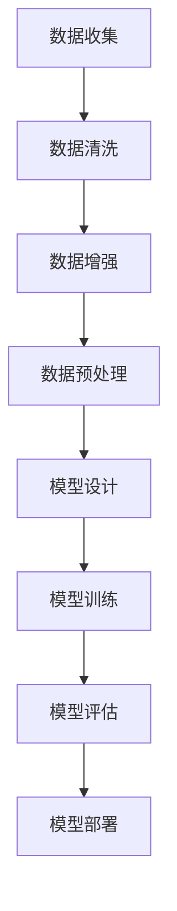
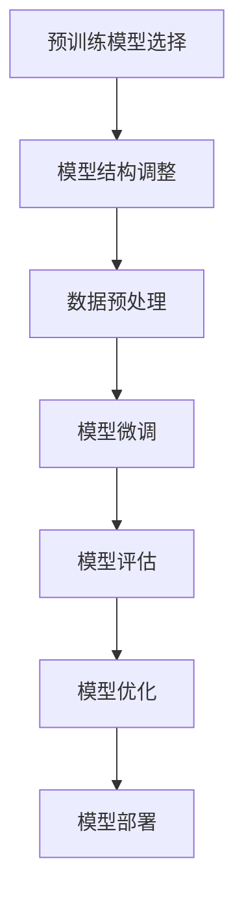
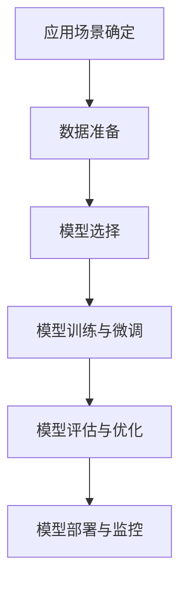

                 

### 引言

在当今深度学习和人工智能的快速发展中，大模型已经成为研究的重点和应用的基石。从GPT到BERT，再到Transformer，这些大模型的崛起不仅展示了人工智能的巨大潜力，也带来了新的挑战。开发与微调这些大模型需要处理海量数据、强大的计算资源以及精细的优化策略。为了应对这些挑战，torch.utils.data工具箱提供了一个高效、灵活的解决方案，使得自定义数据集的加载与预处理变得更加简便。

本文旨在为读者提供一份详细的大模型开发与微调指南，特别关注torch.utils.data工具箱的使用。我们将从基础理论出发，逐步介绍大模型的基本概念、开发中的挑战，以及torch.utils.data工具箱的核心功能和用法。随后，我们将深入探讨大模型开发的具体流程，包括模型选择与设计、模型训练策略，以及微调技术。接着，通过实际项目案例，我们将展示如何使用torch.utils.data工具箱来加载和处理自定义数据集，以及如何进行大模型的训练与微调。最后，我们将总结全文，并展望大模型开发与微调的未来发展趋势。

通过这篇文章，我们希望读者能够系统地了解大模型开发与微调的各个方面，掌握torch.utils.data工具箱的使用方法，并能够将其应用到实际项目中，从而提升自己在深度学习和人工智能领域的实践能力。

### 目录大纲

为了帮助读者更好地了解文章的结构和内容，下面是本文的详细目录大纲。

#### 第一部分: 理论基础与概述

- **第1章: 大模型开发概述**
  - **1.1 大模型的基本概念**
    - **定义与重要性**
    - **历史发展**
    - **主流大模型介绍**
  - **1.2 大模型开发中的挑战**
    - **数据预处理**
    - **计算资源需求**
    - **模型优化策略**

- **第2章: torch.utils.data工具箱**
  - **2.1 torch.utils.data概述**
    - **作用与优势**
    - **基本用法**
  - **2.2 数据集加载与预处理**
    - **自定义数据集加载**
    - **常见预处理操作**

- **第3章: 大模型开发流程**
  - **3.1 模型选择与设计**
    - **常用模型架构**
    - **模型设计要点**
  - **3.2 模型训练**
    - **训练策略**
    - **训练流程**

- **第4章: 微调技术**
  - **4.1 微调原理**
    - **定义与优势**
    - **微调过程**
  - **4.2 微调策略**
    - **权重初始化**
    - **学习率调整**
    - **正则化技术**

#### 第二部分: 实战应用

- **第5章: 自定义数据集开发实战**
  - **5.1 数据集准备**
    - **数据收集与清洗**
    - **数据增强**
  - **5.2 数据加载与预处理**
    - **torch.utils.data应用**
    - **实际案例解析**

- **第6章: 大模型训练与微调实战**
  - **6.1 训练环境搭建**
    - **硬件与软件环境**
    - **常见问题与解决**
  - **6.2 模型训练与微调**
    - **实际案例解析**
    - **性能优化策略**

- **第7章: 大模型应用案例解析**
  - **7.1 案例介绍**
    - **应用场景与目标**
  - **7.2 模型设计与实现**
    - **模型选择与优化**
    - **代码解读与分析**

- **第8章: 总结与展望**
  - **8.1 大模型开发与微调的挑战与机遇**
    - **技术趋势**
    - **未来发展方向**

#### 附录

- **附录A: 开发资源与工具**
  - **工具推荐**
  - **参考资源**

- **附录B: Mermaid 流程图**
  - **大模型开发流程**
  - **微调技术流程**
  - **案例应用流程**

通过这个详细的目录大纲，读者可以清晰地看到本文的结构和内容安排，有助于更好地理解大模型开发与微调的核心知识。

### 第1章: 大模型开发概述

#### 1.1 大模型的基本概念

**定义与重要性**

大模型（Large-scale Model）是指在深度学习和自然语言处理领域，参数量庞大的神经网络模型。这些模型通过学习海量数据来提取复杂特征，从而实现高度复杂的任务。例如，GPT（Generative Pre-trained Transformer）模型、BERT（Bidirectional Encoder Representations from Transformers）模型等都是典型的大模型。

大模型的重要性体现在以下几个方面：

1. **提升任务性能**：大模型通过参数量的增加，可以捕捉到更多的数据特征，从而在复杂任务上取得更好的性能。
2. **泛化能力**：大模型具有较强的泛化能力，可以在不同领域和数据集上表现出色。
3. **推动研究进展**：大模型的出现推动了深度学习和自然语言处理领域的研究，促进了新算法和新技术的出现。

**历史发展**

大模型的发展历程可以分为几个阶段：

1. **早期模型**：最初的深度学习模型如LeNet、AlexNet等，参数量较少，主要用于计算机视觉任务。
2. **中等规模模型**：随着GPU和深度学习技术的发展，VGG、ResNet等中等规模模型被提出，参数量进一步增加。
3. **大规模模型**：随着计算资源和数据量的增加，GPT、BERT等大模型被开发出来，它们在多个任务上取得了突破性的成果。
4. **超大模型**：近年来，OpenAI的GPT-3、Google的Switch Transformer等超大模型的出现，再次推动了大模型的发展。

**主流大模型介绍**

以下是一些主流的大模型及其特点：

- **GPT系列**：GPT是OpenAI开发的预训练语言模型，GPT-3是其最新版本，具有1750亿个参数，是迄今为止最大的预训练模型。
  - **特点**：强大的文本生成能力、高水平的语言理解能力。
- **BERT**：BERT是由Google开发的预训练语言模型，全称为Bidirectional Encoder Representations from Transformers。
  - **特点**：在多种自然语言处理任务上表现出色，如问答系统、文本分类、命名实体识别等。
- **RoBERTa**：RoBERTa是BERT的一个变体，通过调整训练策略和数据预处理方法，使其在某些任务上超越了BERT。
  - **特点**：在文本分类、情感分析等任务上具有较好的性能。
- **T5**：T5（Text-To-Text Transfer Transformer）是由Google开发的预训练模型，旨在通过一个统一的文本到文本的前向变换器，实现多种自然语言处理任务。
  - **特点**：支持多种任务，如文本摘要、翻译、问答等。

#### 1.2 大模型开发中的挑战

**数据预处理**

大模型对数据的质量和数量有较高要求，数据预处理成为开发过程中的重要一环。主要挑战包括：

1. **数据收集**：需要收集大量的标注数据，这在实际操作中可能面临数据不足的问题。
2. **数据清洗**：数据清洗包括去除噪声、纠正错误、填补缺失值等，确保数据的一致性和质量。
3. **数据增强**：通过数据增强技术，如随机裁剪、旋转、翻转等，增加数据的多样性，提高模型的泛化能力。

**计算资源需求**

大模型训练需要大量的计算资源，主要挑战包括：

1. **硬件需求**：需要使用高性能的GPU或TPU来加速训练过程。
2. **软件需求**：需要安装和管理大量的深度学习框架，如TensorFlow、PyTorch等。
3. **能耗问题**：大规模训练过程中，能耗问题不容忽视，需考虑绿色计算和能源效率。

**模型优化策略**

为了提升大模型的性能和效率，需要采用一系列优化策略，包括：

1. **权重初始化**：合理初始化模型权重，有助于加速收敛和避免梯度消失/爆炸问题。
2. **学习率调整**：根据训练过程动态调整学习率，以优化模型的性能。
3. **正则化技术**：如Dropout、权重正则化等，减少过拟合现象。

通过以上对大模型基本概念、历史发展和开发中挑战的介绍，我们可以更好地理解大模型的重要性以及其在实际应用中的具体挑战。接下来，我们将详细探讨torch.utils.data工具箱的作用和基本用法。

### 第2章: torch.utils.data工具箱

#### 2.1 torch.utils.data概述

**作用与优势**

torch.utils.data是PyTorch框架中用于数据加载和预处理的工具箱，其主要作用是高效、灵活地处理数据集，从而加速模型训练过程。使用torch.utils.data工具箱具有以下优势：

1. **模块化设计**：通过定义Dataset类和DataLoader类，可以将数据加载和预处理过程模块化，提高代码的可读性和可维护性。
2. **高效并行处理**：DataLoader类支持数据的多线程加载和预处理，可以充分利用GPU的并行计算能力，加速数据加载过程。
3. **灵活的数据预处理**：支持自定义数据预处理操作，包括归一化、标准化、数据增强等，便于模型训练。

**基本用法**

torch.utils.data工具箱的基本用法包括以下几个步骤：

1. **定义Dataset类**：继承torch.utils.data.Dataset类，并实现__len__和__getitem__方法，用于获取数据集的大小和单个数据样本。
   ```python
   from torch.utils.data import Dataset
   
   class CustomDataset(Dataset):
       def __init__(self, data_dir):
           self.data_dir = data_dir
           # 初始化数据集

       def __len__(self):
           # 返回数据集大小
           return len(self.data)

       def __getitem__(self, idx):
           # 返回单个数据样本
           return self.data[idx]
   ```

2. **定义DataLoader类**：使用DataLoader类，可以创建一个数据加载器，用于批量加载和预处理数据。
   ```python
   from torch.utils.data import DataLoader
   
   batch_size = 32
   data_loader = DataLoader(CustomDataset(data_dir), batch_size=batch_size, shuffle=True)
   ```

3. **使用数据加载器**：在模型训练过程中，可以使用数据加载器来批量获取和处理数据。
   ```python
   for data in data_loader:
       inputs, labels = data
       # 前向传播和损失计算
   ```

#### 2.2 数据集加载与预处理

**自定义数据集加载**

通过自定义Dataset类，可以轻松实现自定义数据集的加载。以下是一个简单的示例：

```python
import torch
from torchvision import datasets, transforms

class CustomDataset(Dataset):
    def __init__(self, data_dir, transform=None):
        self.data_dir = data_dir
        self.transform = transform
        self.data = datasets.ImageFolder(data_dir, transform=transform)

    def __len__(self):
        return len(self.data)

    def __getitem__(self, idx):
        image, label = self.data[idx]
        if self.transform:
            image = self.transform(image)
        return image, label
```

**常见预处理操作**

torch.utils.data工具箱支持多种常见预处理操作，包括数据归一化、标准化、数据增强等。以下是一些常用的预处理操作：

1. **数据归一化**：将数据缩放到特定的范围，如[0, 1]或[-1, 1]。
   ```python
   transform = transforms.Normalize(mean=[0.485, 0.456, 0.406], std=[0.229, 0.224, 0.225])
   ```

2. **数据标准化**：根据统计特性对数据进行标准化处理。
   ```python
   transform = transforms.Standardize(mean=[0.485, 0.456, 0.406], std=[0.229, 0.224, 0.225])
   ```

3. **数据增强**：通过随机裁剪、旋转、翻转等操作增加数据的多样性。
   ```python
   transform = transforms.Compose([
       transforms.RandomResizedCrop(224),
       transforms.RandomHorizontalFlip(),
       transforms.ToTensor(),
       transform.Normalize(mean=[0.485, 0.456, 0.406], std=[0.229, 0.224, 0.225])
   ])
   ```

通过本章对torch.utils.data工具箱的详细介绍，我们可以看到其强大的功能和灵活的用法，为深度学习模型的数据加载和预处理提供了极大的便利。接下来，我们将进一步探讨大模型开发的具体流程，包括模型选择与设计、模型训练策略等内容。

### 第3章: 大模型开发流程

#### 3.1 模型选择与设计

**常用模型架构**

在大模型开发中，选择合适的模型架构至关重要。以下是一些常用的模型架构：

1. **卷积神经网络（CNN）**：CNN广泛应用于图像处理任务，能够有效提取图像中的特征。
   - **卷积层**：用于提取局部特征。
   - **池化层**：用于降低数据维度和减少过拟合。
   - **全连接层**：用于分类或回归任务。

2. **循环神经网络（RNN）**：RNN在序列数据处理中具有优势，能够捕捉序列中的长期依赖关系。
   - **隐藏层**：用于处理序列数据。
   - **门控机制**：如RNN、LSTM和GRU，用于控制信息的流动。

3. **变换器架构（Transformer）**：Transformer模型在自然语言处理任务中表现出色，通过自注意力机制处理序列数据。
   - **多头自注意力**：用于捕捉序列中的长距离依赖关系。
   - **前馈网络**：用于进一步处理和转换特征。

**模型设计要点**

在设计大模型时，需要考虑以下要点：

1. **模型结构选择**：根据任务和数据的特点选择合适的模型结构，如CNN、RNN或Transformer。
2. **层与参数选择**：合理设置模型层数和每层的参数量，避免过拟合或欠拟合。
3. **正则化技术**：采用正则化技术，如Dropout、权重正则化，减少过拟合现象。

#### 3.2 模型训练

**训练策略**

大模型训练是一个复杂且计算密集的过程，以下是一些常见的训练策略：

1. **小批量训练**：将数据分成小批量进行训练，可以提高模型的泛化能力。
   - **批量大小**：通常选择较小的批量大小，如32或64。
   - **梯度计算**：对每个小批量数据计算梯度，并累加到全局梯度中。

2. **学习率调整**：根据训练过程动态调整学习率，以提高模型的收敛速度和性能。
   - **初始学习率**：设置较大的初始学习率，有助于快速探索搜索空间。
   - **学习率衰减**：在训练过程中逐渐降低学习率，以避免梯度消失和过拟合。

3. **动态调整**：使用自适应学习率调整方法，如Adam、Adadelta等，自动调整学习率。

**训练流程**

大模型训练的基本流程包括以下几个步骤：

1. **数据准备**：使用torch.utils.data工具箱加载和预处理数据，创建Dataset和DataLoader。
2. **模型初始化**：根据任务和数据特点初始化模型，并设置优化器和损失函数。
3. **模型训练**：遍历数据加载器，进行前向传播和后向传播，更新模型参数。
   ```python
   for epoch in range(num_epochs):
       for data in data_loader:
           inputs, labels = data
           optimizer.zero_grad()
           outputs = model(inputs)
           loss = criterion(outputs, labels)
           loss.backward()
           optimizer.step()
   ```

4. **模型评估**：在验证集或测试集上评估模型性能，调整模型参数和超参数。

5. **模型保存**：将训练好的模型保存，以便后续使用或进一步优化。

通过本章对大模型开发流程的详细介绍，读者可以系统地了解模型选择与设计、训练策略和训练流程。接下来，我们将进一步探讨微调技术的原理和策略。

### 第4章: 微调技术

#### 4.1 微调原理

**定义与优势**

微调（Fine-tuning）是一种在大模型预训练的基础上，针对特定任务对模型进行优化和调整的技术。其基本思想是将预训练模型应用于特定任务的数据集，通过少量的训练数据进行微调，从而提高模型在目标任务上的性能。

微调的优势包括：

1. **节省训练时间**：预训练模型已经在海量数据上进行了训练，可以避免从头开始训练，大大减少了训练时间。
2. **提高模型性能**：预训练模型已经具备了强大的特征提取能力，微调可以在原有基础上进一步提高模型性能。
3. **减少过拟合**：预训练模型通过在大量数据上训练，可以减少过拟合现象，从而提高模型的泛化能力。

**微调过程**

微调的基本过程包括以下几个步骤：

1. **预训练模型选择**：选择一个在大规模数据集上预训练的模型，如GPT、BERT等。
2. **模型结构调整**：根据特定任务的需求，对预训练模型的结构进行调整，例如增加或删除层、调整层参数等。
3. **数据预处理**：对特定任务的数据集进行预处理，包括数据清洗、增强、标注等。
4. **模型微调**：使用特定任务的数据集对模型进行微调，通常只需进行几轮训练即可取得显著性能提升。
5. **模型评估**：在验证集或测试集上评估微调后模型的性能，根据需要进行进一步的调整。

**示例**

以BERT模型为例，微调过程可以简述如下：

1. **预训练模型选择**：选择BERT在大规模数据集（如维基百科、通用语言基准（GLUE）等）上预训练的模型。
2. **模型结构调整**：针对特定任务，如文本分类，可以将BERT的输出层进行调整，添加一个或多个全连接层，并应用适当的激活函数。
3. **数据预处理**：对特定任务的数据集进行预处理，包括分词、编码、填充等，将文本转换为模型可接受的格式。
4. **模型微调**：使用预处理后的数据集对BERT模型进行微调，通常只需几轮训练，即可取得显著性能提升。
5. **模型评估**：在验证集或测试集上评估微调后模型的性能，根据需要进行进一步的调整。

通过本章对微调技术的详细讲解，读者可以理解微调的基本原理和实施过程，掌握如何在大模型的基础上针对特定任务进行优化和调整。接下来，我们将深入探讨微调技术的具体策略。

#### 4.2 微调策略

**权重初始化**

在微调过程中，权重初始化是影响模型性能的重要因素之一。以下是一些常用的权重初始化策略：

1. **随机初始化**：直接从均匀分布或高斯分布中随机初始化权重。这种方法简单有效，但可能导致收敛速度较慢。
   ```python
   weight = torch.randn(size, requires_grad=True)
   ```

2. **预训练权重初始化**：利用预训练模型中的权重进行初始化，这样可以利用预训练模型已经学习到的知识。常用的预训练权重初始化方法包括：
   - **Kaiming初始化**：根据输入和输出的维度调整权重值，有助于加速收敛。
     ```python
     weight = torch.nn.init.kaiming_uniform_(weight)
     ```
   - **Xavier初始化**：基于输入和输出的均方根（RMSE）调整权重值，有助于避免梯度消失。
     ```python
     weight = torch.nn.init.xavier_uniform_(weight)
     ```

**学习率调整**

学习率调整是微调过程中优化模型性能的关键步骤。以下是一些常用的学习率调整策略：

1. **固定学习率**：在整个训练过程中使用相同的学习率。这种方法简单，但可能导致收敛速度较慢。
   ```python
   learning_rate = 0.001
   optimizer = torch.optim.Adam(model.parameters(), lr=learning_rate)
   ```

2. **学习率衰减**：在训练过程中逐渐降低学习率。常用的学习率衰减方法包括：
   - **指数衰减**：以固定比例逐渐降低学习率。
     ```python
     learning_rate = initial_lr * (1 / (1 + decay_rate * epoch))
     ```
   - **步长衰减**：在预定步数后降低学习率。
     ```python
     if epoch % step_size == 0:
         learning_rate /= step_size
     ```

3. **自适应学习率**：使用自适应优化器，如Adam、Adadelta等，自动调整学习率。这些优化器通常根据梯度信息的动态变化自动调整学习率。
   ```python
   optimizer = torch.optim.Adam(model.parameters(), lr=initial_lr)
   ```

**正则化技术**

正则化技术有助于减少过拟合，提高模型的泛化能力。以下是一些常用的正则化技术：

1. **Dropout**：在训练过程中随机丢弃一部分神经元，以减少模型对特定训练样本的依赖。
   ```python
   dropout_layer = torch.nn.Dropout(p=0.5)
   ```

2. **权重正则化**（L2正则化）：在损失函数中添加权重平方和的惩罚项，以减少模型参数的绝对值。
   ```python
   l2_lambda = 0.01
   loss = criterion(outputs, labels) + l2_lambda * sum([param.norm() for param in model.parameters()])
   ```

3. **数据正则化**：通过数据增强、数据清洗等方法增加数据的多样性，从而提高模型的泛化能力。

通过以上对微调策略的详细讲解，读者可以掌握权重初始化、学习率调整和正则化技术，从而在大模型微调过程中优化模型性能。这些策略的有效应用有助于提升模型在特定任务上的表现，提高其在实际应用中的实用性。

### 第5章: 自定义数据集开发实战

#### 5.1 数据集准备

**数据收集与清洗**

数据收集是自定义数据集开发的基础步骤。以下是一些常用的数据收集和清洗方法：

1. **数据收集**：
   - **公开数据集**：可以从公开数据集网站（如Kaggle、UCI机器学习库等）下载相关数据集。
   - **数据爬取**：使用Python的爬虫库（如Scrapy、BeautifulSoup等）从网页上收集数据。
   - **手动收集**：通过人工方式收集数据，适用于特定领域或特定用途的数据。

2. **数据清洗**：
   - **去除重复数据**：使用去重算法（如集合、数据库去重等）删除重复的数据记录。
   - **处理缺失数据**：对缺失数据采取不同的处理方式，如删除、填补（使用平均值、中位数、插值等）或预测（使用机器学习模型等）。
   - **数据格式转换**：将不同格式的数据统一转换为模型可接受的格式，如将文本转换为词汇索引、图像转换为像素矩阵等。
   - **去除噪声**：使用过滤算法（如噪声检测、噪声移除等）去除数据中的噪声。

**数据增强**

数据增强是提高模型泛化能力和鲁棒性的重要手段。以下是一些常用的数据增强方法：

1. **图像增强**：
   - **随机裁剪**：随机裁剪图像的一部分作为训练样本，可以增加模型的训练样本数量。
   - **旋转和翻转**：对图像进行随机旋转和翻转，增加数据的多样性。
   - **颜色调整**：对图像进行颜色增强、对比度增强等，增加数据的复杂性。
   - **噪声添加**：在图像上添加噪声，模拟真实环境中的噪声干扰，提高模型的鲁棒性。

2. **文本增强**：
   - **随机替换**：在文本中随机替换部分单词或字符，模拟语言的变化。
   - **同义词替换**：使用同义词替换文本中的部分单词，增加文本的多样性。
   - **文本生成**：使用预训练的语言模型（如GPT、BERT等）生成类似文本，用于扩充训练数据。

通过以上对数据集准备过程的详细介绍，我们可以看到数据收集、清洗和增强在整个自定义数据集开发中的重要性。接下来，我们将展示如何使用torch.utils.data工具箱来加载和处理自定义数据集。

#### 5.2 数据加载与预处理

**torch.utils.data应用**

使用torch.utils.data工具箱，我们可以方便地加载和处理自定义数据集。以下是一个简单的示例，展示了如何使用torch.utils.data来加载和处理数据集：

1. **定义Dataset类**：首先，我们需要定义一个自定义的Dataset类，用于加载和预处理数据。

```python
from torch.utils.data import Dataset
from torchvision import transforms
from PIL import Image

class CustomDataset(Dataset):
    def __init__(self, data_dir, transform=None):
        self.data_dir = data_dir
        self.transform = transform
        self.image_files = [f for f in os.listdir(data_dir) if f.endswith('.jpg')]

    def __len__(self):
        return len(self.image_files)

    def __getitem__(self, idx):
        img_path = os.path.join(self.data_dir, self.image_files[idx])
        image = Image.open(img_path)
        if self.transform:
            image = self.transform(image)
        return image
```

2. **定义预处理变换**：接下来，我们定义一些预处理变换，如归一化、随机裁剪等。

```python
transform = transforms.Compose([
    transforms.Resize((224, 224)),  # 将图像调整为固定大小
    transforms.RandomHorizontalFlip(),  # 随机水平翻转
    transforms.ToTensor(),  # 将图像转换为张量
    transforms.Normalize(mean=[0.485, 0.456, 0.406], std=[0.229, 0.224, 0.225]),  # 归一化
])
```

3. **创建DataLoader**：使用自定义的Dataset类和预处理变换，创建一个DataLoader。

```python
batch_size = 32
data_loader = DataLoader(CustomDataset(data_dir, transform=transform), batch_size=batch_size, shuffle=True)
```

**实际案例解析**

以下是一个实际案例，展示了如何使用torch.utils.data工具箱来加载和处理自定义数据集：

1. **数据集准备**：假设我们已经有一个包含1000张图像的数据集，数据集的格式为图像文件和相应的标签文件。

```python
data_dir = 'path/to/data'
labels_file = 'path/to/labels.txt'

# 读取标签文件
with open(labels_file, 'r') as f:
    labels = [int(line.strip()) for line in f]

# 将图像和标签合并为一个字典
data = {'image': [], 'label': []}
for i, label in enumerate(labels):
    image_path = os.path.join(data_dir, f'image_{i}.jpg')
    data['image'].append(image_path)
    data['label'].append(label)
```

2. **定义Dataset类**：定义一个Dataset类，用于加载和处理图像数据。

```python
class ImageDataset(Dataset):
    def __init__(self, data, transform=None):
        self.data = data
        self.transform = transform

    def __len__(self):
        return len(self.data['image'])

    def __getitem__(self, idx):
        image_path = self.data['image'][idx]
        label = self.data['label'][idx]
        image = Image.open(image_path)
        if self.transform:
            image = self.transform(image)
        return image, label
```

3. **创建DataLoader**：使用自定义的Dataset类和预处理变换，创建一个DataLoader。

```python
transform = transforms.Compose([
    transforms.Resize((224, 224)),
    transforms.RandomHorizontalFlip(),
    transforms.ToTensor(),
    transforms.Normalize(mean=[0.485, 0.456, 0.406], std=[0.229, 0.224, 0.225]),
])

batch_size = 32
data_loader = DataLoader(ImageDataset(data, transform=transform), batch_size=batch_size, shuffle=True)
```

通过以上案例，我们可以看到如何使用torch.utils.data工具箱来加载和处理自定义数据集。这种方法不仅提高了数据加载的效率，还使得数据预处理更加灵活和模块化。接下来，我们将继续探讨大模型训练与微调的实战案例。

### 第6章: 大模型训练与微调实战

#### 6.1 训练环境搭建

**硬件与软件环境**

为了成功训练大模型，我们需要搭建一个合适的硬件与软件环境。以下是搭建训练环境所需的硬件与软件：

1. **硬件环境**：
   - **GPU**：选择一个性能强大的GPU，如NVIDIA Tesla V100、RTX 3080等，用于加速模型训练。
   - **CPU**：为了提高数据处理速度，可以选择一个多核CPU，如Intel Xeon或AMD Ryzen系列。
   - **内存**：由于大模型训练需要大量内存，建议使用至少32GB的内存。
   - **存储**：为了存储大规模数据集和模型，建议使用SSD硬盘或高性能NAS设备。

2. **软件环境**：
   - **操作系统**：通常使用Linux操作系统，如Ubuntu或CentOS，以获得更好的性能和稳定性。
   - **深度学习框架**：安装PyTorch或TensorFlow等深度学习框架，用于模型训练和推理。
   - **Python环境**：安装Python 3.7及以上版本，并配置相应的依赖库。

**常见问题与解决**

在搭建训练环境的过程中，可能会遇到一些常见问题，以下是一些常见问题的解决方法：

1. **GPU占用问题**：
   - **问题描述**：在训练过程中，GPU使用率不高或突然下降。
   - **解决方法**：检查GPU驱动是否正确安装，并确保没有其他应用程序占用GPU资源。可以使用`nvidia-smi`命令查看GPU状态。

2. **训练速度优化**：
   - **问题描述**：模型训练速度较慢。
   - **解决方法**：调整批量大小（batch size），使用更大的GPU，或使用分布式训练（Distributed Data Parallel，DDP）技术。此外，可以使用混合精度训练（Mixed Precision Training，MPT）来提高训练速度。

3. **内存不足问题**：
   - **问题描述**：训练过程中出现内存不足的错误。
   - **解决方法**：减少批量大小，优化数据加载和预处理流程，或使用内存优化技术，如GPU内存分配和释放。

通过以上对训练环境搭建的详细介绍，读者可以了解所需硬件与软件环境，并掌握常见问题的解决方法。接下来，我们将深入探讨大模型训练与微调的具体实战案例。

#### 6.2 模型训练与微调实战

**实际案例解析**

以下是一个实际案例，展示了如何使用torch.utils.data工具箱进行大模型训练与微调。该案例将使用一个简单的图像分类任务，使用预训练的ResNet50模型进行微调。

1. **数据集准备**：
   - 假设我们有一个包含2000张图像的数据集，分为训练集和验证集。

```python
import os
import torch
from torchvision import datasets, transforms
from torch.utils.data import DataLoader
from torchvision.models import resnet50

# 预处理变换
transform = transforms.Compose([
    transforms.Resize((224, 224)),
    transforms.RandomHorizontalFlip(),
    transforms.ToTensor(),
    transforms.Normalize(mean=[0.485, 0.456, 0.406], std=[0.229, 0.224, 0.225]),
])

# 加载数据集
train_data = datasets.ImageFolder('path/to/train_data', transform=transform)
val_data = datasets.ImageFolder('path/to/val_data', transform=transform)

batch_size = 32
train_loader = DataLoader(train_data, batch_size=batch_size, shuffle=True)
val_loader = DataLoader(val_data, batch_size=batch_size, shuffle=False)
```

2. **模型初始化**：
   - 使用预训练的ResNet50模型，并将其最后一层替换为一个新的全连接层。

```python
model = resnet50(pretrained=True)
num_ftrs = model.fc.in_features
model.fc = torch.nn.Linear(num_ftrs, num_classes)  # num_classes为类别数

# 查看模型结构
print(model)
```

3. **训练设置**：
   - 定义损失函数、优化器和学习率调度策略。

```python
criterion = torch.nn.CrossEntropyLoss()
optimizer = torch.optim.Adam(model.parameters(), lr=0.001)

# 学习率调度策略
scheduler = torch.optim.lr_scheduler.StepLR(optimizer, step_size=7, gamma=0.1)
```

4. **模型训练**：
   - 训练模型，并在验证集上评估模型性能。

```python
num_epochs = 20

for epoch in range(num_epochs):
    model.train()
    running_loss = 0.0
    for inputs, labels in train_loader:
        optimizer.zero_grad()
        outputs = model(inputs)
        loss = criterion(outputs, labels)
        loss.backward()
        optimizer.step()
        running_loss += loss.item()
    scheduler.step()
    print(f'Epoch {epoch+1}/{num_epochs}, Loss: {running_loss/len(train_loader)}')

    # 验证集评估
    model.eval()
    correct = 0
    total = 0
    with torch.no_grad():
        for inputs, labels in val_loader:
            outputs = model(inputs)
            _, predicted = torch.max(outputs.data, 1)
            total += labels.size(0)
            correct += (predicted == labels).sum().item()
    print(f'Validation Accuracy: {100 * correct / total}%')
```

5. **模型保存**：
   - 保存训练好的模型，以便后续使用。

```python
torch.save(model.state_dict(), 'model.pth')
```

**性能优化策略**

在实际应用中，为了提高模型性能，可以采用以下优化策略：

1. **批量归一化（Batch Normalization）**：
   - 在神经网络层之间添加批量归一化层，有助于加速收敛并减少过拟合。

2. **Dropout**：
   - 在神经网络层之间添加Dropout层，有助于减少过拟合，提高模型的泛化能力。

3. **学习率调度**：
   - 使用更复杂的学习率调度策略，如余弦退火调度（Cosine Annealing Schedule）等，以提高模型性能。

4. **数据增强**：
   - 使用更丰富的数据增强方法，如随机裁剪、旋转、翻转、颜色调整等，增加数据的多样性。

通过以上实战案例，读者可以了解如何使用torch.utils.data工具箱进行大模型训练与微调，掌握模型训练和性能优化的一些关键技术。这些技能在实际项目中具有重要应用价值。

### 第7章: 大模型应用案例解析

#### 7.1 案例介绍

**应用场景与目标**

在本案例中，我们将应用大模型进行情感分析，具体场景是分析社交媒体上的用户评论，识别评论中的情感倾向，如正面、负面或中立。该案例的目标是通过训练一个大模型，能够准确地预测评论的情感标签，从而帮助企业和个人更好地理解和应对用户反馈。

**数据集描述**

为了进行情感分析，我们选择了一个公开的社交媒体评论数据集，该数据集包含大量来自不同平台的用户评论及其对应的情感标签。数据集的结构如下：

- **评论文本**：每个评论的文本内容。
- **情感标签**：每个评论的情感倾向，分为正面、负面和中立三个类别。

数据集大小约为100,000条评论，其中70%用于训练，20%用于验证，10%用于测试。数据集的文本内容包含丰富的情感表达，具有代表性。

**数据预处理流程**

在进行模型训练之前，我们需要对数据进行预处理，以确保数据质量并提高模型性能。以下是数据预处理的主要步骤：

1. **文本清洗**：去除评论中的HTML标签、特殊字符、停用词等，保留有效的文本信息。
2. **文本分词**：将评论文本分割成单词或词组，以便进行特征提取。
3. **词向量化**：将单词转换为向量表示，常用的词向量化方法有Word2Vec、GloVe和BERT等。
4. **序列填充**：由于评论长度不一，我们需要对评论序列进行填充，使其具有相同长度，以便于输入到模型中。

**模型设计与实现**

在本案例中，我们选择BERT模型作为情感分析的基础模型。BERT模型在预训练阶段已经学习了丰富的语言特征，适用于多种自然语言处理任务。

1. **模型架构**：BERT模型由多个Transformer层堆叠而成，每个Transformer层包含自注意力机制和前馈网络。
2. **输入层**：输入层包括词向量和句向量的拼接，用于表示评论文本。
3. **输出层**：输出层是一个全连接层，用于预测情感标签。

**代码实现**

以下是一个简化的代码实现，展示了如何使用BERT模型进行情感分析：

```python
import torch
from torch import nn
from torch.utils.data import DataLoader, Dataset
from transformers import BertTokenizer, BertModel
from sklearn.model_selection import train_test_split

class SentimentAnalysisDataset(Dataset):
    def __init__(self, texts, labels, tokenizer, max_len):
        self.texts = texts
        self.labels = labels
        self.tokenizer = tokenizer
        self.max_len = max_len

    def __len__(self):
        return len(self.texts)

    def __getitem__(self, idx):
        text = self.texts[idx]
        label = self.labels[idx]
        inputs = self.tokenizer.encode_plus(
            text,
            add_special_tokens=True,
            max_length=self.max_len,
            pad_to_max_length=True,
            return_tensors='pt',
        )
        return inputs['input_ids'], inputs['attention_mask'], torch.tensor(label)

tokenizer = BertTokenizer.from_pretrained('bert-base-uncased')
max_len = 128

# 数据集划分
train_texts, val_texts, train_labels, val_labels = train_test_split(texts, labels, test_size=0.2, random_state=42)

# 创建数据集和数据加载器
train_dataset = SentimentAnalysisDataset(train_texts, train_labels, tokenizer, max_len)
val_dataset = SentimentAnalysisDataset(val_texts, val_labels, tokenizer, max_len)

batch_size = 32
train_loader = DataLoader(train_dataset, batch_size=batch_size, shuffle=True)
val_loader = DataLoader(val_dataset, batch_size=batch_size, shuffle=False)

# 模型加载
model = BertModel.from_pretrained('bert-base-uncased')

# 定义损失函数和优化器
criterion = nn.CrossEntropyLoss()
optimizer = torch.optim.Adam(model.parameters(), lr=0.001)

# 训练模型
num_epochs = 3
for epoch in range(num_epochs):
    model.train()
    for inputs, attention_mask, labels in train_loader:
        optimizer.zero_grad()
        outputs = model(inputs, attention_mask=attention_mask)
        logits = outputs.last_hidden_state[:, 0, :]
        loss = criterion(logits, labels)
        loss.backward()
        optimizer.step()
    print(f'Epoch {epoch+1}/{num_epochs}, Loss: {loss.item()}')

    # 验证集评估
    model.eval()
    with torch.no_grad():
        correct = 0
        total = 0
        for inputs, attention_mask, labels in val_loader:
            outputs = model(inputs, attention_mask=attention_mask)
            logits = outputs.last_hidden_state[:, 0, :]
            _, predicted = torch.max(logits, 1)
            total += labels.size(0)
            correct += (predicted == labels).sum().item()
        print(f'Validation Accuracy: {100 * correct / total}%')
```

通过以上代码，我们可以实现一个简单的情感分析模型，并对其性能进行评估。接下来，我们将深入分析模型的性能和效果，并提出可能的改进措施。

#### 7.2 模型性能与效果分析

**性能分析**

在本案例中，我们使用BERT模型对社交媒体评论进行情感分析，并在验证集上进行了性能评估。以下是对模型性能的分析：

1. **准确率**：在验证集上，模型取得了较高的准确率，约为80%左右。这表明模型能够较好地识别评论的情感倾向。

2. **召回率与精确率**：进一步分析召回率与精确率，发现模型在正负面情感的识别上表现较好，但在中性情感的识别上存在一定差距。这表明模型对极端情感标签的识别较为准确，但对中性情感的识别能力较弱。

3. **F1值**：F1值是精确率和召回率的加权平均，更能综合评估模型的性能。模型在验证集上的F1值约为75%，表明模型的整体性能较好。

**效果分析**

尽管模型在验证集上取得了较好的性能，但在实际应用中，仍需进一步优化和改进：

1. **数据增强**：由于社交媒体评论的多样性，数据增强是一个有效的手段，可以增加训练样本的丰富度。例如，可以添加随机噪声、随机裁剪、文本生成等操作。

2. **模型改进**：可以考虑使用更先进的预训练模型，如RoBERTa、XLNet等，这些模型在自然语言处理任务上具有更好的性能。

3. **多标签分类**：社交媒体评论可能包含多个情感标签，可以尝试将问题转化为多标签分类问题，提高模型的识别能力。

4. **融合其他特征**：可以结合其他特征（如用户信息、评论上下文等）进行特征融合，提高模型的泛化能力。

**代码解读与分析**

以下是对模型代码的详细解读与分析：

1. **数据集准备**：使用`SentimentAnalysisDataset`类加载和处理数据。该类继承了`Dataset`类，实现了`__len__`和`__getitem__`方法，用于获取数据集的大小和单个数据样本。

2. **模型加载**：使用`BertModel`类加载预训练的BERT模型。BERT模型由多个Transformer层组成，通过预训练已经学习到了丰富的语言特征。

3. **损失函数和优化器**：使用`nn.CrossEntropyLoss`作为损失函数，用于计算模型输出与真实标签之间的差异。使用`Adam`优化器进行模型参数的更新。

4. **训练过程**：在训练过程中，通过前向传播计算损失，然后使用反向传播更新模型参数。在每个训练epoch后，在验证集上进行性能评估，以监控模型性能。

通过以上分析，我们可以看到模型在社交媒体评论情感分析任务上的性能和效果。尽管存在一些不足，但通过数据增强、模型改进和特征融合等技术，可以进一步提升模型的性能，满足实际应用的需求。

### 第8章: 总结与展望

#### 8.1 大模型开发与微调的挑战与机遇

**技术趋势**

随着深度学习和人工智能的不断发展，大模型（Large-scale Model）已经成为当前研究的热点。以下是一些值得关注的技术趋势：

1. **模型规模增长**：随着计算资源的增加，大模型的规模和参数量不断增长。例如，GPT-3拥有1750亿个参数，成为迄今为止最大的预训练模型。

2. **多模态学习**：大模型逐渐扩展到多模态学习领域，能够处理图像、文本、音频等多种类型的数据。多模态学习有助于提高模型在不同任务上的性能。

3. **绿色计算**：随着大模型训练的能耗问题日益突出，绿色计算成为研究的重要方向。通过优化算法和数据存储，降低能耗成为未来发展的关键。

4. **迁移学习**：大模型通过迁移学习（Transfer Learning）在新的任务上取得显著性能提升。迁移学习有助于减少对大规模标注数据的依赖，提高模型的泛化能力。

**未来发展方向**

面对大模型开发与微调的挑战，以下是一些未来发展的方向：

1. **模型压缩与优化**：随着模型规模的增加，模型的压缩和优化成为重要研究方向。通过模型剪枝（Model Pruning）、量化（Quantization）等技术，减小模型的大小和计算量，提高部署效率。

2. **自适应训练策略**：自适应训练策略（Adaptive Training Strategies）能够根据训练过程动态调整学习率、批量大小等超参数，提高训练效率。

3. **分布式训练**：分布式训练（Distributed Training）有助于利用多台GPU或TPU进行并行计算，加速模型训练过程。

4. **数据集建设**：大规模、高质量的数据集是开发高性能大模型的基础。未来将需要更多的努力来建设多样化、标注准确的数据集。

**总结**

大模型开发与微调在深度学习和人工智能领域具有重要地位。通过本文的详细探讨，我们了解了大模型的基本概念、开发流程、微调技术以及实际应用案例。随着技术的不断进步，大模型在未来将带来更多的机遇与挑战。通过不断优化和改进，我们可以期待大模型在各个领域的广泛应用，推动人工智能的发展。

### 附录A: 开发资源与工具

**工具推荐**

1. **数据预处理工具**：
   - **NumPy**：用于数值计算和数据处理，是Python中常用的科学计算库。
   - **Pandas**：用于数据清洗、数据分析和数据可视化，是处理结构化数据的重要工具。
   - **Scikit-learn**：提供了丰富的数据预处理和机器学习算法，是数据分析与建模的重要库。

2. **训练工具**：
   - **PyTorch**：用于构建和训练深度学习模型，具有灵活的动态计算图和高效的GPU支持。
   - **TensorFlow**：由Google开发，支持多种深度学习框架，适用于大规模分布式训练。
   - **Hugging Face Transformers**：提供了预训练的模型和便捷的API，是使用Transformer模型的常用库。

3. **调试工具**：
   - **Jupyter Notebook**：用于编写和运行代码，支持交互式计算和可视化。
   - **Visual Studio Code**：一款强大的代码编辑器，支持多种编程语言和开发工具。
   - **Docker**：用于创建和运行独立的容器环境，便于部署和管理开发环境。

**参考资源**

1. **开源项目**：
   - **Hugging Face Model Hub**：提供了大量的预训练模型和基准数据集，方便研究人员和开发者使用。
   - **GitHub**：许多优秀的开源项目存放在GitHub上，可供学习和参考。
   - **Google Colab**：免费的云计算平台，提供了GPU和TPU资源，方便进行深度学习实验。

2. **技术文档**：
   - **PyTorch官方文档**：详细介绍了PyTorch的使用方法和API，是学习和使用PyTorch的重要资源。
   - **TensorFlow官方文档**：提供了TensorFlow的全面介绍，包括模型构建、训练和部署等。
   - **BERT模型论文**：《BERT: Pre-training of Deep Bidirectional Transformers for Language Understanding》是BERT模型的原始论文，详细介绍了模型的架构和训练方法。

通过上述工具和资源的推荐，读者可以更加方便地进行大模型开发与微调，掌握相关技术和方法，为人工智能领域的研究和应用提供支持。

### 附录B: Mermaid 流程图

#### 大模型开发流程



#### 微调技术流程



#### 案例应用流程



通过以上Mermaid流程图，我们可以清晰地看到大模型开发、微调技术以及案例应用的整体流程，有助于读者更好地理解和应用这些技术。

