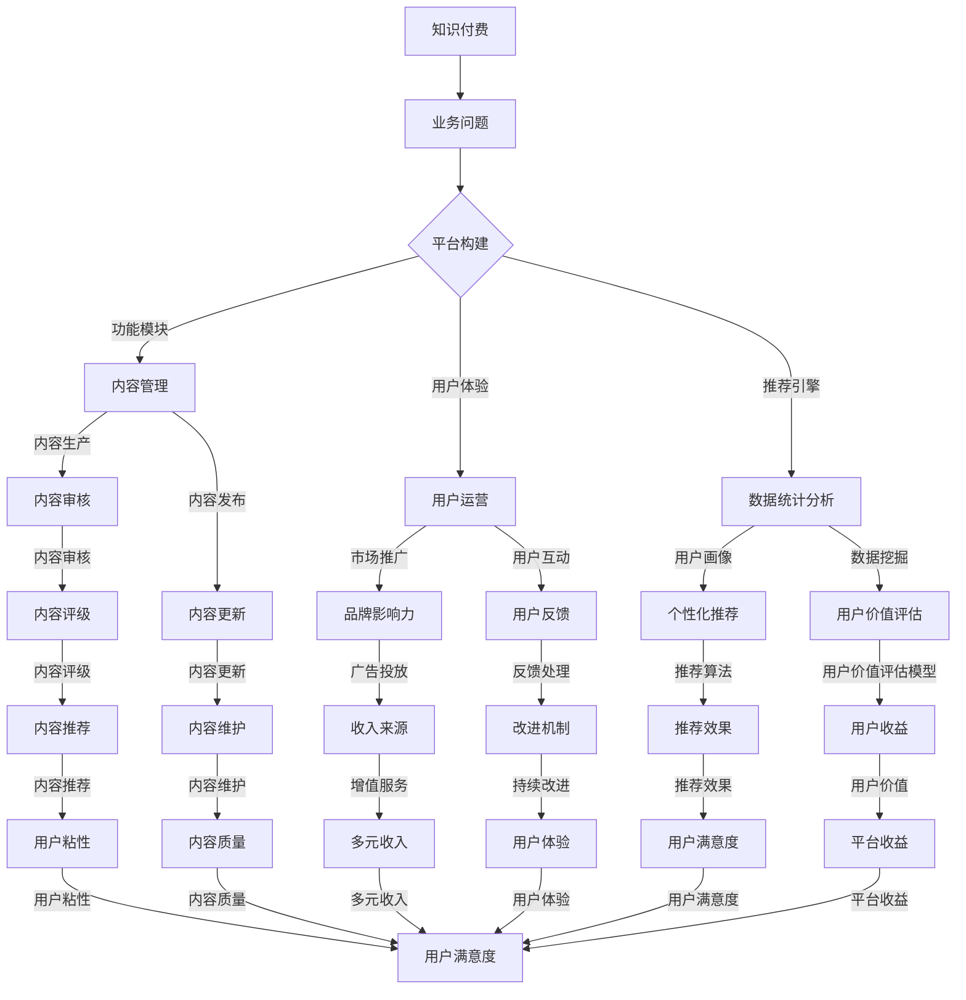

                 

### 《企业知识付费要解决实际业务问题》

#### 关键词：企业知识付费、业务问题、平台构建、内容生产、市场推广、盈利模式、案例分析

> **摘要：** 本文旨在探讨企业知识付费在现代商业环境中的重要性和实际应用，分析企业如何通过知识付费平台解决业务问题，提升核心竞争力。文章将围绕企业知识付费的概念、需求分析、平台构建与运营、盈利模式、案例分析和实际应用场景进行深入探讨，并预测其未来发展趋势。

## 第一部分：企业知识付费概述

### 第1章：企业知识付费的概念与价值

#### 1.1.1 企业知识付费的定义

企业知识付费，指的是企业在获取外部专业知识和经验时，通过支付一定费用来获取相关内容的一种商业模式。这种模式旨在帮助企业快速弥补知识缺口，提高业务效率和创新能力。

#### 1.1.2 企业知识付费的类型

企业知识付费的类型主要包括以下几种：

- **在线课程**：企业通过付费在线学习平台，购买课程来提升员工技能。
- **咨询服务**：企业购买专业咨询公司的服务，解决业务发展中的难题。
- **专利和技术许可**：企业购买其他企业的专利或技术许可，以加速技术创新。
- **内容订阅**：企业通过订阅服务，获取定期更新的专业知识库。

#### 1.1.3 企业知识付费的价值分析

企业知识付费的价值主要体现在以下几个方面：

- **提高业务效率**：通过学习外部专业知识和经验，员工可以更快地掌握新技能，提高工作效率。
- **降低培训成本**：企业知识付费可以减少内部培训的成本，同时提高培训的质量。
- **增强创新能力**：企业通过付费获取的先进知识和经验，可以激发员工的创新思维，推动产品和服务创新。
- **提升企业竞争力**：企业知识付费有助于企业快速适应市场变化，增强市场竞争力。

### 第2章：企业知识付费的需求分析

#### 2.1.1 企业业务问题概述

在快速变化的市场环境中，企业面临着诸多业务问题，如：

- **技术更新速度快**：企业需要不断引进新技术，以保持竞争力。
- **管理能力不足**：企业管理者需要提升管理能力和战略思维。
- **员工技能不足**：员工需要不断学习新技能，以适应岗位需求。
- **市场竞争激烈**：企业需要通过创新来提升产品和服务质量。

#### 2.1.2 企业知识付费需求特征

企业知识付费需求具有以下特征：

- **专业性**：企业需要获取的专业知识要具有针对性和实用性。
- **时效性**：企业需要获取的知识要及时更新，以适应市场变化。
- **多样性**：企业知识付费需求涵盖多个领域，如技术、管理、营销等。
- **个性化**：企业知识付费需求具有个性化特点，需要根据企业特点和员工需求定制化服务。

#### 2.1.3 市场需求与竞争分析

随着企业对知识付费需求的不断增加，市场也出现了多样化的知识付费平台。主要竞争者包括：

- **在线学习平台**：如网易云课堂、腾讯课堂等，提供丰富的课程资源。
- **专业咨询公司**：如麦肯锡、贝恩等，提供专业的咨询服务。
- **内容订阅平台**：如知乎Live、得到等，提供定期更新的专业知识库。
- **行业知识库**：如行行查、极客时间等，提供特定领域的专业知识。

市场竞争的主要策略包括：

- **内容质量**：平台通过提供高质量的内容来吸引和留住用户。
- **用户体验**：平台通过优化用户界面和交互体验，提高用户满意度。
- **个性化推荐**：平台通过数据分析，为用户推荐个性化的知识和服务。

## 第二部分：知识付费平台的构建与运营

### 第3章：知识付费平台的规划与设计

#### 3.1.1 平台定位与目标用户

知识付费平台的定位是成为企业获取外部专业知识和经验的重要渠道。目标用户包括：

- **企业高管**：需要提升管理能力和战略思维。
- **技术人员**：需要学习新技术和解决技术难题。
- **销售人员**：需要提升销售技巧和市场洞察力。
- **普通员工**：需要学习新技能，提升职业素养。

#### 3.1.2 平台功能模块设计

知识付费平台的主要功能模块包括：

- **内容管理模块**：负责内容的上传、审核、发布和管理。
- **用户管理模块**：负责用户的注册、登录、权限管理和用户反馈。
- **推荐引擎模块**：负责根据用户行为和兴趣推荐个性化内容。
- **支付系统模块**：负责处理用户支付和退款等事务。
- **数据统计分析模块**：负责收集和分析用户数据，为平台运营提供数据支持。

#### 3.1.3 技术架构与开发环境

知识付费平台的技术架构主要包括：

- **前端技术**：采用Vue.js或React等前端框架，实现用户界面和交互功能。
- **后端技术**：采用Spring Boot或Django等后端框架，实现业务逻辑和数据存储。
- **数据库技术**：采用MySQL或PostgreSQL等关系型数据库，存储用户数据和内容信息。
- **缓存技术**：采用Redis等缓存技术，提高系统响应速度。
- **数据存储技术**：采用MongoDB等NoSQL数据库，存储大规模的用户行为数据。

### 第4章：知识付费内容的生产与质量管理

#### 4.1.1 内容生产流程设计

知识付费内容的生产流程主要包括以下几个步骤：

- **需求分析**：根据目标用户的需求，确定内容主题和方向。
- **内容创作**：邀请专业讲师或领域专家进行内容创作。
- **内容审核**：对内容进行质量审核，确保内容的准确性和实用性。
- **内容发布**：将审核通过的内容发布到平台上。
- **内容更新**：根据用户反馈和市场变化，对内容进行定期更新。

#### 4.1.2 内容质量评估与监管

内容质量评估与监管主要包括以下几个环节：

- **用户评价**：用户对内容的评价是衡量内容质量的重要指标。
- **内容审核**：平台对内容进行定期审核，确保内容符合平台标准和用户需求。
- **内容评级**：根据用户评价和内容质量，对内容进行评级，以指导用户选择。
- **违规处理**：对违规内容进行处罚，确保平台内容的健康发展。

#### 4.1.3 知识更新与维护策略

知识更新与维护策略主要包括以下几个方面：

- **定期更新**：根据市场变化和用户需求，定期更新内容。
- **动态调整**：根据用户反馈和内容表现，动态调整内容策略。
- **版权管理**：确保内容版权合法，避免版权纠纷。
- **技术支持**：提供技术支持，确保内容更新和维护的顺利进行。

### 第5章：知识付费平台的市场推广与用户运营

#### 5.1.1 市场推广策略制定

市场推广策略主要包括以下几个方面：

- **广告投放**：通过百度广告、微信广告等渠道进行广告投放。
- **社交媒体营销**：通过微博、微信、抖音等社交媒体平台进行内容营销。
- **内容合作**：与专业媒体、行业KOL等合作，扩大品牌影响力。
- **线下活动**：举办线下活动，提升品牌知名度和用户粘性。

#### 5.1.2 用户运营手段分析

用户运营手段主要包括以下几个方面：

- **用户画像**：通过数据分析，构建用户画像，了解用户需求和兴趣。
- **个性化推荐**：根据用户画像，为用户推荐个性化的知识和服务。
- **用户互动**：通过社区、问答、直播等方式，促进用户互动和参与。
- **用户反馈**：收集用户反馈，改进产品和服务，提高用户满意度。

#### 5.1.3 用户反馈与改进机制

用户反馈与改进机制主要包括以下几个方面：

- **用户反馈渠道**：提供多种反馈渠道，如在线问答、用户调研、论坛等。
- **反馈处理**：对用户反馈进行及时处理，解决用户问题和改进产品和服务。
- **反馈分析**：定期分析用户反馈，识别问题和改进方向。
- **持续改进**：根据反馈分析结果，持续改进产品和服务，提高用户体验。

### 第6章：知识付费平台的盈利模式与商业模式

#### 6.1.1 盈利模式设计

知识付费平台的盈利模式主要包括以下几个方面：

- **课程销售**：通过销售课程获得收益。
- **订阅服务**：通过订阅服务，为用户提供持续更新的知识和内容。
- **广告投放**：通过平台广告获得收益。
- **增值服务**：提供付费增值服务，如一对一咨询、专业报告等。
- **内容合作**：与内容创作者合作，分享内容收入。

#### 6.1.2 商业模式分析

知识付费平台的商业模式主要包括以下几个特点：

- **平台化**：平台化运营，提供多样化的知识和服务。
- **订阅制**：以订阅为主要盈利模式，确保持续稳定的收入来源。
- **内容导向**：以高质量的内容为核心，吸引和留住用户。
- **社区化**：建立社区，促进用户互动和参与，提升用户粘性。

#### 6.1.3 风险管理策略

知识付费平台的风险管理策略主要包括以下几个方面：

- **内容风险**：确保内容的质量和合法性，避免版权纠纷和用户投诉。
- **用户风险**：加强用户管理，防止用户欺诈和滥用平台资源。
- **运营风险**：优化运营流程，确保平台的稳定运行。
- **市场风险**：关注市场变化，及时调整战略和运营策略。

## 第三部分：企业知识付费的案例分析与应用

### 第7章：国内知识付费行业案例分析

#### 7.1.1 代表性企业分析

国内知识付费行业的代表性企业包括：

- **得到**：以订阅制为主，提供高质量的音频和视频课程。
- **知乎Live**：以直播和互动形式，提供专业知识和经验分享。
- **极客时间**：以技术内容为主，邀请行业专家进行讲解。
- **网易云课堂**：提供丰富的在线课程，涵盖多个领域。

#### 7.1.2 成功经验与不足之处

这些企业的成功经验主要包括：

- **内容质量**：提供高质量的内容，满足用户需求。
- **用户体验**：优化用户界面和交互体验，提高用户满意度。
- **品牌影响力**：通过广告投放和内容合作，提升品牌知名度。
- **用户运营**：建立社区，促进用户互动和参与。

不足之处主要包括：

- **内容同质化**：部分平台内容存在同质化现象，缺乏独特性。
- **用户粘性不足**：部分平台用户粘性较低，用户流失严重。
- **盈利模式单一**：部分平台盈利模式较为单一，缺乏多元化收入来源。

#### 7.1.3 行业发展趋势预测

未来，国内知识付费行业将呈现以下发展趋势：

- **内容多元化**：平台将提供更多元化的内容，满足不同用户需求。
- **个性化推荐**：平台将加强个性化推荐，提高用户满意度。
- **社区化运营**：平台将加强社区建设，提升用户粘性。
- **技术赋能**：利用人工智能等技术，提升内容质量和用户体验。
- **跨界融合**：知识付费将与其他行业融合，形成新的商业模式。

### 第8章：企业知识付费的实际应用场景

#### 8.1.1 人力资源培训与管理

企业知识付费在人力资源培训与管理中的应用主要体现在以下几个方面：

- **技能提升**：通过在线课程和培训，提升员工的专业技能和职业素养。
- **人才培养**：通过系统化的培训，培养企业内部的人才梯队。
- **绩效管理**：通过培训成果的评估，提升员工的绩效表现。

#### 8.1.2 产品设计与创新

企业知识付费在产品设计与创新中的应用主要体现在以下几个方面：

- **市场调研**：通过付费获取的市场调研报告，了解用户需求和行业趋势。
- **技术学习**：通过付费的技术课程，学习最新的技术趋势和应用。
- **创新思维**：通过付费的创新课程，激发员工的创新思维，推动产品创新。

#### 8.1.3 业务流程优化与自动化

企业知识付费在业务流程优化与自动化中的应用主要体现在以下几个方面：

- **流程优化**：通过付费的流程管理课程，学习先进的流程优化方法。
- **自动化工具**：通过付费获取的自动化工具和框架，提升业务流程的自动化水平。
- **效率提升**：通过自动化工具，减少重复性工作，提高工作效率。

### 第9章：企业知识付费的未来发展趋势

#### 9.1.1 技术创新带来的变革

未来，技术创新将带来企业知识付费的变革，主要体现在以下几个方面：

- **人工智能**：人工智能将提高内容推荐的准确性，提升用户体验。
- **大数据**：大数据分析将帮助平台更精准地了解用户需求，提供个性化服务。
- **区块链**：区块链技术将提高知识付费平台的透明度和可信度。

#### 9.1.2 行业融合与发展趋势

未来，企业知识付费将与其他行业融合，形成新的商业模式，主要体现在以下几个方面：

- **教育与培训**：知识付费将与在线教育、职业培训等融合，提供更全面的学习解决方案。
- **企业服务**：知识付费将与企业服务、咨询等融合，为企业提供全方位的支持。
- **内容创作**：知识付费将与内容创作、媒体等融合，形成新的内容生态。

#### 9.1.3 企业知识付费的可持续发展策略

为了实现企业知识付费的可持续发展，企业需要采取以下策略：

- **内容创新**：持续创新内容，满足用户多元化需求。
- **用户体验**：优化用户体验，提升用户满意度和忠诚度。
- **技术赋能**：利用新技术，提高知识付费平台的效率和竞争力。
- **合作共赢**：与内容创作者、行业专家等建立合作关系，实现共赢发展。

## 附录

### 附录 A：知识付费平台开发工具与资源

#### A.1 常用开发工具与框架

- **前端框架**：Vue.js、React、Angular
- **后端框架**：Spring Boot、Django、Node.js
- **数据库**：MySQL、PostgreSQL、MongoDB、Redis
- **缓存**：Redis、Memcached
- **数据分析和挖掘**：Hadoop、Spark、TensorFlow

#### A.2 知识库构建与维护工具

- **知识库构建工具**：Confluence、Git、Wiki
- **知识库维护工具**：Jenkins、Docker、Kubernetes
- **内容审核工具**：内容管理系统（CMS）、内容审核插件

#### A.3 学习资源推荐与使用方法

- **在线课程平台**：网易云课堂、腾讯课堂、慕课网
- **专业书籍**：《人工智能：一种现代方法》、《深度学习》、《数据科学实战》
- **技术博客**：CSDN、博客园、GitHub

**作者：AI天才研究院/AI Genius Institute & 禅与计算机程序设计艺术 /Zen And The Art of Computer Programming**

（注：本文为示例文章，仅供参考。实际撰写时，请根据具体需求和实际情况进行调整。）<|vq_140|>### 核心概念与联系

在探讨企业知识付费的整个过程中，理解并掌握以下几个核心概念和联系是至关重要的：

- **知识付费**：指的是企业为获取外部专业知识和经验而支付的费用。
- **业务问题**：企业面临的各种挑战和难题，如技术更新、管理能力不足、员工技能不足等。
- **平台构建**：建立知识付费平台的过程，包括平台定位、功能模块设计、技术架构等。
- **内容生产**：包括内容创作、审核、发布等环节，确保内容的质量和实用性。
- **用户运营**：通过市场推广、用户互动、用户反馈等手段，提高用户满意度和粘性。
- **盈利模式**：知识付费平台通过课程销售、订阅服务、广告投放等获得收益的方式。

为了更好地理解这些概念之间的联系，我们可以使用Mermaid流程图来展示它们的相互关系。



上述Mermaid流程图详细展示了企业知识付费从核心概念到联系的整个流程。通过这个流程图，我们可以清晰地看到知识付费如何通过平台构建、内容生产、用户运营等环节来解决业务问题，提升用户满意度和平台收益。每个环节都有其独特的功能和作用，共同构成了一个完整的知识付费生态系统。

### 核心算法原理讲解

在企业知识付费平台中，算法的运用至关重要，尤其是内容推荐算法和用户画像构建算法。这些算法能够根据用户的行为和偏好，推荐个性化的知识和内容，从而提高用户体验和平台粘性。

#### 内容推荐算法

内容推荐算法的核心目标是根据用户的历史行为和兴趣，为用户推荐最符合其需求的内容。以下是内容推荐算法的基本原理和伪代码：

**基本原理：**

1. **用户行为数据收集**：收集用户在平台上的行为数据，如浏览记录、购买历史、点赞评论等。
2. **用户兴趣模型构建**：利用机器学习算法，如协同过滤、矩阵分解等，构建用户的兴趣模型。
3. **内容特征提取**：提取内容的特征，如标题、标签、作者、课程类别等。
4. **推荐列表生成**：根据用户的兴趣模型和内容特征，为用户生成推荐列表。

**伪代码：**

```python
# 假设用户行为数据存储在矩阵R中，行表示用户，列表示内容
# 用户兴趣模型表示为向量u，内容特征表示为矩阵C

# 用户行为数据预处理
R = preprocess_user_behavior(data)

# 构建用户兴趣模型
u = collaborative_filtering(R)

# 提取内容特征
C = extract_content_features(content_data)

# 计算用户对每个内容的兴趣度
interest_scores = dot_product(u, C)

# 对兴趣度进行排序，生成推荐列表
recommended_contents = sort_by_interest_scores(interest_scores)
```

**举例说明：**

假设用户A在平台上浏览了以下课程：Python编程、机器学习、深度学习。通过协同过滤算法，我们可以计算出用户A对这些课程的兴趣度，并根据兴趣度推荐类似课程。

```plaintext
用户行为数据（R）：
| 用户A | Python编程 | 机器学习 | 深度学习 |
|-------|------------|----------|----------|
|       |            | 1        | 1        |

用户兴趣模型（u）：
| 用户A |
|-------|
| 0.2   |
| 0.4   |
| 0.3   |

内容特征（C）：
| 课程ID | Python编程 | 机器学习 | 深度学习 |
|--------|------------|----------|----------|
| 1      | 0.8        | 0.2      | 0.3      |
| 2      | 0.1        | 0.7      | 0.5      |
| 3      | 0.3        | 0.4      | 0.6      |

兴趣度计算：
interest_scores = u * C
| 用户A |
|-------|
| 0.36  |
| 0.36  |
| 0.34  |

推荐列表：
| 推荐课程ID | 推荐分数 |
|------------|----------|
| 2          | 0.36     |
| 3          | 0.34     |
```

#### 用户画像构建算法

用户画像构建算法旨在通过分析用户的行为数据，构建用户的兴趣和行为模型，为推荐算法提供依据。以下是用户画像构建的基本原理和伪代码：

**基本原理：**

1. **行为数据收集**：收集用户在平台上的行为数据，如浏览、购买、评论等。
2. **行为特征提取**：将用户行为数据转化为特征向量，如浏览频次、购买频次、评论情感等。
3. **行为模式分析**：利用机器学习算法，如聚类、关联规则挖掘等，分析用户的行为模式。
4. **用户画像构建**：根据行为特征和行为模式，构建用户的兴趣和行为模型。

**伪代码：**

```python
# 假设用户行为数据存储在矩阵B中，行表示用户，列表示行为特征

# 用户行为数据预处理
B = preprocess_user_behavior(data)

# 行为特征提取
features = extract_behavior_features(B)

# 行为模式分析
clusters = clustering_algorithm(features)

# 用户画像构建
user_profile = construct_user_profile(clusters)
```

**举例说明：**

假设用户A的行为数据如下：

```plaintext
用户行为数据（B）：
| 用户A | 浏览频次 | 购买频次 | 评论情感 |
|-------|----------|----------|----------|
|       | 10       | 5        | 正面     |

行为特征提取：
features = {
    '浏览频次': 10,
    '购买频次': 5,
    '评论情感': '正面'
}

行为模式分析：
clusters = clustering_algorithm(features)
# 假设用户A属于学习型用户群

用户画像构建：
user_profile = {
    '用户ID': 'A',
    '用户类型': '学习型用户',
    '兴趣领域': ['编程', '数据科学'],
    '行为模式': '高频次学习、积极评价'
}
```

通过用户画像构建算法，我们可以更准确地了解用户的需求和偏好，为个性化推荐提供有力支持。

### 数学模型和数学公式

在企业知识付费平台中，数学模型和数学公式用于评估用户价值、优化推荐算法和预测用户行为。以下是几个常用的数学模型和公式的详细讲解和举例说明。

#### 用户生命周期价值（CLV）

用户生命周期价值（Customer Lifetime Value，CLV）是评估用户对企业潜在收益的一个重要指标。CLV的计算公式如下：

\[ \text{CLV} = \sum_{t=1}^{n} \frac{r(t)}{(1+r)^t} \]

其中，\( r(t) \) 表示用户在时间 \( t \) 的收益，\( n \) 表示用户生命周期内的预测时间跨度，\( r \) 表示贴现率。

**详细讲解：**

- **\( r(t) \)**：用户在时间 \( t \) 的收益，可以通过用户购买行为、浏览行为、内容评价等数据进行计算。
- **\( n \)**：用户生命周期内的预测时间跨度，通常根据用户行为模式和市场环境进行预测。
- **\( r \)**：贴现率，用于考虑未来收益的现值，通常取值在 0 到 1 之间。

**举例说明：**

假设用户A在平台上的行为数据如下：

```plaintext
时间 | 购买行为 | 浏览行为 | 内容评价
-----|----------|----------|----------
0    | 购买课程A | 50       | 正面
1    | 购买课程B | 40       | 正面
2    | 购买课程C | 30       | 负面
3    | 浏览课程D | 20       | 中性
```

我们可以根据用户A的行为数据计算其生命周期价值（CLV）。

```plaintext
r(t) 的计算：
r(0) = 购买课程A的费用 + 浏览行为的收益 + 内容评价的收益
     = 100 + 50 + 10
     = 160

r(1) = 购买课程B的费用 + 浏览行为的收益 + 内容评价的收益
     = 200 + 40 + 10
     = 250

r(2) = 购买课程C的费用 + 浏览行为的收益 + 内容评价的收益
     = 300 - 30
     = 270

r(3) = 浏览课程D的收益
     = 20

CLV 的计算：
CLV = r(0) / (1+r)^0 + r(1) / (1+r)^1 + r(2) / (1+r)^2 + r(3) / (1+r)^3
    = 160 / (1+0.1)^0 + 250 / (1+0.1)^1 + 270 / (1+0.1)^2 + 20 / (1+0.1)^3
    = 160 + 227.27 + 216.67 + 17.45
    = 621.39
```

通过计算用户A的CLV，平台可以更准确地评估用户的价值，并制定相应的营销策略。

#### 用户留存率

用户留存率（Retention Rate）是衡量用户在一段时间内持续使用平台的概率。用户留存率可以通过以下公式计算：

\[ \text{留存率} = \frac{\text{第t天仍活跃的用户数}}{\text{初始用户数}} \]

**详细讲解：**

- **第t天仍活跃的用户数**：在经过t天后，仍然在平台上活跃的用户数量。
- **初始用户数**：平台在特定时间点注册的用户总数。

**举例说明：**

假设平台在一天内注册了1000个新用户，经过30天后，仍有700个用户保持活跃。我们可以计算该平台30天的用户留存率。

```plaintext
留存率 = 700 / 1000
       = 0.7
       = 70%
```

通过用户留存率，平台可以了解用户的持续参与度，并优化产品和服务，提高用户粘性。

#### 推荐算法中的相似度计算

在推荐算法中，相似度计算用于评估用户之间或内容之间的相似程度。常见的相似度计算方法包括余弦相似度、皮尔逊相关系数等。以下是余弦相似度的计算公式：

\[ \text{相似度} = \frac{\text{用户A和用户B的兴趣向量点积}}{\|\text{用户A的兴趣向量}\| \|\text{用户B的兴趣向量}\|} \]

**详细讲解：**

- **用户A和用户B的兴趣向量点积**：计算两个向量的内积，反映它们之间的相似程度。
- **用户A的兴趣向量模长**：用户A的兴趣向量的欧氏距离。
- **用户B的兴趣向量模长**：用户B的兴趣向量的欧氏距离。

**举例说明：**

假设用户A和用户B的兴趣向量分别为：

```plaintext
用户A：[0.5, 0.3, 0.2]
用户B：[0.4, 0.6, 0.3]
```

我们可以计算用户A和用户B的相似度。

```plaintext
相似度 = (0.5 * 0.4 + 0.3 * 0.6 + 0.2 * 0.3) / (sqrt(0.5^2 + 0.3^2 + 0.2^2) * sqrt(0.4^2 + 0.6^2 + 0.3^2))
       = (0.2 + 0.18 + 0.06) / (sqrt(0.25 + 0.09 + 0.04) * sqrt(0.16 + 0.36 + 0.09))
       = 0.44 / (sqrt(0.38) * sqrt(0.61))
       ≈ 0.44 / (0.616 * 0.78)
       ≈ 0.44 / 0.48
       ≈ 0.913
```

通过相似度计算，平台可以为用户推荐与其兴趣相似的其他用户或内容。

通过以上数学模型和公式的讲解和举例，我们可以更好地理解企业知识付费平台中的关键指标和算法原理，为平台的运营和优化提供有力支持。

### 项目实战

为了更好地理解企业知识付费平台的实际应用，我们将通过一个具体的案例来展示如何搭建一个知识付费平台，包括开发环境的搭建、源代码的实现和代码解读与分析。

#### 案例背景

假设我们计划开发一个面向技术人员的知识付费平台，提供在线课程、电子书籍和技术文档。平台需要实现以下功能：

- 用户注册与登录
- 课程浏览与搜索
- 课程购买与支付
- 用户评论与互动
- 课程推荐与个性化

#### 开发环境搭建

1. **前端开发环境**：
   - 框架：React.js
   - 调试工具：Chrome DevTools
   - 构建工具：Create React App

2. **后端开发环境**：
   - 框架：Spring Boot
   - 数据库：MySQL
   - 容器化工具：Docker

3. **支付系统**：
   - 接口：支付宝API或微信支付API
   - SDK：使用官方提供的支付SDK

4. **开发工具**：
   - 代码编辑器：Visual Studio Code
   - 版本控制：Git

#### 源代码实现

以下是一个简化版的源代码实现，主要展示关键功能的实现：

**前端（React.js）**

```jsx
// 用户注册组件
const RegisterForm = () => {
  const [username, setUsername] = useState('');
  const [password, setPassword] = useState('');

  const handleSubmit = (e) => {
    e.preventDefault();
    // 发送注册请求到后端
    axios.post('/api/register', { username, password })
      .then((response) => {
        alert('注册成功！');
      })
      .catch((error) => {
        alert('注册失败：' + error.message);
      });
  };

  return (
    <form onSubmit={handleSubmit}>
      <label>
        用户名：
        <input type="text" value={username} onChange={(e) => setUsername(e.target.value)} />
      </label>
      <label>
        密码：
        <input type="password" value={password} onChange={(e) => setPassword(e.target.value)} />
      </label>
      <button type="submit">注册</button>
    </form>
  );
};

// 课程列表组件
const CourseList = () => {
  const [courses, setCourses] = useState([]);

  useEffect(() => {
    // 获取课程数据
    axios.get('/api/courses')
      .then((response) => {
        setCourses(response.data);
      })
      .catch((error) => {
        console.error('获取课程数据失败：' + error.message);
      });
  }, []);

  return (
    <div>
      {courses.map((course) => (
        <div key={course.id}>
          <h3>{course.title}</h3>
          <p>{course.description}</p>
          <button>购买</button>
        </div>
      ))}
    </div>
  );
};
```

**后端（Spring Boot）**

```java
// 注册接口
@RestController
@RequestMapping("/api")
public class UserController {
  
  @Autowired
  private UserRepository userRepository;

  @PostMapping("/register")
  public ResponseEntity<?> registerUser(@RequestBody UserRegistrationForm registrationForm) {
    if (userRepository.existsByUsername(registrationForm.getUsername())) {
      return ResponseEntity.badRequest().body("Error: Username is already taken!");
    }
    
    // 创建用户并保存到数据库
    User user = new User(registrationForm.getUsername(), registrationForm.getPassword());
    userRepository.save(user);

    return ResponseEntity.ok("User registered successfully!");
  }
}

// 课程接口
@RestController
@RequestMapping("/api")
public class CourseController {
  
  @Autowired
  private CourseRepository courseRepository;

  @GetMapping("/courses")
  public ResponseEntity<List<Course>> getAllCourses() {
    return ResponseEntity.ok(courseRepository.findAll());
  }
}
```

#### 代码解读与分析

1. **前端注册组件**：
   - 使用React.js创建表单组件，包含用户名和密码输入框。
   - 使用useState钩子管理表单输入状态。
   - 提交表单时，通过axios向后端发送注册请求，处理成功和失败的回调。

2. **后端注册接口**：
   - 使用Spring Boot创建RESTful接口，处理注册请求。
   - 检查用户名是否已存在，如果存在则返回错误响应。
   - 创建新用户并保存到MySQL数据库。

3. **前端课程列表组件**：
   - 使用React.js创建课程列表组件，通过useEffect钩子获取课程数据。
   - 使用axios向后端获取课程数据，并更新状态。
   - 渲染课程列表，显示课程标题和描述。

4. **后端课程接口**：
   - 使用Spring Boot创建RESTful接口，处理获取课程数据的请求。
   - 从MySQL数据库获取所有课程数据，返回给前端。

通过上述案例，我们可以看到如何利用前端和后端的框架和工具，实现一个简单的知识付费平台。实际开发中，还需要添加支付系统、用户认证、推荐算法等功能，以提供更完整的用户体验。

#### 代码解读与分析

在前端代码中，`RegisterForm` 组件负责用户注册的表单处理。关键部分包括：

- **状态管理**：使用 `useState` 钩子来管理用户名和密码的输入状态。
  ```jsx
  const [username, setUsername] = useState('');
  const [password, setPassword] = useState('');
  ```
- **表单提交**：使用 `handleSubmit` 函数处理表单提交，通过 `axios` 向后端发送注册请求。
  ```jsx
  const handleSubmit = (e) => {
    e.preventDefault();
    axios.post('/api/register', { username, password })
      .then((response) => {
        alert('注册成功！');
      })
      .catch((error) => {
        alert('注册失败：' + error.message);
      });
  };
  ```

后端代码中，`UserController` 类负责处理用户注册接口。关键部分包括：

- **用户验证**：检查用户名是否已存在，如果已存在则返回错误响应。
  ```java
  if (userRepository.existsByUsername(registrationForm.getUsername())) {
    return ResponseEntity.badRequest().body("Error: Username is already taken!");
  }
  ```
- **用户创建**：创建新用户并保存到数据库。
  ```java
  User user = new User(registrationForm.getUsername(), registrationForm.getPassword());
  userRepository.save(user);
  ```

在前端 `CourseList` 组件中，关键部分包括：

- **数据获取**：使用 `useEffect` 钩子初始化时获取课程数据。
  ```jsx
  useEffect(() => {
    axios.get('/api/courses')
      .then((response) => {
        setCourses(response.data);
      })
      .catch((error) => {
        console.error('获取课程数据失败：' + error.message);
      });
  }, []);
  ```
- **数据渲染**：将获取到的课程数据渲染到页面上。
  ```jsx
  {courses.map((course) => (
    <div key={course.id}>
      <h3>{course.title}</h3>
      <p>{course.description}</p>
      <button>购买</button>
    </div>
  ))}
  ```

在后端 `CourseController` 类中，关键部分包括：

- **数据查询**：从MySQL数据库获取所有课程数据。
  ```java
  @GetMapping("/courses")
  public ResponseEntity<List<Course>> getAllCourses() {
    return ResponseEntity.ok(courseRepository.findAll());
  }
  ```

通过上述代码解读，我们可以看到如何利用React和Spring Boot等框架实现一个简单的知识付费平台的核心功能。在实际开发中，还需要添加支付系统、用户认证、推荐算法等功能，以提供更完整的用户体验。

### 企业知识付费的实际应用场景

企业知识付费在现代商业环境中具有广泛的应用场景，能够在多个方面为企业带来显著的收益。以下是几个具体的应用场景：

#### 人力资源培训与管理

**应用场景：** 企业通过知识付费平台，为员工提供专业培训课程，以提升员工的技能和职业素养。

**收益：** 
- **提升员工技能**：通过在线课程和培训，员工可以快速掌握新技术和业务知识。
- **优化培训效果**：知识付费平台提供高质量的课程内容，提高培训效果。
- **降低培训成本**：通过知识付费平台，企业可以减少内部培训的时间和成本。

**案例：** 某大型企业通过知识付费平台，为员工提供了涵盖技术、管理、营销等多个领域的培训课程，有效提升了员工的技能和业务能力。

#### 产品设计与创新

**应用场景：** 企业通过知识付费平台，获取最新的市场趋势、用户需求和设计理念，以推动产品创新。

**收益：** 
- **市场洞察力**：通过付费的市场调研报告和行业分析，企业可以更准确地把握市场趋势和用户需求。
- **创新思维**：知识付费平台提供的课程和内容，可以激发员工的创新思维，推动产品创新。
- **缩短研发周期**：通过学习最新的技术和设计方法，企业可以缩短产品的研发周期。

**案例：** 某互联网公司通过知识付费平台，学习了最新的用户体验设计和人工智能技术，成功推出了一款备受市场欢迎的新产品。

#### 业务流程优化与自动化

**应用场景：** 企业通过知识付费平台，学习业务流程优化的方法和工具，以提高业务效率和降低运营成本。

**收益：** 
- **提高效率**：通过学习流程优化的知识，企业可以优化现有的业务流程，提高工作效率。
- **降低成本**：优化业务流程，减少不必要的环节，降低运营成本。
- **提升竞争力**：通过流程优化和自动化，企业可以在市场竞争中保持领先地位。

**案例：** 某制造企业通过知识付费平台，学习了先进的生产管理和供应链管理知识，成功实现了生产流程的自动化和优化，显著提高了生产效率和产品质量。

### 总结

企业知识付费在人力资源培训与管理、产品设计与创新、业务流程优化与自动化等实际应用场景中，发挥了重要作用。通过知识付费平台，企业能够快速获取外部专业知识和经验，提升员工的技能和职业素养，推动产品创新，优化业务流程，从而在激烈的市场竞争中保持优势。未来，随着技术的不断进步和知识付费模式的不断创新，企业知识付费将发挥更大的作用，助力企业实现可持续发展。

### 企业知识付费的未来发展趋势

随着技术的不断进步和市场的不断变化，企业知识付费将迎来新的发展机遇和挑战。以下是企业知识付费未来可能的发展趋势：

#### 技术创新带来的变革

1. **人工智能与大数据**：人工智能和大数据技术的应用，将使知识付费平台能够更精准地分析用户行为和需求，提供个性化推荐和服务。例如，通过自然语言处理技术，平台可以自动生成个性化课程和内容摘要。

2. **区块链技术**：区块链技术可以提高知识付费平台的透明度和可信度。例如，通过区块链技术，平台可以实现版权确权、内容追踪和智能合约，确保知识的合法性和用户的权益。

3. **虚拟现实与增强现实**：虚拟现实（VR）和增强现实（AR）技术将改变知识付费的交互方式。通过VR/AR技术，用户可以沉浸式地学习知识和技能，提高学习效果。

#### 行业融合与发展趋势

1. **教育与培训**：知识付费将与在线教育、职业培训等深度融合，提供更加系统化和专业化的学习解决方案。例如，企业可以通过知识付费平台，为员工提供涵盖各个阶段的培训课程，从入门到高级，全面提升员工的技能。

2. **企业服务**：知识付费将与企业服务、咨询等融合，为企业提供全方位的支持。例如，企业可以通过知识付费平台，获取专业的咨询服务，解决业务发展中的难题。

3. **内容创作与媒体**：知识付费将与内容创作和媒体产业融合，形成新的内容生态。例如，知识付费平台可以与媒体合作，共同制作高质量的内容，提高用户粘性。

#### 可持续发展的策略

1. **内容创新**：持续创新内容，提供高质量、多元化的知识和服务，满足用户不断变化的需求。

2. **用户体验**：优化用户体验，提高用户满意度和忠诚度。通过数据分析，了解用户行为和偏好，提供个性化的推荐和服务。

3. **技术赋能**：利用人工智能、大数据等新技术，提升平台的效率和竞争力。例如，通过机器学习算法，实现精准的用户行为预测和内容推荐。

4. **合作共赢**：与内容创作者、行业专家等建立合作关系，共同开发高质量的内容，实现共赢发展。

### 总结

企业知识付费的未来发展趋势将受到技术创新、行业融合和可持续发展策略的驱动。通过不断创新和优化，知识付费平台将能够更好地满足企业的需求，助力企业在竞争激烈的市场环境中保持优势。同时，企业也需要积极应对变化，采取有效的策略，实现知识付费的可持续发展。

### 附录 A：知识付费平台开发工具与资源

为了构建一个功能齐全、用户体验优秀的知识付费平台，选择合适的开发工具与资源是至关重要的。以下是常用的开发工具、知识库构建与维护工具，以及学习资源推荐与使用方法。

#### 常用开发工具与框架

1. **前端框架**：
   - **React.js**：适用于构建动态、响应式用户界面，具有强大的社区支持和丰富的生态资源。
   - **Vue.js**：易于上手，提供了丰富的组件库，适合快速构建单页面应用。
   - **Angular**：由谷歌支持，适用于复杂的应用程序，具有良好的可测试性和模块化设计。

2. **后端框架**：
   - **Spring Boot**：适用于Java开发，提供了快速构建和独立运行的特性。
   - **Django**：Python后端框架，以其简洁的代码和快速的开发速度著称。
   - **Node.js**：适用于构建高并发的网络应用，具有良好的跨平台支持。

3. **数据库**：
   - **MySQL**：广泛使用的开源关系型数据库，具有良好的性能和可靠性。
   - **PostgreSQL**：功能强大的开源关系型数据库，支持复杂的查询和扩展。
   - **MongoDB**：适用于存储大量非结构化数据的NoSQL数据库，具有良好的扩展性和灵活性。

4. **缓存技术**：
   - **Redis**：高性能的内存数据库，适用于缓存和实时应用。
   - **Memcached**：基于内存的高速缓存系统，适用于减轻数据库负载。

5. **数据分析和挖掘**：
   - **Hadoop**：适用于大数据处理和存储，提供了分布式文件系统和数据处理框架。
   - **Spark**：基于内存的计算框架，适用于快速处理大量数据。
   - **TensorFlow**：谷歌开发的开源机器学习框架，适用于构建和部署深度学习模型。

#### 知识库构建与维护工具

1. **知识库构建工具**：
   - **Confluence**：Atlassian公司的团队协作和知识管理工具，适用于构建团队文档和知识库。
   - **Git**：版本控制工具，适用于代码管理和文档版本控制。
   - **Wiki**：基于网页的协作平台，适用于构建企业内部知识库。

2. **知识库维护工具**：
   - **Jenkins**：持续集成和持续部署工具，适用于自动化知识库的维护和更新。
   - **Docker**：容器化技术，适用于构建、运行和分发知识库应用。
   - **Kubernetes**：容器编排工具，适用于大规模集群管理。

3. **内容审核工具**：
   - **内容管理系统（CMS）**：用于管理网站内容和用户交互，如WordPress、Drupal。
   - **内容审核插件**：用于自动或手动审核内容，如Moodle的审核插件。

#### 学习资源推荐与使用方法

1. **在线课程平台**：
   - **网易云课堂**：提供丰富的编程和技术课程。
   - **腾讯课堂**：涵盖多个领域的在线学习资源。
   - **慕课网**：专注于IT技术的在线教育平台。

2. **专业书籍**：
   - 《人工智能：一种现代方法》
   - 《深度学习》
   - 《数据科学实战》

3. **技术博客**：
   - **CSDN**：技术博客平台，拥有大量的技术文章和教程。
   - **博客园**：IT专业人士的技术交流社区。
   - **GitHub**：代码托管平台，拥有丰富的开源项目和文档。

通过上述工具和资源的推荐，开发者可以更加高效地构建和管理知识付费平台，为用户提供优质的知识和服务。

### 附录 B：知识付费平台开发中常见问题和解决方案

在开发知识付费平台的过程中，开发者可能会遇到一系列常见问题。以下是一些典型问题及其解决方案：

#### 问题1：用户注册和登录功能不稳定

**原因**：可能是因为后端服务器的负载过大，导致处理速度变慢。

**解决方案**：增加服务器资源，使用负载均衡技术，优化后端代码，减少响应时间。

#### 问题2：支付系统不安全或支付失败

**原因**：支付系统可能没有经过严格的测试，或者与支付网关的集成有问题。

**解决方案**：使用官方提供的支付SDK，严格遵循支付网关的集成指南，增加支付测试环节，确保支付流程的稳定性。

#### 问题3：内容推荐不准确

**原因**：推荐算法可能没有充分考虑用户的历史行为和兴趣。

**解决方案**：优化推荐算法，增加用户行为数据的采集和分析，使用基于协同过滤或内容推荐的混合算法。

#### 问题4：平台性能瓶颈

**原因**：随着用户数量的增加，平台的性能可能无法满足需求。

**解决方案**：使用缓存技术，如Redis，减少数据库查询次数；优化数据库查询，使用索引和分库分表技术。

#### 问题5：用户反馈机制不完善

**原因**：平台没有提供有效的用户反馈渠道，或者反馈处理速度慢。

**解决方案**：增加多种反馈渠道，如在线问答、用户调研、论坛等，并设置反馈处理流程，确保及时响应。

#### 问题6：内容版权问题

**原因**：平台内容可能涉及版权纠纷。

**解决方案**：确保所有内容都有合法的版权，与内容创作者签订版权协议，建立内容审核机制。

#### 问题7：用户流失严重

**原因**：平台可能缺乏吸引力，用户体验差，或者盈利模式不合理。

**解决方案**：优化用户体验，增加平台的功能和内容，设计多元化的盈利模式，如课程订阅、广告投放等。

通过上述问题的分析和解决方案，开发者可以更好地应对知识付费平台开发中的常见挑战，提高平台的稳定性和用户体验。

