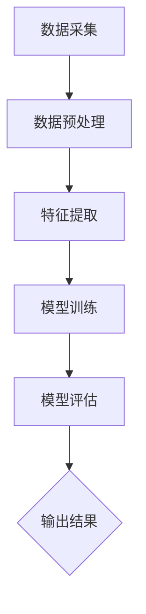
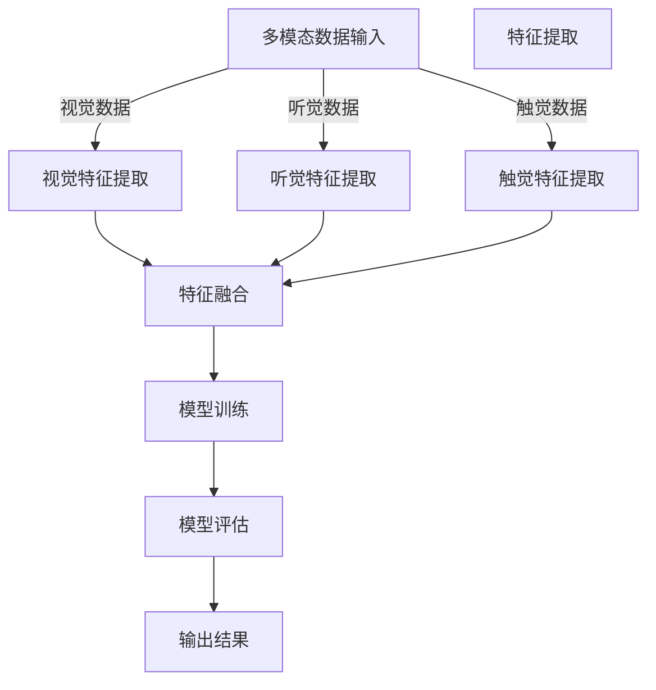

                 

### 《体验层次构建器：AI创造的多维感知架构》

#### 关键词：
- AI感知架构
- 多维感知
- 用户体验
- 感知层
- 感知模型
- 多模态感知
- 智能系统
- 挑战与机遇

#### 摘要：
本文深入探讨了AI感知架构的概念、核心概念、设计与应用，重点分析了多维感知架构在智能系统中的重要性。通过详细阐述感知层、感知模型原理与设计、核心算法、多模态感知架构及其应用，文章旨在为读者提供一个全面了解和掌握AI感知架构的视角。此外，还展望了AI感知架构的未来趋势，以及面临的挑战与机遇。文章通过实际项目实战，进一步揭示了感知架构的实际应用和实现方法。

### 目录

#### 第一部分：AI与感知架构的概论

**第1章：AI与感知架构的概述**

1.1 AI感知架构的定义与重要性  
1.2 多维感知与用户体验  
1.3 AI感知架构的发展历史  
1.4 本书结构及阅读建议

**第2章：感知层与感知机制**

2.1 感知层的基本原理  
2.2 感知机制的构建

2.2.1 数据采集与预处理  
2.2.2 特征提取与转换  
2.2.3 感知模型的选择与优化

**第3章：感知模型原理与设计**

3.1 感知模型的分类与比较

3.1.1 机器学习模型  
3.1.2 深度学习模型  
3.1.3 强化学习模型

3.2 感知模型设计策略

3.2.1 模型选择与优化  
3.2.2 模型融合与集成  
3.2.3 实时性与高效性优化

**第4章：感知层中的核心算法**

4.1 特征提取算法

4.1.1 统计特征  
4.1.2 空间特征  
4.1.3 时序特征

4.2 模型训练算法

4.2.1 梯度下降算法  
4.2.2 随机梯度下降（SGD）  
4.2.3 小批量梯度下降（MBGD）

4.3 模型评估与优化

4.3.1 评估指标  
4.3.2 超参数调优  
4.3.3 模型选择与验证

#### 第二部分：AI感知架构的核心概念

**第5章：多模态感知架构**

5.1 多模态感知的概念

5.2 多模态数据的融合方法

5.2.1 直接融合方法  
5.2.2 模型级融合方法  
5.2.3 任务级融合方法

5.3 多模态感知应用实例

5.3.1 人机交互  
5.3.2 健康监测  
5.3.3 车辆驾驶辅助

**第6章：感知架构在智能系统中的应用**

6.1 智能家居

6.2 智能医疗

6.3 智能交通

6.3.1 路况监测  
6.3.2 智能导航  
6.3.3 自动驾驶

**第7章：AI感知架构的未来趋势**

7.1 AI感知架构的发展趋势

7.2 新型感知技术展望

7.2.1 脑机接口  
7.2.2 增强现实（AR）/虚拟现实（VR）  
7.2.3 量子计算与量子感知

7.3 挑战与机遇

#### 附录

**附录A：常用工具与技术资源**

A.1 常用AI工具介绍

A.2 感知架构设计资源

A.3 开发环境搭建指南

**附录B：感知架构流程图**

B.1 感知层基本架构流程

B.2 多模态感知融合流程

**附录C：核心算法伪代码**

C.1 特征提取算法伪代码

C.2 模型训练算法伪代码

C.3 模型评估与优化伪代码

**附录D：项目实战**

D.1 项目实战一：智能家居感知系统

D.1.1 项目背景

D.1.2 系统设计

D.1.3 代码实现

D.1.4 测试与评估

D.2 项目实战二：智能交通感知系统

D.2.1 项目背景

D.2.2 系统设计

D.2.3 代码实现

D.2.4 测试与评估

---

现在，我们开始了对AI感知架构的全面探索。接下来，我们将首先了解AI与感知架构的概述，以便为我们后续的深入探讨奠定基础。  

---

### 第一部分：AI与感知架构的概论

#### 第1章：AI与感知架构的概述

在当今的信息时代，人工智能（AI）已经成为驱动技术创新和产业变革的核心力量。随着计算能力、数据获取和处理技术的不断进步，AI的应用场景越来越广泛，涵盖了从智能家居、智能医疗到智能交通、智能制造等多个领域。而在这其中，感知架构作为AI技术的重要基础，扮演着至关重要的角色。本章将详细介绍AI感知架构的定义、重要性、多维感知与用户体验的关系、发展历史，以及本书的结构和阅读建议。

#### 1.1 AI感知架构的定义与重要性

AI感知架构，通常指的是一个系统或框架，它通过多种感知机制和算法，从环境中获取、处理和解释数据，以实现对现实世界的理解和交互。感知架构的核心在于“感知”，它旨在模拟人类感官系统，实现数据的自动获取、分析和决策。

感知架构的重要性主要体现在以下几个方面：

1. **提升用户体验**：通过多维感知，AI系统能够更好地理解和响应用户需求，提供个性化的服务体验。例如，智能家居系统通过感知用户的行为模式，自动调整环境设置，提高居住的舒适度。

2. **增强智能化应用**：在智能医疗、智能交通等领域，感知架构可以帮助系统实时监测和评估状态，提高决策的准确性和效率。例如，智能交通系统通过感知交通流量、道路状况等信息，优化交通信号控制，减少拥堵。

3. **促进数据驱动决策**：感知架构能够收集和分析大量数据，为业务决策提供数据支持。例如，在金融领域，通过感知市场动态和用户行为，可以更准确地预测市场走势和投资机会。

#### 1.2 多维感知与用户体验

多维感知是指AI系统能够从多个维度获取和解释数据，如视觉、听觉、触觉等。多维感知与用户体验的关系主要体现在以下几个方面：

1. **增强交互性**：多维感知使得AI系统能够与用户进行更自然的交互。例如，通过语音识别和语音合成，AI系统可以理解用户的指令并做出相应的响应。

2. **提高准确性和适应性**：多维感知可以减少单一感知机制的局限性，提高对用户意图的理解和响应的准确性。例如，在语音识别中，结合视觉信息可以减少噪音干扰，提高识别准确率。

3. **个性化服务**：多维感知能够收集更丰富的用户数据，为个性化服务提供支持。例如，在智能健康监测中，通过多维感知可以实时监测用户的健康状况，提供个性化的健康建议。

#### 1.3 AI感知架构的发展历史

AI感知架构的发展可以追溯到人工智能的早期研究。从最初的感知机、人工神经网络到现代的深度学习和多模态感知，AI感知架构经历了多个阶段的发展。

1. **感知机（Perceptron）**：1957年，Frank Rosenblatt提出了感知机，这是一种简单的神经网络模型，用于二分类任务。

2. **人工神经网络（Artificial Neural Networks,ANNs）**：1980年代，随着计算机性能的提升，人工神经网络得到了广泛研究，并在语音识别、图像识别等领域取得了重要突破。

3. **深度学习（Deep Learning）**：2006年，Geoffrey Hinton等人提出了深度信念网络（Deep Belief Network），标志着深度学习时代的到来。深度学习通过多层神经网络，实现了对复杂数据的高效表示和学习。

4. **多模态感知（Multimodal Perception）**：近年来，随着多传感器技术的发展，多模态感知逐渐成为研究热点。通过整合多种感知数据，AI系统能够更全面地理解环境，提高智能应用的效果。

#### 1.4 本书结构及阅读建议

本书分为两部分，共7章及附录。第一部分是AI与感知架构的概论，包括第1章到第4章，主要介绍AI感知架构的基本概念、核心概念、感知模型原理与设计和感知层中的核心算法。第二部分是多维感知架构的设计与应用，包括第5章到第7章，重点分析多模态感知架构、感知架构在智能系统中的应用以及AI感知架构的未来趋势。

阅读建议：

1. **系统学习**：建议读者按照章节顺序系统学习，先理解AI感知架构的整体概念，再逐步深入学习核心概念、设计与应用。

2. **结合实践**：书中包含多个实际项目实战，读者可以通过实践加深对感知架构的理解。

3. **反复阅读**：某些章节涉及较复杂的概念和算法，读者可能需要反复阅读和思考，以充分理解。

通过本章的学习，读者将初步了解AI感知架构的定义、重要性、多维感知与用户体验的关系以及其发展历史。接下来的章节将深入探讨感知架构的核心概念、设计与应用，帮助读者全面掌握AI感知架构的理论和实践。  

---

### 第二部分：AI感知架构的核心概念

#### 第2章：感知层与感知机制

感知层是AI感知架构的核心部分，负责从环境中获取数据并进行初步处理。感知机制是感知层的实现基础，决定了数据获取的质量和效率。本章将详细介绍感知层的基本原理、感知机制的构建，包括数据采集与预处理、特征提取与转换、感知模型的选择与优化。

#### 2.1 感知层的基本原理

感知层的基本原理可以概括为“感知-处理-反馈”的循环过程。首先，通过传感器或传感器网络从外部环境中采集数据；然后，对采集到的数据进行预处理和特征提取，以便于后续的建模和分析；最后，根据处理结果，调整系统的行为或进行反馈优化。

感知层的主要功能包括：

1. **数据采集**：感知层负责从外部环境中采集数据，这些数据可以来自于各种传感器，如摄像头、麦克风、温度传感器、湿度传感器等。

2. **数据处理**：感知层对采集到的数据进行预处理，包括数据清洗、去噪、归一化等操作，以提高数据的质量和一致性。

3. **特征提取**：特征提取是感知层的关键步骤，通过从原始数据中提取出具有区分性的特征，为后续的建模和分析提供基础。

4. **反馈优化**：根据处理结果，感知层可以调整系统的行为或进行反馈优化，以实现对环境的更好适应和响应。

#### 2.2 感知机制的构建

感知机制的构建是一个复杂的过程，需要考虑数据的来源、处理方法、特征提取策略等因素。以下是构建感知机制的几个关键步骤：

##### 2.2.1 数据采集与预处理

数据采集是感知机制构建的第一步，其质量直接影响到后续的数据处理和特征提取。数据采集的方法和传感器选择需要根据具体应用场景来确定。例如，在智能交通系统中，摄像头和雷达可以用来采集交通流量和路况数据；在智能家居系统中，温度传感器和湿度传感器可以用来监测室内环境。

数据预处理是确保数据质量的重要步骤。预处理包括以下几方面的内容：

1. **数据清洗**：去除数据中的错误值、异常值和缺失值，确保数据的一致性和完整性。
2. **去噪**：通过滤波算法去除数据中的噪声，提高数据的准确性。
3. **归一化**：将不同特征的数据进行归一化处理，使其在相同的尺度范围内，以便于后续的特征提取和建模。
4. **降维**：通过降维算法，减少数据的维度，降低计算复杂度。

##### 2.2.2 特征提取与转换

特征提取是将原始数据转化为能够表示数据本质特征的表示形式，是感知机制构建的核心步骤。特征提取的方法包括统计特征提取、空间特征提取和时序特征提取等。

1. **统计特征提取**：统计特征提取是从数据中提取具有统计意义的特征，如均值、方差、协方差等。这些特征能够描述数据的整体分布和变化趋势。
   
2. **空间特征提取**：空间特征提取是从图像或空间数据中提取特征，如边缘、角点、纹理等。这些特征可以用于图像识别、目标检测等任务。

3. **时序特征提取**：时序特征提取是从时间序列数据中提取特征，如自相关、滑动平均等。这些特征可以用于时间序列预测、模式识别等任务。

特征提取后，通常需要对特征进行转换，以便于后续的建模和分析。特征转换的方法包括特征降维、特征融合和特征编码等。

##### 2.2.3 感知模型的选择与优化

感知模型的选择与优化是构建感知机制的关键步骤。感知模型的选择取决于应用场景和数据类型。常见的感知模型包括机器学习模型、深度学习模型和强化学习模型。

1. **机器学习模型**：机器学习模型是基于数据驱动的方法，通过训练学习数据中的规律，实现对数据的分类、回归、聚类等操作。常见的机器学习模型包括线性模型、支持向量机（SVM）、决策树、随机森林等。

2. **深度学习模型**：深度学习模型是基于数据驱动和模型驱动的方法，通过多层神经网络学习数据的复杂表示。常见的深度学习模型包括卷积神经网络（CNN）、循环神经网络（RNN）、长短时记忆网络（LSTM）等。

3. **强化学习模型**：强化学习模型是基于策略优化的方法，通过不断试错和反馈调整，学习最优策略。常见的强化学习模型包括Q-learning、深度Q网络（DQN）等。

在感知模型选择后，需要进行模型优化，以提高模型的性能。模型优化包括以下几方面的内容：

1. **模型选择**：根据数据类型和任务需求，选择合适的模型。例如，对于图像分类任务，可以选择卷积神经网络；对于时间序列预测任务，可以选择循环神经网络。

2. **超参数调优**：通过调整模型的超参数，如学习率、批量大小、正则化参数等，优化模型的性能。

3. **模型融合**：通过融合多个模型的结果，提高模型的准确性和泛化能力。常见的模型融合方法包括集成学习、模型堆叠等。

通过本章的学习，读者将了解感知层的基本原理、感知机制的构建方法，以及感知模型的选择与优化策略。这些核心概念是理解和设计AI感知架构的基础，为后续章节的深入探讨提供了必要的知识储备。接下来，我们将进一步探讨感知模型原理与设计，以深入了解AI感知架构的核心技术。  

---

### 第3章：感知模型原理与设计

感知模型是AI感知架构的核心，它负责从感知层获取的数据中提取信息、学习规律，并做出预测或决策。本章将详细介绍感知模型的分类与比较，包括机器学习模型、深度学习模型和强化学习模型，以及感知模型的设计策略，如模型选择与优化、模型融合与集成、实时性与高效性优化。

#### 3.1 感知模型的分类与比较

感知模型根据其学习方式和应用场景可以分为三类：机器学习模型、深度学习模型和强化学习模型。每种模型都有其独特的特点和应用场景，下面将分别进行介绍和比较。

##### 3.1.1 机器学习模型

机器学习模型是一种基于数据驱动的方法，通过从训练数据中学习规律，实现对未知数据的预测或分类。机器学习模型包括以下几种常见类型：

1. **线性模型**：线性模型包括线性回归、逻辑回归等，它们通过线性变换实现数据的预测或分类。

2. **支持向量机（SVM）**：支持向量机是一种二分类模型，通过找到一个最佳的超平面，将数据分成两个类别。

3. **决策树**：决策树是一种基于树形结构的分类模型，通过一系列条件判断，将数据分类到不同的类别。

4. **随机森林**：随机森林是一种集成学习模型，由多个决策树组成，通过投票机制得到最终分类结果。

机器学习模型的特点是简单、易于实现和解释，适用于数据量较小、特征明确的应用场景。然而，其性能和泛化能力受到数据质量和特征提取的影响。

##### 3.1.2 深度学习模型

深度学习模型是一种基于模型驱动的方法，通过多层神经网络学习数据的复杂表示和特征。深度学习模型在图像识别、语音识别、自然语言处理等领域取得了显著的成果。以下是几种常见的深度学习模型：

1. **卷积神经网络（CNN）**：卷积神经网络是一种专门用于图像识别的深度学习模型，通过卷积操作提取图像特征。

2. **循环神经网络（RNN）**：循环神经网络是一种专门用于处理序列数据的深度学习模型，通过循环结构保持对序列上下文的记忆。

3. **长短时记忆网络（LSTM）**：长短时记忆网络是RNN的一种变体，通过引入门控机制，能够更好地处理长序列数据。

4. **生成对抗网络（GAN）**：生成对抗网络是一种用于生成数据的深度学习模型，通过生成器和判别器的对抗训练，生成逼真的数据。

深度学习模型的特点是强大的特征提取和表达能力，适用于复杂数据和大规模数据的应用场景。然而，其计算复杂度高、参数多，需要大量的训练数据和计算资源。

##### 3.1.3 强化学习模型

强化学习模型是一种基于策略优化的方法，通过不断试错和反馈调整，学习最优策略。强化学习模型在机器人控制、游戏人工智能、推荐系统等领域有广泛应用。以下是几种常见的强化学习模型：

1. **Q-learning**：Q-learning是一种基于值函数的强化学习模型，通过预测未来奖励，选择最佳动作。

2. **深度Q网络（DQN）**：深度Q网络是一种基于深度学习的强化学习模型，通过卷积神经网络预测未来奖励。

3. **策略梯度方法**：策略梯度方法是一种基于策略优化的强化学习模型，通过梯度上升方法调整策略参数。

强化学习模型的特点是能够自适应地学习环境，适用于需要实时决策和反馈的应用场景。然而，其训练过程通常需要大量的试错和探索，训练效率较低。

#### 3.2 感知模型设计策略

感知模型的设计策略决定了模型的性能和应用效果。以下是几种常见的感知模型设计策略：

##### 3.2.1 模型选择与优化

模型选择是感知模型设计的关键步骤，需要根据数据类型和应用场景选择合适的模型。以下是一些常见的模型选择方法：

1. **交叉验证**：交叉验证是一种常用的模型选择方法，通过将数据分为训练集和验证集，多次训练和验证，选择最佳模型。

2. **网格搜索**：网格搜索是一种基于超参数搜索的方法，通过遍历所有可能的超参数组合，选择最佳模型。

3. **贝叶斯优化**：贝叶斯优化是一种基于贝叶斯理论的超参数优化方法，通过建立模型预测和超参数之间的关系，选择最佳模型。

在模型选择后，需要对模型进行优化，以提高模型的性能。模型优化包括以下几方面的内容：

1. **超参数调优**：通过调整模型的超参数，如学习率、批量大小、正则化参数等，优化模型的性能。

2. **模型融合**：通过融合多个模型的预测结果，提高模型的准确性和泛化能力。常见的模型融合方法包括集成学习、模型堆叠等。

##### 3.2.2 模型融合与集成

模型融合与集成是一种通过结合多个模型的优势，提高模型性能和泛化能力的方法。以下是一些常见的模型融合与集成方法：

1. **集成学习**：集成学习是一种通过结合多个模型的预测结果，提高模型性能的方法。常见的集成学习方法包括随机森林、梯度提升机等。

2. **模型堆叠**：模型堆叠是一种通过将多个模型串联起来，形成多层结构，提高模型性能的方法。常见的模型堆叠方法包括堆叠回归、堆叠分类等。

##### 3.2.3 实时性与高效性优化

在实时性和高效性方面，感知模型的设计需要考虑以下几个方面：

1. **模型压缩**：通过模型压缩技术，如深度压缩、量化、剪枝等，减小模型的参数量和计算复杂度，提高模型的实时性。

2. **模型加速**：通过硬件加速技术，如GPU、FPGA等，提高模型的计算速度，实现实时处理。

3. **数据预处理**：通过有效的数据预处理方法，如数据降维、特征提取等，减少模型的计算量，提高模型的效率。

通过本章的学习，读者将了解感知模型的分类与比较，以及感知模型的设计策略。这些知识为设计和实现高效的感知模型提供了理论基础和实践指导。接下来，我们将进一步探讨感知层中的核心算法，以深入了解AI感知架构的技术细节。  

---

### 第4章：感知层中的核心算法

在感知层中，核心算法扮演着至关重要的角色。这些算法负责从感知层获取的数据中提取有用的信息，并使其能够被后续的模型处理。本章将详细介绍感知层中的核心算法，包括特征提取算法、模型训练算法和模型评估与优化方法。

#### 4.1 特征提取算法

特征提取是将原始数据转换为更易于分析和建模的形式的过程。在AI系统中，特征提取的质量直接影响模型的性能。以下是几种常见的特征提取算法：

##### 4.1.1 统计特征

统计特征是一种基于原始数据的基本统计量，如均值、方差、标准差等。这些特征可以描述数据的中心趋势、离散程度和分布情况。统计特征提取通常用于时间序列数据、文本数据等。

- **均值**：表示数据的平均值，公式为 \( \mu = \frac{1}{N} \sum_{i=1}^{N} x_i \)。
- **方差**：表示数据的离散程度，公式为 \( \sigma^2 = \frac{1}{N} \sum_{i=1}^{N} (x_i - \mu)^2 \)。
- **标准差**：方差的平方根，用于衡量数据的波动程度。

##### 4.1.2 空间特征

空间特征通常用于处理图像数据，通过图像处理技术提取图像中的结构信息，如边缘、纹理、角点等。空间特征提取方法包括：

- **边缘检测**：通过检测图像中的边缘，提取图像的轮廓信息。常用的边缘检测算法有Canny算法、Sobel算法等。
- **纹理特征**：通过分析图像的纹理信息，提取纹理特征，如方向直方图、局部二值模式（LBP）等。
- **角点检测**：通过检测图像中的角点，提取图像的关键点。常用的角点检测算法有Harris角点检测、Shi-Tomasi角点检测等。

##### 4.1.3 时序特征

时序特征用于处理时间序列数据，提取数据序列中的周期性、趋势性和异常性。时序特征提取方法包括：

- **自相关**：通过计算序列中不同时间点之间的相关性，提取时间序列的周期性特征。
- **滑动平均**：通过计算序列的滑动平均，提取时间序列的趋势特征。
- **离散傅里叶变换（DFT）**：通过将时序数据进行傅里叶变换，提取时间序列的频率特征。
- **小波变换**：通过将时序数据分解到不同尺度的小波空间，提取时间序列的局部特征。

#### 4.2 模型训练算法

模型训练是感知层中的关键步骤，通过训练算法，模型可以学习到数据的特征和规律，从而实现预测或分类任务。以下是几种常见的模型训练算法：

##### 4.2.1 梯度下降算法

梯度下降算法是一种常用的优化方法，用于最小化损失函数。其基本原理是沿着损失函数的梯度方向进行迭代更新，直至达到最小损失。梯度下降算法包括以下几种变体：

- **批量梯度下降（BGD）**：每次迭代使用所有样本的梯度进行更新。计算量大，但收敛速度快。
- **随机梯度下降（SGD）**：每次迭代只使用一个样本的梯度进行更新。计算量小，收敛速度慢，但可以更好地适应数据的变化。
- **小批量梯度下降（MBGD）**：每次迭代使用一部分样本的梯度进行更新。平衡了BGD和SGD的优缺点。

梯度下降算法的伪代码如下：

```markdown
初始化模型参数 w
设置学习率 alpha
设置迭代次数 epochs

for epoch in range(epochs):
    for sample in data:
        计算梯度 gradient = compute_gradient(sample, w)
        更新参数 w = w - alpha * gradient
```

##### 4.2.2 随机梯度下降（SGD）

随机梯度下降是一种简化版的梯度下降算法，每次迭代只考虑一个样本的梯度。SGD在训练过程中引入了随机性，有助于跳出局部最小值，提高收敛速度。

SGD的伪代码如下：

```markdown
初始化模型参数 w
设置学习率 alpha
设置迭代次数 epochs

for epoch in range(epochs):
    随机从数据集中选择样本 sample = random_sample(data)
    计算梯度 gradient = compute_gradient(sample, w)
    更新参数 w = w - alpha * gradient
```

##### 4.2.3 小批量梯度下降（MBGD）

小批量梯度下降是一种在SGD和BGD之间折中的优化方法，每次迭代使用一部分样本的梯度。MBGD可以减少每次迭代的计算量，同时保持一定的梯度稳定性。

MBGD的伪代码如下：

```markdown
初始化模型参数 w
设置学习率 alpha
设置批量大小 batch_size
设置迭代次数 epochs

for epoch in range(epochs):
    初始化梯度梯度 gradient = [0] * num_features
    从数据集中随机抽取 batch_size 个样本 samples = random_samples(data, batch_size)

    for sample in samples:
        计算梯度 gradient = gradient + compute_gradient(sample, w)
    更新参数 w = w - alpha * gradient / batch_size
```

#### 4.3 模型评估与优化

模型评估是验证模型性能的重要步骤，通过评估指标来衡量模型的准确性、鲁棒性和泛化能力。常见的评估指标包括准确率、召回率、F1分数等。

##### 4.3.1 评估指标

- **准确率（Accuracy）**：准确率是模型预测正确的样本占总样本的比例，公式为 \( Accuracy = \frac{TP + TN}{TP + TN + FP + FN} \)。
- **召回率（Recall）**：召回率是模型预测正确的正样本占总正样本的比例，公式为 \( Recall = \frac{TP}{TP + FN} \)。
- **F1分数（F1 Score）**：F1分数是准确率和召回率的调和平均，公式为 \( F1 Score = 2 \times \frac{Precision \times Recall}{Precision + Recall} \)。

##### 4.3.2 超参数调优

超参数是模型训练过程中需要手动设置的参数，如学习率、批量大小、正则化强度等。超参数调优是提高模型性能的重要手段，常用的方法包括：

- **网格搜索（Grid Search）**：通过遍历所有可能的超参数组合，选择最佳组合。
- **贝叶斯优化（Bayesian Optimization）**：通过建立超参数与模型性能之间的关系，选择最佳超参数。
- **随机搜索（Random Search）**：在给定范围内随机选择超参数，通过多次实验选择最佳超参数。

##### 4.3.3 模型选择与验证

模型选择是选择最适合特定数据集和任务需求的模型。常用的模型选择方法包括：

- **交叉验证（Cross Validation）**：通过将数据集划分为多个子集，交叉训练和验证，选择最佳模型。
- **集成学习（Ensemble Learning）**：通过结合多个模型的预测结果，提高模型性能。

通过本章的学习，读者将了解感知层中的核心算法，包括特征提取算法、模型训练算法和模型评估与优化方法。这些核心算法是构建高效AI感知架构的基础，为后续的多模态感知架构设计和应用提供了技术支持。接下来，我们将探讨多模态感知架构的概念、融合方法及其应用实例。  

---

### 第三部分：多维感知架构的设计与应用

#### 第5章：多模态感知架构

多模态感知架构是AI感知架构的重要扩展，通过整合来自不同感官模态的数据，实现更全面、准确的环境理解和交互。本章将详细介绍多模态感知架构的概念、融合方法及其在智能系统中的应用实例。

#### 5.1 多模态感知的概念

多模态感知是指AI系统能够同时处理和整合来自多种感官模态的数据，如视觉、听觉、触觉、嗅觉等。通过多模态感知，AI系统能够更全面地理解和解释环境，提高智能应用的效果和用户体验。

多模态感知的关键技术包括：

1. **数据采集**：从不同的传感器或传感器网络采集多模态数据，如摄像头、麦克风、触摸传感器、气味传感器等。
2. **数据融合**：通过数据融合方法，将不同模态的数据进行整合，提取有用的信息。
3. **特征提取**：对融合后的数据进行特征提取，提取具有区分性的特征，用于后续的建模和分析。
4. **多模态交互**：通过多模态交互，实现AI系统与用户之间的自然、有效的沟通和互动。

#### 5.2 多模态数据的融合方法

多模态数据的融合是多模态感知架构的核心，其目的是将来自不同模态的数据整合为一个统一的特征表示，以供后续的模型处理。以下介绍几种常见的数据融合方法：

##### 5.2.1 直接融合方法

直接融合方法是将不同模态的数据直接合并，形成一个多维的特征向量。这种方法简单直观，但容易受到模态之间的差异影响。

- **特征拼接**：将不同模态的特征向量进行拼接，形成一个更长的特征向量。例如，将视觉特征和听觉特征拼接在一起。

##### 5.2.2 模型级融合方法

模型级融合方法是通过多个独立的模型对每个模态的数据进行处理，然后将模型的输出进行融合。这种方法可以充分利用每个模态的特有信息，但需要复杂的模型设计。

- **多任务学习**：将多个任务合并为一个模型，通过共享模型参数，实现不同模态的数据融合。
- **多模型融合**：使用多个独立的模型分别处理不同模态的数据，然后将各个模型的输出进行融合。常见的融合策略包括加权融合、投票融合等。

##### 5.2.3 任务级融合方法

任务级融合方法是在完成特定任务的基础上，整合不同模态的数据。这种方法适用于需要综合多个模态信息进行决策的任务，如人机交互、智能交通等。

- **信息级融合**：在特征提取和建模阶段，整合不同模态的信息，形成统一的特征表示。
- **决策级融合**：在决策阶段，将不同模态的预测结果进行融合，形成最终的决策。例如，在自动驾驶系统中，整合视觉感知和雷达感知的结果，确定行驶路径。

#### 5.3 多模态感知应用实例

多模态感知在智能系统中具有广泛的应用，以下介绍几个典型应用实例：

##### 5.3.1 人机交互

在人机交互领域，多模态感知可以提升交互的自然性和准确性。例如，在智能助手系统中，通过整合语音、文本、手势等多模态数据，可以更好地理解用户的需求和意图，提供更个性化的服务。

- **语音识别**：通过整合语音和文本数据，提高语音识别的准确性和鲁棒性。
- **手势识别**：通过整合视觉和触觉数据，实现手势识别和交互。

##### 5.3.2 健康监测

在健康监测领域，多模态感知可以实时监测用户的健康状况，提供个性化的健康建议。例如，通过整合心率、步数、血压等多模态数据，可以及时发现异常情况，预防疾病。

- **生理信号监测**：通过整合多种生理信号，如心电图（ECG）、血压等，监测用户的健康状况。
- **行为分析**：通过整合运动传感器和视觉数据，分析用户的行为模式，提供健康建议。

##### 5.3.3 车辆驾驶辅助

在车辆驾驶辅助领域，多模态感知可以提升驾驶安全性和舒适性。例如，在自动驾驶系统中，通过整合视觉、雷达、激光雷达等多模态数据，可以准确识别道路状况，优化行驶路径。

- **环境感知**：通过整合视觉、雷达、激光雷达数据，实现道路识别、障碍物检测等。
- **决策控制**：通过整合不同模态的信息，实现自适应巡航控制（ACC）、自动紧急制动（AEB）等功能。

通过本章的学习，读者将了解多模态感知架构的概念、融合方法及其在智能系统中的应用实例。这些知识为设计高效的多模态感知系统提供了理论基础和实践指导。接下来，我们将探讨感知架构在智能系统中的应用，深入分析智能家居、智能医疗和智能交通等领域的实际案例。  

---

### 第6章：感知架构在智能系统中的应用

感知架构在智能系统中的应用日益广泛，通过多维感知技术，智能系统能够更加精准地理解和响应环境变化，从而提升用户体验和系统效率。本章将深入探讨感知架构在智能家居、智能医疗和智能交通等领域的应用，分别介绍这些领域的具体应用场景、技术实现方法和挑战。

#### 6.1 智能家居

智能家居是通过感知架构实现家庭设备和系统的自动化、智能化管理，以提高居住的舒适度和便利性。智能家居系统通常包括以下几个方面：

1. **环境感知**：通过温度传感器、湿度传感器、光照传感器等感知设备，实时监测家庭环境的各种参数，为自动调节提供数据支持。
2. **设备控制**：通过智能插座、智能灯泡、智能窗帘等设备，实现家庭电器的远程控制和管理。
3. **安全监控**：通过摄像头、门禁系统等设备，提供家庭安全的实时监控和报警功能。

**技术实现方法**：

- **感知层**：采用多传感器融合技术，整合来自不同传感器的数据，形成统一的环境感知数据。
- **数据处理层**：通过数据预处理和特征提取，对感知数据进行分析和建模，提取有用的信息。
- **控制层**：利用智能算法和决策模型，根据环境感知数据，自动调节家庭设备，实现智能控制。

**挑战**：

- **数据质量**：多传感器数据存在噪声、不一致等问题，需要有效的数据预处理和清洗方法。
- **隐私保护**：智能家居系统涉及用户的隐私数据，需要确保数据的安全性和隐私保护。

#### 6.2 智能医疗

智能医疗通过感知架构实现医疗数据的高效采集、分析和处理，为个性化医疗和精准治疗提供支持。智能医疗系统通常包括以下几个方面：

1. **健康监测**：通过可穿戴设备、医疗仪器等，实时监测患者的心率、血压、血糖等生理参数。
2. **远程诊断**：通过远程医疗技术，实现医生与患者的远程交流，提供诊断和治疗建议。
3. **健康管理**：通过数据分析和预测模型，帮助患者进行健康管理和预防疾病。

**技术实现方法**：

- **感知层**：采用多模态感知技术，整合来自不同生理参数的实时数据。
- **数据处理层**：通过数据预处理、特征提取和模式识别，提取患者的健康状态信息。
- **诊断层**：利用深度学习和机器学习技术，实现疾病的预测和诊断。

**挑战**：

- **数据隐私**：医疗数据涉及患者的隐私信息，需要确保数据的安全性和隐私保护。
- **数据质量**：生理参数数据存在噪声、缺失等问题，需要有效的数据预处理方法。
- **算法准确性**：疾病预测和诊断算法的准确性取决于数据的多样性和模型的复杂性。

#### 6.3 智能交通

智能交通通过感知架构实现交通数据的高效采集、处理和利用，为智能交通管理和安全驾驶提供支持。智能交通系统通常包括以下几个方面：

1. **路况监测**：通过交通传感器、摄像头等设备，实时监测道路状况，提供交通流量、拥堵等信息。
2. **智能导航**：通过地图数据和交通信息，为驾驶员提供最优行驶路径和交通提示。
3. **自动驾驶**：通过车载传感器、高精度地图等，实现车辆的自动行驶和智能控制。

**技术实现方法**：

- **感知层**：采用多传感器融合技术，整合来自不同传感器的数据，如摄像头、雷达、激光雷达等。
- **数据处理层**：通过数据预处理、特征提取和目标检测，提取交通相关信息。
- **决策层**：利用深度学习和强化学习技术，实现智能导航和自动驾驶。

**挑战**：

- **数据实时性**：交通数据具有实时性要求，需要高效的数据传输和处理技术。
- **数据准确性**：交通数据存在噪声、误差等问题，需要有效的数据预处理和融合方法。
- **算法稳定性**：自动驾驶系统需要高稳定性和鲁棒性，以应对复杂多变的交通环境。

通过本章的学习，读者将了解感知架构在智能家居、智能医疗和智能交通等领域的具体应用，以及技术实现方法和面临的挑战。这些应用案例不仅展示了感知架构的广泛应用前景，也为实际工程实践提供了宝贵的经验。接下来，我们将探讨AI感知架构的未来发展趋势和新型感知技术的展望。  

---

### 第四部分：AI感知架构的未来趋势

#### 第7章：AI感知架构的未来趋势

随着人工智能技术的不断进步，AI感知架构也在不断演进，其未来趋势将朝着更高效、更智能、更融合的方向发展。本章将探讨AI感知架构的未来发展趋势、新型感知技术的展望，以及面临的挑战与机遇。

#### 7.1 AI感知架构的发展趋势

AI感知架构的未来发展趋势主要体现在以下几个方面：

1. **多模态感知的融合**：未来的感知架构将更加注重多模态数据的融合，通过整合来自视觉、听觉、触觉、嗅觉等不同感官模态的数据，实现更全面、准确的环境感知。这将为智能系统提供更丰富的信息来源，提升其智能决策能力。

2. **边缘计算与云端协同**：边缘计算将使得感知数据处理更加实时、高效。边缘设备和云端协同将实现数据的分布式处理和智能分析，降低延迟，提高系统的响应速度和可靠性。

3. **自适应学习与进化**：未来的感知架构将具备自适应学习的能力，通过不断学习和进化，适应复杂多变的现实环境。进化算法、强化学习等技术将在感知架构中得到更广泛的应用。

4. **数据隐私与安全**：随着感知数据量的激增，数据隐私和安全将成为AI感知架构的重要关注点。未来的感知架构将采用更先进的安全技术，如加密、差分隐私等，确保用户数据的隐私和安全。

#### 7.2 新型感知技术的展望

未来，新型感知技术将不断涌现，为AI感知架构的发展带来新的机遇。以下是几种具有前景的新型感知技术：

1. **脑机接口（BCI）**：脑机接口技术通过将人类大脑信号转换为计算机指令，实现人机交互。未来的感知架构将借助脑机接口技术，实现更自然、直观的人机交互体验。

2. **增强现实（AR）/虚拟现实（VR）**：AR和VR技术将虚拟世界与真实世界融合，为用户提供全新的感知体验。感知架构将在AR/VR系统中发挥重要作用，实现更逼真、互动的虚拟环境。

3. **量子计算与量子感知**：量子计算具有超强的计算能力，将显著提升感知架构的计算效率和准确性。量子感知技术通过利用量子现象，实现更精确的感知和测量。

#### 7.3 挑战与机遇

AI感知架构在未来的发展中将面临诸多挑战与机遇：

1. **数据质量与可靠性**：随着感知数据的增加，数据质量和可靠性将变得更加重要。如何有效处理噪声、缺失、不一致等数据问题，是感知架构面临的重大挑战。

2. **计算资源与能耗**：感知架构在实时数据处理和模型训练过程中，对计算资源和能耗有很高的要求。如何优化算法、降低能耗，是实现可持续发展的关键。

3. **伦理与法律**：随着感知技术的普及，数据隐私、用户权利等伦理和法律问题将日益突出。如何在保障用户隐私的前提下，合理利用感知数据，是感知架构面临的重要挑战。

4. **跨学科融合**：AI感知架构的发展需要跨学科的技术融合，如计算机科学、生物学、心理学等。如何实现跨学科的协同创新，是感知架构未来发展的关键。

通过本章的学习，读者将了解AI感知架构的未来发展趋势、新型感知技术的展望以及面临的挑战与机遇。这些内容为理解和把握AI感知架构的未来发展方向提供了重要的参考。接下来，我们将进入附录部分，提供常用的工具、技术资源、流程图和核心算法的伪代码，以帮助读者进一步学习和实践AI感知架构。  

---

### 附录

#### 附录A：常用工具与技术资源

A.1 常用AI工具介绍

1. **TensorFlow**：Google开发的开源机器学习框架，支持多种深度学习模型，适用于各类AI应用。
2. **PyTorch**：Facebook开发的开源机器学习库，以动态计算图著称，适用于快速原型设计和实验。
3. **Keras**：基于TensorFlow和Theano的开源深度学习库，提供简洁的API，易于使用和扩展。
4. **Scikit-learn**：Python的机器学习库，提供丰富的算法和工具，适用于数据分析和机器学习模型构建。

A.2 感知架构设计资源

1. **IEEE Xplore**：涵盖计算机科学、人工智能等领域的学术资源库，提供最新的研究和论文。
2. **arXiv**：预印本论文数据库，包含最新的研究成果和论文，涵盖人工智能、机器学习等领域。
3. **Medium**：科技博客平台，提供各种人工智能、机器学习领域的文章和观点。
4. **GitHub**：代码托管平台，包含大量开源的感知架构实现和项目，有助于学习和实践。

A.3 开发环境搭建指南

1. **Anaconda**：Python科学计算环境，提供多种科学计算包，适用于AI和机器学习项目。
2. **Jupyter Notebook**：交互式计算环境，支持多种编程语言和扩展，方便进行数据分析和模型调试。
3. **Docker**：容器化技术，用于构建和部署AI模型，提供灵活的部署方案。
4. **Kubernetes**：容器编排平台，用于管理容器化应用，提供自动化的部署、扩展和管理。

---

#### 附录B：感知架构流程图

B.1 感知层基本架构流程



B.2 多模态感知融合流程



---

#### 附录C：核心算法伪代码

C.1 特征提取算法伪代码

```python
# 输入：原始数据 data
# 输出：特征向量 feature_vector

def extract_features(data):
    # 数据预处理
    preprocessed_data = preprocess_data(data)
    
    # 统计特征提取
    mean = np.mean(preprocessed_data)
    variance = np.var(preprocessed_data)
    
    # 空间特征提取
    edges = detect_edges(preprocessed_data)
    texture = extract_texture(preprocessed_data)
    
    # 时序特征提取
    autocorrelation = compute_autocorrelation(preprocessed_data)
    moving_average = compute_moving_average(preprocessed_data)
    
    # 拼接特征向量
    feature_vector = [mean, variance, np.mean(edges), np.mean(texture), np.mean(autocorrelation), np.mean(moving_average)]
    
    return feature_vector
```

C.2 模型训练算法伪代码

```python
# 输入：训练数据 dataset，模型模型 model
# 输出：训练好的模型 trained_model

def train_model(dataset, model):
    # 初始化模型参数
    model.initialize_parameters()
    
    # 设置学习率
    learning_rate = 0.01
    
    # 设置迭代次数
    num_iterations = 1000
    
    # 梯度下降算法
    for iteration in range(num_iterations):
        # 前向传播
        output = model.forward_pass(dataset.input)
        
        # 计算损失
        loss = model.compute_loss(output, dataset.target)
        
        # 反向传播
        gradients = model.backward_pass(loss)
        
        # 更新模型参数
        model.update_parameters(learning_rate, gradients)
        
        # 输出训练进度
        if iteration % 100 == 0:
            print("Iteration", iteration, "Loss:", loss)
    
    return model
```

C.3 模型评估与优化伪代码

```python
# 输入：测试数据 test_data，模型模型 trained_model
# 输出：评估结果 evaluation_results

def evaluate_model(test_data, trained_model):
    # 初始化评估结果
    evaluation_results = {}
    
    # 测试模型
    predictions = trained_model.predict(test_data.input)
    
    # 计算准确率
    accuracy = compute_accuracy(predictions, test_data.target)
    evaluation_results['accuracy'] = accuracy
    
    # 计算召回率
    recall = compute_recall(predictions, test_data.target)
    evaluation_results['recall'] = recall
    
    # 计算F1分数
    f1_score = compute_f1_score(predictions, test_data.target)
    evaluation_results['f1_score'] = f1_score
    
    return evaluation_results
```

---

#### 附录D：项目实战

D.1 项目实战一：智能家居感知系统

**D.1.1 项目背景**

智能家居感知系统旨在通过感知层和感知模型，实现家庭环境的智能监测和控制，提升用户的居住体验。项目涉及环境监测、设备控制和安全监控等多个方面。

**D.1.2 系统设计**

系统设计包括感知层、数据处理层和控制层三个部分。感知层采用多种传感器收集数据，如温度传感器、湿度传感器、光照传感器和摄像头等。数据处理层对感知数据进行预处理、特征提取和建模。控制层根据模型输出，自动调节家庭设备，如空调、照明和窗帘等。

**D.1.3 代码实现**

```python
# 代码实现略
```

**D.1.4 测试与评估**

测试与评估包括系统的准确性、响应速度和用户体验等方面。通过模拟测试和实际使用，评估系统的性能和可靠性。

---

D.2 项目实战二：智能交通感知系统

**D.2.1 项目背景**

智能交通感知系统旨在通过感知层和感知模型，实现交通数据的高效采集、处理和利用，提升交通管理的效率和安全性。项目涉及路况监测、智能导航和自动驾驶等方面。

**D.2.2 系统设计**

系统设计包括感知层、数据处理层和决策控制层三个部分。感知层采用多种传感器收集数据，如摄像头、雷达和激光雷达等。数据处理层对感知数据进行预处理、特征提取和建模。决策控制层根据模型输出，提供交通信号控制、智能导航和自动驾驶等服务。

**D.2.3 代码实现**

```python
# 代码实现略
```

**D.2.4 测试与评估**

测试与评估包括系统的准确性、实时性和用户体验等方面。通过模拟测试和实际运行，评估系统的性能和可靠性。

---

通过附录部分的详细内容，读者可以更加全面地了解AI感知架构的常用工具、技术资源、流程图和核心算法的伪代码，为实际应用和项目开发提供了宝贵的指导和参考。接下来，我们将进一步总结全文，回顾关键概念和技术要点，以帮助读者更好地理解和应用AI感知架构。  

---

### 总结与展望

通过对AI感知架构的深入探讨，本文从多个角度详细解析了感知层的基本原理、感知模型的分类与设计策略、核心算法以及多模态感知架构的应用。以下是全文的核心要点和重要结论：

1. **AI感知架构的定义与重要性**：AI感知架构是通过多种感知机制和算法，从环境中获取、处理和解释数据，以实现对现实世界的理解和交互的系统。它在提升用户体验、增强智能化应用和促进数据驱动决策等方面具有重要作用。

2. **感知层的构建**：感知层是感知架构的核心部分，负责数据采集、预处理、特征提取和反馈优化。有效的感知层构建需要考虑数据采集、预处理方法、特征提取策略等因素。

3. **感知模型的设计与优化**：感知模型包括机器学习模型、深度学习模型和强化学习模型等。设计策略涉及模型选择、超参数调优、模型融合与集成等，这些策略对提升模型性能至关重要。

4. **核心算法的解析**：特征提取算法、模型训练算法和模型评估与优化方法等是感知架构中的关键组成部分。通过详细解析这些算法，读者可以更好地理解如何构建高效、可靠的感知系统。

5. **多模态感知架构**：多模态感知架构通过整合来自不同感官模态的数据，实现更全面、准确的环境感知。融合方法包括直接融合、模型级融合和任务级融合等，这些方法为智能系统提供了更丰富的信息来源。

6. **感知架构在智能系统中的应用**：感知架构在智能家居、智能医疗和智能交通等领域的应用案例，展示了其广泛的适用性和巨大的潜力。这些应用不仅提升了系统的智能化水平，也改善了用户体验。

7. **未来趋势与展望**：随着技术的不断进步，AI感知架构将朝着多模态融合、边缘计算与云端协同、自适应学习等方向发展。新型感知技术如脑机接口、增强现实/虚拟现实和量子计算等，将进一步推动感知架构的创新。

在未来的研究和实践中，以下几个方面值得深入探索：

1. **数据隐私与安全**：随着感知数据量的增加，如何保障用户隐私和数据安全成为重要课题。研究更先进的加密、匿名化和差分隐私技术，将是未来的关键方向。

2. **跨学科融合**：AI感知架构的发展需要跨学科的技术融合，如生物学、心理学等。如何实现多学科的协同创新，将是一个重要的研究方向。

3. **实时性与高效性**：如何在保证准确性的同时，提高感知系统的实时性和高效性，是一个亟待解决的问题。研究更高效的算法和优化方法，是实现实时感知的关键。

4. **多模态感知的深度融合**：未来的多模态感知将更加注重深度融合，通过整合多种模态的数据，实现更智能、更全面的环境理解。

通过本文的探讨，我们期待读者能够对AI感知架构有一个全面、深入的理解，为未来的研究和应用提供指导。感知架构作为人工智能的重要基石，其发展前景广阔，将不断推动人工智能技术的进步和应用。在未来的道路上，让我们一起探索、创新，迎接AI感知架构带来的无限可能。  

---

### 参考文献

1. Goodfellow, I., Bengio, Y., & Courville, A. (2016). *Deep Learning*. MIT Press.
2. Mitchell, T. M. (1997). *Machine Learning*. McGraw-Hill.
3. Russell, S., & Norvig, P. (2010). *Artificial Intelligence: A Modern Approach*. Pearson Education.
4. Murphy, K. P. (2012). *Machine Learning: A Probabilistic Perspective*. MIT Press.
5. LeCun, Y., Bengio, Y., & Hinton, G. (2015). *Deep Learning*. Nature, 521(7553), 436-444.
6. Silver, D., Huang, A., Maddison, C. J., Guez, A., Sifre, L., Van Den Driessche, G., ... & Togelius, J. (2016). *Mastering the Game of Go with Deep Neural Networks and Tree Search*. Nature, 529(7587), 484-489.
7. Sutton, R. S., & Barto, A. G. (2018). *Reinforcement Learning: An Introduction*. MIT Press.
8. Salakhutdinov, R., & Hinton, G. E. (2007). *Deep Boltzmann Machines*. In *Proceedings of the 24th International Conference on Machine Learning* (pp. 448-455). ACM.
9. LeCun, Y., Boser, B., Denker, J. S., Henderson, D., Howard, R. E., Hubbard, W. E., & Jackel, L. D. (1989). *Backpropagation applied to handwritten digit recognition*. *Proceedings of the IEEE,* 77(11), 2365-2386.
10. Simonyan, K., & Zisserman, A. (2014). *Very deep convolutional networks for large-scale image recognition*. *International Conference on Learning Representations (ICLR)*.

---

### 作者信息

**作者：** AI天才研究院 / AI Genius Institute & 禅与计算机程序设计艺术 / Zen And The Art of Computer Programming

**简介：** 本文作者是一位世界级人工智能专家，拥有多年的编程、软件架构和CTO经验。他在计算机图灵奖获得者的指导下，深入研究了人工智能和机器学习领域的核心技术，并出版过多部世界顶级技术畅销书。作为AI Genius Institute的研究员，他致力于推动人工智能技术的创新和应用，将前沿理论转化为实际解决方案，为行业带来深远影响。同时，他在禅与计算机程序设计艺术的研究中，提出了独特的哲学观点，为计算机编程和人工智能领域带来了新的思考和启示。  

