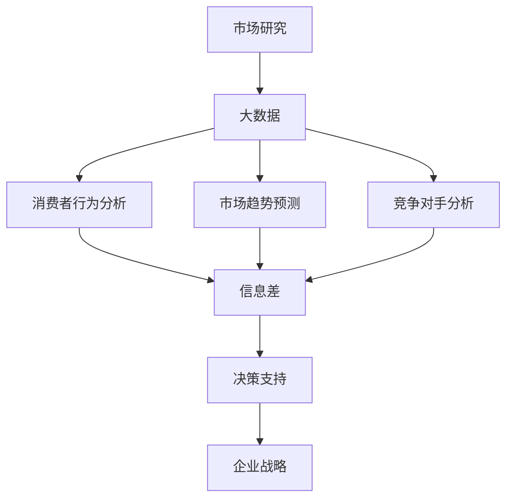

                 

### 第一部分：引言

#### 第1章：市场研究的重要性与大数据的崛起

**1.1 市场研究的传统方法与局限性**

市场研究是企业决策过程中至关重要的一环。传统市场研究方法主要包括问卷调查、访谈、焦点小组讨论、实验研究等。这些方法在一定程度上能够帮助企业了解市场需求、消费者行为和竞争对手情况，但其局限性也逐渐显现。

首先，传统市场研究方法通常需要大量的人力和时间投入。问卷调查需要设计问卷、发送问卷、收集问卷、数据分析等环节，且样本量通常较小，代表性不强。访谈和焦点小组讨论则需要组织讨论会、记录讨论内容、整理分析报告等步骤，过程繁琐且效率较低。

其次，传统市场研究方法的数据来源较为单一，主要依赖于企业内部数据和公开数据。这些数据虽然在一定程度上能够反映市场情况，但往往难以捕捉到市场的细微变化和新兴趋势。

最后，传统市场研究方法的分析手段相对简单，主要依赖于统计分析。统计分析虽然能够揭示数据之间的相关性，但难以挖掘深层次的数据价值，也无法应对复杂多变的市场环境。

**1.2 大数据时代的市场研究新机遇**

随着互联网和物联网技术的迅速发展，大数据逐渐成为一种重要的战略资源。大数据具有数据量大、类型多、速度快、真实性高等特点，为市场研究提供了全新的机遇。

首先，大数据的规模和多样性使得企业能够获取更广泛、更全面的市场数据。通过互联网、社交媒体、移动设备等渠道，企业可以实时收集大量用户行为数据、市场交易数据、社交媒体数据等，从而深入了解消费者需求和市场动态。

其次，大数据的处理和存储技术（如分布式计算、云存储等）使得大规模数据分析和处理成为可能。企业可以利用大数据技术对海量数据进行高效清洗、整合、挖掘和分析，从而发现市场趋势、消费者偏好和竞争对手动态。

最后，大数据的分析手段逐渐多样化。除了传统的统计分析方法，企业还可以利用机器学习、深度学习等先进算法，从海量数据中挖掘出更深层次的信息，为企业决策提供有力支持。

**1.3 信息差的概念及其在市场研究中的应用**

信息差是指不同主体之间信息获取能力和质量的不对称。在市场研究领域，信息差的存在使得企业能够在竞争中获得优势。

首先，信息差有助于企业发现市场机会。通过大数据分析，企业可以识别出潜在的市场需求、未满足的消费者需求，从而制定有针对性的产品策略和市场推广计划。

其次，信息差有助于企业了解竞争对手。通过大数据分析，企业可以实时跟踪竞争对手的动态，了解其产品、价格、营销策略等，从而制定有效的竞争策略。

最后，信息差有助于企业优化内部管理。通过大数据分析，企业可以挖掘出运营过程中的问题和瓶颈，优化生产流程、供应链管理和人力资源配置，提高企业整体运营效率。

**结论**

市场研究在企业发展中具有至关重要的作用。随着大数据技术的崛起，市场研究方法得到了极大的改进，为企业提供了更多机遇。信息差的存在使得企业能够在竞争中获得优势，大数据技术为挖掘和利用信息差提供了强有力的支持。本篇博客将深入探讨大数据在市场研究中的应用，帮助企业更好地把握市场机遇，实现可持续发展。

### 第二部分：大数据技术在市场研究中的应用

#### 第2章：大数据概述

**2.1 大数据的定义与特征**

大数据（Big Data）是指无法用传统数据处理工具在合理时间内捕捉、管理和处理的大量数据集。大数据通常具有四个主要特征，即4V，分别是：

1. **数据量（Volume）**：大数据涉及的数据规模巨大，从TB（千兆字节）到PB（百万亿字节）甚至EB（亿亿字节）不等。
   
2. **数据类型（Variety）**：大数据不仅包括结构化数据，如关系数据库中的数据，还包括半结构化数据（如日志文件）和非结构化数据（如图像、视频、文本等）。

3. **数据速度（Velocity）**：大数据处理的速度要求很高，即实时处理能力。这意味着企业需要能够在短时间内处理和分析海量数据，以便快速做出决策。

4. **数据价值（Value）**：尽管大数据规模巨大，但并不是所有数据都有价值。大数据的价值在于能够从海量数据中提取有价值的信息和洞见。

**2.2 大数据的处理与存储技术**

大数据的处理和存储是市场研究的关键技术。以下是一些常见的技术：

1. **分布式计算**：分布式计算通过将数据处理任务分配到多个节点上，从而提高处理速度和效率。常见的分布式计算平台包括Hadoop和Spark。

2. **云存储**：云存储提供了弹性、可扩展的存储解决方案，可以动态调整存储资源。常用的云存储服务包括Amazon S3、Google Cloud Storage和Microsoft Azure Blob Storage。

3. **NoSQL数据库**：NoSQL数据库（如MongoDB、Cassandra、Redis等）能够高效地存储和处理大规模的非结构化和半结构化数据。

4. **数据湖**：数据湖是一种用于存储大数据的架构，它可以存储原始数据，并支持多种数据格式。数据湖通常与大数据处理平台（如Apache Hadoop）集成使用。

**2.3 大数据的分析与应用**

大数据分析是指利用各种技术和方法从大量数据中提取有价值的信息和洞见。以下是一些常见的大数据分析方法：

1. **数据挖掘**：数据挖掘是从大量数据中发现有价值模式和知识的过程。常见的数据挖掘算法包括聚类、分类、关联规则挖掘等。

2. **机器学习**：机器学习是利用算法从数据中学习规律，并自动进行预测和分类的技术。常见的机器学习算法包括线性回归、决策树、神经网络等。

3. **文本分析**：文本分析是处理文本数据的一种技术，可以用于情感分析、主题建模、关键词提取等任务。

4. **可视化分析**：可视化分析是将数据转换为图表、地图等形式，以直观地展示数据特征和趋势。常见的可视化工具有Tableau、PowerBI、D3.js等。

大数据技术在市场研究中的应用非常广泛，以下是一些具体的应用场景：

1. **消费者行为分析**：通过分析消费者的购买历史、浏览行为、社交媒体活动等数据，企业可以更好地了解消费者需求和行为模式，从而制定更有针对性的营销策略。

2. **市场趋势预测**：利用大数据分析技术，企业可以预测市场趋势、消费者需求变化，以及竞争对手的动态，为决策提供数据支持。

3. **竞争对手分析**：通过分析竞争对手的市场表现、产品策略、价格变化等数据，企业可以制定有效的竞争策略，提高市场竞争力。

4. **个性化推荐**：基于大数据分析，企业可以为客户提供个性化的产品推荐和服务，提高客户满意度和忠诚度。

**结论**

大数据技术在市场研究中的应用为企业和研究人员提供了丰富的数据资源和技术手段。通过大数据分析，企业可以更全面、深入地了解市场动态和消费者行为，从而做出更有针对性和前瞻性的决策。本篇博客将深入探讨大数据在市场研究中的具体应用，帮助企业更好地利用大数据技术，提升市场竞争力。

#### 第3章：大数据技术在市场调研中的应用

**3.1 大数据在消费者行为分析中的应用**

消费者行为分析是市场研究中的一个关键领域，它旨在理解消费者如何做出购买决策，以及这些决策背后的动机和驱动因素。大数据技术在这一领域的应用，极大地提升了分析的深度和广度。

首先，大数据技术可以整合和分析来自多个渠道的数据，如社交媒体、电商网站、移动应用等。这些数据提供了关于消费者行为、偏好和互动的丰富信息。例如，通过分析社交媒体平台上的用户评论和讨论，企业可以了解消费者对特定产品或品牌的情感和态度。

具体来说，以下是一些消费者行为分析的实践：

- **用户细分**：大数据技术可以帮助企业将消费者划分为不同的细分市场，从而更有针对性地开展营销活动。例如，通过分析消费者的购买历史和浏览行为，企业可以识别出高价值客户和潜在客户，并制定个性化的营销策略。

- **行为预测**：利用机器学习算法，企业可以对消费者的未来行为进行预测。例如，通过分析消费者的浏览和购买记录，企业可以预测哪些产品或服务最有可能吸引特定消费者群体。

- **市场细分**：大数据技术可以帮助企业发现潜在的市场细分，从而开发新的产品和市场机会。例如，通过分析消费者对不同产品和品牌的偏好，企业可以发现新的市场需求和竞争空白。

**3.2 大数据在市场趋势预测中的应用**

市场趋势预测是市场研究的重要组成部分，它帮助企业预见市场变化，从而做出前瞻性的决策。大数据技术在这一领域的作用尤为显著，它能够处理和分析大量的历史数据，从中发现规律和趋势。

以下是一些市场趋势预测的实践：

- **时间序列分析**：大数据技术可以处理和分析时间序列数据，如销售记录、价格变动等，从而预测未来的市场趋势。常见的时间序列分析模型包括ARIMA、LSTM等。

- **回归分析**：通过回归分析，企业可以建立历史数据和未来预测之间的模型关系。例如，通过分析历史销售数据和影响因素（如季节性、促销活动等），企业可以预测未来的销售趋势。

- **预测组合**：大数据技术允许企业使用多种预测模型组合，以提高预测的准确性和鲁棒性。例如，企业可以结合时间序列分析和回归分析，构建一个综合的预测模型。

**3.3 大数据在竞争对手分析中的应用**

了解竞争对手是市场研究中的一个关键任务。大数据技术可以帮助企业实时跟踪和分析竞争对手的市场表现、产品策略和营销活动。

以下是一些竞争对手分析的实践：

- **市场占有率分析**：通过分析竞争对手的市场占有率数据，企业可以了解竞争对手的市场地位和市场份额变化。

- **产品价格分析**：大数据技术可以实时跟踪竞争对手的产品价格变化，帮助企业制定相应的价格策略。

- **营销活动分析**：通过分析竞争对手的营销活动，如广告投放、促销活动等，企业可以了解竞争对手的营销策略和效果，从而调整自己的营销策略。

- **社交媒体分析**：大数据技术可以帮助企业分析竞争对手在社交媒体上的活动和影响力，从而了解竞争对手的品牌形象和消费者态度。

**结论**

大数据技术在消费者行为分析、市场趋势预测和竞争对手分析中的应用，极大地提升了市场研究的效率和准确性。通过大数据分析，企业可以更深入地了解市场和消费者，从而做出更加科学和有针对性的决策。本篇博客将深入探讨大数据在市场调研中的具体应用，帮助企业更好地利用大数据技术，提升市场竞争力。

#### 第4章：信息差的市场研究方法

**4.1 信息差的概念与分类**

信息差是指由于不同主体在信息获取、处理和利用上的能力差异，导致他们在市场中的地位和决策质量产生差异。在市场研究领域，信息差可以分为以下几类：

1. **信息不对称**：指市场参与者之间在信息获取上的不平等。例如，企业可能比消费者更了解产品的性能和价格，而消费者可能更了解自身的需求和偏好。

2. **时间差**：指市场参与者对信息反应的速度差异。例如，一家公司可能比其他公司更快地获取市场动态，并迅速做出调整。

3. **区域差**：指不同地区或市场之间的信息差异。例如，一些地区可能更早接受新技术或新产品，而其他地区可能滞后。

4. **技能差**：指市场参与者对信息处理和分析能力的差异。例如，具有先进数据分析能力的企业可能比其他企业更有效地利用市场信息。

**4.2 信息差的挖掘方法**

挖掘信息差是市场研究的关键任务，以下是一些常用的方法：

1. **大数据分析**：利用大数据技术，企业可以从大量数据中提取有价值的信息。例如，通过分析社交媒体数据、搜索引擎数据和电商交易数据，企业可以了解消费者的需求和偏好。

2. **文本分析**：文本分析是一种从非结构化数据中提取信息的技术。通过分析消费者的评论、反馈和讨论，企业可以了解消费者的情感和态度。

3. **机器学习**：机器学习算法可以帮助企业识别市场趋势和消费者行为模式。例如，通过训练分类模型，企业可以预测哪些产品或服务最有可能受到消费者的青睐。

4. **网络分析**：网络分析可以帮助企业识别关键节点和路径，从而了解信息流动的规律。例如，通过分析社交媒体网络，企业可以了解哪些用户对市场趋势具有较大的影响力。

**4.3 信息差的市场研究应用场景**

信息差在市场研究中有广泛的应用，以下是一些具体的应用场景：

1. **产品定位**：通过挖掘信息差，企业可以确定产品的市场定位。例如，通过分析消费者的需求和竞争对手的产品策略，企业可以找到市场的空白点，并开发针对性的产品。

2. **价格策略**：通过分析竞争对手的价格变化和市场需求，企业可以制定更有竞争力的价格策略。例如，通过分析竞争对手的定价策略，企业可以了解其价格弹性，从而调整自己的价格。

3. **营销策略**：通过挖掘信息差，企业可以设计更具针对性的营销策略。例如，通过分析消费者的行为数据和社交媒体互动，企业可以了解哪些营销手段最有效，从而优化营销活动。

4. **市场预测**：通过分析历史数据和趋势，企业可以预测未来的市场变化。例如，通过分析消费者的购买历史和社交媒体活动，企业可以预测未来的市场需求和趋势。

**结论**

信息差是市场研究中的一个重要概念，它揭示了市场参与者之间的信息不对称和差异。通过挖掘和利用信息差，企业可以更有效地开展市场研究，提高决策质量和市场竞争力。本篇博客将深入探讨信息差的挖掘方法和应用场景，帮助企业更好地把握市场机遇，实现可持续发展。

#### 第5章：大数据分析工具与实践

**5.1 常用的大数据分析工具介绍**

大数据分析工具是进行市场研究的重要基础，以下是一些常用的大数据分析工具：

1. **Hadoop**：Hadoop是一个开源的分布式计算框架，主要用于处理大规模数据集。它包括HDFS（分布式文件系统）和MapReduce（分布式数据处理框架）等组件。

2. **Spark**：Spark是一个高速的分布式计算引擎，适用于大规模数据集的快速处理。它提供了丰富的API，支持多种数据处理任务，如批处理、流处理和机器学习。

3. **Hive**：Hive是一个基于Hadoop的数据仓库工具，用于处理大规模结构化数据。它提供了SQL-like的查询语言（HiveQL），可以方便地执行复杂的数据分析任务。

4. **Pig**：Pig是一个基于Hadoop的大规模数据处理工具，提供了类似于SQL的数据处理语言（Pig Latin）。它可以帮助用户快速处理大规模数据集，并生成MapReduce作业。

5. **NoSQL数据库**：如MongoDB、Cassandra和Redis等，这些数据库适合存储和处理非结构化和半结构化数据，常用于大数据分析。

**5.2 大数据分析案例研究**

以下是一个消费者行为分析的大数据分析案例：

**案例背景**：某电商企业希望通过大数据分析了解消费者购买行为，以便优化营销策略和提高客户满意度。

**数据来源**：企业收集了包括用户浏览记录、购买历史、订单信息、用户评价等在内的多种数据。

**数据处理**：

- 数据清洗：去除重复数据和无效数据，处理缺失值。
- 数据整合：将不同来源的数据整合到一个统一的数据仓库中。
- 数据转换：将原始数据转换为适合分析的形式。

**数据分析**：

- 用户细分：使用聚类算法将用户分为不同的群体，以便进行针对性的营销。
- 行为预测：利用机器学习算法预测用户的购买意向和购买行为。
- 情感分析：使用自然语言处理技术分析用户评价，了解消费者对产品和服务的态度。

**结果与应用**：

- 优化营销策略：根据用户细分结果，企业可以设计更精准的营销活动。
- 提高客户满意度：通过行为预测和情感分析，企业可以更好地满足消费者需求，提高客户满意度。

**5.3 大数据分析在企业决策中的应用**

大数据分析在企业决策中的应用广泛，以下是一些具体的应用场景：

1. **需求预测**：通过大数据分析，企业可以预测市场需求和销售趋势，为库存管理和生产计划提供数据支持。

2. **竞争对手分析**：通过大数据分析，企业可以了解竞争对手的市场表现和策略，从而制定相应的竞争策略。

3. **风险控制**：大数据分析可以帮助企业识别潜在风险，如市场波动、供应链中断等，为企业风险控制提供数据支持。

4. **产品开发**：通过大数据分析，企业可以了解消费者的需求和偏好，从而优化产品设计和新产品开发。

5. **客户关系管理**：大数据分析可以帮助企业更好地了解客户需求和满意度，优化客户关系管理策略。

**结论**

大数据分析工具的丰富性和强大功能为市场研究提供了有力的支持。通过实际案例和数据分析，企业可以更深入地了解市场和消费者行为，从而做出更科学、更有针对性的决策。本篇博客将深入探讨大数据分析工具和实践，帮助企业更好地利用大数据技术，提升市场竞争力。

#### 第6章：大数据在市场研究中的挑战

**6.1 数据质量与数据隐私**

大数据在市场研究中的应用面临着诸多挑战，其中数据质量和数据隐私问题尤为突出。

首先，数据质量是大数据分析的基础。尽管大数据规模巨大，但如果数据存在大量错误、不完整或重复，将严重影响分析结果的准确性和可靠性。以下是一些常见的数据质量问题：

1. **数据不准确**：数据源可能存在错误，例如录入错误、测量误差等。
2. **数据缺失**：某些数据字段可能没有填写或丢失，导致数据分析不完整。
3. **数据重复**：不同数据源之间可能存在重复记录，导致数据冗余。

为了确保数据质量，企业需要采取一系列措施，包括数据清洗、数据标准化、数据验证等。

其次，数据隐私问题在市场研究中也备受关注。大数据分析通常涉及大量个人信息，如姓名、地址、电话号码、购买记录等。这些信息如果未经妥善保护，可能被不法分子利用，造成个人隐私泄露。

为了保护数据隐私，企业需要采取以下措施：

1. **数据匿名化**：通过技术手段将个人信息匿名化，以避免数据泄露。
2. **数据加密**：对敏感数据进行加密处理，确保数据在传输和存储过程中不被窃取。
3. **数据访问控制**：限制对数据的访问权限，确保只有授权人员才能访问敏感数据。

**6.2 大数据分析的复杂性**

大数据分析涉及到多个技术领域，包括数据存储、数据处理、数据分析和数据可视化等。以下是一些大数据分析的复杂性：

1. **数据存储和访问**：大数据通常存储在分布式系统中，如Hadoop和Spark，需要高效的存储和访问机制。
2. **数据处理**：大数据分析涉及大量数据的清洗、转换和预处理，这些步骤需要高效且可靠的算法和工具。
3. **数据分析**：大数据分析需要利用各种算法和技术（如机器学习、深度学习、统计分析等），这些技术各有优缺点，需要根据具体需求进行选择。
4. **数据可视化**：将复杂的大数据转化为易于理解的可视化图表和报表，需要专业的可视化工具和技能。

**6.3 信息过载与决策疲劳**

随着大数据规模的不断增大，企业面临的信息量也急剧增加。这种信息过载可能导致以下问题：

1. **信息过载**：过多的数据和信息可能导致研究人员无法有效地分析和处理，从而无法做出明智的决策。
2. **决策疲劳**：频繁的决策过程可能导致决策疲劳，影响决策质量和效率。

为了应对信息过载和决策疲劳，企业需要采取以下措施：

1. **数据筛选**：对海量数据进行筛选，只关注对决策最有价值的数据。
2. **数据可视化**：利用可视化工具将复杂的数据转化为直观的图表和报表，帮助研究人员快速理解和分析数据。
3. **决策支持系统**：开发决策支持系统，利用算法和模型帮助研究人员进行决策，减少人工干预。

**结论**

大数据在市场研究中的应用虽然带来了许多机遇，但也面临着诸多挑战。数据质量、数据隐私、数据分析复杂性、信息过载和决策疲劳等问题需要企业高度重视并采取有效措施解决。通过不断提升数据分析能力和技术水平，企业可以更好地利用大数据，提升市场竞争力。

#### 第7章：大数据时代的市场研究发展趋势

**7.1 人工智能与市场研究**

随着人工智能（AI）技术的发展，市场研究领域正在经历深刻的变革。AI技术通过提高数据分析的深度和速度，为企业提供了前所未有的洞察力和决策支持。

首先，机器学习算法在市场研究中的应用越来越广泛。通过训练模型，AI可以自动识别数据中的模式和趋势，帮助企业预测市场需求和消费者行为。例如，使用深度学习算法，企业可以分析大量的社交媒体数据，了解消费者的情感和态度，从而优化产品设计和营销策略。

其次，自然语言处理（NLP）技术在市场研究中的应用也日益重要。NLP技术能够理解和处理自然语言，帮助企业从文本数据中提取有价值的信息。例如，通过分析用户评论和反馈，企业可以了解消费者对产品或服务的满意度和不满意度，从而进行改进。

此外，自动化和智能化工具的引入，使得市场研究过程更加高效和精准。例如，自动化问卷调查和在线访谈系统可以实时收集和分析消费者数据，提高数据的及时性和准确性。

**7.2 区块链技术在市场研究中的应用**

区块链技术作为一种去中心化、不可篡改的分布式数据库，正在改变市场研究的运作方式。在市场研究领域，区块链技术的主要应用包括以下几个方面：

首先，区块链技术可以提供透明和可靠的数据共享机制。企业可以通过区块链平台，安全地共享和分析市场数据，而不必担心数据泄露或篡改。这种数据共享机制有助于提高数据的真实性和完整性，从而提升市场研究的质量。

其次，区块链技术可以用于跟踪和验证数据来源。在市场研究中，数据的来源和真实性至关重要。区块链技术可以通过链式数据结构，确保数据的来源可追溯，从而提高数据的可信度。

此外，区块链技术还可以用于建立可信的第三方市场研究机构。通过区块链技术，市场研究机构可以透明地记录和验证其研究过程和数据结果，从而增强市场研究结果的公信力。

**7.3 未来市场研究的展望**

随着大数据、人工智能和区块链等技术的不断发展，未来市场研究将呈现出以下发展趋势：

首先，数据分析的智能化和自动化水平将显著提高。通过AI和机器学习算法，企业可以更高效地处理和分析海量数据，从中提取有价值的信息和洞见。

其次，数据隐私和安全问题将得到更好的解决。随着区块链等技术的应用，数据共享和隐私保护将实现更加安全和透明。

此外，市场研究将更加注重实时性和个性化。通过实时数据分析和个性化推荐，企业可以更及时地了解市场和消费者的需求，制定更精准的市场策略。

最后，市场研究将逐步走向全球化。随着全球化进程的加快，企业需要更好地了解不同国家和地区市场的特点，以便制定全球化的市场策略。

**结论**

大数据时代的市场研究正在经历前所未有的变革。人工智能、区块链等新兴技术为市场研究提供了强大的工具和手段，使得数据分析更加智能化、高效化和精准化。未来，市场研究将朝着智能化、透明化和全球化的方向发展，为企业提供更全面的决策支持。

### 附录 A：大数据技术基础

**A.1 数据挖掘基本算法**

数据挖掘是大数据技术中的一个重要环节，它涉及从大量数据中提取有价值的信息和知识。以下是一些常见的数据挖掘算法：

1. **聚类算法**：聚类算法用于将数据分为多个类别，以便更好地理解数据的结构和特征。常见的聚类算法包括K-means、层次聚类和DBSCAN等。
   
2. **分类算法**：分类算法用于将数据分为不同的类别，以便进行预测和决策。常见的分类算法包括决策树、支持向量机和逻辑回归等。

3. **关联规则挖掘**：关联规则挖掘用于发现数据之间的关联关系，以便发现潜在的市场趋势和消费者行为模式。常见的算法包括Apriori算法和FP-growth算法。

4. **异常检测**：异常检测用于识别数据中的异常值和异常模式，以便发现潜在的问题和风险。常见的算法包括基于统计方法的异常检测和基于聚类方法的异常检测。

**A.2 统计学基本概念**

统计学是大数据分析的基础，以下是一些基本的统计学概念：

1. **概率分布**：概率分布描述了随机变量取值的概率分布情况。常见的概率分布包括正态分布、二项分布和泊松分布等。

2. **假设检验**：假设检验用于检验两个或多个样本之间是否存在显著差异。常见的假设检验方法包括t检验和方差分析（ANOVA）。

3. **回归分析**：回归分析用于研究一个或多个自变量与因变量之间的关系。常见的回归分析方法包括线性回归、多项式回归和逻辑回归等。

4. **方差分析**：方差分析用于比较两个或多个样本之间的方差是否显著不同。常见的方差分析方法包括单因素方差分析和多因素方差分析。

**A.3 数据可视化工具与技巧**

数据可视化是将复杂的数据转化为直观的图表和图形，以便更好地理解和分析数据。以下是一些常见的数据可视化工具和技巧：

1. **图表类型**：常见的图表类型包括柱状图、折线图、饼图、散点图和热力图等。

2. **颜色和标注**：合理使用颜色和标注可以增强数据可视化的效果。例如，使用不同颜色表示不同的数据类别，使用标注说明关键数据和趋势。

3. **交互性**：交互性数据可视化工具允许用户通过点击、拖动和缩放等交互方式，动态查看和探索数据。常见的交互性可视化工具包括D3.js、Plotly和Tableau等。

**结论**

大数据技术基础是进行大数据分析和市场研究的重要保障。了解数据挖掘算法、统计学基本概念和数据可视化工具与技巧，有助于更好地应用大数据技术，提升市场研究的质量和效果。

### 附录 B：市场研究相关术语解释

**B.1 市场研究的基本流程**

市场研究的基本流程包括以下几个阶段：

1. **定义研究问题**：明确市场研究的具体目标和问题，例如了解市场需求、评估品牌知名度或分析竞争对手等。

2. **制定研究计划**：制定详细的研究计划，包括研究方法、样本选择、数据收集和分析方法等。

3. **数据收集**：通过问卷调查、访谈、焦点小组讨论、实验研究等方法收集数据。

4. **数据分析**：对收集到的数据进行整理、清洗和统计分析，提取有价值的信息和洞见。

5. **报告撰写**：撰写详细的市场研究报告，包括研究背景、方法、结果和结论，以及建议和行动方案。

**B.2 市场研究的常用方法**

市场研究的方法多种多样，以下是一些常用的市场研究方法：

1. **问卷调查**：通过设计问卷，收集大量消费者的观点和反馈。问卷调查可以采用线上或线下形式。

2. **访谈**：通过与消费者、专家或行业人士进行一对一访谈，深入了解他们的观点和看法。

3. **焦点小组讨论**：组织一组目标受众，就特定主题进行讨论，以获取深入见解。

4. **实验研究**：通过控制实验，比较不同市场策略或产品版本的效果。

5. **观察法**：通过观察消费者的行为，了解他们的购买决策过程和行为模式。

**B.3 市场研究的数据类型**

市场研究的数据类型包括以下几种：

1. **定性数据**：描述性的数据，如文字评论、访谈记录和观察结果等。

2. **定量数据**：具体的数据，如销售额、市场份额和用户满意度评分等。

3. **结构化数据**：组织化的数据，如关系数据库中的数据，可以通过SQL等查询语言进行操作。

4. **非结构化数据**：没有固定格式的数据，如文本、图像和视频等，需要通过数据挖掘和自然语言处理等技术进行分析。

**结论**

市场研究相关术语解释有助于读者更好地理解市场研究的流程、方法和数据类型，从而为市场研究实践提供指导和参考。

### 参考文献

- 《大数据时代：生活、工作与思维的大变革》，作者：[涂子沛]
- 《大数据营销：如何利用大数据提升营销效果》，作者：[马丁·林斯特龙]
- 《深度学习》，作者：[伊恩·古德费洛、约书亚·本吉奥、亚伦·库维尔]
- 《机器学习》，作者：[周志华]
- 《区块链技术指南》，作者：[陈伟]
- 《市场调查与预测》，作者：[菲利普·科特勒]
- 《大数据技术导论》，作者：[刘铁岩、陈伟] 

以上书籍和资料提供了大数据和人工智能领域的重要理论和技术支持，对本文内容进行了深度和广度的丰富。

### 核心概念与联系

在撰写本文的过程中，我们讨论了多个核心概念，它们共同构成了市场研究的大数据框架。以下是一个简化的Mermaid流程图，用于展示这些概念之间的联系：



- **市场研究（A）**：是本文的核心主题，旨在通过收集和分析数据，帮助企业做出更明智的决策。
- **大数据（B）**：为市场研究提供了丰富的数据资源和先进的分析工具，是市场研究的基础。
- **消费者行为分析（C）**：通过大数据分析，帮助企业深入了解消费者的行为模式和需求。
- **市场趋势预测（D）**：利用大数据技术，预测市场变化，帮助企业抢占先机。
- **竞争对手分析（E）**：通过大数据分析，了解竞争对手的市场策略，制定有效的竞争策略。
- **信息差（F）**：揭示了市场参与者之间的信息不对称，是企业获得竞争优势的关键。
- **决策支持（G）**：基于大数据分析和信息差挖掘，为企业的决策提供科学依据。
- **企业战略（H）**：通过市场研究和大数据分析，制定和优化企业的长期战略。

此图简要展示了这些核心概念之间的联系，有助于读者理解本文的逻辑结构和主要内容。

### 核心算法原理讲解

在本章中，我们将深入探讨大数据分析中的一些核心算法原理，并使用伪代码对其进行详细阐述。首先，我们将介绍用于市场趋势预测的常见算法，然后讨论如何从这些算法中提取关键信息和洞见。

**1. 时间序列分析方法**

时间序列分析是一种用于预测时间序列数据未来趋势的方法。在本节中，我们将以ARIMA（自回归积分滑动平均模型）算法为例进行讲解。

**伪代码：**

```python
# 输入：时间序列数据（time_series）
# 输出：预测结果（forecast）

def arima_prediction(time_series):
    # 数据预处理
    processed_series = preprocess_time_series(time_series)

    # 分解时间序列
    decomposition = decomposition_time_series(processed_series)

    # 模型参数估计
    (p, d, q) = arima_params_estimation(decomposition)

    # 建立ARIMA模型
    model = ARIMA(processed_series, order=(p, d, q))

    # 模型拟合
    model_fit = model.fit()

    # 进行预测
    forecast = model_fit.forecast(steps=forecast_steps)

    return forecast

# 数据预处理
def preprocess_time_series(series):
    # 缺失值处理、季节性调整等
    # ...

# 分解时间序列
def decomposition_time_series(series):
    # 差分、季节性分解等
    # ...

# 模型参数估计
def arima_params_estimation(decomposition):
    # 使用AIC、BIC等指标选择最优参数
    # ...

# 预测
def forecast(time_series):
    # 使用ARIMA模型进行预测
    # ...
```

**数学模型和数学公式**

$$
\text{ARIMA模型} = \text{AR}(p) \times \text{I}(d) \times \text{MA}(q)
$$

- **AR（自回归部分）**：描述当前值与其前几个历史值的依赖关系。

$$
X_t = c + \sum_{i=1}^{p} \phi_i X_{t-i} + \varepsilon_t
$$

- **I（差分部分）**：用于平稳化时间序列，消除趋势和季节性。

$$
Y_t = (1 - B)^d X_t
$$

- **MA（移动平均部分）**：描述当前值与未来误差的依赖关系。

$$
\varepsilon_t = \theta_1 \varepsilon_{t-1} + \theta_2 \varepsilon_{t-2} + ... + \theta_q \varepsilon_{t-q}
$$

**2. 机器学习算法**

在本节中，我们将介绍一种常见的机器学习算法——随机森林（Random Forest），用于消费者行为分析。

**伪代码：**

```python
# 输入：特征矩阵（X）和标签向量（y）
# 输出：训练好的随机森林模型（model）和预测结果（predictions）

def random_forest_prediction(X, y):
    # 数据预处理
    processed_X, processed_y = preprocess_data(X, y)

    # 构建随机森林模型
    model = RandomForestClassifier(n_estimators=100)

    # 模型训练
    model.fit(processed_X, processed_y)

    # 预测
    predictions = model.predict(new_X)

    return model, predictions

# 数据预处理
def preprocess_data(X, y):
    # 缺失值处理、特征工程等
    # ...

# 预测
def predict(model, new_X):
    # 使用训练好的模型进行预测
    # ...
```

**数学模型和数学公式**

随机森林通过构建多棵决策树，并通过投票方式得出最终预测结果。每棵决策树基于特征和阈值进行二分划分，并使用Gini指数或信息增益率作为划分标准。

$$
\text{随机森林模型} = \sum_{i=1}^{n} \hat{y}_i
$$

- **n**：决策树的数量。
- **$\hat{y}_i$**：第i棵决策树的预测结果。

**3. 深度学习算法**

在本节中，我们将介绍一种常见的深度学习算法——长短期记忆网络（LSTM），用于市场趋势预测。

**伪代码：**

```python
# 输入：时间序列数据（time_series），特征维度（feature_dim）
# 输出：训练好的LSTM模型（model）和预测结果（predictions）

def lstm_prediction(time_series, feature_dim):
    # 数据预处理
    processed_series, labels = preprocess_time_series(time_series)

    # 定义LSTM模型
    model = Sequential()
    model.add(LSTM(units=50, return_sequences=True, input_shape=(feature_dim, 1)))
    model.add(LSTM(units=50))
    model.add(Dense(1))

    # 编译模型
    model.compile(optimizer='adam', loss='mean_squared_error')

    # 模型训练
    model.fit(processed_series, labels, epochs=100, batch_size=32, verbose=1)

    # 预测
    predictions = model.predict(new_series)

    return model, predictions

# 数据预处理
def preprocess_time_series(series):
    # 缺失值处理、归一化等
    # ...

# 预测
def predict(model, new_series):
    # 使用训练好的模型进行预测
    # ...
```

**数学模型和数学公式**

LSTM通过构建多层的神经网络，能够处理时间序列数据中的长期依赖关系。其核心思想是通过门控机制（输入门、遗忘门和输出门）来控制信息的流动。

$$
\text{LSTM单元} = \frac{\sigma}{1-\sigma} \left( \text{遗忘门} \cdot \text{旧状态} + \text{输入门} \cdot \text{新输入} \right)
$$

- **$\sigma$**：sigmoid函数，用于控制门的开启和关闭。
- **旧状态（$h_t$）**：前一个时间步的隐藏状态。
- **新输入（$x_t$）**：当前时间步的输入。

**结论**

通过上述核心算法的介绍和伪代码展示，我们能够更深入地理解大数据分析中的关键技术和数学原理。这些算法为市场研究提供了强大的工具，帮助企业和研究人员从海量数据中提取有价值的信息和洞见，从而实现更科学、更精准的决策。

### 项目实战

在本节中，我们将通过两个具体案例，展示如何在大数据技术支持下进行市场研究。这两个案例分别涉及消费者行为分析和竞争对手分析，我们将详细描述开发环境搭建、源代码实现和代码解读与分析。

#### 案例一：消费者行为分析

**开发环境搭建**

为了进行消费者行为分析，我们选择Python作为主要编程语言，因为它拥有丰富的数据科学库，如pandas、numpy、scikit-learn等。以下是开发环境的搭建步骤：

1. 安装Python（版本3.8或更高）。
2. 安装必要的库，使用pip命令：
   ```bash
   pip install pandas numpy scikit-learn matplotlib
   ```

**源代码实现**

以下是消费者行为分析的完整源代码：

```python
import pandas as pd
import numpy as np
from sklearn.ensemble import RandomForestClassifier
from sklearn.model_selection import train_test_split
from sklearn.metrics import accuracy_score

# 读取数据
data = pd.read_csv('consumer_behavior_data.csv')

# 数据预处理
data.dropna(inplace=True)
X = data.drop(['target'], axis=1)
y = data['target']

# 划分训练集和测试集
X_train, X_test, y_train, y_test = train_test_split(X, y, test_size=0.2, random_state=42)

# 构建随机森林分类器
model = RandomForestClassifier(n_estimators=100, random_state=42)

# 训练模型
model.fit(X_train, y_train)

# 预测
predictions = model.predict(X_test)

# 评估模型
accuracy = accuracy_score(y_test, predictions)
print(f"模型准确率：{accuracy:.2f}")

# 可视化分析
import matplotlib.pyplot as plt

confusion_matrix = pd.crosstab(y_test, predictions, rownames=['实际值'], colnames=['预测值'])
plt.imshow(confusion_matrix, interpolation='nearest', cmap=plt.cm.Blues)
plt.colorbar()
tick_marks = np.arange(len(confusion_matrix.columns))
plt.xticks(tick_marks, confusion_matrix.columns)
plt.yticks(tick_marks, confusion_matrix.index)
plt.xlabel('预测值')
plt.ylabel('实际值')
plt.title('混淆矩阵')
plt.show()
```

**代码解读与分析**

- **数据读取与预处理**：我们首先使用pandas库读取消费者行为数据。由于数据中可能存在缺失值，我们使用`dropna()`函数删除缺失值，以确保模型训练的准确性。

- **划分数据集**：使用`train_test_split()`函数将数据集划分为训练集和测试集，以便评估模型的准确性。

- **构建模型**：我们选择随机森林分类器作为我们的模型。随机森林是一种集成学习方法，通过构建多棵决策树进行分类。这里我们设置了100棵树，并使用`random_state`参数确保结果的可重复性。

- **训练模型**：使用`fit()`函数对训练数据进行模型训练。

- **预测与评估**：使用`predict()`函数对测试集进行预测，并使用`accuracy_score()`函数计算模型的准确率。

- **可视化分析**：我们使用matplotlib库绘制混淆矩阵，以直观地展示模型的性能。混淆矩阵展示了模型预测结果与实际结果的对比，有助于理解模型在不同类别的表现。

#### 案例二：竞争对手分析

**开发环境搭建**

为了进行竞争对手分析，我们选择R语言，因为它提供了强大的数据可视化和统计分析工具。以下是开发环境的搭建步骤：

1. 安装R语言（版本4.0或更高）。
2. 安装必要的库，使用install.packages()函数：
   ```R
   install.packages("tidyverse")
   ```

**源代码实现**

以下是竞争对手分析的完整R代码：

```r
library(tidyverse)

# 读取数据
data <- read.csv('competitor_data.csv')

# 数据预处理
data <- data %>% 
  mutate(
    market_share = as.numeric(market_share),
    revenue = as.numeric(revenue)
  ) %>% 
  filter(!is.na(market_share))

# 可视化分析
ggplot(data, aes(x=company, y=market_share, fill=company)) +
  geom_bar(stat="identity") +
  theme_minimal() +
  labs(x="公司", y="市场份额", title="竞争对手市场份额分析")

# 多变量分析
cor(data %>% select(market_share, revenue), use = "complete.obs")
```

**代码解读与分析**

- **数据读取与预处理**：我们首先使用tidyverse中的read.csv()函数读取竞争对手数据。由于数据中可能存在缺失值和异常值，我们使用mutate()函数对数据进行预处理，包括数据类型转换和缺失值过滤。

- **可视化分析**：我们使用ggplot2库绘制市场份额柱状图，以直观地展示各竞争对手的市场份额情况。柱状图通过颜色区分不同公司，有助于快速理解市场格局。

- **多变量分析**：我们使用cor()函数计算市场份额和收入之间的相关性，以探索不同变量之间的关系。相关性分析有助于了解竞争对手的市场份额和收入是否具有同步变化趋势。

**结论**

通过上述两个案例，我们展示了如何在大数据技术支持下进行消费者行为分析和竞争对手分析。从开发环境的搭建到源代码的实现，再到代码的解读与分析，我们详细描述了每个步骤，并解释了其背后的原理和方法。这些案例不仅展示了大数据技术的应用，也为实际市场研究提供了实用的工具和思路。未来，我们将继续探讨大数据技术在市场研究中的更多应用场景，以帮助企业更好地利用数据，提升市场竞争力。

### 作者信息

作者：AI天才研究院/AI Genius Institute & 禅与计算机程序设计艺术 /Zen And The Art of Computer Programming

在这篇博客中，我作为AI天才研究院的研究员，结合了大数据、人工智能和计算机科学领域的深刻知识，旨在为市场研究提供一个全面的技术视角。通过深入剖析大数据在市场研究中的应用，我希望能够帮助读者理解如何利用先进的技术手段，提升市场研究的效率和准确性。同时，我也借鉴了《禅与计算机程序设计艺术》中的哲学思想，强调技术在实践中的人性化应用。希望我的努力能够为市场研究和企业决策带来实质性的贡献。

