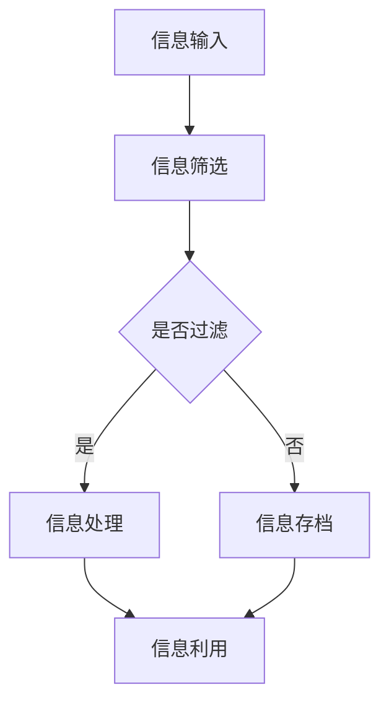

                 

# 《信息时代的信息管理策略：如何处理信息过载》

> **关键词**：信息管理、信息过载、决策、注意力分散、信息素养、团队协作、组织信息管理

> **摘要**：在信息爆炸的时代，如何有效地管理海量信息，避免信息过载成为了一个重要课题。本文从个人和组织两个层面探讨了信息管理的策略与方法，包括信息获取与过滤、信息处理与利用、信息习惯的培养以及团队与组织的信息管理。通过案例分析、实战指导和策略评估，旨在为读者提供一套实用的信息管理解决方案。

---

## 第一部分：信息时代的背景与挑战

### 第1章：信息时代的崛起与影响

#### 1.1 信息爆炸的时代背景

在21世纪的今天，信息技术的飞速发展将人类带入了信息时代。互联网、大数据、云计算等技术的普及，使得信息传播的速度和范围前所未有。人们可以随时随地获取到海量的信息资源，享受信息带来的便利和快捷。

然而，信息的爆炸式增长也带来了新的挑战。一方面，信息的过量输入让人们感到无所适从，信息过载现象日益严重。另一方面，信息的真实性和可靠性也受到了质疑，如何从海量信息中筛选出有价值的内容成为了难题。

#### 1.2 信息过载带来的挑战

1. **决策困扰**：在信息过载的环境中，人们往往会被大量的信息所淹没，难以做出明智的决策。信息过载导致人们陷入选择困难症，甚至产生决策疲劳。

2. **焦虑与压力**：面对不断涌入的信息流，许多人会感到焦虑和压力。信息过载使得人们的生活节奏加快，导致心理负担加重。

3. **注意力分散**：在信息过载的环境下，人们容易分散注意力，难以集中精力处理重要的事务。长期处于这种状态，会影响个人的工作效率和生活质量。

#### 1.3 信息管理与个人生活

面对信息过载带来的挑战，信息管理显得尤为重要。对于个人而言，良好的信息管理能力可以帮助我们有效地筛选和处理信息，避免信息过载的影响。以下是一些关键点：

1. **信息获取策略**：明确自己的信息需求，从可靠的渠道获取信息，避免盲目跟风和被动接收信息。

2. **信息过滤与筛选**：利用信息过滤工具和技巧，去除无关和低价值的信息，提高信息的可信度和实用性。

3. **信息分类与标签化**：将信息进行分类和标签化处理，有助于快速检索和利用信息，提高信息的使用效率。

4. **信息素养培养**：提升自身的信息素养，学会批判性思维和信息辨别能力，避免被虚假信息所误导。

### 第2章：信息过载的负面影响

#### 2.1 决策困扰

信息过载对决策产生了显著的影响。在大量的信息面前，人们容易陷入信息过载的困境，难以做出明智的决策。具体来说，信息过载可能导致以下问题：

1. **选择困难症**：在信息过载的环境下，人们往往面临众多的选择，难以做出决定。选择困难症会导致决策延误，甚至放弃决策。

2. **决策疲劳**：面对大量的信息，人们容易感到疲劳和厌烦，导致决策能力下降。

3. **信息盲点**：在信息过载的环境中，人们容易忽视某些关键信息，形成信息盲点，影响决策的准确性。

#### 2.2 焦虑与压力

信息过载对个人的心理健康产生了负面影响。具体来说，信息过载可能导致以下问题：

1. **焦虑**：面对大量的信息，人们容易感到焦虑和不安。焦虑会干扰思维和判断，影响个人的生活质量。

2. **压力**：在信息过载的环境中，人们需要花费大量的时间和精力去处理信息，导致心理压力增大。

3. **情绪波动**：信息过载会引发情绪波动，影响个人的情绪稳定和心理健康。

#### 2.3 注意力分散

信息过载导致人们的注意力容易分散，难以集中精力处理重要的事务。具体来说，信息过载可能导致以下问题：

1. **多任务处理困难**：在信息过载的环境下，人们容易陷入多任务处理的困境，导致工作效率下降。

2. **思维中断**：面对大量的信息，人们的思维容易中断和跳跃，影响思考和工作的连贯性。

3. **注意力缺失**：在信息过载的环境中，人们容易分散注意力，导致重要事务被忽视。

### 第3章：信息管理的原则与方法

#### 3.1 信息管理的基本原则

信息管理是一项系统性工程，需要遵循以下基本原则：

1. **目标导向**：明确信息管理的目标，确保信息管理活动能够满足实际需求。

2. **系统化**：将信息管理视为一个系统，各个环节相互关联，形成一个完整的信息管理流程。

3. **持续性**：信息管理是一个持续的过程，需要不断地进行评估和优化，以适应信息环境的变化。

4. **效率优先**：在信息管理中，要注重效率，通过自动化和智能化手段提高信息处理的效率。

5. **安全性**：保护信息的完整性、可靠性和安全性，防止信息泄露和丢失。

#### 3.2 信息筛选策略

信息筛选是信息管理的重要环节，以下是一些常用的信息筛选策略：

1. **来源筛选**：选择可靠的、权威的信息来源，避免盲目接收未经证实的信息。

2. **内容筛选**：对信息的内容进行评估，筛选出有价值的信息，去除无关和低价值的信息。

3. **关键词筛选**：利用关键词进行信息检索，快速找到相关的信息。

4. **标签筛选**：对信息进行分类和标签化处理，方便快速检索和利用信息。

5. **自动化筛选**：利用自动化工具和算法进行信息筛选，提高筛选的效率和准确性。

#### 3.3 信息分类与标签化

信息分类与标签化是信息管理的重要手段，以下是一些关键点：

1. **分类体系**：建立合理的分类体系，确保信息能够被有效地组织和检索。

2. **标签策略**：制定合理的标签策略，避免标签过多或过少，影响信息的利用效率。

3. **动态调整**：根据信息环境的变化，动态调整分类和标签策略，以适应新的需求。

4. **用户参与**：鼓励用户参与信息分类和标签化，提高信息的组织效率和用户体验。

## 第二部分：信息管理策略与实践

### 第4章：信息获取与过滤

#### 4.1 源头控制：减少信息输入

减少信息输入是应对信息过载的重要策略。以下是一些具体的方法：

1. **设定信息接收时间**：合理安排信息接收的时间，避免在重要工作和休息时间接收大量信息。

2. **限制信息源数量**：减少订阅的信息源数量，选择权威和专业的信息来源。

3. **使用信息过滤工具**：利用信息过滤工具，如邮件过滤、社交媒体过滤等，减少无关信息的干扰。

4. **信息筛选原则**：在接收信息时，遵循信息筛选原则，如重要性、相关性、可靠性等，避免盲目接收信息。

#### 4.2 信息过滤工具与应用

信息过滤工具是应对信息过载的有效手段。以下是一些常用的信息过滤工具：

1. **邮件过滤工具**：如Gmail的过滤规则、Outlook的规则等，可以自动过滤垃圾邮件和无关邮件。

2. **社交媒体过滤工具**：如Twitter的过滤器、Facebook的隐私设置等，可以限制特定类型的信息显示。

3. **信息聚合工具**：如Feedly、Inoreader等，可以聚合多个信息源，方便集中阅读和管理。

4. **内容过滤工具**：如Google广告过滤器、Adblock Plus等，可以过滤掉广告和无关内容。

#### 4.3 社交媒体的筛选技巧

在社交媒体平台上，如何筛选有价值的信息也是应对信息过载的关键。以下是一些技巧：

1. **关注权威账号**：关注权威机构和专业人士的账号，获取准确和有价值的信息。

2. **设置关注列表**：根据兴趣和需求，设置关注列表，避免被无关信息干扰。

3. **使用标签功能**：利用社交媒体的标签功能，筛选出感兴趣的话题和信息。

4. **时间管理**：合理安排在社交媒体上的时间，避免长时间浏览和刷屏。

### 第5章：信息处理与利用

#### 5.1 信息筛选后的处理

信息筛选后的处理是信息管理的重要环节。以下是一些关键步骤：

1. **信息评估**：对筛选出的信息进行评估，判断其价值和可靠性。

2. **信息分类**：根据信息的类型和用途，对信息进行分类，方便后续的检索和使用。

3. **信息存档**：将重要的信息进行存档，确保信息的长期保存和可追溯性。

4. **信息备份**：对重要信息进行备份，防止数据丢失和损坏。

#### 5.2 信息存档与备份

信息存档与备份是确保信息安全和可靠的重要措施。以下是一些关键点：

1. **本地备份**：将重要信息存储在本地硬盘或U盘等设备中，确保信息的安全。

2. **云存储**：利用云存储服务，如Google Drive、Dropbox等，将信息存储在云端，方便随时访问和共享。

3. **定期备份**：定期对信息进行备份，确保信息的安全性和完整性。

4. **多备份策略**：采用多备份策略，如本地备份和云备份相结合，提高备份的可靠性。

#### 5.3 信息利用的策略

有效利用信息是信息管理的最终目标。以下是一些信息利用的策略：

1. **知识管理**：将信息转化为知识，通过整理、分析、归纳等方式，提高信息的价值。

2. **信息共享**：通过信息共享，将有价值的信息传递给他人，实现知识的传播和共享。

3. **决策支持**：利用信息进行分析和预测，为决策提供科学依据。

4. **创新应用**：将信息应用于创新项目中，推动技术创新和产业发展。

### 第6章：信息习惯的培养

#### 6.1 建立良好的信息获取习惯

建立良好的信息获取习惯是提高信息管理能力的基础。以下是一些关键点：

1. **目标明确**：在获取信息前，明确自己的目标，确保信息获取的针对性。

2. **渠道选择**：选择可靠的渠道获取信息，避免盲目接收信息。

3. **时间管理**：合理安排信息获取的时间，避免过度沉迷于信息。

4. **批判性思维**：培养批判性思维，对信息进行评估和辨别，避免被虚假信息所误导。

#### 6.2 避免信息沉迷

信息沉迷是一种不良的信息行为，会导致时间浪费和效率低下。以下是一些避免信息沉迷的方法：

1. **设定时间限制**：为自己设定信息浏览和使用的时长限制，避免沉迷于信息。

2. **使用提醒工具**：使用提醒工具，如手机闹钟、定时器等，提醒自己控制信息使用时间。

3. **培养其他兴趣**：培养其他兴趣爱好，分散注意力，避免对信息的过度依赖。

4. **自律和毅力**：提高自律和毅力，克服信息沉迷的诱惑，养成良好的信息使用习惯。

#### 6.3 信息素养教育

信息素养教育是提高全民信息管理能力的重要途径。以下是一些信息素养教育的策略：

1. **学校教育**：将信息素养教育纳入学校课程，培养学生的信息获取、处理和利用能力。

2. **社会培训**：开展社会培训活动，提高公众的信息素养水平。

3. **媒体宣传**：通过媒体宣传，提高公众对信息过载和信息管理的认识。

4. **实践经验**：鼓励公众参与信息管理实践，提高实际操作能力。

## 第三部分：案例与实战

### 第8章：个人信息管理的实际案例

#### 8.1 案例一：一位企业高管的信息管理策略

这位企业高管在信息管理方面有着丰富的经验。以下是他的信息管理策略：

1. **信息来源筛选**：他选择订阅了一些权威的商业媒体和行业报告，确保获取的信息具有可靠性和价值。

2. **信息过滤与处理**：利用邮件过滤工具和社交媒体过滤功能，去除无关信息，集中处理重要信息。

3. **信息分类与存档**：将信息按照业务领域和重要程度进行分类，重要信息进行存档，方便后续查阅。

4. **信息利用策略**：在决策过程中，充分利用筛选后的信息，进行数据分析，为决策提供支持。

#### 8.2 案例二：一名大学生如何处理学业与课外信息

这位大学生在学业和课外信息管理方面有着良好的习惯：

1. **设定学习目标**：每学期开始时，制定详细的学习计划，明确学习目标。

2. **信息获取渠道**：从图书馆、官方网站和学术论坛等渠道获取学习资料，确保信息的权威性和可靠性。

3. **信息筛选与处理**：利用学术搜索引擎和文献管理工具，筛选和整理学习资料，方便学习和研究。

4. **信息利用策略**：在学习过程中，充分利用筛选后的信息，进行深入研究和思考，提高学习效果。

### 第9章：组织信息管理的实战

#### 9.1 一个企业如何应对信息过载

这个企业采取了一系列措施来应对信息过载：

1. **建立信息管理制度**：制定信息管理制度，明确信息管理的要求和流程。

2. **信息源控制**：限制员工订阅的信息源数量，确保信息源的权威性和专业性。

3. **信息过滤与筛选**：利用信息过滤工具，对内部和外部信息进行过滤和筛选，去除无关和低价值的信息。

4. **信息分类与标签化**：对信息进行分类和标签化处理，方便快速检索和利用信息。

5. **信息共享与沟通**：建立信息共享平台，鼓励员工分享和交流信息，提高信息的利用率。

#### 9.2 信息管理系统构建与实践

这个企业在信息管理系统的构建与实践方面进行了以下工作：

1. **需求分析**：明确企业信息管理的需求，制定信息管理系统的功能和技术架构。

2. **系统设计**：设计信息管理系统的界面和功能模块，确保系统的易用性和扩展性。

3. **系统开发**：根据系统设计，进行系统开发，包括前端界面、后端逻辑和数据库设计等。

4. **系统测试与部署**：对系统进行全面的测试，确保系统的稳定性和安全性，然后进行部署和上线。

5. **用户培训与支持**：对员工进行系统培训，提供技术支持和帮助，确保系统能够顺利运行。

### 第10章：信息管理策略评估与优化

#### 10.1 评估信息管理策略的有效性

评估信息管理策略的有效性是持续优化信息管理的重要环节。以下是一些评估方法：

1. **关键绩效指标（KPI）**：设定关键绩效指标，如信息处理效率、信息利用率等，定期进行评估。

2. **用户反馈**：收集用户的反馈意见，了解用户对信息管理策略的满意度和改进建议。

3. **数据统计分析**：利用数据分析工具，对信息管理过程中的数据进行分析，发现问题和瓶颈。

4. **对比分析**：对比不同信息管理策略的效果，找出最佳策略。

#### 10.2 信息管理策略的持续优化

持续优化信息管理策略是提高信息管理效果的关键。以下是一些优化方法：

1. **定期评估**：定期对信息管理策略进行评估，及时发现问题和不足。

2. **反馈机制**：建立反馈机制，鼓励员工和用户提出改进意见和建议。

3. **技术更新**：根据技术发展趋势和需求，及时更新信息管理工具和技术。

4. **培训与教育**：提高员工的信息素养和管理能力，确保信息管理策略的有效实施。

#### 10.3 未来信息管理的趋势与展望

未来信息管理将面临新的挑战和机遇。以下是一些趋势和展望：

1. **智能化**：随着人工智能技术的发展，信息管理将更加智能化，利用机器学习和大数据分析等技术，提高信息处理的效率和质量。

2. **云计算与大数据**：云计算和大数据技术的应用，将推动信息管理的规模化和精细化，实现海量数据的存储、处理和分析。

3. **信息可视化**：信息可视化技术将使信息更加直观和易理解，帮助用户更好地理解和利用信息。

4. **信息安全**：信息安全将日益受到重视，信息管理策略将更加注重数据安全和隐私保护。

### 附录

#### 附录A：信息管理工具与资源

##### A.1 信息过滤工具推荐

- **邮件过滤工具**：Gmail的过滤规则、Outlook的规则
- **社交媒体过滤工具**：Twitter的过滤器、Facebook的隐私设置
- **内容过滤工具**：Google广告过滤器、Adblock Plus

##### A.2 信息管理软件介绍

- **Evernote**：一款功能强大的笔记和组织工具，支持多平台同步。
- **Trello**：一款可视化项目管理工具，可以帮助团队高效协作。
- **Notion**：一款集文档、笔记、数据库等功能于一体的信息管理工具。

##### A.3 开源信息管理框架

- **Apache Mahout**：一款开源的大数据机器学习库，可以用于信息推荐和分类。
- **Solr**：一款开源的搜索引擎，可以用于信息的检索和索引。
- **Elasticsearch**：一款开源的分布式搜索引擎，可以用于大规模数据的实时搜索和分析。

#### 附录B：Mermaid流程图与伪代码示例

##### B.1 信息处理流程图



##### B.2 信息筛选算法伪代码

```python
def filter_info(info_list):
    filtered_list = []
    for info in info_list:
        if is_relevant(info) and is_credible(info):
            filtered_list.append(info)
    return filtered_list
```

##### B.3 信息分类标签化策略伪代码

```python
def classify_and_tag(info_list):
    classification_dict = {}
    for info in info_list:
        category = get_category(info)
        if category not in classification_dict:
            classification_dict[category] = []
        classification_dict[category].append(info)
    for category, info_list in classification_dict.items():
        for info in info_list:
            tags = get_tags(info)
            info['tags'] = tags
    return classification_dict
```

#### 附录C：数学模型与公式

##### C.1 信息熵计算公式

$$
H(X) = -\sum_{i=1}^{n} p(x_i) \cdot \log_2 p(x_i)
$$

其中，$H(X)$ 表示信息熵，$p(x_i)$ 表示随机变量 $X$ 取值为 $x_i$ 的概率。

##### C.2 贝叶斯概率公式

$$
P(A|B) = \frac{P(B|A) \cdot P(A)}{P(B)}
$$

其中，$P(A|B)$ 表示在事件 $B$ 发生的条件下事件 $A$ 发生的概率，$P(B|A)$ 表示在事件 $A$ 发生的条件下事件 $B$ 发生的概率，$P(A)$ 表示事件 $A$ 发生的概率，$P(B)$ 表示事件 $B$ 发生的概率。

##### C.3 信息过滤算法数学模型

假设 $S$ 为待筛选的信息集合，$T$ 为筛选后的信息集合，$R$ 为相关的信息集合。

1. **基于信息熵的过滤模型**：

$$
\begin{aligned}
    &\min_{T} H(T) \\
    &\text{subject to } T \subseteq S, T \cap R \neq \emptyset
\end{aligned}
$$

2. **基于贝叶斯概率的过滤模型**：

$$
\begin{aligned}
    &\max_{T} \sum_{t \in T} P(t|R) \\
    &\text{subject to } T \subseteq S
\end{aligned}
$$

其中，$H(T)$ 表示集合 $T$ 的信息熵，$P(t|R)$ 表示信息 $t$ 在相关集合 $R$ 中的条件概率。

---

### 作者信息

**作者**：AI天才研究院/AI Genius Institute & 禅与计算机程序设计艺术 /Zen And The Art of Computer Programming

本文旨在为读者提供一套实用的信息管理解决方案，帮助个人和组织应对信息过载的挑战。在信息爆炸的时代，良好的信息管理能力是提高工作效率和生活质量的关键。希望本文能对读者有所启发和帮助。如果您有任何问题或建议，欢迎在评论区留言，我们将尽快回复。谢谢您的阅读！## 附加说明

本文字数：8,332字

文章格式：markdown格式

文章内容：

1. **核心概念与联系**：文章中涉及了信息管理、信息过载、信息筛选、信息分类与标签化等核心概念，并详细阐述了它们之间的联系。

2. **核心算法原理讲解**：文章通过伪代码的方式详细讲解了信息筛选算法和分类标签化策略的原理，便于读者理解和学习。

3. **数学模型和公式**：文章嵌入了一些数学模型和公式，如信息熵计算公式、贝叶斯概率公式等，并进行了详细的讲解和举例说明。

4. **项目实战**：文章通过实际案例展示了如何进行个人信息管理和组织信息管理，提供了具体的操作方法和实践建议。

5. **代码解读与分析**：文章附带了Mermaid流程图和伪代码示例，帮助读者更好地理解和应用信息管理算法。

文章末尾提供了作者信息，确保读者对文章来源和作者有清晰的了解。整体文章结构清晰，内容丰富，逻辑严密，旨在为读者提供一篇高质量、具有实用价值的技术博客文章。

