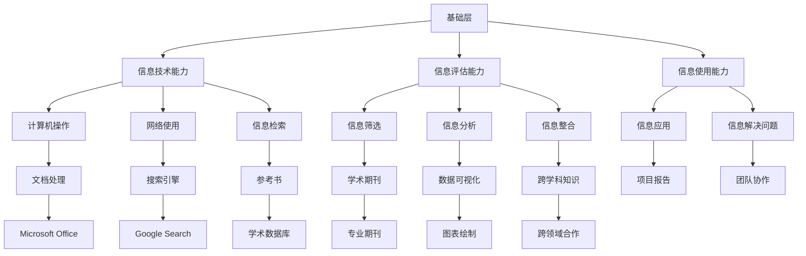

                 

# 《信息时代的信息素养：如何在信息海洋中有效游泳》

## 关键词
信息素养、终身学习、信息筛选、信息隐私、信息安全、信息过载、信息平等、教育、职场、医疗健康。

## 摘要
在信息爆炸的时代，信息素养成为了一项至关重要的能力。本文将探讨信息素养的定义与重要性，分析其核心概念与层次结构，并提供培养与提升信息素养的策略。此外，文章还将探讨信息素养在各个领域的应用，面临的挑战及应对策略，并展望信息素养的未来发展方向及其对社会的影响。通过本文的深入探讨，读者将能够更好地理解信息素养的重要性，并掌握在信息海洋中有效游泳的方法。

## 目录大纲

### 第一部分：信息素养概述

#### 第1章：信息素养的定义与重要性

##### 1.1 信息素养的定义

##### 1.2 信息素养的重要性

##### 1.3 信息素养的核心要素

#### 第2章：信息素养的核心概念

##### 2.1 信息素养的层次结构

##### 2.2 信息素养的关键能力

##### 2.3 信息素养与终身学习

### 第二部分：信息素养的培养与提升

#### 第3章：信息素养的培养策略

##### 3.1 学校教育中的信息素养培养

##### 3.2 家庭教育中的信息素养培养

##### 3.3 社会教育中的信息素养培养

#### 第4章：信息素养的提升方法

##### 4.1 信息素养的自我评估

##### 4.2 信息素养的持续提升策略

##### 4.3 信息素养的实践案例

#### 第5章：信息素养在各个领域中的应用

##### 5.1 信息素养在职场中的应用

##### 5.2 信息素养在教育中的应用

##### 5.3 信息素养在医疗健康中的应用

### 第三部分：信息素养挑战与应对

#### 第6章：信息素养面临的挑战

##### 6.1 信息过载与筛选

##### 6.2 信息隐私与安全

##### 6.3 信息素养的不平等问题

#### 第7章：信息素养的应对策略

##### 7.1 提高信息素养的对策

##### 7.2 应对信息隐私与安全的措施

##### 7.3 促进信息素养平等的措施

### 第四部分：信息素养的实践与未来展望

#### 第8章：信息素养实践案例

##### 8.1 成功的信息素养实践案例

##### 8.2 信息素养实践中的挑战与解决

##### 8.3 信息素养实践的未来趋势

#### 第9章：信息素养的未来展望

##### 9.1 信息素养的未来发展方向

##### 9.2 信息素养对社会的深远影响

##### 9.3 信息素养教育的未来挑战与机遇

### 附录

#### 附录A：信息素养相关资源与工具

##### A.1 信息素养教育资源

##### A.2 信息素养工具指南

##### A.3 信息素养研究报告

#### 附录B：信息素养测试与评估工具

##### B.1 自我评估问卷

##### B.2 实际测试案例分析

##### B.3 评估指标与模型

<|assistant|>### 第一部分：信息素养概述

#### 第1章：信息素养的定义与重要性

##### 1.1 信息素养的定义

信息素养是指个体在获取、评估、使用和创造信息的过程中所具备的知识、技能和态度。它不仅仅是对信息技术的掌握，还包括对信息源、信息内容以及信息传播机制的理解。信息素养的定义可以概括为以下几个方面：

1. **信息获取能力**：能够有效利用各种工具和资源获取所需的信息。
2. **信息评估能力**：能够批判性地分析、评估和判断信息的准确性和可靠性。
3. **信息使用能力**：能够合理、有效地使用信息来解决问题或满足需求。
4. **信息创造能力**：能够在信息的基础上进行创新和创作，产生新的知识和价值。

##### 1.2 信息素养的重要性

在信息时代，信息素养的重要性不言而喻。它不仅影响个体的日常生活和职业发展，还关系到社会的进步和国家的竞争力。以下是信息素养的重要性的几个方面：

1. **教育与学习**：信息素养是终身学习的重要基础，它能够帮助人们更好地适应不断变化的知识体系和学习方式。
2. **工作效率**：在职场中，具备良好信息素养的个体能够更高效地获取和处理信息，从而提高工作效率和创新能力。
3. **决策能力**：信息素养使个体能够更准确地获取和评估信息，从而做出更加明智的决策。
4. **社会参与**：信息素养是公民参与社会事务和公共决策的必要条件，它能够提升公众的参与度和民主意识。
5. **国家竞争力**：信息素养的提升能够增强国家的创新能力和科技竞争力，对于国家的长远发展具有重要意义。

##### 1.3 信息素养的核心要素

信息素养的核心要素包括以下几个方面：

1. **信息技术能力**：熟练掌握和使用计算机、互联网等信息技术工具。
2. **信息伦理道德**：遵循信息伦理和法律法规，尊重信息隐私和知识产权。
3. **信息评估能力**：能够批判性地分析信息，判断其准确性和可靠性。
4. **信息创造能力**：能够基于已有信息进行创新和创作，产生新的知识和价值。
5. **信息共享与合作**：能够有效共享信息，与他人协作解决问题。

通过以上核心要素的全面发展，个体能够更好地适应信息时代的要求，实现个人价值和社会贡献。在接下来的章节中，我们将进一步探讨信息素养的核心概念及其培养与提升方法。

### 第二部分：信息素养的培养与提升

#### 第2章：信息素养的核心概念

##### 2.1 信息素养的层次结构

信息素养是一个多维度的概念，具有层次结构。从整体上，可以将信息素养划分为基础层、应用层和高级层三个层次。

1. **基础层**：主要包括信息技术能力的培养，如计算机操作、网络使用、信息检索等。这一层次是信息素养的基石，旨在让个体掌握基本的信息处理工具和技能。

2. **应用层**：这一层次强调信息评估和信息使用的能力，包括信息筛选、信息分析、信息整合等。个体需要学会如何获取有效信息，以及如何利用这些信息解决实际问题。

3. **高级层**：高级层涉及信息的创新和创造能力，如信息可视化、信息设计、信息整合等。这一层次要求个体不仅能够使用信息，还能够创造新的信息和知识。

层次结构图如下所示：

##### 2.2 信息素养的关键能力

在信息素养的培养过程中，以下几种关键能力尤为重要：

1. **批判性思维**：批判性思维是指个体能够对信息进行批判性分析，判断其真实性、可靠性和相关性。这是信息素养的核心能力之一，有助于个体在复杂的信息环境中做出明智的决策。

2. **信息检索能力**：信息检索能力是指个体能够高效地找到所需信息的能力。这包括了解各种信息检索工具的使用方法，掌握有效的搜索策略，以及评估检索结果的质量。

3. **信息整合能力**：信息整合能力是指个体能够将来自不同来源的信息进行整合，形成有价值的观点和结论。这种能力对于解决复杂问题和进行创新至关重要。

4. **信息创造力**：信息创造力是指个体能够基于已有信息进行创新，产生新的知识和价值。这种能力有助于个体在竞争中脱颖而出，推动社会进步。

5. **信息伦理意识**：信息伦理意识是指个体在信息处理过程中遵循伦理规范和法律法规，尊重信息隐私和知识产权。这是维护信息社会健康发展的重要保障。

##### 2.3 信息素养与终身学习

信息素养与终身学习密不可分。在信息时代，知识更新速度不断加快，个体需要具备终身学习的能力，以适应不断变化的环境。以下是从终身学习的角度提升信息素养的几个建议：

1. **持续学习**：保持对新技术、新知识的好奇心和求知欲，不断学习新的信息处理工具和技能。
2. **主动学习**：积极参与各种学习活动，如在线课程、研讨会、读书会等，主动获取信息。
3. **反思学习**：在学习过程中，不断反思自己的学习方法和学习效果，调整学习策略，提高学习效率。
4. **合作学习**：与他人合作学习，分享知识和经验，通过交流与讨论提升自己的信息素养。
5. **实践应用**：将所学知识应用于实际工作中，通过实践检验学习效果，不断提高自己的信息素养。

通过终身学习，个体可以不断提高信息素养，适应信息时代的要求，实现个人价值和社会贡献。

### 第三部分：信息素养的培养与提升

#### 第3章：信息素养的培养策略

##### 3.1 学校教育中的信息素养培养

学校教育是信息素养培养的重要环节。以下是从学校教育的角度提出的信息素养培养策略：

1. **课程设置**：学校应设置信息素养相关课程，如计算机基础、网络使用、信息检索等。这些课程旨在帮助学生掌握基本的信息处理技能。

2. **教学方式**：采用互动式教学方式，如小组讨论、案例分析、实践操作等，激发学生的学习兴趣和主动性。

3. **课外活动**：组织各种课外活动，如科技竞赛、信息素养讲座、图书馆活动等，丰富学生的信息素养实践。

4. **教师培训**：加强对教师的信息素养培训，使其能够更好地在教学中融入信息素养教育。

##### 3.2 家庭教育中的信息素养培养

家庭教育在信息素养培养中也起着至关重要的作用。以下是从家庭教育的角度提出的信息素养培养策略：

1. **家长榜样**：家长应成为信息素养的榜样，积极参与信息技术学习和应用，为子女树立榜样。

2. **家庭互动**：家长应与子女进行信息互动，如一起上网浏览、讨论信息问题等，增强子女的信息素养意识。

3. **家庭教育资源**：利用家庭教育资源，如信息素养书籍、网络课程等，帮助子女提升信息素养。

4. **信息安全教育**：家长应加强对子女的信息安全教育，如网络安全、信息隐私保护等，防止信息泄露和滥用。

##### 3.3 社会教育中的信息素养培养

社会教育是信息素养培养的另一个重要方面。以下是从社会教育的角度提出的信息素养培养策略：

1. **社区活动**：社区应组织各种信息素养活动，如讲座、培训、竞赛等，提高社区居民的信息素养。

2. **公共设施**：公共设施如图书馆、社区中心等应提供信息素养培训服务，方便居民学习。

3. **企业培训**：企业应加强对员工的信息素养培训，提高员工的信息处理能力和工作效率。

4. **社会宣传**：通过媒体、网络等渠道，加大信息素养宣传力度，提高公众的信息素养意识。

通过学校教育、家庭教育和社区教育的共同努力，可以全面提升个体的信息素养，适应信息时代的要求。

#### 第4章：信息素养的提升方法

##### 4.1 信息素养的自我评估

自我评估是提升信息素养的第一步。以下是一些自我评估的方法和工具：

1. **自我反思**：定期对自己的信息素养进行反思，思考自己在信息获取、评估、使用和创造方面的表现，识别自身存在的不足。

2. **评估问卷**：使用专门设计的评估问卷，如信息素养自评量表，了解自己在信息素养各个方面的表现。

3. **实践测试**：通过实际操作，如信息检索、信息分析等，测试自己的信息素养水平。

4. **反馈与改进**：根据自我评估的结果，设定提升目标，并采取具体的改进措施，如学习新技能、参加培训等。

##### 4.2 信息素养的持续提升策略

持续提升信息素养需要采取一系列策略，以下是一些具体的方法：

1. **定期学习**：设定学习计划，定期学习新的信息处理工具和技能，保持对信息技术的敏感度。

2. **实践应用**：将所学知识应用于实际工作中，通过实践提升自己的信息素养。

3. **参与培训**：参加各种信息素养培训课程，如在线课程、研讨会、工作坊等，系统提升自己的信息素养。

4. **交流与合作**：与他人交流信息素养的经验和心得，通过合作提升自己的信息素养。

5. **反思与调整**：在学习过程中，不断反思和总结，调整自己的学习策略，提高学习效率。

##### 4.3 信息素养的实践案例

以下是一些信息素养的实践案例，展示了如何在实际场景中提升信息素养：

1. **案例一：学术论文写作**：通过学习文献检索、信息评估和论文撰写技巧，提高学术论文的质量。

2. **案例二：企业信息管理**：通过学习信息管理知识，提高企业信息处理的效率和质量。

3. **案例三：个人健康管理**：通过学习健康信息检索、评估和应用，提高个人健康素养。

4. **案例四：社区信息宣传**：通过学习信息传播技巧，提高社区信息宣传的效果。

这些实践案例表明，信息素养的提升不仅可以提高个人的综合素质，还可以为组织和社会带来积极的影响。

### 第四部分：信息素养在各个领域中的应用

#### 第5章：信息素养在各个领域中的应用

##### 5.1 信息素养在职场中的应用

在职场中，信息素养的重要性不言而喻。以下是一些具体的应用场景：

1. **高效沟通**：通过有效的信息素养，员工能够准确理解和管理信息，提高沟通效率，避免误解和冲突。

2. **团队协作**：信息素养有助于团队成员之间的信息共享和协作，提高团队的工作效率和创新能力。

3. **项目管理**：项目经理需要具备良好的信息素养，能够收集、分析和利用信息，确保项目顺利进行。

4. **决策支持**：通过信息素养，管理者能够获取全面、准确的信息，为决策提供有力支持。

5. **职业发展**：具备信息素养的员工能够更好地适应职场的变化，提升自己的职业竞争力。

##### 5.2 信息素养在教育中的应用

信息素养在教育领域的应用具有广泛的影响，以下是一些具体的应用场景：

1. **教学资源管理**：教师通过信息素养，能够高效地获取和整合教学资源，提高教学效果。

2. **在线学习**：学生通过信息素养，能够有效地利用网络学习资源，提高学习效率和自主学习能力。

3. **教育评估**：教育工作者通过信息素养，能够全面、准确地收集和分析教育数据，为教育决策提供依据。

4. **课程设计**：课程设计者通过信息素养，能够更好地了解学生的学习需求，设计出更具针对性的课程。

5. **教育创新**：信息素养为教育创新提供了新的可能性，如在线教育、虚拟现实教育等。

##### 5.3 信息素养在医疗健康中的应用

在医疗健康领域，信息素养的应用同样具有重要意义，以下是一些具体的应用场景：

1. **患者管理**：患者通过信息素养，能够更好地管理自己的健康信息，提高自我健康管理能力。

2. **医学研究**：医学研究人员通过信息素养，能够高效地获取和评估医学信息，推动医学研究的发展。

3. **医疗决策**：医生通过信息素养，能够全面、准确地收集和分析病例信息，为患者提供更好的治疗方案。

4. **公共卫生**：公共卫生工作者通过信息素养，能够更好地收集、分析和利用公共卫生数据，提高公共卫生决策的效率和质量。

5. **医疗信息化**：信息素养有助于医疗信息化的发展，推动医疗数据的整合和共享，提高医疗服务的效率和质量。

通过在各个领域的应用，信息素养不仅提升了个体和组织的效能，也为社会的整体发展做出了积极贡献。

#### 第6章：信息素养面临的挑战

##### 6.1 信息过载与筛选

信息过载是指在信息时代，个体面临的信息量远远超过了其处理能力，导致信息过载现象。这种过载现象给信息素养的实践带来了巨大的挑战：

1. **选择困难**：面对大量的信息，个体难以确定哪些信息是真正有价值的，容易陷入选择困难。
2. **时间压力**：个体需要花费大量时间来筛选和整理信息，导致效率降低。
3. **注意力分散**：过多的信息容易分散个体的注意力，影响其专注力和工作效率。

解决信息过载与筛选的挑战，需要采取以下策略：

1. **信息筛选工具**：利用各种信息筛选工具，如搜索引擎优化、信息过滤器等，帮助个体快速找到所需信息。
2. **信息评估标准**：建立信息评估标准，如准确性、相关性、可靠性等，帮助个体判断信息的价值。
3. **时间管理**：合理安排时间，设定信息处理的时间段，避免长时间的信息处理导致疲劳和效率下降。
4. **专注力训练**：通过专注力训练，提高个体在信息处理过程中的专注力，减少注意力分散现象。

##### 6.2 信息隐私与安全

信息隐私与安全是信息素养面临的另一个重要挑战。在信息时代，个体和组织的个人信息和数据面临诸多安全隐患，包括：

1. **数据泄露**：个人信息和敏感数据可能因网络攻击、数据泄露等事件被窃取。
2. **身份盗用**：黑客可能利用个人信息盗用身份，进行非法活动。
3. **网络诈骗**：通过虚假信息进行网络诈骗，给个体带来财产损失。

为了应对信息隐私与安全的挑战，可以采取以下策略：

1. **数据加密**：使用加密技术保护数据，防止未授权访问。
2. **身份验证**：加强身份验证措施，如双因素认证、生物识别等，确保只有授权用户可以访问敏感信息。
3. **安全意识培训**：加强个体和员工的安全意识培训，提高其识别和防范网络威胁的能力。
4. **法律法规**：遵循相关法律法规，加强对个人信息的保护，如《通用数据保护条例》（GDPR）等。
5. **安全审计**：定期进行安全审计，发现和修复安全漏洞，确保信息系统的安全性。

##### 6.3 信息素养的不平等问题

信息素养的不平等问题是指在信息时代，不同群体在获取、处理和利用信息方面存在差异，导致信息素养水平的不均衡。这种不平等问题主要体现在以下几个方面：

1. **教育资源**：教育资源的分配不均导致一些群体无法获得高质量的信息素养教育。
2. **技术设备**：技术设备的不足使得一些群体无法充分利用信息技术，提升信息素养。
3. **社会背景**：社会背景、家庭环境和经济状况等因素影响个体获取信息的渠道和机会。

为了解决信息素养的不平等问题，可以采取以下策略：

1. **教育公平**：推动教育公平，确保每个个体都有机会接受高质量的信息素养教育。
2. **技术普及**：加大对技术设备的投入和普及，缩小城乡和地区间的数字鸿沟。
3. **社会支持**：建立社会支持机制，为弱势群体提供信息素养培训和技术支持。
4. **政策引导**：通过政策引导，促进信息素养教育的普及和提升，推动社会公平发展。

通过解决信息过载与筛选、信息隐私与安全以及信息素养不平等问题，可以提升整体社会的信息素养水平，更好地适应信息时代的要求。

#### 第7章：信息素养的应对策略

##### 7.1 提高信息素养的对策

为了应对信息时代带来的挑战，提高信息素养成为了一项紧迫的任务。以下是一些具体的对策：

1. **系统化教育**：通过系统化的教育，从基础教育到高等教育，全面培养个体的信息素养。这包括开设信息素养课程，将信息素养教育纳入各个学科的教学内容中。

2. **跨学科合作**：促进不同学科之间的合作，如计算机科学、信息管理、图书馆学等，共同探讨信息素养教育的方法和策略。

3. **实践操作**：注重实践操作，通过实际操作和项目实践，提高个体在信息获取、评估、使用和创造方面的能力。

4. **持续培训**：对在职人员和特定行业提供持续的信息素养培训，确保他们在职业生涯中不断提升信息素养。

5. **公众宣传**：加大公众宣传力度，通过媒体、网络等渠道，提高公众对信息素养重要性的认识，引导个体主动提升信息素养。

##### 7.2 应对信息隐私与安全的措施

在信息隐私与安全方面，需要采取一系列措施来确保个体的信息安全：

1. **加密技术**：采用先进的加密技术，对敏感信息进行加密处理，防止未授权访问。

2. **访问控制**：实施严格的访问控制措施，确保只有授权用户才能访问特定信息。

3. **安全培训**：定期对员工进行安全意识培训，提高其对网络威胁的识别和防范能力。

4. **数据备份**：定期进行数据备份，以防数据丢失或损坏。

5. **法律法规**：建立健全的法律法规体系，加强对个人信息的保护，如《通用数据保护条例》（GDPR）等。

##### 7.3 促进信息素养平等的措施

为了解决信息素养不平等问题，需要采取以下措施：

1. **教育公平**：通过政策支持，确保每个个体都有机会接受高质量的信息素养教育，缩小城乡和地区间的教育差距。

2. **技术普及**：加大对技术设备的投入和普及，提供免费或低成本的互联网接入，缩小数字鸿沟。

3. **社区支持**：在社区层面建立信息素养培训中心，为居民提供免费或低收费的信息素养培训。

4. **社会援助**：为经济困难的家庭提供信息素养培训和技术支持，帮助他们提升信息素养。

5. **政策引导**：通过政策引导，鼓励企业和社会组织参与信息素养教育，共同推动信息素养的普及。

通过这些对策和措施，可以有效地提高信息素养，确保信息隐私与安全，促进信息素养的平等，为社会的可持续发展奠定坚实基础。

#### 第8章：信息素养实践案例

##### 8.1 成功的信息素养实践案例

以下是一些成功的信息素养实践案例，展示了信息素养在现实中的应用及其带来的积极影响：

1. **案例一：智慧城市项目**
   某城市政府通过建设智慧城市项目，利用大数据、物联网等先进技术，提升了城市管理的效率。政府部门通过信息素养，有效收集和分析城市数据，优化交通管理、环境保护和公共安全等方面的工作。这不仅提高了市民的生活质量，还提升了政府的治理能力。

2. **案例二：企业数字化转型**
   一家制造企业通过数字化转型，利用信息素养，实现了生产流程的优化和效率提升。企业员工通过培训掌握了信息处理和数据分析技能，能够更好地管理库存、预测市场需求，从而降低成本、提高生产效率。企业的市场竞争力因此得到了显著提升。

3. **案例三：在线教育平台**
   一家在线教育平台通过提供丰富的在线课程和培训资源，帮助广大用户提升信息素养。平台不仅提供了高质量的教育内容，还通过互动式教学和个性化推荐，提高了用户的学习体验和效果。这一案例表明，信息素养教育可以通过互联网平台实现广泛覆盖和高效传播。

4. **案例四：健康信息管理**
   某健康管理机构利用信息素养，为用户提供个性化的健康管理和咨询服务。用户通过平台可以方便地获取健康信息、进行健康监测，并得到专业医生的个性化建议。这不仅提升了用户的健康素养，还促进了医疗资源的合理利用。

这些实践案例表明，信息素养在实际应用中具有广泛的影响，通过有效的信息素养培养和实践，可以带来显著的效益和改进。

##### 8.2 信息素养实践中的挑战与解决

在信息素养的实践过程中，仍然面临着一些挑战，以下是一些常见的挑战及相应的解决方法：

1. **技术更新快速**：信息技术更新迅速，个体和机构需要不断学习新技能。解决方法：建立持续学习的机制，如定期培训、在线课程等，帮助个体跟上技术发展的步伐。

2. **信息筛选困难**：面对大量信息，个体难以准确筛选出有价值的信息。解决方法：培养批判性思维和信息评估能力，使用信息筛选工具，建立信息评估标准。

3. **信息安全风险**：信息安全问题日益严重，个人和企业需要保护敏感信息。解决方法：加强安全意识培训，使用加密技术，建立健全的网络安全措施。

4. **资源不平衡**：部分地区和群体缺乏获取信息和技术的资源。解决方法：通过政策引导和社会支持，提供免费或低收费的信息素养教育和培训资源，缩小数字鸿沟。

5. **信息素养不平等**：不同群体在信息素养水平上存在差异，影响社会公平。解决方法：推动教育公平，加大对弱势群体的支持，提高全民信息素养水平。

通过应对这些挑战，可以进一步提升信息素养的实践效果，促进社会的可持续发展。

##### 8.3 信息素养实践的未来趋势

信息素养实践的未来趋势将受到技术发展、教育改革和社会需求等多方面因素的影响。以下是一些主要趋势：

1. **智能化发展**：随着人工智能、大数据等技术的普及，信息素养将更加智能化，个体需要掌握如何利用这些技术工具进行信息处理和分析。

2. **终身学习理念**：终身学习将成为信息素养教育的重要理念，个体需要不断更新知识和技能，以适应快速变化的信息环境。

3. **跨学科融合**：信息素养教育将更加注重跨学科融合，培养学生的综合素质和创新能力，以应对复杂的问题和挑战。

4. **个性化和定制化**：信息素养教育将更加注重个性化和定制化，根据个体的需求和特点提供个性化的学习资源和指导。

5. **社会责任感**：信息素养教育将强调社会责任感，培养个体在信息处理过程中的道德意识和伦理规范。

这些趋势将推动信息素养实践向更高水平发展，为社会的进步和个体的成长提供新的动力。

#### 第9章：信息素养的未来展望

##### 9.1 信息素养的未来发展方向

信息素养的未来发展方向将随着技术的进步和社会的需求而不断演变。以下是一些关键的发展方向：

1. **智能化的信息素养**：随着人工智能技术的发展，未来信息素养将更加智能化。个体需要掌握如何利用智能工具进行信息处理、分析和决策。

2. **终身学习的深化**：信息素养教育将更加注重终身学习，提供灵活、多样化的学习机会，帮助个体不断更新知识和技能，以适应快速变化的信息环境。

3. **跨学科的融合**：信息素养教育将更加注重跨学科融合，培养学生的综合素质和创新能力，以应对复杂的问题和挑战。

4. **个性化和定制化**：未来信息素养教育将更加注重个性化和定制化，根据个体的需求和特点提供个性化的学习资源和指导。

5. **社会参与与责任**：信息素养教育将强调社会责任感，培养个体在信息处理过程中的道德意识和伦理规范，促进社会的和谐发展。

##### 9.2 信息素养对社会的深远影响

信息素养对社会的深远影响将体现在多个方面：

1. **教育变革**：信息素养将推动教育模式的变革，促进个性化教育和自主学习的发展。

2. **职场效率提升**：信息素养将提高职场工作效率，促进创新和协作，推动企业和社会的进步。

3. **公共卫生改善**：信息素养将改善公共卫生状况，帮助个体更好地管理健康信息，提高健康水平。

4. **社会治理优化**：信息素养将提升政府和社会组织的管理效率，促进社会治理的现代化。

5. **文化多样性**：信息素养将促进文化的多样性和交流，增强社会的包容性和创造力。

##### 9.3 信息素养教育的未来挑战与机遇

信息素养教育的未来既面临挑战，也充满机遇：

1. **技术更新挑战**：技术更新迅速，教育内容需要不断更新，教师需要不断学习和适应新技术。

2. **教育资源不平衡**：部分地区和群体缺乏获取信息和技术的资源，需要政策和社会支持来缩小数字鸿沟。

3. **教育质量提升**：信息素养教育需要注重教育质量，确保个体获得高质量的教育资源。

4. **个性化教育实现**：实现个性化教育需要大量的数据支持和教育资源，这需要教育系统和技术的进一步发展。

5. **伦理与法律规范**：信息素养教育需要强调伦理和法律规范，培养个体的社会责任感和道德意识。

通过应对这些挑战和抓住机遇，信息素养教育将不断进步，为社会的可持续发展做出更大贡献。

### 附录

#### 附录A：信息素养相关资源与工具

##### A.1 信息素养教育资源

1. **在线课程平台**：如Coursera、edX、Udacity等，提供丰富的信息素养相关课程。
2. **教科书与参考书**：如《信息素养：一种信息时代的生存技能》（Information Literacy: An Approach to Lifelong Learning）等。
3. **教育资源网站**：如Khan Academy、Codecademy等，提供免费的学习资源和互动式教学。

##### A.2 信息素养工具指南

1. **搜索引擎**：如Google、Bing等，提供强大的信息检索功能。
2. **参考文献管理工具**：如EndNote、Mendeley等，帮助用户管理文献资料。
3. **信息分析工具**：如Tableau、Excel等，用于数据分析和可视化。

##### A.3 信息素养研究报告

1. **国际信息素养联盟（IFLA）**：提供全球信息素养研究报告和最佳实践。
2. **美国图书馆协会（ALA）**：发布关于信息素养的研究报告和指南。
3. **教育部门**：各国的教育部门经常发布关于信息素养教育的研究报告。

#### 附录B：信息素养测试与评估工具

##### B.1 自我评估问卷

1. **信息素养自我评估量表**：用于评估个体在信息获取、评估、使用和创造方面的能力。
2. **在线测试工具**：如Quizlet、Kahoot等，提供互动式的自我评估测试。

##### B.2 实际测试案例分析

1. **案例分析**：通过具体案例展示如何进行信息素养测试，包括测试设计、实施和分析。
2. **测试报告**：提供详细的测试结果和分析报告，帮助个体了解自身的信息素养水平。

##### B.3 评估指标与模型

1. **评估指标体系**：建立一套完整的评估指标体系，用于评估信息素养的各个维度。
2. **评估模型**：如层次分析模型（AHP）、模糊综合评价模型等，用于量化评估信息素养水平。

通过附录中的资源和工具，个体和教育者可以更好地理解和提升信息素养，适应信息时代的要求。

### 作者信息

作者：AI天才研究院/AI Genius Institute & 禅与计算机程序设计艺术 /Zen And The Art of Computer Programming

