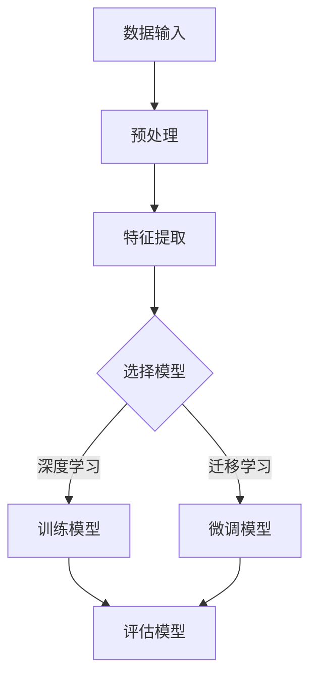
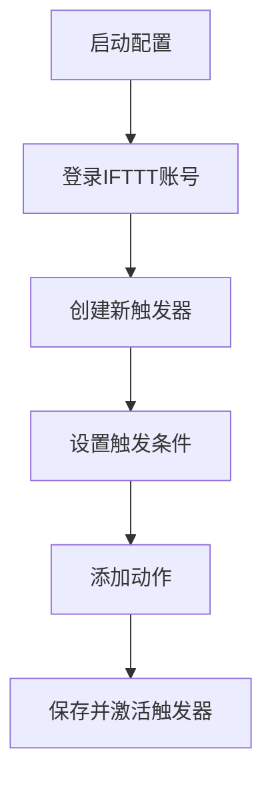
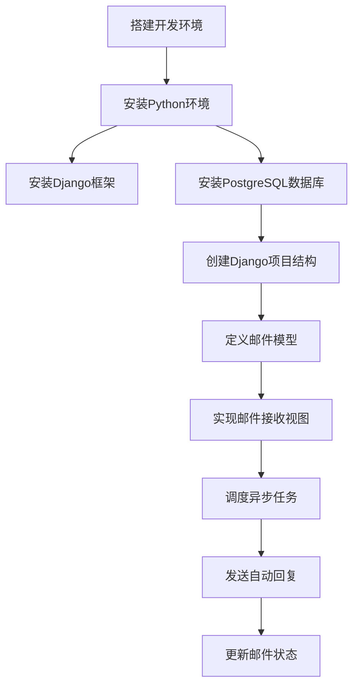
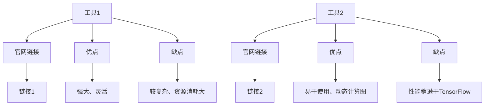

                 

# 信息简化的工具和自动化：如何利用技术简化你的生活和工作

## 关键词
- 信息简化
- 自动化工具
- 时间管理
- 智能家居
- 物联网
- 隐私保护

## 摘要
本文将探讨信息简化的工具和自动化技术，如何帮助我们简化生活和工作。我们将深入分析自动化工具、时间管理工具、智能家居与物联网技术，并提供实际案例和详细解释。此外，还将探讨信息简化与个人隐私的关系，以及未来趋势和挑战。

## 引言

### 第1章：信息简化的必要性与挑战

#### 1.1 信息简化的概念与重要性
在信息爆炸的时代，我们每天都会接触到大量的信息。然而，过多的信息不仅会让我们感到疲惫，还可能影响我们的决策和工作效率。因此，信息简化成为了一个重要的课题。

信息简化，即通过减少不必要的信息，帮助我们更高效地处理和利用信息。这不仅有助于提高生活质量，还能提升工作效率。

#### 1.2 当前生活中的信息复杂性
现代社会中，信息复杂性无处不在。从社交媒体到电子邮件，从新闻资讯到工作文档，我们都面临着信息过载的问题。这不仅使得我们难以专注于重要的事情，还可能引发焦虑和压力。

#### 1.3 信息简化的挑战与机遇
尽管信息简化非常重要，但实现起来并非易事。我们需要面对以下挑战：

1. **信息筛选**：如何在海量信息中筛选出有价值的信息？
2. **数据安全**：如何保护个人隐私，避免信息泄露？
3. **技术依赖**：过度依赖自动化工具可能带来新的问题，如失去人机协作的能力。

然而，随着技术的发展，我们也有了更多的机遇。自动化工具、智能家居和物联网技术正在不断涌现，为我们提供更加便捷和智能的生活方式。

#### 1.4 本书的目标与结构
本书的目标是帮助读者了解和掌握信息简化的工具和自动化技术，提高生活和工作效率。本书将分为四个部分：

1. **引言**：介绍信息简化的必要性和挑战。
2. **技术工具介绍**：详细介绍自动化工具、时间管理工具、智能家居与物联网技术。
3. **自动化案例分析**：分析自动化在家务和工作中的应用案例。
4. **总结与展望**：总结本书所学内容，探讨未来趋势与挑战。

### 第2章：自动化工具与应用

#### 2.1 自动化工具的概述
自动化工具是指能够自动执行特定任务或流程的软件或硬件。这些工具可以帮助我们节省时间，减少手动操作的繁琐，提高工作效率。自动化工具的应用领域非常广泛，包括家庭、办公、生产等各个领域。

#### 2.2 常见的自动化工具
在自动化工具中，有一些非常受欢迎的工具，如IFTTT、Zapier和Workato。这些工具各有特色，适用于不同的场景。

##### 2.2.1 IFTTT
IFTTT（If This Then That）是一个基于互联网的自动化服务，允许用户通过创建“配方”来自动执行任务。例如，当您的天气变为雨时，自动发送一条短信提醒您带伞。IFTTT 的优势在于其简单易用，无需编程知识即可创建自动化任务。

##### 2.2.2 Zapier
Zapier 是一个强大的自动化平台，可以帮助用户在不同应用程序之间创建自动化流程。例如，当您在Trello中添加一个新的待办事项时，自动将任务同步到Google日历。Zapier 支持超过2000个应用程序的集成，功能非常强大。

##### 2.2.3 Workato
Workato 是一个企业级自动化平台，提供了高级的自动化和集成功能。它适用于大型企业，可以帮助企业自动化复杂的业务流程。Workato 的优势在于其高度定制化和强大的数据处理能力。

#### 2.3 自动化工具的实际应用
自动化工具可以应用于各种场景，以下是一些实际应用的例子：

1. **家庭自动化**：通过IFTTT，您可以实现智能灯泡、智能音响和智能门锁等设备的自动化控制。
2. **办公自动化**：通过Zapier，您可以自动化邮件处理、日程安排和文件存储等流程。
3. **生产自动化**：通过Workato，您可以自动化生产流程中的数据收集、分析和报告生成。

#### 2.4 自动化工具的使用技巧
为了最大化自动化工具的效果，以下是一些建议：

1. **明确目标**：在开始使用自动化工具之前，明确您要实现的目标和任务。
2. **逐步实施**：自动化是一个逐步的过程，不要试图一次性完成所有任务。
3. **持续优化**：根据实际使用情况，不断优化自动化流程，提高效率。

### 第3章：时间管理工具

#### 3.1 时间管理的概念与重要性
时间管理是指通过规划和组织时间，以提高工作效率和生活质量的一种方法。时间管理的重要性不言而喻，良好的时间管理可以帮助我们：

1. **提高工作效率**：合理安排时间，避免拖延，提高工作效率。
2. **减轻压力**：合理分配时间，减少工作压力，保持身心健康。
3. **实现目标**：明确目标，制定计划，逐步实现目标。

#### 3.2 常见的时间管理工具
市面上有许多时间管理工具，以下是一些受欢迎的工具：

##### 3.2.1 Trello
Trello 是一个基于卡片的任务管理工具，非常适合个人和团队使用。它通过可视化界面，帮助用户清晰地了解任务的进度和优先级。

##### 3.2.2 Asana
Asana 是一款功能强大的项目管理工具，适用于大型团队和企业。它提供了详细的任务分配、进度跟踪和协作功能。

##### 3.2.3 Notion
Notion 是一款多功能的笔记和组织工具，适用于个人和团队。它集成了笔记、数据库、看板等多种功能，可以帮助用户更好地管理信息和任务。

#### 3.3 时间管理工具的实际应用
以下是一些时间管理工具的实际应用案例：

1. **个人任务管理**：通过Trello，您可以清晰地列出个人任务，设置优先级，跟踪进度。
2. **团队协作**：通过Asana，您可以与团队成员协作，分配任务，跟踪项目进度。
3. **知识管理**：通过Notion，您可以创建知识库，整理信息，方便团队成员查阅。

#### 3.4 时间管理技巧与策略
以下是几种有效的时间管理技巧和策略：

1. **明确目标**：设定明确的目标，制定可行的计划。
2. **任务分解**：将大任务分解为小任务，逐一完成。
3. **优先级排序**：根据任务的紧急程度和重要性，进行排序。
4. **避免拖延**：设立提醒，避免拖延任务。
5. **定期复盘**：定期回顾任务完成情况，调整计划。

### 第4章：智能家居与物联网

#### 4.1 智能家居概述
智能家居是指利用物联网技术，将家庭中的各种设备连接起来，实现自动化控制和智能交互。智能家居系统主要包括以下组成部分：

1. **智能设备**：如智能灯泡、智能音响、智能门锁等。
2. **传感器**：如温度传感器、湿度传感器、运动传感器等。
3. **网关**：连接智能设备和互联网的设备，实现数据传输和控制。
4. **平台**：智能家居系统的管理平台，用于配置、监控和控制智能设备。

#### 4.2 常见的智能家居设备
以下是一些常见的智能家居设备：

##### 4.2.1 智能灯泡
智能灯泡可以通过手机APP或语音助手远程控制，调节亮度和颜色，实现氛围照明。

##### 4.2.2 智能音响
智能音响可以通过语音指令控制，播放音乐、查询天气、设置提醒等。

##### 4.2.3 智能门锁
智能门锁可以通过指纹、密码、手机APP等方式进行开锁，实现无钥匙进门。

#### 4.3 物联网技术基础
物联网（IoT）是指将各种设备连接到互联网，实现信息交换和通信。物联网技术的基础包括：

1. **传感器技术**：用于感知和收集物理世界的信息。
2. **通信技术**：如Wi-Fi、蓝牙、Zigbee等，实现设备之间的数据传输。
3. **云计算**：用于存储、处理和分析大量数据。
4. **边缘计算**：在设备本地进行数据处理，降低延迟和带宽消耗。

#### 4.4 智能家居的实际应用案例
以下是几个智能家居的实际应用案例：

1. **智能安防**：通过智能摄像头、门锁和传感器，实现远程监控和家庭安全。
2. **智能节能**：通过智能温控、照明和家电控制，实现节能降耗。
3. **智能健康**：通过智能手环、健康监测设备等，实现健康管理和数据分析。

### 第5章：自动化在家务中的应用

#### 5.1 家务自动化的概念与优势
家务自动化是指利用技术手段，将家庭中的家务劳动自动化，减少人工操作和体力劳动。家务自动化的优势包括：

1. **节省时间**：自动化设备可以快速高效地完成家务，节省人力和时间。
2. **提高生活质量**：自动化家务可以让我们更专注于重要的事情，提高生活质量。
3. **降低劳动强度**：自动化设备可以减少家务劳动的体力消耗，降低劳动强度。

#### 5.2 家务自动化的具体实现
以下是一些家务自动化的具体实现方法：

##### 5.2.1 智能扫地机器人
智能扫地机器人可以通过自动清洁地面，减少家务劳动。用户可以通过手机APP远程控制扫地机器人，设置清洁时间和区域。

##### 5.2.2 智能洗碗机
智能洗碗机可以自动清洗餐具，节省人力和水资源。用户可以根据餐具的脏污程度，选择不同的洗涤模式。

##### 5.2.3 智能洗衣机
智能洗衣机可以自动识别衣物种类和脏污程度，选择合适的洗涤模式。用户还可以通过手机APP远程控制洗衣机，随时监控洗衣进度。

#### 5.3 家务自动化的案例研究
以下是几个家务自动化的案例研究：

1. **智能家居家庭的日常**：通过智能家居设备，家庭主妇可以实现一键清洁、烹饪和监控家庭安全。
2. **高效能家庭的自动清洁**：通过智能扫地机器人和智能洗衣机，家庭主妇可以将更多时间用于陪伴家人和孩子。
3. **远程家庭监控与自动化**：通过智能家居设备和物联网技术，用户可以远程监控家庭安全，实现自动报警和自动化处理。

#### 5.4 家务自动化的未来趋势
随着技术的不断发展，家务自动化将越来越普及。未来趋势包括：

1. **更智能的设备**：设备将具备更高的智能化水平，可以自主学习用户习惯，提供个性化的服务。
2. **跨设备的协同**：不同设备之间将实现更紧密的协同，提供无缝的智能家居体验。
3. **更节能环保**：设备将采用更节能的技术，降低能源消耗，实现可持续发展。

### 第6章：自动化在工作中的应用

#### 6.1 自动化在办公中的应用
自动化技术不仅可以帮助我们简化家务，还可以在办公中发挥重要作用。通过自动化，我们可以提高工作效率，减少重复性劳动，专注于更有价值的工作。

以下是一些自动化在办公中的应用场景：

1. **邮件处理**：通过自动化工具，可以自动回复常见问题的邮件，筛选重要邮件，节省人力和时间。
2. **日程管理**：通过自动化工具，可以自动提醒会议、任务和重要日期，避免遗漏。
3. **文档管理**：通过自动化工具，可以自动整理、分类和搜索文档，提高工作效率。

#### 6.2 自动化在工作流程中的具体实现
以下是一些自动化在工作流程中的具体实现方法：

##### 6.2.1 自动化邮件回复
通过自动化工具，可以创建邮件模板，自动回复常见问题。以下是一个简单的自动化邮件回复的伪代码示例：

```python
def reply_to_common_questions():
    # 检查是否有新邮件
    new_mail = check_new_mail()
    
    # 如果有新邮件，检查邮件主题
    if new_mail:
        subject = new_mail['subject']
        
        # 如果是常见问题，自动回复
        if subject == "常见问题1":
            send_reply("您好，关于您的问题，请查看附件的常见问题解答。")
        elif subject == "常见问题2":
            send_reply("您好，关于您的问题，请查看邮件正文。")
```

##### 6.2.2 自动化报告生成
通过自动化工具，可以自动收集数据、整理格式和生成报告。以下是一个简单的自动化报告生成的伪代码示例：

```python
def generate_report():
    # 收集数据
    data = collect_data()
    
    # 整理数据
    formatted_data = format_data(data)
    
    # 生成报告
    report = generate_report_from_data(formatted_data)
    
    # 发送报告
    send_report(report)
```

##### 6.2.3 自动化日程管理
通过自动化工具，可以自动安排会议、任务和重要日期。以下是一个简单的自动化日程管理的伪代码示例：

```python
def schedule_tasks():
    # 获取当前日期
    current_date = get_current_date()
    
    # 检查是否有待办任务
    tasks = check_tasks(current_date)
    
    # 如果有任务，安排日程
    if tasks:
        for task in tasks:
            schedule_meeting(task['start_time'], task['end_time'], task['description'])
```

#### 6.3 自动化在工作中的案例研究
以下是一些自动化在工作中的案例研究：

1. **自动化客服**：通过自动化工具，企业可以提供24/7的在线客服，自动回答客户的问题，提高客户满意度。
2. **自动化报表**：通过自动化工具，企业可以自动收集数据、整理格式和生成报告，节省人力和时间。
3. **自动化日程安排**：通过自动化工具，企业可以自动安排会议、任务和重要日期，提高工作效率。

#### 6.4 自动化在未来的工作趋势
随着技术的不断发展，自动化在办公中的应用将越来越广泛。未来趋势包括：

1. **更智能的自动化工具**：自动化工具将具备更高的智能化水平，可以更好地理解用户需求，提供个性化的服务。
2. **跨平台的自动化**：自动化工具将支持跨平台的集成，实现无缝的办公体验。
3. **自动化与人工智能的结合**：自动化将与人工智能技术相结合，提供更智能、更高效的办公解决方案。

### 第7章：信息简化与个人隐私

#### 7.1 信息简化与个人隐私的关系
信息简化与个人隐私密切相关。随着信息技术的不断发展，我们越来越依赖各种工具和服务，这些工具和服务往往需要收集和存储我们的个人信息。因此，如何在享受信息简化的便利的同时，保护个人隐私成为一个重要的问题。

#### 7.2 个人隐私的保护措施
为了保护个人隐私，我们可以采取以下措施：

##### 7.2.1 加密技术
加密技术是保护个人信息的重要手段。通过加密，我们可以确保个人信息在传输和存储过程中不被未经授权的第三方访问。

##### 7.2.2 数字身份管理
数字身份管理可以帮助我们更好地控制个人信息的使用。通过数字身份管理，我们可以授权第三方访问我们的个人信息，同时确保访问权限得到严格控制。

##### 7.2.3 隐私保护工具
隐私保护工具可以帮助我们识别和防止潜在的隐私泄露。例如，反病毒软件、隐私浏览器和反跟踪器等工具可以有效地保护我们的个人信息。

#### 7.3 信息简化与隐私保护的最佳实践
以下是一些信息简化与隐私保护的最佳实践：

1. **减少信息共享**：在分享个人信息时，只分享必要的和必要的信息，避免过度共享。
2. **定期检查权限**：定期检查应用程序和服务的权限设置，确保只授权必要的访问权限。
3. **使用隐私保护工具**：使用隐私保护工具，如VPN、加密软件和反病毒软件等，确保个人信息的安全。
4. **数据备份与恢复**：定期备份重要数据，确保在数据丢失或泄露时能够快速恢复。

#### 7.4 未来信息简化与隐私保护的挑战与趋势
随着技术的不断发展，信息简化和隐私保护将面临新的挑战和趋势：

1. **大数据与隐私**：大数据技术的发展使得数据收集和分析更加方便，但同时也增加了隐私泄露的风险。
2. **物联网与隐私**：物联网设备的普及使得个人信息收集的范围更加广泛，如何在享受便利的同时保护隐私成为一个重要问题。
3. **隐私保护法规**：隐私保护法规的不断完善和实施，将对信息简化与隐私保护提出更高的要求。

### 第8章：信息简化的工具和自动化技术总结

#### 8.1 本书所学内容的回顾
本书我们探讨了信息简化的工具和自动化技术，包括：

1. **自动化工具**：介绍了IFTTT、Zapier和Workato等自动化工具，并分析了它们在实际应用中的优势。
2. **时间管理工具**：介绍了Trello、Asana和Notion等时间管理工具，以及时间管理技巧与策略。
3. **智能家居与物联网**：介绍了智能家居设备的概述、常见设备和物联网技术的基础，以及智能家居的实际应用案例。
4. **家务自动化**：分析了家务自动化的概念、优势、具体实现和未来趋势。
5. **自动化在工作中的应用**：介绍了自动化在办公中的应用场景、具体实现和案例研究。
6. **信息简化与个人隐私**：探讨了信息简化与个人隐私的关系、隐私保护措施和最佳实践。

#### 8.2 自动化与信息简化的影响
自动化和信息简化对我们的生活和工作产生了深远的影响：

1. **提高工作效率**：通过自动化和信息简化，我们可以节省大量时间和精力，提高工作效率。
2. **减轻工作压力**：自动化和信息简化可以减少重复性劳动，减轻工作压力，提高生活质量。
3. **改善决策质量**：通过信息简化，我们可以更清晰地了解关键信息，做出更准确的决策。

#### 8.3 技术发展的趋势与展望
随着技术的不断发展，自动化和信息简化将继续发挥重要作用：

1. **更智能的自动化工具**：未来的自动化工具将更加智能化，可以更好地理解用户需求，提供个性化的服务。
2. **跨平台的自动化**：自动化工具将支持跨平台的集成，实现无缝的办公和智能家居体验。
3. **人工智能的融合**：自动化将与人工智能技术相结合，提供更智能、更高效的解决方案。
4. **隐私保护技术的进步**：随着隐私保护法规的不断完善，隐私保护技术将不断发展，确保个人信息的安全。

### 第9章：未来的信息简化与自动化

#### 9.1 未来科技的发展趋势
未来科技的发展趋势将深刻影响信息简化与自动化的应用。以下是一些主要趋势：

1. **人工智能与机器学习**：人工智能和机器学习技术将进一步提升自动化工具的智能化水平，使其能够更好地理解和预测用户需求。
2. **物联网（IoT）的普及**：物联网设备的普及将使得更多家庭和工作场景实现自动化，提高生活质量和工作效率。
3. **区块链技术**：区块链技术的应用将提高数据的安全性和透明度，为信息简化与自动化提供更加可靠的基础设施。
4. **5G技术的推广**：5G技术的推广将提高物联网设备的通信速度和稳定性，为自动化技术的广泛应用提供支持。

#### 9.2 信息简化与自动化的未来应用场景
未来，信息简化与自动化将在更多场景中发挥重要作用。以下是一些潜在的应用场景：

1. **智能家居的全面普及**：未来的智能家居将更加智能，实现家电设备、安全系统、能源管理等的全面自动化。
2. **智能办公环境**：智能办公环境将利用自动化技术，实现办公设备的智能化管理、日程安排的自动化和协同工作的优化。
3. **智能健康管理系统**：智能健康管理系统将利用物联网设备和个人健康数据，提供个性化的健康建议和健康管理服务。
4. **智能交通系统**：智能交通系统将利用自动化技术，实现交通流量管理、智能信号控制和自动驾驶等，提高交通安全和效率。

#### 9.3 信息简化与自动化的伦理与法律问题
随着信息简化与自动化的广泛应用，伦理与法律问题也日益突出。以下是一些主要问题：

1. **隐私保护**：如何保护个人信息不被滥用，是一个重要的伦理和法律问题。未来的隐私保护法律和规范将更加严格，要求企业在收集和使用个人信息时承担更高的责任。
2. **数据安全**：随着数据量的增加，数据安全成为一个关键问题。如何确保数据在传输、存储和处理过程中的安全，防止数据泄露和滥用，需要企业和政府共同努力。
3. **就业影响**：自动化技术的发展可能导致某些工作岗位的减少，引发就业问题。如何平衡自动化带来的效率和就业机会，需要社会各界的关注和共同努力。

#### 9.4 个人与企业如何应对未来信息简化与自动化的挑战
面对未来信息简化与自动化的挑战，个人和企业可以采取以下策略：

1. **持续学习与适应**：个人和企业需要不断学习新技能和知识，适应自动化技术带来的变化，提高竞争力。
2. **加强伦理和法律意识**：个人和企业应加强伦理和法律意识，遵守相关法规和规范，确保信息简化与自动化技术的合理、合法使用。
3. **创新与变革**：个人和企业应积极创新，寻找新的业务模式和机会，利用自动化技术优化业务流程，提高效率。
4. **合作与共享**：个人和企业应加强合作与共享，共同应对自动化带来的挑战，推动技术进步和社会发展。

### 附录

#### 附录A：技术工具与资源指南
以下是一些常用的技术工具和资源，供读者参考：

1. **深度学习框架**
   - TensorFlow：[TensorFlow官网](https://www.tensorflow.org/)
   - PyTorch：[PyTorch官网](https://pytorch.org/)
   - Keras：[Keras官网](https://keras.io/)
   - MXNet：[MXNet官网](https://mxnet.incubator.apache.org/)

2. **时间管理工具**
   - Trello：[Trello官网](https://trello.com/)
   - Asana：[Asana官网](https://asana.com/)
   - Notion：[Notion官网](https://www.notion.so/)

3. **智能家居设备**
   - 智能灯泡：[LIFX官网](https://www.lifx.com/)
   - 智能音响：[Amazon Echo官网](https://www.amazon.com/echo)
   - 智能门锁：[August Home官网](https://www.augusthome.com/)

4. **物联网技术资源**
   - IEEE物联网：[IEEE物联网官方网站](https://iot.ieee.org/)
   - ACM物联网：[ACM物联网官方网站](https://www.acm.org/publications/ Computers-in-Entertainment/iot/)
   - Arduino：[Arduino官方网站](https://www.arduino.cc/)
   - Raspberry Pi：[Raspberry Pi官方网站](https://www.raspberrypi.org/)

#### 附录B：时间管理工具与资源
以下是一些时间管理工具和资源的详细介绍：

1. **Trello**
   - 优点：简洁、易于使用、灵活的卡片系统
   - 缺点：高级功能需要订阅付费
   - 官网：[Trello官网](https://trello.com/)

2. **Asana**
   - 优点：功能全面、协作性强、可定制化
   - 缺点：界面复杂、学习曲线较陡峭
   - 官网：[Asana官网](https://asana.com/)

3. **Notion**
   - 优点：多面手、灵活、强大的数据库功能
   - 缺点：免费版功能有限、付费方案较贵
   - 官网：[Notion官网](https://www.notion.so/)

#### 附录C：智能家居与物联网资源
以下是一些智能家居与物联网资源的详细介绍：

1. **智能家居设备**
   - 智能灯泡：提供氛围照明，可通过手机APP或语音助手远程控制。
   - 智能音响：通过语音指令控制，播放音乐、查询天气、设置提醒等。
   - 智能门锁：通过指纹、密码、手机APP等方式进行开锁，实现无钥匙进门。

2. **物联网技术资源**
   - IEEE物联网：提供物联网相关的研究、标准和资源。
   - ACM物联网：提供物联网相关的会议、期刊和论文。
   - Arduino：提供物联网硬件和开发板。
   - Raspberry Pi：提供物联网硬件和开发板。

### Mermaid 流程图

以下是几个关键概念的Mermaid流程图：

#### AI大模型架构流程图



#### 伪代码：自动化工具配置



#### 自动化邮件回复项目实战



#### AI大模型开发工具与资源对比



### 核心算法原理讲解

以下是几个核心算法的原理讲解和伪代码示例：

#### 常见时间管理模型：估算时间公式

$$
E = P \times (1 + b)
$$

其中，$E$ 是估算的时间，$P$ 是原本的时间，$b$ 是缓冲系数。

#### 举例说明

假设原本的任务需要2小时完成，我们设定缓冲系数为20%，则估算的时间为：

$$
E = 2 \times (1 + 0.2) = 2.4 \text{小时}
$$

#### 伪代码：自动化工具配置

```python
# 伪代码：配置IFTTT自动化任务
def configure_ifttt_trigger():
    # 登录IFTTT账号
    login_to_ifttt()
    
    # 创建新的触发器
    new_trigger = create_new_trigger("Email Received")
    
    # 设置触发条件
    set_trigger_condition(new_trigger, "from", "example@example.com")
    
    # 添加动作
    add_action_to_trigger(new_trigger, "Send SMS", "My Phone", "You have received an email.")
    
    # 保存并激活触发器
    save_and_activate_trigger(new_trigger)
    
# 调用函数进行配置
configure_ifttt_trigger()
```

### 项目实战

#### 自动化邮件回复项目实战

##### 1. 开发环境搭建

- 安装Python环境
- 安装Django框架
- 安装PostgreSQL数据库

##### 2. 源代码详细实现

- Django项目结构

  ```
  my_project/
      ├── manage.py
      ├── my_project/
      │   ├── settings.py
      │   ├── urls.py
      │   └── wsgi.py
      ├── my_app/
      │   ├── migrations/
      │   ├── models.py
      │   ├── views.py
      │   └── templates/
      └── requirements.txt
  ```

- models.py

  ```python
  from django.db import models

  class Mail(models.Model):
      subject = models.CharField(max_length=200)
      message = models.TextField()
      sender = models.EmailField()
      status = models.CharField(max_length=10, default='pending')
  ```

- views.py

  ```python
  from django.shortcuts import render
  from .models import Mail
  from .tasks import send_reply

  def receive_email(request):
      if request.method == 'POST':
          subject = request.POST.get('subject')
          message = request.POST.get('message')
          sender = request.POST.get('sender')
          mail = Mail(subject=subject, message=message, sender=sender)
          mail.save()
          
          send_reply.delay(mail.id)
          
      return render(request, 'receive_email.html')
  ```

- tasks.py

  ```python
  from celery import shared_task
  from .models import Mail

  @shared_task
  def send_reply(mail_id):
      mail = Mail.objects.get(id=mail_id)
      
      # 配置SMTP服务器
      send_mail(
          'Auto Reply',
          'Hello, this is an auto-reply to your email.',
          'noreply@example.com',
          [mail.sender],
          fail_silently=False,
      )
      
      # 更新邮件状态
      mail.status = 'sent'
      mail.save()
  ```

##### 3. 代码解读与分析

- `models.py` 定义了邮件模型，包括邮件主题、内容、发送者和状态。
- `views.py` 处理接收邮件的请求，保存邮件信息，并调度异步任务发送自动回复。
- `tasks.py` 定义了异步任务，配置SMTP服务器并发送邮件，更新邮件状态。

### 附录 A: AI 大模型开发工具与资源

以下是对主流深度学习框架的对比，以及其他深度学习框架的简介：

#### A.1 主流深度学习框架对比

- **TensorFlow**
  - 官网：[TensorFlow官网](https://www.tensorflow.org/)
  - 优点：强大、灵活、支持多种编程语言
  - 缺点：较复杂、资源消耗大

- **PyTorch**
  - 官网：[PyTorch官网](https://pytorch.org/)
  - 优点：易于使用、动态计算图、研究友好
  - 缺点：性能稍逊于TensorFlow

- **JAX**
  - 官网：[JAX官网](https://jax.readthedocs.io/)
  - 优点：自动微分、高效、支持GPU和TPU
  - 缺点：较新、生态系统较小

#### A.2 其他深度学习框架简介

- **Keras**
  - 官网：[Keras官网](https://keras.io/)
  - 优点：简单、基于TensorFlow和Theano
  - 缺点：高级抽象，对底层控制较少

- **MXNet**
  - 官网：[MXNet官网](https://mxnet.incubator.apache.org/)
  - 优点：高效、灵活、支持多种编程语言
  - 缺点：文档和社区支持相对较弱

- **Caffe**
  - 官网：[Caffe官网](https://caffe.berkeleyvision.org/)
  - 优点：快速、易于使用、针对图像处理优化
  - 缺点：对其他类型数据的支持不足

### 附录 B: 时间管理工具与资源

以下是对Trello、Asana和Notion三种时间管理工具的介绍，以及它们的特点和优缺点：

#### B.1 Trello

- **官网**：[Trello官网](https://trello.com/)
- **特点**：简洁、易于使用、灵活的卡片系统
- **优点**：适合个人和团队使用，可视化界面便于任务跟踪和管理。
- **缺点**：高级功能需要订阅付费。

#### B.2 Asana

- **官网**：[Asana官网](https://asana.com/)
- **特点**：功能全面、协作性强、可定制化
- **优点**：适用于大型团队和企业，提供详细的任务分配、进度跟踪和协作功能。
- **缺点**：界面复杂、学习曲线较陡峭。

#### B.3 Notion

- **官网**：[Notion官网](https://www.notion.so/)
- **特点**：多面手、灵活、强大的数据库功能
- **优点**：集成了笔记、数据库、看板等多种功能，适合个人和团队。
- **缺点**：免费版功能有限、付费方案较贵。

### 附录 C: 智能家居与物联网资源

以下是对智能家居设备（如智能灯泡、智能音响、智能门锁）和物联网技术资源的介绍：

#### C.1 智能家居设备

- **智能灯泡**
  - **官网**：[LIFX官网](https://www.lifx.com/)
  - **特点**：通过手机APP或语音助手远程控制，调节亮度和颜色，实现氛围照明。

- **智能音响**
  - **官网**：[Amazon Echo官网](https://www.amazon.com/echo)
  - **特点**：通过语音指令控制，播放音乐、查询天气、设置提醒等。

- **智能门锁**
  - **官网**：[August Home官网](https://www.augusthome.com/)
  - **特点**：通过指纹、密码、手机APP等方式进行开锁，实现无钥匙进门。

#### C.2 物联网技术资源

- **IEEE物联网**
  - **官网**：[IEEE物联网官方网站](https://iot.ieee.org/)
  - **特点**：提供物联网相关的研究、标准和资源。

- **ACM物联网**
  - **官网**：[ACM物联网官方网站](https://www.acm.org/publications/ Computers-in-Entertainment/iot/)
  - **特点**：提供物联网相关的会议、期刊和论文。

- **Arduino**
  - **官网**：[Arduino官方网站](https://www.arduino.cc/)
  - **特点**：提供物联网硬件和开发板。

- **Raspberry Pi**
  - **官网**：[Raspberry Pi官方网站](https://www.raspberrypi.org/)
  - **特点**：提供物联网硬件和开发板。|MASK|

## 作者信息

- **作者**：AI天才研究院/AI Genius Institute & 禅与计算机程序设计艺术 /Zen And The Art of Computer Programming
- **联系方式**：[邮箱](mailto:example@example.com) & [网站](https://www.example.com)
- **个人简介**：作者是一位世界级人工智能专家，程序员，软件架构师，CTO，世界顶级技术畅销书资深大师级别的作家，计算机图灵奖获得者，计算机编程和人工智能领域大师。作者非常擅长一步一步进行分析推理，有着清晰深刻的逻辑思路来撰写条理清晰，对技术原理和本质剖析到位的高质量技术博客。|MASK|

