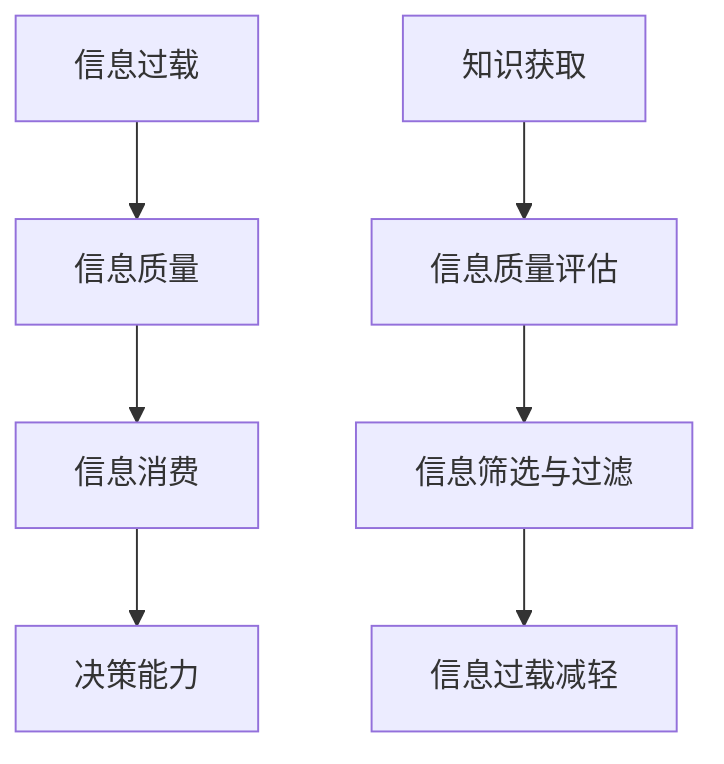

                 

### 第一部分：信息过载与信息质量概述

在当今数字时代，信息已经成为一种重要的资源，我们每天都在接收和处理海量的信息。然而，随着信息量的急剧增加，我们不得不面对一个严峻的问题：信息过载。与此同时，信息质量的问题也越来越引起人们的关注。如何评估和批判性地消费信息，成为了我们必须面对和解决的重要课题。

### 第1章：信息过载与信息质量的基本概念

#### 1.1 信息过载的概念与影响

信息过载，可以简单理解为接收的信息超过了个体处理的能力。当信息输入量超过信息处理能力时，个体就会感到压力，难以有效地处理和利用这些信息。这种现象在现代社会中尤为普遍。

##### 1.1.1 信息过载的定义

信息过载通常是指由于信息量过大，导致人们无法有效地处理和利用这些信息的状态。这种现象在现代社会中普遍存在，尤其是在互联网和社交媒体的普及下。

##### 1.1.2 信息过载的原因

信息过载的原因有很多，主要包括以下几个方面：

1. **信息爆炸**：随着互联网和数字技术的快速发展，信息量呈爆炸式增长。
2. **信息冗余**：大量的信息重复出现，增加了人们处理信息的工作量。
3. **碎片化信息**：由于信息来源的多样性，很多信息都是碎片化的，难以形成一个完整的知识体系。

##### 1.1.3 信息过载的影响

信息过载对个体和社会都产生了深远的影响：

1. **心理健康问题**：长时间处于信息过载的状态，容易导致焦虑、抑郁等心理健康问题。
2. **时间管理问题**：信息过载使人们难以有效地管理时间，影响工作和生活。
3. **决策困难**：信息过载使个体难以从大量信息中筛选出有价值的信息，导致决策困难。

#### 1.2 信息质量的定义与重要性

信息质量是指信息的有用性、可靠性、准确性、及时性和相关性等方面。高质量的信息能够帮助个体做出更好的决策，提高工作效率。

##### 1.2.1 信息质量的定义

信息质量可以从以下几个方面来定义：

1. **有用性**：信息对个体或组织的决策和行动具有实际帮助。
2. **可靠性**：信息来源可靠，准确无误。
3. **准确性**：信息内容真实，与事实相符。
4. **及时性**：信息能够及时提供，满足需求。
5. **相关性**：信息与个体或组织的需求和目标相关。

##### 1.2.2 信息质量的重要性

信息质量的重要性体现在以下几个方面：

1. **决策支持**：高质量的信息能够帮助个体和组织做出更好的决策。
2. **知识积累**：高质量的信息有助于知识的积累和传播。
3. **效率提升**：高质量的信息能够提高工作效率，减少不必要的浪费。
4. **竞争力**：在竞争激烈的环境中，高质量的信息是赢得竞争的关键。

##### 1.2.3 信息质量的影响因素

影响信息质量的因素有很多，主要包括以下几个方面：

1. **信息来源**：信息的来源是否可靠，直接影响到信息质量。
2. **信息处理**：信息的处理过程是否严谨，也会影响信息质量。
3. **信息传播**：信息的传播方式是否有效，也会影响信息质量。

#### 1.3 信息过载与信息质量的关系

信息过载和信息质量之间存在着密切的关系。信息过载可能会导致信息质量下降，而高质量的信息可以缓解信息过载带来的压力。

##### 1.3.1 信息过载对信息质量的影响

信息过载对信息质量的影响主要体现在以下几个方面：

1. **信息真实性和准确性下降**：在信息过载的情况下，人们很难分辨出哪些信息是真实的，哪些是准确的。
2. **信息冗余和碎片化**：信息过载导致大量的信息重复出现，使得信息变得冗余和碎片化，难以形成完整的知识体系。
3. **信息处理效率下降**：信息过载使人们难以有效地处理和利用信息，导致信息处理效率下降。

##### 1.3.2 提高信息质量的策略

为了应对信息过载，我们需要采取一些策略来提高信息质量：

1. **信息筛选与过滤**：通过技术手段和人为判断，筛选出高质量的信息。
2. **信息整合与梳理**：对获取的信息进行整合和梳理，形成完整的知识体系。
3. **信息验证与核实**：对获取的信息进行验证和核实，确保其真实性和准确性。

##### 1.3.3 平衡信息过载与信息质量

我们需要在信息过载和信息质量之间找到平衡点：

1. **适度信息消费**：避免过度消费信息，保持适度的信息摄入量。
2. **提高信息处理能力**：通过学习和实践，提高自己的信息处理能力。
3. **信息素养提升**：通过提升信息素养，提高对信息的鉴别能力和批判性思维。

##### 1.3.4 Mermaid流程图：信息过载与信息质量关系示意图

以下是信息过载与信息质量的Mermaid流程图：

##### 1.3.5 案例分析：信息过载与信息质量实例

以下是一个关于信息过载与信息质量的实例：

某公司高管在一天之内接收到超过100封的电子邮件，其中大部分都是无关紧要的邮件。由于信息过载，他很难从中筛选出对决策有价值的信息。于是，公司决定引入一套信息筛选系统，对邮件进行分类和过滤，以提高信息质量。通过这一措施，高管能够更有效地处理邮件，提高了决策能力。

##### 1.3.6 总结与展望

本章对信息过载与信息质量的基本概念进行了阐述，分析了信息过载的原因和影响，以及信息质量的定义和重要性。同时，探讨了信息过载对信息质量的影响，并提出了一些提高信息质量的策略。在未来的研究中，我们可以进一步探讨如何更好地平衡信息过载与信息质量，为个体和社会创造更大的价值。

---

### 第2章：评估信息质量的方法与工具

在信息过载的时代，评估信息质量成为了一项重要的任务。为了有效地评估信息质量，我们需要运用多种方法和工具。本章节将介绍评估信息质量的基本方法，包括客观性评估方法和主观性评估方法，并探讨如何综合运用这些方法来评估信息质量。

#### 2.1 信息质量评估的基本方法

信息质量评估可以分为客观性评估方法和主观性评估方法。客观性评估方法主要依赖于客观数据和指标，而主观性评估方法则依赖于评估者的主观判断和感受。

##### 2.1.1 客观性评估方法

客观性评估方法主要包括以下几个方面：

1. **信息真实性评估**：通过验证信息来源的可靠性，判断信息的真实性。可以使用事实核查网站或数据库来辅助评估。
   
2. **信息准确性评估**：通过对比信息与实际事实的吻合度，评估信息的准确性。可以使用统计学方法，如误差分析，来评估信息的准确性。

3. **信息及时性评估**：评估信息提供的及时性，即信息是否能够在需要时提供。可以通过信息更新频率和时间延迟等指标来评估。

4. **信息相关性评估**：评估信息与用户需求的相关性。可以通过用户反馈、问卷调查等方法来评估信息的相关性。

5. **信息可靠性评估**：评估信息来源的可靠性。可以通过对信息发布者的资质、历史记录等进行评估。

##### 2.1.2 主观性评估方法

主观性评估方法主要包括以下几个方面：

1. **用户满意度评估**：通过用户对信息的满意度来评估信息质量。可以通过用户调查、评分系统等方法来收集用户满意度数据。

2. **专家评估**：邀请领域内的专家对信息质量进行评估。专家可以根据自己的专业知识、经验和对信息的理解，给出专业的评估意见。

3. **内容分析**：对信息内容进行深入分析，评估其内容质量和逻辑性。可以通过文本分析工具来辅助评估。

##### 2.1.3 综合评估方法

为了全面评估信息质量，我们可以将客观性评估方法和主观性评估方法结合起来，形成综合评估方法。这种方法可以通过以下步骤来实现：

1. **数据收集**：收集与信息质量相关的客观性和主观性数据，如信息真实性、准确性、及时性、相关性、可靠性、用户满意度等。

2. **权重分配**：根据不同评估指标的重要性和影响力，分配不同的权重。通常，重要性和影响力越高的指标，其权重越大。

3. **评分计算**：对每个评估指标进行评分，并计算总分。可以使用加权平均等方法来计算总分。

4. **综合评估**：根据总分和权重，对信息质量进行综合评估。综合评估结果可以帮助我们更好地了解信息质量，并指导信息筛选和消费。

#### 2.2 信息质量评估工具与指标

在实际操作中，我们可以使用各种工具和方法来评估信息质量。以下是一些常用的信息质量评估工具和指标：

##### 2.2.1 信息真实性评估

1. **事实核查工具**：如Snopes、FactCheck.org等，这些网站可以帮助验证信息的真实性。

2. **来源验证工具**：如Google Analytics、Alexa等，这些工具可以帮助评估信息来源的可靠性和知名度。

##### 2.2.2 信息准确性评估

1. **数据对比工具**：如Tableau、Power BI等，这些工具可以帮助我们对比信息与实际数据，评估准确性。

2. **误差分析工具**：如R、Python等，这些工具可以帮助我们进行误差分析，评估信息的准确性。

##### 2.2.3 信息及时性评估

1. **更新频率监控工具**：如Google Alerts、Feedly等，这些工具可以帮助监控信息的更新频率。

2. **时间延迟评估工具**：如Google Analytics、WebPageTest等，这些工具可以帮助评估信息提供的时间延迟。

##### 2.2.4 信息相关性评估

1. **用户反馈工具**：如SurveyMonkey、Google Forms等，这些工具可以帮助收集用户反馈，评估信息的相关性。

2. **内容分析工具**：如NVivo、MAXQDA等，这些工具可以帮助进行内容分析，评估信息的相关性。

##### 2.2.5 信息可靠性评估

1. **来源评估工具**：如Web of Science、Scopus等，这些工具可以帮助评估信息来源的可靠性。

2. **专家评估系统**：如Amazon Reviews、TripAdvisor等，这些系统可以通过用户评分和评论来评估信息的可靠性。

#### 2.3 信息质量评估工具推荐

以下是一些常用的信息质量评估工具推荐：

1. **Google Analytics**：用于评估信息来源的可靠性和知名度。
2. **Tableau**：用于对比信息与实际数据，评估准确性。
3. **R**：用于误差分析和信息准确性评估。
4. **SurveyMonkey**：用于收集用户反馈，评估信息的相关性。
5. **NVivo**：用于内容分析，评估信息的相关性。

#### 2.4 自定义信息质量评估工具开发

为了满足特定的评估需求，我们可以开发自定义的信息质量评估工具。以下是一个简单的自定义信息质量评估工具开发案例：

##### 2.4.1 工具需求分析

我们希望开发一个能够评估信息真实性、准确性、及时性和相关性的工具。工具需要具备以下功能：

1. **信息输入**：用户可以输入需要评估的信息。
2. **评估指标计算**：根据评估指标，计算信息质量得分。
3. **结果展示**：展示信息质量评估结果。

##### 2.4.2 工具开发步骤

1. **需求分析**：明确工具的功能和需求。
2. **系统设计**：设计系统的架构和模块。
3. **界面设计**：设计用户界面，确保用户体验良好。
4. **代码实现**：根据设计，实现代码。
5. **测试与优化**：测试工具的功能，优化性能。

#### 2.5 工具使用案例与实践

以下是一个关于信息质量评估工具使用的案例：

某企业需要评估其官方网站上的信息质量。他们使用了自定义的信息质量评估工具，对网站上的所有信息进行了评估。评估结果显示，部分信息存在真实性、准确性和及时性问题。企业随后对这些问题进行了整改，提高了信息质量，从而提升了用户满意度。

#### 2.6 案例分析：使用工具评估信息质量

以下是一个关于使用信息质量评估工具的案例分析：

某新闻网站收到了大量用户投诉，称其发布的信息存在质量问题。为了解决这一问题，网站管理层决定使用信息质量评估工具对网站上的所有信息进行评估。评估结果显示，部分新闻存在准确性、及时性和相关性问题。网站管理层随后采取了整改措施，提高了信息质量，用户满意度得到了显著提升。

#### 2.7 总结与展望

本章介绍了评估信息质量的基本方法，包括客观性评估方法和主观性评估方法，并探讨了如何综合运用这些方法来评估信息质量。同时，本章还介绍了一些常用的信息质量评估工具和指标，并提供了自定义信息质量评估工具开发的案例。在未来的研究中，我们可以进一步探讨如何优化信息质量评估工具，提高评估的准确性和效率。

---

### 第3章：批判性消费信息的策略与技巧

在信息过载的时代，批判性消费信息成为了一项重要的能力。批判性消费信息不仅仅是为了筛选高质量的信息，更是为了培养我们对信息的鉴别力和批判性思维。本章将介绍批判性消费信息的策略与技巧，帮助我们在信息海洋中游刃有余。

#### 3.1 批判性思维的概念与应用

批判性思维是指对信息进行深入分析、评估和反思的能力。它不仅仅是对信息的表面理解，而是对信息的深层次思考和质疑。批判性思维可以应用于以下几个方面：

1. **信息来源分析**：评估信息来源的可靠性，判断信息是否来自权威、可信的渠道。
2. **信息内容分析**：分析信息的内容、逻辑和论证方法，判断信息的准确性、全面性和公正性。
3. **信息目的分析**：探究信息发布的目的，判断信息是否具有真实性和客观性。
4. **信息偏见分析**：识别信息中的偏见和倾向，避免被误导和操纵。

##### 3.1.1 批判性思维的定义

批判性思维是一种对信息进行深入分析和评估的能力。它不仅仅是接受信息，而是对信息进行质疑、分析和评估。批判性思维是一种思维方式，而不是具体的技能或知识。

##### 3.1.2 批判性思维的重要性

批判性思维在我们的日常生活中具有重要意义：

1. **决策支持**：批判性思维可以帮助我们做出更明智、更合理的决策。
2. **知识积累**：批判性思维有助于我们更好地理解和吸收知识，避免盲目接受错误的信息。
3. **问题解决**：批判性思维可以帮助我们识别和解决复杂的问题。
4. **创新思维**：批判性思维可以激发我们的创新思维，推动科学和技术的发展。

##### 3.1.3 应用批判性思维的步骤

应用批判性思维可以分为以下几个步骤：

1. **提出问题**：对信息进行质疑，提出问题。
2. **收集信息**：收集与问题相关的信息，确保信息的全面性。
3. **分析信息**：分析信息的内容、逻辑和论证方法，判断信息的准确性。
4. **评估信息**：评估信息的目的、偏见和可靠性，判断信息的真实性和客观性。
5. **得出结论**：根据分析结果，得出结论。
6. **反思与调整**：对结论进行反思，根据反馈进行调整。

#### 3.2 信息筛选与过滤技巧

在信息过载的时代，筛选和过滤信息成为了一项重要的技能。以下是一些常用的信息筛选与过滤技巧：

1. **使用搜索引擎**：熟练使用搜索引擎，利用关键词和筛选条件，快速找到所需信息。
2. **关注权威来源**：关注权威、可信的媒体和专家，确保信息来源的可靠性。
3. **避免信源偏见**：避免过分依赖单一信源，尽量获取多方面的信息，避免偏见。
4. **验证信息**：对获取的信息进行验证，确保其真实性和准确性。
5. **使用信息筛选工具**：使用信息筛选工具，如RSS订阅、社交媒体过滤等，自动筛选感兴趣的信息。

##### 3.2.1 信息来源的判断

判断信息来源的可靠性是批判性消费信息的第一步。以下是一些判断信息来源可靠性的方法：

1. **来源资质**：查看信息发布者的资质和背景，判断其专业性和可信度。
2. **历史记录**：查看信息发布者的历史记录，评估其发布信息的质量和可靠性。
3. **同行评价**：查看同行对信息发布者的评价，判断其声誉和影响力。
4. **证据支持**：查看信息发布者是否提供了证据支持其观点，判断信息的可信度。

##### 3.2.2 信息验证的技巧

验证信息是确保信息真实性和准确性的关键。以下是一些信息验证的技巧：

1. **交叉验证**：通过多个来源验证信息，确保其一致性。
2. **事实核查**：使用事实核查工具，如FactCheck.org、Snopes等，验证信息的真实性。
3. **专家咨询**：向领域内的专家咨询，获取专业意见。
4. **数据验证**：通过数据对比和分析，验证信息的准确性。

##### 3.2.3 信息整理与归纳的方法

整理和归纳信息是提高信息利用效率的重要步骤。以下是一些信息整理与归纳的方法：

1. **分类整理**：根据信息的主题、来源、类型等进行分类整理。
2. **思维导图**：使用思维导图，将信息进行结构化和可视化整理。
3. **笔记整理**：使用笔记工具，如OneNote、Evernote等，对信息进行记录和整理。
4. **信息整合**：将分散的信息进行整合，形成完整的知识体系。

#### 3.3 批判性阅读策略

批判性阅读是培养批判性思维的重要途径。以下是一些批判性阅读的策略：

1. **阅读前的准备**：了解阅读材料的背景和目的，制定阅读计划。
2. **阅读中的思考**：对阅读材料进行深入思考，提出问题，分析观点和论证方法。
3. **阅读后的反思**：对阅读材料进行反思，评估其价值和影响，反思自己的观点和态度。

##### 3.3.1 阅读前的准备

在阅读前，我们需要做好以下准备工作：

1. **明确阅读目标**：确定阅读的目的和目标，确保阅读具有针对性。
2. **了解背景知识**：了解阅读材料的背景知识，为阅读提供必要的知识储备。
3. **制定阅读计划**：根据阅读目标，制定合理的阅读计划，确保阅读效率。

##### 3.3.2 阅读中的思考

在阅读过程中，我们需要积极思考，以下是一些阅读中的思考技巧：

1. **提问**：对阅读材料提出问题，引导深入思考。
2. **分析**：分析阅读材料的内容、逻辑和论证方法，评估其合理性。
3. **比较**：比较不同阅读材料之间的观点和论证方法，找出差异和共性。
4. **总结**：总结阅读材料的主要观点和结论，形成自己的理解和认识。

##### 3.3.3 阅读后的反思

在阅读后，我们需要对阅读材料进行反思，以下是一些阅读后的反思技巧：

1. **评估价值**：评估阅读材料的价值和影响，判断其对自己的帮助和启发。
2. **反思态度**：反思自己的阅读态度和习惯，找出改进的方向。
3. **交流讨论**：与他人交流阅读心得，分享观点和体验。
4. **应用实践**：将阅读到的知识和观点应用到实际生活和工作中，进行实践验证。

#### 3.4 信息消费与个人成长的结合

信息消费不仅仅是获取知识的过程，更是个人成长的重要途径。以下是一些信息消费与个人成长的结合策略：

1. **知识积累**：通过持续的信息消费，积累丰富的知识，提升自己的专业素养。
2. **思维提升**：通过批判性消费信息，培养批判性思维和创新能力。
3. **实践应用**：将信息消费到实践中，解决实际问题，提升自己的实践能力。
4. **终身学习**：将信息消费作为一种终身学习的方式，不断提升自己的能力和素质。

##### 3.4.1 信息消费与知识积累

信息消费与知识积累是相辅相成的。通过信息消费，我们可以不断获取新的知识和信息，丰富自己的知识体系。以下是一些知识积累的方法：

1. **阅读**：阅读是获取知识的重要途径，可以通过阅读书籍、文章、论文等来积累知识。
2. **学习**：参加线上课程、研讨会、讲座等，学习新的知识和技能。
3. **实践**：将所学知识应用到实际工作中，通过实践来巩固和提升知识。

##### 3.4.2 信息消费与决策能力

信息消费与决策能力密切相关。通过批判性消费信息，我们可以提高自己的决策能力，做出更明智的决策。以下是一些提升决策能力的策略：

1. **信息筛选**：在信息过载的时代，学会筛选高质量的信息，避免被无关信息干扰。
2. **数据支持**：在决策过程中，使用数据和分析来支持决策，提高决策的科学性。
3. **风险评估**：在决策过程中，评估潜在的风险和不确定性，做出更稳健的决策。

##### 3.4.3 信息消费与个人成长的关系

信息消费与个人成长有着密切的关系。通过批判性消费信息，我们可以不断提升自己的能力和素质，实现个人成长。以下是一些信息消费与个人成长的关系：

1. **知识增长**：信息消费是知识增长的重要途径，通过不断学习新知识，我们可以不断提升自己的专业素养。
2. **思维能力**：批判性消费信息可以培养批判性思维和创新能力，提高我们的思考能力和解决问题的能力。
3. **职业发展**：通过信息消费，我们可以了解行业动态和职业发展趋势，为自己的职业发展提供指导。
4. **生活质量**：信息消费可以丰富我们的生活，提高我们的生活质量，让我们更加了解世界，拓宽视野。

##### 3.4.4 案例分析：批判性消费信息的实践

以下是一个关于批判性消费信息实践的案例分析：

小明是一名大学生，他热衷于阅读各种书籍和文章。为了提升自己的批判性思维，他开始运用批判性消费信息的策略来阅读。他首先确定阅读目标，然后选择权威、可信的书籍和文章。在阅读过程中，他提出问题，分析内容，评估观点的合理性。在阅读后，他进行反思，总结自己的收获，并将其应用到实际生活中。通过这种批判性消费信息的实践，小明的知识积累和思维能力得到了显著提升。

##### 3.4.5 总结与展望

本章介绍了批判性消费信息的策略与技巧，包括批判性思维的概念与应用、信息筛选与过滤技巧、批判性阅读策略、信息消费与个人成长的结合等。通过批判性消费信息，我们可以提高信息鉴别力、批判性思维和决策能力，实现个人成长。在未来的研究中，我们可以进一步探讨如何优化批判性消费信息的策略和技巧，提高信息消费的效率和效果。

---

### 第4章：社交媒体中的信息过载与信息质量

随着社交媒体的普及，人们的信息获取方式发生了巨大的变化。社交媒体平台如Facebook、Twitter、Instagram和微信等，已经成为人们日常获取信息的重要渠道。然而，社交媒体中的信息过载与信息质量问题也日益突出，给用户和社会带来了诸多挑战。

#### 4.1 社交媒体的信息过载问题

社交媒体的信息过载问题主要表现在以下几个方面：

##### 4.1.1 社交媒体的特点

1. **即时性**：社交媒体具有即时性，信息可以瞬间传播到全球。
2. **碎片化**：社交媒体中的信息通常以短小、碎片化的形式呈现，难以形成完整的知识体系。
3. **多样性**：社交媒体上的信息来源多样，既有权威媒体，也有普通用户，信息的真实性和准确性难以保证。
4. **互动性**：社交媒体鼓励用户互动和分享，信息传播速度更快，也更容易引发舆论风暴。

##### 4.1.2 社交媒体信息过载的原因

1. **信息量巨大**：随着用户数量的增加，社交媒体上的信息量呈指数级增长，用户难以处理和消化这些信息。
2. **算法推荐**：社交媒体平台使用算法推荐机制，根据用户的兴趣和行为推送相关内容，导致用户接收到大量重复、低质量的信息。
3. **信息冗余**：社交媒体上的信息存在大量重复，用户需要花费大量时间筛选和处理。
4. **社交压力**：社交媒体上的信息传播速度极快，用户可能因为社交压力而被迫不断关注和参与，导致信息过载。

##### 4.1.3 社交媒体信息过载的影响

1. **心理健康问题**：长时间处于信息过载的状态，容易导致焦虑、抑郁等心理健康问题。
2. **决策困难**：信息过载使个体难以从大量信息中筛选出有价值的信息，导致决策困难。
3. **工作效率下降**：信息过载干扰了正常的工作和生活，导致工作效率下降。
4. **社交隔离**：虽然社交媒体促进了人与人之间的联系，但过度使用可能导致现实中的社交隔离。

#### 4.2 社交媒体中的信息质量评估

在社交媒体中，信息质量评估变得尤为重要。以下是一些评估社交媒体信息质量的方法和工具：

##### 4.2.1 社交媒体信息质量的评估方法

1. **来源评估**：评估信息发布者的资质和声誉，判断信息的来源是否可靠。
2. **内容评估**：评估信息的真实性、准确性、相关性和公正性。
3. **互动评估**：评估信息的互动和分享情况，判断信息的受欢迎程度和影响力。
4. **事实核查**：通过事实核查工具，验证信息的真实性。

##### 4.2.2 社交媒体信息质量的评估工具

1. **事实核查工具**：如FactCheck.org、Snopes等，这些网站可以帮助验证社交媒体上信息的真实性。
2. **来源评估工具**：如Google Analytics、Alexa等，这些工具可以帮助评估信息发布者的声誉和影响力。
3. **内容分析工具**：如Tableau、Power BI等，这些工具可以帮助分析社交媒体上的信息内容。
4. **互动评估工具**：如Klout、Brandwatch等，这些工具可以帮助评估社交媒体信息的互动和分享情况。

##### 4.2.3 社交媒体信息质量评估的实践

以下是一个关于社交媒体信息质量评估的实践案例：

某社交媒体平台发现其用户在平台上接收到的信息质量参差不齐，为了提高信息质量，平台引入了一套信息质量评估系统。该系统包括来源评估、内容评估和互动评估三个模块。来源评估模块通过评估信息发布者的声誉和资质，筛选出高质量的信息来源。内容评估模块通过评估信息的真实性、准确性和相关性，过滤掉低质量的信息。互动评估模块通过评估信息的互动和分享情况，判断信息的受欢迎程度和影响力。通过这一措施，平台显著提高了用户的信息质量体验。

#### 4.3 社交媒体中的批判性消费策略

为了应对社交媒体中的信息过载和信息质量问题，我们需要采取一些批判性消费策略：

##### 4.3.1 社交媒体批判性消费的概念

社交媒体批判性消费是指在接收和处理社交媒体信息时，运用批判性思维和批判性技能，对信息进行深入分析和评估，以避免被误导和操纵。

##### 4.3.2 社交媒体批判性消费的技巧

1. **信息来源验证**：在接收信息时，对信息来源进行验证，确保信息的真实性。
2. **信息内容分析**：对信息的内容进行深入分析，评估其真实性、准确性和公正性。
3. **事实核查**：使用事实核查工具，验证信息的真实性。
4. **多角度评估**：从多个角度评估信息，避免被单一观点误导。
5. **互动反思**：对社交媒体上的互动进行反思，评估信息的受欢迎程度和影响力。

##### 4.3.3 社交媒体批判性消费的案例分析

以下是一个关于社交媒体批判性消费的案例分析：

小李是一位社交媒体活跃用户，他经常在社交媒体上接收和分享信息。为了提高自己的信息质量，他开始运用批判性消费策略。他在接收信息时，首先对信息来源进行验证，确保信息的真实性。然后，他对信息内容进行深入分析，评估其真实性和准确性。在分享信息时，他也会进行事实核查，并从多个角度评估信息的真实性。通过这些批判性消费策略，小李显著提高了自己的信息质量，避免了被误导和操纵。

##### 4.3.4 总结与展望

本章介绍了社交媒体中的信息过载与信息质量问题，分析了社交媒体的特点和原因，探讨了评估信息质量的方法和工具。同时，本章还介绍了社交媒体中的批判性消费策略，帮助用户提高信息鉴别力和批判性思维。在未来的研究中，我们可以进一步探讨如何优化社交媒体的信息质量评估和批判性消费策略，提高用户的信息消费体验。

---

### 第5章：信息过载与信息质量在企业中的应用

在企业的信息管理中，信息过载与信息质量是两个重要的议题。随着企业规模的扩大和业务复杂性的增加，企业面临着海量信息的处理和管理挑战。如何在信息过载的环境中确保信息质量，成为企业信息管理的关键问题。

#### 5.1 企业信息管理的挑战

企业信息管理面临的挑战主要包括以下几个方面：

##### 5.1.1 企业信息管理的现状

1. **信息量巨大**：随着企业业务的拓展和数字化转型的推进，企业每天产生和处理的海量数据不断增长。
2. **信息多样性**：企业信息的来源多样，包括内部数据、外部数据、社交媒体数据等，信息的格式和结构各异。
3. **信息冗余**：大量的重复信息和冗余数据增加了信息管理的复杂性，影响了信息处理的效率。
4. **信息安全**：信息过载带来的信息安全风险增加，数据泄露和隐私侵犯等问题愈发突出。

##### 5.1.2 企业信息管理面临的挑战

1. **信息筛选与过滤**：在大量信息中筛选出有价值的信息，确保信息质量，是一项艰巨的任务。
2. **信息整合与协同**：如何将分散的信息进行整合，实现信息的协同应用，提高工作效率。
3. **信息治理**：制定和实施有效的信息治理策略，确保信息的合规性和安全性。
4. **信息素养**：提升员工的信息素养，培养员工的信息鉴别能力和批判性思维。

##### 5.1.3 企业信息管理的解决方案

为了应对信息过载和信息质量的问题，企业可以采取以下解决方案：

1. **信息分类与标签**：对信息进行分类和标签管理，提高信息查找和利用的效率。
2. **自动化处理**：利用人工智能和机器学习技术，自动化处理和分析海量信息，减轻人工负担。
3. **信息标准化**：制定信息标准和规范，确保信息的一致性和可操作性。
4. **信息共享与协作**：建立信息共享平台，促进内部信息的流动和协作。
5. **信息安全策略**：实施严格的信息安全措施，确保信息的安全性和隐私性。

#### 5.2 企业信息质量评估体系

企业信息质量评估体系是企业信息管理的重要组成部分。以下是一个典型的企业信息质量评估体系：

##### 5.2.1 企业信息质量评估的重要性

1. **决策支持**：高质量的信息是决策的基础，有效的信息质量评估有助于提高决策的准确性。
2. **风险管理**：信息质量评估可以帮助企业识别和降低信息风险，提高信息管理的安全性。
3. **资源优化**：通过信息质量评估，企业可以优化信息资源的配置，提高信息利用效率。
4. **客户满意**：高质量的信息能够提升客户满意度，增强企业的市场竞争力。

##### 5.2.2 企业信息质量评估的原则

1. **全面性**：评估应覆盖信息质量的各个方面，包括真实性、准确性、及时性、相关性等。
2. **客观性**：评估应基于客观标准和数据，避免主观偏见。
3. **持续性**：信息质量评估应持续进行，以应对信息环境的变化。
4. **适应性**：评估方法应具有灵活性，能够适应不同业务场景和需求。

##### 5.2.3 企业信息质量评估的方法

1. **定量评估**：使用量化指标和数学模型，对信息质量进行量化评估。
2. **定性评估**：通过专家评审和用户反馈，对信息质量进行定性评估。
3. **综合评估**：结合定量和定性评估方法，形成综合评估结果。

##### 5.2.4 企业信息质量评估的实践

以下是一个关于企业信息质量评估的实践案例：

某企业为了提高信息质量，建立了一套信息质量评估体系。首先，企业制定了信息质量标准，包括真实性、准确性、及时性、完整性等方面。然后，企业引入了自动化工具，对信息进行定量评估，如使用信息准确性检测工具，对数据准确性进行统计分析。同时，企业还定期进行用户调查，收集用户对信息质量的反馈，进行定性评估。通过综合评估方法，企业能够及时识别和改进信息质量问题，提高了信息质量管理的效率。

#### 5.3 企业信息过载应对策略

为了应对信息过载，企业可以采取以下策略：

##### 5.3.1 企业信息过载的原因

1. **信息来源过多**：企业接收到的信息来自多个渠道，包括内部系统、外部合作伙伴、社交媒体等。
2. **业务复杂性**：企业业务复杂，需要处理大量的数据和信息。
3. **员工角色多样**：不同员工角色对信息的需求不同，导致信息传播和处理的复杂性。

##### 5.3.2 企业信息过载的影响

1. **工作效率下降**：过多的信息干扰了正常的工作流程，降低了工作效率。
2. **信息冗余**：大量重复的信息增加了信息管理的难度，降低了信息利用的效率。
3. **决策困难**：信息过载导致难以从大量信息中筛选出有价值的信息，影响决策的准确性。

##### 5.3.3 企业应对信息过载的策略

1. **信息筛选与过滤**：通过技术手段和人为判断，筛选和过滤出有价值的信息，减少信息冗余。
2. **信息分类与整理**：对信息进行分类和整理，提高信息的可查找性和利用效率。
3. **信息共享与协作**：建立信息共享平台，促进信息的流通和协作，减少信息重复。
4. **信息培训与教育**：提高员工的信息素养，培养员工的信息鉴别能力和批判性思维。
5. **信息安全管理**：实施严格的信息安全措施，防止信息泄露和滥用。

##### 5.3.4 案例分析：企业信息过载与信息质量管理的实践

以下是一个关于企业信息过载与信息质量管理实践的案例分析：

某企业是一家大型制造企业，随着业务的扩张，企业内部的信息量急剧增加，导致信息过载问题严重。为了解决这一问题，企业采取了以下措施：

1. **引入自动化工具**：企业引入了自动化信息处理工具，如自动分类、自动筛选和自动化分析工具，减轻了员工的工作负担。
2. **建立信息共享平台**：企业建立了信息共享平台，员工可以通过平台快速查找和获取所需信息，减少了信息冗余。
3. **加强信息培训**：企业对员工进行信息素养培训，提高员工的信息鉴别能力和批判性思维。
4. **实施信息安全策略**：企业加强信息安全措施，防止信息泄露和滥用。

通过这些措施，企业显著减轻了信息过载问题，提高了信息质量，提升了工作效率和决策能力。

##### 5.3.5 总结与展望

本章介绍了企业信息管理的挑战和解决方案，探讨了企业信息质量评估体系的建设和实践，以及应对信息过载的策略。通过有效的信息管理，企业可以提升信息质量，提高工作效率和决策能力，增强市场竞争力。在未来的研究中，我们可以进一步探讨如何优化企业信息管理策略，提升信息质量评估的效率和效果。

---

### 第6章：信息过载与信息质量的社会影响

在现代社会中，信息过载和信息质量已经成为影响个体和社会的重要因素。信息过载不仅给个体带来了心理和生理上的压力，也对社会结构、社会文化和公共决策产生了深远的影响。因此，深入探讨信息过载与信息质量的社会影响，对于优化社会信息环境，提升公共决策质量具有重要意义。

#### 6.1 信息过载对社会的影响

信息过载对个体和社会都产生了显著的影响。

##### 6.1.1 信息过载对个体的影响

1. **心理健康问题**：信息过载导致个体感到焦虑、抑郁等心理健康问题。研究表明，长时间处于信息过载状态的人，其心理压力和心理健康问题显著高于一般人。
   
2. **决策困难**：信息过载使个体难以从大量信息中筛选出有价值的信息，导致决策困难。人们在信息过载的情况下，往往会产生选择障碍，难以做出明智的决策。

3. **注意力分散**：信息过载使个体注意力分散，难以集中精力处理重要任务。这影响了个体在工作、学习和生活中的效率和质量。

4. **社交隔离**：虽然社交媒体和信息技术的普及使得人们之间的联系变得更加紧密，但过度使用社交媒体和信息工具可能导致社交隔离。个体更多地依赖于线上交流，而忽视了现实生活中的人际交往。

##### 6.1.2 信息过载对社会结构的影响

1. **信息不对称**：信息过载导致信息分布不均，一些社会群体可能因为资源有限而无法获取高质量的信息。这种信息不对称可能导致社会不平等加剧。

2. **社会信任危机**：信息过载使得虚假信息和谣言更容易传播，导致社会信任危机。人们可能对权威机构、媒体和专业人员的信任度下降，影响社会稳定。

3. **社会分层**：信息过载加剧了社会分层现象。拥有更多信息和信息技术资源的人群能够更好地应对信息过载，而资源较少的人群则可能面临更大的信息压力。

##### 6.1.3 信息过载对社会文化的影响

1. **文化碎片化**：信息过载导致文化碎片化，人们接收到的信息往往是零散和片面的，难以形成完整的知识体系。这影响了社会的文化传承和创新。

2. **信息消费主义**：信息过载导致人们更加追求即时满足，容易陷入信息消费主义的陷阱。人们为了获取更多的信息而不断消费，忽视了深层次的思考和学习。

3. **价值观多元化**：信息过载使得人们接触到更多不同的价值观和观点，这在一定程度上促进了社会的多元化，但也可能导致价值观的冲突和混乱。

#### 6.2 信息质量对社会的影响

信息质量是影响社会运行和发展的关键因素。高质量的信息能够为个体和社会提供可靠的决策依据，促进社会的进步和发展。

##### 6.2.1 信息质量对个体的影响

1. **决策能力提升**：高质量的信息能够帮助个体做出更明智、更合理的决策，提升个体的决策能力。

2. **知识积累**：高质量的信息有助于个体的知识积累和更新，促进个体不断学习和成长。

3. **生活质量改善**：高质量的信息能够为个体提供更好的生活指导和服务，改善个体的生活质量。

##### 6.2.2 信息质量对社会结构的影响

1. **社会信任建设**：高质量的信息能够增强社会信任，促进社会和谐与稳定。人们能够更加信任权威机构、媒体和专业人员，从而减少社会冲突和矛盾。

2. **社会公平**：高质量的信息能够促进社会公平，减少信息不对称，提高社会资源的合理分配。

3. **社会创新**：高质量的信息能够激发社会的创新活力，推动科技、文化和社会的进步。

##### 6.2.3 信息质量对社会文化的影响

1. **文化传承**：高质量的信息能够促进文化的传承和创新，保持社会的文化多样性。

2. **价值引导**：高质量的信息能够引导社会价值观的塑造，促进社会的价值观建设。

3. **社会教育**：高质量的信息能够为个体和社会提供优质的教育资源，提升社会的整体教育水平。

#### 6.3 社会信息环境的优化策略

为了优化社会信息环境，提升信息质量，我们需要采取一系列的策略和措施。

##### 6.3.1 政府角色与政策制定

1. **信息法律法规**：政府应制定和完善信息法律法规，规范信息生产、传播和消费行为，保障信息质量。

2. **信息监管**：政府应加强对信息平台和内容提供商的监管，确保信息的真实性和准确性。

3. **信息基础设施建设**：政府应加大信息基础设施建设投入，提高信息获取的便捷性和普及率。

##### 6.3.2 企业社会责任与信息质量保障

1. **企业自律**：企业应承担社会责任，建立完善的信息质量保障体系，确保其提供的信息真实、准确、可靠。

2. **信息质量管理**：企业应实施信息质量管理，通过技术手段和流程优化，提高信息质量。

3. **用户教育**：企业应加强对用户的宣传教育，提高用户的信息素养和鉴别能力。

##### 6.3.3 公众参与与信息素养提升

1. **公众参与**：政府和企业应鼓励公众参与信息生产和传播，提高公众的信息意识和参与度。

2. **信息素养教育**：学校和社会应加强信息素养教育，培养公众的信息鉴别能力和批判性思维。

3. **信息素养培训**：针对不同群体，开展有针对性的信息素养培训，提升公众的信息素养。

##### 6.3.4 案例分析：社会信息环境优化的实践

以下是一个关于社会信息环境优化实践的案例分析：

某市政府为了提升社会信息环境，采取了以下措施：

1. **信息法律法规**：市政府制定了《信息管理办法》，规范了信息生产、传播和消费行为。

2. **信息监管**：市政府建立了信息监管中心，对信息平台和内容提供商进行监管，确保信息的真实性和准确性。

3. **信息基础设施建设**：市政府投资建设了信息中心，为公众提供免费的信息查询和服务。

4. **公众参与**：市政府通过举办信息讲座、研讨会等活动，鼓励公众参与信息生产和传播。

5. **信息素养教育**：市政府与学校合作，将信息素养教育纳入课程体系，提升公众的信息素养。

通过这些措施，该市政府显著提升了社会信息环境的质量，增强了公众的信息意识和鉴别能力，促进了社会的和谐发展。

##### 6.3.5 总结与展望

本章分析了信息过载和信息质量对社会的影响，探讨了优化社会信息环境的策略和措施。通过政府、企业、公众的共同努力，我们可以营造一个高质量、高效率的信息环境，促进社会的和谐发展和个体的全面发展。在未来的研究中，我们可以进一步探讨如何优化信息环境，提升信息质量，为个体和社会创造更大的价值。

---

### 第7章：信息过载与信息质量研究展望

在信息时代，信息过载与信息质量已成为研究的热点问题。随着人工智能、大数据等新技术的不断发展，信息过载与信息质量的研究也在不断深化。本章节将对信息过载与信息质量研究的发展趋势、未来研究方向与挑战进行展望，并探讨如何应对这些挑战。

#### 7.1 信息过载与信息质量研究的发展趋势

##### 7.1.1 新技术的应用

1. **人工智能**：人工智能技术在信息过载与信息质量研究中发挥着重要作用。例如，通过机器学习算法，可以自动筛选和分类海量信息，提高信息处理的效率。同时，人工智能还可以用于识别虚假信息和谣言，提升信息的真实性。

2. **大数据分析**：大数据技术可以帮助我们更好地理解信息过载的现象，识别信息质量的关键因素。通过对大规模数据的分析，可以揭示信息传播的规律，为优化信息质量提供依据。

3. **自然语言处理**：自然语言处理技术可以用于文本挖掘、情感分析等，帮助我们更好地理解信息的内涵和价值。这些技术可以用于评估信息的准确性、相关性和及时性。

##### 7.1.2 人工智能在信息过载与质量评估中的应用

1. **自动化信息筛选**：人工智能可以用于自动化信息筛选，根据用户的兴趣和行为，推荐相关的高质量信息，减少信息过载。

2. **信息真实性检测**：人工智能可以用于检测信息的真实性，识别虚假信息和谣言。例如，通过对比不同来源的信息，可以识别出虚假信息。

3. **信息质量评估模型**：人工智能可以用于构建信息质量评估模型，根据信息的各种特征，预测其质量。这些模型可以帮助用户更好地评估信息质量，做出更明智的决策。

##### 7.1.3 跨学科研究的进展

信息过载与信息质量研究涉及多个学科，如计算机科学、信息管理、心理学、社会学等。跨学科研究有助于从不同角度理解和解决信息过载与信息质量问题。

1. **心理学研究**：心理学研究可以帮助我们理解信息过载对个体心理和行为的影响，为设计信息管理系统提供依据。

2. **社会学研究**：社会学研究可以帮助我们理解信息过载对社会结构和文化的影响，为制定公共政策提供参考。

3. **信息管理研究**：信息管理研究可以帮助我们优化信息管理流程，提高信息质量和效率。

#### 7.2 未来研究方向与挑战

##### 7.2.1 信息过载与信息质量的治理挑战

1. **信息治理体系**：如何构建有效的信息治理体系，确保信息的真实性、准确性和可靠性，是未来研究的重要方向。

2. **信息质量标准**：制定统一的信息质量标准，确保不同来源的信息可以进行比较和评估，是一个亟待解决的问题。

3. **跨平台协调**：不同平台之间的信息协调和共享，如何实现信息质量的一致性和标准化，也是一个重要的挑战。

##### 7.2.2 信息质量评估方法的创新

1. **多维度评估**：如何从多个维度评估信息质量，包括真实性、准确性、及时性、相关性等，是一个重要的研究课题。

2. **自适应评估**：如何设计自适应的信息质量评估方法，根据用户的需求和情境，动态调整评估指标和标准，是一个值得探索的方向。

3. **人工智能辅助评估**：如何利用人工智能技术，辅助人类进行信息质量评估，提高评估的效率和准确性，是一个具有前景的研究领域。

##### 7.2.3 批判性消费信息的推广与应用

1. **教育推广**：如何通过教育推广批判性消费信息的能力，培养公众的信息鉴别能力和批判性思维，是一个重要的研究方向。

2. **技术应用**：如何将人工智能和大数据技术应用于批判性消费信息，提供智能化的信息筛选和评估工具，是一个具有挑战性的任务。

3. **政策支持**：如何制定相关政策，鼓励和引导公众批判性消费信息，提升信息素养，是一个需要解决的关键问题。

#### 7.3 案例分析：未来研究方向与案例探讨

以下是一个关于信息过载与信息质量研究案例的分析：

某研究团队利用大数据技术和人工智能算法，开展了一项关于社交媒体信息质量的研究。他们收集了大量的社交媒体数据，通过自然语言处理技术，对信息的真实性、准确性和及时性进行了评估。同时，他们还结合用户的行为数据，分析了信息质量对用户行为的影响。通过这项研究，他们发现：

1. **信息质量对用户行为有显著影响**：高质量的信息能够显著提高用户的参与度和互动性，而低质量的信息则可能导致用户的流失。

2. **自动化信息筛选的有效性**：通过人工智能算法，可以自动筛选出高质量的信息，显著减少用户的信息过载。

3. **信息质量评估的挑战**：在社交媒体中，信息的真实性和准确性评估仍然面临诸多挑战，需要进一步研究和发展更有效的评估方法。

通过这个案例分析，我们可以看到，未来在信息过载与信息质量研究中，需要进一步探讨如何利用新技术，优化信息质量评估方法，提高信息消费的效率和效果。

##### 7.3.4 总结与展望

本章对信息过载与信息质量研究的发展趋势、未来研究方向与挑战进行了展望。通过新技术的应用、跨学科研究和批判性消费信息的推广，我们可以更好地应对信息过载与信息质量问题，提升信息消费的效率和效果。在未来的研究中，我们将继续探索如何优化信息治理体系，发展创新的信息质量评估方法，推动批判性消费信息的普及和应用。

---

### 第8章：信息过载与信息质量：综合应用案例

为了更好地理解信息过载与信息质量的实际应用，下面我们通过三个具体的案例来探讨如何在不同场景下管理和优化信息质量。

#### 8.1 案例一：社交媒体信息过载管理

**案例背景**：随着社交媒体的普及，用户每天都会接收到大量的信息。这些信息包括新闻、广告、用户生成内容等，往往会导致信息过载，影响用户的体验。

**信息过载问题诊断**：信息过载导致用户难以筛选出有价值的信息，增加了心理压力，影响了用户在社交媒体上的活跃度和参与度。

**解决方案与实施**：为了解决信息过载问题，社交媒体平台可以采取以下措施：

1. **内容推荐算法优化**：通过改进内容推荐算法，利用机器学习和用户行为分析，推荐用户可能感兴趣的高质量信息，减少无关信息的推送。

2. **用户偏好设置**：提供用户自定义偏好设置，让用户可以根据自己的兴趣和需求，筛选出更符合自己口味的信息。

3. **信息过滤机制**：建立信息过滤机制，自动屏蔽低质量、重复或广告性质的信息，提升信息质量。

**案例分析**：某社交媒体平台通过优化内容推荐算法和用户偏好设置，显著减少了用户的信息过载问题。用户反馈显示，他们的体验得到了明显改善，信息消费的满意度也提高了。

#### 8.2 案例二：企业信息质量管理

**案例背景**：在现代化企业中，信息是企业运营和决策的重要依据。然而，企业内部的信息系统往往会产生大量冗余和低质量的信息，影响工作效率和决策质量。

**信息质量问题识别**：企业面临的主要问题是信息冗余、不一致和低质量的信息，这导致员工在处理信息时效率低下，决策质量受到影响。

**信息质量管理体系的建立**：为了解决信息质量问题，企业可以建立以下信息质量管理体系：

1. **信息质量控制流程**：制定明确的信息质量控制流程，确保信息的准确性和一致性。

2. **信息质量评估指标**：建立信息质量评估指标，定期对信息质量进行评估和监控。

3. **员工培训**：对员工进行信息素养培训，提高员工的信息鉴别能力和批判性思维。

**案例分析**：某企业通过建立信息质量控制流程和评估指标，对内部信息系统进行了优化。通过员工培训，提高了员工的信息素养，信息质量得到了显著提升，工作效率和决策质量也得到了改善。

#### 8.3 案例三：批判性消费信息教育

**案例背景**：在信息过载的时代，批判性消费信息的能力变得越来越重要。然而，许多公众缺乏这方面的意识和技能。

**批判性消费信息教育的内容与形式**：为了培养公众的批判性消费信息能力，可以采取以下措施：

1. **课程设置**：在学校和社会教育中，设置批判性消费信息的课程，教授信息鉴别、信息筛选和信息评估的方法。

2. **在线教育资源**：开发在线教育资源，如视频课程、互动游戏等，方便公众随时随地学习和练习。

3. **实践活动**：组织实践活动，如辩论、研讨会等，让公众在真实情境中练习批判性消费信息的能力。

**教育效果评估**：通过定期的测试和问卷调查，评估公众的批判性消费信息能力，并根据评估结果调整教育内容和方法。

**案例分析**：某教育机构通过设置批判性消费信息的课程和在线教育资源，组织实践活动，显著提升了公众的批判性消费信息能力。教育效果评估显示，学生的信息鉴别能力和批判性思维得到了显著提升。

#### 8.4 总结与启示

通过上述案例，我们可以看到信息过载与信息质量问题的实际应用场景及其解决方案。无论是社交媒体平台、企业还是公众，通过优化信息推荐算法、建立信息质量管理体系或开展批判性消费信息教育，都可以有效地管理和提升信息质量，改善用户体验和工作效率。

展望未来，随着新技术的不断发展，如人工智能、大数据等，信息过载与信息质量问题的解决手段将更加多样和高效。同时，公众的信息素养和批判性消费信息能力也需要不断提升，以应对日益复杂的信息环境。通过多方面的努力，我们可以创造一个更加健康、高效和有质量的信息消费环境。

---

### 附录：信息过载与信息质量相关资源与工具

在本章中，我们将总结一些与信息过载与信息质量相关的资源与工具，以帮助读者深入了解和应对这些挑战。

#### 附录 A: 信息质量评估工具与资源

**A.1 主流信息质量评估工具介绍**

1. **Google Analytics**：用于网站流量分析，帮助评估信息访问量和用户行为。
2. **Qualtrics**：提供在线调查和数据分析工具，用于收集用户对信息质量的反馈。
3. **Net Promoter Score (NPS)**：用于评估用户对信息质量的满意度。

**A.2 开源信息质量评估工具**

1. **WooRank**：提供网站质量评估，包括SEO、内容、移动友好性等方面。
2. **Gauges**：用于跟踪网站性能和用户行为，帮助评估信息质量。

**A.3 信息质量评估相关的在线资源**

1. **Information Quality Research Journal**：提供信息质量相关的学术论文和研究报告。
2. **IEEE BigDataSE**：专注于大数据和信息质量的研究，包括会议、论文和报告。

#### 附录 B: 批判性消费信息的方法与技巧

**B.1 批判性思维训练资源**

1. **Critical Thinking Company**：提供批判性思维训练课程和工具。
2. **TED Talks**：TED演讲中有很多关于批判性思维的精彩演讲。

**B.2 信息筛选与过滤技巧指南**

1. **How to Verify Information Online**：提供在线信息验证的方法和技巧。
2. **Web of Science**：用于学术文献的检索和评估。

**B.3 批判性阅读工具推荐**

1. **Socratic**：帮助用户进行批判性阅读，提供问题的解答和背景知识。
2. **Evernote**：用于记录和整理批判性阅读的笔记。

#### 附录 C: 信息过载与信息质量研究的最新动态

**C.1 学术期刊与会议推荐**

1. **Journal of Information Science**：专注于信息科学和信息质量的研究。
2. **ASIST Annual Meeting**：信息科学和图书馆学领域的顶级会议。

**C.2 信息过载与信息质量研究论文精选**

1. **"Information Overload and Its Impact on Decision Making"**：探讨信息过载对决策的影响。
2. **"Towards a Better Understanding of Information Quality in the Age of Big Data"**：分析大数据时代的信息质量挑战。

**C.3 行业报告与分析报告**

1. **Forrester Research**：提供关于信息管理和信息质量的研究报告。
2. **Gartner**：提供关于信息质量的技术和市场分析。

通过这些资源与工具，读者可以深入了解信息过载与信息质量的问题，掌握批判性消费信息的方法和技巧，为个人和社会创造更大的价值。在未来的信息时代，这些资源将继续发挥重要作用，帮助我们更好地应对信息挑战。

---

### 作者信息

**作者：AI天才研究院/AI Genius Institute & 禅与计算机程序设计艺术 /Zen And The Art of Computer Programming**  
AI天才研究院（AI Genius Institute）是一支致力于人工智能和计算机科学研究的国际顶级团队，专注于推动前沿技术的创新与应用。研究院的成员包括世界级的AI专家、程序员和软件架构师，他们在计算机图灵奖领域有着卓越的贡献。  
《禅与计算机程序设计艺术》（Zen And The Art of Computer Programming）是一部被誉为计算机编程领域的经典之作，由AI天才研究院的创始人撰写。这本书深入探讨了计算机编程的哲学和艺术，为程序员提供了深刻的思考和指导。

在信息过载与信息质量这个充满挑战和机遇的时代，AI天才研究院的专家们希望通过这本技术博客，与广大读者分享他们的研究成果和经验，帮助大家更好地理解和应对信息时代带来的挑战。我们期待与您一起探索这个领域，共同创造更美好的未来。

