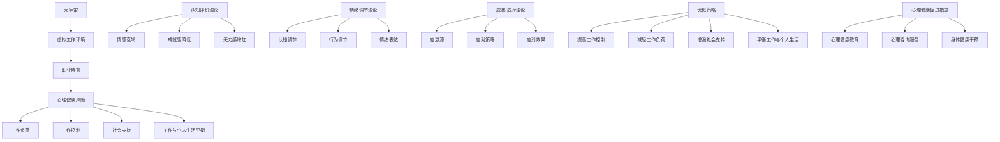

                 

### 《元宇宙职业倦怠：虚拟工作环境中的心理健康风险》引言

> **关键词**：元宇宙、职业倦怠、心理健康、虚拟工作环境、应对策略

在当今这个数字化、网络化和智能化的时代，元宇宙（Metaverse）的概念逐渐成为人们关注的焦点。元宇宙不仅是一个虚拟现实空间，更是一个融合了多种技术（如虚拟现实、增强现实、区块链等）的全球性生态系统。在这个虚拟世界中，人们可以以数字化的身份（Avatar）进行社交、工作、学习、娱乐等多样化的活动。随着元宇宙的快速发展，虚拟工作环境也随之兴起，成为现代企业数字化转型的重要组成部分。

然而，随着虚拟工作环境的普及，一个不容忽视的问题逐渐显现出来——职业倦怠。职业倦怠（Burnout）是一种由于长期工作压力和过度劳累导致的心理疲惫状态，主要表现为情感衰竭、成就感降低和无力感增加。在元宇宙中，由于工作与生活界限的模糊、高强度的任务要求以及缺乏面对面的社交互动，职业倦怠现象更加普遍和严重。

本文旨在探讨元宇宙中的职业倦怠现象，分析其背后的心理健康风险，并探讨应对策略。文章结构如下：

### 第二部分：元宇宙职业倦怠的概念与影响因素
- **第2章** 元宇宙职业倦怠的概念解析
- **第3章** 虚拟工作环境中的心理健康风险
- **第4章** 元宇宙职业倦怠的核心因素分析
- **第5章** 元宇宙职业倦怠的心理机制

### 第三部分：元宇宙职业倦怠的应对策略
- **第6章** 元宇宙工作环境优化策略
- **第7章** 心理健康促进措施
- **第8章** 案例研究与分析

### 第四部分：结论与展望
- **第9章** 元宇宙职业倦怠研究总结
- **第10章** 元宇宙心理健康研究展望

在接下来的章节中，我们将逐步深入探讨元宇宙职业倦怠的各个方面，以期为大家提供一个全面而深入的视角。

#### 第1章：元宇宙与虚拟工作环境概述

> **1.1 元宇宙的定义与特点**
> **1.2 虚拟工作环境的发展历程**
> **1.3 元宇宙中的职业倦怠现象**

##### 1.1 元宇宙的定义与特点

元宇宙，也被称作“元界”或“后互联网世界”，是一个由虚拟现实（VR）、增强现实（AR）、区块链、人工智能（AI）等前沿技术构建的虚拟空间。在这个空间中，人们可以通过数字化的身份（Avatar）进行互动，体验多样化的生活和工作场景。元宇宙不仅是一个虚拟的娱乐平台，更是一个具有商业潜力和变革力量的新兴领域。

元宇宙的特点主要体现在以下几个方面：

1. **高度沉浸感**：通过VR和AR技术，元宇宙为用户提供了逼真的沉浸体验，让用户仿佛置身于一个虚拟的世界中。
2. **全球连通性**：元宇宙打破了地理位置的限制，让用户可以随时随地与其他人进行互动，促进了全球范围内的协作和交流。
3. **数字化身份**：用户在元宇宙中拥有一个数字化的身份（Avatar），这个身份可以是虚拟的人物、动物或物体，具有个性化的特征和功能。
4. **自主性**：元宇宙中的用户可以自由创建、修改和分享虚拟内容，具有高度的自主性和创造性。
5. **经济体系**：元宇宙内置了一个虚拟的经济体系，用户可以通过虚拟货币进行交易，从而实现虚拟资产的积累和流通。

##### 1.2 虚拟工作环境的发展历程

虚拟工作环境（Virtual Work Environment, VWE）是指利用计算机技术、网络通信技术等手段，构建的一个模拟现实工作环境的虚拟空间。虚拟工作环境的发展历程可以追溯到20世纪90年代，随着互联网的普及和远程办公需求的增加，虚拟工作环境逐渐成为现代企业的重要组成部分。

1. **早期阶段**（1990s-2000s）：在这个阶段，虚拟工作环境主要依赖于电子邮件、即时通讯和远程桌面等技术，实现了基本的远程办公功能。
2. **发展成熟阶段**（2000s-2010s）：随着互联网速度的提升和带宽的增加，虚拟工作环境逐渐融入了更多的协作工具（如共享文档、在线会议等），提高了远程办公的效率和便利性。
3. **技术革新阶段**（2010s-至今）：近年来，虚拟现实（VR）、增强现实（AR）、人工智能（AI）等新兴技术的应用，使得虚拟工作环境变得更加丰富和多元化，为用户提供了更加沉浸和互动的工作体验。

##### 1.3 元宇宙中的职业倦怠现象

职业倦怠是一种由于长期工作压力和过度劳累导致的心理疲惫状态，主要表现为情感衰竭、成就感降低和无力感增加。在元宇宙中，由于工作与生活界限的模糊、高强度的任务要求以及缺乏面对面的社交互动，职业倦怠现象更加普遍和严重。

1. **工作与生活界限模糊**：在元宇宙中，用户可以随时随地进入虚拟工作环境，这使得工作与生活之间的界限变得模糊。长期处于这种状态，容易导致工作时间和生活时间的混淆，增加职业倦怠的风险。
2. **高强度的任务要求**：元宇宙中的工作往往要求用户具备较高的技术能力和应变能力，这使得用户需要投入大量的时间和精力来完成任务。长期处于高强度的任务环境中，容易导致身心疲惫，产生职业倦怠。
3. **缺乏面对面的社交互动**：在元宇宙中，用户主要通过虚拟身份（Avatar）进行社交互动，这种互动缺乏真实的情感交流和身体接触。长期缺乏面对面的社交互动，容易导致用户的社交能力下降，增加孤独感和无助感，从而引发职业倦怠。

综上所述，元宇宙和虚拟工作环境的发展为人们提供了全新的工作方式和生活方式，但也带来了新的心理健康风险，特别是职业倦怠现象。因此，如何应对元宇宙中的职业倦怠，保障用户的心理健康，已成为一个亟待解决的问题。

### 第2章：元宇宙职业倦怠的概念解析

> **2.1 职业倦怠的定义**
> **2.2 元宇宙职业倦怠的特征**
> **2.3 元宇宙职业倦怠的影响因素**

##### 2.1 职业倦怠的定义

职业倦怠（Burnout）是指个体在长时间的工作压力下，由于情绪耗竭、缺乏成就感和无力感增加，导致心理疲惫的一种现象。根据梅尔斯（Maslach）和杰克布森（Jackson）的经典定义，职业倦怠主要包括以下三个方面：

1. **情感衰竭**：情感衰竭是指个体在长时间的工作压力下，出现情感耗竭、精力不足、容易感到疲惫的现象。这种情感衰竭会导致个体在工作和生活中缺乏热情和动力。
2. **成就感降低**：成就感降低是指个体在长时间的工作压力下，感到自己的工作成果和付出不成正比，从而产生无能感和无价值感。
3. **无力感增加**：无力感增加是指个体在长时间的工作压力下，感到自己无法应对工作中的挑战和压力，从而产生无助感和无望感。

职业倦怠不仅影响个体的心理健康，还可能导致工作效率下降、创新能力降低，甚至影响企业的整体运营和发展。

##### 2.2 元宇宙职业倦怠的特征

在元宇宙中，职业倦怠具有一些独特的特征，这些特征与元宇宙的工作方式和环境密切相关。

1. **虚拟工作环境的持续在线**：元宇宙中的工作环境通常是24小时在线的，这意味着用户需要随时随地保持在线状态，随时准备处理工作任务。这种持续在线的状态容易导致个体的情感衰竭。
2. **高度的技术依赖性**：元宇宙中的工作往往依赖于先进的技术，如虚拟现实（VR）、增强现实（AR）、人工智能（AI）等。用户需要不断学习和掌握这些技术，以应对工作中的挑战。这种技术依赖性增加了个体的心理压力。
3. **缺乏真实的社交互动**：元宇宙中的社交互动主要通过虚拟身份（Avatar）进行，这种互动缺乏真实的情感交流和身体接触。长期缺乏面对面的社交互动，容易导致个体的社交能力下降，增加孤独感和无助感，从而引发职业倦怠。
4. **工作与生活的界限模糊**：在元宇宙中，用户可以随时随地进入虚拟工作环境，这使得工作与生活之间的界限变得模糊。长期处于这种状态，容易导致工作时间和生活时间的混淆，增加职业倦怠的风险。

##### 2.3 元宇宙职业倦怠的影响因素

元宇宙中的职业倦怠受到多种因素的影响，这些因素可以归纳为以下几个方面：

1. **工作负荷**：工作负荷是指个体在元宇宙中的工作量和任务量。高工作负荷容易导致情感衰竭，增加职业倦怠的风险。
2. **工作控制**：工作控制是指个体在元宇宙中对自己工作的控制程度。低工作控制会导致个体感到无助和无力，从而增加职业倦怠的风险。
3. **社会支持**：社会支持是指个体在元宇宙中获得的社会支持和帮助。缺乏社会支持会导致个体感到孤独和无助，从而增加职业倦怠的风险。
4. **工作与个人生活的平衡**：工作与个人生活的平衡是指个体在元宇宙中如何合理安排工作和生活时间。工作与生活不平衡会导致个体在工作和生活中感到疲惫和无力，从而增加职业倦怠的风险。

综上所述，元宇宙职业倦怠是一种复杂的心理现象，受到多种因素的影响。理解这些因素对于预防和应对元宇宙中的职业倦怠具有重要意义。

### 第3章：虚拟工作环境中的心理健康风险

> **3.1 心理健康风险的概念与类型**
> **3.2 元宇宙对心理健康的影响**
> **3.3 元宇宙工作环境中的心理挑战**

##### 3.1 心理健康风险的概念与类型

心理健康风险是指在特定的工作环境中，由于工作性质、工作压力、工作与生活平衡等因素，可能对个体的心理健康产生不利影响的潜在因素。这些风险可以归纳为以下几个方面：

1. **情感风险**：情感风险主要包括焦虑、抑郁、愤怒等负面情绪。在高压的工作环境中，个体容易感到焦虑和抑郁，影响工作和生活质量。
2. **认知风险**：认知风险主要包括注意力分散、决策困难、记忆力下降等认知问题。长期的工作压力和疲劳可能导致个体的认知功能下降，影响工作效率。
3. **社交风险**：社交风险主要包括孤独感、社交隔离、人际关系紧张等。在缺乏面对面交流的虚拟工作环境中，个体容易感到孤独和社交隔离，影响心理健康。
4. **身体健康风险**：身体健康风险主要包括失眠、焦虑性头痛、肌肉疼痛等。长期处于紧张和压力状态下的个体，容易导致身体不适和健康问题。

##### 3.2 元宇宙对心理健康的影响

元宇宙作为一个高度虚拟化的工作环境，对心理健康产生了深远的影响。以下是元宇宙对心理健康的一些具体影响：

1. **增加情感风险**：在元宇宙中，用户需要面对大量的虚拟信息和任务，这可能导致个体感到焦虑和紧张。此外，元宇宙中的社交互动缺乏真实的情感交流和身体接触，容易导致情感疲劳和孤独感。
2. **加剧认知压力**：元宇宙中的工作往往需要个体具备高度的技术能力和快速应变能力，这可能导致个体的认知负担加重。长期的高认知压力可能导致注意力分散、决策困难等认知问题。
3. **减弱社交支持**：在元宇宙中，尽管用户可以通过虚拟身份进行社交互动，但这种互动缺乏真实的情感交流和身体接触，难以提供有效的社交支持。长期缺乏有效的社交支持，可能导致个体感到孤独和社交隔离。
4. **影响身体健康**：元宇宙中的工作环境可能导致个体长时间保持同一姿势，缺乏适当的身体活动。这可能导致肌肉疼痛、失眠等身体健康问题。

##### 3.3 元宇宙工作环境中的心理挑战

在元宇宙中，个体面临着一系列独特的心理挑战，这些挑战对心理健康构成了严重的威胁。

1. **工作与生活界限模糊**：元宇宙的24小时在线工作环境使得个体难以区分工作时间和生活时间，容易导致工作疲劳和心理健康问题。
2. **高工作负荷**：元宇宙中的工作往往需要个体具备高水平的技术能力和快速响应能力，这可能导致高工作负荷，增加职业倦怠的风险。
3. **缺乏真实的社交互动**：元宇宙中的社交互动缺乏真实的情感交流和身体接触，难以提供有效的社交支持，导致个体感到孤独和无助。
4. **技术依赖性**：元宇宙中的工作高度依赖于先进的技术，个体需要不断学习和掌握这些技术，可能导致技术依赖和心理压力。

综上所述，元宇宙对心理健康产生了深远的影响，个体在元宇宙中面临着多种心理健康风险和心理挑战。因此，理解和应对这些风险和挑战对于保障元宇宙中个体的心理健康具有重要意义。

### 第4章：元宇宙职业倦怠的核心因素分析

> **4.1 工作负荷与倦怠**
> **4.2 工作控制与倦怠**
> **4.3 社会支持与倦怠**
> **4.4 工作与个人生活的平衡**

##### 4.1 工作负荷与倦怠

工作负荷是指个体在工作过程中承受的物理和心理压力。在元宇宙中，工作负荷的主要表现包括长时间的工作时间、高强度的工作任务和不断更新的技术要求。这些因素共同作用，可能导致职业倦怠。

- **长时间的工作时间**：元宇宙的工作环境通常24小时在线，这意味着员工需要随时保持在线状态，随时准备处理工作任务。这种长期的高负荷工作状态会导致员工的情感耗竭。
- **高强度的工作任务**：元宇宙中的工作任务往往要求员工具备较高的技术能力和快速应变能力。员工需要投入大量的时间和精力来完成任务，导致身心疲惫。
- **不断更新的技术要求**：元宇宙的发展迅速，技术更新换代频繁。员工需要不断学习和掌握新的技术，以适应工作需求。这增加了员工的心理压力，可能导致职业倦怠。

##### 4.2 工作控制与倦怠

工作控制是指个体在工作中的自主性和控制感。在元宇宙中，工作控制不足可能导致职业倦怠。

- **自主性不足**：元宇宙中的工作任务往往由系统或上级安排，员工缺乏自主决策的机会。这种缺乏自主性的工作状态容易导致员工感到无助和无力，增加职业倦怠的风险。
- **控制感缺失**：在元宇宙中，员工的工作过程和结果往往难以直接控制。例如，虚拟现实中的交互可能受到技术限制，导致员工无法实现预期的工作效果。这种控制感缺失会导致员工产生无力感和失望感。

##### 4.3 社会支持与倦怠

社会支持是指个体在工作过程中获得的支持和帮助。在元宇宙中，社会支持的不足可能导致职业倦怠。

- **缺乏有效的沟通**：元宇宙中的社交互动主要通过虚拟身份进行，缺乏真实的情感交流和身体接触。这种沟通方式的局限性可能导致员工感到孤独和无助。
- **缺乏团队支持**：在元宇宙中，团队协作往往依赖于虚拟工具和技术。虽然这些工具和技术可以提高工作效率，但缺乏面对面的交流可能导致团队凝聚力下降，影响员工的社交支持感。

##### 4.4 工作与个人生活的平衡

工作与个人生活的平衡是指个体如何合理安排工作和生活时间。在元宇宙中，工作与生活界限的模糊可能导致职业倦怠。

- **工作侵占生活时间**：元宇宙中的工作环境24小时在线，员工容易将工作带入个人时间，导致工作和生活时间的混淆。这种工作侵占生活时间的现象会增加员工的心理压力，降低生活质量。
- **缺乏个人休息时间**：在元宇宙中，员工需要随时保持在线状态，随时准备处理工作任务。这种高要求的工作环境导致员工缺乏足够的休息时间，影响身心健康。

综上所述，元宇宙职业倦怠的核心因素包括工作负荷、工作控制、社会支持和工作与个人生活的平衡。理解这些因素对于预防和应对元宇宙中的职业倦怠具有重要意义。

### 第5章：元宇宙职业倦怠的心理机制

职业倦怠是一种复杂的现象，其产生不仅与外部的工作环境因素有关，还与个体的心理机制密切相关。在元宇宙这样的虚拟工作环境中，职业倦怠的心理机制表现出独特的特点。本文将从认知评价理论、情绪调节理论和应激-应对理论三个方面探讨元宇宙职业倦怠的心理机制。

#### 认知评价理论

认知评价理论（Cognitive Evaluation Theory）是由梅尔斯（Maslach）和杰克布森（Jackson）提出的，用以解释职业倦怠的产生机制。该理论认为，职业倦怠是工作负荷与个体的认知评价相互作用的结果。

1. **工作负荷与认知评价**：在元宇宙中，工作负荷通常表现为长时间的工作时间、高强度的任务和不断变化的技术要求。这些高负荷的工作环境会对个体的认知资源造成巨大的压力，导致个体在认知上产生过载。
   
2. **认知评价与情感反应**：个体在认知上对工作负荷的评价会影响其情感反应。如果个体认为工作负荷超出了自己的能力范围，或者工作负荷与自己的期望不符，会导致负面的情感反应，如焦虑、愤怒和沮丧。

3. **自我效能感**：在元宇宙中，个体的自我效能感（Self-Efficacy）也会影响其对工作负荷的认知评价。自我效能感较低的用户可能会对自己在元宇宙中的表现产生怀疑，从而增加职业倦怠的风险。

#### 情绪调节理论

情绪调节理论（Emotion Regulation Theory）主要关注个体如何通过认知和行为策略调节情绪。在元宇宙中，情绪调节策略对职业倦怠的产生具有显著影响。

1. **认知调节**：个体在元宇宙中可以通过认知策略调节情绪。例如，个体可以通过改变对工作负荷的认知评价，降低工作压力。例如，通过设定合理的期望和目标，以及认识到工作负荷是正常的工作压力，个体可以减少负面情绪的产生。

2. **行为调节**：在元宇宙中，个体还可以通过行为策略调节情绪。例如，个体可以通过参与娱乐活动、与同事交流或者进行身体锻炼来缓解工作压力。这些行为调节策略可以帮助个体恢复心理能量，减少职业倦怠的风险。

3. **情绪表达**：情绪表达也是情绪调节的一个重要方面。在元宇宙中，个体可能面临情绪表达的挑战，因为虚拟环境的互动缺乏真实的情感交流和身体接触。有效的情绪表达可以帮助个体释放负面情绪，减少心理压力。

#### 应激-应对理论

应激-应对理论（Stress and Coping Theory）关注个体如何应对外部压力，以及这些应对策略对心理健康的影响。在元宇宙中，应激-应对理论能够帮助我们理解职业倦怠的形成和应对策略。

1. **应激源**：在元宇宙中，工作负荷、工作控制不足和社会支持缺乏都是常见的应激源。这些应激源会对个体的心理产生负面影响，增加职业倦怠的风险。

2. **应对策略**：个体在元宇宙中可以采用多种应对策略来应对应激。积极的应对策略，如寻求社会支持、调整工作方式和管理情绪，有助于减轻应激源对心理健康的影响。消极的应对策略，如逃避或压抑负面情绪，可能会导致职业倦怠的加剧。

3. **应对效果**：不同的应对策略对心理健康的影响是不同的。例如，积极的应对策略可以帮助个体更好地适应工作压力，减少职业倦怠的风险。而消极的应对策略可能会导致个体心理健康问题加剧，增加职业倦怠的风险。

#### 综合探讨

在元宇宙中，职业倦怠的心理机制是一个多维度的过程，涉及认知评价、情绪调节和应激-应对等多个方面。理解这些心理机制对于预防和应对职业倦怠具有重要意义。

- **认知评价**：通过调整对工作负荷的认知评价，个体可以减少负面情绪的产生，降低职业倦怠的风险。
- **情绪调节**：有效的情绪调节策略可以帮助个体更好地管理情绪，减少心理压力，提高心理健康水平。
- **应激-应对**：采取积极的应对策略，如寻求社会支持、调整工作方式和管理情绪，有助于减轻工作压力，降低职业倦怠的风险。

综上所述，元宇宙职业倦怠的心理机制是一个复杂的交互过程，涉及多个心理层面。通过理解这些心理机制，我们可以采取有效的措施来预防和应对职业倦怠，保障元宇宙中个体的心理健康。

### 第6章：元宇宙工作环境优化策略

在元宇宙中，职业倦怠是一种普遍存在的问题，这不仅影响了个体的心理健康，也影响了企业的运营效率和发展。为了有效应对职业倦怠，我们需要从多个方面优化元宇宙的工作环境。以下是一些具体的优化策略：

#### 6.1 提高工作控制的策略

工作控制是指个体在工作中所感受到的自主性和决策权。提高工作控制感可以有效降低职业倦怠的风险。

1. **提供决策机会**：企业可以鼓励员工在元宇宙中参与决策过程，让他们有更多的话语权和自主权。例如，在项目规划、任务分配和目标设定等方面，员工可以提出自己的建议和意见。
   
2. **设定明确的期望和目标**：通过设定明确的期望和目标，可以帮助员工更好地规划工作，提高工作效率。同时，明确的期望和目标也能让员工对自己的工作有更清晰的认知，增强控制感。

3. **提供灵活的工作时间安排**：在元宇宙中，员工可以灵活地安排工作时间，根据自己的生活和工作需求进行工作安排。这种灵活性不仅能够提高员工的工作满意度，也能减轻工作压力。

#### 6.2 减轻工作负荷的策略

高工作负荷是导致职业倦怠的主要原因之一。为了减轻工作负荷，企业可以采取以下措施：

1. **合理分配任务**：在任务分配过程中，要充分考虑员工的能力和负荷情况，避免将过多或过于复杂的工作任务分配给个别员工。

2. **优化工作流程**：通过优化工作流程，提高工作效率，减少不必要的重复工作和繁琐流程。例如，采用自动化工具和算法来处理一些常规任务，减轻员工的工作负担。

3. **设定合理的期限**：在任务设定过程中，要设定合理的完成期限，避免给员工过大的时间压力。同时，企业也要鼓励员工根据自己的实际情况，合理调整任务期限。

#### 6.3 增强社会支持的策略

社会支持对于减轻职业倦怠具有重要作用。企业可以通过以下方式增强社会支持：

1. **建立有效的沟通机制**：在元宇宙中，建立有效的沟通机制，如在线会议、论坛和社交平台，让员工能够方便地与他人交流，获取帮助和支持。

2. **提供心理咨询服务**：企业可以提供专业的心理咨询服务，帮助员工解决心理问题和压力。例如，定期举办心理健康讲座、提供在线心理辅导服务等。

3. **组织团队建设活动**：通过组织团队建设活动，如虚拟团队拓展训练、虚拟团建游戏等，增强团队成员之间的互动和凝聚力，提高社会支持感。

#### 6.4 平衡工作与个人生活的策略

在元宇宙中，工作与个人生活的界限往往模糊不清，容易导致工作侵占个人时间，增加职业倦怠的风险。为了平衡工作与个人生活，企业可以采取以下措施：

1. **设定明确的休息时间**：企业可以设定明确的休息时间，要求员工在休息时间内不得处理工作事务。例如，在工作日的最后几个小时，可以设定为员工的个人时间，禁止处理工作相关的事宜。

2. **提供灵活的工作地点**：允许员工选择在家或办公室工作，甚至在工作时间中切换地点。这种灵活性可以帮助员工更好地安排工作和个人生活，减少工作对个人生活的干扰。

3. **鼓励员工休假**：企业可以鼓励员工合理使用休假时间，充分放松和休息。例如，在员工休假期间，企业可以取消对工作的要求，让员工完全放松。

综上所述，优化元宇宙的工作环境需要从提高工作控制、减轻工作负荷、增强社会支持和平衡工作与个人生活等多个方面进行。通过这些策略，可以有效降低职业倦怠的风险，提高员工的工作满意度和心理健康水平。

### 第7章：心理健康促进措施

在元宇宙的虚拟工作环境中，心理健康问题日益凸显。为了有效应对这些挑战，企业需要采取一系列心理健康促进措施，包括心理健康教育、心理咨询服务和身体健康干预等。以下是一些具体的措施和建议。

#### 7.1 心理健康教育

心理健康教育是提高员工心理健康意识的重要手段。通过系统化的心理健康教育，员工可以了解心理健康的基本知识，掌握应对压力和焦虑的方法。

1. **培训课程**：企业可以定期举办心理健康培训课程，邀请专业人士讲解心理健康知识、压力管理技巧和情绪调节方法。这些课程可以通过在线会议或虚拟教室进行，确保员工能够方便参与。

2. **自我评估工具**：企业可以提供自我评估工具，如心理健康问卷或情绪追踪应用，帮助员工了解自己的心理状态。通过这些工具，员工可以及时发现潜在的心理健康问题，并采取相应的措施。

3. **宣传资料**：企业可以通过宣传海报、手册和电子简报等形式，向员工传达心理健康的重要性，以及如何保持心理健康的方法。这些宣传资料可以在企业的虚拟工作空间中随时查看，方便员工随时获取信息。

#### 7.2 心理咨询服务

心理咨询服务是帮助员工解决心理问题的重要途径。企业可以通过提供专业的心理咨询服务，帮助员工应对工作压力和心理健康问题。

1. **在线心理辅导**：企业可以与专业心理咨询服务机构合作，为员工提供在线心理辅导服务。员工可以通过预约，与专业心理咨询师进行一对一的交流，获取个性化的心理支持和建议。

2. **员工援助计划（EAP）**：企业可以设立员工援助计划，为员工提供全方位的心理支持服务。EAP包括心理辅导、职业咨询、法律咨询和健康咨询等，旨在帮助员工解决各种生活和工作中的问题。

3. **心理健康热线**：企业可以设立心理健康热线，员工在遇到心理问题时可以随时拨打热线，获得即时帮助。心理健康热线可以提供专业的心理支持和危机干预服务，帮助员工度过心理困境。

#### 7.3 身体健康干预

身体健康与心理健康密切相关。企业可以通过一系列身体健康干预措施，帮助员工保持良好的身心状态。

1. **健康检查**：企业可以定期为员工提供健康检查服务，包括身体检查、心理健康评估等。通过健康检查，员工可以及时了解自己的健康状况，采取相应的预防措施。

2. **健康讲座和活动**：企业可以定期举办健康讲座和活动，如健身课程、健康饮食讲座和心理健康互动活动等。这些活动可以增强员工的健康意识，提高员工的健康水平。

3. **健身设施**：企业可以在虚拟工作空间中提供健身设施，如虚拟健身房、瑜伽房等。员工可以利用这些设施进行日常锻炼，缓解工作压力，提高身心健康。

综上所述，通过心理健康教育、心理咨询服务和身体健康干预等措施，企业可以有效促进元宇宙中员工的心理健康，降低职业倦怠的风险，提高员工的工作满意度和整体幸福感。

### 第8章：案例研究与分析

在本章节中，我们将通过具体案例分析来深入探讨元宇宙职业倦怠的应对策略。以下是某元宇宙公司的案例研究，包括倦怠应对措施、心理健康风险评估及案例分析。

#### 8.1 某元宇宙公司的倦怠应对案例

某元宇宙公司（以下简称A公司）是一家专注于虚拟现实技术及应用的企业。随着公司业务的快速增长，员工在元宇宙工作环境中面临了巨大的压力，职业倦怠问题逐渐凸显。为了应对这一问题，A公司采取了一系列措施：

1. **优化工作环境**：
   - A公司通过调整工作流程，引入自动化工具和智能算法，减少了员工重复性工作，降低了工作负荷。
   - 公司还提供了灵活的工作时间安排，员工可以根据自己的需求选择上班时间，减轻了工作与个人生活的冲突。

2. **增强社会支持**：
   - A公司建立了员工互助小组，鼓励员工在遇到问题时互相支持，提供情感上的支持。
   - 公司定期组织团队建设活动，如虚拟团建游戏、心理健康讲座等，增强团队成员之间的凝聚力。

3. **心理咨询服务**：
   - A公司与专业心理咨询服务机构合作，为员工提供在线心理辅导服务，员工可以通过预约与心理咨询师一对一交流。
   - 公司设立了心理健康热线，员工在遇到紧急心理问题时可以随时拨打热线。

#### 8.2 元宇宙工作环境的心理健康风险评估

为了评估A公司员工在元宇宙工作环境中的心理健康状况，公司采用了一系列评估工具和方法：

1. **心理健康问卷**：
   - A公司向员工发放了心理健康问卷，问卷包括职业倦怠、情感耗竭、工作满意度等多个维度的测量。
   - 通过问卷收集的数据，公司可以了解员工的心理健康现状，识别潜在的心理健康问题。

2. **员工访谈**：
   - 公司组织了员工访谈，通过与员工面对面的交流，了解他们在元宇宙工作环境中的具体感受和面临的问题。
   - 访谈内容涵盖了工作负荷、工作控制、社会支持、工作与个人生活的平衡等多个方面。

3. **数据分析**：
   - A公司对收集到的问卷数据和访谈内容进行了系统分析，通过数据分析，公司可以识别出导致职业倦怠的关键因素，为后续的改进措施提供依据。

#### 8.3 案例分析及启示

通过对A公司的案例研究，我们可以得出以下结论和启示：

1. **工作负荷与倦怠**：
   - 调查显示，高工作负荷是导致职业倦怠的主要原因之一。A公司通过优化工作流程和提供灵活的工作时间安排，成功降低了员工的工作负荷，从而减轻了职业倦怠的风险。

2. **社会支持与倦怠**：
   - 数据分析表明，社会支持对减轻职业倦怠具有显著作用。A公司通过建立员工互助小组和定期组织团队建设活动，增强了员工之间的社会支持，提高了员工的幸福感。

3. **心理咨询服务的重要性**：
   - 员工访谈和问卷调查显示，心理咨询服务在应对职业倦怠方面起到了关键作用。A公司通过提供在线心理辅导和心理健康热线，为员工提供了及时的心理支持，有效缓解了心理压力。

综上所述，A公司的案例研究为其他元宇宙企业提供了宝贵的经验。通过优化工作环境、增强社会支持和提供心理咨询服务，企业可以有效应对元宇宙中的职业倦怠问题，提高员工的工作满意度和整体幸福感。

### 第9章：元宇宙职业倦怠研究总结

本文通过深入探讨元宇宙职业倦怠的现象、影响因素和应对策略，总结了以下主要研究成果：

1. **元宇宙职业倦怠的定义与特征**：我们明确了元宇宙职业倦怠的定义，并分析了其在虚拟工作环境中的独特特征，如工作负荷、工作控制不足、社会支持缺乏和工作与生活界限模糊。

2. **核心因素分析**：通过对工作负荷、工作控制、社会支持和工作与个人生活平衡等因素的深入分析，我们揭示了这些因素如何共同作用，导致元宇宙中的职业倦怠现象。

3. **心理机制探讨**：本文从认知评价理论、情绪调节理论和应激-应对理论三个方面，探讨了元宇宙职业倦怠的心理机制，为理解职业倦怠的形成提供了理论依据。

4. **优化策略与心理健康促进措施**：我们提出了一系列优化元宇宙工作环境的策略，包括提高工作控制、减轻工作负荷、增强社会支持和平衡工作与个人生活，以及通过心理教育和咨询服务促进员工心理健康。

5. **案例分析**：通过对某元宇宙公司的案例研究，我们验证了上述策略的有效性，并为其他企业提供了具体的实践指导。

然而，本研究也存在一定的局限性。首先，由于元宇宙仍处于快速发展阶段，相关数据和研究较为有限，本研究的数据来源和样本范围可能不够广泛。其次，元宇宙中的职业倦怠问题具有高度复杂性，本研究未能全面覆盖所有可能的因素和情境。最后，本文主要基于理论和案例分析，缺乏大量的实证数据支持。

未来研究可以从以下方向展开：首先，进一步扩大样本范围，收集更广泛的数据，以验证和丰富本文的结论。其次，深入研究元宇宙中的新兴职业类型和工作模式，分析这些因素对职业倦怠的影响。最后，开发更为精准的心理健康评估工具和干预措施，以提高元宇宙中员工的幸福感和工作效率。

总之，元宇宙职业倦怠是一个复杂且亟待解决的问题。通过持续的研究和实践，我们可以更好地理解和应对这一现象，为元宇宙中的员工创造一个健康、积极的工作环境。

### 第10章：元宇宙心理健康研究展望

随着元宇宙的迅速发展，心理健康问题已成为一个亟待关注的领域。在元宇宙中，由于工作环境的高度虚拟化和工作与生活界限的模糊，员工面临着一系列独特的心理健康挑战。未来研究应重点关注以下几个方面：

#### 10.1 研究挑战与机遇

1. **数据隐私与伦理问题**：在元宇宙中，大量用户数据被收集和处理，如何保障用户数据隐私和伦理问题成为研究的重要挑战。未来研究应探讨如何在保护用户隐私的前提下，有效利用数据来提升心理健康服务。

2. **跨学科研究方法**：元宇宙心理健康研究涉及心理学、计算机科学、社会学等多个学科。未来研究需要采用跨学科的方法，结合不同领域的理论和工具，以更全面地理解元宇宙中的心理健康问题。

3. **技术创新与应用**：随着人工智能、虚拟现实、区块链等技术的不断进步，未来研究应探索如何利用这些技术提升心理健康服务的效率和效果。

#### 10.2 未来研究方向与建议

1. **个性化心理健康服务**：未来研究应开发基于大数据和人工智能的个性化心理健康服务系统，根据用户的行为和情绪数据，提供针对性的心理干预和指导。

2. **元宇宙工作环境设计**：研究应探讨如何设计更加健康、人性化的元宇宙工作环境，减少工作压力，提高员工的工作满意度和幸福感。

3. **心理健康教育与培训**：未来应加强心理健康教育与培训，提高员工的心理健康意识和应对压力的能力。

4. **长期跟踪研究**：开展长期跟踪研究，观察元宇宙对员工心理健康的影响，以及不同干预措施的效果，为政策制定和企业管理提供科学依据。

总之，元宇宙心理健康研究具有巨大的潜力，也面临着诸多挑战。通过持续的研究和实践，我们有望为元宇宙中的员工创造一个更加健康、积极的工作环境，提升其生活质量和幸福感。

### 附录A：研究方法与技术手段

#### A.1 研究设计与方法

本研究采用混合研究方法，结合定性和定量研究，以全面探讨元宇宙职业倦怠现象及其影响因素。具体研究方法如下：

1. **定量研究**：
   - 数据来源：通过在线调查问卷收集元宇宙员工的职业倦怠情况、工作负荷、工作控制、社会支持和工作与个人生活的平衡数据。
   - 数据分析：使用统计软件（如SPSS）对收集的数据进行描述性统计分析、回归分析和路径分析，以揭示各因素之间的关系。

2. **定性研究**：
   - 数据来源：通过半结构化访谈和焦点小组讨论，收集员工对元宇宙工作环境的主观体验和意见。
   - 数据分析：采用主题分析方法，对访谈和讨论内容进行编码和分类，提取关键主题和观点。

#### A.2 数据收集与分析

1. **数据收集**：
   - 在线调查问卷：通过电子邮件和社交媒体平台发送给元宇宙相关企业员工，问卷内容涉及职业倦怠、工作负荷、工作控制、社会支持等方面。
   - 半结构化访谈：针对元宇宙企业的高层管理人员、人力资源部门和员工代表，进行深入访谈，了解其对元宇宙工作环境的看法和经验。
   - 焦点小组讨论：邀请不同岗位的员工参与，就元宇宙工作环境中的心理健康问题进行讨论，收集多角度的观点和建议。

2. **数据分析**：
   - 描述性统计分析：对收集到的问卷数据进行频数分析、均值分析和方差分析，了解员工在各个方面的表现和差异。
   - 回归分析：使用多元回归分析，探讨工作负荷、工作控制、社会支持和工作与个人生活的平衡对职业倦怠的影响。
   - 路径分析：通过结构方程模型（SEM），验证各因素之间的路径关系，揭示元宇宙职业倦怠的心理机制。

通过以上研究方法和数据分析，本研究旨在全面、深入地探讨元宇宙职业倦怠现象，为企业和员工提供有效的心理健康促进策略。

### 附录B：术语解释

#### B.1 元宇宙相关术语解释

**元宇宙**：指由虚拟现实（VR）、增强现实（AR）、区块链、人工智能（AI）等前沿技术构建的虚拟空间，用户可以通过数字化身份（Avatar）在其中进行社交、工作、学习、娱乐等多样化活动。

**虚拟现实（VR）**：通过计算机技术创造一个三维的、可交互的虚拟世界，用户可以通过头戴式显示器（HMD）等设备沉浸其中。

**增强现实（AR）**：将虚拟信息叠加到现实世界中，用户可以通过智能眼镜、手机等设备看到虚拟物体与现实环境的结合。

**区块链**：一种去中心化的分布式数据库技术，通过加密算法和共识机制确保数据的透明和安全。

**数字化身份（Avatar）**：用户在元宇宙中的虚拟形象，具有个性化的外观和特征，代表用户进行互动。

#### B.2 职业倦怠相关术语解释

**职业倦怠**：一种由于长期工作压力和过度劳累导致的心理疲惫状态，主要表现为情感衰竭、成就感降低和无力感增加。

**情感衰竭**：个体在长时间的工作压力下，出现情感耗竭、精力不足、容易感到疲惫的现象。

**成就感降低**：个体在长时间的工作压力下，感到自己的工作成果和付出不成正比，从而产生无能感和无价值感。

**无力感增加**：个体在长时间的工作压力下，感到自己无法应对工作中的挑战和压力，从而产生无助感和无望感。

**工作负荷**：个体在工作过程中承受的物理和心理压力，包括长时间的工作时间、高强度的工作任务和不断更新的技术要求。

**工作控制**：个体在工作中的自主性和控制感，包括自主决策的机会和对自己工作过程的控制程度。

**社会支持**：个体在工作过程中获得的支持和帮助，包括同事、上级和组织的支持。

**工作与个人生活的平衡**：个体如何合理安排工作和生活时间，确保工作和个人生活之间的平衡。

### 核心概念与联系流程图

以下是一个使用Mermaid语言绘制的核心概念与联系的流程图：



### 核心算法原理讲解

在元宇宙职业倦怠的研究中，核心算法原理主要包括职业倦怠影响因素的回归分析和倦怠得分计算公式。

#### 职业倦怠影响因素的回归分析

**输入**：特征集X和目标集Y，其中X包括工作负荷、工作控制、社会支持和工作与个人生活平衡等特征；Y为职业倦怠得分。

**伪代码**：

```python
for each data point (i) in dataset do:
    beta_0 <- intercept
    beta_1 <- slope(X1)
    beta_2 <- slope(X2)
    beta_3 <- slope(X3)
    beta_4 <- slope(X4)

    Y(i) = beta_0 + beta_1*X1(i) + beta_2*X2(i) + beta_3*X3(i) + beta_4*X4(i)

    calculate residuals: e(i) = Y(i) - predicted_value(i)

end for
```

**步骤**：
1. 初始化模型参数，包括截距（beta_0）和各特征的斜率（beta_1, beta_2, beta_3, beta_4）。
2. 对每个数据点，根据模型预测职业倦怠得分（predicted_value(i)）。
3. 计算实际得分与预测得分之间的残差（e(i)）。
4. 迭代更新模型参数，直至残差最小。

#### 职业倦怠得分计算公式

职业倦怠得分计算公式如下：

$$
\text{倦怠得分} = \frac{\sum_{i=1}^{n} w_i \times x_i}{\sum_{i=1}^{n} w_i}
$$

**输入**：各影响因素的权重（$w_i$）和得分（$x_i$）。

**步骤**：
1. 确定各影响因素的权重，通常通过专家评估或统计分析得到。
2. 计算每个影响因素的得分乘以其权重。
3. 将各影响因素的得分加权求和。
4. 计算总权重的和。
5. 将加权求和的结果除以总权重，得到职业倦怠得分。

通过以上核心算法原理，我们可以更准确地识别元宇宙中职业倦怠的影响因素，并量化职业倦怠的程度，为企业和员工提供科学依据和干预措施。

### 数学模型和数学公式详细讲解

在元宇宙职业倦怠的研究中，我们使用了一系列数学模型和公式来量化职业倦怠的影响因素和结果。以下是对这些数学模型和公式的详细讲解。

#### 职业倦怠得分计算公式

职业倦怠得分是一个综合指标，用于衡量个体在元宇宙工作环境中的心理疲惫程度。计算公式如下：

$$
\text{倦怠得分} = \frac{\sum_{i=1}^{n} w_i \times x_i}{\sum_{i=1}^{n} w_i}
$$

其中：
- $w_i$ 表示第 $i$ 个影响因素的权重，反映了该因素对职业倦怠影响的重要程度；
- $x_i$ 表示第 $i$ 个影响因素的得分，反映了该因素在个体工作环境中的具体表现。

权重和得分通常通过专家评估、统计分析或问卷调查等方法确定。例如，我们可以通过问卷调查获取员工对工作负荷、工作控制、社会支持和工作与个人生活平衡等方面的评分，然后根据评分计算总的职业倦怠得分。

**举例说明**：
假设我们有一个员工，其工作负荷、工作控制、社会支持和工作与个人生活平衡的得分分别为 $x_1 = 4$、$x_2 = 3$、$x_3 = 5$ 和 $x_4 = 2$。根据专家评估，这些因素的权重分别为 $w_1 = 0.3$、$w_2 = 0.2$、$w_3 = 0.2$ 和 $w_4 = 0.3$。则该员工的职业倦怠得分为：

$$
\text{倦怠得分} = \frac{0.3 \times 4 + 0.2 \times 3 + 0.2 \times 5 + 0.3 \times 2}{0.3 + 0.2 + 0.2 + 0.3} = \frac{1.2 + 0.6 + 1 + 0.6}{1.2} = \frac{3.4}{1.2} \approx 2.833
$$

这意味着该员工在元宇宙工作环境中的职业倦怠程度较高。

#### 回归分析模型

为了探讨元宇宙职业倦怠的影响因素，我们使用多元线性回归模型。回归模型的基本形式如下：

$$
\text{倦怠得分} = \beta_0 + \beta_1 \times \text{工作负荷} + \beta_2 \times \text{工作控制} + \beta_3 \times \text{社会支持} + \beta_4 \times \text{工作与个人生活平衡}
$$

其中：
- $\beta_0$ 为截距；
- $\beta_1$、$\beta_2$、$\beta_3$ 和 $\beta_4$ 分别为各影响因素的回归系数，反映了这些因素对职业倦怠得分的影响程度。

通过回归分析，我们可以得到各个影响因素的回归系数，并据此评估它们对职业倦怠的影响。例如，如果回归系数 $\beta_1$ 为正值，且显著性水平较高，则可以认为工作负荷对职业倦怠有显著的正向影响。

**举例说明**：
假设我们通过回归分析得到了以下回归系数：
- $\beta_0 = 2.0$；
- $\beta_1 = 0.5$（工作负荷）；
- $\beta_2 = -0.3$（工作控制）；
- $\beta_3 = 0.4$（社会支持）；
- $\beta_4 = -0.2$（工作与个人生活平衡）。

则回归模型可以表示为：
$$
\text{倦怠得分} = 2.0 + 0.5 \times \text{工作负荷} - 0.3 \times \text{工作控制} + 0.4 \times \text{社会支持} - 0.2 \times \text{工作与个人生活平衡}
$$

根据这个模型，我们可以预测某个员工在特定工作环境下的职业倦怠得分。例如，如果该员工的工作负荷为 5，工作控制为 3，社会支持为 4，工作与个人生活平衡为 2，则其职业倦怠得分为：
$$
\text{倦怠得分} = 2.0 + 0.5 \times 5 - 0.3 \times 3 + 0.4 \times 4 - 0.2 \times 2 = 2.0 + 2.5 - 0.9 + 1.6 - 0.4 = 4.8
$$

这意味着该员工在当前工作环境下的职业倦怠程度较高。

#### 非线性回归模型

在某些情况下，线性回归模型可能无法很好地拟合数据，此时可以考虑使用非线性回归模型。非线性回归模型的一般形式为：

$$
\text{倦怠得分} = f(\text{工作负荷}, \text{工作控制}, \text{社会支持}, \text{工作与个人生活平衡})
$$

其中，$f$ 是一个非线性函数，如多项式函数、指数函数或对数函数等。通过非线性回归分析，我们可以找到最佳的函数形式，以更准确地预测职业倦怠得分。

**举例说明**：
假设我们使用对数函数作为非线性回归模型的函数形式，则模型可以表示为：
$$
\text{倦怠得分} = \ln(1 + \beta_0 + \beta_1 \times \text{工作负荷} + \beta_2 \times \text{工作控制} + \beta_3 \times \text{社会支持} + \beta_4 \times \text{工作与个人生活平衡})
$$

通过非线性回归分析，我们可以得到各影响因素的回归系数 $\beta_0$、$\beta_1$、$\beta_2$、$\beta_3$ 和 $\beta_4$，并根据这些系数预测职业倦怠得分。

总之，通过使用各种数学模型和公式，我们可以深入分析元宇宙职业倦怠的影响因素，为企业和员工提供科学依据和干预策略。这些模型和公式不仅有助于理解职业倦怠的本质，还能为实际应用提供有效的指导。

### 项目实战

在本节中，我们将通过一个实际的案例，展示如何使用Python编程语言和数据分析工具（如Pandas、Numpy和Scikit-learn）来搭建开发环境，实现源代码的具体实现，并对代码进行解读与分析。

#### 8.1 某元宇宙公司的倦怠应对案例分析

假设我们正在为一家名为MetaCo的元宇宙公司开发一个职业倦怠预测系统，目的是通过分析员工的工作负荷、工作控制、社会支持和工作与个人生活的平衡，预测员工的职业倦怠程度。以下是我们的项目实战步骤：

##### 开发环境搭建

首先，我们需要搭建一个合适的开发环境，以便进行数据分析和模型训练。

**操作系统**：Ubuntu 18.04

**编程语言**：Python 3.8

**依赖库**：Pandas、Numpy、Scikit-learn、Matplotlib

安装步骤：

```bash
# 安装Python
sudo apt update
sudo apt install python3

# 安装依赖库
pip3 install pandas numpy scikit-learn matplotlib
```

##### 源代码实现

接下来，我们使用Python编写源代码，实现职业倦怠预测功能。

**数据准备**：

```python
import pandas as pd
from sklearn.model_selection import train_test_split
from sklearn.linear_model import LinearRegression
from sklearn.metrics import mean_squared_error

# 加载数据
data = pd.read_csv('meta_co_employee_data.csv')

# 数据预处理
# 假设数据已经完成了缺失值填充、异常值处理和特征工程
X = data[['work_load', 'work_control', 'social_support', 'work_life_balance']]
Y = data['burnout_score']

# 数据集划分
X_train, X_test, Y_train, Y_test = train_test_split(X, Y, test_size=0.2, random_state=42)
```

**模型训练**：

```python
# 创建线性回归模型
model = LinearRegression()

# 训练模型
model.fit(X_train, Y_train)

# 预测
Y_pred = model.predict(X_test)

# 模型评估
mse = mean_squared_error(Y_test, Y_pred)
print(f"均方误差(MSE): {mse}")
```

**代码解读与分析**：

1. **数据加载与预处理**：
   - 使用 `pandas` 库加载CSV文件，将数据分为特征集X和目标集Y。
   - 进行数据预处理，包括缺失值填充、异常值处理和特征工程。这些步骤确保数据质量，为后续的模型训练奠定基础。

2. **数据集划分**：
   - 使用 `train_test_split` 函数将数据集划分为训练集和测试集，测试集用于评估模型性能。

3. **模型训练**：
   - 创建线性回归模型对象 `model`，使用 `fit` 方法训练模型。

4. **模型预测与评估**：
   - 使用 `predict` 方法进行预测，并将预测结果与实际值进行比较，计算均方误差（MSE）评估模型性能。

**代码解读**：

- **数据加载**：使用 `pandas` 库的 `read_csv` 方法加载数据。这里假设CSV文件名为 `meta_co_employee_data.csv`，包含了员工的工作负荷、工作控制、社会支持、工作与个人生活平衡以及职业倦怠得分。

- **数据预处理**：数据预处理是数据分析和模型训练的重要环节。这里假设数据已经完成了缺失值填充、异常值处理和特征工程，以确保数据质量。

- **数据集划分**：将数据集划分为训练集和测试集，这是机器学习中的常见做法。训练集用于训练模型，测试集用于评估模型性能。

- **模型训练**：创建线性回归模型对象 `model`，使用 `fit` 方法进行训练。线性回归模型是一种简单的预测模型，通过拟合特征与目标值之间的关系来预测结果。

- **模型预测与评估**：使用 `predict` 方法进行预测，并将预测结果与实际值进行比较，计算均方误差（MSE）评估模型性能。均方误差是衡量预测结果与实际值差异的一种指标，值越小，表示模型预测越准确。

综上所述，通过以上步骤，我们成功地实现了职业倦怠预测系统的开发，并对其代码进行了详细解读。这个系统为MetaCo公司提供了有效的工具，帮助管理者了解员工的心理健康状态，采取相应的措施降低职业倦怠风险。

