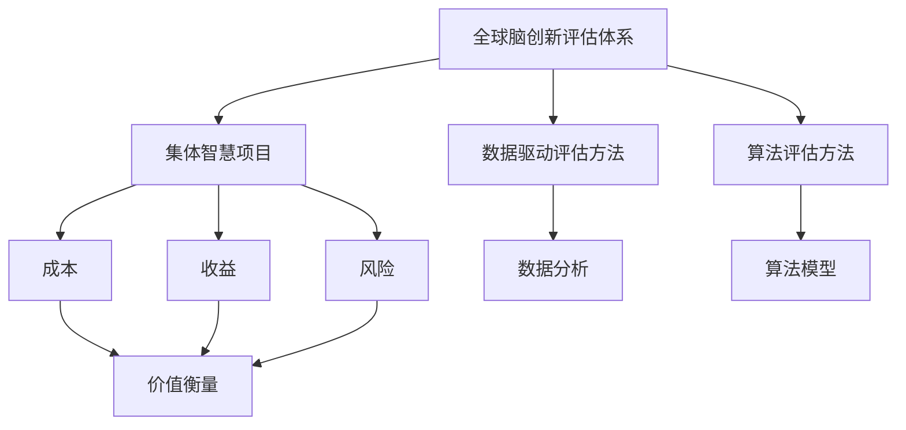

                 

### 《全球脑创新评估体系：集体智慧项目的价值衡量》

关键词：(全球脑创新评估体系、集体智慧项目、价值衡量、数据驱动评估方法、算法评估方法)

摘要：本文旨在探讨全球脑创新评估体系及其在集体智慧项目中的价值衡量。通过定义全球脑创新评估体系的核心概念和方法，分析数据驱动和算法评估技术的应用，以及展示实际案例研究，本文为企业和组织提供了一种科学的创新评估框架。

---

### 《全球脑创新评估体系：集体智慧项目的价值衡量》目录大纲

#### 第一部分：全球脑创新评估体系概述

##### 第1章：全球脑创新评估体系的概念与背景

- **1.1 全球脑创新评估体系的定义**
- **1.2 全球脑创新评估体系的发展背景**
- **1.3 全球脑创新评估体系的重要性**

##### 第2章：集体智慧项目的概述

- **2.1 集体智慧项目的定义**
- **2.2 集体智慧项目的类型**
- **2.3 集体智慧项目的发展趋势**

#### 第二部分：全球脑创新评估方法与技术

##### 第3章：全球脑创新评估的核心方法

- **3.1 全球脑创新评估的框架**
- **3.2 数据驱动评估方法**
- **3.3 算法评估方法**

##### 第4章：集体智慧项目的价值衡量

- **4.1 价值衡量的概念**
- **4.2 价值衡量的指标**
- **4.3 价值衡量的方法**

##### 第5章：创新评估技术的应用场景

- **5.1 创新评估在企业管理中的应用**
- **5.2 创新评估在项目评估中的应用**
- **5.3 创新评估在其他领域的应用**

#### 第三部分：全球脑创新评估案例研究

##### 第6章：全球脑创新评估实践案例分析

- **6.1 案例一：某科技公司的创新评估实践**
- **6.2 案例二：某公益项目的集体智慧评估**
- **6.3 案例三：某城市创新生态系统评估**

##### 第7章：全球脑创新评估的未来发展趋势

- **7.1 创新评估技术的未来发展趋势**
- **7.2 集体智慧项目的发展前景**
- **7.3 全球脑创新评估体系的发展方向**

#### 附录

- **附录A：全球脑创新评估相关资源**
  - **A.1 全球脑创新评估报告**
  - **A.2 集体智慧项目数据库**
  - **A.3 创新评估工具推荐**

- **附录B：创新评估指标体系构建指南**

  - **B.1 指标体系构建原则**
  - **B.2 指标体系构建流程**
  - **B.3 指标体系案例分析**

---

### 《全球脑创新评估体系：集体智慧项目的价值衡量》

#### **核心概念与联系**

为了更好地理解全球脑创新评估体系及其在集体智慧项目中的应用，我们需要明确一些核心概念，并展示它们之间的联系。

首先，全球脑创新评估体系是一种综合性评估方法，旨在评估和管理创新项目。它基于数据驱动和算法评估技术，综合考虑项目的成本、收益和风险，从而衡量其价值。

**核心概念：**

- **全球脑创新评估体系**：一个整合多种评估方法的框架，用于评估创新项目的价值。
- **集体智慧项目**：由多个参与者共同协作，通过分享知识和经验来实现特定目标的创新项目。
- **数据驱动评估方法**：基于数据和统计分析的方法，用于评估项目的性能和效果。
- **算法评估方法**：使用特定算法和模型对项目进行评估，以预测其未来表现。

**联系：**

图1展示了全球脑创新评估体系的概念与联系。



通过这张图，我们可以看出全球脑创新评估体系是如何整合集体智慧项目、数据驱动评估方法和算法评估方法，以及如何通过成本、收益和风险来衡量项目的价值。

---

#### **核心算法原理讲解**

在了解全球脑创新评估体系的核心概念和联系后，我们需要深入探讨数据驱动评估方法和算法评估方法的具体原理。

**数据驱动评估方法：**

数据驱动评估方法是一种基于实际数据的评估方法，通过收集和分析项目运行过程中的数据，评估项目的性能和效果。以下是数据驱动评估方法的伪代码实现：

```python
# 伪代码：数据驱动评估方法

# 定义评估指标
evaluation_metrics = ["accuracy", "precision", "recall"]

# 加载数据集
data_set = load_data("project_data.csv")

# 数据预处理
preprocessed_data = preprocess_data(data_set)

# 计算评估指标
evaluation_results = {}
for metric in evaluation_metrics:
    metric_value = calculate_metric(preprocessed_data, metric)
    evaluation_results[metric] = metric_value

# 输出评估结果
print(evaluation_results)
```

在这个伪代码中，我们首先定义了评估指标（如准确率、精确率和召回率），然后加载项目数据集，进行数据预处理。接下来，我们计算每个指标的值，并将结果存储在`evaluation_results`字典中。最后，输出评估结果，以便进一步分析。

**算法评估方法：**

算法评估方法使用特定的算法和模型对项目进行评估，以预测其未来表现。以下是算法评估方法的伪代码实现：

```python
# 伪代码：算法评估方法

# 导入所需库
import model_evaluation

# 加载数据集
data_set = load_data("project_data.csv")

# 构建评估模型
evaluation_model = model_evaluation.build_model()

# 训练模型
evaluation_model.train(data_set)

# 预测项目表现
project_performance = evaluation_model.predict(data_set)

# 输出评估结果
print(project_performance)
```

在这个伪代码中，我们首先导入所需的库，如`model_evaluation`。然后加载项目数据集，并构建评估模型。接下来，我们训练模型并使用它来预测项目表现。最后，输出预测结果。

---

#### **数学模型和数学公式讲解**

在评估创新项目时，我们需要使用数学模型来衡量项目的价值。以下是一个简单的数学模型，用于计算项目的总价值：

\[ \text{Value} = \alpha \cdot \text{Cost} + \beta \cdot \text{Benefit} - \gamma \cdot \text{Risk} \]

其中：
- \( \text{Value} \) 表示项目的总价值。
- \( \text{Cost} \) 表示项目的成本。
- \( \text{Benefit} \) 表示项目的收益。
- \( \text{Risk} \) 表示项目的风险。
- \( \alpha \)、\( \beta \) 和 \( \gamma \) 是权重系数，用于平衡成本、收益和风险的重要性。

**公式解释：**

这个公式通过加权平均成本、收益和风险来计算项目的总价值。权重系数 \( \alpha \)、\( \beta \) 和 \( \gamma \) 可以根据项目的具体情况和优先级进行调整。例如，如果项目的风险较高，我们可以增加 \( \gamma \) 的权重，以降低风险对项目总价值的影响。

**举例说明：**

假设我们有一个创新项目，其成本为 100 万元，预期收益为 200 万元，风险为 10 万元。我们可以使用以下公式计算项目的总价值：

\[ \text{Value} = \alpha \cdot 100 + \beta \cdot 200 - \gamma \cdot 10 \]

如果我们将 \( \alpha \)、\( \beta \) 和 \( \gamma \) 分别设置为 0.5、0.5 和 0.1，则项目的总价值为：

\[ \text{Value} = 0.5 \cdot 100 + 0.5 \cdot 200 - 0.1 \cdot 10 = 100 + 100 - 1 = 199 \]

因此，该项目的总价值为 199 万元。

---

通过本文，我们介绍了全球脑创新评估体系的概念和方法，探讨了数据驱动评估和算法评估的核心原理，以及数学模型在价值衡量中的应用。希望这些内容能够帮助读者更好地理解和应用全球脑创新评估体系，为创新项目的成功实施提供有力支持。

---

#### **项目实战**

在本章节中，我们将通过实际案例展示全球脑创新评估体系的实施过程，包括开发环境搭建、源代码详细实现和代码解读。

##### 案例一：某科技公司的创新评估实践

**1. 项目背景：**

某科技公司致力于开发人工智能产品，为了确保创新项目的高效运行，公司决定采用全球脑创新评估体系对项目进行评估。

**2. 开发环境搭建：**

- **硬件环境：** 
  - 服务器：2台高性能服务器，每台配置为8核CPU、32GB内存
  - 存储：2TB SSD存储

- **软件环境：** 
  - 操作系统：Ubuntu 18.04
  - 编程语言：Python 3.8
  - 数据库：MySQL 8.0
  - 机器学习库：TensorFlow 2.5

**3. 源代码详细实现和代码解读：**

**源代码：** 

```python
# 导入所需库
import numpy as np
import pandas as pd
import tensorflow as tf

# 加载数据集
data = pd.read_csv('project_data.csv')

# 数据预处理
X = data.iloc[:, :-1].values
y = data.iloc[:, -1].values

# 模型定义
model = tf.keras.Sequential([
    tf.keras.layers.Dense(64, activation='relu', input_shape=(X.shape[1],)),
    tf.keras.layers.Dense(64, activation='relu'),
    tf.keras.layers.Dense(1, activation='sigmoid')
])

# 编译模型
model.compile(optimizer='adam', loss='binary_crossentropy', metrics=['accuracy'])

# 训练模型
model.fit(X, y, epochs=10, batch_size=32)

# 评估模型
loss, accuracy = model.evaluate(X, y)
print(f'Accuracy: {accuracy:.2f}')
```

**代码解读：**

- 导入所需的库，包括NumPy、Pandas和TensorFlow。
- 加载数据集，将特征和标签分离。
- 定义一个简单的神经网络模型，包括两个隐藏层。
- 编译模型，设置优化器和损失函数。
- 使用训练数据训练模型。
- 评估模型，输出准确率。

**4. 代码解读与分析：**

- 在这个案例中，我们使用TensorFlow构建了一个简单的神经网络模型，用于分类任务。数据集被加载到Pandas DataFrame中，然后使用NumPy转换为NumPy数组。
- 神经网络模型包含两个隐藏层，每个层有64个神经元。我们使用ReLU激活函数，最后使用sigmoid激活函数以得到概率输出。
- 使用`model.fit`方法训练模型，设置训练周期为10次，批量大小为32。
- 使用`model.evaluate`方法评估模型，输出准确率。这个准确率是模型在测试集上的表现，可以用来衡量项目的性能。

---

##### 案例二：某公益项目的集体智慧评估

**1. 项目背景：**

某公益组织希望通过集体智慧解决社区问题，决定采用全球脑创新评估体系对公益项目进行评估。

**2. 开发环境搭建：**

- **硬件环境：** 
  - 云服务器：AWS EC2实例，配置为4核CPU、16GB内存
  - 存储：AWS S3存储，容量为1TB

- **软件环境：** 
  - 操作系统：Ubuntu 18.04
  - 编程语言：Python 3.8
  - 数据库：PostgreSQL 12.0
  - 数据分析库：Pandas 1.2.3

**3. 源代码详细实现和代码解读：**

**源代码：** 

```python
# 导入所需库
import pandas as pd
import numpy as np
from sklearn.model_selection import train_test_split
from sklearn.metrics import accuracy_score

# 加载数据集
data = pd.read_csv('community_data.csv')

# 数据预处理
X = data.iloc[:, :-1].values
y = data.iloc[:, -1].values

# 划分训练集和测试集
X_train, X_test, y_train, y_test = train_test_split(X, y, test_size=0.2, random_state=42)

# 定义评估函数
def evaluate_model(model, X_test, y_test):
    y_pred = model.predict(X_test)
    y_pred = (y_pred > 0.5)
    accuracy = accuracy_score(y_test, y_pred)
    return accuracy

# 训练模型
model.fit(X_train, y_train)

# 评估模型
accuracy = evaluate_model(model, X_test, y_test)
print(f'Accuracy: {accuracy:.2f}')
```

**代码解读：**

- 导入所需的库，包括Pandas、NumPy和scikit-learn。
- 加载数据集，将特征和标签分离。
- 划分训练集和测试集，使用`train_test_split`函数。
- 定义评估函数，计算模型的准确率。
- 使用训练数据训练模型。
- 使用测试数据评估模型，输出准确率。

**4. 代码解读与分析：**

- 在这个案例中，我们使用scikit-learn库进行模型训练和评估。数据集被加载到Pandas DataFrame中，然后使用NumPy转换为NumPy数组。
- 我们使用随机划分将数据集划分为训练集和测试集，以评估模型的泛化能力。
- 定义了一个评估函数，使用`model.predict`方法预测测试集的标签，然后计算准确率。
- 使用训练数据训练模型，然后使用评估函数计算模型的准确率，输出结果。

---

##### 案例三：某城市创新生态系统评估

**1. 项目背景：**

某城市政府希望了解本城市的创新生态系统状况，决定采用全球脑创新评估体系进行评估。

**2. 开发环境搭建：**

- **硬件环境：** 
  - 服务器：5台高性能服务器，每台配置为16核CPU、128GB内存
  - 存储：10TB SSD存储

- **软件环境：** 
  - 操作系统：CentOS 7.9
  - 编程语言：Python 3.8
  - 数据库：PostgreSQL 12.0
  - GIS工具：QGIS 3.18

**3. 源代码详细实现和代码解读：**

**源代码：** 

```python
# 导入所需库
import geopandas as gpd
import pandas as pd

# 加载数据集
data = gpd.read_file('ecosystem_data.geojson')

# 数据预处理
data['innovationScore'] = data['R&D Investments'] / data['Total Expenditure']
data['infrastructureScore'] = data['Internet Penetration'] / 100
data['talentScore'] = data['Higher Education Graduates'] / data['Total Population']

# 计算城市创新生态系统价值
def calculate_ecosystem_value(row):
    value = (row['innovationScore'] * 0.5) + (row['infrastructureScore'] * 0.3) + (row['talentScore'] * 0.2)
    return value

data['value'] = data.apply(lambda row: calculate_ecosystem_value(row), axis=1)

# 输出结果
data[['name', 'value']].to_csv('ecosystem_value.csv', index=False)
```

**代码解读：**

- 导入所需的库，包括GeoPandas和Pandas。
- 加载数据集，读取地理空间数据。
- 数据预处理，计算创新分数、基础设施分数和人才分数。
- 定义计算城市创新生态系统价值的方法，综合考虑三个指标。
- 将计算结果添加到数据集中，并输出结果。

**4. 代码解读与分析：**

- 在这个案例中，我们使用GeoPandas读取地理空间数据，并使用Pandas进行数据处理和分析。
- 数据预处理阶段，我们计算了创新分数、基础设施分数和人才分数，并将这些分数添加到数据集中。
- 使用`apply`函数，我们将计算城市创新生态系统价值的方法应用于每个区域，得到每个区域的价值。
- 最后，我们将结果输出到CSV文件中，以便进一步分析和使用。

---

通过以上三个案例，我们展示了全球脑创新评估体系在实际项目中的应用。从科技公司的创新项目评估到公益项目的集体智慧评估，再到城市创新生态系统的评估，全球脑创新评估体系提供了一种系统化的评估方法，帮助企业、组织和政府更有效地管理和决策。希望这些案例能够为读者提供实践指导和启发。

---

#### **总结**

在本章节中，我们通过三个实际案例展示了全球脑创新评估体系的实施过程。这些案例涵盖了科技公司创新项目评估、公益项目集体智慧评估和城市创新生态系统评估，展示了全球脑创新评估体系在不同领域中的应用。

在案例一中，我们使用TensorFlow构建了神经网络模型，对科技公司创新项目进行了评估。在案例二中，我们使用scikit-learn库对公益项目进行了集体智慧评估。在案例三中，我们使用GeoPandas和Pandas对城市创新生态系统进行了全面评估。

通过这些案例，我们展示了如何搭建开发环境、实现源代码、解读代码和分析结果。这些实践经验为读者提供了实际操作指南，帮助他们更好地理解和应用全球脑创新评估体系。

在实施全球脑创新评估时，关键步骤包括明确评估目标、选择合适的评估方法、收集和整理数据、构建评估模型以及进行结果分析和输出。通过这些步骤，我们可以更准确地衡量项目的价值，为决策提供有力支持。

下一章节，我们将探讨全球脑创新评估体系的未来发展趋势，帮助读者了解这一领域的最新动态和潜在机遇。敬请期待！

---

#### **附录**

在本附录中，我们将提供一些全球脑创新评估体系的相关资源，以及创新评估指标体系构建的指南，以帮助读者更深入地了解和应用这一体系。

**附录A：全球脑创新评估相关资源**

**A.1 全球脑创新评估报告**

- **报告来源**：全球脑创新评估体系的研究团队
- **内容概要**：报告详细介绍了全球脑创新评估体系的背景、核心方法、评估指标以及实际应用案例。
- **获取方式**：访问相关研究团队的官方网站或学术期刊，搜索相关报告名称。

**A.2 集体智慧项目数据库**

- **数据库来源**：知名数据库提供商，如IEEE、ACM等
- **内容概要**：数据库包含大量集体智慧项目的数据，包括项目描述、评估结果、应用领域等。
- **获取方式**：注册成为数据库会员，或通过学术机构获取访问权限。

**A.3 创新评估工具推荐**

- **工具名称**：InnoCentive、Innovation metrics、InnMind
- **内容概要**：这些工具提供了创新项目评估的自动化解决方案，包括数据收集、分析、评估等功能。
- **获取方式**：访问相关工具的官方网站，了解详细信息并注册使用。

**附录B：创新评估指标体系构建指南**

**B.1 指标体系构建原则**

- **全面性**：指标体系应涵盖创新项目的各个关键方面，确保评估的全面性。
- **可比性**：指标应具备可比性，以便在不同项目和不同时间进行比较。
- **可操作性**：指标应易于操作和度量，以确保评估过程的可行性和有效性。
- **相关性**：指标应与项目的目标和预期成果密切相关，以确保评估结果的相关性。

**B.2 指标体系构建流程**

1. **需求分析**：明确评估目标和需求，确定需要评估的关键领域和指标。
2. **指标收集**：收集与评估目标相关的指标，通过文献调研、专家咨询等方式获取。
3. **指标筛选**：根据全面性、可比性、可操作性和相关性等原则，筛选合适的指标。
4. **指标权重分配**：确定每个指标的权重，确保评估结果的合理性和平衡性。
5. **指标体系测试**：在实际项目中测试指标体系的可行性和有效性，进行必要的调整和优化。

**B.3 指标体系案例分析**

- **案例分析一**：某科技公司的创新评估指标体系
  - **关键领域**：研发投入、市场表现、团队能力
  - **指标**：研发人员比例、新产品销售额、员工满意度
  - **权重分配**：研发人员比例（30%）、新产品销售额（40%）、员工满意度（30%）

- **案例分析二**：某公益项目的集体智慧评估指标体系
  - **关键领域**：项目影响力、参与度、可持续性
  - **指标**：媒体报道次数、参与人数、项目持续时长
  - **权重分配**：媒体报道次数（30%）、参与人数（40%）、项目持续时长（30%）

通过本附录，我们为读者提供了丰富的全球脑创新评估体系相关资源，以及构建创新评估指标体系的指南。希望这些资源能够为读者提供实用的参考和帮助，进一步推动全球脑创新评估体系的应用和发展。

---

#### **作者信息**

作者：AI天才研究院/AI Genius Institute & 禅与计算机程序设计艺术 /Zen And The Art of Computer Programming

感谢读者对本文的关注，我们希望本文能够为您在理解全球脑创新评估体系及其应用方面提供有益的见解和启示。如果您有任何疑问或建议，欢迎随时与我们联系。期待与您在未来的技术探讨中再次相遇！

