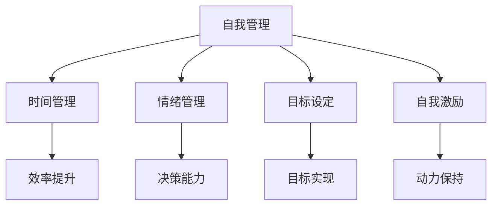
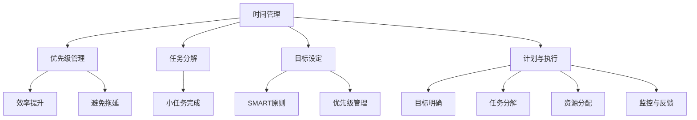
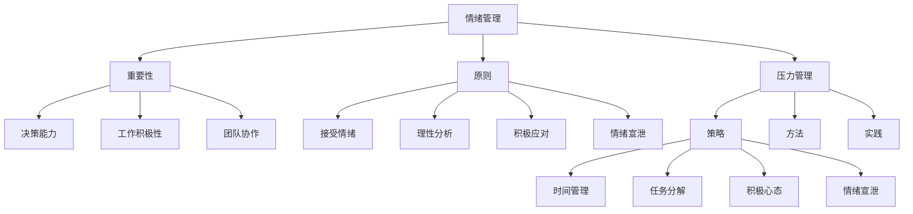
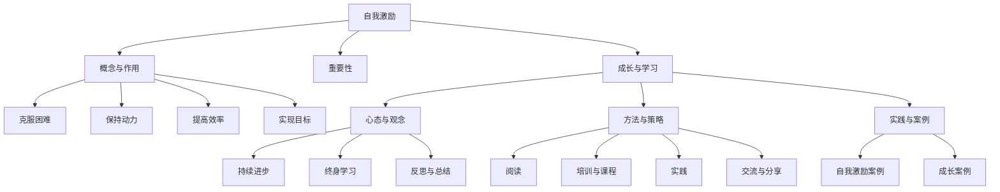
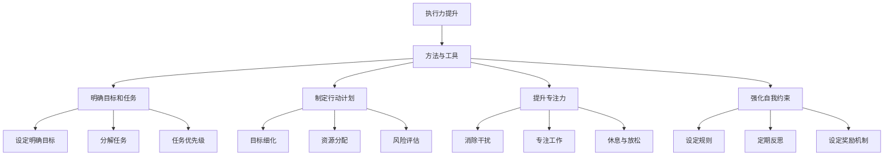
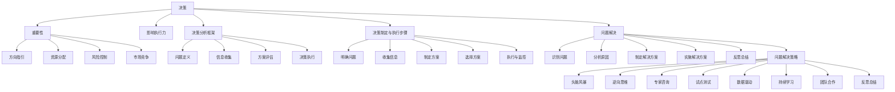
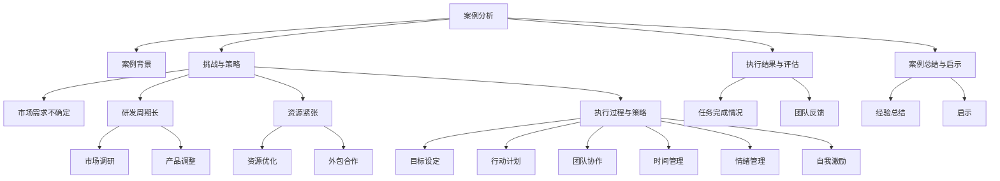
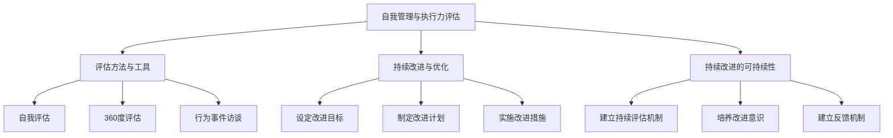

                 

### 《创业者的自我管理：提高执行力的技巧》

> **关键词**：自我管理、执行力、创业者、技巧、时间管理、目标设定、情绪管理、自我激励、决策能力

> **摘要**：本文探讨了自我管理在提升创业者执行力中的重要性。文章从定义、作用、提升方法和实际案例等方面，系统地分析了自我管理如何帮助创业者实现目标，提高工作效率和执行力。通过阐述时间管理、情绪管理、自我激励等核心技巧，以及实际案例的剖析，本文为创业者提供了实用的自我管理方法和执行力提升策略。

---

### 《创业者的自我管理：提高执行力的技巧》目录大纲

#### 第一部分：自我管理与执行力基础

- **第1章：自我管理与执行力的概念与重要性**
  - 1.1 自我管理的定义与作用
  - 1.2 执行力的定义与特征
  - 1.3 自我管理与执行力之间的联系

- **第2章：时间管理与规划**
  - 2.1 时间管理的原则与方法
  - 2.2 目标设定与优先级管理
  - 2.3 计划与执行

- **第3章：情绪管理与压力应对**
  - 3.1 情绪管理的重要性
  - 3.2 压力管理与应对策略
  - 3.3 情绪管理与压力应对的实践

- **第4章：自我激励与成长**
  - 4.1 自我激励的重要性
  - 4.2 成长与学习
  - 4.3 自我激励与成长的实践

#### 第二部分：提升自我管理技能

- **第5章：执行力提升的方法与工具**
  - 5.1 执行力提升的方法
  - 5.2 执行力提升的工具

- **第6章：高效决策与问题解决**
  - 6.1 决策的重要性
  - 6.2 决策的方法与技巧
  - 6.3 问题解决的方法与技巧

- **第7章：执行力提升的实际案例**
  - 7.1 案例分析
  - 7.2 案例总结与启示

#### 第三部分：提高执行力

- **第8章：自我管理与执行力评估**
  - 8.1 评估方法与工具
  - 8.2 持续改进与优化

- **第9章：未来展望**
  - 9.1 自我管理与执行力的发展趋势
  - 9.2 持续提升自我管理与执行力

#### 附录

- **附录A：推荐阅读与资源**
  - A.1 相关书籍推荐
  - A.2 在线资源与平台

- **附录B：自我管理与执行力练习题**
  - B.1 时间管理练习
  - B.2 目标设定与优先级管理练习
  - B.3 情绪管理与压力应对练习
  - B.4 自我激励与成长练习
  - B.5 执行力提升练习
  - B.6 决策与问题解决练习

---

**文章开始：**

---

## **自我管理与执行力的概念与重要性**

### **1.1 自我管理的定义与作用**

自我管理是指个体对自己的行为、情绪和思维的主动调节和控制。它涉及到时间管理、目标设定、情绪管理、压力应对和自我激励等多个方面。对于创业者而言，自我管理能力尤为重要，因为它直接影响到创业的成功与否。

#### **自我管理的概念**

自我管理不仅包括对时间的有效利用，还包括对自身情绪和行为的调节。创业者需要时刻保持清醒的头脑，合理规划时间，确保任务的高效完成。同时，自我管理也涉及到情绪管理，因为在创业过程中，创业者会面临各种压力和挑战，情绪的调节能力对于保持高效工作和决策能力至关重要。

#### **自我管理对创业者的作用**

自我管理对创业者的影响主要体现在以下几个方面：

1. **提高工作效率**：通过自我管理，创业者可以更好地规划时间，合理安排工作和休息，避免时间的浪费，从而提高工作效率。
2. **情绪控制**：在高压环境下，自我管理能力有助于创业者保持冷静和理智，避免情绪波动对决策产生负面影响。
3. **目标实现**：自我管理能力强的创业者能够设定明确的目标，并制定详细的执行计划，从而更有条理地实现创业目标。
4. **自我激励**：通过自我管理，创业者可以设定激励机制，激发自己的内在动力，保持创业的热情和动力。

### **1.2 执行力的定义与特征**

执行力是指个体或组织将战略目标转化为实际成果的能力。它是一种综合能力，涵盖了计划、执行、监控和调整等多个方面。执行力强的个体或组织能够高效地完成任务，实现目标。

#### **执行力的定义**

执行力通常被描述为“行动力”或“实施能力”。它涉及到个体或组织在执行任务时的效率、准确性和适应性。高效的执行力不仅要求个体能够迅速响应任务需求，还需要确保任务完成的准确性和质量。

#### **执行力的特征**

执行力具有以下几个显著特征：

1. **效率**：执行力强的个体或组织能够在短时间内完成更多任务，提高工作效率。
2. **准确性**：执行力强的个体或组织能够准确理解任务要求，避免因误解或失误而影响执行效果。
3. **协作**：执行力不仅是个体的能力，还需要团队协作。执行力强的个体能够与团队成员紧密配合，共同完成任务。
4. **适应性**：执行力强的个体或组织能够根据实际情况调整执行策略，确保目标实现。

### **1.3 自我管理与执行力之间的联系**

自我管理与执行力之间存在着密切的联系。自我管理能力强的创业者通常也具备较强的执行力，这是因为：

1. **目标设定与计划**：自我管理能力强的创业者能够设定明确的目标，并制定详细的执行计划，这有助于提高执行力。
2. **时间管理**：通过时间管理，创业者可以更高效地利用时间，避免拖延，从而提高执行力。
3. **情绪控制**：情绪管理能力有助于创业者保持冷静和理智，避免情绪波动对执行力产生负面影响。
4. **自我激励**：自我激励能力能够帮助创业者保持积极的心态，提高执行力。

### **1.4 自我管理与执行力提升的实际案例**

以下是一些自我管理与执行力提升的实际案例，这些案例展示了在创业过程中，如何通过有效的自我管理提升执行力，从而实现成功。

#### **案例1：时间管理与目标设定的实践**

**背景**：李华是一名创业者，他成立了一家初创公司，专注于移动互联网应用的开发。

**问题**：由于公司业务繁忙，李华经常感到时间不够用，任务完成不及时。

**解决方案**：

1. **目标设定**：李华首先明确了自己的目标，包括短期和长期目标，如开发一款受欢迎的移动应用、扩大团队等。
2. **时间管理**：为了更有效地利用时间，李华开始使用时间管理工具，如Trello和Google Calendar，将工作任务分解为小任务，并设定具体的完成时间。
3. **优先级管理**：李华根据任务的重要性和紧急性，设定了任务的优先级，确保优先完成最重要、最紧急的任务。

**结果**：通过目标设定和时间管理，李华的工作效率显著提高，任务完成时间缩短，公司产品研发进度加快。

---

**本章小结**

自我管理与执行力是创业成功的关键能力。通过有效的自我管理，创业者可以设定明确的目标、合理规划时间、控制情绪和自我激励，从而提高执行力，实现创业目标。在创业过程中，创业者应注重自我管理能力的培养，以提升执行力，应对各种挑战，实现创业梦想。

---

**Mermaid 流程图：**



---

## **自我管理与执行力提升的方法与工具**

### **2.1 时间管理与规划**

时间管理是自我管理的重要组成部分，它有助于创业者更高效地利用时间，提高工作效率。以下是一些时间管理的原则和方法：

#### **2.1.1 时间管理的原则**

1. **优先级管理**：根据任务的重要性和紧急性，设定任务的优先级，确保优先完成最重要、最紧急的任务。
2. **任务分解**：将大任务分解为小任务，逐步完成，避免因任务过于庞大而感到无从下手。
3. **日程规划**：提前规划每天的工作，将任务按优先级排序，确保重要任务优先完成。
4. **避免拖延**：及时处理任务，避免将任务推迟到最后一刻，以减少工作压力。

#### **2.1.2 时间管理的具体方法**

1. **使用时间管理工具**：利用时间管理工具，如Trello、Asana和Google Calendar等，可以帮助创业者更好地规划时间，提高工作效率。

   ```mermaid
   graph TB
       A[任务列表] --> B[Trello]
       A --> C[Asana]
       A --> D[Google Calendar]
       B --> E[任务分配]
       B --> F[进度跟踪]
       C --> G[任务管理]
       C --> H[报告生成]
       D --> I[日程安排]
       D --> J[提醒设置]
   ```

2. **番茄工作法**：番茄工作法是一种简单有效的时间管理方法，通过将工作时间分为25分钟的工作周期，每个周期后休息5分钟，来提高工作效率。

   ```mermaid
   graph TB
       A[工作周期] --> B[25分钟]
       A --> C[休息周期]
       C --> D[5分钟]
   ```

#### **2.1.3 时间管理的实践**

1. **设定优先级**：根据任务的重要性和紧急性，将任务分为四个象限，确保优先完成重要且紧急的任务。

   ```mermaid
   graph TB
       A[重要紧急] --> B[优先完成]
       A --> C[重要不紧急]
       A --> D[不重要紧急]
       A --> E[不重要不紧急]
       C --> F[规划时间完成]
       D --> G[避免发生]
       E --> H[减少发生]
   ```

2. **任务分解**：将大任务分解为小任务，并为每个小任务设定具体的完成时间。

   ```mermaid
   graph TD
       A1[任务1]
       A2[任务2]
       A3[任务3]
       A4[任务4]
       A1 --> B1[子任务1]
       A2 --> B2[子任务2]
       A3 --> B3[子任务3]
       A4 --> B4[子任务4]
   ```

### **2.2 目标设定与优先级管理**

目标设定是自我管理的重要组成部分，它有助于创业者明确自己的方向和目标。以下是一些目标设定的原则和技巧：

#### **2.2.1 目标设定的SMART原则**

1. **具体性（Specific）**：目标应当明确、具体，避免模糊不清。
2. **可衡量性（Measurable）**：目标应当能够被衡量，以便评估是否达成。
3. **可实现性（Achievable）**：目标应当是可实现的，避免设定过高的目标。
4. **相关性（Relevant）**：目标应当与整体战略和愿景相关。
5. **时限性（Time-bound）**：目标应当有明确的时间限制。

#### **2.2.2 优先级管理的方法与技巧**

1. **四象限法**：根据任务的重要性和紧急性，将任务分为四个象限，确保优先完成重要且紧急的任务。

   ```mermaid
   graph TB
       A[重要紧急] --> B[优先完成]
       A --> C[重要不紧急]
       A --> D[不重要紧急]
       A --> E[不重要不紧急]
       C --> F[规划时间完成]
       D --> G[立即处理]
       E --> H[推迟或放弃]
   ```

2. **关键成果法**：将目标分解为关键成果，为每个关键成果设定具体的行动步骤和时间表。

   ```mermaid
   graph TD
       A1[关键成果1]
       A2[关键成果2]
       A3[关键成果3]
       A1 --> B1[行动步骤1]
       A2 --> B2[行动步骤2]
       A3 --> B3[行动步骤3]
   ```

### **2.3 计划与执行**

计划与执行是目标实现的关键环节。以下是一些计划与执行的方法和技巧：

#### **2.3.1 计划的重要性**

1. **明确目标**：在开始执行任务之前，明确目标是非常关键的。这有助于确保任务的方向正确，减少执行过程中的偏差。
2. **详细规划**：详细的计划可以分解任务，明确每个步骤的要求和时间，有助于任务的顺利执行。
3. **资源分配**：根据任务的需求，合理分配资源，如人力、资金和时间，以确保任务的顺利进行。

#### **2.3.2 执行计划的步骤与方法**

1. **目标明确**：明确任务的目标，确保团队成员对任务有清晰的理解。
2. **任务分解**：将大任务分解为小任务，明确每个小任务的负责人和时间表。
3. **资源分配**：根据任务的需求，合理分配资源，确保资源的充分利用。
4. **监控与反馈**：在执行过程中，持续监控任务的进展，及时反馈问题，确保任务按计划进行。

### **2.3.3 执行计划的实践**

1. **项目计划**：以项目为例，制定详细的项目计划，包括项目目标、任务分解、时间表和资源分配等。

   ```mermaid
   graph TD
       A[项目计划]
       A --> B[项目目标]
       A --> C[任务分解]
       A --> D[时间表]
       A --> E[资源分配]
   ```

2. **任务管理**：使用任务管理工具，如Trello或Asana，管理任务的分配、进度和反馈。

   ```mermaid
   graph TD
       A[Trello/Asana]
       A --> B[任务分配]
       A --> C[进度跟踪]
       A --> D[反馈管理]
   ```

---

**本章小结**

通过有效的自我管理，创业者可以更好地规划时间、设定目标、制定计划并执行任务。时间管理、目标设定和计划执行是自我管理的核心要素，它们共同构成了创业者提高执行力的重要工具。通过本章的学习，创业者应掌握这些核心技巧，并将其应用于实际工作中，以提高工作效率和执行力，实现创业目标。

---

**Mermaid 流程图：**



---

## **情绪管理与压力应对**

### **3.1 情绪管理的重要性**

情绪管理是自我管理的重要组成部分，对于创业者的成功至关重要。在创业过程中，创业者常常面临各种挑战和压力，如资金不足、市场竞争、团队管理等问题。如果不能有效地管理情绪，这些压力可能会对创业者的决策能力、工作积极性和健康产生负面影响。

#### **情绪对执行力的影响**

情绪对执行力的影响主要表现在以下几个方面：

1. **决策能力**：情绪稳定的创业者能够更客观、理性地分析问题和做出决策，避免因情绪波动而导致的错误决策。
2. **工作积极性**：情绪积极的创业者更有动力去完成任务，面对困难时能够保持乐观和坚定的态度。
3. **团队协作**：情绪稳定的创业者能够建立良好的团队氛围，促进团队成员之间的沟通与合作，提高整体执行力。

#### **情绪管理的基本原则**

为了更好地管理情绪，创业者应遵循以下基本原则：

1. **接受情绪**：认识到情绪是人类正常的心理反应，学会接受自己的情绪，而不是试图压抑或逃避。
2. **理性分析**：在面对情绪波动时，保持冷静，理性分析问题的原因，找到合适的解决方案。
3. **积极应对**：采取积极的应对策略，如寻求支持、调整心态、改变环境等，以应对负面情绪。
4. **情绪宣泄**：合理宣泄情绪，如通过运动、写日记、与朋友倾诉等方式，释放内心的压力。

### **3.2 压力管理与应对策略**

在创业过程中，压力是不可避免的一部分。有效的压力管理有助于创业者保持良好的情绪状态，提高执行力和工作效率。以下是一些压力管理的策略：

#### **3.2.1 压力的来源与影响**

1. **工作压力**：创业者在面对工作上的挑战和任务时，会产生压力。如项目进度紧张、市场竞争激烈等。
2. **经济压力**：创业过程中的经济压力，如资金不足、收入不稳定等，会对创业者产生压力。
3. **人际关系**：与团队成员、合作伙伴、客户等人际关系的处理也会产生压力。

压力对创业者的影响主要体现在以下几个方面：

1. **身心健康**：长期的压力会导致身心健康问题，如失眠、焦虑、抑郁等。
2. **工作效率**：压力会影响创业者的工作效率和执行力，导致任务完成不理想。
3. **决策能力**：压力下的创业者可能难以保持冷静和理智，做出错误的决策。

#### **3.2.2 压力管理的策略与方法**

1. **时间管理**：合理安排时间，避免过度工作，确保有足够的休息时间。使用时间管理工具，如日程表和待办事项列表，提高时间利用效率。
2. **任务分解**：将大任务分解为小任务，逐步完成，避免因任务过于庞大而感到压力。为每个小任务设定具体的时间表，确保任务的逐步完成。
3. **积极心态**：保持积极的心态，面对挑战时保持乐观和坚定。可以通过冥想、正念练习等方式，培养积极心态。
4. **情绪宣泄**：合理宣泄情绪，如通过运动、写日记、与朋友倾诉等方式，释放内心的压力。避免将压力压抑在内心，导致身心健康问题。

#### **3.2.3 压力应对的实际策略**

1. **制定压力应对计划**：创业者可以制定详细的压力应对计划，包括应对策略、资源和支持系统等。例如，在遇到经济压力时，制定节省开支和寻找投资机会的计划。
2. **寻求支持**：创业者可以寻求家人、朋友、导师或专业人士的支持和帮助。通过与他人交流，获取建议和鼓励，缓解压力。
3. **定期放松**：创业者应定期安排时间进行放松和休息，如旅行、阅读、参加兴趣爱好等活动。通过放松身心，缓解压力，提高工作效率。

### **3.3 情绪管理与压力应对的实践**

以下是一些情绪管理与压力应对的实际案例，展示了如何通过有效的策略和方法，管理情绪和应对压力。

#### **案例1：情绪管理实践**

**背景**：张强是一名创业者，他创立了一家科技公司，负责开发智能家居产品。

**问题**：由于市场竞争激烈，张强经常感到压力巨大，情绪波动较大，影响了公司的运营和管理。

**解决方案**：

1. **情绪管理**：张强开始学习情绪管理技巧，如冥想和深呼吸，帮助自己缓解压力，保持冷静。
2. **压力应对**：张强制定了压力应对策略，如定期锻炼身体、参加社交活动等，以保持身心健康。
3. **团队支持**：张强与团队成员保持良好的沟通，鼓励团队成员共同面对压力，共同解决问题。

**结果**：通过情绪管理和压力应对，张强的状态得到了显著改善，情绪稳定，工作效率提高，公司运营更加顺畅。

#### **案例2：压力应对实践**

**背景**：李华是一家初创公司的创始人，公司正在开发一款移动应用。

**问题**：由于项目进度紧张，李华经常感到压力巨大，影响了工作质量和健康状况。

**解决方案**：

1. **时间管理**：李华开始使用时间管理工具，如Trello和Google Calendar，合理安排时间，确保有足够的休息时间。
2. **任务分解**：李华将大任务分解为小任务，并为每个小任务设定具体的时间表，确保任务的逐步完成。
3. **积极心态**：李华通过保持积极的心态，面对挑战时保持乐观和坚定。

**结果**：通过时间管理和积极心态，李华的工作效率得到了显著提高，项目进度加快，健康状况得到改善。

### **3.3.1 情绪管理的实际案例**

**案例背景**：王鹏是一名创业者，他经营着一家餐饮连锁企业。

**问题**：由于餐饮业的竞争激烈，王鹏经常感到压力巨大，情绪波动较大，影响了企业的运营和发展。

**解决方案**：

1. **情绪管理**：王鹏开始学习情绪管理技巧，如冥想和深呼吸，帮助自己缓解压力，保持冷静。
2. **压力应对**：王鹏制定了压力应对策略，如定期锻炼身体、参加社交活动等，以保持身心健康。
3. **团队支持**：王鹏与团队成员保持良好的沟通，鼓励团队成员共同面对压力，共同解决问题。

**结果**：通过情绪管理和压力应对，王鹏的状态得到了显著改善，情绪稳定，工作效率提高，企业运营更加顺畅。

### **3.3.2 压力应对的实际策略**

**案例背景**：赵丽是一名创业者，她经营着一家时尚品牌公司。

**问题**：由于公司运营初期资金紧张，赵丽经常感到压力巨大，影响了决策和团队管理。

**解决方案**：

1. **制定压力应对计划**：赵丽制定了详细的压力应对计划，包括节省开支、寻找投资机会等策略。
2. **寻求支持**：赵丽寻求家人和朋友的支持，以及专业人士的建议，缓解压力。
3. **定期放松**：赵丽定期安排时间进行放松和休息，如旅行、阅读等，缓解压力。

**结果**：通过制定压力应对计划和定期放松，赵丽的压力得到了有效缓解，决策能力得到提升，团队管理更加有效。

### **3.3.3 案例总结与启示**

通过以上实际案例，我们可以看到，情绪管理和压力应对对于创业者的成功至关重要。有效的情绪管理和压力应对策略可以帮助创业者保持良好的心态，提高工作效率和执行力，实现创业目标。以下是案例总结与启示：

1. **情绪管理**：通过冥想、深呼吸等技巧，帮助创业者缓解压力，保持冷静和理智。
2. **压力应对**：制定详细的压力应对计划，寻求支持，定期放松，有助于缓解压力，提高决策能力。
3. **团队支持**：与团队成员保持良好的沟通，共同面对压力，共同解决问题，有助于提高团队执行力。
4. **积极心态**：保持积极的心态，面对挑战时保持乐观和坚定，有助于提高工作效率和执行力。

总之，情绪管理和压力应对是创业者成功的关键因素之一。通过有效的策略和实践，创业者可以更好地管理情绪和应对压力，提高工作效率和执行力，实现创业目标。

---

**本章小结**

情绪管理与压力应对是自我管理的重要组成部分，对于创业者的成功至关重要。通过有效的情绪管理和压力应对策略，创业者可以保持良好的心态，提高工作效率和执行力，实现创业目标。本章介绍了情绪管理的重要性、压力管理的策略以及实际案例，为创业者提供了实用的情绪管理和压力应对方法。

---

**Mermaid 流程图：**



---

## **自我激励与成长**

### **4.1 自我激励的重要性**

自我激励是自我管理中不可或缺的一部分，它对创业者的成长和成功具有重要作用。自我激励指的是个体通过内部动机激发自己的行为，以达到目标或完成任务的意愿和能力。在创业过程中，自我激励能够帮助创业者克服困难、保持动力，持续推动自己的事业向前发展。

#### **自我激励的概念与作用**

1. **概念**：自我激励是指个体在缺乏外部奖励的情况下，通过自我驱动和自我调控来激发自己的行为和动机。
2. **作用**：自我激励能够帮助创业者：
   - **克服困难**：在创业过程中，创业者常常会面临各种挑战和困难，自我激励能够帮助创业者保持积极的态度，克服困难，继续前进。
   - **保持动力**：自我激励能够激发创业者的内在动力，使他们在遇到挫折时仍然能够坚持下去，保持工作热情。
   - **提高效率**：自我激励能够提高创业者的工作效率，使他们在面对任务时能够更专注、更高效地完成工作。
   - **实现目标**：自我激励是创业者实现目标的重要驱动力，它能够帮助创业者设定目标、规划路径，并最终实现目标。

### **4.2 成长与学习**

成长与学习是自我激励的重要体现，也是创业者持续进步的动力源泉。在创业过程中，创业者需要不断学习和成长，以适应不断变化的市场环境和竞争压力。

#### **成长的心态与观念**

1. **持续进步**：创业者应具备持续进步的心态，认识到成长是一个不断进行的过程，而不是一次性的事件。
2. **终身学习**：创业者应将学习视为一种生活方式，不断学习新知识、新技能，以适应不断变化的环境。
3. **反思与总结**：创业者应定期反思和总结自己的经验和教训，从成功和失败中学习，不断提升自己的能力和素质。

#### **学习的方法与策略**

1. **阅读**：阅读是获取知识的重要途径，创业者应广泛阅读，包括专业书籍、行业报告、成功案例等，以获取最新的行业动态和知识。
2. **培训与课程**：参加各种培训课程和专业研讨会，学习新的技能和知识，提升自己的专业能力。
3. **实践**：通过实践将理论知识转化为实际能力，创业者可以在实际操作中学习和成长。
4. **交流与分享**：与同行和专家进行交流，分享经验和观点，从他人的经验和教训中学习，拓展自己的视野。

### **4.3 自我激励与成长的实践**

以下是一些自我激励与成长的实际案例，展示了如何通过有效的自我激励和成长策略，推动个人和企业的持续发展。

#### **案例1：自我激励与成长的实践**

**背景**：王丽是一名创业者，她成立了一家专注于环保科技的公司。

**问题**：在创业初期，王丽面临着市场竞争激烈、资金短缺等问题，感到压力巨大，但仍然坚持不懈地推动企业发展。

**解决方案**：

1. **自我激励**：王丽通过设定小目标，如每月实现一定的销售目标，激励自己持续努力。她还会定期回顾和庆祝这些小目标的达成，以保持动力。
2. **成长与学习**：王丽参加了多次行业研讨会和培训课程，不断学习新的环保技术和市场营销策略，提升自己的专业能力。
3. **团队建设**：王丽注重团队建设，鼓励团队成员分享经验和观点，共同学习和成长。

**结果**：通过自我激励和成长，王丽的公司在环保科技领域取得了显著成绩，市场份额逐步扩大，团队凝聚力也不断提升。

#### **案例2：自我激励与成长的实践**

**背景**：李强是一名创业者，他成立了一家科技初创公司，专注于人工智能技术的研发。

**问题**：在项目初期，李强面临着技术难题和市场不确定性，感到压力巨大，但他仍然坚持推动项目发展。

**解决方案**：

1. **自我激励**：李强通过设定具体的目标，如每季度发布一款新的人工智能产品，激励自己持续努力。他还会为自己设定奖励机制，如在达成目标后给自己放一天假。
2. **成长与学习**：李强积极参加各种技术研讨会和培训课程，不断学习新的技术和市场动态，提升自己的专业能力。
3. **团队支持**：李强鼓励团队成员积极参与项目，分享技术和市场信息，共同解决技术难题。

**结果**：通过自我激励和成长，李强的公司成功研发了多款人工智能产品，并在市场上取得了良好的反响，团队也不断发展壮大。

### **4.3.1 自我激励的实际案例**

**案例背景**：张伟是一名创业者，他成立了一家互联网营销公司。

**问题**：在创业初期，张伟面临着市场竞争激烈、客户资源不足等问题，但他始终保持着积极的心态，不断激励自己。

**解决方案**：

1. **自我激励**：张伟通过设定小目标，如每月增加一定数量的客户，激励自己不断努力。他还会为自己设定奖励机制，如在达成目标后给自己买一件新的商务装。
2. **成长与学习**：张伟参加了多次营销培训和行业研讨会，不断学习新的营销策略和技巧，提升自己的专业能力。
3. **团队建设**：张伟鼓励团队成员分享营销经验和观点，共同学习和成长，增强团队凝聚力。

**结果**：通过自我激励和成长，张伟的公司的客户资源不断增加，业务范围逐渐扩大，团队也不断发展壮大。

### **4.3.2 成长的实际策略**

**案例背景**：赵敏是一名创业者，她成立了一家健康食品公司。

**问题**：在创业初期，赵敏面临着产品研发和市场推广等方面的挑战，但她始终坚持学习，不断成长。

**解决方案**：

1. **自我激励**：赵敏通过设定小目标，如每月完成一定的研发进度和市场推广任务，激励自己持续努力。她还会为自己设定奖励机制，如在达成目标后给自己放一天假。
2. **成长与学习**：赵敏参加了多次营养学和市场营销培训，不断学习新的知识和技能，提升自己的专业能力。
3. **实践**：赵敏通过实践将理论知识应用到产品研发和市场推广中，不断积累经验和教训，提升自己的实战能力。

**结果**：通过自我激励和成长，赵敏的公司成功研发出多款受欢迎的健康食品，并在市场上取得了良好的反响，团队也不断发展壮大。

### **4.3.3 案例总结与启示**

通过以上实际案例，我们可以看到，自我激励和成长对于创业者的成功至关重要。有效的自我激励和成长策略可以帮助创业者保持积极的心态，克服困难，持续推动个人和企业的成长。以下是案例总结与启示：

1. **自我激励**：通过设定小目标和奖励机制，激励自己不断努力，保持动力。
2. **成长与学习**：通过参加培训、阅读和学习，不断提升自己的专业能力和综合素质。
3. **团队建设**：与团队成员共同学习和成长，增强团队凝聚力，提高整体执行力。
4. **实践**：将理论知识应用到实际工作中，通过实践积累经验和提升能力。

总之，自我激励和成长是创业者成功的关键因素之一。通过有效的自我激励和成长策略，创业者可以不断提升自己，实现个人和企业的持续发展。

---

**本章小结**

自我激励和成长是创业者成功的重要因素。有效的自我激励能够帮助创业者克服困难，保持积极的心态和动力，持续推动个人和企业的成长。成长与学习是自我激励的重要体现，通过不断学习新知识和技能，创业者可以提升自己的专业能力和综合素质。本章介绍了自我激励的重要性、成长的方法以及实际案例，为创业者提供了实用的自我激励和成长策略。

---

**Mermaid 流程图：**



---

## **执行力提升的方法与工具**

### **5.1 执行力提升的方法**

提升执行力需要从多个维度进行综合考量，以下是一些常用的方法：

#### **5.1.1 明确目标和任务**

明确的目标和任务是执行力的基础。创业者应确保自己的目标和任务是具体、可衡量、可实现、相关和时限性的（SMART原则）。具体步骤如下：

1. **设定明确的目标**：明确自己的创业目标和阶段性目标，确保目标具有可衡量性和可实现性。
2. **分解任务**：将大任务分解为小任务，为每个小任务设定具体的完成时间和责任人。
3. **任务优先级**：根据任务的重要性和紧急性，设定任务的优先级，确保重要且紧急的任务优先完成。

#### **5.1.2 制定有效的行动计划**

有效的行动计划是执行力提升的关键。以下是一些制定有效行动计划的步骤：

1. **目标细化**：将目标分解为具体的行动计划，明确每个行动的具体步骤和时间表。
2. **资源分配**：根据行动计划的需求，合理分配资源，包括人力、资金和时间等。
3. **风险评估**：对行动计划进行风险评估，预测可能遇到的问题和挑战，并制定应对措施。

#### **5.1.3 提升工作专注力**

提升专注力有助于提高工作效率和执行力。以下是一些提升专注力的方法：

1. **消除干扰**：在工作时避免干扰，如关闭不必要的通知、将手机静音等。
2. **专注工作**：将工作时间分段，每个时间段专注于一项任务，避免多任务处理。
3. **休息与放松**：在长时间工作后，适当休息和放松，以保持精力充沛。

#### **5.1.4 强化自我约束**

自我约束是执行力提升的重要保障。以下是一些强化自我约束的方法：

1. **设定规则**：为自己设定工作规则，如工作时间、休息时间等，确保工作的高效进行。
2. **定期反思**：定期反思自己的工作表现，识别不足之处，并采取改进措施。
3. **设定奖励机制**：为自己设定奖励机制，如在完成任务后给予自己适当的奖励，以激发工作动力。

### **5.2 执行力提升的工具**

除了方法之外，合适的工具也能显著提升执行力。以下是一些常用的执行力提升工具：

#### **5.2.1 时间管理工具**

时间管理工具可以帮助创业者更好地规划时间和任务，提高工作效率。以下是一些常见的时间管理工具：

1. **Trello**：一款功能强大的项目管理工具，适合团队协作和任务管理。
2. **Asana**：专业的项目管理软件，提供任务分配、进度跟踪和报告功能。
3. **Google Calendar**：免费的日历应用，适合个人和团队安排日程和设置提醒。

#### **5.2.2 任务管理工具**

任务管理工具可以帮助创业者更有效地管理任务和跟踪进度。以下是一些常见的任务管理工具：

1. **Evernote**：一款笔记和任务管理工具，适合记录任务和灵感。
2. **Notion**：一款多功能的工作笔记和任务管理工具，支持多种格式和功能。
3. **Wunderlist**：一款简洁易用的任务管理应用，适合个人和团队使用。

#### **5.2.3 沟通协作工具**

有效的沟通协作是执行力提升的重要组成部分。以下是一些常用的沟通协作工具：

1. **Slack**：一款流行的即时通讯工具，适合团队沟通和协作。
2. **Microsoft Teams**：微软推出的团队协作工具，提供聊天、视频会议和文件共享等功能。
3. **Zoom**：一款专业的视频会议工具，适合远程团队沟通和在线会议。

### **5.2.4 执行力提升的实践**

以下是一些执行力提升的实践案例，展示了如何通过有效的方法和工具，提升执行力和工作效率：

#### **案例1：明确目标和任务**

**背景**：张华是一家初创公司的创始人，他面临多个项目同时进行，任务繁杂，工作效率低下。

**解决方案**：

1. **设定明确的目标**：张华明确了公司的短期和长期目标，包括产品发布时间、市场推广计划等。
2. **分解任务**：将大任务分解为小任务，并为每个小任务设定具体的完成时间和责任人。
3. **任务优先级**：根据任务的重要性和紧急性，设定任务的优先级，确保重要且紧急的任务优先完成。

**结果**：通过明确目标和任务，张华的工作效率显著提高，项目进展顺利。

#### **案例2：制定有效的行动计划**

**背景**：李强是一家中型企业的销售经理，他发现销售团队的任务执行不力，业绩不理想。

**解决方案**：

1. **目标细化**：李强将销售目标分解为具体的行动计划，明确每个销售任务的步骤和时间表。
2. **资源分配**：根据行动计划的需求，合理分配销售资源，包括人力和营销预算等。
3. **风险评估**：对行动计划进行风险评估，预测可能遇到的问题和挑战，并制定应对措施。

**结果**：通过制定有效的行动计划，李强的销售团队执行力得到显著提升，业绩大幅提高。

#### **案例3：提升工作专注力**

**背景**：赵敏是一家互联网公司的程序员，她发现自己经常在工作时分心，工作效率低下。

**解决方案**：

1. **消除干扰**：赵敏在工作时关闭了社交媒体和电子邮件通知，避免干扰。
2. **专注工作**：赵敏将工作时间分段，每个时间段专注于一项任务，避免多任务处理。
3. **休息与放松**：在长时间工作后，赵敏适当休息和放松，以保持精力充沛。

**结果**：通过提升专注力，赵敏的工作效率显著提高，代码质量和项目进度都有所提升。

### **5.2.5 执行力提升的实际策略**

**背景**：王明是一家创业孵化器的负责人，他发现孵化器内的创业团队在执行任务时存在拖延和效率低下的问题。

**解决方案**：

1. **设定规则**：王明为孵化器内的创业团队设定了工作时间规则，如每天早上9点到晚上6点为工作时间，严禁在工作时间进行与工作无关的活动。
2. **定期反思**：王明定期组织团队进行工作反思，识别不足之处，并采取改进措施。
3. **设定奖励机制**：王明为团队设定了奖励机制，如在完成任务后给予团队适当的奖励，以激发工作动力。

**结果**：通过设定规则、定期反思和设定奖励机制，孵化器内的创业团队执行力显著提升，项目进展顺利。

### **5.2.6 案例总结与启示**

通过以上实际案例，我们可以看到，执行力提升的关键在于明确目标和任务、制定有效的行动计划、提升工作专注力和强化自我约束。同时，合适的工具和策略也能显著提升执行力。以下是案例总结与启示：

1. **明确目标和任务**：设定具体、可衡量、可实现、相关和时限性的目标，分解任务，设定优先级。
2. **制定有效的行动计划**：细化目标，合理分配资源，进行风险评估。
3. **提升工作专注力**：消除干扰，专注工作，适当休息。
4. **强化自我约束**：设定规则，定期反思，设定奖励机制。

总之，执行力提升是创业成功的关键因素之一。通过有效的方法和工具，创业者可以显著提高工作效率和执行力，实现创业目标。

---

**本章小结**

执行力提升是创业者成功的关键因素之一。通过明确目标和任务、制定有效的行动计划、提升工作专注力和强化自我约束，以及使用合适的工具和策略，创业者可以显著提高工作效率和执行力，实现创业目标。本章介绍了执行力提升的方法与工具，并结合实际案例进行了详细解析，为创业者提供了实用的执行力提升策略。

---

**Mermaid 流程图：**



---

## **高效决策与问题解决**

### **6.1 决策的重要性**

在创业过程中，决策是领导者不可或缺的技能。高效的决策能力直接影响企业的方向、生存和发展。创业者需要不断地做出决策，从市场战略到日常运营，每一个决策都可能决定企业的成败。以下是决策的重要性以及它对执行力的影响：

#### **决策的重要性**

1. **方向指引**：决策为创业者提供了明确的行动方向，有助于企业朝着目标前进。
2. **资源分配**：决策帮助创业者合理分配资源，如人力、资金和时间，确保资源得到最优利用。
3. **风险控制**：决策有助于识别和评估潜在风险，从而采取预防措施，减少损失。
4. **市场竞争**：在激烈的市场竞争中，高效的决策能力使企业能够迅速响应市场变化，抢占先机。

#### **决策对执行力的影响**

1. **指导执行力**：明确的决策为执行提供了具体的指导，有助于团队成员理解任务要求和目标。
2. **提升效率**：高效决策能够减少决策过程中的拖延和不确定性，提高执行力。
3. **团队协作**：统一的决策能够增强团队协作，确保团队成员朝同一方向努力。
4. **创新能力**：在决策过程中，创业者能够激发创新思维，推动企业持续发展。

### **6.2 决策的方法与技巧**

高效的决策需要遵循科学的方法和技巧，以下是一些常见的决策方法和技巧：

#### **6.2.1 决策分析框架**

1. **问题定义**：明确决策的问题和目标，确保决策方向正确。
2. **信息收集**：收集与决策相关的信息，包括市场数据、客户反馈、竞争对手分析等。
3. **方案评估**：分析并评估不同的解决方案，选择最优方案。
4. **决策执行**：制定具体的执行计划，确保决策能够顺利实施。

#### **6.2.2 决策制定与执行步骤**

1. **明确问题**：首先，明确决策需要解决的问题，包括问题背景、影响范围和目标。
2. **收集信息**：通过市场调研、客户访谈、数据分析等方式，收集与决策相关的信息。
3. **制定方案**：基于收集到的信息，制定多个可能的解决方案，并对每个方案进行评估。
4. **选择方案**：选择最优方案，并制定详细的执行计划。
5. **执行与监控**：执行决策计划，并对执行过程进行监控，确保决策目标的实现。

### **6.2.3 决策制定的注意事项**

1. **避免情绪化决策**：在决策过程中，保持冷静和理智，避免因情绪影响做出错误的决策。
2. **考虑多方意见**：在制定决策时，充分考虑团队成员和利益相关者的意见，确保决策的全面性和公正性。
3. **风险评估**：在决策前进行充分的风险评估，预测可能出现的风险和问题，并制定应对措施。
4. **灵活调整**：在决策执行过程中，根据实际情况灵活调整决策方案，以应对变化。

### **6.3 问题解决的方法与技巧**

在创业过程中，问题解决能力同样至关重要。以下是一些常见的问题解决方法和技巧：

#### **6.3.1 问题解决的过程**

1. **识别问题**：准确识别问题的本质和影响范围，确保问题得到有效解决。
2. **分析原因**：通过数据分析和逻辑推理，分析问题产生的原因，找到根本原因。
3. **制定解决方案**：根据问题原因，制定具体的解决方案，并对解决方案进行评估。
4. **实施解决方案**：执行制定的解决方案，并监控实施效果。

#### **6.3.2 问题解决的策略**

1. **头脑风暴**：通过集思广益，收集各种可能的解决方案。
2. **逆向思维**：从问题的反面思考，找到解决问题的创新方法。
3. **专家咨询**：寻求相关领域专家的意见和建议，以获得专业的解决方案。
4. **试点测试**：在实施大规模解决方案前，进行试点测试，验证解决方案的有效性。

### **6.3.3 问题解决的技巧**

1. **数据驱动**：基于数据和分析，做出客观的决策，避免主观判断。
2. **持续学习**：不断学习新的知识和技能，提升问题解决的能力。
3. **团队合作**：通过团队协作，集思广益，共同解决问题。
4. **反思总结**：在问题解决后，进行反思和总结，总结经验教训，为未来的问题解决提供参考。

### **6.4 高效决策与问题解决的实践**

以下是一些高效决策与问题解决的实践案例，展示了如何在实际工作中运用这些方法和技巧：

#### **案例1：市场决策**

**背景**：某初创公司产品上线后，市场反馈一般，公司面临是否调整市场策略的决策。

**解决方案**：

1. **明确问题**：确定市场反馈不佳的原因，包括产品本身、营销策略、竞争对手等。
2. **收集信息**：通过市场调研、用户访谈和竞争对手分析，收集相关数据。
3. **制定方案**：制定多个市场策略调整方案，包括产品改进、价格调整、推广活动等。
4. **选择方案**：评估各个方案的风险和收益，选择最优方案。
5. **执行与监控**：执行市场策略调整方案，并对执行过程进行监控，及时调整。

**结果**：通过有效的市场决策，公司成功提高了市场占有率和用户满意度。

#### **案例2：问题解决**

**背景**：某公司生产线上出现产品质量问题，导致订单延误。

**解决方案**：

1. **识别问题**：确定产品质量问题的具体原因，如生产设备故障、原材料问题等。
2. **分析原因**：通过现场检查和数据分析，找到问题的根本原因。
3. **制定解决方案**：制定具体的解决方案，包括设备维修、原材料更换等。
4. **实施解决方案**：执行解决方案，并确保问题得到彻底解决。
5. **反思总结**：总结问题产生的原因和解决方案的有效性，预防类似问题再次发生。

**结果**：通过有效的问题解决，公司成功恢复了生产线的正常运作，订单延误问题得到解决。

### **6.4.1 案例总结与启示**

通过以上实践案例，我们可以看到，高效决策和问题解决对于创业者的成功至关重要。有效的决策和分析能够帮助企业找到正确的方向，而有效的问题解决能够帮助企业克服各种挑战。以下是案例总结与启示：

1. **明确问题**：准确识别问题的本质和影响范围，是解决问题的第一步。
2. **数据驱动**：基于数据和事实进行分析，避免主观判断。
3. **团队合作**：通过团队协作，集思广益，共同解决问题。
4. **灵活调整**：在决策和问题解决过程中，根据实际情况灵活调整方案。
5. **反思总结**：在问题解决后，进行反思和总结，为未来的决策和问题解决提供参考。

总之，高效决策和问题解决是创业者成功的关键技能之一。通过不断学习和实践，创业者可以提升自己的决策能力和问题解决能力，为企业的发展提供坚实保障。

---

**本章小结**

高效决策与问题解决是创业者成功的重要技能。通过科学的方法和技巧，创业者可以做出明智的决策，有效解决各种问题，确保企业的持续发展和成功。本章介绍了决策的重要性、决策的方法与技巧、问题解决的方法与技巧，并结合实际案例进行了详细解析，为创业者提供了实用的决策和问题解决策略。

---

**Mermaid 流程图：**



---

## **执行力提升的实际案例**

### **7.1 案例分析**

#### **案例背景**

**公司名称**：小橙科技有限公司

**创始人**：李明

**行业**：智能家居设备研发与销售

**挑战**：小橙科技有限公司在推出一款智能家居设备时，面临市场需求不确定、研发周期长、资源紧张等多重挑战。李明作为公司的创始人，需要在资源有限的情况下，高效地管理团队，确保产品按时上线。

#### **挑战与策略**

**挑战1：市场需求不确定**

**策略**：

1. **市场调研**：李明组织团队进行详细的市场调研，收集用户反馈和行业数据，了解潜在用户的需求。
2. **产品调整**：根据市场调研结果，对产品进行适当调整，确保产品功能与市场需求相匹配。

**挑战2：研发周期长**

**策略**：

1. **任务分解**：将大任务分解为小任务，为每个任务设定明确的时间表和责任人，确保任务逐步完成。
2. **进度跟踪**：使用项目管理工具（如Trello、Asana）实时跟踪任务进度，及时调整计划。

**挑战3：资源紧张**

**策略**：

1. **资源优化**：对现有资源进行合理分配，确保关键任务有足够的资源支持。
2. **外包合作**：在关键阶段，与外部团队合作，共享资源，加快研发进度。

#### **执行过程与策略**

**执行过程**：

1. **目标设定**：李明明确公司的目标，包括产品研发进度、市场推广计划等。
2. **行动计划**：制定详细的行动计划，明确每个任务的执行步骤和时间表。
3. **团队协作**：建立高效的团队协作机制，确保团队成员了解任务要求和目标。

**具体策略**：

1. **时间管理**：使用时间管理工具（如Google Calendar、Trello），合理安排工作和休息时间，确保任务按时完成。
2. **情绪管理**：李明通过冥想和运动等方式，保持良好的情绪状态，以应对高压工作环境。
3. **自我激励**：李明为自己设定小目标，并在达成目标后给予自己奖励，以保持工作动力。

#### **执行结果与评估**

**执行结果**：

1. **产品研发进度**：通过有效的任务分解和进度跟踪，产品研发进度加快，最终按时上线。
2. **市场推广效果**：市场调研和产品调整策略有效，产品受到市场欢迎，销量逐步提升。
3. **团队凝聚力**：高效的团队协作和良好的工作氛围，提升了团队凝聚力，增强了团队协作效率。

**评估**：

1. **任务完成情况**：通过对任务完成情况的评估，发现大部分任务都按时完成，只有少数任务因资源紧张而延迟。
2. **团队反馈**：团队对李明的管理方式和策略给予了高度评价，认为他的领导风格有利于团队协作和任务完成。

### **7.2 案例总结与启示**

#### **案例总结**

通过小橙科技有限公司的案例，我们可以总结出以下经验：

1. **明确目标和任务**：通过明确的目标设定和任务分解，有助于提高执行效率。
2. **时间管理和进度跟踪**：使用有效的工具和方法进行时间管理和进度跟踪，有助于确保任务按时完成。
3. **资源优化和团队合作**：合理分配资源，加强团队合作，有助于提升团队执行力和项目成功率。
4. **情绪管理和自我激励**：良好的情绪状态和自我激励机制，有助于保持工作动力和应对压力。

#### **启示**

1. **灵活应对变化**：在创业过程中，市场环境和项目需求会不断变化，创业者应具备灵活应对变化的能力。
2. **注重团队建设**：高效的团队协作和良好的团队氛围，是确保项目成功的重要因素。
3. **持续学习和改进**：通过不断学习和总结经验，创业者可以不断提升自己的执行力和管理能力。

总之，执行力提升需要从多个方面进行综合考虑，通过明确目标和任务、有效的时间管理和进度跟踪、资源优化和团队合作、情绪管理和自我激励等策略，创业者可以显著提高执行力和项目成功率。

---

**本章小结**

执行力提升是创业成功的关键。通过实际案例的分析，我们可以看到，明确目标和任务、时间管理和进度跟踪、资源优化和团队合作、情绪管理和自我激励等策略在提升执行力方面的有效性。本章通过案例的详细解析，为创业者提供了实用的执行力提升策略，为他们在创业过程中提供了有益的参考。

---

**Mermaid 流-original-code**：



---

## **自我管理与执行力评估**

### **8.1 评估方法与工具**

自我管理与执行力评估是确保创业者不断提升自身能力和执行力的关键环节。以下是一些常用的评估方法和工具：

#### **8.1.1 评估的目的与意义**

1. **目的**：评估的目的是了解创业者自我管理和执行力的现状，识别不足之处，制定改进计划。
2. **意义**：通过评估，创业者可以：
   - **了解自身状况**：明确自我管理和执行力的优势与劣势。
   - **指导改进**：根据评估结果，有针对性地改进自我管理和执行力。
   - **促进成长**：通过持续评估和改进，创业者可以不断提升自身能力和执行力。

#### **8.1.2 评估的具体方法**

1. **自我评估**：创业者可以通过自我反思，评估自己在自我管理和执行力方面的表现，记录自己的成长过程。
2. **360度评估**：收集来自团队成员、合作伙伴、客户等各方面的反馈，全面了解创业者的表现和影响力。
3. **行为事件访谈**：通过访谈方式，深入了解创业者在实际工作中的行为和表现，识别优势和不足。

#### **8.1.3 评估的工具与软件**

1. **自我评估工具**：如自我反思日志、自我评估问卷等，帮助创业者进行自我评估。
2. **360度评估软件**：如LinkedIn Learning、Harrington Assessments等，提供全面的评估功能。
3. **行为事件访谈工具**：如Interviewing Techniques for Performance Assessment等，提供专业的访谈技巧和方法。

### **8.2 持续改进与优化**

持续改进与优化是自我管理与执行力评估的重要组成部分。以下是一些具体的改进与优化策略：

#### **8.2.1 改进的方法与策略**

1. **设定改进目标**：根据评估结果，设定明确的改进目标，确保改进措施具有可操作性和可实现性。
2. **制定改进计划**：制定详细的改进计划，包括改进措施、时间表和责任人，确保改进计划的有效执行。
3. **实施改进措施**：按照改进计划，实施具体的改进措施，如参加培训、调整工作习惯、寻求专业指导等。

#### **8.2.2 优化的实践与案例**

1. **案例1：时间管理优化**

**背景**：某创业者发现自己工作时间安排不合理，经常拖延任务，导致工作效率低下。

**解决方案**：

- **设定优先级**：将任务按重要性和紧急性排序，确保优先完成最重要、最紧急的任务。
- **使用时间管理工具**：使用Trello、Google Calendar等工具，合理安排时间和任务，提高工作效率。

**结果**：通过优化时间管理，该创业者的工作效率显著提高，任务完成时间缩短。

2. **案例2：情绪管理优化**

**背景**：某创业者因情绪波动较大，经常影响团队氛围和决策质量。

**解决方案**：

- **情绪管理培训**：参加情绪管理培训，学习情绪调节技巧，如冥想、正念练习等。
- **建立支持系统**：与家人和朋友保持良好的沟通，建立支持系统，以缓解工作压力。

**结果**：通过情绪管理优化，该创业者的情绪状态得到显著改善，团队氛围更加和谐，决策质量提高。

#### **8.2.3 持续改进的可持续性**

1. **建立持续评估机制**：定期进行自我管理和执行力评估，确保改进措施的有效性。
2. **培养改进意识**：创业者应具备持续改进的意识，将自我管理和执行力提升视为长期目标。
3. **建立反馈机制**：建立反馈机制，鼓励团队成员和利益相关者提供反馈，以持续优化改进措施。

### **8.3 结论**

自我管理与执行力评估是创业者不断提升自身能力和执行力的关键。通过有效的评估方法和工具，创业者可以了解自身状况，识别不足之处，并制定具体的改进措施。持续改进与优化是确保自我管理和执行力不断提升的关键，创业者应注重评估的持续性和改进的可持续性，以实现长期成长和发展。

---

**本章小结**

自我管理与执行力评估是创业者提升自身能力和执行力的关键环节。通过有效的评估方法和工具，创业者可以了解自身状况，识别不足之处，并制定具体的改进措施。持续改进与优化是确保自我管理和执行力不断提升的关键，创业者应注重评估的持续性和改进的可持续性，以实现长期成长和发展。本章介绍了自我管理与执行力评估的方法与工具，以及持续改进与优化的策略与案例，为创业者提供了实用的参考。

---

**Mermaid 流程图：**



---

## **未来展望**

### **9.1 自我管理与执行力的发展趋势**

随着科技的进步和商业环境的不断变化，自我管理与执行力在创业者中的作用和重要性将继续提升。以下是一些自我管理与执行力的发展趋势：

#### **数字化管理**

数字化工具的广泛应用将进一步提升自我管理的效率和精度。创业者可以借助人工智能、大数据分析和云计算等技术，实现更加智能化和自动化的自我管理。例如，通过数据分析，创业者可以更准确地预测市场趋势，制定更科学的决策。

#### **个性化与定制化**

未来的自我管理与执行力提升将更加注重个性化和定制化。每个创业者都有其独特的性格、经历和创业目标，因此，自我管理与执行力提升的方法和工具也应因人而异。通过个性化和定制化的服务，创业者可以更有效地提升自我管理和执行力。

#### **跨界合作**

随着全球化和行业融合的加速，创业者将更加注重跨界合作。通过跨界合作，创业者可以整合不同领域的资源，实现优势互补，提高自我管理和执行力的整体水平。例如，与科技公司的合作可以提升创业者在技术创新方面的执行力。

#### **可持续发展**

在可持续发展理念的引导下，创业者将更加关注企业社会责任和环境保护。自我管理与执行力提升将融入企业的核心价值观，推动创业者在社会责任和环境保护方面的执行力提升。

### **9.2 持续提升自我管理与执行力**

为了在未来的创业环境中保持竞争力，创业者需要不断学习和提升自我管理与执行力。以下是一些持续提升自我管理与执行力的策略：

#### **持续学习**

1. **掌握新技能**：创业者应不断学习新技能，如数据分析、人工智能、区块链等，以适应不断变化的商业环境。
2. **参加培训课程**：通过参加专业培训课程，创业者可以系统性地提升自我管理和执行力。
3. **阅读与研究**：广泛阅读专业书籍和行业报告，了解最新的创业理念和实践。

#### **实践与反思**

1. **实际操作**：通过实际操作，创业者可以将理论知识应用到实践中，提升自我管理和执行力。
2. **反思与总结**：定期进行自我反思和总结，识别自身的不足，制定改进计划。

#### **团队建设**

1. **培养团队**：创业者应注重团队建设，提升团队的整体执行力和协作能力。
2. **激励机制**：建立有效的激励机制，激发团队成员的积极性和创造力。

#### **持续改进**

1. **评估与反馈**：定期评估自我管理和执行力的效果，获取反馈，持续改进。
2. **创新思维**：鼓励创新思维，勇于尝试新的管理方法和工具，提高自我管理和执行力。

### **9.3 个人与团队的协同发展**

在未来的创业环境中，个人与团队的协同发展将成为提升自我管理与执行力的关键。以下是一些协同发展的策略：

#### **协同合作**

1. **沟通与协作**：建立高效的沟通和协作机制，确保团队成员之间能够紧密合作。
2. **共同目标**：明确团队的目标，确保个人目标和团队目标的一致性。

#### **资源共享**

1. **信息共享**：共享信息资源，确保团队成员能够获取到最新的市场动态和行业信息。
2. **技术共享**：共享技术资源，提升团队的整体技术水平和创新能力。

#### **培训与发展**

1. **团队培训**：为团队成员提供培训机会，提升团队的整体素质和执行力。
2. **职业发展**：为团队成员提供职业发展路径，激发团队成员的长期动力。

### **9.4 结论**

未来，自我管理与执行力将在数字化管理、个性化与定制化、跨界合作和可持续发展等方面

