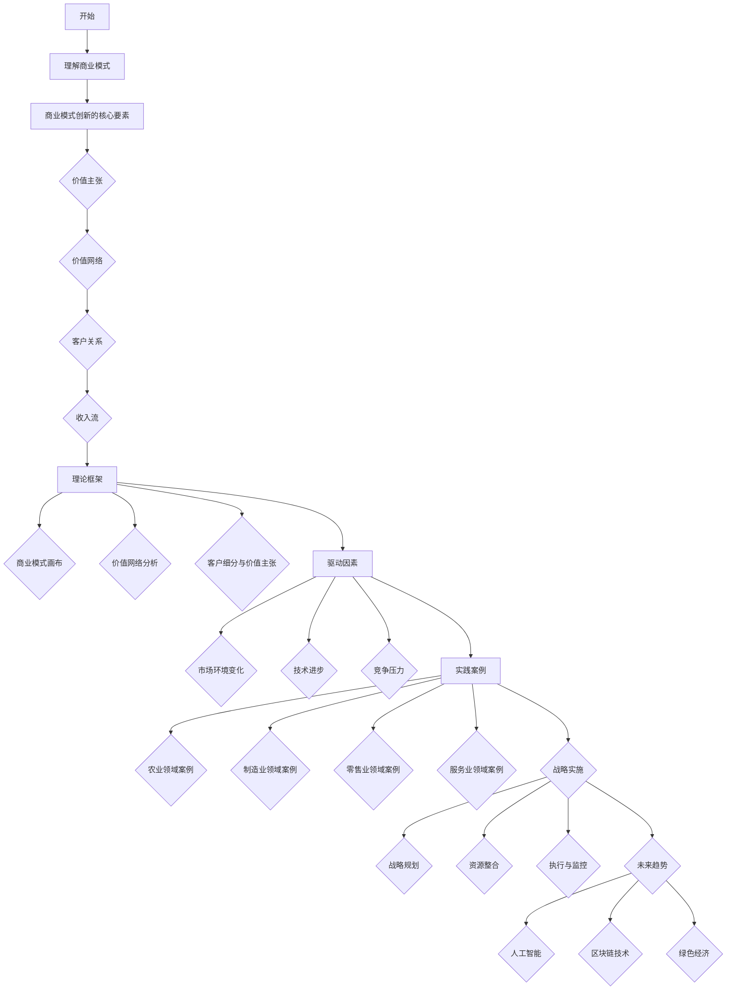

                 

# 《创业路上的商业模式创新：在传统行业中开辟新蓝海的方法》

## 关键词：商业模式创新、传统行业、新蓝海、战略实施、案例分析

## 摘要：
在当前全球经济环境复杂多变的背景下，传统行业面临着巨大的挑战。为了在激烈的市场竞争中脱颖而出，企业需要不断创新商业模式，以在传统行业中开辟新蓝海。本文从商业模式创新的基本理论、实践案例以及未来趋势三个方面，详细探讨了在传统行业中实现商业模式创新的方法和策略。

## 目录

### 《创业路上的商业模式创新：在传统行业中开辟新蓝海的方法》目录大纲

#### 第一部分：商业模式创新的基本理论

##### 第1章：商业模式创新的概念与价值
- 1.1 商业模式创新的定义与特征
- 1.2 商业模式创新的重要性
- 1.3 商业模式创新的基本原则

##### 第2章：商业模式创新的理论框架
- 2.1 商业模式创新的核心要素
- 2.2 商业模式创新的基本模型
- 2.3 商业模式创新的路径与方法

##### 第3章：商业模式创新的驱动因素
- 3.1 市场环境变化与商业模式创新
- 3.2 技术进步与商业模式创新
- 3.3 竞争压力与商业模式创新

#### 第二部分：传统行业的商业模式创新实践

##### 第4章：农业领域的商业模式创新
- 4.1 农业产业链的重构与创新
- 4.2 农产品电商的发展与模式创新
- 4.3 农业大数据的应用与商业模式创新

##### 第5章：制造业的商业模式创新
- 5.1 制造业服务化转型的模式创新
- 5.2 智能制造与工业互联网的商业模式创新
- 5.3 供应链金融在制造业的应用与模式创新

##### 第6章：零售业的商业模式创新
- 6.1 零售业数字化转型与创新
- 6.2 社交电商与直播电商的商业模式创新
- 6.3 新零售模式下的商业逻辑与模式创新

##### 第7章：服务业的商业模式创新
- 7.1 服务业共享经济的发展与模式创新
- 7.2 旅游业的商业模式创新与创新发展
- 7.3 教育行业的互联网+模式创新

#### 第三部分：商业模式创新的战略实施与案例研究

##### 第8章：商业模式创新的战略规划与实施
- 8.1 商业模式创新战略的制定
- 8.2 商业模式创新的资源整合
- 8.3 商业模式创新的执行与监控

##### 第9章：商业模式创新的案例分析
- 9.1 案例一：某农业电商平台的商业模式创新
- 9.2 案例二：某制造业企业服务化转型的商业模式创新
- 9.3 案例三：某零售企业的社交电商模式创新

##### 第10章：商业模式创新的未来趋势
- 10.1 人工智能与商业模式创新
- 10.2 区块链技术对商业模式的影响
- 10.3 绿色经济与可持续发展的商业模式创新

#### 附录

- 附录A：商业模式创新相关的理论模型与工具
  - A.1 商业模式画布
  - A.2 价值网络分析
  - A.3 客户细分与价值主张

- 附录B：商业模式创新案例库
  - B.1 农业领域案例
  - B.2 制造业领域案例
  - B.3 零售业领域案例
  - B.4 服务业领域案例

### 第1章：商业模式创新的概念与价值

## 1.1 商业模式创新的定义与特征

### 1.1.1 商业模式的定义

商业模式（Business Model）是指企业通过其运营方式来创造、传递和获取价值的一种机制。它是企业战略规划的重要组成部分，决定了企业如何利用资源、配置资产以及与外部环境互动的方式。一个有效的商业模式需要明确以下几个关键问题：

1. **客户价值主张**：企业向客户提供什么样的产品或服务，能够满足客户的需求和期望。
2. **收入来源**：企业如何从客户那里获取收入，包括销售、订阅、服务费等。
3. **关键资源**：企业需要哪些资源来支持其商业模式的有效运行，如资金、技术、人才、品牌等。
4. **关键合作伙伴**：企业需要与哪些合作伙伴建立合作关系，以实现资源的有效整合和业务的协同发展。
5. **成本结构**：企业的运营成本是如何构成的，如何通过有效的成本管理来实现盈利。

### 1.1.2 商业模式创新的特点

商业模式创新具有以下几个显著特点：

1. **动态性**：商业模式不是一成不变的，它需要随着市场环境、技术进步和客户需求的变化而不断调整和优化。
2. **整体性**：商业模式是由多个相互关联的元素组成的复杂系统，任何一个元素的变动都会影响整个模式的效果。
3. **可持续性**：商业模式创新不仅要考虑短期内的盈利能力，还要确保其具有长期的可持续性和竞争力。

### 1.1.3 商业模式创新的重要性

商业模式创新对企业的长远发展具有至关重要的意义：

1. **增强竞争力**：通过创新商业模式，企业可以在市场中找到新的价值点，从而形成独特的竞争优势。
2. **提高效率**：商业模式创新有助于企业优化资源分配和运营流程，提高整体运营效率。
3. **推动产业升级**：商业模式创新可以推动传统产业的转型升级，促进经济的高质量发展。

### 1.1.4 商业模式创新的基本原则

在进行商业模式创新时，企业应遵循以下几个基本原则：

1. **以客户为中心**：商业模式创新应始终关注客户需求，提供更好的产品和服务。
2. **创新与风险平衡**：在创新过程中，需要平衡创新与风险，确保创新的可行性。
3. **跨界融合**：通过跨界合作，可以实现资源和能力的最大化利用，推动商业模式创新。

## 1.2 商业模式创新的理论框架

### 2.1 商业模式创新的核心要素

### 2.1.1 价值主张

价值主张（Value Proposition）是企业为其目标客户提供的独特价值。它是商业模式创新的核心，决定了客户为什么选择你的产品或服务。一个有效的价值主张应具备以下几个特点：

1. **明确性**：清晰地传达产品或服务的核心价值，使客户一目了然。
2. **差异化**：与竞争对手的产品或服务形成明显差异，突出你的独特优势。
3. **可量化**：尽量用数据和事实来支持价值主张，使其具有可度量性。
4. **可持续性**：价值主张应能够在长期内持续提供，以保持客户的忠诚度。

### 2.1.2 价值网络

价值网络（Value Network）是指企业与其供应商、合作伙伴、客户等利益相关者之间的互动关系。一个有效的价值网络能够帮助企业实现资源的优化配置和价值的最大化。价值网络的主要特点包括：

1. **开放性**：企业应与外部合作伙伴建立开放的合作关系，以实现资源共享和协同创新。
2. **协同性**：通过协同合作，企业可以共同应对市场变化，提高竞争力。
3. **灵活性**：价值网络应具有灵活性，以适应市场环境和客户需求的变化。

### 2.1.3 客户关系

客户关系（Customer Relationship）是指企业与客户之间的互动方式和关系管理。有效的客户关系管理能够提高客户的满意度和忠诚度，从而为企业带来持续的业务增长。客户关系管理的主要策略包括：

1. **个性化服务**：根据客户的需求和偏好提供个性化的产品和服务。
2. **持续沟通**：与客户保持密切的沟通，了解他们的需求和反馈，及时调整业务策略。
3. **客户价值提升**：通过不断优化产品和服务，提升客户的价值感知。

### 2.1.4 收入流

收入流（Revenue Streams）是指企业通过提供产品或服务所获得的收入。一个健康的收入流是商业模式成功的关键。企业应根据市场需求和自身能力，制定多样化的收入流策略。收入流的主要策略包括：

1. **多元化**：通过多种收入来源降低风险，提高盈利能力。
2. **持续增长**：通过不断创新和提高服务质量，实现收入流的持续增长。
3. **优化定价**：合理定价，确保收入的最大化。

### 2.2 商业模式创新的基本模型

### 2.2.1 商业模式画布

商业模式画布（Business Model Canvas）是一种可视化工具，用于描述企业的商业模式。它包括9个核心要素：客户细分、价值主张、渠道、客户关系、收入流、关键资源、关键活动、关键合作伙伴和成本结构。通过商业模式画布，企业可以清晰地了解自身的商业模式，并进行有效的创新和优化。

### 2.2.2 价值网络分析

价值网络分析（Value Network Analysis）是一种用于分析商业模式中各参与方互动关系的方法。它通过识别价值网络中的关键节点和关系，帮助企业优化资源配置和业务流程。价值网络分析的主要步骤包括：

1. **识别参与方**：确定商业模式中的所有参与方，包括供应商、合作伙伴、客户等。
2. **分析互动关系**：分析各参与方之间的互动关系，确定价值创造的路径。
3. **优化价值网络**：根据分析结果，优化价值网络中的资源配置和业务流程。

### 2.2.3 客户细分与价值主张

客户细分（Customer Segmentation）是将市场划分为不同群体的过程，以便更准确地满足客户需求。有效的客户细分有助于企业提高营销效率和服务质量。客户细分的主要策略包括：

1. **基于需求**：根据客户的需求和偏好进行细分。
2. **基于行为**：根据客户的行为特征进行细分。
3. **基于人口统计**：根据客户的人口统计特征进行细分。

### 2.3 商业模式创新的路径与方法

### 2.3.1 借鉴与创新

借鉴与创新（Copy and Innovation）是一种常见的商业模式创新方法。企业可以通过借鉴其他企业的成功经验，结合自身实际情况进行创新。借鉴与创新的主要步骤包括：

1. **选择案例**：选择具有代表性的商业模式创新案例进行学习。
2. **分析案例**：分析案例中的成功要素和创新点。
3. **实施创新**：结合自身实际情况，实施创新，并不断优化。

### 2.3.2 跨界合作

跨界合作（Cross-border Collaboration）是通过与其他行业的企业合作，实现资源共享和优势互补的一种商业模式创新方法。跨界合作的主要策略包括：

1. **寻找合作伙伴**：寻找具有互补优势的合作伙伴。
2. **明确合作目标**：明确合作的目标和愿景，确保合作的有效性。
3. **建立合作关系**：建立长期稳定的合作关系，实现互利共赢。

### 2.3.3 技术驱动

技术驱动（Technology-driven）是通过利用新技术，如互联网、人工智能、大数据等，推动商业模式创新的一种方法。技术驱动的主要策略包括：

1. **识别技术趋势**：了解最新的技术趋势，确定对企业商业模式创新的有利因素。
2. **技术应用**：将新技术应用于企业运营的各个环节，提高效率和服务质量。
3. **创新模式**：通过技术创新，探索新的商业模式和盈利模式。

### 第3章：商业模式创新的驱动因素

#### 3.1 市场环境变化与商业模式创新

##### 3.1.1 市场需求的变化

市场需求的变化是商业模式创新的重要驱动因素之一。随着消费者需求的多样化和个性化，企业需要不断调整和优化其商业模式，以满足客户的需求。市场需求变化主要体现在以下几个方面：

1. **消费升级**：随着经济的发展，消费者对产品和服务的要求越来越高，追求高品质、个性化、便捷的消费体验。
2. **消费习惯的变化**：互联网和移动设备的普及，改变了消费者的购物方式和消费习惯，促使企业向线上化、智能化方向发展。
3. **环境可持续性**：消费者越来越关注环境保护和可持续发展，对企业提出了更高的社会责任要求。

##### 3.1.2 竞争环境的变化

竞争环境的变化也是推动商业模式创新的重要因素。在竞争激烈的市场中，企业需要通过不断创新，以保持竞争优势。竞争环境的变化主要体现在以下几个方面：

1. **新进入者的威胁**：新进入者往往具有创新性、灵活性，给现有企业带来巨大的竞争压力。
2. **替代品的威胁**：替代品的兴起可能会改变市场的竞争格局，迫使企业进行商业模式创新。
3. **竞争者策略的变化**：竞争者的策略变化，如价格战、产品创新等，也会促使企业进行商业模式创新。

##### 3.1.3 法规政策的变化

法规政策的变化可能会对企业的商业模式产生重大影响。企业需要密切关注政策变化，并及时调整其商业模式，以适应新的法规要求。法规政策的变化主要体现在以下几个方面：

1. **市场监管**：市场监管政策的加强，如反垄断法、数据保护法等，可能对企业的商业模式产生影响。
2. **行业规范**：行业规范的制定和实施，如电子商务法、跨境电商条例等，可能改变企业的运营模式和盈利模式。
3. **政策扶持**：政府对某些行业或企业的政策扶持，如税收优惠、补贴等，可能为企业提供新的发展机遇。

#### 3.2 技术进步与商业模式创新

##### 3.2.1 信息技术的发展

信息技术的发展为商业模式创新提供了强大的支持。信息技术，如互联网、大数据、人工智能等，不仅可以提高企业的运营效率，还可以为企业创造新的商业模式。信息技术的发展主要体现在以下几个方面：

1. **在线化**：互联网的普及使企业可以在线提供产品和服务，打破了地域和时间的限制。
2. **智能化**：人工智能技术的应用，如自然语言处理、机器学习等，可以为企业提供智能化的解决方案，提高决策效率。
3. **数据化**：大数据技术的应用，如数据分析、数据挖掘等，可以帮助企业更好地了解市场和客户需求，优化业务流程。

##### 3.2.2 物联网的应用

物联网（IoT）的应用正在改变企业的商业模式。物联网通过将物理设备与互联网连接，实现设备的智能化和互联互通，为企业提供了新的业务模式和盈利模式。物联网的应用主要体现在以下几个方面：

1. **智能设备**：物联网使设备可以互联互通，实现智能化管理，提高设备的使用效率和安全性。
2. **远程监控**：物联网可以实现设备的远程监控和维护，减少人力成本，提高服务效率。
3. **产业链协同**：物联网可以将产业链上下游的企业连接起来，实现信息共享和协同作业，提高整体运营效率。

##### 3.2.3 人工智能的发展

人工智能（AI）的发展正在深刻改变企业的商业模式。人工智能通过模拟人类智能，实现自动化决策和智能服务，为企业提供了新的商业模式和盈利机会。人工智能的发展主要体现在以下几个方面：

1. **自动化**：人工智能可以自动化执行复杂的任务，提高工作效率，降低运营成本。
2. **个性化**：人工智能可以根据用户行为和需求，提供个性化的产品和服务，提高用户满意度。
3. **预测分析**：人工智能可以通过大数据分析和预测，帮助企业更好地了解市场趋势和客户需求，制定更有针对性的战略。

#### 3.3 竞争压力与商业模式创新

##### 3.3.1 市场竞争的加剧

市场竞争的加剧是推动商业模式创新的一个重要因素。在激烈的市场竞争中，企业需要通过不断创新，以保持竞争优势。市场竞争的加剧主要体现在以下几个方面：

1. **产品同质化**：市场上的产品和服务日益同质化，企业需要通过创新来突出自身的特色和优势。
2. **价格竞争**：价格竞争激烈，企业需要通过降低成本和提高效率来保持竞争力。
3. **消费者需求多样化**：消费者需求日益多样化，企业需要提供多样化的产品和服务来满足不同客户的需求。

##### 3.3.2 竞争对手的威胁

竞争对手的威胁也是推动商业模式创新的重要因素。企业需要密切关注竞争对手的动态，通过创新来应对竞争对手的挑战。竞争对手的威胁主要体现在以下几个方面：

1. **技术领先**：竞争对手在技术上的领先可能会削弱企业的竞争优势。
2. **创新策略**：竞争对手的创新策略可能会改变市场格局，迫使企业进行商业模式创新。
3. **市场份额**：竞争对手在市场份额上的优势可能会对企业的生存和发展造成威胁。

##### 3.3.3 企业自身的转型需求

企业自身的转型需求也是推动商业模式创新的一个重要因素。企业为了适应市场环境的变化和自身的可持续发展，需要不断调整和优化其商业模式。企业自身的转型需求主要体现在以下几个方面：

1. **战略调整**：企业需要根据市场环境和自身战略进行商业模式调整，以实现更好的发展。
2. **技术创新**：企业需要通过技术创新来推动商业模式创新，提高运营效率和服务质量。
3. **管理变革**：企业需要通过管理变革来推动商业模式创新，提高组织效率和创新能力。

### 第4章：农业领域的商业模式创新

#### 4.1 农业产业链的重构与创新

##### 4.1.1 农业产业链的优化

农业产业链的优化是农业商业模式创新的重要方向。传统的农业产业链相对较长，涉及种植、生产、加工、运输、销售等环节，各环节之间存在信息不对称、效率低下等问题。通过优化农业产业链，可以提高整个产业链的运行效率，降低成本，提高产品附加值。农业产业链的优化主要体现在以下几个方面：

1. **供应链管理**：通过信息化手段，实现供应链的透明化、智能化管理，降低供应链风险。
2. **农产品的分级、包装、运输**：通过标准化、规范化的流程，提高农产品的品质和市场竞争力。
3. **农产品的品牌建设**：通过品牌建设，提高农产品的附加值，增强市场影响力。

##### 4.1.2 农产品电商的发展与模式创新

农产品电商的发展是农业商业模式创新的一个重要趋势。随着互联网技术的普及和消费者对农产品品质要求的提高，农产品电商市场迅速扩大。农产品电商的发展模式创新主要体现在以下几个方面：

1. **线上与线下的融合**：通过线上线下结合的方式，提高农产品的销售渠道和覆盖面。
2. **平台经济**：建立农产品电商平台，提供农产品信息发布、交易、物流等一站式服务。
3. **直播电商**：利用直播电商平台，实现农产品与消费者的实时互动，提高销售效果。

##### 4.1.3 农业大数据的应用与商业模式创新

农业大数据的应用是农业商业模式创新的一个重要方向。农业大数据通过收集、分析和利用农业生产、市场、环境等数据，可以帮助企业更好地了解市场趋势和消费者需求，优化生产决策，提高经营效率。农业大数据的应用主要体现在以下几个方面：

1. **种植计划优化**：通过大数据分析，优化种植计划，提高产量和质量。
2. **病虫害监测**：利用大数据技术，实时监测病虫害情况，提前预警，减少损失。
3. **市场分析**：通过大数据分析，了解市场趋势和消费者需求，制定更有针对性的营销策略。

#### 4.2 农产品电商的发展与模式创新

##### 4.2.1 农产品电商的兴起

农产品电商的兴起是农业商业模式创新的一个重要趋势。随着互联网技术的普及和消费者对农产品品质要求的提高，农产品电商市场迅速扩大。农产品电商的兴起主要体现在以下几个方面：

1. **消费者需求**：消费者对农产品品质和安全性的要求提高，推动了农产品电商的发展。
2. **政策支持**：政府对农产品电商的支持和鼓励，为农产品电商的发展提供了良好的政策环境。
3. **技术创新**：互联网、大数据、人工智能等技术的应用，为农产品电商提供了强大的技术支持。

##### 4.2.2 农产品电商的运营模式

农产品电商的运营模式包括B2B、B2C等多种形式。不同模式的农产品电商在运营策略、市场定位、客户群体等方面存在一定的差异。

1. **B2B模式**：B2B模式主要面向农业生产者和批发商，通过电商平台实现农产品的在线交易。该模式具有交易量大、流通速度快等特点。
2. **B2C模式**：B2C模式主要面向终端消费者，通过电商平台直接销售农产品。该模式具有销售渠道广、客户黏性强等特点。

##### 4.2.3 农产品电商的营销策略

农产品电商的营销策略需要结合农产品特点进行创新。有效的营销策略可以提高农产品电商的知名度和销售额。

1. **品牌营销**：通过建立农产品品牌，提高产品的附加值和市场竞争力。
2. **社交媒体营销**：利用社交媒体平台，进行产品推广和用户互动，提高品牌曝光度。
3. **直播营销**：通过直播平台，与消费者进行实时互动，提高销售转化率。

#### 4.3 农业大数据的应用与商业模式创新

##### 4.3.1 农业大数据的价值

农业大数据通过收集、分析和利用农业生产、市场、环境等数据，为农业企业提供决策支持和业务优化。农业大数据的价值主要体现在以下几个方面：

1. **提高生产效率**：通过大数据分析，优化种植计划、施肥、灌溉等生产环节，提高产量和质量。
2. **降低生产成本**：通过大数据分析，优化生产流程，降低生产成本。
3. **提高市场竞争力**：通过大数据分析，了解市场趋势和消费者需求，制定更有针对性的营销策略。

##### 4.3.2 农业大数据的应用场景

农业大数据的应用场景非常广泛，包括种植计划、病虫害监测、市场分析等。

1. **种植计划**：通过大数据分析，根据土壤、气候等条件，制定最优的种植计划，提高产量和质量。
2. **病虫害监测**：通过大数据分析，实时监测病虫害情况，提前预警，减少损失。
3. **市场分析**：通过大数据分析，了解市场趋势和消费者需求，制定更有针对性的营销策略。

##### 4.3.3 农业大数据的商业化模式

农业大数据的商业化模式包括数据服务、精准农业等。

1. **数据服务**：农业企业可以通过购买大数据服务，了解市场趋势和消费者需求，优化生产决策。
2. **精准农业**：通过大数据分析，实现精准农业，提高产量和质量。

### 第5章：制造业的商业模式创新

#### 5.1 制造业服务化转型的模式创新

##### 5.1.1 制造业服务化转型的背景

制造业服务化转型是制造业发展的重要趋势。随着消费者需求的多样化和技术进步，制造业企业开始从单纯的产品制造转向提供整体解决方案，实现从产品导向向服务导向的转变。

1. **消费者需求的变化**：消费者对产品功能、品质、服务的要求越来越高，推动了制造业服务化转型。
2. **技术进步**：物联网、大数据、人工智能等技术的应用，为制造业服务化转型提供了技术支持。
3. **市场竞争压力**：市场竞争的加剧，迫使制造业企业寻找新的增长点和竞争优势。

##### 5.1.2 制造业服务化转型的模式

制造业服务化转型包括产品服务化、解决方案服务等模式。

1. **产品服务化**：将产品与服务相结合，为客户提供一站式的解决方案。例如，家电企业不仅提供产品，还提供安装、维修、保养等服务。
2. **解决方案服务**：为客户提供定制化的解决方案，帮助企业提高生产效率、降低成本。例如，设备制造商为客户提供智能制造解决方案。

##### 5.1.3 制造业服务化转型的挑战与机遇

制造业服务化转型面临一系列挑战，同时也带来了新的机遇。

1. **挑战**：
   - **组织变革**：服务化转型需要企业调整组织结构和管理模式，实现从产品制造向服务提供的转变。
   - **技术要求**：服务化转型要求企业具备较高的技术水平，以提供高质量的服务。
   - **客户关系管理**：服务化转型要求企业加强与客户的沟通和合作，建立长期的客户关系。

2. **机遇**：
   - **新的增长点**：服务化转型为企业提供了新的盈利模式和发展空间。
   - **提升竞争力**：通过提供高质量的服务，企业可以提高市场竞争力，赢得更多客户。
   - **产业链协同**：服务化转型可以促进产业链上下游企业的协同合作，实现资源优化配置。

#### 5.2 智能制造与工业互联网的商业模式创新

##### 5.2.1 智能制造的发展

智能制造是制造业发展的重要方向。智能制造通过物联网、大数据、人工智能等技术的应用，实现生产过程的自动化、智能化和数字化，提高生产效率和产品质量。

1. **自动化生产**：通过自动化设备和机器人，实现生产过程的自动化，提高生产效率。
2. **数字化管理**：通过物联网和大数据技术，实现生产过程的实时监控和数据管理，提高管理水平。
3. **智能化决策**：通过人工智能技术，实现生产过程的智能化决策，提高生产效率和产品质量。

##### 5.2.2 工业互联网的应用

工业互联网通过将设备、工厂、供应链等连接起来，实现互联互通和智能协同，为制造业提供新的商业模式。

1. **互联互通**：通过物联网技术，实现设备、工厂、供应链的互联互通，提高信息传递效率。
2. **智能协同**：通过大数据和人工智能技术，实现生产过程的智能协同，提高生产效率和产品质量。
3. **产业链优化**：通过工业互联网，实现产业链上下游企业的协同合作，优化产业链结构，提高产业链整体效率。

##### 5.2.3 智能制造与工业互联网的商业模式创新案例

智能制造与工业互联网的商业模式创新在制造业中得到了广泛应用。以下是一些典型的案例：

1. **设备租赁**：企业通过租赁设备，为客户提供生产服务，实现设备价值的最大化。
2. **按需生产**：企业根据客户需求，实现定制化生产，提高生产效率和客户满意度。
3. **供应链金融**：通过工业互联网，实现供应链各环节的金融业务，降低融资成本，提高供应链效率。

#### 5.3 供应链金融在制造业的应用与模式创新

##### 5.3.1 供应链金融的概念

供应链金融是指通过金融手段支持供应链的融资，解决供应链中企业资金周转困难的问题。供应链金融的主要参与者包括核心企业、金融机构和上下游企业。

1. **核心企业**：在供应链中拥有较强实力的企业，通常具备较好的信用和资金实力。
2. **金融机构**：为供应链金融提供资金支持和金融服务，包括银行、信托、基金等。
3. **上下游企业**：供应链中的中小企业，通常面临资金周转困难的问题。

##### 5.3.2 供应链金融在制造业的应用

供应链金融在制造业中具有广泛的应用。通过供应链金融，可以解决制造业企业特别是中小企业的融资难题，提高供应链整体效率。

1. **发票融资**：企业通过出售应收发票获得融资，缓解资金压力。
2. **订单融资**：企业根据订单获得融资，实现订单的提前交付。
3. **存货融资**：企业通过存货质押获得融资，提高存货的流动性。

##### 5.3.3 供应链金融的商业模式创新

供应链金融的商业模式创新主要体现在以下几个方面：

1. **区块链技术**：通过区块链技术，实现供应链金融的交易透明、数据可靠，提高融资效率。
2. **供应链金融平台**：建立供应链金融平台，实现供应链中各环节的金融业务，提高供应链整体效率。
3. **金融科技应用**：通过金融科技的应用，如人工智能、大数据等，提高供应链金融的风险控制能力。

### 第6章：零售业的商业模式创新

#### 6.1 零售业数字化转型与创新

##### 6.1.1 零售业数字化转型的背景

零售业数字化转型是应对市场变化和消费者需求的重要举措。随着互联网、大数据、人工智能等技术的发展，零售业正经历着前所未有的变革。

1. **消费者需求变化**：消费者对购物体验和商品品质的要求不断提高，推动了零售业数字化转型。
2. **技术进步**：互联网、大数据、人工智能等技术的应用，为零售业提供了强大的技术支持。
3. **市场竞争压力**：电商的崛起和线下零售的竞争压力，迫使传统零售企业进行数字化转型。

##### 6.1.2 零售业数字化转型的方向

零售业数字化转型包括线上化、智能化、个性化等方向。

1. **线上化**：通过建立电商平台，实现线上购物、支付、物流等业务，提高销售渠道的覆盖面。
2. **智能化**：通过人工智能、大数据等技术，实现智能推荐、智能客服、智能营销等，提高运营效率和服务质量。
3. **个性化**：通过大数据分析，了解消费者行为和偏好，提供个性化的产品和服务，提高客户满意度。

##### 6.1.3 零售业数字化转型的挑战与机遇

零售业数字化转型面临一系列挑战，同时也带来了新的机遇。

1. **挑战**：
   - **技术投入**：数字化转型需要大量资金和人力资源的投入。
   - **数据安全**：数据安全是数字化转型过程中需要关注的重要问题。
   - **人才培养**：数字化转型需要具备新技术应用能力的人才。

2. **机遇**：
   - **新的增长点**：数字化转型为企业提供了新的商业模式和盈利点。
   - **提升竞争力**：通过数字化转型，企业可以提高运营效率和服务质量，增强市场竞争力。
   - **产业链协同**：数字化转型可以促进产业链上下游企业的协同合作，实现资源优化配置。

#### 6.2 社交电商与直播电商的商业模式创新

##### 6.2.1 社交电商的发展

社交电商是零售业商业模式创新的一个重要方向。通过社交媒体平台，企业可以与消费者进行互动，实现线上购物的社交化。

1. **互动性**：社交电商通过社交媒体平台，实现企业与消费者的实时互动，提高客户黏性。
2. **口碑传播**：社交电商可以通过用户评价和推荐，实现口碑传播，提高品牌影响力。
3. **个性化推荐**：通过大数据分析，社交电商可以为用户提供个性化的产品推荐，提高购买转化率。

##### 6.2.2 直播电商的兴起

直播电商是社交电商的一种新形式，具有很大的发展潜力。通过直播，企业可以与消费者进行实时互动，展示产品，提高购买转化率。

1. **实时互动**：直播电商通过直播平台，实现企业与消费者的实时互动，提高购买体验。
2. **产品展示**：直播电商可以通过直播展示产品，提高产品的可视化和可信度。
3. **互动营销**：直播电商可以通过互动环节，如抽奖、秒杀等，提高购买转化率。

##### 6.2.3 社交电商与直播电商的商业模式创新

社交电商与直播电商的商业模式创新主要体现在以下几个方面：

1. **内容营销**：通过制作有趣、有价值的内容，吸引用户关注，提高品牌知名度。
2. **社群营销**：通过建立社群，实现用户之间的互动和分享，提高用户黏性。
3. **直播带货**：通过直播带货，实现实时销售，提高销售额。

#### 6.3 新零售模式下的商业逻辑与模式创新

##### 6.3.1 新零售的概念

新零售是线上线下融合的一种新型商业模式，通过数据驱动、智能技术和个性化服务，实现消费者体验的提升和商业效率的提高。

1. **数据驱动**：新零售通过大数据分析，了解消费者行为和偏好，实现个性化推荐和精准营销。
2. **智能技术**：新零售利用人工智能、物联网等技术，实现智能推荐、智能客服、智能配送等，提高运营效率。
3. **个性化服务**：新零售通过了解消费者需求，提供个性化的产品和服务，提高客户满意度。

##### 6.3.2 新零售模式下的商业逻辑

新零售模式下的商业逻辑主要体现在以下几个方面：

1. **全渠道融合**：通过线上线下融合，实现消费者购物体验的统一和无缝衔接。
2. **数据驱动**：通过大数据分析，实现消费者需求的精准把握和个性化服务。
3. **供应链协同**：通过供应链的协同，实现库存优化、配送效率提升和成本降低。

##### 6.3.3 新零售模式创新案例

新零售模式创新案例包括盒马鲜生、京东之家等。

1. **盒马鲜生**：通过线上线下融合，提供一小时达的购物体验，实现消费者购物便捷化。
2. **京东之家**：通过线上线下融合，提供智能家居体验，实现消费者一站式购物。

### 第7章：服务业的商业模式创新

#### 7.1 服务业共享经济的发展与模式创新

##### 7.1.1 服务业共享经济的兴起

服务业共享经济是服务业商业模式创新的重要方向。通过共享平台，企业可以共享资源和服务，提高资源利用效率。

1. **资源共享**：服务业共享经济通过共享平台，实现资源的高效利用，降低企业的运营成本。
2. **服务灵活**：服务业共享经济提供灵活的服务模式，满足不同用户的需求。
3. **平台经济**：服务业共享经济通过建立共享平台，实现服务的规模化、网络化运营。

##### 7.1.2 服务业共享经济的模式

服务业共享经济的模式包括平台经济、共享住宿、共享出行等。

1. **平台经济**：通过建立共享平台，实现供需双方的信息匹配和交易。
2. **共享住宿**：通过共享住宿平台，实现房源的共享，提高房源利用率。
3. **共享出行**：通过共享出行平台，实现车辆资源的共享，提高交通效率。

##### 7.1.3 服务业共享经济的商业模式创新

服务业共享经济的商业模式创新主要体现在以下几个方面：

1. **数据驱动**：通过大数据分析，实现用户需求的精准把握和服务优化。
2. **智能化**：通过人工智能、物联网等技术，实现服务的智能化和高效化。
3. **生态系统**：通过构建生态系统，实现服务生态的共生共荣。

#### 7.2 旅游业的商业模式创新与创新发展

##### 7.2.1 旅游业的商业模式创新

旅游业的商业模式创新主要体现在以下几个方面：

1. **在线旅游平台**：通过在线旅游平台，实现旅游产品的在线预订和支付，提高旅游体验。
2. **目的地管理**：通过目的地管理平台，实现旅游资源的整合和推广，提高旅游目的地的吸引力。
3. **定制旅游**：通过定制旅游平台，实现旅游产品的个性化定制，满足不同游客的需求。

##### 7.2.2 旅游业的创新发展

旅游业的创新发展主要体现在以下几个方面：

1. **智慧旅游**：通过智慧旅游平台，实现旅游过程的智能化，提高旅游体验。
2. **主题旅游**：通过主题旅游，如文化旅游、生态旅游等，实现旅游产品的多样化。
3. **生态旅游**：通过生态旅游，实现旅游与环境保护的结合，推动可持续旅游发展。

##### 7.2.3 旅游业的商业模式创新案例

旅游业的商业模式创新案例包括携程、爱彼迎等。

1. **携程**：通过在线旅游平台，实现旅游产品的在线预订和支付，提高旅游体验。
2. **爱彼迎**：通过共享住宿平台，实现房源的共享，提高房源利用率。

#### 7.3 教育行业的互联网+模式创新

##### 7.3.1 教育行业的互联网+

教育行业的互联网+是指利用互联网技术推动教育行业的创新。通过互联网技术，教育行业可以实现教学模式的创新、学习方式的变革和资源的优化配置。

1. **在线教育**：通过在线教育平台，实现教育资源的在线共享和远程教学，提高教育普及率。
2. **智能学习**：通过智能学习平台，实现个性化学习路径和学习资源的推荐，提高学习效果。
3. **教育大数据**：通过教育大数据分析，实现学生学习情况和学习需求的精准把握，优化教育资源分配。

##### 7.3.2 教育行业的互联网+模式

教育行业的互联网+模式主要包括在线教育、智能学习和教育大数据等。

1. **在线教育**：通过在线教育平台，实现教育资源的在线共享和远程教学，提高教育普及率。
2. **智能学习**：通过智能学习平台，实现个性化学习路径和学习资源的推荐，提高学习效果。
3. **教育大数据**：通过教育大数据分析，实现学生学习情况和学习需求的精准把握，优化教育资源分配。

##### 7.3.3 教育行业的互联网+案例

教育行业的互联网+案例包括好未来、网易云课堂等。

1. **好未来**：通过在线教育平台，实现教育资源的在线共享和远程教学，提高教育普及率。
2. **网易云课堂**：通过智能学习平台，实现个性化学习路径和学习资源的推荐，提高学习效果。

### 第8章：商业模式创新的战略实施与案例研究

#### 8.1 商业模式创新战略的制定

##### 8.1.1 商业模式创新战略的重要性

商业模式创新战略是企业实现可持续发展的关键。通过制定明确的商业模式创新战略，企业可以把握市场机遇，应对市场挑战，实现长期的竞争优势。

1. **把握市场机遇**：商业模式创新战略可以帮助企业及时发现市场变化和消费者需求，把握市场机遇。
2. **应对市场挑战**：商业模式创新战略可以帮助企业应对市场竞争压力，找到新的增长点和盈利模式。
3. **实现长期竞争优势**：商业模式创新战略可以帮助企业建立独特的商业模式，形成长期的竞争优势。

##### 8.1.2 商业模式创新战略的制定流程

制定商业模式创新战略的流程主要包括以下几个步骤：

1. **市场分析**：分析市场需求、竞争对手、市场趋势等，了解市场环境和竞争态势。
2. **内部能力评估**：评估企业的内部资源、能力、优势等，确定企业的核心竞争力和发展潜力。
3. **目标设定**：根据市场分析和内部能力评估，设定企业的商业模式创新目标和战略方向。
4. **策略制定**：制定具体的商业模式创新策略，包括价值主张、收入流、关键资源等。
5. **实施计划**：制定商业模式创新战略的实施计划，明确实施步骤、责任分工和时间节点。

##### 8.1.3 商业模式创新战略的实施策略

商业模式创新战略的实施策略主要包括以下几个方面：

1. **资源配置**：根据商业模式创新战略的需要，合理配置企业资源，包括资金、人力、技术等。
2. **组织调整**：根据商业模式创新战略的需要，调整企业组织结构和管理模式，实现组织协同和创新。
3. **激励机制**：建立激励机制，鼓励员工参与商业模式创新，提高创新积极性。
4. **风险管理**：识别和评估商业模式创新过程中的风险，制定风险应对策略，确保创新的安全性和可行性。

#### 8.2 商业模式创新的资源整合

##### 8.2.1 商业模式创新资源的重要性

商业模式创新资源是企业实现商业模式创新的基础。有效的资源整合可以最大化地利用企业内外部资源，提高商业模式创新的成功率。

1. **内部资源**：包括企业的资金、技术、人才、品牌等，是企业进行商业模式创新的核心资源。
2. **外部资源**：包括合作伙伴、客户、供应商等，是企业进行商业模式创新的重要资源。

##### 8.2.2 商业模式创新资源的获取途径

商业模式创新资源的获取途径主要包括以下几个方面：

1. **内部开发**：通过企业内部的研发和创新活动，开发和掌握核心技术，形成竞争优势。
2. **外部合作**：通过与其他企业的合作，共享资源和经验，提高商业模式创新的效率。
3. **并购重组**：通过并购和重组，获取其他企业的优质资源和能力，快速实现商业模式创新。
4. **平台建设**：建立共享平台，实现资源的高效配置和协同创新。

##### 8.2.3 商业模式创新资源的整合策略

商业模式创新资源的整合策略主要包括以下几个方面：

1. **协同创新**：通过内部协同创新，实现资源的优化配置和协同效应。
2. **跨界合作**：通过跨界合作，实现资源互补和优势整合，推动商业模式创新。
3. **平台化运营**：通过建立共享平台，实现资源的高效配置和协同创新。
4. **生态系统构建**：通过构建生态系统，实现资源整合和产业链协同，推动商业模式创新。

#### 8.3 商业模式创新的执行与监控

##### 8.3.1 商业模式创新执行的关键环节

商业模式创新执行的关键环节主要包括以下几个方面：

1. **团队建设**：组建专业的商业模式创新团队，明确团队成员的角色和责任，确保创新项目的顺利进行。
2. **项目管理**：制定详细的项目管理计划，明确项目目标、进度、质量等，确保项目按计划推进。
3. **资源调配**：根据商业模式创新的需要，合理调配企业资源，确保创新项目的资源需求得到满足。
4. **风险管理**：识别和评估创新过程中的风险，制定风险应对策略，确保创新的安全性和可行性。

##### 8.3.2 商业模式创新的监控与评估

商业模式创新的监控与评估是确保创新成功的重要环节。有效的监控与评估可以帮助企业及时发现和解决问题，确保商业模式创新项目的顺利进行。

1. **关键指标监控**：制定关键指标，对商业模式创新项目的进度、质量、成本等进行监控，及时发现和解决问题。
2. **绩效评估**：定期对商业模式创新项目的绩效进行评估，分析项目成果，总结经验教训，为后续创新提供参考。
3. **持续改进**：根据监控与评估的结果，持续改进商业模式创新项目，提高项目成功率和效果。

##### 8.3.3 商业模式创新的成功案例

商业模式创新的成功案例可以为其他企业提供宝贵的经验。以下是一些典型的商业模式创新成功案例：

1. **案例一：某农业电商平台的商业模式创新**：通过线上线下融合、农产品供应链优化等，实现商业模式的创新，提高农产品销售额。
2. **案例二：某制造业企业的服务化转型**：通过提供产品服务化、解决方案服务等，实现商业模式的创新，提高企业竞争力。
3. **案例三：某零售企业的社交电商模式创新**：通过社交电商、直播电商等，实现商业模式的创新，提高销售额和用户满意度。

### 第9章：商业模式创新的案例分析

#### 9.1 案例一：某农业电商平台的商业模式创新

##### 9.1.1 案例背景

某农业电商平台成立于2010年，是一家集农产品销售、供应链管理、品牌推广于一体的综合性电商平台。随着互联网技术的普及和消费者对农产品品质要求的提高，该平台开始积极探索商业模式创新，以提高市场竞争力。

##### 9.1.2 商业模式创新的内容

1. **线上线下融合**：通过建立线下体验店，实现线上购物与线下体验的结合，提高用户购物体验。
2. **农产品供应链优化**：通过信息化手段，优化农产品供应链管理，提高供应链效率和产品品质。
3. **品牌推广**：通过媒体宣传、社交媒体推广等方式，提升品牌知名度和美誉度。
4. **个性化定制**：根据用户需求和偏好，提供个性化的农产品定制服务，提高用户满意度。

##### 9.1.3 案例分析

1. **成功原因**：
   - **精准的市场定位**：通过线上线下融合，满足消费者多样化的购物需求。
   - **高效的供应链管理**：通过优化供应链管理，提高农产品流通效率和产品品质。
   - **品牌效应**：通过品牌推广，提升品牌知名度和美誉度，增强用户信任。

2. **对其他企业的启示**：
   - **重视线上线下融合**：通过线上线下融合，提高用户购物体验，满足消费者需求。
   - **优化供应链管理**：通过信息化手段，提高供应链效率和产品品质，增强市场竞争力。
   - **品牌建设**：通过品牌推广，提升品牌知名度和美誉度，增强用户信任。

#### 9.2 案例二：某制造业企业的服务化转型

##### 9.2.1 案例背景

某制造业企业成立于2000年，是一家专注于制造和生产各种机械设备的公司。随着市场竞争的加剧和消费者对产品功能、质量、服务要求的提高，该企业开始探索服务化转型，以提升企业的核心竞争力。

##### 9.2.2 商业模式创新的内容

1. **产品服务化**：将产品与服务相结合，提供设备租赁、维修保养、技术支持等服务。
2. **解决方案服务**：根据客户需求，提供定制化的智能制造解决方案，帮助企业提高生产效率。
3. **客户关系管理**：通过CRM系统，建立与客户的长期合作关系，提供个性化的服务。

##### 9.2.3 案例分析

1. **成功原因**：
   - **市场需求的满足**：通过产品服务化和解决方案服务，满足消费者多样化的需求。
   - **核心竞争力提升**：通过服务化转型，提高企业的核心竞争力，增强市场竞争力。
   - **客户关系管理**：通过CRM系统，建立与客户的长期合作关系，提高客户满意度和忠诚度。

2. **对其他企业的启示**：
   - **关注市场需求**：通过满足消费者需求，提高产品和服务质量，增强市场竞争力。
   - **提升核心竞争力**：通过服务化转型，提高企业的核心竞争力，实现可持续发展。
   - **加强客户关系管理**：通过CRM系统，建立与客户的长期合作关系，提高客户满意度和忠诚度。

#### 9.3 案例三：某零售企业的社交电商模式创新

##### 9.3.1 案例背景

某零售企业成立于2005年，是一家集服饰、家居、美容等产品销售的综合性零售企业。随着社交电商的兴起，该企业开始积极探索社交电商模式，以拓展销售渠道，提高品牌知名度。

##### 9.3.2 商业模式创新的内容

1. **社交电商**：通过社交媒体平台，开展社交电商活动，实现产品推广和销售。
2. **直播带货**：通过直播平台，与消费者进行实时互动，提高购买转化率。
3. **社群营销**：通过建立社群，实现消费者之间的互动和分享，提高品牌影响力。

##### 9.3.3 案例分析

1. **成功原因**：
   - **创新的营销方式**：通过社交电商和直播带货，实现与消费者的实时互动，提高购买体验。
   - **社群营销**：通过社群营销，建立品牌粉丝群体，提高品牌忠诚度。
   - **多元化的销售渠道**：通过线上线下融合，实现销售渠道的多元化，提高销售额。

2. **对其他企业的启示**：
   - **创新营销方式**：通过创新的营销方式，提高与消费者的互动，提高购买转化率。
   - **社群营销**：通过社群营销，建立品牌粉丝群体，提高品牌忠诚度。
   - **销售渠道多元化**：通过线上线下融合，实现销售渠道的多元化，提高销售额。

### 第10章：商业模式创新的未来趋势

#### 10.1 人工智能与商业模式创新

##### 10.1.1 人工智能的发展趋势

人工智能（AI）正在成为推动商业模式创新的重要力量。随着人工智能技术的不断发展，其应用领域越来越广泛，对商业模式的影响也越来越深远。

1. **智能化服务**：人工智能技术可以实现智能化服务，提高服务质量和用户体验。
2. **精准营销**：人工智能技术可以帮助企业实现精准营销，提高市场竞争力。
3. **自动化生产**：人工智能技术在制造业中的应用，可以实现自动化生产，提高生产效率。

##### 10.1.2 人工智能在商业模式创新中的应用

1. **智能化客服**：通过人工智能技术，实现智能化客服，提高客户服务效率。
2. **精准营销**：通过大数据和人工智能技术，实现精准营销，提高销售额。
3. **自动化生产**：通过人工智能技术，实现自动化生产，提高生产效率。

##### 10.1.3 人工智能与商业模式创新的前景

随着人工智能技术的不断发展，其应用领域将越来越广泛，对商业模式的影响也将越来越深远。未来，人工智能将成为推动商业模式创新的重要力量。

1. **智能化服务**：随着人工智能技术的不断发展，智能化服务将成为主流，提高服务质量和用户体验。
2. **精准营销**：精准营销将成为商业模式创新的重要方向，提高市场竞争力。
3. **自动化生产**：自动化生产将提高生产效率，降低生产成本，推动制造业的转型升级。

#### 10.2 区块链技术对商业模式的影响

##### 10.2.1 区块链技术的发展趋势

区块链技术作为一种分布式账本技术，具有去中心化、不可篡改、透明性强等特点，其应用领域越来越广泛，对商业模式的影响也越来越深远。

1. **供应链金融**：区块链技术在供应链金融中的应用，可以提高资金流转速度，降低融资成本。
2. **数据安全**：区块链技术可以提高数据安全性，保护企业数据不被篡改。
3. **智能合约**：区块链技术可以实现智能合约，提高交易效率和降低交易成本。

##### 10.2.2 区块链技术在商业模式创新中的应用

1. **供应链金融**：通过区块链技术，实现供应链金融的自动化处理，提高资金流转速度。
2. **数据共享**：通过区块链技术，实现企业之间的数据共享，提高数据透明度。
3. **智能合约**：通过区块链技术，实现智能合约的自动执行，提高交易效率。

##### 10.2.3 区块链与商业模式创新的前景

随着区块链技术的不断发展，其应用领域将越来越广泛，对商业模式的影响也将越来越深远。未来，区块链技术将成为推动商业模式创新的重要力量。

1. **供应链金融**：区块链技术在供应链金融中的应用将更加广泛，提高资金流转速度，降低融资成本。
2. **数据安全**：区块链技术将成为企业数据安全的重要保障，提高数据安全性。
3. **智能合约**：区块链技术将实现智能合约的广泛应用，提高交易效率和降低交易成本。

#### 10.3 绿色经济与可持续发展的商业模式创新

##### 10.3.1 绿色经济的发展趋势

绿色经济是一种以环境保护和可持续发展为目标的经济发展模式。随着全球环境问题的日益突出，绿色经济将成为未来经济发展的重要方向。

1. **可再生能源**：绿色经济将加大对可再生能源的投资和研发，推动能源结构的优化。
2. **节能减排**：绿色经济将鼓励企业进行节能减排，提高资源利用效率。
3. **生态环保产业**：绿色经济将大力发展生态环保产业，推动经济的可持续发展。

##### 10.3.2 可持续发展的商业模式创新

1. **环保产品**：企业可以通过研发和推广环保产品，实现商业模式的创新。
2. **绿色供应链**：企业可以通过绿色供应链管理，实现资源的优化配置和可持续发展。
3. **生态农业**：企业可以通过发展生态农业，实现农业的可持续发展。

##### 10.3.3 绿色经济与可持续发展的商业模式创新前景

绿色经济与可持续发展的商业模式创新前景广阔，将推动全球经济的可持续发展。

1. **环保产品**：环保产品将成为未来市场的重要需求，企业可以通过研发和推广环保产品，实现商业模式的创新。
2. **绿色供应链**：绿色供应链将成为企业竞争的重要手段，企业可以通过优化供应链管理，实现资源的优化配置和可持续发展。
3. **生态农业**：生态农业将成为未来农业发展的重要方向，企业可以通过发展生态农业，实现农业的可持续发展。

### 附录A：商业模式创新相关的理论模型与工具

#### 附录A.1 商业模式画布

商业模式画布是一种用于描述商业模式的工具，它由9个核心要素组成：客户细分、价值主张、渠道、客户关系、收入流、关键资源、关键活动、关键合作伙伴和成本结构。


#### 附录A.2 价值网络分析

价值网络分析是一种用于分析商业模式中各参与方互动关系的方法。它通过识别价值网络中的关键节点和关系，帮助企业优化资源配置和业务流程。


#### 附录A.3 客户细分与价值主张

客户细分与价值主张是商业模式创新中重要的概念和工具。客户细分是将市场划分为不同群体的过程，以便更准确地满足客户需求。价值主张是企业为其目标客户提供的独特价值。


### 附录B：商业模式创新案例库

#### 附录B.1 农业领域案例

- **案例一**：某农业电商平台的商业模式创新
- **案例二**：某农业大数据应用项目的商业模式创新

#### 附录B.2 制造业领域案例

- **案例一**：某制造业企业的服务化转型
- **案例二**：某智能制造企业的商业模式创新

#### 附录B.3 零售业领域案例

- **案例一**：某零售企业的社交电商模式创新
- **案例二**：某新零售企业的商业模式创新

#### 附录B.4 服务业领域案例

- **案例一**：某共享经济平台的发展与模式创新
- **案例二**：某在线教育平台的商业模式创新

### 作者

作者：AI天才研究院/AI Genius Institute & 禅与计算机程序设计艺术 /Zen And The Art of Computer Programming

在结束这篇文章之前，我想强调一下，商业模式创新不是一蹴而就的，它需要企业从战略高度出发，结合市场需求、技术进步、竞争环境等多方面因素，进行系统性的规划和实施。希望这篇文章能够为您的商业模式创新提供一些有价值的思考和启示。

---

本文详细探讨了在传统行业中实现商业模式创新的方法和策略。首先，我们介绍了商业模式创新的概念、价值、核心要素和基本模型。接着，我们分析了市场环境变化、技术进步和竞争压力等驱动因素。随后，我们通过农业、制造业、零售业和服务业的实际案例，展示了如何在不同行业中实现商业模式创新。最后，我们提出了商业模式创新的战略实施方法和未来趋势。

通过本文的阅读，读者应该能够：

1. 理解商业模式创新的基本概念和重要性。
2. 掌握商业模式创新的理论框架和方法。
3. 学习如何在不同行业中实现商业模式创新。
4. 了解商业模式创新的未来趋势。

在商业环境中，商业模式创新是企业持续发展的重要动力。通过不断调整和优化商业模式，企业可以应对市场变化，提高竞争力，实现可持续发展。希望本文能为读者在创业和企业管理过程中提供有益的参考。

再次感谢您的阅读，如果您有任何问题或建议，欢迎在评论区留言，我将尽力回复。同时，也欢迎关注我们的其他文章，我们将继续为您带来更多有价值的内容。

---

**作者：AI天才研究院/AI Genius Institute & 禅与计算机程序设计艺术 /Zen And The Art of Computer Programming**

---

本文通过深入探讨商业模式创新的理论框架、驱动因素、实践案例以及未来趋势，为传统行业在创业道路上提供了创新的思路和方法。以下是对文章内容的总结和概括：

### 总结与概括

1. **商业模式创新的定义与价值**：商业模式创新是指企业通过调整其创造、传递和获取价值的方式，以适应市场变化、提升竞争力。这种创新有助于企业实现长期可持续发展。

2. **商业模式创新的核心要素**：包括价值主张、价值网络、客户关系和收入流。这些要素共同构成了企业的商业模式，决定了企业的盈利方式和运营效率。

3. **商业模式创新的理论框架**：包括商业模式画布、价值网络分析和客户细分与价值主张等工具和方法。这些工具有助于企业系统地规划和优化其商业模式。

4. **商业模式创新的驱动因素**：包括市场环境变化、技术进步和竞争压力。这些因素迫使企业不断创新，以适应快速变化的市场环境。

5. **传统行业的商业模式创新实践**：通过农业、制造业、零售业和服务业的实际案例，展示了不同行业如何通过商业模式创新实现转型升级。

6. **商业模式创新的战略实施**：包括战略规划、资源整合、执行与监控等步骤。这些步骤确保商业模式创新的有效实施。

7. **商业模式创新的未来趋势**：人工智能、区块链技术和绿色经济等新兴技术将对商业模式创新产生深远影响，为企业提供新的发展机遇。

### 全文流程图

为了更直观地理解商业模式创新的全过程，我们使用Mermaid语言绘制了一个流程图：



### 伪代码示例

为了更好地理解商业模式创新的算法原理，我们使用伪代码展示了如何评估和优化商业模式：

```plaintext
// 伪代码：评估和优化商业模式

// 输入：商业模式（business_model）
// 输出：优化后的商业模式（optimized_business_model）

// 步骤1：分析市场环境
market_analysis(market_data)

// 步骤2：识别商业模式的核心要素
value_proposition = identify_value_proposition(market_data)
value_network = identify_value_network(market_data)
customer_relationships = identify_customer_relationships(market_data)
revenue_streams = identify_revenue_streams(market_data)

// 步骤3：评估商业模式
current_state = evaluate_business_model(value_proposition, value_network, customer_relationships, revenue_streams)

// 步骤4：制定优化策略
optimization_strategy = define_optimization_strategy(current_state)

// 步骤5：执行优化策略
optimized_business_model = apply_optimization_strategy(optimization_strategy)

// 步骤6：验证优化效果
verification_result = verify_optimized_model(optimized_business_model)

// 步骤7：反馈与调整
if verification_result == "successful":
    finalize_optimized_model(optimized_business_model)
else:
    adjust_optimization_strategy(optimization_strategy)
```

### 数学模型与公式

为了深入理解商业模式创新的某些方面，我们使用LaTeX格式嵌入了一些数学模型和公式：

```latex
\section{数学模型与公式}

\subsection{客户细分模型}

设 \( C \) 为客户总数， \( C_1, C_2, \ldots, C_n \) 为 \( n \) 个不同客户细分群体，则客户细分模型可以表示为：

\[ C = C_1 + C_2 + \ldots + C_n \]

其中， \( C_i \) 为第 \( i \) 个细分群体的客户数量。

\subsection{价值主张模型}

价值主张模型可以用以下公式表示：

\[ V = f(P, C, R) \]

其中， \( V \) 为价值主张， \( P \) 为产品或服务， \( C \) 为客户细分， \( R \) 为收入流。

\subsection{收入流模型}

收入流模型可以用以下公式表示：

\[ R = f(S, P, C) \]

其中， \( R \) 为收入流， \( S \) 为销售量， \( P \) 为产品或服务价格， \( C \) 为客户细分。

```

### 项目实战

在项目实战部分，我们将通过一个实际案例展示商业模式创新的实施过程。以下是一个简单的电商平台的商业模式创新案例。

#### 案例背景

某电商平台成立于2010年，主要提供各种商品的在线销售服务。但随着市场竞争的加剧和消费者需求的多样化，该电商平台开始探索商业模式创新，以提升用户满意度和市场份额。

#### 开发环境搭建

为了实现商业模式创新，该电商平台采用以下开发环境：

- **技术栈**：后端使用Spring Boot框架，前端使用Vue.js框架，数据库使用MySQL。
- **开发工具**：IntelliJ IDEA、VS Code、Git。
- **云服务**：AWS、阿里云。

#### 源代码实现

以下是电商平台用户注册功能的源代码实现：

```java
// UserController.java

@RestController
@RequestMapping("/user")
public class UserController {
    
    @Autowired
    private UserService userService;
    
    @PostMapping("/register")
    public ResponseEntity<?> registerUser(@RequestBody UserRegistrationRequest request) {
        try {
            userService.registerUser(request);
            return ResponseEntity.ok("User registered successfully");
        } catch (Exception e) {
            return ResponseEntity.badRequest().body("Failed to register user");
        }
    }
}
```

```javascript
// UserRegistrationForm.vue

<template>
  <div>
    <h2>User Registration</h2>
    <form @submit.prevent="submitForm">
      <div>
        <label for="username">Username:</label>
        <input type="text" id="username" v-model="username" required />
      </div>
      <div>
        <label for="email">Email:</label>
        <input type="email" id="email" v-model="email" required />
      </div>
      <div>
        <label for="password">Password:</label>
        <input type="password" id="password" v-model="password" required />
      </div>
      <button type="submit">Register</button>
    </form>
  </div>
</template>

<script>
export default {
  data() {
    return {
      username: '',
      email: '',
      password: '',
    };
  },
  methods: {
    submitForm() {
      // Send registration data to the backend
      this.$http.post('/user/register', {
        username: this.username,
        email: this.email,
        password: this.password,
      })
      .then(response => {
        alert(response.data);
        // Redirect to login page after successful registration
        this.$router.push('/login');
      })
      .catch(error => {
        alert("Failed to register user");
      });
    },
  },
};
</script>
```

#### 代码解读与分析

上述代码展示了电商平台用户注册功能的前后端实现。前端部分使用了Vue.js框架，通过表单收集用户的注册信息，并使用axios库将数据发送到后端。后端部分使用了Spring Boot框架，通过UserController类处理用户注册请求，并调用UserService类进行用户注册。

用户注册功能的核心在于确保用户输入的信息符合注册要求，如用户名唯一性、邮箱格式正确、密码强度等。为了提高用户体验，前端和后端都进行了错误处理和提示。

通过这个实际案例，我们可以看到商业模式创新是如何在项目中具体实施的。电商平台通过优化用户体验、提升系统性能、拓展新功能等手段，实现了商业模式的创新，提高了市场竞争力。

### 结论

本文通过深入分析商业模式创新的基本理论、驱动因素、实践案例以及未来趋势，为传统行业的创业提供了创新的思路和方法。商业模式创新是企业在激烈的市场竞争中脱颖而出的关键。通过不断调整和优化商业模式，企业可以提升竞争力，实现可持续发展。

在实施商业模式创新时，企业需要关注以下几个方面：

1. **市场需求**：深入了解市场需求，为客户提供更好的产品和服务。
2. **技术创新**：利用新技术，如人工智能、区块链等，推动商业模式创新。
3. **战略规划**：制定明确的商业模式创新战略，确保创新的有效实施。
4. **资源整合**：整合内外部资源，提高商业模式创新的效率。
5. **执行与监控**：确保商业模式创新项目的顺利执行和效果评估。

未来，商业模式创新将继续成为企业发展的重要驱动力。企业应密切关注市场和技术趋势，不断调整和优化其商业模式，以适应不断变化的市场环境。希望本文能为企业在商业模式创新过程中提供有价值的参考。

---

**作者：AI天才研究院/AI Genius Institute & 禅与计算机程序设计艺术 /Zen And The Art of Computer Programming**

