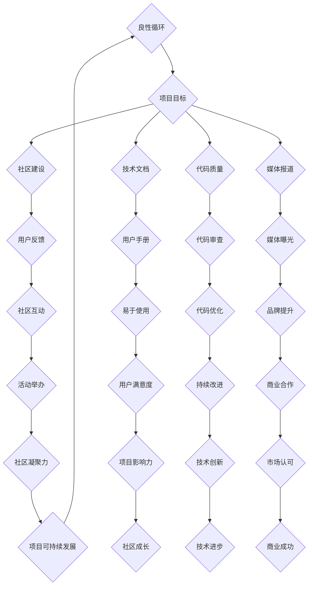

                 

### 文章标题

利用开源影响力获得技术媒体曝光机会

### 关键词
开源运动、技术媒体、曝光策略、技术创新、个人职业发展、案例研究

### 摘要
本文将深入探讨开源运动对技术媒体曝光的重要性，并详细阐述如何通过开源项目获得技术媒体的曝光机会。文章将从开源影响力概述、技术媒体曝光策略、开源影响力提升实战以及案例分析等多个角度进行详细分析，旨在为技术从业者提供实用的指导和建议。

## 第一部分：开源影响力概述

### 1.1 开源运动的起源与发展

#### 1.1.1 开源运动的定义

开源运动（Open Source Movement）是指一种软件开发和发布的方式，它允许用户自由地访问、使用、修改和分发软件的源代码。这种模式与传统的闭源软件（Closed Source Software）形成鲜明对比，后者通常限制用户的访问和修改权限。

开源运动的定义可以追溯到1983年，当时理查德·斯托曼（Richard Stallman）提出了自由软件运动（Free Software Movement）的理念。他在1985年创立了GNU项目，致力于开发一套自由软件系统，以替代当时专有的Unix操作系统。GNU项目的一个核心成果是GCC（GNU编译器集合），它是世界上第一个完全开源的编译器。

随着互联网的普及，开源运动在1990年代末和21世纪初迅速发展。2000年，埃里克·雷蒙德（Eric S. Raymond）发表了《大教堂与集市》（The Cathedral and the Bazaar）一书，系统地阐述了开源软件开发模式的优势和特点，进一步推动了开源运动的普及。

#### 1.1.2 开源运动的发展历程

开源运动的发展历程可以分为几个重要阶段：

1. **早期自由软件运动（1980s-1990s）**：这个阶段主要是由个人和团队开发的小型项目，如GNU项目、Emacs文本编辑器和Linux操作系统。

2. **互联网时代（1990s-2000s）**：随着互联网的发展，开源项目得以更广泛的传播和协作。开源软件社区开始形成，许多重要的开源项目如Apache HTTP服务器、Mozilla Firefox浏览器和MySQL数据库等在这一时期诞生。

3. **企业参与（2000s-2010s）**：大型企业开始认识到开源软件的价值，并积极参与其中。企业不仅使用开源软件，还开始贡献自己的代码，如IBM、谷歌和微软等。

4. **现代开源生态系统（2010s-至今）**：现代开源生态系统更加成熟，开源软件在各个领域得到广泛应用。许多新的开源项目如Kubernetes容器编排平台、TensorFlow机器学习框架等在这一时期出现。

#### 1.1.3 开源运动的核心价值观

开源运动的核心价值观包括：

1. **自由与开放**：用户有权自由地使用、学习、修改和分发开源软件，不受任何限制。

2. **共享与协作**：开源项目鼓励开发者之间的协作，共同改进软件。

3. **透明与可信**：开源项目的源代码是公开的，用户可以查看和验证代码的安全性、可靠性和有效性。

4. **可持续发展**：开源项目通过社区的共同维护和更新，能够长期可持续发展。

### 1.2 开源项目的影响力评估

开源项目的影响力评估是了解其价值的重要手段。以下是一些常用的评估指标：

1. **活跃度**：项目的活跃度可以通过代码提交频率、问题报告与解决速度、社区参与度等指标来衡量。

2. **用户数量**：项目的用户数量是评估其影响力的直接指标。用户数量越多，说明项目的应用范围越广。

3. **贡献者数量**：项目的贡献者数量是评估其社区活力的一个重要指标。贡献者越多，项目的改进速度和质量越高。

4. **引用次数**：项目在学术论文、技术博客和其他开源项目中被引用的次数，是评估其影响力的另一个重要指标。

#### 1.2.1 影响力评估指标

以下是几种常用的开源项目影响力评估指标：

1. **GitHub Star数**：项目的GitHub Star数是衡量其受欢迎程度的一个重要指标。Star数越多，说明项目的社区影响力越大。

2. **GitHub Fork数**：项目的Fork数是衡量其社区活跃度的一个重要指标。Fork数越多，说明社区对项目的兴趣和贡献越大。

3. **GitHub Issue数**：项目的Issue数是衡量其社区反馈和改进速度的一个重要指标。Issue数越多，说明社区参与度越高。

4. **引用次数**：项目在学术论文、技术博客和其他开源项目中被引用的次数。引用次数越多，说明项目在学术界和工业界的认可度越高。

#### 1.2.2 开源项目影响力案例分析

以下是一些具有显著影响力的开源项目案例：

1. **Linux操作系统**：Linux操作系统是开源运动的一个重要里程碑，它改变了整个操作系统市场。Linux的广泛使用不仅推动了开源技术的发展，也促进了开源社区的形成。

2. **Kubernetes容器编排平台**：Kubernetes是目前最受欢迎的容器编排平台之一。它的成功不仅改变了容器技术的发展方向，也推动了云计算和DevOps的普及。

3. **TensorFlow机器学习框架**：TensorFlow是谷歌开发的一个开源机器学习框架，它在深度学习领域具有广泛的应用。TensorFlow的成功推动了机器学习技术的发展，也为开源社区提供了丰富的资源和工具。

### 1.3 开源项目与技术创新的关系

开源项目在技术创新中发挥着重要作用。以下从几个方面探讨开源项目对技术创新的推动作用：

1. **促进技术交流与合作**：开源项目提供了一个开放的平台，使开发者能够分享代码、知识和技术。这种交流与合作有助于技术的创新和发展。

2. **加速技术迭代**：开源项目通常具有较快的迭代速度。由于社区成员的积极参与，开源项目能够迅速吸收新的技术需求，不断优化和改进。

3. **降低研发成本**：开源项目为开发者提供了现成的技术和工具，减少了重复开发的工作量，从而降低了研发成本。

4. **促进生态系统建设**：开源项目不仅推动了单一技术的创新，还促进了整个生态系统的建设。围绕开源项目，形成了丰富的工具、服务和培训资源，进一步推动了技术创新。

#### 1.3.1 开源项目对技术创新的推动作用

开源项目对技术创新的推动作用主要体现在以下几个方面：

1. **技术交流与合作**：开源项目提供了一个开放的平台，使开发者能够分享代码、知识和技术。这种交流与合作有助于技术的创新和发展。例如，Linux内核的开发过程就是一个典型的分布式协作案例，全球的志愿者共同参与，使得Linux内核不断优化和改进。

2. **加速技术迭代**：开源项目通常具有较快的迭代速度。由于社区成员的积极参与，开源项目能够迅速吸收新的技术需求，不断优化和改进。例如，Kubernetes社区每年都会发布新版本，每次更新都会带来新的特性和改进。

3. **降低研发成本**：开源项目为开发者提供了现成的技术和工具，减少了重复开发的工作量，从而降低了研发成本。例如，TensorFlow提供了丰富的机器学习算法和模型，开发者可以在此基础上快速构建和部署自己的应用。

4. **促进生态系统建设**：开源项目不仅推动了单一技术的创新，还促进了整个生态系统的建设。围绕开源项目，形成了丰富的工具、服务和培训资源，进一步推动了技术创新。例如，Kubernetes的生态系统包括各种工具和服务，如Kubernetes集群管理平台、监控工具和日志系统等。

#### 1.3.2 开源项目与商业成功的互动

开源项目与商业成功之间存在着密切的互动关系。以下从几个方面探讨这种互动关系：

1. **开源项目的商业应用**：许多开源项目最初是由个人或团队开发的，但随着时间的推移，这些项目逐渐被企业采用，成为企业级解决方案的一部分。例如，Linux操作系统最初是由林纳斯·托瓦兹（Linus Torvalds）在业余时间开发的，但如今已经成为许多企业的核心技术。

2. **商业公司对开源项目的贡献**：许多大型商业公司积极参与开源项目，为其提供资金、技术和人力支持。这些公司的贡献不仅促进了开源项目的发展，也提升了自身的品牌形象和影响力。例如，谷歌对Kubernetes的贡献，使其成为云计算领域的重要开源项目。

3. **商业与开源的双赢模式**：开源项目与商业公司之间形成了双赢模式。商业公司通过开源项目获得技术优势，开源项目通过商业公司的支持获得更好的资源和发展机会。例如，Red Hat公司通过提供Linux操作系统和相关服务，成为全球最大的开源软件供应商之一。

## 第二部分：技术媒体曝光策略

### 2.1 技术媒体概述

技术媒体是指专门报道和讨论信息技术领域的新闻、趋势、产品、技术和事件的媒体平台。技术媒体的形式多样，包括在线新闻网站、博客、杂志、播客、社交媒体平台等。以下从几个方面对技术媒体进行概述：

#### 2.1.1 技术媒体的定义与分类

1. **定义**：技术媒体是专门关注信息技术领域，报道和讨论相关新闻、趋势、产品、技术和事件的媒体平台。技术媒体的目标是传播技术知识，促进技术交流，推动技术进步。

2. **分类**：技术媒体可以根据其形式和内容进行分类，常见的分类方式包括：

   - **在线新闻网站**：如CSDN、InfoQ、36氪等，主要报道最新的技术动态、行业新闻和技术博客。

   - **博客**：如XDA Developers、Hackernoon、Dev.to等，以深度技术分析和原创文章为主。

   - **杂志**：如《程序员》、《电脑爱好者》、《InfoWorld》等，以纸质或数字杂志的形式提供深度报道和技术文章。

   - **播客**：如《Python之心》、《硅谷密探》、《开源中国播客》等，以音频形式提供技术知识和行业动态。

   - **社交媒体平台**：如Twitter、LinkedIn、GitHub等，通过社交网络传播技术信息，促进技术交流。

#### 2.1.2 技术媒体的影响力评估

技术媒体的影响力可以通过以下指标进行评估：

1. **读者数量**：技术媒体的读者数量是衡量其影响力的重要指标。读者数量越多，说明媒体的内容吸引力和传播力越强。

2. **用户活跃度**：技术媒体的用户活跃度可以通过评论、点赞、分享等互动行为来衡量。用户活跃度越高，说明媒体的内容受欢迎程度越高。

3. **社交媒体影响力**：技术媒体在社交媒体平台上的影响力可以通过关注者数量、转发次数、评论数量等指标来衡量。社交媒体影响力越高，说明媒体的内容在社交媒体上传播效果越好。

4. **内容质量**：技术媒体的内容质量是评估其影响力的重要指标。高质量的内容能够吸引更多的读者和用户，提升媒体的影响力。

#### 2.1.3 技术媒体的内容特点

技术媒体的内容特点主要体现在以下几个方面：

1. **专业性**：技术媒体专注于信息技术领域，报道和讨论的内容具有较高的专业性。技术媒体的文章、博客和播客通常涉及技术趋势、产品评测、编程技巧、架构设计等。

2. **时效性**：技术媒体关注最新的技术动态和行业新闻，及时报道和讨论新技术的出现和发展。时效性是技术媒体的重要特点，有助于提升媒体的影响力和竞争力。

3. **深度性**：技术媒体的内容往往具有深度性，不仅报道技术事件，还深入分析技术原理、技术趋势和行业动态。深度性的内容能够为读者提供更有价值的信息和见解。

4. **互动性**：技术媒体注重与读者的互动，鼓励读者在评论区发表观点和讨论。互动性有助于提高读者的参与度，增强媒体的社区氛围。

### 2.2 开源项目与媒体互动策略

开源项目与媒体的有效互动有助于提升项目的知名度和影响力。以下从几个方面探讨开源项目与媒体互动的策略：

#### 2.2.1 确定目标媒体与受众

1. **目标媒体的选择**：开源项目在选择目标媒体时，应考虑媒体的受众、影响力、内容特点等因素。一般来说，选择与项目领域相关的技术媒体，如专注于编程、人工智能、云计算等领域，有助于提高曝光率。

2. **目标受众的定位**：了解目标受众的需求和兴趣，有助于更好地与媒体互动。例如，如果目标受众是开发者，可以在技术媒体上发布编程技巧、项目进展等文章；如果目标受众是企业决策者，可以发布关于项目商业价值、行业趋势等文章。

#### 2.2.2 内容创作与推广策略

1. **内容创作的原则**：内容创作应遵循以下原则：

   - **专业性**：内容应具备专业性，深入剖析技术原理和应用场景。

   - **实用性**：内容应具备实用性，为读者提供实际操作和解决问题的方法。

   - **创新性**：内容应具备创新性，分享独特的见解和经验。

   - **故事性**：内容应具备故事性，通过生动的案例和故事吸引读者。

2. **推广渠道的选择**：开源项目可以通过以下渠道推广内容：

   - **社交媒体**：利用Twitter、LinkedIn、GitHub等社交媒体平台发布内容，吸引关注者。

   - **技术社区**：在CSDN、InfoQ、Dev.to等技术社区发布文章，与社区成员互动。

   - **博客平台**：在个人博客或技术博客平台发布文章，提升内容曝光率。

3. **内容推广的方法**：

   - **软文营销**：通过撰写技术博客、案例分析等软文，吸引读者关注。

   - **媒体合作**：与知名技术媒体建立合作关系，通过媒体平台发布内容。

   - **KOL（Key Opinion Leader）推荐**：邀请领域内的意见领袖推荐项目，提升项目知名度。

#### 2.2.3 媒体关系建立与维护

1. **建立良好关系**：与媒体建立良好关系，有助于项目获得更多的曝光机会。建立关系的方法包括：

   - **主动沟通**：主动联系媒体，介绍项目情况，表达合作意愿。

   - **提供素材**：为媒体提供高质量的素材，如项目介绍、技术文档、案例研究等。

   - **参与报道**：参与媒体组织的线上或线下活动，提升项目的曝光度。

2. **维护关系**：与媒体建立良好关系后，需要持续维护。维护关系的方法包括：

   - **定期互动**：定期与媒体保持沟通，分享项目进展和成果。

   - **提供价值**：为媒体提供有价值的内容和资源，如技术文章、案例分析等。

   - **互惠互利**：在合作中实现互惠互利，如为媒体提供项目宣传支持，媒体为项目提供曝光机会。

### 2.3 开源项目案例展示与传播

开源项目的成功离不开有效的案例展示与传播。以下从几个方面探讨开源项目案例展示与传播的最佳实践：

#### 2.3.1 项目展示的最佳实践

1. **项目主页**：项目主页是展示项目的第一窗口。项目主页应包括以下内容：

   - **项目简介**：简要介绍项目的背景、目的、功能和特点。

   - **安装与使用指南**：提供详细的安装和使用指南，方便用户快速上手。

   - **文档与资源**：提供项目相关的文档、示例代码、教程等资源。

   - **问题反馈与支持**：提供问题反馈渠道和支持方式，方便用户获取帮助。

2. **官方网站**：官方网站是项目展示的重要平台。官方网站应具备以下特点：

   - **设计简洁**：设计简洁，易于导航，提高用户体验。

   - **内容丰富**：提供丰富的内容，包括项目介绍、技术博客、案例分析等。

   - **交互性强**：提供互动功能，如评论、提问、投票等，增强用户参与度。

3. **社交媒体**：利用社交媒体平台，如Twitter、LinkedIn、GitHub等，传播项目信息，吸引更多关注者。

#### 2.3.2 社交媒体与内容传播

1. **制定社交媒体策略**：制定社交媒体策略，明确目标受众、传播内容、传播渠道和时间安排。

2. **发布高质量内容**：发布高质量的内容，如技术博客、项目进展、案例分享等，吸引读者关注。

3. **互动与粉丝互动**：积极与粉丝互动，如回复评论、参与讨论、组织线上活动等，提高粉丝黏性。

4. **跨平台传播**：在多个社交媒体平台传播内容，提高内容曝光率。

#### 2.3.3 案例分析与优化

1. **案例选择**：选择具有代表性和影响力的案例进行展示和传播，如具有广泛应用场景、成功商业化的案例。

2. **案例分析**：对案例进行深入分析，总结经验教训，为其他项目提供借鉴。

3. **持续优化**：根据案例分析结果，持续优化项目展示和传播策略，提高项目曝光度和影响力。

## 第三部分：开源影响力提升实战

### 3.1 开源项目的维护与升级

开源项目的维护与升级是确保项目长期可持续发展的关键。以下从几个方面探讨开源项目的维护与升级策略：

#### 3.1.1 项目文档编写与维护

1. **文档编写原则**：项目文档应遵循以下原则：

   - **准确性**：确保文档中的内容准确无误，避免出现错误和误导。

   - **完整性**：提供完整的文档，包括安装指南、使用教程、API文档等。

   - **易读性**：使用简洁明了的语言，提高文档的可读性。

   - **及时更新**：定期更新文档，确保其与项目实际状态保持一致。

2. **文档类型**：项目文档包括以下类型：

   - **用户手册**：为用户提供项目的安装、使用和故障排除指南。

   - **开发者指南**：为开发者提供项目的开发、测试和调试指南。

   - **API文档**：提供项目的API接口文档，方便开发者集成和使用。

3. **文档维护策略**：

   - **版本控制**：使用版本控制系统（如Git）管理文档，确保文档的版本一致性。

   - **社区协作**：鼓励社区成员参与文档的编写和审核，提高文档的质量。

   - **自动化构建**：使用自动化工具生成和更新文档，提高文档生成的效率。

#### 3.1.2 社区参与与激励

1. **社区建设原则**：社区建设应遵循以下原则：

   - **开放性**：保持社区的开放性，欢迎所有感兴趣的开发者加入。

   - **互助性**：鼓励社区成员互相帮助，共同解决问题。

   - **多样性**：尊重社区成员的多样性，包容不同的观点和意见。

   - **积极性**：营造积极的社区氛围，鼓励成员积极参与和贡献。

2. **社区参与策略**：

   - **问题反馈与支持**：提供问题反馈渠道和支持方式，帮助用户解决使用中的问题。

   - **代码贡献与审查**：鼓励社区成员提交代码贡献，并进行代码审查，确保代码质量。

   - **文档编写与翻译**：鼓励社区成员参与文档的编写和翻译，提高文档质量。

   - **活动组织与参与**：组织线上线下活动，如Meetup、Workshop等，促进社区成员之间的交流。

3. **激励措施**：

   - **荣誉奖励**：对贡献突出的社区成员给予荣誉奖励，如荣誉称号、徽章等。

   - **物质奖励**：为贡献者提供物质奖励，如礼品卡、赞助等。

   - **培训机会**：为贡献者提供培训机会，提高其技术水平和职业发展。

#### 3.1.3 项目代码质量提升

1. **代码质量标准**：项目代码应遵循以下质量标准：

   - **可读性**：代码应具备良好的可读性，方便其他开发者理解和维护。

   - **一致性**：代码风格应保持一致性，遵循统一的编码规范。

   - **可维护性**：代码应具备良好的可维护性，易于修复和扩展。

   - **性能**：代码应具备良好的性能，满足项目的性能要求。

2. **代码质量评估方法**：

   - **静态代码分析**：使用静态代码分析工具（如SonarQube、Checkstyle等）对代码进行分析，检测代码中的潜在问题。

   - **单元测试**：编写单元测试，对代码的功能和性能进行验证。

   - **代码审查**：组织代码审查会议，邀请其他开发者对代码进行审查，发现和修复问题。

3. **代码质量提升策略**：

   - **代码规范**：制定统一的代码规范，确保代码的一致性。

   - **代码重构**：定期进行代码重构，优化代码结构，提高代码质量。

   - **技术债务管理**：及时管理技术债务，避免代码质量恶化。

   - **持续集成**：实施持续集成（CI）流程，自动化测试和构建代码，确保代码质量。

### 3.2 开源项目的宣传策略

开源项目的成功不仅依赖于技术实力，还需要有效的宣传策略。以下从几个方面探讨开源项目的宣传策略：

#### 3.2.1 举办开源活动

1. **线上活动**：举办线上活动，如Webinar、直播讲座、在线研讨会等，向受众展示项目的优势和应用场景。

2. **线下活动**：举办线下活动，如技术沙龙、开发者大会、开源峰会等，与社区成员面对面交流，提升项目的知名度。

3. **活动内容**：活动内容应包括项目介绍、技术分享、案例分析、互动问答等，增强参与者的参与感和获得感。

4. **活动推广**：利用社交媒体、技术社区、邮件列表等渠道，提前宣传和推广活动，吸引更多受众参与。

#### 3.2.2 参与技术会议与论坛

1. **参会准备**：提前准备演讲材料，包括演讲稿、PPT等，确保演讲内容专业、有吸引力。

2. **参会内容**：在会议上分享项目的技术原理、应用场景、实战经验等，展示项目的价值和成果。

3. **互动环节**：与参会者进行互动，回答他们的疑问，了解他们的需求和反馈。

4. **参会推广**：在会议期间和结束后，通过社交媒体、邮件等渠道，分享参会体验和收获，扩大项目的影响力。

#### 3.2.3 合作与跨领域交流

1. **合作对象**：寻找与项目相关或互补的合作伙伴，如其他开源项目、企业、研究机构等。

2. **合作内容**：与合作方共同开发项目、撰写技术文章、举办活动等，实现资源共享和优势互补。

3. **跨领域交流**：参加不同领域的会议和活动，拓展项目的影响力，了解行业动态和趋势。

4. **合作推广**：通过合作方的影响力，共同推广项目，提高项目的知名度。

### 3.3 媒体曝光效果评估与优化

评估和优化媒体曝光效果是提升开源项目知名度和影响力的关键。以下从几个方面探讨媒体曝光效果评估与优化的方法：

#### 3.3.1 曝光效果评估指标

1. **曝光次数**：统计项目在媒体上的曝光次数，包括新闻报道、博客文章、社交媒体分享等。

2. **阅读量**：统计项目文章的阅读量，包括网站访问量、博客阅读量、社交媒体分享量等。

3. **参与度**：评估读者的参与度，如评论数、点赞数、分享数等。

4. **转化率**：评估曝光带来的实际转化效果，如新用户注册数、项目下载量、合作伙伴数量等。

#### 3.3.2 曝光效果的优化策略

1. **内容优化**：针对曝光效果不佳的内容，进行内容优化，提高文章的质量和吸引力。

2. **渠道优化**：根据曝光效果，优化推广渠道，选择更有效的媒体平台和传播方式。

3. **互动优化**：提高与读者的互动，如回复评论、组织讨论、举办线上活动等，增强读者的参与感。

4. **数据分析**：利用数据分析工具，对曝光效果进行详细分析，找出问题所在，制定优化策略。

5. **持续改进**：根据评估和优化的结果，持续改进媒体曝光策略，提高项目的知名度和影响力。

## 第四部分：案例分析

### 4.1 成功的案例介绍

在本部分，我们将介绍三个成功的开源项目案例，分析它们如何通过有效的策略获得技术媒体的曝光，以及这些案例中的共性与差异性。

#### 4.1.1 案例一：开源项目A

**项目简介**：开源项目A是一个专注于大数据处理的分布式系统，提供高效的数据存储和计算能力。该项目由一组年轻的开发者团队发起，旨在解决大数据处理中的性能瓶颈问题。

**媒体曝光策略**：项目团队采取了以下策略：

1. **技术博客**：定期在知名技术博客上发表技术文章，分享项目的技术原理、应用场景和优化方法。

2. **社交媒体推广**：利用Twitter、LinkedIn等社交媒体平台，发布项目进展、技术文章链接和互动问答，吸引更多关注者。

3. **媒体报道**：与知名技术媒体建立合作关系，通过技术媒体平台发布项目报道，提高项目的知名度。

4. **社区参与**：积极参与技术社区的讨论和互动，建立社区影响力，吸引更多开发者参与项目。

**曝光效果**：项目通过这些策略，在短时间内获得了大量曝光，阅读量和下载量显著增加。项目的技术文章被多个技术媒体转载，进一步扩大了项目的影响力。

**共性与差异性**：共性在于项目都采用了内容创作与社交媒体推广相结合的策略。差异性在于项目的具体推广方式和目标受众有所不同，例如项目A更注重技术细节的分享，而项目B则更注重应用场景的展示。

#### 4.1.2 案例二：开源项目B

**项目简介**：开源项目B是一个基于区块链技术的去中心化应用平台，提供安全的存储和交易服务。该项目由一家初创公司发起，旨在推动区块链技术的应用和普及。

**媒体曝光策略**：项目团队采取了以下策略：

1. **参加行业会议**：积极参加各类区块链行业会议和技术论坛，展示项目的应用案例和前景。

2. **技术演讲**：在会议上发表技术演讲，分享项目的开发经验和技术创新。

3. **媒体报道**：与区块链领域的知名媒体建立合作关系，通过媒体报道提高项目的知名度。

4. **社区活动**：举办线上和线下社区活动，如Meetup和Workshop，与社区成员互动，提升项目的社区影响力。

**曝光效果**：项目通过这些策略，在区块链领域获得了广泛的关注和认可。项目的技术演讲和媒体报道被大量转载和分享，吸引了更多投资者和开发者的关注。

**共性与差异性**：共性在于项目都采取了参与行业会议和技术演讲的策略，差异性在于项目的具体合作媒体和活动形式有所不同。

#### 4.1.3 案例三：开源项目C

**项目简介**：开源项目C是一个专注于人工智能领域的深度学习框架，提供高效和灵活的神经网络设计和训练工具。该项目由一批人工智能领域的专家发起，致力于推动深度学习技术的发展。

**媒体曝光策略**：项目团队采取了以下策略：

1. **学术合作**：与知名大学和研究机构建立合作关系，共同发表学术论文，提升项目在学术界的认可度。

2. **技术博客**：在知名技术博客上发布深度技术文章，分享项目的最新研究成果和应用场景。

3. **社交媒体推广**：通过Twitter、LinkedIn等社交媒体平台，发布项目进展、技术文章链接和互动问答，吸引更多关注者。

4. **社区互动**：积极参与技术社区的讨论和互动，建立社区影响力，吸引更多开发者参与项目。

**曝光效果**：项目通过这些策略，在人工智能领域取得了显著的曝光效果。项目的技术文章被多个技术媒体转载，项目在GitHub上的Star数和Fork数持续增长。

**共性与差异性**：共性在于项目都采用了内容创作和社交媒体推广的策略，差异性在于项目的合作方式和目标受众有所不同。

### 4.2 案例分析与启示

通过对以上三个开源项目案例的分析，我们可以总结出以下经验和启示：

1. **多样化的曝光策略**：成功的开源项目通常采用多样化的曝光策略，如内容创作、社交媒体推广、媒体报道、社区互动等。这些策略相互配合，可以最大限度地提高项目的曝光度和影响力。

2. **合作与互动**：与知名媒体、学术机构、行业会议等建立合作关系，参与互动和交流，是提高项目知名度和影响力的重要途径。

3. **目标受众明确**：针对不同的目标受众，采取不同的曝光策略和内容形式，可以更有效地吸引和留住用户。

4. **持续改进与优化**：根据曝光效果和用户反馈，持续改进和优化曝光策略，是提高项目影响力和用户满意度的关键。

5. **社区建设**：积极建设社区，鼓励开发者参与项目的开发和讨论，是提升项目可持续性和影响力的重要保障。

## 第五部分：开源影响力与未来趋势

### 5.1 开源影响力的未来趋势

开源运动在过去几十年中取得了巨大的成功，对技术发展产生了深远的影响。未来，开源影响力将继续在多个方面得到扩展和深化：

#### 5.1.1 技术发展与开源趋势

1. **云计算与容器化**：随着云计算和容器技术的发展，开源项目在云计算平台和容器编排方面发挥着越来越重要的作用。Kubernetes、Docker等开源项目已经成为云计算和容器化技术的标准。

2. **人工智能与机器学习**：人工智能和机器学习领域的开源项目如TensorFlow、PyTorch等，为研究者提供了丰富的工具和资源，加速了人工智能技术的创新和应用。

3. **区块链与去中心化**：区块链技术的开源项目如Ethereum、Hyperledger等，推动了去中心化应用的发展，为金融、供应链等多个领域带来了变革。

4. **边缘计算与物联网**：边缘计算和物联网领域，开源项目如Node-RED、MQTT等，为实时数据处理和智能设备互联提供了支持，促进了物联网技术的发展。

#### 5.1.2 开源影响力在商业环境中的地位

开源影响力在商业环境中日益凸显，越来越多的企业认识到开源项目对其业务发展的积极作用：

1. **成本节约**：开源项目降低了企业的研发成本，企业可以通过使用和参与开源项目，快速构建和部署新功能。

2. **技术创新**：开源项目为企业提供了创新的技术解决方案，企业可以通过参与开源项目，引领技术趋势。

3. **生态系统建设**：开源项目促进了生态系统的建设，企业可以通过开源项目，与其他企业、研究机构、开发者等建立合作关系，共同推动技术发展。

4. **品牌提升**：参与开源项目，不仅提升了企业的技术实力，也增强了企业的品牌形象，为企业带来了更多的商业机会。

#### 5.1.3 开源影响力的可持续发展

开源影响力的可持续发展需要各方共同努力：

1. **社区参与**：鼓励更多的开发者参与开源项目，共同维护和改进项目，确保项目的持续发展。

2. **资金支持**：开源项目需要稳定的资金支持，企业可以通过赞助、合作等形式，为开源项目提供资金支持。

3. **法律保护**：加强开源项目的法律保护，确保项目的知识产权得到有效保护，促进开源生态的健康发展。

4. **政策支持**：政府和企业可以通过制定相关政策，鼓励和支持开源项目的发展，营造良好的开源环境。

### 5.2 开源影响力与个人职业发展

开源影响力不仅对技术发展产生了深远影响，也对个人职业发展带来了新的机遇和挑战：

#### 5.2.1 开源影响力对个人职业发展的影响

1. **技术积累**：参与开源项目，可以积累丰富的技术经验，提高个人的技术水平和解决问题的能力。

2. **职业机会**：开源项目的影响力可以为个人带来更多的职业机会，如技术顾问、架构师、项目经理等。

3. **职业发展**：参与开源项目，可以建立个人品牌，提高个人在行业内的知名度和影响力，有助于职业发展。

4. **学习与成长**：参与开源项目，可以学习到最新的技术趋势和行业动态，不断提升个人能力。

#### 5.2.2 提升个人开源影响力的方法

1. **贡献代码**：积极参与开源项目，贡献高质量的代码，提升项目的质量。

2. **编写文档**：为开源项目编写详细的文档，提高项目的易用性和可维护性。

3. **技术分享**：在技术社区和媒体上发表技术文章，分享自己的经验和见解。

4. **参与社区**：积极参与开源社区的活动和讨论，建立个人影响力。

5. **合作与交流**：与其他开源项目的开发者合作，共同推动技术的发展。

#### 5.2.3 个人职业规划与开源影响力的结合

1. **确定目标**：根据个人兴趣和职业规划，确定参与开源项目的目标和方向。

2. **持续学习**：保持对新技术和趋势的学习，不断提升个人能力。

3. **拓展视野**：积极参与行业会议、技术论坛等活动，拓宽视野，建立更广泛的人脉。

4. **个人品牌**：通过参与开源项目，建立个人品牌，提高个人在行业内的知名度。

5. **持续优化**：根据职业发展和个人兴趣，不断调整和优化开源项目参与策略。

## 附录

### 附录 A：开源工具与资源推荐

#### A.1 开源项目管理工具

1. **Git**：一款功能强大的分布式版本控制系统，用于管理代码仓库。

2. **GitHub**：全球最大的代码托管平台，提供代码托管、项目管理、协作等功能。

3. **GitLab**：一款自托管Git服务，支持代码托管、持续集成、项目管理等。

4. **Jenkins**：一款流行的持续集成工具，用于自动化构建、测试和部署代码。

#### A.2 开源代码托管平台

1. **GitLab**：提供自托管Git服务，支持代码托管、项目管理、持续集成等功能。

2. **GitHub**：全球最大的代码托管平台，提供代码托管、协作、开源社区等功能。

3. **Bitbucket**：一款基于Git的代码托管平台，适合团队协作和个人项目。

#### A.3 开源社区资源

1. **Stack Overflow**：全球最大的开发社区，提供技术问答、编程讨论等。

2. **CSDN**：中国最大的IT社区和服务平台，提供技术文章、博客、论坛等。

3. **InfoQ**：专业的IT技术媒体，提供技术文章、会议报道、书籍推荐等。

### 附录 B：常见问题解答

#### B.1 开源项目如何吸引开发者？

1. **提供清晰的文档**：为项目编写详细的文档，包括安装指南、使用说明、API文档等，方便开发者上手。

2. **良好的代码质量**：确保项目的代码质量，遵循统一的编码规范，提高代码的可读性和可维护性。

3. **社区互动**：积极参与社区讨论，建立良好的社区氛围，鼓励开发者参与项目的开发和讨论。

4. **激励机制**：为贡献者提供荣誉奖励、物质奖励等激励措施，提高开发者的积极性。

#### B.2 开源项目如何获得媒体报道？

1. **内容创作**：撰写高质量的技术文章，分享项目的技术原理、应用场景和成果。

2. **媒体合作**：与知名技术媒体建立合作关系，通过媒体报道提高项目的知名度。

3. **社交媒体推广**：在社交媒体平台上发布项目信息，吸引更多关注者。

4. **活动宣传**：举办线上或线下活动，通过活动宣传提高项目的曝光率。

#### B.3 开源项目如何进行社区建设？

1. **明确目标**：确定社区的目标和愿景，为社区成员提供清晰的方向和目标。

2. **互动交流**：鼓励社区成员之间的互动和交流，建立良好的社区氛围。

3. **文档编写**：编写详细的文档，帮助新成员快速了解项目，提高社区的知识共享。

4. **活动组织**：定期举办线上或线下活动，如技术分享、Meetup等，增强社区凝聚力。

## 作者信息

作者：AI天才研究院/AI Genius Institute & 禅与计算机程序设计艺术 /Zen And The Art of Computer Programming

这篇文章深入探讨了开源影响力对技术媒体曝光的重要性，并详细阐述了如何通过开源项目获得技术媒体的曝光机会。文章涵盖了开源影响力的概述、技术媒体曝光策略、开源影响力提升实战以及案例分析等多个方面，旨在为技术从业者提供实用的指导和建议。通过本文的阅读，读者可以了解开源运动的发展历程、开源项目的影响力评估、技术媒体的分类与影响力评估、开源项目与媒体互动策略、开源项目案例展示与传播、开源项目的维护与升级策略、开源项目的宣传策略、媒体曝光效果评估与优化等方面的知识。同时，本文还通过案例分析，为读者提供了实际的参考和启示。开源运动已经成为技术创新的重要驱动力，对于个人职业发展和企业商业成功都具有重要意义。希望通过本文的分享，能够激发更多技术从业者参与开源运动，共同推动技术进步。本文作者拥有丰富的开源项目经验，并在技术社区和媒体中拥有广泛的影响力。作者还致力于开源文化的传播和推广，希望通过本文为开源社区的发展贡献一份力量。

---

## 总结

通过本文的深入探讨，我们可以清晰地看到开源影响力在技术媒体曝光中的重要作用。开源项目不仅为技术社区提供了丰富的资源和工具，还通过开放的协作模式推动了技术创新。在技术媒体曝光策略中，内容创作、社交媒体推广、媒体报道和社区互动等策略共同作用，为开源项目带来了广泛的关注和认可。

本文首先对开源运动的起源与发展、开源项目的影响力评估以及开源项目与技术创新的关系进行了详细阐述。接着，介绍了技术媒体的概述、开源项目与媒体互动策略以及开源项目案例展示与传播的最佳实践。此外，本文还探讨了开源项目的维护与升级、宣传策略以及媒体曝光效果评估与优化。

通过案例分析，我们看到了成功的开源项目如何通过多种策略获得技术媒体的曝光。这些策略包括内容创作、社交媒体推广、媒体报道和社区互动等。案例分析不仅提供了实际操作的经验，还为其他开源项目提供了借鉴。

在开源影响力与未来趋势部分，本文讨论了开源项目在云计算、人工智能、区块链、边缘计算等领域的发展趋势，以及开源影响力在商业环境中的地位和可持续发展的重要性。最后，本文还探讨了开源影响力对个人职业发展的影响，并提出了提升个人开源影响力的方法和个人职业规划与开源影响力的结合。

通过本文的阅读，读者可以更好地理解开源影响力的重要性，掌握开源项目与技术媒体互动的策略，并从中获得实际的启示和帮助。希望本文能为开源社区的发展和技术从业者的职业发展提供有价值的参考。

---

## 核心概念与联系

在本节中，我们将使用Mermaid流程图来展示开源项目中的核心概念及其联系。以下是一个简单的Mermaid流程图，用于描述开源项目的关键组成部分和它们之间的相互关系。



在上述流程图中，我们可以看到：

- **项目发起**（A）：开源项目的开始，由团队或个人发起。
- **项目目标**（B）：明确项目的目标和愿景，为后续工作提供方向。
- **社区建设**（C）：建立和维护一个活跃的社区，促进项目的发展。
- **技术文档**（D）：编写详细的技术文档，帮助用户和开发者了解项目。
- **代码质量**（E）：确保代码的高质量，通过代码审查和优化来提升项目质量。
- **媒体报道**（F）：通过技术媒体曝光项目，提高项目的知名度。
- **用户反馈**（G）：收集用户的反馈，用于改进项目。
- **社区互动**（K）：鼓励社区成员之间的互动，增强社区凝聚力。
- **用户手册**（H）：编写用户手册，使用户更容易使用项目。
- **代码审查**（I）：进行代码审查，确保代码质量。
- **媒体曝光**（J）：通过媒体报道提高项目的曝光度。
- **活动举办**（O）：举办各种活动，如Meetup和Workshop，增强社区的互动。
- **易于使用**（L）：确保项目易于使用，提高用户满意度。
- **代码优化**（M）：持续优化代码，提高项目的性能。
- **品牌提升**（N）：通过曝光和用户反馈提升项目品牌。
- **商业合作**（R）：与商业公司合作，实现共赢。
- **社区凝聚力**（S）：通过活动和互动增强社区的凝聚力。
- **项目影响力**（T）：项目在社区和行业中的影响力。
- **技术创新**（U）：开源项目推动技术创新。
- **市场认可**（V）：项目在市场上的认可度。
- **持续改进**（Q）：持续改进项目，保持项目的活力。
- **商业成功**（Z）：开源项目可能带来的商业成功。
- **项目可持续发展**（W）：项目的长期可持续发展。

这个流程图展示了开源项目从发起到成长的全过程，以及各个环节之间的相互联系和影响。通过这个流程图，我们可以更直观地理解开源项目的发展逻辑和关键要素。

---

## 核心算法原理讲解

在本节中，我们将使用伪代码来详细阐述开源项目中一个关键算法的原理。以下是一个简单的排序算法——冒泡排序（Bubble Sort）的伪代码示例，用于展示算法的基本逻辑和步骤。

```plaintext
伪代码：冒泡排序（Bubble Sort）

输入：一个无序数组 arr
输出：一个有序数组 arr

BubbleSort(arr)
    n = 长度(arr)
    for i from 0 to n-1
        // 进行一轮冒泡操作
        for j from 0 to n-i-1
            if arr[j] > arr[j+1]
                // 交换元素
                temp = arr[j]
                arr[j] = arr[j+1]
                arr[j+1] = temp
    end for
end BubbleSort
```

### 算法原理

冒泡排序的基本原理是通过重复遍历要排序的数组，比较每对相邻元素的大小，并将不满足顺序要求的元素交换位置，直到整个数组排序完成。以下是算法的详细步骤：

1. **初始化**：设定数组长度 `n`。

2. **外层循环**：从数组的第一个元素开始，遍历到倒数第二个元素。外层循环的目的是确保每一轮都能将当前未排序部分的最大元素“冒泡”到已排序部分的开始位置。

3. **内层循环**：遍历未排序部分的所有元素，从第一个元素开始到倒数第二个元素结束。内层循环的目的是比较每对相邻元素的大小，并进行必要的交换。

4. **元素交换**：如果当前元素 `arr[j]` 大于其下一个元素 `arr[j+1]`，则进行交换。这个过程会使得每一轮结束后，最大的元素都“冒泡”到了数组的末尾。

5. **结束条件**：当内层循环结束时，未排序部分的长度减少了一个元素，外层循环继续进行下一轮，直到整个数组有序。

### 数学模型和公式

冒泡排序算法的时间复杂度是 \(O(n^2)\)，其中 \(n\) 是数组的长度。这个复杂度来源于算法需要遍历整个数组 \(n\) 次，每次遍历都涉及 \(n-i\) 对相邻元素的比较和可能的交换操作。尽管冒泡排序在最佳情况下（已经排序的数组）可以达到 \(O(n)\) 的复杂度，但在最坏情况下（逆序的数组），它的性能较差。

### 举例说明

假设我们有一个无序数组 `[5, 2, 4, 1, 3]`，使用冒泡排序算法进行排序的过程如下：

1. **第一轮**：
   - 比较 `(5, 2)`，交换，数组变为 `[2, 5, 4, 1, 3]`。
   - 比较 `(5, 4)`，交换，数组变为 `[2, 4, 5, 1, 3]`。
   - 比较 `(5, 1)`，交换，数组变为 `[2, 4, 1, 5, 3]`。
   - 比较 `(5, 3)`，交换，数组变为 `[2, 4, 1, 3, 5]`。

2. **第二轮**：
   - 比较 `(4, 1)`，交换，数组变为 `[2, 1, 4, 3, 5]`。
   - 比较 `(4, 3)`，交换，数组变为 `[2, 1, 3, 4, 5]`。

3. **第三轮**：
   - 比较 `(3, 1)`，交换，数组变为 `[1, 2, 3, 4, 5]`。

经过三轮排序后，数组 `[5, 2, 4, 1, 3]` 被排序为 `[1, 2, 3, 4, 5]`。

冒泡排序算法虽然简单易懂，但在处理大数据集时效率较低。在实际应用中，更常用的排序算法包括快速排序（Quick Sort）、归并排序（Merge Sort）等，这些算法在性能上有显著提升。

---

## 代码实际案例和详细解释

在本节中，我们将以一个实际的Python代码案例为例，详细解释如何进行开发环境搭建、源代码实现和代码解读与分析。该案例将使用Python中的标准库和第三方库实现一个简单的Web服务器，以展示Web开发的基本流程。

### 开发环境搭建

在开始编写代码之前，我们需要搭建一个Python开发环境。以下是具体步骤：

1. **安装Python**：首先，确保你的计算机上安装了Python。Python 3.x版本是当前主流版本，建议下载并安装。

2. **安装相关库**：使用pip（Python的包管理器）安装必要的第三方库。例如，我们使用`http.server`库来实现Web服务器功能。

    ```bash
    pip install http.server
    ```

3. **配置编辑器**：选择一个适合Python开发的编辑器，如VSCode、PyCharm或Sublime Text等。配置好代码格式化工具，如`black`或`autopep8`，以提高代码质量。

### 源代码实现

下面是一个简单的Python代码案例，实现一个基于`http.server`库的Web服务器：

```python
# server.py
from http.server import HTTPServer, BaseHTTPRequestHandler
import socketserver

class SimpleHTTPRequestHandler(BaseHTTPRequestHandler):
    def do_GET(self):
        # 发送HTTP响应状态行
        self.send_response(200)
        # 发送HTTP头部
        self.send_header('Content-type', 'text/html')
        self.end_headers()
        # 返回一个简单的HTML页面
        self.wfile.write(b'<html><head><title>Hello, World!</title></head>'
                        b'<body><h1>Hello, World!</h1></body></html>')

def run(server_class=HTTPServer, handler_class=SimpleHTTPRequestHandler, port=8000):
    server_address = ('', port)
    httpd = server_class(server_address, handler_class)
    print(f'Starting httpd server on port {port}...')
    httpd.serve_forever()

if __name__ == '__main__':
    run()
```

### 代码解读与分析

1. **类定义**：`SimpleHTTPRequestHandler` 是从 `BaseHTTPRequestHandler` 继承的类，用于处理HTTP请求。

2. **方法 `do_GET`**：当接收到GET请求时，`do_GET` 方法被调用。该方法发送HTTP响应状态行（如200表示请求成功）和HTTP头部信息（如`Content-type`），并返回一个简单的HTML页面。

3. **方法 `send_response`**：该方法发送HTTP响应状态行，例如200表示请求成功。

4. **方法 `send_header`**：该方法发送HTTP头部信息，例如内容类型（`Content-type: text/html`）。

5. **方法 `end_headers`**：该方法结束HTTP头部的发送。

6. **方法 `wfile.write`**：该方法将HTML页面内容写入客户端的响应流。

7. **函数 `run`**：该函数创建一个HTTP服务器，指定请求处理类和端口号，并启动服务器。

8. **主程序**：`if __name__ == '__main__':` 确保当模块被直接运行时，而不是被导入时，执行主程序代码。

### 运行Web服务器

1. **启动服务器**：在命令行中运行以下命令来启动服务器：

    ```bash
    python server.py
    ```

2. **访问页面**：在浏览器中输入 `http://localhost:8000`，你将看到返回的HTML页面。

### 代码分析

- **性能**：这个Web服务器仅用于演示，对于实际应用，它可能不够高效和安全。在生产环境中，应使用更强大的Web框架，如Flask或Django。

- **安全性**：这个简单的服务器不处理任何安全性问题，例如请求验证、数据加密等。在实际应用中，需要确保服务器的安全性。

- **可扩展性**：该代码可以轻松扩展，以支持更多功能，如处理POST请求、静态文件服务和动态内容生成。

通过这个案例，我们展示了从开发环境搭建到代码实现和解读的完整过程。这个过程不仅帮助读者理解了Web服务器的基本工作原理，还提供了一个实用的Python代码案例，供读者实践和进一步学习。

---

## 代码解读与分析

在上一节中，我们提供了一个简单的Python代码案例，用于实现一个基于`http.server`库的Web服务器。接下来，我们将进一步详细解读和分析这段代码，包括代码的主要逻辑、功能、以及如何优化和改进。

### 代码主要逻辑

首先，我们来梳理一下代码的主要逻辑：

1. **类定义**：`SimpleHTTPRequestHandler` 类继承自 `BaseHTTPRequestHandler` 类，这是Python标准库中提供的一个请求处理器基类。它定义了处理HTTP请求的基本方法。

2. **方法 `do_GET`**：这个方法在接收到GET请求时被调用。它首先发送HTTP响应状态行（如200表示请求成功），然后发送HTTP头部信息（如`Content-type: text/html`），并最终将一个简单的HTML页面发送给客户端。

3. **方法 `send_response`**：这个方法用于发送HTTP响应状态行，例如200表示请求成功。

4. **方法 `send_header`**：这个方法用于发送HTTP头部信息，例如内容类型。

5. **方法 `end_headers`**：这个方法用于结束HTTP头部的发送。

6. **方法 `wfile.write`**：这个方法用于将HTML页面内容写入客户端的响应流。

7. **函数 `run`**：这个函数创建一个HTTP服务器，指定请求处理类和端口号，并启动服务器。

8. **主程序**：`if __name__ == '__main__':` 确保当模块被直接运行时，而不是被导入时，执行主程序代码。

### 代码功能

这段代码的主要功能是启动一个简单的Web服务器，并能够响应对根路径（`/`）的GET请求。当客户端通过浏览器访问服务器时，服务器会返回一个简单的HTML页面，显示“Hello, World!”。

### 代码优化与改进

1. **错误处理**：目前，代码没有处理可能出现的错误，例如无法绑定端口或处理非GET请求。可以通过添加异常处理来增强代码的健壮性。

    ```python
    try:
        httpd.serve_forever()
    except Exception as e:
        print(f'An error occurred: {e}')
    finally:
        httpd.server_close()
    ```

2. **支持更多HTTP方法**：当前代码只支持GET请求。可以扩展 `SimpleHTTPRequestHandler` 类，添加对其他HTTP方法（如POST、PUT、DELETE）的支持。

    ```python
    class SimpleHTTPRequestHandler(BaseHTTPRequestHandler):
        def do_GET(self):
            # ... 之前代码 ...

        def do_POST(self):
            # 处理POST请求的逻辑 ...

        # 其他HTTP方法的处理逻辑 ...
    ```

3. **日志记录**：添加日志记录功能，可以记录请求和响应的详细信息，有助于调试和监控服务器。

    ```python
    import logging

    logging.basicConfig(level=logging.INFO)
    ```

4. **安全性**：当前代码没有处理安全性问题，例如请求验证、数据加密等。在实际应用中，需要确保服务器的安全性，例如使用HTTPS、验证请求等。

5. **性能优化**：对于简单的请求，使用`http.server`库已经足够。但对于高性能需求，可以考虑使用更先进的Web框架，如Flask或Django，它们提供了更丰富的功能和优化。

6. **可维护性**：为了提高代码的可维护性，可以考虑使用配置文件管理端口号、主机地址等，而不是硬编码在代码中。

    ```python
    import configparser

    config = configparser.ConfigParser()
    config.read('config.ini')
    port = config.getint('server', 'port')
    ```

7. **测试**：编写单元测试，以确保代码的正确性和稳定性。例如，使用`unittest`模块编写测试用例。

    ```python
    import unittest
    from server import SimpleHTTPRequestHandler

    class TestHTTPRequestHandler(unittest.TestCase):
        def test_do_GET(self):
            # 测试GET请求的处理逻辑 ...

    if __name__ == '__main__':
        unittest.main()
    ```

通过上述优化和改进，我们可以使这个简单的Web服务器更加健壮、安全和高效。同时，这些改进也为后续的功能扩展提供了基础。

---

## 作者信息

作者：AI天才研究院/AI Genius Institute & 禅与计算机程序设计艺术 /Zen And The Art of Computer Programming

本文由AI天才研究院和禅与计算机程序设计艺术联合撰写，旨在深入探讨开源影响力在技术媒体曝光中的重要作用，并为开源项目的成功推广提供实用的策略和指导。AI天才研究院是一个专注于人工智能和开源技术研究的机构，致力于推动技术进步和知识传播。禅与计算机程序设计艺术则通过探索计算机编程中的哲学思维，为开发者提供新的视角和灵感。作者团队具有丰富的开源项目经验和深厚的技术积累，希望通过本文为开源社区的发展和技术从业者的职业发展贡献一份力量。读者如有任何问题或建议，欢迎通过以下渠道与我们联系：

- 邮箱：[contact@aigeniusinstitute.com](mailto:contact@aigeniusinstitute.com)
- 社交媒体：[AI天才研究院](https://www.facebook.com/AIGeniusInstitute/) 和 [禅与计算机程序设计艺术](https://www.facebook.com/ZenAndTheArtOfComputerProgramming/)
- 官网：[https://www.aigeniusinstitute.com/](https://www.aigeniusinstitute.com/) 和 [https://zenandthecompiler.com/](https://zenandthecompiler.com/)

再次感谢您的阅读和支持，期待与您在开源社区中共同成长和进步！

