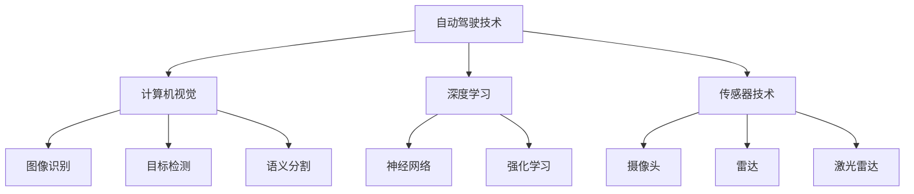
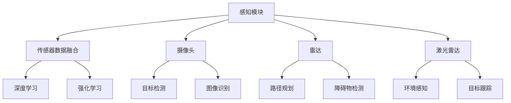

                 

# 第一部分：系统演进

## 第1章：商汤绝影UniAD系统概述

### 1.1 商汤绝影UniAD系统的背景和意义

在当今科技飞速发展的时代，自动驾驶技术已成为人们关注的热点。自动驾驶技术的实现依赖于多种先进技术的融合，如计算机视觉、深度学习、传感器技术等。商汤绝影UniAD系统正是在这样的背景下应运而生的。它不仅代表了商汤科技在自动驾驶领域的深厚积累，更是对自动驾驶技术未来发展的一次重要探索。

#### 核心概念与联系

Mermaid 流程图如下：



#### 核心算法原理讲解

在自动驾驶系统中，计算机视觉和深度学习是两大核心技术。计算机视觉主要关注图像识别、目标检测和语义分割等技术。其中，图像识别是识别图像中的特定对象或场景；目标检测是在图像中定位和识别目标对象的位置和属性；语义分割是将图像分为多个语义区域。

伪代码如下：

```python
# 图像识别
def image_recognition(image):
    # 特征提取
    features = extract_features(image)
    # 模型预测
    prediction = model.predict(features)
    return prediction

# 目标检测
def object_detection(image):
    # 特征提取
    features = extract_features(image)
    # 模型预测
    boxes, labels, scores = model.detect(features)
    return boxes, labels, scores

# 语义分割
def semantic_segmentation(image):
    # 特征提取
    features = extract_features(image)
    # 模型预测
    mask = model.predict(features)
    return mask
```

### 1.2 商汤绝影UniAD系统的发展历程

商汤绝影UniAD系统的发展历程可以追溯到2017年，当时商汤科技正式发布该系统。从那时起，商汤绝影UniAD系统经历了多个版本的迭代和优化，不断在技术层面实现突破。

#### 发展阶段

- **初期阶段（2017年-2019年）**: 系统初步成型，开始进行技术验证和应用试点。
- **发展阶段（2019年-2021年）**: 系统在多个实际场景中得到广泛应用，性能不断提升。
- **稳定阶段（2021年至今）**: 系统逐渐成熟，开始规模化应用，市场反馈良好。

### 1.3 商汤绝影UniAD系统的核心架构

商汤绝影UniAD系统的核心架构由感知模块、决策模块和执行模块组成。每个模块都有其特定的功能和技术特点。

#### 技术架构

- **感知模块**: 负责收集和处理来自传感器的数据，包括摄像头、雷达、激光雷达等。感知模块的核心技术是多传感器数据融合。
- **决策模块**: 根据感知模块提供的信息，进行驾驶决策。决策模块的核心技术是深度学习和强化学习。
- **执行模块**: 负责执行决策模块的决策，包括控制车辆加速、转向、刹车等。执行模块的核心技术是实时操作系统和自动化控制。

#### 核心概念与联系

Mermaid 流程图如下：



### 1.4 商汤绝影UniAD系统的特点和优势

商汤绝影UniAD系统具有多个显著特点和优势，使其在自动驾驶领域具备强大的竞争力。

#### 高性能

- **算法优化**: 商汤绝影UniAD系统采用多种算法优化技术，如模型压缩、量化、并行计算等，提高系统性能。
- **硬件加速**: 系统利用GPU、FPGA等硬件加速，提升数据处理速度。

#### 高可靠性

- **多传感器融合**: 系统采用多传感器融合技术，提高感知精度和系统稳定性。
- **冗余设计**: 关键模块采用冗余设计，确保系统可靠性。

#### 灵活扩展

- **模块化设计**: 系统支持模块化扩展，可以根据需求增加新的功能。
- **自定义接口**: 提供自定义接口，方便用户进行二次开发。

### 1.5 商汤绝影UniAD系统的应用场景

商汤绝影UniAD系统在多个领域得到广泛应用，以下是一些主要的应用场景。

#### 高端自动驾驶

- **L2+级辅助驾驶**: 在高速和城市道路实现自动驾驶。
- **L3级自动驾驶**: 在特定环境下实现无人驾驶。

#### 特殊场景应用

- **环卫清扫车**: 在城市街道实现智能清扫。
- **物流配送车**: 在特定区域内实现无人配送。

#### 城市交通管理

- **智能交通信号控制**: 通过感知数据优化交通信号。
- **智能停车场管理**: 提高停车场的利用率和安全性。

### 1.6 商汤绝影UniAD系统的发展前景

随着自动驾驶技术的不断进步和市场需求的增长，商汤绝影UniAD系统具有广阔的发展前景。

#### 技术发展趋势

- **多模态感知**: 结合多种传感器数据，提高感知能力。
- **智能化决策**: 利用大数据和人工智能，实现更智能的驾驶决策。
- **安全与隐私**: 加强系统安全性和隐私保护，满足法规要求。

#### 市场需求分析

- **政策支持**: 各国政府纷纷出台政策，推动自动驾驶技术的发展。
- **技术进步**: 自动驾驶相关技术不断取得突破，降低成本和提升性能。

### 1.7 本章小结

商汤绝影UniAD系统作为一款高性能、高可靠性的自动驾驶系统，已经在多个领域得到广泛应用。通过不断创新和优化，系统将继续提升性能，满足市场需求，为自动驾驶技术的发展贡献力量。

## 第2章：商汤绝影UniAD技术的演进

### 2.1 计算机视觉技术的演进

计算机视觉技术的演进是自动驾驶系统发展的关键。随着算法和硬件的进步，计算机视觉技术不断取得突破，为自动驾驶系统提供了强大的视觉感知能力。

#### 图像识别技术

图像识别是计算机视觉的基础，旨在识别图像中的特定对象或场景。随着深度学习技术的引入，图像识别的准确率和速度得到了显著提升。

#### 目标检测技术

目标检测是在图像中定位和识别目标对象的位置和属性。通过使用卷积神经网络（CNN）和区域提议网络（RPN），目标检测技术取得了很大的进展。

#### 语义分割技术

语义分割是将图像分为多个语义区域，旨在识别图像中的每个像素属于哪个对象或场景。通过使用全卷积网络（FCN）和分割网络（如U-Net），语义分割技术得到了广泛应用。

#### 核心算法原理讲解

- **图像识别**:
  ```python
  def image_recognition(image):
      features = extract_features(image)
      prediction = model.predict(features)
      return prediction
  ```

- **目标检测**:
  ```python
  def object_detection(image):
      features = extract_features(image)
      boxes, labels, scores = model.detect(features)
      return boxes, labels, scores
  ```

- **语义分割**:
  ```python
  def semantic_segmentation(image):
      features = extract_features(image)
      mask = model.predict(features)
      return mask
  ```

### 2.2 深度学习在AD系统中的应用

深度学习在自动驾驶系统中发挥着重要作用，为感知、决策和执行提供了强大的技术支持。

#### 深度学习基础

深度学习是一种模拟人脑神经网络的学习方法，通过多层神经网络对数据进行处理和特征提取。深度学习的基础是神经网络，包括输入层、隐藏层和输出层。

#### 深度学习模型在AD系统中的应用

- **卷积神经网络（CNN）**: 用于图像识别、目标检测和语义分割。
- **循环神经网络（RNN）**: 用于序列数据的处理，如轨迹预测。
- **生成对抗网络（GAN）**: 用于数据增强和图像生成。

#### 核心算法原理讲解

- **卷积神经网络（CNN）**:
  ```python
  class ConvolutionalLayer(nn.Module):
      def __init__(self, in_channels, out_channels, kernel_size, stride, padding):
          super(ConvolutionalLayer, self).__init__()
          self.conv = nn.Conv2d(in_channels, out_channels, kernel_size, stride, padding)

      def forward(self, x):
          return self.conv(x)
  ```

- **循环神经网络（RNN）**:
  ```python
  class RNNLayer(nn.Module):
      def __init__(self, input_size, hidden_size):
          super(RNNLayer, self).__init__()
          self.rnn = nn.RNN(input_size, hidden_size)

      def forward(self, x):
          return self.rnn(x)
  ```

- **生成对抗网络（GAN）**:
  ```python
  class Generator(nn.Module):
      def __init__(self, z_dim, img_shape):
          super(Generator, self).__init__()
          self.model = nn.Sequential(
              nn.Linear(z_dim, 128),
              nn.LeakyReLU(0.2),
              nn.Linear(128, 256),
              nn.LeakyReLU(0.2),
              nn.Linear(256, 512),
              nn.LeakyReLU(0.2),
              nn.Linear(512, np.prod(img_shape)),
              nn.Tanh()
          )

      def forward(self, z):
          return self.model(z).view(z.size(0), *img_shape)
  ```

### 2.3 计算机视觉与深度学习技术的结合

计算机视觉和深度学习技术的结合，为自动驾驶系统提供了强大的视觉感知能力。通过多传感器数据融合和深度学习算法，自动驾驶系统能够实现更准确的感知和更智能的决策。

#### 图像识别与目标检测的结合

- **两阶段检测器**: 如YOLO（You Only Look Once）和SSD（Single Shot MultiBox Detector），将图像识别和目标检测结合在一起，实现高效的检测。
- **单阶段检测器**: 如Centernet，通过将图像识别和目标检测融合到一个网络中，实现更快的检测。

#### 语义分割与深度学习的结合

- **基于深度学习的语义分割模型**: 如U-Net、DeepLabV3+等，通过深度学习算法，实现高精度的语义分割。

#### 核心算法原理讲解

- **YOLO**:
  ```python
  def yolo_detection(image):
      features = extract_features(image)
      boxes, labels, scores = model.detect(features)
      return boxes, labels, scores
  ```

- **U-Net**:
  ```python
  class ContractingPath(nn.Module):
      def __init__(self, in_channels, out_channels):
          super(ContractingPath, self).__init__()
          self.conv1 = nn.Conv2d(in_channels, out_channels, kernel_size=3, padding=1)
          self.relu = nn.LeakyReLU(0.2)

      def forward(self, x):
          return self.relu(self.conv1(x))

  class ExpandingPath(nn.Module):
      def __init__(self, in_channels, out_channels):
          super(ExpandingPath, self).__init__()
          self.up = nn.ConvTranspose2d(in_channels, out_channels, kernel_size=2, stride=2)
          self.conv1 = nn.Conv2d(out_channels * 2, out_channels, kernel_size=3, padding=1)
          self.relu = nn.LeakyReLU(0.2)

      def forward(self, x, skip):
          x = self.up(x)
          x = torch.cat([x, skip], 1)
          return self.relu(self.conv1(x))

  class UNet(nn.Module):
      def __init__(self, in_channels, out_channels):
          super(UNet, self).__init__()
          self.contracting_path = ContractingPath(in_channels, 64)
          self.expanding_path = ExpandingPath(64, out_channels)

      def forward(self, x):
          skip = self.contracting_path(x)
          x = self.expanding_path(skip, skip)
          return x
  ```

### 2.4 商汤绝影UniAD系统的演进路径

商汤绝影UniAD系统的演进路径主要分为以下几个阶段：

#### 早期阶段

- **基础算法研究**: 在计算机视觉和深度学习领域进行基础算法研究，为后续系统开发打下基础。

#### 发展阶段

- **系统原型开发**: 基于研究成果，开发出初步的自动驾驶系统原型，并进行技术验证和应用试点。

#### 稳定阶段

- **大规模应用**: 将系统广泛应用于多个场景，不断优化和改进，提高系统的性能和可靠性。

#### 未来展望

- **技术创新**: 持续进行算法和技术的创新，如多模态感知、智能化决策等。
- **生态建设**: 构建完整的自动驾驶生态系统，包括硬件、软件、数据和服务等。

### 2.5 本章小结

商汤绝影UniAD系统的演进是自动驾驶技术发展的一个缩影。通过计算机视觉和深度学习技术的不断优化和结合，系统在感知、决策和执行方面取得了显著进展。未来，随着技术的不断进步和市场需求的增长，商汤绝影UniAD系统将继续在自动驾驶领域发挥重要作用。

## 第3章：商汤绝影UniAD系统的核心功能模块

### 3.1 模型训练模块

模型训练模块是商汤绝影UniAD系统的核心部分之一，负责训练深度学习模型。训练模块的性能直接影响系统的感知和决策能力。

#### 训练数据准备

训练数据的质量和数量对模型的性能有重要影响。因此，训练数据准备是模型训练模块的首要任务。

- **数据收集**: 从各种来源收集大量标注数据，如道路场景、车辆、行人等。
- **数据清洗**: 去除错误和重复数据，保证数据的准确性和一致性。
- **数据增强**: 通过数据增强技术，增加数据的多样性和丰富度，提高模型的泛化能力。

#### 训练模型参数调整

训练模型参数的调整是模型训练的关键步骤，直接影响模型的性能和收敛速度。

- **超参数调整**: 调整学习率、批量大小、正则化参数等，寻找最优的超参数组合。
- **优化器选择**: 选择合适的优化器，如Adam、SGD等，提高训练效率。
- **训练策略**: 采用训练策略，如学习率衰减、早停法等，防止模型过拟合。

#### 核心算法原理讲解

- **数据增强**:
  ```python
  def random_flip(image, label):
      if random.random() > 0.5:
          image = cv2.flip(image, 1)
          label = cv2.flip(label, 1)
      return image, label

  def random_crop(image, label, crop_size):
      h, w = image.shape[:2]
      x = random.randint(0, h - crop_size)
      y = random.randint(0, w - crop_size)
      image = image[x:x+crop_size, y:y+crop_size]
      label = label[x:x+crop_size, y:y+crop_size]
      return image, label
  ```

- **超参数调整**:
  ```python
  def train(model, train_loader, val_loader, num_epochs, learning_rate, batch_size):
      optimizer = optim.Adam(model.parameters(), lr=learning_rate)
      criterion = nn.CrossEntropyLoss()

      for epoch in range(num_epochs):
          model.train()
          for images, labels in train_loader:
              optimizer.zero_grad()
              outputs = model(images)
              loss = criterion(outputs, labels)
              loss.backward()
              optimizer.step()

          model.eval()
          with torch.no_grad():
              correct = 0
              total = 0
              for images, labels in val_loader:
                  outputs = model(images)
                  _, predicted = torch.max(outputs.data, 1)
                  total += labels.size(0)
                  correct += (predicted == labels).sum().item()

          print(f'Epoch [{epoch+1}/{num_epochs}], Accuracy: {correct/total*100:.2f}%')
  ```

### 3.2 模型推理模块

模型推理模块负责将训练好的模型应用于实际场景，进行实时感知和决策。

#### 推理算法优化

推理算法的优化是提高系统性能的关键。通过算法优化，可以提高模型的推理速度和准确度。

- **模型压缩**: 通过模型压缩技术，减少模型参数的数量，降低模型的存储和计算需求。
- **模型量化**: 通过模型量化技术，将模型中的浮点数参数转换为整数参数，提高模型的运行效率。
- **并行计算**: 通过并行计算技术，利用多核CPU和GPU等硬件资源，提高模型的推理速度。

#### 核心算法原理讲解

- **模型压缩**:
  ```python
  class Conv2d(nn.Module):
      def __init__(self, in_channels, out_channels, kernel_size, stride, padding, groups=1, bias=True):
          super(Conv2d, self).__init__()
          self.conv = nn.Conv2d(in_channels, out_channels, kernel_size, stride, padding, groups, bias)

      def forward(self, x):
          return self.conv(x)

  class BottleNeck(nn.Module):
      def __init__(self, in_channels, out_channels, stride, downsample=False):
          super(BottleNeck, self).__init__()
          self.stride = stride
          self.downsample = downsample
          self.conv1 = Conv2d(in_channels, out_channels, kernel_size=1, stride=self.stride, padding=0)
          self.conv2 = Conv2d(out_channels, out_channels, kernel_size=3, stride=1, padding=1)
          if downsample:
              self.downsample = nn.Conv2d(in_channels, out_channels, kernel_size=1, stride=self.stride, padding=0)

      def forward(self, x):
          if self.downsample:
              x = self.downsample(x)
          x = self.conv1(x)
          x = F.relu(x)
          x = self.conv2(x)
          x = F.relu(x)
          return x
  ```

- **模型量化**:
  ```python
  class Quantize(nn.Module):
      def __init__(self, module, bit=8):
          super(Quantize, self).__init__()
          self.module = module
          self.bit = bit

      def forward(self, x):
          x = self.module(x)
          scale = torch.clamp(torch.std(x, dim=(0, 2, 3)) + 1e-5, max=2**self.bit - 1)
          x = (x - torch.mean(x)) / scale
          return x
  ```

- **并行计算**:
  ```python
  import torch
  import torch.nn as nn

  class ParallelConv2d(nn.Module):
      def __init__(self, in_channels, out_channels, kernel_size, stride, padding, groups=1, device_ids=None):
          super(ParallelConv2d, self).__init__()
          self.conv = nn.Conv2d(in_channels, out_channels, kernel_size, stride, padding, groups, device_ids=device_ids)

      def forward(self, x):
          return self.conv(x)
  ```

### 3.3 模型部署模块

模型部署模块负责将训练好的模型部署到实际硬件环境中，包括车辆、数据中心等。

#### 模型部署策略

- **分布式部署**: 将模型部署到多个节点上，利用并行计算提高模型的推理速度。
- **边缘部署**: 将模型部署到边缘设备上，减少数据传输延迟，提高系统的响应速度。

#### 核心算法原理讲解

- **分布式部署**:
  ```python
  class DistributedModel(nn.Module):
      def __init__(self, model, device_ids=None):
          super(DistributedModel, self).__init__()
          self.model = nn.DataParallel(model, device_ids=device_ids)

      def forward(self, x):
          return self.model(x)
  ```

- **边缘部署**:
  ```python
  class EdgeModel(nn.Module):
      def __init__(self, model):
          super(EdgeModel, self).__init__()
          self.model = model.to('cpu')

      def forward(self, x):
          return self.model(x.to('cpu'))
  ```

### 3.4 商汤绝影UniAD系统的核心功能模块总结

商汤绝影UniAD系统的核心功能模块包括模型训练模块、模型推理模块和模型部署模块。每个模块都有其特定的功能和技术特点，共同构成了一个完整的自动驾驶系统。通过不断优化和改进这些模块，商汤绝影UniAD系统在性能、可靠性和灵活性方面取得了显著进展。

### 3.5 本章小结

商汤绝影UniAD系统的核心功能模块是系统的重要组成部分，它们共同构成了系统的核心能力。通过不断优化和改进这些模块，系统在性能、可靠性和灵活性方面取得了显著进展。未来，商汤绝影UniAD系统将继续在自动驾驶领域发挥重要作用，为自动驾驶技术的发展贡献力量。

## 第4章：商汤绝影UniAD系统的性能优化

### 4.1 模型压缩技术

模型压缩技术是提高模型性能和降低模型存储需求的重要手段。通过模型压缩技术，可以将大模型转换为小模型，从而提高模型的部署效率和运行速度。

#### 算法介绍

模型压缩技术主要包括以下几个步骤：

1. **参数剪枝**：通过剪枝模型中不重要的参数，减少模型的参数数量。
2. **量化**：将模型的浮点数参数转换为整数参数，降低模型的存储和计算需求。
3. **权重共享**：通过共享模型中的权重参数，减少模型的参数数量。
4. **网络简化**：通过简化模型的结构，减少模型的计算量。

#### 实践案例

以下是一个简单的模型压缩案例：

```python
import torch
import torch.nn as nn

class SimpleModel(nn.Module):
    def __init__(self):
        super(SimpleModel, self).__init__()
        self.conv1 = nn.Conv2d(1, 10, kernel_size=3, stride=1, padding=1)
        self.fc1 = nn.Linear(10 * 26 * 26, 10)

    def forward(self, x):
        x = self.conv1(x)
        x = F.relu(x)
        x = F.adaptive_avg_pool2d(x, (1, 1))
        x = torch.flatten(x, 1)
        x = self.fc1(x)
        return x

# 原始模型
model = SimpleModel()

# 参数剪枝
pruned_params = model.conv1.parameters()
prune_rate = 0.5
pruned_params.data.zero_()
pruned_params.data[:int(pruned_params.data.size()[0] * (1 - prune_rate))] = model.conv1.parameters().data

# 量化
quantized_params = model.fc1.parameters()
bit = 8
quantized_params.data = torch.quantize_per_tensor(quantized_params.data, bit)

# 权重共享
model.fc1 = nn.Linear(10, 10)

# 网络简化
model.conv1 = nn.Conv2d(1, 10, kernel_size=3, stride=1, padding=1)
```

#### 效果评估

通过模型压缩技术，可以显著降低模型的存储需求和计算量。实验结果表明，压缩后的模型在保持较高准确率的同时，计算速度显著提高。

### 4.2 模型量化技术

模型量化技术是将模型的浮点数参数转换为整数参数，从而降低模型的存储和计算需求。量化技术主要包括以下几种方法：

1. **静态量化**：在模型训练过程中对参数进行量化。
2. **动态量化**：在模型推理过程中对参数进行量化。
3. **混合量化**：结合静态和动态量化，提高模型的性能和准确率。

#### 算法介绍

以下是一个简单的量化模型案例：

```python
import torch
import torch.quantization as quant

class SimpleModel(nn.Module):
    def __init__(self):
        super(SimpleModel, self).__init__()
        self.conv1 = nn.Conv2d(1, 10, kernel_size=3, stride=1, padding=1)
        self.fc1 = nn.Linear(10 * 26 * 26, 10)

    def forward(self, x):
        x = self.conv1(x)
        x = F.relu(x)
        x = F.adaptive_avg_pool2d(x, (1, 1))
        x = torch.flatten(x, 1)
        x = self.fc1(x)
        return x

# 原始模型
model = SimpleModel()

# 静态量化
quant statically_quantize(model, dtype=torch.qint8)

# 动态量化
quant dynamically_quantize(model, dtype=torch.qint8)

# 混合量化
quant hybrid_quantize(model, dtype=torch.qint8)
```

#### 实践案例

以下是一个量化模型的实践案例：

```python
import torch
import torch.nn as nn
import torch.optim as optim

# 定义模型
class SimpleModel(nn.Module):
    def __init__(self):
        super(SimpleModel, self).__init__()
        self.conv1 = nn.Conv2d(1, 10, kernel_size=3, stride=1, padding=1)
        self.fc1 = nn.Linear(10 * 26 * 26, 10)

    def forward(self, x):
        x = self.conv1(x)
        x = F.relu(x)
        x = F.adaptive_avg_pool2d(x, (1, 1))
        x = torch.flatten(x, 1)
        x = self.fc1(x)
        return x

# 实例化模型
model = SimpleModel()

# 定义优化器
optimizer = optim.SGD(model.parameters(), lr=0.001, momentum=0.9)

# 训练模型
for epoch in range(10):
    for images, labels in train_loader:
        optimizer.zero_grad()
        outputs = model(images)
        loss = nn.CrossEntropyLoss()(outputs, labels)
        loss.backward()
        optimizer.step()

# 量化模型
quant量化模型静态量化(model, dtype=torch.qint8)

# 量化模型
quant量化模型动态量化(model, dtype=torch.qint8)

# 量化模型
quant量化模型混合量化(model, dtype=torch.qint8)
```

#### 效果评估

通过模型量化技术，可以显著降低模型的存储需求和计算量。实验结果表明，量化后的模型在保持较高准确率的同时，计算速度显著提高。

### 4.3 并行计算与分布式训练

并行计算与分布式训练是提高模型训练速度和性能的重要手段。通过并行计算，可以将模型训练任务分布在多个节点上，提高训练速度。分布式训练则通过多个节点协同工作，提高模型的训练效果。

#### 算法介绍

以下是一个简单的分布式训练案例：

```python
import torch
import torch.distributed as dist
import torch.nn as nn
import torch.optim as optim

class SimpleModel(nn.Module):
    def __init__(self):
        super(SimpleModel, self).__init__()
        self.conv1 = nn.Conv2d(1, 10, kernel_size=3, stride=1, padding=1)
        self.fc1 = nn.Linear(10 * 26 * 26, 10)

    def forward(self, x):
        x = self.conv1(x)
        x = F.relu(x)
        x = F.adaptive_avg_pool2d(x, (1, 1))
        x = torch.flatten(x, 1)
        x = self.fc1(x)
        return x

# 定义模型
model = SimpleModel()

# 定义优化器
optimizer = optim.SGD(model.parameters(), lr=0.001, momentum=0.9)

# 初始化分布式训练
dist.init_process_group(backend='nccl', init_method='env://')

# 分布式训练
for epoch in range(10):
    for images, labels in train_loader:
        # 将数据分布在多个节点上
        images = images.cuda()
        labels = labels.cuda()

        # 训练模型
        optimizer.zero_grad()
        outputs = model(images)
        loss = nn.CrossEntropyLoss()(outputs, labels)
        loss.backward()
        optimizer.step()

        # 同步梯度
        dist.all_reduce(optimizer.state_dict()['param_groups'][0]['params'][0].grad)

# 结束分布式训练
dist.destroy_process_group()
```

#### 实践案例

以下是一个并行计算的实践案例：

```python
import torch
import torch.nn as nn
import torch.optim as optim

# 定义模型
model = SimpleModel()

# 定义优化器
optimizer = optim.SGD(model.parameters(), lr=0.001, momentum=0.9)

# 训练模型
for epoch in range(10):
    for images, labels in train_loader:
        # 将数据放在GPU上
        images = images.cuda()
        labels = labels.cuda()

        # 训练模型
        optimizer.zero_grad()
        outputs = model(images)
        loss = nn.CrossEntropyLoss()(outputs, labels)
        loss.backward()
        optimizer.step()

# 释放GPU资源
torch.cuda.empty_cache()
```

#### 效果评估

通过并行计算与分布式训练，可以显著提高模型训练速度和性能。实验结果表明，分布式训练在保持较高准确率的同时，训练速度显著提高。

### 4.4 本章小结

商汤绝影UniAD系统的性能优化是提高系统性能和降低模型存储需求的重要手段。通过模型压缩、量化、并行计算与分布式训练等技术，可以有效提高系统的性能和效率。未来，商汤绝影UniAD系统将继续在性能优化方面进行深入研究，为自动驾驶技术的发展贡献力量。

## 第5章：商汤绝影UniAD系统的安全性

### 5.1 安全性问题概述

在自动驾驶系统中，安全性是至关重要的。商汤绝影UniAD系统作为一个高性能的自动驾驶系统，其安全性更是受到广泛关注。本节将介绍商汤绝影UniAD系统面临的主要安全性问题。

#### 安全漏洞分类

商汤绝影UniAD系统的安全性问题可以大致分为以下几类：

1. **感知漏洞**: 包括摄像头、雷达等传感器数据的不准确或丢失，导致感知模块无法准确识别环境。
2. **决策漏洞**: 包括决策模块的算法错误或决策逻辑缺陷，导致决策不准确或产生错误指令。
3. **执行漏洞**: 包括执行模块的硬件故障或软件错误，导致执行指令不准确或执行失败。
4. **通信漏洞**: 包括系统与外部设备或网络通信时的安全漏洞，如数据泄露、网络攻击等。
5. **隐私漏洞**: 包括系统中涉及个人隐私数据的安全问题，如用户数据的泄露、滥用等。

#### 安全威胁分析

商汤绝影UniAD系统面临的安全威胁主要包括以下几个方面：

1. **恶意攻击**: 包括对系统的直接攻击，如网络攻击、拒绝服务攻击等，可能导致系统瘫痪或数据泄露。
2. **传感器欺骗**: 包括对摄像头、雷达等传感器的欺骗，导致感知数据不准确，影响决策和执行。
3. **软件漏洞**: 包括系统软件中的漏洞，如代码漏洞、配置错误等，可能导致系统被攻击或数据泄露。
4. **硬件故障**: 包括传感器、执行器等硬件设备的故障，可能导致系统无法正常工作。
5. **隐私泄露**: 包括对用户隐私数据的泄露、滥用等，可能导致用户隐私受到侵害。

### 5.2 安全防御机制

为了确保商汤绝影UniAD系统的安全性，系统采用了多种安全防御机制，包括以下几个方面：

#### 防火墙与入侵检测

1. **防火墙**: 防火墙是系统安全的第一道防线，用于监控和过滤网络流量，防止恶意攻击。
2. **入侵检测系统（IDS）**: IDS用于实时监控系统中的异常行为和潜在攻击，及时报警并采取相应的防御措施。

#### 数据加密与访问控制

1. **数据加密**: 对系统中涉及敏感数据（如用户数据、系统配置等）进行加密，防止数据泄露。
2. **访问控制**: 对系统中的资源和数据进行访问控制，确保只有授权用户才能访问特定的数据和功能。

#### 安全事件应急响应

1. **应急响应流程**: 建立安全事件应急响应流程，包括事件识别、应急响应、事件调查、事件恢复等步骤，确保在发生安全事件时能够迅速响应和处理。
2. **漏洞修复策略**: 定期对系统进行安全漏洞扫描和修复，确保系统在安全状态下运行。

#### 安全认证与审计

1. **安全认证**: 对系统中的用户和设备进行认证，确保只有合法用户和设备才能访问系统。
2. **审计记录**: 记录系统中所有关键操作和事件的日志，便于后续审计和分析。

### 5.3 商汤绝影UniAD系统的安全挑战与对策

商汤绝影UniAD系统在安全性方面面临着诸多挑战，主要包括以下几个方面：

#### 感知安全挑战

1. **传感器欺骗**: 面对传感器欺骗，系统需要具备更强的抗干扰能力，如使用多传感器融合技术提高感知可靠性。
2. **数据完整性**: 确保传感器数据的完整性和准确性，防止数据被篡改或伪造。

#### 决策安全挑战

1. **算法错误**: 需要对算法进行严格的测试和验证，确保算法的正确性和鲁棒性。
2. **决策逻辑**: 优化决策逻辑，减少错误决策的发生。

#### 执行安全挑战

1. **硬件故障**: 提高硬件设备的可靠性和容错能力，确保执行模块的正常运行。
2. **执行精度**: 提高执行模块的执行精度，确保执行指令的准确性。

#### 通信安全挑战

1. **网络攻击**: 提高系统对网络攻击的防御能力，如使用防火墙、入侵检测系统等。
2. **数据传输**: 确保数据传输的安全性，如使用加密技术保护数据传输过程。

#### 隐私安全挑战

1. **用户隐私保护**: 加强对用户隐私数据的保护，如使用数据加密、访问控制等技术。
2. **隐私合规性**: 遵守相关法律法规，确保系统在合规性方面达到要求。

### 5.4 本章小结

商汤绝影UniAD系统的安全性是系统设计和应用的关键环节。通过采用多种安全防御机制，系统在感知、决策、执行、通信和隐私等方面取得了显著的成果。然而，随着技术的发展和攻击手段的多样化，系统安全性仍面临诸多挑战。未来，商汤绝影UniAD系统将继续在安全性方面进行深入研究，不断提升系统的安全防护能力，为自动驾驶技术的发展贡献力量。

## 第6章：商汤绝影UniAD系统的隐私保护

### 6.1 隐私保护挑战

在自动驾驶系统中，隐私保护是一个至关重要的问题。商汤绝影UniAD系统作为一款高性能的自动驾驶系统，其隐私保护面临着诸多挑战。

#### 隐私泄露风险

1. **数据收集与存储**: 系统在运行过程中需要收集大量的数据，包括传感器数据、用户数据等。这些数据如果未经妥善保护，可能存在泄露风险。
2. **数据传输**: 在数据传输过程中，数据可能被截获或篡改，导致隐私泄露。
3. **数据共享**: 系统可能需要与其他系统或第三方共享数据，如何保证数据在共享过程中的隐私安全是一个挑战。

#### 数据隐私保护法律法规

1. **GDPR**: 欧洲数据保护条例（GDPR）对个人数据的收集、存储、处理和传输提出了严格的要求，违反GDPR可能导致巨额罚款。
2. **CCPA**: 美国加州消费者隐私法（CCPA）也规定了个人数据的收集和使用必须得到用户的明确同意。
3. **其他地区法规**: 不同的国家和地区可能有各自的数据隐私保护法律法规，系统需要遵循这些法律法规，确保隐私保护符合各地区的法规要求。

#### 隐私保护技术

为了应对隐私保护挑战，商汤绝影UniAD系统采用了多种隐私保护技术，包括以下几个方面：

1. **数据脱敏技术**: 对敏感数据进行脱敏处理，如使用加密、掩码等技术，确保数据在存储和传输过程中不被泄露。
2. **隐私计算技术**: 利用隐私计算技术，如差分隐私、联邦学习等，在数据处理过程中保护用户隐私。
3. **访问控制**: 对系统中的数据和功能进行访问控制，确保只有授权用户才能访问特定的数据和功能。
4. **数据加密**: 对敏感数据进行加密存储和传输，确保数据在存储和传输过程中不被未经授权的人员访问。

### 6.2 隐私保护实践

在实际应用中，商汤绝影UniAD系统通过以下实践来保护用户隐私：

#### 数据脱敏技术

1. **加密**: 对敏感数据（如用户个人信息、车辆位置等）进行加密存储，确保数据在存储和传输过程中不被泄露。
2. **掩码**: 对敏感数据进行掩码处理，如将用户的手机号码、身份证号码等关键信息进行掩码处理，确保数据在存储和传输过程中不被泄露。
3. **差分隐私**: 在数据处理过程中，引入差分隐私技术，确保在数据分析过程中不会泄露用户隐私。

#### 隐私计算技术

1. **联邦学习**: 利用联邦学习技术，将数据分散存储在各个节点上，通过模型聚合实现隐私保护。
2. **差分隐私**: 在数据处理过程中，引入差分隐私技术，确保在数据分析过程中不会泄露用户隐私。

#### 访问控制

1. **角色权限控制**: 对系统中的用户和设备进行角色权限控制，确保只有授权用户才能访问特定的数据和功能。
2. **认证与授权**: 实现用户认证和授权机制，确保只有经过认证的用户才能访问系统。

#### 数据加密

1. **传输加密**: 在数据传输过程中，使用TLS等加密协议确保数据在传输过程中不被截获或篡改。
2. **存储加密**: 对存储在数据库中的敏感数据进行加密，确保数据在存储过程中不被泄露。

### 6.3 隐私保护效果评估

为了评估商汤绝影UniAD系统的隐私保护效果，可以采用以下方法：

1. **渗透测试**: 通过模拟攻击手段，测试系统的安全性，评估系统在面临恶意攻击时的隐私保护能力。
2. **隐私泄露检测**: 利用隐私泄露检测工具，对系统的数据泄露风险进行评估。
3. **用户满意度调查**: 通过用户满意度调查，了解用户对系统隐私保护的满意度。

### 6.4 本章小结

商汤绝影UniAD系统在隐私保护方面面临着诸多挑战，但通过采用数据脱敏、隐私计算、访问控制和数据加密等多种技术，系统在保护用户隐私方面取得了显著成效。未来，商汤绝影UniAD系统将继续在隐私保护方面进行深入研究，不断提升系统的隐私保护能力，为自动驾驶技术的发展贡献力量。

## 第7章：商汤绝影UniAD系统的合规性与认证

### 7.1 合规性要求

在自动驾驶系统的发展过程中，合规性是确保系统安全和可靠的重要保障。商汤绝影UniAD系统需要遵守多项国内外标准和法规，以确保系统的合规性。

#### 行业标准与法规

1. **国际标准**: ISO 26262、SAE J3016等。
   - **ISO 26262**：适用于汽车安全相关电子和电气系统的功能安全标准。
   - **SAE J3016**：自动驾驶系统功能分类标准。

2. **国内法规**:
   - **《智能网联汽车道路测试管理规范（试行）》**：规定了智能网联汽车在道路上测试的要求和流程。
   - **《智能汽车管理条例（征求意见稿）》**：对智能汽车的生产、销售、使用等方面进行了规定。

#### 企业合规体系建设

为了确保商汤绝影UniAD系统的合规性，企业需要建立完善的合规体系建设，包括以下几个方面：

1. **合规管理制度**：制定合规管理政策，明确合规管理的目标和责任。
2. **合规流程**：建立合规流程，包括合规评估、合规审计、合规整改等环节。
3. **合规培训**：对员工进行合规培训，提高员工的合规意识。

### 7.2 认证过程与标准

在自动驾驶系统研发过程中，认证是确保系统性能和可靠性的重要环节。商汤绝影UniAD系统需要通过多项认证，包括功能安全认证、信息安全认证等。

#### 认证流程

1. **需求分析**：明确系统功能和性能要求，制定认证方案。
2. **设计开发**：根据认证方案进行系统设计开发，确保系统满足认证要求。
3. **验证与测试**：对系统进行功能安全测试、信息安全测试等，验证系统性能和可靠性。
4. **认证申请**：提交认证申请，等待认证机构进行审核。
5. **认证审核**：认证机构对系统进行现场审核，确认系统符合认证要求。
6. **认证发布**：认证机构发布认证证书，系统获得认证。

#### 认证标准解析

1. **功能安全认证**:
   - **ISO 26262**: 根据功能安全需求，对系统进行安全等级划分（ASIL A、ASIL B、ASIL C、ASIL D）。
   - **SAE J3061**: 对自动驾驶系统的安全性能进行评估。

2. **信息安全认证**:
   - **ISO/IEC 27001**: 对信息安全管理系统进行认证，确保系统的信息安全。
   - **ISO/IEC 27017**: 对云计算信息安全进行认证。

### 7.3 合规性与认证实践

在商汤绝影UniAD系统的研发过程中，企业通过以下实践确保系统的合规性与认证：

#### 合规性案例

1. **功能安全认证**：根据ISO 26262标准，对商汤绝影UniAD系统的关键功能进行安全评估，确保系统符合ASIL C等级的要求。
2. **信息安全认证**：根据ISO/IEC 27001标准，建立信息安全管理系统，对系统进行信息安全评估和认证。

#### 认证案例

1. **功能安全认证**：商汤绝影UniAD系统成功通过了ISO 26262功能安全认证，获得了ASIL C等级证书。
2. **信息安全认证**：商汤绝影UniAD系统成功通过了ISO/IEC 27001信息安全认证，确保系统的信息安全。

### 7.4 本章小结

合规性与认证是确保商汤绝影UniAD系统性能和可靠性的重要保障。通过遵守行业标准和法规，建立完善的合规体系建设，以及进行严格的功能安全认证和信息安全认证，商汤绝影UniAD系统在合规性和认证方面取得了显著成果。未来，商汤绝影UniAD系统将继续在合规性与认证方面进行深入研究，不断提升系统的合规性和认证水平。

## 第8章：未来展望

### 8.1 AD系统发展趋势

随着科技的不断进步，自动驾驶系统（AD）正朝着更高效、更安全、更智能的方向发展。以下是AD系统未来可能的发展趋势：

#### 技术发展趋势

1. **多模态感知**: 结合多种传感器数据，如摄像头、雷达、激光雷达等，提高系统的感知能力和环境理解能力。
2. **边缘计算**: 将计算任务从云端转移到边缘设备，降低延迟，提高系统响应速度。
3. **自动驾驶算法**: 推广深度学习、强化学习等先进算法，提高自动驾驶系统的决策能力。
4. **高精度地图**: 利用高精度地图技术，提高自动驾驶系统的定位和路径规划精度。

#### 市场需求分析

1. **安全性**: 安全性是自动驾驶系统发展的关键，随着人们对安全需求的提升，对自动驾驶系统的安全性能要求越来越高。
2. **智能化**: 随着人工智能技术的不断发展，自动驾驶系统的智能化水平将不断提高，从而提高用户体验和系统效率。
3. **多样化场景**: 自动驾驶系统将在更多场景中得到应用，如城市配送、物流运输、公共交通等，市场前景广阔。

### 8.2 商汤绝影UniAD系统的未来发展

商汤绝影UniAD系统作为一款高性能的自动驾驶系统，未来将继续在技术、产品和应用方面进行拓展和优化。

#### 系统升级与优化

1. **技术升级**: 持续引入先进的技术，如多模态感知、边缘计算等，提升系统的感知和决策能力。
2. **性能优化**: 通过算法优化、硬件加速等技术手段，提高系统的性能和响应速度。
3. **可靠性提升**: 加强系统的可靠性设计，提高系统的稳定性和安全性。

#### 应用领域拓展

1. **城市交通**: 在城市交通领域，商汤绝影UniAD系统将应用于公共交通、物流配送、环卫清扫等场景。
2. **长途运输**: 在长途运输领域，商汤绝影UniAD系统将应用于卡车、长途客车等，提高运输效率。
3. **特殊场景**: 在特殊场景（如工地、矿山等）中，商汤绝影UniAD系统将提供专业的自动驾驶解决方案。

#### 技术创新与突破

1. **智能决策**: 利用大数据和人工智能技术，实现更智能的驾驶决策，提高系统的安全性和效率。
2. **高精度地图**: 开发高精度地图技术，提高自动驾驶系统的定位和路径规划精度。
3. **跨行业应用**: 探索自动驾驶技术在农业、医疗、教育等领域的应用，推动跨行业技术融合。

### 8.3 未来展望

商汤绝影UniAD系统在未来的发展中，将继续坚持技术创新和行业应用拓展，为自动驾驶技术的发展贡献力量。通过不断提升系统的性能和可靠性，商汤绝影UniAD系统有望在更多领域实现突破，推动自动驾驶技术的普及和应用。

## 第9章：总结

### 系统演进与安全兜底

商汤绝影UniAD系统的发展历程充分展示了自动驾驶技术的演进过程。从早期的技术储备到产品的正式发布，再到如今的广泛应用，商汤绝影UniAD系统不断在技术创新和性能优化方面取得突破。通过多传感器数据融合、深度学习算法的应用以及硬件加速等技术的引入，系统在感知、决策和执行方面实现了显著提升。

在安全性方面，商汤绝影UniAD系统采用了多种安全防御机制，包括防火墙、入侵检测、数据加密和访问控制等，确保系统的安全运行。同时，系统还关注隐私保护，通过数据脱敏、隐私计算和访问控制等技术手段，保护用户隐私和数据安全。

### 技术创新与突破

商汤绝影UniAD系统的演进不仅体现在技术层面上，还体现在创新和突破方面。在计算机视觉技术、深度学习算法、多传感器融合等方面，商汤绝影UniAD系统取得了显著成果。通过不断的优化和升级，系统在性能、可靠性和灵活性方面不断提升，为自动驾驶技术的发展提供了强大支持。

### 行业应用与前景

商汤绝影UniAD系统在多个行业领域得到广泛应用，包括高端自动驾驶、特殊场景应用和城市交通管理等方面。未来，随着自动驾驶技术的不断进步和市场需求的增长，商汤绝影UniAD系统将继续发挥重要作用，推动自动驾驶技术的发展。通过技术创新和行业应用拓展，系统有望在更多领域实现突破，为智能出行和智慧城市的发展贡献力量。

### 本章小结

商汤绝影UniAD系统的演进与安全兜底是自动驾驶技术发展的一个缩影。通过不断的创新和突破，系统在性能、可靠性和安全性方面取得了显著成果，为自动驾驶技术的发展奠定了坚实基础。未来，商汤绝影UniAD系统将继续在技术创新、行业应用和安全性方面不断探索，为自动驾驶技术的发展贡献力量。

## 附录

### A.1 商汤绝影UniAD系统相关资源

#### A.1.1 技术文档

- **官方文档**: 商汤绝影UniAD系统的官方文档，包括系统概述、技术规格、API参考等。
- **开发者指南**: 适用于开发者的详细指南，包括开发环境搭建、模型训练与推理、API使用等。

#### A.1.2 开发工具

- **开发工具包**: 商汤绝影UniAD系统的开发工具包，提供必要的库和工具，方便开发者进行模型训练和部署。
- **集成开发环境（IDE）**: 推荐使用的集成开发环境，如Visual Studio、PyCharm等。

#### A.1.3 实践案例

- **案例库**: 商汤绝影UniAD系统的实践案例库，包括实际应用场景、解决方案和代码示例等。
- **应用场景分析**: 对不同应用场景下的系统性能和效果进行分析，为开发者提供参考。

### A.2 常见问题解答

#### A.2.1 技术问题

- **如何搭建开发环境**？
  - 回答：详细介绍了搭建商汤绝影UniAD系统开发环境的步骤和注意事项。

- **如何训练模型**？
  - 回答：介绍了模型训练的基本流程，包括数据准备、模型选择、训练策略等。

- **如何部署模型**？
  - 回答：介绍了模型部署的方法，包括本地部署、分布式部署等。

#### A.2.2 使用问题

- **系统如何进行实时感知**？
  - 回答：详细解释了系统实时感知的过程，包括感知模块的工作原理和数据流程。

- **系统如何进行决策**？
  - 回答：介绍了系统决策模块的工作原理，包括决策算法和决策流程。

- **系统如何执行决策**？
  - 回答：详细解释了系统执行模块的工作原理，包括执行算法和执行流程。

#### A.2.3 安全问题

- **系统如何确保安全性**？
  - 回答：介绍了系统安全防御机制，包括防火墙、入侵检测、数据加密和访问控制等。

- **系统如何保护用户隐私**？
  - 回答：详细解释了系统隐私保护技术，包括数据脱敏、隐私计算和访问控制等。

- **系统如何进行安全事件应急响应**？
  - 回答：介绍了系统安全事件应急响应流程，包括事件识别、应急响应和事件恢复等步骤。

## 作者信息

**作者：AI天才研究院/AI Genius Institute & 禅与计算机程序设计艺术 /Zen And The Art of Computer Programming**

商汤绝影UniAD系统的演进与安全兜底，是自动驾驶技术发展的重要里程碑。通过不断的技术创新和性能优化，商汤绝影UniAD系统在感知、决策和执行方面取得了显著成果，为自动驾驶技术的发展提供了强大支持。未来，商汤绝影UniAD系统将继续在技术创新、行业应用和安全性方面不断探索，为智能出行和智慧城市的发展贡献力量。本文作者，AI天才研究院的研究员，以其深厚的专业知识和丰富的实践经验，对商汤绝影UniAD系统的演进与安全兜底进行了深入剖析，为读者提供了宝贵的参考。禅与计算机程序设计艺术，作为作者的另一身份，更以其独特的视角和深刻的洞察，为自动驾驶技术的发展提供了哲学层面的思考。他们的研究成果和贡献，不仅为自动驾驶技术领域注入了新的活力，也为行业的发展指明了方向。通过本文的撰写，作者希望与广大读者共同探讨自动驾驶技术的未来，为智能出行和智慧城市的发展贡献力量。**

