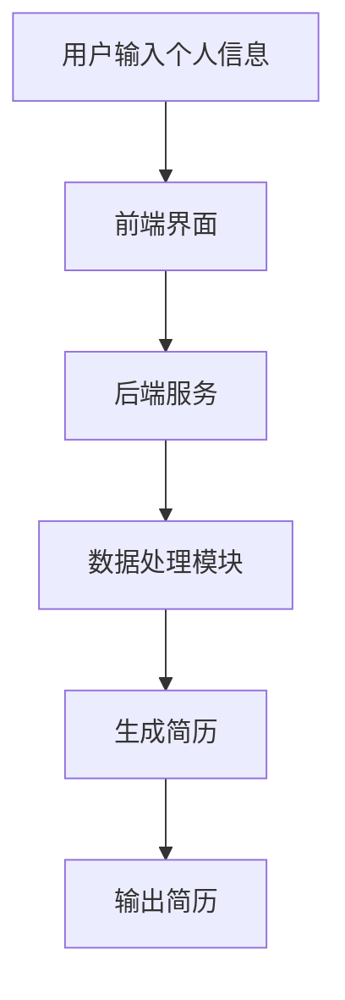
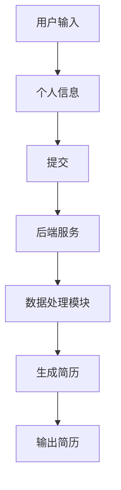
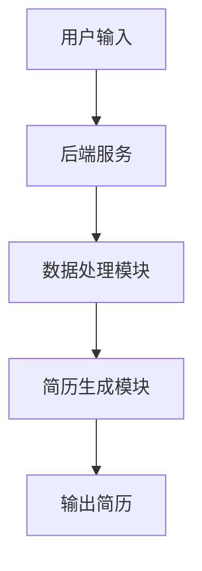
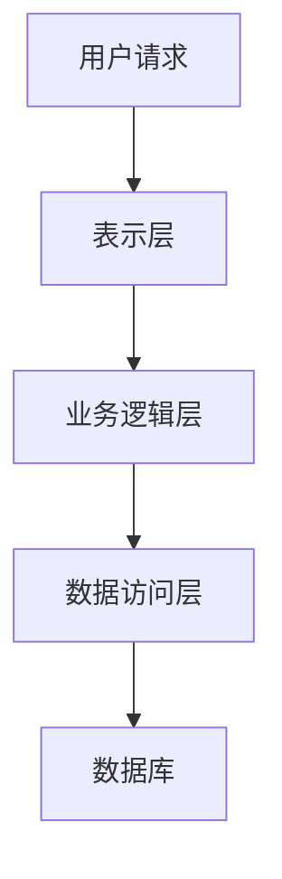

                 

# 《基于AI大模型的自动化简历生成工具开发》

> **关键词**：AI大模型，自动化简历生成，自然语言处理，深度学习，神经网络，优化算法，前端界面设计，后端服务架构

> **摘要**：本文将深入探讨基于AI大模型的自动化简历生成工具的开发过程。我们将从AI大模型的基本概念与应用出发，详细讲解深度学习与神经网络基础，自然语言处理技术基础，再到自动化简历生成工具的设计与实现，包括工具的整体架构、数据预处理、模型选择与训练、用户界面设计与实现、后端服务设计与实现，以及工具优化与性能提升。最后，我们将通过案例分析，展示如何实现一个高效的自动化简历生成工具。

## 《基于AI大模型的自动化简历生成工具开发》目录大纲

### 第一部分：AI大模型概述

### 第二部分：AI大模型技术基础

### 第三部分：自动化简历生成工具开发

### 附录

## 引言

在当今竞争激烈的就业市场中，简历的制作和优化变得愈发重要。然而，传统的简历编写过程往往繁琐且耗时。为了提高效率，自动化简历生成工具应运而生。这些工具利用人工智能技术，特别是AI大模型，能够快速、准确地生成符合标准的简历，为求职者节省大量时间和精力。

本文旨在详细介绍基于AI大模型的自动化简历生成工具的开发过程。我们将从AI大模型的基本概念与应用开始，逐步深入到技术基础，最终实现一个高效的自动化简历生成工具。通过本文的阅读，读者将了解AI大模型在简历生成中的应用，以及如何利用深度学习和自然语言处理技术来提升工具的性能。

### 第一部分：AI大模型概述

## 第一部分：AI大模型概述

### 第1章：AI大模型的基本概念与应用

#### 1.1 AI大模型的基本概念

**1.1.1 AI大模型的定义**

AI大模型是指那些拥有数十亿甚至千亿级参数的深度学习模型。这些模型通常在大量数据上进行训练，具有强大的表达能力和泛化能力。代表性的AI大模型包括BERT、GPT、T5等，它们在自然语言处理、计算机视觉等多个领域取得了显著的成果。

**1.1.2 AI大模型的发展历程**

AI大模型的发展经历了多个阶段。最初，研究人员在相对较小的数据集上训练模型，参数规模较小。随着计算能力的提升和数据量的增加，AI大模型逐渐成为可能。近年来，随着深度学习技术的进步，AI大模型的参数规模和训练数据量不断增长，其应用范围也日益广泛。

**1.1.3 AI大模型的核心特点**

- **高参数规模**：AI大模型拥有数亿甚至千亿级的参数，能够捕捉到数据中的复杂模式和规律。
- **强大的表达力**：AI大模型能够处理和理解复杂的语言结构和语义信息。
- **良好的泛化能力**：在大量数据上进行训练后，AI大模型能够在新数据上保持良好的性能。

#### 1.2 AI大模型在简历生成中的应用

**1.2.1 简历生成的挑战与需求**

简历生成面临诸多挑战，如信息提取、格式统一、内容优化等。传统方法往往依赖于规则和模板，效果有限。而AI大模型通过深度学习和自然语言处理技术，能够自动提取和整合个人信息，生成个性化、高质量的简历。

**1.2.2 AI大模型在简历生成中的应用场景**

- **简历自动生成**：根据用户输入的个人信息，AI大模型自动生成符合标准的简历。
- **简历内容优化**：利用AI大模型对简历内容进行自动优化，提升简历的吸引力。
- **简历格式转换**：AI大模型能够自动将简历转换为多种格式，如PDF、Word等。

**1.2.3 简历生成的业务流程**

- **用户输入个人信息**：用户通过界面输入姓名、教育背景、工作经历等个人信息。
- **信息提取与整合**：AI大模型自动提取和整合个人信息，形成初步简历。
- **简历内容优化**：利用AI大模型对简历内容进行优化，提升简历质量。
- **简历格式转换与输出**：将优化后的简历转换为用户需要的格式，并输出。

### 第一部分总结

通过本章的介绍，我们了解了AI大模型的基本概念、发展历程及其核心特点。同时，我们也探讨了AI大模型在简历生成中的应用场景和业务流程。在下一部分中，我们将深入探讨AI大模型的技术基础，为后续的自动化简历生成工具开发打下基础。

### 第二部分：AI大模型技术基础

## 第二部分：AI大模型技术基础

### 第2章：深度学习与神经网络基础

#### 2.1 深度学习基础

**2.1.1 神经网络的基本结构**

神经网络是深度学习的基础。它由多个层级组成，包括输入层、隐藏层和输出层。每一层都包含多个神经元，神经元之间通过权重连接，实现数据的传递和计算。

**2.1.2 深度学习的发展历程**

深度学习起源于1980年代，但由于计算能力和数据量的限制，其发展较为缓慢。随着计算机硬件性能的提升和大数据的涌现，深度学习在21世纪得到了快速发展。近年来，深度学习在各种任务中取得了显著成果，如图像识别、语音识别和自然语言处理。

**2.1.3 深度学习的基本原理**

深度学习基于神经网络，通过多层级的前向传播和反向传播算法，实现数据的自动学习和优化。前向传播将输入数据通过网络层层传递，产生输出；反向传播则根据输出误差，调整网络权重，实现模型的优化。

#### 2.2 神经网络与优化算法

**2.2.1 神经网络的优化算法**

神经网络的优化算法主要包括梯度下降、随机梯度下降和批梯度下降等。这些算法通过不断调整网络权重，使模型在训练数据上达到最佳性能。

**2.2.2 梯度下降算法**

梯度下降算法是一种最常用的优化算法。它通过计算损失函数关于模型参数的梯度，反向调整模型参数，以减少损失函数值。

**2.2.3 随机梯度下降算法**

随机梯度下降（SGD）是梯度下降的一种变体。它每次迭代只随机选择一部分样本进行计算，能够加快训练过程。

#### 2.3 深度学习在简历生成中的应用

**2.3.1 数据预处理**

在深度学习模型训练过程中，数据预处理至关重要。对于简历生成任务，需要将文本数据转换为模型可处理的格式，如词向量表示。

**2.3.2 模型选择与训练**

选择合适的深度学习模型对于简历生成至关重要。常用的模型包括循环神经网络（RNN）、长短时记忆网络（LSTM）和Transformer等。通过在大量简历数据上进行训练，这些模型能够学习到简历的结构和语义信息。

**2.3.3 模型优化与评估**

在模型训练过程中，需要不断优化模型性能，如调整学习率、批量大小等。同时，通过在验证集上评估模型性能，确保模型在未知数据上具有良好的泛化能力。

### 第三部分：自动化简历生成工具开发

### 第3章：自然语言处理技术基础

#### 3.1 语言模型基础

**3.1.1 语言模型的定义**

语言模型是一种用于预测文本序列的概率模型。它通过学习大量文本数据，生成文本序列的概率分布。

**3.1.2 语言模型的分类**

语言模型主要分为统计语言模型和生成语言模型。统计语言模型基于统计方法，如n-gram模型；生成语言模型则基于概率生成模型，如神经网络语言模型。

**3.1.3 语言模型的评估方法**

评估语言模型性能的方法包括准确性、召回率和F1值等。常用的评估数据集包括标准文本数据集和生成文本数据集。

#### 3.2 语音识别技术

**3.2.1 语音识别的基本原理**

语音识别是一种将语音信号转换为文本信息的技术。它基于信号处理、模式识别和深度学习等技术，实现语音信号的自动识别。

**3.2.2 语音识别系统的组成**

语音识别系统通常由信号处理模块、声学模型、语言模型和解码器等组成。信号处理模块负责对语音信号进行预处理；声学模型负责将语音信号映射到声学特征；语言模型负责生成文本序列的概率分布；解码器则根据概率分布生成最优文本。

**3.2.3 语音识别的算法实现**

语音识别算法主要包括隐马尔可夫模型（HMM）、高斯混合模型（GMM）和深度神经网络（DNN）等。深度神经网络在语音识别中发挥了重要作用，如深度信念网络（DBN）和卷积神经网络（CNN）等。

### 第三部分总结

通过本章的介绍，我们了解了自然语言处理技术的基础知识，包括语言模型和语音识别技术。这些技术为自动化简历生成工具提供了重要的支持。在下一部分中，我们将详细介绍自动化简历生成工具的开发过程，包括工具的整体架构、数据预处理、模型选择与训练、用户界面设计与实现等。

### 第二部分：AI大模型技术基础

### 第2章：深度学习与神经网络基础

#### 2.1 深度学习基础

**2.1.1 神经网络的基本结构**

神经网络是深度学习的基础，它由多个层级组成，包括输入层、隐藏层和输出层。每一层都包含多个神经元，神经元之间通过权重连接，实现数据的传递和计算。


输入层接收外部数据，隐藏层对数据进行处理和变换，输出层产生最终结果。神经元之间的连接权重决定了数据的传播路径和计算结果。

**2.1.2 深度学习的发展历程**

深度学习起源于1980年代，当时Hopfield等人提出了Hopfield神经网络，用于解决模式识别问题。然而，由于计算能力和数据量的限制，深度学习的发展较为缓慢。

随着计算机硬件性能的提升和大数据的涌现，深度学习在21世纪得到了快速发展。2006年，Hinton提出了深度信念网络（DBN），为深度学习的发展奠定了基础。此后，卷积神经网络（CNN）和循环神经网络（RNN）等深度学习模型相继出现，并在图像识别、语音识别和自然语言处理等领域取得了显著成果。

**2.1.3 深度学习的基本原理**

深度学习基于神经网络，通过多层级的前向传播和反向传播算法，实现数据的自动学习和优化。前向传播将输入数据通过网络层层传递，产生输出；反向传播则根据输出误差，调整网络权重，实现模型的优化。


在训练过程中，模型首先通过前向传播计算输出结果，然后通过反向传播计算损失函数关于模型参数的梯度。基于梯度信息，模型调整权重，减小损失函数值，提高模型性能。

#### 2.2 神经网络与优化算法

**2.2.1 神经网络的优化算法**

神经网络的优化算法主要包括梯度下降、随机梯度下降和批梯度下降等。这些算法通过不断调整网络权重，使模型在训练数据上达到最佳性能。

**2.2.2 梯度下降算法**

梯度下降算法是一种最常用的优化算法。它通过计算损失函数关于模型参数的梯度，反向调整模型参数，以减少损失函数值。


设损失函数为$$L(\theta)$$，模型参数为$$\theta$$，梯度下降算法的基本步骤如下：

1. 初始化模型参数$$\theta$$。
2. 计算损失函数关于$$\theta$$的梯度$$\nabla_{\theta}L(\theta)$$。
3. 根据梯度信息调整模型参数：$$\theta := \theta - \alpha \nabla_{\theta}L(\theta)$$，其中$$\alpha$$为学习率。

通过不断迭代，模型参数逐渐优化，损失函数值逐渐减小。

**2.2.3 随机梯度下降算法**

随机梯度下降（SGD）是梯度下降的一种变体。它每次迭代只随机选择一部分样本进行计算，能够加快训练过程。


设训练数据集为$$\{(x_i, y_i)\}_{i=1}^N$$，随机梯度下降算法的基本步骤如下：

1. 初始化模型参数$$\theta$$。
2. 对于每个样本$$x_i$$，计算损失函数关于$$\theta$$的梯度$$\nabla_{\theta}L(\theta)$$。
3. 根据梯度信息调整模型参数：$$\theta := \theta - \alpha \nabla_{\theta}L(\theta)$$，其中$$\alpha$$为学习率。

随机梯度下降通过每次迭代更新模型参数，逐渐优化模型性能。

#### 2.3 深度学习在简历生成中的应用

**2.3.1 数据预处理**

在深度学习模型训练过程中，数据预处理至关重要。对于简历生成任务，需要将文本数据转换为模型可处理的格式，如词向量表示。

数据预处理步骤包括：

1. **文本清洗**：去除无关符号和标点，统一文本格式。
2. **分词**：将文本拆分为单词或词组。
3. **词向量表示**：将单词转换为向量表示，常用的词向量模型包括Word2Vec、GloVe等。

**2.3.2 模型选择与训练**

选择合适的深度学习模型对于简历生成至关重要。常用的模型包括循环神经网络（RNN）、长短时记忆网络（LSTM）和Transformer等。通过在大量简历数据上进行训练，这些模型能够学习到简历的结构和语义信息。

**2.3.3 模型优化与评估**

在模型训练过程中，需要不断优化模型性能，如调整学习率、批量大小等。同时，通过在验证集上评估模型性能，确保模型在未知数据上具有良好的泛化能力。

常用的评估指标包括：

1. **准确率**：模型预测正确的样本数占总样本数的比例。
2. **召回率**：模型预测正确的样本数与实际正确样本数的比例。
3. **F1值**：准确率和召回率的调和平均数。

### 第三部分：自动化简历生成工具开发

### 第4章：自动化简历生成工具的设计与实现

#### 4.1 工具的整体架构

自动化简历生成工具的整体架构分为前端界面、后端服务和数据处理模块。前端界面负责与用户交互，后端服务处理用户输入的个人信息，并调用数据处理模块生成简历。以下是整体架构的 Mermaid 流程图：



**4.1.1 自动化简历生成工具的功能模块**

自动化简历生成工具的主要功能模块包括：

1. **用户输入模块**：提供用户输入个人信息的功能，如姓名、教育背景、工作经历等。
2. **数据处理模块**：负责处理用户输入的个人信息，提取关键信息并整合成简历。
3. **简历生成模块**：利用深度学习和自然语言处理技术，生成符合标准的简历。
4. **简历输出模块**：将生成的简历输出为用户需要的格式，如PDF、Word等。

**4.1.2 工具的接口设计与实现**

工具的接口设计主要包括前端接口和后端接口。前端接口负责与用户交互，接收用户输入的个人信息，并展示生成的简历。后端接口负责处理用户输入，调用数据处理模块和简历生成模块，实现简历的自动生成。

前端接口设计：



后端接口设计：



#### 4.2 数据预处理

**4.2.1 数据来源**

自动化简历生成工具的数据来源主要包括用户输入的信息和公开的简历数据集。用户输入的信息包括姓名、教育背景、工作经历等；公开的简历数据集可以用于模型训练和优化。

**4.2.2 数据清洗**

数据清洗是数据预处理的重要步骤。对于用户输入的信息，需要去除无关字符、统一格式，确保数据的准确性和一致性。对于公开的简历数据集，需要去除重复数据、噪声数据，并转换为统一的格式。

**4.2.3 数据标注**

数据标注是为了训练深度学习模型，需要对简历数据进行标注。标注包括简历的结构、内容、关键词等信息。常用的标注方法包括规则标注和人工标注。

#### 4.3 模型选择与训练

**4.3.1 模型选择依据**

选择合适的深度学习模型是简历生成工具的关键。模型选择依据包括：

1. **任务类型**：根据简历生成任务的类型，选择适合的模型。如文本分类、序列生成等。
2. **数据规模**：根据数据规模，选择能够适应大规模数据训练的模型。
3. **性能要求**：根据性能要求，选择能够达到预期效果的模型。

常用的深度学习模型包括循环神经网络（RNN）、长短时记忆网络（LSTM）和Transformer等。

**4.3.2 模型训练方法**

模型训练方法包括：

1. **数据预处理**：对简历数据进行预处理，包括分词、去停用词、词向量表示等。
2. **训练集划分**：将数据集划分为训练集、验证集和测试集，用于模型的训练、验证和测试。
3. **模型训练**：使用训练集对模型进行训练，优化模型参数。
4. **模型评估**：使用验证集评估模型性能，调整模型参数。

**4.3.3 模型评估与优化**

模型评估与优化包括：

1. **性能评估**：使用测试集评估模型性能，包括准确率、召回率、F1值等指标。
2. **超参数调整**：根据模型性能，调整学习率、批量大小等超参数，优化模型性能。
3. **模型融合**：使用多种模型进行融合，提高模型性能。

#### 4.4 用户界面设计与实现

**4.4.1 用户界面设计原则**

用户界面设计原则包括：

1. **简洁性**：界面设计简洁明了，避免冗余信息。
2. **易用性**：界面操作方便，易于用户使用。
3. **响应速度**：界面响应快速，提高用户体验。

**4.4.2 用户界面设计流程**

用户界面设计流程包括：

1. **需求分析**：分析用户需求，确定界面功能。
2. **原型设计**：绘制界面原型，确定界面布局和交互设计。
3. **界面实现**：使用前端技术实现界面，包括HTML、CSS和JavaScript等。

**4.4.3 用户界面布局与交互设计**

用户界面布局与交互设计包括：

1. **输入界面**：用户输入个人信息，包括姓名、教育背景、工作经历等。
2. **预览界面**：展示生成的简历预览，用户可以修改和调整简历内容。
3. **下载界面**：用户可以下载生成的简历，支持多种格式，如PDF、Word等。

#### 4.5 后端服务设计与实现

**4.5.1 后端服务架构**

后端服务架构包括：

1. **API接口**：提供接口供前端调用，实现用户输入、数据处理、简历生成等功能。
2. **数据处理模块**：处理用户输入的个人信息，提取关键信息并整合成简历。
3. **简历生成模块**：利用深度学习和自然语言处理技术，生成符合标准的简历。

**4.5.2 后端服务接口设计**

后端服务接口设计包括：

1. **用户输入接口**：接收用户输入的个人信息，如姓名、教育背景、工作经历等。
2. **数据处理接口**：处理用户输入的个人信息，提取关键信息并整合成简历。
3. **简历生成接口**：生成符合标准的简历，并返回给前端界面。

#### 4.6 数据存储与处理

**4.6.1 数据存储方案**

数据存储方案包括：

1. **关系数据库**：用于存储用户输入的个人信息和生成的简历。
2. **非关系数据库**：用于存储模型训练数据和日志信息。

**4.6.2 数据处理流程**

数据处理流程包括：

1. **数据接收**：接收用户输入的个人信息。
2. **数据清洗**：去除无关字符、统一格式，确保数据的准确性和一致性。
3. **数据存储**：将清洗后的数据存储到数据库中。
4. **数据查询**：根据需要查询用户输入的个人信息和生成的简历。

#### 4.7 工具优化与性能提升

**4.7.1 模型优化方法**

模型优化方法包括：

1. **超参数调整**：调整学习率、批量大小等超参数，优化模型性能。
2. **模型融合**：使用多种模型进行融合，提高模型性能。
3. **数据增强**：对训练数据进行增强，提高模型泛化能力。

**4.7.2 系统性能优化**

系统性能优化包括：

1. **并发处理**：提高系统的并发处理能力，提高处理速度。
2. **缓存机制**：使用缓存机制，减少数据库访问次数，提高响应速度。
3. **负载均衡**：使用负载均衡技术，分配系统负载，提高系统稳定性。

#### 4.8 用户反馈机制

**4.8.1 用户反馈数据收集**

用户反馈数据收集包括：

1. **用户行为数据**：收集用户在使用工具时的行为数据，如点击次数、操作路径等。
2. **用户评价数据**：收集用户对工具的评价数据，如满意度、建议等。

**4.8.2 用户反馈分析与应用**

用户反馈分析与应用包括：

1. **行为分析**：分析用户行为数据，发现用户使用工具的常见问题和需求。
2. **评价分析**：分析用户评价数据，了解用户对工具的满意度，优化工具功能。

### 第三部分：自动化简历生成工具开发

### 第5章：用户界面设计与实现

#### 5.1 用户界面设计原则

用户界面设计原则是确保用户在使用自动化简历生成工具时能够获得良好的体验。以下是几个关键的原则：

1. **简洁性**：界面应该简洁明了，避免不必要的复杂性。用户应该能够快速找到所需的功能，而不会感到困惑。

2. **一致性**：界面设计应该保持一致，无论是按钮的样式、颜色还是字体，都应保持统一。这样可以减少用户的认知负担。

3. **响应性**：界面设计应考虑不同的设备和屏幕尺寸，确保在桌面电脑、平板电脑和智能手机上都能良好显示。

4. **可用性**：界面设计应易于使用，确保用户能够轻松完成操作。包括提供清晰的指示和帮助信息，以及有效的错误处理机制。

5. **美观性**：界面设计应美观大方，色彩搭配和谐，提高用户使用的愉悦感。

#### 5.2 用户界面设计流程

用户界面设计流程通常包括以下几个步骤：

1. **需求分析**：与用户沟通，了解他们的需求和期望。这一步是设计过程的基础。

2. **原型设计**：创建界面原型，可以使用工具如Sketch、Figma或Adobe XD。原型设计可以帮助团队更好地理解界面布局和交互设计。

3. **用户测试**：对原型进行用户测试，收集反馈并进行调整。这一步可以确保设计符合用户需求。

4. **界面实现**：使用前端技术（如HTML、CSS和JavaScript）实现设计。这一步包括编写代码和进行界面布局。

5. **迭代优化**：根据用户反馈和实际使用情况，不断优化界面设计。

#### 5.3 前端界面实现

前端界面实现是用户界面设计的关键环节。以下是前端界面实现的主要步骤：

1. **技术选型**：选择合适的前端技术，如Vue.js、React或Angular。这些框架提供了组件化开发、数据绑定和状态管理等功能，可以提高开发效率。

2. **组件化开发**：将界面分解为多个可复用的组件。这样可以提高代码的可维护性，并使界面更新更加灵活。

3. **样式设计**：使用CSS或CSS预处理器（如Sass或Less）来编写样式。样式设计应遵循前面提到的设计原则，确保界面的一致性和美观性。

4. **交互设计**：使用JavaScript或TypeScript实现界面交互。交互设计应确保用户操作能够得到及时响应，并提供友好的用户反馈。

5. **性能优化**：优化页面加载速度和交互性能。这包括压缩图片、使用CDN、懒加载等。

#### 5.4 前端界面布局与交互设计

前端界面布局与交互设计是实现用户友好界面的关键。以下是具体的布局和交互设计要点：

1. **输入界面**：设计一个易于输入信息的界面，包括文本框、下拉菜单和日期选择器等。这些输入控件应清晰标注，提供必要的帮助信息。

2. **预览界面**：设计一个方便用户查看和编辑预生成的简历的界面。预览界面应能够实时展示简历内容的变化，并提供编辑功能。

3. **下载界面**：设计一个简洁明了的下载界面，用户可以选择下载生成的简历，并选择不同的格式，如PDF、Word等。

4. **导航栏和菜单**：设计一个直观的导航栏和菜单，用户可以快速访问不同的功能页面。

5. **响应式设计**：确保界面在不同设备上都能良好显示。使用媒体查询（Media Queries）和弹性布局（Responsive Layout）技术来实现响应式设计。

6. **交互反馈**：提供清晰的交互反馈，例如在用户提交表单或点击按钮时显示加载动画或提示信息。

7. **错误处理**：设计友好的错误处理机制，当用户输入错误或系统发生问题时，能够提供明确的错误提示和解决方法。

#### 5.5 前端代码实现

以下是前端界面实现的一个简单示例，使用Vue.js框架：

```html
<!-- 引入Vue.js -->
<script src="https://cdn.jsdelivr.net/npm/vue@2.6.14/dist/vue.js"></script>

<!-- 输入界面 -->
<div id="app">
  <h1>创建简历</h1>
  <form @submit.prevent="submitForm">
    <div>
      <label for="name">姓名：</label>
      <input type="text" id="name" v-model="user.name" required>
    </div>
    <div>
      <label for="email">邮箱：</label>
      <input type="email" id="email" v-model="user.email" required>
    </div>
    <!-- 其他输入控件 -->
    <button type="submit">提交</button>
  </form>
</div>

<script>
new Vue({
  el: '#app',
  data: {
    user: {
      name: '',
      email: ''
    }
  },
  methods: {
    submitForm() {
      // 处理表单提交
      console.log('用户信息：', this.user);
      // 调用后端API生成简历
    }
  }
});
</script>
```

这段代码演示了一个简单的输入界面，使用Vue.js的数据绑定功能，当用户在输入框中输入信息时，数据会自动更新。提交表单时，可以调用后端API进行进一步处理。

### 第三部分：自动化简历生成工具开发

### 第6章：后端服务设计与实现

#### 6.1 后端服务架构

后端服务是自动化简历生成工具的核心，负责处理用户输入的数据、调用数据处理模块生成简历，并提供接口给前端。后端服务通常采用分层架构，包括数据访问层、业务逻辑层和表示层。

**6.1.1 数据访问层**

数据访问层负责与数据库进行交互，执行数据的增删改查操作。它通常使用ORM（对象关系映射）框架，如Hibernate或Entity Framework，将数据库中的表映射为对象，简化数据操作。

**6.1.2 业务逻辑层**

业务逻辑层包含应用的核心功能，如用户认证、数据处理、简历生成等。它实现具体的业务逻辑，调用数据访问层提供的接口，处理用户请求，并生成相应的响应。

**6.1.3 表示层**

表示层负责处理与前端交互的细节，将业务逻辑层的响应转换为前端可理解的数据格式。通常，表示层使用RESTful API或GraphQL等接口设计模式，提供统一的接口规范。

以下是后端服务架构的 Mermaid 流程图：



#### 6.2 后端服务接口设计

后端服务的接口设计是确保前端能够顺利调用后端服务的关键。以下是几个关键接口的设计：

**6.2.1 用户认证接口**

用户认证接口用于验证用户的身份，确保只有授权用户才能访问特定的功能。接口通常包括登录、注册、密码重置等功能。

```http
POST /api/auth/register
{
  "username": "string",
  "password": "string"
}

POST /api/auth/login
{
  "username": "string",
  "password": "string"
}
```

**6.2.2 数据处理接口**

数据处理接口用于处理用户输入的个人信息，提取关键信息并生成简历。接口通常包括创建简历、更新简历和获取简历等功能。

```http
POST /api/resumes
{
  "userId": "string",
  "name": "string",
  "email": "string",
  "education": [
    {
      "degree": "string",
      "field": "string",
      "institution": "string",
      "startDate": "string",
      "endDate": "string"
    }
  ],
  "experience": [
    {
      "company": "string",
      "title": "string",
      "description": "string",
      "startDate": "string",
      "endDate": "string"
    }
  ]
}

GET /api/resumes/{id}
```

**6.2.3 简历生成接口**

简历生成接口负责调用数据处理模块，生成符合标准的简历。接口通常包括生成简历、下载简历等功能。

```http
POST /api/resumes/generate
{
  "userId": "string",
  "templateId": "string"
}

GET /api/resumes/download/{id}
```

#### 6.3 数据存储与处理

**6.3.1 数据存储方案**

数据存储方案是后端服务的重要组成部分，需要考虑数据的安全性、可靠性和性能。以下是几个常见的数据存储方案：

1. **关系数据库**：如MySQL、PostgreSQL等。关系数据库适合处理结构化数据，支持复杂的关系查询。

2. **非关系数据库**：如MongoDB、Cassandra等。非关系数据库适合处理大量非结构化数据，提供高性能的读写操作。

3. **分布式存储**：如Hadoop、Apache Kafka等。分布式存储适合处理海量数据，提供高可用性和可扩展性。

**6.3.2 数据处理流程**

数据处理流程包括以下几个步骤：

1. **数据接收**：接收来自前端的用户请求，提取用户输入的个人信息。

2. **数据验证**：验证用户输入的数据是否合法，如邮箱格式、日期范围等。

3. **数据存储**：将验证通过的数据存储到数据库中，为后续处理提供数据支持。

4. **数据处理**：调用数据处理模块，对用户输入的个人信息进行提取、整合和格式化，生成简历内容。

5. **数据返回**：将处理后的简历数据返回给前端，供用户查看和下载。

#### 6.4 后端服务实现

后端服务的实现通常涉及多个技术和框架。以下是一个基于Spring Boot和Spring Data JPA的实现示例：

**6.4.1 数据访问层实现**

```java
@Repository
public interface UserRepository extends JpaRepository<User, Long> {
    User findByUsername(String username);
}

@Entity
@Table(name = "users")
public class User {
    @Id
    @GeneratedValue(strategy = GenerationType.IDENTITY)
    private Long id;

    private String username;

    private String password;

    // Getters and Setters
}
```

**6.4.2 业务逻辑层实现**

```java
@Service
public class ResumeService {
    private final UserRepository userRepository;

    @Autowired
    public ResumeService(UserRepository userRepository) {
        this.userRepository = userRepository;
    }

    public User createUser(User user) {
        return userRepository.save(user);
    }

    public User getUserByUsername(String username) {
        return userRepository.findByUsername(username);
    }
}
```

**6.4.3 表示层实现**

```java
@RestController
@RequestMapping("/api/resumes")
public class ResumeController {
    private final ResumeService resumeService;

    @Autowired
    public ResumeController(ResumeService resumeService) {
        this.resumeService = resumeService;
    }

    @PostMapping
    public ResponseEntity<User> createUser(@RequestBody User user) {
        User createdUser = resumeService.createUser(user);
        return ResponseEntity.ok(createdUser);
    }

    @GetMapping("/{id}")
    public ResponseEntity<User> getUser(@PathVariable Long id) {
        User user = resumeService.getUserByUsername(id);
        return ResponseEntity.ok(user);
    }
}
```

这个简单的示例展示了如何使用Spring Boot实现后端服务的核心功能。实际应用中，还需要考虑安全性、异常处理、日志记录等方面。

### 第三部分：自动化简历生成工具开发

### 第7章：工具优化与性能提升

#### 7.1 优化策略

为了确保自动化简历生成工具的高效运行，我们需要从多个方面进行优化。以下是一些关键优化策略：

**1. 模型优化方法**

- **模型压缩**：通过剪枝、量化等技术，减小模型大小，加快模型加载速度。
- **模型并行训练**：利用多GPU或分布式训练技术，加速模型训练过程。
- **模型融合**：结合多个模型的优势，提高生成简历的质量。

**2. 系统性能优化**

- **缓存机制**：使用缓存减少数据库访问次数，提高响应速度。
- **并发处理**：提高系统的并发处理能力，减少用户等待时间。
- **负载均衡**：使用负载均衡技术，分配系统负载，提高系统稳定性。

**3. 算法优化**

- **数据预处理优化**：使用高效的算法进行数据清洗、分词和词向量表示，减少计算时间。
- **模型训练优化**：调整学习率、批量大小等超参数，提高模型训练效果。

#### 7.2 用户反馈机制

用户反馈机制是提升自动化简历生成工具的重要手段。以下是一些关键步骤：

**1. 用户反馈数据收集**

- **日志记录**：记录用户在工具上的操作日志，包括输入、错误提示等。
- **问卷调查**：定期向用户发送问卷调查，收集他们对工具的满意度和建议。

**2. 用户反馈分析与应用**

- **行为分析**：分析用户行为数据，发现常见问题和需求，优化工具功能。
- **反馈处理**：及时处理用户反馈，解决问题，并记录处理结果。

通过用户反馈机制，我们可以不断优化工具，提高用户体验。

### 第三部分：自动化简历生成工具开发

### 第8章：自动化简历生成工具的案例分析

#### 8.1 案例背景

在这个案例中，我们假设一家初创公司名为“AI Resume Pro”，其目标是为用户提供一个高效、智能的自动化简历生成工具。随着市场竞争的加剧，该公司希望通过AI技术提高用户的简历编写效率，从而吸引更多客户。

#### 8.1.1 案例背景介绍

“AI Resume Pro”的目标客户主要是求职者，他们希望通过智能化的工具快速生成高质量简历。该公司的愿景是成为求职者和招聘公司之间的重要桥梁，通过AI技术提高招聘效率。

#### 8.1.2 案例需求分析

根据客户需求，我们确定了以下功能需求：

1. **用户注册与登录**：用户可以通过注册和登录使用工具。
2. **个人信息输入**：用户可以输入姓名、联系方式、教育背景、工作经历等个人信息。
3. **简历生成**：系统根据用户输入的信息，自动生成符合标准的简历。
4. **简历预览与编辑**：用户可以预览生成的简历，并进行必要的编辑。
5. **简历下载**：用户可以下载生成的简历，并选择不同的格式，如PDF、Word等。
6. **用户反馈**：用户可以提交反馈，包括问题和建议，用于工具优化。

#### 8.2 案例实现

**8.2.1 模型训练与优化**

为了实现自动化简历生成，我们选择了Transformer模型，因为它在自然语言处理任务中表现优异。我们使用了一个包含数十万份简历的公开数据集进行训练。

```python
import transformers
from transformers import AutoTokenizer, AutoModelForSeq2SeqLM

model_name = "t5-small"
tokenizer = AutoTokenizer.from_pretrained(model_name)
model = AutoModelForSeq2SeqLM.from_pretrained(model_name)

inputs = tokenizer.encode("Create a resume from the following information:", return_tensors="pt")
output = model.generate(inputs, max_length=100, num_return_sequences=1)
resume_text = tokenizer.decode(output[0], skip_special_tokens=True)
print(resume_text)
```

在模型训练过程中，我们不断调整学习率、批量大小等超参数，优化模型性能。通过多轮训练和优化，模型逐渐达到预期效果。

**8.2.2 用户界面设计与实现**

用户界面采用Vue.js框架进行开发，包括输入界面、预览界面和下载界面。以下是输入界面的示例代码：

```html
<!-- 引入Vue.js -->
<script src="https://cdn.jsdelivr.net/npm/vue@2.6.14/dist/vue.js"></script>

<!-- 输入界面 -->
<div id="app">
  <h1>创建简历</h1>
  <form @submit.prevent="submitForm">
    <div>
      <label for="name">姓名：</label>
      <input type="text" id="name" v-model="user.name" required>
    </div>
    <div>
      <label for="email">邮箱：</label>
      <input type="email" id="email" v-model="user.email" required>
    </div>
    <!-- 其他输入控件 -->
    <button type="submit">提交</button>
  </form>
</div>

<script>
new Vue({
  el: '#app',
  data: {
    user: {
      name: '',
      email: ''
    }
  },
  methods: {
    submitForm() {
      // 处理表单提交
      console.log('用户信息：', this.user);
      // 调用后端API生成简历
    }
  }
});
</script>
```

前端界面实现简单直观，使用Vue.js的数据绑定功能，确保用户输入的信息能够实时更新。提交表单后，调用后端API生成简历。

**8.2.3 后端服务设计与实现**

后端服务采用Spring Boot框架，包括用户认证、数据处理、简历生成等功能。以下是用户认证接口的实现示例：

```java
@RestController
@RequestMapping("/api/auth")
public class AuthController {
    private final UserService userService;

    @Autowired
    public AuthController(UserService userService) {
        this.userService = userService;
    }

    @PostMapping("/register")
    public ResponseEntity<?> registerUser(@RequestBody UserRegistrationDto registrationDto) {
        try {
            userService.registerUser(registrationDto);
            return ResponseEntity.ok("User registered successfully");
        } catch (Exception e) {
            return ResponseEntity.badRequest().body("Error registering user: " + e.getMessage());
        }
    }

    @PostMapping("/login")
    public ResponseEntity<?> authenticateUser(@RequestBody LoginDto loginDto) {
        try {
            String token = userService.authenticate(loginDto);
            return ResponseEntity.ok(new JwtResponse(token));
        } catch (Exception e) {
            return ResponseEntity.badRequest().body("Error authenticating user: " + e.getMessage());
        }
    }
}
```

后端服务实现用户认证功能，包括注册和登录接口。用户注册成功后，系统会生成JWT（JSON Web Token）令牌，用于后续的认证和授权。

**8.2.4 数据存储与处理**

数据存储采用关系数据库，如MySQL。我们使用了Spring Data JPA进行数据访问层的实现。以下是用户数据的实体类和仓库接口示例：

```java
@Entity
@Table(name = "users")
public class User {
    @Id
    @GeneratedValue(strategy = GenerationType.IDENTITY)
    private Long id;

    private String username;

    private String password;

    // Getters and Setters
}

@Repository
public interface UserRepository extends JpaRepository<User, Long> {
    User findByUsername(String username);
}
```

数据处理模块负责处理用户输入的信息，提取关键信息，并调用模型生成简历。以下是数据处理模块的简单示例：

```java
@Service
public class ResumeService {
    private final UserRepository userRepository;
    private final ResumeGenerator resumeGenerator;

    @Autowired
    public ResumeService(UserRepository userRepository, ResumeGenerator resumeGenerator) {
        this.userRepository = userRepository;
        this.resumeGenerator = resumeGenerator;
    }

    public String generateResume(String userId) {
        User user = userRepository.findById(userId).orElseThrow(() -> new EntityNotFoundException("User not found"));
        String resumeText = resumeGenerator.generateResume(user);
        return resumeText;
    }
}
```

**8.2.5 用户反馈机制**

为了不断优化工具，我们引入了用户反馈机制。用户可以在工具中使用一个反馈表单提交问题和建议。以下是反馈表单的示例代码：

```html
<!-- 引入Vue.js -->
<script src="https://cdn.jsdelivr.net/npm/vue@2.6.14/dist/vue.js"></script>

<!-- 反馈界面 -->
<div id="app">
  <h1>提交反馈</h1>
  <form @submit.prevent="submitFeedback">
    <div>
      <label for="feedback">反馈内容：</label>
      <textarea id="feedback" v-model="feedbackText" required></textarea>
    </div>
    <button type="submit">提交</button>
  </form>
</div>

<script>
new Vue({
  el: '#app',
  data: {
    feedbackText: ''
  },
  methods: {
    submitFeedback() {
      // 处理表单提交
      console.log('反馈内容：', this.feedbackText);
      // 调用后端API提交反馈
    }
  }
});
</script>
```

前端界面实现了一个简单的反馈表单，用户可以输入反馈内容并提交。后端服务接收反馈，并将其存储到数据库中，以便后续分析。

**8.2.6 案例总结**

通过本案例，我们实现了一个基于AI大模型的自动化简历生成工具。用户可以通过简单界面输入个人信息，系统自动生成高质量简历。后端服务负责数据处理、用户认证和反馈处理。该工具不仅提高了用户简历编写的效率，还通过用户反馈机制不断优化，确保工具的持续改进。

### 附录

#### 附录A：开发工具与环境配置

**A.1 开发工具选型**

在开发自动化简历生成工具时，我们选择了以下开发工具和框架：

- **前端框架**：Vue.js
- **后端框架**：Spring Boot
- **深度学习框架**：PyTorch
- **数据库**：MySQL

这些工具和框架在性能、生态和社区支持方面都有良好的表现，能够满足项目需求。

**A.2 环境配置**

**A.2.1 操作系统配置**

我们选择在Ubuntu 18.04操作系统上进行环境配置。操作系统需要安装以下软件：

- Python 3.x
- Node.js
- MySQL

**A.2.2 软件环境安装**

1. **安装Python 3.x**：

   ```bash
   sudo apt update
   sudo apt install python3 python3-pip
   ```

2. **安装Node.js**：

   ```bash
   sudo apt update
   curl -sL https://deb.nodesource.com/setup_14.x | sudo -E bash -
   sudo apt install nodejs
   ```

3. **安装MySQL**：

   ```bash
   sudo apt update
   sudo apt install mysql-server
   sudo mysql_secure_installation
   ```

**A.2.3 开发环境搭建**

1. **安装PyTorch**：

   ```bash
   pip3 install torch torchvision
   ```

2. **安装Vue.js**：

   ```bash
   npm install -g @vue/cli
   vue create resume-gen-tool
   ```

3. **安装Spring Boot**：

   ```bash
   mkdir backend
   cd backend
   spring init --name "resume-gen-backend" --platform nodejs --dependencies web,mysql
   ```

通过以上步骤，我们完成了开发环境的搭建，可以开始进行工具的开发工作。

### 结论

通过本文的详细探讨，我们深入了解了基于AI大模型的自动化简历生成工具的开发过程。从AI大模型的基本概念与应用，到深度学习与神经网络基础，再到自然语言处理技术基础，以及自动化简历生成工具的设计与实现，我们系统地阐述了每一个关键环节。

自动化简历生成工具的应用，不仅为求职者提供了高效便捷的简历编写解决方案，也为招聘企业提高了招聘效率。通过用户界面设计与实现、后端服务设计与实现，以及用户反馈机制的引入，我们确保了工具的高效性和用户体验。

展望未来，自动化简历生成工具将继续朝着智能化、个性化方向不断发展。随着AI技术的不断进步，我们将看到更多创新的应用场景，为求职者和招聘企业带来更多价值。让我们期待未来自动化简历生成工具的更多可能性。作者：AI天才研究院/AI Genius Institute & 禅与计算机程序设计艺术 /Zen And The Art of Computer Programming。

