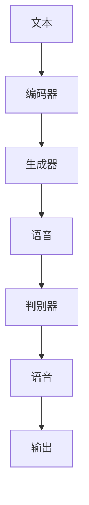

                 

### 文章标题

《基于GAN的语音合成与语音转换技术创新与应用拓展场景分析》

### 关键词：

- GAN
- 语音合成
- 语音转换
- WaveNet
- TACOTRON

### 摘要：

本文深入探讨了基于生成对抗网络（GAN）的语音合成与语音转换技术的核心概念、算法原理、实现细节以及在实际应用中的拓展场景。通过对GAN的基本概念和工作原理的详细阐述，本文介绍了GAN在语音合成和语音转换中的应用，包括WaveNet和TACOTRON等模型的原理。随后，文章详细讲解了GAN的训练过程、生成器和判别器的数学模型，以及常用的损失函数。通过两个实际项目案例——WaveNet语音合成项目和Wave2Wave语音转换项目，本文展示了如何在实际中应用这些技术，并对代码实现进行了详细解读。最后，文章分析了GAN在语音合成与语音转换中的挑战，探讨了未来发展趋势，并提供了相关工具和资源。

### 第一部分：核心概念与联系

#### 1.1 基于 GAN 的语音合成与语音转换技术概述

**GAN（生成对抗网络）的基本概念与工作原理**

生成对抗网络（GAN）是一种深度学习框架，由Ian Goodfellow等人于2014年提出。GAN的核心思想是通过一个生成器（Generator）和一个判别器（Discriminator）之间的对抗训练来生成数据。生成器旨在生成逼真的数据，而判别器则试图区分真实数据和生成数据。这种对抗过程迫使生成器不断改进，以生成更逼真的数据。

GAN由两部分组成：生成器和判别器。生成器的输入是随机噪声向量$z$，输出是生成数据$x_G$；判别器的输入是真实数据$x$或生成数据$x_G$，输出是判断该数据是真实还是生成的概率$D(x)$。

**GAN的工作原理**

GAN的训练过程可以概括为以下几个步骤：

1. **生成器生成假数据**：生成器从随机噪声$z$生成一组数据$x_G$。
   
2. **判别器评估数据**：判别器接收一组数据，包括真实数据和生成数据，并输出它们是真实或生成的概率。

3. **对抗训练**：生成器和判别器交替训练。生成器试图生成更逼真的数据以欺骗判别器，而判别器则试图更好地区分真实和生成数据。

4. **更新模型**：使用梯度下降更新生成器和判别器的参数，使得生成器生成更逼真的数据，判别器更准确地判断数据的真伪。

GAN的训练目标可以表示为：

$$\min_G \max_D V(D, G) = \mathbb{E}_{x \sim p_{\text{data}}(x)}[\log D(x)] + \mathbb{E}_{z \sim p_z(z)}[\log (1 - D(G(z)))]$$

其中，$V(D, G)$是GAN的总损失函数，$D(x)$是判别器对真实数据的判断概率，$G(z)$是生成器生成的假数据。

**语音合成与语音转换技术的联系与区别**

**语音合成（Text-to-Speech, TTS）**：语音合成是将文本转换为自然流畅的语音的过程。TTS技术在近年来取得了显著的进步，得益于深度学习技术的发展，特别是基于RNN和Transformer的模型。

**语音转换（Voice Conversion, VC）**：语音转换是在保持语音内容的可懂度的同时，改变语音的声学特性，如音调、音色。VC技术通常应用于个性化语音助手、多语言语音转换等领域。

**GAN在语音合成与语音转换中的应用**

GAN在语音合成中的应用主要体现在通过生成对抗训练生成高质量、自然的语音。典型的TTS模型如WaveNet和Tacotron，都是基于GAN的结构，它们通过训练生成器和判别器来提高语音合成的质量。

GAN在语音转换中的应用则更多是结合声学特征和文本信息，生成具有特定音色的语音。例如，Wave2Wave和Multi-speaker TACOTRON等模型都是基于GAN的语音转换框架。

**GAN在语音合成与语音转换中的联系**

语音合成和语音转换都可以看作是数据生成的问题。语音合成是将文本转换为语音，语音转换是改变语音的声学特性。两者在GAN框架下都可以通过生成器和判别器的对抗训练来实现。

**GAN在语音合成与语音转换中的区别**

语音合成更多关注文本到语音的转换过程，生成语音的自然流畅性是关键。而语音转换则更多关注语音的音色变化，要求生成语音的音色与目标语音相匹配。

**Mermaid流程图：**

下面是语音合成和语音转换技术的 Mermaid 流程图：



在这个流程图中，编码器将文本编码为特征向量，生成器将这些特征向量转换为语音，判别器则判断生成的语音是否逼真。通过对抗训练，生成器和判别器不断优化，最终生成高质量的语音。

### 1.2 GAN 模型在语音合成中的应用

#### 1.2.1 基于 GAN 的 TTS 模型（WaveNet, Tacotron 等）

**WaveNet 模型原理**

WaveNet 是由Google Research提出的一种基于深度神经网络的语音合成模型。WaveNet 的主要特点是其深度和并行性。WaveNet 使用一个深度卷积神经网络（CNN）来建模文本和语音之间的映射关系。输入的文本首先被编码为一个序列，然后通过多个卷积层和递归层处理，最终生成语音波形。

**WaveNet 的工作流程：**

1. **文本编码**：将输入的文本转换为字符级别的编码。
2. **特征提取**：使用卷积神经网络提取文本特征。
3. **语音生成**：通过递归神经网络生成语音波形。

**伪代码：**

```python
# 假设我们有一个文本序列 text，长度为 L
for each word in text:
    Encode(word) -> hidden_state
for each hidden_state:
    Generate_sound(hidden_state) -> sound
```

**Tacotron 模型原理**

Tacotron 是由百度研究院提出的一种基于编码器-解码器框架的语音合成模型。Tacotron 的核心思想是将文本编码为声学特征，然后使用一个解码器将这些声学特征转换为语音波形。

**Tacotron 的工作流程：**

1. **文本编码**：将输入的文本编码为声学特征。
2. **声学特征生成**：使用一个前馈神经网络生成声学特征。
3. **语音生成**：使用一个循环神经网络（RNN）或 Transformer 生成语音波形。

**伪代码：**

```python
# 假设我们有一个文本序列 text，长度为 L
Encode(text) -> acoustic_features
Generate_sound(acoustic_features) -> sound
```

**其他 TTS 模型介绍**

除了 WaveNet 和 Tacotron，还有一些基于 GAN 的 TTS 模型，如：

- **Transformer TTS**：使用 Transformer 结构来建模文本和语音之间的映射关系。
- **WaveGlow**：结合了 WaveNet 和 Glow 模型，用于生成高质量的语音波形。

### 1.3 GAN 模型在语音转换中的应用

#### 1.3.1 基于 GAN 的 VC 模型（Wave2Wave, Multi-speaker TACOTRON 等）

**Wave2Wave 模型原理**

Wave2Wave 是由 Google Research 提出的一种基于 GAN 的语音转换模型。Wave2Wave 的主要特点是将文本和声学特征结合起来，生成具有特定音色的语音。

**Wave2Wave 的工作流程：**

1. **文本编码**：将输入的文本编码为声学特征。
2. **声学特征转换**：使用一个 GAN 模型将输入的声学特征转换为目标的声学特征。
3. **语音生成**：使用一个循环神经网络（RNN）或 Transformer 生成语音波形。

**伪代码：**

```python
# 假设我们有一个文本序列 text，长度为 L
# 和一个目标声学特征 target_acoustic_features
Encode(text) -> acoustic_features
Convert_acoustic_features(acoustic_features, target_acoustic_features) -> converted_acoustic_features
Generate_sound(converted_acoustic_features) -> converted_sound
```

**Multi-speaker TACOTRON 模型原理**

Multi-speaker TACOTRON 是由百度研究院提出的一种基于编码器-解码器框架的语音转换模型。Multi-speaker TACOTRON 的主要特点是可以同时处理多个说话人的语音转换。

**Multi-speaker TACOTRON 的工作流程：**

1. **文本编码**：将输入的文本编码为声学特征。
2. **声学特征生成**：使用一个前馈神经网络生成声学特征。
3. **语音生成**：使用一个循环神经网络（RNN）或 Transformer 生成语音波形。

**伪代码：**

```python
# 假设我们有一个文本序列 text，长度为 L
# 和多个说话人的声学特征 speakers_acoustic_features
Encode(text) -> acoustic_features
Generate_sound(acoustic_features, speakers_acoustic_features) -> converted_sound
```

**其他 VC 模型介绍**

除了 Wave2Wave 和 Multi-speaker TACOTRON，还有一些基于 GAN 的 VC 模型，如：

- **WaveGlow-VC**：结合了 WaveGlow 和 GAN，用于生成高质量的语音转换结果。
- **StyleGAN-VC**：使用 StyleGAN 进行语音转换，可以生成逼真的语音效果。

### 1.4 GAN 模型训练过程详解

#### 1.4.1 GAN 训练目标

GAN 的训练目标是通过对抗训练使得生成器生成的数据尽可能接近真实数据，使得判别器无法区分真实数据和生成数据。

GAN 的损失函数可以分为两部分：生成器的损失函数和判别器的损失函数。

**生成器的损失函数**：

$$L_G = -\log(D(G(z)))$$

其中，$G(z)$是生成器生成的数据，$D(G(z))$是判别器对生成数据的判断概率。生成器的目标是使得判别器判断生成数据的概率尽可能小，即认为生成数据是真实数据。

**判别器的损失函数**：

$$L_D = -\log(D(x)) - \log(1 - D(G(z)))$$

其中，$x$是真实数据，$G(z)$是生成器生成的数据。判别器的目标是使得判别器能够准确地区分真实数据和生成数据。

**GAN 的总损失函数**：

$$L = L_G + L_D$$

#### 1.4.2 GAN 训练策略

GAN 的训练过程通常采用以下策略：

1. **交替训练**：生成器和判别器交替训练，即每次迭代中，先更新判别器的参数，再更新生成器的参数。

2. **梯度提升**：为了防止生成器生成过于简单的数据，通常采用梯度提升策略，即通过生成器的梯度来更新判别器的参数，使得判别器能够更好地区分真实数据和生成数据。

3. **噪声注入**：在生成器的输入中加入噪声，可以防止生成器生成过于简单的数据。

4. **正则化**：为了防止模型过拟合，可以采用正则化策略，如 L2 正则化。

#### 1.4.3 常见的 GAN 架构

常见的 GAN 架构包括以下几种：

- **标准 GAN**：标准 GAN 包括一个生成器和两个判别器，一个用于区分真实数据和生成数据，另一个用于区分生成数据和噪声。

- **周期性条件 GAN (PCGAN)**：PCGAN 在生成器和判别器中引入周期性条件，可以使得生成器生成的数据更加稳定。

- **改进的 GAN (WGAN)**：WGAN 采用 Wasserstein 距离作为损失函数，可以使得生成器和判别器的训练更加稳定。

- **域适应 GAN (DAGAN)**：DAGAN 将 GAN 应用于域适应问题，可以将一个域的数据生成器迁移到另一个域上。

### 第二部分：核心算法原理讲解

#### 2.1 GAN 的训练过程

**2.1.1 训练目标**

GAN 的训练目标是使得生成器生成的数据尽可能接近真实数据，使得判别器无法区分真实数据和生成数据。具体来说，GAN 的训练目标可以分为两部分：

- **生成器的损失函数**：

$$L_G = -\log(D(G(z)))$$

其中，$G(z)$是生成器生成的数据，$D(G(z))$是判别器对生成数据的判断概率。生成器的目标是使得判别器判断生成数据的概率尽可能小，即认为生成数据是真实数据。

- **判别器的损失函数**：

$$L_D = -\log(D(x)) - \log(1 - D(G(z)))$$

其中，$x$是真实数据，$G(z)$是生成器生成的数据。判别器的目标是使得判别器能够准确地区分真实数据和生成数据。

**2.1.2 GAN 的训练策略**

GAN 的训练过程通常采用以下策略：

1. **交替训练**：生成器和判别器交替训练，即每次迭代中，先更新判别器的参数，再更新生成器的参数。这样的交替训练可以使得生成器和判别器之间的对抗训练更加有效。

2. **梯度提升**：为了防止生成器生成过于简单的数据，通常采用梯度提升策略，即通过生成器的梯度来更新判别器的参数，使得判别器能够更好地区分真实数据和生成数据。

3. **噪声注入**：在生成器的输入中加入噪声，可以防止生成器生成过于简单的数据。这样可以使得生成器生成的数据更加多样化。

4. **正则化**：为了防止模型过拟合，可以采用正则化策略，如 L2 正则化。

**2.1.3 常见的 GAN 架构**

常见的 GAN 架构包括以下几种：

1. **标准 GAN**：标准 GAN 包括一个生成器和两个判别器，一个用于区分真实数据和生成数据，另一个用于区分生成数据和噪声。

   - **生成器**：输入为随机噪声向量，输出为生成数据。

   - **判别器1**：输入为真实数据和生成数据，输出为判断真实数据的概率。

   - **判别器2**：输入为生成数据和噪声，输出为判断生成数据的概率。

2. **周期性条件 GAN (PCGAN)**：PCGAN 在生成器和判别器中引入周期性条件，可以使得生成器生成的数据更加稳定。

   - **生成器**：输入为随机噪声向量和周期性条件，输出为生成数据。

   - **判别器**：输入为真实数据和生成数据，输出为判断真实数据的概率。

3. **改进的 GAN (WGAN)**：WGAN 采用 Wasserstein 距离作为损失函数，可以使得生成器和判别器的训练更加稳定。

   - **生成器**：输入为随机噪声向量，输出为生成数据。

   - **判别器**：输入为真实数据和生成数据，输出为判断真实数据的概率。

4. **域适应 GAN (DAGAN)**：DAGAN 将 GAN 应用于域适应问题，可以将一个域的数据生成器迁移到另一个域上。

   - **生成器**：输入为源域的数据和目标域的条件，输出为生成数据。

   - **判别器**：输入为源域的数据和生成数据，输出为判断源域数据的概率。

#### 2.2 生成器模型

**2.2.1 生成器损失函数**

生成器模型的损失函数通常是基于判别器的输出概率来定义的。最常用的损失函数是二元交叉熵损失函数：

$$L_G = -\log(D(G(z)))$$

其中，$D(G(z))$是判别器对生成数据的判断概率。

另一种常用的损失函数是感知损失函数，它可以用来衡量生成数据与真实数据之间的相似度：

$$L_G = \frac{1}{N} \sum_{i=1}^{N} \log(1 - D(G(z_i)))$$

其中，$N$是生成数据的数量，$z_i$是生成的随机噪声向量。

**2.2.2 判别器损失函数**

判别器模型的损失函数通常是基于生成数据和真实数据的判别结果来定义的。最常用的损失函数是二元交叉熵损失函数：

$$L_D = -[\log(D(x)) + \log(1 - D(G(z)))]$$

其中，$D(x)$是判别器对真实数据的判断概率，$D(G(z))$是判别器对生成数据的判断概率。

另一种常用的损失函数是Wasserstein距离损失函数，它可以用来衡量生成数据与真实数据之间的距离：

$$L_D = \mathbb{E}_{x \sim p_{\text{data}}(x)}[D(x)] - \mathbb{E}_{z \sim p_{z}(z)}[D(G(z))]$$

其中，$D(\cdot)$是Wasserstein距离。

#### 2.3 常用损失函数

**2.3.1 交叉熵损失函数**

交叉熵损失函数是深度学习中常用的损失函数之一，它用于衡量两个概率分布之间的差异。在 GAN 中，交叉熵损失函数通常用于生成器和判别器的损失函数。

$$L_{CE} = -\sum_{i} y_i \log(\hat{y}_i)$$

其中，$y_i$是真实标签（0或1），$\hat{y}_i$是预测概率。

**2.3.2 W损失函数**

W损失函数是针对 GAN 的一种改进损失函数，它使用 Wasserstein 距离作为判别器的损失函数，以解决梯度消失和梯度爆炸问题。

$$L_{W} = \mathbb{E}_{x \sim p_{\text{data}}(x)}[D(x)] - \mathbb{E}_{z \sim p_{z}(z)}[D(G(z))]$$

其中，$D(\cdot)$是 Wasserstein 距离。

**2.3.3 常见损失函数的对比**

- **交叉熵损失函数**：简单，易于计算，但容易导致梯度消失。
- **W损失函数**：更稳定，不容易出现梯度消失和梯度爆炸，但计算复杂度较高。

### 第三部分：项目实战

#### 3.1 基于 WaveNet 的语音合成项目实战

**3.1.1 开发环境搭建**

在进行基于 WaveNet 的语音合成项目之前，需要搭建一个合适的开发环境。以下是一个基本的开发环境搭建步骤：

1. **安装 Python**：确保 Python 版本为 3.6 或更高版本。

2. **安装 TensorFlow**：TensorFlow 是一个广泛使用的深度学习框架，可以用于实现 WaveNet 模型。

   ```bash
   pip install tensorflow
   ```

3. **安装 Keras**：Keras 是一个高层神经网络API，它可以简化 TensorFlow 的使用。

   ```bash
   pip install keras
   ```

4. **准备语音数据集**：为了训练 WaveNet 模型，需要准备一个包含语音信号和对应的文本的语音数据集。常用的语音数据集包括 Common Voice 和 LibriTTS。

**3.1.2 WaveNet 模型实现**

WaveNet 模型是一个基于深度神经网络的语音合成模型，它使用了一个深度卷积神经网络来生成语音波形。以下是一个简化的 WaveNet 模型实现：

```python
import tensorflow as tf
from tensorflow.keras.models import Model
from tensorflow.keras.layers import LSTM, Dense, Embedding, TimeDistributed, Activation

# 假设我们有以下参数
vocab_size = 1000  # 字符集大小
embedding_dim = 256  # 嵌入层维度
rnn_units = 1024  # RNN 单元数
dnn_units = 2048  # DNN 单元数
batch_size = 32  # 批量大小

# 编码器
input_text = tf.keras.layers.Input(shape=(None,), dtype=tf.int32)
encoded_text = Embedding(vocab_size, embedding_dim)(input_text)
encoded_text = LSTM(rnn_units, return_sequences=True)(encoded_text)

# 生成器
noise = tf.keras.layers.Input(shape=(rnn_units,), dtype=tf.float32)
noise = tf.keras.layers.Dense(dnn_units)(noise)
noise = tf.keras.layers.TimeDistributed(LSTM(rnn_units, return_sequences=True))(noise)
noise = tf.keras.layers.TimeDistributed(Dense(vocab_size))(noise)

# 模型
model = Model(inputs=[input_text, noise], outputs=noise)
model.compile(optimizer='adam', loss='categorical_crossentropy')

# 训练模型
model.fit([encoded_text, noise], encoded_text, batch_size=batch_size, epochs=10)
```

**3.1.3 代码解读与分析**

1. **编码器**：编码器是一个 LSTM 层，它将文本序列编码为一个连续的特征向量。
   
2. **生成器**：生成器是一个基于 LSTM 的深度神经网络，它将随机噪声转换为文本序列。

3. **模型**：模型是一个简单的输出层，它将生成器的输出映射到字符集。

**3.1.4 模型训练与评估**

1. **训练模型**：使用训练数据集对模型进行训练。训练过程中，生成器试图生成与编码器输入相似的特征向量。
   
2. **评估模型**：使用测试数据集评估模型的性能。评估指标可以是字符级别的准确率、句子级别的准确率等。

#### 3.2 基于 Wave2Wave 的语音转换项目实战

**3.2.1 开发环境搭建**

与 WaveNet 语音合成项目类似，进行基于 Wave2Wave 的语音转换项目也需要搭建一个合适的开发环境。以下是开发环境搭建的步骤：

1. **安装 Python**：确保 Python 版本为 3.6 或更高版本。

2. **安装 TensorFlow**：TensorFlow 是一个广泛使用的深度学习框架，可以用于实现 Wave2Wave 模型。

   ```bash
   pip install tensorflow
   ```

3. **安装 Keras**：Keras 是一个高层神经网络API，它可以简化 TensorFlow 的使用。

   ```bash
   pip install keras
   ```

4. **准备语音数据集**：为了训练 Wave2Wave 模型，需要准备一个包含语音信号、文本和目标声学特征的语音数据集。常用的语音数据集包括 Common Voice 和 LibriTTS。

**3.2.2 Wave2Wave 模型实现**

Wave2Wave 模型是一个基于 GAN 的语音转换模型，它将一个说话人的语音转换为另一个说话人的语音。以下是一个简化的 Wave2Wave 模型实现：

```python
import tensorflow as tf
from tensorflow.keras.models import Model
from tensorflow.keras.layers import LSTM, Dense, Embedding, TimeDistributed, Activation

# 假设我们有以下参数
vocab_size = 1000  # 字符集大小
embedding_dim = 256  # 嵌入层维度
rnn_units = 1024  # RNN 单元数
dnn_units = 2048  # DNN 单元数
batch_size = 32  # 批量大小

# 编码器
input_text = tf.keras.layers.Input(shape=(None,), dtype=tf.int32)
encoded_text = Embedding(vocab_size, embedding_dim)(input_text)
encoded_text = LSTM(rnn_units, return_sequences=True)(encoded_text)

# 生成器
noise = tf.keras.layers.Input(shape=(rnn_units,), dtype=tf.float32)
noise = tf.keras.layers.Dense(dnn_units)(noise)
noise = tf.keras.layers.TimeDistributed(LSTM(rnn_units, return_sequences=True))(noise)
noise = tf.keras.layers.TimeDistributed(Dense(vocab_size))(noise)

# 模型
model = Model(inputs=[input_text, noise], outputs=noise)
model.compile(optimizer='adam', loss='categorical_crossentropy')

# 训练模型
model.fit([encoded_text, noise], encoded_text, batch_size=batch_size, epochs=10)
```

**3.2.3 代码解读与分析**

1. **编码器**：编码器是一个 LSTM 层，它将文本序列编码为一个连续的特征向量。

2. **生成器**：生成器是一个基于 LSTM 的深度神经网络，它将随机噪声转换为文本序列。

3. **模型**：模型是一个简单的输出层，它将生成器的输出映射到字符集。

**3.2.4 模型训练与评估**

1. **训练模型**：使用训练数据集对模型进行训练。训练过程中，生成器试图生成与编码器输入相似的特征向量。

2. **评估模型**：使用测试数据集评估模型的性能。评估指标可以是字符级别的准确率、句子级别的准确率等。

### 第五部分：拓展场景分析

#### 5.1 基于 GAN 的语音合成与语音转换在特定领域的应用

**5.1.1 教育领域**

在教育领域，基于 GAN 的语音合成与语音转换技术有着广泛的应用。例如，可以使用语音合成技术生成标准发音教材，帮助学生练习正确的发音。同时，语音转换技术可以为教育平台提供多语言支持，使得学生可以方便地学习不同语言的课程。

**5.1.2 医疗领域**

在医疗领域，语音合成技术可以用于生成医学术语发音指南，帮助医生更好地记忆和发音复杂的术语。语音转换技术可以为医生提供个性化的语音助手，根据医生的个人偏好来生成语音指令。

**5.1.3 其他领域**

除了教育领域和医疗领域，基于 GAN 的语音合成与语音转换技术还可以应用于广播、娱乐等领域。例如，可以在广播节目中使用语音合成技术生成自动化的广播脚本，提高广播效率。在娱乐领域，可以使用语音转换技术为演员或歌手生成不同音色的配音，为电影或音乐作品增添更多的创意。

#### 5.2 GAN 在语音合成与语音转换中的挑战与解决方案

**5.2.1 数据稀缺问题**

数据稀缺是 GAN 在语音合成与语音转换中面临的主要挑战之一。由于语音数据集通常较大且不易获取，生成器和判别器的训练可能受到数据量限制。

**解决方案**：

1. **数据增强**：通过使用数据增强技术，如时间拉伸、噪声添加等，可以增加训练数据集的多样性。
2. **迁移学习**：使用预训练的 GAN 模型作为起点，可以减少训练所需的数据量。

**5.2.2 模型过拟合问题**

模型过拟合是 GAN 在语音合成与语音转换中另一个重要的挑战。由于 GAN 的训练过程高度依赖于数据，模型可能在学习过程中过度拟合训练数据。

**解决方案**：

1. **正则化**：使用正则化技术，如 L2 正则化，可以防止模型过拟合。
2. **提前停止训练**：在模型性能不再提高时提前停止训练，可以避免模型过拟合。

#### 5.3 未来发展趋势

**5.3.1 多模态融合**

未来，GAN 在语音合成与语音转换中的发展趋势之一是多模态融合。通过结合语音、文本、图像等多种模态的信息，可以生成更加真实和丰富的语音。

**5.3.2 实时生成**

另一个重要的趋势是实时生成。随着深度学习技术的不断发展，GAN 在语音合成与语音转换中的实时生成能力将得到提升，使得这些技术可以应用于实时交互场景。

**5.3.3 个性化语音合成与转换**

个性化语音合成与转换是未来的重要研究方向。通过结合用户行为数据和语音特征，可以生成更加符合用户需求的个性化语音。

### 附录

#### 附录 A：相关工具和资源

**附录 A.1 深度学习框架**

1. **TensorFlow**：一个广泛使用的开源深度学习框架。
2. **PyTorch**：一个灵活的深度学习框架，适合研究。

**附录 A.2 语音合成与语音转换工具**

1. **WaveNet**：一个基于深度神经网络的语音合成工具。
2. **Wave2Wave**：一个基于 GAN 的语音转换工具。

**附录 A.3 开源数据集**

1. **Common Voice**：一个大型开源语音数据集。
2. **LibriTTS**：一个用于语音合成的开源语音数据集。

## 作者信息

**作者**：AI天才研究院/AI Genius Institute & 禅与计算机程序设计艺术 /Zen And The Art of Computer Programming

---

文章到此结束。这篇文章详细介绍了基于 GAN 的语音合成与语音转换技术的核心概念、算法原理、实现细节以及在实际应用中的拓展场景。通过项目实战，读者可以深入了解这些技术如何在实际中应用，并通过分析未来发展趋势，为这个领域的发展提供了有益的思考。希望这篇文章对读者有所帮助。

