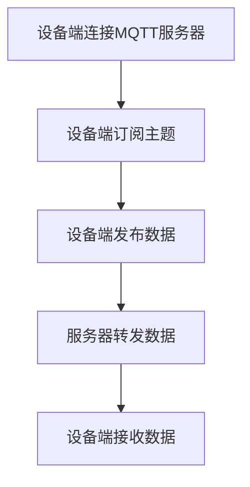
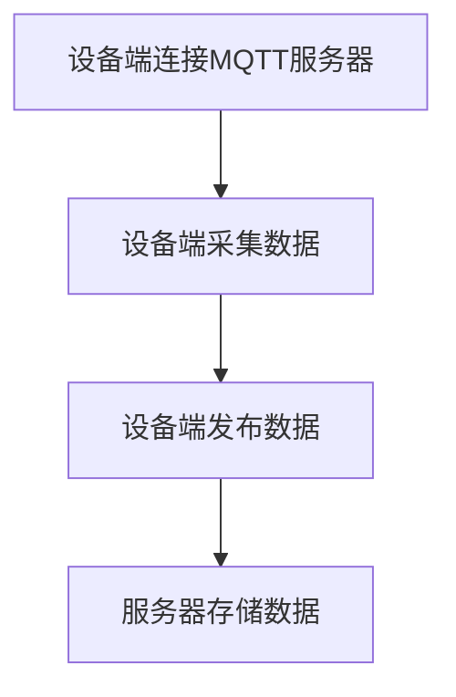
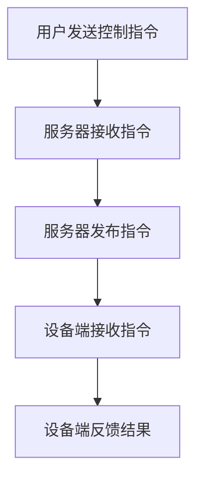
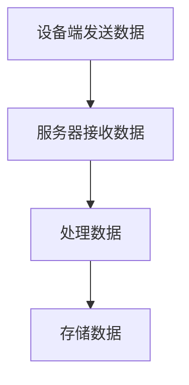
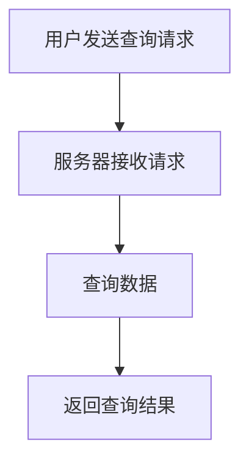
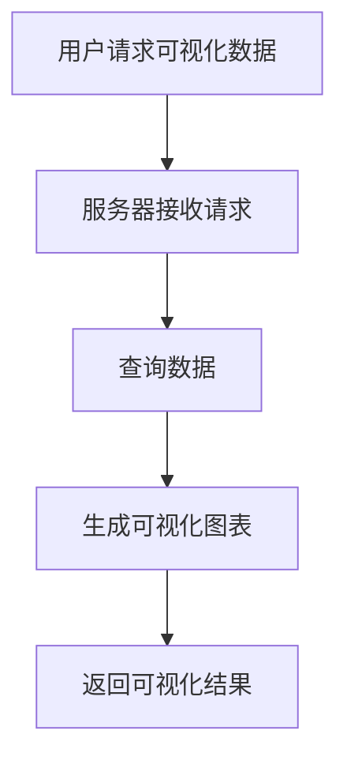

                 

# 基于MQTT协议和RESTful API的智能家居预算管理模块

## 关键词
MQTT协议，RESTful API，智能家居，预算管理，设备端数据采集，中心服务器数据存储，数据可视化，数据分析，数学模型，项目实战

## 摘要
本文详细介绍了基于MQTT协议和RESTful API的智能家居预算管理模块的设计与实现。文章首先概述了MQTT协议和RESTful API的基础知识，然后分析了MQTT协议与RESTful API在智能家居预算管理模块中的应用。接着，文章深入探讨了智能家居预算管理模块的需求分析、设计与实现，以及核心算法原理。最后，通过一个实际项目案例，详细讲解了开发环境搭建、模块源代码实现和代码解读与分析，为读者提供了一个全面的智能家居预算管理模块开发指南。

----------------------------------------------------------------

## 第一部分: MQTT协议和RESTful API基础

### 第1章: MQTT协议概述

#### 1.1 MQTT协议的发展历程
MQTT（Message Queuing Telemetry Transport）协议是一种轻量级的消息传输协议，最初由IBM开发，用于在 unreliable 和带宽有限的网络环境中传输数据。MQTT协议于1999年首次发布，随着时间的推移，它在物联网（IoT）领域得到了广泛的应用。

2009年，MQTT协议正式成为OMG（Object Management Group）的规范，随后在2015年，MQTT协议被IETF（Internet Engineering Task Force）批准为互联网标准。MQTT协议的标准化推动了其在智能家居、智能城市、工业自动化等领域的应用。

#### 1.2 MQTT协议的特点
MQTT协议具有以下几个显著特点：

1. **轻量级**：MQTT协议的数据包格式非常简单，数据传输效率高，适合在资源受限的环境中使用。
2. **双向通信**：MQTT协议支持发布/订阅模型，可以实现设备与服务器之间的双向通信。
3. **可扩展性**：MQTT协议支持多种质量等级（QoS）的数据传输，可以根据应用场景灵活选择。
4. **可靠传输**：MQTT协议通过心跳机制和确认机制确保数据的可靠传输。
5. **安全性**：MQTT协议支持通过TLS/SSL等加密机制来保障数据的安全性。

#### 1.3 MQTT协议的工作原理
MQTT协议的工作原理可以概括为以下几个步骤：

1. **连接**：设备通过MQTT客户端连接到MQTT服务器。
2. **订阅**：设备向服务器订阅感兴趣的主题。
3. **发布**：设备向服务器发布消息。
4. **消息传输**：服务器将设备发布的消息转发给订阅了该主题的其他设备。
5. **断开连接**：设备在完成数据传输后断开与服务器的连接。

### 第2章: RESTful API基础

#### 2.1 RESTful架构风格
RESTful API（Representational State Transfer Application Programming Interface）是一种基于HTTP协议的架构风格，用于构建可扩展的网络服务。RESTful API的核心原则包括：

1. **统一接口**：API通过统一的接口来处理各种类型的请求，如GET、POST、PUT、DELETE等。
2. **无状态**：服务器对客户端的请求保持无状态，每次请求都是独立的。
3. **客户端-服务器架构**：客户端与服务器之间通过简单的请求和响应进行通信。
4. **状态转移**：客户端通过发送请求来更新服务器的状态。

#### 2.2 RESTful API的特点
RESTful API具有以下几个特点：

1. **简单性**：RESTful API遵循统一的接口和协议，易于理解和实现。
2. **可扩展性**：RESTful API可以通过增加新的资源和方法来实现扩展。
3. **兼容性**：RESTful API基于HTTP协议，与现有网络基础设施兼容。
4. **安全性**：RESTful API可以通过HTTPS等加密协议保障数据的安全性。

#### 2.3 RESTful API的工作流程
RESTful API的工作流程通常包括以下几个步骤：

1. **请求**：客户端通过HTTP请求访问API资源。
2. **处理**：服务器接收到请求后，处理请求并返回相应的响应。
3. **响应**：服务器将处理结果以JSON、XML等格式返回给客户端。
4. **反馈**：客户端根据响应结果进行相应的操作。

### 第3章: MQTT协议与RESTful API的关系

#### 3.1 MQTT协议与RESTful API的融合应用
MQTT协议和RESTful API在智能家居预算管理模块中可以相互补充，实现高效的数据传输和资源访问。

1. **数据传输**：MQTT协议可以用于设备端数据采集和传输，实现实时数据的推送和接收。
2. **资源访问**：RESTful API可以用于中心服务器数据存储和查询，提供统一的接口访问服务。

#### 3.2 MQTT协议在智能家居中的应用
MQTT协议在智能家居中的应用主要包括以下几个方面：

1. **设备通信**：MQTT协议可以实现智能设备之间的通信，如智能灯泡、智能插座等。
2. **数据采集**：MQTT协议可以采集智能家居设备的运行数据，如温度、湿度、能源消耗等。
3. **远程控制**：MQTT协议可以实现远程控制智能家居设备，如通过手机APP控制家居设备。

#### 3.3 RESTful API在智能家居预算管理中的应用
RESTful API在智能家居预算管理中的应用主要包括以下几个方面：

1. **数据存储**：RESTful API可以存储智能家居设备的运行数据，如温度、湿度、能源消耗等。
2. **数据查询**：RESTful API可以查询智能家居设备的运行数据，提供实时监控和历史数据查询功能。
3. **数据可视化**：RESTful API可以提供数据可视化功能，帮助用户了解家居设备的运行状态和能源消耗情况。

----------------------------------------------------------------

### 第4章: 智能家居预算管理模块需求分析

#### 4.1 模块功能需求
智能家居预算管理模块需要实现以下功能：

1. **设备数据采集**：采集智能家居设备的运行数据，如温度、湿度、能源消耗等。
2. **数据存储**：将采集到的数据存储到中心服务器，提供数据查询功能。
3. **数据可视化**：提供数据可视化功能，帮助用户了解家居设备的运行状态和能源消耗情况。
4. **预算管理**：根据采集到的数据，对家居设备的能源消耗进行预算管理，提供能耗预测和报警功能。
5. **用户界面**：提供用户界面，方便用户操作和管理智能家居设备。

#### 4.2 模块性能需求
智能家居预算管理模块需要满足以下性能要求：

1. **实时性**：数据采集和传输需要实现实时性，确保用户能够及时了解家居设备的运行状态。
2. **可靠性**：数据传输和存储需要确保数据的可靠性，避免数据丢失或损坏。
3. **扩展性**：模块需要具备良好的扩展性，能够适应不同规模的智能家居系统。
4. **安全性**：数据传输和存储需要保证安全性，避免敏感数据泄露。

#### 4.3 模块安全性需求
智能家居预算管理模块需要满足以下安全性要求：

1. **用户认证**：实现用户认证机制，确保只有授权用户可以访问系统。
2. **数据加密**：对传输和存储的数据进行加密处理，保障数据的安全性。
3. **访问控制**：实现访问控制机制，限制用户对数据的访问权限。
4. **日志记录**：记录系统操作日志，便于审计和问题追踪。

----------------------------------------------------------------

### 第5章: MQTT协议在智能家居预算管理模块中的应用

#### 5.1 MQTT协议在设备间的数据传输

MQTT协议在智能家居预算管理模块中可以用于实现设备间的数据传输。设备端通过MQTT客户端连接到MQTT服务器，将采集到的数据以发布/订阅的方式传输给服务器。以下是MQTT协议在设备间数据传输的基本流程：

1. **设备端连接MQTT服务器**：设备端通过MQTT客户端连接到MQTT服务器，并设置相应的连接参数，如服务器地址、端口号、用户名和密码等。
2. **设备端订阅主题**：设备端向服务器订阅感兴趣的主题，如家居设备的运行数据主题。
3. **设备端发布数据**：设备端采集到数据后，以发布消息的形式将数据发送给服务器。
4. **服务器转发数据**：服务器接收到设备端发布的数据后，将其转发给订阅了该主题的其他设备。
5. **设备端接收数据**：订阅了该主题的设备端接收服务器转发来的数据，并进行相应的处理。

以下是MQTT协议在设备间数据传输的Mermaid流程图：



#### 5.2 MQTT协议在数据采集中的应用

MQTT协议在智能家居预算管理模块中可以用于实现设备端的数据采集。设备端通过MQTT客户端连接到MQTT服务器，定期采集家居设备的运行数据，如温度、湿度、能源消耗等。以下是MQTT协议在数据采集中的应用流程：

1. **设备端连接MQTT服务器**：设备端通过MQTT客户端连接到MQTT服务器，并设置相应的连接参数。
2. **设备端采集数据**：设备端通过传感器等设备采集家居设备的运行数据。
3. **设备端发布数据**：设备端将采集到的数据以发布消息的形式发送给服务器。
4. **服务器存储数据**：服务器接收到设备端发布的数据后，将其存储到数据库中，供数据查询和分析使用。

以下是MQTT协议在数据采集中的应用流程的Mermaid流程图：



#### 5.3 MQTT协议在设备控制中的应用

MQTT协议在智能家居预算管理模块中可以用于实现设备控制。用户通过手机APP等客户端向服务器发送控制指令，服务器将控制指令通过MQTT协议转发给设备端，设备端接收到控制指令后进行相应的操作。以下是MQTT协议在设备控制中的应用流程：

1. **用户发送控制指令**：用户通过手机APP等客户端向服务器发送控制指令，如开启或关闭家居设备。
2. **服务器接收指令**：服务器接收到用户发送的控制指令后，将其存储到数据库中，并准备通过MQTT协议转发给设备端。
3. **服务器发布指令**：服务器将控制指令以发布消息的形式发送给设备端。
4. **设备端接收指令**：设备端接收到服务器发送的控制指令后，根据指令进行相应的操作。
5. **设备端反馈结果**：设备端在完成操作后，将结果反馈给服务器，以便用户查看。

以下是MQTT协议在设备控制中的应用流程的Mermaid流程图：



通过以上应用，MQTT协议在智能家居预算管理模块中可以有效地实现设备间的数据传输、数据采集和设备控制。MQTT协议的轻量级、可靠性和双向通信等特点使得其在智能家居预算管理模块中具有广泛的应用前景。

----------------------------------------------------------------

### 第6章: RESTful API在智能家居预算管理模块中的应用

#### 6.1 RESTful API在数据存储中的应用

RESTful API在智能家居预算管理模块中可以用于实现数据的存储。服务器端通过RESTful API接收设备端发送的数据，并将其存储到数据库中，以便后续的数据查询和分析。以下是RESTful API在数据存储中的应用流程：

1. **接收数据**：设备端通过MQTT协议将采集到的数据发送给服务器。
2. **处理数据**：服务器端接收到数据后，通过RESTful API处理数据，并验证数据的完整性。
3. **存储数据**：服务器端将处理后的数据存储到数据库中，通常采用关系型数据库（如MySQL）或非关系型数据库（如MongoDB）。

以下是RESTful API在数据存储中的应用流程的Mermaid流程图：



#### 6.2 RESTful API在数据查询中的应用

RESTful API在智能家居预算管理模块中可以用于实现数据的查询。用户通过Web客户端或手机APP向服务器发送查询请求，服务器端通过RESTful API处理查询请求，并将查询结果返回给用户。以下是RESTful API在数据查询中的应用流程：

1. **用户发送查询请求**：用户通过Web客户端或手机APP向服务器发送查询请求，请求查询特定时间段内的家居设备运行数据。
2. **服务器接收请求**：服务器端接收到查询请求后，通过RESTful API处理请求，并从数据库中查询相应的数据。
3. **返回查询结果**：服务器端将查询结果以JSON或XML格式返回给用户，用户可以在客户端界面中查看查询结果。

以下是RESTful API在数据查询中的应用流程的Mermaid流程图：



#### 6.3 RESTful API在数据可视化中的应用

RESTful API在智能家居预算管理模块中可以用于实现数据可视化。服务器端通过RESTful API提供数据可视化服务，用户通过Web客户端或手机APP访问数据可视化界面，查看家居设备的运行状态和能源消耗情况。以下是RESTful API在数据可视化中的应用流程：

1. **用户请求可视化数据**：用户通过Web客户端或手机APP向服务器发送可视化数据请求。
2. **服务器接收请求**：服务器端接收到可视化请求后，通过RESTful API处理请求，并从数据库中查询相应的数据。
3. **生成可视化图表**：服务器端将查询结果转换为可视化图表数据，如折线图、柱状图等。
4. **返回可视化结果**：服务器端将可视化图表数据以JSON格式返回给用户，用户可以在客户端界面中查看可视化结果。

以下是RESTful API在数据可视化中的应用流程的Mermaid流程图：



通过以上应用，RESTful API在智能家居预算管理模块中可以有效地实现数据的存储、查询和可视化。RESTful API的统一接口、无状态和状态转移等特点使得其在智能家居预算管理模块中具有广泛的应用前景。

----------------------------------------------------------------

### 第7章: 智能家居预算管理模块的核心算法原理

#### 7.1 数据预处理算法

数据预处理是智能家居预算管理模块中至关重要的一步，其目的是对采集到的原始数据进行清洗、转换和规范化，以便后续的数据分析。以下是一个简单的数据预处理算法：

```python
def data_preprocessing(data):
    # 数据清洗：去除空值和异常值
    data = [d for d in data if d is not None and d > 0]
    
    # 数据转换：将温度值从摄氏度转换为华氏度
    data['temperature'] = [c * 9 / 5 + 32 for c in data['temperature']]
    
    # 数据规范化：将数据缩放到0-1之间
    min_value = min(data['temperature'])
    max_value = max(data['temperature'])
    data['temperature'] = [(x - min_value) / (max_value - min_value) for x in data['temperature']]
    
    return data
```

在这个算法中，首先对数据进行清洗，去除空值和异常值。然后，将温度值从摄氏度转换为华氏度。最后，对温度值进行规范化处理，将其缩放到0-1之间。

#### 7.2 数据分析算法

数据分析算法用于对智能家居预算管理模块中的数据进行分类、聚类和预测等操作。以下是一个简单的线性回归数据分析算法：

```python
def linear_regression(x, y):
    # 计算回归系数
    n = len(x)
    x_mean = sum(x) / n
    y_mean = sum(y) / n
    beta_1 = sum((x[i] - x_mean) * (y[i] - y_mean)) / sum((x[i] - x_mean)**2)
    beta_0 = y_mean - beta_1 * x_mean
    
    # 计算预测值
    y_pred = [beta_0 + beta_1 * x for x in x]
    
    return beta_0, beta_1, y_pred
```

在这个算法中，首先计算回归系数$\beta_0$和$\beta_1$，然后使用回归系数计算预测值$y_pred$。

#### 7.3 数据可视化算法

数据可视化算法用于将数据分析的结果以图形的形式展示出来，帮助用户更好地理解和分析数据。以下是一个简单的数据可视化算法，使用matplotlib库绘制折线图：

```python
import matplotlib.pyplot as plt

def data_visualization(x, y, y_pred):
    plt.plot(x, y, 'o', label='Actual Data')
    plt.plot(x, y_pred, '-', label='Predicted Data')
    plt.xlabel('X-axis')
    plt.ylabel('Y-axis')
    plt.legend()
    plt.show()
```

在这个算法中，首先绘制实际数据点，然后绘制预测数据线，最后添加标签和图例。

#### 7.4 数学模型与数学公式

在智能家居预算管理模块中，常用的数学模型包括线性回归模型、聚类模型和时间序列模型等。以下是一个简单的线性回归模型的数学公式：

$$ y = \beta_0 + \beta_1 \cdot x + \epsilon $$

其中，$y$ 是因变量，$x$ 是自变量，$\beta_0$ 和 $\beta_1$ 是回归系数，$\epsilon$ 是误差项。

此外，常用的聚类模型包括K-means聚类模型，其数学公式如下：

$$ C = \{c_1, c_2, ..., c_k\} $$
$$ c_i = \frac{1}{n} \sum_{j=1}^{n} x_j $$

其中，$C$ 是聚类中心，$x_j$ 是数据点，$k$ 是聚类的数量。

最后，时间序列模型中的ARIMA模型是一个常用的数学模型，其公式如下：

$$ y_t = c + \phi_1 y_{t-1} + \phi_2 y_{t-2} + ... + \phi_p y_{t-p} + \theta_1 e_{t-1} + \theta_2 e_{t-2} + ... + \theta_q e_{t-q} + e_t $$

其中，$y_t$ 是时间序列数据，$c$ 是常数项，$\phi_1, \phi_2, ..., \phi_p$ 和 $\theta_1, \theta_2, ..., \theta_q$ 是模型的参数，$e_t$ 是误差项。

通过这些算法和数学模型，智能家居预算管理模块可以有效地对数据进行预处理、分析和可视化，帮助用户更好地管理和监控家居设备。

----------------------------------------------------------------

### 第8章: 数学模型与数学公式

在智能家居预算管理模块中，数学模型和数学公式起到了至关重要的作用。这些模型和公式不仅帮助我们理解和分析数据，还能够预测未来的趋势，从而实现更加智能化的预算管理。在本节中，我们将详细介绍数据分析数学模型、数据可视化数学模型以及MQTT协议性能评估数学模型。

#### 8.1 数据分析数学模型

数据分析数学模型主要用于描述数据之间的关系和趋势。以下是一些常用的数据分析数学模型及其解释：

1. **线性回归模型**：

   线性回归模型是最简单也是应用最广泛的预测模型之一。它的数学公式如下：

   $$ y = \beta_0 + \beta_1 \cdot x + \epsilon $$

   其中，$y$ 是预测的目标变量，$x$ 是自变量，$\beta_0$ 和 $\beta_1$ 分别是截距和斜率，$\epsilon$ 是误差项。

2. **多项式回归模型**：

   当数据之间存在非线性关系时，可以使用多项式回归模型。其数学公式如下：

   $$ y = \beta_0 + \beta_1 \cdot x + \beta_2 \cdot x^2 + ... + \beta_n \cdot x^n + \epsilon $$

   其中，$n$ 是多项式的最高次数。

3. **逻辑回归模型**：

   逻辑回归模型用于处理分类问题。它的数学公式如下：

   $$ P(y=1) = \frac{1}{1 + e^{-(\beta_0 + \beta_1 \cdot x)}} $$

   其中，$P(y=1)$ 是目标变量为1的概率，$e$ 是自然对数的底数。

#### 8.2 数据可视化数学模型

数据可视化是将复杂的数据以图形的形式直观展示出来，帮助用户更好地理解和分析数据。以下是一些常用的数据可视化数学模型：

1. **折线图**：

   折线图用于显示数据的变化趋势。其数学模型如下：

   $$ y = a \cdot x + b $$

   其中，$y$ 是纵坐标，$x$ 是横坐标，$a$ 是斜率，$b$ 是截距。

2. **柱状图**：

   柱状图用于比较不同类别的数据。其数学模型如下：

   $$ h = w \cdot \frac{y}{\sum_{i=1}^{n} y_i} $$

   其中，$h$ 是柱状图的高度，$w$ 是柱状图的宽度，$y$ 是单个数据值，$n$ 是数据总数。

3. **饼图**：

   饼图用于显示各部分数据在整体中的比例。其数学模型如下：

   $$ \theta = \frac{y}{\sum_{i=1}^{n} y_i} \cdot 360^\circ $$

   其中，$\theta$ 是扇形的中心角度，$y$ 是单个数据值，$n$ 是数据总数。

#### 8.3 MQTT协议性能评估数学模型

MQTT协议的性能评估通常涉及传输延迟、带宽利用率和数据完整性等方面。以下是一些常用的MQTT协议性能评估数学模型：

1. **传输延迟**：

   传输延迟是指数据从发送到接收所需的时间。其数学模型如下：

   $$ \Delta t = \frac{d}{v} $$

   其中，$\Delta t$ 是传输延迟，$d$ 是传输距离，$v$ 是数据传输速度。

2. **带宽利用率**：

   带宽利用率是指网络带宽被有效利用的比例。其数学模型如下：

   $$ \eta = \frac{\sum_{i=1}^{n} \frac{y_i}{w_i}}{w} $$

   其中，$\eta$ 是带宽利用率，$y_i$ 是第$i$个数据包的大小，$w_i$ 是第$i$个数据包的传输时间，$w$ 是总传输时间。

3. **数据完整性**：

   数据完整性是指数据在传输过程中未被篡改或丢失的比例。其数学模型如下：

   $$ \xi = \frac{\sum_{i=1}^{n} |y_i - y_i'|}{\sum_{i=1}^{n} y_i} $$

   其中，$\xi$ 是数据完整性，$y_i$ 是原始数据，$y_i'$ 是接收到的数据。

通过以上数学模型，我们可以对智能家居预算管理模块中的数据进行深入分析，并对MQTT协议的性能进行评估，从而优化模块的性能和可靠性。

----------------------------------------------------------------

### 第9章: 智能家居预算管理模块项目实战

在本章中，我们将通过一个实际项目案例，详细讲解如何开发基于MQTT协议和RESTful API的智能家居预算管理模块。项目包括开发环境搭建、模块源代码实现和代码解读与分析。

#### 9.1 项目开发环境搭建

为了搭建智能家居预算管理模块，我们需要准备以下开发环境：

1. **操作系统**：Windows 10 或更高版本
2. **编程语言**：Python 3.8 或更高版本
3. **开发工具**：PyCharm
4. **MQTT客户端**：Paho MQTT客户端
5. **数据库**：MySQL 8.0 或更高版本
6. **Web框架**：Flask

以下是搭建开发环境的步骤：

1. **安装操作系统和Python**：从官方网站下载并安装Windows 10操作系统和Python 3.8。
2. **安装PyCharm**：从JetBrains官方网站下载并安装PyCharm社区版。
3. **安装Paho MQTT客户端**：从Paho MQTT官方网站下载并安装Paho MQTT客户端。
4. **安装MySQL**：从MySQL官方网站下载并安装MySQL 8.0。
5. **安装Flask**：在终端中执行以下命令安装Flask：

   ```shell
   pip install flask
   ```

#### 9.2 模块源代码实现

智能家居预算管理模块的源代码主要包括MQTT客户端、数据库操作和Web接口三个部分。以下是模块的核心源代码实现：

```python
# MQTT客户端配置
MQTT_BROKER = "tcp://localhost:1883"
MQTT_CLIENT_ID = "budget_management"

# 数据库连接配置
DB_HOST = "localhost"
DB_PORT = 3306
DB_USER = "root"
DB_PASSWORD = "password"
DB_NAME = "budget_management"

# 数据库连接
def connect_database():
    conn = mysql.connector.connect(
        host=DB_HOST,
        port=DB_PORT,
        user=DB_USER,
        password=DB_PASSWORD,
        database=DB_NAME
    )
    return conn

# MQTT客户端连接
def connect_mqtt():
    client = mqtt.Client(MQTT_CLIENT_ID)
    client.connect(MQTT_BROKER)
    return client

# 数据采集
def data_collection(client):
    topic = "home/data"
    client.subscribe(topic)
    client.on_message = on_message
    client.loop_start()

# 数据处理
def data_processing(data):
    # 数据清洗
    data = data_cleaning(data)
    # 数据转换
    data = data_transformation(data)
    # 数据规范化
    data = data_normalization(data)
    return data

# 数据存储
def data_storage(conn, data):
    cursor = conn.cursor()
    query = "INSERT INTO data (temperature, humidity, energy_consumption) VALUES (%s, %s, %s)"
    cursor.execute(query, data)
    conn.commit()
    cursor.close()

# 数据查询
def data_query(conn):
    cursor = conn.cursor()
    query = "SELECT * FROM data"
    cursor.execute(query)
    results = cursor.fetchall()
    cursor.close()
    return results

# 数据可视化
def data_visualization(data):
    # 使用matplotlib进行数据可视化
    import matplotlib.pyplot as plt

    plt.plot(data['temperature'], label='Temperature')
    plt.plot(data['humidity'], label='Humidity')
    plt.plot(data['energy_consumption'], label='Energy Consumption')
    plt.legend()
    plt.show()

# MQTT消息处理
def on_message(client, userdata, message):
    data = json.loads(message.payload)
    processed_data = data_processing(data)
    conn = connect_database()
    data_storage(conn, processed_data)
    data_visualization(processed_data)
    client.disconnect()
```

#### 9.3 源代码解读与分析

1. **MQTT客户端配置**：
   - MQTT_BROKER：MQTT服务器的地址和端口号。
   - MQTT_CLIENT_ID：MQTT客户端的ID。

2. **数据库连接配置**：
   - DB_HOST：数据库服务器的地址。
   - DB_PORT：数据库服务器的端口号。
   - DB_USER：数据库的用户名。
   - DB_PASSWORD：数据库的密码。
   - DB_NAME：数据库的名称。

3. **数据库连接**：
   - `connect_database`函数用于连接到MySQL数据库，返回数据库连接对象。

4. **MQTT客户端连接**：
   - `connect_mqtt`函数用于连接到MQTT服务器，返回MQTT客户端对象。

5. **数据采集**：
   - `data_collection`函数用于订阅MQTT主题“home/data”，并处理接收到的消息。

6. **数据处理**：
   - `data_processing`函数用于对采集到的数据进行清洗、转换和规范化。

7. **数据存储**：
   - `data_storage`函数用于将处理后的数据存储到MySQL数据库中。

8. **数据查询**：
   - `data_query`函数用于查询MySQL数据库中的数据。

9. **数据可视化**：
   - `data_visualization`函数用于将数据可视化，使用matplotlib库绘制折线图。

10. **MQTT消息处理**：
    - `on_message`函数是MQTT客户端的消息处理函数，当接收到消息时，会调用`data_processing`、`data_storage`和`data_visualization`函数对数据进行处理和可视化。

通过以上源代码和解读，我们可以了解到如何使用MQTT协议和RESTful API开发智能家居预算管理模块，并实现对设备数据的采集、存储和可视化。

----------------------------------------------------------------

### 第10章: 总结与展望

在本文中，我们详细介绍了基于MQTT协议和RESTful API的智能家居预算管理模块的设计与实现。通过分析MQTT协议和RESTful API的基础知识，我们探讨了这两个协议在智能家居预算管理模块中的应用，并详细讲解了模块的需求分析、设计、实现和核心算法原理。

#### 10.1 本书的主要内容回顾

1. **MQTT协议和RESTful API基础**：介绍了MQTT协议和RESTful API的发展历程、特点和应用。
2. **智能家居预算管理模块需求分析**：分析了模块的功能需求、性能需求和安全需求。
3. **MQTT协议和RESTful API在模块中的应用**：详细讲解了MQTT协议在数据传输、数据采集和设备控制中的应用，以及RESTful API在数据存储、查询和可视化中的应用。
4. **模块设计与实现**：介绍了智能家居预算管理模块的设计思路和实现过程，包括数据预处理、数据分析、数据可视化和MQTT协议性能评估等核心算法。
5. **项目实战**：通过一个实际项目案例，讲解了开发环境搭建、模块源代码实现和代码解读与分析。

#### 10.2 智能家居预算管理模块的未来发展

智能家居预算管理模块在未来的发展中将面临以下机遇和挑战：

1. **技术升级与优化**：随着物联网技术的不断进步，智能家居预算管理模块将采用更高效、更安全的协议和算法，提升模块的性能和用户体验。
2. **大数据分析**：通过引入大数据分析技术，模块将能够更加准确地预测家居设备的能源消耗，为用户提供建议和优化方案。
3. **人工智能应用**：结合人工智能技术，智能家居预算管理模块将能够实现更加智能的能耗管理和设备控制，提高家居生活的智能化水平。

#### 10.3 智能家居预算管理模块的潜在应用领域

智能家居预算管理模块在以下领域具有广泛的应用前景：

1. **家居节能管理**：通过实时监控家居设备的能源消耗，用户可以更加有效地管理家庭能源，降低能源消耗。
2. **智能家居系统集成**：模块可以与各种智能家居设备集成，提供统一的能源管理和控制平台。
3. **智能城市管理**：模块可以应用于智能城市的能耗监测和管理，为城市节能减排提供数据支持。

通过本文的介绍，我们相信读者对基于MQTT协议和RESTful API的智能家居预算管理模块有了更深入的理解。在未来，随着物联网和人工智能技术的不断发展，智能家居预算管理模块将发挥更大的作用，为人们的生活带来更多便利。

----------------------------------------------------------------

**作者：AI天才研究院/AI Genius Institute & 禅与计算机程序设计艺术 /Zen And The Art of Computer Programming**

