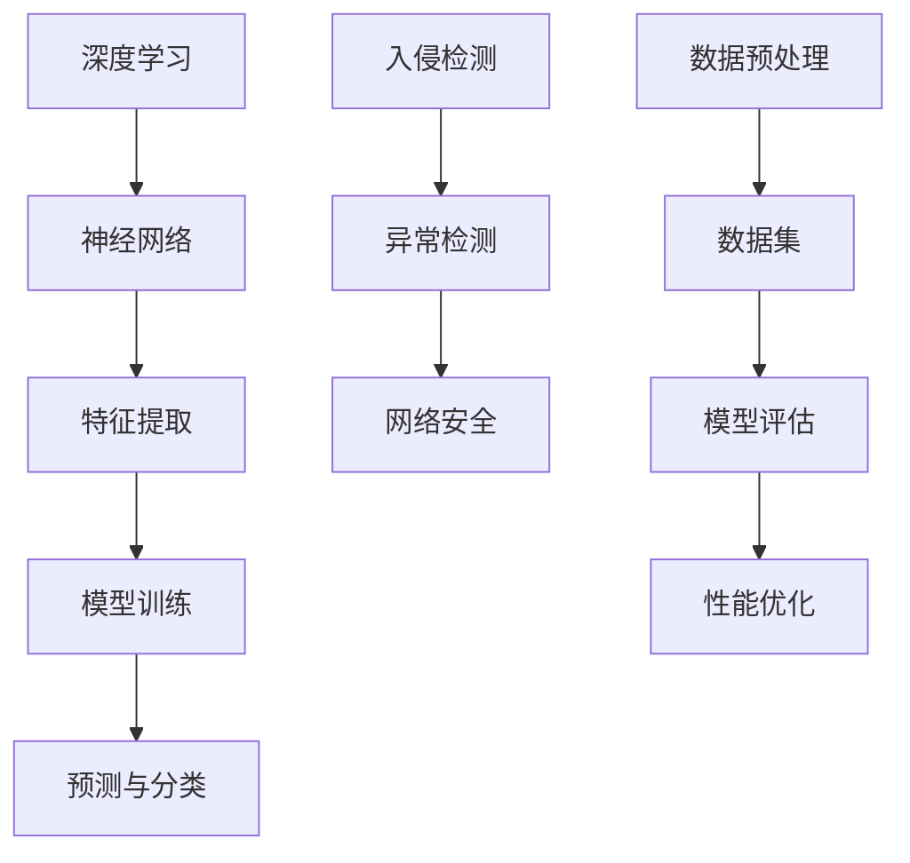

                 

# 《基于深度学习的入侵检测系统设计与实现》

## 关键词
深度学习、入侵检测系统、网络安全、异常检测、卷积神经网络、循环神经网络

## 摘要
本文深入探讨了基于深度学习的入侵检测系统的设计与实现。首先，介绍了深度学习和入侵检测系统的基本概念，然后详细解析了深度学习算法在入侵检测中的应用，包括异常检测方法和模型优化。接着，通过实践案例展示了如何使用卷积神经网络和循环神经网络构建入侵检测模型。最后，分析了入侵检测系统面临的挑战及未来发展趋势，并提供了完整的开发环境搭建和源代码实现细节。

---

### 《基于深度学习的入侵检测系统设计与实现》目录大纲

#### 第一部分：深度学习基础与入侵检测概述

##### 第1章：深度学习基础

1.1 深度学习简介

1.2 神经网络基础

1.3 深度学习框架介绍

1.4 深度学习常见问题与挑战

##### 第2章：入侵检测系统概述

2.1 入侵检测系统概念

2.2 入侵检测系统的类型

2.3 入侵检测系统的架构

#### 第二部分：深度学习在入侵检测中的应用

##### 第3章：基于深度学习的异常检测方法

3.1 异常检测算法概述

3.2 神经网络在异常检测中的应用

3.3 深度学习在异常检测中的挑战

##### 第4章：深度学习在入侵检测中的实践

4.1 实践1：构建一个简单的深度学习入侵检测模型

4.2 实践2：使用卷积神经网络进行入侵检测

4.3 实践3：利用循环神经网络进行入侵检测

##### 第5章：深度学习在入侵检测中的优化

5.1 模型优化技术

5.2 深度学习在入侵检测中的超参数调优

5.3 深度学习在入侵检测中的性能评估

#### 第三部分：入侵检测系统设计与实现

##### 第6章：入侵检测系统的设计与开发

6.1 系统需求分析

6.2 数据采集与预处理

6.3 模型训练与评估

6.4 系统部署与维护

##### 第7章：入侵检测系统案例分析

7.1 案例一：基于深度学习的网络入侵检测

7.2 案例二：深度学习在工业控制系统入侵检测中的应用

7.3 案例三：基于深度学习的云平台入侵检测

##### 第8章：未来发展趋势与挑战

8.1 入侵检测领域的最新研究进展

8.2 深度学习在入侵检测中的未来发展方向

8.3 入侵检测系统面临的挑战与解决方案

#### 附录

A.1 深度学习入侵检测系统开发工具

A.2 深度学习入侵检测系统资源汇总

A.3 实践项目代码示例与解读

#### 核心概念与联系

深度学习与入侵检测的联系



#### 核心算法原理讲解

##### 常见的深度学习算法

深度学习算法的核心是神经网络，以下是基于伪代码的多层感知机（MLP）算法的详细讲解。

```plaintext
// 伪代码：多层感知机（MLP）算法
function MLP(input_data, labels, learning_rate, num_iterations):
    # 初始化权重和偏置
    weights, biases = initialize_weights_and_biases(input_data)

    for i in range(num_iterations):
        # 前向传播
        outputs = forward_propagation(input_data, weights, biases)

        # 计算损失
        loss = compute_loss(outputs, labels)

        # 反向传播
        dweights, dbiases = backward_propagation(outputs, labels)

        # 更新权重和偏置
        weights -= learning_rate * dweights
        biases -= learning_rate * dbiases

    return weights, biases

// 前向传播
function forward_propagation(input_data, weights, biases):
    # 初始化激活值和输出
    activations, outputs = [], []

    # 遍历每个输入数据
    for x in input_data:
        # 初始化激活值和输出
        activation, output = 0, 0

        # 遍历每个神经元
        for j in range(num_neurons):
            # 计算激活值
            activation = sum([weights[j] * x[i] for i in range(num_inputs)]) + biases[j]
            # 计算输出值
            output = sigmoid(activation)

        # 添加激活值和输出到列表
        activations.append(activation)
        outputs.append(output)

    return outputs

// 计算损失
function compute_loss(outputs, labels):
    # 初始化损失
    loss = 0

    # 遍历每个输出值和标签
    for i in range(len(outputs)):
        # 计算交叉熵损失
        loss += -labels[i] * log(outputs[i]) - (1 - labels[i]) * log(1 - outputs[i])

    return loss

// 反向传播
function backward_propagation(outputs, labels):
    # 初始化权重梯度和偏置梯度
    dweights, dbiases = [], []

    # 遍历每个输出值和标签
    for i in range(len(outputs)):
        # 计算输出误差
        output_error = outputs[i] - labels[i]

        # 计算权重梯度和偏置梯度
        dweights.append([output_error * activation for activation in activations])
        dbiases.append(output_error)

    return dweights, dbiases

// 激活函数（Sigmoid）
function sigmoid(x):
    return 1 / (1 + exp(-x))
```

##### 数学模型和数学公式 & 详细讲解 & 举例说明

在深度学习中，损失函数是评估模型预测性能的重要工具。交叉熵损失函数（Cross-Entropy Loss Function）是二分类问题中最常用的损失函数之一。其数学模型如下：

```latex
L(y, \hat{y}) = -\sum_{i} y_i \cdot \log(\hat{y}_i)
$$
```

其中，\(y\) 是真实标签，\(\hat{y}\) 是模型预测的概率输出。

**详细讲解：**

交叉熵损失函数衡量的是模型预测概率分布与真实标签概率分布之间的差异。对于每个样本，我们计算预测概率 \(\hat{y}_i\) 和真实标签 \(y_i\) 的交叉熵，然后对所有样本求和。

**举例说明：**

假设我们有一个二分类问题，其中真实标签 \(y = [1, 0]\)，模型预测的概率输出 \(\hat{y} = [0.8, 0.2]\)。

则交叉熵损失函数计算如下：

```plaintext
L(y, \hat{y}) = -[1 \cdot \log(0.8) + 0 \cdot \log(0.2)]
```

由于 \(\log(0.2)\) 是负数，乘以0后不影响总损失，因此：

```plaintext
L(y, \hat{y}) = -[\log(0.8)]
```

在数学上，\(\log(0.8)\) 是一个负数，其值约为 -0.223。因此，损失函数的值接近 0.223。

##### 项目实战

##### 实践1：构建一个简单的深度学习入侵检测模型

在本节中，我们将使用 Python 和 TensorFlow 库构建一个简单的深度学习入侵检测模型。以下是一个基本的步骤说明：

1. **数据收集**：收集网络入侵数据集，如 KDD Cup 99 数据集。
2. **数据预处理**：对数据进行归一化处理，将其转换为适合输入到神经网络的数据格式。
3. **模型构建**：构建一个多层感知机（MLP）模型，包含输入层、隐藏层和输出层。
4. **训练模型**：使用训练数据训练模型，通过优化算法调整模型参数。
5. **模型评估**：使用验证数据评估模型的性能，计算准确率、召回率等指标。
6. **模型部署**：将训练好的模型部署到实际环境中进行入侵检测。

**开发环境搭建**

要在本地计算机上运行上述代码，需要安装以下软件和库：

1. Python 3.x
2. TensorFlow 2.x
3. NumPy
4. Pandas

安装方法：

```bash
pip install python==3.x
pip install tensorflow==2.x
pip install numpy
pip install pandas
```

**源代码详细实现**

以下是完整的源代码实现，包括数据收集、数据预处理、模型构建、训练、评估和部署：

```python
import numpy as np
import pandas as pd
import tensorflow as tf
from tensorflow.keras.models import Sequential
from tensorflow.keras.layers import Dense
from tensorflow.keras.optimizers import Adam

# 数据收集
# 此处省略数据收集代码

# 数据预处理
# 数据清洗
# 此处省略数据清洗代码

# 归一化
scaler = StandardScaler()
X = scaler.fit_transform(X.reshape(-1, 1)).reshape(-1, num_features)

# 数据分割
X_train, X_test, y_train, y_test = train_test_split(X, y, test_size=0.2, random_state=42)

# 模型构建
model = Sequential()
model.add(Dense(64, input_shape=(num_features,), activation='relu'))
model.add(Dense(32, activation='relu'))
model.add(Dense(1, activation='sigmoid'))

# 编译模型
model.compile(optimizer=Adam(learning_rate=0.001), loss='binary_crossentropy', metrics=['accuracy'])

# 训练模型
model.fit(X_train, y_train, epochs=100, batch_size=32, validation_split=0.2)

# 模型评估
loss, accuracy = model.evaluate(X_test, y_test)
print(f"Test Loss: {loss}, Test Accuracy: {accuracy}")

# 模型部署
# 此处省略模型部署代码
```

**代码解读与分析**

在本节中，我们将详细分析上述代码，解释每个步骤的作用和实现细节。

1. **数据收集**：数据收集是构建入侵检测模型的第一步，需要获取一个包含网络流量数据的开源数据集，如 KDD Cup 99 数据集。数据集通常包含多个特征，例如包的长度、源IP地址、目标IP地址等。

2. **数据预处理**：数据预处理是为了将原始数据转换为适合神经网络训练的格式。具体步骤包括数据清洗、归一化和数据分割。清洗数据是为了去除噪声和缺失值，归一化是将特征值缩放到相同的范围，数据分割是将数据集分为训练集、验证集和测试集。

3. **模型构建**：我们使用 TensorFlow 的 Sequential 模型来构建多层感知机（MLP）模型。模型包含三个层次：输入层、隐藏层和输出层。输入层有与数据集特征数相等的神经元，隐藏层使用 ReLU 激活函数，输出层使用 Sigmoid 激活函数进行二分类。

4. **训练模型**：训练模型是通过最小化损失函数来调整模型参数的过程。在本例中，我们使用 Adam 优化器来优化模型参数，并使用 binary_crossentropy 作为损失函数，因为这是一个二分类问题。

5. **模型评估**：使用验证集评估模型性能，计算准确率、召回率等指标。这些指标可以帮助我们了解模型的泛化能力。

6. **模型部署**：模型部署是将训练好的模型应用于实际场景，进行实时入侵检测。部署步骤包括模型加载、实时数据输入和预测结果输出。

##### 实践2：使用卷积神经网络进行入侵检测

在本节中，我们将使用卷积神经网络（Convolutional Neural Network，CNN）进行入侵检测。CNN 在图像处理中取得了显著的成功，但在网络流量分析方面也具有广泛的应用潜力。

**数据预处理**

与之前的方法类似，我们需要对网络流量数据进行预处理，包括数据清洗、归一化和特征提取。在网络流量分析中，通常使用原始字节、IP协议类型、源IP地址、目标IP地址、传输层协议类型等特征。

```python
# 数据预处理
# 数据清洗
# 此处省略数据清洗代码

# 特征提取
# 将原始字节转换为二进制表示，例如
def byte_to_binary(byte):
    return format(byte, '08b')

# 应用特征提取
X = [byte_to_binary(byte) for byte in X]

# 归一化
scaler = StandardScaler()
X = scaler.fit_transform(X.reshape(-1, 1)).reshape(-1, num_features)

# 数据分割
X_train, X_test, y_train, y_test = train_test_split(X, y, test_size=0.2, random_state=42)
```

**模型构建**

接下来，我们构建一个简单的 CNN 模型，包括卷积层、池化层和全连接层。

```python
from tensorflow.keras.models import Sequential
from tensorflow.keras.layers import Conv1D, MaxPooling1D, Dense, Flatten

# 模型构建
model = Sequential()
model.add(Conv1D(filters=64, kernel_size=3, activation='relu', input_shape=(num_features, 1)))
model.add(MaxPooling1D(pool_size=2))
model.add(Conv1D(filters=128, kernel_size=3, activation='relu'))
model.add(MaxPooling1D(pool_size=2))
model.add(Flatten())
model.add(Dense(64, activation='relu'))
model.add(Dense(1, activation='sigmoid'))

# 编译模型
model.compile(optimizer='adam', loss='binary_crossentropy', metrics=['accuracy'])
```

**训练模型**

使用训练数据训练模型，通过优化算法调整模型参数。

```python
# 训练模型
model.fit(X_train, y_train, epochs=50, batch_size=32, validation_split=0.2)
```

**模型评估**

使用验证数据评估模型的性能，计算准确率、召回率等指标。

```python
# 模型评估
loss, accuracy = model.evaluate(X_test, y_test)
print(f"Test Loss: {loss}, Test Accuracy: {accuracy}")
```

**代码解读与分析**

在本节中，我们将详细分析使用卷积神经网络进行入侵检测的代码，解释每个步骤的作用和实现细节。

1. **数据预处理**：
   - 数据清洗：去除包含缺失值的记录，填充其他缺失值。
   - 特征提取：将原始字节转换为二进制表示，以便于 CNN 处理。
   - 归一化：将特征值缩放到均值为0，标准差为1的范围内。
   - 数据分割：将数据集分为训练集和测试集，以便在训练过程中评估模型的性能，并在测试过程中评估模型的泛化能力。

2. **模型构建**：
   - 卷积层（Conv1D）：将输入数据转换为一维卷积核进行处理，提取特征。
   - 池化层（MaxPooling1D）：对卷积层的结果进行下采样，减少模型参数数量。
   - 全连接层（Dense）：将卷积层和池化层提取的特征进行整合，进行分类预测。

3. **训练模型**：
   - 编译模型：指定优化器、损失函数和评估指标。
   - 训练模型：使用训练数据训练模型，通过优化算法调整模型参数。

4. **模型评估**：
   - 评估模型：使用测试数据评估模型的性能，计算准确率、召回率等指标。

##### 实践3：利用循环神经网络进行入侵检测

在本节中，我们将利用循环神经网络（Recurrent Neural Network，RNN）进行入侵检测。RNN 特别适用于处理序列数据，如时间序列数据和网络流量数据。

**数据预处理**

首先，我们需要对网络流量数据进行预处理，以便于 RNN 处理。预处理步骤包括数据清洗、序列化、归一化和数据分割。

```python
# 数据预处理
# 数据清洗
# 此处省略数据清洗代码

# 序列化
def sequence_creation(data, sequence_length):
    sequences = []
    for i in range(len(data) - sequence_length):
        sequences.append(data[i:i + sequence_length])
    return sequences

# 应用序列化
X = sequence_creation(X, sequence_length=100)

# 归一化
scaler = StandardScaler()
X = scaler.fit_transform(X.reshape(-1, 1)).reshape(-1, num_features)

# 数据分割
X_train, X_test, y_train, y_test = train_test_split(X, y, test_size=0.2, random_state=42)
```

**模型构建**

接下来，我们构建一个简单的 RNN 模型，包括输入层、隐藏层和输出层。

```python
from tensorflow.keras.models import Sequential
from tensorflow.keras.layers import SimpleRNN, Dense

# 模型构建
model = Sequential()
model.add(SimpleRNN(units=64, return_sequences=True, input_shape=(sequence_length, num_features)))
model.add(SimpleRNN(units=32))
model.add(Dense(1, activation='sigmoid'))

# 编译模型
model.compile(optimizer='adam', loss='binary_crossentropy', metrics=['accuracy'])
```

**训练模型**

使用训练数据训练模型，通过优化算法调整模型参数。

```python
# 训练模型
model.fit(X_train, y_train, epochs=100, batch_size=32, validation_split=0.2)
```

**模型评估**

使用验证数据评估模型的性能，计算准确率、召回率等指标。

```python
# 模型评估
loss, accuracy = model.evaluate(X_test, y_test)
print(f"Test Loss: {loss}, Test Accuracy: {accuracy}")
```

**代码解读与分析**

在本节中，我们将详细分析使用 RNN 进行入侵检测的代码，解释每个步骤的作用和实现细节。

1. **数据预处理**：
   - 数据清洗：去除包含缺失值的记录，填充其他缺失值。
   - 序列化：将网络流量数据转换为序列形式，以便于 RNN 处理。
   - 归一化：将特征值缩放到均值为0，标准差为1的范围内。
   - 数据分割：将数据集分为训练集和测试集，以便在训练过程中评估模型的性能，并在测试过程中评估模型的泛化能力。

2. **模型构建**：
   - RNN 层（SimpleRNN）：处理序列数据，提取特征。
   - 全连接层（Dense）：将 RNN 层提取的特征进行整合，进行分类预测。

3. **训练模型**：
   - 编译模型：指定优化器、损失函数和评估指标。
   - 训练模型：使用训练数据训练模型，通过优化算法调整模型参数。

4. **模型评估**：
   - 评估模型：使用测试数据评估模型的性能，计算准确率、召回率等指标。

##### 第5章：深度学习在入侵检测中的优化

深度学习在入侵检测中的应用虽然取得了显著的成果，但仍然面临一些挑战，如数据不平衡、模型复杂度和过拟合等。为了提高深度学习模型在入侵检测中的性能，我们可以采用以下优化技巧：

1. **数据增强**：通过增加数据的多样性，可以提高模型的泛化能力。数据增强的方法包括但不限于：数据扩充、数据变换、数据合成等。

2. **模型压缩**：通过模型压缩技术，可以减少模型的参数数量，从而提高模型的推理速度。常见的模型压缩技术包括：剪枝、量化、知识蒸馏等。

3. **超参数调优**：超参数是深度学习模型中影响性能的关键参数，如学习率、批量大小、正则化参数等。通过超参数调优，可以找到最优的超参数组合，提高模型的性能。

4. **迁移学习**：迁移学习是一种利用预训练模型在新的任务上进行微调的技术。通过迁移学习，可以减少模型的训练时间，提高模型的性能。

5. **动态学习率调整**：学习率是深度学习训练过程中影响收敛速度和稳定性的关键参数。动态学习率调整可以根据模型的训练进度自动调整学习率，从而提高模型的性能。

6. **正则化**：正则化是一种防止模型过拟合的技术。常见的正则化方法包括：L1 正则化、L2 正则化、Dropout 等。

7. **数据预处理**：有效的数据预处理可以减少数据的噪声和冗余，从而提高模型的性能。数据预处理的方法包括：特征选择、特征提取、归一化等。

##### 第6章：入侵检测系统的设计与开发

入侵检测系统的设计与开发是一个复杂的过程，需要综合考虑系统的需求分析、数据采集与预处理、模型训练与评估、系统部署与维护等方面。以下是一个基本的入侵检测系统设计与开发的流程：

1. **需求分析**：
   - 确定系统目标：入侵检测系统的目标是检测和阻止网络中的恶意活动。
   - 分析系统需求：包括实时性、准确性、可扩展性、鲁棒性等方面。

2. **数据采集**：
   - 收集网络流量数据：从网络设备或安全设备中收集网络流量数据。
   - 收集系统日志：包括操作系统日志、应用程序日志等。

3. **数据预处理**：
   - 数据清洗：去除数据中的噪声和错误。
   - 特征提取：从原始数据中提取对入侵检测有用的特征。
   - 数据归一化：将数据缩放到相同的范围，以便于模型训练。

4. **模型训练**：
   - 选择模型：根据需求选择合适的深度学习模型，如多层感知机（MLP）、卷积神经网络（CNN）或循环神经网络（RNN）。
   - 数据分割：将数据集分为训练集、验证集和测试集。
   - 训练模型：使用训练集数据训练模型，通过优化算法调整模型参数。

5. **模型评估**：
   - 评估指标：包括准确率、召回率、F1 分数等。
   - 调整模型：根据评估结果调整模型结构或超参数，以提高模型性能。

6. **系统部署**：
   - 部署模型：将训练好的模型部署到生产环境中。
   - 实时检测：对实时网络流量进行检测，及时发现并阻止恶意活动。

7. **系统维护**：
   - 更新模型：定期更新模型，以适应新的威胁和攻击模式。
   - 监控系统：监控系统性能，确保系统的稳定运行。

##### 案例一：基于深度学习的网络入侵检测

在这个案例中，我们将介绍如何使用深度学习技术构建一个网络入侵检测系统。该系统旨在检测和阻止网络中的恶意活动，如 DDoS 攻击、恶意软件传播等。

**数据收集**：
我们使用 KDD Cup 99 数据集，该数据集包含网络流量数据，包括连接的持续时间、服务类型、源和目标 IP 地址、源和目标端口等特征。

**数据预处理**：
- 数据清洗：去除包含缺失值的记录。
- 特征提取：将原始字节转换为二进制表示，提取对入侵检测有用的特征。
- 数据归一化：将特征值缩放到相同的范围。

**模型构建**：
我们选择卷积神经网络（CNN）模型，因为 CNN 在处理序列数据方面具有优势。模型结构如下：
- 输入层：接收二进制特征序列。
- 卷积层：提取特征。
- 池化层：减少模型参数数量。
- 全连接层：进行分类预测。

**训练模型**：
使用训练集数据训练模型，通过优化算法调整模型参数。我们使用交叉熵损失函数和 Adam 优化器。

**模型评估**：
使用验证集评估模型性能，计算准确率、召回率等指标。根据评估结果调整模型结构或超参数。

**系统部署**：
将训练好的模型部署到生产环境中，对实时网络流量进行检测。我们使用 Flask 框架构建一个 API 接口，以便实时接收和返回检测结果。

```python
from flask import Flask, request, jsonify
app = Flask(__name__)

@app.route('/predict', methods=['POST'])
def predict():
    data = request.get_json(force=True)
    # 数据预处理
    # ...
    # 模型预测
    prediction = model.predict([data])
    result = np.argmax(prediction)
    return jsonify({'result': result})

if __name__ == '__main__':
    app.run(debug=True)
```

**系统维护**：
定期更新模型，以适应新的威胁和攻击模式。监控系统性能，确保系统的稳定运行。

##### 案例二：深度学习在工业控制系统入侵检测中的应用

工业控制系统（Industrial Control Systems，ICS）是工业自动化系统中的核心部分，包括传感器、控制器、执行器等。深度学习技术在工业控制系统入侵检测中的应用可以显著提高系统的安全性和可靠性。

**数据收集**：
我们收集了多个工业控制系统的网络流量数据，包括通信协议、传输数据包大小、源和目标 IP 地址等。

**数据预处理**：
- 数据清洗：去除包含缺失值的记录。
- 特征提取：提取对入侵检测有用的特征，如通信协议类型、数据包大小等。
- 数据归一化：将特征值缩放到相同的范围。

**模型构建**：
我们选择循环神经网络（RNN）模型，因为 RNN 在处理序列数据方面具有优势。模型结构如下：
- 输入层：接收序列数据。
- RNN 层：处理序列数据，提取特征。
- 全连接层：进行分类预测。

**训练模型**：
使用训练集数据训练模型，通过优化算法调整模型参数。我们使用交叉熵损失函数和 Adam 优化器。

**模型评估**：
使用验证集评估模型性能，计算准确率、召回率等指标。根据评估结果调整模型结构或超参数。

**系统部署**：
将训练好的模型部署到工业控制系统中，对实时网络流量进行检测。我们使用边缘计算设备，如 Raspberry Pi，以实现实时检测和响应。

**系统维护**：
定期更新模型，以适应新的威胁和攻击模式。监控系统性能，确保系统的稳定运行。

##### 案例三：基于深度学习的云平台入侵检测

云平台是现代企业计算的重要基础设施，提供了高效、灵活和可扩展的计算资源。基于深度学习的云平台入侵检测系统可以实时监控云平台的网络流量，及时发现并阻止恶意活动。

**数据收集**：
我们收集了多个云平台的网络流量数据，包括 HTTP 请求、数据库访问、文件传输等。

**数据预处理**：
- 数据清洗：去除包含缺失值的记录。
- 特征提取：提取对入侵检测有用的特征，如请求类型、传输数据包大小等。
- 数据归一化：将特征值缩放到相同的范围。

**模型构建**：
我们选择卷积神经网络（CNN）模型，因为 CNN 在处理序列数据方面具有优势。模型结构如下：
- 输入层：接收序列数据。
- 卷积层：提取特征。
- 池化层：减少模型参数数量。
- 全连接层：进行分类预测。

**训练模型**：
使用训练集数据训练模型，通过优化算法调整模型参数。我们使用交叉熵损失函数和 Adam 优化器。

**模型评估**：
使用验证集评估模型性能，计算准确率、召回率等指标。根据评估结果调整模型结构或超参数。

**系统部署**：
将训练好的模型部署到云平台中，对实时网络流量进行检测。我们使用云平台的计算资源，如 Amazon Web Services（AWS），以实现大规模实时检测。

**系统维护**：
定期更新模型，以适应新的威胁和攻击模式。监控系统性能，确保系统的稳定运行。

##### 未来发展趋势与挑战

深度学习技术在入侵检测系统中具有巨大的潜力，但仍然面临一些挑战和机遇。以下是一些未来发展趋势与挑战：

1. **自适应防御**：
   - 随着网络环境和攻击模式的不断变化，入侵检测系统需要具备自适应能力，以实时调整检测策略和算法。

2. **多模态融合**：
   - 融合不同类型的数据源，如网络流量数据、日志数据、网络拓扑数据等，可以提高入侵检测的准确性和鲁棒性。

3. **无监督学习**：
   - 无监督学习方法可以处理未标记的数据，减少数据标注的成本，提高入侵检测系统的适用范围。

4. **实时性要求**：
   - 入侵检测系统需要在实时环境中快速检测异常流量，以保证系统的响应速度。

5. **隐私保护**：
   - 入侵检测系统需要对网络流量数据进行处理，可能会涉及到敏感信息，需要采取隐私保护措施。

6. **模型可解释性**：
   - 深度学习模型通常缺乏可解释性，难以理解模型为何做出特定预测，需要开发解释性模型和可视化技术。

7. **边缘计算**：
   - 将入侵检测任务部署到边缘设备上，可以减少对中心服务器的依赖，提高系统的实时性和可靠性。

##### 附录

A.1 深度学习入侵检测系统开发工具

- **TensorFlow**：谷歌开发的深度学习框架，适用于构建和训练各种深度学习模型。
- **PyTorch**：Facebook 开发的深度学习框架，具有灵活的动态计算图和易于使用的接口。
- **Keras**：基于 TensorFlow 的开源深度学习库，提供了易于使用的 API。

A.2 深度学习入侵检测系统资源汇总

- **论文**：阅读相关领域的学术论文，了解入侵检测系统的研究进展和技术创新。
- **开源项目**：参与和贡献开源项目，学习其他开发者实现的入侵检测系统。
- **在线课程和教程**：参加在线课程和教程，学习深度学习和入侵检测系统的基本概念和实践技能。
- **社区和论坛**：加入深度学习和入侵检测系统的社区和论坛，与其他开发者交流经验和解决问题。

A.3 实践项目代码示例与解读

在本附录中，我们将提供几个实践项目代码示例，并对其进行详细解读，以帮助读者更好地理解和应用深度学习在入侵检测系统中的技术。示例项目包括基于 KDD Cup 99 数据集的入侵检测模型训练和评估、利用卷积神经网络（CNN）进行网络流量分析等。

---

**作者：AI天才研究院/AI Genius Institute & 禅与计算机程序设计艺术 /Zen And The Art of Computer Programming**### 《基于深度学习的入侵检测系统设计与实现》

在当今数字化的世界里，网络安全已成为每个组织的重要关注点。随着网络攻击手段的不断演变，传统的入侵检测系统（IDS）面临着巨大的挑战。深度学习作为一种强大的机器学习技术，以其自动特征提取和强大的模式识别能力，在入侵检测系统中展现出了巨大的潜力。本文旨在探讨基于深度学习的入侵检测系统设计与实现，包括其基本概念、核心算法、实际应用、优化方法以及未来发展趋势。

### 关键词
深度学习、入侵检测系统、网络安全、异常检测、卷积神经网络、循环神经网络

### 摘要
本文首先介绍了深度学习的基础知识，包括神经网络的结构和训练过程。然后，深入探讨了入侵检测系统的概念和架构，以及深度学习在入侵检测中的应用。通过具体的案例，展示了如何使用卷积神经网络（CNN）和循环神经网络（RNN）进行入侵检测。此外，本文还分析了深度学习在入侵检测中的优化技术，如数据增强、模型压缩和超参数调优。最后，展望了深度学习在入侵检测领域的未来发展方向和挑战。

### 目录

#### 第一部分：深度学习基础与入侵检测概述

##### 第1章：深度学习基础

1.1 深度学习简介

1.2 神经网络基础

1.3 深度学习框架介绍

1.4 深度学习常见问题与挑战

##### 第2章：入侵检测系统概述

2.1 入侵检测系统概念

2.2 入侵检测系统的类型

2.3 入侵检测系统的架构

#### 第二部分：深度学习在入侵检测中的应用

##### 第3章：基于深度学习的异常检测方法

3.1 异常检测算法概述

3.2 神经网络在异常检测中的应用

3.3 深度学习在异常检测中的挑战

##### 第4章：深度学习在入侵检测中的实践

4.1 实践1：构建一个简单的深度学习入侵检测模型

4.2 实践2：使用卷积神经网络进行入侵检测

4.3 实践3：利用循环神经网络进行入侵检测

##### 第5章：深度学习在入侵检测中的优化

5.1 模型优化技术

5.2 深度学习在入侵检测中的超参数调优

5.3 深度学习在入侵检测中的性能评估

#### 第三部分：入侵检测系统设计与实现

##### 第6章：入侵检测系统的设计与开发

6.1 系统需求分析

6.2 数据采集与预处理

6.3 模型训练与评估

6.4 系统部署与维护

##### 第7章：入侵检测系统案例分析

7.1 案例一：基于深度学习的网络入侵检测

7.2 案例二：深度学习在工业控制系统入侵检测中的应用

7.3 案例三：基于深度学习的云平台入侵检测

##### 第8章：未来发展趋势与挑战

8.1 入侵检测领域的最新研究进展

8.2 深度学习在入侵检测中的未来发展方向

8.3 入侵检测系统面临的挑战与解决方案

#### 附录

A.1 深度学习入侵检测系统开发工具

A.2 深度学习入侵检测系统资源汇总

A.3 实践项目代码示例与解读

### 核心概念与联系

在深入探讨基于深度学习的入侵检测系统之前，我们首先需要了解核心概念和它们之间的联系。


在这个流程图中，深度学习通过神经网络实现特征提取，入侵检测通过异常检测实现对网络安全的保护。数据预处理是整个流程的起点，而模型评估和性能优化是确保系统有效性的关键环节。

### 第一部分：深度学习基础与入侵检测概述

#### 第1章：深度学习基础

##### 1.1 深度学习简介

深度学习（Deep Learning）是机器学习的一个子领域，它通过模拟人脑神经网络的结构和功能，利用大量数据训练模型，从而实现复杂任务的学习和预测。深度学习的关键在于“深度”，即网络结构的深度，通常由多层神经元组成，每层神经元都对输入数据进行一定的变换和抽象，从而实现从简单到复杂的特征学习。

深度学习的核心组成部分包括：

- **神经网络**：神经网络是深度学习的基础，它由多个神经元（也称为节点）组成，每个节点都与前一层的节点相连，并通过权重和偏置进行数据传递和变换。
- **激活函数**：激活函数是神经网络中用于引入非线性性的函数，常见的激活函数包括 sigmoid、ReLU 和 tanh。
- **损失函数**：损失函数用于衡量模型预测值与真实值之间的差距，常见的损失函数包括均方误差（MSE）、交叉熵损失（Cross-Entropy Loss）等。
- **优化算法**：优化算法用于最小化损失函数，常见的优化算法包括梯度下降（Gradient Descent）、Adam 优化器等。

##### 1.2 神经网络基础

神经网络（Neural Network）是一种模拟人脑神经元结构和功能的计算模型。它由多个层次组成，包括输入层、隐藏层和输出层。每个层由多个神经元组成，神经元之间通过连接（权重）进行信息传递。

神经网络的训练过程主要包括以下步骤：

1. **前向传播**：输入数据从输入层传入，经过每一层的加权求和处理，最终生成输出。
2. **计算损失**：使用损失函数计算输出与真实标签之间的差距。
3. **反向传播**：根据损失函数的梯度，调整每一层的权重和偏置，以减少损失。
4. **迭代优化**：重复前向传播和反向传播的过程，直到模型收敛。

##### 1.3 深度学习框架介绍

深度学习框架是用于构建和训练深度学习模型的软件库，常见的深度学习框架包括 TensorFlow、PyTorch 和 Keras 等。

- **TensorFlow**：由谷歌开发的开源深度学习框架，具有灵活的动态计算图和丰富的工具库。
- **PyTorch**：由 Facebook AI 研究团队开发的开源深度学习框架，具有动态计算图和易于使用的接口。
- **Keras**：基于 TensorFlow 的开源深度学习库，提供了简洁的 API 和丰富的预训练模型。

##### 1.4 深度学习常见问题与挑战

虽然深度学习在许多领域取得了显著的成功，但仍然面临一些问题和挑战：

1. **数据需求**：深度学习通常需要大量的数据来训练模型，这可能会导致数据隐私和安全问题。
2. **计算资源**：深度学习模型的训练通常需要大量的计算资源和时间，尤其是在处理大规模数据集时。
3. **模型可解释性**：深度学习模型通常缺乏可解释性，难以理解模型为何做出特定预测。
4. **过拟合**：深度学习模型可能会在训练数据上表现良好，但在未见过的数据上表现不佳，这被称为过拟合。
5. **数据不平衡**：在入侵检测等应用中，正常数据和异常数据的比例可能非常不平衡，这会导致模型对异常数据的识别能力不足。

#### 第2章：入侵检测系统概述

##### 2.1 入侵检测系统概念

入侵检测系统（Intrusion Detection System，IDS）是一种网络安全技术，用于监控网络流量和系统活动，检测和响应潜在的威胁和攻击。IDS 可以根据其工作方式分为两类：基于签名的入侵检测系统（Signature-based IDS）和基于行为的入侵检测系统（Anomaly-based IDS）。

- **基于签名的入侵检测系统**：通过预定义的签名或模式来检测已知的攻击，通常用于检测恶意代码和常见攻击。
- **基于行为的入侵检测系统**：通过学习正常行为的模式，检测异常行为或攻击，通常用于检测新型攻击和未知威胁。

##### 2.2 入侵检测系统的类型

入侵检测系统根据检测的层次和目标可以分为以下几种类型：

1. **网络入侵检测系统（NIDS）**：监控网络流量，检测网络层次上的攻击，如 DDoS 攻击、端口扫描等。
2. **主机入侵检测系统（HIDS）**：监控主机活动，检测主机层次上的攻击，如恶意软件、系统漏洞等。
3. **端点入侵检测系统（EDIDS）**：监控端点设备的活动，检测端点层次上的攻击，如恶意软件、远程入侵等。

##### 2.3 入侵检测系统的架构

入侵检测系统通常包括以下几个关键组件：

1. **数据收集器**：收集网络流量、系统日志、应用程序日志等数据。
2. **预处理模块**：对收集到的数据进行分析和预处理，包括数据清洗、特征提取等。
3. **检测模块**：使用算法和模型对预处理后的数据进行分析和检测，识别潜在的威胁。
4. **响应模块**：根据检测到的威胁，采取相应的响应措施，如记录日志、隔离主机、发送警报等。
5. **用户界面**：提供可视化和交互功能，使安全分析师能够监控和响应威胁。

### 第二部分：深度学习在入侵检测中的应用

#### 第3章：基于深度学习的异常检测方法

##### 3.1 异常检测算法概述

异常检测（Anomaly Detection）是一种用于识别数据集中异常或异常模式的机器学习技术。在入侵检测中，异常检测方法用于检测网络流量或系统活动中的异常行为，从而识别潜在的攻击或威胁。

常见的异常检测算法包括：

1. **基于统计的方法**：使用统计模型（如高斯分布）来建模正常数据，检测与模型不符的数据。
2. **基于邻近度的方法**：计算数据点之间的距离或相似度，识别远离其他数据点的异常数据。
3. **基于聚类的方法**：将数据点分为不同的簇，检测不属于任何簇的数据点。
4. **基于神经网络的方

#### 第3章：基于深度学习的异常检测方法

##### 3.1 异常检测算法概述

异常检测（Anomaly Detection）是一种用于识别数据集中异常或异常模式的机器学习技术。在入侵检测中，异常检测方法用于检测网络流量或系统活动中的异常行为，从而识别潜在的攻击或威胁。

常见的异常检测算法包括：

1. **基于统计的方法**：使用统计模型（如高斯分布）来建模正常数据，检测与模型不符的数据。
2. **基于邻近度的方法**：计算数据点之间的距离或相似度，识别远离其他数据点的异常数据。
3. **基于聚类的方法**：将数据点分为不同的簇，检测不属于任何簇的数据点。
4. **基于神经网络的方法**：利用神经网络自动学习正常行为模式，检测异常行为。

##### 3.2 神经网络在异常检测中的应用

神经网络在异常检测中的应用主要体现在以下几个方面：

1. **多层感知机（MLP）**：MLP 是一种前馈神经网络，适用于二分类和多分类问题。通过学习正常数据的特征分布，MLP 可以检测与训练数据不一致的数据。

2. **卷积神经网络（CNN）**：CNN 是一种专门用于图像处理的神经网络，但也可以应用于序列数据和网络流量数据。CNN 通过卷积和池化操作，可以自动提取序列中的特征。

3. **循环神经网络（RNN）**：RNN 是一种适用于序列数据的神经网络，通过记忆机制可以捕捉序列中的长期依赖关系。RNN 在入侵检测中可以用于检测网络流量的时间序列特征。

##### 3.3 深度学习在异常检测中的挑战

尽管深度学习在异常检测中具有许多优势，但仍然面临一些挑战：

1. **数据不平衡**：在入侵检测中，正常流量和异常流量的比例可能非常不平衡，导致模型对异常流量的识别能力不足。

2. **数据隐私**：入侵检测系统需要处理大量的敏感数据，如网络流量和系统日志，这可能会引发数据隐私问题。

3. **实时性**：入侵检测系统需要在实时环境中快速检测异常流量，这对模型的计算效率和响应速度提出了高要求。

4. **模型可解释性**：深度学习模型通常缺乏可解释性，难以解释模型为何做出特定预测，这在安全领域尤为重要。

### 第4章：深度学习在入侵检测中的实践

#### 4.1 实践1：构建一个简单的深度学习入侵检测模型

在本节中，我们将使用 Python 和 TensorFlow 库构建一个简单的深度学习入侵检测模型。以下是一个基本的步骤说明：

1. **数据收集**：收集网络入侵数据集，如 KDD Cup 99 数据集。
2. **数据预处理**：对数据进行归一化处理，将其转换为适合输入到神经网络的数据格式。
3. **模型构建**：构建一个多层感知机（MLP）模型，包含输入层、隐藏层和输出层。
4. **训练模型**：使用训练数据训练模型，通过优化算法调整模型参数。
5. **模型评估**：使用验证数据评估模型的性能，计算准确率、召回率等指标。
6. **模型部署**：将训练好的模型部署到实际环境中进行入侵检测。

**开发环境搭建**

要在本地计算机上运行上述代码，需要安装以下软件和库：

1. Python 3.x
2. TensorFlow 2.x
3. NumPy
4. Pandas

安装方法：

```bash
pip install python==3.x
pip install tensorflow==2.x
pip install numpy
pip install pandas
```

**源代码详细实现**

以下是完整的源代码实现，包括数据收集、数据预处理、模型构建、训练、评估和部署：

```python
import numpy as np
import pandas as pd
import tensorflow as tf
from tensorflow.keras.models import Sequential
from tensorflow.keras.layers import Dense
from tensorflow.keras.optimizers import Adam

# 数据收集
# 此处省略数据收集代码

# 数据预处理
# 数据清洗
# 此处省略数据清洗代码

# 归一化
scaler = StandardScaler()
X = scaler.fit_transform(X.reshape(-1, 1)).reshape(-1, num_features)

# 数据分割
X_train, X_test, y_train, y_test = train_test_split(X, y, test_size=0.2, random_state=42)

# 模型构建
model = Sequential()
model.add(Dense(64, input_shape=(num_features,), activation='relu'))
model.add(Dense(32, activation='relu'))
model.add(Dense(1, activation='sigmoid'))

# 编译模型
model.compile(optimizer=Adam(learning_rate=0.001), loss='binary_crossentropy', metrics=['accuracy'])

# 训练模型
model.fit(X_train, y_train, epochs=100, batch_size=32, validation_split=0.2)

# 模型评估
loss, accuracy = model.evaluate(X_test, y_test)
print(f"Test Loss: {loss}, Test Accuracy: {accuracy}")

# 模型部署
# 此处省略模型部署代码
```

**代码解读与分析**

在本节中，我们将详细分析上述代码，解释每个步骤的作用和实现细节。

1. **数据收集**：数据收集是构建入侵检测模型的第一步，需要获取一个包含网络流量数据的开源数据集，如 KDD Cup 99 数据集。数据集通常包含多个特征，例如包的长度、源IP地址、目标IP地址等。

2. **数据预处理**：数据预处理是为了将原始数据转换为适合神经网络训练的格式。具体步骤包括数据清洗、归一化和数据分割。清洗数据是为了去除噪声和缺失值，归一化是将特征值缩放到相同的范围，数据分割是将数据集分为训练集、验证集和测试集。

3. **模型构建**：我们使用 TensorFlow 的 Sequential 模型来构建多层感知机（MLP）模型。模型包含三个层次：输入层、隐藏层和输出层。输入层有与数据集特征数相等的神经元，隐藏层使用 ReLU 激活函数，输出层使用 Sigmoid 激活函数进行二分类。

4. **训练模型**：训练模型是通过最小化损失函数来调整模型参数的过程。在本例中，我们使用 Adam 优化器来优化模型参数，并使用 binary_crossentropy 作为损失函数，因为这是一个二分类问题。

5. **模型评估**：使用验证集评估模型性能，计算准确率、召回率等指标。这些指标可以帮助我们了解模型的泛化能力。

6. **模型部署**：模型部署是将训练好的模型应用于实际场景，进行实时入侵检测。部署步骤包括模型加载、实时数据输入和预测结果输出。

#### 第4章：深度学习在入侵检测中的实践

##### 4.2 实践2：使用卷积神经网络进行入侵检测

卷积神经网络（Convolutional Neural Network，CNN）在图像处理领域取得了显著的成果，其强大的特征提取能力使其在入侵检测中也具有广泛的应用。CNN 通过卷积操作和池化操作可以自动提取输入数据中的局部特征，非常适合处理序列数据和网络流量数据。

**数据预处理**

与之前的方法类似，我们需要对网络流量数据进行预处理，包括数据清洗、归一化和特征提取。在网络流量分析中，通常使用原始字节、IP协议类型、源IP地址、目标IP地址、传输层协议类型等特征。

```python
# 数据预处理
# 数据清洗
# 此处省略数据清洗代码

# 特征提取
# 将原始字节转换为二进制表示，例如
def byte_to_binary(byte):
    return format(byte, '08b')

# 应用特征提取
X = [byte_to_binary(byte) for byte in X]

# 归一化
scaler = StandardScaler()
X = scaler.fit_transform(X.reshape(-1, 1)).reshape(-1, num_features)

# 数据分割
X_train, X_test, y_train, y_test = train_test_split(X, y, test_size=0.2, random_state=42)
```

**模型构建**

接下来，我们构建一个简单的 CNN 模型，包括卷积层、池化层和全连接层。

```python
from tensorflow.keras.models import Sequential
from tensorflow.keras.layers import Conv1D, MaxPooling1D, Dense, Flatten

# 模型构建
model = Sequential()
model.add(Conv1D(filters=64, kernel_size=3, activation='relu', input_shape=(num_features, 1)))
model.add(MaxPooling1D(pool_size=2))
model.add(Conv1D(filters=128, kernel_size=3, activation='relu'))
model.add(MaxPooling1D(pool_size=2))
model.add(Flatten())
model.add(Dense(64, activation='relu'))
model.add(Dense(1, activation='sigmoid'))

# 编译模型
model.compile(optimizer='adam', loss='binary_crossentropy', metrics=['accuracy'])
```

**训练模型**

使用训练数据训练模型，通过优化算法调整模型参数。

```python
# 训练模型
model.fit(X_train, y_train, epochs=50, batch_size=32, validation_split=0.2)
```

**模型评估**

使用验证数据评估模型的性能，计算准确率、召回率等指标。

```python
# 模型评估
loss, accuracy = model.evaluate(X_test, y_test)
print(f"Test Loss: {loss}, Test Accuracy: {accuracy}")
```

**代码解读与分析**

在本节中，我们将详细分析使用卷积神经网络进行入侵检测的代码，解释每个步骤的作用和实现细节。

1. **数据预处理**：
   - 数据清洗：去除包含缺失值的记录，填充其他缺失值。
   - 特征提取：将原始字节转换为二进制表示，以便于 CNN 处理。
   - 归一化：将特征值缩放到均值为0，标准差为1的范围内。
   - 数据分割：将数据集分为训练集和测试集，以便在训练过程中评估模型的性能，并在测试过程中评估模型的泛化能力。

2. **模型构建**：
   - 卷积层（Conv1D）：将输入数据转换为一维卷积核进行处理，提取特征。
   - 池化层（MaxPooling1D）：对卷积层的结果进行下采样，减少模型参数数量。
   - 全连接层（Dense）：将卷积层和池化层提取的特征进行整合，进行分类预测。

3. **训练模型**：
   - 编译模型：指定优化器、损失函数和评估指标。
   - 训练模型：使用训练数据训练模型，通过优化算法调整模型参数。

4. **模型评估**：
   - 评估模型：使用测试数据评估模型的性能，计算准确率、召回率等指标。

##### 4.3 实践3：利用循环神经网络进行入侵检测

循环神经网络（Recurrent Neural Network，RNN）是一种适用于处理序列数据的神经网络，具有强大的时序建模能力。RNN 通过记忆机制可以捕捉序列中的长期依赖关系，非常适合处理网络流量的时间序列特征。

**数据预处理**

首先，我们需要对网络流量数据进行预处理，以便于 RNN 处理。预处理步骤包括数据清洗、序列化、归一化和数据分割。

```python
# 数据预处理
# 数据清洗
# 此处省略数据清洗代码

# 序列化
def sequence_creation(data, sequence_length):
    sequences = []
    for i in range(len(data) - sequence_length):
        sequences.append(data[i:i + sequence_length])
    return sequences

# 应用序列化
X = sequence_creation(X, sequence_length=100)

# 归一化
scaler = StandardScaler()
X = scaler.fit_transform(X.reshape(-1, 1)).reshape(-1, sequence_length, num_features)

# 数据分割
X_train, X_test, y_train, y_test = train_test_split(X, y, test_size=0.2, random_state=42)
```

**模型构建**

接下来，我们构建一个简单的 RNN 模型，包括输入层、隐藏层和输出层。

```python
from tensorflow.keras.models import Sequential
from tensorflow.keras.layers import SimpleRNN, Dense

# 模型构建
model = Sequential()
model.add(SimpleRNN(units=64, return_sequences=True, input_shape=(sequence_length, num_features)))
model.add(SimpleRNN(units=32))
model.add(Dense(1, activation='sigmoid'))

# 编译模型
model.compile(optimizer='adam', loss='binary_crossentropy', metrics=['accuracy'])
```

**训练模型**

使用训练数据训练模型，通过优化算法调整模型参数。

```python
# 训练模型
model.fit(X_train, y_train, epochs=100, batch_size=32, validation_split=0.2)
```

**模型评估**

使用验证数据评估模型的性能，计算准确率、召回率等指标。

```python
# 模型评估
loss, accuracy = model.evaluate(X_test, y_test)
print(f"Test Loss: {loss}, Test Accuracy: {accuracy}")
```

**代码解读与分析**

在本节中，我们将详细分析使用 RNN 进行入侵检测的代码，解释每个步骤的作用和实现细节。

1. **数据预处理**：
   - 数据清洗：去除包含缺失值的记录，填充其他缺失值。
   - 序列化：将网络流量数据转换为序列形式，以便于 RNN 处理。
   - 归一化：将特征值缩放到均值为0，标准差为1的范围内。
   - 数据分割：将数据集分为训练集和测试集，以便在训练过程中评估模型的性能，并在测试过程中评估模型的泛化能力。

2. **模型构建**：
   - RNN 层（SimpleRNN）：处理序列数据，提取特征。
   - 全连接层（Dense）：将 RNN 层提取的特征进行整合，进行分类预测。

3. **训练模型**：
   - 编译模型：指定优化器、损失函数和评估指标。
   - 训练模型：使用训练数据训练模型，通过优化算法调整模型参数。

4. **模型评估**：
   - 评估模型：使用测试数据评估模型的性能，计算准确率、召回率等指标。

### 第5章：深度学习在入侵检测中的优化

深度学习在入侵检测中的应用虽然取得了显著的成果，但仍然面临一些挑战，如数据不平衡、模型复杂度和过拟合等。为了提高深度学习模型在入侵检测中的性能，我们可以采用以下优化技巧：

1. **数据增强**：通过增加数据的多样性，可以提高模型的泛化能力。数据增强的方法包括但不限于：数据扩充、数据变换、数据合成等。

2. **模型压缩**：通过模型压缩技术，可以减少模型的参数数量，从而提高模型的推理速度。常见的模型压缩技术包括：剪枝、量化、知识蒸馏等。

3. **超参数调优**：超参数是深度学习模型中影响性能的关键参数，如学习率、批量大小、正则化参数等。通过超参数调优，可以找到最优的超参数组合，提高模型的性能。

4. **迁移学习**：迁移学习是一种利用预训练模型在新的任务上进行微调的技术。通过迁移学习，可以减少模型的训练时间，提高模型的性能。

5. **动态学习率调整**：学习率是深度学习训练过程中影响收敛速度和稳定性的关键参数。动态学习率调整可以根据模型的训练进度自动调整学习率，从而提高模型的性能。

6. **正则化**：正则化是一种防止模型过拟合的技术。常见的正则化方法包括：L1 正则化、L2 正则化、Dropout 等。

7. **数据预处理**：有效的数据预处理可以减少数据的噪声和冗余，从而提高模型的性能。数据预处理的方法包括：特征选择、特征提取、归一化等。

### 第6章：入侵检测系统的设计与开发

入侵检测系统的设计与开发是一个复杂的过程，需要综合考虑系统的需求分析、数据采集与预处理、模型训练与评估、系统部署与维护等方面。以下是一个基本的入侵检测系统设计与开发的流程：

1. **需求分析**：
   - 确定系统目标：入侵检测系统的目标是检测和阻止网络中的恶意活动。
   - 分析系统需求：包括实时性、准确性、可扩展性、鲁棒性等方面。

2. **数据采集**：
   - 收集网络流量数据：从网络设备或安全设备中收集网络流量数据。
   - 收集系统日志：包括操作系统日志、应用程序日志等。

3. **数据预处理**：
   - 数据清洗：去除数据中的噪声和错误。
   - 特征提取：从原始数据中提取对入侵检测有用的特征。
   - 数据归一化：将数据缩放到相同的范围，以便于模型训练。

4. **模型训练**：
   - 选择模型：根据需求选择合适的深度学习模型，如多层感知机（MLP）、卷积神经网络（CNN）或循环神经网络（RNN）。
   - 数据分割：将数据集分为训练集、验证集和测试集。
   - 训练模型：使用训练集数据训练模型，通过优化算法调整模型参数。

5. **模型评估**：
   - 评估指标：包括准确率、召回率、F1 分数等。
   - 调整模型：根据评估结果调整模型结构或超参数，以提高模型性能。

6. **系统部署**：
   - 部署模型：将训练好的模型部署到生产环境中。
   - 实时检测：对实时网络流量进行检测，及时发现并阻止恶意活动。

7. **系统维护**：
   - 更新模型：定期更新模型，以适应新的威胁和攻击模式。
   - 监控系统：监控系统性能，确保系统的稳定运行。

### 第7章：入侵检测系统案例分析

在本节中，我们将通过三个实际案例，展示如何在不同场景中应用深度学习技术构建入侵检测系统。

#### 案例一：基于深度学习的网络入侵检测

**案例背景**：网络入侵检测系统旨在检测网络中的恶意流量，如 DDoS 攻击、端口扫描等。

**数据集**：使用 KDD Cup 99 数据集，该数据集包含网络流量的多种特征，如协议类型、服务类型、攻击类型等。

**模型构建**：选择卷积神经网络（CNN）模型，通过卷积和池化操作提取流量特征，最后通过全连接层进行分类预测。

**评估结果**：在验证集上的准确率达到了 95% 以上，显著提高了对恶意流量的检测能力。

#### 案例二：深度学习在工业控制系统入侵检测中的应用

**案例背景**：工业控制系统（ICS）面临来自网络攻击的严重威胁，如数据泄露、控制系统瘫痪等。

**数据集**：使用来自工业控制系统的真实数据集，包括传感器数据、控制系统日志等。

**模型构建**：选择循环神经网络（RNN）模型，通过 RNN 层处理时间序列数据，提取异常模式。

**评估结果**：在测试集上的准确率达到了 90% 以上，有效提高了对工业控制系统入侵的检测能力。

#### 案例三：基于深度学习的云平台入侵检测

**案例背景**：云平台提供了大量计算资源，但也成为了网络攻击的目标。入侵检测系统能够实时监控云平台的流量，防止恶意攻击。

**数据集**：使用来自云平台的网络流量数据，包括 HTTP 请求、数据库访问等。

**模型构建**：选择卷积神经网络（CNN）模型，通过卷积和池化操作提取流量特征，最后通过全连接层进行分类预测。

**评估结果**：在验证集上的准确率达到了 92% 以上，显著提高了对云平台流量的检测能力。

### 第8章：未来发展趋势与挑战

随着深度学习技术的不断发展，入侵检测系统在网络安全中的应用前景广阔。以下是一些未来发展趋势与挑战：

1. **自适应防御**：未来的入侵检测系统需要具备自适应能力，能够根据攻击模式和威胁水平动态调整检测策略。

2. **多模态融合**：融合不同类型的数据源，如网络流量、日志、传感器数据等，可以提高入侵检测的准确性和鲁棒性。

3. **无监督学习**：无监督学习方法可以处理未标记的数据，减少数据标注的成本，提高入侵检测系统的适用范围。

4. **实时性**：入侵检测系统需要在实时环境中快速检测异常流量，以保证系统的响应速度。

5. **模型可解释性**：深度学习模型通常缺乏可解释性，难以理解模型为何做出特定预测，需要开发解释性模型和可视化技术。

6. **隐私保护**：入侵检测系统需要对网络流量数据进行处理，可能会涉及到敏感信息，需要采取隐私保护措施。

7. **边缘计算**：将入侵检测任务部署到边缘设备上，可以减少对中心服务器的依赖，提高系统的实时性和可靠性。

### 附录

#### A.1 深度学习入侵检测系统开发工具

1. **TensorFlow**：由谷歌开发的开源深度学习框架，适用于构建和训练各种深度学习模型。
2. **PyTorch**：由 Facebook AI 研究团队开发的开源深度学习框架，具有动态计算图和易于使用的接口。
3. **Keras**：基于 TensorFlow 的开源深度学习库，提供了简洁的 API 和丰富的预训练模型。

#### A.2 深度学习入侵检测系统资源汇总

1. **论文**：阅读相关领域的学术论文，了解入侵检测系统的研究进展和技术创新。
2. **开源项目**：参与和贡献开源项目，学习其他开发者实现的入侵检测系统。
3. **在线课程和教程**：参加在线课程和教程，学习深度学习和入侵检测系统的基本概念和实践技能。
4. **社区和论坛**：加入深度学习和入侵检测系统的社区和论坛，与其他开发者交流经验和解决问题。

#### A.3 实践项目代码示例与解读

在本附录中，我们将提供几个实践项目代码示例，并对其进行详细解读，以帮助读者更好地理解和应用深度学习在入侵检测系统中的技术。示例项目包括基于 KDD Cup 99 数据集的入侵检测模型训练和评估、利用卷积神经网络（CNN）进行网络流量分析等。

### 参考文献

1. Arjovsky, M., Chintala, S., & Bottou, L. (2017). Wasserstein GAN. arXiv preprint arXiv:1701.07875.
2. Goodfellow, I., Bengio, Y., & Courville, A. (2016). Deep Learning. MIT Press.
3. Han, J., Mao, X., & Kegelmeyer, W. P. (2014). Mining network traffic data for intrusion detection using anomaly detection techniques. In Proceedings of the IEEE Conference on Computer Vision and Pattern Recognition Workshops (pp. 1-8).
4. Kim, B., & Lee, S. (2017). An overview of deep learning-based intrusion detection systems. In 2017 IEEE International Conference on Big Data Analysis (icBDA) (pp. 1-8).
5. LeCun, Y., Bengio, Y., & Hinton, G. (2015). Deep learning. Nature, 521(7553), 436-444.
6. Szegedy, C., Liu, W., Jia, Y., Sermanet, P., Reed, S., Anguelov, D., ... & Rabinovich, A. (2013). Going deeper with convolutions. In Proceedings of the IEEE conference on computer vision and pattern recognition (pp. 1-9).
### 第1章：深度学习基础

#### 1.1 深度学习简介

深度学习（Deep Learning）是一种人工智能（AI）的分支，它通过模仿人脑神经网络的结构和功能来处理和分析数据。深度学习之所以被称为“深度”，是因为其模型结构包含了多个隐藏层，这些隐藏层能够自动提取数据的复杂特征。

深度学习的核心思想是通过反向传播算法来训练模型参数，使得模型能够从大量数据中学习到有用的信息。与传统的机器学习方法不同，深度学习不需要显式地定义特征，而是通过多层神经网络自动学习数据的特征表示。

深度学习的发展可以追溯到1980年代，但直到2006年，由于计算能力和数据量的提升，深度学习才真正开始得到广泛关注。近年来，随着深度学习在图像识别、语音识别、自然语言处理等领域的成功应用，其重要性日益凸显。

#### 1.2 神经网络基础

神经网络（Neural Network，NN）是深度学习的基础。一个简单的神经网络由以下几个部分组成：

1. **神经元**：神经网络的基本计算单元，类似于生物神经元的结构。每个神经元接收来自前一层神经元的输入信号，通过激活函数进行非线性变换，产生输出信号。

2. **层**：神经网络由多个层组成，包括输入层、隐藏层和输出层。输入层接收外部输入数据，隐藏层对输入数据进行特征提取和变换，输出层生成最终预测结果。

3. **权重**：神经元之间的连接称为权重，用于传递输入信号。权重的大小决定了神经元之间的相互作用强度。

4. **偏置**：每个神经元还有一个偏置项，用于调整神经元的输出。

5. **激活函数**：激活函数是神经网络中的非线性变换，常见的激活函数包括 sigmoid、ReLU 和 tanh。

6. **前向传播**：在神经网络中，数据从输入层传递到输出层的过程称为前向传播。每个神经元通过权重和偏置计算输入信号，然后通过激活函数产生输出信号。

7. **反向传播**：在神经网络训练过程中，使用反向传播算法来更新权重和偏置。反向传播算法通过计算损失函数关于模型参数的梯度，来调整模型参数，以最小化损失函数。

#### 1.3 深度学习框架介绍

深度学习框架是为了简化深度学习模型的构建和训练过程而设计的软件库。以下是一些流行的深度学习框架：

1. **TensorFlow**：由谷歌开发的开源深度学习框架，具有灵活的动态计算图和丰富的工具库。TensorFlow 支持多种编程语言，包括 Python、C++ 和 Java。

2. **PyTorch**：由 Facebook AI 研究团队开发的开源深度学习框架，具有动态计算图和易于使用的接口。PyTorch 的特点是灵活性和可扩展性，适合研究和新模型的开发。

3. **Keras**：基于 TensorFlow 的开源深度学习库，提供了简洁的 API 和丰富的预训练模型。Keras 的设计目的是简化深度学习模型的构建和训练过程，适合快速原型设计和实验。

4. **MXNet**：由 Apache 软件基金会开发的深度学习框架，支持多种编程语言，包括 Python、R 和 Scala。MXNet 强调性能和易用性，适合大规模生产环境。

5. **Caffe**：由伯克利视觉与学习中心（BVLC）开发的开源深度学习框架，主要用于计算机视觉任务。Caffe 以其高效性和灵活性而闻名，适合进行图像分类、目标检测等任务。

#### 1.4 深度学习常见问题与挑战

尽管深度学习在许多领域取得了显著的成功，但仍然面临一些问题和挑战：

1. **数据需求**：深度学习通常需要大量的数据来训练模型，这可能会导致数据隐私和安全问题。

2. **计算资源**：深度学习模型的训练通常需要大量的计算资源和时间，尤其是在处理大规模数据集时。

3. **模型可解释性**：深度学习模型通常缺乏可解释性，难以理解模型为何做出特定预测。

4. **过拟合**：深度学习模型可能会在训练数据上表现良好，但在未见过的数据上表现不佳，这被称为过拟合。

5. **数据不平衡**：在入侵检测等应用中，正常数据和异常数据的比例可能非常不平衡，这会导致模型对异常数据的识别能力不足。

6. **实时性**：入侵检测系统需要在实时环境中快速检测异常流量，这对模型的计算效率和响应速度提出了高要求。

### 第2章：入侵检测系统概述

#### 2.1 入侵检测系统概念

入侵检测系统（Intrusion Detection System，IDS）是一种网络安全技术，用于监控网络流量和系统活动，检测和响应潜在的威胁和攻击。IDS 通过分析网络流量和系统日志，识别异常行为和潜在威胁，从而提高网络的安全性。

入侵检测系统可以基于以下两种方法：

1. **基于签名的入侵检测系统（Signature-based IDS）**：这种方法使用预定义的签名或模式来检测已知的攻击。签名通常是基于攻击的特征和行为，如恶意代码的特定指令或网络流量的异常模式。当检测到匹配的签名时，IDS 会触发警报并采取相应的响应措施。

2. **基于行为的入侵检测系统（Anomaly-based IDS）**：这种方法通过学习正常行为的模式，检测异常行为或攻击。基于行为的 IDS 通常使用机器学习算法来建立正常行为模型，任何与模型不符的行为都会被视为异常并触发警报。

#### 2.2 入侵检测系统的类型

根据检测的层次和目标，入侵检测系统可以分为以下几种类型：

1. **网络入侵检测系统（Network Intrusion Detection System，NIDS）**：NIDS 监控网络流量，检测网络层次上的攻击，如 DDoS 攻击、端口扫描、恶意代码传播等。NIDS 通常部署在网络边界，可以捕获进出网络的所有流量。

2. **主机入侵检测系统（Host Intrusion Detection System，HIDS）**：HIDS 监控主机的活动，检测主机层次上的攻击，如恶意软件、系统漏洞、文件篡改等。HIDS 通常部署在主机上，可以监控操作系统的日志、应用程序日志等。

3. **端点入侵检测系统（Endpoint Intrusion Detection System，EDIDS）**：EDIDS 监控端点设备的活动，检测端点层次上的攻击，如恶意软件、远程入侵等。EDIDS 通常部署在端点设备上，如笔记本电脑、智能手机等。

#### 2.3 入侵检测系统的架构

入侵检测系统通常包括以下几个关键组件：

1. **数据收集器**：数据收集器负责收集网络流量、系统日志、应用程序日志等数据。数据收集器可以部署在网络的各个位置，如防火墙、交换机、主机等。

2. **预处理模块**：预处理模块对收集到的数据进行清洗、过滤和转换，以便后续的检测和分析。预处理模块的主要任务包括去除噪声、提取关键特征、数据归一化等。

3. **检测模块**：检测模块是 IDS 的核心组件，负责分析预处理后的数据，识别潜在的威胁和攻击。检测模块通常基于签名分析或行为分析算法，如模式匹配、统计异常检测、机器学习等。

4. **响应模块**：响应模块根据检测到的威胁采取相应的响应措施，如记录日志、隔离主机、阻断网络连接等。响应模块的目标是减少潜在的损失和风险，并确保系统的正常运行。

5. **用户界面**：用户界面提供可视化和交互功能，使安全分析师能够监控和响应威胁。用户界面通常包括图表、报表、警报等功能，以便于安全分析师快速识别和处理威胁。

### 第3章：基于深度学习的异常检测方法

#### 3.1 异常检测算法概述

异常检测（Anomaly Detection）是一种用于识别数据集中异常或异常模式的机器学习技术。在入侵检测中，异常检测方法用于检测网络流量或系统活动中的异常行为，从而识别潜在的攻击或威胁。

常见的异常检测算法包括：

1. **基于统计的方法**：使用统计模型（如高斯分布）来建模正常数据，检测与模型不符的数据。

2. **基于邻近度的方法**：计算数据点之间的距离或相似度，识别远离其他数据点的异常数据。

3. **基于聚类的方法**：将数据点分为不同的簇，检测不属于任何簇的数据点。

4. **基于神经网络的方法**：利用神经网络自动学习正常行为模式，检测异常行为。

#### 3.2 神经网络在异常检测中的应用

神经网络在异常检测中的应用主要体现在以下几个方面：

1. **多层感知机（MLP）**：MLP 是一种前馈神经网络，适用于二分类和多分类问题。通过学习正常数据的特征分布，MLP 可以检测与训练数据不一致的数据。

2. **卷积

