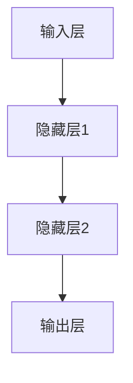
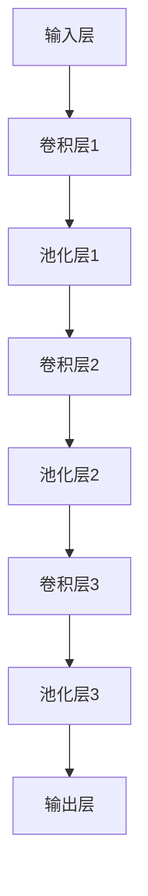
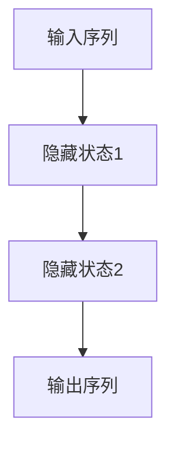
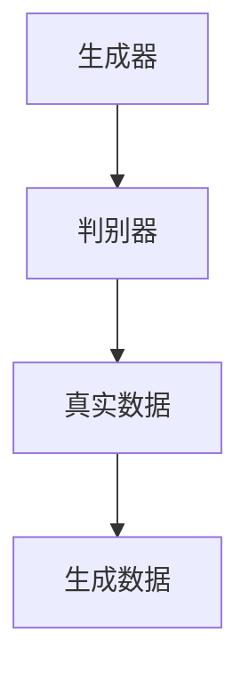
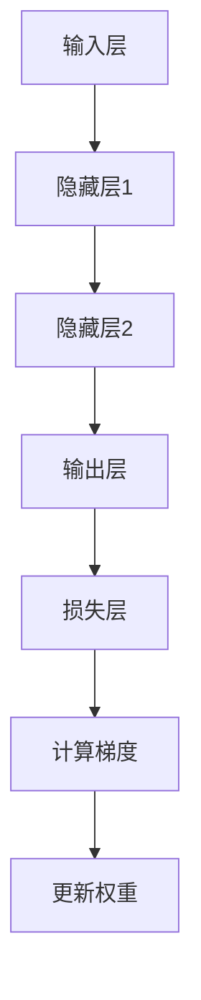

                 

## 基于深度学习的智能医疗问答系统设计与实现

### 文章关键词

- 深度学习
- 智能医疗
- 问答系统
- 医疗影像分析
- 医学知识图谱
- 数据预处理
- 卷积神经网络
- 循环神经网络
- 精准医疗

### 文章摘要

本文将深入探讨基于深度学习的智能医疗问答系统的设计与实现。首先，我们将介绍深度学习的基本概念、优势和挑战，以及深度学习在医疗领域的应用。随后，我们将详细解析深度学习架构，包括神经网络、卷积神经网络和循环神经网络等。接着，我们将讨论深度学习算法，如反向传播算法及其优化方法。文章还将介绍主流深度学习框架，如TensorFlow和PyTorch，并对比分析它们的特点。

在深入讨论医疗问答系统的定义、架构和挑战后，我们将重点介绍智能医疗问答系统的设计与实现，包括数据预处理、问答模型设计和问答系统的开发与优化。我们将通过实际案例展示基于BERT和Transformer的医疗问答系统的训练与评估过程。

文章还将讨论深度学习在医疗影像分析、生物信息学和精准医疗中的应用，并展望深度学习在医疗领域的未来发展。最后，我们将总结文章的主要内容，并提出未来研究方向和个人职业发展建议。

## 目录大纲：《基于深度学习的智能医疗问答系统设计与实现》

- **第一部分：深度学习基础**
  - 第1章：深度学习概述
    - 1.1 深度学习的基本概念
    - 1.2 深度学习的优势与挑战
    - 1.3 深度学习在医疗领域的应用
  - 第2章：深度学习架构
    - 2.1 神经网络
      - 2.1.1 前馈神经网络
      - 2.1.2 卷积神经网络
      - 2.1.3 循环神经网络
    - 2.2 循环神经网络（RNN）
      - 2.2.1 RNN的基本原理
      - 2.2.2 RNN的应用
      - 2.2.3 RNN的优化
    - 2.3 RNN的变种
      - 2.3.1 双向循环神经网络（BRNN）
      - 2.3.2 深度循环神经网络（Deep RNN）
      - 2.3.3 自注意力机制（Self-Attention）
    - 2.4 生成对抗网络（GAN）
      - 2.4.1 GAN的基本原理
      - 2.4.2 GAN的应用
      - 2.4.3 GAN的挑战与优化
  - 第3章：深度学习算法
    - 3.1 反向传播算法
      - 3.1.1 反向传播的原理
      - 3.1.2 反向传播的步骤
      - 3.1.3 反向传播的优化
    - 3.2 梯度下降法优化技巧
      - 3.2.1 学习率调度
      - 33.2 梯度裁剪
      - 3.2.4 其他优化方法
    - 3.3 反向传播算法的应用案例
    - 3.4 反向传播算法的总结与展望
  - 第4章：深度学习框架
    - 4.1 TensorFlow
    - 4.2 PyTorch
    - 4.3 其他深度学习框架

- **第二部分：智能医疗问答系统设计与实现**
  - 第5章：医疗问答系统概述
    - 5.1 医疗问答系统的定义
    - 5.2 医疗问答系统的架构
    - 5.3 医疗问答系统的挑战
  - 第6章：数据预处理
    - 6.1 数据收集与清洗
    - 6.2 数据整合与标准化
    - 6.3 数据分割与特征工程
    - 6.4 常见的数据预处理工具

- **第三部分：智能医疗问答系统设计与实现**
  - 第7章：问答模型设计
    - 7.1 问答模型的基本概念
    - 7.2 问答模型的选择
    - 7.3 问答模型的结构设计
  - 第8章：问答系统实现
    - 8.1 开发环境搭建
    - 8.2 问答系统的核心代码实现
    - 8.3 问答系统的功能实现
  - 第9章：问答系统评测
    - 9.1 评测指标
    - 9.2 评测方法
    - 9.3 评测结果分析

- **第四部分：案例分析**
  - 第10章：基于BERT的医疗问答系统
  - 第10章：基于Transformer的医疗问答系统

- **第五部分：未来展望与拓展**
  - 第11章：深度学习在医疗领域的未来发展
  - 第12章：智能医疗问答系统的拓展与优化
  - 第13章：总结与展望

## 第一部分：深度学习基础

### 第1章：深度学习概述

深度学习是机器学习的一个分支，通过模拟人脑神经网络的结构和功能，实现自动学习和处理数据的能力。它由多层神经网络构成，能够自动提取数据中的特征，并进行复杂模式的识别和理解。深度学习的发展得益于计算能力的提升、大数据的涌现和优化算法的改进。

#### 1.1 深度学习的基本概念

深度学习的基本概念包括神经网络、训练过程、反向传播、深度神经网络（DNN）等。神经网络由一系列的神经元组成，通过前向传播将输入数据传递到输出节点。训练过程是通过优化算法不断调整网络的权重，使网络能够更好地拟合训练数据。反向传播是一种优化算法，通过计算误差的梯度来更新网络的权重。

#### 1.2 深度学习的优势与挑战

深度学习的优势主要体现在以下几个方面：

1. **自动特征提取**：深度学习能够自动从原始数据中提取出有用的特征，减少了手工特征工程的工作量。
2. **大规模数据处理能力**：深度学习模型能够处理大量的数据，并且在大数据集上表现出更好的性能。
3. **强泛化能力**：深度学习模型在训练完成后，能够在新数据上表现良好的泛化能力。
4. **对特定领域的适应性**：通过在特定领域的数据上进行训练，深度学习模型能够适应不同领域的需求。

然而，深度学习也面临一些挑战：

1. **数据需求量大**：深度学习模型需要大量的数据来训练，数据质量和多样性对模型性能有重要影响。
2. **计算资源消耗大**：深度学习模型的训练过程需要大量的计算资源，特别是大规模模型。
3. **对领域知识的依赖性**：深度学习模型在特定领域中的应用往往依赖于对该领域的深入理解和专业知识。
4. **模型的可解释性差**：深度学习模型的工作原理复杂，模型内部的决策过程往往难以解释，这给实际应用带来了一定的困难。

#### 1.3 深度学习在医疗领域的应用

深度学习在医疗领域的应用非常广泛，包括医疗影像分析、生物信息学、精准医疗等多个方面。

1. **医疗影像分析**：深度学习模型在医疗影像分析中具有显著的优势。例如，通过卷积神经网络（CNN）可以实现疾病的自动检测和分类，通过循环神经网络（RNN）可以实现医学图像的序列分析。
2. **生物信息学**：深度学习在生物信息学中的应用也非常广泛。例如，通过深度学习可以实现对基因组序列的分析和蛋白质结构的预测。
3. **精准医疗**：深度学习可以帮助医生制定个性化的治疗方案，通过分析患者的基因组数据和病史，可以预测疾病风险，并制定个性化的预防措施。

总之，深度学习为医疗领域带来了新的机遇和挑战。通过深入理解和应用深度学习技术，我们可以为医疗领域的发展做出更大的贡献。

### 第2章：深度学习架构

深度学习的架构是构建深度学习模型的基础，它决定了模型的性能和效率。深度学习架构主要包括神经网络、卷积神经网络（CNN）和循环神经网络（RNN）等。

#### 2.1 神经网络

神经网络（Neural Networks）是深度学习的基础，它由一系列的神经元（artificial neurons）组成。每个神经元接受多个输入，通过加权求和后经过激活函数得到输出。神经网络的结构通常由输入层、隐藏层和输出层组成。

- **输入层（Input Layer）**：输入层接收外部数据，并将其传递给隐藏层。
- **隐藏层（Hidden Layers）**：隐藏层对输入数据进行处理，通过多层隐藏层可以实现更复杂的特征提取。
- **输出层（Output Layer）**：输出层生成最终的预测结果。

神经网络的基本工作原理是前向传播和反向传播。在前向传播过程中，输入数据通过神经网络逐层传递，直到输出层生成预测结果。在反向传播过程中，通过计算预测结果与实际结果的误差，反向更新网络的权重，以优化模型的性能。

下面是一个简单的神经网络结构的 Mermaid 流程图：



#### 2.1.1 前馈神经网络

前馈神经网络（Feedforward Neural Networks）是最常见的神经网络结构，它没有循环，每个节点都只有单一路径从前一层的节点流向后一层的节点。前馈神经网络主要用于分类和回归问题。

下面是前馈神经网络的工作流程：

1. **初始化权重和偏置**：随机初始化权重和偏置。
2. **前向传播**：输入数据通过神经网络逐层传递，每层输出结果作为下一层的输入。
3. **计算损失**：通过输出层生成的预测结果与实际结果比较，计算损失函数。
4. **反向传播**：计算损失函数关于每个权重的梯度，并反向更新权重和偏置。
5. **迭代训练**：重复前向传播和反向传播，直到模型收敛。

下面是前馈神经网络的伪代码：

```python
# 初始化权重和偏置
weights, biases = initialize_weights_and_biases()

# 前向传播
outputs = forward_pass(inputs, weights, biases)

# 计算损失
loss = compute_loss(outputs, targets)

# 反向传播
dweights, dbiases = backward_pass(outputs, targets, inputs)

# 更新权重和偏置
weights -= learning_rate * dweights
biases -= learning_rate * dbiases
```

#### 2.1.2 卷积神经网络

卷积神经网络（Convolutional Neural Networks，CNN）是专门用于处理图像数据的神经网络，它通过卷积层（Convolutional Layers）和池化层（Pooling Layers）实现图像特征的提取和压缩。

下面是卷积神经网络的基本结构：



- **卷积层**：卷积层通过卷积操作提取图像中的局部特征。卷积操作是将卷积核（filter）与图像进行点积，生成特征图（feature map）。
- **池化层**：池化层通过下采样操作减少特征图的尺寸，提高计算效率。常见的池化操作有最大池化（Max Pooling）和平均池化（Average Pooling）。

下面是一个简单的卷积神经网络结构的伪代码：

```python
# 初始化卷积层和池化层
conv_layer = Conv2D(filter_size, stride, padding)
pooling_layer = MaxPooling(pool_size, stride)

# 前向传播
conv_output = conv_layer(inputs)
pool_output = pooling_layer(conv_output)

# 后续卷积和池化操作
# ...
```

#### 2.1.3 循环神经网络

循环神经网络（Recurrent Neural Networks，RNN）是专门用于处理序列数据的神经网络，它能够处理变长序列数据，并具有记忆功能。

下面是循环神经网络的基本结构：


- **隐藏层**：隐藏层通过循环连接实现序列数据的记忆和传递。
- **输入层和输出层**：输入层接收序列数据，输出层生成最终的预测结果。

下面是一个简单的循环神经网络结构的伪代码：

```python
# 初始化权重和偏置
weights, biases = initialize_weights_and_biases()

# 前向传播
outputs = []
for input in sequence:
    hidden = activate((weights * input) + biases)
    outputs.append(hidden)

# 反向传播
dweights, dbiases = backward_pass(outputs, targets, sequence)
```

#### 2.2 循环神经网络（RNN）

循环神经网络（Recurrent Neural Networks，RNN）是一种能够处理序列数据的神经网络，它的核心特点是具有记忆功能，能够将之前的输入信息存储并传递到后续的步骤。

#### 2.2.1 RNN的基本原理

RNN的基本原理是通过循环结构来处理输入序列。每个时间步的输入都会与之前的隐藏状态进行连接，并通过加权求和和激活函数得到新的隐藏状态。这种循环连接使得RNN能够保留序列信息，从而实现序列数据的建模。

下面是RNN的基本架构：



- **输入序列**：输入序列可以是任意维度的向量。
- **隐藏状态**：隐藏状态是RNN的核心，它存储了前一个时间步的信息。
- **输出序列**：输出序列是RNN的预测结果。

RNN的工作流程如下：

1. **初始化隐藏状态**：在序列的第一个时间步，初始化隐藏状态。
2. **前向传播**：在每个时间步，输入序列的当前元素与隐藏状态进行加权求和，并通过激活函数得到新的隐藏状态。
3. **反向传播**：通过计算误差梯度，反向更新网络的权重。

下面是RNN的基本伪代码：

```python
# 初始化权重和偏置
weights, biases = initialize_weights_and_biases()

# 前向传播
hiddens = [initialize_hidden_state()]
for input in sequence:
    hidden = activate((weights * input) + biases)
    hiddens.append(hidden)

# 反向传播
dweights, dbiases = backward_pass(hiddens, targets, sequence)
```

#### 2.2.2 RNN的应用

RNN在自然语言处理、时间序列分析和语音识别等领域有着广泛的应用。

1. **自然语言处理**：RNN可以用于语言模型、机器翻译和文本分类等任务。例如，通过训练一个RNN语言模型，可以生成高质量的文本摘要。
2. **时间序列分析**：RNN可以用于预测股票价格、气象数据和股市走势等。通过学习历史数据，RNN可以捕捉时间序列中的模式和趋势。
3. **语音识别**：RNN可以用于语音识别，通过处理音频信号，将其转换为文本。例如，通过训练一个RNN模型，可以实现自动字幕生成。

下面是一个简单的RNN应用案例：使用RNN进行情感分类。

```python
# 加载数据集
X_train, y_train = load_data()

# 初始化RNN模型
model = RNN(input_dim=X_train.shape[1], hidden_dim=128)

# 训练模型
model.fit(X_train, y_train)

# 评估模型
accuracy = model.evaluate(X_val, y_val)
```

#### 2.2.3 RNN的优化

尽管RNN在处理序列数据方面具有优势，但它也存在一些问题，如梯度消失和梯度爆炸。为了解决这些问题，研究人员提出了一系列优化方法。

1. **长短时记忆网络（LSTM）**：LSTM通过引入门控机制，可以有效地解决梯度消失问题，并捕捉长距离依赖关系。
2. **门控循环单元（GRU）**：GRU是LSTM的简化版本，它通过门控机制和更新规则，在保留长距离依赖的同时减少了参数数量。
3. **层叠RNN（Stacked RNN）**：通过堆叠多个RNN层，可以进一步捕捉复杂的时间序列模式。

下面是一个简单的LSTM模型的伪代码：

```python
# 初始化LSTM模型
lstm = LSTM(hidden_dim=128)

# 训练LSTM模型
lstm.fit(X_train, y_train)

# 评估LSTM模型
accuracy = lstm.evaluate(X_val, y_val)
```

#### 2.3 RNN的变种

除了基本的RNN、LSTM和GRU，还有许多其他的RNN变种，以解决特定问题。

1. **双向RNN（BRNN）**：BRNN通过同时处理正向和反向序列，可以捕捉更复杂的序列模式。
2. **深度RNN（Deep RNN）**：Deep RNN通过堆叠多个RNN层，可以捕捉更长的序列依赖。
3. **自注意力机制（Self-Attention）**：Self-Attention可以用于处理变长序列，特别是在自然语言处理任务中，可以显著提高模型的性能。

下面是一个简单的BRNN模型的伪代码：

```python
# 初始化双向RNN模型
brnn = BRNN(input_dim=X_train.shape[1], hidden_dim=128)

# 训练双向RNN模型
brnn.fit(X_train, y_train)

# 评估双向RNN模型
accuracy = brnn.evaluate(X_val, y_val)
```

#### 2.4 生成对抗网络（GAN）

生成对抗网络（Generative Adversarial Networks，GAN）是由生成器和判别器组成的对抗性训练模型。生成器的目标是生成与真实数据相似的数据，而判别器的目标是区分真实数据和生成数据。通过这种对抗性训练，生成器逐渐生成更逼真的数据。

下面是GAN的基本结构：



- **生成器**：生成器的目标是生成逼真的数据。
- **判别器**：判别器的目标是区分真实数据和生成数据。
- **真实数据**：真实数据是用于训练判别器的数据。
- **生成数据**：生成数据是生成器生成的数据。

GAN的工作流程如下：

1. **初始化生成器和判别器**：随机初始化生成器和判别器的权重。
2. **训练生成器和判别器**：交替训练生成器和判别器，生成器尝试生成更逼真的数据，而判别器尝试更好地区分真实数据和生成数据。
3. **评估生成器性能**：通过评估生成器的生成质量，来评估GAN的性能。

下面是一个简单的GAN模型的伪代码：

```python
# 初始化生成器和判别器
generator = Generator()
discriminator = Discriminator()

# 训练生成器和判别器
for epoch in range(num_epochs):
    for data in data_loader:
        # 训练判别器
        discriminator.train(data)
        
        # 训练生成器
        generator.train(discriminator)

# 评估生成器
generator.eval()
```

#### 2.5 深度学习模型的选择与优化

在深度学习项目中，选择合适的模型和优化方法至关重要。以下是一些常用的深度学习模型和优化方法：

1. **选择合适的模型**：根据任务需求和数据特点选择合适的模型，如卷积神经网络（CNN）适用于图像分类，循环神经网络（RNN）适用于序列数据。
2. **优化方法**：选择合适的优化方法，如随机梯度下降（SGD）、Adam等。优化方法可以显著影响模型的收敛速度和性能。
3. **超参数调整**：通过调整超参数，如学习率、批量大小等，可以优化模型的性能。

下面是一个简单的模型选择和优化流程：

```python
# 加载数据集
X_train, y_train = load_data()

# 选择模型
model = CNN()

# 调整超参数
learning_rate = 0.001
batch_size = 64

# 训练模型
model.fit(X_train, y_train, learning_rate=learning_rate, batch_size=batch_size)

# 评估模型
accuracy = model.evaluate(X_val, y_val)
```

#### 2.6 深度学习模型的选择与优化

在深度学习项目中，选择合适的模型和优化方法至关重要。以下是一些常用的深度学习模型和优化方法：

1. **选择合适的模型**：根据任务需求和数据特点选择合适的模型，如卷积神经网络（CNN）适用于图像分类，循环神经网络（RNN）适用于序列数据。
2. **优化方法**：选择合适的优化方法，如随机梯度下降（SGD）、Adam等。优化方法可以显著影响模型的收敛速度和性能。
3. **超参数调整**：通过调整超参数，如学习率、批量大小等，可以优化模型的性能。

下面是一个简单的模型选择和优化流程：

```python
# 加载数据集
X_train, y_train = load_data()

# 选择模型
model = CNN()

# 调整超参数
learning_rate = 0.001
batch_size = 64

# 训练模型
model.fit(X_train, y_train, learning_rate=learning_rate, batch_size=batch_size)

# 评估模型
accuracy = model.evaluate(X_val, y_val)
```

### 第3章：深度学习算法

深度学习算法是实现深度学习模型的关键，它决定了模型的训练过程和性能。本章将详细介绍深度学习算法的核心部分，包括反向传播算法、梯度下降法及其优化方法。

#### 3.1 反向传播算法

反向传播算法（Backpropagation Algorithm）是深度学习训练过程的核心。它通过计算损失函数关于每个权重的梯度，并反向更新权重，使模型能够逐步逼近最优解。反向传播算法分为两个阶段：前向传播和反向传播。

#### 3.1.1 反向传播的原理

反向传播算法的原理可以概括为以下几个步骤：

1. **前向传播**：输入数据通过神经网络逐层传递，每个节点通过加权求和和激活函数生成输出。在输出层生成预测结果后，计算损失函数。
2. **计算梯度**：计算损失函数关于每个权重的梯度。在反向传播过程中，从输出层开始，将损失函数的梯度反向传递到输入层，并逐层更新权重。
3. **权重更新**：使用梯度更新权重和偏置，以最小化损失函数。

下面是一个简单的反向传播算法的流程：



#### 3.1.2 反向传播的步骤

反向传播算法的具体步骤如下：

1. **前向传播**：输入数据通过神经网络逐层传递，输出预测结果。
2. **计算损失**：计算预测结果与实际结果的差异，得到损失值。
3. **计算梯度**：从输出层开始，计算损失函数关于每个权重的梯度。
4. **权重更新**：使用梯度更新网络中的权重和偏置，以最小化损失函数。
5. **迭代训练**：重复上述步骤，直到模型收敛。

下面是一个简单的反向传播算法的伪代码：

```python
# 初始化权重和偏置
weights, biases = initialize_weights_and_biases()

# 前向传播
outputs = forward_pass(inputs, weights, biases)

# 计算损失
loss = compute_loss(outputs, targets)

# 反向传播
dweights, dbiases = backward_pass(outputs, targets, inputs)

# 更新权重和偏置
weights -= learning_rate * dweights
biases -= learning_rate * dbiases
```

#### 3.1.3 反向传播的优化

反向传播算法的优化主要包括以下几个方面：

1. **学习率调度**：学习率是控制模型收敛速度的关键参数。适当调整学习率可以帮助模型更快地收敛，避免过拟合。
2. **梯度裁剪**：梯度裁剪是一种防止梯度消失和梯度爆炸的方法。通过限制梯度的绝对值，可以防止模型在训练过程中出现不稳定的情况。
3. **优化算法**：除了传统的随机梯度下降（SGD），还有许多其他的优化算法，如Adam、RMSprop等，这些算法通过改进梯度计算方法，提高了模型的训练效率。

下面是一个简单的优化算法的伪代码：

```python
# 初始化学习率和优化算法
learning_rate = 0.001
optimizer = Adam()

# 前向传播
outputs = forward_pass(inputs, weights, biases)

# 计算损失
loss = compute_loss(outputs, targets)

# 反向传播
dweights, dbiases = backward_pass(outputs, targets, inputs)

# 更新权重和偏置
optimizer.update(weights, dweights, biases, dbiases)
```

#### 3.1.4 反向传播算法的应用案例

反向传播算法在深度学习领域得到了广泛应用，下面列举几个典型的应用案例：

1. **图像分类**：通过卷积神经网络（CNN）和反向传播算法，可以实现高效的图像分类。例如，在ImageNet竞赛中，深度学习模型通过反向传播算法成功识别了数百万个图像类别。
2. **语音识别**：循环神经网络（RNN）和反向传播算法可以用于语音识别任务。通过训练大量的语音数据，模型可以准确地将语音信号转换为文本。
3. **自然语言处理**：在自然语言处理任务中，如语言模型、机器翻译和文本分类等，反向传播算法也是不可或缺的工具。通过训练大量的文本数据，模型可以生成高质量的文本摘要和翻译结果。

下面是一个简单的图像分类案例：

```python
# 加载数据集
X_train, y_train = load_image_data()

# 初始化模型
model = CNN()

# 训练模型
model.fit(X_train, y_train)

# 评估模型
accuracy = model.evaluate(X_val, y_val)
```

#### 3.1.5 反向传播算法的总结与展望

反向传播算法是深度学习模型训练的核心，它通过计算损失函数的梯度，实现了模型的自动优化。反向传播算法的成功应用推动了深度学习技术的发展，使得深度学习在图像识别、自然语言处理和语音识别等领域取得了显著成果。

然而，反向传播算法也存在一些局限性，如对初始参数敏感、训练过程复杂等。未来，随着深度学习技术的不断发展，反向传播算法可能会引入新的优化方法，提高模型的训练效率和性能。同时，深度学习算法在其他领域的应用也将进一步扩展，为人工智能的发展做出更大贡献。

### 第4章：深度学习框架

深度学习框架是深度学习实践中的核心工具，它们提供了高效、灵活和可扩展的深度学习模型开发环境。本章将介绍几种主流的深度学习框架，包括TensorFlow、PyTorch等，并对比分析它们的特点。

#### 4.1 TensorFlow

TensorFlow是由Google开发的一种开源深度学习框架，它提供了丰富的API和工具，用于构建、训练和部署深度学习模型。TensorFlow的核心优势在于其灵活性和可扩展性，它支持多种硬件平台（如CPU、GPU和TPU）和多设备部署。

##### 4.1.1 TensorFlow的基本使用

安装TensorFlow：

```bash
pip install tensorflow
```

基本使用示例：

```python
import tensorflow as tf

# 定义一个简单的线性模型
model = tf.keras.Sequential([
    tf.keras.layers.Dense(10, activation='relu', input_shape=(10,)),
    tf.keras.layers.Dense(1)
])

# 编译模型
model.compile(optimizer='adam', loss='mean_squared_error')

# 训练模型
model.fit(x_train, y_train, epochs=10)

# 评估模型
accuracy = model.evaluate(x_val, y_val)
```

##### 4.1.2 TensorFlow的API详解

TensorFlow的API主要包括以下几个模块：

1. **tf.keras**：提供高性能的Keras兼容API，用于快速构建和训练模型。
2. **tf.data**：用于高效处理和加载数据。
3. **tf.nn**：提供各种神经网络层和激活函数。
4. **tf.optimizers**：提供优化器，如Adam、RMSprop等。
5. **tf.metrics**：提供各种评估指标，如精确率、召回率等。

##### 4.1.3 TensorFlow的性能优化

TensorFlow的性能优化主要包括以下几个方面：

1. **模型优化**：通过模型压缩、量化等手段减小模型大小和提高计算效率。
2. **数据优化**：通过数据预处理、批量处理等提高数据加载速度和吞吐量。
3. **硬件优化**：通过使用GPU、TPU等硬件加速训练过程。

示例代码：

```python
import tensorflow as tf

# 使用GPU加速
gpus = tf.config.list_physical_devices('GPU')
tf.config.experimental.set_memory_growth(gpus[0], True)

# 使用模型压缩
import tensorflow_model_optimization as tfmot
pruned_model = tfmot.sparsity.keras.prune_low_magnitude(model)

# 使用模型量化
import tensorflow_quantization as tfq
quantized_model = tfq.keras.quantize_model(model)
```

##### 4.1.4 TensorFlow的优势与局限

**优势**：

- **灵活性和可扩展性**：支持多种硬件平台和多设备部署。
- **丰富的API和工具**：提供Keras兼容API、数据加载和处理工具等。
- **生态系统**：拥有庞大的社区和支持，提供大量的开源资源和教程。

**局限**：

- **复杂性和学习曲线**：对新手有一定的学习难度。
- **性能与PyTorch相比**：在某些情况下性能可能不如PyTorch。

#### 4.2 PyTorch

PyTorch是由Facebook开发的一种开源深度学习框架，它以其动态计算图和灵活的API而闻名。PyTorch的核心优势在于其简洁和易于理解，使得深度学习模型开发更加直观和高效。

##### 4.2.1 PyTorch的基本使用

安装PyTorch：

```bash
pip install torch torchvision
```

基本使用示例：

```python
import torch
import torchvision

# 定义一个简单的线性模型
model = torch.nn.Sequential(
    torch.nn.Linear(10, 10),
    torch.nn.ReLU(),
    torch.nn.Linear(10, 1)
)

# 编译模型
optimizer = torch.optim.Adam(model.parameters(), lr=0.001)
criterion = torch.nn.MSELoss()

# 训练模型
for epoch in range(10):
    for x, y in dataset:
        # 前向传播
        outputs = model(x)
        loss = criterion(outputs, y)
        
        # 反向传播
        optimizer.zero_grad()
        loss.backward()
        optimizer.step()

# 评估模型
with torch.no_grad():
    accuracy = model.evaluate(x_val, y_val)
```

##### 4.2.2 PyTorch的API详解

PyTorch的API主要包括以下几个模块：

1. **torch**：提供基础的Tensor操作和神经网络层。
2. **torch.optim**：提供各种优化器，如Adam、RMSprop等。
3. **torch.nn**：提供神经网络层和损失函数。
4. **torchvision**：提供预训练的模型和数据集。

##### 4.2.3 PyTorch的优势与局限

**优势**：

- **简洁和易用**：动态计算图和简洁的API使得模型开发更加直观。
- **灵活性**：支持自定义计算图和动态操作。

**局限**：

- **性能与TensorFlow相比**：在某些情况下性能可能不如TensorFlow。
- **生态系统**：相比TensorFlow，PyTorch的开源资源和教程较少。

#### 4.3 其他深度学习框架

除了TensorFlow和PyTorch，还有其他一些流行的深度学习框架，如Keras、Theano、MXNet等。

1. **Keras**：一个高层次的神经网络API，建立在TensorFlow和Theano之上，提供简洁和高效的模型开发环境。
2. **Theano**：一个基于Python的深度学习框架，支持GPU加速，但在2018年宣布不再维护。
3. **MXNet**：Apache MXNet是一个开源的深度学习框架，支持多种编程语言，具有良好的性能和灵活性。

##### 4.3.1 Keras

安装Keras：

```bash
pip install keras
```

基本使用示例：

```python
from keras.models import Sequential
from keras.layers import Dense, Activation

# 定义一个简单的线性模型
model = Sequential()
model.add(Dense(10, activation='relu', input_shape=(10,)))
model.add(Dense(1))

# 编译模型
model.compile(optimizer='adam', loss='mean_squared_error')

# 训练模型
model.fit(x_train, y_train, epochs=10)

# 评估模型
accuracy = model.evaluate(x_val, y_val)
```

##### 4.3.2 Theano

安装Theano：

```bash
pip install theano
```

基本使用示例：

```python
import theano
import theano.tensor as T

# 定义一个简单的线性模型
x = T.vector('x')
y = T.vector('y')
w = theano.shared(value=np.zeros((10, 1)), name='w')

# 定义前向传播和损失函数
linear_output = T.dot(x, w)
loss = T.mean((linear_output - y)**2)

# 编译模型
train_fn = theano.function(inputs=[x, y], outputs=loss, updates={w: w - 0.1 * T.grad(loss, w)})

# 训练模型
for epoch in range(10):
    for x_batch, y_batch in dataset:
        loss = train_fn(x_batch, y_batch)

# 评估模型
with theano.function(inputs=[x], outputs=linear_output):
    accuracy = model.evaluate(x_val, y_val)
```

##### 4.3.3 MXNet

安装MXNet：

```bash
pip install mxnet
```

基本使用示例：

```python
import mxnet as mx

