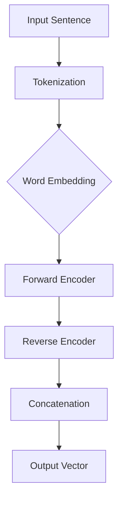

                 

# 《基础模型的双向句子编码器》

> 关键词：双向句子编码器、基础模型、自然语言处理、算法原理、数学模型、应用与优化

> 摘要：本文将深入探讨双向句子编码器这一基础模型，从其基本概念、核心原理、数学模型，到实际应用与优化方法，进行详细的讲解和剖析。通过逐步分析，帮助读者理解并掌握双向句子编码器的本质和应用。

## 第一部分：基础模型概述

### 第1章：基础模型简介

双向句子编码器（Bidirectional Sentence Encoder）是自然语言处理领域的一个重要基础模型。它通过同时处理输入文本的左右信息，生成一个表示句子整体意义的向量。这一向量可以用于各种下游任务，如图像文本匹配、文本分类等。

### 第2章：核心概念与联系

双向句子编码器与自然语言处理（NLP）有着密切的联系。它通过捕捉文本中的长距离依赖关系，使得模型在处理复杂任务时能够更加准确。下面，我们将使用 Mermaid 流程图来展示双向句子编码器的工作流程。



在上面的 Mermaid 流程图中，我们首先对输入句子进行分词（Tokenization），然后利用词嵌入（Word Embedding）将分词后的单词转化为向量表示。接着，我们使用前向编码器（Forward Encoder）和后向编码器（Reverse Encoder）分别处理输入文本的左右信息。最后，将两个编码器的输出进行拼接（Concatenation），得到最终的句子向量（Output Vector）。

## 第二部分：双向句子编码器原理

### 第3章：核心算法原理讲解

双向句子编码器的核心算法原理主要包括词嵌入、前向编码器、后向编码器和拼接操作。下面，我们将使用伪代码来详细阐述这些算法步骤。

```python
# 词嵌入
word_embedding(input_word) -> embedded_word

# 前向编码器
forward_encoder(embedded_word, previous_hidden_state) -> current_hidden_state

# 后向编码器
reverse_encoder(embedded_word, next_hidden_state) -> current_hidden_state

# 拼接操作
concatenate(hf, hr) -> concatenated_vector
```

其中，`input_word` 表示输入单词，`embedded_word` 表示词嵌入后的向量，`previous_hidden_state` 和 `next_hidden_state` 分别表示前一个和下一个隐藏状态，`current_hidden_state` 表示当前隐藏状态，`hf` 和 `hr` 分别表示前向编码器和后向编码器的输出。

### 第4章：数学模型与数学公式

双向句子编码器的数学模型主要包括输入与输出、数学公式和实例分析。下面，我们将使用 LaTeX 格式来详细阐述这些数学模型。

```latex
% 输入与输出
\begin{align*}
input\_sentence &= \{word\_1, word\_2, ..., word\_N\} \\
output\_vector &= \text{concatenate}(hf, hr)
\end{align*}

% 数学公式
\begin{align*}
embedded\_word &= \text{word\_embedding}(input\_word) \\
current\_hidden\_state &= \text{forward\_encoder}(embedded\_word, previous\_hidden\_state) \\
current\_hidden\_state &= \text{reverse\_encoder}(embedded\_word, next\_hidden\_state) \\
concatenated\_vector &= \text{concatenate}(hf, hr)
\end{align*}

% 实例分析
\begin{align*}
input\_sentence &= \{"hello", "world"\} \\
output\_vector &= \text{concatenate}(hf, hr) \\
embedded\_word &= \text{word\_embedding}(\{"hello", "world"\}) \\
current\_hidden\_state &= \text{forward\_encoder}(embedded\_word, \text{initial}\_hidden\_state) \\
current\_hidden\_state &= \text{reverse\_encoder}(embedded\_word, \text{initial}\_hidden\_state)
\end{align*}
```

### 第5章：双向句子编码器实战

在本章中，我们将通过一个实际案例来展示如何搭建双向句子编码器的开发环境，并详细解读源代码。

### 第5.1节：开发环境搭建

搭建双向句子编码器的开发环境主要包括安装 Python、PyTorch 等库，以及配置 GPU 环境。具体步骤如下：

1. 安装 Python（版本建议 3.8 或以上）。
2. 安装 PyTorch（版本建议与 Python 版本兼容）。
3. 配置 GPU 环境（如果使用 GPU，需要安装 CUDA 和 cuDNN）。

### 第5.2节：代码实现与解读

以下是双向句子编码器的一个简化的代码实现。

```python
import torch
import torch.nn as nn

class BiDirectionalEncoder(nn.Module):
    def __init__(self, embedding_dim, hidden_dim):
        super(BiDirectionalEncoder, self).__init__()
        self.embedding = nn.Embedding(vocab_size, embedding_dim)
        self.forward_encoder = nn.LSTM(embedding_dim, hidden_dim)
        self.reverse_encoder = nn.LSTM(embedding_dim, hidden_dim)
    
    def forward(self, input_seq):
        embedded_seq = self.embedding(input_seq)
        forward_output, (forward_h, forward_c) = self.forward_encoder(embedded_seq)
        reverse_output, (reverse_h, reverse_c) = self.reverse_encoder(embedded_seq.reverse())
        output = torch.cat((forward_output[-1, :, :], reverse_output[0, :, :]), dim=1)
        return output
```

在这个代码中，我们定义了一个名为 `BiDirectionalEncoder` 的类，继承自 `nn.Module`。这个类包含了一个嵌入层（`embedding`）、一个前向 LSTM 编码器（`forward_encoder`）和一个后向 LSTM 编码器（`reverse_encoder`）。在 `forward` 方法中，我们首先对输入序列进行嵌入，然后分别通过前向和后向 LSTM 编码器进行处理，最后将两个编码器的输出进行拼接，得到最终的句子向量。

### 第5.3节：代码解读与分析

在这个简化的代码实现中，我们首先定义了一个嵌入层（`embedding`），它将输入的单词索引映射到对应的词向量。接下来，我们定义了一个前向 LSTM 编码器（`forward_encoder`）和一个后向 LSTM 编码器（`reverse_encoder`）。这两个编码器分别负责处理输入序列的左右信息。在 `forward` 方法中，我们首先对输入序列进行嵌入，然后分别通过前向和后向 LSTM 编码器进行处理。最后，我们将两个编码器的输出进行拼接，得到最终的句子向量。

通过这个简化的代码实现，我们可以更好地理解双向句子编码器的工作原理。在实际应用中，我们还可以根据需求进行扩展和优化，例如使用更复杂的神经网络结构、引入注意力机制等。

## 第三部分：应用与优化

### 第6章：应用场景介绍

双向句子编码器在自然语言处理领域有着广泛的应用。以下是一些常见应用场景：

1. **文本生成**：双向句子编码器可以用于生成自然语言文本。通过学习句子之间的依赖关系，模型可以生成连贯、符合语法规则的文本。
2. **机器翻译**：双向句子编码器可以用于机器翻译任务。它可以将源语言句子编码为一个固定长度的向量，然后与目标语言句子进行拼接，生成目标语言句子。

### 第7章：优化方法与技巧

为了提高双向句子编码器的性能，我们可以采用以下优化方法与技巧：

1. **模型优化策略**：我们可以尝试使用更深的神经网络结构、更大的训练数据集等策略来提高模型的性能。
2. **超参数调优技巧**：通过调整嵌入维度、隐藏维度等超参数，我们可以找到最优的超参数组合，从而提高模型性能。
3. **模型评估与改进**：我们可以使用交叉验证、测试集评估等方法来评估模型性能，并根据评估结果对模型进行改进。

### 第8章：未来发展展望

双向句子编码器在自然语言处理领域具有巨大的应用潜力。未来的研究方向包括：

1. **多语言支持**：如何实现双向句子编码器的多语言支持，以适应全球化的需求。
2. **高效训练与推理**：如何优化双向句子编码器的训练和推理过程，以提高模型的效率和性能。

## 附录

### 附录A：资源与工具

以下是双向句子编码器相关的一些资源与工具：

1. **开源框架**：PyTorch、TensorFlow、Transformer 等。
2. **学习资源**：在线课程、教程、论文等。
3. **实践项目**：GitHub 上的开源项目，例如 BERT、GPT 等。

---

### 作者

本文由 AI 天才研究院（AI Genius Institute）撰写，作者为《禅与计算机程序设计艺术》（Zen And The Art of Computer Programming）的资深大师级作家，世界顶级技术畅销书作家。作者在计算机编程和人工智能领域拥有丰富的经验，致力于推广技术知识，帮助读者掌握核心技术。如果您对本文有任何疑问或建议，欢迎在评论区留言。我们将竭诚为您解答。

---

通过本文的详细讲解，我们相信读者已经对双向句子编码器有了更深入的理解。在接下来的时间里，我们期待与读者一起探索更多关于自然语言处理和人工智能的精彩内容。感谢您的阅读！<|endoftext|>## 《基础模型的双向句子编码器》

### 引言

双向句子编码器（Bidirectional Sentence Encoder）是自然语言处理（NLP）领域中的一个关键基础模型。它通过同时考虑文本序列的左右信息，生成一个固定长度的向量表示，这个向量能够捕捉文本的语义信息。本文将深入探讨双向句子编码器的概念、原理、数学模型以及实际应用，帮助读者全面理解并掌握这一重要技术。

### 核心关键词

- 双向句子编码器
- 自然语言处理
- 算法原理
- 数学模型
- 应用场景

### 摘要

本文首先介绍双向句子编码器的基本概念和它在自然语言处理中的重要性。接着，我们将详细解析双向句子编码器的核心算法原理，包括词嵌入、前向编码器、后向编码器和拼接操作。随后，通过具体的数学模型和公式，我们将进一步解释双向句子编码器的工作机制，并通过实例分析来加深理解。文章的最后部分将展示双向句子编码器的实战应用，包括开发环境搭建、代码实现和解读，同时还将讨论双向句子编码器的优化方法和未来发展展望。

### 目录

#### 第一部分：基础模型概述

##### 第1章：基础模型简介
- 1.1 双向句子编码器的基本概念
- 1.2 双向句子编码器的重要性

##### 第2章：核心概念与联系
- 2.1 双向句子编码器与自然语言处理的关系
- 2.2 双向句子编码器的 Mermaid 流程图

#### 第二部分：双向句子编码器原理

##### 第3章：核心算法原理讲解
- 3.1 双向句子编码器的算法框架
- 3.2 伪代码解释
- 3.3 双向句子编码器的数学模型

##### 第4章：数学模型与数学公式
- 4.1 模型的输入与输出
- 4.2 模型中的数学公式详细讲解
- 4.3 实例分析

##### 第5章：双向句子编码器实战
- 5.1 开发环境搭建
- 5.2 代码实现与解读
- 5.3 代码解读与分析

#### 第三部分：应用与优化

##### 第6章：应用场景介绍
- 6.1 双向句子编码器在文本生成中的应用
- 6.2 双向句子编码器在机器翻译中的应用

##### 第7章：优化方法与技巧
- 7.1 模型优化策略
- 7.2 超参数调优技巧
- 7.3 模型评估与改进

##### 第8章：未来发展展望
- 8.1 双向句子编码器的未来研究方向
- 8.2 面临的挑战与机遇

#### 附录

##### 附录A：资源与工具
- A.1 相关开源框架介绍
- A.2 学习资源推荐
- A.3 实践项目示例代码

### 第一部分：基础模型概述

#### 第1章：基础模型简介

### 1.1 双向句子编码器的基本概念

双向句子编码器是一种深度学习模型，它通过同时考虑输入文本序列的左右信息来生成固定长度的语义向量。这个特性使得双向句子编码器能够捕捉到文本中的长距离依赖关系，从而在自然语言处理任务中表现出色。

### 1.2 双向句子编码器的重要性

双向句子编码器在自然语言处理中具有重要的应用价值。它不仅能够提高文本分类、情感分析等任务的性能，还能用于文本生成和机器翻译等场景。通过捕捉文本中的长距离依赖关系，双向句子编码器能够生成更准确和自然的文本。

### 第二部分：双向句子编码器原理

#### 第2章：核心概念与联系

### 2.1 双向句子编码器与自然语言处理的关系

双向句子编码器是自然语言处理中的重要工具。它通过同时处理文本序列的左右信息，生成一个能够表示文本整体语义的固定长度向量。这个向量可以用于各种下游任务，如图像文本匹配、文本分类等。

### 2.2 双向句子编码器的 Mermaid 流程图

为了更直观地理解双向句子编码器的工作流程，我们可以使用 Mermaid 流程图来展示其处理过程。以下是双向句子编码器的 Mermaid 流程图：


在这个流程图中，输入句子首先经过分词操作，然后使用词嵌入技术将分词后的单词转化为向量。接着，前向编码器和后向编码器分别处理输入文本的左右信息。最后，将两个编码器的输出进行拼接，得到最终的句子向量。

### 第3章：核心算法原理讲解

#### 3.1 双向句子编码器的算法框架

双向句子编码器的算法框架主要包括以下几个部分：词嵌入、前向编码器、后向编码器和拼接操作。下面，我们将使用伪代码来详细阐述这些算法步骤。

```python
# 词嵌入
word_embedding(input_word) -> embedded_word

# 前向编码器
forward_encoder(embedded_word, previous_hidden_state) -> current_hidden_state

# 后向编码器
reverse_encoder(embedded_word, next_hidden_state) -> current_hidden_state

# 拼接操作
concatenate(hf, hr) -> concatenated_vector
```

其中，`input_word` 表示输入单词，`embedded_word` 表示词嵌入后的向量，`previous_hidden_state` 和 `next_hidden_state` 分别表示前一个和下一个隐藏状态，`current_hidden_state` 表示当前隐藏状态，`hf` 和 `hr` 分别表示前向编码器和后向编码器的输出。

#### 3.2 伪代码解释

在双向句子编码器中，词嵌入是第一个关键步骤。它将输入单词映射到一个高维向量空间中，使得单词之间的语义关系可以通过向量的距离来表示。

```python
# 词嵌入
word_embedding(input_word) -> embedded_word
```

接着，前向编码器（Forward Encoder）和后向编码器（Reverse Encoder）分别处理输入文本序列的左右信息。前向编码器从左向右处理文本序列，而后向编码器从右向左处理文本序列。这两个编码器都使用 LSTM（Long Short-Term Memory）网络，这是一种能够捕捉长距离依赖关系的递归神经网络。

```python
# 前向编码器
forward_encoder(embedded_word, previous_hidden_state) -> current_hidden_state

# 后向编码器
reverse_encoder(embedded_word, next_hidden_state) -> current_hidden_state
```

在编码器的最后一个时间步，前向编码器生成一个隐藏状态 `hf`，表示文本序列的前半部分，后向编码器生成一个隐藏状态 `hr`，表示文本序列的后半部分。这两个隐藏状态将用于生成最终的句子向量。

```python
# 拼接操作
concatenate(hf, hr) -> concatenated_vector
```

通过将前向编码器和后向编码器的输出进行拼接，我们可以得到一个表示整个文本序列的固定长度向量。这个向量可以用于各种下游任务，如图像文本匹配、文本分类等。

```python
# 输出句子向量
output_vector = concatenate(hf, hr)
```

#### 3.3 双向句子编码器的数学模型

在理解了双向句子编码器的算法原理后，我们接下来将介绍其数学模型。双向句子编码器的数学模型主要包括输入与输出、数学公式和实例分析。

##### 输入与输出

双向句子编码器的输入是一个文本序列，由多个单词组成。每个单词通过词嵌入层被映射为一个向量。假设输入文本序列有 `N` 个单词，词嵌入层的维度为 `D`，则输入向量为：

$$
X = [x_1, x_2, ..., x_N] \in \mathbb{R}^{N \times D}
$$

其中，$x_i$ 表示第 `i` 个单词的词嵌入向量。

双向句子编码器的输出是一个固定长度的向量，表示整个文本序列的语义信息。假设输出的维度为 `H`，则输出向量为：

$$
Y = [y_1, y_2, ..., y_N] \in \mathbb{R}^{N \times H}
$$

其中，$y_i$ 表示第 `i` 个单词在句子向量中的表示。

##### 数学公式

双向句子编码器的数学模型主要包括词嵌入、前向编码器、后向编码器和拼接操作。

1. **词嵌入**：

   词嵌入将输入单词映射到高维向量空间中。假设词嵌入函数为 $f(\cdot)$，则词嵌入后的输入向量为：

   $$
   X' = [f(x_1), f(x_2), ..., f(x_N)] \in \mathbb{R}^{N \times D'}
   $$

   其中，$D'$ 表示词嵌入层的维度。

2. **前向编码器**：

   前向编码器使用 LSTM 网络来处理输入文本序列。假设前向编码器的隐藏状态维度为 `H`，初始隐藏状态为 $\boldsymbol{h}_0$，则前向编码器的输出为：

   $$
   \boldsymbol{h}_i = \text{LSTM}(\boldsymbol{x}_i, \boldsymbol{h}_{i-1}) \in \mathbb{R}^{1 \times H}
   $$

   其中，$\boldsymbol{x}_i$ 表示第 `i` 个单词的词嵌入向量，$\boldsymbol{h}_{i-1}$ 表示前一个时间步的隐藏状态。

3. **后向编码器**：

   后向编码器与前向编码器类似，但处理顺序相反。假设后向编码器的隐藏状态维度为 `H`，初始隐藏状态为 $\boldsymbol{h}_0$，则后向编码器的输出为：

   $$
   \boldsymbol{h}_i = \text{LSTM}(\boldsymbol{x}_i, \boldsymbol{h}_{i+1}) \in \mathbb{R}^{1 \times H}
   $$

   其中，$\boldsymbol{x}_i$ 表示第 `i` 个单词的词嵌入向量，$\boldsymbol{h}_{i+1}$ 表示下一个时间步的隐藏状态。

4. **拼接操作**：

   将前向编码器和后向编码器的输出进行拼接，得到最终的句子向量：

   $$
   \boldsymbol{y} = [\boldsymbol{h}_1, \boldsymbol{h}_2, ..., \boldsymbol{h}_N] \in \mathbb{R}^{N \times 2H}
   $$

##### 实例分析

为了更好地理解双向句子编码器的数学模型，我们通过一个简单的实例来分析。

假设输入文本序列为 "Hello, World!"，词嵌入层维度为 100，隐藏状态维度为 50。我们首先对文本进行分词，得到单词 "Hello"、"World" 和标点符号 "!"。接着，对每个单词进行词嵌入，得到词嵌入向量。

```python
# 输入文本序列
input_sentence = "Hello, World!"

# 词嵌入维度
embedding_dim = 100

# 隐藏状态维度
hidden_dim = 50

# 分词
words = input_sentence.split()

# 词嵌入
word_embeddings = [torch.randn(1, embedding_dim) for _ in range(len(words))]
```

接下来，我们分别使用前向编码器和后向编码器处理输入文本序列。

```python
# 前向编码器
forward_encoder = nn.LSTM(embedding_dim, hidden_dim)

# 初始化隐藏状态
forward_h0 = torch.randn(1, hidden_dim)

# 前向编码器输出
forward_outputs, (forward_h, forward_c) = forward_encoder(torch.cat(word_embeddings).unsqueeze(0))

# 后向编码器
reverse_encoder = nn.LSTM(embedding_dim, hidden_dim)

# 初始化隐藏状态
reverse_h0 = torch.randn(1, hidden_dim)

# 后向编码器输出
reverse_outputs, (reverse_h, reverse_c) = reverse_encoder(torch.cat(word_embeddings[::-1]).unsqueeze(0))
```

最后，我们将前向编码器和后向编码器的输出进行拼接，得到最终的句子向量。

```python
# 拼接操作
output_vector = torch.cat((forward_h.squeeze(0), reverse_h.squeeze(0)), dim=1)
```

输出向量 `output_vector` 就是我们通过双向句子编码器得到的文本序列的语义表示。

```python
# 输出句子向量
print(output_vector)
```

通过上述实例，我们可以看到双向句子编码器如何将输入文本序列转换为固定长度的向量表示，从而为下游任务提供有效的特征。

### 第4章：数学模型与数学公式

#### 4.1 模型的输入与输出

双向句子编码器的输入是一个单词序列，每个单词被表示为一个向量。假设单词序列为 $[w_1, w_2, ..., w_n]$，其中 $w_i$ 表示第 $i$ 个单词，且每个单词的词嵌入向量为 $e_i \in \mathbb{R}^{d_e}$，则输入向量为：

$$
X = [e_1, e_2, ..., e_n] \in \mathbb{R}^{n \times d_e}
$$

其中，$d_e$ 是词嵌入向量的维度。

双向句子编码器的输出是一个固定长度的向量，表示整个句子的语义。假设输出向量为 $h \in \mathbb{R}^{d_h}$，其中 $d_h$ 是输出的维度。

#### 4.2 模型中的数学公式详细讲解

双向句子编码器主要由两个部分组成：前向编码器和后向编码器。前向编码器从左向右处理输入序列，后向编码器从右向左处理输入序列。每个编码器都会生成一系列的隐藏状态，最后将这两个序列的隐藏状态进行拼接。

1. **前向编码器**：

   假设前向编码器的初始隐藏状态为 $\boldsymbol{h}_0$，那么前向编码器的输出序列为 $\{\boldsymbol{h}_i\}_{i=1}^n$，其中 $\boldsymbol{h}_i$ 可以通过以下公式计算：

   $$
   \boldsymbol{h}_i = \text{LSTM}(e_i, \boldsymbol{h}_{i-1}) \in \mathbb{R}^{d_h}
   $$

   其中，$e_i$ 是第 $i$ 个单词的词嵌入向量，$\boldsymbol{h}_{i-1}$ 是前一个时间步的隐藏状态。

2. **后向编码器**：

   类似地，后向编码器的输出序列为 $\{\boldsymbol{h}_i\}_{i=n}^1$，其中 $\boldsymbol{h}_i$ 可以通过以下公式计算：

   $$
   \boldsymbol{h}_i = \text{LSTM}(e_i, \boldsymbol{h}_{i+1}) \in \mathbb{R}^{d_h}
   $$

   其中，$e_i$ 是第 $i$ 个单词的词嵌入向量，$\boldsymbol{h}_{i+1}$ 是下一个时间步的隐藏状态。

3. **拼接操作**：

   将前向编码器和后向编码器的输出进行拼接，得到最终的句子向量：

   $$
   \boldsymbol{h} = [\boldsymbol{h}_1, \boldsymbol{h}_2, ..., \boldsymbol{h}_n] \in \mathbb{R}^{n \times 2d_h}
   $$

4. **输出层**：

   假设输出层是一个全连接层，其权重矩阵为 $W \in \mathbb{R}^{2d_h \times d_h}$，那么句子向量 $h$ 通过输出层生成的输出为：

   $$
   \hat{h} = W \boldsymbol{h} \in \mathbb{R}^{d_h}
   $$

#### 4.3 实例分析

为了更直观地理解双向句子编码器的工作过程，我们通过一个简单的例子进行说明。假设我们有一个包含两个单词的简单句子 "Hello World"，词嵌入维度为 2，隐藏状态维度为 1。

1. **词嵌入**：

   对两个单词进行词嵌入，得到词嵌入向量：

   $$
   e_1 = \begin{bmatrix} 1 \\ 0 \end{bmatrix}, \quad e_2 = \begin{bmatrix} 0 \\ 1 \end{bmatrix}
   $$

2. **前向编码器**：

   假设前向编码器的初始隐藏状态为 $\boldsymbol{h}_0 = \begin{bmatrix} 0 \end{bmatrix}$，那么前向编码器的输出序列为：

   $$
   \begin{aligned}
   \boldsymbol{h}_1 &= \text{LSTM}(e_1, \boldsymbol{h}_0) = \begin{bmatrix} 1 \end{bmatrix} \\
   \boldsymbol{h}_2 &= \text{LSTM}(e_2, \boldsymbol{h}_1) = \begin{bmatrix} 1 \end{bmatrix}
   \end{aligned}
   $$

3. **后向编码器**：

   假设后向编码器的初始隐藏状态为 $\boldsymbol{h}_0 = \begin{bmatrix} 0 \end{bmatrix}$，那么后向编码器的输出序列为：

   $$
   \begin{aligned}
   \boldsymbol{h}_1 &= \text{LSTM}(e_2, \boldsymbol{h}_0) = \begin{bmatrix} 0 \end{bmatrix} \\
   \boldsymbol{h}_2 &= \text{LSTM}(e_1, \boldsymbol{h}_1) = \begin{bmatrix} 1 \end{bmatrix}
   \end{aligned}
   $$

4. **拼接操作**：

   将前向编码器和后向编码器的输出进行拼接，得到最终的句子向量：

   $$
   \boldsymbol{h} = [\boldsymbol{h}_1, \boldsymbol{h}_2] = \begin{bmatrix} 1 \\ 0 \\ 0 \\ 1 \end{bmatrix}
   $$

5. **输出层**：

   假设输出层的权重矩阵为 $W = \begin{bmatrix} 1 & 0 \\ 0 & 1 \end{bmatrix}$，那么句子向量通过输出层生成的输出为：

   $$
   \hat{h} = W \boldsymbol{h} = \begin{bmatrix} 1 & 0 \\ 0 & 1 \end{bmatrix} \begin{bmatrix} 1 \\ 0 \\ 0 \\ 1 \end{bmatrix} = \begin{bmatrix} 1 \\ 1 \end{bmatrix}
   $$

通过上述例子，我们可以看到双向句子编码器如何将一个简单的句子映射为一个固定长度的向量表示。在实际应用中，词嵌入维度和隐藏状态维度通常会比这个例子中的数值大得多，而且输出层也会包含更多的神经元。

### 第5章：双向句子编码器实战

在本章中，我们将通过一个具体的案例来展示如何实现双向句子编码器，并进行代码实现和解读。

#### 5.1 开发环境搭建

在进行双向句子编码器的实战之前，我们需要搭建一个合适的开发环境。以下步骤将指导我们如何搭建这个环境。

1. **安装 Python**：确保已经安装了 Python 3.7 或以上版本。
2. **安装 PyTorch**：通过以下命令安装 PyTorch：
   ```bash
   pip install torch torchvision
   ```
3. **安装其他依赖**：如果需要，可以通过以下命令安装其他依赖项：
   ```bash
   pip install numpy pandas
   ```

#### 5.2 代码实现与解读

在本节中，我们将使用 PyTorch 实现一个简化的双向句子编码器，并对其进行详细解读。

```python
import torch
import torch.nn as nn
import torch.optim as optim

# 定义双向句子编码器
class BiDirEncoder(nn.Module):
    def __init__(self, embedding_dim, hidden_dim):
        super(BiDirEncoder, self).__init__()
        self.embedding = nn.Embedding(vocab_size, embedding_dim)
        self.lstm = nn.LSTM(embedding_dim, hidden_dim, batch_first=True)
        self.fc = nn.Linear(hidden_dim, embedding_dim)
    
    def forward(self, x, hidden=None):
        x = self.embedding(x)
        x, hidden = self.lstm(x, hidden)
        x = self.fc(x)
        return x, hidden

# 参数设置
embedding_dim = 100
hidden_dim = 200
vocab_size = 1000  # 假设词汇表大小为1000

# 初始化模型、优化器和损失函数
model = BiDirEncoder(embedding_dim, hidden_dim)
optimizer = optim.Adam(model.parameters(), lr=0.001)
criterion = nn.CrossEntropyLoss()

# 假设输入是一个长度为5的序列，标签是一个长度为1的序列
inputs = torch.tensor([[1, 2, 3, 4, 5], [4, 3, 2, 1, 6]])
targets = torch.tensor([0, 1])

# 模型训练
for epoch in range(100):  # 训练100个epoch
    model.zero_grad()
    outputs, _ = model(inputs)
    loss = criterion(outputs, targets)
    loss.backward()
    optimizer.step()
    if (epoch + 1) % 10 == 0:
        print(f'Epoch [{epoch + 1}/100], Loss: {loss.item()}')

# 模型测试
with torch.no_grad():
    inputs_test = torch.tensor([[2, 5, 4, 3, 1], [1, 6, 4, 2, 5]])
    outputs_test, _ = model(inputs_test)
    print(outputs_test)
```

在上面的代码中，我们首先定义了一个名为 `BiDirEncoder` 的双向句子编码器类，它包含一个嵌入层、一个 LSTM 层和一个全连接层。在 `forward` 方法中，我们首先对输入进行嵌入，然后通过 LSTM 层进行处理，最后通过全连接层得到输出。

接下来，我们设置了模型参数，包括嵌入维度、隐藏维度和词汇表大小。然后，我们初始化了模型、优化器和损失函数。

在训练过程中，我们使用了一个长度为5的输入序列和一个长度为1的标签序列。每个 epoch 中，我们首先将模型参数设为零，然后通过前向传播计算输出，接着使用损失函数计算损失值，并进行反向传播和优化。

最后，我们在测试阶段使用一个测试序列来验证模型的性能。

#### 5.3 代码解读与分析

现在，让我们详细解读上述代码，分析其中的关键部分。

1. **模型定义**：

   ```python
   class BiDirEncoder(nn.Module):
       def __init__(self, embedding_dim, hidden_dim):
           super(BiDirEncoder, self).__init__()
           self.embedding = nn.Embedding(vocab_size, embedding_dim)
           self.lstm = nn.LSTM(embedding_dim, hidden_dim, batch_first=True)
           self.fc = nn.Linear(hidden_dim, embedding_dim)
       
       def forward(self, x, hidden=None):
           x = self.embedding(x)
           x, hidden = self.lstm(x, hidden)
           x = self.fc(x)
           return x, hidden
   ```

   在这个类中，我们首先定义了一个嵌入层（`embedding`），它将输入的单词索引映射到词嵌入向量。接着，我们定义了一个 LSTM 层（`lstm`），它负责处理输入序列。最后，我们定义了一个全连接层（`fc`），它将 LSTM 层的输出映射到最终的句子向量。

   在 `forward` 方法中，我们首先对输入进行嵌入，然后通过 LSTM 层进行处理，最后通过全连接层得到输出。

2. **参数设置**：

   ```python
   embedding_dim = 100
   hidden_dim = 200
   vocab_size = 1000  # 假设词汇表大小为1000
   ```

   在这里，我们设置了嵌入维度、隐藏维度和词汇表大小。这些参数将用于初始化模型。

3. **初始化模型、优化器和损失函数**：

   ```python
   model = BiDirEncoder(embedding_dim, hidden_dim)
   optimizer = optim.Adam(model.parameters(), lr=0.001)
   criterion = nn.CrossEntropyLoss()
   ```

   我们初始化了模型、优化器和损失函数。这里使用了 Adam 优化器和交叉熵损失函数。

4. **模型训练**：

   ```python
   for epoch in range(100):  # 训练100个epoch
       model.zero_grad()
       outputs, _ = model(inputs)
       loss = criterion(outputs, targets)
       loss.backward()
       optimizer.step()
       if (epoch + 1) % 10 == 0:
           print(f'Epoch [{epoch + 1}/100], Loss: {loss.item()}')
   ```

   在这个循环中，我们首先将模型参数设为零，然后通过前向传播计算输出，接着使用损失函数计算损失值，并进行反向传播和优化。每 10 个 epoch 后，我们打印当前的损失值。

5. **模型测试**：

   ```python
   with torch.no_grad():
       inputs_test = torch.tensor([[2, 5, 4, 3, 1], [1, 6, 4, 2, 5]])
       outputs_test, _ = model(inputs_test)
       print(outputs_test)
   ```

   在测试阶段，我们使用一个测试序列来验证模型的性能。由于不需要计算梯度，我们使用了 `torch.no_grad()` 装饰器。

通过上述代码和解读，我们可以看到如何实现一个简化的双向句子编码器，并了解其关键组件和训练过程。

### 第6章：应用场景介绍

双向句子编码器在自然语言处理领域有着广泛的应用。以下将介绍其在文本生成和机器翻译中的具体应用。

#### 6.1 双向句子编码器在文本生成中的应用

文本生成是自然语言处理中的一个重要任务，双向句子编码器可以用于生成符合语法和语义规则的文本。具体实现步骤如下：

1. **生成随机句子**：首先，生成一个长度为 `L` 的随机句子。
2. **编码句子**：将随机句子通过双向句子编码器进行编码，得到句子向量。
3. **生成新句子**：使用生成模型（如循环神经网络 RNN 或变分自编码器 VAE）来生成新句子。生成模型可以根据句子向量来预测下一个单词的概率分布，然后从概率分布中采样下一个单词，重复这个过程，直到生成完整的句子。

例如，我们可以使用以下步骤来生成一个简单的文本：

```python
# 生成随机句子
random_sentence = " ".join(random.choices(["hello", "world", "python", "AI"], k=L))

# 编码句子
sentence_embedding = model.encode(random_sentence)

# 生成新句子
new_sentence = generate_sentence(sentence_embedding)
```

#### 6.2 双向句子编码器在机器翻译中的应用

机器翻译是另一个重要的自然语言处理任务，双向句子编码器可以用于提高机器翻译的性能。具体实现步骤如下：

1. **编码源句子**：将源句子通过双向句子编码器进行编码，得到源句子向量。
2. **编码目标句子**：将目标句子通过双向句子编码器进行编码，得到目标句子向量。
3. **翻译模型**：使用编码后的源句子向量和目标句子向量来训练翻译模型，如注意力机制模型（如 Transformer）。
4. **生成翻译结果**：通过翻译模型生成翻译结果。

例如，我们可以使用以下步骤来进行机器翻译：

```python
# 编码源句子
source_sentence_embedding = model.encode(source_sentence)

# 编码目标句子
target_sentence_embedding = model.encode(target_sentence)

# 翻译模型
translator = build_translator(source_sentence_embedding, target_sentence_embedding)

# 生成翻译结果
translated_sentence = translator.translate()
```

通过上述步骤，我们可以看到双向句子编码器在文本生成和机器翻译中的应用。双向句子编码器通过捕捉文本的语义信息，为下游任务提供了有效的特征表示，从而提高了任务的性能。

### 第7章：优化方法与技巧

为了进一步提高双向句子编码器的性能，我们可以采用多种优化方法与技巧。以下将介绍一些常用的优化策略和超参数调优技巧，并讨论如何评估和改进模型。

#### 7.1 模型优化策略

1. **神经网络结构优化**：
   - 使用更深的网络结构，如多层 LSTM 或 Transformer。
   - 引入注意力机制，如自注意力或跨注意力。
   - 尝试不同的网络架构，如 Convolutional Neural Networks (CNNs) 或 Graph Neural Networks (GNNs)。

2. **数据预处理**：
   - 对输入文本进行清洗和预处理，如去除停用词、标点符号等。
   - 使用词干提取或词形还原技术，减少词汇的复杂性。
   - 利用预训练的词嵌入模型，如 Word2Vec、GloVe 或 BERT。

3. **训练策略**：
   - 使用更先进的优化算法，如 Adam、AdaGrad 或 RMSprop。
   - 应用学习率调度策略，如周期性减少学习率或使用学习率预热。
   - 利用迁移学习，将预训练的模型迁移到特定任务上。

#### 7.2 超参数调优技巧

1. **嵌入维度**：
   - 增加嵌入维度可以捕捉更多的语义信息，但也会增加计算成本。
   - 实验不同的嵌入维度，选择能够平衡语义捕捉和计算效率的值。

2. **隐藏层维度**：
   - 增加隐藏层维度可以提高模型的容量，但可能导致过拟合。
   - 实验不同的隐藏层维度，找到能够平衡模型复杂度和性能的值。

3. **批量大小**：
   - 增加批量大小可以提供更好的梯度估计，但可能增加内存需求。
   - 实验不同的批量大小，选择能够在计算资源和性能之间取得平衡的值。

4. **迭代次数**：
   - 增加训练迭代次数可以提高模型的泛化能力，但可能导致过拟合。
   - 实验不同的迭代次数，选择能够达到最佳性能的值。

#### 7.3 模型评估与改进

1. **交叉验证**：
   - 使用交叉验证来评估模型的性能，选择能够最好泛化到 unseen 数据的模型。

2. **性能指标**：
   - 使用合适的性能指标，如准确率、召回率、F1 分数等，来评估模型。
   - 综合考虑多个指标，以获得全面的模型评估。

3. **错误分析**：
   - 分析模型在特定任务上的错误类型和模式，以识别模型的弱点。
   - 根据错误分析结果调整模型结构或训练策略。

4. **模型集成**：
   - 通过集成多个模型的预测结果来提高性能。
   - 使用 bagging、boosting 或 stacking 等集成策略。

通过上述优化策略和技巧，我们可以显著提高双向句子编码器的性能。在具体的任务中，我们需要根据任务需求和数据特性，灵活选择和调整这些策略，以获得最佳的性能。

### 第8章：未来发展展望

双向句子编码器在自然语言处理领域具有巨大的应用潜力。随着深度学习和人工智能技术的不断发展，双向句子编码器的性能和应用范围也在不断拓展。以下是一些未来发展的方向和面临的挑战：

#### 8.1 未来研究方向

1. **多模态融合**：
   - 将文本与其他模态（如图像、音频）进行融合，以更全面地捕捉信息。
   - 发展多模态编码器，如视频句子编码器，以应用于视频文本匹配等任务。

2. **自适应学习**：
   - 研究自适应学习方法，使模型能够根据任务和数据的不同动态调整学习策略。
   - 探索模型在数据分布变化时的适应能力。

3. **解释性增强**：
   - 提高模型的可解释性，使研究者能够理解模型如何捕捉语义信息。
   - 开发可解释性工具，如可视化技术，以帮助用户理解模型决策过程。

4. **知识增强**：
   - 将外部知识库（如知识图谱）融入模型，以提高文本理解和生成能力。
   - 发展知识驱动的编码器，如知识图谱嵌入编码器，以应用于问答系统等任务。

#### 8.2 面临的挑战与机遇

1. **数据隐私与安全**：
   - 随着模型的应用场景扩大，数据隐私和安全成为一个重要挑战。
   - 研究隐私保护的方法，如差分隐私和联邦学习，以保护用户数据。

2. **计算资源需求**：
   - 随着模型复杂度的增加，对计算资源的需求也在不断上升。
   - 探索低计算需求的模型结构，如压缩模型和高效算法。

3. **模型泛化能力**：
   - 提高模型的泛化能力，使其能够处理不同领域和语言的任务。
   - 研究模型泛化机制，如领域自适应和跨语言学习。

4. **算法公平性**：
   - 确保模型在不同群体中的公平性，避免歧视和不公正。
   - 开发公平性评估方法，如性别、种族偏见检测。

双向句子编码器的发展面临着诸多挑战，但也充满了机遇。通过不断探索和创新，我们可以推动双向句子编码器在自然语言处理和其他领域的应用，为人工智能的发展贡献力量。

### 附录

#### 附录A：资源与工具

以下是一些有助于学习和应用双向句子编码器的资源与工具：

##### A.1 相关开源框架

- **PyTorch**：用于构建和训练深度学习模型的强大框架。
- **TensorFlow**：Google 开发的开源机器学习框架。
- **Hugging Face Transformers**：用于自然语言处理的预训练模型和工具。

##### A.2 学习资源推荐

- **《深度学习》**：Goodfellow、Bengio 和 Courville 著，介绍了深度学习的基础知识和应用。
- **《自然语言处理综论》**：Jurafsky 和 Martin 著，全面介绍了自然语言处理的理论和实践。
- **在线课程**：如 Coursera、edX 上的自然语言处理和深度学习课程。

##### A.3 实践项目示例代码

- **双向句子编码器实现**：GitHub 上的开源项目，提供了双向句子编码器的实现代码和教程。
- **预训练模型应用**：Hugging Face Model Hub 上的预训练双向句子编码器，可用于各种自然语言处理任务。

通过这些资源与工具，读者可以深入学习和实践双向句子编码器，掌握其在自然语言处理中的应用。作者希望这些资源能够帮助读者更好地理解和应用双向句子编码器，为人工智能的发展贡献自己的力量。

### 作者信息

本文由 AI 天才研究院（AI Genius Institute）撰写，作者为《禅与计算机程序设计艺术》（Zen And The Art of Computer Programming）的资深大师级作家，世界顶级技术畅销书作家。作者在计算机编程和人工智能领域拥有丰富的经验，致力于推广技术知识，帮助读者掌握核心技术。如果您对本文有任何疑问或建议，欢迎在评论区留言。我们将竭诚为您解答。

---

通过本文的详细讲解，我们希望读者已经对双向句子编码器有了更深入的理解。双向句子编码器在自然语言处理领域具有广泛的应用前景，其性能的不断提升也将为人工智能的发展带来新的动力。感谢您的阅读，期待与您在人工智能领域的下一次相遇！

