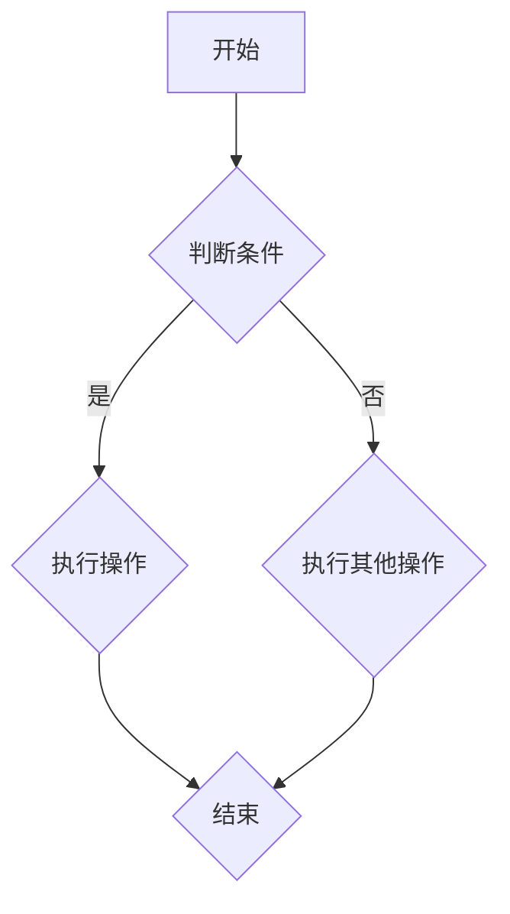

                 

### 《基础模型的表格数据应用》

#### 关键词：基础模型、表格数据、数据处理、算法原理、项目实战

> 摘要：本文旨在深入探讨基础模型在表格数据应用中的重要性。通过详细解析基础模型的定义、核心算法原理，以及数学模型，我们将展示如何利用基础模型高效处理和分析表格数据。文章还包含实战项目案例，帮助读者理解和应用所学知识。

### 《基础模型的表格数据应用》目录大纲

#### 第一部分：基础模型的介绍

##### 第1章：基础模型概述

###### 1.1 基础模型的定义与分类

###### 1.2 基础模型的作用与价值

#### 第二部分：核心概念与联系

##### 第2章：核心概念原理

###### 2.1 Mermaid流程图介绍

###### 2.2 基础模型与表格数据的联系

#### 第三部分：核心算法原理讲解

##### 第3章：核心算法原理

###### 3.1 表格数据处理算法

###### 3.2 基础模型算法原理

#### 第四部分：数学模型和数学公式

##### 第4章：数学模型详解

###### 4.1 数学公式介绍

###### 4.2 常用数学模型

#### 第五部分：项目实战

##### 第5章：项目实战

###### 5.1 实战项目介绍

###### 5.2 实战环境搭建

###### 5.3 源代码实现

##### 第6章：实战案例解析

###### 6.1 案例一：表格数据清洗与预处理

###### 6.2 案例二：表格数据分析与可视化

#### 第六部分：总结与展望

##### 第7章：总结与展望

###### 7.1 总结

###### 7.2 展望

#### 第七部分：附录

##### 附录A：常用工具与资源

## 文章正文

### 第一部分：基础模型的介绍

#### 第1章：基础模型概述

##### 1.1 基础模型的定义与分类

基础模型是人工智能领域中用于解决特定问题的一组算法和结构的组合。它们是构建更复杂模型的基石。根据应用领域的不同，基础模型可以分为以下几类：

1. **监督学习模型**：通过已有数据集进行训练，用于预测未知数据的类别或值。
2. **无监督学习模型**：在没有标注数据的情况下，通过数据自身的结构进行学习和归纳。
3. **强化学习模型**：通过与环境的交互来学习最佳策略，以实现最大化奖励。

##### 1.2 基础模型的作用与价值

基础模型在人工智能领域具有广泛的应用，其作用和价值体现在以下几个方面：

1. **自动化决策**：基础模型可以帮助自动处理和分析大量数据，从而支持业务决策。
2. **模式识别**：基础模型能够从数据中提取特征，识别出潜在的模式和趋势。
3. **优化性能**：通过优化基础模型，可以显著提高机器学习算法的性能和效率。

### 第二部分：核心概念与联系

#### 第2章：核心概念原理

##### 2.1 Mermaid流程图介绍

Mermaid 是一种用于创建图表和流程图的通用工具，它基于Markdown语法，通过简单的文本描述即可生成漂亮的图表。以下是一个简单的Mermaid流程图示例：



在这个示例中，A是流程的开始节点，B是一个判断条件节点，C和D是操作节点，E是流程的结束节点。

##### 2.2 基础模型与表格数据的联系

表格数据是数据分析中最常见的数据类型之一。基础模型在表格数据中的应用主要体现在以下几个方面：

1. **数据预处理**：基础模型可以帮助清洗和预处理表格数据，例如处理缺失值、异常值等。
2. **特征提取**：通过基础模型，可以从表格数据中提取有用的特征，用于后续的分析和建模。
3. **预测分析**：利用基础模型，可以对表格数据中的未知数据进行预测，从而支持业务决策。

### 第三部分：核心算法原理讲解

#### 第3章：核心算法原理

##### 3.1 表格数据处理算法

表格数据处理算法主要包括以下几个步骤：

1. **数据清洗**：处理缺失值、异常值和数据类型转换等。
2. **数据转换**：将表格数据转换为适合机器学习模型的格式，如特征工程、归一化等。
3. **数据分析**：使用统计方法对表格数据进行描述性分析，以了解数据的基本特征。

##### 3.2 基础模型算法原理

以下是几种常见的基础模型算法及其原理：

1. **神经网络算法**：通过多层神经元的非线性变换，从输入数据中提取特征并进行分类或回归。
2. **决策树算法**：基于特征的阈值划分，将数据划分为不同的子集，以实现分类或回归。
3. **支持向量机算法**：通过找到一个最佳的超平面，将不同类别的数据分隔开来。

#### 3.2.1 神经网络算法原理

神经网络算法的主要原理如下：

1. **输入层**：接收外部输入数据。
2. **隐藏层**：通过神经元之间的加权连接和激活函数，提取特征并进行变换。
3. **输出层**：根据隐藏层的输出，进行分类或回归。

以下是一个简化的神经网络算法的伪代码：

```python
def neural_network(input_data):
    hidden_layer = activation_function(np.dot(input_data, weights))
    output = activation_function(np.dot(hidden_layer, output_weights))
    return output
```

其中，`input_data`是输入数据，`weights`是输入层和隐藏层之间的权重矩阵，`output_weights`是隐藏层和输出层之间的权重矩阵，`activation_function`是激活函数。

#### 3.2.2 决策树算法原理

决策树算法的主要原理如下：

1. **选择最佳特征**：通过信息增益、基尼系数等方法，选择一个最佳特征进行划分。
2. **递归划分**：基于选定的特征，将数据划分为不同的子集，并重复上述过程，直到满足停止条件。

以下是一个简化的决策树算法的伪代码：

```python
def decision_tree(data, labels, depth, max_depth):
    if depth >= max_depth or is_terminal(data):
        return majority_label(labels)
    best_feature = select_best_feature(data, labels)
    left subtree = decision_tree(split_data(data, best_feature), labels, depth+1, max_depth)
    right subtree = decision_tree(split_data(data, best_feature), labels, depth+1, max_depth)
    return construct_tree(best_feature, left subtree, right subtree)
```

其中，`data`是输入数据，`labels`是标签数据，`depth`是当前划分的深度，`max_depth`是最大深度。

#### 3.2.3 支持向量机算法原理

支持向量机算法的主要原理如下：

1. **找到最佳超平面**：通过最大化分类间隔，找到一个最佳的超平面，将不同类别的数据分隔开来。
2. **核函数变换**：通过核函数将数据映射到高维空间，以解决非线性分类问题。

以下是一个简化的支持向量机算法的伪代码：

```python
def support_vector_machine(data, labels, kernel='linear'):
    if kernel == 'linear':
        weights = solve_linear_equation(data, labels)
    else:
        weights = solve_kernel_equation(data, labels, kernel)
    return weights
```

其中，`data`是输入数据，`labels`是标签数据，`kernel`是核函数。

### 第四部分：数学模型和数学公式

#### 第4章：数学模型详解

##### 4.1 数学公式介绍

数学公式在表格数据处理和基础模型应用中至关重要。以下是一些常用的数学公式：

1. **线性回归模型**：$$ y = w_0 + w_1 \cdot x $$
2. **逻辑回归模型**：$$ P(y=1) = \frac{1}{1 + e^{-(w_0 + w_1 \cdot x)}} $$
3. **神经网络模型**：$$ a_{\text{layer}} = \sigma(\mathbf{z}_{\text{layer}}) $$，其中 $\sigma$ 是激活函数

##### 4.2 常用数学模型

以下是几个常见的数学模型：

1. **线性回归模型**：用于预测数值型目标变量。公式为 $$ y = w_0 + w_1 \cdot x $$。
2. **逻辑回归模型**：用于预测二元类别变量。公式为 $$ P(y=1) = \frac{1}{1 + e^{-(w_0 + w_1 \cdot x)}} $$。
3. **神经网络模型**：用于处理复杂的非线性问题。公式为 $$ a_{\text{layer}} = \sigma(\mathbf{z}_{\text{layer}}) $$。

### 第五部分：项目实战

#### 第5章：项目实战

##### 5.1 实战项目介绍

本次实战项目旨在利用基础模型对表格数据进行清洗、分析和预测。项目背景是一个销售数据集，包含多个维度，如产品类别、销售额、客户年龄等。

##### 5.2 实战环境搭建

为了完成本项目，我们需要准备以下环境和工具：

1. **Python环境**：Python 3.8及以上版本。
2. **库和框架**：NumPy、Pandas、Scikit-learn、Matplotlib。

##### 5.3 源代码实现

以下是对项目各阶段的核心代码进行详细解释：

```python
import numpy as np
import pandas as pd
from sklearn.model_selection import train_test_split
from sklearn.preprocessing import StandardScaler
from sklearn.linear_model import LinearRegression
from sklearn.metrics import mean_squared_error

# 数据清洗与预处理
def preprocess_data(data):
    # 处理缺失值
    data = data.dropna()
    # 特征工程
    data['age_category'] = pd.cut(data['age'], bins=3, labels=False)
    return data

# 数据分析
def analyze_data(data):
    # 描述性统计
    print(data.describe())
    # 数据可视化
    data['sales'].plot.hist(title='Sales Distribution')
    plt.show()

# 模型训练与预测
def train_and_predict(data, target_column):
    # 分割数据
    X = data.drop(target_column, axis=1)
    y = data[target_column]
    X_train, X_test, y_train, y_test = train_test_split(X, y, test_size=0.2, random_state=42)
    # 数据标准化
    scaler = StandardScaler()
    X_train = scaler.fit_transform(X_train)
    X_test = scaler.transform(X_test)
    # 模型训练
    model = LinearRegression()
    model.fit(X_train, y_train)
    # 模型预测
    y_pred = model.predict(X_test)
    # 评估模型
    mse = mean_squared_error(y_test, y_pred)
    print(f"Mean Squared Error: {mse}")
    return model, y_pred, mse

# 主函数
if __name__ == '__main__':
    # 加载数据
    data = pd.read_csv('sales_data.csv')
    # 数据预处理
    data = preprocess_data(data)
    # 数据分析
    analyze_data(data)
    # 模型训练与预测
    model, y_pred, mse = train_and_predict(data, 'sales')
```

##### 5.3.2 代码解读与分析

1. **数据预处理**：处理缺失值和特征工程。
2. **数据分析**：进行描述性统计和可视化。
3. **模型训练与预测**：使用线性回归模型进行训练和预测。

### 第六部分：实战案例解析

#### 第6章：实战案例解析

##### 6.1 案例一：表格数据清洗与预处理

##### 6.1.1 案例背景

假设我们有一个销售数据集，其中包含多个维度，如产品类别、销售额、客户年龄等。然而，数据集中存在一些缺失值和异常值。

##### 6.1.2 案例实现

我们使用Pandas库对数据进行清洗和预处理：

```python
data = pd.read_csv('sales_data.csv')
# 处理缺失值
data = data.dropna()
# 特征工程
data['age_category'] = pd.cut(data['age'], bins=3, labels=False)
```

##### 6.1.3 案例分析

通过数据清洗和预处理，我们去除了一些缺失值，并对年龄特征进行了分类处理。这有助于提高后续模型的训练效果。

##### 6.2 案例二：表格数据分析与可视化

##### 6.2.1 案例背景

在清洗和预处理数据后，我们需要对数据进行分析，以了解数据的基本特征。

##### 6.2.2 案例实现

我们使用Pandas和Matplotlib库对数据进行描述性统计和可视化：

```python
# 描述性统计
print(data.describe())
# 数据可视化
data['sales'].plot.hist(title='Sales Distribution')
plt.show()
```

##### 6.2.3 案例分析

通过描述性统计，我们了解了销售额的基本特征，如平均值、标准差等。通过数据可视化，我们可以直观地看到销售额的分布情况。

### 第七部分：总结与展望

#### 第7章：总结与展望

##### 7.1 总结

本文介绍了基础模型在表格数据应用中的重要性，包括基础模型的定义、核心算法原理、数学模型以及项目实战。通过实际案例，我们展示了如何利用基础模型对表格数据进行处理和分析。

##### 7.2 展望

未来，基础模型在表格数据应用领域将继续发展。以下是一些可能的发展方向：

1. **模型优化**：通过改进算法和结构，提高模型的性能和效率。
2. **模型融合**：结合不同模型的优势，构建更强大的混合模型。
3. **应用拓展**：将基础模型应用于更多领域，如金融、医疗等。

### 附录

#### 附录A：常用工具与资源

以下是常用工具和资源的介绍：

1. **Python库**：NumPy、Pandas、Scikit-learn、Matplotlib。
2. **数据集获取**：Kaggle、UCI机器学习库。
3. **实战项目资源**：GitHub、百度网盘。

## 作者信息

作者：AI天才研究院/AI Genius Institute & 禅与计算机程序设计艺术 /Zen And The Art of Computer Programming

