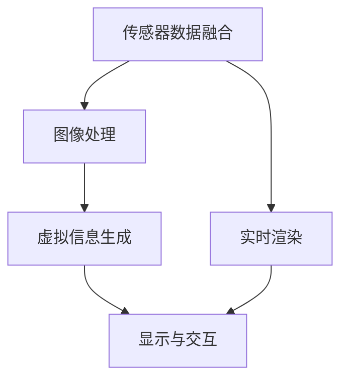

                 

### 增强现实技术在电商领域的应用：案例分析与展望

#### 引言

随着移动互联网和人工智能技术的迅猛发展，电商行业正经历着一场前所未有的变革。传统电商模式已经无法完全满足消费者对购物体验的高要求，新兴技术的应用成为电商企业提升竞争力、优化购物体验的重要手段。增强现实（Augmented Reality，AR）技术作为一种将虚拟信息与现实世界融合的技术，正逐渐成为电商领域的新宠。

本文旨在探讨增强现实技术在电商领域的应用，通过案例分析和技术讲解，展望AR技术在电商行业的未来发展趋势。文章将首先介绍增强现实技术的基本概念和核心原理，然后分析AR技术在电商中的应用场景和案例，最后讨论增强现实技术在电商中的技术实现和未来前景。

#### 关键词

增强现实（AR）、电商、虚拟试穿、虚拟货架、个性化推荐、社交电商

#### 摘要

本文围绕增强现实技术在电商领域的应用进行深入探讨。首先，介绍了增强现实技术的基本概念、原理和架构，包括传感器融合、图像处理、虚拟信息生成和显示与交互等关键组成部分。接着，分析了增强现实技术在电商中的应用场景，如产品展示与虚拟试穿、虚拟货架与场景营销、个性化购物体验和增强现实与社交电商。通过具体案例分析，展示了AR技术在电商领域的实际应用效果。最后，本文讨论了增强现实技术在电商中的技术实现，包括开发环境搭建、开发流程和开发工具资源，并展望了AR技术在电商领域的未来发展。

---

#### 第一部分：引言

随着科技的不断进步，电商行业正迎来前所未有的发展机遇。传统电商模式已经无法满足消费者对购物体验的高要求，新兴技术的应用成为电商企业提升竞争力、优化购物体验的重要手段。增强现实（Augmented Reality，AR）技术作为一种将虚拟信息与现实世界融合的技术，正逐渐成为电商领域的新宠。

### 1.1 增强现实技术概述与电商行业背景

#### 1.1.1 增强现实技术简介

增强现实（Augmented Reality，简称AR）是一种将虚拟信息与现实世界融合的技术。它通过计算机技术将虚拟信息叠加到真实环境中，使用户能够看到并与之交互。与虚拟现实（Virtual Reality，简称VR）不同，AR技术并不完全替代现实环境，而是在现实环境中添加虚拟元素，从而提供更加丰富和互动的体验。

**AR核心组件**：主要包括摄像头、传感器、显示设备等硬件组件，以及相应的软件算法和数据处理系统。

- **摄像头**：用于捕捉现实世界的图像。
- **传感器**：如加速度计、陀螺仪等，用于感知环境的变化。
- **显示设备**：如头戴式显示器、智能手机屏幕、平板电脑等。
- **计算机处理系统**：用于处理摄像头捕获的图像和传感数据，并生成增强的虚拟信息。

**AR显示方式**：主要包括头戴式显示器、智能手机屏幕、平板电脑等。

- **头戴式显示器**：如Microsoft HoloLens，用户可以直接通过头戴设备看到增强的虚拟信息。
- **智能手机屏幕**：用户通过智能手机的摄像头捕获现实环境，并通过手机屏幕观看增强的虚拟信息。
- **平板电脑**：与智能手机类似，用户通过平板电脑的屏幕观看增强的虚拟信息。

**AR交互方式**：用户可以通过触摸、手势、语音等多种方式与虚拟信息进行交互。

- **触摸**：用户可以通过触摸屏幕或头戴设备进行操作。
- **手势**：用户可以通过手势控制虚拟元素，如拖动、旋转等。
- **语音**：用户可以通过语音命令控制虚拟信息，如语音搜索、语音控制等。

**增强现实技术的基本概念**：

- **传感器融合**：通过融合摄像头、传感器等设备的数据，获得更准确的环境信息。
- **图像处理**：对捕获的图像进行处理，如图像配准、识别目标物体等。
- **虚拟信息生成**：根据处理后的图像和环境信息，生成虚拟信息并叠加到现实环境中。
- **显示与交互**：将生成的虚拟信息显示在用户的视线中，并允许用户与虚拟信息进行交互。

**AR技术的核心优势**：

- **增强感官体验**：通过AR技术，用户可以在现实环境中看到虚拟信息，使得感官体验更加丰富和立体。
- **提供个性化服务**：基于用户的位置、兴趣和行为数据，AR技术可以为用户提供个性化的购物推荐和服务。
- **提高购物决策效率**：通过AR技术，用户可以更直观地查看产品，减少购买决策的时间成本。

#### 1.1.2 电商行业发展趋势及挑战

电商行业正经历着快速的发展，同时也面临着一系列挑战：

**市场规模的持续扩大**：随着互联网的普及和消费者购物习惯的改变，电商市场的规模持续扩大。据统计，全球电商市场规模在2022年已达到4.91万亿美元，预计到2027年将达到6.38万亿美元。

**消费者需求的多样化**：消费者对购物体验提出了更高的要求，包括产品展示的逼真度、购物流程的便捷性等。根据调查，超过60%的消费者表示，高质量的购物体验是他们选择电商平台的重要因素。

**技术革新驱动**：人工智能、大数据、区块链等技术的快速发展，为电商行业带来了新的发展机遇。例如，人工智能可以用于个性化推荐、智能客服等，大数据可以帮助企业更好地了解消费者需求，区块链可以提高交易的安全性和透明度。

**竞争日益激烈**：电商市场的竞争日趋激烈，企业需要不断创新和提升服务质量以吸引和留住消费者。据数据显示，2021年全球电商市场共有超过2000万家企业参与竞争，竞争压力不断加剧。

#### 1.1.3 增强现实技术在电商中的应用前景

增强现实技术在电商领域具有广阔的应用前景，可以显著提升用户体验、优化购物流程，从而提高销售额和用户满意度。

**产品展示与虚拟试穿**：通过AR技术，用户可以在家中通过智能手机或平板电脑查看产品的三维模型，实现虚拟试穿和试用。这种体验方式可以减少因无法实际触摸产品而产生的购买疑虑，提高购买决策的准确性。

**虚拟货架与场景营销**：商家可以利用AR技术创建虚拟货架，将产品展示在现实环境中的不同场景中，吸引用户的注意力。例如，在节日期间，商家可以将虚拟货架装饰成圣诞主题，提升购物氛围。

**个性化购物体验**：基于用户的购物行为和偏好，AR技术可以为用户推荐个性化的产品和服务。例如，用户在浏览一款服装时，AR技术可以推荐与之搭配的饰品或鞋包。

**社交电商**：AR技术可以与社交媒体平台结合，通过分享购物体验和商品信息，促进社交互动和销售转化。例如，用户可以将通过AR技术生成的产品展示和试穿效果分享到社交媒体平台，与其他用户互动，获取购物建议和意见。

随着技术的不断进步和消费者需求的不断变化，增强现实技术在电商领域的应用将会越来越广泛，为行业带来新的发展机遇。$$
### 第二部分：核心原理与架构

在探讨增强现实（AR）技术在电商领域中的应用之前，有必要深入了解其核心原理和技术架构。AR技术通过将虚拟信息叠加到现实环境中，为用户提供了丰富、互动的体验。本章节将详细介绍AR技术的核心原理、基本概念、架构以及核心技术，帮助读者全面理解AR技术的工作原理。

#### 2.1 增强现实技术基本概念

**增强现实（Augmented Reality，AR）** 是一种将虚拟信息与现实世界融合的技术。它通过计算机技术生成虚拟信息，并将其叠加到用户的视线中，使用户能够在现实环境中看到并与之互动。AR技术的核心目标是在不影响用户对现实世界的感知的前提下，提供额外的视觉、听觉、触觉等感官体验。

**AR的核心组件**：

1. **摄像头**：用于捕获现实世界的图像。
2. **传感器**：如加速度计、陀螺仪等，用于感知环境的变化。
3. **显示设备**：如头戴式显示器、智能手机屏幕、平板电脑等。
4. **计算机处理系统**：用于处理摄像头捕获的图像和传感数据，生成虚拟信息并对其进行叠加。

**AR的显示方式**：

1. **头戴式显示器**：如Microsoft HoloLens，用户可以直接通过头戴设备看到增强的虚拟信息。
2. **智能手机屏幕**：用户通过智能手机的摄像头捕获现实环境，并通过手机屏幕观看增强的虚拟信息。
3. **平板电脑**：与智能手机类似，用户通过平板电脑的屏幕观看增强的虚拟信息。

**AR的交互方式**：

1. **触摸**：用户可以通过触摸屏幕或头戴设备进行操作。
2. **手势**：用户可以通过手势控制虚拟元素，如拖动、旋转等。
3. **语音**：用户可以通过语音命令控制虚拟信息，如语音搜索、语音控制等。

**AR的基本概念**：

1. **传感器融合**：通过融合摄像头、传感器等设备的数据，获得更准确的环境信息。
2. **图像处理**：对捕获的图像进行处理，如图像配准、识别目标物体等。
3. **虚拟信息生成**：根据处理后的图像和环境信息，生成虚拟信息并叠加到现实环境中。
4. **显示与交互**：将生成的虚拟信息显示在用户的视线中，并允许用户与虚拟信息进行交互。

#### 2.2 增强现实技术的架构

增强现实技术的架构主要包括以下几个关键部分：

**传感器融合**：传感器融合是将来自不同传感器的数据（如摄像头、加速度计、陀螺仪等）进行综合处理，以获得更准确的环境信息。传感器融合的目的是提高环境感知的精度，为后续的图像处理和虚拟信息生成提供可靠的数据支持。

- **图像捕获**：摄像头捕获现实环境中的图像。
- **图像预处理**：对捕获的图像进行预处理，如去噪、增强等。
- **特征提取**：提取图像中的关键特征，如角点、边缘等。
- **多传感器数据融合**：结合其他传感器（如加速度计、陀螺仪等）的数据，提高环境感知的准确性。

**图像处理**：图像处理是AR技术的重要组成部分，它包括对捕获的图像进行处理，以生成高质量的增强效果。

- **图像配准**：将捕获的图像与虚拟信息进行配准，确保虚拟信息与现实环境中的物体对齐。
- **目标识别**：识别图像中的特定目标或物体。
- **虚拟信息生成**：根据目标识别的结果，生成相应的虚拟信息，如三维模型、文字标签等。

**虚拟信息生成**：虚拟信息生成是根据图像处理的结果，生成与真实环境中的物体相对应的虚拟信息，并将其叠加到现实环境中。

- **虚拟信息渲染**：将生成的虚拟信息渲染到用户的视线中，提供高质量的画面效果。
- **虚拟信息交互**：允许用户与虚拟信息进行交互，如触摸、手势、语音等。

**显示与交互**：显示与交互是将生成的虚拟信息显示在用户的视线中，并允许用户与虚拟信息进行交互。

- **显示设备**：头戴式显示器、智能手机屏幕、平板电脑等。
- **交互方式**：触摸、手势、语音等。

#### 2.3 增强现实技术的核心技术

增强现实技术的核心技术包括计算机视觉、图像处理、深度学习、传感器融合和实时渲染等。

**计算机视觉**：计算机视觉是AR技术的基础，它用于识别和跟踪现实世界中的物体。计算机视觉的关键技术包括：

- **目标检测**：识别图像中的目标物体。
- **目标跟踪**：跟踪图像中目标物体的运动轨迹。
- **图像识别**：识别图像中的特定对象或场景。

**图像处理**：图像处理用于对捕获的图像进行处理，以生成高质量的增强效果。图像处理的关键技术包括：

- **图像增强**：提高图像的质量和清晰度。
- **图像分割**：将图像分割成不同的区域。
- **图像配准**：将不同的图像对齐。

**深度学习**：深度学习是AR技术中的一项重要技术，它通过机器学习算法，提高图像识别和物体跟踪的准确性。深度学习的关键技术包括：

- **卷积神经网络（CNN）**：用于图像识别和处理。
- **循环神经网络（RNN）**：用于序列数据的处理。
- **生成对抗网络（GAN）**：用于生成高质量的虚拟图像。

**传感器融合**：传感器融合是将摄像头、传感器等设备的数据进行综合处理，以提高环境感知的精度。传感器融合的关键技术包括：

- **传感器数据融合算法**：如卡尔曼滤波、粒子滤波等。
- **传感器数据预处理**：如传感器噪声去除、传感器数据归一化等。

**实时渲染**：实时渲染是将生成的虚拟信息显示在用户的视线中，并提供流畅的用户体验。实时渲染的关键技术包括：

- **图形渲染引擎**：如OpenGL、DirectX等。
- **实时渲染算法**：如基于物理渲染、实时阴影等。

#### 2.4 增强现实技术的基础算法

增强现实技术的基础算法主要包括特征提取算法、目标检测算法、目标跟踪算法、图像配准算法和图像渲染算法。

**特征提取算法**：特征提取算法用于提取图像中的关键特征，如角点、边缘、纹理等。常见的特征提取算法包括：

- **SIFT（尺度不变特征变换）**：用于提取图像的关键点。
- **SURF（加速稳健特征）**：用于提取图像的关键点。
- **ORB（Oriented FAST and Rotated BRIEF）**：用于提取图像的关键点。

**目标检测算法**：目标检测算法用于识别图像中的特定目标或物体。常见的目标检测算法包括：

- **YOLO（You Only Look Once）**：用于实时目标检测。
- **SSD（Single Shot MultiBox Detector）**：用于实时目标检测。
- **Faster R-CNN（Region-based Convolutional Neural Network）**：用于目标检测。

**目标跟踪算法**：目标跟踪算法用于跟踪图像中目标物体的运动轨迹。常见的目标跟踪算法包括：

- **KCF（Kernel Based Tracking）**：用于基于核函数的目标跟踪。
- **TLD（Tracking Learning by Demonstration）**：用于基于演示学习的目标跟踪。
- **CSK（Correlation Filter-based Tracking）**：用于基于相关滤波的目标跟踪。

**图像配准算法**：图像配准算法用于将捕获的图像与虚拟信息进行对齐。常见的图像配准算法包括：

- **ICP（Iterative Closest Point）**：用于最小化两个点集之间的距离。
- **NDT（Normal Distributions Transform）**：用于将点云进行配准。
- **Graph-based SLAM（图基同时定位与地图构建）**：用于在动态环境中进行图像配准。

**图像渲染算法**：图像渲染算法用于生成和显示虚拟信息。常见的图像渲染算法包括：

- **OpenGL**：用于渲染2D和3D图形。
- **DirectX**：用于渲染2D和3D图形。
- **Vulkan**：用于高性能的图像渲染。

### 2.1.1 增强现实技术核心原理与架构的 Mermaid 流程图



#### 2.1.2 增强现实技术核心原理详细讲解与伪代码

**传感器数据融合**：

传感器数据融合是将摄像头、加速度计、陀螺仪等传感器的数据集成在一起，以提高环境感知的精度。以下是一个简单的传感器数据融合的伪代码：

```python
# 初始化传感器数据
camera_data = [0, 0, 0]
accelerometer_data = [0, 0, 0]
gyro_data = [0, 0, 0]

# 数据融合函数
def sensor_fusion(camera_data, accelerometer_data, gyro_data):
    # 对加速度计和陀螺仪数据进行滤波
    filtered_accelerometer_data = filter_accelerometer(accelerometer_data)
    filtered_gyro_data = filter_gyro(gyro_data)
    
    # 计算摄像头的位置和方向
    camera_position = calculate_camera_position(filtered_accelerometer_data, filtered_gyro_data)
    
    # 返回融合后的传感器数据
    return camera_position

# 调用数据融合函数
camera_position = sensor_fusion(camera_data, accelerometer_data, gyro_data)
```

**图像处理**：

图像处理是增强现实技术的核心部分，它包括对捕获的图像进行预处理、特征提取和目标识别等。以下是一个简单的图像处理的伪代码：

```python
# 初始化图像数据
image = load_image('image.jpg')

# 图像预处理
preprocessed_image = preprocess_image(image)

# 特征提取
keypoints = extract_keypoints(preprocessed_image)

# 目标识别
target = recognize_target(keypoints)

# 返回处理后的图像和目标
return preprocessed_image, target
```

**虚拟信息生成**：

虚拟信息生成是根据图像处理的结果，生成与真实环境中的物体相对应的虚拟信息，并将其叠加到现实环境中。以下是一个简单的虚拟信息生成的伪代码：

```python
# 初始化虚拟信息
virtual_info = create_virtual_info()

# 根据目标识别的结果，生成虚拟信息
if target == 'object1':
    virtual_info = create_object1_info()
elif target == 'object2':
    virtual_info = create_object2_info()

# 返回生成的虚拟信息
return virtual_info
```

**显示与交互**：

显示与交互是将生成的虚拟信息显示在用户的视线中，并允许用户与虚拟信息进行交互。以下是一个简单的显示与交互的伪代码：

```python
# 初始化显示设备
display = initialize_display()

# 显示虚拟信息
display.show(virtual_info)

# 允许用户与虚拟信息进行交互
while True:
    # 获取用户输入
    user_input = get_user_input()
    
    # 根据用户输入，更新虚拟信息
    if user_input == 'touch':
        update_virtual_info(virtual_info, 'touch')
    elif user_input == 'gesture':
        update_virtual_info(virtual_info, 'gesture')
    elif user_input == 'voice':
        update_virtual_info(virtual_info, 'voice')
```

#### 2.1.3 增强现实技术基础算法讲解与数学模型

**特征提取算法（SIFT）**：

SIFT（尺度不变特征变换）是一种常用的特征提取算法，它可以在不同尺度下提取图像的关键点，具有很强的旋转、尺度和光照不变性。

**数学模型**：

1. **尺度空间构建**：

   SIFT算法首先构建一个尺度空间，用于检测图像中的关键点。尺度空间是通过在不同尺度下对图像进行高斯模糊得到的。

   $$ g(x,y,\sigma) = \frac{1}{2\pi\sigma^2} e^{-(x^2 + y^2) / (2\sigma^2)} $$

   其中，$x$ 和 $y$ 分别为图像坐标，$\sigma$ 为高斯模糊的尺度。

2. **关键点检测**：

   SIFT算法通过计算尺度空间中的极值点来检测关键点。关键点的条件如下：

   - 极值点：在某个尺度空间中，点的梯度幅值大于其邻域内的所有点。
   - 刚性点：点的梯度方向在不同尺度上保持一致。

   **伪代码**：

   ```python
   def detect_keypoints(image, sigma):
       # 构建尺度空间
       scale_space = build_scale_space(image, sigma)
       
       # 检测关键点
       keypoints = []
       for scale in scale_space:
           extrema = detect_extrema(scale)
           keypoints.extend(extrema)
       
       return keypoints
   ```

**目标检测算法（YOLO）**：

YOLO（You Only Look Once）是一种实时目标检测算法，它通过将图像划分为网格，在每个网格内预测目标的类别和位置。

**数学模型**：

1. **网格划分**：

   将输入图像划分为 $S \times S$ 个网格，每个网格负责预测一个区域的目标。

   $$ grid\_i = \left\lfloor \frac{x}{\text{stride}} \right\rfloor \times S + \left\lfloor \frac{y}{\text{stride}} \right\rfloor $$

   其中，$x$ 和 $y$ 分别为目标的坐标，$\text{stride}$ 为网格的步长。

2. **预测**：

   每个网格预测一组边界框、类别概率和置信度。预测结果通过以下公式计算：

   $$ \hat{b}_{ij} = \text{sigmoid}(w_{ij} \cdot \text{output}_{ij}) $$
   $$ \hat{c}_{ij} = \text{softmax}(w_{ij} \cdot \text{output}_{ij}) $$
   $$ \hat{C} = \sum_{j=1}^{C} \hat{c}_{ij} \cdot \text{sigmoid}(\hat{b}_{ij}) $$

   其中，$b_{ij}$ 为边界框的偏移量，$c_{ij}$ 为类别概率，$C$ 为类别数量，$\text{sigmoid}$ 和 $\text{softmax}$ 分别为激活函数。

   **伪代码**：

   ```python
   def detect_objects(image, model):
       # 预测结果
       predictions = model.predict(image)
       
       # 初始化目标列表
       objects = []
       
       # 遍历每个网格
       for i in range(S):
           for j in range(S):
               # 提取预测结果
               box = predictions[i, j, :]
               
               # 计算边界框位置和置信度
               x_center, y_center, width, height, confidence = box[:4], box[4], box[5], box[6], box[7]
               
               # 计算类别概率
               class_probs = softmax(box[8:])
               
               # 选择最高置信度的类别
               class_id = np.argmax(class_probs)
               
               # 添加目标到列表
               objects.append({
                   'box': [x_center, y_center, width, height],
                   'confidence': confidence,
                   'class_id': class_id
               })
       
       return objects
   ```

**目标跟踪算法（KCF）**：

KCF（Kernel Correlation Filter）是一种基于相关滤波的目标跟踪算法，它通过训练一个相关滤波器来跟踪目标。

**数学模型**：

1. **相关滤波器训练**：

   假设 $x$ 和 $y$ 分别为特征图像和目标图像，则相关滤波器的训练目标是最小化以下损失函数：

   $$ \min_{\theta} \frac{1}{m} \sum_{i=1}^{m} \left( \phi(x_i; \theta) - y_i \right)^2 $$

   其中，$m$ 为样本数量，$\phi(x_i; \theta)$ 为特征映射，$\theta

