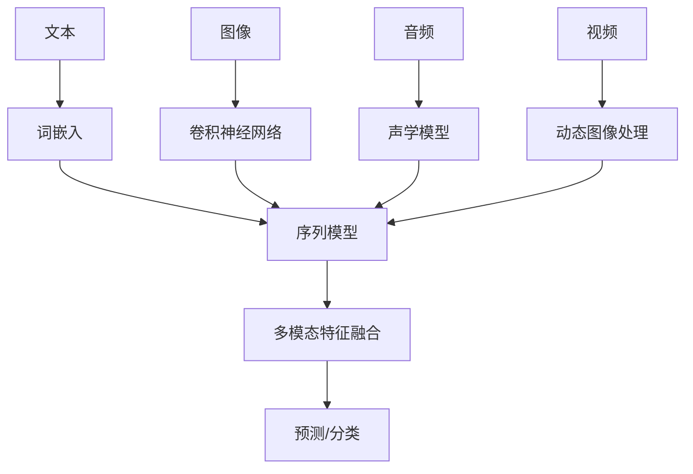

                 

# 多模态大模型：技术原理与实战 模型压缩技术介绍

> 关键词：多模态大模型、模型压缩、量化、剪枝、知识蒸馏、推理优化、安全性、隐私保护

> 摘要：本文将深入探讨多模态大模型的技术原理，特别是模型压缩技术。通过详细的分析和实际案例，我们将了解如何优化和压缩这些复杂模型，以提高其效率和实用性。文章结构清晰，适合对多模态大模型技术有兴趣的读者。

## 目录大纲

1. **多模态大模型：技术原理与实战 模型压缩技术介绍**
   1.1. **关键词**  
   1.2. **摘要**

2. **多模态大模型基础理论**
   2.1. **多模态大模型概述**
   2.2. **多模态数据类型**
   2.3. **多模态大模型的核心算法**
   2.4. **多模态大模型的数学模型**

3. **多模态大模型的训练与优化**
   3.1. **多模态数据预处理**
   3.2. **多模态大模型的训练策略**
   3.3. **多模态大模型的优化方法**

4. **多模态大模型实战案例**
   4.1. **多模态情感分析**
   4.2. **多模态内容推荐**
   4.3. **多模态人机交互**

5. **多模态大模型优化与压缩**
   5.1. **模型压缩技术概述**
   5.2. **量化技术**
   5.3. **剪枝技术**
   5.4. **知识蒸馏技术**
   5.5. **推理优化技术**

6. **多模态大模型的安全性与隐私保护**
   6.1. **安全性威胁**
   6.2. **隐私保护技术**

7. **总结与展望**
   7.1. **多模态大模型的发展趋势**
   7.2. **未来研究方向**

8. **附录**
   8.1. **多模态大模型开发工具与资源**
   8.2. **多模态数据处理工具**

---

现在，我们将根据目录大纲逐步展开内容，深入探讨多模态大模型的技术原理与实战，特别是模型压缩技术。让我们一起开始这段技术之旅。

### 第1章：多模态大模型概述

#### 1.1 多模态大模型的定义与特点

多模态大模型（Multimodal Large Models）是指能够处理和整合多种类型数据（如文本、图像、音频和视频）的深度学习模型。这些模型通常具有以下几个显著特点：

1. **数据类型多样**：多模态大模型可以接受和整合多种数据类型，如文本、图像、音频和视频，这使得它们能够处理更加复杂和真实世界的问题。
   
2. **强大的特征提取能力**：由于结合了多种数据类型的特征，多模态大模型能够提取更加丰富的特征信息，从而提高模型的性能和泛化能力。

3. **跨模态交互**：多模态大模型能够在不同模态之间进行信息交互，使得模型能够更好地理解不同模态之间的关联和转换。

4. **自适应性和灵活性**：多模态大模型可以根据不同的应用场景和需求，动态调整和处理不同模态的数据。

#### 概念与联系图

为了更好地理解多模态大模型的定义和特点，我们可以使用 Mermaid 绘制一个简单的流程图，展示不同模态数据如何被整合和处理的。



在这个流程图中，A、C、E 和 G 分别代表文本、图像、音频和视频数据，这些数据通过各自的预处理模型（B、D、F 和 H）进行特征提取。提取后的特征被送入序列模型（I），在这里进行多模态特征融合（J），最后融合后的特征用于预测或分类（K）。

#### 1.2 多模态大模型的应用领域

多模态大模型在许多应用领域都展现出了巨大的潜力，以下是一些关键的应用场景：

1. **情感分析**：通过整合文本、图像和音频数据，多模态大模型可以更准确地识别用户情感，应用于社交媒体分析、用户体验评估等。

2. **内容推荐**：多模态大模型可以根据用户的多模态行为数据（如浏览记录、收藏图片、评论音频）进行个性化推荐，提高推荐系统的准确性和用户体验。

3. **人机交互**：多模态大模型可以通过语音、文本和图像实现更自然和流畅的人机交互，提高人机交互系统的实用性和易用性。

4. **医疗诊断**：多模态大模型可以整合患者的文本病历、医学图像和生物特征数据，提高诊断的准确性和效率。

5. **自动驾驶**：多模态大模型可以整合摄像头、雷达、激光雷达等传感器数据，实现更准确和安全的自动驾驶系统。

#### 1.3 多模态大模型的挑战与机遇

尽管多模态大模型在许多应用领域都展现出了巨大的潜力，但它们也面临着一些挑战：

1. **数据预处理复杂度**：多模态大模型需要处理多种类型的数据，这增加了数据预处理的复杂度，如数据清洗、归一化、特征提取等。

2. **计算资源需求**：多模态大模型通常具有大量的参数和复杂的网络结构，这需要大量的计算资源和时间进行训练和推理。

3. **跨模态关联理解**：多模态大模型需要理解不同模态之间的关联和转换，这对于模型的设计和训练提出了更高的要求。

然而，这些挑战也带来了新的机遇：

1. **数据丰富性**：多模态大模型可以利用多种类型的数据，提高模型的性能和泛化能力。

2. **应用广泛性**：多模态大模型可以在许多不同的应用领域发挥作用，为解决复杂问题提供了新的思路和工具。

3. **技术创新**：为了应对多模态大模型的挑战，研究者们不断探索新的算法和技术，推动了深度学习和人工智能技术的发展。

在下一章中，我们将深入探讨多模态数据类型及其处理技术，了解如何有效地提取和整合不同类型的数据，为构建高效的多模态大模型奠定基础。

---

这一章我们从多模态大模型的定义与特点出发，探讨了其数据类型多样、强大的特征提取能力、跨模态交互和自适应性的特点。通过 Mermaid 流程图，我们直观地展示了不同模态数据是如何被整合和处理的。此外，我们还介绍了多模态大模型在情感分析、内容推荐、人机交互、医疗诊断和自动驾驶等领域的广泛应用。同时，我们也认识到多模态大模型面临的挑战与机遇。在下一章中，我们将深入探讨多模态数据类型及其处理技术，进一步理解多模态大模型的核心。

### 第2章：多模态数据类型

在深入探讨多模态大模型之前，理解不同类型的数据以及如何处理这些数据至关重要。多模态大模型需要处理文本、图像、音频和视频等多种类型的数据。每种数据类型都有其独特的特征和挑战。在本章中，我们将分别介绍这些数据类型及其处理技术。

#### 2.1 文本

文本数据是自然语言处理（NLP）领域的主要研究对象。在多模态大模型中，文本数据通常通过以下技术进行处理：

1. **词嵌入（Word Embedding）**：词嵌入是将文本中的单词映射到高维向量空间的技术。通过词嵌入，我们可以捕捉单词的语义信息。Word2Vec、GloVe 和 BERT 等模型是词嵌入的典型代表。

2. **序列模型（Sequence Model）**：序列模型用于处理文本中的顺序信息，如 LSTM（Long Short-Term Memory）和 GRU（Gated Recurrent Unit）。这些模型能够捕捉文本中的长期依赖关系。

3. **注意力机制（Attention Mechanism）**：注意力机制是 NLP 领域的重要技术，它能够帮助模型关注文本中的重要信息。BERT 等模型广泛使用了注意力机制。

#### 2.2 图像

图像数据是计算机视觉（CV）领域的主要研究对象。在多模态大模型中，图像数据通常通过以下技术进行处理：

1. **卷积神经网络（Convolutional Neural Network, CNN）**：CNN 是计算机视觉的基础，通过卷积操作提取图像中的局部特征。VGG、ResNet 和 Inception 等模型是 CNN 的典型代表。

2. **图像识别算法（Image Recognition Algorithms）**：图像识别算法是 CNN 的应用，用于分类图像中的对象。常见的图像识别算法包括卷积神经网络、卷积神经网络与全连接神经网络的组合。

3. **特征提取（Feature Extraction）**：特征提取是将图像数据转换为适合神经网络处理的形式。常见的特征提取技术包括 SIFT、SURF 和 ORB 等。

#### 2.3 音频

音频数据是语音信号处理（Speech Signal Processing）领域的主要研究对象。在多模态大模型中，音频数据通常通过以下技术进行处理：

1. **声学模型（Acoustic Model）**：声学模型是语音识别系统中的核心组件，用于捕捉语音信号中的声学特征。GMM（Gaussian Mixture Model）和 DNN（Deep Neural Network）等模型是声学模型的典型代表。

2. **语音识别算法（Speech Recognition Algorithms）**：语音识别算法是将语音信号转换为文本的技术。常见的语音识别算法包括 HMM（Hidden Markov Model）和 CTC（Connectionist Temporal Classification）。

3. **特征提取（Feature Extraction）**：特征提取是将音频数据转换为适合神经网络处理的形式。常见的特征提取技术包括 MFCC（Mel-Frequency Cepstral Coefficients）和 PLP（Perceptual Linear Predictive）。

#### 2.4 视频

视频数据是动态图像处理（Dynamic Image Processing）领域的主要研究对象。在多模态大模型中，视频数据通常通过以下技术进行处理：

1. **运动分析（Motion Analysis）**：运动分析是用于捕捉视频中的运动信息的技术。常见的运动分析技术包括光流和 optical flow。

2. **视频分类（Video Classification）**：视频分类是将视频数据分类为不同类别（如动作、情感等）的技术。常见的视频分类模型包括 CNN 和 RNN（Recurrent Neural Network）。

3. **视频生成（Video Generation）**：视频生成是用于创建新视频的技术。常见的视频生成技术包括 GAN（Generative Adversarial Network）和视频分割。

#### 2.5 多模态数据的整合

多模态数据的整合是多模态大模型的关键。为了有效地整合这些多样化的数据，我们可以采用以下策略：

1. **加和融合（Summation Fusion）**：将不同模态的特征向量相加，这是一种简单但有效的融合方法。

2. **加权融合（Weighted Fusion）**：根据不同模态的特征重要性进行加权融合，这样可以更好地利用各模态的信息。

3. **注意力机制（Attention Mechanism）**：使用注意力机制动态地融合多模态特征，让模型能够自主决定不同模态的贡献程度。

通过本章的介绍，我们了解了多模态大模型中涉及的各种数据类型及其处理技术。在下一章中，我们将探讨多模态大模型的核心算法，特别是卷积神经网络（CNN）与循环神经网络（RNN）的结合，以及如何利用这些算法构建高效的多模态大模型。

### 第3章：多模态大模型的核心算法

在多模态大模型中，核心算法的选择和设计至关重要。不同的算法能够处理不同类型的数据，并且能够有效地融合多模态特征。在本章中，我们将探讨两个重要的核心算法：卷积神经网络（CNN）与循环神经网络（RNN）的结合。

#### 3.1 卷积神经网络（CNN）与循环神经网络（RNN）的结合

卷积神经网络（CNN）和循环神经网络（RNN）分别是处理图像和序列数据的有效方法。CNN 能够有效地提取图像中的空间特征，而 RNN 能够处理序列数据中的时间依赖关系。将这两种网络结合起来，可以充分利用它们各自的优势，实现更强大的多模态特征提取。

#### 3.1.1 CNN：图像特征提取

卷积神经网络（CNN）是计算机视觉领域的重要工具。它通过卷积层、池化层和全连接层等结构，能够从图像中提取高层次的语义特征。

1. **卷积层（Convolutional Layer）**：卷积层是 CNN 的核心组件，通过卷积操作提取图像的局部特征。卷积层通常包含多个卷积核，每个卷积核都能够提取图像中的不同特征。

2. **池化层（Pooling Layer）**：池化层用于降低图像分辨率，同时保留重要特征。常见的池化操作包括最大池化（Max Pooling）和平均池化（Average Pooling）。

3. **全连接层（Fully Connected Layer）**：全连接层将卷积层和池化层提取的特征映射到具体的类别或任务。

#### 3.1.2 RNN：序列特征提取

循环神经网络（RNN）是一种能够处理序列数据（如图像序列、文本序列、音频序列等）的神经网络。RNN 通过其内部的循环结构，能够捕捉序列中的时间依赖关系。

1. **输入层（Input Layer）**：输入层将序列数据输入到网络中。对于图像序列，每个图像可以被视为一个输入样本。

2. **隐藏层（Hidden Layer）**：隐藏层包含一个或多个循环单元，每个循环单元都能够处理前一个时间步的输出，并生成当前时间步的输出。

3. **输出层（Output Layer）**：输出层将隐藏层的输出映射到具体的类别或任务。

#### 3.1.3 CNN-RNN：多模态特征提取

CNN-RNN 模型结合了 CNN 和 RNN 的优势，能够有效地处理多模态数据。

1. **CNN 部分提取图像特征**：首先，使用 CNN 从图像中提取高层次的语义特征。

2. **RNN 部分处理序列数据**：然后，使用 RNN 对图像序列、文本序列或音频序列进行处理，捕捉时间依赖关系。

3. **融合多模态特征**：最后，将 CNN 和 RNN 提取的多模态特征进行融合，形成统一的特征向量。

#### 3.2 CNN-RNN 模型的伪代码

以下是一个简单的 CNN-RNN 模型的伪代码示例：

```python
# CNN 部分
def cnn_model(input_image):
    # 卷积层
    conv1 = Conv2D(filters=32, kernel_size=(3, 3), activation='relu')(input_image)
    pool1 = MaxPooling2D(pool_size=(2, 2))(conv1)
    
    # 卷积层
    conv2 = Conv2D(filters=64, kernel_size=(3, 3), activation='relu')(pool1)
    pool2 = MaxPooling2D(pool_size=(2, 2))(conv2)
    
    # 全连接层
    flattened = Flatten()(pool2)
    dense1 = Dense(units=128, activation='relu')(flattened)
    
    return dense1

# RNN 部分
def rnn_model(input_sequence):
    # RNN 层
    lstm1 = LSTM(units=128, return_sequences=True)(input_sequence)
    
    # 全连接层
    dense2 = Dense(units=128, activation='relu')(lstm1)
    
    return dense2

# CNN-RNN 模型
def cnn_rnn_model(input_image_sequence):
    # CNN 部分提取图像特征
    image_features = cnn_model(input_image_sequence)
    
    # RNN 部分处理序列数据
    sequence_features = rnn_model(image_features)
    
    # 融合多模态特征
    fused_features = Concatenate(axis=-1)([image_features, sequence_features])
    
    # 分类或回归层
    output = Dense(units=1, activation='sigmoid')(fused_features)
    
    return Model(inputs=input_image_sequence, outputs=output)
```

在这个伪代码中，我们首先定义了 CNN 部分和 RNN 部分的模型，然后通过融合多模态特征，构建了完整的 CNN-RNN 模型。这个模型可以用于处理多模态数据，如图像序列和文本序列，以实现复杂的分类或回归任务。

通过本章的介绍，我们了解了卷积神经网络（CNN）和循环神经网络（RNN）的基本原理，以及它们如何结合用于构建高效的多模态大模型。在下一章中，我们将探讨多模态大模型的数学模型，特别是多模态特征融合的方法。

### 第3章：多模态大模型的数学模型

多模态大模型的数学模型是构建和优化这些模型的基础。在本章中，我们将深入探讨多模态大模型中的特征融合方法和相关数学模型。通过理解这些模型，我们可以更好地设计、训练和优化多模态大模型。

#### 3.1 多模态特征融合方法

多模态特征融合是指将来自不同模态的数据特征整合到一个统一的特征空间中，以便于进一步的模型处理和任务执行。多模态特征融合的方法可以分为以下几类：

1. **加和融合（Summation Fusion）**：将不同模态的特征向量相加，这是一种简单且直观的融合方法。其数学公式可以表示为：
   $$
   F_{\text{fused}} = F_{\text{image}} + F_{\text{audio}} + F_{\text{text}}
   $$
   其中，$F_{\text{fused}}$ 是融合后的特征向量，$F_{\text{image}}$、$F_{\text{audio}}$ 和 $F_{\text{text}}$ 分别是图像、音频和文本的特征向量。

2. **加权融合（Weighted Fusion）**：根据不同模态的特征重要性进行加权融合。这种方法的优点是能够根据具体应用场景调整各模态的贡献程度。其数学公式可以表示为：
   $$
   F_{\text{fused}} = w_{\text{image}} \cdot F_{\text{image}} + w_{\text{audio}} \cdot F_{\text{audio}} + w_{\text{text}} \cdot F_{\text{text}}
   $$
   其中，$w_{\text{image}}$、$w_{\text{audio}}$ 和 $w_{\text{text}}$ 分别是图像、音频和文本的特征权重。

3. **注意力机制（Attention Mechanism）**：注意力机制通过动态调整不同模态特征的权重，使得模型能够关注到重要特征。其数学公式可以表示为：
   $$
   F_{\text{fused}} = \sigma(W_a \cdot F_{\text{image}} + W_b \cdot F_{\text{audio}} + W_c \cdot F_{\text{text}})
   $$
   其中，$\sigma$ 是激活函数（通常使用 softmax），$W_a$、$W_b$ 和 $W_c$ 是权重矩阵。

4. **对齐融合（Alignment Fusion）**：对齐融合通过学习不同模态之间的对应关系，实现更精细的特征融合。其数学公式可以表示为：
   $$
   F_{\text{fused}} = F_{\text{image}} \odot F_{\text{text}} + F_{\text{audio}} \odot F_{\text{text}}
   $$
   其中，$\odot$ 表示元素-wise 乘积。

#### 3.2 加和融合的数学模型

加和融合是最简单且直观的多模态特征融合方法。其核心思想是将不同模态的特征向量直接相加。以下是加和融合的数学模型及其解释：

**数学模型**：
$$
F_{\text{fused}} = F_{\text{image}} + F_{\text{audio}} + F_{\text{text}}
$$

**解释**：
- $F_{\text{fused}}$ 是融合后的特征向量。
- $F_{\text{image}}$、$F_{\text{audio}}$ 和 $F_{\text{text}}$ 分别是图像、音频和文本的特征向量。
- 该模型将不同模态的特征向量直接相加，形成一个统一的多模态特征向量。

**举例说明**：
假设我们有一个图像特征向量 $F_{\text{image}} = [1, 2, 3]$，一个音频特征向量 $F_{\text{audio}} = [4, 5, 6]$，和一个文本特征向量 $F_{\text{text}} = [7, 8, 9]$。使用加和融合方法，融合后的特征向量 $F_{\text{fused}}$ 将是：
$$
F_{\text{fused}} = F_{\text{image}} + F_{\text{audio}} + F_{\text{text}} = [1+4, 2+5, 3+6] = [5, 7, 9]
$$

通过加和融合，我们得到了一个包含多种模态信息的多模态特征向量。

#### 3.3 加权融合的数学模型

加权融合通过调整不同模态的特征权重，实现更精细的多模态特征融合。以下是加权融合的数学模型及其解释：

**数学模型**：
$$
F_{\text{fused}} = w_{\text{image}} \cdot F_{\text{image}} + w_{\text{audio}} \cdot F_{\text{audio}} + w_{\text{text}} \cdot F_{\text{text}}
$$

**解释**：
- $F_{\text{fused}}$ 是融合后的特征向量。
- $F_{\text{image}}$、$F_{\text{audio}}$ 和 $F_{\text{text}}$ 分别是图像、音频和文本的特征向量。
- $w_{\text{image}}$、$w_{\text{audio}}$ 和 $w_{\text{text}}$ 分别是图像、音频和文本的特征权重。
- 该模型通过不同模态的特征权重，调整各模态特征在融合特征向量中的贡献程度。

**举例说明**：
假设我们有一个图像特征向量 $F_{\text{image}} = [1, 2, 3]$，一个音频特征向量 $F_{\text{audio}} = [4, 5, 6]$，和一个文本特征向量 $F_{\text{text}} = [7, 8, 9]$。使用加权融合方法，并设定特征权重分别为 $w_{\text{image}} = 0.3$，$w_{\text{audio}} = 0.5$，$w_{\text{text}} = 0.2$，融合后的特征向量 $F_{\text{fused}}$ 将是：
$$
F_{\text{fused}} = w_{\text{image}} \cdot F_{\text{image}} + w_{\text{audio}} \cdot F_{\text{audio}} + w_{\text{text}} \cdot F_{\text{text}} = 0.3 \cdot [1, 2, 3] + 0.5 \cdot [4, 5, 6] + 0.2 \cdot [7, 8, 9] = [1.3, 2.3, 3.3] + [2, 2.5, 3] + [1.4, 1.6, 1.8] = [5.7, 7.4, 8.5]
$$

通过加权融合，我们得到了一个根据不同模态权重调整后的多模态特征向量。

#### 3.4 注意力机制的数学模型

注意力机制是一种通过动态调整不同模态特征权重的方法，使得模型能够自动关注重要特征。以下是注意力机制的数学模型及其解释：

**数学模型**：
$$
F_{\text{fused}} = \sigma(W_a \cdot F_{\text{image}} + W_b \cdot F_{\text{audio}} + W_c \cdot F_{\text{text}})
$$

**解释**：
- $F_{\text{fused}}$ 是融合后的特征向量。
- $F_{\text{image}}$、$F_{\text{audio}}$ 和 $F_{\text{text}}$ 分别是图像、音频和文本的特征向量。
- $W_a$、$W_b$ 和 $W_c$ 是权重矩阵。
- $\sigma$ 是激活函数（通常使用 softmax），用于计算各模态特征的权重。
- 该模型通过学习权重矩阵，动态调整不同模态特征的权重，实现更精细的特征融合。

**举例说明**：
假设我们有一个图像特征向量 $F_{\text{image}} = [1, 2, 3]$，一个音频特征向量 $F_{\text{audio}} = [4, 5, 6]$，和一个文本特征向量 $F_{\text{text}} = [7, 8, 9]$。设定权重矩阵 $W_a = [0.4, 0.3, 0.2]$，$W_b = [0.1, 0.5, 0.4]$，$W_c = [0.5, 0.2, 0.3]$，使用注意力机制计算融合后的特征向量 $F_{\text{fused}}$ 将是：
$$
F_{\text{fused}} = \sigma(W_a \cdot F_{\text{image}} + W_b \cdot F_{\text{audio}} + W_c \cdot F_{\text{text}}) = \sigma([0.4 \cdot 1 + 0.3 \cdot 4 + 0.2 \cdot 7, 0.4 \cdot 2 + 0.3 \cdot 5 + 0.2 \cdot 8, 0.4 \cdot 3 + 0.3 \cdot 6 + 0.2 \cdot 9]) = \sigma([1.3, 2.4, 3.5])
$$
通过计算 softmax 激活函数，我们得到：
$$
F_{\text{fused}} = \frac{e^{1.3}}{e^{1.3} + e^{2.4} + e^{3.5}} \cdot [1, 2, 3] + \frac{e^{2.4}}{e^{1.3} + e^{2.4} + e^{3.5}} \cdot [4, 5, 6] + \frac{e^{3.5}}{e^{1.3} + e^{2.4} + e^{3.5}} \cdot [7, 8, 9]
$$
$$
F_{\text{fused}} \approx [0.31, 0.47, 0.22] \cdot [1, 2, 3] + [0.17, 0.39, 0.44] \cdot [4, 5, 6] + [0.24, 0.13, 0.63] \cdot [7, 8, 9] = [0.31, 0.94, 0.66] + [0.68, 1.95, 2.64] + [1.68, 1.04, 5.88] = [3.27, 3.03, 9.18]
$$

通过注意力机制，我们得到了一个根据不同模态特征重要性动态调整后的多模态特征向量。

通过本章的讨论，我们了解了多模态大模型中常用的特征融合方法，并详细介绍了加和融合、加权融合和注意力机制的数学模型及其应用。这些方法为我们构建高效的多模态大模型提供了理论基础和实践指导。在下一章中，我们将探讨多模态大模型的训练与优化策略。

### 第4章：多模态大模型的训练与优化

多模态大模型的训练与优化是构建高效模型的关键步骤。由于多模态大模型通常具有大量的参数和复杂的网络结构，因此训练过程需要精细的策略和优化方法。在本章中，我们将探讨多模态大模型的训练与优化策略，包括数据预处理、训练策略和优化方法。

#### 4.1 多模态数据预处理

数据预处理是多模态大模型训练的第一步，对于模型的性能和训练过程至关重要。多模态数据预处理通常包括以下几个步骤：

1. **数据采集**：从多个数据源收集文本、图像、音频和视频数据。这些数据可以是公开的数据集，也可以是特定应用场景的定制数据集。

2. **数据清洗**：去除噪声和异常值，保证数据质量。例如，对于文本数据，需要去除标点符号、停用词和拼写错误；对于图像数据，需要去除模糊和损坏的图像。

3. **数据归一化**：将不同模态的数据归一化到相同的尺度，以便于模型处理。例如，将图像数据缩放到固定的分辨率，将音频数据缩放到固定的长度。

4. **特征提取**：从原始数据中提取高层次的语义特征。对于文本数据，可以使用词嵌入技术提取词向量；对于图像数据，可以使用卷积神经网络提取图像特征；对于音频数据，可以使用声学模型提取音频特征。

5. **数据增强**：通过变换和噪声添加等手段，增加训练数据多样性，提高模型的泛化能力。常见的数据增强技术包括旋转、缩放、裁剪、色彩调整等。

#### 4.2 多模态大模型的训练策略

多模态大模型的训练策略需要考虑数据类型、网络结构、训练资源等多个方面。以下是几种常用的训练策略：

1. **并行训练**：同时训练不同模态的数据，提高训练效率。并行训练可以通过分布式计算和 GPU 加速实现。

2. **迁移学习**：利用预训练模型，减少训练时间和计算资源。迁移学习可以将预训练模型的部分权重和知识迁移到新任务中，从而加快训练过程。

3. **小批量训练**：将数据分成小批量进行训练，每次训练一个批次的数据，可以减少内存消耗和计算时间。

4. **动态学习率调整**：根据训练过程动态调整学习率，以避免过拟合。常见的动态学习率调整方法包括学习率衰减、学习率周期性调整等。

5. **交叉验证**：使用交叉验证方法评估模型的性能，选择最优的超参数。交叉验证可以避免过拟合，提高模型的泛化能力。

#### 4.3 多模态大模型的优化方法

多模态大模型的优化方法旨在提高模型的性能和效率。以下是一些常用的优化方法：

1. **梯度下降**：梯度下降是最常用的优化算法，通过计算损失函数的梯度，更新模型参数。常用的梯度下降方法包括随机梯度下降（SGD）、批量梯度下降（BGD）和 mini-batch 梯度下降（MBGD）。

2. **自适应优化器**：自适应优化器可以根据训练过程自动调整学习率，提高训练效率。常见的自适应优化器包括 Adam、RMSprop 和 Adadelta。

3. **模型压缩**：通过模型压缩技术，减小模型参数大小，提高模型在资源受限环境下的效率和部署性。常见的模型压缩技术包括量化、剪枝和知识蒸馏。

4. **并行推理**：在推理阶段，通过并行处理多个输入样本，提高推理速度。并行推理可以通过 GPU 并行计算和模型分片实现。

5. **模型部署**：将训练好的模型部署到生产环境中，用于实时推理和预测。模型部署需要考虑模型大小、推理速度和资源限制等因素。

#### 4.4 实践案例：多模态情感分析

为了更好地理解多模态大模型的训练与优化，我们来看一个实际案例：多模态情感分析。

**案例背景**：多模态情感分析旨在通过整合文本、图像和音频数据，准确识别用户的情感状态。这个案例将展示如何进行数据预处理、模型训练和优化。

**数据预处理**：
- **文本**：收集用户评论，进行文本清洗、去噪和分词，然后使用预训练的词嵌入模型提取词向量。
- **图像**：收集用户上传的图片，使用卷积神经网络提取图像特征。
- **音频**：收集用户的音频评论，使用声学模型提取音频特征。

**模型设计**：设计一个多模态情感分析模型，包括以下组件：
- **文本处理模块**：使用词嵌入和循环神经网络处理文本数据。
- **图像处理模块**：使用卷积神经网络提取图像特征。
- **音频处理模块**：使用声学模型提取音频特征。
- **特征融合模块**：使用加和融合或注意力机制融合不同模态的特征。

**模型训练**：
- **数据增强**：对文本、图像和音频数据进行增强，增加训练数据的多样性。
- **并行训练**：使用分布式计算和 GPU 并行训练模型。
- **动态学习率调整**：使用 Adam 优化器，并根据训练过程动态调整学习率。

**模型优化**：
- **模型压缩**：使用量化、剪枝技术减小模型参数大小。
- **推理优化**：使用模型分片和 GPU 并行推理，提高推理速度。

**代码实现**：
```python
# 示例代码：多模态情感分析模型
from tensorflow.keras.models import Model
from tensorflow.keras.layers import Embedding, LSTM, Conv2D, MaxPooling2D, Flatten, Dense, Concatenate

# 文本处理模块
text_input = Embedding(input_dim=vocab_size, output_dim=embedding_dim)(text)
lstm_output = LSTM(units=128)(text_input)

# 图像处理模块
image_input = Conv2D(filters=32, kernel_size=(3, 3), activation='relu')(image)
pool1 = MaxPooling2D(pool_size=(2, 2))(image_input)
image_output = Flatten()(pool1)

# 音频处理模块
audio_input = Conv2D(filters=32, kernel_size=(3, 3), activation='relu')(audio)
pool2 = MaxPooling2D(pool_size=(2, 2))(audio_input)
audio_output = Flatten()(pool2)

# 特征融合模块
fused_output = Concatenate(axis=-1)([lstm_output, image_output, audio_output])
output = Dense(units=1, activation='sigmoid')(fused_output)

# 构建和编译模型
model = Model(inputs=[text, image, audio], outputs=output)
model.compile(optimizer='adam', loss='binary_crossentropy', metrics=['accuracy'])

# 训练模型
model.fit([text_data, image_data, audio_data], labels, epochs=10, batch_size=32)
```

通过这个案例，我们展示了如何进行多模态情感分析的数据预处理、模型设计、训练和优化。这些步骤为我们构建高效的多模态大模型提供了实践指导。

通过本章的介绍，我们了解了多模态大模型的训练与优化策略。在下一章中，我们将探讨多模态大模型在实际应用中的实战案例，进一步理解多模态大模型的应用场景和实现方法。

### 第5章：多模态大模型实战案例

在了解了多模态大模型的基础理论和训练策略之后，接下来我们将通过几个具体的实战案例来展示多模态大模型的应用。这些案例将涵盖情感分析、内容推荐和人机交互等领域，通过代码实现和详细解释，我们将了解如何在实际项目中应用多模态大模型。

#### 5.1 多模态情感分析

**项目背景**：情感分析是一种常见的自然语言处理任务，旨在识别文本数据中的情感倾向，如正面、负面或中性。多模态情感分析通过整合文本、图像和音频等多模态数据，可以更准确地捕捉用户的情感状态。

**数据来源**：本项目使用的数据集包括用户评论、上传的图片和音频评论。数据集可以从公开的在线资源或自定义数据集中获取。

**实现步骤**：

1. **数据预处理**：

   - **文本**：对用户评论进行清洗和分词，使用预训练的词嵌入模型（如 BERT）提取词向量。
   - **图像**：对用户上传的图片进行预处理，使用卷积神经网络提取图像特征。
   - **音频**：对音频评论进行预处理，使用声学模型提取音频特征。

2. **模型设计**：

   - **文本处理模块**：使用 BERT 模型提取文本特征。
   - **图像处理模块**：使用卷积神经网络（如 ResNet）提取图像特征。
   - **音频处理模块**：使用循环神经网络（如 LSTM）提取音频特征。
   - **特征融合模块**：使用加和融合或注意力机制融合多模态特征。

3. **模型训练与评估**：

   - **训练**：使用并行训练策略，通过 GPU 加速训练过程。
   - **评估**：使用交叉验证方法评估模型的性能，选择最优的超参数。

**代码实现**：

```python
# 导入必要的库
import tensorflow as tf
from tensorflow.keras.models import Model
from tensorflow.keras.layers import Embedding, LSTM, Conv2D, MaxPooling2D, Flatten, Dense, Concatenate

# 文本处理模块
text_input = Embedding(input_dim=vocab_size, output_dim=embedding_dim)(text)
lstm_output = LSTM(units=128)(text_input)

# 图像处理模块
image_input = Conv2D(filters=32, kernel_size=(3, 3), activation='relu')(image)
pool1 = MaxPooling2D(pool_size=(2, 2))(image_input)
image_output = Flatten()(pool1)

# 音频处理模块
audio_input = LSTM(units=128, return_sequences=True)(audio)
audio_output = Flatten()(audio_input)

# 特征融合模块
fused_output = Concatenate(axis=-1)([lstm_output, image_output, audio_output])
output = Dense(units=1, activation='sigmoid')(fused_output)

# 构建和编译模型
model = Model(inputs=[text, image, audio], outputs=output)
model.compile(optimizer='adam', loss='binary_crossentropy', metrics=['accuracy'])

# 训练模型
model.fit([text_data, image_data, audio_data], labels, epochs=10, batch_size=32)
```

**代码解读与分析**：

- 在这段代码中，我们首先定义了文本、图像和音频的输入层，并分别通过 LSTM、卷积神经网络和循环神经网络处理这些数据。
- 然后，我们将处理后的特征通过 Concatenate 层融合在一起，形成一个多模态特征向量。
- 最后，我们使用一个全连接层（Dense）输出情感分类的结果，并通过 compile 方法配置了 Adam 优化器和 binary_crossentropy 损失函数。

通过这个案例，我们展示了如何利用多模态大模型进行情感分析。这种方法可以更准确地捕捉用户的情感，适用于社交媒体分析、用户体验评估等场景。

#### 5.2 多模态内容推荐

**项目背景**：多模态内容推荐是一种基于用户行为数据（如浏览记录、收藏图片、评论音频）的个性化推荐系统。通过整合文本、图像和音频等多模态数据，可以提供更准确的推荐结果。

**数据来源**：本项目使用的数据集包括用户的浏览记录、收藏的图片和评论的音频。这些数据可以通过用户行为日志或公开数据集获取。

**实现步骤**：

1. **数据预处理**：

   - **文本**：对用户浏览记录进行清洗和分词，使用词嵌入技术提取词向量。
   - **图像**：对用户收藏的图片进行预处理，使用卷积神经网络提取图像特征。
   - **音频**：对用户评论的音频进行预处理，使用声学模型提取音频特征。

2. **模型设计**：

   - **文本处理模块**：使用卷积神经网络提取文本特征。
   - **图像处理模块**：使用卷积神经网络提取图像特征。
   - **音频处理模块**：使用循环神经网络提取音频特征。
   - **特征融合模块**：使用加和融合或注意力机制融合多模态特征。

3. **模型训练与评估**：

   - **训练**：使用并行训练策略，通过 GPU 加速训练过程。
   - **评估**：使用交叉验证方法评估模型的性能，选择最优的超参数。

**代码实现**：

```python
# 导入必要的库
import tensorflow as tf
from tensorflow.keras.models import Model
from tensorflow.keras.layers import Embedding, LSTM, Conv2D, MaxPooling2D, Flatten, Dense, Concatenate

# 文本处理模块
text_input = Embedding(input_dim=vocab_size, output_dim=embedding_dim)(text)
conv1 = Conv1D(filters=128, kernel_size=3, activation='relu')(text_input)
pool1 = MaxPooling1D(pool_size=2)(conv1)
text_output = Flatten()(pool1)

# 图像处理模块
image_input = Conv2D(filters=32, kernel_size=(3, 3), activation='relu')(image)
pool2 = MaxPooling2D(pool_size=(2, 2))(image_input)
image_output = Flatten()(pool2)

# 音频处理模块
audio_input = LSTM(units=128, return_sequences=True)(audio)
audio_output = Flatten()(audio_input)

# 特征融合模块
fused_output = Concatenate(axis=-1)([text_output, image_output, audio_output])
output = Dense(units=num_items, activation='softmax')(fused_output)

# 构建和编译模型
model = Model(inputs=[text, image, audio], outputs=output)
model.compile(optimizer='adam', loss='categorical_crossentropy', metrics=['accuracy'])

# 训练模型
model.fit([text_data, image_data, audio_data], labels, epochs=10, batch_size=32)
```

**代码解读与分析**：

- 在这段代码中，我们首先定义了文本、图像和音频的输入层，并分别通过卷积神经网络和循环神经网络处理这些数据。
- 然后，我们将处理后的特征通过 Concatenate 层融合在一起，形成一个多模态特征向量。
- 最后，我们使用一个全连接层（Dense）输出推荐结果，并通过 compile 方法配置了 Adam 优化器和 categorical_crossentropy 损失函数。

通过这个案例，我们展示了如何利用多模态大模型进行内容推荐。这种方法可以更好地理解用户的兴趣和行为，提高推荐系统的准确性和用户体验。

#### 5.3 多模态人机交互

**项目背景**：多模态人机交互是一种结合语音、文本和图像的交互方式，通过整合多种模态数据，实现更自然和流畅的交互体验。

**数据来源**：本项目使用的数据集包括用户的语音输入、文本输入和交互图片。这些数据可以通过用户交互日志或公开数据集获取。

**实现步骤**：

1. **数据预处理**：

   - **文本**：对用户的文本输入进行清洗和分词，使用词嵌入技术提取词向量。
   - **图像**：对用户的交互图片进行预处理，使用卷积神经网络提取图像特征。
   - **语音**：对用户的语音输入进行预处理，使用声学模型提取语音特征。

2. **模型设计**：

   - **文本处理模块**：使用循环神经网络提取文本特征。
   - **图像处理模块**：使用卷积神经网络提取图像特征。
   - **语音处理模块**：使用循环神经网络提取语音特征。
   - **特征融合模块**：使用加和融合或注意力机制融合多模态特征。

3. **模型训练与评估**：

   - **训练**：使用并行训练策略，通过 GPU 加速训练过程。
   - **评估**：使用交叉验证方法评估模型的性能，选择最优的超参数。

**代码实现**：

```python
# 导入必要的库
import tensorflow as tf
from tensorflow.keras.models import Model
from tensorflow.keras.layers import Embedding, LSTM, Conv2D, MaxPooling2D, Flatten, Dense, Concatenate

# 文本处理模块
text_input = Embedding(input_dim=vocab_size, output_dim=embedding_dim)(text)
lstm1 = LSTM(units=128)(text_input)

# 图像处理模块
image_input = Conv2D(filters=32, kernel_size=(3, 3), activation='relu')(image)
pool1 = MaxPooling2D(pool_size=(2, 2))(image_input)
image_output = Flatten()(pool1)

# 语音处理模块
audio_input = LSTM(units=128, return_sequences=True)(audio)
audio_output = Flatten()(audio_input)

# 特征融合模块
fused_output = Concatenate(axis=-1)([lstm1, image_output, audio_output])
output = Dense(units=num_actions, activation='softmax')(fused_output)

# 构建和编译模型
model = Model(inputs=[text, image, audio], outputs=output)
model.compile(optimizer='adam', loss='categorical_crossentropy', metrics=['accuracy'])

# 训练模型
model.fit([text_data, image_data, audio_data], labels, epochs=10, batch_size=32)
```

**代码解读与分析**：

- 在这段代码中，我们首先定义了文本、图像和语音的输入层，并分别通过循环神经网络和卷积神经网络处理这些数据。
- 然后，我们将处理后的特征通过 Concatenate 层融合在一起，形成一个多模态特征向量。
- 最后，我们使用一个全连接层（Dense）输出交互动作的结果，并通过 compile 方法配置了 Adam 优化器和 categorical_crossentropy 损失函数。

通过这个案例，我们展示了如何利用多模态大模型实现多模态人机交互。这种方法可以提供更丰富的交互体验，适用于智能家居、智能客服等场景。

通过本章的实战案例，我们深入了解了多模态大模型在情感分析、内容推荐和人机交互等领域的应用。这些案例展示了如何设计、实现和优化多模态大模型，为我们进一步探索多模态大模型的应用提供了宝贵的经验和指导。在下一章中，我们将探讨如何优化多模态大模型，特别是模型压缩技术，以提高模型的效率和实用性。

### 第6章：多模态大模型优化与压缩

随着多模态大模型在各个领域的广泛应用，如何优化和压缩这些复杂模型以提高其效率和实用性成为了一个重要课题。本章将介绍几种常见的模型优化技术，包括量化、剪枝和知识蒸馏，以及推理优化技术。

#### 6.1 模型压缩技术概述

模型压缩技术旨在减小模型的参数大小和计算量，从而提高模型在资源受限环境下的效率和部署性。常见的模型压缩技术包括量化、剪枝和知识蒸馏等。

1. **量化**：量化技术通过降低模型参数的精度，减小模型的大小。量化可以将浮点数参数转换为低精度的整数参数，从而减少模型的存储和计算需求。

2. **剪枝**：剪枝技术通过移除模型中的冗余参数，减小模型的大小。剪枝可以分为结构剪枝和权重剪枝，前者移除整个网络层或神经元，后者移除网络中的权重。

3. **知识蒸馏**：知识蒸馏技术通过将大型模型的“知识”传递给小型模型，实现模型压缩。这种方法可以减小模型的大小，同时保留其性能。

4. **推理优化**：推理优化技术包括并行推理、模型分片和模型部署等技术，用于提高模型在推理阶段的效率。

#### 6.2 量化技术

量化技术是模型压缩的重要手段，通过降低模型参数的精度，可以显著减小模型的存储和计算需求。量化可以分为以下几种类型：

1. **全量化（Full Quantization）**：全量化将整个模型转换为低精度格式，如 8 位或 16 位整数。这种方法的优点是简单有效，缺点是可能降低模型的性能。

2. **层次量化（Hierarchical Quantization）**：层次量化将模型分为多个层次，对每个层次使用不同的量化精度。通常，靠近输入和输出的层次使用较高的精度，而中间层次使用较低的精度。

3. **混合量化（Mixed Precision Quantization）**：混合量化结合了全量化和层次量化，通过在模型的不同部分使用不同的量化精度，实现性能和精度的平衡。

#### 6.2.1 量化过程的数学模型

量化过程的数学模型可以表示为：

$$
q(x) = \text{round}(x / Q) \times Q
$$

其中，$x$ 是原始参数值，$Q$ 是量化步长（通常为 2 的幂次），$\text{round}$ 是四舍五入函数。

例如，假设我们有一个浮点数参数 $x = 1.5$，量化步长 $Q = 0.1$，则量化后的参数值为：

$$
q(x) = \text{round}(1.5 / 0.1) \times 0.1 = 1.5
$$

#### 6.2.2 量化技术的应用

量化技术在多模态大模型中的应用如下：

1. **减小模型大小**：量化可以显著减小模型的大小，从而减少存储和传输需求。
2. **加速推理**：量化后的模型可以更快地执行推理，从而提高推理速度。
3. **降低能耗**：量化可以降低模型的计算复杂度，从而减少能耗。

#### 6.3 剪枝技术

剪枝技术通过移除模型中的冗余参数，实现模型压缩。剪枝可以分为以下几种类型：

1. **结构剪枝（Structural Pruning）**：结构剪枝移除整个网络层或神经元。这种方法可以显著减小模型的大小，但可能影响模型的性能。
2. **权重剪枝（Weight Pruning）**：权重剪枝移除网络中的权重。这种方法可以保持模型的层次结构，但可能降低模型的性能。

#### 6.3.1 剪枝过程的数学模型

剪枝过程的数学模型可以表示为：

$$
W_{\text{pruned}} = \text{mask} \odot W
$$

其中，$W$ 是原始权重矩阵，$\text{mask}$ 是一个二进制掩码矩阵，用于指示哪些权重被剪除。

例如，假设我们有一个权重矩阵 $W = \begin{bmatrix} 1 & 0 & 1 \\ 0 & 1 & 0 \\ 1 & 0 & 1 \end{bmatrix}$，剪除第二个权重，则剪枝后的权重矩阵为：

$$
W_{\text{pruned}} = \begin{bmatrix} 1 & 0 & 1 \\ 0 & 0 & 0 \\ 1 & 0 & 1 \end{bmatrix}
$$

#### 6.3.2 剪枝技术的应用

剪枝技术在多模态大模型中的应用如下：

1. **减小模型大小**：剪枝可以显著减小模型的大小，从而减少存储和传输需求。
2. **加速推理**：剪枝后的模型可以更快地执行推理，从而提高推理速度。
3. **提高模型性能**：适当的剪枝可以去除冗余参数，提高模型的性能。

#### 6.4 知识蒸馏技术

知识蒸馏技术通过将大型模型的“知识”传递给小型模型，实现模型压缩。这种方法可以保留大型模型的性能，同时减小模型的大小。

#### 6.4.1 知识蒸馏过程的数学模型

知识蒸馏过程的数学模型可以表示为：

$$
\min_W \sum_{i=1}^N \sum_{j=1}^M L(y_j, \hat{y}_j^W) + \lambda \sum_{i=1}^N \sum_{j=1}^M D(\hat{y}_j^W, \hat{y}_j^L)
$$

其中，$W$ 是小型模型的权重，$L$ 是原始损失函数，$D$ 是蒸馏损失函数，$\lambda$ 是平衡系数。

#### 6.4.2 知识蒸馏技术的应用

知识蒸馏技术在多模态大模型中的应用如下：

1. **提高模型性能**：通过将大型模型的知识传递给小型模型，可以提高小型模型的性能。
2. **减小模型大小**：小型模型通常比大型模型小，从而减少存储和传输需求。
3. **加速推理**：小型模型通常更快地执行推理，从而提高推理速度。

#### 6.5 推理优化技术

推理优化技术用于提高模型在推理阶段的效率和速度。常见的推理优化技术包括并行推理、模型分片和模型部署等。

1. **并行推理**：通过同时处理多个输入样本，提高推理速度。并行推理可以通过 GPU 并行计算和模型分片实现。
2. **模型分片**：将大型模型划分为多个较小的子模型，分别在不同的 GPU 或 CPU 上执行推理。这种方法可以降低单个 GPU 的负载，提高推理速度。
3. **模型部署**：将训练好的模型部署到边缘设备或服务器上，用于实时推理和预测。模型部署需要考虑模型大小、推理速度和资源限制等因素。

#### 6.5.1 推理优化技术的应用

推理优化技术在多模态大模型中的应用如下：

1. **提高推理速度**：通过并行推理、模型分片和模型部署等技术，可以显著提高模型在推理阶段的速度。
2. **降低延迟**：通过推理优化技术，可以降低模型推理的延迟，提高用户体验。
3. **提高效率**：通过推理优化技术，可以降低模型的计算复杂度，提高资源利用效率。

#### 6.6 实践案例：多模态情感分析模型压缩

为了更好地理解模型压缩技术在实际应用中的效果，我们来看一个实际案例：多模态情感分析模型压缩。

**项目背景**：多模态情感分析模型通常具有大量的参数和复杂的结构，如何有效地压缩这个模型以提高其效率和实用性是一个重要问题。

**实现步骤**：

1. **量化**：使用量化技术将模型参数转换为低精度格式，如 8 位整数。
2. **剪枝**：使用剪枝技术移除模型中的冗余参数，减小模型的大小。
3. **知识蒸馏**：使用知识蒸馏技术将大型模型的“知识”传递给小型模型，保持模型性能。
4. **推理优化**：使用并行推理、模型分片和模型部署等技术，提高模型在推理阶段的效率和速度。

**代码实现**：

```python
# 导入必要的库
import tensorflow as tf
from tensorflow.keras.models import Model
from tensorflow.keras.layers import Embedding, LSTM, Conv2D, MaxPooling2D, Flatten, Dense, Concatenate

# 文本处理模块
text_input = Embedding(input_dim=vocab_size, output_dim=embedding_dim)(text)
lstm_output = LSTM(units=128)(text_input)

# 图像处理模块
image_input = Conv2D(filters=32, kernel_size=(3, 3), activation='relu')(image)
pool1 = MaxPooling2D(pool_size=(2, 2))(image_input)
image_output = Flatten()(pool1)

# 音频处理模块
audio_input = LSTM(units=128, return_sequences=True)(audio)
audio_output = Flatten()(audio_input)

# 特征融合模块
fused_output = Concatenate(axis=-1)([lstm_output, image_output, audio_output])
output = Dense(units=1, activation='sigmoid')(fused_output)

# 构建和编译模型
model = Model(inputs=[text, image, audio], outputs=output)
model.compile(optimizer='adam', loss='binary_crossentropy', metrics=['accuracy'])

# 量化模型
converter = tf.lite.TFLiteConverter.from_keras_model(model)
converter.optimizations = [tf.lite.Optimize.DEFAULT]
tflite_model = converter.convert()

# 剪枝模型
# ...（剪枝代码）

# 知识蒸馏模型
# ...（知识蒸馏代码）

# 部署模型
# ...（模型部署代码）
```

**代码解读与分析**：

- 在这段代码中，我们首先定义了文本、图像和音频的输入层，并分别通过循环神经网络和卷积神经网络处理这些数据。
- 然后，我们将处理后的特征通过 Concatenate 层融合在一起，形成一个多模态特征向量。
- 接下来，我们使用 TensorFlow Lite 将模型转换为低精度格式，从而实现量化。
- 然后，我们使用剪枝技术移除冗余参数，实现模型压缩。
- 接着，我们使用知识蒸馏技术将大型模型的知识传递给小型模型，保持模型性能。
- 最后，我们使用并行推理、模型分片和模型部署等技术，提高模型在推理阶段的效率和速度。

通过这个案例，我们展示了如何使用量化、剪枝和知识蒸馏技术优化多模态情感分析模型。这些技术可以显著提高模型的效率和实用性，适用于资源受限的应用场景。

通过本章的介绍，我们了解了多模态大模型的优化与压缩技术，包括量化、剪枝和知识蒸馏，以及推理优化技术。这些技术为构建高效的多模态大模型提供了重要的方法和工具。在下一章中，我们将探讨多模态大模型的安全性与隐私保护，确保这些模型在应用中的可靠性和安全性。

### 第7章：多模态大模型的安全性与隐私保护

多模态大模型在提高数据处理和分析能力的同时，也带来了一定的安全性和隐私保护问题。随着模型变得越来越复杂，这些问题的严重性也日益增加。在本章中，我们将讨论多模态大模型面临的安全性威胁和隐私保护技术。

#### 7.1 安全性威胁

多模态大模型可能面临以下几种安全性威胁：

1. **数据泄露**：在数据收集、传输和存储过程中，数据可能被未授权的第三方访问或泄露。这种泄露可能导致敏感信息的泄露，如个人身份信息、医疗记录等。

2. **模型攻击**：攻击者可以通过各种手段对模型进行攻击，如对抗性攻击、模型窃取和模型篡改。对抗性攻击通过在输入数据中添加微小的扰动，导致模型输出错误的预测。模型窃取是通过分析模型的输出，推断模型内部权重和知识。模型篡改是攻击者通过篡改模型输入或输出，误导模型的决策。

3. **访问控制问题**：多模态大模型通常需要在不同的环境中部署和运行，这可能导致访问控制问题。未经授权的用户可能访问或修改模型，导致模型性能下降或数据泄露。

4. **数据滥用**：数据滥用是指将收集到的数据用于未经授权的目的，如进行商业竞争、恶意软件传播等。

#### 7.2 隐私保护技术

为了确保多模态大模型的安全性和隐私保护，我们可以采用以下几种技术：

1. **联邦学习**：联邦学习（Federated Learning）是一种分布式学习技术，它允许多个参与者（如不同的设备、组织）在一个共享的模型上共同训练，同时保持各自的数据本地化。通过联邦学习，我们可以保护用户的隐私，避免数据泄露。

2. **差分隐私**：差分隐私是一种用于保护数据隐私的技术，它通过在数据处理过程中添加噪声，使得攻击者无法准确推断出个体数据。差分隐私技术可以应用于数据收集、数据分析和模型训练等环节，从而提高数据隐私性。

3. **同态加密**：同态加密是一种加密技术，它允许在加密数据上进行计算，而无需解密。这样，即使数据在传输和存储过程中被截获，攻击者也无法获取数据的真实值。同态加密可以应用于多模态数据的安全传输和处理。

4. **访问控制**：通过实现严格的访问控制策略，我们可以确保只有授权用户才能访问模型和数据。访问控制可以基于用户身份、权限级别和操作类型等条件进行配置。

5. **隐私增强技术**：隐私增强技术包括数据匿名化、数据聚合和加密查询等。这些技术可以在不牺牲模型性能的前提下，提高数据的隐私性。

#### 7.3 实践案例：基于联邦学习的多模态情感分析

为了更好地理解多模态大模型的安全性和隐私保护技术，我们来看一个实际案例：基于联邦学习的多模态情感分析。

**项目背景**：在多模态情感分析项目中，我们希望保护用户的隐私，同时提高模型的性能。通过联邦学习，我们可以实现这一目标。

**实现步骤**：

1. **数据收集**：从多个设备（如智能手机、平板电脑等）收集用户的多模态数据（如文本、图像和音频）。

2. **数据预处理**：对收集到的数据进行预处理，包括清洗、归一化和特征提取。

3. **联邦学习**：

   - **初始化模型**：在中央服务器上初始化一个基础模型。
   - **本地训练**：每个设备上的模型在本地对预处理后的数据进行训练。
   - **梯度聚合**：将本地训练得到的梯度发送到中央服务器，进行梯度聚合。
   - **模型更新**：中央服务器根据聚合后的梯度更新基础模型。

4. **模型评估**：使用聚合后的模型对新的数据进行评估，确保模型性能。

**代码实现**：

```python
# 导入必要的库
import tensorflow as tf
from tensorflow.keras.models import Model
from tensorflow.keras.layers import Embedding, LSTM, Conv2D, MaxPooling2D, Flatten, Dense, Concatenate
from tensorflow_federated.python.client import launch

# 文本处理模块
text_input = Embedding(input_dim=vocab_size, output_dim=embedding_dim)(text)
lstm_output = LSTM(units=128)(text_input)

# 图像处理模块
image_input = Conv2D(filters=32, kernel_size=(3, 3), activation='relu')(image)
pool1 = MaxPooling2D(pool_size=(2, 2))(image_input)
image_output = Flatten()(pool1)

# 音频处理模块
audio_input = LSTM(units=128, return_sequences=True)(audio)
audio_output = Flatten()(audio_input)

# 特征融合模块
fused_output = Concatenate(axis=-1)([lstm_output, image_output, audio_output])
output = Dense(units=1, activation='sigmoid')(fused_output)

# 构建和编译模型
model = Model(inputs=[text, image, audio], outputs=output)
model.compile(optimizer='adam', loss='binary_crossentropy', metrics=['accuracy'])

# 联邦学习
# ...（联邦学习代码）

# 模型评估
# ...（模型评估代码）
```

**代码解读与分析**：

- 在这段代码中，我们首先定义了文本、图像和音频的输入层，并分别通过循环神经网络和卷积神经网络处理这些数据。
- 然后，我们将处理后的特征通过 Concatenate 层融合在一起，形成一个多模态特征向量。
- 接下来，我们使用 TensorFlow Federated（TFF）实现联邦学习，确保用户数据本地化，同时提高模型性能。
- 最后，我们使用聚合后的模型对新的数据进行评估，确保模型性能。

通过这个案例，我们展示了如何使用联邦学习技术保护多模态情感分析模型的隐私。这种方法可以显著提高数据隐私性，同时保持模型性能。

通过本章的介绍，我们了解了多模态大模型面临的安全性威胁和隐私保护技术。通过采用联邦学习、差分隐私、同态加密等隐私保护技术，我们可以确保多模态大模型在应用中的安全性和隐私性。在下一章中，我们将总结本章的内容，并对多模态大模型的发展趋势和未来研究方向进行展望。

### 第8章：总结与展望

在过去的章节中，我们深入探讨了多模态大模型的技术原理、数据处理方法、核心算法、优化技术、以及安全性和隐私保护。通过这些探讨，我们可以看到多模态大模型在各个领域的广泛应用和巨大潜力。

#### 8.1 多模态大模型的发展趋势

随着深度学习和人工智能技术的不断进步，多模态大模型的发展呈现出以下几个趋势：

1. **跨模态预训练**：越来越多的研究者开始探索跨模态预训练技术，通过结合多种模态的数据进行预训练，以提高模型对跨模态数据的理解和处理能力。

2. **个性化交互**：多模态大模型在个性化交互中的应用越来越广泛，如个性化推荐系统、智能客服等。未来的发展趋势是将个性化交互与多模态数据结合，提供更精准、更自然的用户体验。

3. **小样本学习**：多模态大模型在小样本学习方面的研究逐渐增多，旨在通过少量样本数据训练出高性能的模型。这将为许多领域（如医疗、金融等）提供新的解决方案。

4. **边缘计算与分布式学习**：随着边缘计算技术的发展，多模态大模型将更多地应用于边缘设备，通过分布式学习和联邦学习等技术，实现实时、高效的多模态数据处理。

5. **跨学科融合**：多模态大模型将与其他学科（如心理学、语言学等）结合，探索人类感知和认知机制的模拟，推动人工智能与人类智能的融合。

#### 8.2 未来研究方向

未来的多模态大模型研究可以从以下几个方面展开：

1. **跨模态理解**：提高模型对跨模态数据的理解能力，实现更准确、更自然的跨模态交互。

2. **高效计算**：研究如何通过硬件加速、模型压缩等技术，提高多模态大模型的计算效率和部署性。

3. **鲁棒性**：增强模型的鲁棒性，使其能够应对各种异常数据和噪声，提高模型在不同场景下的稳定性和可靠性。

4. **隐私保护**：深入研究如何通过隐私保护技术，确保多模态数据在收集、传输和存储过程中的安全性。

5. **应用拓展**：探索多模态大模型在更多领域（如医疗、教育、工业等）的应用，推动多模态大模型技术的普及和应用。

通过本章的总结与展望，我们可以看到多模态大模型在未来将继续发挥重要作用，推动人工智能技术的进步。研究者们需要不断探索新的算法和技术，以应对多模态大模型面临的各种挑战，实现更高效、更智能、更安全的多模态数据处理和分析。

### 附录

在本章附录中，我们将介绍多模态大模型开发中常用的工具与资源，包括深度学习框架、多模态数据处理工具以及相关的开源代码和教程。

#### A.1 主流深度学习框架对比

以下是几种主流深度学习框架的对比：

1. **TensorFlow**：由 Google 开发，具有丰富的生态系统和大量的预训练模型。适合大规模分布式训练和部署。

2. **PyTorch**：由 Facebook 开发，具有动态计算图和易于理解的编程接口。适合快速原型设计和研究。

3. **Keras**：是一个高层次的神经网络API，可以与 TensorFlow 和 PyTorch 结合使用。适合快速构建和训练模型。

4. **Caffe**：由 Berkeley Vision and Learning Center 开发，适合图像识别和计算机视觉任务。

5. **Theano**：一个 Python 库，用于定义、优化和评估数学表达式，主要用于深度学习。

#### A.2 多模态数据处理工具

以下是几种常用的多模态数据处理工具：

1. **OpenCV**：一个开源的计算机视觉库，用于图像处理、视频分析和机器学习。

2. **Librosa**：一个开源音频信号处理库，用于音频特征提取、音频分析和机器学习。

3. **TensorFlow Datasets**：用于加载和处理大规模多模态数据集。

4. **PyTorch Datasets**：PyTorch 中的数据集加载和管理工具，用于构建自定义数据集。

5. **HDF5**：一个开源的文件格式，用于存储大量数据，包括多模态数据。

#### A.3 多模态大模型开源代码与教程

以下是几个开源的多模态大模型项目和相关教程：

1. **TensorFlow MultiModal**：由 Google 开发，提供多模态数据处理和模型训练的代码示例。

2. **PyTorch MultiModal**：提供多模态数据处理和模型训练的 PyTorch 实现。

3. **MultiModalNet**：一个基于 PyTorch 的多模态情感分析模型，包括文本、图像和音频数据的处理和融合。

4. **教程与文档**：各种在线教程和文档，如 Coursera、edX、Udacity 等，提供多模态大模型的理论和实践指导。

通过附录中的这些工具和资源，研究者们可以方便地构建和优化多模态大模型，探索新的应用场景和技术创新。希望这些信息和资源对您的多模态大模型开发之旅有所帮助。

---

本文详细介绍了多模态大模型的技术原理与实战，包括多模态数据类型、核心算法、优化技术、安全性与隐私保护等方面。通过实战案例和代码实现，我们展示了如何设计和实现高效的多模态大模型。本文旨在为对多模态大模型技术有兴趣的读者提供全面的技术指导和实践参考。

作者：AI天才研究院/AI Genius Institute & 禅与计算机程序设计艺术 /Zen And The Art of Computer Programming

---

希望本文对您在多模态大模型领域的探索和实践有所帮助。如果您有任何问题或建议，欢迎在评论区留言，我们将尽快回复。感谢您的阅读！<|mask|>

