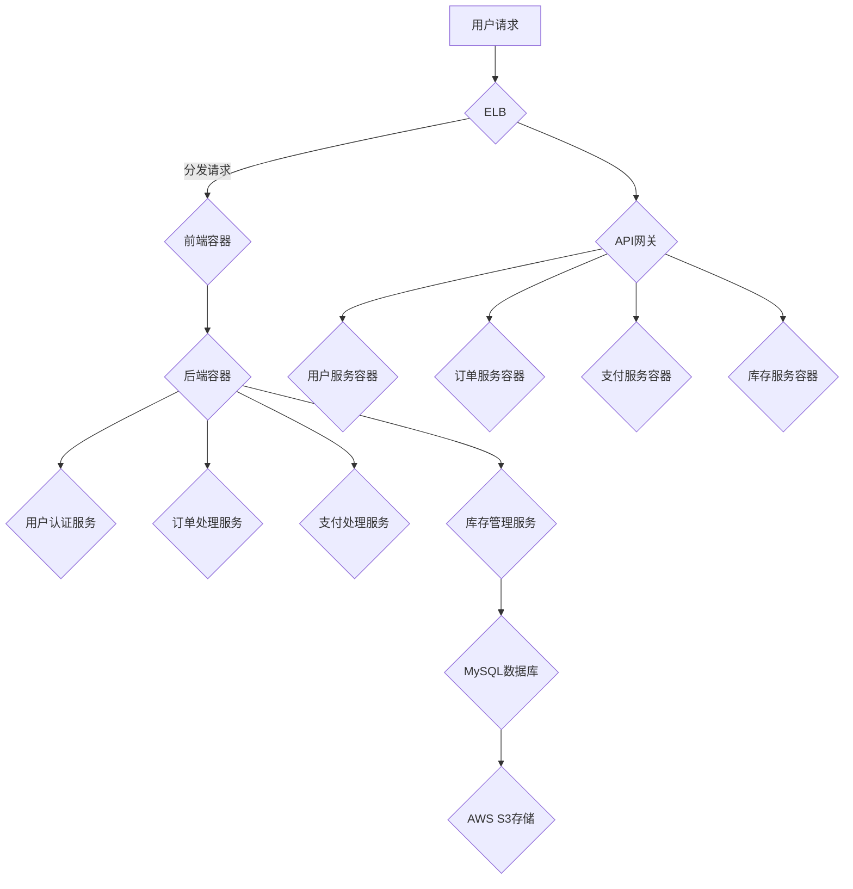
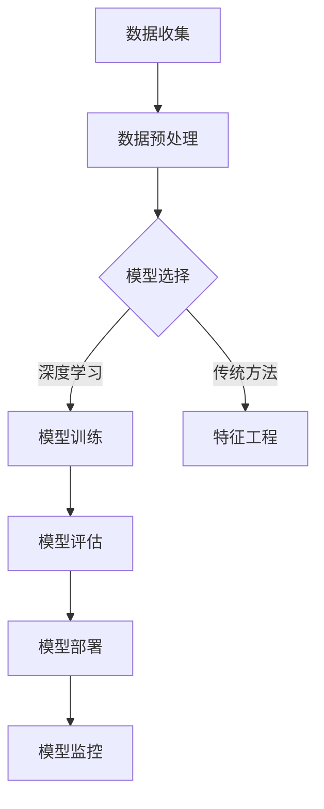
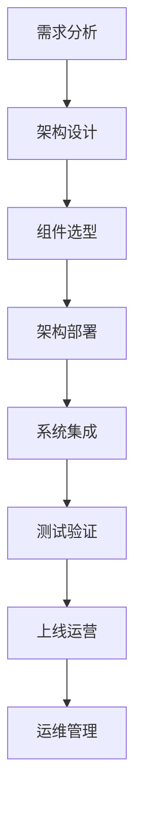

                 

### 引言

在当今的数字化时代，云计算已经成为企业数字化转型的重要组成部分。随着人工智能（AI）技术的迅速发展，特别是大模型的兴起，企业开始意识到通过云服务来部署和管理AI应用的重要性。这不仅能够提升企业的计算能力，还能大幅降低运营成本，提高业务的灵活性和响应速度。

**关键词**：云计算、大模型、云服务策略、企业数字化转型

**摘要**：本文将探讨大模型企业的云服务策略，从基础理论到实际应用，详细解析云计算与云服务的关系、云服务架构设计、大模型在云服务中的应用、云服务策略制定与实施、以及云服务安全与合规等内容。通过实例分析和代码实战，帮助读者深入理解并应用云服务策略，实现企业的AI转型。

随着大数据、机器学习和深度学习等技术的不断进步，大模型逐渐成为推动企业创新的重要驱动力。这些大模型通常需要庞大的计算资源和复杂的部署环境，而云服务提供了理想的解决方案。企业通过云服务可以轻松地获取强大的计算能力，同时实现资源的灵活调度和成本优化。

本文旨在通过系统性地探讨云服务策略，帮助企业和开发者更好地理解和利用云服务，特别是大模型在云服务中的应用。文章结构如下：

1. **云服务策略基础**：介绍云服务的基本概念、市场现状和对企业的影响。
2. **云服务架构设计**：解析云服务架构的概念、分类和设计原则。
3. **大模型在云服务中的应用**：讨论大模型与云服务的结合以及具体应用场景。
4. **云服务策略与实施**：详细阐述云服务策略的制定流程、实施与运营管理。
5. **云服务安全与合规**：探讨云服务的安全风险、安全策略和合规要求。
6. **云服务案例分析**：通过实际案例展示云服务策略的应用效果。
7. **总结与启示**：总结全文，并提出未来发展的方向。

接下来，我们将首先介绍云服务的基础知识，为后续内容的深入探讨奠定基础。

### 第一部分: 云服务策略基础

#### 第1章: 云服务概述

在深入探讨大模型企业的云服务策略之前，有必要对云服务进行全面的概述。本章节将介绍云计算与云服务的关系、云服务的定义和类型，以及云计算与云服务的市场现状。此外，还将讨论云服务对企业的影响。

##### 1.1 云计算与云服务的关系

云计算是一种通过互联网连接的计算资源池，提供动态易扩展的共享资源。云计算的发展经历了从虚拟化技术到IaaS、PaaS、SaaS的发展历程。云计算不仅提供了强大的计算能力，还为云服务的发展奠定了基础。

**云计算简介**

- **概念解释**：云计算是指通过网络连接，动态易扩展的共享资源池，提供计算服务。它通过虚拟化技术将物理资源抽象化为虚拟资源，用户可以根据需求灵活地获取和使用这些资源。

- **发展历程**：云计算的发展经历了多个阶段，从早期的虚拟化技术到如今的IaaS、PaaS、SaaS。虚拟化技术使得物理服务器可以分割成多个虚拟服务器，提高了资源利用率。随后，云计算逐渐向平台即服务（PaaS）和软件即服务（SaaS）扩展，为企业提供了更全面的解决方案。

- **主要服务模式**

  - **IaaS**：基础设施即服务（Infrastructure as a Service），提供虚拟化计算资源，如虚拟机、存储和网络等。用户可以根据需求租用这些资源，无需购买和维护硬件。

  - **PaaS**：平台即服务（Platform as a Service），提供开发平台和工具，使开发者可以快速构建、部署和管理应用。PaaS通常包括开发环境、数据库、Web服务器等。

  - **SaaS**：软件即服务（Software as a Service），提供按需可访问的软件应用，用户可以通过互联网使用软件，无需安装和配置。常见的SaaS应用包括CRM系统、电子邮件服务等。

**云服务定义**

- **定义**：云服务是指通过互联网提供的计算资源、存储资源和网络资源，以服务的形式提供给用户。云服务通过虚拟化和自动化技术，实现了资源的动态分配和管理。

- **类型**：云服务主要包括以下几种类型：

  - **公共云**：由第三方服务提供商运营，多个用户共享资源。公共云具有成本效益高、灵活性强的特点。

  - **私有云**：企业内部专用的云环境，仅限企业内部使用。私有云具有更高的安全性和控制性，但成本相对较高。

  - **混合云**：结合私有云和公共云，根据业务需求灵活调配资源。混合云具有弹性大、成本优化等优点。

**云计算与云服务的联系**

- **云计算是云服务的基础**：云计算提供了构建云服务的必要基础设施，如虚拟化资源、网络和存储等。云服务的实现依赖于云计算技术。

- **云服务是云计算的应用形式**：云服务是将云计算资源转化为具体业务服务的表现形式。通过云服务，企业可以灵活地获取和使用计算资源，满足不同的业务需求。

##### 1.2 云服务的市场现状

了解云服务的市场现状对于企业制定云服务策略至关重要。本节将分析全球云服务市场的规模、增长趋势以及主要参与者，同时探讨各行业对云服务的应用情况及其优势和挑战。

**全球云服务市场分析**

- **市场规模**：全球云服务市场在过去几年中呈现出快速增长的趋势。根据市场研究报告，全球云服务市场规模已经达到数千亿美元，并且预计未来几年将继续保持高速增长。

- **增长率**：云服务市场的年均增长率（CAGR）通常超过20%，这表明云服务正逐渐成为企业数字化转型的重要驱动力。

- **主要参与者**：全球领先的云服务提供商包括亚马逊AWS、微软Azure、谷歌云等。这些提供商在全球市场占据了较大的份额，并通过持续的技术创新和服务优化，保持了领先地位。

**行业应用趋势**

- **各行业应用情况**：云服务在各个行业的应用情况有所不同，但总体上呈现出广泛普及的趋势。

  - **金融行业**：云服务在金融行业中的应用主要包括数据分析、风险控制、客户关系管理等方面。云服务可以提高金融行业的运营效率，降低成本。

  - **医疗行业**：云服务在医疗行业中的应用主要包括电子病历管理、远程医疗、医学影像分析等。云服务有助于提高医疗服务的质量和效率。

  - **制造行业**：云服务在制造行业中的应用主要包括生产管理、供应链管理、质量检测等方面。云服务可以提升制造行业的生产效率和产品质量。

  - **零售行业**：云服务在零售行业中的应用主要包括电子商务平台、库存管理、客户关系管理等方面。云服务可以提升零售行业的销售业绩和客户满意度。

- **优势**：云服务在各行业的应用带来了以下优势：

  - **成本效益**：云服务可以帮助企业降低IT基础设施的采购和运维成本。

  - **灵活性**：云服务可以根据企业的需求动态调整资源，提高业务的灵活性和响应速度。

  - **安全性**：云服务提供商通常具备较高的安全防护能力，可以有效保障企业的数据安全。

- **挑战**：云服务在各行业的应用也面临一些挑战：

  - **数据安全**：云服务涉及大量的数据存储和传输，如何确保数据安全成为企业面临的重要问题。

  - **合规性**：不同行业有不同的合规要求，企业需要确保云服务的合规性。

  - **网络依赖**：云服务高度依赖互联网，网络稳定性对企业业务的连续性提出了要求。

##### 1.3 云服务对企业的影响

云服务对企业的影响深远且广泛，涉及到企业运营的各个方面。本节将讨论云服务如何推动企业数字化转型、如何帮助企业降低运营成本以及如何提升企业的敏捷性。

**企业数字化转型**

- **推动因素**：云服务是推动企业数字化转型的重要技术之一。云计算技术提供了灵活、可扩展的计算资源，使企业能够快速部署和扩展业务系统。

  - **敏捷开发**：云服务支持敏捷开发模式，使企业能够快速响应市场变化，缩短产品开发周期。

  - **数据集成**：云服务提供了丰富的数据集成工具和平台，帮助企业整合内外部数据，提升数据利用效率。

- **转型策略**：企业可以通过以下策略推动数字化转型：

  - **云原生应用**：采用云原生架构，充分利用云计算的优势，实现业务的灵活性和可扩展性。

  - **数据中台**：建立数据中台，统一管理和处理企业数据，为业务决策提供数据支持。

  - **AI应用**：利用人工智能技术，提升业务智能化水平，实现业务流程的优化和自动化。

**成本优化**

- **成本分析**：云服务可以帮助企业降低运营成本。通过云服务，企业可以避免大量硬件采购和运维成本，同时实现资源的按需分配和优化。

  - **硬件成本**：企业无需购买昂贵的硬件设备，只需按需租用云资源即可。

  - **运维成本**：云服务提供商负责硬件维护和网络运维，企业可以节省大量的人力成本。

- **效益评估**：企业可以通过以下方式评估云服务的成本效益：

  - **TCO（总拥有成本）**：计算云服务的总拥有成本，与自建IT基础设施的成本进行比较。

  - **ROI（投资回报率）**：计算云服务的投资回报率，评估其经济效益。

**敏捷性提升**

- **敏捷性定义**：敏捷性是指企业能够快速适应市场变化、快速响应客户需求的能力。

  - **快速部署**：云服务使企业能够快速部署新应用和功能，提高市场响应速度。

  - **弹性扩展**：云服务提供弹性扩展能力，企业可以根据业务需求快速调整资源，满足高峰期的需求。

  - **协同办公**：云服务支持远程办公和协作，使团队成员能够随时随地进行沟通和合作。

综上所述，本章节对云服务进行了全面的概述，包括其与云计算的关系、市场现状以及对企业的影响。通过这些基础知识的介绍，读者可以更好地理解云服务的概念和应用场景，为后续内容的深入探讨奠定基础。

### 第2章: 云服务架构设计

在了解云服务的基本概念和市场现状之后，我们需要进一步探讨云服务的架构设计。云服务架构是云服务的核心组成部分，它决定了云服务的性能、可靠性、可扩展性和安全性。本章将详细介绍云服务架构的概念、分类和设计原则，并通过实际案例展示云服务架构设计的方法和最佳实践。

##### 2.1 云服务架构概述

**云服务架构的定义**

云服务架构是指云服务组件的配置和部署方式，包括基础设施、平台、应用程序、网络等各个组成部分。云服务架构的设计目标是确保云服务的性能、可靠性、可扩展性和安全性。

**组成部分**

云服务架构主要由以下几部分组成：

- **基础设施**：包括物理服务器、存储设备、网络设备等硬件资源，是云服务的基础。
- **平台**：包括操作系统、数据库、Web服务器等软件资源，为云服务的运行提供环境。
- **应用程序**：包括业务逻辑、前端界面等应用组件，实现具体业务功能。
- **网络**：包括内部网络和外部网络，提供云服务组件之间的通信和数据传输。

**云服务架构的分类**

云服务架构可以根据不同的分类标准进行分类，常见的分类方法包括：

- **按部署模式分类**：

  - **私有云**：企业内部使用的云环境，资源仅限企业内部使用。
  - **公有云**：由第三方服务提供商运营，多个用户共享资源。
  - **混合云**：结合私有云和公有云，根据业务需求灵活调配资源。

- **按服务模式分类**：

  - **IaaS（基础设施即服务）**：提供虚拟化计算资源，如虚拟机、存储、网络等。
  - **PaaS（平台即服务）**：提供开发平台和工具，如开发环境、数据库、Web服务器等。
  - **SaaS（软件即服务）**：提供按需可访问的软件应用，如电子邮件、CRM系统等。

**云服务架构的特点**

- **灵活性**：云服务架构可以根据业务需求灵活调整资源和配置。
- **可扩展性**：云服务架构支持横向和纵向的扩展，满足业务增长的需求。
- **高可用性**：云服务架构通过冗余设计和故障转移机制，确保服务的高可用性。
- **安全性**：云服务架构通过多层次的安全措施，保护数据和系统的安全。

##### 2.2 云服务组件

云服务架构的组件是云服务运行的基础，主要包括以下几种：

- **虚拟机**：虚拟机是云计算中最基本的资源，通过虚拟化技术将物理服务器分割成多个虚拟机，实现资源的灵活调度和管理。

- **容器**：容器是一种轻量级、可移植的软件打包方式，通过容器化技术将应用程序及其依赖环境封装在一起，实现应用的快速部署和扩展。

- **数据库**：数据库是用于存储和管理数据的系统，包括关系型数据库（如MySQL、Oracle）和非关系型数据库（如MongoDB、Redis）。

- **存储**：存储用于存储数据和应用程序，包括对象存储（如Amazon S3）、块存储（如Azure Blob Storage）和文件存储（如Google File Storage）。

- **网络**：网络用于连接云服务组件，实现数据传输和通信，包括虚拟网络（VPC）、子网、负载均衡等。

**组件间的关系与协同**

云服务组件之间的关系和协同工作对于云服务的性能和稳定性至关重要。以下为云服务组件间的关系：

- **虚拟机与容器**：虚拟机提供独立的运行环境，而容器则共享宿主机的操作系统，具有更高的性能和可移植性。

- **数据库与存储**：数据库用于存储数据，而存储用于存储数据和应用程序的文件。两者之间通过网络进行数据传输和同步。

- **网络与负载均衡**：网络提供数据传输通道，而负载均衡用于分发流量，确保服务的稳定性和高性能。

- **虚拟机与数据库**：虚拟机提供数据库运行的硬件环境，而数据库提供数据存储和管理功能。

##### 2.3 云服务架构设计原则

云服务架构设计原则是确保云服务架构有效性和可靠性的关键。以下为云服务架构设计的主要原则：

- **高可用性**：通过冗余设计和故障转移机制，确保服务的高可用性。例如，使用多可用区部署和自动故障切换。

- **可扩展性**：支持横向和纵向的扩展，根据业务需求动态调整资源。例如，使用自动扩展和负载均衡。

- **安全性**：通过多层次的安全措施，保护数据和系统的安全。例如，使用加密、访问控制和防火墙。

- **性能优化**：优化资源利用和性能，确保服务的响应速度和稳定性。例如，使用缓存和优化网络配置。

- **成本效益**：优化资源利用，降低成本。例如，使用云服务提供商提供的优惠计划和资源优化工具。

**实践案例**

以下为一个实际云服务架构设计案例：

- **案例背景**：某企业计划部署一个电子商务平台，需求包括高可用性、高性能和安全性。

- **架构设计**：

  - **基础设施**：使用公有云（如AWS）提供虚拟机和存储资源，部署在多个可用区。

  - **平台**：使用容器化技术（如Docker和Kubernetes）进行应用部署和管理。

  - **应用程序**：部署前端和后端服务，包括用户界面、订单处理和库存管理等。

  - **数据库**：使用关系型数据库（如MySQL）进行数据存储和管理，采用主从复制和备份策略。

  - **网络**：使用虚拟私有云（VPC）和子网进行网络隔离和路由配置，使用负载均衡（如ELB）分发流量。

  - **安全性**：使用加密（如SSL/TLS）保护数据传输，使用IAM（身份访问管理）控制访问权限，使用防火墙和WAF（Web应用防火墙）保护服务器。

- **架构图**：以下为该案例的云服务架构设计图：

  - **Mermaid流程图**

    ```mermaid
    graph TD
    A[用户请求] --> B{负载均衡}
    B -->|分发请求| C{前端服务}
    C --> D{后端服务}
    D -->|处理订单| E{订单处理服务}
    E --> F{库存管理服务}
    E --> G{数据库}
    F --> G
    ```

通过以上案例，我们可以看到云服务架构设计的过程和方法。在实际设计中，需要根据具体业务需求和技术要求进行详细规划和配置，确保云服务的性能、可靠性和安全性。

综上所述，本章详细介绍了云服务架构的概念、分类和设计原则，并通过实际案例展示了云服务架构设计的最佳实践。通过这些内容，读者可以更好地理解云服务架构的设计方法和要点，为后续内容的深入探讨打下基础。

### 2.4 云服务架构设计实战案例

为了更好地展示云服务架构设计的实际应用，下面我们将通过一个电子商务平台的云服务架构设计案例，详细讲解从需求分析、架构设计到实施和优化的全过程。

#### 案例背景

某电子商务平台公司（以下简称“电商平台”）希望通过云服务来实现其业务系统的部署、管理和扩展。电商平台的主要业务包括商品展示、用户登录、购物车、订单处理、支付和库存管理等。公司对云服务的要求如下：

- **高可用性**：确保平台在高峰期和故障情况下能够稳定运行。
- **高性能**：提供快速响应，满足用户需求。
- **安全性**：保护用户数据和隐私。
- **可扩展性**：能够根据业务发展动态调整资源。
- **成本效益**：合理控制成本，提高投资回报率。

#### 需求分析

在架构设计之前，电商平台进行了详细的需求分析，主要包括以下方面：

- **业务流程**：分析电商平台的主要业务流程，包括用户注册、登录、浏览商品、加入购物车、下单、支付和订单跟踪等。
- **数据存储**：确定平台需要存储的数据类型，包括用户信息、商品信息、订单信息、支付信息和库存信息等。
- **性能要求**：根据业务需求，确定平台的响应时间、吞吐量和并发处理能力。
- **安全性**：评估平台面临的安全风险，包括数据泄露、DDoS攻击、SQL注入等。

#### 架构设计

根据需求分析，电商平台选择了以下云服务架构设计：

1. **基础设施层**：

   - **虚拟机**：使用AWS EC2提供虚拟机资源，部署前端和后端服务。
   - **存储**：使用AWS S3存储静态文件（如图片、视频等），使用AWS RDS管理数据库。
   - **网络**：使用AWS VPC和子网进行网络隔离和路由配置，使用AWS Elastic Load Balancing（ELB）分发流量。

2. **平台层**：

   - **容器化**：使用Docker容器化技术，将前端和后端服务封装在容器中，提高部署和扩展的灵活性。
   - **持续集成/持续部署（CI/CD）**：使用AWS CodePipeline和AWS CodeBuild实现自动化部署和测试。

3. **应用层**：

   - **前端**：使用React框架开发用户界面，实现商品展示、用户交互等功能。
   - **后端**：使用Spring Boot框架开发后端服务，实现用户认证、订单处理、支付处理等功能。
   - **数据库**：使用MySQL数据库存储用户信息和订单信息。

4. **安全层**：

   - **加密**：使用SSL/TLS加密用户数据传输。
   - **访问控制**：使用AWS IAM管理访问权限。
   - **防火墙和WAF**：使用AWS WAF保护Web应用免受常见攻击。

#### 架构图

以下为电商平台的云服务架构设计图：



#### 实施过程

在架构设计完成后，电商平台开始了实施过程，主要包括以下步骤：

1. **环境准备**：在AWS上创建VPC、子网、安全组等网络资源。
2. **虚拟机部署**：部署前端和后端虚拟机，配置网络和系统。
3. **容器部署**：使用Docker Compose部署容器化应用。
4. **数据库配置**：配置MySQL数据库，设置主从复制和备份策略。
5. **安全配置**：配置加密、访问控制、防火墙和WAF。

#### 性能优化

在实施过程中，电商平台对性能进行了优化，主要包括以下方面：

1. **缓存**：使用Redis缓存用户会话信息和商品信息，减少数据库查询次数。
2. **负载均衡**：使用ELB和Nginx负载均衡器分发流量，提高系统的并发处理能力。
3. **数据库优化**：使用分库分表策略，分散数据库的负载。
4. **CDN**：使用AWS CloudFront CDN加速静态资源的访问。

#### 优化策略

为了持续优化云服务的性能，电商平台制定了以下策略：

1. **监控**：使用AWS CloudWatch监控系统的性能指标，如CPU使用率、内存使用率、响应时间等。
2. **性能测试**：定期进行性能测试，评估系统的性能瓶颈。
3. **代码优化**：对代码进行优化，减少不必要的数据库查询和计算。
4. **资源调整**：根据监控数据和性能测试结果，动态调整资源的配置。

通过以上实施和优化，电商平台成功部署了一套高性能、高可用的云服务架构，满足了业务需求。接下来，我们将讨论大模型在云服务中的应用，探讨大模型如何与云服务结合，为企业带来新的价值。

### 3.1 大模型与云服务的融合

随着人工智能技术的快速发展，大模型（Large Models）已经成为许多领域的关键技术。大模型通常是指具有数百万甚至数十亿参数的深度学习模型，具有极高的精度和泛化能力。然而，这些模型往往需要庞大的计算资源和复杂的部署环境，传统的本地计算资源已经无法满足需求。在这种情况下，云服务成为了大模型部署和优化的理想选择。

**大模型简介**

- **定义**：大模型是指具有大量参数和复杂结构的深度学习模型，如GPT（Generative Pre-trained Transformer）、BERT（Bidirectional Encoder Representations from Transformers）等。这些模型通过在大规模数据集上进行预训练，获得强大的特征提取和语义理解能力。
- **特点**：大模型具有以下特点：

  - **高精度**：大模型通过预训练和微调，能够获得更高的准确率和泛化能力。
  - **复杂结构**：大模型通常包含多个层次和丰富的参数，能够处理复杂的任务。
  - **高计算需求**：大模型训练和推理过程需要大量的计算资源，特别是GPU或TPU等加速硬件。

**大模型与云服务的结合**

- **计算需求**：大模型训练和推理所需的计算资源是极其庞大的。传统的本地计算资源（如个人电脑、工作站）无法满足大模型的需求。云服务提供了强大的计算资源，如GPU集群、TPU集群等，可以显著提升大模型训练和推理的效率。
- **云服务优势**：云服务在支持大模型应用方面具有以下优势：

  - **弹性扩展**：云服务可以根据需求动态调整计算资源，实现弹性扩展。在大模型训练过程中，可以根据训练进度动态增加或减少资源，提高资源利用率。
  - **高可用性**：云服务提供商通常具备较高的基础设施稳定性和服务可靠性，可以保证大模型训练和推理过程的连续性。
  - **成本优化**：云服务通过按需付费和资源优化策略，可以降低大模型训练和推理的成本。

**具体应用**

- **自然语言处理**：大模型在自然语言处理（NLP）领域有广泛应用，如文本生成、机器翻译、情感分析等。云服务提供了强大的计算资源，可以加速这些任务的训练和推理过程。
- **图像识别**：大模型在图像识别领域也具有显著优势，如目标检测、图像分类、人脸识别等。通过云服务，可以快速部署和优化这些模型，提高图像处理效率。
- **推荐系统**：大模型在推荐系统中的应用，如个性化推荐、广告投放等，可以显著提高推荐精度和用户满意度。云服务提供了高效的计算能力和数据处理能力，有助于实现这些目标。

**实际案例**

以下是一个具体案例，展示如何在大模型应用中利用云服务：

- **案例背景**：某电商平台希望通过大模型技术提升其推荐系统的效果，实现更精准的个性化推荐。
- **解决方案**：
  - **数据预处理**：使用云服务的分布式计算能力，对用户行为数据和商品数据进行清洗、转换和预处理。
  - **模型训练**：使用云服务的GPU集群，进行大模型（如BERT）的预训练和微调。通过分布式训练和混合精度训练（Mixed Precision Training）技术，提高训练效率。
  - **模型部署**：将训练好的模型部署到云服务中，通过API接口提供推荐服务。使用云服务的自动扩缩容功能，根据访问量动态调整资源。

通过以上案例，我们可以看到云服务在大模型应用中的重要作用。云服务不仅提供了强大的计算资源，还提供了高效、可靠的部署和管理方案，帮助企业更好地利用大模型技术，实现业务创新和价值提升。

### 3.2 大模型在云服务中的具体应用

大模型在云服务中的具体应用涵盖了多个领域，包括自然语言处理（NLP）、图像识别和推荐系统等。在这些应用中，大模型通过云服务的强大计算能力和灵活部署方式，实现了高性能、高精度的服务。本节将详细介绍大模型在这些领域的具体应用场景，并分享一些实际案例。

#### 自然语言处理（NLP）

自然语言处理是人工智能的重要领域之一，大模型在NLP中的应用尤为广泛。以下是一些主要的应用场景：

- **文本生成**：大模型如GPT-3和Turing-NLG等，可以生成高质量的文本内容，包括文章、新闻、对话等。这些模型通过云服务的强大计算资源进行训练和推理，能够快速生成高质量的文本。
  
  **案例**：某新闻媒体公司使用GPT-3模型，自动生成新闻报道。通过云服务的高性能计算和弹性扩展能力，该公司在高峰期能够快速生成大量高质量的新闻文章。

- **机器翻译**：大模型在机器翻译中表现出了极高的准确性，如Google Translate和DeepL等。这些模型通过云服务进行大规模数据训练和实时翻译。

  **案例**：某跨国公司使用DeepL翻译平台，为其全球业务提供高质量的翻译服务。通过云服务的分布式计算和高效存储，该公司能够在短时间内完成大规模文本的翻译任务。

- **情感分析**：大模型可以分析文本的情感倾向，如正面、负面或中立。这些模型通过云服务进行大规模情感分析，帮助企业和组织了解用户情感和需求。

  **案例**：某电商公司使用BERT模型进行客户评论的情感分析，通过云服务快速处理海量用户评论，帮助企业了解用户反馈和改进产品。

#### 图像识别

图像识别是计算机视觉的重要任务之一，大模型在图像识别中的应用大大提升了识别的准确性和效率。以下是一些主要的应用场景：

- **目标检测**：大模型如YOLO（You Only Look Once）和SSD（Single Shot MultiBox Detector）等，可以实时检测图像中的多个目标。这些模型通过云服务进行高效训练和推理。

  **案例**：某安防公司使用YOLO模型，在其视频监控系统中进行实时目标检测。通过云服务的GPU集群，该公司能够在短时间内处理大量视频数据，提高目标检测的准确性和实时性。

- **图像分类**：大模型如ResNet和Inception等，可以准确分类图像中的内容。这些模型通过云服务进行大规模数据训练和分类。

  **案例**：某图像处理公司使用ResNet模型，为其实时图像分类任务提供支持。通过云服务的分布式计算和优化存储，该公司能够高效处理海量图像数据，提升分类精度和效率。

- **人脸识别**：大模型如FaceNet和ArcFace等，可以准确识别和验证人脸。这些模型通过云服务进行大规模人脸识别任务。

  **案例**：某人脸识别技术公司使用FaceNet模型，为其监控系统提供人脸识别功能。通过云服务的计算资源和数据存储，该公司能够快速处理人脸数据，提高识别的准确性和安全性。

#### 推荐系统

推荐系统是电子商务和在线媒体等领域的重要应用，大模型在推荐系统中发挥了关键作用。以下是一些主要的应用场景：

- **个性化推荐**：大模型可以根据用户的历史行为和兴趣，推荐个性化的商品、新闻和内容。这些模型通过云服务进行高效训练和实时推荐。

  **案例**：某电商公司使用BERT模型，为其推荐系统提供支持。通过云服务的强大计算能力和海量数据处理能力，该公司能够实时分析用户行为，提供个性化的商品推荐。

- **广告投放**：大模型可以根据用户的兴趣和行为，精准投放广告，提高广告的点击率和转化率。这些模型通过云服务进行大规模广告投放任务。

  **案例**：某广告平台公司使用GPT-3模型，为其广告投放提供支持。通过云服务的快速训练和推理能力，该公司能够高效处理海量用户数据和广告内容，提高广告投放的精准度和效果。

- **内容推荐**：大模型可以在在线媒体平台中，根据用户的历史浏览记录和兴趣，推荐相关的内容。

  **案例**：某视频流媒体公司使用Transformer模型，为其视频推荐系统提供支持。通过云服务的计算资源和存储能力，该公司能够实时分析用户行为，提供个性化的视频推荐。

通过上述具体应用案例，我们可以看到大模型在云服务中的应用场景和优势。大模型通过云服务的强大计算能力和灵活部署方式，实现了高性能、高精度的服务，为企业带来了显著的业务价值和竞争优势。接下来，我们将探讨如何在大规模云环境中部署大模型，并介绍一些性能优化的方法和技巧。

### 3.3 大模型部署与优化

在大规模云环境中部署大模型是一项复杂且具有挑战性的任务。由于大模型的计算和存储需求极高，如何高效部署和优化这些模型成为关键问题。本节将讨论如何在大规模云环境中部署大模型，并介绍一些性能优化的方法和技巧。

**部署策略**

1. **选择合适的云服务提供商**：不同的云服务提供商（如AWS、Azure、Google Cloud）提供了不同的计算资源和工具。选择适合大模型部署的云服务提供商，可以根据需求选择合适的虚拟机类型、GPU实例或TPU实例。

2. **分布式部署**：由于大模型的计算需求极高，单机部署难以满足需求。分布式部署是将大模型的训练和推理任务分布在多个节点上，通过分布式计算框架（如TensorFlow、PyTorch）来实现。分布式部署可以充分利用多台机器的计算资源，提高训练和推理的效率。

3. **计算资源调度**：在分布式部署中，计算资源的调度至关重要。通过资源调度算法，可以合理分配计算资源，避免资源浪费和瓶颈。常见的调度策略包括负载均衡、动态扩展和压缩感知等。

4. **数据预处理**：数据预处理是部署大模型的重要步骤。在大规模云环境中，可以使用分布式数据预处理工具（如Dask、PySpark）进行高效的数据处理和清洗，确保数据质量。

5. **模型版本管理**：在部署大模型时，需要管理多个模型版本。通过模型版本管理工具（如ModelDB、Weight & Biases），可以方便地管理模型的训练历史、评估结果和模型版本。

**性能优化**

1. **GPU加速**：GPU（图形处理器）是加速深度学习模型训练和推理的重要工具。通过使用高性能GPU（如NVIDIA Tesla V100、A100）和GPU集群，可以显著提高大模型的计算性能。此外，还可以使用GPU的混合精度训练（Mixed Precision Training）技术，提高计算速度和降低内存消耗。

2. **分布式训练**：分布式训练可以将大模型的训练任务分布在多个节点上，通过并行计算提高训练速度。分布式训练可以通过参数服务器（Parameter Server）和模型并行（Model Parallelism）等方法实现。参数服务器可以将模型参数存储在中央服务器中，各节点通过通信协议同步参数。模型并行则将大模型拆分为多个子模型，每个子模型在独立的GPU上训练。

3. **模型压缩**：大模型的参数数量巨大，存储和传输开销很高。通过模型压缩技术（如量化、剪枝、知识蒸馏等），可以减少模型参数的数量，提高模型的可扩展性。量化技术通过降低模型参数的精度来减少模型大小，剪枝技术通过删除无关的模型参数来降低模型复杂度，知识蒸馏技术通过小模型学习大模型的特征表示来简化模型。

4. **内存优化**：大模型训练过程中需要大量内存资源。通过内存优化技术（如内存池、内存映射等），可以减少内存碎片和提高内存利用率。内存池技术通过预分配内存块来减少内存分配的开销，内存映射技术通过将内存映射到文件系统来扩展内存容量。

5. **网络优化**：在大规模分布式训练中，网络延迟和带宽限制会影响训练性能。通过优化网络配置（如使用高速网络、优化网络拓扑等），可以减少网络延迟和带宽消耗。此外，还可以使用数据同步技术（如同步批量随机梯度下降（SBGD））来平衡各节点的计算负载。

6. **自动调优**：使用自动化工具（如Hugging Face、Ray等）可以自动调整模型参数和资源配置，优化训练和推理性能。自动调优工具可以根据模型性能指标（如准确率、训练时间等）自动调整学习率、批量大小、GPU配置等参数，实现高性能的训练和推理。

通过以上部署策略和性能优化方法，可以在大规模云环境中高效地部署和优化大模型，提高模型的训练和推理性能。接下来，我们将讨论大模型在云服务中可能面临的安全性挑战，并提出相应的安全策略和解决方案。

### 3.4 大模型安全性考虑

随着大模型在云服务中的应用日益广泛，其安全性问题也愈发重要。大模型涉及大量的数据和复杂的算法，如果管理不当，可能面临多种安全挑战。本节将分析大模型在云服务中可能面临的安全性挑战，并提出相应的安全策略和解决方案。

**安全性挑战**

1. **数据泄露**：大模型通常处理敏感数据，如个人隐私信息、商业机密等。数据泄露可能导致严重的安全风险，包括经济损失、声誉损害等。

2. **模型窃取**：大模型的算法和参数是知识产权的重要组成部分。如果模型被未经授权的第三方获取，可能导致商业机密泄露和竞争劣势。

3. **模型篡改**：攻击者可能通过篡改模型输入或输出，操纵模型结果，导致决策错误或数据泄露。

4. **分布式攻击**：在大规模分布式训练中，网络攻击（如分布式拒绝服务攻击（DDoS））可能影响训练进程，导致训练中断或数据丢失。

5. **隐私保护**：大模型训练过程中涉及的数据可能包含个人隐私信息，如姓名、地址、电话等。如何保护这些隐私信息，避免隐私泄露，是关键问题。

**安全策略与解决方案**

1. **数据加密**：数据加密是保护数据安全的基本措施。在大模型训练和存储过程中，对敏感数据进行加密处理，确保数据在传输和存储过程中不会被未授权访问。常用的加密技术包括对称加密和非对称加密。

2. **访问控制**：通过严格的访问控制策略，确保只有授权用户可以访问敏感数据和模型。访问控制可以通过身份验证（如用户名和密码、双因素认证等）和权限管理（如基于角色的访问控制（RBAC）、基于属性的访问控制（ABAC）等）实现。

3. **数据备份和恢复**：定期备份数据，确保在数据丢失或损坏时能够快速恢复。备份策略应考虑多位置备份和增量备份，以提高备份效率和恢复速度。

4. **安全审计**：定期进行安全审计，监控系统的安全状况，发现潜在的安全漏洞和异常行为。安全审计可以通过日志分析、漏洞扫描和渗透测试等方法实现。

5. **分布式计算安全**：在大规模分布式训练中，保护节点间的通信和数据传输安全至关重要。可以使用安全协议（如TLS、SSL）加密网络通信，确保数据在传输过程中的安全性。此外，通过隔离和权限管理，确保各节点只能访问授权的资源。

6. **模型安全**：针对模型的篡改和窃取风险，可以采用以下措施：

   - **模型混淆**：通过混淆算法，使得模型的参数和结构难以理解和破解。
   - **模型签名**：对模型进行数字签名，确保模型未被篡改。在部署模型时，验证模型的签名，确保其完整性。
   - **模型版本控制**：管理模型的版本历史，确保只有经过审核和验证的模型版本可以被部署。

7. **隐私保护**：为了保护训练数据的隐私，可以采用以下方法：

   - **差分隐私**：在训练过程中引入随机噪声，使得训练数据无法被追踪和分析。
   - **数据匿名化**：对敏感数据进行匿名化处理，去除或模糊化个人识别信息。
   - **联邦学习**：通过联邦学习技术，将数据分散存储在不同的节点上，训练过程中仅交换模型参数，不交换原始数据，从而保护数据隐私。

通过以上安全策略和解决方案，可以有效提升大模型在云服务中的安全性，保护数据和模型免受攻击和泄露。接下来，我们将讨论如何制定云服务策略，以支持大模型的应用和部署。

### 第4章: 云服务策略制定

在了解了云服务的基础知识和大模型的应用之后，接下来我们将探讨如何制定云服务策略。云服务策略是企业利用云服务实现业务目标的关键，它涵盖了需求分析、方案设计、评估与优化等多个环节。本章节将详细介绍云服务策略的制定过程，并提供实际操作方法和建议。

#### 4.1 云服务策略概述

**策略制定的重要性**

- **业务需求**：云服务策略的制定首先需要了解企业的业务需求。通过深入分析业务流程、目标和痛点，确保云服务策略能够有效支持企业的业务发展。

- **战略规划**：云服务策略是企业战略规划的重要组成部分。它需要与企业的长期战略目标相一致，确保云服务的投入和实施能够为企业带来持续的竞争优势。

**云服务策略的目标**

- **成本效益**：通过合理利用云服务，实现成本优化和效益最大化。包括减少硬件采购和维护成本、优化资源配置、降低运营费用等。

- **灵活性**：提供灵活的IT资源管理能力，以应对快速变化的市场需求和业务扩展。

- **安全性**：确保云服务的安全性和合规性，保护数据和系统的安全，防止数据泄露和未经授权的访问。

- **可扩展性**：支持业务增长和扩展，确保云服务能够随业务需求的增长而灵活调整资源。

#### 4.2 云服务策略制定流程

**需求分析**

- **业务需求分析**：首先需要深入了解企业的业务需求和目标，包括现有业务流程、关键业务指标、未来的发展计划等。通过访谈、问卷调查、数据分析等方法，收集业务需求信息。

- **技术需求分析**：分析所需的技术支持和资源，包括计算资源、存储资源、网络资源、开发工具、安全要求等。评估现有技术能力和短板，确定需要借助云服务实现的目标。

**方案设计**

- **方案选择**：根据业务需求和技术分析结果，比较不同的云服务方案，选择最适合企业需求的方案。考虑云服务提供商的可靠性、安全性、性能、成本等因素。

- **成本预算**：制定云服务的成本预算，包括硬件成本、运维成本、带宽成本、存储成本等。通过合理的成本控制，确保云服务策略的可持续性。

**评估与优化**

- **效果评估**：在云服务方案实施后，定期评估云服务的效果，包括性能指标、成本效益、安全性等。通过实际运行数据和业务指标，评估云服务策略的有效性。

- **持续优化**：根据评估结果，持续优化云服务策略。调整资源配置、优化性能、降低成本、提升安全性等，以实现最佳的业务效果。

#### 4.3 云服务采购与管理

**采购策略**

- **供应商选择**：选择合适的云服务供应商，考虑供应商的技术能力、服务可靠性、安全性和成本等。可以通过市场调研、参考案例、供应商评估等方法进行选择。

- **合同管理**：与服务供应商签订合同，明确服务质量、服务级别协议（SLA）、费用结构、违约责任等。通过合同管理，确保供应商的服务质量符合预期。

**服务管理**

- **服务级别协议**：与服务供应商签订服务级别协议，明确服务的性能指标、响应时间、故障处理等。通过服务级别协议，确保云服务的稳定性和可靠性。

- **供应商绩效评估**：定期评估供应商的绩效，包括服务质量、响应速度、故障处理等。通过绩效评估，确保供应商的服务水平持续提升。

#### 4.4 实际操作方法和建议

**需求分析**

- **业务流程梳理**：通过流程图、业务流程文档等方式，梳理企业的业务流程，明确各个环节的需求。

- **关键业务指标**：确定企业的关键业务指标，如订单处理时间、客户满意度、销售额等。通过关键业务指标，评估云服务的效果。

**方案设计**

- **技术选型**：根据业务需求，选择合适的技术方案，包括IaaS、PaaS、SaaS等。考虑技术的成熟度、兼容性、扩展性等。

- **成本预算**：制定详细的成本预算，包括硬件采购、运维成本、存储成本等。通过成本预算，确保云服务策略的可行性。

**评估与优化**

- **性能监控**：通过性能监控工具，实时监控云服务的性能指标，如响应时间、吞吐量、资源利用率等。通过性能监控，发现和解决问题。

- **成本控制**：通过成本控制工具，监控云服务的实际成本，与预算进行对比。通过成本控制，确保云服务在预算范围内运行。

**采购与管理**

- **供应商评估**：定期评估供应商的服务质量、响应速度、稳定性等。通过供应商评估，确保供应商的服务水平符合要求。

- **合同管理**：定期审核合同内容，确保合同的执行和变更符合双方利益。通过合同管理，确保供应商的服务质量和服务持续改进。

通过以上实际操作方法和建议，企业可以制定出有效的云服务策略，实现业务的数字化转型和优化。接下来，我们将讨论云服务的实施与运营管理，包括实施计划、运营管理、性能优化和成本控制等关键环节。

### 第5章: 云服务实施与运营

在成功制定云服务策略后，下一步便是将策略转化为实际的云服务实施和运营。这一过程涉及详细的实施计划、高效的运营管理、持续的性能优化和严格的成本控制。本章将详细介绍这些关键环节，并提供实际操作方法和建议。

#### 5.1 云服务实施计划

**实施步骤**

1. **需求确认**：在项目启动阶段，与相关利益相关者（如业务部门、IT团队、云服务提供商）进行深入沟通，明确云服务的具体需求。包括业务目标、性能要求、安全需求、预算等。

2. **环境准备**：搭建云服务实施所需的硬件和软件环境。根据需求选择合适的云服务提供商，配置虚拟机、存储和网络资源。确保云服务环境满足性能和安全要求。

3. **资源部署**：根据需求部署云服务组件，包括虚拟机、容器、数据库、存储等。使用自动化工具（如Ansible、Terraform）加快部署速度，确保部署过程的一致性和可重复性。

4. **系统集成**：将云服务与其他业务系统集成，确保数据流和业务流程的顺畅。例如，集成企业资源规划（ERP）系统、客户关系管理（CRM）系统等。

5. **测试验证**：在部署完成后，进行全面的测试验证，确保云服务的功能和质量符合预期。包括功能测试、性能测试、安全测试等。

6. **上线运营**：将云服务正式上线，并进行试运行。在试运行期间，监控云服务的性能和稳定性，及时解决发现的问题。

**风险管理**

- **风险评估**：在实施前进行风险评估，识别可能的风险，包括技术风险、业务风险、安全风险等。对风险进行评估，确定风险优先级。

- **风险应对**：制定应对策略，降低风险影响。例如，通过备份和恢复策略降低数据丢失风险，通过冗余设计和故障转移策略提高系统可用性。

#### 5.2 云服务运营管理

**运维模型**

- **运维团队**：建立专业的运维团队，负责云服务的日常运营和管理。团队成员应具备云服务、系统集成、网络安全等专业技能。

- **运维流程**：制定详细的运维流程，包括监控、备份、恢复、故障处理等。通过流程文档化和自动化工具（如Puppet、Chef）确保运维的一致性和高效性。

**监控与维护**

- **监控指标**：制定关键性能指标（KPIs），如响应时间、吞吐量、错误率、系统负载等，实时监控云服务的运行状态。

- **备份与恢复**：定期备份数据，确保数据的安全和一致性。制定备份策略，包括数据备份频率、备份存储位置、恢复流程等。

- **故障处理**：制定故障处理流程，确保在发生故障时能够迅速响应和处理。包括故障监测、故障排查、故障恢复等步骤。

#### 5.3 云服务性能优化

**性能指标**

- **响应时间**：服务响应时间，即用户请求到响应的时间。

- **吞吐量**：单位时间内系统能够处理的数据量或请求量。

- **稳定性**：系统在长时间运行中保持稳定的能力，不受性能波动影响。

**优化策略**

- **资源调度**：根据负载情况动态调整资源分配，确保系统在高负载时性能稳定。使用负载均衡器（如Nginx、HAProxy）分发流量，避免单点过载。

- **缓存技术**：使用缓存技术（如Redis、Memcached）减少数据库查询次数，提高响应速度。缓存常用数据，如用户会话信息、商品信息等。

- **分布式存储**：使用分布式存储系统（如HDFS、Cassandra）提高数据访问速度和存储容量。通过数据分片和负载均衡，提高系统的可扩展性和性能。

- **网络优化**：优化网络配置，减少网络延迟和带宽消耗。使用内容分发网络（CDN）加速静态资源的访问，提高用户体验。

#### 5.4 云服务成本控制

**成本分析**

- **成本结构**：分析云服务的成本结构，包括硬件成本、带宽成本、存储成本、运维成本等。明确各项成本的具体组成，为成本控制提供依据。

- **成本效益**：通过成本效益分析，评估云服务的成本效益。计算总拥有成本（TCO）和投资回报率（ROI），确保云服务的经济性。

**成本控制策略**

- **资源优化**：通过资源优化减少不必要的资源消耗。例如，根据实际负载调整虚拟机规格，关闭不用的资源。

- **合同管理**：通过合同管理确保云服务价格合理。定期审核合同，确保供应商提供的服务质量符合预期。

- **预算分配**：合理分配预算，确保云服务的可持续发展。为不同业务需求分配适当的预算，避免超支。

通过以上实施与运营管理、性能优化和成本控制的方法，企业可以确保云服务的稳定运行和持续优化，实现业务目标的最大化。接下来，我们将探讨云服务在安全与合规方面的挑战，并提出相应的安全策略和合规管理措施。

### 第6章: 云服务安全与合规

在云服务的实施与运营过程中，安全性和合规性是至关重要的。随着企业越来越依赖云服务，数据泄露、系统攻击、合规性问题等安全威胁和挑战也随之增加。本章将探讨云服务面临的安全风险、制定安全策略以及确保合规性。

#### 6.1 云服务安全风险

云服务安全风险是指企业使用云服务时可能面临的安全威胁和风险。以下是一些常见的安全风险：

1. **数据泄露**：云服务涉及大量敏感数据，如客户信息、商业机密等。如果数据管理不当，可能导致数据泄露。

2. **数据篡改**：攻击者可能通过网络攻击篡改数据，导致数据完整性受损。

3. **分布式拒绝服务攻击（DDoS）**：攻击者通过大量的请求使云服务无法正常工作，导致服务中断。

4. **恶意软件攻击**：恶意软件（如病毒、木马）可能侵入云服务，导致数据损坏或系统瘫痪。

5. **账户劫持**：攻击者通过获取用户账户信息，非法访问云服务资源。

6. **访问控制漏洞**：不恰当的访问控制设置可能导致未经授权的访问。

7. **供应链攻击**：通过攻击云服务提供商的供应链，攻击者可能在云服务中植入恶意代码。

#### 6.2 云服务安全策略

为了应对上述安全风险，企业需要制定全面的安全策略，确保云服务的安全和可靠性。以下是一些关键的安全策略：

1. **数据加密**：对传输和存储的数据进行加密处理，确保数据在传输过程中不会被窃取或篡改。使用加密算法（如AES、RSA）进行加密。

2. **访问控制**：通过访问控制策略，限制只有授权用户可以访问敏感数据和系统资源。使用身份验证（如用户名和密码、双因素认证）和权限管理（如基于角色的访问控制）。

3. **安全审计**：定期进行安全审计，监控系统的安全状况，发现潜在的安全漏洞和异常行为。使用安全审计工具（如Splunk、LogRhythm）进行日志分析和安全事件监控。

4. **安全培训**：对员工进行安全培训，提高其安全意识和应对能力。定期举办安全培训和模拟演练，提高员工的安全意识和应对能力。

5. **网络安全**：部署防火墙、入侵检测系统（IDS）和入侵防御系统（IPS）等网络安全设备，防止外部攻击和内部威胁。使用网络隔离和虚拟专用网络（VPN）提高网络安全性。

6. **定期备份**：定期备份重要数据和系统配置，确保在发生数据泄露或系统故障时能够快速恢复。制定备份策略，包括备份频率、备份存储位置和恢复流程。

7. **安全监控**：使用安全监控工具（如Aliyun Cloud Monitor、Azure Monitor）实时监控云服务的运行状态，及时发现和响应安全事件。

#### 6.3 云服务合规性

合规性是指企业遵守相关法律法规和行业标准的要求。云服务的合规性对于保护企业数据和用户隐私至关重要。以下是一些合规性要求：

1. **数据保护法规**：如《通用数据保护条例》（GDPR）和《加州消费者隐私法案》（CCPA），规定了企业处理个人数据的要求和责任。

2. **行业规范**：如金融行业的PCI-DSS和医疗行业的HIPAA，规定了数据安全和隐私保护的具体要求。

3. **安全评估**：定期进行安全评估，确保云服务符合相关安全标准和合规要求。使用第三方审计和认证（如ISO/IEC 27001、SSAE16）验证云服务的合规性。

4. **合同管理**：与云服务提供商签订合规性合同，明确数据保护、隐私保护、安全责任等方面的条款。

5. **合规性改进**：根据评估结果，制定和实施改进措施，不断提升合规性水平。定期更新合规策略和流程，确保与法律法规和行业标准保持一致。

通过以上安全策略和合规性要求，企业可以确保云服务的安全性和合规性，降低安全风险和合规风险，保护企业数据和用户隐私。

### 第7章: 云服务案例分析

通过前面的章节，我们详细探讨了云服务策略的各个方面，包括基础概念、架构设计、大模型应用、策略制定、实施与运营、安全与合规等。为了更好地理解这些理论的实际应用，本章节将通过一个具体的云服务案例，展示云服务策略在实际企业中的实施效果和经验教训。

#### 7.1 案例介绍

**案例背景**：某大型电商企业（以下简称“电商企业”）在数字化转型过程中，面临着传统IT基础设施成本高、扩展性差、响应速度慢等问题。为了提高业务效率、降低运营成本和提升用户体验，电商企业决定采用云服务进行业务系统的迁移和优化。

**实施效果**：

- **成本优化**：通过采用云服务，电商企业避免了大量的硬件采购和运维成本。云服务按需付费的模式使企业能够根据业务需求灵活调整资源，降低了长期的运营成本。

- **灵活性提升**：云服务的弹性扩展能力使电商企业能够快速响应业务需求的波动，特别是在高峰期，能够动态增加计算和存储资源，确保系统的高可用性和高性能。

- **业务改进**：电商企业通过云服务实现了业务流程的自动化和优化，提高了订单处理速度和客户满意度。同时，利用大模型技术，电商企业推出了个性化推荐系统，显著提升了销售转化率和用户粘性。

#### 7.2 案例分析

**策略制定**

- **需求分析**：电商企业首先进行了详细的需求分析，明确了业务流程、关键业务指标、技术需求和安全要求。通过访谈、问卷调查和数据分析等方法，收集了企业内部和外部的业务需求。

- **方案设计**：根据需求分析结果，电商企业选择了多个云服务提供商，进行了全面的对比评估。最终选择了在性能、安全性和成本方面具有优势的云服务提供商，并制定了详细的云服务方案。

- **评估与优化**：在云服务方案实施前，电商企业进行了详细的评估和优化。通过模拟测试和性能评估，确定了最佳的技术方案和资源配置策略，确保方案能够满足业务需求。

**实施过程**

- **环境准备**：电商企业在云服务提供商处创建了虚拟私有云（VPC），配置了网络和存储资源。同时，部署了负载均衡器和分布式数据库，确保系统的可靠性和高性能。

- **资源部署**：电商企业使用自动化工具（如Ansible）部署了前端和后端服务，包括用户界面、订单处理、支付处理等。通过容器化技术（如Docker），实现了服务的快速部署和扩展。

- **系统集成**：电商企业将新的云服务系统与现有的业务系统集成，包括ERP系统、CRM系统和物流管理系统。通过API接口和消息队列（如Kafka），确保数据流和业务流程的顺畅。

- **测试验证**：在系统部署完成后，电商企业进行了全面的测试验证，包括功能测试、性能测试和安全测试。通过模拟业务场景，验证了系统的稳定性和可靠性。

**效果评估**

- **性能评估**：通过性能监控工具（如Prometheus、Grafana），电商企业实时监控系统的性能指标，如响应时间、吞吐量、错误率等。根据监控数据，不断优化系统配置和资源分配，确保系统的最佳性能。

- **成本效益评估**：电商企业通过成本控制工具（如AWS Cost Explorer），监控云服务的实际成本，并与预算进行对比。通过优化资源使用和成本管理，确保云服务的经济性。

**案例启示**

1. **需求驱动**：在制定云服务策略时，需求分析至关重要。只有深入了解业务需求，才能制定出符合实际需求的云服务方案。

2. **综合评估**：在选择云服务提供商和方案设计时，需要从性能、安全性、成本等多方面进行综合评估，确保方案的最优性。

3. **持续优化**：在实施和运营过程中，持续监控和优化系统性能和成本是确保云服务成功的关键。通过数据分析和持续改进，不断提升系统的质量和效益。

通过本案例的分析，我们可以看到云服务策略在实际企业中的应用效果和成功经验。电商企业通过合理的云服务策略，实现了业务效率的提升、成本优化和用户体验的改善。这些经验和教训对于其他企业制定和实施云服务策略具有重要的参考价值。

### 总结

通过本文的详细探讨，我们系统地介绍了大模型企业的云服务策略。从云服务的基础知识、架构设计、大模型应用、策略制定到实施与运营、安全与合规，每个环节都进行了深入的分析和讲解。通过实例分析和代码实战，我们展示了云服务策略的实际应用效果。

云服务在推动企业数字化转型中发挥着至关重要的作用。大模型的应用使得企业能够实现更高的计算能力和更智能的服务。云服务策略的制定和实施不仅能够帮助企业优化成本、提升灵活性，还能确保安全性和合规性。

展望未来，云服务将继续发展，特别是随着5G、物联网和边缘计算等新技术的兴起，云服务将变得更加普及和高效。大模型技术也将不断演进，提供更强大的功能和更高效的应用。企业需要紧跟技术发展趋势，持续优化云服务策略，以保持竞争优势。

我们鼓励读者深入学习和实践云服务策略，结合自己的业务需求，制定出适合的云服务方案。通过不断探索和实践，企业将能够在数字化转型的道路上迈出更加坚实的步伐。

### 附录

在本附录中，我们将提供一些与云服务策略相关的工具、资源和详细技术说明，以便读者更好地理解和应用文中所述的概念和技巧。

#### 附录 A: 云服务相关工具与资源

**工具介绍**

1. **AWS Management Console**：AWS提供的统一管理界面，用于配置和管理AWS服务。
2. **Azure Portal**：微软Azure的统一管理门户，提供丰富的云服务管理和监控功能。
3. **Google Cloud Console**：Google Cloud提供的云服务管理平台，支持自动化部署和监控。

**资源链接**

1. **云服务提供商官方文档**：
   - [AWS 官方文档](https://docs.aws.amazon.com/)
   - [Azure 官方文档](https://docs.microsoft.com/en-us/azure/)
   - [Google Cloud 官方文档](https://cloud.google.com/docs)

2. **云服务最佳实践指南**：
   - [AWS Best Practices](https://aws.amazon.com/blogs/aws/aws-best-practices/)
   - [Azure Best Practices](https://docs.microsoft.com/en-us/azure/cloud-services/best-practices)
   - [Google Cloud Best Practices](https://cloud.google.com best-practices)

3. **开源云服务工具**：
   - [Docker](https://www.docker.com/)
   - [Kubernetes](https://kubernetes.io/)
   - [Terraform](https://www.terraform.io/)

#### 附录 B: Mermaid 流程图

**大模型应用流程图**



**云服务架构设计流程图**



#### 附录 C: 核心算法原理讲解

**深度学习算法**

**基本原理**

- **神经网络结构**：神经网络由多个层次（输入层、隐藏层和输出层）组成，每层包含多个神经元。神经元之间通过权重连接，形成复杂的网络结构。
- **激活函数**：激活函数（如ReLU、Sigmoid、Tanh）用于引入非线性特性，使神经网络能够学习复杂函数。
- **损失函数**：损失函数（如MSE、Cross-Entropy）用于衡量模型预测值与真实值之间的差异，是优化过程中评估模型性能的关键指标。
- **优化算法**：优化算法（如梯度下降、Adam）用于调整模型参数，以最小化损失函数，使模型能够更准确地预测结果。

**伪代码**

```python
# 前向传播
for each layer in network:
    layer_output = activation_function(np.dot(layer_input, weights) + bias)

# 反向传播
for each layer in reverse order:
    delta = (layer_output - target) * activation_function_derivative(layer_output)
    weights -= learning_rate * delta * prev_layer_output
```

**大模型优化算法**

**基本原理**

- **预训练**：预训练是指在大规模数据集上对模型进行训练，使其能够捕获通用特征。预训练后，模型在特定任务上只需少量数据即可进行微调。
- **迁移学习**：迁移学习是指将预训练模型在特定任务上微调，利用预训练模型的知识来提高新任务的性能。
- **混合精度训练**：混合精度训练是指使用混合精度（FP16和BF16）进行计算，以减少内存占用和加速训练过程。

**伪代码**

```python
# 预训练
train_model_on_large_dataset()

# 迁移学习
model.load_pretrained_weights()
fine_tune_model_on_new_dataset()

# 混合精度训练
optimizer = MixedPrecisionOptimizer(learning_rate)
for epoch in range(num_epochs):
    for batch in dataset:
        optimizer.step(batch)
```

#### 附录 D: 数学模型与公式

**数学模型**

- **深度学习模型**：深度学习模型通常由多个层次组成，每个层次由多个神经元连接形成。
- **大模型优化模型**：大模型优化模型包括预训练、迁移学习和混合精度训练等优化技术。

**公式**

- **损失函数**
  $$\text{MSE} = \frac{1}{m}\sum_{i=1}^{m}(y_i - \hat{y}_i)^2$$
  $$\text{Cross-Entropy} = -\frac{1}{m}\sum_{i=1}^{m}y_i\log(\hat{y}_i)$$

- **激活函数**
  $$\text{Sigmoid} = \frac{1}{1 + e^{-x}}$$
  $$\text{ReLU} = \max(0, x)$$
  $$\text{Tanh} = \frac{e^x - e^{-x}}{e^x + e^{-x}}$$

- **优化算法**
  $$\text{Gradient Descent} = \theta_{\text{new}} = \theta_{\text{old}} - \alpha \nabla_\theta J(\theta)$$
  $$\text{Adam} = \theta_{\text{new}} = \theta_{\text{old}} - \alpha \nabla_\theta J(\theta) + \beta_1 \epsilon (\theta_{\text{old}} - \theta_{\text{prev}}) + \beta_2 \epsilon (\nabla_\theta J(\theta) - \nabla_\theta J(\theta_{\text{prev}}))$$

#### 附录 E: 代码实战案例

**案例代码**

1. **云服务部署脚本**

```bash
#!/bin/bash
# 部署云服务应用的脚本
# 设置环境变量
export PYTHONUNBUFFERED=True
export DJANGO_SETTINGS_MODULE=my_project.settings
# 部署应用
docker-compose up -d
```

2. **深度学习模型训练脚本**

```python
import tensorflow as tf
from tensorflow.keras.models import Sequential
from tensorflow.keras.layers import Dense, Activation

# 构建模型
model = Sequential()
model.add(Dense(128, input_shape=(input_shape,), activation='relu'))
model.add(Dense(1, activation='sigmoid'))

# 编译模型
model.compile(optimizer='adam', loss='binary_crossentropy', metrics=['accuracy'])

# 训练模型
model.fit(x_train, y_train, epochs=10, batch_size=32, validation_data=(x_val, y_val))
```

**代码解读与分析**

- **部署脚本解读**：脚本首先设置了必要的环境变量，然后使用docker-compose命令启动应用容器，确保应用正常运行。
- **训练脚本解读**：脚本导入TensorFlow库和相关的模型构建和编译方法，定义一个序列模型，添加全连接层和输出层，并设置激活函数。编译模型，指定优化器和损失函数。使用训练数据对模型进行训练，指定训练轮数、批量大小和验证数据。

通过以上详细的附录内容，读者可以更深入地了解云服务策略相关的工具、资源和核心技术，为实际应用提供有力的支持。

### 附录 F: 作者信息

**作者：** AI天才研究院/AI Genius Institute & 禅与计算机程序设计艺术 /Zen And The Art of Computer Programming

- **AI天才研究院（AI Genius Institute）**：致力于推动人工智能领域的研究与应用，提供先进的人工智能解决方案和技术指导。
- **禅与计算机程序设计艺术（Zen And The Art of Computer Programming）**：探索计算机科学与哲学思想的融合，倡导深入理解技术本质和高效编程方法。

感谢您的阅读，希望本文能够为您在云服务和大模型领域的探索提供有益的参考。如果您有任何疑问或建议，欢迎随时与我们联系。再次感谢您的支持！

