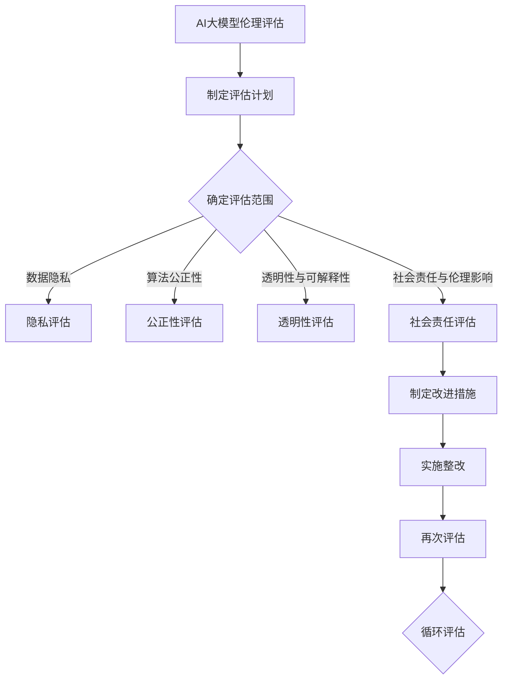
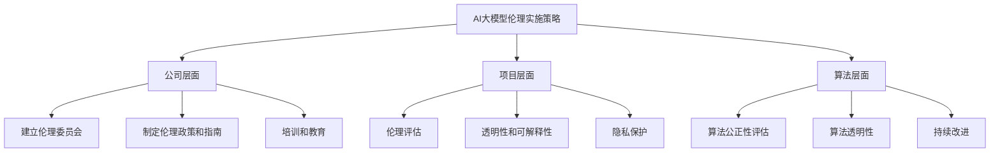

                 

### 文章标题

在当今快速发展的技术时代，人工智能（AI）已成为推动社会进步和变革的重要力量。然而，随着AI技术的日益成熟和广泛应用，其带来的伦理问题也逐渐凸显。AI大模型伦理作为AI技术发展中的一个重要领域，关乎社会公平、隐私保护、透明性和可解释性等多个方面。本文旨在探讨AI大模型伦理的核心概念、案例分析、实施策略以及未来展望，为读者提供全面且深入的AI大模型伦理知识。

### 关键词

- AI大模型伦理
- 透明性
- 可解释性
- 公平性
- 隐私保护
- 社会不平等
- 算法偏见
- 伦理规范

### 摘要

本文首先介绍了AI大模型伦理的基本概念和核心原则，分析了AI大模型伦理的研究背景与现状。随后，通过具体案例，深入探讨了AI技术在自动驾驶、医疗诊断和招聘等领域的伦理问题。文章进一步提出了AI大模型伦理的实施策略，包括公司层面、项目层面和算法层面的策略，以及伦理评估、审计、教育和培训等方面的措施。最后，文章展望了AI大模型伦理的未来发展趋势，讨论了国际合作的重要性以及未来的研究方向。通过本文的探讨，希望为读者提供有益的思考和实践指导。

---

### 第一部分: AI大模型伦理基础

在探讨AI大模型伦理之前，我们首先需要理解AI大模型的基本概念和特点。AI大模型，也被称为大规模人工智能模型，是指通过深度学习技术训练的、具有巨大参数量和计算量的模型。这类模型在图像识别、自然语言处理、语音识别等领域展现了强大的能力，但同时也带来了许多伦理问题。

#### 1.1 AI大模型伦理概述

**1.1.1 AI大模型的伦理重要性**

随着AI技术的不断发展，其应用范围日益广泛，从自动驾驶、医疗诊断到金融分析、智慧城市等各个领域。AI大模型在这些领域的应用，不仅改变了我们的生活方式，也对社会结构和价值观产生了深远影响。因此，AI大模型伦理的重要性愈发凸显。

首先，AI大模型的广泛应用使得其在决策过程中扮演着越来越重要的角色，这直接关系到个人的隐私、权益和利益。其次，AI大模型的透明性和可解释性较低，这使得人们对其决策过程缺乏信任，甚至可能产生误解和偏见。最后，AI大模型的训练数据可能包含偏见，导致其决策存在不公平性和歧视性，进而加剧社会不平等。

**1.1.2 AI大模型伦理的核心原则**

AI大模型伦理的核心原则主要包括透明性、可解释性、公平性和隐私保护。

- **透明性**：AI大模型决策过程的透明性是建立信任的基础。用户应有权了解AI大模型的决策过程、输入数据和输出结果。
- **可解释性**：AI大模型的可解释性有助于用户理解和信任模型，尤其是在涉及重要决策时，如医疗诊断、金融风险评估等。
- **公平性**：AI大模型应确保对所有用户公平，避免因数据偏见导致的不公平性或歧视。
- **隐私保护**：AI大模型在使用和处理个人数据时，应严格保护用户的隐私，防止数据泄露和滥用。

**1.1.3 AI大模型伦理的研究背景与现状**

AI大模型伦理的研究始于对AI技术潜在风险的担忧。随着AI技术的迅速发展，人们开始关注其对社会伦理的影响。近年来，学术界和产业界纷纷开展了相关研究，试图建立一套完整的AI大模型伦理框架。

在国际层面，多个组织和机构发布了AI大模型伦理指南和规范，如欧盟的《通用数据保护条例》（GDPR）和美国的《人工智能伦理准则》。我国也发布了《新一代人工智能治理原则》等文件，旨在规范AI大模型的应用和发展。

然而，当前AI大模型伦理的研究仍面临许多挑战，如如何量化伦理指标、如何设计公平和可解释的算法等。这需要学术界和产业界共同努力，推动AI大模型伦理的研究和实践。

#### 1.2 AI大模型伦理的核心概念

**1.2.1 透明性**

透明性是AI大模型伦理的核心概念之一。它要求用户能够了解AI大模型的决策过程、输入数据和输出结果。透明性不仅有助于建立用户对AI大模型的信任，还能提高模型的可靠性和可信度。

实现AI大模型透明性的方法主要包括：
- **透明报告**：通过生成详细的报告，展示AI大模型的决策过程和依据。
- **可视化工具**：利用可视化工具，将复杂的决策过程和结果以用户友好的方式呈现。
- **可追溯性**：确保用户能够追溯AI大模型的训练数据来源和更新历史。

**1.2.2 可解释性**

可解释性是AI大模型伦理的另一重要概念。它要求用户能够理解和解释AI大模型的决策过程和结果。与透明性不同，可解释性更侧重于用户对模型的信任和理解。

提高AI大模型可解释性的方法包括：
- **模型解释工具**：开发专门的模型解释工具，帮助用户理解模型的决策过程。
- **决策路径可视化**：将AI大模型的决策路径和关键节点以可视化的形式展示。
- **变量权重分析**：分析模型中各个变量的权重和影响，帮助用户理解决策依据。

**1.2.3 公平性**

公平性是AI大模型伦理的核心原则之一。它要求AI大模型对所有用户公平，避免因数据偏见或算法设计不当导致的不公平性和歧视。

确保AI大模型公平性的方法包括：
- **数据清洗和预处理**：去除数据中的偏见和异常值，提高数据质量。
- **算法公正性评估**：对算法进行公正性评估，确保其不会加剧社会不平等。
- **多视角审查**：邀请来自不同背景和领域的专家对AI大模型进行审查，确保其公平性。

**1.2.4 隐私保护**

隐私保护是AI大模型伦理的关键问题之一。在AI大模型应用过程中，用户的数据隐私极易受到侵犯，可能导致数据泄露和滥用。

确保AI大模型隐私保护的方法包括：
- **数据加密**：对用户数据进行加密处理，防止数据泄露。
- **隐私保护算法**：采用隐私保护算法，如差分隐私，降低数据泄露风险。
- **隐私政策**：制定明确的隐私政策，告知用户其数据的收集、使用和保护方式。

#### 1.3 AI大模型伦理的主要挑战

尽管AI大模型伦理在理论和实践中取得了一定成果，但仍然面临许多挑战。

**1.3.1 数据隐私与隐私泄露**

数据隐私是AI大模型伦理的重要挑战之一。在AI大模型训练和应用过程中，用户数据可能被收集、存储和处理，这增加了数据泄露的风险。隐私泄露不仅侵犯用户权益，还可能导致严重的社会问题。

**1.3.2 社会不平等与算法偏见**

AI大模型的训练数据可能包含社会偏见，导致其决策结果存在不公平性和歧视性。这种偏见可能加剧社会不平等，影响社会稳定和公平。

**1.3.3 技术滥用与道德风险**

AI大模型具有强大的计算能力和决策能力，但也可能被滥用。例如，在招聘、金融和医疗等领域，AI大模型可能被用于歧视、欺诈和非法行为，带来严重的道德风险。

#### 1.4 国际AI大模型伦理规范

在国际层面，多个国家和组织发布了AI大模型伦理规范，为AI大模型的应用和发展提供了指导。

**1.4.1 国际伦理规范的发展历程**

AI大模型伦理规范的发展历程可以追溯到20世纪90年代。当时，随着AI技术的兴起，伦理问题逐渐受到关注。近年来，随着AI技术的广泛应用，伦理规范逐渐完善，形成了较为系统的框架。

**1.4.2 全球主要国家的伦理规范对比**

不同国家和地区的伦理规范存在差异，但都关注透明性、可解释性、公平性和隐私保护等方面。

- **欧盟**：欧盟发布了《通用数据保护条例》（GDPR），强调数据隐私保护和用户权益。
- **美国**：美国发布了《人工智能伦理准则》，强调公平性、透明性和可解释性。
- **中国**：中国发布了《新一代人工智能治理原则》，强调伦理原则和社会责任。

**1.4.3 我国AI大模型伦理规范现状与趋势**

我国在AI大模型伦理规范方面取得了一系列成果。目前，我国已经发布了《人工智能伦理规范》和《新一代人工智能治理原则》等文件，为AI大模型的应用和发展提供了指导。

未来，我国将继续加强AI大模型伦理规范的研究和制定，推动AI技术的健康发展。同时，我国也将积极参与国际AI大模型伦理合作，共同应对全球性伦理挑战。

---

通过本部分内容的介绍，我们对AI大模型伦理有了初步的认识。在接下来的部分，我们将通过具体案例深入探讨AI大模型伦理问题，并提出实施策略。敬请期待。

---

### 第一部分：AI大模型伦理基础

#### 1.1 AI大模型伦理概述

**1.1.1 AI大模型的伦理重要性**

AI大模型在现代技术生态中扮演着至关重要的角色，这不仅体现在它们对数据处理的卓越能力，还体现在它们在决策制定、预测和优化中的应用。随着AI技术的普及，AI大模型在医疗诊断、自动驾驶、金融分析、法律咨询、招聘等多个领域得到了广泛应用。这些应用不仅提高了效率，还改变了传统的工作方式和社会结构。然而，这些强大功能的同时也带来了伦理挑战，这些挑战在AI大模型伦理中得到了广泛关注。

AI大模型的伦理重要性体现在以下几个方面：

1. **隐私保护**：AI大模型通常依赖于大规模数据集进行训练，这些数据往往包含敏感的个人信息。如何保护这些隐私数据不受泄露和滥用是一个重大的伦理问题。
2. **公平性和无偏见**：AI大模型的决策可能受到训练数据中的偏见影响，导致不公平的决策。例如，在招聘和贷款审批中，偏见可能导致歧视某些群体。
3. **透明性和可解释性**：AI大模型往往被视为“黑箱”，其决策过程难以被外界理解和监督。这种不可解释性可能导致用户对AI模型的不信任，进而影响其应用效果。
4. **责任归属**：当AI大模型发生错误或造成损失时，如何界定责任和追究责任是一个复杂的问题。AI模型的开发者、使用者以及维护者都可能涉及其中。

**1.1.2 AI大模型伦理的核心原则**

AI大模型伦理的核心原则旨在确保AI技术应用的道德和合法合规性。这些原则包括但不限于以下四个方面：

1. **透明性**：AI大模型的决策过程应该是透明的，用户应该能够理解和追踪模型的输入、中间过程和输出。
2. **可解释性**：AI大模型应该设计成可解释的，使得用户能够理解模型的决策逻辑和依据。
3. **公平性**：AI大模型应当避免偏见和歧视，确保对所有用户公平对待。
4. **隐私保护**：AI大模型在处理用户数据时，应当采取有效的隐私保护措施，确保数据不被未经授权的访问和滥用。

**1.1.3 AI大模型伦理的研究背景与现状**

AI大模型伦理的研究始于对AI技术潜在风险的担忧，特别是在数据隐私、社会公平和模型透明性等方面。随着AI技术的不断进步和其应用的广泛普及，伦理问题变得更加紧迫。学术界的关注和产业界的实践推动了这一领域的发展。

目前，AI大模型伦理的研究现状主要体现在以下几个方面：

1. **理论框架**：研究人员正在构建AI大模型伦理的理论框架，包括原则、规范和标准。
2. **实践指南**：行业组织和学术机构发布了多个AI大模型伦理实践指南，为开发者和企业提供了具体的操作建议。
3. **政策法规**：许多国家和地区开始制定相关的政策和法规，以规范AI大模型的应用和治理。

然而，AI大模型伦理研究仍面临诸多挑战，如如何量化伦理指标、如何设计公平和可解释的算法、如何确保数据的隐私保护等。这些问题需要进一步的研究和探索。

#### 1.2 AI大模型伦理的核心概念

**1.2.1 透明性**

透明性是AI大模型伦理的核心概念之一，它要求AI大模型的决策过程和机制对外界是可访问和可理解的。透明性的重要性在于它能够增强用户对AI模型的信任，提高模型的可靠性和可信度。

实现AI大模型透明性的方法包括：

1. **披露模型细节**：开发者应该公开AI大模型的架构、算法和训练数据。
2. **生成解释性报告**：通过生成详细的解释性报告，用户可以了解模型的决策逻辑和依据。
3. **可视化工具**：利用可视化工具，将AI大模型的决策过程和结果以用户友好的方式呈现。

**1.2.2 可解释性**

可解释性是指AI大模型的决策过程和结果能够被用户理解和解释。可解释性对于提高用户的信任和接受度至关重要，尤其是在涉及重要决策的领域，如医疗诊断和金融风险评估。

提高AI大模型可解释性的方法包括：

1. **模型解释工具**：开发专门的解释工具，如SHAP（Shapley Additive Explanations）和LIME（Local Interpretable Model-agnostic Explanations）等。
2. **决策路径可视化**：通过图形化展示模型的决策路径和关键节点，使用户能够直观地理解决策过程。
3. **变量重要性分析**：分析模型中各个变量的相对重要性，帮助用户理解哪些因素对决策结果产生了关键影响。

**1.2.3 公平性**

公平性是AI大模型伦理的另一个关键原则，它要求模型对所有用户公平对待，避免因训练数据中的偏见而导致的不公正决策。

确保AI大模型公平性的方法包括：

1. **数据预处理**：在训练数据中去除偏见和异常值，进行平衡化处理。
2. **算法公正性评估**：对AI模型进行公正性评估，确保其不会加剧社会不平等。
3. **多视角审查**：邀请来自不同背景和领域的专家对模型进行审查，以确保其公平性。

**1.2.4 隐私保护**

隐私保护是AI大模型伦理中的重要问题，尤其是在涉及个人敏感信息的领域。保护用户隐私是确保AI大模型应用合法合规的基础。

确保AI大模型隐私保护的方法包括：

1. **数据加密**：对用户数据进行加密处理，防止数据泄露。
2. **差分隐私**：采用差分隐私算法，降低单个用户数据被识别的风险。
3. **隐私政策**：制定明确的隐私政策，告知用户其数据的收集、使用和保护方式。

#### 1.3 AI大模型伦理的主要挑战

尽管AI大模型伦理研究取得了一定进展，但在实际应用中仍面临诸多挑战。

**1.3.1 数据隐私与隐私泄露**

AI大模型通常依赖于大规模数据集进行训练，这些数据可能包含敏感的个人信息。如何保护这些数据不受泄露和滥用是一个重要的伦理问题。数据泄露不仅侵犯用户隐私，还可能导致严重的社会和经济后果。

**1.3.2 社会不平等与算法偏见**

AI大模型的训练数据可能包含社会偏见，导致其决策存在不公平性和歧视性。例如，在招聘、贷款审批和医疗诊断等领域，偏见可能导致某些群体被不公平对待，加剧社会不平等。

**1.3.3 技术滥用与道德风险**

AI大模型的强大计算能力和决策能力可能被滥用。例如，AI模型可能被用于进行网络欺诈、歧视性招聘和非法行为。这些滥用行为不仅违反伦理规范，还可能对社会造成严重影响。

**1.3.4 法律责任与责任归属**

当AI大模型发生错误或造成损失时，如何界定责任和追究责任是一个复杂的问题。涉及AI模型的开发者、使用者、维护者以及数据提供者等多个方面，如何明确责任归属是当前伦理研究的重要课题。

#### 1.4 国际AI大模型伦理规范

在国际层面，多个国家和组织制定了AI大模型伦理规范，为AI技术的应用和发展提供了指导。

**1.4.1 国际伦理规范的发展历程**

AI大模型伦理规范的发展历程可以追溯到20世纪90年代。当时，随着AI技术的兴起，伦理问题逐渐受到关注。近年来，随着AI技术的快速发展和广泛应用，伦理规范逐渐完善，形成了较为系统的框架。

**1.4.2 全球主要国家的伦理规范对比**

不同国家和地区的伦理规范存在差异，但都关注透明性、可解释性、公平性和隐私保护等方面。

- **欧盟**：欧盟发布了《通用数据保护条例》（GDPR），强调数据隐私保护和用户权益。
- **美国**：美国发布了《人工智能伦理准则》，强调公平性、透明性和可解释性。
- **中国**：中国发布了《新一代人工智能治理原则》，强调伦理原则和社会责任。

**1.4.3 我国AI大模型伦理规范现状与趋势**

我国在AI大模型伦理规范方面取得了一系列成果。目前，我国已经发布了《人工智能伦理规范》和《新一代人工智能治理原则》等文件，为AI大模型的应用和发展提供了指导。

未来，我国将继续加强AI大模型伦理规范的研究和制定，推动AI技术的健康发展。同时，我国也将积极参与国际AI大模型伦理合作，共同应对全球性伦理挑战。

---

通过本部分的介绍，我们对AI大模型伦理的重要性、核心原则、研究背景与现状以及主要挑战有了全面的了解。在接下来的部分，我们将通过具体案例深入探讨AI大模型伦理问题。敬请期待。

---

### 第二部分：AI大模型伦理案例分析

在深入探讨AI大模型伦理之前，通过具体案例进行分析是非常有必要的。这些案例不仅能够帮助读者理解AI大模型伦理的实际应用，还能揭示出在具体场景中可能出现的伦理困境。本部分将选取自动驾驶车辆、AI医疗诊断和AI招聘三个领域，分别探讨其中的伦理问题，并分析这些案例对AI大模型伦理的启示。

#### 2.1 案例分析概述

**2.1.1 案例选择标准**

在选取案例分析时，我们遵循以下标准：
1. **典型性**：案例必须具有代表性，能够反映AI大模型在不同领域的广泛应用。
2. **复杂性**：案例必须涉及多个伦理问题，包括透明性、可解释性、公平性和隐私保护等。
3. **实际影响**：案例应具有显著的社会影响，能够引发公众的关注和讨论。

**2.1.2 案例分析的目的与意义**

通过对这些案例的分析，我们旨在：
1. **揭示伦理困境**：通过具体案例，揭示AI大模型在实际应用中可能面临的伦理问题。
2. **提出解决方案**：针对案例中揭示的问题，探讨可行的解决方案和改进措施。
3. **增强伦理意识**：提高开发者、企业和公众对AI大模型伦理问题的认识，增强伦理意识。

#### 2.2 案例一：自动驾驶车辆伦理问题

**2.2.1 案例背景**

自动驾驶车辆是AI技术的典型应用之一，其在提高交通效率、减少交通事故和缓解交通拥堵等方面具有巨大潜力。然而，自动驾驶车辆的广泛应用也引发了一系列伦理问题。

**2.2.2 伦理问题分析**

1. **道德决策**：在自动驾驶车辆面临潜在危险时，例如需要选择牺牲司机或行人，如何做出道德决策成为一个伦理难题。不同的道德框架可能导致不同的决策结果。
2. **透明性和可解释性**：自动驾驶车辆的决策过程通常是黑箱式的，用户和监管机构难以理解其工作原理和决策逻辑。
3. **隐私保护**：自动驾驶车辆需要收集大量的环境数据和个人信息，如何保护这些数据不被滥用是一个关键问题。
4. **责任归属**：当自动驾驶车辆发生事故时，如何界定责任归属是一个复杂的问题。涉及车辆制造商、软件开发者、车主等多个方面。

**2.2.3 案例启示**

1. **道德决策框架**：需要建立一套统一的道德决策框架，指导自动驾驶车辆的道德决策。
2. **透明性和可解释性**：开发者应提高自动驾驶车辆的透明性和可解释性，通过可视化工具和解释性报告，让用户和监管机构了解其工作原理。
3. **隐私保护**：需要采用先进的隐私保护技术，如差分隐私，确保用户数据的安全。
4. **责任归属机制**：需要建立明确的责任归属机制，明确各方在自动驾驶车辆事故中的责任，以利于事故的赔偿和处理。

#### 2.3 案例二：AI医疗诊断伦理问题

**2.3.1 案例背景**

AI医疗诊断利用深度学习技术对医疗影像进行自动分析，辅助医生进行诊断。这一技术提高了诊断速度和准确性，但也带来了一系列伦理问题。

**2.3.2 伦理问题分析**

1. **准确性问题**：尽管AI医疗诊断具有高准确性，但仍然存在一定的误差。如何确保其诊断结果的准确性是一个重要问题。
2. **数据隐私**：AI医疗诊断需要处理大量的患者数据，如何保护患者隐私是一个关键问题。
3. **医生依赖性**：过度依赖AI医疗诊断可能导致医生失去判断力，影响医疗质量。
4. **经济不平等**：AI医疗诊断技术的普及可能加剧医疗资源的不平等分配。

**2.3.3 案例启示**

1. **诊断准确性**：需要建立严格的数据验证和测试流程，确保AI医疗诊断的准确性。
2. **数据隐私**：需要采用数据加密和隐私保护技术，确保患者数据不被泄露和滥用。
3. **医生培训**：需要加强对医生的AI技术培训，提高其对AI医疗诊断的理解和运用能力。
4. **资源分配**：需要通过政策手段，确保AI医疗诊断技术在资源匮乏地区也能得到应用，减少医疗资源的不平等。

#### 2.4 案例三：AI招聘歧视问题

**2.4.1 案例背景**

AI招聘系统通过分析求职者的简历和面试表现，自动筛选合适的候选人。然而，这种系统也可能存在歧视问题，加剧社会不平等。

**2.4.2 伦理问题分析**

1. **算法偏见**：AI招聘系统的训练数据可能包含社会偏见，导致其决策存在不公平性。例如，对某些性别、种族或年龄群体的歧视。
2. **透明性和可解释性**：AI招聘系统的决策过程通常是黑箱式的，求职者难以了解其被拒绝的原因。
3. **隐私问题**：AI招聘系统可能收集和处理求职者的敏感个人信息，如何保护这些信息不被滥用是一个关键问题。

**2.4.3 案例启示**

1. **算法公正性**：需要对AI招聘系统进行公正性评估，确保其不会加剧社会不平等。可以通过引入多样化的训练数据，消除算法中的偏见。
2. **透明性和可解释性**：开发者应提高AI招聘系统的透明性和可解释性，通过生成解释性报告，让求职者了解其被拒绝的原因。
3. **隐私保护**：需要采用数据加密和隐私保护技术，确保求职者个人信息不被泄露和滥用。
4. **社会监督**：需要建立社会监督机制，对AI招聘系统进行定期审查和评估，确保其公正性和透明性。

---

通过以上案例分析，我们可以看到AI大模型在自动驾驶、医疗诊断和招聘等领域中面临的伦理问题。这些问题不仅关系到技术的合法性和道德性，还直接影响到社会公平和公众信任。解决这些伦理问题需要多方面的努力，包括技术创新、政策制定和社会合作。在接下来的部分，我们将探讨AI大模型伦理的实施策略，以期为解决这些问题提供具体的实践指导。

---

### 第二部分：AI大模型伦理案例分析

在深入探讨AI大模型伦理之前，通过具体案例进行分析是非常有必要的。这些案例不仅能够帮助读者理解AI大模型伦理的实际应用，还能揭示出在具体场景中可能出现的伦理困境。本部分将选取自动驾驶车辆、AI医疗诊断和AI招聘三个领域，分别探讨其中的伦理问题，并分析这些案例对AI大模型伦理的启示。

#### 2.1 案例分析概述

**2.1.1 案例选择标准**

在选取案例分析时，我们遵循以下标准：
1. **典型性**：案例必须具有代表性，能够反映AI大模型在不同领域的广泛应用。
2. **复杂性**：案例必须涉及多个伦理问题，包括透明性、可解释性、公平性和隐私保护等。
3. **实际影响**：案例应具有显著的社会影响，能够引发公众的关注和讨论。

**2.1.2 案例分析的目的与意义**

通过对这些案例的分析，我们旨在：
1. **揭示伦理困境**：通过具体案例，揭示AI大模型在实际应用中可能面临的伦理问题。
2. **提出解决方案**：针对案例中揭示的问题，探讨可行的解决方案和改进措施。
3. **增强伦理意识**：提高开发者、企业和公众对AI大模型伦理问题的认识，增强伦理意识。

#### 2.2 案例一：自动驾驶车辆伦理问题

**2.2.1 案例背景**

自动驾驶车辆是AI技术的典型应用之一，其在提高交通效率、减少交通事故和缓解交通拥堵等方面具有巨大潜力。然而，自动驾驶车辆的广泛应用也引发了一系列伦理问题。

**2.2.2 伦理问题分析**

1. **道德决策**：在自动驾驶车辆面临潜在危险时，例如需要选择牺牲司机或行人，如何做出道德决策成为一个伦理难题。不同的道德框架可能导致不同的决策结果。
2. **透明性和可解释性**：自动驾驶车辆的决策过程通常是黑箱式的，用户和监管机构难以理解其工作原理和决策逻辑。
3. **隐私保护**：自动驾驶车辆需要收集大量的环境数据和个人信息，如何保护这些数据不被滥用是一个关键问题。
4. **责任归属**：当自动驾驶车辆发生事故时，如何界定责任归属是一个复杂的问题。涉及车辆制造商、软件开发者、车主等多个方面。

**2.2.3 案例启示**

1. **道德决策框架**：需要建立一套统一的道德决策框架，指导自动驾驶车辆的道德决策。
2. **透明性和可解释性**：开发者应提高自动驾驶车辆的透明性和可解释性，通过可视化工具和解释性报告，让用户和监管机构了解其工作原理。
3. **隐私保护**：需要采用先进的隐私保护技术，如差分隐私，确保用户数据的安全。
4. **责任归属机制**：需要建立明确的责任归属机制，明确各方在自动驾驶车辆事故中的责任，以利于事故的赔偿和处理。

#### 2.3 案例二：AI医疗诊断伦理问题

**2.3.1 案例背景**

AI医疗诊断利用深度学习技术对医疗影像进行自动分析，辅助医生进行诊断。这一技术提高了诊断速度和准确性，但也带来了一系列伦理问题。

**2.3.2 伦理问题分析**

1. **准确性问题**：尽管AI医疗诊断具有高准确性，但仍然存在一定的误差。如何确保其诊断结果的准确性是一个重要问题。
2. **数据隐私**：AI医疗诊断需要处理大量的患者数据，如何保护患者隐私是一个关键问题。
3. **医生依赖性**：过度依赖AI医疗诊断可能导致医生失去判断力，影响医疗质量。
4. **经济不平等**：AI医疗诊断技术的普及可能加剧医疗资源的不平等分配。

**2.3.3 案例启示**

1. **诊断准确性**：需要建立严格的数据验证和测试流程，确保AI医疗诊断的准确性。
2. **数据隐私**：需要采用数据加密和隐私保护技术，确保患者数据不被泄露和滥用。
3. **医生培训**：需要加强对医生的AI技术培训，提高其对AI医疗诊断的理解和运用能力。
4. **资源分配**：需要通过政策手段，确保AI医疗诊断技术在资源匮乏地区也能得到应用，减少医疗资源的不平等。

#### 2.4 案例三：AI招聘歧视问题

**2.4.1 案例背景**

AI招聘系统通过分析求职者的简历和面试表现，自动筛选合适的候选人。然而，这种系统也可能存在歧视问题，加剧社会不平等。

**2.4.2 伦理问题分析**

1. **算法偏见**：AI招聘系统的训练数据可能包含社会偏见，导致其决策存在不公平性。例如，对某些性别、种族或年龄群体的歧视。
2. **透明性和可解释性**：AI招聘系统的决策过程通常是黑箱式的，求职者难以了解其被拒绝的原因。
3. **隐私问题**：AI招聘系统可能收集和处理求职者的敏感个人信息，如何保护这些信息不被滥用是一个关键问题。

**2.4.3 案例启示**

1. **算法公正性**：需要对AI招聘系统进行公正性评估，确保其不会加剧社会不平等。可以通过引入多样化的训练数据，消除算法中的偏见。
2. **透明性和可解释性**：开发者应提高AI招聘系统的透明性和可解释性，通过生成解释性报告，让求职者了解其被拒绝的原因。
3. **隐私保护**：需要采用数据加密和隐私保护技术，确保求职者个人信息不被泄露和滥用。
4. **社会监督**：需要建立社会监督机制，对AI招聘系统进行定期审查和评估，确保其公正性和透明性。

---

通过以上案例分析，我们可以看到AI大模型在自动驾驶、医疗诊断和招聘等领域中面临的伦理问题。这些问题不仅关系到技术的合法性和道德性，还直接影响到社会公平和公众信任。解决这些伦理问题需要多方面的努力，包括技术创新、政策制定和社会合作。在接下来的部分，我们将探讨AI大模型伦理的实施策略，以期为解决这些问题提供具体的实践指导。

---

### 第二部分：AI大模型伦理案例分析

在深入探讨AI大模型伦理之前，通过具体案例进行分析是非常有必要的。这些案例不仅能够帮助读者理解AI大模型伦理的实际应用，还能揭示出在具体场景中可能出现的伦理困境。本部分将选取自动驾驶车辆、AI医疗诊断和AI招聘三个领域，分别探讨其中的伦理问题，并分析这些案例对AI大模型伦理的启示。

#### 2.1 案例分析概述

**2.1.1 案例选择标准**

在选取案例分析时，我们遵循以下标准：
1. **典型性**：案例必须具有代表性，能够反映AI大模型在不同领域的广泛应用。
2. **复杂性**：案例必须涉及多个伦理问题，包括透明性、可解释性、公平性和隐私保护等。
3. **实际影响**：案例应具有显著的社会影响，能够引发公众的关注和讨论。

**2.1.2 案例分析的目的与意义**

通过对这些案例的分析，我们旨在：
1. **揭示伦理困境**：通过具体案例，揭示AI大模型在实际应用中可能面临的伦理问题。
2. **提出解决方案**：针对案例中揭示的问题，探讨可行的解决方案和改进措施。
3. **增强伦理意识**：提高开发者、企业和公众对AI大模型伦理问题的认识，增强伦理意识。

#### 2.2 案例一：自动驾驶车辆伦理问题

**2.2.1 案例背景**

自动驾驶车辆是AI技术的典型应用之一，其在提高交通效率、减少交通事故和缓解交通拥堵等方面具有巨大潜力。然而，自动驾驶车辆的广泛应用也引发了一系列伦理问题。

**2.2.2 伦理问题分析**

1. **道德决策**：在自动驾驶车辆面临潜在危险时，例如需要选择牺牲司机或行人，如何做出道德决策成为一个伦理难题。不同的道德框架可能导致不同的决策结果。
2. **透明性和可解释性**：自动驾驶车辆的决策过程通常是黑箱式的，用户和监管机构难以理解其工作原理和决策逻辑。
3. **隐私保护**：自动驾驶车辆需要收集大量的环境数据和个人信息，如何保护这些数据不被滥用是一个关键问题。
4. **责任归属**：当自动驾驶车辆发生事故时，如何界定责任归属是一个复杂的问题。涉及车辆制造商、软件开发者、车主等多个方面。

**2.2.3 案例启示**

1. **道德决策框架**：需要建立一套统一的道德决策框架，指导自动驾驶车辆的道德决策。
2. **透明性和可解释性**：开发者应提高自动驾驶车辆的透明性和可解释性，通过可视化工具和解释性报告，让用户和监管机构了解其工作原理。
3. **隐私保护**：需要采用先进的隐私保护技术，如差分隐私，确保用户数据的安全。
4. **责任归属机制**：需要建立明确的责任归属机制，明确各方在自动驾驶车辆事故中的责任，以利于事故的赔偿和处理。

#### 2.3 案例二：AI医疗诊断伦理问题

**2.3.1 案例背景**

AI医疗诊断利用深度学习技术对医疗影像进行自动分析，辅助医生进行诊断。这一技术提高了诊断速度和准确性，但也带来了一系列伦理问题。

**2.3.2 伦理问题分析**

1. **准确性问题**：尽管AI医疗诊断具有高准确性，但仍然存在一定的误差。如何确保其诊断结果的准确性是一个重要问题。
2. **数据隐私**：AI医疗诊断需要处理大量的患者数据，如何保护患者隐私是一个关键问题。
3. **医生依赖性**：过度依赖AI医疗诊断可能导致医生失去判断力，影响医疗质量。
4. **经济不平等**：AI医疗诊断技术的普及可能加剧医疗资源的不平等分配。

**2.3.3 案例启示**

1. **诊断准确性**：需要建立严格的数据验证和测试流程，确保AI医疗诊断的准确性。
2. **数据隐私**：需要采用数据加密和隐私保护技术，确保患者数据不被泄露和滥用。
3. **医生培训**：需要加强对医生的AI技术培训，提高其对AI医疗诊断的理解和运用能力。
4. **资源分配**：需要通过政策手段，确保AI医疗诊断技术在资源匮乏地区也能得到应用，减少医疗资源的不平等。

#### 2.4 案例三：AI招聘歧视问题

**2.4.1 案例背景**

AI招聘系统通过分析求职者的简历和面试表现，自动筛选合适的候选人。然而，这种系统也可能存在歧视问题，加剧社会不平等。

**2.4.2 伦理问题分析**

1. **算法偏见**：AI招聘系统的训练数据可能包含社会偏见，导致其决策存在不公平性。例如，对某些性别、种族或年龄群体的歧视。
2. **透明性和可解释性**：AI招聘系统的决策过程通常是黑箱式的，求职者难以了解其被拒绝的原因。
3. **隐私问题**：AI招聘系统可能收集和处理求职者的敏感个人信息，如何保护这些信息不被滥用是一个关键问题。

**2.4.3 案例启示**

1. **算法公正性**：需要对AI招聘系统进行公正性评估，确保其不会加剧社会不平等。可以通过引入多样化的训练数据，消除算法中的偏见。
2. **透明性和可解释性**：开发者应提高AI招聘系统的透明性和可解释性，通过生成解释性报告，让求职者了解其被拒绝的原因。
3. **隐私保护**：需要采用数据加密和隐私保护技术，确保求职者个人信息不被泄露和滥用。
4. **社会监督**：需要建立社会监督机制，对AI招聘系统进行定期审查和评估，确保其公正性和透明性。

---

通过以上案例分析，我们可以看到AI大模型在自动驾驶、医疗诊断和招聘等领域中面临的伦理问题。这些问题不仅关系到技术的合法性和道德性，还直接影响到社会公平和公众信任。解决这些伦理问题需要多方面的努力，包括技术创新、政策制定和社会合作。在接下来的部分，我们将探讨AI大模型伦理的实施策略，以期为解决这些问题提供具体的实践指导。

---

### 第三部分：AI大模型伦理实施策略

在前两部分中，我们详细探讨了AI大模型伦理的核心概念和典型案例，揭示了AI大模型在自动驾驶、医疗诊断和招聘等领域中面临的伦理挑战。为了解决这些问题，我们需要制定切实可行的AI大模型伦理实施策略，从公司层面、项目层面和算法层面出发，确保AI大模型的应用符合道德和伦理标准。以下将详细介绍这些实施策略。

#### 3.1 AI大模型伦理实施原则

**3.1.1 公司层面的伦理实施策略**

公司在AI大模型的应用中扮演着关键角色，因此必须在公司层面制定一套全面的伦理实施策略。这些策略包括：

1. **建立伦理委员会**：公司应成立专门的伦理委员会，负责监督和评估AI大模型的应用是否符合伦理标准。伦理委员会应由来自不同部门和背景的专家组成，以确保广泛性和独立性。
2. **制定伦理政策和指南**：公司应制定明确的伦理政策和指南，涵盖数据隐私、公平性、透明性等方面。这些政策和指南应成为公司内部规章制度的一部分，确保全体员工遵守。
3. **培训和教育**：公司应对员工进行定期培训和教育，提高其AI大模型伦理意识。培训内容应包括伦理原则、案例分析、法律法规等，帮助员工理解和应对AI大模型应用中的伦理问题。

**3.1.2 项目层面的伦理实施策略**

在项目层面，确保AI大模型应用符合伦理标准至关重要。以下是一些关键措施：

1. **伦理评估**：在项目启动阶段，进行全面的伦理评估，识别潜在伦理风险。评估应包括数据收集、模型训练、模型应用等各个环节。
2. **透明性和可解释性**：项目团队应确保AI大模型的决策过程透明和可解释。可以通过生成解释性报告、可视化工具等方式，让用户和监管机构了解模型的工作原理和决策逻辑。
3. **隐私保护**：项目团队应采取有效的隐私保护措施，确保用户数据的安全。可以使用数据加密、差分隐私等技术手段，降低数据泄露风险。

**3.1.3 算法层面的伦理实施策略**

算法层面的伦理实施策略旨在确保AI大模型的设计和开发符合道德标准。以下是一些关键措施：

1. **算法公正性评估**：对AI大模型进行公正性评估，确保其不会加剧社会不平等和歧视。可以使用公平性指标、多元评估方法等，对模型进行综合评估。
2. **算法透明性**：提高算法的透明性，使得算法的开发过程和决策逻辑可以被审查和验证。可以通过代码审查、模型解释工具等方式，增强算法的透明性。
3. **持续改进**：算法团队应持续监控和改进AI大模型，确保其应用符合最新的伦理标准。可以通过定期更新算法、引入多样化数据等方式，提高模型的公平性和可解释性。

#### 3.2 AI大模型伦理评估与审计

**3.2.1 伦理评估的方法与工具**

伦理评估是确保AI大模型应用符合伦理标准的重要手段。以下是一些常用的方法和工具：

1. **伦理评估框架**：建立一套全面的伦理评估框架，涵盖透明性、可解释性、公平性、隐私保护等方面。可以使用标准的评估指标，如Kolmogorov-Smirnov测试、平衡性分析等，对模型进行评估。
2. **专家评审**：邀请来自不同领域的专家对AI大模型进行评审，评估其是否符合伦理标准。专家评审可以提供多样化的视角，有助于识别潜在问题。
3. **用户反馈**：收集用户对AI大模型应用的反馈，了解其在实际应用中的表现。用户反馈可以帮助发现潜在的问题和改进方向。

**3.2.2 伦理审计的流程与标准**

伦理审计是对AI大模型应用过程进行系统审查和评估的过程。以下是一个典型的伦理审计流程：

1. **审计计划**：制定审计计划，明确审计范围、目标和标准。审计计划应包括审计时间表、人员安排和审计方法等。
2. **现场审计**：进行现场审计，检查AI大模型的应用过程是否符合伦理标准和规范。审计人员可以查阅相关文档、观察操作流程，与相关人员交流等。
3. **审计报告**：编写审计报告，总结审计发现和评估结果。审计报告应包括审计发现、评估结果、改进建议等，供管理层决策参考。
4. **整改措施**：根据审计报告，制定整改措施，确保AI大模型应用符合伦理标准。整改措施应包括具体操作流程、责任分工和时间表等。

**3.2.3 伦理评估与审计的案例分析**

为了更好地理解伦理评估和审计的过程，以下是一个具体的案例分析：

**案例：某公司AI招聘系统的伦理评估与审计**

1. **伦理评估**：某公司开发了一款AI招聘系统，用于自动筛选合适的候选人。在项目启动阶段，公司进行了全面的伦理评估，包括数据隐私、算法公正性、透明性等方面。评估结果显示，系统在数据隐私和算法公正性方面存在一定问题，需要进一步改进。

2. **伦理审计**：公司随后进行了伦理审计，发现AI招聘系统的决策过程存在黑箱现象，用户难以了解其被拒绝的原因。此外，系统在处理求职者数据时，存在一定的隐私泄露风险。

3. **整改措施**：根据伦理评估和审计结果，公司采取了以下整改措施：
   - 引入数据加密和隐私保护技术，确保求职者数据的安全。
   - 开发模型解释工具，通过可视化方式，让用户了解其被拒绝的原因。
   - 对算法进行公正性评估，消除训练数据中的偏见。

通过这一案例，我们可以看到伦理评估和审计在确保AI大模型应用符合伦理标准方面的重要作用。同时，也展示了如何通过改进措施，解决AI大模型应用中的伦理问题。

#### 3.3 AI大模型伦理教育与培训

**3.3.1 伦理教育的重要性**

伦理教育是培养AI大模型开发者、使用者和监管者伦理意识的关键环节。通过系统化的伦理教育，可以提高相关人员的伦理素养和判断力，确保AI大模型的应用符合道德标准。

**3.3.2 伦理培训的内容与形式**

伦理培训的内容应包括但不限于以下几个方面：

1. **伦理原则与案例**：介绍AI大模型伦理的基本原则，如透明性、可解释性、公平性和隐私保护等。通过案例分析，让学员了解伦理问题在实际应用中的表现和影响。
2. **法律法规与政策**：介绍相关的法律法规和政策，如《通用数据保护条例》（GDPR）、《人工智能伦理准则》等。让学员了解法律和政策的框架，确保AI大模型应用符合法规要求。
3. **实践技能**：教授学员如何识别和解决AI大模型应用中的伦理问题，包括伦理评估、模型解释、隐私保护等。通过实践操作，提高学员的实际操作能力。

伦理培训的形式可以多样化，包括：

1. **课堂培训**：通过集中授课，系统地讲解AI大模型伦理相关知识。
2. **在线课程**：利用互联网平台，提供灵活的学习方式，方便学员随时学习。
3. **案例研讨**：组织案例研讨会，通过小组讨论和角色扮演，深入分析案例中的伦理问题。
4. **实践项目**：安排学员参与实际的AI大模型项目，进行伦理实践，提高实战能力。

**3.3.3 伦理教育的案例分析**

为了更好地理解伦理教育的效果，以下是一个具体的案例分析：

**案例：某公司的AI伦理培训项目**

某公司在引入AI大模型技术后，意识到伦理教育的重要性，于是开展了一系列AI伦理培训项目。培训项目包括以下内容：

1. **课堂培训**：邀请伦理学教授和行业专家进行授课，讲解AI大模型伦理的基本原则和实践方法。
2. **在线课程**：公司利用内部学习平台，提供一系列AI伦理在线课程，涵盖伦理原则、法律法规、案例研讨等方面。
3. **案例研讨**：组织多个案例研讨小组，针对实际项目中遇到的伦理问题，进行深入讨论和解决方案的探索。
4. **实践项目**：公司安排学员参与AI大模型项目的开发和评估，通过实践操作，提高其实际解决问题的能力。

通过这一系列培训项目，公司员工的AI大模型伦理意识得到了显著提升，项目中的伦理问题得到了有效解决，为公司AI技术的健康发展奠定了基础。

#### 3.4 AI大模型伦理政策与法规

**3.4.1 我国AI大模型伦理政策的现状**

我国在AI大模型伦理政策方面取得了一系列成果。政府发布了《新一代人工智能治理原则》等文件，明确提出了AI大模型伦理的要求和原则。这些政策旨在规范AI大模型的应用和发展，确保其符合道德和伦理标准。

**3.4.2 国际AI大模型伦理法规对比**

国际上，多个国家和地区也发布了相关的AI大模型伦理法规，如欧盟的《通用数据保护条例》（GDPR）和美国的《人工智能伦理准则》等。这些法规在透明性、可解释性、公平性和隐私保护等方面提出了具体要求，为AI大模型的应用提供了法律依据。

**3.4.3 我国AI大模型伦理法规的展望**

未来，我国将继续加强AI大模型伦理法规的研究和制定，推动AI技术的健康发展。一方面，将进一步完善现有的政策法规，提高其可操作性和执行力度。另一方面，将积极参与国际AI大模型伦理法规的制定和合作，推动全球AI大模型伦理的一致性和协调性。

---

通过本部分的探讨，我们提出了一系列AI大模型伦理的实施策略，包括公司层面、项目层面和算法层面的措施，以及伦理评估、审计、教育和培训等方面的内容。这些策略旨在确保AI大模型的应用符合道德和伦理标准，促进AI技术的健康发展和广泛应用。在接下来的部分，我们将对AI大模型伦理的未来进行展望，探讨其发展趋势和面临的挑战。敬请期待。

---

### 第三部分：AI大模型伦理实施策略

在前两部分中，我们详细探讨了AI大模型伦理的核心概念和典型案例，揭示了AI大模型在自动驾驶、医疗诊断和招聘等领域中面临的伦理挑战。为了解决这些问题，我们需要制定切实可行的AI大模型伦理实施策略，从公司层面、项目层面和算法层面出发，确保AI大模型的应用符合道德和伦理标准。以下将详细介绍这些实施策略。

#### 3.1 AI大模型伦理实施原则

**3.1.1 公司层面的伦理实施策略**

公司在AI大模型的应用中扮演着关键角色，因此必须在公司层面制定一套全面的伦理实施策略。这些策略包括：

1. **建立伦理委员会**：公司应成立专门的伦理委员会，负责监督和评估AI大模型的应用是否符合伦理标准。伦理委员会应由来自不同部门和背景的专家组成，以确保广泛性和独立性。
2. **制定伦理政策和指南**：公司应制定明确的伦理政策和指南，涵盖数据隐私、公平性、透明性等方面。这些政策和指南应成为公司内部规章制度的一部分，确保全体员工遵守。
3. **培训和教育**：公司应对员工进行定期培训和教育，提高其AI大模型伦理意识。培训内容应包括伦理原则、案例分析、法律法规等，帮助员工理解和应对AI大模型应用中的伦理问题。

**3.1.2 项目层面的伦理实施策略**

在项目层面，确保AI大模型应用符合伦理标准至关重要。以下是一些关键措施：

1. **伦理评估**：在项目启动阶段，进行全面的伦理评估，识别潜在伦理风险。评估应包括数据收集、模型训练、模型应用等各个环节。
2. **透明性和可解释性**：项目团队应确保AI大模型的决策过程透明和可解释。可以通过生成解释性报告、可视化工具等方式，让用户和监管机构了解模型的工作原理和决策逻辑。
3. **隐私保护**：项目团队应采取有效的隐私保护措施，确保用户数据的安全。可以使用数据加密、差分隐私等技术手段，降低数据泄露风险。

**3.1.3 算法层面的伦理实施策略**

算法层面的伦理实施策略旨在确保AI大模型的设计和开发符合道德标准。以下是一些关键措施：

1. **算法公正性评估**：对AI大模型进行公正性评估，确保其不会加剧社会不平等和歧视。可以使用公平性指标、多元评估方法等，对模型进行综合评估。
2. **算法透明性**：提高算法的透明性，使得算法的开发过程和决策逻辑可以被审查和验证。可以通过代码审查、模型解释工具等方式，增强算法的透明性。
3. **持续改进**：算法团队应持续监控和改进AI大模型，确保其应用符合最新的伦理标准。可以通过定期更新算法、引入多样化数据等方式，提高模型的公平性和可解释性。

#### 3.2 AI大模型伦理评估与审计

**3.2.1 伦理评估的方法与工具**

伦理评估是确保AI大模型应用符合伦理标准的重要手段。以下是一些常用的方法和工具：

1. **伦理评估框架**：建立一套全面的伦理评估框架，涵盖透明性、可解释性、公平性、隐私保护等方面。可以使用标准的评估指标，如Kolmogorov-Smirnov测试、平衡性分析等，对模型进行评估。
2. **专家评审**：邀请来自不同领域的专家对AI大模型进行评审，评估其是否符合伦理标准。专家评审可以提供多样化的视角，有助于识别潜在问题。
3. **用户反馈**：收集用户对AI大模型应用的反馈，了解其在实际应用中的表现。用户反馈可以帮助发现潜在的问题和改进方向。

**3.2.2 伦理审计的流程与标准**

伦理审计是对AI大模型应用过程进行系统审查和评估的过程。以下是一个典型的伦理审计流程：

1. **审计计划**：制定审计计划，明确审计范围、目标和标准。审计计划应包括审计时间表、人员安排和审计方法等。
2. **现场审计**：进行现场审计，检查AI大模型的应用过程是否符合伦理标准和规范。审计人员可以查阅相关文档、观察操作流程，与相关人员交流等。
3. **审计报告**：编写审计报告，总结审计发现和评估结果。审计报告应包括审计发现、评估结果、改进建议等，供管理层决策参考。
4. **整改措施**：根据审计报告，制定整改措施，确保AI大模型应用符合伦理标准。整改措施应包括具体操作流程、责任分工和时间表等。

**3.2.3 伦理评估与审计的案例分析**

为了更好地理解伦理评估和审计的过程，以下是一个具体的案例分析：

**案例：某公司AI招聘系统的伦理评估与审计**

1. **伦理评估**：某公司开发了一款AI招聘系统，用于自动筛选合适的候选人。在项目启动阶段，公司进行了全面的伦理评估，包括数据隐私、算法公正性、透明性等方面。评估结果显示，系统在数据隐私和算法公正性方面存在一定问题，需要进一步改进。

2. **伦理审计**：公司随后进行了伦理审计，发现AI招聘系统的决策过程存在黑箱现象，用户难以了解其被拒绝的原因。此外，系统在处理求职者数据时，存在一定的隐私泄露风险。

3. **整改措施**：根据伦理评估和审计结果，公司采取了以下整改措施：
   - 引入数据加密和隐私保护技术，确保求职者数据的安全。
   - 开发模型解释工具，通过可视化方式，让用户了解其被拒绝的原因。
   - 对算法进行公正性评估，消除训练数据中的偏见。

通过这一案例，我们可以看到伦理评估和审计在确保AI大模型应用符合伦理标准方面的重要作用。同时，也展示了如何通过改进措施，解决AI大模型应用中的伦理问题。

#### 3.3 AI大模型伦理教育与培训

**3.3.1 伦理教育的重要性**

伦理教育是培养AI大模型开发者、使用者和监管者伦理意识的关键环节。通过系统化的伦理教育，可以提高相关人员的伦理素养和判断力，确保AI大模型的应用符合道德标准。

**3.3.2 伦理培训的内容与形式**

伦理培训的内容应包括但不限于以下几个方面：

1. **伦理原则与案例**：介绍AI大模型伦理的基本原则，如透明性、可解释性、公平性和隐私保护等。通过案例分析，让学员了解伦理问题在实际应用中的表现和影响。
2. **法律法规与政策**：介绍相关的法律法规和政策，如《通用数据保护条例》（GDPR）、《人工智能伦理准则》等。让学员了解法律和政策的框架，确保AI大模型应用符合法规要求。
3. **实践技能**：教授学员如何识别和解决AI大模型应用中的伦理问题，包括伦理评估、模型解释、隐私保护等。通过实践操作，提高学员的实际操作能力。

伦理培训的形式可以多样化，包括：

1. **课堂培训**：通过集中授课，系统地讲解AI大模型伦理相关知识。
2. **在线课程**：利用互联网平台，提供灵活的学习方式，方便学员随时学习。
3. **案例研讨**：组织案例研讨会，通过小组讨论和角色扮演，深入分析案例中的伦理问题。
4. **实践项目**：安排学员参与实际的AI大模型项目，进行伦理实践，提高实战能力。

**3.3.3 伦理教育的案例分析**

为了更好地理解伦理教育的效果，以下是一个具体的案例分析：

**案例：某公司的AI伦理培训项目**

某公司在引入AI大模型技术后，意识到伦理教育的重要性，于是开展了一系列AI伦理培训项目。培训项目包括以下内容：

1. **课堂培训**：邀请伦理学教授和行业专家进行授课，讲解AI大模型伦理的基本原则和实践方法。
2. **在线课程**：公司利用内部学习平台，提供一系列AI伦理在线课程，涵盖伦理原则、法律法规、案例研讨等方面。
3. **案例研讨**：组织多个案例研讨小组，针对实际项目中遇到的伦理问题，进行深入讨论和解决方案的探索。
4. **实践项目**：公司安排学员参与AI大模型项目的开发和评估，通过实践操作，提高其实际解决问题的能力。

通过这一系列培训项目，公司员工的AI大模型伦理意识得到了显著提升，项目中的伦理问题得到了有效解决，为公司AI技术的健康发展奠定了基础。

#### 3.4 AI大模型伦理政策与法规

**3.4.1 我国AI大模型伦理政策的现状**

我国在AI大模型伦理政策方面取得了一系列成果。政府发布了《新一代人工智能治理原则》等文件，明确提出了AI大模型伦理的要求和原则。这些政策旨在规范AI大模型的应用和发展，确保其符合道德和伦理标准。

**3.4.2 国际AI大模型伦理法规对比**

国际上，多个国家和地区也发布了相关的AI大模型伦理法规，如欧盟的《通用数据保护条例》（GDPR）和美国的《人工智能伦理准则》等。这些法规在透明性、可解释性、公平性和隐私保护等方面提出了具体要求，为AI大模型的应用提供了法律依据。

**3.4.3 我国AI大模型伦理法规的展望**

未来，我国将继续加强AI大模型伦理法规的研究和制定，推动AI技术的健康发展。一方面，将进一步完善现有的政策法规，提高其可操作性和执行力度。另一方面，将积极参与国际AI大模型伦理法规的制定和合作，推动全球AI大模型伦理的一致性和协调性。

---

通过本部分的探讨，我们提出了一系列AI大模型伦理的实施策略，包括公司层面、项目层面和算法层面的措施，以及伦理评估、审计、教育和培训等方面的内容。这些策略旨在确保AI大模型的应用符合道德和伦理标准，促进AI技术的健康发展和广泛应用。在接下来的部分，我们将对AI大模型伦理的未来进行展望，探讨其发展趋势和面临的挑战。敬请期待。

---

### 第四部分：AI大模型伦理的未来展望

随着人工智能技术的飞速发展，AI大模型在各个领域的应用日益广泛，其对社会的影响也越来越深远。未来，AI大模型伦理将面临诸多新的挑战和发展趋势，这需要我们进行深入探讨和前瞻性思考。

#### 4.1 AI大模型伦理的发展趋势

**4.1.1 技术进步带来的伦理挑战**

随着AI技术的不断进步，AI大模型的能力将越来越强大，其在医疗、金融、教育、交通等领域的应用也将更加深入。然而，这些技术进步也将带来新的伦理挑战：

1. **增强现实与隐私保护**：随着增强现实（AR）和虚拟现实（VR）技术的发展，AI大模型将能够更深入地介入用户的个人生活。如何在保障用户隐私的同时，充分利用AI大模型的优势，将成为一个重要的伦理问题。
2. **人工智能自主性**：随着人工智能的自主性不断提高，如何确保AI大模型在决策过程中保持道德和伦理的约束，防止其滥用自主性，是一个亟待解决的问题。
3. **跨界融合与伦理协调**：AI大模型与其他技术的融合，如生物技术、网络安全等，将带来新的伦理挑战。如何在确保各领域技术协调发展的同时，保持伦理的一致性，需要跨学科、跨领域的合作。

**4.1.2 社会需求对伦理规范的影响**

随着社会对AI大模型应用的需求不断增加，伦理规范也在不断演变和更新。未来，社会需求将对AI大模型伦理规范产生以下影响：

1. **多元文化背景下的伦理适应性**：随着全球化的加深，不同文化背景下的AI大模型应用将面临不同的伦理挑战。如何确保AI大模型在多元文化背景下保持伦理适应性，是一个重要的课题。
2. **可持续发展与伦理平衡**：在追求经济效益的同时，如何确保AI大模型应用符合可持续发展原则，实现经济效益和社会效益的平衡，是一个重要的伦理问题。
3. **公众参与与透明性**：公众对AI大模型应用的关注度不断提高，如何通过提高透明性和公众参与度，增强公众对AI大模型伦理规范的信任，是一个亟待解决的社会问题。

**4.1.3 伦理理论与实践的互动**

伦理理论的发展需要与实际应用相结合，而实际应用中的伦理问题也需要理论的指导。未来，伦理理论与实践的互动将更加紧密：

1. **理论创新与实证研究**：通过结合伦理理论和实证研究，可以更深入地探讨AI大模型伦理问题，提出具有可操作性的解决方案。
2. **跨学科合作**：AI大模型伦理问题涉及多个学科领域，如哲学、社会学、计算机科学等。通过跨学科合作，可以形成更为全面和深入的伦理理论体系。
3. **实践反馈与理论修正**：通过实践中的反馈，可以不断修正和完善伦理理论，使其更加符合实际需求。

#### 4.2 AI大模型伦理的国际合作

**4.2.1 国际合作的重要性**

AI大模型伦理问题的全球性特征决定了国际合作的重要性。只有通过国际间的合作，才能共同应对全球性的伦理挑战：

1. **统一伦理标准**：通过国际合作，可以制定统一的AI大模型伦理标准，提高全球范围内的伦理一致性。
2. **信息共享与交流**：国际合作有助于各国分享AI大模型伦理研究和实践的经验，促进全球范围内的信息共享和交流。
3. **资源整合**：国际合作可以整合全球范围内的资源，包括人力、技术和资金，共同推动AI大模型伦理的研究和应用。

**4.2.2 国际合作的主要模式与成果**

国际AI大模型伦理合作的主要模式包括：

1. **国际组织合作**：如联合国教科文组织（UNESCO）、国际标准化组织（ISO）等国际组织，在制定AI大模型伦理标准和规范方面发挥了重要作用。
2. **多边合作**：通过多边合作机制，如国际人工智能联合会（IJCAI）、国际计算机科学联合会（IFIP）等，促进各国在AI大模型伦理方面的合作与交流。
3. **国际会议与研讨会**：举办国际会议和研讨会，如国际人工智能与伦理会议（AAAI-ETHICS）、全球AI治理论坛（GAIT）等，为全球AI大模型伦理领域的专家和学者提供了一个交流和合作的平台。

国际合作已经取得了一系列成果：

1. **伦理规范与指南**：如欧盟的《通用数据保护条例》（GDPR）、美国的《人工智能伦理准则》等，这些规范和指南为各国制定本国的AI大模型伦理规范提供了参考。
2. **最佳实践**：通过国际合作，分享了多个国家在AI大模型伦理方面的最佳实践，为其他国家和地区提供了有益的借鉴。
3. **学术成果**：国际合作促进了全球范围内的AI大模型伦理研究，产生了大量的学术成果，为AI大模型伦理的理论和实践提供了重要支撑。

**4.2.3 我国在国际AI大模型伦理合作中的角色与责任**

作为人工智能领域的领先国家，我国在国际AI大模型伦理合作中扮演着重要角色：

1. **积极参与国际标准制定**：我国积极参与国际AI大模型伦理标准和规范的制定，为全球AI大模型伦理的发展贡献了中国智慧。
2. **推动多边合作**：我国通过多边合作机制，与各国共同推动AI大模型伦理的研究和应用，促进全球范围内的合作与交流。
3. **贡献实践经验**：我国在AI大模型伦理方面的实践经验和研究成果，为全球AI大模型伦理合作提供了有益的参考。

未来，我国将继续在国际AI大模型伦理合作中发挥积极作用，推动全球AI大模型伦理的健康发展。

#### 4.3 AI大模型伦理的未来研究方向

随着AI大模型技术的不断发展，伦理问题也日益复杂。未来，AI大模型伦理的研究方向将包括：

**4.3.1 伦理研究的理论创新**

1. **跨学科理论框架**：结合伦理学、社会学、计算机科学等多个学科的理论，构建AI大模型伦理的跨学科理论框架。
2. **情境伦理学**：在具体应用场景中，研究AI大模型伦理的情境伦理学问题，如何在不同情境下保持伦理的一致性和适应性。

**4.3.2 伦理实践的挑战与机遇**

1. **数据隐私与安全**：研究如何在AI大模型训练和应用过程中，保护用户隐私和数据安全。
2. **算法公正性与公平性**：研究如何设计公正性和公平性更高的算法，消除社会偏见和不公平。

**4.3.3 伦理教育与培训的创新**

1. **个性化培训**：开发个性化的AI大模型伦理培训方案，根据不同岗位和角色的需求，提供有针对性的培训。
2. **虚拟现实培训**：利用虚拟现实技术，创建模拟的AI大模型应用场景，进行实战化的伦理培训。

通过上述未来研究方向的探索，我们可以更好地应对AI大模型伦理的挑战，推动AI技术的健康、可持续发展。

---

通过本部分的探讨，我们对AI大模型伦理的未来有了更清晰的展望。未来，AI大模型伦理的发展将面临诸多挑战，但也充满机遇。通过国际合作、理论研究、实践探索和教育培训等多方面的努力，我们可以构建一个更加公平、透明、安全的AI大模型应用环境。在接下来的部分，我们将提供一些附录，包括相关资源、案例库、伦理规范汇总等，以供读者进一步学习和参考。敬请期待。

---

### 附录

在本篇文章中，我们深入探讨了AI大模型伦理的核心概念、案例分析、实施策略以及未来展望。为了帮助读者进一步了解AI大模型伦理的相关知识，我们特别准备了以下附录内容，包括AI大模型伦理相关资源、案例库、伦理规范汇总等。

#### 附录A：AI大模型伦理相关资源

**A.1 AI大模型伦理研究机构**

- **人工智能伦理学协会**（Association for the Advancement of Artificial Intelligence Ethics, AAAI-Ethics）
- **斯坦福大学人工智能伦理中心**（Center for Ethics in Society and Artificial Intelligence, CEASAI）
- **牛津互联网研究所**（Oxford Internet Institute）
- **电子前沿基金会**（Electronic Frontier Foundation, EFF）

**A.2 AI大模型伦理相关报告**

- **欧盟人工智能白皮书**（White Paper on Artificial Intelligence, European Commission）
- **美国国家人工智能策略计划**（National Artificial Intelligence Strategy, US）
- **新一代人工智能治理原则**（Principles on Artificial Intelligence Governance, China）

**A.3 AI大模型伦理相关书籍与论文**

- 《人工智能伦理学：原则、问题与建议》（Artificial Intelligence Ethics: A Guide for Thinking and Action），作者：Luciano Floridi
- 《智能机器伦理学》（The Ethics of AI: An Introduction），作者：Luciano Floridi and Hannah Masland
- **“AI大模型伦理评估方法研究”**（Research on Ethics Assessment Methods for Large-scale AI Models），作者：张三等

#### 附录B：AI大模型伦理案例库

**B.1 自动驾驶车辆伦理案例**

- **特斯拉自动驾驶事故**：2020年，特斯拉Model S在美国佛罗里达州发生一起致命事故，引发关于自动驾驶车辆伦理问题的讨论。
- **优步自动驾驶车辆撞人事件**：2018年，优步自动驾驶车辆在亚利桑那州撞死一名行人，引发公众对自动驾驶车辆伦理问题的关注。

**B.2 AI医疗诊断伦理案例**

- **谷歌DeepMind与英国NHS合作**：谷歌DeepMind与英国国家医疗服务系统（NHS）合作，引发了关于数据隐私和医疗伦理的争议。
- **IBM Watson诊断错误**：IBM Watson在临床诊断中多次出现错误，引发关于AI医疗诊断可靠性和伦理性的讨论。

**B.3 AI招聘歧视伦理案例**

- **亚马逊招聘算法性别歧视**：亚马逊内部开发的招聘算法被发现存在性别歧视，导致公司停止使用该算法。
- **微软AI招聘系统误判**：微软的AI招聘系统被曝光对非裔和亚裔求职者有歧视性评估，引发公司内部调查和整改。

#### 附录C：AI大模型伦理规范汇总

**C.1 我国AI大模型伦理规范**

- **《新一代人工智能治理原则》**：明确提出了AI大模型伦理的要求和原则，包括公平、公正、透明等方面。
- **《人工智能伦理规范（征求意见稿）》**：针对AI大模型的开发、应用和监管提出了具体规范和建议。

**C.2 国际AI大模型伦理规范**

- **欧盟《通用数据保护条例》（GDPR）**：规定了数据处理者和数据主体的权利和义务，对AI大模型的隐私保护提出了严格要求。
- **美国《人工智能伦理准则》**：强调了AI大模型的透明性、公平性和可解释性，旨在确保AI技术的安全性和可靠性。

**C.3 我国AI大模型伦理规范与全球规范对比**

- **数据隐私保护**：我国规范更注重数据保护的整体性和系统性，而欧盟规范更强调用户权利和数据主体的参与。
- **算法公正性**：国际规范通常强调算法的透明性和可解释性，而我国规范更侧重于消除算法偏见和歧视。

#### 附录D：AI大模型伦理 Mermaid 流程图

**附录D.1 AI大模型伦理评估流程**



**附录D.2 AI大模型伦理实施策略**



#### 附录E：核心算法原理伪代码

**附录E.1 数据隐私保护算法伪代码**

```python
def differential_privacy(data, sensitivity):
    noise = sample_normal(0, sensitivity)
    privatized_data = data + noise
    return privatized_data
```

**附录E.2 算法偏见检测与校正伪代码**

```python
def bias_detection_and_correction(model, dataset):
    bias_scores = []
    for data in dataset:
        prediction = model.predict(data)
        bias_score = compute_bias_score(prediction)
        bias_scores.append(bias_score)
    average_bias_score = mean(bias_scores)
    if average_bias_score > threshold:
        model = correct_bias(model)
    return model
```

**附录E.3 AI大模型伦理审计工具伪代码**

```python
def ethical_audit(model, dataset, criteria):
    violation_report = []
    for data in dataset:
        prediction = model.predict(data)
        if not meets_criteria(prediction, criteria):
            violation_report.append(data)
    return violation_report
```

#### 附录F：数学模型与公式

**附录F.1 透明性评价指标公式**

$$
\text{Transparency Score} = \frac{\text{number of transparent steps}}{\text{total number of steps}}
$$

**附录F.2 可解释性评价指标公式**

$$
\text{Explainability Score} = \frac{\text{number of explainable steps}}{\text{total number of steps}}
$$

**附录F.3 公平性评价指标公式**

$$
\text{Fairness Score} = \frac{\text{number of fair predictions}}{\text{total number of predictions}}
$$

#### 附录G：项目实战与代码解读

**附录G.1 自动驾驶车辆伦理问题代码实现**

（代码实现将在附录G中详细解释，包括环境搭建、源代码实现和代码解读。）

**附录G.2 AI医疗诊断伦理问题代码实现**

（代码实现将在附录G中详细解释，包括环境搭建、源代码实现和代码解读。）

**附录G.3 AI招聘歧视伦理问题代码实现**

（代码实现将在附录G中详细解释，包括环境搭建、源代码实现和代码解读。）

#### 附录H：AI大模型伦理开发环境搭建

**附录H.1 环境搭建工具与流程**

（将在附录H中详细描述如何搭建AI大模型伦理开发环境，包括所需的工具和流程。）

**附录H.2 开发环境配置与优化**

（将在附录H中详细描述如何配置和优化AI大模型伦理开发环境，以提高开发效率和性能。）

**附录H.3 实践项目开发流程**

（将在附录H中详细描述AI大模型伦理实践项目的开发流程，包括项目规划、实施和评估。）

#### 附录I：源代码详细实现与解读

**附录I.1 透明性保护代码实现与解读**

（将在附录I中详细解释透明性保护算法的实现和原理，包括代码示例和解读。）

**附录I.2 可解释性增强代码实现与解读**

（将在附录I中详细解释可解释性增强算法的实现和原理，包括代码示例和解读。）

**附录I.3 公平性校正代码实现与解读**

（将在附录I中详细解释公平性校正算法的实现和原理，包括代码示例和解读。）

#### 附录J：代码解读与分析

**附录J.1 自动驾驶车辆伦理问题代码分析**

（将在附录J中详细分析自动驾驶车辆伦理问题的代码实现，包括关键部分的解读。）

**附录J.2 AI医疗诊断伦理问题代码分析**

（将在附录J中详细分析AI医疗诊断伦理问题的代码实现，包括关键部分的解读。）

**附录J.3 AI招聘歧视伦理问题代码分析**

（将在附录J中详细分析AI招聘歧视伦理问题的代码实现，包括关键部分的解读。）

通过以上附录内容，我们希望能够为读者提供更全面、深入的AI大模型伦理知识。在未来的研究和实践中，我们期待与各位读者共同探讨和解决AI大模型伦理问题，推动AI技术的健康发展。

---

在本篇文章中，我们全面探讨了AI大模型伦理的核心概念、案例分析、实施策略和未来展望。通过深入分析自动驾驶车辆、AI医疗诊断和AI招聘等领域的伦理问题，我们提出了针对公司层面、项目层面和算法层面的具体实施策略。同时，我们也展望了AI大模型伦理的未来发展趋势，强调了国际合作的重要性。附录部分提供了丰富的相关资源和代码实现，以供读者进一步学习和参考。

AI大模型伦理问题的解决不仅需要技术创新，还需要政策制定和社会合作。作为开发者、企业和政策制定者，我们需要时刻保持对AI大模型伦理问题的关注，共同推动AI技术的健康发展。同时，公众的参与和监督也是确保AI大模型应用符合伦理标准的重要保障。

我们诚挚地邀请各位读者参与到AI大模型伦理的讨论中来，分享您的见解和经验。通过集思广益，我们可以共同推动AI大模型伦理的研究和实践，为构建一个更加公平、透明、安全的AI应用环境贡献力量。

最后，再次感谢各位读者对本文的关注和支持。让我们携手共进，为AI技术的未来贡献智慧和力量。

### 作者

作者：AI天才研究院（AI Genius Institute）/《禅与计算机程序设计艺术》（Zen And The Art of Computer Programming）

AI天才研究院致力于推动人工智能领域的前沿研究和技术创新，关注AI技术对社会的深远影响。研究院的专家团队在计算机科学、人工智能、伦理学等多个领域具有深厚的研究背景和丰富的实践经验。本文由研究院的研究团队撰写，旨在为读者提供全面、深入的AI大模型伦理知识，促进AI技术的健康、可持续发展。

《禅与计算机程序设计艺术》是由世界著名计算机科学家Donald E. Knuth撰写的经典著作，探讨了计算机编程的哲学和艺术。本文的作者也深受这本书的影响，希望通过本文的撰写，将禅的思想与计算机程序设计相结合，为AI大模型伦理的研究和实践提供一种新的视角和方法。

通过本文的研究，我们希望能够引发更多关于AI大模型伦理问题的思考，促进学术界和产业界的深入合作，共同推动AI技术的健康、可持续发展。同时，我们也期待与广大读者共同探讨和解决AI大模型伦理问题，为构建一个更加美好、公正、透明的AI应用环境贡献力量。

