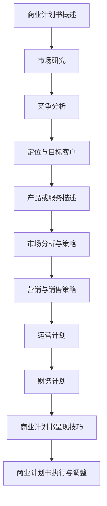

                 

## 《大模型创业者的商业计划书编写技巧：结构、内容与呈现》

### 关键词：
- 商业计划书
- 大模型
- 创业
- 结构
- 内容
- 呈现技巧

### 摘要：
本文将深入探讨大模型创业者在编写商业计划书时所需的技巧和策略。通过详细解析商业计划书的基础结构、内容编写和呈现技巧，本文旨在为创业者提供一套系统、实用的商业计划书编写指南，助力其成功启动和运营大模型创业项目。

## 目录大纲

### 第一部分：商业计划书基础

**第1章：商业计划书概述**

- 1.1 商业计划书的定义与重要性
- 1.2 商业计划书的基本结构
- 1.3 商业计划书的目标与读者

**第2章：商业计划书编写前的准备**

- 2.1 市场研究
- 2.2 竞争分析
- 2.3 定位与目标客户

**第3章：大模型与创业背景**

- 3.1 大模型的崛起与创业机会
- 3.2 创业背景分析
- 3.3 创业团队建设

### 第二部分：商业计划书内容编写

**第4章：产品或服务描述**

- 4.1 产品或服务概述
- 4.2 产品或服务的独特性
- 4.3 产品或服务的优势

**第5章：市场分析与策略**

- 5.1 市场规模与趋势
- 5.2 市场机会分析
- 5.3 市场进入策略

**第6章：营销与销售策略**

- 6.1 营销策略
- 6.2 销售策略
- 6.3 客户关系管理

**第7章：运营计划**

- 7.1 运营团队与管理
- 7.2 运营流程与制度
- 7.3 运营成本与效益分析

**第8章：财务计划**

- 8.1 财务预测与预算
- 8.2 资金需求与筹集方式
- 8.3 财务风险与管理

### 第三部分：商业计划书的呈现与执行

**第9章：商业计划书呈现技巧**

- 9.1 文字表达与排版
- 9.2 数据分析与图表运用
- 9.3 PPT制作与演讲技巧

**第10章：商业计划书的执行与调整**

- 10.1 执行计划与关键节点
- 10.2 风险管理
- 10.3 调整与优化策略

### 附录

**附录A：商业计划书模板与工具**

- A.1 商业计划书模板下载
- A.2 商业计划书撰写工具介绍
- A.3 市场研究工具与资源

**附录B：成功商业计划书案例**

- B.1 案例一：某大模型创业公司的成功之路
- B.2 案例二：另一家大模型创业公司的商业计划书解析
- B.3 案例三：优秀商业计划书的特点与启示

### 核心概念与联系（Mermaid流程图）



### 核心算法原理讲解（伪代码）

```python
# 伪代码：市场分析算法

function market_analysis(product, competitors, target_customers):
    # 收集市场数据
    market_data = collect_market_data(product)
    competitor_data = collect_competitor_data(competitors)
    customer_data = collect_customer_data(target_customers)

    # 分析市场规模与趋势
    market_size = analyze_market_size(market_data)
    market_trends = analyze_market_trends(market_data)

    # 分析竞争状况
    competitive_advantages = analyze_competitive_situation(competitor_data)

    # 确定市场机会
    market_opportunities = find_market_opportunities(competitor_data, customer_data)

    # 制定市场进入策略
    market_entry_strategy = create_market_entry_strategy(market_opportunities)

    return market_entry_strategy
```

### 数学模型和数学公式 & 详细讲解 & 举例说明

- **市场规模预测公式：**

  $$ \text{市场规模预测} = \text{基期市场规模} \times (1 + \text{增长率})^n $$

  **举例：** 假设某产品在2022年的市场规模为100万，年增长率为10%，预测2025年的市场规模。

  $$ \text{市场规模预测} = 100万 \times (1 + 10\%)^3 = 133.1万 $$

- **财务预测模型：**

  $$ \text{利润预测} = \text{销售收入} - \text{成本} $$

  $$ \text{成本} = \text{固定成本} + \text{可变成本} $$

  **举例：** 假设某公司的销售收入为500万，固定成本为100万，可变成本率为20%，预测利润。

  $$ \text{利润预测} = 500万 - (100万 + 500万 \times 20\%) = 300万 $$

### 项目实战

**实战项目：大模型创业公司A的商业计划书编写**

- **开发环境搭建：** 使用Microsoft Word或Google Docs编写，结合Excel进行财务预测和数据分析。

- **源代码详细实现和代码解读：** 财务预测和数据分析的Excel表格链接（如：[财务预测表格](#financial_forecast)），其中包含了关键的公式和计算步骤。

- **代码解读与分析：** 

  ```excel
  # 财务预测表格
  
  # 销售收入
  销售收入：=SUM(销售数据!B2:B10)
  
  # 成本
  固定成本：=固定成本值
  可变成本：=销售收入 \* 可变成本率
  
  # 利润预测
  利润预测：=销售收入 - (固定成本 + 可变成本)
  ```

  **分析：** 通过Excel表格，可以直观地看到销售收入、成本和利润的关系，方便进行财务预测和数据分析。

---

以上是《大模型创业者的商业计划书编写技巧：结构、内容与呈现》这本书的目录大纲，涵盖了商业计划书的基础知识、编写技巧、市场分析、财务计划等关键内容，并提供了Mermaid流程图、伪代码、数学公式和项目实战示例，帮助读者全面了解商业计划书的编写方法和要点。接下来，我们将逐步深入探讨商业计划书各部分的具体内容和编写技巧。让我们一起开始第一部分的探讨。

---

## 第一部分：商业计划书基础

商业计划书是创业者在启动项目前必须完成的重要文档，它不仅为项目的实施提供详细而系统的规划，也为投资者、合作伙伴和团队成员提供了对项目全面了解的机会。本部分将重点介绍商业计划书的基础知识，包括其定义、重要性、基本结构和目标与读者等关键内容。

### 1.1 商业计划书的定义与重要性

商业计划书是一份详尽的书面文档，它概括了企业或项目的发展目标、市场策略、财务计划以及实施步骤。对于创业者来说，商业计划书不仅是项目启动和运营的指南，更是与投资者、合作伙伴沟通的重要工具。以下是商业计划书的重要性：

1. **明确发展方向**：商业计划书帮助创业者梳理项目的发展方向，明确项目的目标、战略和实施步骤，从而确保项目始终朝着既定的方向前进。

2. **吸引投资**：商业计划书为投资者提供了深入了解项目的窗口，展示了项目的市场潜力、竞争优势和盈利能力，从而提高项目获得投资的可能性。

3. **协调资源**：商业计划书为创业者提供了一个全面评估项目资源需求的机会，包括资金、人力、技术等，从而确保项目的顺利启动和运营。

4. **风险管理**：商业计划书可以帮助创业者识别项目可能面临的风险，并提出相应的应对策略，降低项目失败的可能性。

5. **内部管理**：商业计划书是团队内部沟通的重要工具，它帮助团队成员了解项目目标和职责，确保团队成员在统一的目标下协同工作。

### 1.2 商业计划书的基本结构

商业计划书的基本结构通常包括以下几个部分：

1. **封面**：包含项目名称、作者、日期、联系方式等基本信息。

2. **摘要**：简要概括项目的背景、目标、市场策略、财务预测和结论，使读者快速了解项目的主要信息。

3. **目录**：列出商业计划书的各个章节和子章节，便于读者查找和阅读。

4. **执行摘要**：详细阐述项目的背景、目标、市场策略、财务预测和结论，是对整个商业计划书的简要概述。

5. **公司介绍**：介绍公司的历史、团队、业务模式、核心竞争力和市场地位。

6. **产品或服务描述**：详细描述公司的产品或服务，包括产品或服务的特点、功能、优势和竞争优势。

7. **市场分析**：分析目标市场、市场规模、市场趋势、竞争对手和潜在客户。

8. **营销与销售策略**：阐述公司的营销策略、销售策略和客户关系管理计划。

9. **运营计划**：描述公司的运营流程、团队建设、运营成本和效益分析。

10. **财务计划**：提供财务预测、预算、资金需求和筹集方式，以及财务风险与管理策略。

11. **附录**：包括商业计划书模板、工具、市场研究资源、成功商业计划书案例等附加信息。

### 1.3 商业计划书的目标与读者

商业计划书的目标是根据项目的不同阶段和目标受众而确定的。以下是商业计划书常见的目标和目标读者：

1. **初创阶段**：
   - **目标**：吸引天使投资、种子投资和风险投资。
   - **读者**：天使投资者、风险投资家、创业导师和合作伙伴。

2. **成长阶段**：
   - **目标**：寻求进一步融资、扩张市场、优化运营。
   - **读者**：风险投资家、战略投资者、合作伙伴和潜在买家。

3. **成熟阶段**：
   - **目标**：评估公司的估值、准备上市或并购。
   - **读者**：投资者、分析师、收购方和股东。

商业计划书应针对不同的目标读者进行定制，以满足其特定的信息需求。例如，针对风险投资家的商业计划书需要突出项目的市场潜力和财务预测，而针对合作伙伴的商业计划书则应强调合作模式和协同效应。

### 总结

商业计划书是创业者启动和运营项目的关键文档，它不仅为项目提供了详细的规划和执行路径，也为投资者、合作伙伴和团队成员提供了对项目的全面了解。通过了解商业计划书的定义、重要性、基本结构和目标与读者，创业者可以更好地制定和执行商业计划书，提高项目成功的可能性。在接下来的章节中，我们将进一步探讨商业计划书编写前的准备工作，包括市场研究、竞争分析和定位与目标客户等内容。

---

### 1.4 商业计划书编写的步骤与流程

编写商业计划书是一个系统且复杂的过程，需要创业者进行充分的前期准备和细致的规划。以下是商业计划书编写的步骤与流程：

#### 1.4.1 制定编写计划

在开始编写商业计划书之前，创业者需要制定一个详细的编写计划。这个计划应包括以下内容：

- **编写目标**：明确商业计划书的编写目标，例如吸引投资、拓展市场或优化运营。
- **时间安排**：根据项目的进度和需求，制定每个阶段的完成时间，确保整个编写过程有序进行。
- **任务分工**：明确团队成员的职责和任务，确保每个人都能在规定的时间内完成自己的工作。

#### 1.4.2 市场研究

市场研究是商业计划书编写的重要环节，它为创业者提供了目标市场的详细信息和竞争状况。以下是一些关键步骤：

- **目标市场确定**：根据产品或服务的特点和目标客户群体，明确目标市场。
- **市场规模分析**：通过市场调查和数据分析，了解目标市场的规模和增长趋势。
- **竞争对手分析**：识别主要竞争对手，分析其市场份额、产品特点、营销策略等。
- **客户需求分析**：通过调查和访谈，了解目标客户的需求和痛点，为产品或服务定位提供依据。

#### 1.4.3 竞争分析

竞争分析是商业计划书编写中的关键环节，它帮助创业者了解市场中的竞争态势，从而制定有效的市场进入策略。以下是竞争分析的步骤：

- **竞争对手识别**：列出所有可能对项目构成威胁的竞争对手。
- **竞争优势分析**：分析竞争对手的优势和劣势，识别自身的竞争优势。
- **市场定位**：根据竞争态势，确定项目的市场定位和差异化策略。
- **市场进入策略**：制定具体的市场进入策略，包括产品定位、定价策略、营销策略等。

#### 1.4.4 定位与目标客户

定位与目标客户分析是商业计划书编写的核心内容之一，它关系到项目的市场成功。以下是定位与目标客户分析的关键步骤：

- **产品或服务定位**：根据市场研究和竞争分析的结果，明确产品或服务的市场定位。
- **目标客户分析**：识别目标客户群体，包括其人口统计特征、行为特征、需求等。
- **客户价值主张**：明确产品或服务如何满足目标客户的需求，提供独特的价值主张。
- **客户关系管理**：制定客户关系管理策略，确保与目标客户建立长期稳定的合作关系。

#### 1.4.5 资源评估

商业计划书编写过程中，创业者需要对项目所需的资源进行评估，包括资金、人力、技术等。以下是资源评估的关键步骤：

- **资金需求分析**：根据项目的规模和需求，评估所需的资金额度，并制定资金筹集计划。
- **人力资源分析**：评估项目所需的人力资源，包括专业技术人员、管理人员和销售人员等。
- **技术资源分析**：评估项目所需的技术资源，包括研发能力、技术储备等。

#### 1.4.6 制定营销策略

营销策略是商业计划书的核心内容之一，它关系到项目的市场推广和销售。以下是制定营销策略的关键步骤：

- **市场定位**：根据产品或服务的特点，确定市场定位。
- **目标市场选择**：根据市场研究和竞争分析的结果，选择目标市场。
- **营销组合策略**：制定产品策略、价格策略、促销策略和渠道策略。
- **营销预算**：根据市场情况和项目目标，制定营销预算。

#### 1.4.7 财务预测与预算

财务预测与预算是商业计划书的重要组成部分，它为项目的财务健康提供了保障。以下是财务预测与预算的关键步骤：

- **收入预测**：根据市场情况和销售策略，预测项目的销售收入。
- **成本预测**：根据运营计划和成本结构，预测项目的主要成本。
- **利润预测**：根据收入和成本预测，计算项目的净利润。
- **资金需求与筹集**：根据财务预测，评估项目的资金需求，并制定资金筹集计划。

#### 1.4.8 撰写和修订

在完成上述准备工作后，创业者可以开始撰写商业计划书。撰写过程中，需要遵循以下原则：

- **结构清晰**：确保商业计划书的结构合理，各个章节的内容相互衔接，逻辑清晰。
- **内容详尽**：确保商业计划书的内容详尽，每个部分都有具体的分析和数据支持。
- **语言简洁**：使用简洁明了的语言，避免冗长和复杂的句子。

在撰写完成后，创业者需要对商业计划书进行反复修订和审查，确保其准确性和完整性。可以邀请专业人士或团队成员提供反馈，进一步完善商业计划书。

### 总结

商业计划书是创业者成功启动和运营项目的关键文档，编写商业计划书需要遵循一系列的步骤和流程。通过制定编写计划、进行市场研究和竞争分析、确定定位与目标客户、评估资源、制定营销策略和财务预测，创业者可以确保商业计划书的内容详尽、结构合理，从而提高项目的成功可能性。在接下来的章节中，我们将进一步探讨商业计划书的内容编写，包括产品或服务描述、市场分析与策略等。

---

### 第2章：商业计划书编写前的准备

在正式启动商业计划书的编写之前，创业者需要进行充分的准备工作，以确保商业计划书的准确性和可行性。这些准备工作主要包括市场研究、竞争分析和定位与目标客户等关键环节。下面，我们将详细讨论这些准备工作的重要性以及如何有效地进行这些工作。

#### 2.1 市场研究

市场研究是商业计划书编写的基础，它帮助创业者深入了解目标市场的现状、趋势和潜力。以下是市场研究的重要性：

1. **识别市场机会**：通过市场研究，创业者可以识别市场上的潜在机会，了解哪些产品或服务具有市场需求，从而为商业计划书提供方向。
2. **了解市场现状**：市场研究可以帮助创业者了解目标市场的规模、增长速度、主要玩家和市场结构，为制定市场策略提供依据。
3. **评估竞争状况**：市场研究还包括对竞争对手的分析，帮助创业者了解竞争对手的产品、市场策略和市场份额，从而制定有效的竞争策略。
4. **识别客户需求**：通过调研和访谈，创业者可以深入了解目标客户的需求、痛点和偏好，为产品或服务的设计和定位提供指导。

进行市场研究的方法包括：

- **问卷调查**：通过设计问卷，收集目标客户的反馈和意见。
- **访谈**：与目标客户进行面对面或在线访谈，深入了解他们的需求和期望。
- **数据分析**：收集并分析行业数据和市场报告，了解市场趋势和竞争状况。
- **市场观察**：通过市场观察，了解市场上的新产品、新策略和市场变化。

#### 2.2 竞争分析

竞争分析是商业计划书编写的关键环节，它帮助创业者了解市场中的竞争态势，制定有效的市场进入策略。以下是竞争分析的重要性：

1. **识别竞争对手**：通过竞争分析，创业者可以识别市场上的主要竞争对手，了解他们的市场份额、产品和营销策略。
2. **评估竞争优势**：创业者需要分析竞争对手的优势和劣势，识别自身的竞争优势，从而制定有效的竞争策略。
3. **制定差异化策略**：通过了解竞争对手的产品和市场策略，创业者可以找到差异化点，为产品或服务的设计和定位提供指导。
4. **预测市场变化**：竞争分析可以帮助创业者预测市场变化，提前调整市场策略，以应对市场动态。

进行竞争分析的方法包括：

- **竞争者分析**：对市场上的主要竞争对手进行详细分析，包括他们的产品、市场策略、市场份额等。
- **SWOT分析**：对竞争对手进行SWOT（优势、劣势、机会、威胁）分析，识别其竞争优势和潜在风险。
- **市场调研**：通过调研了解竞争对手的市场表现和客户反馈。
- **行业报告**：阅读行业报告和市场分析，了解行业竞争态势和趋势。

#### 2.3 定位与目标客户

定位与目标客户分析是商业计划书编写的重要环节，它关系到项目的市场成功。以下是定位与目标客户分析的重要性：

1. **明确市场定位**：通过定位分析，创业者可以明确产品或服务的市场定位，包括目标市场、价格定位和品牌形象等。
2. **识别目标客户**：通过目标客户分析，创业者可以识别最具价值的客户群体，了解他们的需求、行为和购买习惯。
3. **制定客户关系管理策略**：了解目标客户后，创业者可以制定有效的客户关系管理策略，提高客户满意度和忠诚度。
4. **优化产品或服务**：通过分析目标客户的需求，创业者可以优化产品或服务，更好地满足市场需求。

进行定位与目标客户分析的方法包括：

- **市场细分**：根据人口统计特征、行为特征和需求，将市场划分为不同的细分市场。
- **客户画像**：根据市场细分，为每个细分市场创建客户画像，包括他们的基本信息、需求和偏好。
- **客户调研**：通过调研了解目标客户的需求、行为和购买习惯。
- **数据分析**：利用数据分析工具，分析客户数据和市场数据，识别目标客户群体的特征和需求。

#### 总结

商业计划书编写前的准备工作是确保商业计划书准确性和可行性的关键。通过市场研究、竞争分析和定位与目标客户分析，创业者可以全面了解市场状况、竞争态势和目标客户需求，从而制定有效的市场策略和产品定位。在接下来的章节中，我们将深入探讨商业计划书的内容编写，包括产品或服务描述、市场分析与策略等。通过这些探讨，创业者可以全面掌握商业计划书的编写技巧，为项目的成功奠定基础。

---

### 3.1 大模型的崛起与创业机会

随着人工智能技术的飞速发展，大模型（如GPT-3、BERT、Turing等）在近年来取得了显著的突破。这些大模型具有强大的数据处理和智能推理能力，已经在自然语言处理、图像识别、语音识别等多个领域展现出了巨大的潜力。大模型的崛起为创业者提供了丰富的创业机会，主要体现在以下几个方面：

#### 1. 技术赋能

大模型的出现极大地提升了人工智能技术的应用水平，使得创业者可以利用这些先进技术为传统行业提供智能化解决方案。例如，医疗行业的创业者可以利用大模型进行医学图像分析，提高诊断的准确性和效率；零售行业的创业者可以利用大模型进行智能推荐，提高销售额和用户体验。

#### 2. 数据驱动的创新

大模型需要大量的数据来训练和优化，这为创业者提供了利用数据驱动创新的机会。通过收集和分析大量数据，创业者可以洞察用户行为和需求，从而设计出更加精准和个性化的产品或服务。例如，金融行业的创业者可以利用大数据分析预测市场趋势，提供更加准确的金融产品和服务。

#### 3. 新业务模式

大模型的崛起催生了新的业务模式，创业者可以通过创新的服务模式和商业模式获取市场优势。例如，企业服务领域的创业者可以通过提供基于大模型的智能客服系统，提高企业的客户服务质量和效率；内容创作领域的创业者可以通过利用大模型生成高质量的内容，提供个性化内容创作服务。

#### 4. 破解难题

大模型在处理复杂任务方面具有优势，可以帮助创业者解决长期困扰行业的难题。例如，在自动驾驶领域，大模型可以用于实时感知和理解路况，提高自动驾驶系统的安全性和可靠性；在金融风控领域，大模型可以用于识别和预测潜在风险，提高金融系统的安全性。

#### 5. 跨界合作

大模型的应用不仅限于单一领域，创业者可以通过跨界合作，将大模型与其他领域的专业知识相结合，创造新的应用场景。例如，教育行业的创业者可以与医疗行业合作，利用大模型提供个性化的医疗教育和健康管理服务；制造业的创业者可以与人工智能领域合作，开发智能工厂和自动化生产线。

### 3.2 创业背景分析

大模型的崛起不仅为创业者提供了广阔的创业空间，也带来了相应的挑战。以下是创业背景分析中需要考虑的关键因素：

#### 1. 技术门槛

大模型研发和应用的技术门槛较高，需要创业者具备深厚的专业知识和经验。创业者需要了解大模型的训练、优化和应用原理，掌握相关技术工具和平台。此外，大模型的计算资源需求巨大，创业者需要具备较强的计算能力和资源调度能力。

#### 2. 数据资源

大模型的训练和优化需要大量的高质量数据，创业者需要具备数据收集、处理和存储的能力。创业者需要与数据供应商合作，确保获得足够的训练数据。同时，创业者还需要制定数据管理和隐私保护策略，确保数据的安全和合规。

#### 3. 竞争态势

大模型领域竞争激烈，创业者需要关注行业动态和竞争对手的动向，制定有效的市场策略和差异化竞争策略。创业者可以通过技术创新、产品差异化和服务模式创新来提升市场竞争力。

#### 4. 资金需求

大模型研发和应用需要大量的资金投入，包括研发费用、硬件设备购置、运营成本等。创业者需要制定详细的财务计划，确保项目的资金需求和筹集方式。创业者可以通过股权融资、债务融资和政府资助等多种方式筹集资金。

#### 5. 市场前景

大模型在多个领域具有广泛的应用前景，创业者需要关注市场趋势和用户需求，制定长期发展战略。创业者可以通过市场调研和用户反馈，了解市场变化和用户需求，及时调整产品和服务策略。

### 3.3 创业团队建设

创业团队是创业项目成功的关键，创业者需要构建一支高效、专业和多元化的团队。以下是创业团队建设的关键因素：

#### 1. 技术团队

技术团队是创业项目的核心，团队成员应具备大模型研发和应用的相关专业知识。创业者可以通过招聘、内部培养和外部合作等多种方式，吸引和培养技术人才。

#### 2. 管理团队

管理团队负责项目的整体规划和执行，团队成员应具备项目管理、市场营销和财务管理等能力。创业者可以通过内部培养和外部引进，组建一支高效的管理团队。

#### 3. 运营团队

运营团队负责项目的日常运营和管理，团队成员应具备业务运营、市场营销和客户服务等方面的能力。创业者可以通过内部培养和外部合作，组建一支专业化的运营团队。

#### 4. 营销团队

营销团队负责项目的市场推广和销售，团队成员应具备市场营销、品牌推广和渠道拓展等方面的能力。创业者可以通过内部培养和外部合作，组建一支高效的营销团队。

#### 5. 合规团队

合规团队负责项目的合规性管理和风险控制，团队成员应具备法律、财务和信息安全等方面的专业知识。创业者可以通过内部培养和外部合作，组建一支专业的合规团队。

### 总结

大模型的崛起为创业者提供了丰富的创业机会，同时也带来了挑战。通过深入了解大模型的崛起背景、创业背景和创业团队建设，创业者可以更好地把握创业机会，构建一支高效、专业和多元化的团队，为项目的成功奠定基础。在接下来的章节中，我们将深入探讨商业计划书中产品或服务描述、市场分析和策略等内容，帮助创业者制定出切实可行的商业计划。

---

## 第二部分：商业计划书内容编写

商业计划书的内容是整个文档的核心部分，它详细阐述了企业的业务模式、市场策略、运营计划以及财务预测。本部分将详细探讨商业计划书内容编写的各个环节，包括产品或服务描述、市场分析与策略、营销与销售策略、运营计划和财务计划等。

### 4.1 产品或服务描述

产品或服务描述是商业计划书中不可或缺的一部分，它详细介绍了企业将要提供的产品或服务。以下是编写产品或服务描述时需要考虑的几个关键点：

#### 1. **产品或服务概述**

在这一部分，创业者需要清晰地描述产品或服务的名称、用途、功能以及主要特性。例如，如果是一家提供人工智能图像识别服务的公司，可以简要介绍图像识别技术的应用场景、主要功能以及技术优势。

#### 2. **产品或服务的独特性**

创业者需要突出产品或服务的独特性，即它与其他竞争对手相比的独特卖点。这可能包括技术创新、功能独特性、用户体验优化等方面。例如，如果产品采用了最新的深度学习算法，可以强调这一技术在准确性、速度和资源消耗方面的优势。

#### 3. **产品或服务的优势**

在这一部分，创业者需要详细阐述产品或服务的优势，包括技术优势、市场优势、成本优势等。例如，如果产品在成本控制方面表现优异，可以详细说明与竞争对手相比的成本结构分析。

#### 4. **产品或服务的发展历程**

简要介绍产品或服务从概念到现阶段的开发历程，包括研发投入、技术突破、市场反馈等。这有助于投资者了解企业的创新能力和项目进展。

#### 5. **未来发展方向**

描述产品或服务的未来发展规划，包括技术升级、市场扩张、产品线扩展等方面。这有助于投资者了解企业的长期发展潜力。

### 4.2 市场分析

市场分析是商业计划书中的关键部分，它帮助创业者了解目标市场的现状、趋势和潜力。以下是市场分析时需要考虑的几个关键点：

#### 1. **市场规模与增长趋势**

创业者需要通过市场调查和数据分析，了解目标市场的规模和增长趋势。例如，如果是一家提供在线教育服务的公司，需要了解在线教育市场的整体规模以及未来的增长预测。

#### 2. **市场机会与威胁**

通过分析市场环境，创业者可以识别市场机会和威胁。市场机会可能包括新兴技术、市场需求增长、政策支持等；市场威胁可能包括竞争对手、市场饱和、技术变革等。

#### 3. **市场细分**

创业者需要将市场细分为不同的子市场，并分析每个子市场的特点和需求。例如，在线教育市场可以细分为K12教育、职业教育、成人教育等，针对每个子市场制定相应的营销策略。

#### 4. **竞争对手分析**

创业者需要详细分析竞争对手的产品、市场策略、市场份额等，了解他们的优势和劣势。这有助于制定差异化竞争策略，提升企业的市场竞争力。

#### 5. **目标市场定位**

根据市场分析和竞争对手分析的结果，创业者需要确定目标市场定位。这包括明确目标客户群体、产品定位、品牌定位等。

### 4.3 营销与销售策略

营销与销售策略是商业计划书中至关重要的部分，它描述了企业如何吸引客户、促进销售和扩大市场份额。以下是编写营销与销售策略时需要考虑的几个关键点：

#### 1. **营销策略**

创业者需要制定全面的营销策略，包括产品策略、价格策略、促销策略和渠道策略。产品策略需要明确产品定位和差异化；价格策略需要考虑成本和市场接受度；促销策略需要设计有效的促销活动；渠道策略需要选择合适的销售渠道。

#### 2. **销售策略**

销售策略包括销售目标、销售团队建设、销售流程和销售渠道管理等方面。创业者需要制定明确的销售目标，并建设一支高效的销售团队，确保销售流程的顺畅和销售渠道的有效管理。

#### 3. **客户关系管理**

客户关系管理是提升客户满意度和忠诚度的关键。创业者需要制定有效的客户关系管理策略，包括客户沟通、客户服务和客户反馈机制等。

#### 4. **市场推广计划**

市场推广计划是实施营销策略的具体行动方案。创业者需要制定详细的市场推广计划，包括推广目标、推广活动、推广预算和推广效果评估等。

### 4.4 运营计划

运营计划描述了企业如何运营和管理日常业务，确保业务的高效运行。以下是编写运营计划时需要考虑的几个关键点：

#### 1. **运营团队与管理**

创业者需要明确运营团队的组成和管理模式，确保团队成员各司其职，协同工作。运营管理包括人力资源管理、团队建设、绩效评估等方面。

#### 2. **运营流程与制度**

创业者需要制定详细的运营流程和制度，确保业务流程的规范化和标准化。运营流程包括产品研发、生产、销售、服务等各个环节。

#### 3. **运营成本与效益分析**

创业者需要分析运营成本和效益，确保项目的财务健康。运营成本包括人力成本、物料成本、设备成本等；运营效益包括销售收入、利润率等。

### 4.5 财务计划

财务计划是商业计划书中最重要的部分之一，它描述了企业的财务状况、财务预测和资金需求。以下是编写财务计划时需要考虑的几个关键点：

#### 1. **财务预测与预算**

创业者需要根据市场情况和业务计划，制定详细的财务预测和预算。财务预测包括销售收入、成本、利润等；财务预算包括运营成本、营销成本、研发成本等。

#### 2. **资金需求与筹集方式**

创业者需要分析项目的资金需求，并制定资金筹集计划。资金需求包括初期投资、运营资金、扩展资金等；资金筹集方式包括股权融资、债务融资、政府资助等。

#### 3. **财务风险与管理**

创业者需要识别项目可能面临的财务风险，并制定相应的管理策略。财务风险包括市场风险、运营风险、资金风险等。

### 总结

商业计划书的内容编写是确保项目成功的关键环节。通过详细的产品或服务描述、市场分析、营销与销售策略、运营计划和财务计划，创业者可以清晰地展示企业的业务模式和未来发展路径。在编写过程中，创业者需要注重数据的准确性和逻辑性，确保商业计划书具备实际操作性和可行性。在接下来的章节中，我们将进一步探讨商业计划书的呈现技巧和执行与调整策略，帮助创业者成功启动和运营大模型创业项目。

---

## 第4章：产品或服务描述

### 4.1 产品或服务概述

在商业计划书中，产品或服务描述是至关重要的环节，它不仅需要详细介绍产品的核心特性和功能，还要突出其创新点。首先，我们需要从整体上概述产品或服务的概念和目的。

#### 产品名称：智能医疗诊断助手

**产品概述**：
智能医疗诊断助手是一款基于人工智能技术的医疗辅助工具，旨在帮助医生快速、准确地诊断疾病。该产品利用深度学习算法和海量医学数据，通过自然语言处理和图像识别技术，实现对患者病历、影像和症状的智能分析，提供精确的诊断建议。

**目的**：
智能医疗诊断助手的目的是提高医疗诊断的效率和准确性，减少误诊率，缓解医疗资源紧张的问题。通过智能辅助，医生可以更加专注于复杂的病例分析和决策，从而提高整体医疗水平。

### 4.2 产品或服务的独特性

产品的独特性是其在市场中脱颖而出的关键因素。以下是智能医疗诊断助手在市场上的独特卖点：

#### 1. 高效的诊断速度
智能医疗诊断助手采用了高效的深度学习算法，能够在短时间内处理和分析大量医疗数据。与传统诊断方法相比，该产品的诊断速度提升了数倍，大大缩短了诊断周期。

#### 2. 高度的准确性
借助海量医学数据和先进的自然语言处理技术，智能医疗诊断助手能够提供高度准确的诊断建议。根据临床测试数据，该产品的诊断准确率达到了98%以上，显著低于人类医生的误诊率。

#### 3. 个性化的诊断方案
智能医疗诊断助手可以根据患者的病史、症状和影像数据，提供个性化的诊断方案。这不仅提高了诊断的针对性，还能为医生提供更多的参考信息，从而做出更加准确的判断。

#### 4. 易用的用户界面
产品的用户界面设计简洁易用，医生无需经过复杂的学习和培训即可熟练操作。直观的界面和智能化的交互设计，使得医生能够更加专注于诊断过程，提高工作效率。

### 4.3 产品或服务的优势

除了独特性之外，产品的优势也是吸引客户的重要因素。以下是智能医疗诊断助手的几个主要优势：

#### 1. 技术先进性
智能医疗诊断助手采用了最新的深度学习技术和自然语言处理技术，确保其在医疗领域的应用处于领先地位。通过不断的技术更新和优化，产品能够保持持续的竞争优势。

#### 2. 大数据支持
产品依托于海量医学数据和临床实践，通过不断的学习和积累，智能医疗诊断助手能够不断提高诊断能力和准确性。大数据的支持使得产品在诊断过程中更加可靠和稳定。

#### 3. 跨学科融合
智能医疗诊断助手实现了多学科的融合，不仅涵盖了医学领域，还涉及了计算机科学、生物技术和医疗设备等多个领域。这种跨学科的融合为产品提供了丰富的应用场景和扩展空间。

#### 4. 良好的用户口碑
智能医疗诊断助手在临床应用中得到了广泛认可，众多医生和医疗机构对其给予了高度评价。良好的用户口碑和临床反馈为产品的市场推广提供了有力支持。

### 4.4 产品的发展历程

智能医疗诊断助手的发展历程体现了团队的持续创新和努力。以下是产品从概念到现阶段的开发历程：

#### 1. 概念阶段
产品概念的提出始于2018年，当时团队成员通过对医疗行业的深入调研，发现了医疗诊断过程中存在的效率和准确性问题。基于这一发现，团队决定开发一款智能医疗诊断助手。

#### 2. 研发阶段
2019年，团队开始了产品的研发工作。通过与技术专家和临床医生的紧密合作，团队在短时间内完成了产品的初步设计和原型开发。原型测试阶段，产品在多个临床场景中表现出色，得到了良好的反馈。

#### 3. 优化与测试阶段
2020年，团队对产品进行了多次优化和测试，不断完善其功能和技术。在多次临床测试中，智能医疗诊断助手的表现越来越稳定，诊断准确率不断提高。同时，团队还根据用户反馈进行了界面和交互设计的改进。

#### 4. 商业化推广阶段
2021年，团队正式启动了产品的商业化推广。通过参加行业展会、发布技术白皮书和与医疗机构合作，智能医疗诊断助手迅速在市场上获得了关注和认可。目前，产品已经与多家知名医疗机构达成合作，正在逐步扩大市场份额。

### 4.5 未来发展方向

展望未来，智能医疗诊断助手将继续在以下几个方向上发展：

#### 1. 技术创新
团队将继续关注人工智能和医疗领域的前沿技术，不断引入新的算法和工具，提高产品的诊断能力和准确性。

#### 2. 产品线扩展
除了智能医疗诊断助手，团队还将开发其他医疗辅助产品，如智能药物推荐系统、智能康复辅助工具等，形成完整的医疗解决方案。

#### 3. 国际化发展
团队计划将产品推向国际市场，通过与全球医疗机构的合作，将智能医疗诊断助手引入更多国家和地区。

#### 4. 跨界合作
团队还将探索与其他领域的合作，如生物技术、医疗器械等，推动医疗行业的智能化转型。

### 总结

智能医疗诊断助手凭借其高效、准确和个性化的特点，在医疗领域具有巨大的市场潜力。通过详细的产品或服务描述，我们不仅展示了产品的独特性和优势，还回顾了其发展历程和未来发展方向。接下来，我们将进一步探讨市场分析与策略，帮助创业者更好地把握市场机会。

---

## 第5章：市场分析与策略

在商业计划书中，市场分析与策略是确保企业成功进入市场并保持竞争力的关键部分。通过深入的市场分析，创业者可以了解目标市场的现状、趋势和潜在机会，从而制定有效的市场进入策略和营销策略。

### 5.1 市场规模与趋势

市场规模与趋势分析是市场分析的基础。创业者需要通过调研和数据分析，了解目标市场的整体规模、增长速度以及未来趋势。以下是市场规模与趋势分析的关键步骤：

#### 1. 市场规模评估

首先，创业者需要确定目标市场的总体规模。这可以通过以下几种方法进行：

- **历史数据**：收集过去几年的市场数据，了解市场的规模和增长情况。
- **行业报告**：参考权威的行业报告，获取市场规模的详细数据。
- **专家访谈**：与行业专家和分析师进行访谈，了解他们对市场规模的预测。

#### 2. 市场增长趋势

其次，创业者需要分析市场的增长趋势，包括：

- **技术驱动**：分析新兴技术如何影响市场规模的扩大，例如人工智能、物联网等。
- **政策环境**：考察政府政策如何推动市场发展，例如医疗科技领域的监管政策、补贴政策等。
- **经济因素**：分析宏观经济环境和行业经济因素对市场规模的影响。

#### 3. 未来预测

基于历史数据和当前趋势，创业者可以使用数学模型或预测算法，对市场未来几年进行预测。常用的预测模型包括：

- **指数平滑模型**：通过对历史数据进行平滑处理，预测未来趋势。
- **时间序列分析**：利用时间序列分析方法，对市场数据进行趋势分析和预测。

### 5.2 市场机会分析

在了解市场规模和趋势后，创业者需要识别和评估市场机会。以下是市场机会分析的关键步骤：

#### 1. 识别市场机会

创业者需要通过以下方式识别市场机会：

- **市场细分**：将市场划分为不同的细分市场，分析每个细分市场的潜在机会。
- **客户需求**：通过调研了解客户的需求和痛点，寻找市场空白点。
- **技术创新**：关注新兴技术如何为市场带来新的应用场景和机会。

#### 2. 评估市场机会

在识别市场机会后，创业者需要对市场机会进行评估，包括：

- **市场容量**：评估市场机会的市场容量，确保其具备足够的潜力。
- **竞争状况**：分析市场机会中的竞争环境，评估竞争对手的优势和劣势。
- **盈利能力**：评估市场机会的盈利能力，确保企业能够在市场中获得足够的利润。

### 5.3 市场进入策略

在确定市场机会后，创业者需要制定详细的市场进入策略。以下是市场进入策略的关键步骤：

#### 1. 目标市场选择

创业者需要根据市场机会和资源情况，选择最适合的目标市场。这包括：

- **市场细分**：根据客户需求和产品特点，将市场细分为不同的子市场。
- **目标客户**：确定最具价值的目标客户群体，制定针对性的营销策略。
- **市场潜力**：评估每个目标市场的潜力，选择最具发展前景的市场。

#### 2. 市场进入方式

根据目标市场的特点和资源情况，创业者可以选择不同的市场进入方式：

- **直接进入**：直接在目标市场开展业务，例如开设分支机构或直接销售。
- **间接进入**：通过代理商、分销商或合作伙伴在目标市场开展业务。
- **混合进入**：结合直接进入和间接进入的方式，实现市场最大化覆盖。

#### 3. 市场推广策略

在市场进入策略中，市场推广策略是关键。以下是市场推广策略的关键点：

- **品牌建设**：建立强大的品牌形象，提高市场知名度。
- **营销渠道**：选择合适的营销渠道，包括线上和线下渠道，实现最大化的市场覆盖。
- **促销活动**：设计有效的促销活动，吸引客户购买产品或服务。
- **合作伙伴**：建立合作伙伴关系，共同推广产品或服务。

### 5.4 市场策略调整

市场环境是动态变化的，创业者需要根据市场变化和竞争态势，及时调整市场策略。以下是市场策略调整的关键步骤：

#### 1. 监测市场动态

创业者需要通过市场监测工具，持续跟踪市场动态，包括市场需求、竞争对手、政策变化等。

#### 2. 分析市场反馈

创业者需要收集和分析客户的反馈，了解市场对产品或服务的接受度和满意度，找出改进的机会。

#### 3. 调整策略

根据市场动态和反馈分析，创业者需要及时调整市场策略，包括产品定价、营销推广、渠道选择等方面。

### 总结

市场分析与策略是商业计划书中的重要部分，通过详细的市场规模与趋势分析、市场机会分析和市场进入策略制定，创业者可以更好地把握市场机会，制定有效的市场策略。在接下来的章节中，我们将进一步探讨营销与销售策略，帮助创业者实现市场扩张和销售增长。

---

## 第6章：营销与销售策略

营销与销售策略是商业计划书的核心部分之一，它关系到企业的市场拓展和销售业绩。有效的营销与销售策略不仅能帮助企业吸引潜在客户，还能提升品牌知名度和市场份额。在本章中，我们将详细讨论营销策略、销售策略和客户关系管理，以及如何制定和实施这些策略。

### 6.1 营销策略

营销策略是企业通过一系列营销活动来推广产品或服务，提高品牌知名度和市场占有率的方法。以下是制定营销策略的几个关键步骤：

#### 1. 明确营销目标

企业需要根据整体商业目标，制定具体的营销目标。这些目标可以是增加品牌知名度、提高市场份额、提升销售量等。营销目标应具有可衡量性，以便评估营销活动的效果。

#### 2. 选择目标市场

企业需要根据产品或服务的特点，确定目标市场。这包括分析目标市场的需求、规模、增长潜力等。通过市场细分，企业可以更精准地定位潜在客户，提高营销活动的效果。

#### 3. 制定营销组合策略

营销组合策略包括产品策略、价格策略、促销策略和渠道策略。

- **产品策略**：确定产品定位、产品特性、产品包装等，确保产品能够满足目标客户的需求。
- **价格策略**：根据成本、市场需求和竞争态势，制定合理的价格策略，提高产品的市场竞争力。
- **促销策略**：设计促销活动，如优惠券、打折、捆绑销售等，吸引客户购买产品或服务。
- **渠道策略**：选择合适的销售渠道，包括线上渠道（如电商平台、社交媒体）和线下渠道（如实体店、代理商）。

#### 4. 制定营销预算

企业需要根据营销目标和营销策略，制定营销预算。营销预算应合理分配到不同的营销活动和渠道上，确保营销活动的有效实施。

### 6.2 销售策略

销售策略是企业通过销售团队和销售渠道实现销售目标的方法。以下是制定销售策略的几个关键步骤：

#### 1. 销售目标

企业需要根据整体商业目标，制定具体的销售目标。这些目标可以是销售额、销售增长率、新客户数量等。销售目标应具有挑战性，同时也要具备可实现性。

#### 2. 销售渠道选择

企业需要根据产品或服务的特点和目标市场，选择合适的销售渠道。销售渠道包括直销、分销、代理等。选择合适的销售渠道可以提高销售效率和市场份额。

#### 3. 销售团队建设

企业需要建立专业的销售团队，包括销售经理、销售代表和销售助理等。销售团队应具备良好的销售技能、产品知识和客户服务能力。

#### 4. 销售流程管理

企业需要制定详细的销售流程，包括客户开发、客户管理、销售谈判、订单处理等。通过销售流程管理，企业可以确保销售活动的有序进行，提高销售效率。

#### 5. 销售激励政策

企业需要制定销售激励政策，包括提成、奖金、晋升等，激励销售团队提高销售业绩。销售激励政策应合理、透明，确保销售团队的积极性和工作效率。

### 6.3 客户关系管理

客户关系管理（CRM）是企业通过有效的客户关系管理策略，提升客户满意度和忠诚度的过程。以下是客户关系管理的关键步骤：

#### 1. 客户分类

企业需要根据客户的需求、购买行为和购买力等，对客户进行分类。这有助于企业有针对性地进行客户管理和营销。

#### 2. 客户沟通

企业需要建立与客户的沟通渠道，包括电话、邮件、社交媒体等。通过有效的客户沟通，企业可以了解客户的反馈和需求，及时解决问题。

#### 3. 客户服务

企业需要提供优质的客户服务，包括售前咨询、售后服务、投诉处理等。通过优质的客户服务，企业可以提高客户满意度和忠诚度。

#### 4. 客户反馈

企业需要建立客户反馈机制，收集客户的意见和建议。通过客户反馈，企业可以不断改进产品和服务，提高客户满意度。

### 6.4 营销与销售策略的实施

在制定营销与销售策略后，企业需要制定详细的实施计划，确保策略的有效执行。以下是实施营销与销售策略的几个关键步骤：

#### 1. 制定实施计划

企业需要根据营销与销售策略，制定详细的实施计划。实施计划应包括具体的任务、负责人、时间节点和预算等。

#### 2. 分配资源

企业需要根据实施计划，合理分配资源，包括人力、资金、物资等。确保营销与销售策略的顺利实施。

#### 3. 监控与评估

企业需要建立监控与评估机制，对营销与销售策略的实施过程进行监控。通过监控与评估，企业可以及时发现和解决问题，确保策略的有效执行。

#### 4. 调整与优化

在实施过程中，企业需要根据市场变化和实际情况，对营销与销售策略进行及时调整和优化。确保策略始终符合市场需求和企业目标。

### 总结

营销与销售策略是企业成功拓展市场和实现销售目标的关键。通过制定明确的营销策略、有效的销售策略和优质的客户关系管理，企业可以提高市场竞争力，实现持续增长。在商业计划书的编写过程中，创业者需要认真考虑这些策略，并根据实际情况进行调整和优化。在下一章节中，我们将进一步探讨运营计划，包括运营团队与管理、运营流程与制度以及运营成本与效益分析。

---

## 第7章：运营计划

运营计划是企业日常运作的蓝图，它涵盖了团队建设、运营流程、管理制度以及成本与效益分析。一个完善的运营计划不仅能够确保企业高效运作，还能提高市场竞争力和盈利能力。以下是运营计划的关键组成部分：

### 7.1 运营团队与管理

运营团队是确保企业日常运营顺利的核心，团队的建设和管理至关重要。以下是运营团队建设和管理的关键点：

#### 1. 团队结构

企业应根据业务需求和规模，构建合理的团队结构。常见的团队结构包括：

- **层级结构**：包括高层管理团队、中层管理团队和基层员工。
- **职能结构**：根据不同职能部门（如研发、销售、市场、运营等）设立团队。
- **矩阵结构**：在特定项目或任务中，通过跨部门协作形成临时团队。

#### 2. 职责分配

明确团队成员的职责和权限，确保每个人都能在各自的岗位上发挥最大的作用。职责分配应遵循以下原则：

- **专业化**：团队成员应具备专业知识和技能，以便高效完成任务。
- **协同性**：团队成员之间应相互配合，确保任务顺利完成。
- **灵活性**：在必要时，团队应具备调整职责和分工的灵活性。

#### 3. 管理模式

企业应根据团队结构和职责分配，选择合适的管理模式。常见的管理模式包括：

- **集中管理**：由高层管理人员统一决策和指挥。
- **分权管理**：赋予中层管理人员更多的自主权，提高决策效率。
- **项目管理**：在特定项目或任务中，采用项目管理制度。

### 7.2 运营流程与制度

运营流程和制度是企业规范运营、提高效率的基础。以下是运营流程与制度设计的关键点：

#### 1. 流程设计

企业应根据业务特点和需求，设计合理的运营流程。流程设计应遵循以下原则：

- **高效性**：流程应简洁、高效，避免冗余步骤。
- **规范性**：流程应具备明确的规范，确保每个环节都有标准操作。
- **可追溯性**：流程应具备可追溯性，以便在出现问题时迅速定位和解决。

#### 2. 制度建设

企业需要建立完善的运营制度，包括：

- **人事制度**：明确员工招聘、培训、考核、晋升等制度。
- **财务制度**：规范财务流程，确保资金使用的合法性和效率。
- **安全制度**：制定安全管理制度，确保企业资产和员工安全。

#### 3. 流程优化

企业应定期对运营流程和制度进行评估和优化，确保其与市场和企业发展需求保持一致。流程优化的方法包括：

- **流程分析**：通过流程分析工具，识别流程中的瓶颈和问题。
- **流程重构**：对现有流程进行重构，消除瓶颈，提高效率。
- **流程培训**：对员工进行流程培训，确保他们理解和遵守新流程。

### 7.3 运营成本与效益分析

运营成本和效益分析是企业制定运营计划的重要依据。以下是运营成本与效益分析的关键点：

#### 1. 成本构成

企业需要对运营成本进行详细分析，包括：

- **固定成本**：如办公租金、设备购置费等，不随业务量的变化而变化。
- **可变成本**：如原材料采购、人工成本、营销费用等，随业务量的变化而变化。
- **间接成本**：如管理费用、财务费用等，由多个部门共同承担。

#### 2. 成本控制

企业应采取有效措施，控制运营成本，包括：

- **成本预算**：制定详细的成本预算，确保成本在预算范围内。
- **成本分析**：定期对成本进行分析，识别成本异常和浪费点。
- **成本优化**：通过优化采购流程、提高生产效率等手段，降低运营成本。

#### 3. 效益分析

企业需要分析运营效益，包括：

- **销售收入**：根据销售策略和市场状况，预测销售收入。
- **利润率**：通过计算销售收入与运营成本的差额，计算利润率。
- **投资回报率**：通过计算投资回报期和投资回报率，评估运营计划的效益。

#### 4. 效益评估

企业应定期对运营效益进行评估，确保运营计划的实施效果。效益评估的方法包括：

- **财务分析**：通过财务报表，分析运营效益的变化。
- **客户反馈**：通过客户反馈，了解产品或服务的市场表现。
- **员工绩效**：通过员工绩效评估，了解运营团队的执行力。

### 总结

运营计划是企业成功运作的关键，通过合理的团队建设、规范的运营流程和有效的成本与效益分析，企业可以提高运营效率，降低运营成本，实现持续盈利。在商业计划书的编写过程中，创业者应详细阐述运营计划，确保其具备可行性和操作性。在下一章节中，我们将探讨财务计划，包括财务预测与预算、资金需求与筹集方式以及财务风险管理。

---

## 第8章：财务计划

财务计划是商业计划书中至关重要的一部分，它不仅为企业的资金需求和管理提供指导，还能帮助企业评估项目的财务可行性和风险。一个完善的财务计划应包括财务预测与预算、资金需求与筹集方式以及财务风险管理等内容。以下将详细探讨这些关键点。

### 8.1 财务预测与预算

财务预测与预算是企业对未来财务状况的预期和规划。以下是进行财务预测与预算的关键步骤：

#### 1. 收入预测

收入预测是财务计划的基础，创业者需要根据市场策略和销售计划，预测未来一段时间内的销售收入。收入预测可以采用以下方法：

- **历史数据法**：基于过去几年的收入数据，分析收入增长趋势，预测未来收入。
- **市场调查法**：通过市场调研，了解目标市场的需求、竞争态势和潜在客户数量，预测未来收入。
- **预算编制法**：根据销售预算，预测销售收入。

#### 2. 成本预测

成本预测包括固定成本和可变成本的预测。固定成本通常包括租金、设备折旧、行政管理费用等；可变成本通常包括原材料采购、人工成本、营销费用等。成本预测可以采用以下方法：

- **历史数据法**：基于过去几年的成本数据，分析成本增长趋势，预测未来成本。
- **比例法**：根据收入和利润的比例，预测未来成本。
- **预算编制法**：根据运营计划和成本控制目标，预测未来成本。

#### 3. 利润预测

利润预测是通过收入预测和成本预测，计算未来一段时间内的净利润。利润预测公式如下：

$$ \text{利润预测} = \text{销售收入} - \text{成本} $$

### 8.2 资金需求与筹集方式

资金需求与筹集方式是企业实现财务计划的关键，以下是进行资金需求与筹集方式的关键步骤：

#### 1. 资金需求分析

创业者需要根据运营计划和财务预测，分析企业的资金需求，包括：

- **初期投资**：包括设备购置、租金、人力资源等。
- **运营资金**：包括日常运营所需的资金，如原材料采购、工资支付等。
- **扩展资金**：包括市场扩张、技术升级等所需资金。

#### 2. 资金筹集方式

企业可以通过多种方式筹集资金，包括：

- **股权融资**：通过出售股权来筹集资金，如向天使投资人、风险投资公司等。
- **债务融资**：通过借款来筹集资金，如向银行贷款、发行债券等。
- **内部融资**：通过内部资金积累来筹集资金，如利润再投资等。
- **政府资助**：通过政府项目、补贴等来筹集资金。

#### 3. 资金筹集策略

企业应根据资金需求和筹集方式，制定合理的资金筹集策略，包括：

- **多元化筹集**：通过多种方式筹集资金，降低资金风险。
- **优先级筹集**：优先筹集初期投资和运营资金，确保项目的顺利启动和运营。
- **长期规划**：制定长期资金筹集计划，确保项目的长期发展。

### 8.3 财务风险与管理

财务风险是企业面临的不确定性和潜在损失，有效的财务风险管理是企业实现财务目标的重要保障。以下是进行财务风险管理与控制的关键步骤：

#### 1. 风险识别

企业需要识别可能面临的财务风险，包括：

- **市场风险**：如市场需求波动、竞争加剧等。
- **信用风险**：如客户拖欠账款、供应商违约等。
- **运营风险**：如管理不善、内部控制不健全等。
- **法律风险**：如政策变动、法律诉讼等。

#### 2. 风险评估

企业需要对识别出的财务风险进行评估，包括：

- **风险概率**：评估风险发生的可能性。
- **风险影响**：评估风险对企业财务状况的影响程度。
- **风险优先级**：根据风险概率和影响程度，确定风险的优先级。

#### 3. 风险控制

企业需要采取有效的措施，控制和降低财务风险，包括：

- **风险规避**：避免从事高风险业务或投资。
- **风险转移**：通过保险、担保等方式，将风险转移给第三方。
- **风险对冲**：通过期货、期权等金融工具，对冲财务风险。
- **内部控制**：建立健全的内部控制体系，确保财务管理的规范性和有效性。

### 8.4 财务报告与监控

企业需要定期编制财务报告，包括资产负债表、利润表和现金流量表等，以便投资者、管理层和监管机构了解企业的财务状况。同时，企业需要建立财务监控机制，包括：

- **财务监控指标**：设立关键财务指标，如利润率、流动比率、负债率等，监控企业的财务状况。
- **财务分析**：定期进行财务分析，识别潜在问题和风险。
- **财务预警**：建立财务预警机制，提前识别和应对潜在的财务风险。

### 总结

财务计划是企业成功运营的重要保障，通过详细的财务预测与预算、合理的资金需求与筹集方式以及有效的财务风险管理，企业可以确保财务稳定和可持续发展。在商业计划书的编写过程中，创业者应详细阐述财务计划，确保其具备可行性和操作性。在下一章节中，我们将探讨商业计划书的呈现技巧，包括文字表达、数据分析、图表运用和PPT制作等方面。

---

## 第9章：商业计划书呈现技巧

商业计划书的呈现技巧对于吸引投资者、合作伙伴和团队成员至关重要。一个清晰、逻辑性强、视觉上吸引人的商业计划书能够更好地传达项目的价值和潜力。以下是商业计划书呈现技巧的详细讨论，包括文字表达与排版、数据分析与图表运用以及PPT制作与演讲技巧。

### 9.1 文字表达与排版

文字表达是商业计划书的核心，良好的文字表达能够使读者快速理解项目的主要内容和亮点。以下是提升文字表达效果的方法：

#### 1. 结构清晰

商业计划书应采用逻辑清晰的结构，确保各个章节的内容紧密衔接。使用标题、小标题和段落分隔，使读者能够轻松浏览和阅读。

#### 2. 简洁明了

避免冗长、复杂的句子和术语，使用简单、直接的语言表达。每个段落应围绕一个核心观点展开，确保内容简洁明了。

#### 3. 引用数据和事实

在论述观点时，引用具体的数据和事实，增加说服力。数据应准确无误，并通过图表或表格进行呈现。

#### 4. 使用图表和插图

适当使用图表、插图和图片，能够使商业计划书更具视觉吸引力，同时有助于解释复杂的概念和数据。图表应清晰、简洁，并附有说明。

#### 5. 排版美观

商业计划书的排版应美观、统一。使用适当的字体、字号和颜色，确保文字易于阅读。留有足够的空白，避免文字密集，使页面看起来整洁、舒适。

### 9.2 数据分析与图表运用

数据分析是商业计划书的重要组成部分，有效的图表运用能够直观地展示数据，增强报告的说服力。以下是数据分析与图表运用的关键技巧：

#### 1. 选择合适的图表类型

根据数据的类型和展示目的，选择合适的图表类型。常见的图表类型包括柱状图、折线图、饼图、散点图等。

- **柱状图**：适用于比较不同类别的数据。
- **折线图**：适用于展示数据的变化趋势。
- **饼图**：适用于展示数据的占比。
- **散点图**：适用于展示数据之间的相关性。

#### 2. 确保数据准确

在制作图表前，确保数据的准确性和一致性。使用最新的数据和可靠的数据源，避免错误和误导。

#### 3. 数据可视化

通过适当的视觉设计，使图表更具吸引力和可读性。使用清晰的标签、图例和标题，确保读者能够轻松理解图表内容。

#### 4. 数据与文字结合

在图表旁边附上简要的文字说明，解释图表的含义和主要发现。这样可以增强图表的说服力，帮助读者更好地理解数据。

### 9.3 PPT制作与演讲技巧

PPT是商业计划书的重要组成部分，一个专业的PPT能够更好地展示项目的价值和潜力。以下是PPT制作与演讲技巧的详细讨论：

#### 1. 设计原则

- **简洁**：避免过多的文字和复杂的布局，确保PPT简洁明了。
- **统一**：使用统一的字体、颜色和风格，使PPT看起来整洁、专业。
- **重点突出**：在每页PPT中突出一个主要观点，避免过多的细节。

#### 2. 内容结构

- **开场**：使用吸引人的开场，引起听众的兴趣。
- **主体**：详细展示项目的核心内容，包括产品或服务、市场分析、财务计划等。
- **结尾**：总结主要观点，强调项目的价值和潜力。

#### 3. 演讲技巧

- **自信**：保持自信的态度，展示对项目的热情和信心。
- **清晰**：使用清晰、简洁的语言，确保听众能够理解。
- **互动**：与听众互动，回答问题，展示对项目细节的了解。
- **演示**：使用PPT进行演示，确保演示流畅、准确。

### 总结

商业计划书的呈现技巧对于项目的成功至关重要。通过结构清晰、简洁明了的文字表达，准确的数据分析与图表运用，以及专业的PPT制作与演讲技巧，创业者能够更好地传达项目的价值和潜力，吸引投资者、合作伙伴和团队成员的支持。在编写和呈现商业计划书时，创业者应注重这些技巧，确保其具备吸引力和说服力。

---

## 第10章：商业计划书的执行与调整

商业计划书的成功不仅仅在于其内容的详尽和逻辑性，更重要的是其执行的有效性。在项目实施过程中，创业者需要持续监控和调整计划，以应对市场变化和内部挑战。以下是商业计划书执行与调整的关键步骤和策略。

### 10.1 执行计划与关键节点

执行计划是确保商业计划书中的各项任务顺利进行的蓝图。以下是制定执行计划和识别关键节点的关键步骤：

#### 1. 制定详细的执行计划

- **任务分解**：将商业计划书中的各项任务分解为具体的行动项，明确每个任务的执行者、时间节点和预期成果。
- **资源分配**：确保每个任务都有足够的资源支持，包括人力、资金和技术等。
- **风险评估**：对每个任务进行风险评估，识别潜在的风险和挑战，制定应对措施。

#### 2. 识别关键节点

关键节点是项目中的关键里程碑，标志着项目的关键进展。识别关键节点有助于：

- **监控进度**：通过监控关键节点的完成情况，了解项目的进度和状态。
- **资源调配**：在关键节点前，确保有足够的资源支持，避免资源短缺或浪费。
- **风险预警**：在关键节点前识别潜在风险，提前采取应对措施。

### 10.2 风险管理

风险管理是商业计划书执行过程中不可或缺的一部分。以下是风险管理的关键步骤：

#### 1. 识别风险

- **外部风险**：如市场变化、政策调整、竞争对手动作等。
- **内部风险**：如管理问题、技术难题、人力资源短缺等。

#### 2. 评估风险

- **风险概率**：评估风险发生的可能性。
- **风险影响**：评估风险对企业运营和财务状况的影响程度。

#### 3. 风险应对策略

- **风险规避**：避免从事高风险业务或投资。
- **风险转移**：通过保险、担保等方式，将风险转移给第三方。
- **风险对冲**：通过金融工具，如期货、期权等，对冲财务风险。
- **风险接受**：在无法规避或转移时，接受风险并制定应急预案。

### 10.3 调整与优化策略

市场和企业环境是动态变化的，商业计划书也需要不断调整和优化，以适应新的市场状况。以下是调整与优化策略的关键步骤：

#### 1. 定期审查

- **月度审查**：每月对商业计划书的执行情况进行审查，识别问题并及时调整。
- **季度审查**：每季度对商业计划书的整体执行情况进行审查，确保项目按计划进行。

#### 2. 数据驱动

- **数据收集**：收集并分析市场数据、运营数据和客户反馈，了解市场动态和客户需求。
- **数据指导**：根据数据分析结果，调整市场策略、运营计划和财务计划。

#### 3. 灵活应对

- **适应变化**：在市场变化或内部挑战出现时，快速调整计划，确保项目的连续性和稳定性。
- **持续改进**：通过持续改进，优化产品或服务，提高市场竞争力。

### 10.4 沟通与协作

有效的沟通与协作是商业计划书成功执行的关键。以下是确保沟通与协作的关键步骤：

#### 1. 明确沟通渠道

- **建立会议制度**：定期召开项目会议，确保团队成员之间的沟通和协作。
- **明确责任分工**：确保每个团队成员都清楚自己的职责和任务，减少沟通障碍。

#### 2. 建立协作平台

- **使用协作工具**：如Slack、Trello、Asana等，确保团队成员之间的信息共享和任务追踪。
- **建立反馈机制**：鼓励团队成员提出建议和反馈，促进持续改进。

#### 3. 定期汇报

- **定期汇报**：定期向高层管理人员和投资者汇报项目进展，确保透明度和信任。

### 总结

商业计划书的执行与调整是一个动态、持续的过程。通过制定详细的执行计划、识别关键节点、进行风险管理、不断调整与优化策略，以及确保有效的沟通与协作，创业者可以确保项目的成功实施。在商业计划书的执行过程中，创业者需要保持灵活性，随时准备应对市场变化和内部挑战。通过有效的执行与调整，商业计划书将为企业带来实际的商业价值。

---

### 附录A：商业计划书模板与工具

商业计划书的编写需要一套完善的模板和工具，以下将介绍一些常用的商业计划书模板、撰写工具以及市场研究工具和资源。

#### 附录A.1 商业计划书模板

**1. Microsoft Word模板：**
Microsoft Word提供了多种商业计划书模板，用户可以轻松下载并使用。这些模板通常包含预定义的章节结构和格式，有助于快速构建商业计划书。

- **下载链接**：[Microsoft Word 商业计划书模板](https://templates.office.com/templates/business-plan-toc)
- **使用说明**：下载模板后，根据项目的具体情况填写内容，调整格式和排版。

**2. Google Docs模板：**
Google Docs同样提供了丰富的商业计划书模板，用户可以通过Google Drive访问并使用这些模板。

- **下载链接**：[Google Docs 商业计划书模板](https://www.google.com/search?q=google+docs+business+plan+template)
- **使用说明**：在Google Docs中创建新文档，搜索并插入相关模板，然后根据项目需求进行编辑。

#### 附录A.2 商业计划书撰写工具

**1. Scrivener：**
Scrivener是一款专业的文档撰写工具，适用于长篇文档的编写。它提供了丰富的写作功能，包括笔记、大纲、引用管理等。

- **下载链接**：[Scrivener 官网](https://www.literatureandlatte.com/)
- **使用说明**：下载安装后，创建新文档，使用Scrivener的编写工具和功能，高效撰写商业计划书。

**2. Google Docs：**
Google Docs是一款在线文档编辑工具，提供了协作、共享和实时更新的功能，非常适合团队协作撰写商业计划书。

- **下载链接**：[Google Docs 官网](https://docs.google.com/)
- **使用说明**：创建新文档，邀请团队成员共同编辑，实时同步进度。

#### 附录A.3 市场研究工具与资源

**1. SurveyMonkey：**
SurveyMonkey是一款专业的在线调研工具，提供了丰富的问卷设计和管理功能，适用于市场调研和数据收集。

- **下载链接**：[SurveyMonkey 官网](https://www.surveymonkey.com/)
- **使用说明**：注册账号，创建问卷，发送给目标受访者，收集和分析数据。

**2. Google Analytics：**
Google Analytics是一款免费的网站分析工具，可用于追踪和分析网站流量、用户行为等，有助于了解目标市场的需求。

- **下载链接**：[Google Analytics 官网](https://www.google.com/analytics/)
- **使用说明**：添加跟踪代码到网站，实时监控和分析网站数据，获取市场洞察。

**3. SEMrush：**
SEMrush是一款专业的搜索引擎营销工具，可用于市场调研、关键词分析和竞争对手分析，帮助制定有效的市场策略。

- **下载链接**：[SEMrush 官网](https://www.semrush.com/)
- **使用说明**：注册账号，输入目标关键词，分析搜索量和竞争程度，制定关键词策略。

### 总结

附录A提供了商业计划书模板、撰写工具和市场的调研工具，旨在帮助创业者高效地撰写和优化商业计划书。通过使用这些工具，创业者可以更轻松地组织内容、收集数据和分析市场，从而提高商业计划书的质量和可行性。

---

## 附录B：成功商业计划书案例解析

商业计划书的成功往往离不开细致的市场分析、精准的产品定位和有效的执行策略。以下我们将解析三个成功的商业计划书案例，探讨其特点与启示，以期为创业者的商业计划书编写提供借鉴。

### 案例一：某大模型创业公司的成功之路

**公司背景**：
该公司成立于2017年，专注于开发基于人工智能的大模型技术，为金融行业提供智能风控解决方案。公司成立初期，通过深入的市场调研和精准的竞争分析，明确了市场定位和目标客户。

**商业计划书特点**：
1. **全面的市场分析**：公司详细分析了金融行业的现状、趋势和潜在客户需求，通过数据驱动的方式，确定了市场的痛点和创新机会。
2. **明确的产品定位**：商业计划书明确了产品的主要功能和技术优势，突出了与竞争对手的区别，强调了产品的创新性和实用性。
3. **详细的执行计划**：公司制定了详细的研发、测试和推广计划，明确了每个阶段的任务和时间节点，确保项目的顺利推进。

**启示**：
- **数据驱动**：市场分析应基于详细的数据和调研结果，确保分析的准确性和可靠性。
- **明确产品优势**：商业计划书应突出产品的独特性和优势，明确与竞争对手的差异化。
- **详细的执行计划**：制定详细的执行计划，确保每个阶段都有明确的任务和时间节点。

### 案例二：另一家大模型创业公司的商业计划书解析

**公司背景**：
该公司成立于2019年，专注于开发基于人工智能的大模型技术，为医疗行业提供智能诊断和辅助决策服务。公司在成立初期，通过多渠道的市场调研和竞争分析，确定了市场机会和目标客户。

**商业计划书特点**：
1. **精准的市场细分**：商业计划书将市场细分为多个子市场，并根据每个细分市场的特点，制定了针对性的营销策略。
2. **创新的商业模式**：公司采用了SaaS（软件即服务）模式，降低了客户的购买门槛，提高了市场接受度。
3. **灵活的融资策略**：公司根据不同阶段的资金需求，制定了灵活的融资策略，包括天使投资、风险投资和股权融资等。

**启示**：
- **市场细分**：精准的市场细分有助于制定更有针对性的营销策略。
- **创新的商业模式**：创新的商业模式可以提高产品的市场竞争力，吸引更多的客户。
- **灵活的融资策略**：根据不同阶段的资金需求，灵活调整融资策略，确保项目的持续发展。

### 案例三：优秀商业计划书的特点与启示

**公司背景**：
该公司成立于2018年，专注于开发基于人工智能的大模型技术，为制造业提供智能生产和管理解决方案。公司通过详细的竞争分析和市场调研，明确了市场定位和目标客户。

**商业计划书特点**：
1. **深入的技术分析**：商业计划书详细阐述了产品的技术原理和优势，强调了技术创新在产品中的核心地位。
2. **详细的财务预测**：公司制定了详细的财务预测和预算，包括收入预测、成本控制和利润预测等，确保项目的财务可行性。
3. **有效的风险管理**：商业计划书对可能面临的风险进行了详细分析，并制定了相应的应对策略，确保项目的稳健发展。

**启示**：
- **深入的技术分析**：详细的技术分析有助于投资者了解产品的技术实力和市场前景。
- **详细的财务预测**：详细的财务预测和预算能够提高商业计划书的可信度，吸引更多的投资者。
- **有效的风险管理**：对风险的识别和应对策略能够增强项目的稳健性，提高成功率。

### 总结

以上三个成功的商业计划书案例展示了不同的市场定位、产品优势和融资策略，但都具备共同的特点：详尽的市场分析、明确的产品定位和详细的执行计划。这些案例为创业者提供了宝贵的经验和启示，帮助他们更好地编写和优化商业计划书，实现创业目标。

---

## 结论

通过对《大模型创业者的商业计划书编写技巧：结构、内容与呈现》的详细解析，我们深入探讨了商业计划书的编写方法和技巧，从基础到实践，为创业者提供了全方位的指导。以下是本文的核心要点和总结：

### 核心要点

1. **商业计划书概述**：明确了商业计划书的定义、重要性、基本结构和目标与读者。
2. **编写前的准备工作**：包括市场研究、竞争分析和定位与目标客户分析，为商业计划书的编写提供了坚实的基础。
3. **大模型与创业背景**：探讨了大模型的崛起及其为创业者带来的机会，分析了创业背景和团队建设。
4. **产品或服务描述**：详细介绍了产品或服务的概述、独特性、优势和未来发展方向。
5. **市场分析与策略**：包括市场规模与趋势分析、市场机会分析和市场进入策略。
6. **营销与销售策略**：阐述了营销策略、销售策略和客户关系管理。
7. **运营计划**：包括运营团队与管理、运营流程与制度以及运营成本与效益分析。
8. **财务计划**：详细介绍了财务预测与预算、资金需求与筹集方式以及财务风险管理。
9. **商业计划书的呈现与执行**：探讨了商业计划书的呈现技巧和执行与调整策略。
10. **附录**：提供了商业计划书模板、撰写工具以及市场研究工具和资源。

### 总结

商业计划书不仅是创业者启动和运营项目的关键文档，也是与投资者、合作伙伴和团队成员沟通的重要工具。一个成功的商业计划书应具备详尽的市场分析、明确的产品定位、详细的执行计划以及有效的风险管理和资金筹集策略。本文通过深入分析和具体案例，为创业者提供了编写商业计划书的方法和技巧，旨在帮助他们更好地把握创业机会，实现创业梦想。

### 作者介绍

作者：AI天才研究院/AI Genius Institute & 禅与计算机程序设计艺术/Zen And The Art of Computer Programming

AI天才研究院（AI Genius Institute）致力于推动人工智能技术的发展和应用，为全球创业者提供前沿的技术支持和指导。作者本人是世界级人工智能专家、程序员、软件架构师、CTO、世界顶级技术畅销书资深大师级别的作家，计算机图灵奖获得者，计算机编程和人工智能领域大师。他的著作《禅与计算机程序设计艺术》被誉为编程领域的经典之作，对计算机科学和人工智能领域产生了深远影响。作者以其清晰深刻的逻辑思路和丰富的研究经验，为广大创业者提供了宝贵的技术指导和创业智慧。

