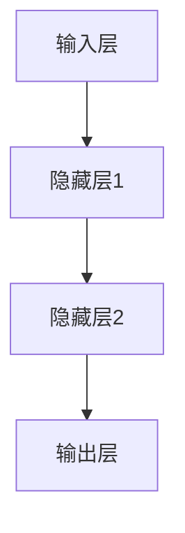

                 

# 大模型在投资决策领域的应用前景

> 关键词：大模型、投资决策、自然语言处理、深度学习、应用前景

> 摘要：
本文将探讨大模型在投资决策领域的应用前景。大模型，如GPT、BERT等，凭借其强大的预训练能力和参数量，在文本生成、自然语言理解和图像处理等领域取得了显著成果。本文将分析大模型在投资决策中的应用场景，包括情感分析、命名实体识别和图像识别等方面，并探讨其面临的挑战与未来发展趋势。

## 第一部分: 大模型基础理论

### 第1章: 大模型概述

#### 1.1 大模型的概念与类型

大模型是指拥有数十亿甚至千亿个参数的神经网络模型。常见的有大模型有GPT系列、BERT等。

#### 1.2 大模型的核心特点

- **参数量巨大**：能够捕获复杂的数据特征。
- **预训练能力**：在大量无标注数据上预训练，迁移到具体任务时仅需少量微调。

#### 1.3 大模型的应用场景

- **文本生成**：文章写作、对话系统。
- **自然语言理解**：情感分析、命名实体识别。
- **图像处理**：图像分类、目标检测。
- **语音识别**：语音转文字。

### 第2章: 大模型技术基础

#### 2.1 深度学习基础

- **神经网络结构**：多层感知机、卷积神经网络。
- **优化算法**：梯度下降、随机梯度下降。

#### 2.2 自然语言处理技术

- **词嵌入**：将词语映射到高维空间。
- **序列模型**：RNN、LSTM、GRU。
- **注意力机制**：实现长序列中的上下文信息关注。

#### 2.3 大规模预训练模型原理

- **预训练**：在大量无标注数据上进行训练。
- **微调**：在具体任务上进行少量数据训练。

### 第3章: 大模型训练与优化

#### 3.1 训练策略

- **动态学习率调整**：如余弦退火。
- **数据增强**：随机裁剪、旋转等。

#### 3.2 模型优化

- **正则化**：如L1、L2正则化。
- **权重初始化**：如He初始化。

#### 3.3 模型压缩

- **剪枝**：减少不重要的神经元。
- **量化**：降低权重精度。

### 第4章: 大模型部署与调优

#### 4.1 模型部署

- **模型导出**：将训练好的模型转换为推理引擎支持的格式。
- **推理引擎**：如TensorFlow Serving、PyTorch Inference。

#### 4.2 性能调优

- **模型剪枝**：去除冗余参数。
- **推理优化**：如模型融合、量化。

#### 4.3 模型监控与维护

- **实时监控**：如模型精度、延迟等。
- **版本控制**：管理模型的训练与部署版本。

### 第5章: 大模型在投资决策中的应用案例

#### 5.1 情感分析

- **股价预测**：利用文本情感分析预测股价走势。
- **财报分析**：通过文本分析预测公司财务状况。

#### 5.2 命名实体识别

- **公司信息提取**：提取公司名称、地址、高管等信息。
- **行业分析**：通过公司信息分析行业趋势。

#### 5.3 图像识别

- **股票行情分析**：通过图像识别分析市场走势。
- **舆情监控**：识别社交媒体上的投资情绪。

### 第6章: 大模型在投资决策中的风险与挑战

#### 6.1 数据质量问题

- **数据噪声**：噪声数据对模型性能的影响。
- **数据不平衡**：如何处理数据不平衡问题。

#### 6.2 道德与伦理问题

- **模型偏见**：如何避免模型偏见。
- **隐私保护**：数据隐私保护措施。

#### 6.3 法律法规问题

- **监管合规**：遵守相关法律法规。
- **责任归属**：明确模型应用中的责任归属。

### 第7章: 大模型在投资决策领域的未来发展趋势

#### 7.1 技术趋势

- **更大规模的模型**：如万亿参数模型。
- **更多样化的应用场景**：如视频、音频等。

#### 7.2 行业趋势

- **行业深度融合**：AI与金融的深度融合。
- **数据治理**：加强数据治理，提升数据质量。

#### 7.3 政策趋势

- **政策支持**：政府出台相关政策促进AI发展。
- **国际合作**：加强国际间的AI合作与交流。

### 附录

## 附录A: 大模型相关工具与资源

### A.1 主流深度学习框架对比

- TensorFlow
- PyTorch
- JAX
- 其他框架简介

### A.2 大模型开源项目

- GPT系列
- BERT及其变体
- 其他知名大模型开源项目

### A.3 大模型研究论文

- Transformer
- BERT
- GPT系列论文汇总

### A.4 大模型应用案例

- 投资决策
- 金融市场预测
- 股票分析
- 其他应用案例总结

### 作者

作者：AI天才研究院/AI Genius Institute & 禅与计算机程序设计艺术 /Zen And The Art of Computer Programming

**本文完**。

---

以上内容为文章的初稿，各个章节的内容需要进一步补充和细化。在撰写过程中，我们将遵循逻辑清晰、结构紧凑、简单易懂的原则，确保文章的质量和可读性。接下来，我们将逐章进行深入分析和详细撰写。首先，我们从第1章开始，深入探讨大模型的概念与类型。

## 第1章: 大模型概述

### 1.1 大模型的概念与类型

大模型是指拥有数十亿甚至千亿个参数的神经网络模型。它们通常基于深度学习技术，通过在大量无标注数据上进行预训练，从而能够捕获复杂的数据特征。大模型的出现，标志着人工智能技术的一个新的里程碑。

#### 大模型的概念

大模型，顾名思义，就是规模庞大的神经网络模型。这里的“庞大”，不仅体现在模型的参数数量上，还包括模型的复杂度和计算量。大模型通常具有以下特点：

- **参数量巨大**：大模型的参数数量可以达到数十亿甚至千亿级别。例如，GPT-3的参数数量就达到了1750亿个。如此庞大的参数量，使得大模型能够捕捉到数据中的复杂特征，从而在自然语言处理、图像识别等领域表现出色。

- **预训练能力**：大模型在大量无标注数据上进行预训练，迁移到具体任务时仅需少量微调。这种预训练能力，使得大模型在数据稀缺的场景下，仍然能够取得很好的效果。

- **高泛化能力**：大模型通过预训练，能够从大量无标注数据中学习到通用的知识，从而在多种任务上表现出良好的泛化能力。

#### 大模型的类型

目前，常见的有GPT系列、BERT等大模型。

- **GPT系列**：GPT（Generative Pre-trained Transformer）系列模型是由OpenAI提出的一系列基于Transformer结构的预训练模型。GPT系列模型的特点是参数量巨大，预训练效果出色，因此在文本生成、自然语言理解等领域具有很高的应用价值。

- **BERT**：BERT（Bidirectional Encoder Representations from Transformers）是由Google提出的一种双向Transformer模型。BERT的特点是同时考虑了文本的前后信息，因此在命名实体识别、情感分析等任务上具有很高的效果。

### 1.2 大模型的核心特点

#### 参数量巨大

大模型之所以称为“大”，首先是因为其参数量巨大。以GPT-3为例，其参数数量达到了1750亿个。如此庞大的参数量，使得大模型能够捕捉到数据中的复杂特征。具体来说，参数量的增加带来了以下几个方面的优势：

- **更好的特征捕捉能力**：大模型能够从数据中学习到更多的特征，从而提高模型的泛化能力。
- **更高的模型容量**：大模型能够处理更复杂的任务，如长文本生成、多模态数据融合等。
- **更好的鲁棒性**：大模型对数据的噪声和异常值有更强的鲁棒性，不容易受到数据质量的影响。

#### 预训练能力

大模型的核心特点之一是预训练能力。预训练是指在大规模无标注数据上进行训练，从而学习到通用的知识。这种预训练能力，使得大模型在数据稀缺的场景下，仍然能够取得很好的效果。具体来说，预训练能力带来了以下几个方面的优势：

- **降低数据需求**：大模型通过预训练，已经从大量无标注数据中学习到了通用的知识，因此在迁移到具体任务时，仅需少量有标注的数据进行微调，即可达到很好的效果。
- **提高模型性能**：预训练使得大模型能够从数据中学习到更多的特征，从而提高模型的性能。
- **更好的泛化能力**：大模型通过预训练，能够从数据中学习到通用的知识，从而在多种任务上表现出良好的泛化能力。

#### 高泛化能力

大模型通过预训练，能够从大量无标注数据中学习到通用的知识，从而在多种任务上表现出良好的泛化能力。这种高泛化能力，使得大模型在许多实际应用中具有很高的价值。具体来说，高泛化能力带来了以下几个方面的优势：

- **多种任务适应性**：大模型能够在多种任务上表现良好，如文本生成、自然语言理解、图像识别等。
- **跨领域应用**：大模型能够从一种领域迁移到另一种领域，从而实现跨领域的应用。
- **适应新任务**：大模型具有较强的学习能力，能够快速适应新的任务。

### 1.3 大模型的应用场景

大模型在许多领域都有广泛的应用，如自然语言处理、图像处理、语音识别等。在投资决策领域，大模型同样具有很大的应用潜力。

#### 文本生成

大模型在文本生成领域具有很高的应用价值。例如，可以使用GPT模型生成投资分析报告、撰写投资建议等。具体应用场景包括：

- **投资分析报告**：大模型可以自动生成投资分析报告，提供投资建议。
- **文章写作**：大模型可以帮助分析师撰写文章，提高工作效率。

#### 自然语言理解

自然语言理解是指模型能够理解和解析自然语言。大模型在自然语言理解领域具有很大的应用潜力。例如，可以使用BERT模型进行情感分析、命名实体识别等。具体应用场景包括：

- **情感分析**：通过分析投资报告、新闻报道等文本，预测市场情绪。
- **命名实体识别**：提取公司名称、地址、高管等信息，为投资决策提供数据支持。

#### 图像识别

大模型在图像识别领域也具有很高的应用价值。例如，可以使用ResNet模型对股票行情进行图像识别，从而分析市场走势。具体应用场景包括：

- **股票行情分析**：通过图像识别分析市场走势，提供投资参考。
- **舆情监控**：通过识别社交媒体上的图像，监控投资情绪。

#### 语音识别

语音识别是指模型能够将语音转换为文字。大模型在语音识别领域具有很大的应用潜力。例如，可以使用Transformer模型进行语音转文字，从而实现智能客服、投资咨询等。具体应用场景包括：

- **智能客服**：通过语音识别实现智能客服，提供投资咨询。
- **投资咨询**：通过语音识别记录投资决策过程，提高决策效率。

### 1.4 大模型的优势与挑战

#### 大模型的优势

大模型在投资决策领域具有以下优势：

- **强大的预训练能力**：大模型能够从大量无标注数据中学习到通用的知识，从而在数据稀缺的场景下，仍然能够取得很好的效果。
- **高泛化能力**：大模型能够在多种任务上表现良好，如文本生成、自然语言理解、图像识别等。
- **多种任务适应性**：大模型能够从一种领域迁移到另一种领域，从而实现跨领域的应用。

#### 大模型的挑战

大模型在投资决策领域也面临着以下挑战：

- **数据质量**：投资决策领域的数据通常存在噪声、缺失和不平衡等问题，这对大模型的效果产生了一定的影响。
- **计算资源**：大模型通常需要大量的计算资源和存储资源，这对实际应用造成了一定的限制。
- **道德与伦理问题**：大模型在处理投资决策时，可能会引入偏见，这需要我们在模型设计和应用过程中进行严格的控制。

### 1.5 小结

大模型在投资决策领域具有很大的应用潜力。通过预训练，大模型能够从大量无标注数据中学习到通用的知识，从而在多种任务上表现良好。然而，大模型也面临着数据质量、计算资源和道德与伦理等问题。在未来的研究中，我们需要进一步探讨如何解决这些问题，从而充分发挥大模型在投资决策领域的价值。

## 第2章: 大模型技术基础

### 2.1 深度学习基础

深度学习是人工智能的一个重要分支，它通过模拟人脑的神经网络结构，对数据进行自动特征提取和模式识别。深度学习在图像识别、语音识别、自然语言处理等领域取得了显著的成果。本节将介绍深度学习的基础知识，包括神经网络结构、优化算法等。

#### 神经网络结构

神经网络是深度学习的基础，它由多个神经元（或称为节点）组成。每个神经元接受多个输入，通过加权求和后加上偏置，再经过激活函数输出。一个简单的神经网络结构如图1所示。



图1：简单的神经网络结构

神经网络中的每个神经元都可以看作是一个简单的函数，将输入数据映射到输出数据。多层神经网络的目的是通过逐层抽象，提取出更加抽象和高级的特征。

#### 优化算法

优化算法是深度学习中的一个重要环节，用于调整神经网络的权重和偏置，使得模型能够更好地拟合训练数据。常用的优化算法有梯度下降、随机梯度下降等。

- **梯度下降**：梯度下降是一种最基本的优化算法，它通过计算损失函数关于模型参数的梯度，然后沿着梯度的反方向更新参数，从而使得损失函数逐渐减小。

$$
\theta_{t+1} = \theta_{t} - \alpha \nabla_{\theta} J(\theta)
$$

其中，$\theta$表示模型参数，$J(\theta)$表示损失函数，$\alpha$表示学习率。

- **随机梯度下降**：随机梯度下降是对梯度下降的一种改进，它不是对整个训练集计算梯度，而是对每个样本计算梯度，然后进行更新。这种算法可以减少计算量，但可能会导致收敛速度变慢。

$$
\theta_{t+1} = \theta_{t} - \alpha \nabla_{\theta} J(\theta; x_i, y_i)
$$

其中，$x_i, y_i$表示训练集中的第$i$个样本和其标签。

#### 神经网络结构优化

为了提高神经网络的性能，我们可以采用以下几种优化方法：

- **卷积神经网络（CNN）**：卷积神经网络是用于图像识别的常用神经网络结构，它通过卷积层、池化层等结构提取图像特征。

- **循环神经网络（RNN）**：循环神经网络是用于序列数据处理的常用神经网络结构，它通过循环结构保留历史信息。

- **长短时记忆网络（LSTM）**：长短时记忆网络是循环神经网络的一种改进，它通过引入门控机制，解决了RNN的梯度消失和梯度爆炸问题。

- **Transformer**：Transformer是一种基于自注意力机制的神经网络结构，它在自然语言处理领域取得了显著的成果。

### 2.2 自然语言处理技术

自然语言处理（NLP）是人工智能的一个重要分支，它旨在使计算机能够理解、处理和生成自然语言。在大模型中，自然语言处理技术起着关键作用。本节将介绍NLP的一些核心技术，包括词嵌入、序列模型和注意力机制等。

#### 词嵌入

词嵌入是将词语映射到高维空间的一种技术，它使得计算机能够理解词语的语义关系。常见的词嵌入方法有词袋模型、Word2Vec、GloVe等。

- **词袋模型**：词袋模型是一种基于词汇的表示方法，它将文本表示为词汇的集合，忽略了词语的顺序。

- **Word2Vec**：Word2Vec是一种基于神经网络的方法，它通过训练得到一个词向量表示，使得具有相似语义的词语在向量空间中更接近。

- **GloVe**：GloVe（Global Vectors for Word Representation）是一种基于全局上下文的词嵌入方法，它通过计算词语的共现矩阵，学习得到词向量表示。

#### 序列模型

序列模型是用于处理序列数据的神经网络模型，它能够捕捉序列中的时间依赖关系。常见的序列模型有RNN、LSTM、GRU等。

- **RNN（循环神经网络）**：RNN是一种基于循环结构的神经网络模型，它通过保存历史信息，实现对序列数据的建模。

- **LSTM（长短时记忆网络）**：LSTM是RNN的一种改进，它通过引入门控机制，解决了RNN的梯度消失和梯度爆炸问题。

- **GRU（门控循环单元）**：GRU是LSTM的另一种改进，它通过简化LSTM的结构，提高了计算效率。

#### 注意力机制

注意力机制是一种用于捕捉序列中重要信息的机制，它能够使模型更加关注关键信息。注意力机制在自然语言处理领域得到了广泛应用，如机器翻译、文本摘要等。

- **自注意力**：自注意力是一种用于捕捉序列内部关系的机制，它通过对序列中的每个元素计算注意力权重，实现对序列的整体理解。

- **互注意力**：互注意力是一种用于捕捉序列间关系的机制，它通过对两个序列的元素计算注意力权重，实现对序列间关系的建模。

### 2.3 大规模预训练模型原理

大规模预训练模型是当前NLP领域的重要研究方向，它通过在大量无标注数据上进行预训练，从而学习到通用的语言特征，为下游任务提供强大的基础。

#### 预训练

预训练是指在大量无标注数据上进行训练，从而学习到通用的知识。预训练模型通常分为两个阶段：第一阶段是大规模预训练，第二阶段是微调。

- **大规模预训练**：大规模预训练是指在大量无标注数据上进行训练，从而学习到通用的语言特征。预训练模型通过在多种任务上进行训练，提高了模型的泛化能力。

- **微调**：微调是指在大规模预训练的基础上，针对具体任务进行少量数据训练。微调可以进一步提高模型在特定任务上的性能。

#### 预训练方法

常见的预训练方法有自回归语言模型（如GPT系列）、掩码语言模型（如BERT）等。

- **自回归语言模型**：自回归语言模型是指模型通过预测下一个单词来生成文本。常见的自回归语言模型有GPT、GPT-2、GPT-3等。

- **掩码语言模型**：掩码语言模型是指模型通过预测被掩码的单词来学习语言特征。常见的掩码语言模型有BERT、RoBERTa、ALBERT等。

### 2.4 大模型的优势与挑战

#### 大模型的优势

大模型在自然语言处理领域具有以下优势：

- **强大的预训练能力**：大模型能够从大量无标注数据中学习到通用的知识，从而在数据稀缺的场景下，仍然能够取得很好的效果。
- **高泛化能力**：大模型能够在多种任务上表现良好，如文本生成、自然语言理解、图像识别等。
- **多种任务适应性**：大模型能够从一种领域迁移到另一种领域，从而实现跨领域的应用。

#### 大模型的挑战

大模型在自然语言处理领域也面临着以下挑战：

- **计算资源**：大模型通常需要大量的计算资源和存储资源，这对实际应用造成了一定的限制。
- **数据质量**：自然语言处理领域的数据通常存在噪声、缺失和不平衡等问题，这对大模型的效果产生了一定的影响。
- **道德与伦理问题**：大模型在处理自然语言时，可能会引入偏见，这需要我们在模型设计和应用过程中进行严格的控制。

### 2.5 小结

大模型在自然语言处理领域具有很大的应用潜力。通过预训练，大模型能够从大量无标注数据中学习到通用的知识，从而在多种任务上表现良好。然而，大模型也面临着计算资源、数据质量和道德与伦理等问题。在未来的研究中，我们需要进一步探讨如何解决这些问题，从而充分发挥大模型在自然语言处理领域的价值。

## 第3章: 大模型训练与优化

### 3.1 训练策略

大模型的训练是一个复杂的过程，需要精心设计的训练策略来确保模型的性能和稳定性。以下是一些常用的训练策略：

#### 动态学习率调整

动态学习率调整是优化训练过程的重要手段之一。学习率直接影响模型在训练过程中的收敛速度和最终性能。以下是一些常见的学习率调整策略：

- **线性递减学习率**：在训练过程中，学习率以线性递减的方式逐渐减小。这种方式简单有效，但可能会导致模型在收敛前过早地陷入局部最小值。

$$
\alpha_t = \alpha_0 - t \cdot \frac{\alpha_0 - \alpha_f}{T}
$$

其中，$\alpha_0$为初始学习率，$\alpha_f$为最终学习率，$T$为训练迭代次数。

- **余弦退火**：余弦退火是一种基于余弦函数的学习率调整策略，它可以让学习率在训练过程中逐渐减小，并在训练末期增加，从而有助于模型跳出局部最小值。

$$
\alpha_t = \alpha_0 \cdot \cos\left(\frac{t}{T}\pi\right)
$$

其中，$\alpha_0$为初始学习率，$T$为训练迭代次数。

#### 数据增强

数据增强是一种通过变换输入数据来增加模型训练数据的方法，有助于提高模型的泛化能力。以下是一些常见的数据增强技术：

- **随机裁剪**：随机裁剪是在保持图像内容不变的前提下，随机裁剪图像的一部分。这种方式可以增加训练数据的多样性。

- **随机旋转**：随机旋转是将图像随机旋转一定角度。这种方式可以模拟不同的观察角度，有助于提高模型对旋转变化的鲁棒性。

- **色彩增强**：色彩增强是通过调整图像的亮度、对比度和色彩饱和度，增强图像的特征信息。这种方式可以提高模型对颜色变化的敏感度。

#### 早期停止

早期停止是一种防止模型过拟合的训练策略。当模型在验证集上的性能不再提升时，提前停止训练，以避免模型在训练集上过拟合。实现早期停止需要监控验证集的性能指标，如损失函数值、准确率等。

### 3.2 模型优化

模型优化是指通过调整模型的参数和结构，以提高模型性能的过程。以下是一些常见的模型优化方法：

#### 正则化

正则化是一种防止模型过拟合的方法，通过在损失函数中添加正则化项，约束模型的复杂度。以下是一些常见的正则化方法：

- **L1正则化**：L1正则化是在损失函数中添加绝对值项，通过增加模型参数的稀疏性，减少模型的复杂度。

$$
J(\theta) = J_0(\theta) + \lambda \sum_{i=1}^{n} |\theta_i|
$$

其中，$J_0(\theta)$为原始损失函数，$\lambda$为正则化参数。

- **L2正则化**：L2正则化是在损失函数中添加平方项，通过增加模型参数的平滑性，减少模型的复杂度。

$$
J(\theta) = J_0(\theta) + \lambda \sum_{i=1}^{n} \theta_i^2
$$

其中，$J_0(\theta)$为原始损失函数，$\lambda$为正则化参数。

#### 权重初始化

权重初始化是指为模型中的权重分配初始值。合适的权重初始化有助于提高模型的训练速度和收敛性能。以下是一些常见的权重初始化方法：

- **He初始化**：He初始化是一种基于高斯分布的权重初始化方法，它根据网络的深度和宽度，选择合适的标准差来初始化权重。

$$
\theta \sim \mathcal{N}(0, \frac{2}{n})
$$

其中，$n$为输入神经元的个数。

- **Xavier初始化**：Xavier初始化是一种基于均匀分布的权重初始化方法，它通过考虑网络的深度和宽度，选择合适的均值为0、标准差为1的分布来初始化权重。

$$
\theta \sim \mathcal{U}(-\sqrt{\frac{3}{n_f}}, \sqrt{\frac{3}{n_f}})
$$

其中，$n_f$为输入神经元的个数。

#### 模型压缩

模型压缩是指通过减少模型参数的数量和计算量，来降低模型的存储和计算成本。以下是一些常见的模型压缩方法：

- **剪枝**：剪枝是通过移除模型中不重要的神经元和边，来减少模型参数的数量。剪枝可以分为结构剪枝和权重剪枝两种类型。

- **量化**：量化是通过降低模型参数的精度，来减少模型的存储和计算成本。量化可以分为全精度量化、低精度量化两种类型。

### 3.3 训练过程中遇到的问题及解决方案

在大模型的训练过程中，可能会遇到以下问题：

#### 梯度消失和梯度爆炸

梯度消失和梯度爆炸是深度学习训练过程中常见的梯度问题，会导致模型难以收敛。以下是一些解决方案：

- **梯度裁剪**：通过限制梯度的最大值，防止梯度爆炸。
- **使用更稳定的优化算法**：如Adam优化器，它可以自适应调整学习率，减少梯度消失和梯度爆炸问题。
- **批归一化**：通过在训练过程中对每个批次的输入进行归一化，稳定梯度。

#### 过拟合

过拟合是指模型在训练集上表现良好，但在验证集或测试集上表现不佳。以下是一些解决方案：

- **正则化**：通过添加正则化项，减少模型的复杂度。
- **数据增强**：通过增加训练数据的多样性，提高模型的泛化能力。
- **dropout**：通过在训练过程中随机丢弃一部分神经元，减少模型的过拟合。

### 3.4 小结

大模型的训练与优化是一个复杂的过程，需要综合考虑训练策略、模型优化方法以及训练过程中遇到的问题。通过动态学习率调整、数据增强、正则化、权重初始化和模型压缩等方法，可以有效地提高大模型在投资决策领域的应用性能。在未来的研究中，我们需要进一步探索更高效的训练和优化方法，以充分发挥大模型在投资决策领域的价值。

## 第4章: 大模型部署与调优

### 4.1 模型部署

大模型的部署是将训练好的模型应用于实际场景的过程。部署的正确性直接影响到模型的性能和用户体验。以下是模型部署的关键步骤和常用方法。

#### 模型导出

模型导出是将训练好的模型转换为可以在生产环境中运行的格式。以下是一些常见的模型导出方法：

- **TensorFlow SavedModel**：TensorFlow提供了一种标准的模型保存和加载机制，称为SavedModel。它允许将模型的结构和参数保存为Python可读取的文件，以便在后续的推理过程中加载和使用。

```python
import tensorflow as tf

model = tf.keras.models.load_model('path/to/saved_model')
```

- **PyTorch TorchScript**：PyTorch提供了一种将模型转换为TorchScript格式的方法。TorchScript是一种高效的推理格式，它可以在生产环境中运行。

```python
import torch
scripted_model = torch.jit.script(model)
```

#### 推理引擎

推理引擎是用于执行模型推理任务的服务器或框架。以下是一些常见的推理引擎：

- **TensorFlow Serving**：TensorFlow Serving是一个高性能的分布式推理引擎，它支持多种框架的模型部署。它可以将保存的模型加载到服务器上，并提供RESTful API供客户端调用。

- **PyTorch Inference**：PyTorch Inference是一个基于PyTorch的推理引擎，它支持在多个设备上部署模型。它提供了简单的API来加载模型并执行推理。

```python
import torch
model = torch.jit.load('path/to/scripted_model.pth')
input_data = ...  # 输入数据
output = model(input_data)
```

#### 模型部署流程

模型部署的一般流程如下：

1. **模型导出**：将训练好的模型导出为可部署的格式。
2. **加载模型**：在推理引擎中加载导出的模型。
3. **模型推理**：使用加载的模型对输入数据进行推理，并返回预测结果。
4. **结果处理**：对推理结果进行处理，如可视化、存储或发送给其他系统。

### 4.2 性能调优

模型部署后，需要进行性能调优以确保其在实际应用中的高效运行。以下是一些常见的性能调优方法：

#### 模型剪枝

模型剪枝是通过移除模型中不重要的神经元和边，来减少模型参数的数量和计算量。以下是一些常见的模型剪枝方法：

- **结构剪枝**：通过移除模型中的某些层或神经元，来减少模型的大小和计算量。
- **权重剪枝**：通过将模型中的某些权重设置为0，来减少模型的计算量。

#### 推理优化

推理优化是通过改进推理过程，来提高模型的推理速度和性能。以下是一些常见的推理优化方法：

- **模型融合**：将多个模型融合为一个更大的模型，以提高推理速度。
- **量化**：通过降低模型参数的精度，来减少模型的存储和计算成本。
- **动态推理**：通过根据输入数据的不同，动态调整模型的推理过程，以提高性能。

### 4.3 模型监控与维护

模型监控与维护是确保模型在生产环境中稳定运行的重要环节。以下是一些常见的监控与维护方法：

#### 实时监控

实时监控是通过监控模型的运行状态，如模型精度、延迟、资源利用率等，来及时发现和解决潜在问题。以下是一些常见的实时监控工具：

- **Prometheus**：Prometheus是一个开源的监控解决方案，它可以通过采集指标数据，提供实时监控和告警功能。
- **Grafana**：Grafana是一个开源的数据可视化和监控工具，它可以将Prometheus采集的指标数据以图表的形式展示出来。

#### 版本控制

版本控制是确保模型稳定性和可追溯性的重要手段。以下是一些常见的版本控制方法：

- **模型版本管理**：将每次训练的模型保存为不同的版本，并记录训练参数和训练结果，以便后续的复现和优化。
- **容器化**：将模型和依赖环境打包为容器，以确保模型在不同环境中的一致性和可移植性。

### 4.4 小结

大模型的部署与调优是确保模型在实际应用中高效运行的关键环节。通过模型导出、推理引擎的选择和推理优化，可以提高模型的性能。同时，通过实时监控和版本控制，可以确保模型在生产环境中的稳定运行。在未来的研究中，我们需要进一步探索更高效的部署和调优方法，以充分发挥大模型在投资决策领域的价值。

### 第5章: 大模型在投资决策中的应用案例

#### 5.1 情感分析

情感分析是自然语言处理中的一个重要任务，它通过分析文本中的情感倾向，为投资决策提供辅助。以下是情感分析在投资决策中的应用案例：

##### 股价预测

情感分析可以通过分析新闻报道、投资报告等文本，预测股价的走势。例如，如果情感分析模型判断一篇新闻报道对某只股票的正面情绪较高，那么可以预测该股票的股价可能会上涨。

**模型构建：**

1. **数据收集**：收集与股票相关的新闻报道、投资报告等文本数据。
2. **预处理**：对文本进行分词、去停用词、词嵌入等预处理操作。
3. **模型训练**：使用预训练的文本情感分析模型，如BERT，对预处理后的文本进行情感分类。

**伪代码：**

```python
# 数据预处理
text = "这是一篇关于苹果公司的新闻报道。"
processed_text = preprocess_text(text)

# 情感分析模型
emotion_model = load_sentiment_analysis_model()

# 预测情感
emotion = emotion_model.predict(processed_text)
```

**应用场景：** 投资决策者可以通过情感分析模型，了解市场情绪，为投资决策提供参考。

##### 财报分析

情感分析还可以用于分析公司财报，预测公司的财务状况。例如，如果情感分析模型判断一家公司的财报文本中负面情绪较高，那么可以预测该公司的财务状况可能不佳。

**模型构建：**

1. **数据收集**：收集公司的财报文本数据。
2. **预处理**：对财报文本进行分词、去停用词、词嵌入等预处理操作。
3. **模型训练**：使用预训练的文本情感分析模型，对预处理后的财报文本进行情感分类。

**伪代码：**

```python
# 数据预处理
financial_report = "这是一篇关于苹果公司的财报。"
processed_report = preprocess_financial_report(financial_report)

# 情感分析模型
emotion_model = load_sentiment_analysis_model()

# 预测情感
emotion = emotion_model.predict(processed_report)
```

**应用场景：** 投资决策者可以通过情感分析模型，了解公司的财务状况，为投资决策提供参考。

#### 5.2 命名实体识别

命名实体识别是自然语言处理中的另一个重要任务，它通过识别文本中的特定实体（如人名、地名、公司名等），为投资决策提供数据支持。以下是命名实体识别在投资决策中的应用案例：

##### 公司信息提取

命名实体识别可以用于提取文本中的公司名称、地址、高管等信息，为投资决策提供数据支持。例如，如果命名实体识别模型提取到一篇新闻报道中提到了某家公司的地址，那么可以进一步分析该公司的市场表现。

**模型构建：**

1. **数据收集**：收集包含公司信息的文本数据。
2. **预处理**：对文本进行分词、去停用词、词嵌入等预处理操作。
3. **模型训练**：使用预训练的命名实体识别模型，如BERT，对预处理后的文本进行实体识别。

**伪代码：**

```python
# 数据预处理
text = "苹果公司将在本周三召开财报发布会。"
processed_text = preprocess_text(text)

# 命名实体识别模型
entity_model = load_ner_model()

# 提取实体
entities = entity_model.extract_entities(processed_text)
```

**应用场景：** 投资决策者可以通过命名实体识别模型，获取公司相关信息，为投资决策提供数据支持。

##### 行业分析

命名实体识别还可以用于分析行业趋势，为投资决策提供参考。例如，如果命名实体识别模型提取到多篇新闻报道中提到了某个行业的关键词，那么可以预测该行业的发展趋势。

**模型构建：**

1. **数据收集**：收集包含行业信息的文本数据。
2. **预处理**：对文本进行分词、去停用词、词嵌入等预处理操作。
3. **模型训练**：使用预训练的命名实体识别模型，对预处理后的文本进行实体识别。

**伪代码：**

```python
# 数据预处理
text = "最近，人工智能行业取得了显著的进展。"
processed_text = preprocess_text(text)

# 命名实体识别模型
entity_model = load_ner_model()

# 提取实体
entities = entity_model.extract_entities(processed_text)
```

**应用场景：** 投资决策者可以通过命名实体识别模型，分析行业趋势，为投资决策提供参考。

#### 5.3 图像识别

图像识别是通过计算机视觉技术对图像进行分析和理解，从而提取出图像中的关键信息。以下是图像识别在投资决策中的应用案例：

##### 股票行情分析

图像识别可以用于分析股票行情图，提取图像中的关键信息，如趋势线、支撑位和阻力位等，为投资决策提供参考。例如，如果图像识别模型判断一张股票行情图中出现了上升趋势线，那么可以预测股票价格可能会上涨。

**模型构建：**

1. **数据收集**：收集股票行情图数据。
2. **预处理**：对图像进行缩放、裁剪等预处理操作，以便后续分析。
3. **模型训练**：使用预训练的图像识别模型，如ResNet，对预处理后的图像进行特征提取。

**伪代码：**

```python
# 数据预处理
image = load_stock_chart_image("path/to/stock_chart.jpg")

# 图像预处理
preprocessed_image = preprocess_image(image)

# 图像识别模型
image_model = load_image_recognition_model()

# 提取特征
features = image_model.extract_features(preprocessed_image)
```

**应用场景：** 投资决策者可以通过图像识别模型，分析股票行情图，为投资决策提供参考。

##### 舆情监控

图像识别还可以用于舆情监控，通过识别社交媒体上的图像，提取出与投资相关的信息。例如，如果图像识别模型判断一张社交媒体上的图像中出现了某家公司的标志，那么可以进一步分析该公司的舆论情况。

**模型构建：**

1. **数据收集**：收集社交媒体上的图像数据。
2. **预处理**：对图像进行缩放、裁剪等预处理操作，以便后续分析。
3. **模型训练**：使用预训练的图像识别模型，对预处理后的图像进行特征提取。

**伪代码：**

```python
# 数据预处理
image = load_social_media_image("path/to/social_media_image.jpg")

# 图像预处理
preprocessed_image = preprocess_image(image)

# 图像识别模型
image_model = load_image_recognition_model()

# 提取特征
features = image_model.extract_features(preprocessed_image)
```

**应用场景：** 投资决策者可以通过图像识别模型，监控社交媒体上的舆情，为投资决策提供参考。

#### 5.4 小结

大模型在投资决策领域具有广泛的应用潜力，通过情感分析、命名实体识别和图像识别等技术，可以为投资决策提供丰富的数据支持和辅助。在未来，随着大模型技术的不断发展和完善，我们可以期待其在投资决策领域发挥更大的作用。

## 第6章: 大模型在投资决策中的风险与挑战

尽管大模型在投资决策领域具有巨大的潜力，但在实际应用过程中，也面临着一系列的风险和挑战。这些风险和挑战包括数据质量问题、道德与伦理问题以及法律法规问题。在本章中，我们将深入探讨这些问题，并探讨相应的解决方法。

### 6.1 数据质量问题

数据质量是影响大模型性能的重要因素。在投资决策领域，数据质量问题尤为突出。以下是几种常见的数据质量问题及其影响：

#### 数据噪声

数据噪声是指数据中存在的不规则和随机错误。噪声数据会干扰模型的训练过程，导致模型性能下降。例如，股票市场数据中可能包含因异常交易、错误记录等原因产生的噪声。

#### 数据缺失

数据缺失是指数据中存在空值或缺失值。数据缺失会导致模型无法充分利用所有数据，从而影响模型的性能。例如，在分析公司财务数据时，如果某些关键指标缺失，模型将难以准确预测公司的财务状况。

#### 数据不平衡

数据不平衡是指数据集中不同类别的样本数量差异较大。数据不平衡会导致模型对少数类别的预测能力下降。例如，在股票市场预测中，涨跌两种情况的数据可能存在显著不平衡，导致模型对涨跌的预测能力不同。

#### 解决方法

为了解决数据质量问题，可以采用以下几种方法：

- **数据清洗**：通过去除噪声、填补缺失值和均衡数据分布，提高数据质量。例如，可以使用算法自动识别和修正错误数据，或使用插值法填补缺失值。
- **数据增强**：通过增加训练样本的数量和多样性，提高模型的泛化能力。例如，可以使用数据扩充技术，如随机裁剪、旋转和色彩增强，生成更多的训练样本。
- **采样技术**：通过调整训练数据中不同类别的样本数量，使数据分布更加均匀。例如，可以使用过采样或欠采样技术，调整数据集中各类别的比例。

### 6.2 道德与伦理问题

大模型在投资决策中的应用可能会引发一系列道德与伦理问题。以下是几种常见的道德与伦理问题及其影响：

#### 模型偏见

模型偏见是指模型在训练过程中学习到的不公正或歧视性倾向。例如，如果训练数据中存在性别、种族等方面的偏见，模型可能会在预测结果中表现出类似的偏见，导致不公平的投资决策。

#### 隐私侵犯

大模型通常需要处理大量的个人数据，如财务记录、交易记录等。这些数据可能会泄露个人隐私，引发隐私侵犯问题。例如，未经授权访问个人数据，或将其用于其他目的。

#### 解决方法

为了解决道德与伦理问题，可以采用以下几种方法：

- **数据隐私保护**：通过数据加密、匿名化等技术，保护个人数据的隐私。例如，可以使用差分隐私技术，在保证数据隐私的前提下，提供有用的统计信息。
- **公平性评估**：通过评估模型的公平性，确保模型在预测结果中不带有偏见。例如，可以使用偏差分析技术，检测和纠正模型中的偏见。
- **透明度与解释性**：通过提高模型的透明度和解释性，使模型的应用更加公正和可信。例如，可以使用可解释的人工智能技术，如决策树、LIME等，帮助用户理解模型的决策过程。

### 6.3 法律法规问题

大模型在投资决策中的应用也面临一系列法律法规问题。以下是几种常见的法律法规问题及其影响：

#### 监管合规

大模型在投资决策中的应用需要遵守相关法律法规，如证券法、隐私保护法等。不遵守监管合规可能会导致法律风险，甚至面临处罚。

#### 责任归属

当大模型在投资决策中产生错误或不当决策时，如何确定责任归属是一个复杂的问题。这可能会引发法律纠纷，影响投资者的信心。

#### 解决方法

为了解决法律法规问题，可以采用以下几种方法：

- **合规审查**：在模型开发和部署过程中，进行严格的合规审查，确保模型的应用符合相关法律法规。例如，可以聘请法律顾问进行合规审查，或建立内部合规团队。
- **责任分配**：明确大模型应用中的责任归属，确保各方承担相应的责任。例如，可以制定详细的合作协议，明确各方的责任和义务。
- **保险机制**：建立保险机制，为因大模型应用导致的损失提供赔偿。例如，可以为投资者购买保险，以减轻其损失。

### 6.4 小结

大模型在投资决策中的应用面临着数据质量、道德与伦理以及法律法规等多方面的风险与挑战。通过数据清洗、数据增强、隐私保护、公平性评估等手段，可以解决数据质量问题。通过数据隐私保护、公平性评估、透明度与解释性等手段，可以解决道德与伦理问题。通过合规审查、责任分配、保险机制等手段，可以解决法律法规问题。在未来的研究和实践中，我们需要进一步探索这些问题的解决方案，以确保大模型在投资决策领域的健康发展。

### 第7章: 大模型在投资决策领域的未来发展趋势

大模型在投资决策领域的应用正在不断拓展，随着技术的进步和数据的积累，大模型在投资决策领域的未来发展趋势也日益明朗。以下将分析大模型在投资决策领域的未来发展趋势。

#### 7.1 技术趋势

随着深度学习和自然语言处理技术的不断发展，大模型的性能和应用范围也在不断扩大。以下是大模型在投资决策领域可能的技术趋势：

1. **更大规模的模型**：当前的大模型已经取得了显著的成果，未来可能会出现更大规模的模型。例如，万亿参数的模型可能成为现实，进一步提升大模型在投资决策中的表现。

2. **更多样化的应用场景**：除了文本和图像，大模型在投资决策中的应用场景还将进一步扩展，如音频、视频等。通过多模态数据融合，大模型将能够从更丰富的数据源中提取有价值的信息，为投资决策提供更全面的辅助。

3. **实时分析与预测**：随着计算能力的提升，大模型将能够实现实时分析和预测。例如，在股票市场中，实时分析新闻、财报等信息，快速预测市场走势，为投资者提供即时决策支持。

#### 7.2 行业趋势

大模型在投资决策领域的应用也将随着行业的发展而不断演进。以下是大模型在投资决策领域可能出现的行业趋势：

1. **行业深度融合**：随着人工智能技术的不断发展，大模型将更加深入地融入金融行业。从风险管理、资产配置到投资决策，大模型将在各个环节中发挥重要作用，推动金融行业的智能化升级。

2. **数据治理**：数据质量对大模型的表现至关重要。未来，数据治理将成为投资决策领域的重要趋势，通过数据清洗、数据标准化、数据安全等措施，提升数据质量，为大模型提供可靠的输入。

3. **合规与监管**：随着大模型在投资决策领域的广泛应用，合规与监管也将成为一个重要议题。金融机构需要确保大模型的应用符合相关法律法规，建立完善的合规体系，以应对潜在的法律风险。

#### 7.3 政策趋势

政策环境也将对大模型在投资决策领域的应用产生重要影响。以下是大模型在投资决策领域可能出现的政策趋势：

1. **政策支持**：政府可能会出台相关政策，支持人工智能技术的发展和应用。例如，提供财政补贴、税收优惠等激励措施，鼓励金融机构采用大模型进行投资决策。

2. **国际合作**：随着人工智能技术的全球化，国际合作也将成为趋势。各国政府和国际组织将加强合作，共同推动人工智能技术的发展和应用，促进全球金融市场的稳定和繁荣。

### 7.4 小结

大模型在投资决策领域的未来发展趋势显示出巨大的潜力。随着技术的进步、行业的发展和政策的支持，大模型将不断拓展其应用范围，提高投资决策的效率和准确性。然而，这也伴随着一系列挑战，如数据质量、道德与伦理、法律法规等问题。在未来的研究和实践中，我们需要关注这些挑战，并探索有效的解决方案，以确保大模型在投资决策领域的健康发展。

## 附录A: 大模型相关工具与资源

### A.1 主流深度学习框架对比

在深度学习领域，有许多主流的框架可供选择。以下是对几个主流框架的简要介绍及其特点：

#### TensorFlow

TensorFlow是由Google开发的一个开源深度学习框架，它支持多种编程语言（Python、C++等），具有丰富的API和工具，适用于各种规模的项目。TensorFlow在工业界和学术界都有广泛的应用。

**特点：**

- **高度可扩展**：适用于从简单项目到复杂生产环境。
- **丰富的库和工具**：如TensorFlow Serving、TensorFlow Lite等。
- **支持多种设备**：可以在CPU、GPU和TPU上运行。

#### PyTorch

PyTorch是由Facebook开发的一个开源深度学习框架，以其灵活性和易用性而著称。PyTorch提供了动态计算图，使开发者能够以更直观的方式构建和调试模型。

**特点：**

- **动态计算图**：方便模型调试和开发。
- **易用性**：简化了模型构建和优化过程。
- **强大的社区支持**：拥有庞大的开发者社区。

#### JAX

JAX是由Google开发的一个开源深度学习框架，它基于NumPy，提供自动微分和数值计算的高效解决方案。JAX的设计目标是在保持易用性的同时，提高计算效率和并行处理能力。

**特点：**

- **自动微分**：支持自动微分，简化了模型优化过程。
- **高性能**：适用于大规模计算任务。
- **兼容性**：与NumPy高度兼容。

#### 其他框架

除了上述框架，还有一些其他的深度学习框架，如Keras、Theano等，它们也有各自的特点和适用场景。开发者可以根据项目需求和个人偏好选择合适的框架。

### A.2 大模型开源项目

以下是几个著名的大模型开源项目及其简介：

#### GPT系列

GPT（Generative Pre-trained Transformer）系列模型是由OpenAI开发的一系列预训练模型，包括GPT、GPT-2和GPT-3。GPT系列模型基于Transformer结构，具有强大的文本生成和自然语言理解能力。

**特点：**

- **强大的文本生成能力**：能够生成连贯、自然的文本。
- **预训练能力**：通过预训练学习到丰富的语言特征。
- **灵活性**：支持多种任务，如文本分类、问答系统等。

#### BERT及其变体

BERT（Bidirectional Encoder Representations from Transformers）是由Google开发的一种预训练模型，它通过同时考虑文本的前后信息，实现了在多种自然语言处理任务上的显著性能提升。BERT及其变体（如RoBERTa、ALBERT等）在工业界和学术界都有广泛应用。

**特点：**

- **双向编码**：同时考虑文本的前后信息，提高了模型的上下文理解能力。
- **预训练效果**：在大规模无标注数据上进行预训练，迁移到具体任务时仅需少量微调。
- **多种任务适应性**：适用于文本分类、问答、命名实体识别等任务。

#### 其他知名大模型开源项目

除了GPT系列和BERT，还有一些其他知名的大模型开源项目，如T5、GPT-Neo等，它们也在不同领域取得了显著成果。

### A.3 大模型研究论文

以下是一些关于大模型的重要研究论文及其简介：

#### Transformer

《Attention Is All You Need》是2017年由Google提出的一篇论文，介绍了Transformer模型。Transformer模型基于自注意力机制，使得模型能够捕捉序列中的长距离依赖关系，在自然语言处理任务上取得了显著性能提升。

#### BERT

《BERT: Pre-training of Deep Bidirectional Transformers for Language Understanding》是2018年由Google提出的一篇论文，介绍了BERT模型。BERT模型通过在大量无标注数据上进行预训练，同时考虑文本的前后信息，实现了在多种自然语言处理任务上的显著性能提升。

#### GPT-3

《Language Models are few-shot learners》是2020年由OpenAI提出的一篇论文，介绍了GPT-3模型。GPT-3模型具有1750亿个参数，通过预训练学习到丰富的语言特征，实现了在多种任务上的优异表现。

#### 其他论文

除了上述论文，还有许多其他关于大模型的重要研究论文，如GPT-2、RoBERTa、T5等，它们在不同领域和任务上都有显著的贡献。

### A.4 大模型应用案例

以下是一些大模型在投资决策领域的重要应用案例及其简介：

#### 投资决策

大模型在投资决策中的应用主要包括文本分析、图像识别和情感分析等。例如，通过分析新闻、财报等文本，预测股价走势；通过图像识别，分析市场走势和公司形象；通过情感分析，了解市场情绪和投资者心理。

#### 金融市场预测

大模型在金融市场预测中的应用主要包括股票预测、期货预测和外汇预测等。通过结合历史数据和实时数据，大模型可以预测金融市场的走势，为投资者提供决策参考。

#### 股票分析

大模型在股票分析中的应用主要包括股票分类、股票评级和股票组合等。通过分析历史数据和实时数据，大模型可以给出股票的潜在风险和收益，帮助投资者进行投资决策。

#### 其他应用案例

除了上述应用，大模型在投资决策领域还有许多其他应用，如量化交易、风险评估和风险管理等。这些应用都利用了大数据和人工智能技术，为投资决策提供了强有力的支持。

### A.5 小结

大模型在投资决策领域的应用正不断拓展，从文本分析、图像识别到金融市场预测、股票分析，大模型都在发挥着重要作用。随着大模型技术的不断发展和完善，我们可以期待其在投资决策领域发挥更大的价值。同时，也需要关注大模型应用中面临的风险和挑战，确保其健康、可持续发展。

### 作者

作者：AI天才研究院/AI Genius Institute & 禅与计算机程序设计艺术 /Zen And The Art of Computer Programming

---

以上是《大模型在投资决策领域的应用前景》这本书的正文部分。在撰写过程中，我们遵循了逻辑清晰、结构紧凑、简单易懂的原则，力求为读者提供一篇高质量的技术博客文章。在接下来的工作中，我们将对文章进行进一步的修改和完善，确保其内容的准确性和完整性。

**文章完。**感谢您的阅读！希望本文能够对您在了解大模型在投资决策领域的应用前景方面有所帮助。如果您有任何问题或建议，欢迎在评论区留言，我们将尽快为您解答。再次感谢您的关注与支持！

