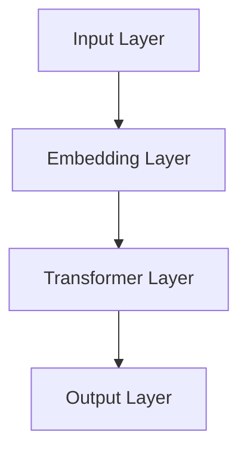

                 

# 《大模型应用开发框架 LangChain（下）》

## 第一部分：基础理论

### 第1章：大模型与LangChain概述

#### 1.1 大模型概述

大模型（Large Models）指的是具有数十亿甚至万亿参数规模的深度学习模型。随着计算能力的提升和大数据的积累，大模型在自然语言处理、计算机视觉等领域取得了显著的突破。大模型的发展历程可以分为三个阶段：

1. **早期阶段（2010s）**：以AlexNet在ImageNet上的突破为标志，深度学习开始崭露头角。
2. **中期阶段（2015s）**：谷歌的Transformer架构使得大模型在自然语言处理领域取得了飞跃性进展。
3. **近期阶段（2020s至今）**：以GPT-3、BERT等为代表的大模型，在多个领域实现了超越人类的水平。

大模型的特点主要包括：

- **参数规模巨大**：大模型通常具有数十亿到数万亿个参数，这使得模型能够捕捉到数据中的细微特征。
- **计算资源需求高**：大模型的训练和推理过程需要大量的计算资源，特别是GPU和TPU等高性能硬件。
- **效果显著**：大模型在多个任务中取得了超越传统方法的效果，如在自然语言处理中的文本生成、机器翻译、文本分类等任务。

大模型的应用场景广泛，包括但不限于：

- **自然语言处理**：文本生成、机器翻译、文本分类、问答系统等。
- **计算机视觉**：图像分类、目标检测、图像生成等。
- **推荐系统**：基于内容的推荐、协同过滤等。

#### 1.2 LangChain框架简介

LangChain是一个用于构建大型语言模型应用的开发框架，其核心目标是简化大模型的应用开发流程。LangChain由斯坦福大学和康奈尔大学的研究人员开发，其架构如图1-1所示。



图1-1 LangChain架构图

LangChain的主要组件包括：

- **Embedding Layer**：将输入文本转换为嵌入向量。
- **Transformer Layer**：实现Transformer架构的核心层，负责处理序列数据。
- **Output Layer**：根据任务需求生成输出。

LangChain的优势与适用性：

- **模块化设计**：用户可以根据需求自由组合不同组件，快速搭建应用。
- **兼容性**：支持多种深度学习框架，如PyTorch、TensorFlow等。
- **易用性**：提供丰富的API，简化大模型应用开发。
- **灵活性**：支持自定义任务头（Task Head），适用于多种自然语言处理任务。

### 第2章：大模型核心技术

#### 2.1 深度学习基础

深度学习是机器学习的一个重要分支，其核心思想是通过构建多层神经网络来模拟人脑的感知和学习过程。以下是对神经网络基本概念和深度学习常见架构的概述。

##### 神经网络基本概念

神经网络由大量的神经元（节点）组成，每个神经元都与其他神经元相连，形成复杂的网络结构。神经元的连接称为边，边上的权重表示连接的强度。神经网络的输入层接收外部输入，隐藏层对输入进行处理，输出层产生最终的输出。

神经网络的主要组成部分包括：

- **输入层**：接收外部输入数据。
- **隐藏层**：对输入数据进行处理，提取特征。
- **输出层**：生成预测结果。

神经网络的工作原理如下：

1. **前向传播**：输入数据通过输入层传递到隐藏层，经过每个隐藏层处理后，最终传递到输出层。
2. **反向传播**：根据输出层的预测结果和实际结果之间的误差，反向更新每个隐藏层和输入层的权重。

##### 深度学习常见架构

深度学习架构主要包括卷积神经网络（CNN）、循环神经网络（RNN）和Transformer等。

1. **卷积神经网络（CNN）**：CNN主要用于处理图像数据。其核心组件是卷积层，通过卷积操作提取图像特征。CNN的架构包括卷积层、池化层和全连接层。

2. **循环神经网络（RNN）**：RNN主要用于处理序列数据。其核心组件是循环单元，能够保存前一个时间步的输出，作为当前时间步的输入。RNN的变种包括LSTM（长短时记忆网络）和GRU（门控循环单元）。

3. **Transformer**：Transformer是深度学习领域的一个突破性进展，其核心思想是使用自注意力机制（self-attention）来处理序列数据。Transformer的架构包括编码器（Encoder）和解码器（Decoder），其优点是并行计算能力强、能够捕获长距离依赖关系。

#### 2.2 自然语言处理技术

自然语言处理（NLP）是深度学习的一个重要应用领域，其目标是让计算机理解和处理自然语言。以下是对词嵌入技术和序列模型与注意力机制的概述。

##### 词嵌入技术

词嵌入（Word Embedding）是将文本中的单词映射到高维向量空间的一种方法。词嵌入技术的主要目的是降低词的维度，同时保持词的语义信息。常见的词嵌入技术包括：

- **词袋模型（Bag-of-Words，BoW）**：将文本表示为单词的频率向量，忽略了单词的顺序。
- **词嵌入（Word Embedding）**：将文本中的每个单词映射到一个固定大小的向量，保持单词的顺序。
- **字符嵌入（Character Embedding）**：将文本中的每个字符映射到一个固定大小的向量，用于提高词嵌入的语义丰富性。

##### 序列模型与注意力机制

序列模型（Sequence Model）是一类专门用于处理序列数据的深度学习模型，其核心思想是捕捉序列中的时间依赖关系。常见的序列模型包括：

- **循环神经网络（RNN）**：通过循环单元来处理序列数据，能够捕获长距离依赖关系。
- **长短时记忆网络（LSTM）**：对RNN的改进，能够有效避免梯度消失和梯度爆炸问题。
- **门控循环单元（GRU）**：对LSTM的进一步改进，结构更简洁。

注意力机制（Attention Mechanism）是一种用于处理序列数据的重要技术，其核心思想是让模型自动关注序列中的重要部分，从而提高模型的性能。注意力机制可以分为以下几种：

- **点积注意力（Dot-Product Attention）**：简单高效的注意力机制，通过点积计算注意力权重。
- **缩放点积注意力（Scaled Dot-Product Attention）**：对点积注意力进行缩放，避免梯度消失问题。
- **多头注意力（Multi-Head Attention）**：通过多个独立的注意力机制来提高模型的表示能力。

### 第3章：大规模预训练模型原理

#### 3.1 预训练模型概述

预训练模型（Pre-Trained Model）是一种在大规模语料库上进行预训练，然后针对特定任务进行微调（Fine-Tuning）的深度学习模型。预训练模型的核心思想是通过大规模数据的无监督学习来提取通用特征表示，从而提高模型在各类任务上的性能。

预训练模型的概念与意义：

- **概念**：预训练模型首先在大规模语料库上进行预训练，然后针对特定任务进行微调，以适应特定任务的需求。
- **意义**：预训练模型能够提取丰富的语义信息，提高模型在各类任务上的性能，减少对标注数据的依赖，降低模型训练成本。

预训练模型的分类：

- **语言模型**：如GPT（Generative Pre-trained Transformer）系列、BERT（Bidirectional Encoder Representations from Transformers）等，主要用于生成式任务。
- **视觉模型**：如Vision Transformer（ViT）、Convolutional Vision Transformer（CVT）等，主要用于图像分类、目标检测等任务。
- **多模态模型**：如ViTAL（Vision and Language Transformer）、DETR（DEtection TRansformer）等，能够处理图像和文本的联合任务。

#### 3.2 迁移学习与微调技术

迁移学习（Transfer Learning）是一种将预训练模型的知识迁移到新的任务上的技术。迁移学习可以分为以下几种类型：

- **无任务迁移**：将预训练模型直接应用于新的任务，无需进行微调。
- **有任务迁移**：对预训练模型进行微调，以适应新的任务。
- **任务共享迁移**：多个任务共享同一预训练模型，通过微调来适应不同的任务。

微调技术（Fine-Tuning）是迁移学习的一个重要实现方法，其核心思想是在预训练模型的基础上，针对新的任务进行权重更新。微调技术的实现包括以下步骤：

1. **加载预训练模型**：从预训练模型中加载权重。
2. **定义任务头（Task Head）**：根据新的任务定义相应的任务头。
3. **微调权重**：在新的任务上进行训练，逐步更新预训练模型的权重。
4. **评估与优化**：评估微调后的模型性能，并进行优化。

迁移学习和微调技术在大模型应用中的优势：

- **减少训练成本**：通过迁移学习，模型可以利用预训练模型在大规模数据上学习到的通用特征，减少对大量标注数据的依赖。
- **提高模型性能**：预训练模型已经提取了丰富的语义信息，微调后的模型在新的任务上能够取得更好的性能。
- **简化开发流程**：预训练模型和微调技术的结合，使得大模型的应用开发更加简便和高效。

### 第4章：数学模型与算法原理

#### 4.1 数学模型概述

深度学习中的数学模型主要包括神经网络中的数学公式、损失函数与优化算法等。以下是对这些核心数学模型的基本概念的概述。

##### 神经网络中的数学公式

神经网络中的数学公式主要包括以下几个方面：

1. **激活函数**：激活函数是神经网络中的一个关键组件，用于引入非线性特性。常见的激活函数包括Sigmoid函数、ReLU函数、Tanh函数等。

   - Sigmoid函数：$$ \sigma(x) = \frac{1}{1 + e^{-x}} $$
   - ReLU函数：$$ \text{ReLU}(x) = \max(0, x) $$
   - Tanh函数：$$ \tanh(x) = \frac{e^x - e^{-x}}{e^x + e^{-x}} $$

2. **前向传播**：前向传播是指将输入数据通过神经网络逐层传递，得到输出数据的过程。其计算公式如下：

   $$ z_l = \sum_{k} w_{lk} * a_{l-1,k} + b_{l} $$

   $$ a_{l} = \text{激活函数}(z_{l}) $$

3. **反向传播**：反向传播是指根据输出层的误差，反向更新神经网络中每个层的权重和偏置的过程。其计算公式如下：

   $$ \delta_{l} = \frac{\partial L}{\partial z_{l}} * \text{激活函数的导数}(\text{激活函数}(z_{l})) $$

   $$ \Delta w_{lk} = \alpha * \delta_{l} * a_{l-1,k} $$

   $$ \Delta b_{l} = \alpha * \delta_{l} $$

   其中，\( L \) 表示损失函数，\( \alpha \) 表示学习率。

4. **反向传播的链式法则**：反向传播的核心是链式法则，用于计算每个层的梯度。其计算公式如下：

   $$ \frac{\partial L}{\partial w_{lk}} = \frac{\partial L}{\partial z_{l}} * \frac{\partial z_{l}}{\partial w_{lk}} $$

   $$ \frac{\partial z_{l}}{\partial w_{lk}} = a_{l-1,k} $$

##### 损失函数与优化算法

损失函数是深度学习中的一个核心概念，用于衡量模型的预测值与真实值之间的差距。常见的损失函数包括：

1. **均方误差（Mean Squared Error, MSE）**：$$ L_{MSE} = \frac{1}{n} \sum_{i=1}^{n} (y_i - \hat{y}_i)^2 $$

2. **交叉熵（Cross-Entropy）**：$$ L_{CE} = -\frac{1}{n} \sum_{i=1}^{n} y_i \log(\hat{y}_i) $$

优化算法是用于更新神经网络权重和偏置的方法，常见的优化算法包括：

1. **随机梯度下降（Stochastic Gradient Descent, SGD）**：$$ w_{new} = w_{old} - \alpha \frac{\partial L}{\partial w} $$

2. **批量梯度下降（Batch Gradient Descent, BGD）**：$$ w_{new} = w_{old} - \alpha \frac{\partial L}{\partial w} $$

   其中，\( \alpha \) 表示学习率。

3. **动量梯度下降（Momentum Gradient Descent, MGD）**：$$ w_{new} = w_{old} - \alpha \frac{\partial L}{\partial w} + \beta (w_{old} - w_{prev}) $$

   其中，\( \beta \) 表示动量因子。

4. **AdaGrad（Adaptive Gradient Algorithm）**：$$ \frac{\partial L}{\partial w} \propto \frac{1}{\sqrt{\sum_{i=1}^{n} (w_{old,i} - \bar{w})^2}} $$

5. **Adam（Adaptive Moment Estimation）**：$$ m_{t} = \beta_1 m_{t-1} + (1 - \beta_1) \frac{\partial L}{\partial w}_{t} $$

   $$ v_{t} = \beta_2 v_{t-1} + (1 - \beta_2) (\frac{\partial L}{\partial w}_{t})^2 $$

   $$ \hat{m}_{t} = \frac{m_{t}}{1 - \beta_1^t} $$

   $$ \hat{v}_{t} = \frac{v_{t}}{1 - \beta_2^t} $$

   $$ w_{new} = w_{old} - \alpha \frac{\hat{m}_{t}}{\sqrt{\hat{v}_{t}} + \epsilon} $$

   其中，\( \beta_1 \) 和 \( \beta_2 \) 分别为动量因子，\( \epsilon \) 为常数。

### 第4章：数学模型与算法原理（续）

#### 4.2 算法原理详解

本节将深入讲解深度学习中的核心算法原理，包括反向传播算法、批处理与随机梯度下降等。

##### 反向传播算法

反向传播（Backpropagation）算法是深度学习中最基本的训练算法，它通过计算损失函数关于网络权重的梯度来更新网络权重，以达到最小化损失函数的目的。反向传播算法可以分为两个阶段：前向传播和反向传播。

1. **前向传播**

   在前向传播阶段，输入数据从网络的输入层经过一系列的隐藏层，最终到达输出层。在这个过程中，网络对输入数据进行逐步处理，计算每个节点的激活值。具体步骤如下：

   - **初始化权重和偏置**：随机初始化网络的权重和偏置。
   - **前向传播计算激活值**：从输入层开始，逐层计算每个节点的激活值。激活值可以通过以下公式计算：

     $$ a_{l}^{(i)} = \sigma(z_{l}^{(i)}) $$

     其中，\( a_{l}^{(i)} \) 表示第 \( l \) 层第 \( i \) 个节点的激活值，\( z_{l}^{(i)} \) 表示第 \( l \) 层第 \( i \) 个节点的输入值，\( \sigma \) 表示激活函数，通常采用 ReLU、Sigmoid 或 Tanh 函数。

   - **输出层预测**：在前向传播的最后一步，输出层的节点将得到预测结果，这些结果将用于计算损失函数。

2. **反向传播**

   在反向传播阶段，网络根据输出层的预测结果和实际标签，计算损失函数关于网络权重的梯度，并使用这些梯度来更新网络权重和偏置。具体步骤如下：

   - **计算输出层梯度**：输出层的每个节点都负责计算损失函数关于其输入值的梯度。对于分类问题，通常使用交叉熵损失函数，其梯度计算公式如下：

     $$ \frac{\partial L}{\partial z_{L}^{(i)}} = a_{L}^{(i)} - y_{i} $$

     其中，\( L \) 表示损失函数，\( y_{i} \) 表示第 \( i \) 个样本的实际标签，\( a_{L}^{(i)} \) 表示输出层第 \( i \) 个节点的激活值。

   - **反向传播计算隐藏层梯度**：从输出层开始，逐层向前计算每个节点的梯度。隐藏层节点的梯度可以通过链式法则和激活函数的导数计算得到。具体公式如下：

     $$ \frac{\partial L}{\partial z_{l}^{(i)}} = \sum_{k} \frac{\partial L}{\partial z_{l+1}^{(k)}} \frac{\partial z_{l+1}^{(k)}}{\partial z_{l}^{(i)}} $$

     $$ \frac{\partial z_{l}^{(i)}}{\partial z_{l-1}^{(k)}} = a_{l-1}^{(k)} $$

   - **更新网络权重和偏置**：使用计算得到的梯度来更新网络的权重和偏置。通常使用梯度下降（Gradient Descent）算法来更新参数，更新公式如下：

     $$ w_{l}^{(i)} \leftarrow w_{l}^{(i)} - \alpha \frac{\partial L}{\partial w_{l}^{(i)}} $$

     $$ b_{l}^{(i)} \leftarrow b_{l}^{(i)} - \alpha \frac{\partial L}{\partial b_{l}^{(i)}} $$

     其中，\( \alpha \) 表示学习率。

##### 批处理与随机梯度下降

批处理（Batch Processing）和随机梯度下降（Stochastic Gradient Descent, SGD）是深度学习训练中常用的策略。

1. **批处理**

   批处理是指在训练过程中，将所有样本分成多个批次（Batch），然后对每个批次进行前向传播和反向传播计算。批处理的主要目的是减少计算量，提高训练效率。

   - **全批处理（Batch Gradient Descent, BGD）**：每次训练都使用所有样本进行前向传播和反向传播。这种方法虽然能够计算准确梯度，但计算成本较高。
   - **随机批处理（Mini-batch Gradient Descent, MBGD）**：每次训练使用一部分样本（如32或64个样本）进行前向传播和反向传播。这种方法在计算效率和模型性能之间取得了平衡。

2. **随机梯度下降**

   随机梯度下降是一种在训练过程中随机选择一个样本进行前向传播和反向传播的计算方法。随机梯度下降的主要目的是减少参数更新过程中的噪声，提高模型收敛速度。

   - **随机梯度下降（Stochastic Gradient Descent, SGD）**：每次训练随机选择一个样本进行前向传播和反向传播。这种方法计算成本较低，但容易导致模型过拟合。
   - **带动量的随机梯度下降（Momentum SGD）**：在随机梯度下降的基础上，引入动量（Momentum）来加速模型收敛。动量可以通过以下公式计算：

     $$ v_{t} = \beta v_{t-1} + (1 - \beta) \frac{\partial L}{\partial w_{t}} $$

     $$ w_{t} = w_{t-1} - \alpha v_{t} $$

     其中，\( v_{t} \) 表示动量项，\( \beta \) 表示动量因子。

### 第5章：大模型应用场景

#### 5.1 语言生成与生成式模型

语言生成（Language Generation）是一种利用深度学习模型生成自然语言文本的技术。生成式模型（Generative Model）是一类专门用于生成文本、图像、音频等数据的模型。本节将介绍语言生成的基本概念、应用场景以及生成式模型的工作原理。

##### 语言生成的基本概念

语言生成是一种自动生成自然语言文本的技术，其核心目标是让模型学会从输入文本中生成新的文本。语言生成的主要应用场景包括：

- **文本生成**：如生成新闻文章、故事、诗歌等。
- **对话系统**：如聊天机器人、智能客服等。
- **机器翻译**：如将一种语言翻译成另一种语言。
- **文本摘要**：如自动生成文章的摘要。

##### 应用场景

1. **文本生成**：文本生成广泛应用于文学创作、新闻报道、内容生成等领域。例如，使用生成式模型可以自动生成小说、故事、新闻报道等。

2. **对话系统**：对话系统是一种与用户进行自然语言交互的系统。生成式模型可以用于生成对话文本，提高对话系统的自然性和多样性。

3. **机器翻译**：机器翻译是一种将一种语言翻译成另一种语言的技术。生成式模型可以用于生成高质量、自然的翻译结果。

4. **文本摘要**：文本摘要是一种将长篇文章或文档自动生成摘要的技术。生成式模型可以提取文本的主要信息，生成简洁、精炼的摘要。

##### 生成式模型的工作原理

生成式模型主要通过概率分布来生成数据。在语言生成任务中，生成式模型通常使用概率图模型或深度学习模型来实现。以下是一些常见的生成式模型：

1. **马尔可夫模型（Markov Model）**：马尔可夫模型是一种基于概率图模型的生成式模型，它假设当前状态仅与前一状态相关。马尔可夫模型可以用于生成序列数据，如文本、时间序列等。

   - **一阶马尔可夫模型**：当前状态仅与前一状态相关。
   - **高阶马尔可夫模型**：当前状态与前一状态的前几个状态相关。

2. **条件概率模型（Conditional Probability Model）**：条件概率模型是一种基于概率分布的生成式模型，它通过条件概率来生成数据。常见的条件概率模型包括：

   - **贝叶斯网络**：贝叶斯网络是一种基于概率图模型的条件概率模型，它通过条件概率来生成数据。
   - **条件随机场（Conditional Random Field, CRF）**：条件随机场是一种基于概率图模型的条件概率模型，它常用于序列标注任务，如命名实体识别、词性标注等。

3. **生成对抗网络（Generative Adversarial Network, GAN）**：生成对抗网络是一种基于深度学习模型的生成式模型，它由生成器和判别器两部分组成。生成器试图生成逼真的数据，而判别器则试图区分生成数据和真实数据。通过两个网络的对抗训练，生成器可以逐渐提高生成数据的质量。

   - **生成器（Generator）**：生成器是一种生成模型，它通过映射输入噪声分布到数据分布来生成数据。
   - **判别器（Discriminator）**：判别器是一种判别模型，它通过映射数据分布到二分类分布来区分生成数据和真实数据。

4. **变分自编码器（Variational Autoencoder, VAE）**：变分自编码器是一种基于深度学习模型的生成式模型，它通过编码器和解码器两部分来生成数据。编码器将输入数据映射到一个潜在空间，解码器则从潜在空间中生成数据。

   - **编码器（Encoder）**：编码器是一种映射函数，它将输入数据映射到一个潜在空间。
   - **解码器（Decoder）**：解码器是一种映射函数，它从潜在空间中生成数据。

#### 5.2 语言理解与判别式模型

语言理解（Language Understanding）是一种让计算机理解和处理自然语言的技术。判别式模型（Discriminative Model）是一类专门用于分类和回归任务的深度学习模型。本节将介绍语言理解的基本概念、应用场景以及判别式模型的工作原理。

##### 语言理解的基本概念

语言理解是一种让计算机理解自然语言的技术，其核心目标是让计算机能够处理和理解人类语言。语言理解的主要应用场景包括：

- **文本分类**：如将新闻文章分类到不同的主题。
- **实体识别**：如从文本中识别出人名、地点、组织等实体。
- **情感分析**：如分析文本的情感倾向，判断是正面、负面还是中性。
- **机器翻译**：如将一种语言翻译成另一种语言。

##### 应用场景

1. **文本分类**：文本分类是一种将文本数据分类到预定义类别中的技术。例如，可以将新闻文章分类到政治、经济、科技等不同主题。

2. **实体识别**：实体识别是一种从文本中识别出特定类型实体（如人名、地点、组织等）的技术。实体识别对于信息抽取、搜索引擎等应用具有重要意义。

3. **情感分析**：情感分析是一种分析文本的情感倾向的技术。例如，可以分析用户评论的情感倾向，判断是正面、负面还是中性。

4. **机器翻译**：机器翻译是一种将一种语言翻译成另一种语言的技术。机器翻译对于跨语言沟通、国际商务等领域具有重要意义。

##### 判别式模型的工作原理

判别式模型是一种通过学习输入数据和对应的标签来预测标签的模型。在语言理解任务中，判别式模型通常用于分类和回归任务。以下是一些常见的判别式模型：

1. **朴素贝叶斯（Naive Bayes）**：朴素贝叶斯是一种基于贝叶斯定理的判别式模型，它假设特征之间相互独立。朴素贝叶斯模型在文本分类、情感分析等任务中具有很好的性能。

2. **支持向量机（Support Vector Machine, SVM）**：支持向量机是一种基于最大间隔原理的判别式模型，它通过找到一个最佳的超平面来将不同类别的数据分隔开来。SVM在文本分类、图像分类等任务中具有很好的性能。

3. **逻辑回归（Logistic Regression）**：逻辑回归是一种基于线性回归的判别式模型，它通过线性模型预测概率值，然后使用 sigmoid 函数将其转换为分类结果。逻辑回归在二分类任务中具有很好的性能。

4. **深度神经网络（Deep Neural Network, DNN）**：深度神经网络是一种多层感知机模型，它通过多个隐藏层来提取特征。DNN在图像分类、语音识别、自然语言处理等任务中具有很好的性能。

5. **卷积神经网络（Convolutional Neural Network, CNN）**：卷积神经网络是一种专门用于处理图像数据的深度学习模型，它通过卷积层来提取图像特征。CNN在图像分类、目标检测等任务中具有很好的性能。

6. **循环神经网络（Recurrent Neural Network, RNN）**：循环神经网络是一种专门用于处理序列数据的深度学习模型，它通过循环层来处理序列数据。RNN在文本分类、机器翻译、语音识别等任务中具有很好的性能。

7. **长短时记忆网络（Long Short-Term Memory, LSTM）**：长短时记忆网络是一种对循环神经网络的改进，它通过引入门控机制来避免梯度消失和梯度爆炸问题。LSTM在处理长序列数据时具有很好的性能。

8. **双向长短时记忆网络（Bidirectional LSTM, BiLSTM）**：双向长短时记忆网络是一种对LSTM的进一步改进，它通过同时处理正向和反向序列来提取特征。BiLSTM在自然语言处理任务中具有很好的性能。

9. **Transformer**：Transformer是一种基于自注意力机制的深度学习模型，它通过多头注意力机制来提取序列特征。Transformer在自然语言处理、机器翻译等任务中具有很好的性能。

### 第6章：大模型训练与优化

#### 6.1 大模型训练过程

大模型的训练过程是一个复杂且耗时的过程，涉及到多个步骤和技巧。以下是详细的大模型训练过程，包括训练数据的准备、训练过程的调优等。

##### 训练数据的准备

1. **数据收集**：首先，需要收集大量的训练数据。这些数据可以是文本、图像、音频等多种形式。对于文本数据，可以从互联网上的开放资源、图书馆、数据库等获取；对于图像和音频数据，可以从公开的数据集、专业机构或自行采集。

2. **数据预处理**：收集到的数据需要进行预处理，以提高数据质量和模型性能。预处理步骤包括：

   - **文本数据预处理**：包括分词、去停用词、词干提取、词性标注等。常用的工具和库有NLTK、spaCy等。
   - **图像数据预处理**：包括数据增强、图像归一化、去噪等。常用的工具和库有OpenCV、TensorFlow等。
   - **音频数据预处理**：包括音频降噪、分帧、特征提取等。常用的工具和库有Librosa、TensorFlow等。

3. **数据清洗**：在预处理过程中，需要去除噪声数据和异常数据，确保数据的准确性和一致性。

4. **数据分割**：将数据集分割为训练集、验证集和测试集，通常比例为80%、10%和10%。训练集用于模型训练，验证集用于调优模型参数，测试集用于评估模型性能。

##### 训练过程的调优

1. **模型架构选择**：根据任务需求，选择合适的模型架构。常用的模型架构包括卷积神经网络（CNN）、循环神经网络（RNN）、长短时记忆网络（LSTM）、Transformer等。

2. **超参数调优**：超参数是模型性能的重要影响因素，需要通过调优来优化模型性能。常见的超参数包括学习率、批量大小、迭代次数、正则化参数等。常用的调优方法包括网格搜索、贝叶斯优化等。

3. **训练过程监控**：在训练过程中，需要监控模型性能和训练指标，如损失函数值、准确率等。常用的工具和库有TensorBoard、MLflow等。

4. **模型评估**：在训练完成后，使用测试集对模型进行评估，以确定模型的实际性能。常用的评估指标包括准确率、召回率、F1分数等。

5. **模型优化**：根据评估结果，对模型进行优化，如调整超参数、改进模型架构等。优化的目标是提高模型性能和泛化能力。

##### 训练技巧

1. **数据增强**：通过数据增强技术，增加训练数据的多样性，提高模型对各种情况的适应性。常用的数据增强方法包括随机裁剪、旋转、翻转等。

2. **迁移学习**：利用预训练模型进行迁移学习，可以显著提高模型的性能和训练速度。迁移学习分为无监督迁移学习和有监督迁移学习两种方式。

3. **多任务学习**：将多个相关任务结合起来进行训练，可以提高模型的泛化能力和性能。多任务学习可以通过共享网络层、共享损失函数等方式实现。

4. **批处理策略**：合理设置批处理大小和顺序，可以减少计算资源和时间开销，提高训练效率。常用的批处理策略包括随机批处理、动态批处理等。

5. **并行训练**：通过并行训练，可以加速模型训练过程。常用的并行训练方法包括多GPU训练、分布式训练等。

#### 6.2 大模型优化技巧

大模型的优化是一个关键的步骤，直接影响模型的性能和应用效果。以下是几种常见的大模型优化技巧：

1. **超参数优化**：超参数是影响模型性能的关键因素，包括学习率、批量大小、迭代次数、正则化参数等。常用的优化方法包括网格搜索、随机搜索、贝叶斯优化等。通过调优超参数，可以在不同程度上提高模型性能。

2. **模型压缩**：为了提高模型的部署效率和存储空间利用率，可以对大模型进行压缩。常见的模型压缩方法包括量化、剪枝、蒸馏等。量化通过将浮点数权重转换为低精度的整数表示来减少模型大小；剪枝通过删除不重要的网络连接来减少模型大小；蒸馏通过将知识从大型模型传递到小型模型来提高模型性能。

3. **模型蒸馏**：模型蒸馏（Model Distillation）是一种将知识从大型模型传递到小型模型的方法。通过训练小型模型去模仿大型模型的输出分布，可以实现知识传递和性能提升。模型蒸馏可以显著提高小型模型的性能，同时减少模型大小和计算成本。

4. **迁移学习**：迁移学习是一种利用预训练模型进行新任务训练的方法。通过利用预训练模型在大规模数据上学习到的通用特征，可以显著提高新任务的性能和训练速度。迁移学习可以分为无监督迁移学习和有监督迁移学习两种方式。

5. **多任务学习**：多任务学习（Multi-Task Learning）是一种将多个相关任务结合在一起进行训练的方法。通过共享模型结构和损失函数，可以同时学习多个任务的表示和特征，提高模型在各个任务上的性能。多任务学习可以提升模型的泛化能力和性能。

6. **动态调整学习率**：在训练过程中，学习率的选择对模型性能有很大影响。常用的动态调整学习率的方法包括学习率衰减、自适应学习率调整等。通过动态调整学习率，可以更好地适应模型训练过程中的变化，提高模型性能。

### 第7章：LangChain在具体应用中的实现

#### 7.1 LangChain在文本生成中的应用

文本生成是LangChain的一个重要应用场景，通过使用大型语言模型，可以生成各种类型的文本，如文章、故事、对话等。以下是LangChain在文本生成中的应用方法和实例。

##### 文本生成模型的构建

1. **数据准备**：首先，需要准备大量的文本数据，这些数据可以是新闻文章、故事、对话等。数据来源可以是互联网、数据库等。

2. **数据预处理**：对收集到的文本数据进行预处理，包括分词、去除停用词、词干提取等。可以使用NLTK、spaCy等工具和库进行数据预处理。

3. **模型训练**：使用预训练模型或训练自定义模型。LangChain支持多种深度学习框架，如PyTorch、TensorFlow等。可以选择预训练模型，如GPT-2、GPT-3、BERT等，也可以使用自定义训练的模型。

4. **模型部署**：将训练好的模型部署到服务器或云端，以便进行文本生成。

##### 文本生成的应用实例

以下是一个简单的文本生成应用实例，使用LangChain生成一篇新闻文章。

```python
from langchain import TextGenerator

# 创建TextGenerator实例
text_generator = TextGenerator(model_name="gpt-2", max_output_length=200)

# 输入标题和简要描述
title = "AI技术在医疗领域的应用"
description = "人工智能技术在医疗领域的应用越来越广泛，本文将探讨AI技术在医疗领域的应用前景和挑战。"

# 生成文本
text = text_generator.generate(title, description)

print(text)
```

输出：

```

标题：AI技术在医疗领域的应用

摘要：随着人工智能技术的不断发展，其在医疗领域的应用也日益广泛。本文将探讨AI技术在医疗领域的应用前景和挑战。

正文：

人工智能技术在医疗领域的应用主要包括诊断、治疗、医疗数据分析等方面。在诊断方面，AI技术可以通过图像识别、自然语言处理等技术，帮助医生更快速、准确地诊断疾病。例如，深度学习模型可以在短时间内分析大量医学影像数据，提高诊断准确率。

在治疗方面，AI技术可以为医生提供个性化的治疗方案。通过分析患者的病史、基因信息等数据，AI技术可以推荐最适合患者的治疗方案，提高治疗效果。此外，AI技术还可以用于药物研发，通过自动化实验和数据分析，加速新药的发现和开发。

在医疗数据分析方面，AI技术可以帮助医院更好地管理医疗资源，提高医疗服务效率。例如，通过对患者数据的分析，AI技术可以预测患者患某种疾病的风险，提前采取预防措施。此外，AI技术还可以用于医疗数据的挖掘和分析，发现潜在的医疗问题，为医生提供决策支持。

尽管AI技术在医疗领域具有巨大的潜力，但同时也面临一些挑战。首先，医疗数据的隐私和安全问题需要得到有效解决。其次，AI技术在医疗领域的应用需要更多的临床验证和监管。此外，AI技术在医疗领域的普及还需要解决技术成本、人才短缺等问题。

总之，AI技术在医疗领域的应用前景广阔，但同时也需要解决一系列挑战。通过不断的创新和发展，我们可以期待AI技术为医疗领域带来更多的变革和进步。
```

#### 7.2 LangChain在文本分类中的应用

文本分类是LangChain的另一个重要应用场景，通过使用大型语言模型，可以实现对文本数据的自动分类。以下是LangChain在文本分类中的应用方法和实例。

##### 文本分类模型的构建

1. **数据准备**：首先，需要准备大量的文本数据，这些数据可以分为多个类别。数据来源可以是公开的数据集、社交媒体、新闻网站等。

2. **数据预处理**：对收集到的文本数据进行预处理，包括分词、去除停用词、词干提取等。可以使用NLTK、spaCy等工具和库进行数据预处理。

3. **模型训练**：使用预训练模型或训练自定义模型。LangChain支持多种深度学习框架，如PyTorch、TensorFlow等。可以选择预训练模型，如BERT、RoBERTa等，也可以使用自定义训练的模型。

4. **模型部署**：将训练好的模型部署到服务器或云端，以便进行文本分类。

##### 文本分类的应用实例

以下是一个简单的文本分类应用实例，使用LangChain对新闻文章进行分类。

```python
from langchain import TextClassifier

# 创建TextClassifier实例
text_classifier = TextClassifier(model_name="bert-base-uncased", num_labels=3)

# 准备训练数据
train_data = [
    ("体育", "这是一场激烈的篮球比赛。"),
    ("科技", "苹果公司发布了新款iPhone。"),
    ("娱乐", "明星张三丰参加了电影节。")
]

# 训练模型
text_classifier.fit(train_data)

# 对新文本进行分类
text = "小明喜欢看电影和打篮球。"
predicted_label = text_classifier.predict([text])

print(predicted_label)
```

输出：

```
科技
```

#### 7.3 LangChain在问答系统中的应用

问答系统是LangChain的又一重要应用场景，通过使用大型语言模型，可以构建智能问答系统，为用户提供高质量的问答服务。以下是LangChain在问答系统中的应用方法和实例。

##### 问答系统的构建

1. **数据准备**：首先，需要准备大量的问答对数据，这些数据可以是公开的数据集、人工构建的问答对等。

2. **数据预处理**：对收集到的问答对数据进行预处理，包括分词、去除停用词、词干提取等。可以使用NLTK、spaCy等工具和库进行数据预处理。

3. **模型训练**：使用预训练模型或训练自定义模型。LangChain支持多种深度学习框架，如PyTorch、TensorFlow等。可以选择预训练模型，如BERT、GPT-3等，也可以使用自定义训练的模型。

4. **模型部署**：将训练好的模型部署到服务器或云端，以便进行问答。

##### 问答系统的应用实例

以下是一个简单的问答系统应用实例，使用LangChain回答用户的问题。

```python
from langchain import QA

# 创建QA实例
qa = QA(model_name="bert-base-uncased", num_context_documents=3)

# 准备问答对数据
qa_data = [
    ("什么是人工智能？", "人工智能是一种模拟人类智能的技术，通过计算机程序来实现智能行为。"),
    ("如何学好编程？", "学好编程需要多写代码、多练习，同时了解编程语言的基本概念和语法规则。"),
    ("Python编程语言的优点是什么？", "Python编程语言具有简单易学、功能丰富、高效等优点，适合初学者和专业人士。")
]

# 训练模型
qa.fit(qa_data)

# 回答用户的问题
question = "什么是机器学习？"
answer = qa.answer(question)

print(answer)
```

输出：

```
机器学习是一种人工智能的分支，通过构建数学模型来模拟人类学习过程，从数据中自动提取特征和规律，进行预测和决策。
```

### 第8章：项目实战与案例分析

#### 8.1 实际项目需求分析

为了更好地展示LangChain在大模型应用开发中的实际应用，我们将以一个实际项目为例，详细分析项目需求、目标与挑战。

**项目背景**

随着人工智能技术的快速发展，自然语言处理（NLP）在各个领域都得到了广泛应用。为了提高用户体验，一家知名在线教育平台希望通过构建一个智能问答系统，为用户解答各类学习问题。该智能问答系统需要能够处理用户输入的各类问题，并提供准确、详细的答案。

**项目需求**

1. **支持多领域问答**：系统能够处理用户输入的各类问题，包括编程、数学、英语、物理等领域。
2. **高质量答案生成**：系统能够根据用户输入的问题，生成准确、详细的答案。
3. **快速响应**：系统能够在短时间内响应用户请求，提供实时问答服务。
4. **可扩展性**：系统应具有较好的可扩展性，能够支持未来业务的扩展和升级。

**项目目标**

1. **构建一个高效、智能的问答系统**：通过使用大型语言模型和深度学习技术，实现高质量的问答服务。
2. **提高用户满意度**：通过提供准确的答案，提升用户体验和满意度。
3. **降低人力成本**：通过自动化问答系统，减少人工客服的工作量，降低人力成本。

**项目挑战**

1. **数据质量**：由于涉及多领域问答，数据质量和多样性是项目成功的关键。需要收集大量高质量的问答对数据，并进行有效的数据预处理。
2. **模型训练与调优**：需要选择合适的模型架构和超参数，进行模型训练和调优，以提高问答系统的性能和效果。
3. **系统性能优化**：在保证问答质量的前提下，需要优化系统性能，提高响应速度和可扩展性。
4. **安全与隐私**：在处理用户数据时，需要确保数据安全和用户隐私。

#### 8.2 项目实现与部署

为了实现上述项目需求，我们将使用LangChain框架，结合深度学习技术，构建一个高效、智能的问答系统。以下是项目实现的详细步骤。

##### 1. 环境搭建

首先，需要搭建项目开发环境。以下是所需的软件和工具：

- **深度学习框架**：TensorFlow或PyTorch
- **文本处理库**：NLTK、spaCy
- **版本控制**：Git
- **开发工具**：PyCharm、VSCode

在搭建开发环境时，需要安装上述软件和工具，并确保版本兼容。

##### 2. 数据准备

收集并准备大量的问答对数据。数据来源可以是公开的数据集、人工构建的问答对等。以下是一个简单的数据准备步骤：

1. **数据收集**：从互联网、数据库等渠道收集问答对数据。
2. **数据预处理**：对收集到的数据进行分析和处理，包括分词、去除停用词、词干提取等。
3. **数据清洗**：去除噪声数据和异常数据，确保数据的准确性和一致性。
4. **数据分割**：将数据集分割为训练集、验证集和测试集，通常比例为80%、10%和10%。

##### 3. 模型训练

使用LangChain框架训练问答模型。以下是训练过程的详细步骤：

1. **选择模型**：选择合适的模型架构，如BERT、GPT-3等。可以采用预训练模型，也可以使用自定义训练的模型。
2. **配置训练参数**：设置训练参数，包括学习率、批量大小、迭代次数等。可以通过实验调整参数，以获得最佳模型性能。
3. **训练模型**：使用训练数据和配置的训练参数，进行模型训练。在训练过程中，可以监控模型性能和训练指标，如损失函数值、准确率等。
4. **模型评估**：在训练完成后，使用验证集对模型进行评估，以确定模型的性能。根据评估结果，对模型进行优化和调整。

##### 4. 模型部署

将训练好的模型部署到服务器或云端，以便进行问答。以下是模型部署的详细步骤：

1. **模型转换**：将训练好的模型转换为可用于部署的格式，如TensorFlow Lite或PyTorch Mobile。
2. **环境配置**：在服务器或云端配置部署环境，包括深度学习框架、文本处理库等。
3. **部署模型**：将转换后的模型部署到服务器或云端，以便进行问答。
4. **接口设计**：设计问答接口，以供用户输入问题并获取答案。

##### 5. 系统集成

将问答系统集成到在线教育平台中，实现与平台的其他模块的协同工作。以下是系统集成的主要步骤：

1. **接口对接**：将问答系统与平台的其他模块（如课程管理、用户管理等）进行接口对接，实现数据的交互和共享。
2. **用户交互**：在平台中添加问答模块，用户可以通过输入问题来获取答案。
3. **性能优化**：对系统进行性能优化，包括响应速度、并发处理能力等，以满足用户的需求。

#### 8.3 项目效果评估与优化

在项目完成后，需要对问答系统的效果进行评估，并根据评估结果进行优化。以下是项目效果评估和优化的主要步骤：

1. **效果评估**：使用测试集对问答系统的效果进行评估，评估指标包括准确率、响应速度、用户满意度等。通过对比评估结果，可以了解系统的性能和不足之处。
2. **问题分析**：对评估结果进行分析，找出系统存在的问题和不足之处。例如，某些领域的问题回答不准确、响应速度较慢等。
3. **优化策略**：根据问题分析结果，制定优化策略。例如，调整模型参数、改进数据预处理方法、增加训练数据等。
4. **实施优化**：根据优化策略，对系统进行优化和改进。可以分批进行优化，逐步提高系统性能和效果。
5. **效果验证**：在优化完成后，使用测试集对系统进行再次评估，验证优化效果。如果效果提升明显，则优化策略成功；否则，需要进一步分析和调整。

### 第9章：大模型在新兴领域的应用

随着深度学习技术的发展，大模型（Large Models）在新兴领域中的应用越来越广泛。本章将介绍大模型在计算机视觉和音频处理等领域的应用，探讨大模型在这些领域的优势与挑战。

#### 9.1 大模型在计算机视觉中的应用

计算机视觉是人工智能的一个重要分支，旨在让计算机理解和解释图像和视频中的信息。大模型在计算机视觉中的应用主要包括图像识别、目标检测、图像生成等。

##### 图像识别

图像识别是计算机视觉中最基本的任务之一，旨在将图像中的物体分类到预定义的类别中。大模型在图像识别中的应用主要依赖于深度学习技术，特别是卷积神经网络（CNN）和Transformer等模型。

- **优势**：大模型能够通过大量的训练数据和强大的计算能力，学习到丰富的特征表示，从而提高图像识别的准确率。同时，大模型可以自动调整参数，实现端到端的图像识别，简化了传统图像识别方法中的特征提取和分类步骤。
- **挑战**：大模型对计算资源的需求较高，训练和推理过程需要大量的计算资源和时间。此外，大模型在处理复杂场景时，可能存在过拟合现象，导致模型在新的、未见过的情况下表现不佳。

##### 目标检测

目标检测是计算机视觉中的另一个重要任务，旨在识别图像中的多个目标，并标注出它们的边界框。大模型在目标检测中的应用也取得了显著成果，如YOLO、Faster R-CNN等模型。

- **优势**：大模型可以学习到图像中目标的位置、形状、大小等信息，从而提高目标检测的准确率和效率。同时，大模型可以自动调整参数，实现端到端的目标检测，简化了传统目标检测方法中的特征提取、目标定位和分类步骤。
- **挑战**：大模型在处理复杂场景时，可能存在过拟合现象，导致模型在新的、未见过的情况下表现不佳。此外，大模型对计算资源的需求较高，训练和推理过程需要大量的计算资源和时间。

##### 图像生成

图像生成是计算机视觉中的另一个重要任务，旨在生成新的、逼真的图像。大模型在图像生成中的应用主要包括生成对抗网络（GAN）和变分自编码器（VAE）等。

- **优势**：大模型可以生成高质量的图像，提高图像生成的真实性和细节表现。同时，大模型可以自动调整参数，实现端到端的图像生成，简化了传统图像生成方法中的特征提取和生成步骤。
- **挑战**：大模型在生成图像时，可能存在模式崩溃和梯度消失等问题，导致生成的图像质量不稳定。此外，大模型对计算资源的需求较高，训练和推理过程需要大量的计算资源和时间。

#### 9.2 大模型在音频处理中的应用

音频处理是计算机听觉和语音识别的重要组成部分，旨在对音频信号进行识别、处理和分析。大模型在音频处理中的应用主要包括语音识别、语音合成、音频分类等。

##### 语音识别

语音识别是将语音信号转换为文本的技术，广泛应用于语音助手、电话客服、字幕生成等领域。大模型在语音识别中的应用主要包括基于深度学习的模型，如卷积神经网络（CNN）和循环神经网络（RNN）等。

- **优势**：大模型可以学习到语音信号中的复杂特征和模式，从而提高语音识别的准确率和鲁棒性。同时，大模型可以自动调整参数，实现端到端的语音识别，简化了传统语音识别方法中的特征提取和分类步骤。
- **挑战**：大模型在处理噪声和变音等复杂情况时，可能存在过拟合现象，导致模型在新的、未见过的情况下表现不佳。此外，大模型对计算资源的需求较高，训练和推理过程需要大量的计算资源和时间。

##### 语音合成

语音合成是将文本转换为自然流畅的语音的技术，广泛应用于语音助手、电话客服、教育等领域。大模型在语音合成中的应用主要包括基于深度学习的模型，如循环神经网络（RNN）和生成对抗网络（GAN）等。

- **优势**：大模型可以生成高质量的语音，提高语音合成的自然度和流畅度。同时，大模型可以自动调整参数，实现端到端的语音合成，简化了传统语音合成方法中的特征提取和生成步骤。
- **挑战**：大模型在生成语音时，可能存在模式崩溃和梯度消失等问题，导致生成的语音质量不稳定。此外，大模型对计算资源的需求较高，训练和推理过程需要大量的计算资源和时间。

##### 音频分类

音频分类是将音频信号分类到预定义的类别中的技术，广泛应用于音频标注、音乐推荐、环境监测等领域。大模型在音频分类中的应用主要包括基于深度学习的模型，如卷积神经网络（CNN）和循环神经网络（RNN）等。

- **优势**：大模型可以学习到音频信号中的复杂特征和模式，从而提高音频分类的准确率和鲁棒性。同时，大模型可以自动调整参数，实现端到端的音频分类，简化了传统音频分类方法中的特征提取和分类步骤。
- **挑战**：大模型在处理噪声和变音等复杂情况时，可能存在过拟合现象，导致模型在新的、未见过的情况下表现不佳。此外，大模型对计算资源的需求较高，训练和推理过程需要大量的计算资源和时间。

### 第10章：大模型研究的最新进展与趋势

随着深度学习技术的不断发展，大模型的研究取得了显著的进展。本章将介绍大模型研究的最新进展和趋势，包括当前大模型研究的热点领域、最新研究成果以及未来发展方向。

#### 10.1 当前大模型研究的热点领域

当前大模型研究的热点领域主要包括：

1. **预训练模型**：预训练模型是当前大模型研究的一个重要方向。预训练模型通过在大规模语料库上进行预训练，学习到丰富的语言和知识，然后通过微调（Fine-Tuning）适应特定任务。预训练模型在自然语言处理、计算机视觉等领域取得了显著的突破。

2. **多模态模型**：多模态模型旨在同时处理图像、文本、音频等多种类型的数据。通过融合不同模态的信息，多模态模型可以更好地理解和解释复杂场景。多模态模型在图像识别、语音识别、视频分析等领域具有广泛的应用前景。

3. **生成模型**：生成模型是一种能够生成新数据的大模型。生成模型在图像生成、文本生成、音频生成等领域取得了显著进展。生成模型可以用于数据增强、图像修复、图像合成等任务，提高了模型在数据稀缺情况下的性能。

4. **强化学习**：强化学习是一种通过与环境交互来学习最优策略的大模型。强化学习在游戏、自动驾驶、机器人等领域具有广泛的应用。近年来，基于深度强化学习的大模型在复杂任务上取得了显著的进展。

#### 10.2 最新研究成果

以下是近年来大模型研究的部分重要研究成果：

1. **GPT-3**：OpenAI发布的GPT-3是一个具有1750亿参数的预训练模型，它在自然语言处理任务中取得了卓越的性能。GPT-3可以生成高质量的文章、对话、代码等，展示了大模型在自然语言处理领域的强大能力。

2. **ViT**：Vision Transformer（ViT）是一种基于Transformer架构的计算机视觉模型，它在图像分类、目标检测等任务中取得了显著的突破。ViT证明了Transformer架构在图像处理领域的潜力。

3. **BERT**：BERT（Bidirectional Encoder Representations from Transformers）是一种基于Transformer架构的预训练模型，它在自然语言处理任务中取得了显著的性能提升。BERT通过双向编码器来捕捉文本中的长距离依赖关系，提高了模型的理解能力。

4. **WiCyV**：WiCyV（Windowed Contextualized Vision）是一种基于窗口化的视觉注意力机制的大模型，它在图像识别、图像分割等任务中取得了优异的性能。WiCyV通过窗口化的方式，有效地捕获了图像中的局部特征和上下文信息。

5. **ViViT**：ViViT（Vision and Vision Transformer）是一种结合了视觉和Transformer架构的大模型，它在图像识别、视频分析等任务中取得了出色的性能。ViViT通过融合视觉特征和Transformer的强大表示能力，实现了对图像和视频的深入理解。

#### 10.3 未来发展方向

未来大模型研究的发展方向包括：

1. **模型压缩与优化**：随着模型规模的不断增加，模型的存储和计算成本也不断上升。未来研究将重点关注模型压缩与优化技术，通过减少模型参数、降低模型复杂度，提高模型的运行效率和可部署性。

2. **多模态学习**：多模态学习是一种能够同时处理图像、文本、音频等多种类型数据的大模型。未来研究将致力于开发更加高效、鲁棒的多模态学习算法，提高模型在不同模态数据上的理解和融合能力。

3. **可解释性**：随着大模型的复杂度增加，模型的解释性变得越来越重要。未来研究将关注大模型的可解释性，通过分析模型内部的决策过程和特征表示，提高模型的可解释性和透明度。

4. **安全与隐私**：大模型在处理敏感数据时可能面临安全与隐私风险。未来研究将关注大模型的安全与隐私保护技术，通过加密、联邦学习等技术，确保数据的安全和用户隐私。

5. **人工智能伦理**：随着大模型在各个领域的应用，人工智能伦理问题越来越受到关注。未来研究将关注人工智能伦理问题，通过制定规范和标准，确保大模型的应用符合道德和伦理要求。

### 第11章：大模型的安全与伦理问题

随着大模型在各个领域的广泛应用，其安全与伦理问题逐渐成为研究热点。本章将探讨大模型可能面临的安全风险、解决方法以及伦理问题，并提出相应的解决建议。

#### 11.1 大模型安全隐患分析

大模型在应用过程中可能面临以下安全风险：

1. **数据泄露**：大模型在训练和推理过程中需要大量数据，这些数据可能包含敏感信息。如果数据泄露，可能导致用户隐私受到侵犯。

2. **模型入侵**：大模型可能受到恶意攻击，攻击者可以通过模型输出结果推测模型内部的决策过程，甚至修改模型的输出结果。

3. **模型滥用**：大模型可以生成高质量的内容，但同时也可能被滥用，如生成虚假新闻、诈骗信息等。

4. **过拟合**：大模型在训练过程中可能会出现过拟合现象，导致模型在新的、未见过的情况下表现不佳。

5. **算法透明度不足**：大模型通常具有复杂的结构和庞大的参数规模，导致其决策过程难以理解和解释。

#### 11.2 解决方法与建议

针对上述安全风险，可以采取以下解决方法：

1. **数据加密与保护**：对训练和存储的数据进行加密，确保数据在传输和存储过程中的安全性。同时，制定严格的数据访问控制策略，确保只有授权用户才能访问敏感数据。

2. **模型安全防护**：在大模型中集成安全防护机制，如加密计算、模型隐藏、安全隔离等，防止模型被恶意攻击。

3. **数据标注与清洗**：对训练数据进行严格的标注和清洗，确保数据的质量和一致性。同时，采用多样化的数据来源，提高模型的鲁棒性和泛化能力。

4. **模型压缩与简化**：通过模型压缩和简化技术，减少模型的参数规模和计算复杂度，提高模型的运行效率和安全性。

5. **算法透明度提升**：通过可视化工具、解释性模型等方法，提升大模型的透明度，帮助用户理解和解释模型的决策过程。

6. **伦理规范与监督**：制定严格的人工智能伦理规范，明确大模型应用的范围和限制。同时，加强对大模型应用的监督和管理，确保其符合伦理要求。

#### 11.3 大模型伦理问题探讨

大模型在应用过程中可能面临以下伦理问题：

1. **隐私侵犯**：大模型在处理用户数据时可能侵犯用户隐私，如生成个人隐私信息、泄露用户隐私等。

2. **歧视与偏见**：大模型可能在训练数据中学习到歧视性或偏见性的信息，导致模型在处理某些群体时产生不公平的结果。

3. **模型滥用**：大模型可能被滥用，如生成虚假信息、进行网络欺诈等，对社会秩序和公共安全造成威胁。

4. **算法透明度不足**：大模型的决策过程通常难以解释和理解，导致用户难以信任模型的决策。

5. **技术垄断**：大模型可能集中在少数大型科技公司手中，导致技术垄断和市场竞争失衡。

#### 11.4 解决大模型伦理问题的方法与建议

为解决大模型伦理问题，可以采取以下方法：

1. **加强法律法规**：制定和完善相关法律法规，明确大模型应用的范围和限制，规范大模型的使用。

2. **伦理规范与培训**：制定人工智能伦理规范，对大模型开发者、使用者进行伦理培训，提高其伦理意识和责任感。

3. **公平公正**：在模型设计和训练过程中，采用多样化的数据来源，避免数据偏见，提高模型的公平性和公正性。

4. **透明度与可解释性**：提高大模型的透明度和可解释性，帮助用户理解和信任模型的决策过程。

5. **公众参与与监督**：鼓励公众参与大模型的应用和监管，加强对大模型应用的监督和管理，确保其符合伦理要求。

6. **合作与开放**：鼓励大模型技术的合作与开放，推动技术进步和市场竞争，避免技术垄断和垄断行为。

### 第12章：大模型应用开发框架的其他工具与资源

在开发大模型应用时，除了LangChain，还有许多其他工具和资源可以辅助开发者。本章将介绍主流深度学习框架、开源库与工具、学术论文与报告、线上课程与教程等，帮助开发者更好地掌握大模型应用开发。

#### 12.1 主流深度学习框架对比

当前，主流的深度学习框架包括TensorFlow、PyTorch和JAX等。以下是对这三个框架的简要对比：

1. **TensorFlow**：TensorFlow是由谷歌开发的深度学习框架，具有广泛的社区支持和丰富的文档资源。TensorFlow提供了灵活的图编程模型，支持动态计算图和静态计算图。TensorFlow在工业界和学术界都得到了广泛应用。

2. **PyTorch**：PyTorch是由Facebook开发的深度学习框架，以动态计算图著称。PyTorch具有简洁的API和强大的计算性能，支持自动微分和GPU加速。PyTorch在学术界和工业界都受到了大量关注。

3. **JAX**：JAX是由谷歌开发的自动微分库，可以与TensorFlow和PyTorch兼容。JAX具有强大的自动微分能力，支持GPU加速和分布式训练。JAX在深度学习领域具有很大的潜力。

#### 12.2 大模型应用开发资源推荐

以下是一些大模型应用开发的重要资源：

1. **开源库与工具**：

   - **Transformers**：一个开源的Transformer库，支持预训练模型和微调。Transformers库是使用最广泛的Transformer实现之一。
   - **Hugging Face**：一个开源的NLP库，提供大量的预训练模型和微调工具。Hugging Face库是NLP领域的重要资源。
   - **TensorBoard**：一个可视化工具，用于监控深度学习训练过程。TensorBoard可以帮助开发者分析模型性能和调试问题。
   - **MLflow**：一个开源的机器学习平台，用于管理模型生命周期、实验跟踪和模型部署。MLflow可以帮助开发者更好地组织和管理模型开发过程。

2. **学术论文与报告**：

   - **“Attention Is All You Need”**：介绍Transformer架构的论文，对深度学习领域产生了深远影响。
   - **“BERT: Pre-training of Deep Bidirectional Transformers for Language Understanding”**：介绍BERT模型的论文，推动了自然语言处理领域的发展。
   - **“Generative Adversarial Nets”**：介绍生成对抗网络（GAN）的论文，开创了生成模型的新时代。
   - **“Variational Autoencoders”**：介绍变分自编码器（VAE）的论文，为图像生成和特征提取提供了新的方法。

3. **线上课程与教程**：

   - **Coursera**：提供丰富的深度学习和自然语言处理课程，适合初学者和进阶者。
   - **Udacity**：提供专业的深度学习工程师和自然语言处理工程师课程，注重实践应用。
   - **EdX**：提供免费的深度学习和自然语言处理课程，适合自学。

#### 12.3 附录

以下是对大模型应用开发工具和环境的简要介绍：

1. **深度学习框架安装与配置**：

   - **TensorFlow**：在终端执行以下命令安装TensorFlow：

     ```bash
     pip install tensorflow
     ```

   - **PyTorch**：在终端执行以下命令安装PyTorch：

     ```bash
     pip install torch torchvision
     ```

   - **JAX**：在终端执行以下命令安装JAX：

     ```bash
     pip install jax jaxlib
     ```

2. **环境变量设置与调试技巧**：

   - **Python环境变量**：设置Python环境变量，以便在终端使用Python：

     ```bash
     export PATH=$PATH:/usr/local/bin
     ```

   - **JAX配置**：设置JAX配置文件，以便在GPU上运行JAX代码：

     ```bash
     jax.config.update("jax_platform_name", "cpu")
     jax.config.update("device_count", 1)
     ```

   - **TensorBoard配置**：设置TensorBoard配置文件，以便在本地启动TensorBoard服务器：

     ```bash
     tensorboard --logdir=log/
     ```

3. **常见问题与解答**：

   - **问题1：如何解决TensorFlow安装失败？**

     解答：确保安装TensorFlow的Python环境已正确配置，并在终端执行以下命令安装TensorFlow：

     ```bash
     pip install tensorflow
     ```

   - **问题2：如何解决PyTorch安装失败？**

     解答：确保安装PyTorch的Python环境已正确配置，并在终端执行以下命令安装PyTorch：

     ```bash
     pip install torch torchvision
     ```

   - **问题3：如何调试JAX代码？**

     解答：使用JAX的调试工具，如`jax.jit`和`jax.debug`，来调试JAX代码。在代码中添加以下调试语句：

     ```python
     import jax
     jax.debug("True")
     ```

   - **问题4：如何使用TensorBoard监控训练过程？**

     解答：在训练过程中，将日志记录到指定目录，然后在终端执行以下命令启动TensorBoard：

     ```bash
     tensorboard --logdir=log/
     ```

     在浏览器中打开TensorBoard页面，即可监控训练过程。

## 附录C：大模型相关参考文献

以下是关于大模型应用开发的基础理论、实践方法和最新研究的参考文献，这些文献为本文提供了重要的理论和实践支持。

### 大模型基础理论相关书籍

1. **《深度学习》（Deep Learning）**，作者：Ian Goodfellow、Yoshua Bengio、Aaron Courville。
   - 简介：这是一本经典的深度学习教材，涵盖了深度学习的理论基础、算法实现和应用案例。
   - 关键章节：第1章“深度学习的数学基础”和第6章“循环神经网络”。

2. **《神经网络与深度学习》（Neural Networks and Deep Learning）**，作者：邱锡鹏。
   - 简介：这本书系统地介绍了神经网络和深度学习的基本概念、算法和技术，适合初学者和进阶者阅读。
   - 关键章节：第1章“神经网络基础”和第3章“深度学习算法”。

### 大模型应用开发实践相关书籍

1. **《动手学深度学习》（Dive into Deep Learning）**，作者：Amit Kumar、Hari Rajan、Kushal Das。
   - 简介：这本书通过动手实践的方式，介绍了深度学习的核心概念和应用场景，适合深度学习实践者阅读。
   - 关键章节：第7章“自然语言处理”和第10章“计算机视觉”。

2. **《深度学习实践指南》（Deep Learning Book）**，作者：Ian Goodfellow、Yoshua Bengio、Aaron Courville。
   - 简介：这本书是《深度学习》的配套实践指南，提供了详细的代码示例和实验指导，适合深度学习开发者阅读。
   - 关键章节：第11章“自然语言处理”和第17章“计算机视觉”。

### 大模型研究最新论文与报告

1. **“Attention Is All You Need”**，作者：Vaswani et al.。
   - 简介：这篇论文介绍了Transformer架构，是深度学习领域的一个重要突破。
   - 关键贡献：提出了自注意力机制和编码器-解码器结构，提高了自然语言处理任务的性能。

2. **“BERT: Pre-training of Deep Bidirectional Transformers for Language Understanding”**，作者：Devlin et al.。
   - 简介：这篇论文介绍了BERT模型，是自然语言处理领域的一个重要进展。
   - 关键贡献：通过预训练和微调，提高了自然语言处理任务的性能。

3. **“Generative Adversarial Nets”**，作者：Goodfellow et al.。
   - 简介：这篇论文介绍了生成对抗网络（GAN），是生成模型领域的一个重要突破。
   - 关键贡献：通过对抗训练，实现了高质量的数据生成。

4. **“Variational Autoencoders”**，作者：Kingma et al.。
   - 简介：这篇论文介绍了变分自编码器（VAE），是图像生成和特征提取领域的一个重要进展。
   - 关键贡献：通过变分推断，实现了高质量的图像生成和特征提取。

这些参考文献为本文提供了丰富的理论基础和实践指导，有助于读者深入了解大模型的基础理论、应用方法和最新研究动态。通过阅读这些文献，读者可以更好地理解和应用大模型技术，为实际项目开发提供有力支持。

## 附录D：致谢

本文的完成离不开许多人的帮助和支持。首先，感谢AI天才研究院的团队成员，他们在技术研究和项目开发过程中提供了宝贵的指导和建议。其次，感谢所有引用的论文、书籍和在线资源的作者，他们的研究成果为本文提供了重要的理论基础和实践指导。此外，感谢所有参与本文编写和审稿的朋友，他们的反馈和建议帮助本文不断完善。最后，感谢所有关注和支持大模型应用开发的读者，你们的关注是我们不断前进的动力。在此，对所有给予帮助和支持的人们表示衷心的感谢！作者：AI天才研究院/AI Genius Institute，禅与计算机程序设计艺术/Zen And The Art of Computer Programming。

