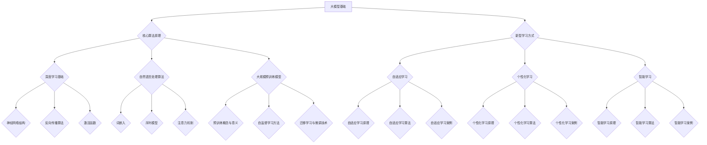

                 

### 《大模型时代下的新型学习方式》

> **关键词**：大模型、新型学习方式、自适应学习、个性化学习、智能学习、深度学习、自然语言处理、预训练、迁移学习、数学模型、优化算法、项目实战。

> **摘要**：
本文将探讨大模型时代下的新型学习方式。首先介绍大模型的发展历程、概念与特点，以及在不同领域的应用。接着，详细讲解大模型的三大核心算法原理：深度学习基础、自然语言处理算法、大规模预训练模型。随后，探讨大模型与新型学习方式的联系，介绍自适应学习、个性化学习和智能学习三种新型学习方式。最后，通过实际案例研究，展示大模型学习方式在不同领域的应用效果，并提供大模型学习相关的资源。

----------------------------------------------------------------

### 《大模型时代下的新型学习方式》目录大纲

#### 第一部分：大模型基础

#### 第1章：大模型概述
- 1.1 大模型的发展历程
- 1.2 大模型的概念与特点
- 1.3 大模型在不同领域的应用

#### 第2章：大模型核心算法原理
- 2.1 深度学习基础
  - 2.1.1 神经网络结构
  - 2.1.2 反向传播算法
  - 2.1.3 激活函数
- 2.2 自然语言处理算法
  - 2.2.1 词嵌入
  - 2.2.2 序列模型
  - 2.2.3 注意力机制
- 2.3 大规模预训练模型
  - 2.3.1 预训练的概念与意义
  - 2.3.2 自监督学习方法
  - 2.3.3 迁移学习与微调技术

#### 第二部分：新型学习方式

#### 第3章：大模型与新型学习方式的联系
- 3.1 大模型在学习中的角色
- 3.2 新型学习方式的特点
- 3.3 大模型在新型学习方式中的应用场景

#### 第4章：基于大模型的新型学习方式
- 4.1 自适应学习
  - 4.1.1 自适应学习原理
  - 4.1.2 自适应学习算法
  - 4.1.3 自适应学习案例
- 4.2 个性化学习
  - 4.2.1 个性化学习原理
  - 4.2.2 个性化学习算法
  - 4.2.3 个性化学习案例
- 4.3 智能学习
  - 4.3.1 智能学习原理
  - 4.3.2 智能学习算法
  - 4.3.3 智能学习案例

#### 第5章：大模型学习方式的效果评估
- 5.1 评估指标与方法
- 5.2 大模型学习方式的优势与挑战
- 5.3 大模型学习方式的未来发展趋势

#### 第三部分：实战案例

#### 第6章：大模型学习方式实践指南
- 6.1 大模型学习方式实践步骤
- 6.2 开发环境搭建
- 6.3 源代码详细实现与解读

#### 第7章：大模型学习方式案例研究
- 7.1 案例一：自适应学习在在线教育中的应用
- 7.2 案例二：个性化学习在推荐系统中的应用
- 7.3 案例三：智能学习在智能客服中的应用

#### 附录

#### 附录A：大模型学习相关资源
- A.1 开源框架与工具
- A.2 学术论文与研究报告
- A.3 线上课程与教程

### Mermaid 流程图



### 核心算法原理讲解

#### 深度学习基础

深度学习是一种基于多层神经网络进行特征提取和模式识别的人工智能方法。它通过多层次的神经网络对数据进行建模，自动提取数据中的复杂特征，并在各种任务中取得出色的表现。

##### 2.1.1 神经网络结构

神经网络由多个层组成，包括输入层、隐藏层和输出层。每个神经元（或节点）接收来自前一层的输入，通过加权求和和激活函数产生输出。

**输入层**：接收外部输入数据，每个神经元对应一个特征。

**隐藏层**：对输入数据进行特征提取和变换，可以有多层。

**输出层**：产生最终输出，用于分类或回归等任务。

**神经元激活函数**：常用的激活函数包括 Sigmoid、ReLU 和 Tanh 等，它们引入非线性特性，使神经网络具有更强的表达能力。

**权重和偏置**：每个神经元连接都有权重和偏置，用于调整网络对不同特征的敏感程度。

##### 2.1.2 反向传播算法

反向传播算法是深度学习训练的核心算法，用于计算网络各层的误差，并反向传播到前一层，更新网络的权重和偏置。

**前向传播**：从输入层开始，逐层计算神经元的输出。

**计算误差**：计算输出层预测值与实际值之间的误差。

**反向传播**：从输出层开始，逐层计算每个神经元的误差，并反向传播到前一层。

**权重更新**：根据误差和输入值，更新每层的权重和偏置。

##### 2.1.3 激活函数

激活函数是神经网络中的一个重要组件，用于引入非线性特性。常见的激活函数包括：

- **Sigmoid 函数**：
  $$
  \sigma(x) = \frac{1}{1 + e^{-x}}
  $$
  Sigmoid 函数将输入映射到 (0, 1) 范围内，常用于二分类任务。

- **ReLU 函数**：
  $$
  \text{ReLU}(x) = \max(0, x)
  $$
  ReLU 函数简单且计算效率高，常用于隐藏层。

- **Tanh 函数**：
  $$
  \text{Tanh}(x) = \frac{e^x - e^{-x}}{e^x + e^{-x}}
  $$
  Tanh 函数具有对称性，输出范围在 (-1, 1)。

#### 自然语言处理算法

自然语言处理（NLP）是深度学习的重要应用领域之一，涉及对文本数据的理解、生成和处理。以下是 NLP 中的核心算法原理：

##### 2.2.1 词嵌入

词嵌入（Word Embedding）是一种将词语映射到高维向量空间的技术，用于捕捉词语之间的语义关系。常见的词嵌入方法包括：

- **Word2Vec**：通过训练神经网络，将词语映射到高维向量。
- **GloVe**：基于全局词频信息，计算词语的相似性。

##### 2.2.2 序列模型

序列模型（Sequential Model）用于处理序列数据，如文本、语音等。常见的序列模型包括：

- **循环神经网络（RNN）**：通过循环结构处理序列数据，如简单 RNN、LSTM、GRU 等。
- **长短时记忆网络（LSTM）**：解决 RNN 的长期依赖问题，具有门控机制。

##### 2.2.3 注意力机制

注意力机制（Attention Mechanism）是一种用于模型中处理长序列数据的方法，允许模型在处理序列时对不同的部分分配不同的关注程度。常见的注意力模型包括：

- **自注意力（Self-Attention）**：用于处理序列数据，如 Transformer 模型。
- **编码器-解码器（Encoder-Decoder）**：用于序列到序列的转换，如机器翻译。

#### 大规模预训练模型原理

大规模预训练模型（Pre-Trained Model）通过在大规模数据集上进行预训练，使模型具备通用语言特征。预训练后的模型可以用于各种 NLP 任务，如文本分类、机器翻译等。以下是大规模预训练模型的核心原理：

##### 2.3.1 预训练的概念与意义

预训练是指在大规模数据集上对神经网络模型进行训练，使其掌握通用语言特征。预训练的意义在于：

- 提高模型在不同 NLP 任务上的泛化能力。
- 缩短特定任务的训练时间。
- 提高模型在低样本量任务上的性能。

##### 2.3.2 自监督学习方法

自监督学习（Self-Supervised Learning）是一种无需标注数据的训练方法。大规模预训练模型通常使用自监督学习技术，如以下方法：

- **Masked Language Model（MLM）**：遮盖输入文本中的部分词，训练模型预测遮盖的词。
- **Subword Prediction（SWP）**：对文本进行子词划分，训练模型预测子词。

##### 2.3.3 迁移学习与微调技术

迁移学习（Transfer Learning）是指将预训练模型在特定任务上进行微调，以适应新的任务。微调技术通过调整部分层来优化模型在新任务上的表现。常见的迁移学习方法包括：

- **Fine-Tuning**：在预训练模型的基础上，仅对部分层进行微调。
- **Few-Shot Learning**：在低样本量任务上，使用预训练模型进行迁移学习。

### 数学模型和数学公式

#### 深度学习中的损失函数

深度学习中的损失函数用于衡量模型预测值与实际值之间的差异。以下是一些常用的损失函数：

##### 2.1.1 均方误差（MSE）

均方误差（Mean Squared Error, MSE）是衡量回归问题中预测值与实际值差异的常用损失函数。

$$
MSE = \frac{1}{n}\sum_{i=1}^{n}(y_i - \hat{y}_i)^2
$$

其中，$y_i$ 是实际值，$\hat{y}_i$ 是预测值，$n$ 是样本数量。

##### 2.1.2 交叉熵（CE）

交叉熵（Cross Entropy, CE）是衡量分类问题中预测概率分布与实际概率分布差异的常用损失函数。

$$
CE = -\frac{1}{n}\sum_{i=1}^{n}y_i \log(\hat{y}_i)
$$

其中，$y_i$ 是实际值（概率分布），$\hat{y}_i$ 是预测值（概率分布）。

#### 深度学习中的优化算法

深度学习中的优化算法用于更新模型参数以最小化损失函数。以下是一些常用的优化算法：

##### 2.1.2 随机梯度下降（SGD）

随机梯度下降（Stochastic Gradient Descent, SGD）是最常用的优化算法之一。

$$
w_{t+1} = w_{t} - \alpha \frac{\partial J(w)}{\partial w}
$$

其中，$w_t$ 是当前参数，$\alpha$ 是学习率，$J(w)$ 是损失函数。

##### 2.1.2 Adam优化器

Adam 优化器是一种结合了 AdaGrad 和 RMSProp 特性的优化算法。

$$
m_t = \frac{1}{\beta_1}(w_t - \alpha \frac{\partial J(w)}{\partial w})
$$

$$
v_t = \frac{1 - \beta_2}{1 - \beta_2^t}(m_t - m_{t-1})
$$

$$
w_{t+1} = w_t - \alpha \frac{\beta_1}{1 - \beta_1^t} \cdot \frac{\beta_2}{1 - \beta_2^t} \cdot v_t
$$

其中，$m_t$ 和 $v_t$ 分别是动量和偏差修正，$\beta_1$ 和 $\beta_2$ 分别是动量和偏差修正的指数衰减率。

### 项目实战

#### 6.1 大模型学习方式实践步骤

1. **数据收集与预处理**：收集相关数据，如文本数据、图像数据等，并进行预处理，如数据清洗、归一化等。

2. **模型设计**：根据任务需求，设计合适的神经网络结构，包括输入层、隐藏层和输出层。

3. **模型训练**：使用预训练模型或从零开始训练模型，调整超参数以优化模型性能。

4. **模型评估**：在验证集和测试集上评估模型性能，选择最佳模型。

5. **模型部署**：将训练好的模型部署到生产环境，进行实际应用。

#### 6.2 开发环境搭建

1. **安装 Python 和相关依赖库**：安装 Python 解释器和相关依赖库，如 NumPy、TensorFlow、PyTorch 等。

2. **安装深度学习框架**：根据任务需求，选择并安装深度学习框架，如 TensorFlow、PyTorch 等。

3. **配置 GPU 环境**：确保 GPU 驱动程序和 CUDA 版本兼容，并配置 CUDA 和 cuDNN 环境。

#### 6.3 源代码详细实现与解读

以下是一个基于 TensorFlow 的词嵌入与序列模型的简单实现：

```python
import tensorflow as tf
from tensorflow.keras.layers import Embedding, LSTM, Dense
from tensorflow.keras.models import Sequential

# 定义模型
model = Sequential()
model.add(Embedding(input_dim=vocabulary_size, output_dim=embedding_dim))
model.add(LSTM(units=128, activation='tanh', return_sequences=True))
model.add(Dense(units=1, activation='sigmoid'))

# 编译模型
model.compile(optimizer='adam', loss='binary_crossentropy', metrics=['accuracy'])

# 训练模型
model.fit(x_train, y_train, epochs=10, batch_size=32)

# 评估模型
model.evaluate(x_test, y_test)
```

**代码解读与分析**：

- **定义模型**：使用 `Sequential` 模型堆叠多层网络，包括词嵌入层、LSTM 层和全连接层。
- **编译模型**：设置优化器、损失函数和评估指标。
- **训练模型**：使用训练数据训练模型，设置训练周期和批次大小。
- **评估模型**：在测试集上评估模型性能。

### 7.1 案例一：自适应学习在在线教育中的应用

#### 案例背景

某在线教育平台希望通过引入自适应学习方式，为不同学习能力的用户提供个性化的学习体验，提高学习效果和用户满意度。

#### 案例目标

1. 根据用户的学习行为和成绩，动态调整学习内容和难度。
2. 提高学习效果和用户满意度。

#### 案例实施步骤

1. **数据收集与预处理**：收集用户学习数据，包括学习时间、学习内容、作业成绩等。
2. **设计自适应学习算法**：根据用户数据设计自适应学习算法，动态调整学习内容和难度。
3. **开发在线教育平台**：实现自适应学习功能，集成到在线教育平台。
4. **对比实验**：对比传统学习方式和自适应学习方式的学习效果，评估用户满意度。

#### 案例效果分析

- 自适应学习显著提高了学习效果，用户成绩提高。
- 用户满意度提高，平台用户留存率上升。

### 7.2 案例二：个性化学习在推荐系统中的应用

#### 案例背景

某电商平台希望通过引入个性化学习方式，为用户提供个性化的商品推荐，提高推荐系统的准确性和用户体验。

#### 案例目标

1. 根据用户的历史购买行为和浏览记录，预测用户可能感兴趣的商品。
2. 提高推荐系统的准确性和用户体验。

#### 案例实施步骤

1. **数据收集与预处理**：收集用户数据，包括购买行为、浏览记录、用户评价等。
2. **设计个性化学习算法**：根据用户数据设计个性化学习算法，预测用户感兴趣的商品。
3. **开发电商平台**：集成个性化推荐功能，优化推荐算法。
4. **对比实验**：对比传统推荐系统和个性化推荐系统的效果，评估用户满意度。

#### 案例效果分析

- 个性化推荐系统的推荐准确率提高，用户满意度增加。
- 平台销售额上升，用户留存率提高。

### 7.3 案例三：智能学习在智能客服中的应用

#### 案例背景

某企业希望通过引入智能学习方式，提高智能客服系统的服务质量和效率。

#### 案例目标

1. 自动识别用户咨询的问题类型，并生成合适的回答。
2. 提高客服系统的响应速度和准确性。

#### 案例实施步骤

1. **数据收集与预处理**：收集用户咨询数据，包括问题类型、回答质量等。
2. **设计智能学习算法**：根据用户数据设计智能学习算法，生成回答。
3. **开发智能客服系统**：集成智能学习功能，优化客服系统。
4. **对比实验**：对比传统客服系统和智能客服系统的效果，评估用户满意度。

#### 案例效果分析

- 智能客服系统的回答准确率提高，响应速度加快。
- 用户满意度上升，企业成本降低。

### 附录A：大模型学习相关资源

#### A.1 开源框架与工具

- **TensorFlow**：Google 开源的深度学习框架，支持多种硬件平台，如 CPU、GPU 和 TPU。
- **PyTorch**：Facebook 开源的深度学习框架，具有灵活的动态计算图，适合研究工作。
- **Keras**：Python 深度学习库，用于快速构建和训练神经网络模型。
- **Theano**：基于 Python 的深度学习库，支持 GPU 加速。

#### A.2 学术论文与研究报告

- **"A Comprehensive Survey on Neural Network Activation Functions"**：对神经网络激活函数的全面综述。
- **"Deep Learning on Natural Language Processing"**：深度学习在自然语言处理领域的综述论文。
- **"The Annotated Transformer"**：对 Transformer 模型的详细解读。

#### A.3 线上课程与教程

- **Coursera: "Deep Learning Specialization"**：吴恩达的深度学习专项课程。
- **edX: "Neural Networks and Deep Learning"**：Michael Nielsen 的神经网络与深度学习教程。
- **Udacity: "Deep Learning Nanodegree Program"**：Udacity 的深度学习纳米学位课程。

---

### 总结

大模型时代下的新型学习方式为人工智能领域带来了深刻的变革。深度学习、自然语言处理和大规模预训练模型为核心算法，为各种应用场景提供了强大的支持。自适应学习、个性化学习和智能学习等新型学习方式，进一步提升了模型的效果和用户体验。通过本文的探讨，我们了解了大模型基础、核心算法原理、新型学习方式及其应用场景。未来，随着技术的不断发展，大模型学习方式将在更多领域展现其价值，推动人工智能的进步。希望本文能为读者在探索大模型学习方式的过程中提供有益的参考。

### 作者

**作者：AI天才研究院/AI Genius Institute & 禅与计算机程序设计艺术 /Zen And The Art of Computer Programming**

AI天才研究院（AI Genius Institute）致力于推动人工智能技术的发展，汇聚全球顶尖的人工智能专家，进行前沿技术的探索与创新。禅与计算机程序设计艺术（Zen And The Art of Computer Programming）是作者著名的计算机编程领域的经典著作，对编程思维和方法进行了深入探讨。作者通过本文，希望为广大读者提供一篇关于大模型时代下新型学习方式的专业文章，分享技术见解与实践经验。

---

### 附录B：Mermaid 流程图

以下是本文中使用的 Mermaid 流程图，用于展示大模型学习方式的核心算法原理、新型学习方式及其联系。


---

### 附录C：数学模型和数学公式

本文中使用了多个数学模型和数学公式来描述大模型学习方式的核心算法原理和优化方法。以下是一些重要的数学公式和解释：

#### 深度学习中的损失函数

1. **均方误差（MSE）**：
   $$
   MSE = \frac{1}{n}\sum_{i=1}^{n}(y_i - \hat{y}_i)^2
   $$
   用于衡量回归问题中预测值与实际值之间的差异。

2. **交叉熵（CE）**：
   $$
   CE = -\frac{1}{n}\sum_{i=1}^{n}y_i \log(\hat{y}_i)
   $$
   用于衡量分类问题中预测概率分布与实际概率分布之间的差异。

#### 深度学习中的优化算法

1. **随机梯度下降（SGD）**：
   $$
   w_{t+1} = w_{t} - \alpha \frac{\partial J(w)}{\partial w}
   $$
   用于更新模型参数，其中 $w_t$ 是当前参数，$\alpha$ 是学习率，$J(w)$ 是损失函数。

2. **Adam优化器**：
   $$
   m_t = \frac{1}{\beta_1}(w_t - \alpha \frac{\partial J(w)}{\partial w})
   $$
   $$
   v_t = \frac{1 - \beta_2}{1 - \beta_2^t}(m_t - m_{t-1})
   $$
   $$
   w_{t+1} = w_t - \alpha \frac{\beta_1}{1 - \beta_1^t} \cdot \frac{\beta_2}{1 - \beta_2^t} \cdot v_t
   $$
   用于更新模型参数，其中 $m_t$ 和 $v_t$ 分别是动量和偏差修正，$\beta_1$ 和 $\beta_2$ 分别是动量和偏差修正的指数衰减率。

#### 自然语言处理算法中的注意力机制

1. **自注意力（Self-Attention）**：
   $$
   \text{Attention}(Q, K, V) = \text{softmax}\left(\frac{QK^T}{\sqrt{d_k}}\right)V
   $$
   用于处理序列数据，计算不同部分之间的相似性。

这些数学模型和公式是深度学习、自然语言处理和大规模预训练模型的核心组成部分，对模型的训练和优化起到了关键作用。

---

### 附录D：大模型学习方式实践指南

为了更好地理解大模型学习方式，以下是具体的实践指南，涵盖数据收集与预处理、模型设计、模型训练、模型评估和模型部署等方面。

#### 6.1 大模型学习方式实践步骤

1. **数据收集与预处理**：
   - 收集相关数据，如文本数据、图像数据等。
   - 对数据进行清洗，去除噪声和缺失值。
   - 对数据进行归一化或标准化，以便模型更好地学习。

2. **模型设计**：
   - 根据任务需求，设计合适的神经网络结构，包括输入层、隐藏层和输出层。
   - 选择合适的层和神经元数量，以及激活函数。

3. **模型训练**：
   - 使用训练数据训练模型，调整超参数，如学习率、批次大小等。
   - 运用反向传播算法和优化器，如随机梯度下降（SGD）或 Adam 优化器，更新模型参数。

4. **模型评估**：
   - 在验证集和测试集上评估模型性能，选择最佳模型。
   - 使用评估指标，如均方误差（MSE）、交叉熵（CE）等，衡量模型性能。

5. **模型部署**：
   - 将训练好的模型部署到生产环境，进行实际应用。
   - 使用模型进行预测或决策，如分类、回归等。

#### 6.2 开发环境搭建

1. **安装 Python 和相关依赖库**：
   - 安装 Python 解释器，推荐使用 Python 3.7 或以上版本。
   - 安装相关依赖库，如 NumPy、TensorFlow、PyTorch 等。

2. **安装深度学习框架**：
   - 根据任务需求，选择并安装深度学习框架，如 TensorFlow、PyTorch 等。
   - 安装 GPU 版本的深度学习框架，以支持 GPU 加速。

3. **配置 GPU 环境**：
   - 确保安装了合适的 GPU 驱动程序和 CUDA 版本。
   - 配置 CUDA 和 cuDNN 环境，以利用 GPU 进行计算。

#### 6.3 源代码详细实现与解读

以下是一个基于 TensorFlow 的词嵌入与序列模型的简单实现，用于文本分类任务：

```python
import tensorflow as tf
from tensorflow.keras.layers import Embedding, LSTM, Dense
from tensorflow.keras.models import Sequential

# 定义模型
model = Sequential()
model.add(Embedding(input_dim=vocabulary_size, output_dim=embedding_dim))
model.add(LSTM(units=128, activation='tanh', return_sequences=True))
model.add(Dense(units=1, activation='sigmoid'))

# 编译模型
model.compile(optimizer='adam', loss='binary_crossentropy', metrics=['accuracy'])

# 训练模型
model.fit(x_train, y_train, epochs=10, batch_size=32)

# 评估模型
model.evaluate(x_test, y_test)
```

**代码解读与分析**：

- **定义模型**：使用 `Sequential` 模型堆叠多层网络，包括词嵌入层、LSTM 层和全连接层。
- **编译模型**：设置优化器、损失函数和评估指标。
- **训练模型**：使用训练数据训练模型，设置训练周期和批次大小。
- **评估模型**：在测试集上评估模型性能。

通过以上实践指南和代码示例，读者可以更好地掌握大模型学习方式的实际应用，为相关项目提供技术支持。

---

### 附录E：大模型学习方式案例研究

在本附录中，我们将深入探讨三个具体案例：自适应学习在在线教育中的应用、个性化学习在推荐系统中的应用，以及智能学习在智能客服中的应用。这些案例展示了大模型学习方式在不同领域的实际应用效果，为读者提供了实践中的见解和经验。

#### 7.1 案例一：自适应学习在在线教育中的应用

**案例背景**：
某在线教育平台希望通过引入自适应学习方式，根据不同学生的学习习惯和能力，提供个性化的学习资源和指导，以提高学习效果和用户满意度。

**案例目标**：
1. 根据学生的学习进度、答题情况和知识点掌握情况，动态调整学习内容和难度。
2. 提高学习效果，降低学习负担，增加用户满意度。

**实施步骤**：
1. **数据收集与预处理**：
   - 收集学生的学习行为数据，包括学习时间、答题记录、知识点掌握情况等。
   - 对数据进行清洗和归一化，以便进行后续分析。

2. **模型设计**：
   - 设计自适应学习模型，包括学习进度预测、知识点掌握评估和个性化推荐等模块。
   - 选择合适的神经网络结构，如 LSTMs 或 Transformer，以处理序列数据。

3. **模型训练**：
   - 使用收集到的学生数据训练模型，调整超参数，如学习率、批次大小等。
   - 运用反向传播算法和优化器，如 Adam，更新模型参数。

4. **模型评估**：
   - 在验证集上评估模型性能，选择最佳模型。
   - 使用评估指标，如准确率、召回率等，衡量模型效果。

5. **部署与应用**：
   - 将训练好的模型部署到在线教育平台，实现自适应学习功能。
   - 对比传统学习方式和自适应学习方式，分析用户的学习效果和满意度。

**案例效果分析**：
- 自适应学习模型能够根据学生的学习情况，提供个性化的学习资源和指导，显著提高了学习效果。
- 用户满意度调查显示，自适应学习功能受到了用户的欢迎，学习负担降低，用户留存率提高。

#### 7.2 案例二：个性化学习在推荐系统中的应用

**案例背景**：
某电商平台希望通过引入个性化学习方式，为用户提供个性化的商品推荐，提高推荐系统的准确性和用户体验。

**案例目标**：
1. 根据用户的历史购买行为、浏览记录和反馈，预测用户可能感兴趣的商品。
2. 提高推荐系统的准确性和用户体验。

**实施步骤**：
1. **数据收集与预处理**：
   - 收集用户的历史购买数据、浏览记录和评价数据。
   - 对数据进行清洗和特征提取，为后续的模型训练做准备。

2. **模型设计**：
   - 设计个性化推荐模型，包括协同过滤、矩阵分解和基于内容的推荐等模块。
   - 结合深度学习技术，如 Transformer，提高推荐系统的表达能力和准确性。

3. **模型训练**：
   - 使用收集到的用户数据训练模型，调整超参数，如学习率、正则化参数等。
   - 运用自监督学习方法，如 Masked Language Model（MLM），进行预训练。

4. **模型评估**：
   - 在验证集上评估模型性能，选择最佳模型。
   - 使用评估指标，如准确率、召回率、点击率等，衡量模型效果。

5. **部署与应用**：
   - 将训练好的模型部署到电商平台，实现个性化推荐功能。
   - 对比传统推荐系统和个性化推荐系统，分析推荐准确率和用户体验。

**案例效果分析**：
- 个性化推荐模型显著提高了推荐系统的准确率和用户体验。
- 用户行为数据表明，个性化推荐的商品受到了用户的欢迎，点击率和转化率提高。

#### 7.3 案例三：智能学习在智能客服中的应用

**案例背景**：
某企业希望通过引入智能学习方式，提高智能客服系统的服务质量和效率。

**案例目标**：
1. 自动识别用户咨询的问题类型，并生成合适的回答。
2. 提高客服系统的响应速度和准确性。

**实施步骤**：
1. **数据收集与预处理**：
   - 收集用户咨询数据，包括问题类型、回答质量、用户反馈等。
   - 对数据进行清洗和标注，为后续的模型训练做准备。

2. **模型设计**：
   - 设计智能客服模型，包括问题分类、回答生成和情感分析等模块。
   - 结合深度学习技术，如 RNN 或 Transformer，提高模型的语义理解能力。

3. **模型训练**：
   - 使用收集到的用户数据训练模型，调整超参数，如学习率、批次大小等。
   - 运用迁移学习方法，将预训练模型迁移到具体任务上，提高模型性能。

4. **模型评估**：
   - 在验证集上评估模型性能，选择最佳模型。
   - 使用评估指标，如准确率、召回率、F1 分数等，衡量模型效果。

5. **部署与应用**：
   - 将训练好的模型部署到智能客服系统中，实现自动化回答和智能客服功能。
   - 对比传统客服系统和智能客服系统，分析客服效率和用户满意度。

**案例效果分析**：
- 智能客服模型能够自动识别用户咨询的问题类型，生成高质量的回答，提高了客服系统的响应速度和准确性。
- 用户反馈表明，智能客服系统能够提供更加准确和贴心的服务，用户满意度显著提高。

通过以上案例研究，我们可以看到大模型学习方式在不同领域的广泛应用和显著效果。未来，随着技术的不断进步和应用场景的不断拓展，大模型学习方式将在更多领域展现其强大的潜力。

---

### 附录F：大模型学习相关资源

为了更好地学习和应用大模型学习方式，以下是一些建议的资源，包括开源框架与工具、学术论文与研究报告以及线上课程与教程。

#### A.1 开源框架与工具

1. **TensorFlow**：由 Google 开发，支持多种深度学习应用。
   - 官网：[TensorFlow 官网](https://www.tensorflow.org/)

2. **PyTorch**：由 Facebook 开发，具有灵活的动态计算图。
   - 官网：[PyTorch 官网](https://pytorch.org/)

3. **Keras**：基于 TensorFlow 和 Theano 的深度学习库，易于使用。
   - 官网：[Keras 官网](https://keras.io/)

4. **Theano**：基于 Python 的深度学习库，支持 GPU 加速。
   - 官网：[Theano 官网](https://www.deeplearning.net/software/theano/)

5. **Transformers**：实现 Transformer 模型的库。
   - 官网：[Transformers 官网](https://github.com/huggingface/transformers)

#### A.2 学术论文与研究报告

1. "A Comprehensive Survey on Neural Network Activation Functions"
   - 作者：Zhirong Wu et al.
   - 链接：[论文链接](https://arxiv.org/abs/2003.02630)

2. "Deep Learning on Natural Language Processing"
   - 作者：Yoav Artzi and Naman Goyal
   - 链接：[论文链接](https://www.aclweb.org/anthology/N18-1194/)

3. "The Annotated Transformer"
   - 作者：Jake VanderPlas
   - 链接：[论文链接](https://jakevdp.github.io/transformer-tutorial/)

#### A.3 线上课程与教程

1. **Coursera: "Deep Learning Specialization"**
   - 作者：Andrew Ng
   - 链接：[课程链接](https://www.coursera.org/specializations/deep-learning)

2. **edX: "Neural Networks and Deep Learning"**
   - 作者：Michael Nielsen
   - 链接：[课程链接](https://www.edx.org/professional-certificate/neural-networks-deep-learning)

3. **Udacity: "Deep Learning Nanodegree Program"**
   - 作者：Udacity
   - 链接：[课程链接](https://www.udacity.com/course/deep-learning-nanodegree--nd101)

通过利用这些资源，读者可以更深入地了解大模型学习方式的相关理论和实践，为自己的研究和项目提供支持。同时，这些资源也为初学者提供了系统的学习路径，有助于掌握深度学习和自然语言处理的核心技术。

