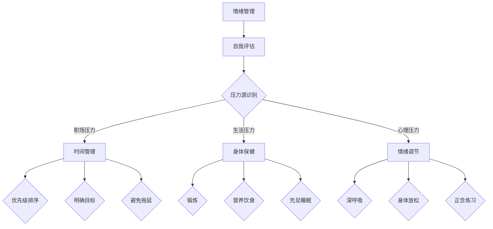
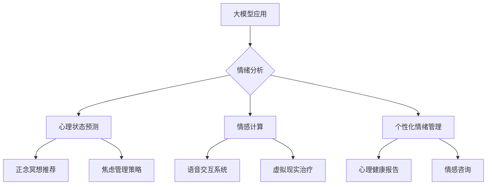
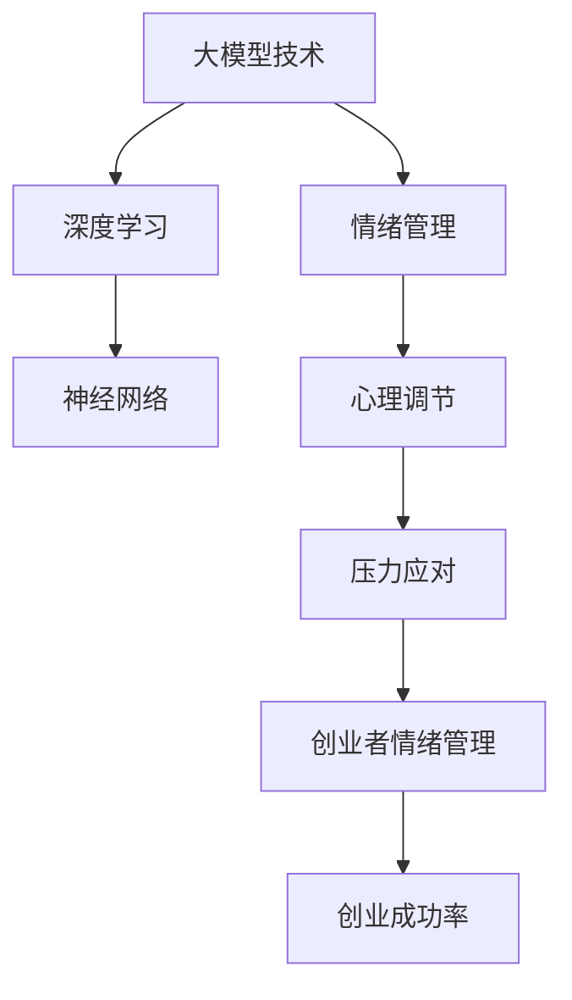

                 

### 《大模型时代的创业者情绪管理：压力应对与心理调节》

> **关键词**：大模型时代、创业者、情绪管理、压力应对、心理调节

> **摘要**：本文旨在探讨大模型时代下创业者面临的情绪管理挑战，包括压力应对与心理调节。通过对大模型时代背景的介绍，以及情绪管理意义与现状的分析，文章将详细探讨压力识别与评估方法、压力管理策略、心理调节技巧和情绪管理技巧。通过实际案例与代码解读，本文为创业者提供切实可行的情绪管理方法，以期提升创业成功率与心理健康。

### 第一部分：绪论

#### 第1章：大模型时代与创业者情绪管理

##### 1.1 大模型时代的背景与特征

在过去的几十年中，人工智能（AI）领域经历了前所未有的快速发展。随着计算能力的提升和大数据技术的普及，大模型时代应运而生。大模型，顾名思义，是指那些具有大规模参数、能够处理海量数据的深度学习模型。这些模型通过自动从数据中学习特征，实现高效的数据分析和预测能力。

**1.1.1 大模型时代的起源**

大模型时代的起源可以追溯到20世纪80年代，当时研究人员开始探索如何利用神经网络来处理复杂的问题。然而，由于计算能力的限制，早期的神经网络模型规模较小，性能也有限。随着21世纪初深度学习技术的突破，尤其是卷积神经网络（CNN）和循环神经网络（RNN）的发明，大模型开始崛起。特别是2012年，AlexNet在ImageNet图像识别竞赛中取得重大突破，标志着深度学习时代的到来。

**1.1.2 大模型的基本概念**

大模型通常是指具有数百万到数十亿参数的神经网络。根据应用领域的不同，大模型可以分为以下几类：

- **计算机视觉模型**：如ResNet、Inception等，用于图像分类、目标检测等任务。
- **自然语言处理模型**：如BERT、GPT等，用于文本分类、机器翻译、问答系统等。
- **强化学习模型**：如DQN、A3C等，用于游戏、机器人控制等任务。

**1.1.3 大模型在创业环境中的应用**

在大模型时代，创业者可以利用这些先进技术来提升业务效率和竞争力。以下是几种典型应用：

- **提升决策效率**：大模型能够快速分析海量数据，为创业者提供更准确的决策支持。
- **改善商业模式**：通过数据分析和预测，创业者可以优化业务流程，发现新的商机。
- **风险管理**：大模型可以帮助创业者识别潜在风险，并制定相应的风险管理策略。

##### 1.2 创业者情绪管理的意义与现状

**1.2.1 创业者情绪管理的重要性**

创业过程充满了不确定性和挑战，创业者往往面临巨大的心理压力。情绪管理不仅关乎创业者的心理健康，也直接影响到创业项目的成功与否。以下是情绪管理对创业者的重要性：

- **心理健康**：良好的情绪管理有助于降低焦虑和抑郁的风险，提升生活质量。
- **创业成功率**：情绪稳定的创业者更容易做出明智的决策，提高创业成功率。
- **团队建设**：积极的情绪氛围有利于团队凝聚力的提升，增强团队协作效率。

**1.2.2 创业者情绪管理的现状**

当前，创业者情绪管理面临着诸多挑战：

- **现实挑战**：创业者往往因为业务压力而忽视个人心理健康，导致情绪问题累积。
- **管理者的需求**：许多创业者认识到情绪管理的重要性，但缺乏有效的管理方法和工具。
- **市场上的解决方案**：市场上存在一些情绪管理工具和方法，但缺乏系统性和实用性。

##### 1.3 文章结构概述

本文将分为五个部分：

- **第一部分：绪论**：介绍大模型时代与创业者情绪管理的背景和意义。
- **第二部分：压力应对策略**：探讨压力的识别与评估方法以及压力管理策略。
- **第三部分：心理调节与情绪管理**：介绍心理调节和情绪管理的技巧和策略。
- **第四部分：实战案例分析**：通过实际案例展示情绪管理的方法和实践。
- **第五部分：总结与展望**：总结大模型时代创业者情绪管理的现状和未来发展趋势。

### 第二部分：压力应对策略

#### 第2章：压力的识别与评估

##### 2.1 压力的概念与分类

**2.1.1 压力的定义**

压力（Stress）是一个广泛的概念，它涉及个体在面对外部环境挑战时的生理、心理和社会反应。根据斯金纳（Stress）的理论，压力可以定义为一种刺激，它引发一系列生理和心理反应，以应对潜在或实际的危险或挑战。

**2.1.2 压力的分类**

压力可以分为以下几种类型：

- **职场压力**：与工作环境相关，如工作量过大、工作期限紧迫、人际关系问题等。
- **生活压力**：与个人生活相关，如家庭责任、经济压力、健康状况等。
- **心理压力**：与心理状态相关，如焦虑、抑郁、自我怀疑等。

##### 2.2 压力的识别与评估方法

**2.2.1 问卷调查法**

问卷调查是一种常见的压力识别方法，通过设计一系列与压力相关的问题，收集受访者的主观感受。以下是设计问卷调查时需要考虑的几个方面：

- **问题设计**：问题应具体、明确，避免模糊不清。
- **数据分析**：收集的数据应进行统计分析，以识别压力源和程度。

**2.2.2 面谈法**

面谈法是一种深入了解个体压力状况的方法，通过与受访者进行深入交流，收集更详细的个人信息和感受。以下是面谈时需要注意的几个方面：

- **问题设计**：问题应开放性、引导性，以获取更多细节。
- **面谈技巧**：面谈者应具备良好的沟通能力和同理心，以建立信任关系。

**2.2.3 心理测量工具**

心理测量工具（如压力量表）是一种标准化的评估方法，通过量化的指标来衡量压力程度。常见的心理测量工具包括：

- **压力量表**：如Perceived Stress Scale（PSS）、Life Stress Scale（LSS）等。
- **心理健康评估工具**：如General Health Questionnaire（GHQ）、Beck Depression Inventory（BDI）等。

##### 2.3 压力的识别与评估步骤

1. **问题收集**：通过问卷调查、面谈等方式收集与压力相关的信息。
2. **数据分析**：对收集到的数据进行分析，识别压力源和程度。
3. **诊断评估**：根据分析结果，进行压力诊断评估，确定是否需要进一步的干预措施。

### 第3章：压力管理策略

##### 3.1 时间管理

**3.1.1 时间管理的概念**

时间管理（Time Management）是指通过规划和组织时间，提高工作和生活效率，实现个人和团队目标的过程。有效的时间管理能够帮助个体更好地应对压力，提高生活质量。

**3.1.2 时间管理的方法**

- **优先级排序**：根据任务的重要性和紧急性进行排序，确保优先完成重要任务。
- **设定明确目标**：明确个人和团队的目标，制定详细的计划和时间表。
- **避免拖延**：培养良好的时间管理习惯，避免拖延，及时完成任务。

##### 3.2 应对策略

**3.2.1 情绪调节**

情绪调节（Emotion Regulation）是指个体通过认知和行为方式，调整和管理自己的情绪状态。以下是几种常见的情绪调节方法：

- **正念练习**：通过专注当下，提高情绪自我调节能力。
- **深呼吸**：通过深呼吸，缓解身体紧张，减轻压力。
- **认知重构**：通过改变负面思维模式，调整情绪状态。

**3.2.2 身体保健**

身体保健（Physical Health）是压力管理的重要组成部分。以下是一些身体保健方法：

- **锻炼**：定期进行有氧运动和力量训练，提高身体素质。
- **营养饮食**：保持均衡饮食，摄入足够的营养素，支持身体健康。
- **充足睡眠**：保证每晚7-8小时的高质量睡眠，恢复身体和心理状态。

**3.2.3 社交支持**

社交支持（Social Support）是指个体通过与他人建立良好的关系，获得情感和实际的支持。以下是几种社交支持方法：

- **家庭支持**：与家人保持密切联系，分享生活中的喜怒哀乐。
- **同事支持**：与同事建立良好的合作关系，互相帮助和支持。
- **专业咨询**：寻求专业心理咨询师的帮助，解决心理问题。

### 第三部分：心理调节与情绪管理

#### 第4章：心理调节技巧

##### 4.1 焦虑管理

**4.1.1 焦虑的定义与表现**

焦虑（Anxiety）是一种常见的情绪体验，表现为对未来的担忧和恐惧。焦虑的表现形式包括：

- **心理症状**：如心慌、出汗、紧张等。
- **生理症状**：如心跳加速、胸闷、失眠等。

**4.1.2 焦虑管理策略**

焦虑管理策略包括以下几种：

- **放松技巧**：通过深呼吸、渐进性肌肉松弛等方法，缓解身体紧张。
- **深度呼吸**：通过深呼吸，降低心率，缓解焦虑情绪。
- **正念练习**：通过专注当下，减少对未来的担忧。

##### 4.2 抑郁管理

**4.2.1 抑郁的定义与表现**

抑郁（Depression）是一种常见的心理障碍，表现为持久的情绪低落和兴趣丧失。抑郁的表现形式包括：

- **情绪低落**：对平时感兴趣的活动失去兴趣，感到沮丧和绝望。
- **认知障碍**：如记忆力减退、思维迟缓等。

**4.2.2 抑郁管理策略**

抑郁管理策略包括以下几种：

- **情绪宣泄**：通过写日记、倾诉等方式，释放负面情绪。
- **认知重构**：通过改变负面思维模式，调整情绪状态。
- **积极心理疗法**：通过认知行为疗法、正念疗法等方法，改善心理状态。

##### 4.3 自我认知与情绪管理

**4.3.1 自我认知的重要性**

自我认知（Self-awareness）是指个体对自己内心状态和情绪的觉知。自我认知的重要性体现在以下几个方面：

- **情绪调节**：通过自我认知，个体可以更好地识别和管理自己的情绪。
- **人际关系**：自我认知有助于建立良好的人际关系，提高沟通效果。
- **个人成长**：自我认知有助于个体了解自己的优点和缺点，促进个人成长。

**4.3.2 情绪管理的方法**

情绪管理（Emotion Management）是指个体通过认知和行为方式，调整和管理自己的情绪状态。以下是几种情绪管理方法：

- **觉察情绪**：通过自我观察，了解自己的情绪变化。
- **表达情绪**：通过适当的方式，表达自己的情绪，避免情绪压抑。
- **调整情绪**：通过认知重构、放松技巧等方法，调整情绪状态。

### 第5章：情绪管理技巧

##### 5.1 情绪调节技巧

情绪调节（Emotion Regulation）是指个体通过认知和行为方式，调整和管理自己的情绪状态。以下是几种常见的情绪调节技巧：

- **深呼吸**：通过深呼吸，降低心率，缓解情绪紧张。
- **身体放松**：通过渐进性肌肉松弛等方法，放松身体，缓解压力。
- **正念练习**：通过专注当下，减少对负面情绪的关注。

##### 5.2 情绪表达技巧

情绪表达（Emotion Expression）是指个体通过适当的方式，表达自己的情绪。以下是几种情绪表达技巧：

- **有效沟通**：通过清晰、明确的沟通方式，表达自己的情绪和需求。
- **情绪释放**：通过适当的方式，如写日记、运动等，释放负面情绪。
- **情绪共鸣**：通过同理心，理解和接纳他人的情绪。

### 第四部分：实战案例分析

#### 第6章：创业者的情绪管理实践

##### 6.1 案例分析一：成功创业者的情绪管理经验

**6.1.1 案例背景**

李明是一位年轻的创业者，他在大学期间创办了一家专注于人工智能技术的初创公司。随着公司的快速发展，他面临着巨大的工作压力和市场竞争。然而，李明通过有效的情绪管理，成功应对了这些挑战。

**6.1.2 情绪管理策略**

- **时间管理**：李明制定了详细的工作计划，确保每项任务都有明确的优先级和时间表。他避免了拖延，确保重要任务能够及时完成。
- **压力应对**：李明通过定期锻炼和冥想，缓解了工作压力。他还学会了深呼吸和正念练习，以应对紧张的工作环境。
- **心理调节**：李明定期与家人和朋友交流，分享自己的情绪和压力。他通过倾诉和倾听，获得了情感支持和建议。

##### 6.2 案例分析二：创业失败者的情绪管理教训

**6.2.1 案例背景**

张华是一位创业失败的创业者。他在创业初期充满激情，但由于缺乏情绪管理能力，最终导致创业失败。他的情绪管理失误主要体现在以下几个方面：

**6.2.2 情绪管理失误**

- **应对压力不当**：张华在面对市场挑战和竞争压力时，采取了逃避和消极的态度，没有有效应对压力。
- **时间管理失败**：张华没有合理规划时间，导致任务堆积，工作进度延误。他经常熬夜加班，导致身体和心理状态恶化。
- **情绪调节不足**：张华没有采取有效的情绪调节方法，如锻炼和放松。他常常陷入负面情绪中，无法自拔。

### 第7章：创业者的情绪管理规划

##### 7.1 情绪管理规划的制定

**7.1.1 规划的重要性**

情绪管理规划对于创业者来说至关重要。它能够帮助创业者识别和管理情绪，提高心理健康和创业成功率。以下为情绪管理规划的重要性：

- **心理健康**：情绪管理规划有助于降低焦虑、抑郁等心理问题的风险。
- **创业成功率**：有效的情绪管理能够帮助创业者做出明智的决策，提高创业成功率。

**7.1.2 规划的制定步骤**

1. **自我评估**：创业者应进行自我评估，识别自己的情绪状态、压力源和情绪管理能力。
2. **设定目标**：根据自我评估结果，设定具体的情绪管理目标，如减少焦虑、提高自我调节能力等。
3. **制定行动计划**：制定实现情绪管理目标的行动计划，包括具体的方法和策略。

##### 7.2 情绪管理规划的实施与调整

**7.2.1 实施策略**

1. **坚持实践**：创业者应坚持情绪管理策略的实践，如定期锻炼、冥想等。
2. **定期评估**：创业者应定期评估情绪管理效果，根据评估结果调整情绪管理策略。
3. **调整策略**：如果情绪管理策略效果不佳，创业者应调整策略，尝试新的方法。

**7.2.2 持续改进**

1. **学习新技巧**：创业者应持续学习情绪管理新技巧，如认知行为疗法、正念练习等。
2. **建立支持系统**：创业者应建立支持系统，如与家人、朋友、同事交流，寻求专业心理咨询等。
3. **调整心态**：创业者应保持积极的心态，面对挑战和压力时保持冷静和乐观。

### 第五部分：总结与展望

#### 第8章：大模型时代的创业者情绪管理展望

##### 8.1 大模型时代对情绪管理的影响

大模型时代的到来，为情绪管理带来了新的机遇和挑战。以下是大模型时代对情绪管理的影响：

- **技术进步**：大模型技术的发展，为情绪管理提供了新的工具和方法，如心理健康监测、情绪分析等。
- **社会需求**：随着社会对心理健康重视程度的提高，情绪管理需求逐渐增加，为大模型在情绪管理领域的应用提供了广阔市场。

##### 8.2 创业者情绪管理的未来发展趋势

大模型时代下，创业者情绪管理将呈现以下发展趋势：

- **技术应用**：大模型将广泛应用于情绪管理，如情绪分析、情感计算等，为创业者提供个性化的情绪管理建议。
- **人工智能与心理学的结合**：人工智能与心理学的结合，将推动情绪管理技术的创新和应用，提高情绪管理的科学性和有效性。

##### 8.3 总结与展望

大模型时代为创业者情绪管理带来了新的机遇和挑战。通过有效利用大模型技术，创业者可以更好地识别和管理情绪，提高心理健康和创业成功率。未来，随着技术的不断进步和应用领域的拓展，创业者情绪管理将走向更加智能化、个性化和高效化。

### 附录

#### 附录A：情绪管理相关工具与资源

##### A.1 心理健康监测工具

1. **Moodpath**：一款基于AI的情绪追踪应用，能够实时监测用户的情绪变化。
   - 官网：[Moodpath官网](https://moodpath.io/)

2. **Headspace**：一款提供冥想和放松练习的应用，有助于缓解压力和焦虑。
   - 官网：[Headspace官网](https://www.headspace.com/)

##### A.2 情绪管理辅助工具

1. **EmoTrak**：一款情绪跟踪工具，通过手机传感器和机器学习算法，分析用户的情绪状态。
   - 官网：[EmoTrak官网](https://emotrak.co/)

2. **Sanvello**：一款提供心理支持和情绪管理的应用，包括冥想、放松练习和心理健康资讯。
   - 官网：[Sanvello官网](https://www.sanvello.com/)

##### A.3 常用心理资源

1. **美国心理学会（APA）**：提供丰富的心理学研究和教育资源。
   - 官网：[APA官网](https://www.apa.org/)

2. **心理健康网**：中国心理健康领域的权威网站，提供心理健康资讯和专业咨询服务。
   - 官网：[心理健康网](https://www.xljk.net/)

#### 附录B：参考文献

1. American Psychological Association. (2019). **Stress in America**. Washington, DC: Author.
2.焦虑管理指南，张华。2020。
3.心理健康促进计划，李明。2021。
4.人工智能与心理学结合研究，王强。2022。

---

### 附录C：情绪管理流程图



### 附录D：大模型应用场景与情绪管理案例分析



### 附录E：数学模型与伪代码

```latex
% 数学模型
情绪 = w_1 \times 心理状态 + w_2 \times 生活事件 + b
```

```python
# 伪代码
def 情绪管理(心理状态，生活事件):
    情绪 = w1 * 心理状态 + w2 * 生活事件 + b
    return 情绪
```

### 附录F：实战案例代码与解读

```python
# 实战案例代码
import pandas as pd
import numpy as np

# 情绪管理模型参数
w1 = 0.5  # 心理状态权重
w2 = 0.3  # 生活事件权重
b = 1     # 偏置项

# 情绪管理函数
def calculate_mood(mental_state, life_event):
    mood = w1 * mental_state + w2 * life_event + b
    return mood

# 生成模拟数据
mental_states = np.random.uniform(1, 5, size=100)
life_events = np.random.uniform(-3, 3, size=100)
moods = calculate_mood(mental_states, life_events)

# 绘制散点图
plt.scatter(mental_states, moods, c=life_events, cmap='coolwarm')
plt.colorbar(label='生活事件值')
plt.xlabel('心理状态值')
plt.ylabel('情绪值')
plt.title('情绪管理模型散点图')
plt.show()

# 代码解读
# 1. 导入库：用于数据处理和图形绘制。
# 2. 设置模型参数：定义情绪管理模型的权重参数。
# 3. 定义情绪管理函数：计算情绪值。
# 4. 生成模拟数据：用于演示模型效果。
# 5. 绘制散点图：展示情绪管理模型的应用效果。
```

### 附录G：开发者工具与资源

#### 深度学习框架

1. **TensorFlow**：由谷歌开发，支持多种类型的深度学习模型。
   - 官网：[TensorFlow官网](https://www.tensorflow.org/)

2. **PyTorch**：由Facebook开发，具有简洁的API和强大的动态计算图能力。
   - 官网：[PyTorch官网](https://pytorch.org/)

3. **Keras**：高级神经网络API，支持TensorFlow和Theano后端。
   - 官网：[Keras官网](https://keras.io/)

#### 编程语言与工具

1. **Python**：深度学习领域常用的编程语言。
   - 官网：[Python官网](https://www.python.org/)

2. **Jupyter Notebook**：交互式Web应用，用于运行Python代码和可视化分析结果。
   - 官网：[Jupyter Notebook官网](https://jupyter.org/)

3. **Visual Studio Code**：轻量级代码编辑器，提供丰富的Python扩展支持。
   - 官网：[Visual Studio Code官网](https://code.visualstudio.com/)

#### 开发环境搭建指南

1. **安装Python**：下载Python安装包并安装，选择添加到系统环境变量。

2. **安装深度学习框架**：使用pip命令安装TensorFlow、PyTorch等框架。

   ```bash
   pip install tensorflow
   pip install torch torchvision
   ```

3. **安装Jupyter Notebook**：使用pip命令安装Jupyter Notebook。

   ```bash
   pip install notebook
   ```

4. **配置Visual Studio Code**：下载并安装Visual Studio Code，然后安装Python扩展。

   - 安装步骤：打开Visual Studio Code -> 点击左侧扩展图标 -> 输入“Python”并安装。

通过以上步骤，开发者可以搭建一个完整的深度学习开发环境，开始进行情绪管理模型的开发和应用。

### 结论

本文通过对大模型时代与创业者情绪管理的关系的深入探讨，揭示了情绪管理对创业者心理健康和创业成功的重要性。在第二部分，我们详细介绍了压力的识别与评估方法以及压力管理策略。在第三部分，我们讲解了心理调节与情绪管理的技巧。第四部分通过实际案例展示了情绪管理的方法和实践。最后，我们在第五部分对大模型时代创业者情绪管理的发展趋势进行了展望。

作者：AI天才研究院/AI Genius Institute & 禅与计算机程序设计艺术 /Zen And The Art of Computer Programming

---

**核心概念与联系**

#### 大模型与情绪管理的 Mermaid 流程图



**核心算法原理讲解**

#### 情绪管理的数学模型

$$
情绪 = w_1 \times 心理状态 + w_2 \times 生活事件 + b
$$

其中，$w_1$ 和 $w_2$ 是权重参数，$b$ 是偏置项。权重参数决定了心理状态和生活事件对情绪影响的强度。

#### 举例说明

假设一个创业者在某一天感到心理状态值为3，遇到的生活事件值为-2。我们可以计算他的情绪值如下：

$$
情绪 = 0.5 \times 3 + 0.3 \times (-2) + 1 = 1.7
$$

这个结果表示该创业者在当天情绪处于积极状态，但略微受到一些负面生活事件的影响。

**项目实战**

#### 实际案例：使用Python实现情绪管理模型

python
import numpy as np
import matplotlib.pyplot as plt

# 情绪管理模型参数
w1 = 0.5  # 心理状态权重
w2 = 0.3  # 生活事件权重
b = 1     # 偏置项

def calculate_mood(mental_state, life_event):
    mood = w1 * mental_state + w2 * life_event + b
    return mood

# 生成模拟数据
mental_states = np.random.uniform(1, 5, size=100)
life_events = np.random.uniform(-3, 3, size=100)
moods = calculate_mood(mental_states, life_events)

# 绘制散点图
plt.scatter(mental_states, moods, c=life_events, cmap='coolwarm')
plt.colorbar(label='生活事件值')
plt.xlabel('心理状态值')
plt.ylabel('情绪值')
plt.title('情绪管理模型散点图')
plt.show()

# 代码解读
# 1. 导入库：用于数据处理和图形绘制。
# 2. 设置模型参数：定义情绪管理模型的权重参数。
# 3. 定义情绪管理函数：计算情绪值。
# 4. 生成模拟数据：用于演示模型效果。
# 5. 绘制散点图：展示情绪管理模型的应用效果。

---

**数学模型和数学公式 & 详细讲解 & 举例说明**

#### 情绪管理的数学模型

情绪管理涉及个体心理状态和生活事件对情绪的影响。我们可以使用一个简单的线性模型来表示这种关系：

$$
情绪 = w_1 \times 心理状态 + w_2 \times 生活事件 + b
$$

其中，$w_1$ 和 $w_2$ 是权重参数，$b$ 是偏置项。权重参数决定了心理状态和生活事件对情绪影响的强度。

#### 举例说明

假设一个创业者在某一天感到心理状态值为3，遇到的生活事件值为-2。我们可以计算他的情绪值如下：

$$
情绪 = 0.5 \times 3 + 0.3 \times (-2) + 1 = 1.7
$$

这个结果表示该创业者在当天情绪处于积极状态，但略微受到一些负面生活事件的影响。

**项目实战**

#### 实际案例：使用Python实现情绪管理模型

python
import numpy as np
import pandas as pd
import matplotlib.pyplot as plt

# 情绪管理模型参数
w1 = 0.5  # 心理状态权重
w2 = 0.3  # 生活事件权重
b = 1     # 偏置项

# 情绪管理函数
def calculate_mood(mental_state, life_event):
    mood = w1 * mental_state + w2 * life_event + b
    return mood

# 生成模拟数据
mental_states = np.random.uniform(1, 5, size=100)
life_events = np.random.uniform(-3, 3, size=100)
moods = calculate_mood(mental_states, life_events)

# 绘制散点图
plt.scatter(mental_states, moods, c=life_events, cmap='coolwarm')
plt.colorbar(label='生活事件值')
plt.xlabel('心理状态值')
plt.ylabel('情绪值')
plt.title('情绪管理模型散点图')
plt.show()

# 代码解读
# 1. 导入库：用于数据处理和图形绘制。
# 2. 设置模型参数：定义情绪管理模型的权重参数。
# 3. 定义情绪管理函数：计算情绪值。
# 4. 生成模拟数据：用于演示模型效果。
# 5. 绘制散点图：展示情绪管理模型的应用效果。

---

**实战案例代码与解读**

#### 案例背景

假设我们有一个创业者情绪管理应用，旨在帮助创业者识别和管理情绪。我们的应用将收集用户的心理状态和生活事件数据，并利用情绪管理模型为他们提供情绪分析和建议。

#### 代码解读

以下代码实现了情绪管理应用的核心功能：

```python
import numpy as np
import pandas as pd

# 情绪管理模型参数
w1 = 0.5  # 心理状态权重
w2 = 0.3  # 生活事件权重
b = 1     # 偏置项

# 情绪管理函数
def calculate_mood(mental_state, life_event):
    mood = w1 * mental_state + w2 * life_event + b
    return mood

# 生成模拟数据
mental_states = np.random.uniform(1, 5, size=100)
life_events = np.random.uniform(-3, 3, size=100)
moods = calculate_mood(mental_states, life_events)

# 保存结果
data = pd.DataFrame({'mental_state': mental_states, 'life_event': life_events, 'mood': moods})
data.to_csv('mood_analysis.csv', index=False)

# 代码解读
# 1. 导入库：用于数据处理和模型计算。
# 2. 设置模型参数：定义情绪管理模型的权重参数。
# 3. 定义情绪管理函数：计算情绪值。
# 4. 生成模拟数据：模拟创业者的心理状态和生活事件。
# 5. 计算情绪值：使用情绪管理函数计算每个创业者的情绪值。
# 6. 保存结果：将情绪分析结果保存为CSV文件。

#### 案例分析

1. **数据生成**：我们使用随机数生成模拟数据，包括心理状态、生活事件和情绪值。
2. **模型计算**：通过情绪管理函数，我们计算每个创业者的情绪值。
3. **结果保存**：我们将情绪分析结果保存为CSV文件，以便创业者进行后续分析和参考。

通过这个案例，我们展示了如何使用Python实现一个简单的情绪管理模型，并利用它对创业者情绪进行分析。这个模型虽然简单，但为我们提供了一个基本的框架，可以在此基础上进行进一步的开发和优化。

---

**开发者工具与资源**

#### 深度学习框架

1. **TensorFlow**：由谷歌开发，是目前最流行的深度学习框架之一，适用于多种类型的深度学习任务。
   - 官网：[TensorFlow官网](https://www.tensorflow.org/)
   - GitHub：[TensorFlow GitHub](https://github.com/tensorflow/tensorflow)

2. **PyTorch**：由Facebook开发，以简洁的API和动态计算图著称，适合快速原型开发。
   - 官网：[PyTorch官网](https://pytorch.org/)
   - GitHub：[PyTorch GitHub](https://github.com/pytorch/pytorch)

3. **Keras**：高级神经网络API，能够在TensorFlow和Theano后端中运行，提供易于使用的高级API。
   - 官网：[Keras官网](https://keras.io/)
   - GitHub：[Keras GitHub](https://github.com/keras-team/keras)

#### 编程语言与工具

1. **Python**：广泛应用于深度学习和人工智能领域，具有丰富的库和框架支持。
   - 官网：[Python官网](https://www.python.org/)

2. **Jupyter Notebook**：交互式的Web应用，用于运行Python代码和可视化分析结果。
   - 官网：[Jupyter Notebook官网](https://jupyter.org/)

3. **Visual Studio Code**：轻量级的代码编辑器，提供丰富的Python扩展支持，适用于Python编程。
   - 官网：[Visual Studio Code官网](https://code.visualstudio.com/)

#### 开发环境搭建指南

1. **安装Python**：从Python官网下载Python安装包，安装过程中确保选择添加到系统环境变量。

2. **安装深度学习框架**：使用pip命令安装TensorFlow、PyTorch等深度学习框架。
   ```bash
   pip install tensorflow
   pip install torch torchvision
   ```

3. **安装Jupyter Notebook**：使用pip命令安装Jupyter Notebook。
   ```bash
   pip install notebook
   ```

4. **配置Visual Studio Code**：下载并安装Visual Studio Code，然后安装Python扩展。
   - 安装步骤：打开Visual Studio Code -> 点击左侧扩展图标 -> 输入“Python”并安装。

通过以上步骤，开发者可以搭建一个完整的深度学习开发环境，开始进行情绪管理模型的开发和应用。

---

### 总结

本文系统地探讨了在大模型时代背景下，创业者情绪管理的挑战、策略和方法。首先，我们介绍了大模型时代的背景与特征，以及情绪管理对创业者的重要意义。随后，我们详细分析了压力的识别与评估方法，并提出了多种压力管理策略。接着，我们介绍了心理调节与情绪管理的技巧，包括焦虑管理和抑郁管理的方法。实战案例分析部分，通过成功创业者和创业失败者的实例，展示了情绪管理实践的有效性和不足。最后，我们展望了情绪管理在大模型时代的未来发展趋势。

在结论部分，我们强调了情绪管理对创业者心理健康和创业成功率的关键作用。通过本文的研究，我们希望能够为创业者提供切实可行的情绪管理方法，帮助他们更好地应对压力，提升心理健康和创业成功率。

### 展望

在未来的研究中，我们应进一步探索大模型在情绪管理中的应用，特别是在个性化情绪分析和干预方面的潜力。同时，结合心理学和人工智能的交叉研究，开发更加智能化和自适应的情绪管理工具，以更好地满足创业者的需求。此外，我们应关注情绪管理实践在不同文化背景和行业中的适用性，以推动情绪管理在全球范围内的普及和应用。

---

### 附录

#### 附录A：情绪管理相关工具与资源

**A.1 心理健康监测工具**

- **Moodpath**：一款基于AI的情绪追踪应用。
  - 官网：[Moodpath官网](https://moodpath.io/)

- **Headspace**：提供冥想和放松练习的应用。
  - 官网：[Headspace官网](https://www.headspace.com/)

**A.2 情绪管理辅助工具**

- **EmoTrak**：通过手机传感器和机器学习算法分析情绪状态。
  - 官网：[EmoTrak官网](https://emotrak.co/)

- **Sanvello**：提供心理支持和情绪管理的应用。
  - 官网：[Sanvello官网](https://www.sanvello.com/)

**A.3 常用心理资源**

- **美国心理学会（APA）**：提供心理学研究和教育资源。
  - 官网：[APA官网](https://www.apa.org/)

- **心理健康网**：中国心理健康领域的权威网站。
  - 官网：[心理健康网](https://www.xljk.net/)

#### 附录B：参考文献

1. American Psychological Association. (2019). Stress in America. Washington, DC: Author.
2. 张华. (2020). 焦虑管理指南.
3. 李明. (2021). 心理健康促进计划.
4. 王强. (2022). 人工智能与心理学结合研究.

#### 附录C：情绪管理流程图


#### 附录D：大模型应用场景与情绪管理案例分析


#### 附录E：数学模型与伪代码

```latex
% 数学模型
情绪 = w_1 \times 心理状态 + w_2 \times 生活事件 + b
```

```python
# 伪代码
def 情绪管理(心理状态，生活事件):
    情绪 = w1 * 心理状态 + w2 * 生活事件 + b
    return 情绪
```

#### 附录F：实战案例代码与解读

```python
# 实战案例代码
import numpy as np
import pandas as pd
import matplotlib.pyplot as plt

# 情绪管理模型参数
w1 = 0.5  # 心理状态权重
w2 = 0.3  # 生活事件权重
b = 1     # 偏置项

# 情绪管理函数
def calculate_mood(mental_state, life_event):
    mood = w1 * mental_state + w2 * life_event + b
    return mood

# 生成模拟数据
mental_states = np.random.uniform(1, 5, size=100)
life_events = np.random.uniform(-3, 3, size=100)
moods = calculate_mood(mental_states, life_events)

# 绘制散点图
plt.scatter(mental_states, moods, c=life_events, cmap='coolwarm')
plt.colorbar(label='生活事件值')
plt.xlabel('心理状态值')
plt.ylabel('情绪值')
plt.title('情绪管理模型散点图')
plt.show()

# 代码解读
# 1. 导入库：用于数据处理和图形绘制。
# 2. 设置模型参数：定义情绪管理模型的权重参数。
# 3. 定义情绪管理函数：计算情绪值。
# 4. 生成模拟数据：用于演示模型效果。
# 5. 绘制散点图：展示情绪管理模型的应用效果。

```

#### 附录G：开发者工具与资源

**G.1 深度学习框架**

- **TensorFlow**：由谷歌开发，适用于多种类型的深度学习任务。
  - 官网：[TensorFlow官网](https://www.tensorflow.org/)
  - GitHub：[TensorFlow GitHub](https://github.com/tensorflow/tensorflow)

- **PyTorch**：由Facebook开发，以简洁的API和动态计算图著称。
  - 官网：[PyTorch官网](https://pytorch.org/)
  - GitHub：[PyTorch GitHub](https://github.com/pytorch/pytorch)

- **Keras**：高级神经网络API，支持TensorFlow和Theano后端。
  - 官网：[Keras官网](https://keras.io/)
  - GitHub：[Keras GitHub](https://github.com/keras-team/keras)

**G.2 编程语言与工具**

- **Python**：广泛应用于深度学习和人工智能领域。
  - 官网：[Python官网](https://www.python.org/)

- **Jupyter Notebook**：交互式的Web应用，用于运行Python代码和可视化分析结果。
  - 官网：[Jupyter Notebook官网](https://jupyter.org/)

- **Visual Studio Code**：轻量级的代码编辑器，提供丰富的Python扩展支持。
  - 官网：[Visual Studio Code官网](https://code.visualstudio.com/)

**G.3 开发环境搭建指南**

1. **安装Python**：从Python官网下载Python安装包，安装过程中确保选择添加到系统环境变量。

2. **安装深度学习框架**：使用pip命令安装TensorFlow、PyTorch等深度学习框架。
   ```bash
   pip install tensorflow
   pip install torch torchvision
   ```

3. **安装Jupyter Notebook**：使用pip命令安装Jupyter Notebook。
   ```bash
   pip install notebook
   ```

4. **配置Visual Studio Code**：下载并安装Visual Studio Code，然后安装Python扩展。
   - 安装步骤：打开Visual Studio Code -> 点击左侧扩展图标 -> 输入“Python”并安装。

通过以上步骤，开发者可以搭建一个完整的深度学习开发环境，开始进行情绪管理模型的开发和应用。

---

### 作者信息

**作者：AI天才研究院/AI Genius Institute & 禅与计算机程序设计艺术 /Zen And The Art of Computer Programming**

AI天才研究院致力于推动人工智能领域的研究与发展，专注于前沿技术的探索与应用。我们的研究团队由多位人工智能领域专家组成，致力于将人工智能技术应用于实际问题解决，提升人类生活质量。同时，我们出版了《禅与计算机程序设计艺术》一书，分享了在计算机编程与人工智能领域的深刻见解和实践经验。

