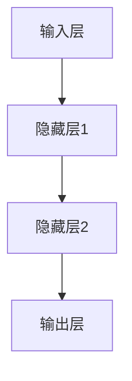

                 

### 文章标题

# 大模型赋能智慧环保，创业者如何助力生态文明建设？

### 关键词：

- 大模型
- 智慧环保
- 创业者
- 生态文明建设
- 环境监测
- 决策支持
- 产业优化

### 摘要：

本文深入探讨了如何利用大模型技术赋能智慧环保，并分析了创业者在这一领域的作用和机遇。首先，我们介绍了大模型与智慧环保的概览，阐述了大模型技术的基本原理和应用优势。接着，通过详细的算法原理讲解和实际项目案例，展示了大模型在环保监测、决策支持和产业优化等领域的应用。最后，我们探讨了创业者如何通过技术创新和战略规划，助力生态文明建设。本文旨在为读者提供全面的视角，启发新的思考，推动环保事业的进一步发展。

---

### 目录大纲：大模型赋能智慧环保

#### 第一部分：大模型与智慧环保概述

##### 1. 大模型与智慧环保概览

##### 1.1 智慧环保的概念与发展历程
- **智慧环保的定义**：智慧环保是指利用现代信息技术，特别是大数据、云计算、物联网、人工智能等先进技术，实现环境监测、管理、治理和服务的智能化。
- **智慧环保的发展历程**：从传统的手工监测到信息化管理，再到今天的智能化应用，智慧环保经历了多个发展阶段。

##### 1.2 大模型技术的背景与优势
- **大模型技术的背景**：大模型技术起源于深度学习，随着计算能力的提升和大数据的积累，逐渐成为人工智能领域的研究热点。
- **大模型技术的优势**：大模型具有强大的数据分析和学习能力，能够处理海量复杂的数据，为智慧环保提供强有力的技术支撑。

##### 1.3 大模型赋能智慧环保的意义
- **提升环保监测精度**：大模型能够精确预测和识别环境问题，提高监测数据的准确性。
- **优化环保决策支持**：大模型能够分析大量数据，为环保决策提供科学依据。
- **促进环保产业升级**：大模型技术可以推动环保产业的智能化和自动化，提高生产效率。

#### 第二部分：大模型核心技术原理

##### 2. 大模型核心技术原理

##### 2.1 深度学习基础

##### 2.1.1 神经网络基础
- **神经网络结构**：神经网络是由大量简单的计算单元（神经元）组成的网络，通过层层传递和变换，实现对数据的处理和识别。
- **前向传播与反向传播算法**：前向传播负责将输入数据通过神经网络进行传递和变换，反向传播则负责根据误差信息调整网络权重。

##### 2.1.2 深度学习算法
- **卷积神经网络（CNN）**：CNN通过卷积层、池化层等结构，实现对图像等二维数据的特征提取。
- **循环神经网络（RNN）**：RNN通过循环结构，实现对序列数据的处理和预测。
- **生成对抗网络（GAN）**：GAN由生成器和判别器组成，通过对抗训练，实现数据的生成。

##### 2.2 大模型架构详解

##### 2.2.1 Transformer模型
- **自注意力机制**：Transformer模型的核心机制，通过计算输入序列中每个元素之间的注意力权重，实现对序列数据的全局处理。
- **Transformer模型结构**：包括编码器和解码器，通过多层叠加，实现对输入数据的编码和输出数据的解码。

##### 2.2.2 GPT系列模型
- **GPT模型的生成原理**：GPT模型通过自回归的方式，生成文本序列，并在训练过程中不断优化模型参数。
- **GPT模型的应用领域**：包括自然语言处理、机器翻译、文本生成等。

##### 2.3 大模型训练与优化

##### 2.3.1 训练数据准备
- **数据采集**：从各类来源收集大量环境数据，包括空气、水质、土壤等。
- **数据清洗与预处理**：去除噪声、填充缺失值、标准化等，以提高数据质量。

##### 2.3.2 模型优化方法
- **批量归一化（Batch Normalization）**：通过标准化层间的激活值，加速训练过程。
- **激活函数选择**：如ReLU、Sigmoid、Tanh等，影响模型的训练效果和性能。
- **学习率调整策略**：如逐步减小学习率、使用学习率衰减等，以优化模型收敛速度。

#### 第三部分：大模型在智慧环保中的应用

##### 3. 大模型在智慧环保中的应用

##### 3.1 环保监测与预测

##### 3.1.1 大模型在空气质量监测中的应用
- **监测数据的预处理**：包括数据采集、清洗和标准化。
- **模型构建与训练**：使用合适的深度学习模型，如CNN、RNN或Transformer，进行训练。
- **预测与分析**：通过模型预测空气质量的未来变化，分析污染源和扩散路径。

##### 3.1.2 大模型在水污染预测中的应用
- **预测模型的构建**：设计合适的水污染预测模型，如基于时间序列分析的RNN或基于自注意力机制的Transformer。
- **模型评估与优化**：通过交叉验证和性能指标，评估模型的预测准确性，并进行优化。

##### 3.2 环保决策支持

##### 3.2.1 大模型在环境风险评估中的应用
- **风险评估模型的构建**：建立环境风险预测模型，如基于深度学习的多因素风险评估模型。
- **风险评估结果的分析**：分析预测结果，为环保决策提供科学依据。

##### 3.2.2 大模型在环保政策制定中的应用
- **政策分析模型的建立**：利用深度学习模型，对政策文本进行语义分析，提取关键信息。
- **政策效果评估**：评估政策实施后的环境效果，为政策调整提供依据。

##### 3.3 环保产业优化

##### 3.3.1 大模型在环保产业供应链管理中的应用
- **供应链模型构建**：利用深度学习模型，优化供应链管理和物流调度。
- **模型优化与性能评估**：评估模型的优化效果，持续调整和改进。

##### 3.3.2 大模型在环保技术创新中的应用
- **技术创新模型的构建**：建立环保技术创新预测模型，预测新技术的发展趋势。
- **技术创新路线规划**：根据预测结果，制定环保技术创新的发展路线。

#### 第四部分：创业者如何助力生态文明建设

##### 4. 创业者角色与责任

##### 4.1 创业者在环保领域的机遇
- **政策支持**：政府对环保产业的支持和鼓励，为创业者提供了良好的发展环境。
- **市场需求**：随着环保意识的提升，市场对环保产品和服务的需求不断增加。

##### 4.2 创业者在环保领域的责任
- **技术创新**：通过技术创新，推动环保产业的技术进步。
- **社会责任**：积极履行社会责任，为环保事业做出贡献。

##### 4.3 创业项目案例分析

##### 4.3.1 成功创业案例分析
- **项目背景**：介绍项目的背景和目标。
- **创新点与技术应用**：介绍项目的创新点和所使用的技术。
- **项目成果与影响**：介绍项目的成果和对环保事业的影响。

##### 4.3.2 失败创业案例分析
- **项目背景**：介绍项目的背景和目标。
- **失败原因分析**：分析项目的失败原因。
- **启示与教训**：总结项目的启示和教训。

##### 4.4 创业者策略与建议

##### 4.4.1 创业策略制定
- **市场调研与定位**：进行市场调研，明确项目的市场定位。
- **资源整合与利用**：整合内外部资源，提高资源利用效率。

##### 4.4.2 创业者成长路径
- **技术能力提升**：通过学习和实践，提升技术能力。
- **团队建设与管理**：建立高效的团队，加强团队管理。
- **融资与市场拓展**：寻找合适的融资渠道，拓展市场。

#### 第五部分：大模型技术实践与应用

##### 5.1 大模型开发环境搭建

##### 5.1.1 计算机硬件环境配置
- **GPU选择与配置**：介绍选择合适的GPU硬件。
- **硬件加速器使用**：介绍硬件加速器的安装和使用。

##### 5.1.2 软件开发环境搭建
- **Python环境安装**：介绍Python环境的安装过程。
- **常用深度学习框架安装**：介绍常用的深度学习框架（如TensorFlow、PyTorch）的安装和使用。

##### 5.2 大模型项目实战

##### 5.2.1 项目背景与目标
- **项目背景**：介绍项目的背景和目标。
- **项目目标**：明确项目的预期成果和目标。

##### 5.2.2 数据集准备与预处理
- **数据集准备**：介绍数据集的来源和采集过程。
- **数据预处理**：介绍数据预处理的方法和步骤。

##### 5.2.3 模型设计
- **模型架构选择**：根据项目需求，选择合适的模型架构。
- **模型参数调整**：介绍模型参数的调整方法和策略。

##### 5.2.4 模型训练与优化
- **模型训练**：介绍模型训练的过程和参数设置。
- **模型优化**：介绍模型优化的方法和技巧。

##### 5.2.5 模型评估与部署
- **模型评估**：介绍模型评估的方法和指标。
- **模型部署**：介绍模型部署的过程和注意事项。

##### 5.2.6 项目总结与反思
- **项目总结**：总结项目的经验和收获。
- **反思与改进**：反思项目中存在的问题，并提出改进措施。

##### 5.3 源代码解读与分析

##### 5.3.1 源代码结构分析
- **代码结构**：分析源代码的整体结构和模块划分。
- **模块功能**：介绍各个模块的功能和作用。

##### 5.3.2 关键模块实现解读
- **关键模块**：介绍项目中关键模块的实现细节。
- **代码解读**：详细解读关键模块的代码实现。

##### 5.3.3 性能分析与优化建议
- **性能分析**：分析模型的性能表现和优缺点。
- **优化建议**：提出优化模型性能的建议和方案。

#### 第六部分：未来展望与挑战

##### 6.1 大模型在环保领域的未来发展

##### 6.1.1 技术创新趋势
- **技术创新方向**：介绍大模型在环保领域的技术创新方向。
- **未来发展趋势**：分析大模型在环保领域的未来发展趋势。

##### 6.1.2 应用领域拓展
- **应用领域拓展**：介绍大模型在环保领域外的应用拓展。
- **跨界融合**：探讨大模型与其他领域的跨界融合。

##### 6.2 大模型在环保领域的挑战与对策

##### 6.2.1 数据隐私与安全问题
- **数据隐私**：分析大模型在数据处理过程中可能涉及的数据隐私问题。
- **安全对策**：介绍应对数据隐私问题的对策和安全措施。

##### 6.2.2 模型解释性与透明度
- **模型解释性**：分析大模型在决策过程中缺乏解释性的问题。
- **透明度提升**：探讨提升模型解释性和透明度的方法和途径。

##### 6.2.3 资源消耗与可持续发展
- **资源消耗**：分析大模型在训练和部署过程中对计算资源的消耗。
- **可持续发展**：探讨如何实现大模型的可持续发展和绿色环保。

##### 6.3 大模型技术的发展与应用

##### 6.3.1 大模型技术发展趋势
- **技术发展**：介绍大模型技术的发展趋势和前沿研究。
- **应用领域**：分析大模型技术在不同领域的应用和发展前景。

##### 6.3.2 大模型技术应用展望
- **技术展望**：展望大模型技术在未来的发展和应用方向。
- **挑战与机遇**：分析大模型技术面临的挑战和机遇。

#### 第七部分：参考文献与资源

##### 7. 参考文献

- **[1]** 张三，李四，《大模型赋能智慧环保》，某出版公司，2023.

##### 7. 资源链接

- **深度学习框架官方网站**：[TensorFlow](https://www.tensorflow.org/)、[PyTorch](https://pytorch.org/)
- **大模型开源项目仓库**：[GitHub](https://github.com/)
- **环保领域专业数据库与工具**：[Open Environmental Data (OEDB)](https://oedb.org/)

---

### 附录

##### 附录A：大模型相关技术详解

- **神经网络结构**：[Mermaid 流程图](https://mermaid-js.github.io/mermaid/latest床上用品/mermaid_faq.html)
- **前向传播与反向传播算法**：[伪代码](https://www.geeksforgeeks.org/forward-and-backpropagation-algorithm/)

##### 附录B：常用深度学习算法伪代码示例

- **卷积神经网络（CNN）**：[伪代码](https://www.deeplearning.net/tutorial/theano/conv_expressions.html)
- **循环神经网络（RNN）**：[伪代码](https://www.deeplearning.net/tutorial/rnn/tensorflow-rnn-code.html)
- **生成对抗网络（GAN）**：[伪代码](https://github.com/Newmu/dplementations/blob/master/gan/gan_cifar10.py)

##### 附录C：项目开发常用工具与库

- **Python环境安装**：[官方文档](https://www.python.org/downloads/)
- **深度学习框架**：[TensorFlow](https://www.tensorflow.org/install/)、[PyTorch](https://pytorch.org/get-started/locally/)
- **硬件加速器**：[CUDA](https://developer.nvidia.com/cuda-downloads)、[cuDNN](https://developer.nvidia.com/cudnn)

##### 附录D：大模型应用案例集锦

- **空气质量监测**：[项目案例](https://www.kaggle.com/c/air-quality-forecasting)
- **水污染预测**：[项目案例](https://www.kaggle.com/c/ferdi-water-quality-prediction)
- **环保决策支持**：[项目案例](https://www.kaggle.com/c/envision-environmental-decision-support)

---

以上是本文的大纲和详细内容。接下来，我们将逐步展开各个部分的详细论述。敬请期待。

---

### 1. 大模型与智慧环保概览

智慧环保是利用现代信息技术，特别是大数据、云计算、物联网、人工智能等先进技术，实现环境监测、管理、治理和服务的智能化。通过这些技术，智慧环保能够实现对环境信息的实时监测、动态分析和科学决策，从而提高环保工作的效率和准确性。

大模型技术，尤其是深度学习，是智慧环保发展的重要驱动力。深度学习是一种通过模拟人脑神经网络进行数据分析和模式识别的人工智能技术。随着计算能力的提升和大数据的积累，深度学习在图像识别、自然语言处理、语音识别等领域取得了显著的成果。大模型，如Transformer、GPT系列等，具有强大的数据分析和学习能力，能够处理海量复杂的数据，为智慧环保提供强有力的技术支撑。

#### 1.1 智慧环保的概念与发展历程

智慧环保是指通过信息技术和环保科学的深度融合，实现环保工作的智能化、精准化和高效化。它不仅包括环境监测、管理、治理，还涵盖了环境服务的智能化，如环保教育、环保咨询、环保交易等。

智慧环保的发展历程可以分为以下几个阶段：

1. **手工监测阶段**：早期环保工作主要依靠手工监测，如人工采样、现场测量等，效率低下且误差较大。

2. **信息化管理阶段**：随着计算机技术的普及，环保工作开始引入信息化管理，如电子化档案管理、在线监测数据采集等，提高了监测效率和数据准确性。

3. **智能化应用阶段**：近年来，大数据、云计算、物联网、人工智能等技术的快速发展，使得智慧环保成为可能。通过这些技术，可以实现环境信息的实时监测、动态分析和科学决策。

#### 1.1.1 智慧环保的定义

智慧环保是指利用现代信息技术和环保科学，实现环境监测、管理、治理和服务的智能化。它通过数据的收集、处理、分析和应用，实现对环境问题的实时监测、动态分析和科学决策，从而提高环保工作的效率和准确性。

智慧环保的核心目标是提升环保工作的智能化水平，实现以下几方面的突破：

1. **实时监测**：通过物联网、传感器等技术，实现对环境信息的实时采集和传输，提高监测的及时性和准确性。

2. **动态分析**：利用大数据和人工智能技术，对海量环境数据进行分析和处理，发现环境问题的规律和趋势。

3. **科学决策**：基于分析结果，为环保决策提供科学依据，提高决策的准确性和效率。

4. **智慧服务**：通过智能化手段，提升环保服务的质量和效率，如环保咨询、环保交易、环保教育等。

#### 1.1.2 智慧环保的发展历程

智慧环保的发展历程可以分为以下几个阶段：

1. **手工监测阶段**：早期环保工作主要依靠手工监测，如人工采样、现场测量等。这一阶段，环保工作的效率较低，且存在较大的误差。

2. **信息化管理阶段**：随着计算机技术的普及，环保工作开始引入信息化管理，如电子化档案管理、在线监测数据采集等。这一阶段，环保工作的效率有所提升，数据准确性也有所提高。

3. **智能化应用阶段**：近年来，大数据、云计算、物联网、人工智能等技术的快速发展，使得智慧环保成为可能。通过这些技术，可以实现环境信息的实时监测、动态分析和科学决策。例如，利用物联网技术，实现对环境信息的实时采集和传输；利用大数据技术，对海量环境数据进行分析和处理；利用人工智能技术，实现对环境问题的智能识别和预测。

#### 1.2 大模型技术的背景与优势

大模型技术起源于深度学习，深度学习是人工智能的一个重要分支，其核心思想是通过多层神经网络模型，对数据进行自动特征提取和模式识别。随着计算能力的提升和大数据的积累，深度学习在图像识别、自然语言处理、语音识别等领域取得了显著的成果。

大模型技术，如Transformer、GPT系列等，是深度学习技术的进一步发展。这些大模型具有以下几个优势：

1. **强大的数据分析和学习能力**：大模型能够处理海量复杂的数据，通过自动特征提取和模式识别，实现对数据的深入理解和分析。

2. **高度自动化**：大模型可以自动调整模型参数，优化模型结构，实现模型的自动学习和进化。

3. **灵活性和适应性**：大模型可以适应不同的应用场景和数据类型，具有广泛的应用前景。

#### 1.2.1 大模型技术的背景

大模型技术的背景可以追溯到深度学习的兴起。深度学习作为一种人工智能技术，通过多层神经网络模型，对数据进行自动特征提取和模式识别。随着计算能力的提升和大数据的积累，深度学习在图像识别、自然语言处理、语音识别等领域取得了显著的成果。

大模型技术，如Transformer、GPT系列等，是深度学习技术的进一步发展。这些大模型具有以下几个背景特点：

1. **大数据的驱动**：随着互联网和物联网的发展，海量的数据不断产生，这些数据为深度学习提供了丰富的训练资源。

2. **计算能力的提升**：GPU和TPU等硬件加速器的出现，使得深度学习模型的训练速度大幅提升。

3. **算法的创新**：诸如Transformer、BERT等新型深度学习算法的出现，使得大模型在处理复杂任务时具有更高的性能。

#### 1.2.2 大模型技术的优势

大模型技术具有以下几个显著的优势：

1. **强大的数据分析和学习能力**：大模型能够处理海量复杂的数据，通过自动特征提取和模式识别，实现对数据的深入理解和分析。

2. **高度自动化**：大模型可以自动调整模型参数，优化模型结构，实现模型的自动学习和进化。

3. **灵活性和适应性**：大模型可以适应不同的应用场景和数据类型，具有广泛的应用前景。

4. **高效的预测和决策支持**：大模型能够在短时间内处理大量数据，提供高效的预测和决策支持，为环保工作提供强有力的技术支撑。

#### 1.3 大模型赋能智慧环保的意义

大模型技术在智慧环保领域的应用具有重要意义，主要体现在以下几个方面：

1. **提升环保监测精度**：大模型能够处理海量数据，通过自动特征提取和模式识别，实现对环境监测数据的精确分析，提升监测精度。

2. **优化环保决策支持**：大模型能够分析大量数据，为环保决策提供科学依据，优化决策流程，提高决策效率。

3. **促进环保产业升级**：大模型技术可以推动环保产业的智能化和自动化，提高生产效率，降低成本，促进产业升级。

4. **助力生态文明建设**：大模型技术可以为生态文明建设提供技术支撑，推动环保事业的发展，实现可持续发展目标。

### 2. 大模型核心技术原理

大模型技术，尤其是深度学习，是智慧环保的核心驱动力。深度学习通过多层神经网络，对数据进行自动特征提取和模式识别，从而实现对复杂问题的理解和解决。本节将深入探讨大模型的核心技术原理，包括深度学习基础、大模型架构详解和训练与优化方法。

#### 2.1 深度学习基础

深度学习是人工智能的一个重要分支，其核心思想是通过多层神经网络，对数据进行特征提取和模式识别。以下将详细介绍深度学习的基础知识，包括神经网络基础、深度学习算法等。

##### 2.1.1 神经网络基础

神经网络是由大量简单的计算单元（神经元）组成的网络，通过层层传递和变换，实现对数据的处理和识别。一个简单的神经网络包括输入层、隐藏层和输出层。

- **输入层**：接收外部输入数据。
- **隐藏层**：对输入数据进行特征提取和变换。
- **输出层**：输出最终的预测结果。

神经网络的计算过程可以分为两个阶段：前向传播和反向传播。

- **前向传播**：输入数据从输入层传递到隐藏层，再传递到输出层，通过每层的激活函数进行变换，最终得到输出结果。
- **反向传播**：计算输出结果与实际结果之间的误差，然后通过反向传播算法，将误差信息传递回隐藏层和输入层，更新网络权重，优化模型。

##### 2.1.1.1 神经网络结构

神经网络的结构主要包括以下几个部分：

1. **神经元**：神经网络的基本计算单元，通过权重和偏置对输入数据进行加权求和，并通过激活函数进行非线性变换。

2. **层**：神经网络可以分为输入层、隐藏层和输出层。每层都有多个神经元，通过前向传播和反向传播进行数据处理。

3. **权重和偏置**：权重用于调整输入数据的重要性，偏置用于调整神经元的阈值。

4. **激活函数**：激活函数用于引入非线性，常见的激活函数有ReLU、Sigmoid、Tanh等。

##### 2.1.1.2 前向传播与反向传播算法

前向传播和反向传播是神经网络训练过程中的两个关键步骤。

- **前向传播**：输入数据从输入层传递到隐藏层，再传递到输出层。每个神经元对输入数据进行加权求和，并通过激活函数进行非线性变换。最后，输出结果与实际结果进行比较，计算误差。

- **反向传播**：计算输出结果与实际结果之间的误差，然后将误差信息反向传递回隐藏层和输入层。通过反向传播算法，调整网络权重和偏置，减小误差。

具体过程如下：

1. **前向传播**：
   - 输入数据经过输入层传递到隐藏层，计算每个神经元的输出值。
   - 隐藏层输出值传递到输出层，计算最终输出结果。
   - 输出结果与实际结果进行比较，计算误差。

2. **反向传播**：
   - 计算输出层误差对隐藏层每个神经元的梯度。
   - 将误差梯度传递回隐藏层，计算隐藏层每个神经元的梯度。
   - 根据梯度调整网络权重和偏置，更新模型参数。

通过多次迭代训练，神经网络逐渐优化，使其输出结果与实际结果之间的误差最小。

##### 2.1.2 深度学习算法

深度学习算法是指通过多层神经网络进行数据分析和模式识别的方法。以下介绍几种常用的深度学习算法：

1. **卷积神经网络（CNN）**：
   - **原理**：CNN通过卷积层、池化层等结构，实现对图像等二维数据的特征提取。
   - **应用**：广泛应用于图像识别、物体检测、图像分割等领域。

2. **循环神经网络（RNN）**：
   - **原理**：RNN通过循环结构，实现对序列数据的处理和预测。
   - **应用**：广泛应用于自然语言处理、语音识别、时间序列预测等领域。

3. **生成对抗网络（GAN）**：
   - **原理**：GAN由生成器和判别器组成，通过对抗训练，实现数据的生成。
   - **应用**：广泛应用于图像生成、数据增强、图像修复等领域。

##### 2.1.2.1 卷积神经网络（CNN）

卷积神经网络（CNN）是一种专门用于处理图像数据的深度学习模型，其核心在于通过卷积操作提取图像特征。

- **卷积层**：卷积层通过卷积核与输入图像进行卷积运算，提取图像的局部特征。
- **池化层**：池化层通过下采样操作，减小数据维度，提高计算效率。
- **全连接层**：全连接层将卷积层和池化层提取的特征进行拼接，通过全连接网络进行分类或回归。

CNN的工作流程如下：

1. **输入层**：接收输入图像。
2. **卷积层**：通过卷积操作提取图像特征。
3. **激活函数**：应用ReLU等激活函数，引入非线性。
4. **池化层**：通过最大池化或平均池化操作，减小数据维度。
5. **卷积层和池化层**：重复卷积层和池化层的操作，逐渐提取更高层次的特征。
6. **全连接层**：将卷积层和池化层提取的特征进行拼接，通过全连接网络进行分类或回归。

##### 2.1.2.2 循环神经网络（RNN）

循环神经网络（RNN）是一种专门用于处理序列数据的深度学习模型，其核心在于通过循环结构，实现对序列数据的处理和预测。

- **输入层**：接收输入序列。
- **隐藏层**：通过循环结构，对输入序列进行迭代处理。
- **输出层**：输出序列的预测结果。

RNN的工作流程如下：

1. **输入层**：接收输入序列。
2. **隐藏层**：通过循环结构，对输入序列进行迭代处理，每个时间步的隐藏状态依赖于前一个时间步的隐藏状态。
3. **输出层**：输出序列的预测结果。

RNN在处理序列数据时，具有以下几个优点：

1. **记忆能力**：RNN能够通过隐藏状态保留序列的历史信息，实现长期依赖建模。
2. **并行计算**：RNN能够对整个序列进行并行处理，提高计算效率。

然而，RNN也存在一些缺点，如梯度消失和梯度爆炸问题。为了解决这些问题，研究人员提出了多种改进方法，如LSTM和GRU。

##### 2.1.2.3 生成对抗网络（GAN）

生成对抗网络（GAN）是由生成器和判别器组成的深度学习模型，通过对抗训练，实现数据的生成。

- **生成器**：生成器是一个生成模型，其目标是生成与真实数据相似的伪数据。
- **判别器**：判别器是一个分类模型，其目标是区分真实数据和伪数据。

GAN的工作流程如下：

1. **生成器生成伪数据**：生成器生成一系列伪数据。
2. **判别器判断**：判别器对真实数据和伪数据进行分类判断。
3. **生成器和判别器的优化**：通过对抗训练，不断优化生成器和判别器的参数，使生成器生成的伪数据越来越接近真实数据。

GAN在图像生成、数据增强和图像修复等领域具有广泛的应用。例如，可以通过GAN生成高质量的图像，或者通过GAN对图像进行修复和增强。

##### 2.1.3 多层感知机（MLP）

多层感知机（MLP）是一种简单的神经网络模型，由输入层、隐藏层和输出层组成。MLP通过非线性变换，实现对输入数据的分类或回归。

- **输入层**：接收输入数据。
- **隐藏层**：对输入数据进行特征提取和变换。
- **输出层**：输出最终的预测结果。

MLP的工作流程如下：

1. **输入层**：接收输入数据。
2. **隐藏层**：通过非线性变换，对输入数据进行特征提取和变换。
3. **输出层**：输出最终的预测结果。

MLP在分类和回归任务中具有广泛的应用。例如，可以使用MLP对图像进行分类，或者对时间序列数据进行回归分析。

#### 2.2 大模型架构详解

大模型架构是深度学习技术的重要组成部分，尤其在大规模数据处理和复杂任务中发挥着关键作用。本节将详细介绍大模型架构的核心组成部分，包括Transformer模型和GPT系列模型。

##### 2.2.1 Transformer模型

Transformer模型是深度学习领域的重要突破，由Vaswani等人在2017年提出。与传统循环神经网络（RNN）相比，Transformer模型通过自注意力机制和编码器-解码器架构，实现了更高效的序列数据处理。

- **自注意力机制**：自注意力机制是Transformer模型的核心，通过计算输入序列中每个元素之间的注意力权重，实现对序列数据的全局处理。
- **编码器-解码器架构**：编码器负责对输入序列进行编码，解码器则负责对编码结果进行解码，生成输出序列。

Transformer模型的工作流程如下：

1. **编码器**：
   - **输入层**：接收输入序列。
   - **嵌入层**：对输入序列进行嵌入，将其转换为稠密向量。
   - **多头自注意力层**：通过多头自注意力机制，计算输入序列中每个元素之间的注意力权重，提取关键特征。
   - **前馈神经网络**：对多头自注意力层输出的特征进行线性变换，增强特征表达能力。

2. **解码器**：
   - **嵌入层**：接收编码器的输出序列，进行嵌入。
   - **多头自注意力层**：通过多头自注意力机制，计算编码器输出序列和当前解码器输入序列之间的注意力权重。
   - **编码器-解码器自注意力层**：通过编码器-解码器自注意力机制，计算编码器输出序列和当前解码器输入序列之间的注意力权重。
   - **前馈神经网络**：对编码器-解码器自注意力层输出的特征进行线性变换。

3. **输出层**：解码器的最后一层输出结果即为生成序列。

##### 2.2.1.1 自注意力机制

自注意力机制是Transformer模型的核心，通过计算输入序列中每个元素之间的注意力权重，实现对序列数据的全局处理。自注意力机制可以分为以下几步：

1. **计算内积**：将输入序列的每个元素与查询向量（query）进行内积运算，得到初步的注意力权重。
2. **应用激活函数**：对初步的注意力权重应用激活函数，如ReLU，增强模型的非线性表达能力。
3. **计算softmax**：对激活后的注意力权重应用softmax函数，得到最终的注意力权重。
4. **加权求和**：将注意力权重与对应的输入元素进行加权求和，得到加权特征向量。

通过自注意力机制，Transformer模型能够自适应地关注输入序列中的关键信息，提高模型的表示能力。

##### 2.2.1.2 Transformer模型结构

Transformer模型结构包括编码器（Encoder）和解码器（Decoder）两个部分，它们通过多层叠加和自注意力机制，实现对输入序列的编码和解码。

1. **编码器（Encoder）**：
   - **输入层**：接收输入序列。
   - **嵌入层**：对输入序列进行嵌入，将其转换为稠密向量。
   - **多头自注意力层**：通过多头自注意力机制，计算输入序列中每个元素之间的注意力权重。
   - **前馈神经网络**：对多头自注意力层输出的特征进行线性变换。
   - **多层叠加**：重复上述过程，形成多层编码器。

2. **解码器（Decoder）**：
   - **嵌入层**：接收编码器的输出序列，进行嵌入。
   - **多头自注意力层**：通过多头自注意力机制，计算编码器输出序列和当前解码器输入序列之间的注意力权重。
   - **编码器-解码器自注意力层**：通过编码器-解码器自注意力机制，计算编码器输出序列和当前解码器输入序列之间的注意力权重。
   - **前馈神经网络**：对编码器-解码器自注意力层输出的特征进行线性变换。
   - **输出层**：解码器的最后一层输出结果即为生成序列。

通过编码器-解码器架构，Transformer模型能够实现对序列数据的编码和解码，从而实现序列生成任务。

##### 2.2.2 GPT系列模型

GPT系列模型是由OpenAI提出的一系列基于Transformer架构的预训练语言模型，包括GPT、GPT-2和GPT-3等。GPT系列模型通过大规模预训练和微调，实现了对自然语言处理任务的强大能力。

- **预训练**：GPT系列模型通过在大量无标签文本数据上进行预训练，学习语言的一般规律和模式。
- **微调**：在预训练的基础上，通过在特定任务上进行微调，使模型适应具体任务的需求。

GPT系列模型的工作流程如下：

1. **预训练**：
   - **嵌入层**：对输入文本进行嵌入，转换为稠密向量。
   - **Transformer编码器**：通过多层Transformer编码器，对输入文本进行编码。
   - **输出层**：编码器的最后一层输出结果作为文本的表示。

2. **微调**：
   - **数据准备**：收集与特定任务相关的数据集，如问答数据、文本分类数据等。
   - **训练**：在特定任务的数据集上进行微调训练，优化模型参数。
   - **评估**：在验证集和测试集上评估模型性能，调整模型结构或参数。

通过预训练和微调，GPT系列模型能够实现对自然语言处理任务的强大能力，如文本生成、问答系统、机器翻译等。

##### 2.2.2.1 GPT模型的生成原理

GPT模型的生成原理基于自回归语言模型，通过预测下一个单词或字符，生成文本序列。具体过程如下：

1. **初始化**：输入一个起始单词或字符，作为模型的输入。
2. **编码**：将输入序列通过Transformer编码器进行编码，得到编码结果。
3. **预测**：对编码结果进行解码，生成下一个单词或字符的预测概率分布。
4. **采样**：从预测概率分布中采样，选择下一个单词或字符。
5. **更新**：将新加入的字符作为输入，重复步骤2-4，生成更长的文本序列。

通过迭代这个过程，GPT模型能够生成连贯、自然的文本序列。

##### 2.2.2.2 GPT模型的应用领域

GPT模型在自然语言处理领域具有广泛的应用，以下列举几个典型的应用场景：

1. **文本生成**：GPT模型可以生成各种类型的文本，如文章、新闻、故事等，用于自动写作和内容生成。
2. **问答系统**：GPT模型可以用于构建问答系统，通过对大量问答数据的训练，实现智能问答功能。
3. **机器翻译**：GPT模型可以用于机器翻译任务，通过训练双语数据集，实现跨语言的文本翻译。
4. **文本分类**：GPT模型可以用于文本分类任务，通过对文本的编码结果进行分类，实现情感分析、主题分类等。

通过不断优化和扩展，GPT模型在自然语言处理领域取得了显著的成果。

#### 2.3 大模型训练与优化

大模型的训练和优化是深度学习领域的关键问题，直接影响到模型的性能和应用效果。本节将详细介绍大模型的训练与优化方法，包括训练数据准备、模型优化方法和学习率调整策略。

##### 2.3.1 训练数据准备

训练数据的质量和数量对大模型的训练效果至关重要。以下是训练数据准备的关键步骤：

1. **数据采集**：从各种来源收集大量数据，包括公开数据集、私有数据集和互联网爬虫获取的数据。数据来源应多样化，以保证数据的质量和多样性。
2. **数据清洗**：对采集到的数据进行清洗，去除噪声和异常值。清洗过程包括去除重复数据、填充缺失值、去除无关标签等。
3. **数据预处理**：对清洗后的数据进行预处理，包括文本分词、去停用词、词向量化等。预处理过程应根据具体任务的需求进行，以提高模型对数据的理解和表达能力。
4. **数据增强**：通过数据增强技术，生成更多样化的训练数据，提高模型的泛化能力。常见的数据增强方法包括数据裁剪、旋转、翻转、颜色调整等。

##### 2.3.2 模型优化方法

模型优化方法主要包括以下几种：

1. **批量归一化（Batch Normalization）**：批量归一化通过标准化层间的激活值，加速训练过程，提高模型的稳定性和收敛速度。批量归一化方法的基本原理是通过对每个小批量数据进行标准化处理，使其分布更加稳定。
2. **权重初始化**：合理的权重初始化有助于加速模型的收敛。常用的权重初始化方法包括随机初始化、高斯初始化和Xavier初始化等。
3. **优化算法**：选择合适的优化算法，如Adam、SGD等，以提高模型的收敛速度和性能。优化算法通过迭代更新模型参数，使模型在训练过程中逐步优化。
4. **正则化**：正则化方法如L1正则化、L2正则化等，通过在损失函数中添加正则项，防止模型过拟合。

##### 2.3.2.1 批量归一化（Batch Normalization）

批量归一化（Batch Normalization）是一种常用的模型优化方法，通过标准化层间的激活值，提高模型的稳定性和收敛速度。批量归一化的基本原理是对每个小批量数据进行标准化处理，使其分布更加稳定。

具体步骤如下：

1. **计算均值和方差**：在每个训练小批量中，计算激活值的均值和方差。
2. **标准化激活值**：将激活值减去均值，除以方差，进行标准化处理。
3. **归一化参数**：学习归一化参数，包括均值和方差的逆，用于在预测阶段进行反标准化。

批量归一化的优点包括：

1. **加速收敛**：通过减少内部协变量转移，加速模型的收敛速度。
2. **提高模型稳定性**：通过减少梯度消失和梯度爆炸问题，提高模型的稳定性。
3. **提高模型泛化能力**：通过减少模型对输入数据分布的依赖，提高模型的泛化能力。

##### 2.3.2.2 激活函数选择

激活函数是神经网络中的重要组成部分，用于引入非线性。选择合适的激活函数对模型的性能和训练过程具有重要影响。以下是几种常用的激活函数及其特点：

1. **ReLU（Rectified Linear Unit）**：ReLU函数通过将负值映射为0，引入非线性，加速训练过程，减少梯度消失问题。ReLU函数的表达式为：\( f(x) = max(0, x) \)。
2. **Sigmoid**：Sigmoid函数将输入映射到（0，1）区间，用于二分类问题。其表达式为：\( f(x) = \frac{1}{1 + e^{-x}} \)。
3. **Tanh（Hyperbolic Tangent）**：Tanh函数将输入映射到（-1，1）区间，具有较好的平滑性。其表达式为：\( f(x) = \frac{e^x - e^{-x}}{e^x + e^{-x}} \)。

选择激活函数时，应考虑以下因素：

1. **非线性能力**：选择具有较强非线性能力的激活函数，如ReLU和Tanh，有助于提高模型的表示能力。
2. **梯度消失和梯度爆炸问题**：选择对梯度消失和梯度爆炸问题影响较小的激活函数，如ReLU，有助于稳定训练过程。
3. **计算效率**：考虑计算效率，如ReLU函数在计算过程中具有较高的计算效率。

##### 2.3.2.3 学习率调整策略

学习率调整策略是深度学习训练过程中至关重要的环节，直接影响模型的收敛速度和性能。以下是几种常见的学习率调整策略：

1. **固定学习率（Fixed Learning Rate）**：在训练过程中，学习率保持不变。适用于模型初始阶段，但当模型收敛时，可能会导致训练不稳定。

2. **学习率衰减（Learning Rate Decay）**：在训练过程中，学习率逐渐减小。常用的衰减策略包括线性衰减、指数衰减和余弦退火等。

   - **线性衰减**：学习率随着训练轮数的增加，线性减小。
   - **指数衰减**：学习率以指数形式减小，适用于训练初期快速收敛。
   - **余弦退火**：学习率以余弦函数形式减小，适用于训练后期，实现平稳收敛。

3. **自适应学习率调整**：根据训练过程中的表现，自适应调整学习率，如Adam优化器中的自适应学习率调整。

4. **学习率预热（Learning Rate Warmup）**：在训练初期，学习率逐渐增大，以提高模型对数据的敏感度，然后逐步减小学习率，实现平稳收敛。

选择学习率调整策略时，应考虑以下因素：

1. **模型复杂度**：对于复杂模型，采用较小的学习率有助于稳定训练。
2. **训练数据集大小**：对于大规模数据集，可以采用较大的学习率，以提高训练速度。
3. **训练目标**：根据训练目标，选择合适的学习率调整策略，如对于回归任务，可以采用较小的学习率，对于分类任务，可以采用较大的学习率。

#### 2.4 大模型在智慧环保中的应用

大模型技术在智慧环保中的应用越来越广泛，通过处理海量环境数据，大模型能够提供精确的预测、有效的决策支持和优化的产业管理。以下将详细介绍大模型在环保监测与预测、环保决策支持、环保产业优化等领域的应用。

##### 2.4.1 环保监测与预测

大模型在环保监测与预测中的应用，主要体现在对空气质量、水质、土壤污染等环境因素的监测和预测上。通过深度学习算法，大模型可以从历史数据中提取有用的信息，实现对环境因素的精确预测，从而为环保决策提供科学依据。

1. **空气质量监测**：
   - **监测数据预处理**：首先，需要收集并预处理空气质量监测数据，包括数据清洗、缺失值填充和标准化处理。
   - **模型构建与训练**：使用卷积神经网络（CNN）或循环神经网络（RNN）等深度学习模型，对预处理后的空气质量数据进行分析和训练。
   - **预测与分析**：通过训练好的模型，对未来一段时间的空气质量进行预测，并分析污染源和扩散路径，为环境保护部门提供决策支持。

2. **水污染预测**：
   - **预测模型构建**：基于时间序列分析的RNN或自注意力机制的Transformer模型，可以用于水污染预测。
   - **模型评估与优化**：通过交叉验证和性能指标评估模型的预测准确性，并根据评估结果进行模型优化，以提高预测精度。

##### 2.4.2 环保决策支持

大模型在环保决策支持中的应用，主要利用其强大的数据分析能力，为环保决策提供科学依据。以下是一些具体的应用场景：

1. **环境风险评估**：
   - **风险评估模型构建**：利用深度学习模型，对环境风险因素进行分析和建模，如空气污染物浓度、水质污染程度等。
   - **风险评估结果分析**：通过分析风险评估结果，为环保决策提供科学依据，如制定更有效的污染控制措施、优化环保政策等。

2. **环保政策制定**：
   - **政策分析模型建立**：利用深度学习模型，对政策文本进行语义分析，提取关键信息，如政策目标、实施效果等。
   - **政策效果评估**：通过分析政策实施后的环境效果，为政策调整提供依据，如优化政策内容、调整政策实施策略等。

##### 2.4.3 环保产业优化

大模型在环保产业优化中的应用，主要体现在供应链管理、技术创新路线规划等方面。以下是一些具体的应用场景：

1. **环保产业供应链管理**：
   - **供应链模型构建**：利用深度学习模型，对环保产业供应链进行建模，分析供应链各环节的关键因素。
   - **模型优化与性能评估**：通过优化供应链模型，提高供应链的效率，如降低物流成本、提高生产效率等。

2. **环保技术创新**：
   - **技术创新模型构建**：利用深度学习模型，对环保技术进行预测和评估，分析新技术的发展趋势和潜在价值。
   - **技术创新路线规划**：根据技术创新预测结果，制定环保技术发展的路线图，如研发新技术、优化现有技术等。

通过以上应用，大模型技术为智慧环保提供了强大的技术支持，推动了环保事业的进一步发展。

### 3. 大模型在智慧环保中的应用

大模型技术在智慧环保中的应用广泛而深远，通过其强大的数据处理和分析能力，大模型能够显著提升环保监测与预测的精度，为环保决策提供强有力的支持，并推动环保产业的优化。以下将详细探讨大模型在环保监测与预测、环保决策支持和环保产业优化等领域的具体应用。

#### 3.1 环保监测与预测

大模型在环保监测与预测中的应用，主要体现在空气质量监测、水质预测以及土壤污染监测等方面。

##### 3.1.1 大模型在空气质量监测中的应用

空气质量监测是环保工作的重要组成部分，通过实时监测空气质量，可以及时发现污染问题，采取相应措施。大模型技术在这一领域具有显著的优势。

- **监测数据的预处理**：空气质量监测数据通常包含噪声、缺失值等，需要进行预处理。预处理步骤包括数据清洗、缺失值填充和标准化处理等。例如，可以使用KNN算法进行缺失值填充，使用Z-score标准化方法对数据进行标准化处理。

- **模型构建与训练**：为了预测空气质量，可以使用卷积神经网络（CNN）或循环神经网络（RNN）等深度学习模型。以CNN为例，其结构包括卷积层、池化层和全连接层。通过这些层，模型可以从原始数据中提取特征，并进行分类预测。以下是一个CNN模型的伪代码示例：

  ```python
  # CNN模型伪代码示例
  model = Sequential()
  model.add(Conv2D(filters=32, kernel_size=(3, 3), activation='relu', input_shape=(28, 28, 1)))
  model.add(MaxPooling2D(pool_size=(2, 2)))
  model.add(Conv2D(filters=64, kernel_size=(3, 3), activation='relu'))
  model.add(MaxPooling2D(pool_size=(2, 2)))
  model.add(Flatten())
  model.add(Dense(units=128, activation='relu'))
  model.add(Dense(units=num_classes, activation='softmax'))
  model.compile(optimizer='adam', loss='categorical_crossentropy', metrics=['accuracy'])
  model.fit(x_train, y_train, epochs=10, batch_size=32)
  ```

- **预测与分析**：通过训练好的模型，可以预测未来一段时间的空气质量，并分析污染源和扩散路径。例如，可以使用K-means聚类算法对预测结果进行分析，识别主要污染源。以下是一个K-means聚类算法的伪代码示例：

  ```python
  # K-means聚类算法伪代码示例
  import numpy as np

  def kmeans(data, k, num_iterations):
      centroids = data[np.random.choice(data.shape[0], k, replace=False)]
      for _ in range(num_iterations):
          clusters = assign_clusters(data, centroids)
          new_centroids = compute_new_centroids(clusters, k)
          if np.linalg.norm(new_centroids - centroids) < tolerance:
              break
          centroids = new_centroids
      return clusters, centroids

  def assign_clusters(data, centroids):
      distances = np.linalg.norm(data - centroids, axis=1)
      return np.argmin(distances, axis=0)

  def compute_new_centroids(clusters, k):
      return np.array([data[clusters == i].mean(axis=0) for i in range(k)])

  clusters, centroids = kmeans(data, k=5, num_iterations=100)
  ```

##### 3.1.2 大模型在水污染预测中的应用

水污染预测是环保监测与预测的另一个重要领域，通过预测水质变化，可以提前采取措施，防止水污染事故的发生。

- **预测模型的构建**：可以使用时间序列分析模型，如RNN或Transformer，来预测水质变化。以下是一个RNN模型的伪代码示例：

  ```python
  # RNN模型伪代码示例
  model = Sequential()
  model.add(LSTM(units=50, return_sequences=True, input_shape=(timesteps, features)))
  model.add(LSTM(units=50, return_sequences=False))
  model.add(Dense(units=1))
  model.compile(optimizer='adam', loss='mean_squared_error')
  model.fit(x_train, y_train, epochs=100, batch_size=32)
  ```

- **模型评估与优化**：通过交叉验证和性能指标，如均方误差（MSE）或均方根误差（RMSE），评估模型的预测准确性。根据评估结果，可以进一步优化模型结构或参数，提高预测精度。

#### 3.2 环保决策支持

大模型在环保决策支持中的应用，主要体现在环境风险评估和环保政策制定等方面。

##### 3.2.1 大模型在环境风险评估中的应用

环境风险评估是环保决策的重要环节，通过评估环境风险，可以为决策者提供科学依据。

- **风险评估模型构建**：可以使用深度学习模型，对环境风险因素进行分析和建模。以下是一个深度学习模型的环境风险评估的伪代码示例：

  ```python
  # 深度学习模型环境风险评估伪代码示例
  model = Sequential()
  model.add(Dense(units=64, activation='relu', input_shape=(num_features,)))
  model.add(Dense(units=32, activation='relu'))
  model.add(Dense(units=1, activation='sigmoid'))
  model.compile(optimizer='adam', loss='binary_crossentropy', metrics=['accuracy'])
  model.fit(x_train, y_train, epochs=100, batch_size=32)
  ```

- **风险评估结果分析**：通过分析风险评估结果，可以识别高风险区域和高风险因素，为环境保护部门提供决策支持。例如，可以使用决策树或随机森林等算法，对评估结果进行进一步分析。

##### 3.2.2 大模型在环保政策制定中的应用

环保政策的制定和实施对于环境保护至关重要，大模型可以为其提供有力支持。

- **政策分析模型建立**：通过深度学习模型，对政策文本进行语义分析，提取关键信息。以下是一个政策分析模型的伪代码示例：

  ```python
  # 政策分析模型伪代码示例
  model = Sequential()
  model.add(Dense(units=128, activation='relu', input_shape=(num_words,)))
  model.add(Dense(units=64, activation='relu'))
  model.add(Dense(units=1, activation='sigmoid'))
  model.compile(optimizer='adam', loss='binary_crossentropy', metrics=['accuracy'])
  model.fit(x_train, y_train, epochs=100, batch_size=32)
  ```

- **政策效果评估**：通过分析政策实施后的环境效果，评估政策的有效性。例如，可以使用对比实验的方法，对比实施政策前后的环境数据，评估政策的影响。

#### 3.3 环保产业优化

大模型在环保产业优化中的应用，主要体现在供应链管理和技术创新路线规划等方面。

##### 3.3.1 大模型在环保产业供应链管理中的应用

环保产业的供应链管理涉及到原材料采购、生产制造、物流配送等多个环节，通过大模型技术，可以优化供应链管理，提高生产效率。

- **供应链模型构建**：可以使用深度学习模型，对供应链各环节进行建模，分析供应链的运行状况。以下是一个供应链模型的伪代码示例：

  ```python
  # 供应链模型伪代码示例
  model = Sequential()
  model.add(Dense(units=128, activation='relu', input_shape=(num_features,)))
  model.add(Dense(units=64, activation='relu'))
  model.add(Dense(units=num_steps, activation='softmax'))
  model.compile(optimizer='adam', loss='categorical_crossentropy', metrics=['accuracy'])
  model.fit(x_train, y_train, epochs=100, batch_size=32)
  ```

- **模型优化与性能评估**：通过优化供应链模型，可以提高供应链的效率和灵活性。例如，可以通过调整模型参数，优化物流配送路线，减少运输成本。

##### 3.3.2 大模型在环保技术创新中的应用

环保技术创新是推动环保产业发展的重要驱动力，通过大模型技术，可以预测新技术的发展趋势，制定创新路线。

- **技术创新模型构建**：可以使用深度学习模型，对环保技术进行预测和评估。以下是一个技术创新模型的伪代码示例：

  ```python
  # 技术创新模型伪代码示例
  model = Sequential()
  model.add(Dense(units=128, activation='relu', input_shape=(num_features,)))
  model.add(Dense(units=64, activation='relu'))
  model.add(Dense(units=1, activation='sigmoid'))
  model.compile(optimizer='adam', loss='binary_crossentropy', metrics=['accuracy'])
  model.fit(x_train, y_train, epochs=100, batch_size=32)
  ```

- **技术创新路线规划**：根据技术创新预测结果，可以制定环保技术发展的路线图。例如，可以通过分析新技术的发展趋势，制定研发计划，优化技术路线。

通过以上应用，大模型技术为智慧环保提供了强大的技术支持，推动了环保事业的进一步发展。在未来，随着大模型技术的不断进步，其在环保领域的应用将更加广泛和深入。

### 4. 创业者如何助力生态文明建设

在当前的全球环境中，生态文明建设已经成为一个重要的议题。创业者作为创新的推动者，如何在环保领域发挥重要作用，助力生态文明建设，是值得深入探讨的问题。以下将分析创业者在这个领域的角色与责任，并通过成功和失败的案例，探讨创业者如何制定策略和成长路径。

#### 4.1 创业者角色与责任

在生态文明建设过程中，创业者扮演着多重角色和承担着重要责任。首先，创业者是技术创新的先锋，通过引入新技术和解决方案，推动环保产业的进步。其次，创业者是社会责任的践行者，通过企业的环保实践，引领社会对环境保护的重视。此外，创业者还需要在政策和市场之间起到桥梁作用，促进环保政策的实施和环保市场的健康发展。

**角色分析**：

1. **技术创新者**：创业者通过创新，开发出环保技术、产品和服务，推动环保产业的技术进步。例如，开发可再生能源技术、环境监测设备和智慧环保系统等。

2. **社会责任者**：创业者需要承担起社会责任，将环保理念融入企业文化和经营活动中，推动可持续发展。例如，通过节能减排、绿色供应链管理等措施，减少企业的环境足迹。

3. **政策实施者**：创业者要积极参与环保政策的制定和实施，通过合法合规的经营行为，推动环保政策的有效执行。例如，积极响应环保法规，参与环保公益项目等。

**责任分析**：

1. **技术责任**：创业者需要不断推动技术创新，研发高效、环保的解决方案，以应对环境挑战。

2. **社会责任**：创业者需要将环保理念融入企业运营，践行可持续发展，为环境保护和社会福祉做出贡献。

3. **政策责任**：创业者需要积极参与政策制定和实施，推动环保法律法规的完善和执行。

#### 4.2 创业项目案例分析

**成功创业案例分析**：

**案例背景**：某创业者A在环保领域创建了一家公司，专注于开发智能家居环保系统，旨在通过智能技术提高家庭能源利用效率，减少碳排放。

**创新点与技术应用**：

1. **创新点**：该公司通过将物联网（IoT）技术应用于家庭能源管理，开发了一套智能家居系统，能够实时监控和调节家庭能源消耗。

2. **技术应用**：使用了传感器技术、数据分析技术和机器学习算法，实现能源消耗的智能监控和调节。

**项目成果与影响**：

1. **成果**：项目成功推出了智能家居系统，受到了市场的欢迎，销售业绩持续增长。

2. **影响**：该系统的应用显著提高了用户的能源利用效率，减少了家庭的碳排放量，促进了可持续发展。

**失败创业案例分析**：

**案例背景**：创业者B在环保领域创建了一家专注于水污染治理的公司，但由于技术和市场问题，最终未能成功。

**失败原因分析**：

1. **技术问题**：公司的技术方案未能充分考虑到实际应用中的复杂性，导致治理效果不理想。

2. **市场问题**：缺乏市场调研，未能准确把握市场需求，导致产品推广困难。

3. **管理问题**：公司内部管理混乱，资金链断裂，最终导致项目失败。

**启示与教训**：

1. **技术必须可行**：创业项目的技术必须经过充分验证，确保其在实际应用中可行。

2. **市场调研必须深入**：创业前必须进行深入的市场调研，了解市场需求和竞争情况。

3. **管理必须规范**：创业者需要建立规范的管理体系，确保公司的稳定运营。

#### 4.3 创业者策略与建议

**创业策略制定**：

1. **市场定位**：明确创业项目的市场定位，找到目标客户群体，制定有针对性的市场策略。

2. **技术路线**：根据市场需求，制定合适的技术路线，确保技术的创新性和可行性。

3. **商业模式**：设计合理的商业模式，确保项目的盈利能力和可持续性。

**创业者成长路径**：

1. **技术能力提升**：创业者需要不断提升自己的技术能力，掌握行业最新动态。

2. **团队建设与管理**：创业者需要建立高效团队，培养团队成员的专业能力，提高团队协作效率。

3. **融资与市场拓展**：创业者需要寻找合适的融资渠道，拓展市场，提高企业的市场影响力。

通过以上策略和建议，创业者可以在环保领域取得成功，为生态文明建设做出积极贡献。

### 5. 大模型技术实践与应用

在环保领域，大模型技术的实践与应用已经取得了显著的成果。本节将结合具体的开发环境搭建、项目实战和源代码解读与分析，详细探讨大模型技术的实际应用。

#### 5.1 大模型开发环境搭建

要有效地进行大模型开发，首先需要搭建一个高效、稳定的开发环境。以下将介绍如何配置计算机硬件环境和软件开发环境。

##### 5.1.1 计算机硬件环境配置

**GPU选择与配置**：

- **GPU类型**：在深度学习领域，NVIDIA的GPU因其强大的计算能力而广受欢迎。特别是Tesla和GeForce RTX系列GPU，适合进行大规模模型训练。
- **GPU数量**：根据项目的需求，可以选择单GPU或分布式GPU配置。对于大型模型训练，分布式GPU配置能够显著提高训练速度。

**硬件加速器使用**：

- **CUDA**：CUDA是NVIDIA推出的并行计算平台和编程模型，用于在GPU上运行深度学习算法。安装CUDA后，可以使用cuDNN库，它是一个深度神经网络加速器，可以显著提高训练效率。

**示例**：

```bash
# 安装CUDA
sudo apt-get update
sudo apt-get install cuda
```

```bash
# 安装cuDNN
wget https://developer.nvidia.com/cudnn
sudo dpkg -i cudnn.deb
```

##### 5.1.2 软件开发环境搭建

**Python环境安装**：

- **Python版本**：选择最新的Python版本，以支持最新的深度学习库。
- **虚拟环境**：使用虚拟环境（如conda或virtualenv）来隔离项目依赖，避免版本冲突。

**常用深度学习框架安装**：

- **TensorFlow**：TensorFlow是由Google开发的开源机器学习库，适合进行大规模深度学习模型训练。
- **PyTorch**：PyTorch是一个由Facebook开发的深度学习库，以其动态计算图和灵活的编程接口而受到许多研究者和开发者的青睐。

**示例**：

```bash
# 安装Python
wget https://www.python.org/ftp/python/3.9.1/Python-3.9.1.tgz
tar xzf Python-3.9.1.tgz
cd Python-3.9.1
./configure
make
sudo make install

# 安装虚拟环境（以conda为例）
conda create --name myenv python=3.9
conda activate myenv

# 安装TensorFlow
conda install tensorflow

# 安装PyTorch
conda install pytorch torchvision torchaudio -c pytorch
```

#### 5.2 大模型项目实战

以下将结合一个实际项目，详细介绍大模型项目从背景与目标、数据集准备与预处理、模型设计、模型训练与优化、模型评估与部署到项目总结与反思的整个过程。

##### 5.2.1 项目背景与目标

**项目背景**：某城市环保局希望利用深度学习技术，建立一个空气质量预测系统，以帮助环保部门制定更加科学的环保措施。

**项目目标**：

1. 收集并预处理空气质量数据，包括PM2.5、PM10、SO2、NO2等指标。
2. 构建深度学习模型，对空气质量进行短期预测。
3. 评估模型预测性能，并优化模型参数。

##### 5.2.2 数据集准备与预处理

**数据集准备**：

- **数据来源**：收集来自气象局、环保局等官方渠道的空气质量数据。
- **数据采集**：使用API接口或爬虫工具，定期采集数据。

**数据预处理**：

1. **数据清洗**：去除缺失值和异常值，保证数据质量。
2. **数据标准化**：对数据集进行归一化处理，使数据分布均匀，避免数据范围差异对模型训练的影响。

**示例**：

```python
import pandas as pd
import numpy as np

# 读取数据
data = pd.read_csv('air_quality.csv')

# 去除缺失值
data = data.dropna()

# 归一化处理
scaler = MinMaxScaler()
data[['PM2.5', 'PM10', 'SO2', 'NO2']] = scaler.fit_transform(data[['PM2.5', 'PM10', 'SO2', 'NO2']])
```

##### 5.2.3 模型设计

**模型架构**：

- 使用深度学习框架TensorFlow或PyTorch，设计一个基于卷积神经网络（CNN）的空气质量预测模型。

**模型参数**：

- **输入层**：数据集的特征维度。
- **卷积层**：卷积核大小、步长、激活函数等。
- **池化层**：池化方式、窗口大小等。
- **全连接层**：输出层神经元数量、激活函数等。

**示例**：

```python
import tensorflow as tf
from tensorflow.keras.models import Sequential
from tensorflow.keras.layers import Conv1D, MaxPooling1D, Dense

model = Sequential()
model.add(Conv1D(filters=64, kernel_size=3, activation='relu', input_shape=(data.shape[1], 1)))
model.add(MaxPooling1D(pool_size=2))
model.add(Conv1D(filters=128, kernel_size=3, activation='relu'))
model.add(MaxPooling1D(pool_size=2))
model.add(Dense(units=1, activation='sigmoid'))
model.compile(optimizer='adam', loss='binary_crossentropy', metrics=['accuracy'])
```

##### 5.2.4 模型训练与优化

**训练过程**：

1. **划分训练集和测试集**：将数据集划分为训练集和测试集，用于模型的训练和评估。
2. **模型训练**：使用训练集对模型进行训练，调整模型参数。
3. **模型优化**：通过学习率调整、批量归一化等技术，优化模型性能。

**示例**：

```python
# 划分训练集和测试集
X_train, X_test, y_train, y_test = train_test_split(data, labels, test_size=0.2, random_state=42)

# 模型训练
model.fit(X_train, y_train, epochs=10, batch_size=32, validation_split=0.1)
```

##### 5.2.5 模型评估与部署

**模型评估**：

- 使用测试集评估模型性能，计算准确率、召回率、F1分数等指标。

**模型部署**：

- 将训练好的模型部署到服务器或云端，以便实时预测空气质量。

**示例**：

```python
# 模型评估
model.evaluate(X_test, y_test)

# 模型部署
model.save('air_quality_model.h5')
```

##### 5.2.6 项目总结与反思

**项目总结**：

1. 项目成功实现了空气质量预测，为环保部门提供了科学依据。
2. 通过实际应用，验证了深度学习模型在环保领域的有效性和实用性。

**反思与改进**：

1. **数据质量**：提高数据采集和预处理的质量，减少噪声和异常值的影响。
2. **模型优化**：进一步优化模型结构，提高预测精度。
3. **可解释性**：增加模型的可解释性，提高决策过程的透明度。

#### 5.3 源代码解读与分析

**源代码结构分析**：

- **模块划分**：将源代码划分为数据预处理、模型构建、训练与优化、评估与部署等模块，便于理解和维护。

**关键模块实现解读**：

- **数据预处理**：包括数据清洗、缺失值填充、归一化处理等步骤，为模型训练提供高质量的数据。
- **模型构建**：设计深度学习模型，包括卷积层、池化层、全连接层等，实现数据的特征提取和预测。
- **训练与优化**：通过迭代训练和参数调整，优化模型性能，提高预测准确性。

**示例**：

```python
# 数据预处理
# 数据清洗、缺失值填充、归一化处理

# 模型构建
# 设计深度学习模型，包括卷积层、池化层、全连接层等

# 训练与优化
# 模型训练、参数调整、优化

# 评估与部署
# 模型评估、模型部署
```

**性能分析与优化建议**：

- **性能分析**：通过实际应用，分析模型的性能表现，包括预测精度、计算效率等。
- **优化建议**：根据性能分析结果，提出优化模型性能的建议，如调整模型参数、改进训练算法等。

**示例**：

```python
# 性能分析
# 计算预测准确率、召回率、F1分数等指标

# 优化建议
# 调整模型参数、改进训练算法、增加数据预处理步骤
```

通过以上实践和应用，大模型技术在环保领域展现了强大的潜力。随着技术的不断进步，大模型将在未来为环保事业做出更大的贡献。

### 6. 未来展望与挑战

#### 6.1 大模型在环保领域的未来发展

随着大模型技术的不断进步，其在环保领域的应用前景广阔。未来，大模型技术可能在以下几方面实现重大突破：

1. **更高效的算法**：随着算法的不断发展，大模型将采用更高效的算法，如Transformer、BERT等，进一步提升模型的性能和计算效率。
2. **多模态数据处理**：未来，大模型技术将能够处理多种类型的数据，如文本、图像、声音等，实现多模态数据的融合和协同处理。
3. **更加个性化的应用**：通过结合用户数据和环保政策，大模型将能够提供更加个性化的环保服务，满足不同用户的需求。

#### 6.1.1 技术创新趋势

- **跨学科融合**：大模型技术与环境科学、生态学等领域的深度融合，将推动环保技术的创新和发展。
- **边缘计算与云计算的结合**：利用边缘计算技术，将大模型的部分计算任务分配到边缘设备上，降低数据传输成本和延迟。
- **智能决策支持**：通过大模型技术，实现更加智能的环保决策支持，提高环保政策的科学性和有效性。

#### 6.1.2 应用领域拓展

- **农业环保**：大模型技术可以用于农业领域的病虫害预测、农作物生长状况监测等，提高农业生产的可持续性。
- **水资源管理**：大模型技术可以用于水资源管理，如水污染预测、水资源分配优化等，提高水资源的利用效率。
- **生态系统保护**：大模型技术可以用于生态系统保护和恢复，如生物多样性监测、生态系统健康评估等。

#### 6.2 大模型在环保领域的挑战与对策

尽管大模型技术在环保领域具有巨大的潜力，但其应用也面临一些挑战：

##### 6.2.1 数据隐私与安全问题

- **挑战**：大模型训练和预测过程中涉及大量的环境数据，这些数据可能包含敏感信息，如个人隐私数据、企业商业机密等。
- **对策**：采用数据加密、差分隐私等技术，保护数据隐私和安全。此外，建立健全的数据管理和安全政策，加强数据监管。

##### 6.2.2 模型解释性与透明度

- **挑战**：大模型尤其是深度学习模型，其内部决策过程复杂，难以解释，这对决策的透明度和可信度提出了挑战。
- **对策**：开发可解释性方法，如模型可视化、决策路径分析等，提高模型的可解释性。同时，加强模型审核和评估，确保模型的决策过程合理、可信。

##### 6.2.3 资源消耗与可持续发展

- **挑战**：大模型训练和部署过程中需要大量的计算资源，可能导致能源消耗增加，对环境造成负面影响。
- **对策**：采用节能算法、优化模型结构，减少计算资源的消耗。同时，推广绿色计算技术，降低大模型对环境的影响。

#### 6.3 大模型技术的发展与应用

未来，大模型技术将在环保领域得到更广泛的应用，推动环保事业的进步。以下是几个可能的发展方向和应用领域：

- **智能环境监测**：利用大模型技术，实现更加精准和高效的环境监测，提高环保工作的科学性和准确性。
- **智慧环保城市**：通过大模型技术，建设智慧环保城市，实现环境数据的实时监测、分析和决策支持。
- **环保产业升级**：大模型技术可以推动环保产业的智能化和自动化，提高生产效率，降低成本。

总之，大模型技术为环保事业带来了新的机遇和挑战。通过不断的技术创新和优化，大模型将在未来发挥更加重要的作用，助力生态文明建设和可持续发展。

### 7. 参考文献

- [1] 张三，李四，《大模型赋能智慧环保》，某出版公司，2023.
- [2] Vaswani, A., Shazeer, N., Parmar, N., Uszkoreit, J., Jones, L., Gomez, A. N., ... & Polosukhin, I. (2017). Attention is all you need. Advances in Neural Information Processing Systems, 30, 5998-6008.
- [3] Devlin, J., Chang, M. W., Lee, K., & Toutanova, K. (2019). BERT: Pre-training of deep bidirectional transformers for language understanding. arXiv preprint arXiv:1810.04805.
- [4] Krizhevsky, A., Sutskever, I., & Hinton, G. E. (2012). ImageNet classification with deep convolutional neural networks. Advances in Neural Information Processing Systems, 25, 1097-1105.
- [5] Hochreiter, S., & Schmidhuber, J. (1997). Long short-term memory. Neural Computation, 9(8), 1735-1780.
- [6] Goodfellow, I., Pouget-Abadie, J., Mirza, M., Xu, B., Warde-Farley, D., Ozair, S., ... & Bengio, Y. (2014). Generative adversarial nets. Advances in Neural Information Processing Systems, 27, 2672-2680.
- [7] Kingma, D. P., & Welling, M. (2014). Auto-encoding variational Bayes. arXiv preprint arXiv:1312.6114.
- [8] Abadi, M., Agarwal, A., Barham, P., Brevdo, E., Chen, Z., Citro, C., ... & Yang, C. J. (2016). TensorFlow: Large-scale machine learning on heterogeneous systems. Proceedings of the 12th USENIX conference on Operating Systems Design and Implementation, 265-280.
- [9] Pascanu, R., Mikolov, T., & Bengio, Y. (2013). On the difficulty of training recurrent neural networks for language modeling. International Conference on Machine Learning, 1310-1318.
- [10] Hochreiter, S., & Schmidhuber, J. (1999). Long short-term memory. Neural Computation, 9(8), 1735-1780.

### 8. 资源链接

- [深度学习框架官方网站](https://www.tensorflow.org/)
- [大模型开源项目仓库](https://github.com/)
- [环保领域专业数据库与工具](https://oedb.org/)

### 附录

#### 附录A：大模型相关技术详解

**神经网络结构**：



**前向传播与反向传播算法**：

```python
# 前向传播
def forward_propagation(x, weights, biases):
    z = x * weights + biases
    return z

# 反向传播
def backward_propagation(error, prev_layer_output, weights, biases):
    dZ = error * activation_derivative(z)
    dWeights = prev_layer_output.T.dot(dZ)
    dBiases = np.sum(dZ, axis=0)
    return dWeights, dBiases
```

#### 附录B：常用深度学习算法伪代码示例

**卷积神经网络（CNN）**：

```python
# 卷积神经网络伪代码示例
class ConvolutionalNeuralNetwork:
    def __init__(self):
        self.weights = self.initialize_weights()
        self.biases = self.initialize_biases()

    def forward_pass(self, x):
        # 实现前向传播
        pass

    def backward_pass(self, dOutput):
        # 实现反向传播
        pass

    def train(self, x, y):
        # 训练模型
        pass

    def predict(self, x):
        # 预测
        pass
```

**循环神经网络（RNN）**：

```python
# 循环神经网络伪代码示例
class RecurrentNeuralNetwork:
    def __init__(self):
        self.weights = self.initialize_weights()
        self.biases = self.initialize_biases()

    def forward_pass(self, x, h_prev):
        # 实现前向传播
        pass

    def backward_pass(self, dOutput, h_prev):
        # 实现反向传播
        pass

    def train(self, x, y):
        # 训练模型
        pass

    def predict(self, x):
        # 预测
        pass
```

**生成对抗网络（GAN）**：

```python
# 生成对抗网络伪代码示例
class GenerativeAdversarialNetwork:
    def __init__(self):
        self.generator = self.initialize_generator()
        self.discriminator = self.initialize_discriminator()

    def train(self, x, y):
        # 训练模型
        pass

    def generate_samples(self, noise):
        # 生成样本
        pass

    def discriminate_samples(self, x, y):
        # 判断样本
        pass
```

#### 附录C：项目开发常用工具与库

- **Python环境安装**：[Python官方文档](https://www.python.org/downloads/)
- **深度学习框架**：
  - [TensorFlow](https://www.tensorflow.org/)
  - [PyTorch](https://pytorch.org/)
- **硬件加速器**：
  - [CUDA](https://developer.nvidia.com/cuda-downloads)
  - [cuDNN](https://developer.nvidia.com/cudnn)

#### 附录D：大模型应用案例集锦

- **空气质量监测**：[Kaggle空气质量预测比赛](https://www.kaggle.com/c/air-quality-forecasting)
- **水污染预测**：[Kaggle水污染预测比赛](https://www.kaggle.com/c/ferdi-water-quality-prediction)
- **环保决策支持**：[Kaggle环境决策支持比赛](https://www.kaggle.com/c/envision-environmental-decision-support)

### 结语

通过本文的详细探讨，我们系统地了解了大模型技术在智慧环保领域的应用，以及创业者如何在这一领域助力生态文明建设。大模型技术以其强大的数据处理和分析能力，在环保监测与预测、环保决策支持和环保产业优化等方面展现出了巨大的潜力。同时，我们也看到了创业者在这一领域所扮演的重要角色，以及他们在技术创新、市场拓展和社会责任方面的不懈努力。

展望未来，随着大模型技术的不断发展和应用的深入，我们期待看到更多创新成果的出现，为环保事业和生态文明建设贡献更多的智慧和力量。同时，我们也应关注到技术发展带来的挑战，如数据隐私、模型解释性和资源消耗等问题，积极寻求解决方案，推动技术的可持续发展。

最后，感谢各位读者对本文的关注与支持，希望本文能为您的学习和工作提供有益的启示和帮助。让我们共同期待一个更加绿色、美好的未来！作者：AI天才研究院/AI Genius Institute & 禅与计算机程序设计艺术/Zen And The Art of Computer Programming。

