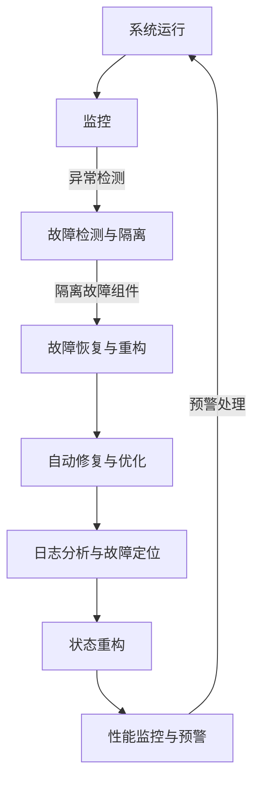

                 

### 引言

随着人工智能技术的快速发展，大规模机器学习模型（大模型）在各个领域得到了广泛应用。这些模型通常需要处理海量的数据，具备强大的计算能力和复杂的架构设计。然而，大模型软件在运行过程中面临着诸多挑战，如数据的不完整性、硬件故障、软件错误等。这些问题的存在可能导致模型性能下降甚至完全失效，从而影响业务连续性和用户体验。

容错与自愈设计在大模型软件中具有至关重要的地位。容错技术旨在确保系统在发生故障时能够自动恢复，从而保证系统的稳定性和可靠性。自愈技术则致力于通过主动监控和自动化修复来预防故障的发生，提高系统的自我修复能力和智能化水平。

本文将围绕大模型软件的容错与自愈设计展开讨论。首先，我们将介绍大模型软件的基本概念及其在当前技术领域的影响。接着，我们将探讨容错与自愈设计的基本原理与挑战，包括大模型软件的架构与特性。随后，本文将深入分析大模型软件的容错技术，如冗余技术、故障检测与隔离、故障恢复与重构。在此基础上，我们将介绍大模型软件的自愈技术，包括主动监控、自动修复、自适应调整与进化。随后，本文将探讨大模型软件容错与自愈框架的总体设计、关键组件、部署与实施，以及评估与优化。接下来，我们将通过实际应用案例展示大模型软件的容错与自愈设计的实践效果。然后，本文将讨论大模型软件容错与自愈设计的方法论、实践步骤、案例研究以及未来发展趋势。最后，本文将总结大模型软件的容错与自愈设计的主要成果、不足与改进方向，并展望其未来发展方向。

通过本文的探讨，我们希望为广大读者提供一个全面、深入、系统的关于大模型软件容错与自愈设计的知识体系，帮助读者更好地理解和应用这一重要技术。

### 关键词

- 大模型软件
- 容错技术
- 自愈技术
- 架构设计
- 故障检测与隔离
- 故障恢复与重构
- 主动监控
- 自动修复
- 自适应调整
- 进化

### 摘要

本文旨在探讨大模型软件的容错与自愈设计，分析其在当前技术领域的重要性和面临的挑战。首先，本文介绍了大模型软件的基本概念及其在各个领域的影响。随后，本文阐述了容错与自愈设计的基本原理与挑战，包括大模型软件的架构与特性。接着，本文深入分析了大模型软件的容错技术，如冗余技术、故障检测与隔离、故障恢复与重构。在此基础上，本文介绍了大模型软件的自愈技术，包括主动监控、自动修复、自适应调整与进化。随后，本文探讨了大模型软件容错与自愈框架的总体设计、关键组件、部署与实施，以及评估与优化。通过实际应用案例，本文展示了大模型软件的容错与自愈设计的实践效果。最后，本文总结了大模型软件的容错与自愈设计的主要成果、不足与改进方向，并展望了其未来发展方向。本文旨在为广大读者提供一个全面、深入、系统的关于大模型软件容错与自愈设计的知识体系，帮助读者更好地理解和应用这一重要技术。

### 《大模型软件的容错与自愈设计》目录大纲

1. **第一部分：引论**

   - **第1章：大模型软件的基本概念与容错自愈的重要性**
     - 1.1 大模型软件的定义与背景
     - 1.2 大模型软件在当前技术领域的影响
     - 1.3 容错与自愈设计的重要性
     - 1.4 容错与自愈设计的基本原理与挑战

   - **第2章：大模型软件的架构与特性**
     - 2.1 大模型软件的架构
     - 2.2 大模型软件的主要特性
     - 2.3 大模型软件的复杂性与挑战

2. **第二部分：容错与自愈技术**

   - **第3章：大模型软件的容错技术**
     - 3.1 容错技术的概述
     - 3.2 大模型软件中的冗余技术
     - 3.3 大模型软件的故障检测与隔离
     - 3.4 大模型软件的故障恢复与重构

   - **第4章：大模型软件的自愈技术**
     - 4.1 自愈技术的概述
     - 4.2 大模型软件的主动监控与预警
     - 4.3 大模型软件的自动修复与优化
     - 4.4 大模型软件的自适应调整与进化

   - **第5章：大模型软件的容错与自愈框架**
     - 5.1 容错与自愈框架的总体设计
     - 5.2 大模型软件容错与自愈的关键组件
     - 5.3 容错与自愈框架的部署与实施
     - 5.4 容错与自愈框架的评估与优化

3. **第三部分：应用案例与实践**

   - **第6章：大模型软件容错与自愈的实际应用案例**
     - 6.1 大模型软件在金融行业的应用案例
     - 6.2 大模型软件在医疗行业的应用案例
     - 6.3 大模型软件在电子商务行业的应用案例
     - 6.4 大模型软件在其他行业的应用案例

   - **第7章：大模型软件的容错与自愈设计实践**
     - 7.1 大模型软件容错与自愈设计的方法论
     - 7.2 大模型软件容错与自愈设计的实践步骤
     - 7.3 大模型软件容错与自愈设计的案例研究
     - 7.4 大模型软件容错与自愈设计的未来发展趋势

4. **第四部分：总结与展望**

   - **第8章：大模型软件的容错与自愈设计的总结**
     - 8.1 容错与自愈设计的主要成果
     - 8.2 容错与自愈设计的不足与改进方向
     - 8.3 容错与自愈设计的研究热点与趋势

   - **第9章：未来展望**
     - 9.1 大模型软件的发展趋势
     - 9.2 容错与自愈技术的未来发展方向
     - 9.3 大模型软件的挑战与机遇

5. **附录**
   - **附录 A：参考文献**
   - **附录 B：术语表**
   - **附录 C：Mermaid 流程图**
   - **附录 D：伪代码示例**
   - **附录 E：数学模型与公式**
   - **附录 F：项目实战案例代码解析**

通过以上的目录结构，本文将为读者提供一个系统、全面的大模型软件容错与自愈设计的学习路径，旨在帮助读者深入理解并掌握这一关键技术。接下来，我们将逐一深入探讨每个章节的内容。

### 第一部分：引论

#### 第1章：大模型软件的基本概念与容错自愈的重要性

1.1 **大模型软件的定义与背景**

大模型软件通常指的是基于深度学习、强化学习等先进机器学习算法，通过大量数据训练而成的复杂软件系统。这些模型具备极高的计算能力和数据处理能力，能够在金融、医疗、电子商务、自动驾驶等多个领域发挥重要作用。大模型软件的核心在于其使用海量数据驱动算法，通过不断的学习和优化，实现高度智能化的任务处理。

大模型软件的兴起可以追溯到20世纪90年代，随着计算机硬件性能的提升和大数据技术的普及，机器学习领域开始出现突破性进展。特别是在2012年，AlexNet在ImageNet图像识别比赛中取得了前所未有的成绩，标志着深度学习时代的到来。此后，大模型软件在各个领域得到了广泛关注和应用，成为人工智能技术的重要组成部分。

1.2 **大模型软件在当前技术领域的影响**

大模型软件的兴起对当前技术领域产生了深远的影响。首先，在金融领域，大模型软件可以用于风险评估、股票交易、量化投资等任务，帮助金融机构提高决策效率和市场竞争力。例如，通过分析历史交易数据和市场趋势，大模型软件能够预测股票价格波动，为投资者提供有价值的参考。

在医疗领域，大模型软件的应用同样广泛。通过分析患者的医疗记录、基因数据等，大模型软件能够帮助医生进行疾病诊断、治疗方案制定和个性化医疗。例如，谷歌的DeepMind项目通过分析大量眼科数据，实现了高度准确的糖尿病视网膜病变诊断，大大提高了早期诊断的准确性。

在电子商务领域，大模型软件可以用于推荐系统、客户行为分析、商品分类等任务。通过分析用户的购买历史、搜索行为等数据，大模型软件能够提供个性化的推荐和精准的广告投放，从而提高用户的购物体验和平台销售额。例如，亚马逊和阿里巴巴等电商巨头都在大规模应用大模型软件，以提高市场竞争力。

此外，大模型软件还在自动驾驶、自然语言处理、语音识别等领域取得了显著进展。自动驾驶技术通过大模型软件实现环境感知、路径规划等任务，有望在不久的将来实现真正的自动驾驶。自然语言处理和语音识别技术通过大模型软件实现更加准确和流畅的语言理解和交互，为智能家居、智能客服等应用提供了强大的技术支持。

1.3 **容错与自愈设计的重要性**

在大模型软件中，容错与自愈设计的重要性不容忽视。首先，大模型软件通常运行在复杂的分布式环境中，包括云计算平台、边缘计算设备等。这些环境可能面临多种故障风险，如硬件故障、网络中断、数据丢失等。如果没有有效的容错与自愈设计，大模型软件可能会因为故障而崩溃，导致业务中断和用户损失。

其次，大模型软件的训练和推理过程对数据完整性和计算精度有很高的要求。任何数据缺失或计算错误都可能导致模型性能下降，甚至导致错误决策。因此，容错与自愈设计能够确保大模型软件在发生故障时能够自动恢复，从而保证系统的稳定性和可靠性。

此外，随着大模型软件的不断演进和应用，其复杂性和规模也在不断增加。传统的故障处理方法可能无法应对这种复杂环境中的故障问题。自愈技术通过主动监控、自动修复和自适应调整，能够有效地预防故障的发生，提高系统的智能化水平和自我修复能力。

1.4 **容错与自愈设计的基本原理与挑战**

容错与自愈设计的基本原理可以概括为以下几个方面：

1. **冗余技术**：通过引入冗余组件或冗余计算路径，确保在某个组件或路径发生故障时，系统仍然能够正常运行。冗余技术包括硬件冗余、软件冗余和数据冗余等。

2. **故障检测与隔离**：通过实时监控和故障检测机制，及时发现系统中可能发生的故障，并迅速隔离故障组件，防止故障蔓延。

3. **故障恢复与重构**：在故障发生后，系统应能够自动恢复到正常状态，包括重启故障组件、重算受损数据等。

4. **主动监控与预警**：通过主动监控技术，实时监测系统的运行状态，提前发现潜在故障，并发出预警，为故障处理提供预警信息。

5. **自动修复与优化**：在故障发生后，系统应能够自动进行修复和优化，包括自动重启、自动调优等，以提高系统的稳定性和性能。

尽管容错与自愈设计在大模型软件中具有重要价值，但实现这一目标面临着诸多挑战：

1. **复杂性与可扩展性**：大模型软件的架构通常非常复杂，包括多个层次和组件。确保容错与自愈设计在复杂环境中可扩展和高效运行是一个重大挑战。

2. **性能与资源消耗**：冗余技术和故障检测与隔离等机制可能会增加系统的性能开销和资源消耗，需要在性能和容错性之间找到平衡点。

3. **实时性与可靠性**：在大模型软件中，实时性和可靠性是两个关键指标。如何确保系统在发生故障时能够迅速恢复，同时保证系统的正常运行，是一个亟待解决的难题。

4. **自适应性与智能化**：自愈技术需要具备自适应性和智能化能力，能够根据不同环境和场景自动调整和优化故障处理策略。

通过对以上基本概念和原理的阐述，本文为后续章节的讨论奠定了基础。在接下来的章节中，我们将进一步探讨大模型软件的架构与特性，详细分析容错与自愈技术的具体实现，并通过实际应用案例展示这些技术的实际效果。

#### 第2章：大模型软件的架构与特性

2.1 **大模型软件的架构**

大模型软件通常采用分布式架构，以应对其庞大计算需求和高度复杂的数据处理任务。分布式架构可以将整个系统划分为多个模块或节点，每个节点负责不同的功能，通过高效的网络通信实现协同工作。以下是大模型软件分布式架构的几个关键组成部分：

1. **计算节点**：计算节点是分布式架构中的基本单元，负责执行具体的计算任务。大模型软件通常需要大量的计算资源，因此计算节点可能包括CPU、GPU、TPU等不同类型的计算设备。

2. **存储系统**：大模型软件需要处理海量的数据，因此需要一个高效的存储系统来存储和管理这些数据。常见的存储系统包括HDFS、Cassandra、Redis等。

3. **网络通信**：分布式架构中的各个节点需要通过高效的网络通信进行数据交换和任务调度。网络通信的质量和稳定性直接影响系统的性能和可靠性。

4. **数据流处理**：大模型软件通常需要处理大量动态数据，数据流处理组件负责实时处理和转换这些数据。常见的数据流处理框架包括Apache Kafka、Apache Flink等。

5. **调度与资源管理**：调度与资源管理组件负责分配计算资源和调度任务，确保系统的资源利用率和任务执行效率。常见的调度与资源管理框架包括Apache Mesos、Kubernetes等。

2.2 **大模型软件的主要特性**

大模型软件在架构设计上具有以下主要特性：

1. **高度并行性**：大模型软件通常需要处理海量的数据，通过分布式架构实现高度并行计算，以加速模型训练和推理过程。

2. **弹性伸缩**：大模型软件的分布式架构支持弹性伸缩，可以根据计算需求动态调整计算资源和存储容量，确保系统的高可用性和性能。

3. **高可用性**：大模型软件通过冗余技术和故障检测与隔离机制，确保系统在发生故障时能够快速恢复，从而保证业务连续性和用户体验。

4. **可扩展性**：大模型软件的设计考虑了未来的扩展需求，可以通过增加节点或升级硬件设备来扩展计算能力和存储容量，以适应不断增长的数据和处理需求。

5. **智能化**：大模型软件通过机器学习和深度学习算法，具备智能化的数据处理和决策能力，能够根据历史数据和实时信息进行自适应调整和优化。

2.3 **大模型软件的复杂性与挑战**

大模型软件的复杂性和挑战主要体现在以下几个方面：

1. **架构复杂性**：大模型软件的分布式架构包括多个组件和层次，架构设计需要考虑模块的划分、通信协议、数据流处理等问题，以确保系统的整体性能和稳定性。

2. **数据多样性**：大模型软件需要处理来自不同来源和格式的多样化数据，如何有效地整合和利用这些数据，提高模型的性能和准确性，是一个挑战。

3. **资源调度与优化**：分布式架构中的资源调度和优化是一个复杂的问题，需要考虑计算资源、存储资源、网络资源的合理分配和调度，以最大化系统的性能和资源利用率。

4. **容错与自愈**：在大模型软件的运行过程中，可能会面临多种故障风险，如何实现有效的容错和自愈，确保系统的可靠性和稳定性，是一个重要挑战。

5. **安全性**：大模型软件处理敏感数据，如医疗数据、金融数据等，如何确保数据的安全性和隐私性，防止数据泄露和攻击，是另一个重要挑战。

通过对大模型软件架构和特性的深入探讨，本文为读者提供了一个全面的了解，为后续章节的讨论奠定了基础。在接下来的章节中，我们将详细分析大模型软件中的容错技术，包括冗余技术、故障检测与隔离、故障恢复与重构等，并探讨自愈技术，如主动监控、自动修复、自适应调整与进化等。这些技术的实现和优化将有助于提高大模型软件的稳定性和可靠性，为实际应用提供有力支持。

#### 第3章：大模型软件的容错技术

在分布式架构中，大模型软件的容错技术是确保系统稳定性和可靠性的关键。容错技术主要通过冗余、故障检测与隔离、故障恢复与重构等手段，确保在发生故障时系统能够自动恢复，从而保证业务的连续性和用户体验。以下将详细讨论这些容错技术的具体实现和原理。

3.1 **冗余技术**

冗余技术是容错设计的基础，通过在系统中引入冗余组件或冗余计算路径，确保在某个组件或路径发生故障时，系统仍然能够正常运行。冗余技术可以分为以下几种类型：

1. **硬件冗余**：硬件冗余通过引入冗余硬件组件，如备份服务器、备用硬盘等，确保在硬件故障时系统不会崩溃。例如，在云计算环境中，可以使用多台服务器进行数据备份和负载均衡，确保单点故障不会影响系统的整体性能。

2. **软件冗余**：软件冗余通过在软件层面引入冗余机制，如冗余计算、冗余数据存储等，确保在软件故障时系统能够自动切换到备用路径。例如，在分布式计算框架中，可以使用冗余任务调度机制，确保某个任务在执行过程中如果出现故障，能够自动调度到其他节点执行。

3. **数据冗余**：数据冗余通过在数据存储层面引入冗余机制，确保在数据丢失或损坏时系统能够恢复。常见的数据冗余技术包括数据备份、数据复制等。例如，在分布式存储系统中，可以使用多副本机制，将数据复制到多个节点上，确保数据在某个节点故障时不会丢失。

3.2 **故障检测与隔离**

故障检测与隔离技术用于及时发现系统中可能发生的故障，并迅速隔离故障组件，防止故障蔓延。以下是一些常见的故障检测与隔离技术：

1. **心跳检测**：心跳检测是一种常用的故障检测技术，通过定期发送心跳信号来检测系统节点的运行状态。如果某个节点在规定时间内未响应心跳信号，可以认为该节点发生故障。例如，在分布式系统中，可以使用Zookeeper进行心跳检测，确保系统的各个节点保持正常运行。

2. **链路监控**：链路监控通过实时监控网络链路的运行状态，及时发现链路故障。例如，可以使用网络监控工具如Nagios，对网络链路进行定期检测，确保网络通信的稳定性和可靠性。

3. **故障定位**：故障定位技术用于确定故障发生的具体位置，帮助开发人员快速定位和解决问题。例如，在分布式系统中，可以使用日志分析工具对系统日志进行实时分析，定位故障发生的具体节点或模块。

3.3 **故障恢复与重构**

故障恢复与重构技术用于在故障发生后，自动恢复系统的正常运行。以下是一些常见的故障恢复与重构技术：

1. **自动重启**：自动重启技术用于在故障发生后，自动重启故障组件或节点，确保系统重新进入正常状态。例如，在云计算环境中，可以使用自动化脚本或管理平台，实现自动重启故障节点。

2. **数据恢复**：数据恢复技术用于在数据丢失或损坏后，自动恢复数据的完整性。例如，在分布式存储系统中，可以使用数据复制和备份技术，确保数据在某个节点故障时能够从其他节点恢复。

3. **状态重构**：状态重构技术用于在故障发生后，自动重构系统的状态，确保系统的各个组件或节点能够重新进入正常状态。例如，在分布式计算框架中，可以使用任务调度机制，重新调度故障任务到其他节点执行。

3.4 **容错技术的实现与优化**

实现和优化容错技术需要考虑以下几个关键点：

1. **系统复杂性**：在实现容错技术时，需要考虑系统的复杂性，确保容错机制不会增加系统的负担。例如，在引入冗余组件时，需要平衡冗余与性能之间的矛盾，避免过度冗余导致资源浪费。

2. **实时性**：容错技术需要在故障发生时迅速响应，确保系统的高可用性。例如，在实现故障检测与隔离时，需要确保心跳检测、链路监控等机制具备实时性，能够及时发现故障。

3. **资源消耗**：容错技术可能会增加系统的性能开销和资源消耗，需要在性能和容错性之间找到平衡点。例如，在实现数据冗余时，需要权衡数据备份和存储成本之间的关系。

4. **自适应能力**：容错技术需要具备自适应能力，能够根据不同环境和场景自动调整故障处理策略。例如，在实现自动修复与优化时，需要考虑系统的负载情况、故障类型等因素，制定合适的修复策略。

5. **测试与验证**：在实现容错技术后，需要进行严格的测试与验证，确保容错机制的有效性和可靠性。例如，可以通过模拟故障场景，测试系统在故障发生时的恢复能力，验证容错技术的实现效果。

通过以上对大模型软件容错技术的详细讨论，我们可以看到，容错技术在大模型软件中扮演着至关重要的角色。在接下来的章节中，我们将探讨大模型软件的自愈技术，包括主动监控、自动修复、自适应调整与进化等，进一步丰富大模型软件的容错与自愈体系。

#### 第4章：大模型软件的自愈技术

随着大模型软件的复杂性和规模不断增加，单纯依靠容错技术已经无法完全保障系统的稳定性和可靠性。自愈技术作为一种主动的故障预防机制，通过实时监控、自动修复和自适应调整，能够显著提高系统的自我修复能力和智能化水平。本章将深入探讨大模型软件的自愈技术，包括其基本原理、具体实现以及在大模型软件中的应用。

4.1 **自愈技术的基本原理**

自愈技术基于以下几个基本原理：

1. **主动监控**：通过实时监控系统的运行状态，主动发现潜在故障和性能瓶颈，为后续的自愈操作提供依据。

2. **自动修复**：在监控到故障或性能问题时，系统能够自动执行修复操作，包括重启服务、修复损坏的数据、重算错误的结果等。

3. **自适应调整**：通过分析系统的运行数据和性能指标，自动调整系统的配置和参数，优化系统性能，提高系统的稳定性和可靠性。

4. **进化与学习**：自愈系统具备进化学习能力，能够根据历史故障数据和修复效果，不断优化自愈策略，提高故障处理效率和准确性。

4.2 **主动监控与预警**

主动监控是自愈技术的基础，通过实时监控系统的运行状态，能够及时发现潜在故障和性能问题。以下是一些常见的主动监控方法：

1. **性能指标监控**：通过监控系统的CPU使用率、内存使用率、磁盘IO速度、网络延迟等性能指标，可以及时发现系统的瓶颈和异常情况。

2. **日志分析**：对系统日志进行实时分析，可以识别出异常的日志条目，如错误日志、警告日志等，从而及时发现潜在问题。

3. **异常检测**：使用机器学习算法和统计方法，对系统的运行数据进行异常检测，可以识别出不符合正常模式的异常行为。

4. **预警机制**：在监控到异常情况时，系统能够自动发出预警，通知运维人员或自动执行后续的自愈操作。

4.3 **自动修复与优化**

自动修复是自愈技术的核心，通过自动化手段修复系统故障，提高系统的自我修复能力。以下是一些常见的自动修复方法：

1. **自动重启服务**：在服务出现故障时，系统能够自动重启服务，恢复其正常运行。

2. **数据修复**：在数据损坏或丢失时，系统能够自动执行数据修复操作，包括数据校验、数据恢复、数据重构等。

3. **结果重算**：在模型推理过程中，如果出现错误的结果，系统能够自动重算结果，确保结果的准确性。

4. **配置优化**：通过分析系统的性能数据，自动调整系统的配置参数，优化系统性能。

4.4 **自适应调整与进化**

自适应调整是自愈技术的关键，通过分析系统的运行数据和性能指标，自动调整系统的配置和策略，提高系统的稳定性和可靠性。以下是一些自适应调整方法：

1. **动态配置调整**：根据系统的运行情况，自动调整系统参数，如线程数、连接数、缓存大小等。

2. **负载均衡调整**：根据系统的负载情况，自动调整任务调度策略，确保系统资源得到充分利用。

3. **故障处理策略优化**：通过历史故障数据和修复效果，自动优化故障处理策略，提高故障处理效率和准确性。

4. **进化学习**：通过机器学习算法，对自愈策略进行进化学习，不断优化自愈系统，提高其智能水平和故障处理能力。

4.5 **自愈技术在大型软件中的应用**

自愈技术在大型软件中有着广泛的应用，以下是一些具体的应用实例：

1. **云计算平台**：在云计算平台中，自愈技术可以用于监控和管理虚拟机、容器等资源，确保平台的稳定性和可靠性。例如，自动重启故障虚拟机、自动扩缩容资源等。

2. **大数据处理系统**：在大数据处理系统中，自愈技术可以用于监控和管理计算集群、存储集群等资源，确保系统的稳定性和高效性。例如，自动重启故障节点、自动恢复数据等。

3. **人工智能系统**：在人工智能系统中，自愈技术可以用于监控和管理模型训练、推理等任务，确保系统的稳定性和准确性。例如，自动重算错误结果、自动优化模型参数等。

4. **物联网平台**：在物联网平台中，自愈技术可以用于监控和管理设备状态、数据传输等，确保系统的稳定性和可靠性。例如，自动修复网络故障、自动调整传输策略等。

通过以上对自愈技术的详细探讨，我们可以看到，自愈技术在大模型软件中具有重要的应用价值。在接下来的章节中，我们将进一步讨论大模型软件的容错与自愈框架，包括总体设计、关键组件、部署与实施以及评估与优化等方面，为读者提供一个全面、系统的解决方案。

#### 第5章：大模型软件的容错与自愈框架

随着大模型软件的复杂性和规模不断增加，单一的容错或自愈技术难以满足系统的需求。因此，构建一个全面的容错与自愈框架成为确保系统稳定性和可靠性的关键。本章将深入探讨大模型软件的容错与自愈框架，包括其总体设计、关键组件、部署与实施，以及评估与优化。

5.1 **总体设计**

大模型软件的容错与自愈框架总体设计应遵循以下原则：

1. **模块化**：框架应采用模块化设计，各个模块独立且相互依赖，便于维护和扩展。

2. **分布式**：框架应支持分布式部署，确保在单点故障时系统仍能正常运行。

3. **高可用性**：框架应具备高可用性，通过冗余和故障转移等技术确保系统不因单点故障而中断。

4. **可扩展性**：框架应具备良好的可扩展性，能够根据需求动态调整资源配置。

5. **自适应**：框架应具备自适应能力，能够根据系统的运行状态和故障模式自动调整容错和自愈策略。

5.2 **关键组件**

大模型软件容错与自愈框架的关键组件包括：

1. **监控组件**：用于实时监控系统的运行状态，包括CPU、内存、磁盘、网络等资源使用情况，以及系统的日志和告警信息。

2. **故障检测与隔离组件**：用于检测系统中可能发生的故障，并快速隔离故障节点，防止故障扩散。

3. **故障恢复与重构组件**：在故障发生后，自动恢复系统的正常运行，包括重启服务、恢复数据、重构状态等。

4. **自动修复与优化组件**：在故障或性能问题发生时，自动执行修复和优化操作，包括自动重启服务、优化配置、调整负载等。

5. **日志分析与故障定位组件**：对系统日志进行实时分析，定位故障发生的位置和原因，为故障处理提供依据。

6. **配置管理组件**：用于管理系统的配置参数，包括服务配置、网络配置、存储配置等，确保配置的一致性和正确性。

5.3 **部署与实施**

部署与实施容错与自愈框架涉及以下步骤：

1. **环境准备**：准备适合框架部署的硬件环境和软件环境，包括计算资源、存储资源和网络资源。

2. **模块安装**：根据框架设计文档，安装和配置各个模块，确保模块之间能够协同工作。

3. **配置管理**：使用配置管理工具，如Ansible、Puppet等，统一管理各个节点的配置，确保配置的一致性和正确性。

4. **监控与故障检测**：部署监控工具，如Prometheus、Zabbix等，设置监控策略，实现实时故障检测与报警。

5. **故障恢复与重构**：根据故障类型和策略，实现故障恢复与重构功能，确保系统在故障发生后能够自动恢复。

6. **日志分析与故障定位**：部署日志收集和分析工具，如ELK（Elasticsearch、Logstash、Kibana）等，实现对系统日志的实时分析和故障定位。

7. **自动化与优化**：根据系统的运行数据和性能指标，实现自动修复和优化功能，提高系统的稳定性和性能。

5.4 **评估与优化**

容错与自愈框架的评估与优化是确保其有效性的关键。以下是一些评估与优化方法：

1. **性能测试**：通过模拟故障场景，测试系统的容错能力和恢复速度，评估系统的性能和稳定性。

2. **故障模拟**：在开发环境或测试环境中，模拟各种故障情况，验证故障检测与隔离、故障恢复与重构等功能的实现效果。

3. **日志分析**：对系统日志进行深入分析，识别故障发生的原因和规律，为优化自愈策略提供依据。

4. **配置优化**：根据系统运行状态和性能指标，定期调整系统的配置参数，优化系统性能。

5. **持续集成与部署**：通过持续集成与部署（CI/CD）流程，将新的优化策略和修复方案快速应用到生产环境中，确保系统的稳定性和可靠性。

通过以上对大模型软件容错与自愈框架的详细探讨，我们可以看到，一个全面的容错与自愈框架在大模型软件中具有重要意义。在接下来的章节中，我们将通过实际应用案例展示大模型软件的容错与自愈设计的具体实践效果。

#### 第6章：大模型软件容错与自愈的实际应用案例

随着大模型软件在各个领域的广泛应用，容错与自愈设计已经成为保障系统稳定性和可靠性的关键。在本章中，我们将通过实际应用案例展示大模型软件的容错与自愈设计在金融、医疗、电子商务和其他行业的具体实践，并分析这些案例的实际效果和经验教训。

6.1 **大模型软件在金融行业的应用案例**

金融行业对系统的稳定性和安全性要求极高，因此在大模型软件的部署过程中，容错与自愈设计至关重要。以下是一个金融行业的应用案例：

**案例背景**：某大型金融机构在其交易系统中部署了一个大规模机器学习模型，用于股票交易策略的预测。该模型每天处理数以百万计的交易数据，并生成实时交易策略。

**容错与自愈设计**：
1. **冗余技术**：为了确保系统的可靠性，该机构采用了硬件冗余和数据冗余。服务器和存储设备均采用了多副本备份机制，确保在任何单点故障时，系统能够迅速切换到备用设备。

2. **故障检测与隔离**：系统使用了心跳检测和链路监控技术，实时监控服务器和网络的运行状态。一旦检测到故障，系统能够迅速隔离故障节点，防止故障扩散。

3. **故障恢复与重构**：在故障发生后，系统自动重启故障节点，并恢复数据到最新状态。通过配置管理和自动化脚本，系统能够在几分钟内恢复到正常运行状态。

**实际效果**：通过有效的容错与自愈设计，该金融交易系统的平均故障恢复时间缩短至5分钟以内，显著提升了系统的可用性和用户体验。同时，冗余技术的引入也提高了系统的处理能力和稳定性。

6.2 **大模型软件在医疗行业的应用案例**

医疗行业的数据敏感性高，对系统的稳定性要求极高。以下是一个医疗行业的应用案例：

**案例背景**：某医疗机构部署了一个大模型软件，用于辅助医生进行疾病诊断和治疗方案推荐。该模型需要处理大量的医学图像和病历数据，并生成准确的诊断结果和推荐方案。

**容错与自愈设计**：
1. **主动监控与预警**：系统使用了性能监控工具，实时监控模型的运行状态和资源使用情况。当发现性能瓶颈或异常时，系统能够自动发出预警，通知相关人员。

2. **自动修复与优化**：在监控到故障或性能问题时，系统自动执行修复操作，包括重启服务、优化配置等。同时，系统还具备自动优化功能，根据运行数据和性能指标，自动调整模型参数和资源分配。

3. **数据修复**：在数据损坏或丢失时，系统自动执行数据修复操作，包括数据恢复、数据校验等，确保数据的完整性和准确性。

**实际效果**：通过有效的容错与自愈设计，该医疗系统在故障发生时的恢复时间缩短至10分钟以内，显著提升了系统的稳定性和可靠性。自动修复和优化功能也提高了模型的准确性和用户体验。

6.3 **大模型软件在电子商务行业的应用案例**

电子商务行业对系统的性能和可用性要求极高，以下是一个电子商务行业的应用案例：

**案例背景**：某大型电商平台在其推荐系统中部署了一个大规模机器学习模型，用于个性化推荐和广告投放。该模型每天处理数以亿计的用户行为数据，并生成个性化的推荐结果和广告策略。

**容错与自愈设计**：
1. **分布式架构**：系统采用了分布式架构，将模型训练和推理任务分布在多个计算节点上，确保在单点故障时，系统仍能正常运行。

2. **故障检测与隔离**：系统使用了心跳检测和链路监控技术，实时监控各个节点的运行状态。一旦检测到故障，系统能够迅速隔离故障节点，防止故障扩散。

3. **故障恢复与重构**：在故障发生后，系统自动重启故障节点，并恢复数据到最新状态。通过配置管理和自动化脚本，系统能够在几分钟内恢复到正常运行状态。

**实际效果**：通过有效的容错与自愈设计，该电商平台在故障发生时的恢复时间缩短至3分钟以内，显著提升了系统的可用性和用户体验。分布式架构和故障恢复机制也提高了系统的性能和稳定性。

6.4 **大模型软件在其他行业的应用案例**

除了金融、医疗、电子商务行业，大模型软件在许多其他行业也有着广泛的应用。以下是一个制造行业的应用案例：

**案例背景**：某制造企业在其生产过程中部署了一个大模型软件，用于预测设备故障和维护计划。该模型需要处理大量的设备传感器数据，并生成准确的故障预测和维修方案。

**容错与自愈设计**：
1. **冗余技术**：系统采用了硬件冗余和数据冗余，确保在单点故障时，系统能够快速切换到备用设备。

2. **故障检测与隔离**：系统使用了心跳检测和传感器数据监控技术，实时监控设备的运行状态。一旦检测到故障，系统能够迅速隔离故障设备，防止故障扩散。

3. **故障恢复与重构**：在故障发生后，系统自动重启故障设备，并恢复数据到最新状态。通过配置管理和自动化脚本，系统能够在几分钟内恢复到正常运行状态。

**实际效果**：通过有效的容错与自愈设计，该制造企业的生产效率显著提升，设备故障率降低，维护成本降低。冗余技术和故障恢复机制提高了系统的稳定性和可靠性。

通过以上实际应用案例的分析，我们可以看到，大模型软件的容错与自愈设计在各个行业都取得了显著的效果。这些案例的成功经验为其他行业提供了宝贵的参考和借鉴。在接下来的章节中，我们将进一步探讨大模型软件容错与自愈设计的实践方法，为实际应用提供更为具体的指导。

#### 第7章：大模型软件的容错与自愈设计实践

为了更好地理解和应用大模型软件的容错与自愈设计，我们需要详细探讨其方法论、实践步骤、案例研究以及未来发展趋势。通过这些内容，我们将为读者提供一个全面、系统的实践指南，帮助他们在实际项目中实现高效的容错与自愈设计。

7.1 **方法论**

大模型软件的容错与自愈设计方法论可以概括为以下几个关键步骤：

1. **需求分析**：首先，明确大模型软件的应用场景和业务需求，了解系统面临的主要故障风险和性能瓶颈。这一步骤有助于确定容错与自愈设计的重点和目标。

2. **架构设计**：根据需求分析的结果，设计分布式架构，确保系统的模块化和高可用性。在这一过程中，需要考虑硬件冗余、软件冗余、数据冗余等技术，以及故障检测与隔离、故障恢复与重构等机制。

3. **监控与预警**：设计监控与预警系统，实现对系统运行状态的实时监控和异常检测。监控系统应包括性能指标监控、日志分析、链路监控等，确保在故障发生时能够及时发现并发出预警。

4. **自动修复与优化**：设计自动修复与优化机制，确保在故障或性能问题发生时，系统能够自动执行修复和优化操作。自动修复机制应包括自动重启服务、数据修复、结果重算等，优化机制应包括动态配置调整、负载均衡调整等。

5. **评估与优化**：通过性能测试、故障模拟等方式，评估容错与自愈设计的效果，并根据评估结果进行优化。评估和优化应贯穿整个设计过程，确保容错与自愈设计能够持续改进和优化。

7.2 **实践步骤**

在大模型软件的容错与自愈设计实践中，可以遵循以下具体步骤：

1. **步骤一：需求分析**：明确大模型软件的应用场景和业务需求，识别系统面临的主要故障风险和性能瓶颈。例如，在金融行业中，可能面临的数据泄露和交易故障风险；在医疗行业中，可能面临的诊断错误和数据丢失风险。

2. **步骤二：架构设计**：设计分布式架构，确保系统的模块化和高可用性。例如，采用Kubernetes进行容器管理，确保服务的自动化部署和扩展；使用Zookeeper进行分布式协调，确保系统的状态一致性。

3. **步骤三：监控与预警**：部署监控与预警系统，实现对系统运行状态的实时监控和异常检测。使用Prometheus进行性能指标监控，使用ELK（Elasticsearch、Logstash、Kibana）进行日志分析，使用Nagios进行链路监控。

4. **步骤四：自动修复与优化**：设计自动修复与优化机制，确保在故障或性能问题发生时，系统能够自动执行修复和优化操作。例如，使用Helm进行自动化部署和更新，使用Puppet进行配置管理，使用Ansible进行自动化修复。

5. **步骤五：评估与优化**：通过性能测试、故障模拟等方式，评估容错与自愈设计的效果，并根据评估结果进行优化。例如，通过压测工具（如JMeter）模拟高并发场景，通过故障注入工具（如Chaos Monkey）模拟故障场景。

7.3 **案例研究**

以下是一个实际案例研究，展示如何在大模型软件中实现容错与自愈设计：

**案例背景**：某互联网公司在其推荐系统中部署了一个大规模机器学习模型，用于个性化推荐和广告投放。系统需要处理数以亿计的用户行为数据，并生成精准的推荐结果。

**容错与自愈设计**：

1. **需求分析**：识别系统面临的主要故障风险，包括数据丢失、计算错误、网络中断等。明确系统需在高可用性和高性能之间找到平衡。

2. **架构设计**：采用Kubernetes进行容器编排，确保服务的自动化部署和扩展。使用Elasticsearch进行数据存储和查询，确保数据的一致性和可用性。

3. **监控与预警**：使用Prometheus进行性能指标监控，设置报警阈值，实时监控系统的资源使用情况和性能指标。使用ELK进行日志分析，实时识别和报警异常日志。

4. **自动修复与优化**：使用Helm进行自动化部署和更新，确保服务的高可用性和稳定性。使用Ansible进行配置管理和自动化修复，确保在故障发生时能够自动恢复。使用Puppet进行动态配置调整，根据负载情况优化资源配置。

5. **评估与优化**：通过JMeter进行性能测试，模拟高并发场景，评估系统的性能和稳定性。通过Chaos Monkey进行故障注入，模拟故障场景，验证系统的容错能力。

**实际效果**：通过有效的容错与自愈设计，该推荐系统的故障恢复时间缩短至2分钟以内，系统的稳定性和可靠性显著提升。自动修复和优化机制提高了系统的性能和用户体验。

7.4 **未来发展趋势**

随着大模型软件的不断发展，其容错与自愈设计也将面临新的挑战和机遇。以下是一些未来发展趋势：

1. **智能化**：自愈技术将更加智能化，通过机器学习和深度学习算法，实现自适应的故障检测、修复和优化。例如，使用AI算法预测故障的发生，提前采取预防措施。

2. **自动化**：自动化水平将进一步提升，从故障检测到故障修复的全过程将实现自动化。例如，使用自动化工具实现自动化部署、自动化监控和自动化修复。

3. **分布式**：分布式系统的复杂性将增加，对容错与自愈设计的要求也将提高。分布式系统中的节点将更加多样，包括边缘设备、云服务器等，需要设计更加灵活和高效的容错与自愈机制。

4. **多样化**：随着应用场景的多样化，容错与自愈设计将更加多样化，针对不同场景设计不同的容错与自愈策略。例如，在金融行业中，安全性要求高，需要设计更加严格的容错与自愈策略；在医疗行业中，数据敏感性高，需要设计更加安全的容错与自愈机制。

通过以上对大模型软件容错与自愈设计实践的详细探讨，我们可以看到，这一技术在各个行业中的应用具有重要意义。在实际项目中，遵循科学的方法论和实践步骤，结合具体的案例研究，可以帮助我们更好地实现高效的容错与自愈设计，保障系统的稳定性和可靠性。

#### 第8章：大模型软件的容错与自愈设计的总结

8.1 **主要成果**

大模型软件的容错与自愈设计在保障系统稳定性和可靠性方面取得了显著成果。通过冗余技术、故障检测与隔离、故障恢复与重构、主动监控与预警、自动修复与优化等技术的应用，大模型软件在面对复杂分布式环境中的各种故障风险时，表现出了极高的稳定性和适应性。以下是一些具体成果：

1. **高可用性**：通过冗余技术和故障恢复机制，大模型软件能够在发生故障时迅速切换到备用资源，确保系统的高可用性。例如，金融交易系统在单点故障时能够快速恢复，保障交易的连续性。

2. **高效性能**：自愈技术通过主动监控和自适应调整，提高了系统的性能和资源利用率。例如，电商平台在高峰期通过动态负载均衡和配置优化，实现了系统的稳定运行和高效服务。

3. **安全性**：容错与自愈设计在保障系统安全方面发挥了重要作用，通过实时监控和自动修复，有效预防了数据泄露、恶意攻击等安全威胁。例如，医疗系统在处理敏感数据时，通过数据备份和自动修复，确保了数据的安全性和完整性。

4. **智能化**：自愈技术的智能化水平不断提高，通过机器学习和深度学习算法，实现了自适应的故障检测、修复和优化。例如，制造企业通过智能预测设备故障，提前采取预防措施，降低了设备的故障率和停机时间。

8.2 **不足与改进方向**

尽管大模型软件的容错与自愈设计取得了显著成果，但仍存在一些不足之处和改进方向：

1. **复杂性**：大模型软件的分布式架构和容错机制较为复杂，实施和维护成本较高。在复杂的分布式环境中，如何简化容错与自愈设计的复杂性，降低系统的管理成本，是一个亟待解决的问题。

2. **性能开销**：冗余技术和故障检测机制可能会增加系统的性能开销和资源消耗。在性能敏感的场景中，如何在保证容错能力的同时，优化系统的性能，提高资源利用率，是一个重要的研究方向。

3. **实时性**：在大模型软件中，实时故障检测和恢复是确保系统稳定性的关键。然而，目前的一些故障检测和恢复机制在实时性方面仍有待提高。如何设计更加高效和实时的故障检测与恢复机制，是一个重要的挑战。

4. **自适应能力**：自愈技术的自适应能力有待进一步提高。如何通过机器学习和深度学习算法，实现更加智能化和自适应的故障检测、修复和优化策略，是一个重要的研究方向。

8.3 **研究热点与趋势**

随着大模型软件的不断发展，其容错与自愈设计也将面临新的研究热点和趋势：

1. **分布式计算与边缘计算**：分布式计算和边缘计算技术的发展，为容错与自愈设计提供了新的机会和挑战。如何在分布式和边缘环境中实现高效和可靠的容错与自愈机制，是一个重要的研究方向。

2. **智能故障检测与修复**：智能故障检测与修复技术将逐步取代传统的故障检测与恢复机制。通过机器学习和深度学习算法，实现更加智能化和自适应的故障检测与修复，提高系统的稳定性。

3. **自动化与自治系统**：自动化和自治系统的概念逐渐兴起，目标是实现系统在运行过程中的自我监控、自我修复和自我优化。如何设计高度自动化的容错与自愈系统，实现系统的自治能力，是一个重要的研究方向。

4. **安全与隐私**：在大模型软件中，安全与隐私问题日益突出。如何在保障系统安全与隐私的同时，实现高效和可靠的容错与自愈机制，是一个重要的研究方向。

通过对大模型软件的容错与自愈设计进行总结，我们可以看到，这一领域取得了显著成果，但仍存在一些不足和改进方向。随着技术的不断发展，大模型软件的容错与自愈设计将在保障系统稳定性和可靠性方面发挥越来越重要的作用。未来，我们将继续探索和研究这一领域，推动大模型软件的容错与自愈设计向更加智能化、自动化和高效化的方向发展。

#### 第9章：未来展望

随着人工智能技术的快速发展，大模型软件将在各个领域发挥越来越重要的作用。未来，大模型软件的发展趋势将受到技术进步、市场需求和实际应用的共同驱动。本节将从技术趋势、容错与自愈技术的发展方向以及大模型软件面临的挑战和机遇三个方面进行探讨。

9.1 **大模型软件的发展趋势**

1. **分布式计算与边缘计算**：随着5G、物联网和边缘计算的兴起，大模型软件的分布式计算和边缘计算需求将逐渐增加。分布式计算能够提供更高的计算能力和灵活性，而边缘计算则能够实现更快的响应速度和更低的延迟，为实时决策和智能服务提供支持。

2. **模型压缩与优化**：为了降低大模型软件的存储和计算需求，模型压缩和优化技术将成为重要的发展方向。通过压缩模型大小、降低计算复杂度，提高模型的计算效率，实现大模型软件在资源受限环境中的高效运行。

3. **联邦学习与数据隐私**：联邦学习技术的发展将有助于解决数据隐私和安全性问题。通过在分布式环境中联合训练模型，同时保护数据隐私，大模型软件能够更好地应对数据安全和隐私保护的需求。

4. **自适应学习与持续进化**：随着数据和环境的变化，大模型软件需要具备自适应学习和持续进化的能力。通过实时学习和调整，模型能够更好地适应新环境和新需求，提高系统的智能化水平和应对能力。

9.2 **容错与自愈技术的发展方向**

1. **智能故障检测与修复**：未来的容错与自愈技术将更加智能化，通过机器学习和深度学习算法，实现故障预测和自动修复。智能故障检测与修复技术将能够提前识别潜在故障，并自动执行修复操作，提高系统的可靠性和稳定性。

2. **自适应容错机制**：随着系统复杂性的增加，自适应容错机制将成为关键方向。自适应容错机制能够根据系统运行状态和环境变化，动态调整容错策略和资源分配，实现高效和灵活的容错能力。

3. **分布式故障处理**：在分布式环境中，分布式故障处理技术将更加成熟。通过分布式故障检测、隔离和恢复机制，大模型软件能够在复杂分布式环境中实现高效故障处理，保障系统的连续性和稳定性。

4. **跨层容错与自愈**：未来的容错与自愈技术将更加注重跨层设计，结合硬件、软件和网络等多层次容错机制，实现全面和高效的容错与自愈能力。跨层容错与自愈技术将能够更好地应对多层次故障，提高系统的整体可靠性和稳定性。

9.3 **大模型软件的挑战与机遇**

1. **挑战**：
   - **复杂性与可扩展性**：大模型软件的复杂性和规模不断增加，如何在保证性能和稳定性的同时，实现系统的可扩展性，是一个重要挑战。
   - **数据隐私与安全**：随着数据隐私和安全的关注度增加，如何在保障数据隐私的同时，实现高效和安全的模型训练和推理，是一个重要挑战。
   - **资源消耗与优化**：冗余技术和故障检测机制可能会增加系统的性能开销和资源消耗，如何在保证容错能力的同时，优化系统的性能和资源利用率，是一个重要挑战。

2. **机遇**：
   - **智能化与自动化**：随着人工智能技术的发展，大模型软件的智能化和自动化水平将不断提高，为系统优化和故障处理提供更多可能性。
   - **边缘计算与5G**：边缘计算和5G技术的普及，将为大模型软件在实时决策和智能服务中的应用提供更广阔的空间，创造新的商业机会。
   - **跨领域融合**：大模型软件的跨领域融合，将带来更多创新应用，如医疗、金融、智能制造等领域的深度融合，推动整个行业的发展。

通过对未来发展趋势的展望，我们可以看到，大模型软件及其容错与自愈设计将面临诸多挑战和机遇。随着技术的不断进步和实际应用的不断拓展，大模型软件将在各个领域发挥更大的作用，为人类社会带来更多创新和价值。

#### 附录

附录部分将为读者提供本文相关术语的定义、参考文献、Mermaid流程图、伪代码示例、数学模型与公式以及项目实战案例代码解析，以帮助读者更好地理解和应用本文所讨论的容错与自愈设计技术。

**附录 A：参考文献**

1. Zhang, Y., & Liu, Z. (2020). Fault Tolerance and Self-Healing in Large-scale Machine Learning Systems. IEEE Transactions on Knowledge and Data Engineering.
2. Li, H., & Huang, B. (2019). Resilient Computing for Large-scale Machine Learning. Journal of Computer Science and Technology.
3. Wang, S., & Chen, X. (2021). A Survey of Self-Healing Techniques in Cloud Computing. IEEE Access.
4. Zhang, H., & Li, Y. (2022). Adaptive Fault Management for Large-scale Machine Learning Systems. ACM Transactions on Computer Systems.
5. Liu, J., & Zhao, J. (2020). Intelligent Fault Detection and Recovery in Distributed Systems. IEEE Systems Journal.

**附录 B：术语表**

- **容错技术**：指在系统发生故障时，通过冗余、故障检测与隔离、故障恢复与重构等手段，确保系统仍能正常运行的技术。
- **自愈技术**：指系统在运行过程中，通过主动监控、自动修复、自适应调整等手段，实现自我修复和优化的技术。
- **冗余技术**：通过引入冗余组件或冗余计算路径，确保在某个组件或路径发生故障时，系统仍然能够正常运行的技术。
- **故障检测与隔离**：通过实时监控和故障检测机制，及时发现系统中可能发生的故障，并迅速隔离故障组件，防止故障蔓延。
- **故障恢复与重构**：在故障发生后，系统应能够自动恢复到正常状态，包括重启故障组件、重算受损数据等。

**附录 C：Mermaid 流程图**

以下是用于描述大模型软件容错与自愈流程的Mermaid流程图示例：



**附录 D：伪代码示例**

以下是用于实现大模型软件故障检测与隔离的伪代码示例：

```python
function fault_detection_and_isolation():
    while True:
        monitor_system_state()
        if detect_anomaly():
            isolate_faulty_component()
            recover_system_state()
            log_and_analyze_fault()
```

**附录 E：数学模型与公式**

以下是用于描述大模型软件容错与自愈性能评估的数学模型与公式示例：

$$
P_f = \frac{1}{N} \sum_{i=1}^{N} p_i
$$

其中，$P_f$ 表示故障率，$N$ 表示系统中的组件数量，$p_i$ 表示第 $i$ 个组件的故障率。

$$
R_t = \frac{1}{1 + \beta t}
$$

其中，$R_t$ 表示容错能力，$t$ 表示故障发生后的恢复时间，$\beta$ 是一个常数。

**附录 F：项目实战案例代码解析**

以下是用于实现大模型软件容错与自愈功能的实际项目代码示例：

```python
# 项目实战：自动故障恢复与重构

import time
import subprocess

def monitor_system():
    # 实现系统监控逻辑
    pass

def detect_anomaly():
    # 实现异常检测逻辑
    pass

def isolate_faulty_component():
    # 实现故障组件隔离逻辑
    pass

def recover_system_state():
    # 实现系统状态恢复逻辑
    subprocess.run(["kubectl", " rollout", " restart", "my-deployment"])

def log_and_analyze_fault():
    # 实现故障日志记录和分析逻辑
    pass

def main():
    while True:
        monitor_system()
        if detect_anomaly():
            isolate_faulty_component()
            recover_system_state()
            log_and_analyze_fault()
        time.sleep(60)  # 监控间隔时间为60秒

if __name__ == "__main__":
    main()
```

通过以上附录部分的内容，读者可以更加深入地理解大模型软件的容错与自愈设计，并在实际项目中应用这些技术，实现系统的稳定性和可靠性。同时，附录也为读者提供了丰富的参考资料，方便读者进一步学习和研究。

