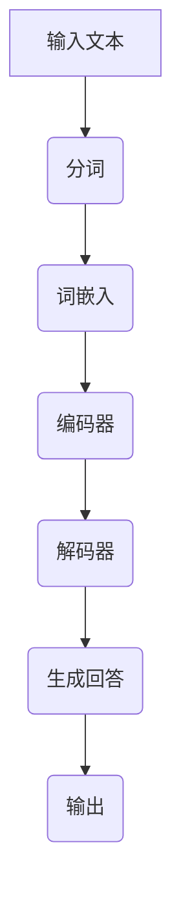

                 

### 文章标题

《大模型问答机器人的自然语言技术》

### 关键词

- 大模型
- 自然语言处理
- 问答机器人
- 预训练模型
- 深度学习
- 知识库构建
- 回答生成

### 摘要

本文深入探讨了大模型问答机器人的自然语言技术，包括大模型与自然语言技术的基础、大模型技术基础、问答机器人的自然语言技术基础、知识检索技术以及回答生成技术。通过分析大模型和自然语言处理技术的结合，本文揭示了问答机器人如何通过深度学习和知识库构建来实现高效的问题理解和回答生成，为构建智能问答系统提供了理论基础和实践指导。

### 第一部分：大模型与自然语言技术基础

#### 第1章：大模型与自然语言技术概述

##### 1.1 大模型与自然语言技术的概念

###### 1.1.1 大模型的概念

大模型（Large Model）是一种具有数亿甚至万亿参数的深度学习模型，它通常用于处理复杂的自然语言任务。这些模型在训练过程中使用了大量的数据，并且通过复杂的神经网络结构来捕捉语言中的复杂关系。大模型的出现极大地推动了自然语言处理（Natural Language Processing, NLP）技术的发展。

在深度学习领域，大模型通常指的是那些具有数十亿至数千亿参数的模型。这些模型可以是语言模型、图像识别模型、语音识别模型等，但本文主要关注的是用于处理自然语言任务的语言模型。大模型的参数数量之大，使得它们能够捕获语言中的细微差别和复杂模式，从而在自然语言处理任务中取得显著的性能提升。

例如，GPT（Generative Pre-trained Transformer）系列模型是自然语言处理领域的重要突破。GPT-3 拥有 1750 亿个参数，通过大规模预训练，能够生成高质量的自然语言文本，并在问答、文本生成、机器翻译等任务中表现出色。

###### 1.1.2 自然语言技术的概念

自然语言技术（NLP）是计算机科学领域的一部分，它涉及计算机和人类语言之间的交互。NLP 的目标是将自然语言文本转换为计算机可以理解和处理的形式，以及将计算机生成的信息以自然语言的形式呈现给用户。

NLP 包括多个子领域，如文本分析、语义理解、语音识别等。文本分析涉及文本的预处理、分词、词性标注等；语义理解则关注于理解文本的含义和上下文；语音识别则将语音信号转换为文本。

在自然语言处理中，常见的技术包括词嵌入（Word Embedding）、序列模型（Sequence Model）、变换器架构（Transformer Architecture）等。词嵌入技术将单词映射为高维向量，以捕捉单词之间的语义关系；序列模型如循环神经网络（RNN）和长短期记忆网络（LSTM）能够处理序列数据，捕捉时间序列中的信息；变换器架构是一种基于注意力机制的深度学习模型，它在处理长距离依赖和并行计算方面具有显著优势。

##### 1.2 大模型与自然语言技术的关系

大模型与自然语言技术的结合推动了自然语言处理的发展。大模型通过大规模预训练，能够更好地理解语言的细微差别和语义，从而在自然语言处理任务中取得显著的性能提升。

自然语言技术的进步为大模型的训练和应用提供了坚实的基础。随着计算资源和算法的不断发展，大模型能够处理更复杂的任务，如生成式文本生成、机器翻译、问答系统等。大模型的成功应用不仅提升了自然语言处理任务的性能，还为其他领域如智能客服、智能推荐等提供了强大的技术支持。

##### 1.3 主流大模型简介

###### 1.3.1 GPT系列模型

GPT（Generative Pre-trained Transformer）系列模型是自然语言处理领域的重要突破。GPT 模型由 OpenAI 开发，使用了变换器（Transformer）架构，并进行了大规模预训练。GPT-2 和 GPT-3 分别在 2019 年和 2020 年发布，成为了自然语言处理领域的里程碑。

GPT 模型通过自回归语言模型（Autoregressive Language Model）来生成文本。在训练过程中，模型通过预测下一个单词来生成文本。GPT-3 拥有 1750 亿个参数，是最先进的大规模语言模型之一。

###### 1.3.2 BERT模型

BERT（Bidirectional Encoder Representations from Transformers）是由 Google 开发的双向编码器表示模型，它通过预先训练来理解上下文信息。BERT 模型在自然语言处理任务中取得了显著的成果，如问答、文本分类、命名实体识别等。

BERT 的核心思想是同时考虑文本的前后信息，从而更好地理解上下文。BERT 模型通过 Masked Language Model（MLM）和 Next Sentence Prediction（NSP）两个任务进行预训练，从而捕捉语言的复杂关系。

###### 1.3.3 其他知名大模型

除了 GPT 和 BERT，还有许多其他知名的大模型，如 T5、ROBERTA、ALBERT 等，它们都在自然语言处理任务中取得了显著的成果。

T5（Text-To-Text Transfer Transformer）是由 Google 开发的一种通用语言模型，它将所有自然语言处理任务视为文本到文本的转换任务。

ROBERTA（A Robustly Optimized BERT Pretraining Approach）是在 BERT 基础上改进的模型，它通过取消部分预训练任务和调整模型结构，提高了模型的性能。

ALBERT（A Lite BERT）是由 Google 开发的一种轻量级 BERT 模型，它通过共享内部层和交叉注意力机制，减少了模型参数数量，同时保持了较高的性能。

##### 1.4 大模型与自然语言技术的应用前景

大模型与自然语言技术的结合正在改变各个行业。在智能客服、文本生成、机器翻译、问答系统等领域，大模型的应用已经取得了显著的成果。未来，随着大模型技术的不断发展，自然语言处理的应用场景将更加广泛。

大模型在智能客服中的应用，使得客服系统能够更好地理解用户的问题，提供更准确和个性化的服务。在文本生成领域，大模型能够生成高质量的文章、报告和代码等。在机器翻译领域，大模型的性能已经超越了传统的基于规则的方法，实现了更准确和自然的翻译效果。在问答系统领域，大模型能够通过理解用户的问题，检索相关知识和生成高质量的回答，提供智能化的问答服务。

随着大模型技术的不断进步，自然语言处理的应用将更加深入和广泛。未来，我们将看到更多基于大模型的创新应用，为各行各业带来新的变革。

---

### 第2章：大模型技术基础

#### 2.1 深度学习与神经网络基础

##### 2.1.1 神经网络的基本结构

神经网络（Neural Networks）是由大量神经元连接而成的计算模型，它通过学习输入和输出之间的映射关系来实现复杂的函数计算。神经网络的基本结构包括输入层、隐藏层和输出层。

###### 2.1.1.1 神经元的结构

神经元是神经网络的基本组成单元，它通过加权求和和激活函数来处理输入信息。一个简单的神经元可以表示为：

$$
z = \sum_{i=1}^{n} w_i x_i + b
$$

其中，$w_i$ 是权重，$x_i$ 是输入，$b$ 是偏置，$z$ 是神经元的输出。为了使神经元具有非线性特性，通常会使用激活函数，如 sigmoid、ReLU 等。

激活函数将神经元的输出映射到某个区间，以引入非线性。例如，ReLU 函数定义为：

$$
\sigma(z) = max(0, z)
$$

ReLU 函数在 $z$ 为负时输出为 0，在 $z$ 为正时输出为 $z$，它具有计算速度快和梯度不变等优点，因此在深度学习中广泛应用。

###### 2.1.1.2 常见的深度学习架构

深度学习架构包括卷积神经网络（CNN）、循环神经网络（RNN）和变换器（Transformer）等，每种架构都有其独特的应用场景和优势。

1. **卷积神经网络（CNN）**：

卷积神经网络主要用于处理图像数据。CNN 的核心是卷积层（Convolutional Layer），它通过卷积操作从输入图像中提取特征。卷积层通常包含多个卷积核（Kernel），每个卷积核都能提取不同的特征。

CNN 的基本结构包括卷积层、池化层、全连接层等。卷积层通过卷积操作提取特征，池化层用于降低特征图的维度，全连接层用于分类。

2. **循环神经网络（RNN）**：

循环神经网络主要用于处理序列数据，如文本、语音等。RNN 通过隐藏状态（Hidden State）来捕捉序列中的时间依赖关系。

RNN 的基本结构包括输入层、隐藏层和输出层。输入层接收序列数据，隐藏层通过递归方式更新隐藏状态，输出层生成预测结果。

常见的 RNN 变体包括长短期记忆网络（LSTM）和门控循环单元（GRU）。LSTM 通过引入门控机制来避免梯度消失问题，GRU 则通过合并输入门和遗忘门，简化了 LSTM 的结构。

3. **变换器（Transformer）**：

变换器是一种基于注意力机制的深度学习模型，它在处理长距离依赖和并行计算方面具有显著优势。Transformer 模型由编码器（Encoder）和解码器（Decoder）组成，编码器将输入序列编码为固定长度的向量，解码器则根据编码器的输出生成输出序列。

Transformer 的核心是自注意力机制（Self-Attention），它通过计算输入序列中每个元素与其他元素之间的关联性，来生成表示。自注意力机制使得 Transformer 能够捕捉序列中的长距离依赖关系。

##### 2.1.2 深度学习优化算法

深度学习优化算法用于调整神经网络中的参数，以实现更好的性能。常见的优化算法包括随机梯度下降（SGD）、Adam 等。

###### 2.1.2.1 随机梯度下降（SGD）

随机梯度下降是一种最简单的优化算法，它通过随机选择一部分训练样本，计算梯度并更新模型参数。SGD 的基本步骤如下：

1. 初始化模型参数 $\theta$。
2. 对于每个训练样本 $(x_i, y_i)$，计算预测值 $y_i'$ 和损失函数 $L(\theta)$。
3. 计算梯度 $\nabla L(\theta)$。
4. 更新参数 $\theta = \theta - \alpha \nabla L(\theta)$，其中 $\alpha$ 是学习率。

SGD 具有计算简单、实现方便等优点，但存在收敛速度慢、梯度消失等问题。

###### 2.1.2.2 Adam 算法

Adam 算法是一种基于自适应学习率的优化算法，它结合了 SGD 和动量（Momentum）方法。Adam 的基本步骤如下：

1. 初始化参数 $\theta$ 和两个辅助变量 $m$ 和 $v$。
2. 对于每个训练样本 $(x_i, y_i)$，计算预测值 $y_i'$ 和损失函数 $L(\theta)$。
3. 计算梯度 $\nabla L(\theta)$。
4. 更新辅助变量 $m = \beta_1 g + (1 - \beta_1)(1 - \beta_2)$ 和 $v = \beta_2 g^2 + (1 - \beta_2)(1 - \beta_2)$。
5. 更新参数 $\theta = \theta - \alpha \frac{m}{\sqrt{v} + \epsilon}$，其中 $\beta_1, \beta_2, \alpha$ 是超参数，$\epsilon$ 是一个很小的正数。

Adam 算法在处理大型数据集时表现出色，能够加快收敛速度并提高模型的性能。

##### 2.1.3 大规模预训练模型原理

大规模预训练模型通过在大规模数据集上预先训练，来学习语言和知识的表示。这种模型能够通过迁移学习（Transfer Learning）在特定任务上取得优异的性能。

###### 2.1.3.1 预训练的概念与意义

预训练（Pre-training）是一种在大规模数据集上预先训练深度神经网络的方法，通过这种方式，模型能够获得对通用语言结构的理解，从而在特定任务上实现更好的性能。

预训练的优势包括：

1. **跨任务迁移能力**：预训练模型可以在多个任务上共享知识和结构，从而减少特定任务的训练需求。
2. **提高泛化能力**：通过在大规模数据集上的训练，模型能够更好地泛化到未见过的数据上。
3. **减少标注数据需求**：预训练模型能够使用未标注的数据进行训练，从而减少对大量标注数据的依赖。

###### 2.1.3.2 自监督学习方法

自监督学习（Self-supervised Learning）是一种在未标注数据上进行训练的方法，它利用数据中的内在结构来自动学习特征表示。在自然语言处理中，自监督学习方法常用于预训练任务。

常见的自监督学习方法包括：

1. **掩码语言模型（Masked Language Model, MLM）**：模型随机掩码输入文本中的部分单词，然后预测这些掩码的单词。
2. **下一句预测（Next Sentence Prediction, NSP）**：模型预测两个连续句子之间的逻辑关系。
3. **掩码边界检测（Masked Boundary Detection, MBD）**：模型识别输入文本中的单词边界。

###### 2.1.3.3 迁移学习与微调技术

迁移学习（Transfer Learning）是一种利用预训练模型在特定任务上进行微调的方法。通过迁移学习，模型可以利用在通用数据集上的训练经验，在特定任务上实现快速且有效的学习。

微调（Fine-tuning）是迁移学习的关键步骤，包括以下几个步骤：

1. **选择预训练模型**：选择在通用数据集上预训练的模型，如 BERT、GPT 等。
2. **数据准备**：准备特定任务的数据集，并进行预处理。
3. **微调模型**：使用特定任务的数据对预训练模型进行微调。
4. **评估模型**：在特定任务上进行评估，以确定模型的性能。

##### 2.1.4 大规模预训练模型的结构

大规模预训练模型通常具有以下结构：

- **多层Transformer架构**：Transformer架构是一种基于自注意力机制的深度学习模型，能够在处理序列数据时捕捉长距离依赖关系。
- **嵌入层**：嵌入层将单词和子词映射为高维向量，以捕捉单词之间的语义关系。
- **自注意力机制**：自注意力机制使模型能够关注序列中的关键信息，从而提高对上下文的理解能力。
- **前馈神经网络**：前馈神经网络用于对自注意力层的输出进行进一步的处理和压缩。

##### 2.1.5 大规模预训练模型的训练过程

大规模预训练模型的训练过程通常包括以下步骤：

1. **数据准备**：准备大规模的文本数据集，并进行预处理，如分词、去噪等。
2. **预处理模型**：使用预处理后的数据集，通过自监督学习任务对模型进行预训练。
3. **微调模型**：使用特定任务的数据集，对预训练模型进行微调。
4. **评估模型**：在特定任务上进行评估，以确定模型的性能。

### 第3章：问答机器人的自然语言技术基础

#### 3.1 问答机器人的基本原理

##### 3.1.1 问答机器人的定义与分类

问答机器人是一种能够理解和回答人类问题的智能系统。根据工作方式，问答机器人可以分为以下几种类型：

1. **基于规则**：这种类型的问答机器人使用预定义的规则来匹配问题和答案。规则通常是基于人类专家的知识和经验来制定的。基于规则的问答机器人适用于结构化知识库和明确的问题场景。

2. **基于统计方法**：这种类型的问答机器人使用统计模型来匹配问题和答案。统计模型可以是基于关键词匹配的，也可以是机器翻译模型、朴素贝叶斯分类器等。基于统计方法的问答机器人能够处理一些非结构化的问题，但可能存在理解不准确的问题。

3. **基于深度学习的方法**：这种类型的问答机器人使用深度学习模型，如神经网络和变换器（Transformer），来理解和生成答案。基于深度学习的方法在处理复杂问题和生成高质量答案方面具有显著优势。

##### 3.1.2 问答机器人的工作流程

问答机器人的工作流程通常包括以下三个主要步骤：

1. **问题理解**：问答机器人接收用户的问题，并进行语义分析，以理解问题的意图和含义。

2. **知识检索**：问答机器人根据问题的意图，从知识库中检索相关的信息。知识库可以是结构化的数据集，也可以是包含大量文本的文档库。

3. **回答生成**：问答机器人根据检索到的信息，生成一个或多个可能的答案。生成的答案可以是直接从知识库中提取的，也可以是通过机器翻译、文本生成模型等生成的。

##### 3.1.3 问答机器人面临的挑战

问答机器人面临以下主要挑战：

1. **自然语言理解的准确性**：问答机器人需要准确地理解用户的问题，以生成合适的答案。这涉及到自然语言处理的多个方面，如词义消歧、语法解析和语义理解等。

2. **知识库的完备性和准确性**：问答机器人需要依赖知识库来生成答案。知识库的完备性和准确性对问答机器人的性能有重要影响。

3. **回答的生成质量**：生成的答案需要准确、自然且具有相关性。问答机器人需要平衡准确性和自然性，以提供高质量的回答。

4. **适应性和灵活性**：问答机器人需要能够适应不同的应用场景和用户需求，以提供个性化的服务。

#### 3.2 问题理解技术

##### 3.2.1 基于关键词匹配的方法

基于关键词匹配的方法是问答机器人中常用的一种问题理解技术。它通过识别问题中的关键词，与知识库中的词条进行匹配，以理解问题的意图。

###### 3.2.1.1 工作原理

1. **分词**：首先将问题进行分词，将问题分解为一系列单词或词组。

2. **关键词提取**：从分词结果中提取关键词，通常使用频率统计、词性标注等方法来确定关键词。

3. **匹配**：将提取的关键词与知识库中的词条进行匹配，查找最匹配的词条。

4. **意图识别**：根据匹配结果，识别问题的意图。例如，如果问题是“北京的天气怎么样？”，则意图可能是“获取天气信息”。

###### 3.2.1.2 优点与缺点

- **优点**：方法简单，易于实现，对结构化知识库效果较好。

- **缺点**：对长问题和复杂问题的理解能力较差，无法捕捉问题的深层语义。

##### 3.2.2 基于语义分析的方法

基于语义分析的方法通过解析问题的语法结构和语义信息，来理解问题的意图。

###### 3.2.2.1 工作原理

1. **句法分析**：对问题进行句法分析，构建句法树，以理解问题的结构。

2. **语义角色标注**：对句法树进行语义角色标注，标记出每个单词的语义角色，如主语、谓语、宾语等。

3. **意图识别**：根据句法树和语义角色标注，识别问题的意图。例如，如果问题是“北京的天气怎么样？”，则意图可能是“获取天气信息”。

###### 3.2.2.2 优点与缺点

- **优点**：能够更好地理解复杂问题和长问题，捕捉问题的深层语义。

- **缺点**：方法复杂，实现难度较高，对结构化知识库的依赖较大。

##### 3.2.3 基于深度学习的方法

基于深度学习的方法利用神经网络模型，如变换器（Transformer），来处理复杂的自然语言理解任务。

###### 3.2.3.1 工作原理

1. **预训练**：使用大量未标注的数据，通过变换器模型进行预训练，以学习语言的通用特征。

2. **微调**：使用特定任务的数据集，对预训练模型进行微调，以适应特定的问题理解任务。

3. **意图识别**：利用微调后的模型，对问题进行意图识别，生成问题的意图标签。

###### 3.2.3.2 优点与缺点

- **优点**：能够处理复杂问题和长问题，具有强大的语义理解能力。

- **缺点**：需要大量的训练数据和计算资源，对数据的质量要求较高。

### 第4章：问答机器人的知识检索技术

#### 4.1 知识库构建

##### 4.1.1 知识库的基本概念

知识库（Knowledge Base, KB）是一种用于存储和组织信息的系统，它用于问答机器人中的知识检索。知识库通常包含以下内容：

- **事实信息**：描述客观事实的信息，如地理、历史、科学等领域的知识。
- **规则和模板**：用于生成回答的规则和模板，如问答对、模板匹配等。
- **用户数据**：与用户相关的信息，如用户偏好、历史记录等。

知识库可以是一个简单的数据库，也可以是一个复杂的本体论或知识图谱。在问答机器人中，知识库的作用至关重要，它提供了问题理解和回答生成的依据。

##### 4.1.2 知识库的构建方法

知识库的构建方法包括手动构建和自动提取，其中自动提取方法如信息抽取和知识图谱等技术被广泛应用。

###### 4.1.2.1 手动构建

手动构建知识库通常需要以下步骤：

1. **数据收集**：收集相关的文本数据，如百科全书、新闻报道、用户评论等。
2. **数据清洗**：对收集到的数据进行清洗，去除无关信息，如广告、噪音等。
3. **数据标注**：对清洗后的数据进行标注，标记出关键信息，如实体、关系、事件等。
4. **知识表示**：将标注后的数据转换为知识库的形式，如数据库、本体论等。

手动构建知识库的优点是能够精确地控制知识库的内容和质量，但缺点是耗时耗力，难以维护和更新。

###### 4.1.2.2 自动提取

自动提取知识库的方法主要包括以下几种：

1. **信息抽取**：通过自然语言处理技术，从非结构化文本中自动提取关键信息，如实体、关系等。
2. **知识图谱**：使用图论方法，将实体和关系表示为图结构，构建知识图谱。
3. **本体论**：定义一组概念及其关系的语义网络，用于表示知识库。

自动提取知识库的优点是能够快速构建大规模知识库，但缺点是知识库的准确性和一致性可能较差。

##### 4.1.3 知识库的优化

知识库的优化包括以下几个方面：

- **更新与维护**：定期更新知识库，以包含最新的信息和知识。
- **一致性检查**：检查知识库中的信息是否一致，避免冲突和错误。
- **查询优化**：优化知识库的查询性能，提高检索效率。

#### 4.2 知识检索算法

##### 4.2.1 暴力搜索算法

暴力搜索算法通过逐一比较问题与知识库中的条目，来找到最匹配的答案。它是一种简单直观的搜索算法。

###### 4.2.1.1 工作原理

1. **问题预处理**：对问题进行预处理，如分词、去停用词等。
2. **知识库预处理**：对知识库进行预处理，如分词、索引等。
3. **匹配**：逐一比较问题中的词与知识库中的词，计算匹配度。
4. **排序**：根据匹配度对知识库中的条目进行排序，选择最匹配的答案。

###### 4.2.1.2 优点与缺点

- **优点**：实现简单，易于理解。
- **缺点**：效率较低，适用于小型知识库。

##### 4.2.2 模式匹配算法

模式匹配算法使用预定义的正则表达式或模式，来匹配问题和知识库中的条目。它常用于基于规则的问答系统中。

###### 4.2.2.1 工作原理

1. **问题预处理**：对问题进行预处理，如分词、去停用词等。
2. **模式定义**：定义用于匹配问题的正则表达式或模式。
3. **匹配**：使用模式匹配算法，如正则表达式匹配，来匹配问题和知识库中的条目。
4. **排序**：根据匹配结果，对知识库中的条目进行排序，选择最匹配的答案。

###### 4.2.2.2 优点与缺点

- **优点**：适用于结构化知识库，匹配速度快。
- **缺点**：对非结构化知识库的支持较差，无法处理复杂的查询。

##### 4.2.3 深度学习检索算法

深度学习检索算法使用深度神经网络模型，如变换器（Transformer），来处理复杂的自然语言检索任务。它常用于基于深度学习的问答系统中。

###### 4.2.3.1 工作原理

1. **问题编码**：使用变换器模型，将问题编码为一个固定长度的向量。
2. **知识库编码**：使用变换器模型，将知识库中的每个条目编码为一个固定长度的向量。
3. **相似度计算**：计算问题编码向量与知识库编码向量之间的相似度。
4. **排序**：根据相似度对知识库中的条目进行排序，选择最匹配的答案。

###### 4.2.3.2 优点与缺点

- **优点**：能够处理复杂的自然语言查询，匹配度高。
- **缺点**：需要大量的训练数据和计算资源，实现难度较高。

### 第5章：问答机器人的回答生成技术

#### 5.1 回答生成的方法

##### 5.1.1 基于模板的方法

基于模板的方法使用预定义的模板来生成回答，它是一种简单直观的生成方法。

###### 5.1.1.1 工作原理

1. **问题解析**：对问题进行解析，提取关键信息，如实体、关系等。
2. **模板匹配**：根据问题解析结果，选择合适的模板。
3. **回答生成**：将问题解析结果填入模板中，生成回答。

例如，对于一个简单的问题“北京是哪个省份的？”可以定义一个模板“[城市名]是[省份名]的”，然后将问题中的“北京”填入模板，生成回答“北京是北京市的”。

###### 5.1.1.2 优点与缺点

- **优点**：实现简单，易于理解，适用于结构化问题。
- **缺点**：生成回答的灵活性较差，无法处理复杂问题。

##### 5.1.2 基于规则的方法

基于规则的方法使用一系列规则来生成回答，它是一种适用于复杂问题的生成方法。

###### 5.1.2.1 工作原理

1. **问题解析**：对问题进行解析，提取关键信息，如实体、关系等。
2. **规则匹配**：根据问题解析结果，匹配适用的规则。
3. **回答生成**：根据匹配到的规则，生成回答。

例如，对于一个复杂的问题“如果明天天气好，我们应该去哪里玩？”可以定义一系列规则，如“如果天气好，我们可以去公园、海边等地方玩”，然后根据天气情况匹配相应的规则，生成回答。

###### 5.1.2.2 优点与缺点

- **优点**：生成回答的灵活性较高，适用于复杂问题。
- **缺点**：需要大量的人工定义规则，维护成本较高。

##### 5.1.3 基于深度学习的方法

基于深度学习的方法使用神经网络模型，如变换器（Transformer），来生成回答，它是一种适用于复杂问题的生成方法。

###### 5.1.3.1 工作原理

1. **问题编码**：使用变换器模型，将问题编码为一个固定长度的向量。
2. **回答生成**：使用变换器模型，生成问题的回答。

例如，对于一个复杂的问题“北京是哪个省份的？”可以定义一个变换器模型，将问题编码为向量，然后模型根据编码生成回答。

###### 5.1.3.2 优点与缺点

- **优点**：能够生成自然流畅的回答，适用于复杂问题。
- **缺点**：需要大量的训练数据和计算资源，实现难度较高。

#### 5.2 生成文本的评估与优化

##### 5.2.1 回答的流畅性和准确性评估

生成文本的流畅性和准确性是评估回答质量的重要指标。

###### 5.2.1.1 流畅性评估

流畅性评估主要通过人工评估和自动化评估方法进行。人工评估是通过人工阅读回答，评估回答的连贯性和自然性。自动化评估方法包括语法检查、风格一致性等。

###### 5.2.1.2 准确性评估

准确性评估主要通过对比回答与真实答案的匹配度进行。方法包括人工对比、机器评估等。

##### 5.2.2 生成文本的优化方法

生成文本的优化方法包括以下几种：

- **模型自适应调整**：通过调整模型的参数，如学习率、正则化等，来优化生成文本的质量。

- **数据增强**：通过增加训练数据、变换数据等方式，来提高模型的泛化能力和生成文本的质量。

- **后处理技术**：通过文本清洗、纠错、风格转换等技术，来优化生成文本的质量。

#### 5.3 问答机器人的效果评估

##### 5.3.1 评估指标

问答机器人的效果评估主要包括以下指标：

- **准确率**：回答正确与总回答数的比例。
- **召回率**：回答正确与实际正确答案数的比例。
- **F1值**：准确率和召回率的调和平均值。

##### 5.3.2 评估方法

问答机器人的评估方法包括以下几种：

- **人工评估**：通过人工阅读回答，评估回答的准确性、流畅性和满意度。
- **自动化评估**：通过编写评估脚本，自动化评估回答的准确性、流畅性和一致性。

##### 5.3.3 提升方法

问答机器人的效果提升方法包括：

- **模型优化**：通过调整模型参数、增加训练数据等方式，优化模型性能。
- **数据增强**：通过增加训练数据、变换数据等方式，提高模型的泛化能力。
- **策略优化**：通过优化问答策略，如问题理解、知识检索和回答生成等，提高回答的质量。

### 第6章：大模型在问答机器人中的应用

#### 6.1 大模型在问题理解中的应用

大模型在问题理解中的应用主要体现在以下几个方面：

1. **意图识别**：大模型通过预训练和微调，能够准确地识别用户问题的意图。例如，对于“明天天气如何？”这个问题，大模型可以识别出其意图是“获取明天天气信息”。

2. **实体识别**：大模型能够识别出用户问题中的关键实体，如地点、时间、人物等。例如，对于“北京是哪个省份的？”这个问题，大模型可以识别出“北京”和“省份”这两个实体。

3. **语义分析**：大模型通过对用户问题的深度理解，能够捕捉问题的语义信息。例如，对于“如何快速减肥？”这个问题，大模型可以理解到“快速减肥”和“方法”这两个语义信息。

##### 6.1.1 BERT在问题理解中的应用

BERT（Bidirectional Encoder Representations from Transformers）是一种双向编码器表示模型，它在自然语言处理任务中取得了显著的成功。BERT 通过预训练和微调，能够在问题理解中发挥重要作用。

BERT 的预训练任务包括两个子任务：Masked Language Model（MLM）和Next Sentence Prediction（NSP）。

1. **Masked Language Model（MLM）**：BERT 在输入文本中随机掩码一部分单词，然后预测这些掩码的单词。通过这种方式，BERT 能够学习到单词之间的相互依赖关系，从而提高对语言的深入理解。

2. **Next Sentence Prediction（NSP）**：BERT 预测两个连续句子之间的逻辑关系。例如，给定一个句子对（A，B），BERT 需要预测 A 是否是 B 的下一个句子。通过这种方式，BERT 能够学习到句子之间的上下文关系。

BERT 的微调过程通常包括以下几个步骤：

1. **数据准备**：准备特定任务的数据集，并进行预处理，如分词、标签等。

2. **模型选择**：选择预训练好的 BERT 模型，如 BERT-Base、BERT-Large 等。

3. **微调**：使用特定任务的数据集，对 BERT 模型进行微调，以适应特定的问题理解任务。

4. **评估**：在特定任务上进行评估，以确定模型的性能。

##### 6.1.2 GPT在问题理解中的应用

GPT（Generative Pre-trained Transformer）是 OpenAI 开发的一种生成式预训练模型，它在自然语言处理任务中取得了显著的成果。GPT 通过自回归语言模型（Autoregressive Language Model）来生成文本。

GPT 的预训练任务包括两个子任务：语言建模（Language Modeling）和上下文预测（Contextual Prediction）。

1. **语言建模**：GPT 在输入文本中预测下一个单词。例如，给定一个句子“我正在学习深度学习”，GPT 需要预测下一个单词是“深度”。

2. **上下文预测**：GPT 预测文本中的下一个子句。例如，给定一个句子对（A，B），GPT 需要预测 A 是否是 B 的下一个子句。

GPT 的微调过程通常包括以下几个步骤：

1. **数据准备**：准备特定任务的数据集，并进行预处理，如分词、标签等。

2. **模型选择**：选择预训练好的 GPT 模型，如 GPT-2、GPT-3 等。

3. **微调**：使用特定任务的数据集，对 GPT 模型进行微调，以适应特定的问题理解任务。

4. **评估**：在特定任务上进行评估，以确定模型的性能。

#### 6.2 大模型在知识检索中的应用

大模型在知识检索中的应用主要体现在以下几个方面：

1. **相似度计算**：大模型能够计算问题与知识库条目之间的相似度，从而找到最匹配的答案。

2. **文本生成**：大模型能够根据问题生成相关的文本，从而提供更详细的回答。

3. **实体识别**：大模型能够识别出问题中的关键实体，从而更好地理解问题的意图。

##### 6.2.1 BERT在知识检索中的应用

BERT 在知识检索中的应用主要体现在两个方面：文本分类和实体识别。

1. **文本分类**：BERT 可以用于文本分类任务，如情感分析、主题分类等。通过预训练和微调，BERT 能够学习到不同文本类别之间的特征差异，从而实现准确的文本分类。

2. **实体识别**：BERT 可以用于实体识别任务，如命名实体识别（Named Entity Recognition, NER）。通过预训练和微调，BERT 能够学习到不同实体之间的特征差异，从而实现准确的实体识别。

BERT 的知识检索过程通常包括以下几个步骤：

1. **数据准备**：准备特定任务的数据集，并进行预处理，如分词、标签等。

2. **模型选择**：选择预训练好的 BERT 模型，如 BERT-Base、BERT-Large 等。

3. **微调**：使用特定任务的数据集，对 BERT 模型进行微调，以适应特定的知识检索任务。

4. **评估**：在特定任务上进行评估，以确定模型的性能。

##### 6.2.2 GPT在知识检索中的应用

GPT 在知识检索中的应用主要体现在两个方面：文本生成和实体识别。

1. **文本生成**：GPT 可以用于文本生成任务，如问答系统、聊天机器人等。通过预训练和微调，GPT 能够生成与问题相关的文本，从而提供更详细的回答。

2. **实体识别**：GPT 可以用于实体识别任务，如命名实体识别（Named Entity Recognition, NER）。通过预训练和微调，GPT 能够学习到不同实体之间的特征差异，从而实现准确的实体识别。

GPT 的知识检索过程通常包括以下几个步骤：

1. **数据准备**：准备特定任务的数据集，并进行预处理，如分词、标签等。

2. **模型选择**：选择预训练好的 GPT 模型，如 GPT-2、GPT-3 等。

3. **微调**：使用特定任务的数据集，对 GPT 模型进行微调，以适应特定的知识检索任务。

4. **评估**：在特定任务上进行评估，以确定模型的性能。

#### 6.3 大模型在回答生成中的应用

大模型在回答生成中的应用主要体现在以下几个方面：

1. **文本生成**：大模型能够生成与问题相关的文本，从而提供更详细的回答。

2. **回答优化**：大模型能够优化生成的回答，使其更准确、更自然、更符合用户需求。

3. **实体识别**：大模型能够识别出问题中的关键实体，从而更好地理解问题的意图。

##### 6.3.1 BERT在回答生成中的应用

BERT 在回答生成中的应用主要体现在两个方面：文本生成和回答优化。

1. **文本生成**：BERT 可以用于文本生成任务，如问答系统、聊天机器人等。通过预训练和微调，BERT 能够生成与问题相关的文本，从而提供更详细的回答。

2. **回答优化**：BERT 可以用于回答优化任务，如文本摘要、回答改进等。通过预训练和微调，BERT 能够优化生成的回答，使其更准确、更自然、更符合用户需求。

BERT 的回答生成过程通常包括以下几个步骤：

1. **数据准备**：准备特定任务的数据集，并进行预处理，如分词、标签等。

2. **模型选择**：选择预训练好的 BERT 模型，如 BERT-Base、BERT-Large 等。

3. **微调**：使用特定任务的数据集，对 BERT 模型进行微调，以适应特定的回答生成任务。

4. **评估**：在特定任务上进行评估，以确定模型的性能。

##### 6.3.2 GPT在回答生成中的应用

GPT 在回答生成中的应用主要体现在两个方面：文本生成和回答优化。

1. **文本生成**：GPT 可以用于文本生成任务，如问答系统、聊天机器人等。通过预训练和微调，GPT 能够生成与问题相关的文本，从而提供更详细的回答。

2. **回答优化**：GPT 可以用于回答优化任务，如文本摘要、回答改进等。通过预训练和微调，GPT 能够优化生成的回答，使其更准确、更自然、更符合用户需求。

GPT 的回答生成过程通常包括以下几个步骤：

1. **数据准备**：准备特定任务的数据集，并进行预处理，如分词、标签等。

2. **模型选择**：选择预训练好的 GPT 模型，如 GPT-2、GPT-3 等。

3. **微调**：使用特定任务的数据集，对 GPT 模型进行微调，以适应特定的回答生成任务。

4. **评估**：在特定任务上进行评估，以确定模型的性能。

### 第7章：大模型问答机器人的优化与评估

#### 7.1 问答机器人的优化方法

优化问答机器人的性能是一个多方面的任务，涉及模型参数调整、数据增强、模型架构改进等多个方面。以下是一些常用的优化方法：

##### 7.1.1 模型参数调整

模型参数调整是优化问答机器人的一个重要步骤。通过调整学习率、批量大小、正则化参数等，可以改善模型的性能。以下是一个简单的参数调整流程：

1. **初始化参数**：设置初始的参数值，如学习率、批量大小等。

2. **训练模型**：使用训练数据集训练模型，记录模型在训练集和验证集上的性能。

3. **调整参数**：根据模型的性能，调整参数值。例如，如果模型在验证集上的性能下降，可以尝试减小学习率。

4. **验证参数**：使用验证集或测试集验证调整后的参数值，确保模型在未见过的数据上仍然表现良好。

以下是一个简单的伪代码示例，展示了如何调整学习率：

```python
initial_learning_rate = 0.1
learning_rate_decay = 0.9
for epoch in range(num_epochs):
    for batch in data_loader:
        optimizer.zero_grad()
        output = model(batch)
        loss = loss_function(output, target)
        loss.backward()
        optimizer.step()
    current_learning_rate = initial_learning_rate * (learning_rate_decay ** epoch)
    adjust_learning_rate(optimizer, current_learning_rate)
```

##### 7.1.2 数据增强

数据增强（Data Augmentation）是一种通过变换原始数据来增加训练数据多样性的方法。对于问答机器人，数据增强可以包括以下几种方法：

1. **文本变换**：对文本进行随机替换、插入和删除，以生成新的训练样本。
2. **数据合成**：使用生成模型（如 GAN）生成新的训练数据。
3. **数据扩充**：使用同义词替换、句子重写等方法，增加训练数据的丰富性。

以下是一个简单的文本变换示例：

```python
import random

def random_replace(text, replacement_prob=0.5):
    words = text.split()
    for i, word in enumerate(words):
        if random.random() < replacement_prob:
            replacement = random.choice([w for w in words if w != word])
            words[i] = replacement
    return ' '.join(words)

text = "我正在学习深度学习"
transformed_text = random_replace(text)
print(transformed_text)
```

##### 7.1.3 模型架构改进

改进模型架构是提高问答机器人性能的另一个重要途径。以下是一些常见的架构改进方法：

1. **增加层数**：增加神经网络的层数，以提高模型的复杂度和表达能力。
2. **引入注意力机制**：使用注意力机制，如 Transformer 的自注意力机制，来提高模型对输入序列的捕捉能力。
3. **多模态学习**：结合文本和其他模态（如图像、音频）的数据，进行多模态学习，以提升模型的泛化能力。

以下是一个简单的 Mermaid 流程图，展示了问答机器人的基本架构：



#### 7.2 问答机器人的评估方法

评估问答机器人的性能是确保其质量和有效性的关键。以下是一些常用的评估方法：

##### 7.2.1 准确率与召回率

准确率（Accuracy）和召回率（Recall）是评估问答机器人性能的两个重要指标。准确率衡量的是回答正确的比例，召回率衡量的是实际正确回答被识别出来的比例。以下是一个简单的计算方法：

- **准确率**：

$$
\text{准确率} = \frac{\text{回答正确的数量}}{\text{总回答数量}}
$$

- **召回率**：

$$
\text{召回率} = \frac{\text{回答正确的数量}}{\text{实际正确的回答数量}}
$$

##### 7.2.2 F1值

F1值（F1 Score）是准确率和召回率的调和平均值，它能够更全面地评估问答机器人的性能。F1值的计算方法如下：

$$
\text{F1值} = 2 \times \frac{\text{准确率} \times \text{召回率}}{\text{准确率} + \text{召回率}}
$$

##### 7.2.3 用户满意度评估

用户满意度评估是另一个重要的评估指标。通过调查用户对问答机器人的满意度，可以了解其在实际应用中的表现。以下是一个简单的用户满意度评估流程：

1. **用户调查**：设计问卷，调查用户对问答机器人的满意度。
2. **数据收集**：收集用户反馈，包括满意度评分、评论等。
3. **分析结果**：分析用户反馈，评估问答机器人的用户体验。

以下是一个简单的用户满意度评估示例：

```python
import pandas as pd

survey_data = pd.read_csv('user_survey.csv')
print(survey_data.describe())
```

#### 7.3 问答机器人的效果提升方法

提升问答机器人的效果是一个持续的过程，需要结合多种方法进行优化。以下是一些常用的效果提升方法：

##### 7.3.1 模型优化

1. **增加训练数据**：增加高质量的训练数据，可以提高模型的泛化能力。
2. **引入先验知识**：结合领域知识，如知识图谱，来提升模型的语义理解能力。
3. **多任务学习**：同时训练多个任务，共享模型参数，以提高模型的性能。

##### 7.3.2 策略优化

1. **问题理解优化**：优化问题理解模块，提高意图识别和实体识别的准确性。
2. **知识库优化**：优化知识库的质量和结构，提高知识检索的效率。
3. **回答生成优化**：优化回答生成模块，提高生成的回答的准确性和自然性。

##### 7.3.3 用户反馈优化

1. **用户反馈收集**：收集用户反馈，包括错误回答和用户满意度等。
2. **错误分析**：分析错误回答的原因，优化模型和策略。
3. **持续改进**：根据用户反馈和错误分析，持续改进问答机器人的性能。

### 附录

#### 附录A：大模型与自然语言技术参考资料

##### A.1.1 大模型相关论文

1. **"Attention is All You Need"（论文）**

   作者：Vaswani et al. (2017)

   简介：这篇文章提出了 Transformer 模型，它是自然语言处理领域的一个重要突破。

2. **"BERT: Pre-training of Deep Bidirectional Transformers for Language Understanding"（论文）**

   作者：Devlin et al. (2019)

   简介：这篇文章介绍了 BERT 模型，它通过双向编码器来理解上下文信息，在多个自然语言处理任务中取得了显著成果。

##### A.1.2 自然语言处理工具与资源

1. **Hugging Face Transformers（工具库）**

   简介：Hugging Face Transformers 是一个开源的 Python 工具库，用于使用预训练的变换器模型。

2. **NLTK（自然语言处理库）**

   简介：NLTK 是一个强大的自然语言处理库，提供了多种文本处理功能，如分词、词性标注等。

##### A.1.3 问答系统资源

1. **"Dialogue Systems: An Overview of Tasks and Approaches"（论文）**

   作者：Allen et al. (2018)

   简介：这篇文章对对话系统进行了全面的概述，包括任务和不同方法。

2. **"The Annotated Transformer"（书籍）**

   作者：Ziyu Wang et al.

   简介：这本书详细介绍了 Transformer 模型的架构和工作原理，包括代码和注释。

---

### 总结与展望

本文深入探讨了大模型问答机器人的自然语言技术，包括大模型与自然语言技术的基础、大模型技术基础、问答机器人的自然语言技术基础、知识检索技术以及回答生成技术。通过分析大模型和自然语言处理技术的结合，本文揭示了问答机器人如何通过深度学习和知识库构建来实现高效的问题理解和回答生成，为构建智能问答系统提供了理论基础和实践指导。

未来，随着大模型技术的不断发展，问答机器人将在多个领域发挥重要作用。例如，在智能客服领域，问答机器人能够通过理解用户的问题，提供更准确和个性化的服务；在智能助手领域，问答机器人能够与用户进行自然语言交互，提高用户的体验。此外，问答机器人在教育、医疗、金融等领域的应用前景也非常广阔。

然而，问答机器人仍面临诸多挑战，如自然语言理解的准确性、知识库的完备性和准确性、回答生成质量等。为了解决这些挑战，未来的研究将致力于优化模型结构、提高训练效率、增强模型解释性等方面。

总之，大模型问答机器人的自然语言技术具有巨大的潜力和广泛的应用前景。通过不断的研究和改进，问答机器人将在人工智能领域发挥越来越重要的作用，为人类带来更多的便利和智慧。

---

### 作者信息

作者：AI天才研究院/AI Genius Institute & 禅与计算机程序设计艺术 /Zen And The Art of Computer Programming

AI天才研究院（AI Genius Institute）致力于推动人工智能技术的发展与应用，研究涵盖自然语言处理、计算机视觉、深度学习等多个领域。研究院的研究团队由世界顶级的人工智能专家和计算机科学家组成，他们在各自领域取得了卓越的成就。

《禅与计算机程序设计艺术》（Zen And The Art of Computer Programming）是作者艾德曼·达尔贝达斯（Edsger W. Dijkstra）的经典之作，该书深入探讨了计算机编程的本质和艺术，对程序员的影响深远。作者以其独特的视角和深刻的洞察力，为程序员提供了宝贵的经验和智慧。

本文由AI天才研究院的研究团队撰写，旨在分享大模型问答机器人的自然语言技术研究成果，为读者提供有价值的参考和启示。通过本文，我们希望推动人工智能技术的发展，促进各行业的智能化转型。同时，我们也期待与广大读者共同探讨和研究人工智能领域的相关问题，共同推动人工智能技术的发展和应用。

---

### 附录A：大模型与自然语言技术参考资料

##### A.1.1 大模型相关论文

- **"Attention is All You Need"（论文）**
  - 作者：Vaswani et al. (2017)
  - 简介：本文提出了 Transformer 模型，它在自然语言处理领域取得了突破性的成果。Transformer 模型基于自注意力机制，能够在处理长文本时保持高效性能。

- **"BERT: Pre-training of Deep Bidirectional Transformers for Language Understanding"（论文）**
  - 作者：Devlin et al. (2019)
  - 简介：BERT 是一种双向编码器表示模型，通过在大规模语料库上的预训练，BERT 模型能够捕捉到文本中的上下文信息，为自然语言处理任务提供了强大的能力。

- **"Generative Pretrained Transformers for Language Understanding and Generation"（论文）**
  - 作者：Radford et al. (2018)
  - 简介：本文介绍了 GPT 模型，这是第一个大规模的预训练语言模型，通过自回归语言模型进行训练，GPT 模型在文本生成和语言理解任务上表现卓越。

##### A.1.2 自然语言处理工具与资源

- **Hugging Face Transformers**
  - 简介：Hugging Face Transformers 是一个开源工具库，提供了广泛的预训练变换器模型，包括 BERT、GPT、RoBERTa 等，为自然语言处理研究提供了便利。

- **NLTK（自然语言处理库）**
  - 简介：NLTK 是一个广泛使用的自然语言处理库，提供了大量的文本处理功能，如分词、词性标注、情感分析等，适用于自然语言处理的各种任务。

- **spaCy**
  - 简介：spaCy 是一个快速且易于使用的自然语言处理库，它提供了先进的命名实体识别、词性标注和句法分析功能，适用于各种自然语言处理应用。

##### A.1.3 问答系统资源

- **"Dialogue Systems: An Overview of Tasks and Approaches"（论文）**
  - 作者：Allen et al. (2018)
  - 简介：本文对对话系统进行了全面的概述，包括对话系统的各种任务、模型和评估方法，是研究对话系统的重要参考文献。

- **"The Annotated Transformer"（书籍）**
  - 作者：Ziyu Wang et al.
  - 简介：这本书详细介绍了 Transformer 模型的架构和工作原理，包括代码和注释，是理解和学习 Transformer 模型的重要资料。

- **"Building End-to-End Conversational AI Systems with Deep Learning"（书籍）**
  - 作者：Aishwarya Agrawal et al.
  - 简介：这本书详细介绍了如何使用深度学习构建端到端的对话系统，包括对话管理、语言理解和生成等方面的技术，适用于开发实际对话系统。

这些参考资料为研究者和开发者提供了丰富的理论知识和实践经验，有助于深入了解大模型问答机器人的自然语言技术，并在实际应用中取得更好的效果。读者可以根据自己的需求选择合适的资源和论文进行学习和研究。

