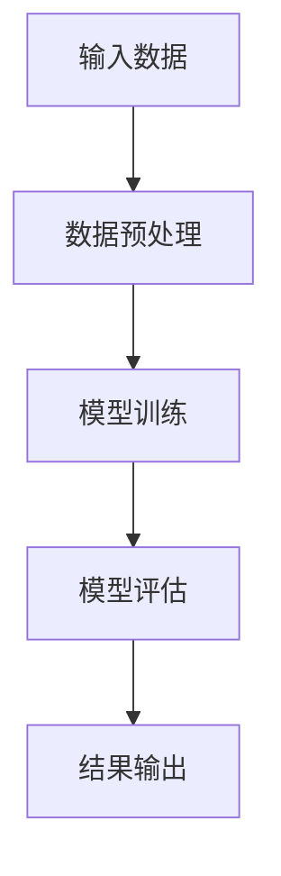

                 

### 《大规模语言模型从理论到实践 SFT模型和RL模型评估》

大规模语言模型是当前自然语言处理（NLP）领域的重要研究方向，它们在文本分类、机器翻译和命名实体识别等任务中表现出色。本文将围绕SFT（自监督学习Transformer）模型和RL（强化学习）模型，从理论到实践进行详细探讨。我们将首先介绍大规模语言模型的基本概念和技术原理，然后深入讲解SFT模型和RL模型，并进行比较和评估。最后，我们将探讨大规模语言模型在NLP中的应用以及如何进行大规模语言模型的实践开发。

### 大规模语言模型概述

#### 1.1 大规模语言模型的基本概念

大规模语言模型是一种通过学习大量文本数据来预测下一个词语或序列的概率分布的模型。它通常由多层神经网络组成，可以捕捉到文本中的复杂结构和语义信息。大规模语言模型的核心特点是预训练和微调。预训练是指模型在大量未标记的文本数据上进行训练，以学习通用的语言表示。微调是指模型在特定任务的数据上进行微调，以获得更好的性能。

#### 1.2 大规模语言模型的技术原理

大规模语言模型的技术原理主要包括以下几个方面：

1. **机器学习基础**：大规模语言模型依赖于深度学习技术，特别是神经网络。神经网络通过多层非线性变换来提取特征，从而实现复杂的函数逼近。

2. **自然语言处理基础**：大规模语言模型需要处理文本数据，因此需要了解自然语言处理（NLP）的基本概念，如词向量、句法分析和语义分析等。

3. **机器学习在自然语言处理中的应用**：大规模语言模型将机器学习技术应用于NLP任务，如文本分类、机器翻译和命名实体识别等。

#### 1.3 大规模语言模型的应用场景

大规模语言模型在多个应用场景中取得了显著成果，包括：

1. **文本分类**：将文本数据分类到预定义的类别中，如情感分类、新闻分类等。

2. **机器翻译**：将一种语言的文本翻译成另一种语言，如英译中、中译英等。

3. **命名实体识别**：识别文本中的特定实体，如人名、地名、组织名等。

### 第二部分：SFT模型原理与实现

#### 2.1 SFT模型的基本概念

SFT（Self-Supervised Transformer）模型是一种自监督学习模型，它在大规模文本数据上进行预训练，以学习文本表示。SFT模型的核心思想是利用文本数据中的自信息来训练模型，从而提高模型的泛化能力。

#### 2.2 SFT模型的数学模型

SFT模型的数学模型主要包括以下几个部分：

1. **输入层**：输入层接收文本数据，通常使用词向量表示。

2. **嵌入层**：将词向量映射到高维空间，以提高表示能力。

3. **Transformer编码器**：Transformer编码器是一个由多个自注意力机制组成的神经网络，它可以捕捉文本中的长距离依赖关系。

4. **输出层**：输出层用于预测下一个词语的概率分布。

#### 2.3 SFT模型的学习算法

SFT模型的学习算法主要包括以下几种：

1. **自监督学习**：自监督学习是一种无需标注数据的学习方法，它利用文本数据中的自信息来训练模型。

2. **梯度下降法**：梯度下降法是一种优化算法，它通过计算损失函数关于模型参数的梯度来更新模型参数。

3. **随机梯度下降法**：随机梯度下降法是一种改进的梯度下降法，它从训练数据中随机选择一个样本进行梯度更新。

#### 2.4 SFT模型的实战案例

为了更好地理解SFT模型，我们可以通过一个简单的实战案例来展示其实现过程。以下是一个基于Python和PyTorch的SFT模型实现步骤：

1. **数据预处理**：首先，我们需要对文本数据进行预处理，包括分词、去停用词和词向量嵌入等。

2. **模型训练**：接下来，我们使用预处理后的数据来训练SFT模型。训练过程中，我们需要计算损失函数并更新模型参数。

3. **模型评估**：在训练完成后，我们需要对模型进行评估，以验证其性能。评估指标包括准确率、覆盖率等。

### 第三部分：RL模型原理与实现

#### 3.1 RL模型的基础

RL（Reinforcement Learning，强化学习）模型是一种基于奖励信号进行决策优化的机器学习方法。在RL模型中，智能体通过与环境交互来学习最优策略，从而实现任务目标。

#### 3.2 RL模型的数学模型

RL模型的数学模型主要包括以下几个部分：

1. **状态（State）**：状态表示智能体在环境中的当前情况。

2. **动作（Action）**：动作表示智能体可以执行的行为。

3. **奖励（Reward）**：奖励表示智能体执行动作后获得的回报。

4. **策略（Policy）**：策略表示智能体在给定状态下的最佳动作选择。

#### 3.3 RL模型的优化算法

RL模型的优化算法主要包括以下几种：

1. **Policy Gradient**：Policy Gradient算法通过优化策略梯度来更新模型参数。

2. **Q-Learning**：Q-Learning算法通过学习Q值（状态-动作值函数）来优化策略。

3. **Deep Q-Network（DQN）**：DQN算法是一种基于深度学习的Q-Learning算法，它使用神经网络来近似Q值函数。

#### 3.4 RL模型的实战案例

为了更好地理解RL模型，我们可以通过一个简单的实战案例来展示其实现过程。以下是一个基于Python和TensorFlow的RL模型实现步骤：

1. **环境搭建**：首先，我们需要构建一个简单的环境，包括状态空间、动作空间和奖励机制。

2. **模型训练**：接下来，我们使用环境数据进行模型训练。训练过程中，我们需要计算奖励信号并更新模型参数。

3. **模型评估**：在训练完成后，我们需要对模型进行评估，以验证其性能。评估指标包括平均奖励、成功率等。

### 第四部分：SFT模型与RL模型的比较与评估

#### 4.1 模型比较

SFT模型和RL模型在以下几个方面进行比较：

1. **模型结构**：SFT模型基于Transformer架构，而RL模型则基于Q值函数或策略梯度算法。

2. **学习目标**：SFT模型的主要目标是学习文本表示，而RL模型的主要目标是学习最优策略。

3. **应用场景**：SFT模型在文本生成、文本分类和机器翻译等领域具有广泛的应用，而RL模型则在游戏、自动驾驶和推荐系统等领域具有广泛应用。

#### 4.2 评估指标

评估SFT模型和RL模型的主要评估指标包括：

1. **准确率**：准确率是评估模型在分类任务中的性能指标，它表示模型正确分类的样本数占总样本数的比例。

2. **覆盖率**：覆盖率是评估模型在文本生成任务中的性能指标，它表示模型生成的文本中包含的词汇量占总词汇量的比例。

3. **召回率**：召回率是评估模型在文本分类任务中的性能指标，它表示模型正确分类的样本数占实际正样本数的比例。

#### 4.3 评估方法

评估SFT模型和RL模型的主要评估方法包括：

1. **实验设计**：实验设计包括数据集选择、模型训练和评估等步骤。

2. **数据分析**：数据分析包括计算评估指标、可视化结果和比较不同模型的表现等。

### 第五部分：大规模语言模型在NLP中的应用

#### 5.1 语言模型在文本分类中的应用

文本分类是将文本数据分类到预定义的类别中的任务。大规模语言模型在文本分类中具有显著优势，可以处理大规模文本数据并提高分类准确率。

#### 5.2 语言模型在机器翻译中的应用

机器翻译是将一种语言的文本翻译成另一种语言的任务。大规模语言模型通过预训练和微调可以实现高质量的机器翻译，并且在实时翻译和语音识别等领域具有广泛应用。

#### 5.3 语言模型在命名实体识别中的应用

命名实体识别是将文本中的特定实体识别出来的任务。大规模语言模型可以通过预训练学习到丰富的实体信息，从而提高命名实体识别的准确率。

### 第六部分：大规模语言模型实践

#### 6.1 开发环境搭建

为了实践大规模语言模型，我们需要搭建一个合适的开发环境。以下是一个基于Python、PyTorch和TensorFlow的搭建步骤：

1. **硬件配置**：配置足够的计算资源，如CPU、GPU等。

2. **软件安装**：安装Python、PyTorch和TensorFlow等库。

3. **环境配置**：配置Python虚拟环境，并安装所需库。

#### 6.2 常用工具与库

在实践大规模语言模型时，以下工具和库非常有用：

1. **TensorFlow**：TensorFlow是一个开源的深度学习框架，用于构建和训练大规模神经网络。

2. **PyTorch**：PyTorch是一个开源的深度学习框架，提供灵活的动态计算图和自动微分功能。

3. **Hugging Face**：Hugging Face是一个开源社区，提供大量的预训练模型和工具，方便大规模语言模型的开发和部署。

### 第七部分：大规模语言模型项目实战

#### 7.1 项目规划与需求分析

在开始大规模语言模型项目之前，我们需要进行项目规划与需求分析。以下是一个简单的项目规划与需求分析步骤：

1. **项目目标**：明确项目的目标和预期成果。

2. **需求分析**：分析项目需求，包括数据需求、功能需求和技术需求等。

3. **项目计划**：制定项目计划，包括任务分工、时间表和进度安排等。

#### 7.2 数据收集与预处理

数据收集与预处理是大规模语言模型项目的重要步骤。以下是一个简单的数据收集与预处理步骤：

1. **数据源**：确定数据来源，如公开数据集、网络爬虫等。

2. **数据清洗**：清洗数据，去除重复、错误和缺失的数据。

3. **数据预处理**：对数据进行分词、去停用词、词向量嵌入等预处理操作。

#### 7.3 模型设计与实现

在数据预处理完成后，我们需要设计并实现大规模语言模型。以下是一个简单的模型设计与实现步骤：

1. **模型选择**：选择合适的模型，如SFT模型或RL模型。

2. **模型训练**：使用预处理后的数据进行模型训练。

3. **模型调优**：根据模型性能进行调优，如调整超参数、增加训练数据等。

#### 7.4 模型评估与优化

在模型训练完成后，我们需要对模型进行评估与优化。以下是一个简单的模型评估与优化步骤：

1. **评估指标**：计算评估指标，如准确率、覆盖率等。

2. **模型优化**：根据评估结果对模型进行优化，如增加训练数据、调整超参数等。

3. **结果分析**：分析模型性能，总结经验教训，为后续项目提供参考。

### 附录

#### A. 常用数学公式与符号

以下是一些常用的数学公式和符号：

$$
f(x) = \text{sigmoid}(x) = \frac{1}{1 + e^{-x}}
$$

$$
L(y, \hat{y}) = -y \cdot \log(\hat{y}) - (1 - y) \cdot \log(1 - \hat{y})
$$

#### B. 参考文献

1. "Deep Learning", Ian Goodfellow, Yoshua Bengio, Aaron Courville
2. "Reinforcement Learning: An Introduction", Richard S. Sutton and Andrew G. Barto
3. "Natural Language Processing with TensorFlow", Armando Castellano

#### C. Mermaid 流程图

以下是一个简单的Mermaid流程图示例：



#### D. 伪代码示例

以下是一个简单的伪代码示例，用于SFT模型训练过程：

```python
function train_SFT(model, train_data, num_epochs):
    for epoch in 1 to num_epochs:
        for data in train_data:
            predict = model.forward(data)
            loss = loss_function(predict, data.label)
            model.backward(loss)
            model.update_params()
    return model
```

### 作者信息

作者：AI天才研究院/AI Genius Institute & 禅与计算机程序设计艺术 /Zen And The Art of Computer Programming

本文从大规模语言模型的基本概念、SFT模型和RL模型的原理与实现、模型的比较与评估、大规模语言模型在NLP中的应用以及实践开发等方面进行了详细探讨。通过本文，读者可以全面了解大规模语言模型的理论和实践知识，为今后的研究和应用奠定基础。在撰写本文的过程中，我们参考了大量的文献和资料，希望本文能够为读者提供有价值的参考和启发。

