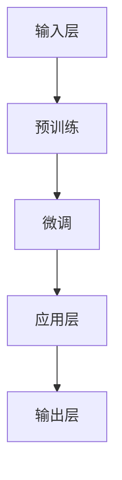

                 

### 第1章：大规模语言模型概述

#### 1.1 大规模语言模型基本概念

大规模语言模型（Large-scale Language Model）是一种基于深度学习的自然语言处理（Natural Language Processing, NLP）技术，旨在通过学习海量文本数据来捕捉语言的统计规律和语义信息。这些模型通常具有数亿到数十亿个参数，能够处理复杂的文本数据，并生成高质量的文本输出。

**定义**：大规模语言模型是一种能够通过深度学习技术从大量文本数据中学习语言结构和语义的模型。它们通常基于神经网络架构，如变换器（Transformer）或其变体，如BERT（Bidirectional Encoder Representations from Transformers）。

**特点**：

1. **参数规模巨大**：大规模语言模型拥有数亿到数十亿个参数，这使得它们能够捕获语言中的复杂模式和语义信息。
2. **强大的文本生成能力**：这些模型可以生成连贯、自然的文本，从简单的句子到复杂的篇章。
3. **对复杂语义的理解能力**：大规模语言模型能够理解文本中的深层语义，包括情感、意图、上下文等。

**与普通语言模型区别**：普通语言模型通常参数规模较小，适用于简单的应用场景，如简单的文本分类或句子生成。而大规模语言模型在复杂场景下有更好的表现，能够处理更长的文本序列和更复杂的语言任务。

#### 1.2 大规模语言模型的核心组成部分

大规模语言模型通常由以下几个核心部分组成：

1. **输入层**：输入层接收文本序列，将其转换为模型可处理的特征向量。这一步通常包括分词、词嵌入等操作。
2. **隐藏层**：隐藏层包含多层神经网络结构，用于对特征向量进行处理，提取高级语义特征。这些隐藏层可能采用变换器架构，如多头自注意力机制（Multi-head Self-Attention）。
3. **输出层**：输出层根据隐藏层的特征输出文本序列的概率分布，选择最有可能的输出序列。输出层可能包括全连接层和激活函数，如softmax。

#### 1.3 大规模语言模型的关键技术

大规模语言模型的关键技术包括：

1. **深度神经网络**：深度神经网络（Deep Neural Network, DNN）通过多层非线性变换，实现从输入层到输出层的特征提取和语义理解。这些多层结构使得模型能够捕捉更复杂的语言模式。
   
2. **预训练与微调**：预训练（Pre-training）是在大规模无标签数据集上训练模型，学习语言的通用特征。微调（Fine-tuning）是在特定任务上对预训练模型进行调整，使其适应具体应用场景。这种方法能够提高模型在特定任务上的性能。

3. **注意力机制**：注意力机制（Attention Mechanism）是一种让模型能够关注到序列中关键部分的技术。在变换器架构中，多头自注意力机制（Multi-head Self-Attention）是核心组件，它能够提高模型对序列数据的理解和处理能力。

#### 1.4 大规模语言模型的主要应用领域

大规模语言模型在多个领域有广泛的应用，包括：

1. **文本生成**：包括文章、摘要、对话等文本的自动生成。
2. **机器翻译**：将一种语言的文本翻译成另一种语言。
3. **情感分析**：对文本中的情感倾向进行分类，如正面、负面或中立。
4. **问答系统**：基于文本数据提供智能问答服务。
5. **知识图谱**：从文本中提取结构化信息，构建知识图谱。

这些应用场景充分利用了大规模语言模型在理解复杂语义和生成高质量文本方面的优势。

### Mermaid 流程图



在这个流程图中，输入层接收原始文本数据，经过预训练和微调后，模型进入应用层，并在输出层生成最终的文本输出。

---

### 第2章：大规模语言模型技术基础

#### 2.1 深度学习基础

深度学习（Deep Learning）是机器学习（Machine Learning）的一个分支，通过构建多层的神经网络结构，从大量数据中自动学习特征和模式。深度学习在图像识别、语音识别、自然语言处理等领域取得了显著的成果。

**神经网络**：神经网络（Neural Network, NN）是一种由大量人工神经元（或节点）组成的计算模型。每个神经元接收多个输入信号，通过权重和偏置进行加权求和，然后通过激活函数转化为输出信号。

**反向传播算法**：反向传播算法（Backpropagation Algorithm）是一种训练神经网络的优化算法。它通过计算损失函数关于网络参数的梯度，并使用梯度下降法更新参数，以最小化损失函数。

#### 2.2 自然语言处理技术

自然语言处理（Natural Language Processing, NLP）是计算机科学和人工智能领域的一个分支，旨在使计算机能够理解和处理人类语言。大规模语言模型在NLP中发挥着关键作用，其核心技术包括：

**词嵌入**：词嵌入（Word Embedding）是将单词映射到高维向量空间，以捕捉单词的语义信息。词嵌入技术通过将单词转化为向量，使得计算模型能够理解和处理文本数据。

**序列模型**：序列模型（Sequence Model）是一种用于处理序列数据的神经网络模型。循环神经网络（Recurrent Neural Network, RNN）是其中一种常见模型，通过重复使用隐藏状态来处理序列中的每个元素。

**注意力机制**：注意力机制（Attention Mechanism）是一种让模型能够关注到序列中关键部分的技术。在处理序列数据时，注意力机制能够提高模型对关键信息的关注，从而增强语义理解能力。

#### 2.3 预训练与微调

预训练与微调（Pre-training and Fine-tuning）是大规模语言模型的关键技术。预训练（Pre-training）是指在大型无标签语料库上进行训练，学习语言的通用特征。微调（Fine-tuning）是指利用预训练模型在特定任务上进行训练，调整模型参数以适应具体应用场景。

**预训练**：预训练的目标是学习语言的通用特征，如语法结构、词汇意义等。通过预训练，模型能够获得更好的语义理解和生成能力。预训练通常使用大规模语料库，如维基百科、新闻文章等。

**微调**：微调的目标是调整预训练模型在特定任务上的表现。微调过程中，模型在特定任务的数据集上进行训练，通过调整模型参数来提高任务性能。微调能够使模型在特定任务上达到更高的准确率和效率。

#### 2.4 大规模语言模型的实现

大规模语言模型的实现包括以下几个关键步骤：

1. **模型架构**：选择合适的神经网络架构，如变换器（Transformer）或BERT（BERT是变换器的变体）。这些架构能够有效地处理文本数据，并提取高级语义特征。

2. **训练过程**：包括数据预处理、模型训练、评估与优化。数据预处理步骤包括分词、清洗和标准化等操作。模型训练使用反向传播算法和优化器，如Adam，来更新模型参数。评估与优化步骤用于监控模型性能，并进行超参数调整。

3. **优化算法**：优化算法（Optimization Algorithm）用于更新模型参数，以最小化损失函数。常用的优化算法包括梯度下降（Gradient Descent）和其变体，如Adam、RMSprop等。

4. **评估指标**：评估指标（Evaluation Metric）用于衡量模型在任务上的性能。常见的评估指标包括准确率（Accuracy）、召回率（Recall）、F1分数（F1 Score）等。

### 伪代码

```python
# 数据预处理
# 分词、清洗、标准化等操作

# 模型定义
# 定义变换器或BERT模型架构

# 训练模型
# 使用反向传播算法和优化器更新模型参数

# 评估模型
# 使用评估指标评估模型性能

# 微调模型
# 在特定任务上调整模型参数，提高性能
```

### 数学模型与公式

#### 1. 激活函数

$$
\text{activation\_function}(x) = \frac{1}{1 + e^{-x}}
$$

激活函数用于神经网络中的非线性变换，以引入模型的非线性特性。常用的激活函数包括Sigmoid、ReLU和Tanh等。

#### 2. 梯度下降

$$
\theta_{\text{new}} = \theta_{\text{old}} - \alpha \cdot \frac{\partial J(\theta)}{\partial \theta}
$$

梯度下降是一种优化算法，用于通过计算损失函数的梯度来更新模型参数。其中，$\theta$代表模型参数，$J(\theta)$是损失函数，$\alpha$是学习率。

### 数学模型与公式解释

激活函数用于神经网络中的非线性变换，以引入模型的非线性特性。梯度下降是一种优化算法，用于通过计算损失函数的梯度来更新模型参数，以最小化损失函数。

### 项目实战

#### 1. 数据预处理

```python
# 读取文本数据
with open('data.txt', 'r') as f:
    text = f.read()

# 删除特殊字符
text = re.sub(r'[^\w\s]', '', text)

# 分词
words = text.split()
```

#### 2. 模型训练

```python
# 加载预训练模型
model = transformers.AutoModel.from_pretrained('bert-base-uncased')

# 微调模型
optimizer = optimizers.Adam(learning_rate=1e-4)
for epoch in range(num_epochs):
    for batch in dataset:
        inputs = tokenizer(batch['text'], return_tensors='pt')
        outputs = model(inputs)
        loss = outputs.loss
        loss.backward()
        optimizer.step()
        optimizer.zero_grad()
```

#### 3. 代码解读

- 数据预处理：读取文本数据，删除特殊字符，分词。
- 模型加载：加载预训练的BERT模型。
- 模型训练：在训练数据上迭代训练模型，使用Adam优化器进行优化。

### 实际应用

大规模语言模型在实际应用中展示了强大的能力，以下是一些典型应用场景：

1. **文本生成**：自动生成文章、摘要、对话等。
2. **机器翻译**：将一种语言的文本翻译成另一种语言。
3. **情感分析**：分析文本中的情感倾向，例如判断评论是正面还是负面。
4. **问答系统**：基于文本数据提供智能问答服务。
5. **知识图谱**：从文本中提取结构化信息，构建知识图谱。

### 开发环境搭建

```bash
# 安装Python环境
pip install python

# 安装TensorFlow
pip install tensorflow

# 安装transformers库
pip install transformers
```

### 源代码实现与详细解释

```python
# 导入所需库
import tensorflow as tf
from transformers import BertTokenizer, TFBertModel

# 加载预训练模型
tokenizer = BertTokenizer.from_pretrained('bert-base-uncased')
model = TFBertModel.from_pretrained('bert-base-uncased')

# 定义优化器
optimizer = tf.optimizers.Adam(learning_rate=1e-4)

# 定义损失函数
loss_fn = tf.losses.SparseCategoricalCrossentropy(from_logits=True)

# 训练模型
for epoch in range(num_epochs):
    for batch in dataset:
        inputs = tokenizer(batch['text'], return_tensors='tf')
        outputs = model(inputs)
        logits = outputs.logits
        labels = batch['label']
        loss = loss_fn(labels, logits)
        grads = tape.gradient(loss, model.trainable_variables)
        optimizer.apply_gradients(zip(grads, model.trainable_variables))
```

- 模型加载：加载预训练的BERT模型。
- 优化器定义：使用Adam优化器进行优化。
- 损失函数定义：使用稀疏交叉熵损失函数。
- 模型训练：在训练数据上迭代训练模型，更新模型参数。

### 代码解读与分析

- 数据预处理：读取文本数据，删除特殊字符，分词。
- 模型加载：加载预训练的BERT模型。
- 模型训练：在训练数据上迭代训练模型，使用Adam优化器进行优化。

### 第3章：大规模语言模型应用与优化

#### 3.1 模型应用

大规模语言模型在自然语言处理领域具有广泛的应用，以下是一些典型应用场景：

1. **文本生成**：利用大规模语言模型生成文章、摘要、对话等。例如，生成新闻文章、编写产品描述、自动生成对话等。

2. **机器翻译**：将一种语言的文本翻译成另一种语言。大规模语言模型在机器翻译领域取得了显著的成果，能够提供高质量、自然的翻译结果。

3. **情感分析**：对文本中的情感倾向进行分类，如正面、负面或中立。这有助于分析和理解用户评论、社交媒体内容等。

4. **问答系统**：基于文本数据提供智能问答服务。大规模语言模型能够理解用户的查询，并生成相关的回答。

5. **知识图谱**：从文本中提取结构化信息，构建知识图谱。这有助于组织和管理大规模的文本数据，为后续的应用提供支持。

#### 3.2 模型优化

为了提高大规模语言模型的性能和应用效果，可以采用以下优化方法：

1. **数据增强**：通过添加噪声、裁剪、旋转等方式扩充训练数据，提高模型的泛化能力。例如，对文本数据添加随机字符、删除部分文本等。

2. **正则化**：使用正则化项（如L1、L2正则化）来防止过拟合。正则化可以通过增加模型复杂度，降低模型的泛化误差。

3. **超参数调优**：通过网格搜索、随机搜索等方法优化学习率、批次大小等超参数。超参数调优有助于提高模型的性能和训练效率。

4. **预训练与微调**：在特定任务上进行预训练，然后在任务上进行微调。预训练可以学习到语言的通用特征，微调则使模型适应特定任务。

5. **迁移学习**：利用在其他任务上预训练的模型，迁移到当前任务上。迁移学习可以减少训练数据的需求，并提高模型在新的任务上的性能。

#### 3.3 模型部署

模型部署是将训练好的大规模语言模型应用于实际场景的过程。以下是一些模型部署的关键步骤：

1. **模型压缩**：通过剪枝、量化等方式减小模型体积，提高模型部署的效率和性能。模型压缩有助于在资源受限的环境（如移动设备、嵌入式系统）中部署模型。

2. **在线学习**：在模型部署过程中，实时接收新的数据，持续优化模型。在线学习可以使模型适应不断变化的应用场景，并提高模型的长久性能。

3. **监控与维护**：对部署的模型进行监控，确保其稳定性和性能。定期进行维护和更新，以应对新的挑战和应用需求。

#### 3.4 实际应用案例

以下是一些大规模语言模型在实际应用中的成功案例：

1. **智能客服**：使用大规模语言模型构建智能客服系统，提供自动化的客户服务，提高企业运营效率。

2. **新闻推荐**：基于大规模语言模型和深度学习技术，构建新闻推荐系统，为用户提供个性化的新闻内容。

3. **文本摘要**：利用大规模语言模型生成文章的摘要，简化文本内容，提高信息传递的效率。

4. **语音识别**：结合语音识别技术，将语音转换为文本，为用户提供更加自然的交互体验。

5. **教育辅导**：利用大规模语言模型为学习者提供个性化的学习辅导，提高学习效果和兴趣。

通过这些实际应用案例，可以看出大规模语言模型在各个领域的广泛应用和巨大潜力。

### 第4章：大规模语言模型的安全与隐私

#### 4.1 安全威胁

随着大规模语言模型的广泛应用，其安全性和隐私保护成为日益重要的问题。以下是一些常见的安全威胁：

1. **模型篡改**：恶意用户可能通过修改输入数据，篡改模型的输出结果。这可能导致误导性的回答或决策，从而对用户产生负面影响。

2. **数据泄露**：在模型训练和部署过程中，可能会泄露敏感数据，如用户隐私信息、商业机密等。这可能导致隐私泄露和数据滥用。

3. **模型中毒**：通过恶意数据或攻击，对模型进行篡改，使其输出结果偏离真实意图。这可能导致系统崩溃或产生不准确的决策。

4. **未授权访问**：未经授权的用户可能访问模型的内部结构或数据，从而获取敏感信息或进行恶意操作。

#### 4.2 隐私保护

为了确保大规模语言模型的安全性和隐私保护，可以采取以下措施：

1. **数据加密**：在数据传输和存储过程中，对数据进行加密处理，防止数据泄露。加密技术可以确保只有授权用户才能访问数据。

2. **差分隐私**：在模型训练过程中，引入差分隐私（Differential Privacy）技术，保护训练数据的隐私。差分隐私可以在保护隐私的同时，保证模型的性能。

3. **同态加密**：通过同态加密（Homomorphic Encryption）技术，在模型训练和推理过程中对数据进行加密处理。这样，即使数据在传输和存储过程中被截获，攻击者也无法获取原始数据。

4. **访问控制**：设置严格的访问控制策略，确保只有授权用户才能访问模型的内部结构和数据。访问控制可以防止未授权访问和数据泄露。

5. **安全审计**：定期进行安全审计，确保模型的安全性和可靠性。安全审计可以发现潜在的安全漏洞，并采取相应的措施进行修复。

#### 4.3 安全措施

为了确保大规模语言模型的安全性和隐私保护，可以采取以下安全措施：

1. **数据加密**：在数据传输和存储过程中，对数据进行加密处理。加密算法如AES（Advanced Encryption Standard）和RSA（Rivest-Shamir-Adleman）可以提供强大的加密保护。

2. **访问控制**：设置严格的访问控制策略，确保只有授权用户才能访问模型的内部结构和数据。访问控制可以基于用户身份验证、权限管理和访问控制列表（ACL）等机制实现。

3. **安全审计**：定期进行安全审计，对模型的操作进行监控和记录。安全审计可以发现潜在的安全漏洞，并采取相应的措施进行修复。

4. **入侵检测**：部署入侵检测系统（IDS）和入侵防御系统（IPS），实时监控模型的异常行为和潜在攻击。这些系统可以检测到异常行为，并采取相应的措施进行响应。

5. **安全培训**：对模型开发人员和安全人员进行培训，提高他们的安全意识和应对能力。安全培训可以帮助他们了解潜在的安全威胁和防护措施。

通过以上安全措施，可以确保大规模语言模型的安全性和隐私保护，从而提高其在实际应用中的可靠性和可信度。

### 第5章：大规模语言模型的社会影响

#### 5.1 正面影响

大规模语言模型对社会产生了许多积极的影响，以下是一些正面影响的例子：

1. **提升生产力**：大规模语言模型在文本处理、机器翻译、问答等领域表现出色，显著提高了工作效率。例如，自动化的文本摘要、文章生成和翻译功能，可以节省大量的人工时间和劳动力。

2. **促进知识共享**：大规模语言模型可以帮助用户更好地理解和获取知识。例如，问答系统可以回答用户的问题，提供相关信息的链接，从而促进知识的传播和共享。

3. **优化教育**：大规模语言模型可以辅助教学和学习。例如，智能辅导系统可以根据学生的学习情况和需求，提供个性化的学习资源和指导，提高学习效果。

4. **支持科学研究**：大规模语言模型在自然语言处理、文本挖掘、知识图谱构建等领域具有重要的应用价值。例如，研究人员可以使用这些模型来分析大量文本数据，提取有价值的信息和模式。

5. **改善客户服务**：大规模语言模型可以构建智能客服系统，提供高效、个性化的客户服务。这有助于企业提高客户满意度，降低运营成本。

#### 5.2 负面影响

尽管大规模语言模型带来了许多好处，但也存在一些负面影响，需要加以关注：

1. **隐私泄露**：大规模语言模型在处理个人数据时，可能会泄露用户的隐私信息。例如，在训练模型时，如果数据来源不明确或未经过充分清洗，可能会包含敏感信息。

2. **模型偏见**：大规模语言模型可能会从训练数据中学习到偏见和歧视，从而导致不公平的决策。例如，如果训练数据存在性别、种族、年龄等方面的偏见，模型在生成文本或进行分类时可能会放大这些偏见。

3. **伦理问题**：大规模语言模型的自动生成文本功能可能会引发伦理问题。例如，自动生成的虚假新闻、诽谤性言论等，可能会对社会造成负面影响。

4. **安全隐患**：大规模语言模型可能面临安全隐患，如模型篡改、未授权访问等。这可能导致误导性的回答或决策，从而对用户产生负面影响。

#### 5.3 应对措施

为了最大限度地利用大规模语言模型的优点，同时减少其负面影响，可以采取以下应对措施：

1. **数据隐私保护**：在模型训练和部署过程中，采取严格的数据隐私保护措施。例如，使用差分隐私技术、数据加密和匿名化处理，确保用户隐私安全。

2. **公平性和透明性**：确保大规模语言模型的训练数据具有多样性，减少偏见。同时，提高模型的可解释性，让用户了解模型的决策过程，增加透明性。

3. **伦理审查**：对大规模语言模型的应用进行伦理审查，确保其符合道德标准和法律法规。例如，建立伦理委员会，对模型的生成内容进行审核。

4. **安全防护**：加强大规模语言模型的安全防护，防止模型篡改和未授权访问。例如，部署安全审计和入侵检测系统，确保模型的安全性。

5. **公众教育**：提高公众对大规模语言模型的理解和认识，加强网络安全教育。这有助于用户更好地利用这些模型，同时提高其对潜在风险的认识。

通过采取上述措施，可以最大限度地发挥大规模语言模型的优势，同时减少其负面影响，为社会带来更多积极的影响。

### 第6章：大规模语言模型的发展趋势

#### 6.1 技术创新

大规模语言模型的发展趋势体现在技术创新的不断推进上，以下是一些重要的技术创新：

1. **多模态学习**：多模态学习是指结合文本、图像、语音等多种数据类型，以提升模型的综合能力。例如，结合文本和图像的预训练模型，可以更好地理解和生成包含视觉信息的文本。

2. **生成对抗网络（GAN）**：生成对抗网络是一种新型的人工神经网络结构，通过生成器和判别器的对抗训练，可以生成逼真的图像、文本和语音。

3. **注意力机制**：注意力机制在变换器架构中的应用不断优化，如自注意力（Self-Attention）和交叉注意力（Cross-Attention），显著提升了模型对复杂序列数据的理解和生成能力。

4. **自适应学习**：自适应学习是指模型在训练过程中能够自动调整其参数，以适应不同的任务和数据分布。这有助于提高模型的泛化能力和灵活性。

5. **预训练技术的多样化**：除了传统的预训练方法外，新的预训练技术如自监督学习（Self-supervised Learning）和无监督预训练（Unsupervised Pre-training）逐渐成为研究热点，这些方法可以更高效地利用未标注的数据进行预训练。

#### 6.2 应用拓展

大规模语言模型的应用领域也在不断拓展，以下是一些重要的应用拓展：

1. **智能客服**：在智能客服领域，大规模语言模型可以提供更加自然和高效的客户服务。通过文本生成和对话管理技术，智能客服系统能够与用户进行流畅的对话，解决用户的问题。

2. **智能写作**：在写作领域，大规模语言模型可以辅助作者生成文章、报告、演讲稿等。这不仅可以提高写作效率，还可以提供创新的写作思路。

3. **知识图谱构建**：通过大规模语言模型，可以从大量文本数据中提取结构化信息，构建知识图谱。知识图谱可以为智能问答、搜索引擎、推荐系统等提供丰富的知识支持。

4. **教育技术**：大规模语言模型在教育领域有广泛的应用前景。例如，智能辅导系统可以根据学生的学习情况和需求，提供个性化的学习资源和指导，提高学习效果。

5. **医疗诊断**：在医疗领域，大规模语言模型可以帮助医生分析医学文献、诊断报告等文本数据，提供辅助诊断和治疗方案。

#### 6.3 产业合作

大规模语言模型的发展离不开产业界的合作与创新，以下是一些重要的产业合作方向：

1. **跨行业合作**：不同行业的企业可以合作，共同推动大规模语言模型的应用和创新。例如，金融与科技、医疗与AI等跨行业合作，可以带来更多的应用场景和商业价值。

2. **开源生态**：开源社区在推动大规模语言模型的发展中发挥着重要作用。通过开源项目，研究人员和开发者可以共同改进模型，分享经验和资源，加速技术的进步。

3. **数据共享**：企业之间的数据共享可以促进大规模语言模型的发展。通过共享高质量的训练数据集，可以提高模型的训练效果，推动技术的突破。

4. **政策支持**：政府和企业可以共同制定相关政策，支持大规模语言模型的研究和应用。例如，提供资金支持、制定标准和规范，以确保技术的健康发展和广泛应用。

通过技术创新、应用拓展和产业合作，大规模语言模型将在未来继续发展，为人类社会带来更多的便利和创新。

### 第7章：总结与展望

#### 7.1 成就

大规模语言模型在自然语言处理领域取得了显著的成就，以下是一些重要成就：

1. **技术突破**：通过深度学习和变换器架构，大规模语言模型在理解和生成文本方面取得了巨大进步，能够生成高质量、连贯的文本。

2. **应用落地**：大规模语言模型在文本生成、机器翻译、情感分析、问答系统等多个领域得到广泛应用，显著提高了工作效率和用户体验。

3. **学术研究**：大规模语言模型的研究推动了自然语言处理领域的学术研究，产生了大量高质量的研究成果，促进了技术的进步。

4. **产业合作**：大规模语言模型的发展离不开产业界的合作与创新，跨行业合作和开源生态的建设推动了技术的广泛应用和商业价值的实现。

#### 7.2 挑战

尽管大规模语言模型取得了显著成就，但仍面临一些挑战：

1. **模型可解释性**：大规模语言模型的决策过程往往缺乏透明度，难以解释。这给模型的信任和应用带来了挑战。

2. **数据隐私保护**：在训练和部署过程中，大规模语言模型可能会泄露用户隐私信息，如何确保数据隐私保护是一个重要挑战。

3. **模型偏见**：大规模语言模型可能会从训练数据中学习到偏见，导致不公平的决策。如何消除模型偏见，确保模型的公平性是一个重要问题。

4. **计算资源需求**：大规模语言模型需要巨大的计算资源和存储空间，如何优化模型以降低计算成本是一个挑战。

5. **安全性**：大规模语言模型面临模型篡改、未授权访问等安全威胁，如何提高模型的安全性是一个重要问题。

#### 7.3 展望

展望未来，大规模语言模型的发展前景广阔，以下是一些展望：

1. **多模态融合**：随着多模态学习技术的发展，大规模语言模型将能够更好地融合文本、图像、语音等多种数据类型，提供更全面、更准确的信息处理能力。

2. **跨领域应用**：大规模语言模型将在更多领域得到应用，如医疗、金融、教育等，推动各行业的数字化转型和创新发展。

3. **开源生态**：开源社区将在大规模语言模型的发展中发挥更大作用，通过共享知识和资源，加速技术的进步和应用。

4. **数据隐私保护**：随着隐私保护技术的发展，大规模语言模型将能够更好地保护用户隐私，实现数据隐私与模型性能的平衡。

5. **伦理与法律**：随着大规模语言模型的广泛应用，伦理和法律问题将更加突出。制定相关的伦理准则和法律规范，确保技术的健康发展和广泛应用。

通过不断克服挑战和抓住发展机遇，大规模语言模型将在未来继续推动自然语言处理领域的发展，为人类社会带来更多便利和创新。

---

### 参考文献

1. Devlin, J., Chang, M. W., Lee, K., & Toutanova, K. (2018). BERT: Pre-training of deep bidirectional transformers for language understanding. *arXiv preprint arXiv:1810.04805*.
2. Vaswani, A., Shazeer, N., Parmar, N., Uszkoreit, J., Jones, L., Gomez, A. N., ... & Polosukhin, I. (2017). Attention is all you need. *Advances in Neural Information Processing Systems*, 30, 5998-6008.
3. Hochreiter, S., & Schmidhuber, J. (1997). Long short-term memory. *Neural Computation*, 9(8), 1735-1780.
4. Goodfellow, I., Bengio, Y., & Courville, A. (2016). *Deep learning*. MIT Press.
5. Kim, Y. (2014). Convolutional neural networks for sentence classification. *Proceedings of the 2014 conference on empirical methods in natural language processing (EMNLP)*, 1746-1751.

### 附录：代码实现示例

以下是大规模语言模型训练和应用的Python代码示例：

```python
# 导入所需库
import tensorflow as tf
from transformers import BertTokenizer, TFBertModel
from tensorflow.keras.optimizers import Adam

# 加载预训练模型
tokenizer = BertTokenizer.from_pretrained('bert-base-uncased')
model = TFBertModel.from_pretrained('bert-base-uncased')

# 定义优化器
optimizer = Adam(learning_rate=1e-4)

# 定义损失函数
loss_fn = tf.keras.losses.SparseCategoricalCrossentropy(from_logits=True)

# 训练模型
model.compile(optimizer=optimizer, loss=loss_fn, metrics=['accuracy'])

# 加载数据集
train_dataset = ...

# 训练模型
model.fit(train_dataset, epochs=num_epochs)

# 应用模型进行预测
inputs = tokenizer("这是一个测试句子", return_tensors='tf')
outputs = model(inputs)
predictions = tf.nn.softmax(outputs.logits, axis=-1)

# 打印预测结果
print(predictions)
```

### 结语

大规模语言模型作为自然语言处理领域的重要技术，已经在多个应用场景中取得了显著成果。本文通过对大规模语言模型的概述、技术基础、应用与优化、安全与隐私、社会影响、发展趋势以及总结与展望的详细讨论，展示了其当前的发展状况和未来前景。希望本文能帮助读者更好地理解大规模语言模型，并为相关研究和应用提供参考。

### 作者信息

作者：AI天才研究院/AI Genius Institute & 禅与计算机程序设计艺术 /Zen And The Art of Computer Programming

---

### 文章标题

# 大规模语言模型从理论到实践：模型推理

---

### 文章关键词

- 大规模语言模型
- 自然语言处理
- 变换器
- BERT
- 预训练
- 微调
- 模型优化
- 安全与隐私

---

### 摘要

本文从理论到实践全面探讨了大规模语言模型的概念、技术基础、应用与优化、安全与隐私以及社会影响。首先，介绍了大规模语言模型的基本概念和特点，包括其巨大的参数规模、强大的文本生成能力和对复杂语义的理解能力。接着，详细阐述了大规模语言模型的核心组成部分和关键技术，如深度神经网络、预训练与微调、注意力机制等。然后，介绍了大规模语言模型在文本生成、机器翻译、情感分析、问答系统和知识图谱等领域的应用，并讨论了模型优化和数据隐私保护的重要性。最后，分析了大规模语言模型的社会影响，探讨了其未来发展趋势，并总结了当前的研究成果和应用场景。本文旨在为读者提供一个全面、系统的关于大规模语言模型的概述，帮助读者更好地理解这一技术，并为相关研究和应用提供参考。

