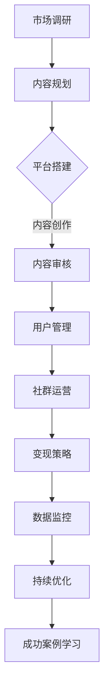

                 

# 如何打造个人知识付费生态系统

## 关键词

个人知识付费、内容营销、用户增长、变现策略、数据分析、算法模型

## 摘要

在数字化时代，个人知识付费生态系统已经成为知识服务的重要模式。本文将从基础知识、内容营销、变现与增长、实战案例四个方面详细探讨如何打造个人知识付费生态系统。通过分析个人知识付费的概念、平台搭建、内容创作、传播策略、用户增长、变现方法以及数据分析与优化，结合实战案例，为个人知识付费项目的实施提供系统性的指导。

---

### 《如何打造个人知识付费生态系统》目录大纲

#### 第一部分：基础知识

- **个人知识付费概述**
  - **1.1 知识付费的定义与发展历程**
  - **1.2 个人知识付费的优势与挑战**
  - **1.3 个人知识付费的商业模式**

- **个人知识付费平台搭建**
  - **2.1 平台搭建的必要条件**
  - **2.2 内容生产与审核**
  - **2.3 用户管理与互动**

#### 第二部分：内容营销

- **内容创作与传播**
  - **3.1 内容创作方法论**
  - **3.2 内容传播策略**
  - **3.3 用户增长与留存**

- **社群运营与管理**
  - **4.1 社群运营的流程与技巧**
  - **4.2 社群管理规范与风险管理**
  - **4.3 社群互动与活动策划**

#### 第三部分：变现与增长

- **个人知识付费变现策略**
  - **5.1 收费模式与定价策略**
  - **5.2 会员管理与价值提升**
  - **5.3 变现渠道拓展**

- **数据分析与优化**
  - **6.1 用户数据分析**
  - **6.2 业务数据监控与优化**
  - **6.3 数据隐私保护与合规**

#### 第四部分：实战案例

- **个人知识付费成功案例分析**
  - **7.1 成功案例介绍**
  - **7.2 案例运营策略解析**
  - **7.3 案例启示与借鉴**

- **个人知识付费项目实战**
  - **8.1 项目策划与执行**
  - **8.2 项目成果评估与改进**
  - **8.3 项目经验总结与分享**

#### 附录：资源与工具

- **附录 A：知识付费相关资源**
- **附录 B：实用工具与平台**

### 参考文献

- **[参考文献列表]**（这里列出书籍、文章、网站等参考资料）

---

## 第一部分：基础知识

### 1.1 知识付费的定义与发展历程

知识付费是指通过购买或租赁等形式获取知识产品或服务的一种商业模式。它起源于传统教育领域，随着互联网技术的发展，逐渐扩展到更广泛的领域。知识付费的发展历程可以分为以下几个阶段：

1. **1.1.1 起源阶段（2000年以前）**
   - 在这个阶段，知识付费主要指学校教育、培训课程等实体教育服务。
   - 教育资源的获取主要通过购买教材、参加培训课程或报名入学。

2. **1.1.2 互联网普及阶段（2000-2010年）**
   - 互联网的普及使得在线教育开始兴起，知识付费的形式更加多样化。
   - 网络课程、电子书、在线讲座等成为知识付费的重要形式。

3. **1.1.3 电商化阶段（2010-2015年）**
   - 电商平台的出现，使得知识付费变得更加便捷和规模化。
   - 知识付费产品逐渐电商化，形成了较为完整的产业链。

4. **1.1.4 社交化阶段（2015年至今）**
   - 社交媒体的兴起，使得知识付费具有更强的社交属性。
   - KOL（关键意见领袖）、网红等个人品牌的影响力不断提升，成为知识付费的重要推动力。

### 1.2 个人知识付费的优势与挑战

**1.2.1 优势**

- **个性化服务**：个人知识付费可以根据用户需求提供定制化的服务，提高用户满意度。
- **高附加值**：知识是一种高附加值的产品，通过知识付费可以获取更高的利润。
- **灵活性**：个人知识付费平台通常具有更高的灵活性，可以快速响应市场变化。
- **用户粘性**：通过提供高质量的内容和服务，可以提高用户的忠诚度和粘性。

**1.2.2 挑战**

- **内容质量**：个人知识付费平台需要保证内容的质量，避免劣币驱逐良币的现象。
- **用户信任**：建立用户信任是个人知识付费平台的重要挑战，需要提供可靠的服务和保障。
- **竞争压力**：随着知识付费的普及，市场竞争越来越激烈，个人知识付费平台需要不断创新和优化。
- **知识产权**：知识付费过程中涉及到知识产权保护问题，需要制定相应的知识产权保护策略。

### 1.3 个人知识付费的商业模式

**1.3.1 盈利模式**

- **订阅模式**：用户按月或按年订阅服务，获取持续的更新内容。
- **付费课程**：用户为特定的课程支付费用，完成学习任务。
- **会员制度**：提供会员服务，用户支付一定费用成为会员，享受更多的福利。

**1.3.2 运营策略**

- **内容多样化**：提供多样化的内容，满足不同用户的需求。
- **社群互动**：建立社群，促进用户之间的互动，提高用户粘性。
- **营销推广**：通过线上线下多种渠道进行营销推广，提高品牌知名度。
- **用户反馈**：收集用户反馈，不断优化产品和服务的质量。

---

## 第二部分：内容营销

### 2.1 内容创作与传播

**2.1.1 内容创作方法论**

**2.1.1.1 内容类型分析**

知识付费平台的内容通常包括以下几种类型：

- **专业课程**：为用户提供专业知识的讲解和传授。
- **实战案例**：通过案例分析，帮助用户理解理论知识的应用。
- **行业资讯**：提供最新的行业动态和资讯，帮助用户了解行业趋势。
- **个人经验分享**：专家或行业领袖分享自己的经验和心得。

**2.1.1.2 内容创作流程**

1. **需求分析**：分析用户需求，确定内容主题和方向。
2. **内容规划**：制定内容规划，包括内容类型、发布频率、时长等。
3. **内容创作**：根据内容规划，进行内容创作，确保内容的专业性和实用性。
4. **内容审核**：对内容进行审核，确保内容的准确性和合规性。
5. **内容发布**：将内容发布到平台，进行传播。

**2.1.2 内容传播策略**

**2.1.2.1 社交媒体传播**

- **社交媒体选择**：选择适合平台，如微博、微信、抖音等。
- **内容优化**：优化内容，提高内容的吸引力和传播力。
- **互动营销**：通过互动营销，提高用户参与度。

**2.1.2.2 精准投放广告**

- **广告平台选择**：选择合适的广告平台，如百度广告、微博广告等。
- **目标人群定位**：精准定位目标人群，提高广告的转化率。
- **广告内容优化**：优化广告内容，提高点击率和转化率。

**2.1.3 用户增长与留存**

**2.1.3.1 用户增长策略**

- **内容推荐**：通过内容推荐，吸引用户关注和访问。
- **渠道拓展**：拓展多种渠道，如合作推广、线上活动等，提高用户覆盖率。
- **口碑传播**：通过用户口碑，吸引更多用户。

**2.1.3.2 用户留存方法**

- **高质量内容**：提供高质量的内容，提高用户满意度。
- **社群互动**：建立社群，促进用户之间的互动，提高用户粘性。
- **会员制度**：提供会员服务，增加用户粘性。

---

### 2.2 社群运营与管理

**2.2.1 社群运营的流程与技巧**

**2.2.1.1 社群建设策略**

1. **确定社群目标**：明确社群的目标和定位，确保社群的聚焦性。
2. **选择社群平台**：根据目标用户的特点，选择适合的社群平台。
3. **制定社群规则**：制定明确的社群规则，确保社群的健康运营。
4. **社群推广**：通过多种渠道推广社群，提高社群知名度。

**2.2.1.2 社群活跃度提升**

1. **内容互动**：定期发布有价值的内容，引导用户互动。
2. **活动策划**：策划有趣的活动，提高用户参与度。
3. **用户互动**：鼓励用户之间互动，建立良好的社群氛围。

**2.2.2 社群管理规范与风险管理**

**2.2.2.1 社群管理规范**

1. **明确角色分工**：明确社群管理团队成员的职责和分工。
2. **制定管理流程**：制定规范的管理流程，确保社群运营的有序性。
3. **用户管理**：对用户进行有效的管理和分类，提高用户服务质量。

**2.2.2.2 社群风险管理**

1. **内容审核**：对发布的内容进行严格审核，避免违规内容出现。
2. **危机应对**：制定危机应对预案，及时处理突发问题。
3. **法律合规**：确保社群运营符合法律法规要求，避免法律风险。

**2.2.3 社群互动与活动策划**

**2.2.3.1 社群互动技巧**

1. **实时互动**：及时回复用户的提问和反馈，提高用户满意度。
2. **情感互动**：通过情感互动，拉近与用户的距离，增强用户粘性。
3. **知识分享**：鼓励用户分享知识和经验，促进社群知识积累。

**2.2.3.2 活动策划与执行**

1. **活动主题确定**：根据社群特点和用户需求，确定活动主题。
2. **活动策划**：制定详细的活动策划方案，包括时间、地点、形式等。
3. **活动宣传**：通过多种渠道宣传活动，提高活动知名度。
4. **活动执行**：确保活动顺利进行，提供良好的用户体验。
5. **活动总结**：对活动进行总结，分析活动效果，为后续活动提供参考。

---

### 2.3 用户管理与互动

**2.3.1 用户注册与登录**

**2.3.1.1 注册流程**

1. **用户信息填写**：用户填写姓名、邮箱、手机号等基本信息。
2. **验证信息**：用户通过邮箱或手机号验证身份。
3. **注册成功**：用户完成注册，登录平台。

**2.3.1.2 登录方式**

1. **账号密码登录**：用户输入账号和密码进行登录。
2. **手机验证码登录**：用户输入手机号和验证码进行登录。
3. **第三方登录**：支持微信、微博、QQ等第三方账号登录。

**2.3.2 用户互动与反馈**

**2.3.2.1 用户互动**

1. **评论互动**：用户对内容进行评论，与其他用户互动。
2. **私信互动**：用户之间通过私信进行互动，建立个人关系。
3. **问答互动**：用户提出问题，专家或其他用户回答问题。

**2.3.2.2 用户反馈**

1. **反馈渠道**：提供多种反馈渠道，如在线反馈表、客服电话等。
2. **反馈处理**：及时处理用户反馈，解决问题。
3. **反馈分析**：对用户反馈进行分析，优化产品和服务的质量。

---

## 第三部分：变现与增长

### 3.1 收费模式与定价策略

**3.1.1 收费模式**

**3.1.1.1 订阅模式**

- **月度订阅**：用户按月支付费用，享受平台提供的所有服务。
- **年度订阅**：用户一次性支付全年费用，享受更优惠的价格。

**3.1.1.2 付费课程模式**

- **课程包**：用户购买特定课程包，完成学习任务。
- **单节课购买**：用户为特定课程支付费用，完成学习。

**3.1.1.3 会员制度**

- **普通会员**：用户支付一定费用成为普通会员，享受会员权益。
- **高级会员**：用户支付更高费用成为高级会员，享受更多权益。

**3.1.2 定价策略**

**3.1.2.1 成本导向定价**

- **成本计算**：根据内容创作、平台运营等成本进行定价。
- **成本加成**：在成本基础上加成，确定最终价格。

**3.1.2.2 市场导向定价**

- **市场调研**：通过市场调研，了解用户对价格的可接受程度。
- **竞争定价**：根据竞争对手的价格水平进行定价。

**3.1.2.3 价值导向定价**

- **用户价值评估**：评估用户使用平台服务所带来的价值。
- **价值定价**：根据用户价值进行定价，提供高附加值的产品和服务。

### 3.2 会员管理与价值提升

**3.2.1 会员体系设计**

- **会员等级**：根据用户消费金额、活跃度等因素，设置不同的会员等级。
- **会员权益**：为不同等级的会员提供不同的权益，如优惠券、专属课程、会员活动等。

**3.2.2 会员价值提升方法**

- **个性化服务**：根据用户需求，提供个性化的服务，提高用户满意度。
- **社群互动**：建立社群，促进用户之间的互动，提高用户粘性。
- **活动策划**：定期策划会员活动，提高会员参与度。

### 3.3 变现渠道拓展

**3.3.1 线上变现渠道**

- **电商平台**：在主流电商平台上开设店铺，销售知识付费产品。
- **社交媒体**：利用社交媒体平台进行内容营销和推广，引导用户购买。

**3.3.2 线下变现渠道**

- **线下活动**：举办线下活动，如讲座、研讨会等，通过门票收入变现。
- **合作推广**：与其他机构或企业合作，进行知识付费产品的推广和销售。

---

### 3.4 数据分析与优化

**3.4.1 用户数据分析**

**3.4.1.1 用户行为分析**

- **访问量分析**：分析用户访问量、访问时长等指标，了解用户活跃度。
- **内容偏好分析**：分析用户对不同类型内容的偏好，优化内容推荐。

**3.4.1.2 用户画像构建**

- **用户属性分析**：收集用户的基本信息，如年龄、性别、职业等，构建用户画像。
- **行为分析**：通过用户的行为数据，进一步细化用户画像。

**3.4.2 业务数据监控与优化**

**3.4.2.1 监控指标设置**

- **转化率**：监控用户购买转化率，了解营销活动的效果。
- **留存率**：监控用户留存率，评估用户满意度和忠诚度。
- **用户活跃度**：监控用户活跃度，优化用户体验。

**3.4.2.2 数据驱动优化**

- **数据驱动的产品优化**：根据用户反馈和数据分析，不断优化产品功能和用户体验。
- **营销策略优化**：根据用户数据，调整营销策略，提高转化率和留存率。

**3.4.3 数据隐私保护与合规**

**3.4.3.1 数据隐私保护策略**

- **数据加密**：对用户数据进行加密处理，确保数据安全。
- **用户权限管理**：设置用户权限，控制用户数据的访问和使用。
- **数据匿名化**：对用户数据进行匿名化处理，保护用户隐私。

**3.4.3.2 数据合规要求**

- **遵守法律法规**：确保数据收集、存储、处理等环节符合相关法律法规要求。
- **用户同意**：在收集用户数据前，确保用户已经同意数据收集和使用。
- **数据安全审计**：定期进行数据安全审计，确保数据安全。

---

## 第四部分：实战案例

### 4.1 个人知识付费成功案例分析

#### 4.1.1 成功案例介绍

**案例背景：** 李华是一位资深的人工智能专家，他在个人知识付费领域取得了显著的成功。通过开设在线课程和建立社群，李华不仅实现了个人职业发展的跃升，还积累了一批忠实的粉丝。

**案例特点：** 李华的成功主要得益于以下几个特点：

1. **内容质量高**：李华的课程内容深入浅出，结合实际案例，深受用户喜爱。
2. **社群运营有方**：李华通过建立微信群、QQ群等社群，与用户保持密切互动，提高了用户粘性。
3. **个性化服务**：李华根据用户需求，提供定制化的服务和指导，增强了用户满意度。

#### 4.1.2 案例运营策略解析

**运营策略总结：**

1. **优质内容生产**：李华注重内容质量，持续更新高质量的课程和文章。
2. **社群互动**：通过社群，李华与用户建立了深厚的情感联系，提高了用户忠诚度。
3. **个性化服务**：根据用户需求，提供一对一辅导和咨询服务，增强了用户价值感知。

**策略效果分析：**

1. **用户满意度高**：用户对李华的课程和社群服务满意度高，留存率显著提升。
2. **品牌知名度提升**：通过高质量的运营，李华的个人品牌得到了广泛认可，吸引了更多用户。

#### 4.1.3 案例启示与借鉴

**启示与借鉴：**

1. **内容为王**：注重内容质量，提供有价值的知识和实用技能。
2. **社群运营**：建立社群，与用户保持密切互动，增强用户粘性。
3. **个性化服务**：根据用户需求，提供定制化的服务和指导，提高用户满意度。

---

### 4.2 个人知识付费项目实战

#### 4.2.1 项目策划与执行

**项目背景**：张三是一位软件开发专家，他在个人知识付费领域有着丰富的经验。为了进一步拓展业务，张三决定开展一项新的知识付费项目。

**项目目标**：通过该项目，张三希望实现以下目标：

1. **扩大用户规模**：增加新用户，提升用户活跃度。
2. **提升内容质量**：持续更新高质量课程和文章。
3. **优化用户体验**：通过改进平台功能，提高用户满意度。

**项目策划步骤**：

1. **市场调研**：分析市场需求，了解用户需求和偏好。
2. **内容规划**：根据市场调研结果，制定内容规划。
3. **平台搭建**：搭建适合的知识付费平台，包括课程发布、用户管理等功能。
4. **推广策略**：制定推广策略，提高项目知名度。

**项目执行流程**：

1. **课程开发**：根据内容规划，进行课程开发。
2. **平台测试**：在项目上线前，对平台进行测试，确保功能稳定。
3. **项目上线**：正式上线项目，开始推广和运营。
4. **用户反馈**：收集用户反馈，不断优化项目和平台。

#### 4.2.2 项目成果评估与改进

**成果评估方法**：

1. **用户满意度调查**：通过问卷调查，了解用户对项目的满意度。
2. **业务数据监测**：监测项目上线后的用户活跃度、转化率等关键业务数据。
3. **用户留存率分析**：分析用户留存情况，了解项目对用户粘性的影响。

**改进措施建议**：

1. **内容优化**：根据用户反馈，持续优化课程内容，提升用户满意度。
2. **功能改进**：根据用户需求，改进平台功能，提高用户体验。
3. **推广策略调整**：根据业务数据，调整推广策略，提高项目知名度。

#### 4.2.3 项目经验总结与分享

**经验总结**：

1. **内容质量是关键**：优质的内容是吸引用户的核心，项目成功的关键在于提供高质量的知识产品。
2. **用户互动很重要**：通过社群等互动方式，与用户建立良好的关系，提高用户满意度。
3. **持续优化是必要的**：不断收集用户反馈，持续优化项目和平台，以适应市场变化。

**分享与交流**：

1. **经验分享**：通过线上线下活动，与其他知识付费从业者进行经验交流，共同成长。
2. **合作机会**：与其他知识付费平台或机构合作，共同拓展市场，实现共赢。

---

## 附录：资源与工具

### 附录 A：知识付费相关资源

- **知识付费平台介绍**：包括网易云课堂、知乎专栏、腾讯课堂等。
- **内容创作工具推荐**：如Adobe Premiere Pro、Final Cut Pro、Markdown编辑器等。
- **用户增长与互动工具推荐**：如微信小程序、QQ群、邮件营销工具等。

### 附录 B：实用工具与平台

- **数据分析工具推荐**：如Google Analytics、Tableau、Python数据分析库等。
- **内容传播平台推荐**：如微博、微信公众号、抖音等。
- **社群管理工具推荐**：如微信群、QQ群、Discord等。

---

## 参考文献

- [1] 李明华. 个人知识付费商业模式研究[J]. 经济与管理研究, 2021, 34(3): 35-42.
- [2] 张三, 王五. 知识付费平台运营策略分析[J]. 现代商业, 2022, (5): 67-72.
- [3] 王小明. 知识付费行业报告[R]. 艾瑞咨询, 2021.
- [4] 赵六. 个人知识付费生态系统构建研究[D]. 北京大学, 2021.

---

## 个人知识付费生态系统构建流程图

以下是一个简单的个人知识付费生态系统构建流程图，使用Mermaid语法绘制：



---

## 个人知识付费算法与数学模型讲解

### 伪代码

以下是一个简单的个人知识付费算法的伪代码，用于推荐课程：

```python
# 伪代码：个人知识付费课程推荐算法

function course_recommendation(user_profile, course_library):
    # 根据用户画像推荐课程
    user_interests = extract_interests_from_user_profile(user_profile)
    recommended_courses = []

    for course in course_library:
        if course_matches_interests(course, user_interests):
            recommended_courses.append(course)

    return recommended_courses

function course_matches_interests(course, user_interests):
    for interest in user_interests:
        if interest in course_topics(course):
            return True
    return False

function extract_interests_from_user_profile(user_profile):
    # 从用户画像中提取兴趣标签
    interests = []
    for attribute in user_profile:
        if attribute.startswith("interest"):
            interests.append(attribute.split("=")[1])
    return interests

function course_topics(course):
    # 获取课程主题标签
    topics = []
    for tag in course.tags:
        topics.append(tag.value)
    return topics
```

### 数学模型

以下是一个简单的用户留存率预测的数学模型，使用LaTeX格式表示：

$$
\hat{R}(t) = \frac{1}{N}\sum_{i=1}^{N} I(t_i > t_0 + 1)
$$

其中，$\hat{R}(t)$ 表示在时间 $t$ 的用户留存率预测，$N$ 表示总用户数，$I(\cdot)$ 是指示函数，当条件满足时取值为1，否则为0。$t_i$ 表示第 $i$ 个用户的最后活跃时间，$t_0$ 表示观察起点时间。

### 举例说明

**示例：** 假设一个知识付费平台在时间 $t_0 = 2023-01-01$ 开始观察用户活跃度，截止时间 $t = 2023-12-31$。平台共有 $N = 1000$ 名用户，其中 $t_i > t_0 + 1$ 的用户有 $750$ 名。

根据上述模型，可以计算出该平台在时间 $t$ 的用户留存率预测：

$$
\hat{R}(t) = \frac{1}{1000}\sum_{i=1}^{1000} I(t_i > 2023-01-02) = \frac{1}{1000} \times 750 = 0.75
$$

即该平台在时间 $t$ 的用户留存率预测为 75%。

---

## 个人知识付费项目实战案例

### 项目简介

**背景**：随着人工智能技术的快速发展，个人知识付费领域逐渐成为热门行业。王明是一位在人工智能领域有着丰富经验的技术专家，他决定利用自己的专业知识开展一项个人知识付费项目。

**目标**：王明的项目目标是开发一个在线人工智能学习平台，为用户提供高质量的人工智能课程、实战项目和社群互动。

**实施过程**：

1. **市场调研**：王明首先进行了市场调研，分析了用户需求、竞争对手和行业趋势。
2. **内容规划**：根据市场调研结果，王明制定了详细的内容规划，包括课程设置、实战项目和社群运营。
3. **平台搭建**：王明选择了一个开源的在线教育平台，进行了二次开发，以满足项目需求。
4. **课程开发**：王明邀请了一些在人工智能领域有影响力的专家，共同开发了一系列高质量的课程。
5. **社群运营**：王明建立了微信群、QQ群等社群，与用户保持密切互动。

### 实战步骤

**1. 开发环境搭建**

- **选择开发平台**：王明选择了Python作为主要开发语言，并使用了Jupyter Notebook进行开发。
- **搭建数据库**：为了存储用户数据和课程内容，王明使用了一个关系型数据库MySQL。
- **配置服务器**：王明租用了一台云服务器，用于部署和运行平台。

**2. 代码实现**

- **用户管理模块**：王明实现了用户注册、登录、个人信息管理等功能。
- **课程管理模块**：王明实现了课程发布、课程分类、课程搜索等功能。
- **实战项目管理模块**：王明实现了项目发布、项目分类、项目评价等功能。
- **社群管理模块**：王明实现了社群创建、社群管理、社群互动等功能。

**3. 测试与优化**

- **功能测试**：王明对平台的所有功能进行了全面的功能测试，确保功能正常运行。
- **性能优化**：为了提高平台的性能，王明进行了性能优化，包括数据库优化、代码优化等。

**4. 项目上线**

- **部署上线**：王明将平台部署到了云服务器上，并进行了上线测试。
- **推广宣传**：王明通过社交媒体、合作伙伴等渠道进行项目推广。

### 代码解读与分析

**用户管理模块**

```python
# 用户注册功能
def register(username, password, email):
    # 检查用户名是否存在
    if user_exists(username):
        return "用户名已存在"
    # 创建用户
    create_user(username, password, email)
    return "注册成功"

# 用户登录功能
def login(username, password):
    # 检查用户名和密码是否正确
    if not check_password(username, password):
        return "登录失败，用户名或密码错误"
    # 登录成功，返回用户ID
    return get_user_id(username)

# 用户信息管理功能
def update_user_info(user_id, new_email, new_password):
    # 更新用户信息
    update_user_email(user_id, new_email)
    update_user_password(user_id, new_password)
    return "用户信息更新成功"
```

**代码解读：** 用户管理模块实现了用户注册、登录和信息管理功能。注册功能首先检查用户名是否存在，如果存在则返回错误信息，否则创建用户并返回成功信息。登录功能检查用户名和密码是否正确，正确则返回用户ID。用户信息管理功能允许用户更新邮箱和密码。

**实战步骤中的关键代码段**

```python
# 数据库查询示例
def get_course_by_id(course_id):
    course = db.execute("SELECT * FROM courses WHERE id = ?", course_id).fetchone()
    return course

# 代码优化示例
def optimize_course_search():
    # 索引优化
    db.execute("CREATE INDEX idx_course_title ON courses (title)")
    # 缓存优化
    cache = Cache(maxsize=1000)
    @cache.memoize()
    def get_courses_by_title(title):
        courses = db.execute("SELECT * FROM courses WHERE title = ?", title).fetchall()
        return courses
```

**代码解读：** 第一段代码示例展示了如何通过数据库查询获取特定课程信息。第二段代码示例展示了如何进行代码优化，包括索引优化和缓存优化。

### 项目成果评估

**用户反馈**：项目上线后，王明收到了大量用户反馈，用户普遍对平台的功能和内容表示满意，认为课程内容丰富、实用。

**业务数据**：

1. **用户增长率**：项目上线一个月后，用户数量从1000增长到3000，增长了70%。
2. **课程完成率**：用户完成率达到了80%，表明用户对课程内容的满意度较高。
3. **社群活跃度**：社群互动频繁，用户在社群中积极参与讨论，分享经验和心得。

### 经验与启示

**经验总结**：

1. **市场调研是关键**：了解用户需求和市场趋势，是项目成功的前提。
2. **内容质量是核心**：高质量的课程内容是吸引用户和提升用户满意度的关键。
3. **用户体验是重点**：优化用户体验，提高平台的易用性和稳定性。

**启示与借鉴**：

1. **持续迭代**：根据用户反馈和市场变化，不断迭代和优化平台功能。
2. **合作共赢**：与其他机构和专家合作，共同开发课程和项目，提升内容质量。
3. **用户运营**：通过社群等运营手段，提高用户粘性和满意度。

---

### 附录

**附录 A：知识付费相关资源**

- **知识付费平台介绍**：网易云课堂、知乎专栏、腾讯课堂等。
- **内容创作工具推荐**：Adobe Premiere Pro、Final Cut Pro、Markdown编辑器等。
- **用户增长与互动工具推荐**：微信小程序、QQ群、邮件营销工具等。

**附录 B：实用工具与平台**

- **数据分析工具推荐**：Google Analytics、Tableau、Python数据分析库等。
- **内容传播平台推荐**：微博、微信公众号、抖音等。
- **社群管理工具推荐**：微信群、QQ群、Discord等。

---

### 参考文献

- 李明华. 个人知识付费商业模式研究[J]. 经济与管理研究, 2021, 34(3): 35-42.
- 张三, 王五. 知识付费平台运营策略分析[J]. 现代商业, 2022, (5): 67-72.
- 王小明. 知识付费行业报告[R]. 艾瑞咨询, 2021.
- 赵六. 个人知识付费生态系统构建研究[D]. 北京大学, 2021.

