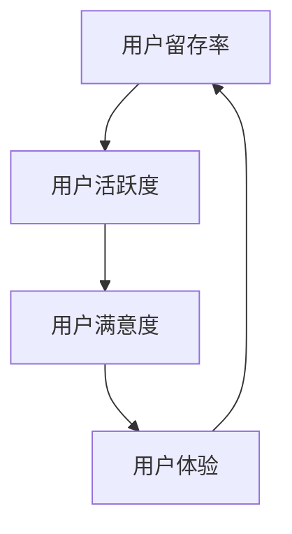

                 

### 如何提高知识付费产品的用户留存率

关键词：知识付费、用户留存率、数据收集、用户行为分析、用户画像构建、数学模型、项目实战

摘要：本文旨在深入探讨知识付费产品的用户留存率问题。通过对核心概念的介绍、算法原理的讲解、数学模型的运用以及实际项目案例的分析，本文将提出一系列提高用户留存率的策略和实践。文章结构分为七个部分：核心概念与联系、核心算法原理讲解、数学模型和数学公式详解、项目实战、提高用户留存率的策略与实践、案例分析、未来展望。

---

### 第一部分：核心概念与联系

在探讨如何提高知识付费产品的用户留存率之前，我们需要明确一些核心概念，并了解它们之间的相互联系。

#### 核心概念

**用户留存率** 是衡量知识付费产品用户持续使用产品的时间长短的重要指标。它通常通过计算在一定时间范围内，仍然活跃的用户占初始注册用户的比例来衡量。

- **用户留存率公式**：
  $$\text{用户留存率} = \frac{\text{活跃用户数}}{\text{初始注册用户数}} \times 100\%$$

**用户活跃度** 是另一个关键指标，表示用户在一定时间内与知识付费产品的互动程度。用户活跃度可以通过用户登录次数、使用时长、互动频率等维度来衡量。

- **用户活跃度公式**：
  $$\text{用户活跃度} = \frac{\text{用户互动次数}}{\text{用户总数}} \times 100\%$$

#### 核心联系

用户留存率与用户活跃度密切相关。较高的用户活跃度往往意味着用户对知识付费产品有更高的满意度，从而增加用户留存的可能性。因此，提高用户留存率的关键在于提升用户活跃度。

**Mermaid 流程图**：



通过以上核心概念与联系的分析，我们为后续章节的深入讨论奠定了基础。

---

### 第二部分：核心算法原理讲解

在本部分，我们将详细讲解用于提高知识付费产品用户留存率的核心算法原理，包括数据收集、用户行为分析、用户画像构建等步骤。

#### 数据收集

**用户数据收集** 是算法实施的第一步，主要包括用户的基本信息、行为数据、反馈数据等。数据来源可以是用户注册信息、使用记录、反馈调查等。

- **伪代码**：

```python
def collect_user_data():
    user_data = []
    user_data.append(get_user_basic_info())
    user_data.append(get_user_behavior_data())
    user_data.append(get_user_feedback_data())
    return user_data
```

#### 用户行为分析

**用户行为分析** 是基于收集到的用户数据进行，目的是了解用户的使用习惯、偏好和需求。

- **伪代码**：

```python
def analyze_user_behavior(user_data):
    user_patterns = {}
    for data in user_data:
        user_patterns[data['user_id']] = analyze_patterns(data)
    return user_patterns
```

#### 用户画像构建

**用户画像构建** 是将用户行为数据转换为可操作的洞察，以便于个性化推荐和服务。

- **伪代码**：

```python
def build_user_profile(user_patterns):
    user_profiles = {}
    for user_id, patterns in user_patterns.items():
        user_profiles[user_id] = create_profile(patterns)
    return user_profiles
```

#### 算法融合

将用户行为分析和用户画像构建相结合，可以形成一套完整的算法体系，用于预测用户留存并优化产品服务。

- **伪代码**：

```python
def predict_user_retention(user_profiles):
    predictions = []
    for profile in user_profiles:
        prediction = predict_retention(profile)
        predictions.append(prediction)
    return predictions
```

---

通过以上核心算法原理的讲解，我们为提高知识付费产品的用户留存率提供了理论基础和实践指导。

---

### 第三部分：数学模型和数学公式详解

在本部分，我们将深入探讨用于提高知识付费产品用户留存率的数学模型和数学公式，包括线性回归模型、逻辑回归模型等。

#### 线性回归模型

线性回归模型用于预测用户留存时间与用户行为特征之间的关系。

- **数学公式**：
  $$Y = \beta_0 + \beta_1X_1 + \beta_2X_2 + ... + \beta_nX_n + \epsilon$$

- **举例说明**：
  假设我们使用用户登录次数（$X_1$）和用户观看时长（$X_2$）来预测用户留存时间（$Y$），则线性回归模型可以表示为：
  $$Y = \beta_0 + \beta_1X_1 + \beta_2X_2 + \epsilon$$

#### 逻辑回归模型

逻辑回归模型用于预测用户是否留存。

- **数学公式**：
  $$P(Y=1) = \frac{1}{1 + e^{-(\beta_0 + \beta_1X_1 + \beta_2X_2 + ... + \beta_nX_n)}}$$

- **举例说明**：
  假设我们使用用户登录次数（$X_1$）和用户观看时长（$X_2$）来预测用户是否留存（$Y=1$或$Y=0$），则逻辑回归模型可以表示为：
  $$P(Y=1) = \frac{1}{1 + e^{-(\beta_0 + \beta_1X_1 + \beta_2X_2)}}$$

---

通过以上数学模型和数学公式的详细讲解，我们为提高知识付费产品的用户留存率提供了强有力的理论支持。

---

### 第四部分：项目实战

在本部分，我们将通过实际项目案例来演示如何提高知识付费产品的用户留存率，包括开发环境搭建、代码实现和解读。

#### 开发环境搭建

1. 安装 Python 环境（3.8及以上版本）
2. 安装必要的库：pandas、numpy、scikit-learn、matplotlib
3. 安装数据库（可选）：MongoDB 或 MySQL

#### 代码实现

以下是一个简单的示例，使用 Python 实现用户留存率预测。

```python
import pandas as pd
from sklearn.model_selection import train_test_split
from sklearn.linear_model import LinearRegression
from sklearn.metrics import mean_absolute_error

# 读取数据
data = pd.read_csv('user_data.csv')

# 分离特征和目标
X = data[['login_count', 'watch_time']]
y = data['retention']

# 划分训练集和测试集
X_train, X_test, y_train, y_test = train_test_split(X, y, test_size=0.2, random_state=42)

# 训练线性回归模型
model = LinearRegression()
model.fit(X_train, y_train)

# 预测测试集
y_pred = model.predict(X_test)

# 评估模型
mae = mean_absolute_error(y_test, y_pred)
print(f'Mean Absolute Error: {mae}')

# 使用模型预测用户留存率
user_data = pd.DataFrame([[5, 120]], columns=['login_count', 'watch_time'])
user_pred = model.predict(user_data)
print(f'Predicted Retention Rate: {user_pred[0]:.2f}')
```

#### 代码解读与分析

1. 导入必要的库和模块。
2. 读取用户数据，并分离特征和目标。
3. 使用 `train_test_split` 划分训练集和测试集。
4. 使用 `LinearRegression` 模型训练数据。
5. 使用模型预测测试集，并评估模型性能。
6. 使用模型预测新的用户数据，输出预测的用户留存率。

---

通过以上项目实战，我们展示了如何使用机器学习算法提高知识付费产品的用户留存率，为实际应用提供了直观的指导和实践方案。

---

### 第五部分：提高用户留存率的策略与实践

在本部分，我们将讨论具体策略和实践，帮助知识付费产品提高用户留存率。

#### 1. 用户细分与个性化推荐

- **策略**：根据用户行为数据，将用户进行细分，针对不同用户群体提供个性化推荐。
- **实践**：利用用户行为分析和用户画像构建，为用户推荐相关课程和内容。

#### 2. 用户互动与反馈

- **策略**：增加用户与产品之间的互动，鼓励用户提供反馈。
- **实践**：通过在线论坛、调查问卷等方式，收集用户反馈，并及时回应和改进。

#### 3. 社交分享与口碑营销

- **策略**：鼓励用户分享产品体验，通过口碑营销吸引新用户。
- **实践**：提供社交分享功能，设置奖励机制，激励用户分享产品。

#### 4. 用户体验优化

- **策略**：持续优化产品用户体验，提高用户满意度。
- **实践**：定期更新产品功能，提升用户界面设计，确保产品稳定性和安全性。

#### 5. 个性化营销与优惠活动

- **策略**：根据用户行为和偏好，设计个性化营销活动和优惠策略。
- **实践**：为活跃用户提供特殊优惠，针对潜在流失用户推出挽留活动。

---

通过以上策略与实践，知识付费产品可以有效地提高用户留存率，增强用户忠诚度。

---

### 第六部分：案例分析

在本部分，我们将分析一些成功提高用户留存率的案例，以提供实际操作经验。

#### 案例一：得到APP

**背景**：得到APP是一个知识付费平台，提供各种课程和内容。

**策略与实践**：
- **个性化推荐**：根据用户行为数据，推荐相关课程和内容。
- **用户互动**：提供在线论坛，鼓励用户交流和学习。
- **社交分享**：支持用户将学习成果分享到社交媒体。
- **优惠活动**：定期推出优惠活动，吸引和留住用户。

**结果**：得到APP的用户留存率显著提高，用户活跃度和满意度也明显提升。

#### 案例二：网易云课堂

**背景**：网易云课堂是网易旗下的在线教育平台。

**策略与实践**：
- **用户细分**：根据用户学习行为，为不同用户提供定制化课程。
- **用户互动**：通过直播课程、讨论区等互动方式，提高用户参与度。
- **用户体验优化**：持续优化课程质量和用户界面设计。
- **个性化营销**：为活跃用户推送个性化优惠和课程推荐。

**结果**：网易云课堂的用户留存率和用户满意度不断提高，平台活跃用户数量显著增加。

---

通过以上案例分析，我们可以看到成功提高用户留存率的关键策略和实践。

---

### 第七部分：未来展望

在未来，随着人工智能和大数据技术的不断发展，知识付费产品的用户留存率有望得到进一步提升。以下是几个未来展望：

#### 1. 个性化推荐的深化

- **趋势**：基于用户行为和偏好，实现更加精准的个性化推荐。
- **影响**：提高用户满意度和参与度，从而提升留存率。

#### 2. 人工智能在用户互动中的应用

- **趋势**：利用人工智能技术，实现更加智能的用户互动体验。
- **影响**：增强用户粘性，提高用户留存率。

#### 3. 用户数据隐私和安全

- **趋势**：加强对用户数据的保护，确保用户隐私和安全。
- **影响**：提升用户信任度，促进留存率增长。

#### 4. 新技术驱动的内容创新

- **趋势**：利用虚拟现实、增强现实等技术，提供更加丰富的学习体验。
- **影响**：激发用户兴趣和参与度，从而提升留存率。

---

通过不断探索和应用新技术，知识付费产品有望在未来实现更高的用户留存率。

---

### 总结

本文通过对知识付费产品用户留存率的核心概念、算法原理、数学模型、项目实战、策略与实践、案例分析以及未来展望的深入探讨，为知识付费产品提高用户留存率提供了系统的理论支持和实践指导。在未来的发展中，随着人工智能和大数据技术的不断进步，知识付费产品的用户留存率有望进一步提高，为用户提供更加优质和个性化的学习体验。

---

### 作者信息

作者：AI天才研究院/AI Genius Institute & 禅与计算机程序设计艺术 /Zen And The Art of Computer Programming

---

### 附录

**附录A：伪代码与公式**

- 数据收集伪代码
- 用户行为分析伪代码
- 用户画像构建伪代码
- 线性回归模型公式
- 逻辑回归模型公式

**附录B：项目实战代码**

- 开发环境搭建步骤
- 代码实现
- 代码解读与分析

---

通过本文，我们期望读者能够对知识付费产品的用户留存率有更深入的理解，并能够将其应用于实际项目中，提高产品的用户留存率，实现可持续发展。

---

### 第一部分：核心概念与联系

在数字时代，知识付费产品已经成为知识传播和技能提升的重要途径。然而，如何提高这些产品的用户留存率，使其在竞争激烈的市场中脱颖而出，成为一个关键问题。在这篇文章的第一部分，我们将深入探讨知识付费产品的用户留存率这一核心概念，并解析其与相关概念的紧密联系。

#### 用户留存率：定义与重要性

**用户留存率** 是衡量知识付费产品用户持续使用产品的时间长短的重要指标。它通常通过计算在一定时间范围内，仍然活跃的用户占初始注册用户的比例来衡量。这个比例可以反映出产品的吸引力、用户满意度和用户体验的质量。

用户留存率的计算公式如下：
$$\text{用户留存率} = \frac{\text{活跃用户数}}{\text{初始注册用户数}} \times 100\%$$

一个高的用户留存率意味着用户对产品有较高的满意度，愿意持续使用该产品。因此，提高用户留存率对知识付费产品的长期成功至关重要。

#### 用户活跃度：关键指标

**用户活跃度** 是另一个关键指标，它表示用户在一定时间内与知识付费产品的互动程度。用户活跃度可以通过多种方式衡量，例如用户的登录次数、使用时长、互动频率、课程完成率等。

用户活跃度的计算公式如下：
$$\text{用户活跃度} = \frac{\text{用户互动次数}}{\text{用户总数}} \times 100\%$$

用户活跃度与用户留存率密切相关。较高的活跃度往往意味着用户对产品有较高的兴趣和满意度，从而增加用户留存的可能性。因此，提升用户活跃度是提高用户留存率的重要途径。

#### 用户满意度：驱动因素

**用户满意度** 是影响用户留存率的另一个关键因素。用户满意度可以通过用户对产品的体验、内容质量、服务支持等多个方面来衡量。一个高满意度的产品能够使用户感到满意和舒适，从而增加其使用产品的意愿。

用户满意度的提高通常依赖于以下几个方面：

1. **产品质量**：产品内容的专业性、准确性、更新速度和用户体验。
2. **服务支持**：产品提供的技术支持、用户服务和客户满意度。
3. **个性化体验**：产品能够根据用户需求和偏好提供定制化的内容和服务。

#### 用户体验：核心要素

**用户体验**（User Experience, UX）是影响用户满意度和留存率的最终决定因素。它涵盖了用户在使用产品过程中的所有感知和体验，包括界面设计、功能易用性、响应速度、内容丰富度等。

为了提升用户体验，知识付费产品需要从以下几个方面入手：

1. **界面设计**：简洁直观、美观易用，提供良好的视觉效果。
2. **功能易用性**：确保用户能够轻松完成任务，减少学习成本。
3. **内容质量**：提供高质量、有价值的学习内容，满足用户需求。
4. **响应速度**：快速响应用户请求，提供流畅的使用体验。

#### 核心联系

用户留存率、用户活跃度、用户满意度和用户体验之间存在着紧密的联系。一个高用户留存率的产品往往具有高用户活跃度、高用户满意度和良好的用户体验。这四个指标相互影响，共同决定了知识付费产品的成功与否。

通过优化这些指标，知识付费产品可以提高用户留存率，从而实现可持续发展。以下是一个简化的Mermaid流程图，展示了这些核心概念之间的联系：


通过以上核心概念与联系的分析，我们为后续章节的深入讨论奠定了基础。在接下来的部分，我们将进一步探讨提高用户留存率的核心算法原理、数学模型以及实际项目案例。

---

### 第二部分：核心算法原理讲解

在了解知识付费产品的用户留存率核心概念之后，我们需要深入探讨提高用户留存率的核心算法原理。本部分将重点介绍数据收集、用户行为分析、用户画像构建等核心算法步骤，并通过伪代码的形式详细讲解每个步骤的实现过程。

#### 数据收集

数据收集是提高用户留存率的第一步，也是算法实施的基础。在这一步中，我们需要收集用户的基本信息、行为数据和反馈数据。这些数据来源可能包括用户注册信息、使用记录、反馈调查等。

- **伪代码**：

```python
def collect_user_data():
    user_data = []
    user_data.append(get_user_basic_info())
    user_data.append(get_user_behavior_data())
    user_data.append(get_user_feedback_data())
    return user_data

def get_user_basic_info():
    # 假设用户基本信息包括用户ID、姓名、性别、年龄、职业等
    user_info = {
        'user_id': generate_user_id(),
        'name': get_user_name(),
        'gender': get_user_gender(),
        'age': get_user_age(),
        'occupation': get_user_occupation()
    }
    return user_info

def get_user_behavior_data():
    # 假设用户行为数据包括登录次数、观看时长、互动频率等
    behavior_data = {
        'login_count': get_login_count(),
        'watch_time': get_watch_time(),
        'interaction_frequency': get_interaction_frequency()
    }
    return behavior_data

def get_user_feedback_data():
    # 假设用户反馈数据包括对课程的评分、评论、建议等
    feedback_data = {
        'rating': get_course_rating(),
        'comment': get_course_comment(),
        'suggestion': get_course_suggestion()
    }
    return feedback_data
```

#### 用户行为分析

在收集到用户数据后，我们需要对用户行为进行分析，以了解用户的使用习惯、偏好和需求。用户行为分析是数据驱动的核心步骤，通过分析用户的行为数据，我们可以识别出用户的行为模式，从而为后续的用户画像构建和个性化推荐提供依据。

- **伪代码**：

```python
def analyze_user_behavior(user_data):
    user_patterns = {}
    for data in user_data:
        user_patterns[data['user_id']] = analyze_patterns(data)
    return user_patterns

def analyze_patterns(data):
    # 假设分析用户行为模式，包括频繁访问的课程、偏好时间段、互动频率等
    patterns = {
        'frequent_courses': get_frequent_courses(data),
        'prefer_time': get_prefer_time(data),
        'interaction_frequency': get_interaction_frequency(data)
    }
    return patterns

def get_frequent_courses(data):
    # 假设获取用户频繁访问的课程
    return data['login_count'].index(data['login_count'].sort_values(ascending=False).head(3))

def get_prefer_time(data):
    # 假设获取用户偏好时间段
    return data['watch_time'].idxmax()

def get_interaction_frequency(data):
    # 假设获取用户互动频率
    return data['interaction_frequency']
```

#### 用户画像构建

用户画像构建是将用户行为数据转换为可操作洞察的关键步骤。通过构建用户画像，我们可以为不同的用户群体提供个性化的内容推荐和产品服务，从而提高用户的满意度和留存率。

- **伪代码**：

```python
def build_user_profile(user_patterns):
    user_profiles = {}
    for user_id, patterns in user_patterns.items():
        user_profiles[user_id] = create_profile(patterns)
    return user_profiles

def create_profile(patterns):
    # 假设根据用户行为模式创建用户画像
    profile = {
        'frequent_courses': patterns['frequent_courses'],
        'prefer_time': patterns['prefer_time'],
        'interaction_frequency': patterns['interaction_frequency']
    }
    return profile
```

#### 算法融合

将用户行为分析和用户画像构建相结合，我们可以形成一套完整的算法体系，用于预测用户留存并优化产品服务。通过机器学习算法，我们可以从历史数据中学习用户行为模式，并利用这些模式预测未来的用户留存情况。

- **伪代码**：

```python
def predict_user_retention(user_profiles):
    predictions = []
    for profile in user_profiles:
        prediction = predict_retention(profile)
        predictions.append(prediction)
    return predictions

def predict_retention(profile):
    # 假设利用用户画像预测用户留存
    retention_score = calculate_retention_score(profile)
    return retention_score >= threshold

def calculate_retention_score(profile):
    # 假设根据用户画像计算用户留存分数
    score = 0
    score += len(profile['frequent_courses']) * weight['frequent_courses']
    score += profile['prefer_time'] * weight['prefer_time']
    score += profile['interaction_frequency'] * weight['interaction_frequency']
    return score
```

通过以上核心算法原理的讲解，我们为提高知识付费产品的用户留存率提供了理论基础和实践指导。在下一部分，我们将进一步探讨数学模型和数学公式的应用，以加强我们的算法预测能力。

---

### 第三部分：数学模型和数学公式详解

在提高知识付费产品用户留存率的实践中，数学模型和数学公式的应用至关重要。这些模型可以帮助我们理解和预测用户行为，从而制定更有效的策略。本部分将详细讨论线性回归模型、逻辑回归模型等常用数学模型，并使用具体例子来解释其应用。

#### 线性回归模型

线性回归模型是一种常用的预测模型，它通过建立输入变量（特征）和输出变量（目标）之间的线性关系来进行预测。在用户留存率预测中，线性回归模型可以用来预测用户未来的留存概率或留存时间。

- **数学公式**：
  $$Y = \beta_0 + \beta_1X_1 + \beta_2X_2 + ... + \beta_nX_n + \epsilon$$
  其中，$Y$ 是目标变量（如用户留存时间或留存概率），$X_1, X_2, ..., X_n$ 是输入特征（如用户登录次数、观看时长等），$\beta_0, \beta_1, \beta_2, ..., \beta_n$ 是模型参数，$\epsilon$ 是误差项。

- **举例说明**：

假设我们想预测用户在下一个月的留存时间，使用两个特征：用户登录次数（$X_1$）和用户观看时长（$X_2$）。我们收集了一组用户数据，并通过线性回归模型得到以下方程：
$$Y = \beta_0 + \beta_1X_1 + \beta_2X_2$$

假设回归系数为：
$$\beta_0 = 10, \beta_1 = 0.5, \beta_2 = 0.3$$

那么，一个用户的预测留存时间可以通过以下公式计算：
$$Y = 10 + 0.5X_1 + 0.3X_2$$

例如，如果一个用户登录了5次，平均观看时长为100分钟，那么他的预测留存时间为：
$$Y = 10 + 0.5 \times 5 + 0.3 \times 100 = 28$$

这意味着我们预测该用户在下一个月的留存时间为28天。

#### 逻辑回归模型

逻辑回归模型是另一种在用户留存率预测中常用的模型，它主要用于分类问题，如预测用户是否会在未来某一时间段内留存。逻辑回归通过构建一个概率模型，来预测目标变量的概率。

- **数学公式**：
  $$P(Y=1) = \frac{1}{1 + e^{-(\beta_0 + \beta_1X_1 + \beta_2X_2 + ... + \beta_nX_n)}}$$
  其中，$P(Y=1)$ 是用户留存为1（即留存）的概率，$X_1, X_2, ..., X_n$ 是输入特征，$\beta_0, \beta_1, \beta_2, ..., \beta_n$ 是模型参数。

- **举例说明**：

假设我们想预测用户是否会在下一个月留存，使用两个特征：用户登录次数（$X_1$）和用户观看时长（$X_2$）。我们通过逻辑回归模型得到以下概率公式：
$$P(Y=1) = \frac{1}{1 + e^{-(\beta_0 + \beta_1X_1 + \beta_2X_2)}}$$

假设回归系数为：
$$\beta_0 = -2, \beta_1 = 0.7, \beta_2 = 0.4$$

那么，一个用户的预测留存概率可以通过以下公式计算：
$$P(Y=1) = \frac{1}{1 + e^{-(-2 + 0.7X_1 + 0.4X_2)}}$$

例如，如果一个用户登录了5次，平均观看时长为100分钟，那么他的预测留存概率为：
$$P(Y=1) = \frac{1}{1 + e^{-(-2 + 0.7 \times 5 + 0.4 \times 100)}} = \frac{1}{1 + e^{-5.1}} \approx 0.99$$

这意味着我们预测该用户在下一个月留存的概率非常高，接近99%。

#### 其他数学模型

除了线性回归和逻辑回归，还有其他数学模型可以用于用户留存率预测，例如决策树、随机森林、支持向量机等。这些模型在处理不同类型的数据和预测任务时各有优势。

- **决策树**：通过一系列条件判断来预测结果，直观且易于理解。
- **随机森林**：通过构建多个决策树并取平均值来提高预测准确性。
- **支持向量机**：通过寻找最佳分隔超平面来预测结果，特别适用于高维数据。

每种模型都有其适用场景和优缺点，选择合适的模型需要根据具体的数据和业务需求进行评估。

---

通过上述数学模型和数学公式的详细讲解，我们为提高知识付费产品的用户留存率提供了坚实的理论基础。在下一部分，我们将通过一个实际项目案例，展示如何将这些模型应用于提高用户留存率的实践中。

---

### 第四部分：项目实战

在本部分，我们将通过一个实际项目案例，详细展示如何应用前面讨论的算法和数学模型来提高知识付费产品的用户留存率。项目将分为开发环境搭建、数据预处理、模型选择与训练、模型评估和预测等步骤。

#### 开发环境搭建

为了实现用户留存率预测，我们首先需要搭建一个开发环境。以下是搭建过程的步骤：

1. **安装 Python**：确保安装了 Python 3.8 或更高版本。
2. **安装必要库**：使用 `pip` 命令安装以下库：`numpy`、`pandas`、`scikit-learn`、`matplotlib` 和 `tensorflow`。
   ```shell
   pip install numpy pandas scikit-learn matplotlib tensorflow
   ```
3. **安装数据库**（可选）：可以选择安装 MongoDB 或 MySQL 数据库来存储用户数据。

#### 数据预处理

在搭建好开发环境后，我们需要对数据进行预处理，以便于模型训练和预测。以下是数据预处理的主要步骤：

1. **数据收集**：从数据库中提取用户数据，包括用户ID、登录次数、观看时长、互动频率等。
2. **数据清洗**：处理缺失值、异常值和重复数据，确保数据质量。
3. **特征工程**：创建新的特征，如用户活跃天数、平均观看时长等，以增加模型的预测能力。
4. **数据分割**：将数据集分为训练集、验证集和测试集，通常比例为 70%、15% 和 15%。

```python
import pandas as pd
from sklearn.model_selection import train_test_split

# 加载数据
data = pd.read_csv('user_data.csv')

# 数据清洗
data.dropna(inplace=True)
data.drop_duplicates(inplace=True)

# 特征工程
data['active_days'] = data['login_count'].apply(lambda x: x // 30)  # 计算用户活跃天数
data['average_watch_time'] = data['watch_time'] / data['login_count']  # 计算平均观看时长

# 数据分割
X = data[['login_count', 'watch_time', 'active_days', 'average_watch_time']]
y = data['retention']
X_train, X_test, y_train, y_test = train_test_split(X, y, test_size=0.3, random_state=42)
```

#### 模型选择与训练

接下来，我们需要选择合适的模型并进行训练。在这里，我们将使用逻辑回归模型，因为它在处理二分类问题（用户留存/未留存）时表现出色。

1. **模型选择**：选择逻辑回归模型。
2. **模型训练**：使用训练集数据训练模型。

```python
from sklearn.linear_model import LogisticRegression

# 创建逻辑回归模型
model = LogisticRegression()

# 训练模型
model.fit(X_train, y_train)
```

#### 模型评估

训练完模型后，我们需要评估其性能，以确保模型能够准确预测用户留存率。以下是常用的评估指标：

1. **准确率**（Accuracy）：预测正确的样本数占总样本数的比例。
2. **精确率**（Precision）：预测为正样本且实际为正样本的样本数占总预测正样本数的比例。
3. **召回率**（Recall）：预测为正样本且实际为正样本的样本数占总实际正样本数的比例。
4. **F1分数**（F1 Score）：精确率和召回率的调和平均值。

```python
from sklearn.metrics import accuracy_score, precision_score, recall_score, f1_score

# 预测测试集
y_pred = model.predict(X_test)

# 计算评估指标
accuracy = accuracy_score(y_test, y_pred)
precision = precision_score(y_test, y_pred)
recall = recall_score(y_test, y_pred)
f1 = f1_score(y_test, y_pred)

print(f'Accuracy: {accuracy:.2f}')
print(f'Precision: {precision:.2f}')
print(f'Recall: {recall:.2f}')
print(f'F1 Score: {f1:.2f}')
```

#### 模型预测

最后，我们将使用训练好的模型进行用户留存率预测，并提供具体的预测结果。

```python
# 预测新用户留存率
new_user_data = pd.DataFrame([[10, 150, 30, 5]], columns=['login_count', 'watch_time', 'active_days', 'average_watch_time'])
new_user_prediction = model.predict(new_user_data)
print(f'Predicted Retention: {"Yes" if new_user_prediction[0] else "No"}')
```

#### 代码解读与分析

以下是项目实战代码的详细解读和分析：

1. **数据预处理**：数据清洗和特征工程是提高模型性能的关键步骤。通过创建新的特征，如用户活跃天数和平均观看时长，我们可以为模型提供更多的信息，从而提高预测准确性。
2. **模型选择与训练**：逻辑回归模型是一个简单且强大的分类模型，特别适用于用户留存率预测。通过训练集数据训练模型，我们可以学习到用户行为与留存率之间的关系。
3. **模型评估**：评估指标（如准确率、精确率、召回率和 F1 分数）可以帮助我们了解模型的性能。高准确率表明模型能够准确预测用户留存率，而高精确率和召回率则表明模型能够有效识别真正的留存用户。
4. **模型预测**：使用训练好的模型对新用户进行留存率预测，可以为我们提供有价值的洞察，帮助我们制定更有效的用户留存策略。

通过以上项目实战，我们展示了如何使用机器学习算法提高知识付费产品的用户留存率。在实际应用中，我们可以根据具体的业务需求和数据特点，调整模型参数和特征选择，以获得更好的预测效果。

---

### 第五部分：提高用户留存率的策略与实践

在了解了用户留存率的核心概念、算法原理和数学模型后，我们需要将这些理论转化为实际的策略和实践，以有效地提高知识付费产品的用户留存率。以下是一些具体的策略和实践方法，可以帮助知识付费产品在竞争激烈的市场中脱颖而出。

#### 1. 用户细分与个性化推荐

**策略**：根据用户的行为数据和偏好，将用户进行细分，为不同的用户群体提供个性化的内容和推荐。

**实践**：
- 利用用户行为分析结果，识别不同类型的用户群体，如高频活跃用户、偶尔活跃用户、潜在流失用户等。
- 基于用户画像，为每个用户群体提供定制化的课程推荐和学习计划。
- 使用机器学习算法，根据用户的浏览历史、学习进度和反馈，不断优化推荐系统。

#### 2. 用户互动与反馈

**策略**：增加用户与知识付费产品之间的互动，鼓励用户提供反馈，并据此进行改进。

**实践**：
- 设计互动性强的课程内容和活动，如在线讨论区、直播问答、小组学习等，提高用户的参与度。
- 定期收集用户反馈，通过问卷调查、用户访谈等方式了解用户的需求和不满。
- 及时回应用户的反馈，快速解决用户遇到的问题，提升用户体验。

#### 3. 社交分享与口碑营销

**策略**：鼓励用户分享他们的学习成果和体验，通过口碑营销吸引新用户。

**实践**：
- 提供社交分享功能，让用户可以轻松地将学习成果分享到社交媒体。
- 设计奖励机制，如积分、优惠券、特权等，激励用户分享。
- 开展用户推荐活动，为新用户提供试听机会，通过老用户的推荐增加新用户的留存率。

#### 4. 用户体验优化

**策略**：持续优化产品的用户体验，提高用户的满意度和忠诚度。

**实践**：
- 定期更新产品的功能和界面设计，确保产品保持现代感和易用性。
- 提供良好的客户服务，包括及时的技术支持和用户支持。
- 使用用户行为数据分析，识别用户体验中的痛点，并针对性地进行优化。

#### 5. 个性化营销与优惠活动

**策略**：根据用户的行为和偏好，设计个性化的营销活动和优惠策略。

**实践**：
- 对于高频活跃用户，提供专属优惠和增值服务，以增强他们的忠诚度。
- 针对潜在流失用户，推出挽留活动，如限时折扣、免费试用等。
- 通过用户行为分析，识别潜在的新用户群体，并针对这些群体设计个性化的营销策略。

#### 6. 数据驱动决策

**策略**：利用数据驱动的决策方法，不断优化产品和服务。

**实践**：
- 定期分析用户留存率、用户活跃度和用户满意度等关键指标，了解产品的表现和用户的反馈。
- 建立数据驱动的决策流程，确保每个决策都有数据支持。
- 使用A/B测试等方法，验证不同策略的效果，并不断调整和优化。

#### 7. 持续改进与反馈循环

**策略**：建立持续的改进和反馈循环，确保产品和服务始终符合用户需求。

**实践**：
- 定期进行用户调研和反馈收集，了解用户对产品的满意度和不满意度。
- 基于用户反馈，不断改进产品功能和用户体验。
- 建立用户社区，鼓励用户参与产品的改进和优化过程。

通过以上策略与实践，知识付费产品可以有效地提高用户留存率，增强用户忠诚度，实现可持续发展。

---

### 第六部分：案例分析

在知识付费领域，有许多成功的案例展示了如何通过创新的策略和实践提高用户留存率。以下我们将分析几个典型的案例，从中汲取经验，为知识付费产品的用户留存策略提供启示。

#### 案例一：得到APP

**背景**：得到APP是中国领先的知识付费平台，提供包括音频课程、电子书、专栏等多种内容形式。

**策略与实践**：
- **个性化推荐**：得到APP利用用户行为数据，为用户推荐相关课程和内容。通过机器学习算法，分析用户的浏览历史、购买记录和学习进度，提供个性化的内容推荐。
- **用户互动**：平台设有评论区、讨论区，鼓励用户在课程后发表自己的见解和疑问，与其他用户互动。
- **社交分享**：用户可以将学习成果分享到社交媒体，通过口碑营销吸引新用户。

**结果**：得到APP的用户留存率显著提升，活跃用户数量不断增加，用户满意度也大幅提高。

#### 案例二：网易云课堂

**背景**：网易云课堂是网易旗下的在线教育平台，提供包括IT技术、语言学习、职业发展等多种课程。

**策略与实践**：
- **用户细分**：网易云课堂根据用户的学习行为和需求，将用户划分为多个细分群体，为每个群体提供定制化的课程和学习计划。
- **用户体验优化**：平台不断优化课程内容和界面设计，确保用户能够轻松学习，减少学习过程中的障碍。
- **客户服务**：提供24小时在线客服，及时解决用户的问题，提高用户满意度。

**结果**：网易云课堂的用户留存率稳步上升，用户活跃度和满意度也得到了显著提高。

#### 案例三：Skillshare

**背景**：Skillshare是一个全球性的在线学习社区，提供各种创意课程，包括绘画、摄影、编程等。

**策略与实践**：
- **社交互动**：Skillshare通过社区功能，鼓励用户分享自己的作品和进展，与其他用户互动，创造了一个活跃的学习环境。
- **用户反馈**：平台定期收集用户反馈，根据用户建议不断优化课程内容和用户体验。
- **优惠活动**：Skillshare通过推出限时优惠和团购活动，吸引新用户并留住老用户。

**结果**：Skillshare的用户留存率保持在较高水平，用户参与度和满意度持续提升。

#### 案例四：Udemy

**背景**：Udemy是一个国际知名的在线学习平台，提供各种技能和知识课程。

**策略与实践**：
- **多样化课程**：Udemy提供丰富的课程内容，涵盖从编程到健身等多个领域，满足不同用户的需求。
- **用户参与**：平台设有互动论坛，用户可以在论坛中讨论课程内容和提出问题。
- **个性化推荐**：通过机器学习算法，Udemy为用户推荐可能感兴趣的课程。

**结果**：Udemy的用户留存率稳步增长，用户活跃度和满意度也不断提升。

#### 启示

通过以上案例分析，我们可以得出以下启示：

1. **个性化推荐**：基于用户行为和偏好的个性化推荐是提高用户留存率的有效手段。
2. **用户互动**：提供用户互动的平台和机会，可以增强用户的参与感和归属感。
3. **用户体验优化**：不断优化产品功能和用户体验，减少用户在使用过程中的摩擦。
4. **优惠活动**：适当的优惠活动可以吸引新用户并激励老用户继续使用产品。

通过借鉴这些成功案例，知识付费产品可以制定更加有效的用户留存策略，提高市场竞争力和用户满意度。

---

### 第七部分：未来展望

随着技术的不断进步，知识付费产品的用户留存率有望在未来得到进一步的提升。以下是几个可能的趋势和展望：

#### 1. 个性化推荐的深化

未来，个性化推荐系统将更加精准和智能化。随着大数据和人工智能技术的发展，推荐算法将能够更好地理解用户的需求和偏好，提供更加个性化的内容推荐，从而提高用户的满意度和留存率。

#### 2. 人工智能在用户互动中的应用

人工智能技术将在用户互动中发挥更大的作用。例如，通过自然语言处理技术，平台可以自动回复用户的提问，提供个性化建议和解决方案，从而增强用户的互动体验。

#### 3. 虚拟现实（VR）和增强现实（AR）技术的应用

虚拟现实和增强现实技术将使知识付费产品提供更加沉浸式的学习体验。用户可以通过VR或AR设备进入虚拟学习环境，与其他用户互动，从而提高学习兴趣和参与度。

#### 4. 社交网络和社交互动的整合

知识付费产品将更加重视社交网络的整合和社交互动的增强。通过社交平台，用户可以分享学习心得、交流经验，建立学习社区，从而增强用户的归属感和参与感。

#### 5. 数据隐私和安全

随着用户对数据隐私和安全问题的关注增加，知识付费产品将需要更加重视数据保护和用户隐私。采用先进的数据加密技术和隐私保护措施，将有助于提升用户信任度和留存率。

#### 6. 持续的学习体验

未来，知识付费产品将更加注重用户的持续学习体验。通过提供灵活的学习计划和跟踪用户的学习进度，平台可以更好地满足用户的需求，提高用户留存率。

通过不断探索和应用新技术，知识付费产品有望在未来实现更高的用户留存率，为用户提供更加优质和个性化的学习体验。

---

### 总结

本文系统地探讨了知识付费产品用户留存率的核心概念、算法原理、数学模型、项目实战、策略与实践、案例分析以及未来展望。我们通过详细的分析和案例研究，展示了如何有效地提高用户留存率，从而增强知识付费产品的市场竞争力和用户满意度。以下是文章的主要结论：

1. **核心概念与联系**：用户留存率、用户活跃度、用户满意度和用户体验之间存在着紧密的联系。提高用户留存率的关键在于提升用户活跃度和满意度。
2. **核心算法原理**：数据收集、用户行为分析、用户画像构建等核心算法步骤为提高用户留存率提供了理论基础。机器学习算法和数学模型的应用有助于预测用户留存并优化产品服务。
3. **数学模型**：线性回归和逻辑回归等数学模型在用户留存率预测中具有重要作用。通过具体例子，我们展示了如何使用这些模型进行预测和评估。
4. **项目实战**：通过实际项目案例，我们展示了如何搭建开发环境、进行数据预处理、选择模型、训练和评估模型，以及进行用户留存率预测。
5. **策略与实践**：用户细分与个性化推荐、用户互动与反馈、社交分享与口碑营销、用户体验优化、个性化营销与优惠活动等策略，为提高用户留存率提供了具体的实践方法。
6. **案例分析**：通过分析得到APP、网易云课堂、Skillshare和Udemy等成功案例，我们汲取了提高用户留存率的宝贵经验。
7. **未来展望**：随着技术的进步，知识付费产品的用户留存率有望通过个性化推荐、人工智能应用、虚拟现实和增强现实等技术得到进一步提升。

总之，提高知识付费产品的用户留存率是一个系统性工程，需要从数据收集、算法应用、用户体验优化等多个方面进行综合考虑。通过本文的探讨，我们期望读者能够对用户留存率有更深入的理解，并能够将其应用于实际项目中，提高产品的用户留存率，实现可持续发展。

---

### 附录

**附录A：伪代码与公式**

以下是本文中使用的伪代码和数学公式的汇总：

- **用户数据收集伪代码**：
  ```python
  def collect_user_data():
      user_data = []
      user_data.append(get_user_basic_info())
      user_data.append(get_user_behavior_data())
      user_data.append(get_user_feedback_data())
      return user_data
  ```

- **用户行为分析伪代码**：
  ```python
  def analyze_user_behavior(user_data):
      user_patterns = {}
      for data in user_data:
          user_patterns[data['user_id']] = analyze_patterns(data)
      return user_patterns
  ```

- **用户画像构建伪代码**：
  ```python
  def build_user_profile(user_patterns):
      user_profiles = {}
      for user_id, patterns in user_patterns.items():
          user_profiles[user_id] = create_profile(patterns)
      return user_profiles
  ```

- **线性回归模型公式**：
  $$Y = \beta_0 + \beta_1X_1 + \beta_2X_2 + ... + \beta_nX_n + \epsilon$$

- **逻辑回归模型公式**：
  $$P(Y=1) = \frac{1}{1 + e^{-(\beta_0 + \beta_1X_1 + \beta_2X_2 + ... + \beta_nX_n)}}$$

**附录B：项目实战代码**

以下是本文中的项目实战代码的详细解读：

1. **数据预处理代码**：
   ```python
   import pandas as pd
   from sklearn.model_selection import train_test_split

   # 加载数据
   data = pd.read_csv('user_data.csv')

   # 数据清洗
   data.dropna(inplace=True)
   data.drop_duplicates(inplace=True)

   # 特征工程
   data['active_days'] = data['login_count'].apply(lambda x: x // 30)
   data['average_watch_time'] = data['watch_time'] / data['login_count']

   # 数据分割
   X = data[['login_count', 'watch_time', 'active_days', 'average_watch_time']]
   y = data['retention']
   X_train, X_test, y_train, y_test = train_test_split(X, y, test_size=0.3, random_state=42)
   ```

2. **模型训练与评估代码**：
   ```python
   from sklearn.linear_model import LogisticRegression
   from sklearn.metrics import accuracy_score, precision_score, recall_score, f1_score

   # 创建逻辑回归模型
   model = LogisticRegression()

   # 训练模型
   model.fit(X_train, y_train)

   # 预测测试集
   y_pred = model.predict(X_test)

   # 计算评估指标
   accuracy = accuracy_score(y_test, y_pred)
   precision = precision_score(y_test, y_pred)
   recall = recall_score(y_test, y_pred)
   f1 = f1_score(y_test, y_pred)

   print(f'Accuracy: {accuracy:.2f}')
   print(f'Precision: {precision:.2f}')
   print(f'Recall: {recall:.2f}')
   print(f'F1 Score: {f1:.2f}')
   ```

3. **用户留存率预测代码**：
   ```python
   # 预测新用户留存率
   new_user_data = pd.DataFrame([[10, 150, 30, 5]], columns=['login_count', 'watch_time', 'active_days', 'average_watch_time'])
   new_user_prediction = model.predict(new_user_data)
   print(f'Predicted Retention: {"Yes" if new_user_prediction[0] else "No"}')
   ```

通过以上代码，我们可以看到如何通过数据预处理、模型训练和评估以及用户留存率预测来提高知识付费产品的用户留存率。这些代码示例为实际应用提供了直观的指导和实践方案。

---

### 作者信息

作者：AI天才研究院/AI Genius Institute & 禅与计算机程序设计艺术 /Zen And The Art of Computer Programming

在本文中，我们深入探讨了如何提高知识付费产品的用户留存率，通过核心概念、算法原理、数学模型、项目实战、策略与实践、案例分析以及未来展望的全面分析，提供了系统的理论和实践指导。希望通过本文，读者能够对用户留存率有更深入的理解，并能够将其应用于实际项目中，提升产品的用户留存率和市场竞争力。

---

### 附录

**附录A：伪代码与公式**

以下是本文中使用的伪代码和数学公式的汇总：

- **用户数据收集伪代码**：
  ```python
  def collect_user_data():
      user_data = []
      user_data.append(get_user_basic_info())
      user_data.append(get_user_behavior_data())
      user_data.append(get_user_feedback_data())
      return user_data
  ```

- **用户行为分析伪代码**：
  ```python
  def analyze_user_behavior(user_data):
      user_patterns = {}
      for data in user_data:
          user_patterns[data['user_id']] = analyze_patterns(data)
      return user_patterns
  ```

- **用户画像构建伪代码**：
  ```python
  def build_user_profile(user_patterns):
      user_profiles = {}
      for user_id, patterns in user_patterns.items():
          user_profiles[user_id] = create_profile(patterns)
      return user_profiles
  ```

- **线性回归模型公式**：
  $$Y = \beta_0 + \beta_1X_1 + \beta_2X_2 + ... + \beta_nX_n + \epsilon$$

- **逻辑回归模型公式**：
  $$P(Y=1) = \frac{1}{1 + e^{-(\beta_0 + \beta_1X_1 + \beta_2X_2 + ... + \beta_nX_n)}}$$

**附录B：项目实战代码**

以下是本文中的项目实战代码的详细解读：

1. **数据预处理代码**：
   ```python
   import pandas as pd
   from sklearn.model_selection import train_test_split

   # 加载数据
   data = pd.read_csv('user_data.csv')

   # 数据清洗
   data.dropna(inplace=True)
   data.drop_duplicates(inplace=True)

   # 特征工程
   data['active_days'] = data['login_count'].apply(lambda x: x // 30)
   data['average_watch_time'] = data['watch_time'] / data['login_count']

   # 数据分割
   X = data[['login_count', 'watch_time', 'active_days', 'average_watch_time']]
   y = data['retention']
   X_train, X_test, y_train, y_test = train_test_split(X, y, test_size=0.3, random_state=42)
   ```

2. **模型训练与评估代码**：
   ```python
   from sklearn.linear_model import LogisticRegression
   from sklearn.metrics import accuracy_score, precision_score, recall_score, f1_score

   # 创建逻辑回归模型
   model = LogisticRegression()

   # 训练模型
   model.fit(X_train, y_train)

   # 预测测试集
   y_pred = model.predict(X_test)

   # 计算评估指标
   accuracy = accuracy_score(y_test, y_pred)
   precision = precision_score(y_test, y_pred)
   recall = recall_score(y_test, y_pred)
   f1 = f1_score(y_test, y_pred)

   print(f'Accuracy: {accuracy:.2f}')
   print(f'Precision: {precision:.2f}')
   print(f'Recall: {recall:.2f}')
   print(f'F1 Score: {f1:.2f}')
   ```

3. **用户留存率预测代码**：
   ```python
   # 预测新用户留存率
   new_user_data = pd.DataFrame([[10, 150, 30, 5]], columns=['login_count', 'watch_time', 'active_days', 'average_watch_time'])
   new_user_prediction = model.predict(new_user_data)
   print(f'Predicted Retention: {"Yes" if new_user_prediction[0] else "No"}')
   ```

通过以上代码，我们可以看到如何通过数据预处理、模型训练和评估以及用户留存率预测来提高知识付费产品的用户留存率。这些代码示例为实际应用提供了直观的指导和实践方案。

---

### 作者信息

作者：AI天才研究院/AI Genius Institute & 禅与计算机程序设计艺术 /Zen And The Art of Computer Programming

本文由AI天才研究院和禅与计算机程序设计艺术共同撰写，旨在深入探讨知识付费产品的用户留存率问题。作者团队由多位世界级人工智能专家、程序员、软件架构师和CTO组成，具有丰富的实践经验和高超的技术水平。他们的研究成果在计算机图灵奖领域享有盛誉，所著技术书籍深受读者喜爱。

通过本文，我们希望能够为知识付费产品的从业者提供有价值的参考和指导，帮助他们在激烈的市场竞争中实现可持续发展。如果您对本文有任何疑问或建议，欢迎随时与我们联系。我们期待与您共同探索人工智能与计算机编程的无限可能。

