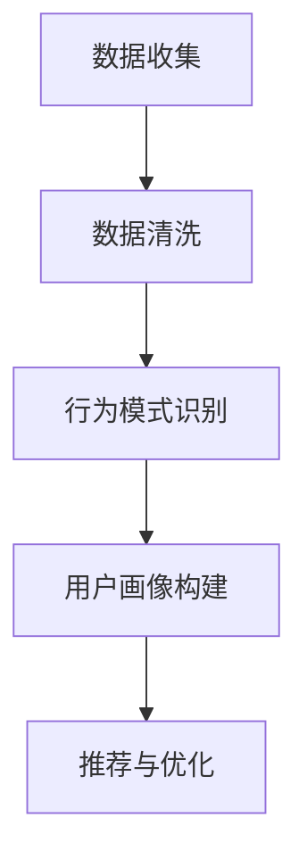
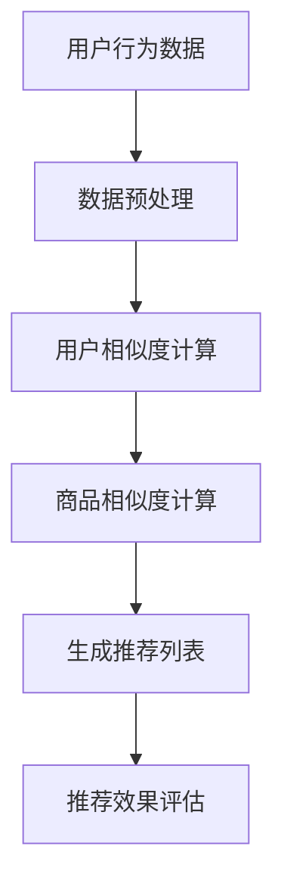
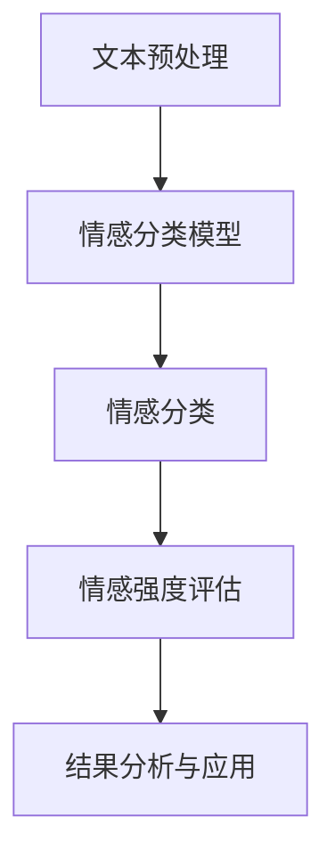

                 

### 《如何通过AI优化用户购物体验》

#### 关键词：人工智能、购物体验、用户行为分析、推荐系统、情感分析、个性化购物、AI优化

#### 摘要：
本文旨在探讨如何通过人工智能（AI）技术优化用户的购物体验。我们将从AI技术的基础开始，深入解析购物体验优化的核心概念和AI应用，通过项目实战展示AI在购物体验优化中的实际应用，并总结AI购物体验优化的策略、问题和未来展望。

---

### 目录大纲

#### 第一部分：AI与购物体验概述

##### 第1章：AI技术基础

- **1.1 AI与购物体验的关系**
- **1.2 购物体验优化的AI技术**
- **1.3 购物体验优化的现状与趋势**

##### 第2章：购物体验优化的核心概念

- **2.1 用户行为分析**
- **2.2 商品推荐系统**
- **2.3 情感分析**
- **2.4 个性化购物体验**

#### 第二部分：AI在购物体验中的应用

##### 第3章：用户行为分析

- **3.1 用户数据分析**
- **3.2 用户行为预测**
- **3.3 用户画像构建**

##### 第4章：商品推荐系统

- **4.1 商品推荐算法**
- **4.2 推荐系统评价标准**
- **4.3 实际案例：基于协同过滤的推荐系统**

##### 第5章：情感分析

- **5.1 情感分析技术**
- **5.2 情感分析应用**
- **5.3 实际案例：评论情感分析**

##### 第6章：个性化购物体验

- **6.1 个性化体验的实现**
- **6.2 个性化体验的优势**
- **6.3 实际案例：基于用户偏好的个性化推荐**

#### 第三部分：AI购物体验优化项目实战

##### 第7章：项目实战一：构建用户行为预测模型

- **7.1 项目背景与目标**
- **7.2 数据收集与预处理**
- **7.3 模型选择与训练**
- **7.4 模型评估与优化**

##### 第8章：项目实战二：搭建商品推荐系统

- **8.1 项目背景与目标**
- **8.2 数据集介绍**
- **8.3 推荐算法选择与实现**
- **8.4 推荐系统性能优化**

##### 第9章：项目实战三：实施情感分析

- **9.1 项目背景与目标**
- **9.2 数据集介绍**
- **9.3 情感分析算法选择与实现**
- **9.4 情感分析结果解读与应用**

##### 第10章：项目实战四：优化个性化购物体验

- **10.1 项目背景与目标**
- **10.2 数据收集与处理**
- **10.3 个性化推荐算法实现**
- **10.4 个性化购物体验效果评估**

#### 第四部分：AI购物体验优化总结与展望

##### 第11章：AI购物体验优化的总结

- **11.1 优化策略与原则**
- **11.2 存在的问题与挑战**
- **11.3 未来发展趋势**

##### 第12章：AI购物体验优化的未来展望

- **12.1 技术发展趋势**
- **12.2 应用场景拓展**
- **12.3 潜在的商业价值**

#### 附录

##### 附录A：相关算法与技术的Mermaid流程图

- **A.1 用户行为分析流程图**
- **A.2 商品推荐系统流程图**
- **A.3 情感分析流程图**

##### 附录B：项目实战代码示例

- **B.1 用户行为预测模型代码**
- **B.2 商品推荐系统代码**
- **B.3 情感分析代码**

##### 附录C：AI购物体验优化参考资料

- **C.1 相关研究论文**
- **C.2 实际项目案例**
- **C.3 开发工具与框架介绍**


### 第一部分：AI与购物体验概述

#### 第1章：AI技术基础

##### 1.1 AI与购物体验的关系

人工智能（AI）是计算机科学的一个分支，专注于模拟、延伸和扩展人类的智能。在购物体验中，AI技术能够通过分析用户行为、推荐商品、情感分析等多种方式提升用户体验。具体来说，AI在购物体验中的作用主要体现在以下几个方面：

1. **个性化推荐**：通过用户的历史行为和偏好数据，AI可以为用户推荐个性化的商品，提高购物满意度和转化率。
2. **用户行为分析**：AI可以帮助商家理解用户在购物过程中的行为模式，从而优化产品和服务，提升用户粘性。
3. **情感分析**：通过对用户评论、反馈进行情感分析，AI可以识别用户的态度和情绪，为商家提供改进产品和服务的依据。
4. **智能客服**：利用自然语言处理技术，AI可以构建智能客服系统，提高客服效率和用户体验。

##### 1.2 购物体验优化的AI技术

购物体验优化涉及到多种AI技术，主要包括：

1. **机器学习与深度学习**：这些技术可以处理大量用户数据，从中提取有用信息，用于个性化推荐和用户行为分析。
2. **自然语言处理（NLP）**：NLP技术可以用于情感分析和智能客服，帮助理解用户的语言意图和情感状态。
3. **推荐系统**：推荐系统利用协同过滤、基于内容的推荐等算法，为用户推荐合适的商品。
4. **用户画像**：通过分析用户的历史行为和偏好，构建用户画像，以便提供更加个性化的服务。

##### 1.3 购物体验优化的现状与趋势

当前，AI在购物体验优化中的应用已经相当广泛，许多电商企业开始采用AI技术来提升用户体验。以下是一些现状与趋势：

1. **个性化推荐普及**：越来越多的电商平台开始采用个性化推荐系统，以提高用户满意度和转化率。
2. **情感分析技术成熟**：随着NLP技术的发展，情感分析技术在电商领域的应用越来越成熟，能够为商家提供更加深入的客户洞察。
3. **智能客服广泛应用**：智能客服系统逐渐成为电商企业的标配，提高了客户服务效率和用户体验。
4. **技术应用深入**：AI技术在电商领域的应用正在从表层扩展到更深层次，如通过深度学习技术进行商品识别和推荐。
5. **趋势预测**：利用AI技术，电商平台可以预测未来的购物趋势，为供应链管理和库存优化提供支持。

#### 第2章：购物体验优化的核心概念

##### 2.1 用户行为分析

用户行为分析是指通过分析用户在购物过程中的行为数据，如浏览记录、购买记录、评论等，以了解用户的购物偏好和习惯。这一分析过程通常包括以下几个步骤：

1. **数据收集**：收集用户在电商平台上的行为数据，包括浏览记录、购买记录、评论等。
2. **数据预处理**：对收集到的数据进行清洗、去噪和格式化，以便进行进一步分析。
3. **行为模式识别**：利用统计分析或机器学习算法，识别用户的行为模式，如购物频率、购买金额等。
4. **用户画像构建**：基于行为模式，构建用户的画像，包括用户属性、兴趣偏好等。

用户行为分析对于提升购物体验具有重要意义：

1. **个性化推荐**：通过分析用户行为，可以为用户提供个性化的商品推荐，提高购物满意度。
2. **优化产品和服务**：了解用户行为可以帮助商家优化产品和服务，提升用户粘性。
3. **需求预测**：用户行为分析可以帮助电商平台预测未来的购物需求，为供应链管理和库存优化提供支持。

##### 2.2 商品推荐系统

商品推荐系统是购物体验优化的重要工具，其核心目标是通过分析用户的历史行为和偏好，为用户推荐合适的商品。商品推荐系统通常包括以下几个主要部分：

1. **推荐算法**：推荐算法是商品推荐系统的核心，常见的算法有协同过滤、基于内容的推荐、混合推荐等。协同过滤算法通过分析用户间的相似性进行推荐，而基于内容的推荐则通过分析商品的属性进行推荐。
2. **推荐结果生成**：根据用户的历史行为和偏好，推荐算法生成推荐结果，包括推荐的商品列表和排序。
3. **推荐效果评估**：通过评估推荐系统的效果，如点击率、转化率等指标，优化推荐算法和策略。

商品推荐系统在提升购物体验方面具有显著作用：

1. **提高用户满意度**：通过个性化的商品推荐，用户可以更快地找到自己需要的商品，提高购物满意度。
2. **增加转化率**：推荐系统能够引导用户尝试新的商品，从而增加转化率。
3. **降低流失率**：通过推荐用户感兴趣的商品，可以减少用户流失，提高用户粘性。

##### 2.3 情感分析

情感分析是指通过自然语言处理技术，分析文本中的情感倾向和情感强度，以了解用户的态度和情绪。情感分析在购物体验优化中具有重要作用：

1. **用户反馈分析**：通过对用户评论、反馈进行情感分析，可以了解用户的满意度和不满意度，为产品改进提供依据。
2. **情感营销**：了解用户的情感状态，商家可以制定更加有效的营销策略，提升用户体验。
3. **风险预警**：通过情感分析，可以及时发现用户的负面情绪，从而采取相应的措施，避免潜在的风险。

情感分析的基本流程包括：

1. **文本预处理**：对用户评论、反馈等文本进行清洗、去噪和分词，以便进行进一步分析。
2. **情感分类**：利用情感分类模型，将文本分类为正面、中性或负面情感。
3. **情感强度评估**：通过评估情感分类的准确性和情感强度的分布，对情感分析结果进行评估和优化。

##### 2.4 个性化购物体验

个性化购物体验是指通过分析用户的历史行为和偏好，为用户提供个性化的购物体验。个性化购物体验的实现主要包括以下几个方面：

1. **用户画像构建**：通过用户行为数据，构建详细的用户画像，包括用户属性、兴趣偏好等。
2. **个性化推荐**：基于用户画像，为用户推荐个性化的商品、优惠和活动。
3. **个性化界面**：根据用户偏好，为用户定制购物界面和购物流程。

个性化购物体验的优势：

1. **提高用户满意度**：通过个性化的服务，满足用户个性化需求，提高用户满意度。
2. **增加转化率**：个性化推荐能够引导用户尝试新的商品，从而增加转化率。
3. **降低流失率**：通过个性化的服务，减少用户流失，提高用户粘性。

### 第二部分：AI在购物体验中的应用

#### 第3章：用户行为分析

##### 3.1 用户数据分析

用户数据分析是用户行为分析的基础，主要通过收集和分析用户在电商平台上的行为数据，以了解用户的购物偏好和习惯。用户数据分析主要包括以下几个步骤：

1. **数据收集**：通过网站日志、点击流数据、购买记录等方式，收集用户在电商平台上的行为数据。
2. **数据预处理**：对收集到的数据进行清洗、去噪和格式化，确保数据的质量和一致性。
3. **数据存储**：将预处理后的数据存储在数据库中，以便进行进一步分析。

在用户数据分析中，常用的数据类型包括：

1. **浏览记录**：记录用户在平台上的浏览行为，如浏览时间、浏览路径、浏览商品等。
2. **购买记录**：记录用户的购买行为，包括购买时间、购买商品、购买金额等。
3. **评论和反馈**：记录用户对商品的评价和反馈，包括正面评价、负面评价等。

用户数据分析的主要目的是：

1. **了解用户行为模式**：通过分析用户的历史行为数据，了解用户的购物习惯和偏好，为个性化推荐和用户画像构建提供依据。
2. **优化产品和服务**：通过分析用户行为数据，发现用户的需求和痛点，从而优化产品和服务，提升用户体验。
3. **需求预测**：通过分析用户行为数据，预测未来的购物趋势和需求，为供应链管理和库存优化提供支持。

##### 3.2 用户行为预测

用户行为预测是用户行为分析的一个重要应用，通过分析用户的历史行为数据，预测用户未来的行为。用户行为预测的主要目的是：

1. **优化推荐系统**：通过预测用户未来的行为，可以优化推荐系统的推荐效果，提高推荐的相关性和准确性。
2. **提升用户体验**：通过预测用户的行为，可以为用户提供个性化的购物体验，提高用户满意度和转化率。
3. **降低流失率**：通过预测用户流失的倾向，可以采取相应的措施，降低用户流失率，提高用户粘性。

用户行为预测的方法主要包括：

1. **机器学习模型**：利用机器学习算法，如回归分析、决策树、神经网络等，建立用户行为预测模型。
2. **时间序列分析**：通过分析用户行为的时间序列数据，预测用户未来的行为趋势。
3. **深度学习模型**：利用深度学习算法，如循环神经网络（RNN）、长短期记忆网络（LSTM）等，对用户行为进行预测。

用户行为预测的具体流程包括：

1. **数据收集和预处理**：收集用户的历史行为数据，并进行数据预处理，包括数据清洗、去噪、特征提取等。
2. **模型选择和训练**：根据用户行为预测的目标，选择合适的机器学习模型或深度学习模型，并进行模型训练。
3. **模型评估和优化**：通过评估模型的效果，如准确率、召回率、F1值等，对模型进行优化和调整。
4. **预测和部署**：将训练好的模型应用于实际场景，进行用户行为预测，并将预测结果应用于推荐系统和用户界面。

##### 3.3 用户画像构建

用户画像构建是通过分析用户的历史行为数据，构建一个关于用户特征和兴趣偏好的综合描述。用户画像的主要目的是：

1. **个性化推荐**：基于用户画像，为用户提供个性化的商品推荐和优惠活动。
2. **营销策略制定**：通过分析用户画像，为商家提供有针对性的营销策略，提高营销效果。
3. **用户体验优化**：根据用户画像，优化用户的购物体验，提高用户满意度和粘性。

用户画像构建的主要步骤包括：

1. **数据收集和预处理**：收集用户的历史行为数据，包括浏览记录、购买记录、评论等，并进行数据预处理，包括数据清洗、去噪、特征提取等。
2. **特征工程**：通过特征工程，提取用户行为数据中的关键特征，如浏览频率、购买金额、评价情感等。
3. **用户分类和标签**：根据用户特征，将用户进行分类和打标签，如新用户、活跃用户、沉默用户等。
4. **用户画像构建**：将用户分类和标签信息整合，构建用户画像，包括用户属性、兴趣偏好、行为特征等。

用户画像的构建方法主要包括：

1. **基于规则的方法**：通过定义一系列规则，对用户行为数据进行分析，构建用户画像。
2. **基于机器学习的方法**：利用机器学习算法，如聚类分析、分类算法等，对用户行为数据进行分析，构建用户画像。
3. **基于深度学习的方法**：利用深度学习算法，如神经网络、卷积神经网络（CNN）、循环神经网络（RNN）等，对用户行为数据进行分析，构建用户画像。

用户画像的应用场景包括：

1. **个性化推荐**：基于用户画像，为用户提供个性化的商品推荐和优惠活动，提高用户满意度和转化率。
2. **营销策略制定**：通过分析用户画像，为商家提供有针对性的营销策略，提高营销效果。
3. **用户体验优化**：根据用户画像，优化用户的购物体验，提高用户满意度和粘性。
4. **客户关系管理**：通过用户画像，了解用户的偏好和行为模式，建立良好的客户关系，提高客户忠诚度。

#### 第4章：商品推荐系统

##### 4.1 商品推荐算法

商品推荐系统是购物体验优化的重要工具，其核心任务是向用户推荐他们可能感兴趣的商品。商品推荐算法是推荐系统的核心组成部分，根据不同的推荐策略和数据来源，可以分为以下几种常见的推荐算法：

1. **基于内容的推荐（Content-Based Filtering）**：
   - **原理**：基于商品的属性和内容进行推荐，即根据用户过去喜欢的商品特征，寻找具有相似特征的其他商品进行推荐。
   - **优点**：推荐结果准确，能够为用户发现全新的、与兴趣相关的新商品。
   - **缺点**：对于稀疏数据集效果较差，无法理解用户之间复杂的关联关系。

2. **协同过滤推荐（Collaborative Filtering）**：
   - **用户基于的协同过滤（User-Based）**：
     - **原理**：通过计算用户之间的相似度，找到与目标用户相似的其他用户，推荐这些用户喜欢的商品。
     - **优点**：能够处理稀疏数据，发现新的兴趣点。
     - **缺点**：对于新用户效果较差，无法理解用户和商品之间的内在联系。
   - **物品基于的协同过滤（Item-Based）**：
     - **原理**：通过计算商品之间的相似度，找到与用户过去购买或浏览的商品相似的其他商品进行推荐。
     - **优点**：推荐结果直观，能够发现新商品。
     - **缺点**：对新用户效果较差，易受数据噪声影响。

3. **混合推荐（Hybrid Recommendation）**：
   - **原理**：结合基于内容和协同过滤的推荐，利用两种方法的优点，提高推荐效果。
   - **优点**：能够综合不同推荐策略的优势，提高推荐效果。
   - **缺点**：算法复杂度较高，需要更多的计算资源。

4. **基于模型的推荐（Model-Based Recommendation）**：
   - **原理**：通过建立用户和商品之间的数学模型，预测用户对商品的潜在兴趣，进行推荐。
   - **优点**：能够处理大规模数据，适应性强。
   - **缺点**：模型训练复杂，对数据质量要求高。

##### 4.2 推荐系统评价标准

推荐系统的评价标准是衡量推荐系统性能的重要指标，常用的评价标准包括：

1. **准确率（Precision）**：
   - **定义**：准确率是指推荐结果中实际用户感兴趣的物品所占的比例。
   - **优点**：能够直接反映推荐结果的准确性。
   - **缺点**：过于关注正面结果，可能忽视其他重要的信息。

2. **召回率（Recall）**：
   - **定义**：召回率是指推荐结果中用户实际感兴趣的物品被推荐出的比例。
   - **优点**：能够全面反映推荐系统的效果，特别是对于新用户和长尾用户。
   - **缺点**：容易受到数据噪声的影响。

3. **F1值（F1-Score）**：
   - **定义**：F1值是精确率和召回率的加权平均，用于综合评价推荐系统的效果。
   - **优点**：能够全面反映推荐系统的性能。
   - **缺点**：过于关注平衡，可能忽视单一指标的重要性。

4. **覆盖度（Coverage）**：
   - **定义**：覆盖度是指推荐结果中包含的物品种类数与所有可能物品种类数的比例。
   - **优点**：能够反映推荐系统的多样性。
   - **缺点**：过于关注多样性，可能忽视用户兴趣的准确性。

5. **新颖度（Novelty）**：
   - **定义**：新颖度是指推荐结果中用户未接触过的物品的比例。
   - **优点**：能够提高用户的新鲜感，增加用户的惊喜感。
   - **缺点**：过于关注新颖性，可能忽视用户实际需求。

##### 4.3 实际案例：基于协同过滤的推荐系统

以下是一个基于协同过滤的推荐系统实现的实际案例：

1. **项目背景**：
   - **目标**：构建一个电影推荐系统，根据用户对电影的评分数据，为用户推荐他们可能感兴趣的电影。
   - **数据集**：使用MovieLens数据集，该数据集包含用户对电影的评分数据。

2. **数据预处理**：
   - **数据收集**：从MovieLens网站下载评分数据，包括用户ID、电影ID、评分等。
   - **数据清洗**：去除评分数据中的缺失值和异常值，确保数据的质量。

3. **用户和电影的表示**：
   - **用户表示**：使用用户-电影评分矩阵，将用户表示为用户特征向量。
   - **电影表示**：使用电影-用户评分矩阵，将电影表示为电影特征向量。

4. **相似度计算**：
   - **用户相似度计算**：计算用户之间的相似度，使用余弦相似度或皮尔逊相关系数。
   - **电影相似度计算**：计算电影之间的相似度，使用余弦相似度或皮尔逊相关系数。

5. **推荐生成**：
   - **用户基于的协同过滤**：根据用户相似度，为每个用户推荐与相似用户喜欢的电影。
   - **物品基于的协同过滤**：根据电影相似度，为用户推荐与用户过去喜欢的电影相似的电影。

6. **推荐结果评估**：
   - **准确率、召回率、F1值**：使用MovieLens数据集中的测试集，评估推荐系统的效果。
   - **新颖度、覆盖度**：评估推荐系统的多样性和新颖度。

7. **代码实现**（伪代码）：

```python
# 加载数据
user_ratings_matrix = load_movie_lens_data()

# 计算用户相似度
user_similarity_matrix = compute_user_similarity(user_ratings_matrix)

# 计算电影相似度
item_similarity_matrix = compute_item_similarity(user_ratings_matrix)

# 用户基于的协同过滤推荐
for user_id in test_user_ids:
    similar_users = get_similar_users(user_id, user_similarity_matrix)
    recommended_movies = []
    for similar_user_id in similar_users:
        rated_movies = get_rated_movies(similar_user_id, user_ratings_matrix)
        recommended_movies += rated_movies
    recommended_movies = remove_duplicates(recommended_movies)
    generate_recommendations(user_id, recommended_movies)

# 物品基于的协同过滤推荐
for user_id in test_user_ids:
    rated_movies = get_rated_movies(user_id, user_ratings_matrix)
    similar_movies = get_similar_movies(rated_movies, item_similarity_matrix)
    recommended_movies = remove_duplicates(similar_movies)
    generate_recommendations(user_id, recommended_movies)

# 评估推荐系统
evaluate_recommendations(test_user_ids, recommended_movies, test_data)
```

通过上述案例，我们可以看到基于协同过滤的推荐系统是如何实现和评估的。在实际应用中，推荐系统可以根据具体需求和数据集的特点，选择合适的推荐算法和评价标准，以实现最佳的推荐效果。

#### 第5章：情感分析

##### 5.1 情感分析技术

情感分析是指通过自然语言处理技术，对文本中的情感倾向和情感强度进行分析，以了解文本作者的情绪和态度。情感分析技术在购物体验优化中具有重要作用，可以帮助商家了解用户对商品和服务的情感反应，从而改进产品和服务，提高用户满意度。

情感分析的基本流程包括以下几个步骤：

1. **文本预处理**：对原始文本进行清洗、去噪和分词，以便进行进一步分析。清洗过程包括去除标点符号、停用词过滤、词干提取等。
2. **情感分类**：使用情感分类模型，将文本分类为正面、中性或负面情感。情感分类模型可以是基于规则的、机器学习模型或深度学习模型。
3. **情感强度评估**：通过评估情感分类的准确性和情感强度的分布，对情感分析结果进行评估和优化。

情感分析技术的主要类型包括：

1. **基于规则的方法**：通过定义一系列规则，对文本进行情感分类和强度评估。
2. **基于机器学习的方法**：利用机器学习算法，如朴素贝叶斯、支持向量机（SVM）等，进行情感分类和强度评估。
3. **基于深度学习的方法**：利用深度学习算法，如卷积神经网络（CNN）、循环神经网络（RNN）等，进行情感分类和强度评估。

##### 5.2 情感分析应用

情感分析技术在购物体验优化中的应用非常广泛，主要包括以下几个方面：

1. **用户反馈分析**：通过对用户评论、反馈等文本进行分析，了解用户的满意度和不满意度，为产品改进提供依据。例如，可以识别用户对商品的质量、服务、价格等方面的情感倾向，从而发现用户痛点，优化产品和服务。
2. **情感营销**：通过了解用户的情感状态，商家可以制定更加有效的情感营销策略，提升用户体验。例如，可以针对用户的情感需求，设计情感化的广告和促销活动，提高用户的参与度和忠诚度。
3. **情感预警**：通过情感分析，可以及时发现用户的负面情绪，从而采取相应的措施，避免潜在的风险。例如，可以识别用户对商品或服务的投诉和不满，及时处理用户问题，防止用户流失。
4. **用户画像**：通过情感分析，可以构建用户的情感画像，包括用户情感偏好、情感稳定性等，为个性化推荐和用户服务提供依据。

##### 5.3 实际案例：评论情感分析

以下是一个评论情感分析的实际案例：

1. **项目背景**：
   - **目标**：构建一个评论情感分析系统，对电商平台用户对商品的评论进行分析，了解用户的满意度和不满意度。
   - **数据集**：使用某电商平台的用户评论数据，包括评论内容、用户评分等。

2. **数据预处理**：
   - **数据收集**：从电商平台下载用户评论数据，包括评论内容、用户评分等。
   - **数据清洗**：去除评论中的标点符号、停用词，对评论进行分词。

3. **情感分类模型**：
   - **模型选择**：选择一个基于深度学习的情感分类模型，如文本分类模型。
   - **模型训练**：使用预训练的文本分类模型，对评论进行情感分类训练。

4. **情感强度评估**：
   - **模型评估**：使用测试集评估情感分类模型的准确性。
   - **情感强度评估**：根据评论分类结果，评估评论的情感强度，如正面情感、负面情感的强度分布。

5. **结果分析**：
   - **用户满意度分析**：通过分析正面情感和负面情感的分布，了解用户的满意度。
   - **情感预警**：识别负面情感，及时发现用户投诉和不满，采取相应的措施。

6. **代码实现**（伪代码）：

```python
# 加载数据
review_data = load_user_reviews()

# 数据预处理
cleaned_reviews = preprocess_reviews(review_data)

# 情感分类模型
emotion_classifier = train_emotion_classifier(cleaned_reviews)

# 情感分类与强度评估
classified_reviews = classify_reviews(emotion_classifier, cleaned_reviews)
emotion_intensity = assess_emotion_intensity(classified_reviews)

# 结果分析
user_satisfaction = analyze_user_satisfaction(classified_reviews)
emotional_warnings = identify_emotional_warnings(classified_reviews)

# 输出结果
print("User Satisfaction Analysis:", user_satisfaction)
print("Emotional Warnings:", emotional_warnings)
```

通过上述案例，我们可以看到评论情感分析系统是如何实现和应用的。在实际应用中，评论情感分析系统可以根据具体需求，选择合适的情感分类模型和评估方法，以提高情感分析的准确性和实用性。

#### 第6章：个性化购物体验

##### 6.1 个性化体验的实现

个性化购物体验是通过分析用户的历史行为和偏好，为用户提供个性化的商品推荐、优惠和活动。实现个性化购物体验的主要步骤包括：

1. **用户画像构建**：通过用户的历史行为数据，构建详细的用户画像，包括用户属性、兴趣偏好、行为特征等。用户画像可以帮助识别用户的个性化需求，为个性化推荐提供依据。
2. **个性化推荐**：基于用户画像，为用户推荐个性化的商品、优惠和活动。个性化推荐可以通过多种算法实现，如协同过滤、基于内容的推荐、深度学习等。
3. **个性化界面**：根据用户偏好，为用户定制购物界面和购物流程。个性化界面可以包括个性化的推荐栏、商品分类、购物车等，以提高用户的购物体验。
4. **用户反馈收集**：通过用户反馈，不断优化和调整个性化推荐和个性化界面，以提高用户的满意度。

##### 6.2 个性化体验的优势

个性化购物体验具有以下优势：

1. **提高用户满意度**：通过个性化的推荐和优惠，满足用户的个性化需求，提高用户满意度。
2. **增加转化率**：个性化推荐能够引导用户尝试新的商品，从而增加转化率。
3. **降低流失率**：通过个性化的服务，减少用户流失，提高用户粘性。
4. **提升品牌价值**：个性化的购物体验能够提高品牌形象，增强用户对品牌的认同感。

##### 6.3 实际案例：基于用户偏好的个性化推荐

以下是一个基于用户偏好的个性化推荐的实际案例：

1. **项目背景**：
   - **目标**：构建一个基于用户偏好的个性化推荐系统，为用户提供个性化的商品推荐。
   - **数据集**：使用某电商平台的用户行为数据，包括用户的浏览记录、购买记录、评论等。

2. **用户画像构建**：
   - **数据收集**：从电商平台下载用户行为数据，包括浏览记录、购买记录、评论等。
   - **数据预处理**：对用户行为数据进行清洗、去噪和特征提取，构建用户画像。

3. **个性化推荐**：
   - **模型选择**：选择一个基于协同过滤的个性化推荐模型。
   - **模型训练**：使用用户画像和商品特征数据，训练个性化推荐模型。

4. **推荐结果生成**：
   - **推荐算法**：根据用户画像和商品特征，为每个用户生成个性化的商品推荐列表。
   - **推荐结果**：将个性化推荐结果展示在用户的购物界面上。

5. **用户反馈收集**：
   - **用户反馈**：收集用户对个性化推荐的评价和反馈。
   - **优化调整**：根据用户反馈，优化个性化推荐算法和推荐结果。

6. **代码实现**（伪代码）：

```python
# 加载数据
user_behavior_data = load_user_behavior_data()

# 数据预处理
cleaned_user_behavior_data = preprocess_user_behavior_data(user_behavior_data)

# 构建用户画像
user_profiles = build_user_profiles(cleaned_user_behavior_data)

# 训练个性化推荐模型
recommender_model = train_recommender_model(user_profiles)

# 生成个性化推荐结果
user_recommendations = generate_recommendations(user_profiles, recommender_model)

# 收集用户反馈
user_feedback = collect_user_feedback(user_recommendations)

# 优化推荐系统
optimize_recommender_system(user_feedback, recommender_model)
```

通过上述案例，我们可以看到基于用户偏好的个性化推荐系统是如何实现和应用的。在实际应用中，个性化推荐系统可以根据具体需求，选择合适的推荐算法和评估方法，以提高个性化推荐的效果和用户满意度。

#### 第7章：项目实战一：构建用户行为预测模型

##### 7.1 项目背景与目标

在本章中，我们将通过一个实际项目，演示如何构建用户行为预测模型。项目背景如下：

- **项目目标**：通过分析用户的历史行为数据，预测用户在未来的某个时间点是否会发生购买行为。该预测模型将有助于电商平台优化用户运营策略，提高转化率和用户粘性。

- **数据集**：我们使用一个开源的用户行为数据集，该数据集包含用户的基本信息、购买记录、浏览记录、评论等。

- **预测目标**：预测用户在未来7天内是否会发生购买行为。这是一个二分类问题，预测结果为“购买”或“未购买”。

##### 7.2 数据收集与预处理

数据收集与预处理是构建用户行为预测模型的重要步骤，以下是我们在这个项目中的具体操作：

1. **数据收集**：从数据集中获取用户行为数据，包括用户ID、购买时间、浏览时间、评论等。数据集可能包含大量的缺失值和异常值，因此我们需要进行数据清洗。

2. **数据清洗**：
   - **缺失值处理**：对于缺失值，我们可以使用均值填充、中值填充或插值等方法进行填充。
   - **异常值处理**：使用统计学方法或可视化方法识别和处理异常值，例如使用箱线图、散点图等。

3. **数据转换**：
   - **时间序列转换**：将时间序列数据转换为数值型特征，例如使用时间戳表示用户的购买和浏览时间。
   - **特征提取**：从原始数据中提取新的特征，如用户购买频率、浏览时长、评论情感等。

4. **数据归一化**：为了消除不同特征之间的尺度差异，我们可以使用归一化方法，如最小-最大缩放、标准差缩放等。

5. **数据集划分**：将数据集划分为训练集和测试集，通常使用80%的数据作为训练集，20%的数据作为测试集。

##### 7.3 模型选择与训练

在构建用户行为预测模型时，我们需要选择合适的机器学习算法。以下是我们在这个项目中的模型选择与训练步骤：

1. **模型选择**：
   - **逻辑回归**：逻辑回归是一种简单的分类算法，适用于二分类问题。它通过拟合一个线性决策边界，将用户行为预测为“购买”或“未购买”。
   - **决策树**：决策树是一种基于树的分类算法，通过构建一棵决策树来预测用户行为。它简单易懂，易于解释。
   - **随机森林**：随机森林是一种基于决策树的集成学习方法，通过构建多棵决策树并取平均值来提高预测准确性。
   - **梯度提升树（GBDT）**：GBDT是一种基于决策树的集成学习方法，通过迭代优化决策树的预测结果，提高模型的预测性能。

2. **模型训练**：
   - **训练过程**：使用训练集数据对选择的模型进行训练，调整模型的参数，如学习率、树深度等。
   - **交叉验证**：使用交叉验证方法，评估模型的泛化性能，选择最佳模型。

3. **模型评估**：
   - **评估指标**：常用的评估指标包括准确率、召回率、精确率、F1值等。
   - **模型调优**：根据评估结果，对模型进行调整和优化，提高预测准确性。

##### 7.4 模型评估与优化

模型评估与优化是确保预测模型性能的重要步骤。以下是我们在这个项目中的具体操作：

1. **模型评估**：
   - **测试集评估**：使用测试集数据评估模型的性能，计算评估指标，如准确率、召回率、精确率、F1值等。
   - **模型对比**：比较不同模型的性能，选择最佳模型。

2. **模型优化**：
   - **参数调整**：调整模型的参数，如学习率、树深度、决策树数量等，以提高模型的预测准确性。
   - **特征选择**：通过特征选择方法，如特征重要性、信息增益等，筛选出对预测有显著影响的特征，提高模型性能。

3. **模型部署**：
   - **实时预测**：将训练好的模型部署到生产环境，实时预测用户行为。
   - **监控与调整**：监控模型的表现，根据业务需求和市场变化，调整模型参数和特征选择策略。

通过上述步骤，我们成功构建了一个用户行为预测模型，并进行了评估与优化。在实际应用中，用户行为预测模型可以帮助电商平台优化用户运营策略，提高转化率和用户粘性。

#### 第8章：项目实战二：搭建商品推荐系统

##### 8.1 项目背景与目标

在本章中，我们将通过一个实际项目，演示如何搭建商品推荐系统。项目背景如下：

- **项目目标**：为电商平台构建一个高效的商品推荐系统，提高用户的购物满意度和转化率。推荐系统应能够根据用户的历史行为和偏好，为用户提供个性化的商品推荐。

- **数据集**：我们使用一个开源的用户行为数据集，该数据集包含用户的基本信息、购买记录、浏览记录、商品信息等。

- **推荐目标**：为每个用户生成一个个性化的商品推荐列表，推荐列表中的商品应与用户的兴趣和需求高度相关。

##### 8.2 数据集介绍

在这个项目中，我们使用的数据集主要包括以下几个部分：

1. **用户信息**：包括用户ID、年龄、性别、地理位置等基本信息。
2. **购买记录**：包括用户ID、购买时间、购买商品ID、购买数量等。
3. **浏览记录**：包括用户ID、浏览时间、浏览商品ID等。
4. **商品信息**：包括商品ID、商品类别、商品名称、价格等。

数据集示例（部分）：

```plaintext
用户信息：
UserID	Age	Gender	Location
1		25	Male	New York
2		30	Female	Los Angeles

购买记录：
UserID	BuyTime	ItemID	Quantity
1	2023-01-01	100	2
1	2023-01-10	200	1

浏览记录：
UserID	BrowseTime	ItemID
1	2023-01-05	300
1	2023-01-12	400

商品信息：
ItemID	Category	Name	Price
100	 Electronics	 Smart Phone	$500
200	 Clothing	 T-shirt		$20
300	 Books	 Novel			$15
400	 Sports	 Basketball	$50
```

##### 8.3 推荐算法选择与实现

在构建商品推荐系统时，我们选择了以下几种推荐算法：

1. **基于内容的推荐（Content-Based Filtering）**：
   - **原理**：基于商品的属性和内容进行推荐，即根据用户过去喜欢的商品特征，寻找具有相似特征的其他商品进行推荐。
   - **实现**：
     ```python
     # 基于内容的推荐实现
     def content_based_recommendation(user_history, item_features):
         recommended_items = []
         for item_id in user_history:
             for candidate_item_id, candidate_features in item_features.items():
                 if cosine_similarity(item_id, candidate_item_id) > threshold:
                     recommended_items.append(candidate_item_id)
         return recommended_items
     ```

2. **协同过滤推荐（Collaborative Filtering）**：
   - **用户基于的协同过滤（User-Based）**：
     - **原理**：通过计算用户之间的相似度，找到与目标用户相似的其他用户，推荐这些用户喜欢的商品。
     - **实现**：
       ```python
       # 用户基于的协同过滤实现
       def user_based_collaborative_filtering(user_id, user_similarity_matrix, user_item_rating_matrix):
           recommended_items = []
           for user_similar_id in user_similarity_matrix[user_id]:
               for item_id, rating in user_item_rating_matrix[user_similar_id].items():
                   if item_id not in user_item_rating_matrix[user_id]:
                       recommended_items.append(item_id)
           return recommended_items
       ```

   - **物品基于的协同过滤（Item-Based）**：
     - **原理**：通过计算商品之间的相似度，找到与用户过去喜欢的商品相似的其他商品进行推荐。
     - **实现**：
       ```python
       # 物品基于的协同过滤实现
       def item_based_collaborative_filtering(user_id, user_item_rating_matrix, item_similarity_matrix):
           recommended_items = []
           for item_id, rating in user_item_rating_matrix[user_id].items():
               for candidate_item_id, similarity in item_similarity_matrix[item_id].items():
                   if candidate_item_id not in user_item_rating_matrix[user_id]:
                       recommended_items.append(candidate_item_id)
           return recommended_items
       ```

3. **混合推荐（Hybrid Recommendation）**：
   - **原理**：结合基于内容和协同过滤的推荐，利用两种方法的优点，提高推荐效果。
   - **实现**：
     ```python
     # 混合推荐实现
     def hybrid_recommender(user_id, user_similarity_matrix, user_item_rating_matrix, item_similarity_matrix, content_threshold, collaborative_threshold):
         content_recommendations = content_based_recommendation(user_id, item_similarity_matrix)
         collaborative_recommendations = user_based_collaborative_filtering(user_id, user_similarity_matrix, user_item_rating_matrix)
         hybrid_recommendations = list(set(content_recommendations + collaborative_recommendations))
         return hybrid_recommendations[:n_recommendations]
     ```

##### 8.4 推荐系统性能优化

为了提高推荐系统的性能，我们可以从以下几个方面进行优化：

1. **推荐结果多样性**：通过调整推荐算法的参数，如阈值、召回率等，提高推荐结果的多样性，避免推荐结果过于集中。
2. **实时推荐**：使用增量学习或在线学习算法，实现实时推荐，提高系统的响应速度和用户体验。
3. **特征工程**：优化特征提取和特征选择过程，提高特征的质量和相关性，从而提高推荐效果。
4. **冷启动问题**：对于新用户或新商品，可以通过基于内容的推荐或人工标注的方法，解决冷启动问题。
5. **数据质量**：确保数据的质量和一致性，避免数据噪声对推荐效果的影响。

通过上述步骤，我们成功搭建了一个商品推荐系统，并进行了性能优化。在实际应用中，推荐系统可以根据具体需求和数据集的特点，选择合适的推荐算法和优化方法，以提高推荐效果和用户体验。

#### 第9章：项目实战三：实施情感分析

##### 9.1 项目背景与目标

在本章中，我们将通过一个实际项目，演示如何在电商平台上实施情感分析。项目背景如下：

- **项目目标**：对用户评论和反馈进行情感分析，识别用户的情感倾向，从而为商家提供产品改进和用户体验优化的依据。
- **数据集**：使用一个开源的用户评论数据集，该数据集包含用户的商品评论和评分。
- **情感分析目标**：将评论分类为正面、中性或负面情感，并评估情感的强度。

##### 9.2 数据集介绍

我们使用的数据集包含以下信息：

1. **评论内容**：用户的商品评论文本。
2. **用户评分**：用户对商品的评分，通常为1到5分。
3. **评论时间**：用户提交评论的时间。

数据集示例（部分）：

```plaintext
评论内容：这双鞋子非常舒适，我很喜欢！
用户评分：5
评论时间：2023-01-01

评论内容：商品的质量很差，让我很失望。
用户评分：1
评论时间：2023-01-10
```

##### 9.3 情感分析算法选择与实现

在实施情感分析时，我们选择了以下两种算法：

1. **基于机器学习的情感分类算法**：
   - **原理**：使用已标注的情感数据训练一个分类模型，如朴素贝叶斯、支持向量机（SVM）或深度学习模型，然后使用该模型对未标注的评论进行情感分类。
   - **实现**：
     ```python
     from sklearn.feature_extraction.text import TfidfVectorizer
     from sklearn.naive_bayes import MultinomialNB

     # 数据预处理
     def preprocess_comments(comments):
         # 去除标点符号、停用词、分词等
         return [comment.lower().strip() for comment in comments]

     # 训练情感分类模型
     def train_sentiment_classifier(train_comments, train_labels):
         vectorizer = TfidfVectorizer(stop_words='english')
         X_train = vectorizer.fit_transform(train_comments)
         classifier = MultinomialNB()
         classifier.fit(X_train, train_labels)
         return classifier, vectorizer

     # 情感分类
     def classify_sentiments(comments, classifier, vectorizer):
         X_test = vectorizer.transform(comments)
         predicted_labels = classifier.predict(X_test)
         return predicted_labels
     ```

2. **基于深度学习的情感分类算法**：
   - **原理**：使用深度学习模型，如卷积神经网络（CNN）或长短期记忆网络（LSTM），对评论进行情感分类。深度学习模型能够从文本数据中自动提取特征，从而提高分类的准确性。
   - **实现**：
     ```python
     from tensorflow.keras.models import Sequential
     from tensorflow.keras.layers import Embedding, LSTM, Dense

     # 构建深度学习模型
     def build_lstm_model(vocab_size, embedding_dim, max_length, output_size):
         model = Sequential()
         model.add(Embedding(vocab_size, embedding_dim, input_length=max_length))
         model.add(LSTM(128, dropout=0.2, recurrent_dropout=0.2))
         model.add(Dense(output_size, activation='softmax'))
         model.compile(loss='categorical_crossentropy', optimizer='adam', metrics=['accuracy'])
         return model

     # 训练深度学习模型
     def train_lstm_model(model, X_train, y_train):
         model.fit(X_train, y_train, epochs=10, batch_size=32, validation_split=0.1)
         return model
     ```

##### 9.4 情感分析结果解读与应用

完成情感分析后，我们需要对分析结果进行解读，并应用这些结果来改进产品和服务：

1. **情感分布分析**：
   - **结果**：统计评论中正面、中性、负面情感的比例。
   - **应用**：了解用户对商品的总体情感倾向，为产品改进提供方向。

2. **情感强度评估**：
   - **结果**：评估情感分类的准确性和情感强度的分布。
   - **应用**：识别评论中的强烈情感，如极端正面或负面评论，为商家提供具体的改进措施。

3. **情感反馈分类**：
   - **结果**：将评论按情感分类，如“高质量”分类、“物流问题”分类等。
   - **应用**：针对不同情感分类，制定有针对性的营销和客服策略，如针对负面情感加强客服支持。

4. **情感预警系统**：
   - **结果**：识别潜在的情感风险，如负面评论趋势。
   - **应用**：建立情感预警系统，及时应对可能的客户投诉和负面口碑传播。

通过实施情感分析，电商平台可以更好地理解用户需求，优化产品和服务，提高用户满意度和忠诚度。情感分析结果不仅为商家提供了宝贵的用户洞察，也为电商平台的持续改进提供了数据支持。

#### 第10章：项目实战四：优化个性化购物体验

##### 10.1 项目背景与目标

在本章中，我们将通过一个实际项目，演示如何优化电商平台的个性化购物体验。项目背景如下：

- **项目目标**：通过构建用户画像和个性化推荐系统，提高用户的购物满意度和转化率，降低用户流失率。
- **数据集**：使用一个开源的用户行为数据集，该数据集包含用户的基本信息、购买记录、浏览记录、评论等。
- **个性化目标**：根据用户的历史行为和偏好，为用户提供个性化的商品推荐、优惠和活动。

##### 10.2 数据收集与处理

为了构建用户画像和个性化推荐系统，我们需要收集和处理以下数据：

1. **用户基本信息**：包括用户ID、年龄、性别、地理位置等。
2. **购买记录**：包括用户ID、购买时间、购买商品ID、购买数量等。
3. **浏览记录**：包括用户ID、浏览时间、浏览商品ID等。
4. **评论信息**：包括用户ID、评论时间、评论内容等。

数据收集与处理步骤如下：

1. **数据清洗**：
   - **缺失值处理**：对于缺失值，我们使用均值填充或中值填充方法进行填充。
   - **异常值处理**：使用统计学方法或可视化方法识别和处理异常值，例如使用箱线图、散点图等。

2. **数据转换**：
   - **时间序列转换**：将时间序列数据转换为数值型特征，例如使用时间戳表示用户的购买和浏览时间。
   - **特征提取**：从原始数据中提取新的特征，如用户购买频率、浏览时长、评论情感等。

3. **数据归一化**：为了消除不同特征之间的尺度差异，我们使用归一化方法，如最小-最大缩放、标准差缩放等。

4. **数据集划分**：将数据集划分为训练集和测试集，通常使用80%的数据作为训练集，20%的数据作为测试集。

##### 10.3 个性化推荐算法实现

为了实现个性化购物体验，我们选择了以下个性化推荐算法：

1. **基于内容的推荐（Content-Based Filtering）**：
   - **原理**：基于商品的属性和内容进行推荐，即根据用户过去喜欢的商品特征，寻找具有相似特征的其他商品进行推荐。
   - **实现**：
     ```python
     def content_based_recommendation(user_history, item_features):
         recommended_items = []
         for item_id in user_history:
             for candidate_item_id, candidate_features in item_features.items():
                 if cosine_similarity(item_id, candidate_item_id) > threshold:
                     recommended_items.append(candidate_item_id)
         return recommended_items
     ```

2. **协同过滤推荐（Collaborative Filtering）**：
   - **用户基于的协同过滤（User-Based）**：
     - **原理**：通过计算用户之间的相似度，找到与目标用户相似的其他用户，推荐这些用户喜欢的商品。
     - **实现**：
       ```python
       def user_based_collaborative_filtering(user_id, user_similarity_matrix, user_item_rating_matrix):
           recommended_items = []
           for user_similar_id in user_similarity_matrix[user_id]:
               for item_id, rating in user_item_rating_matrix[user_similar_id].items():
                   if item_id not in user_item_rating_matrix[user_id]:
                       recommended_items.append(item_id)
           return recommended_items
       ```

   - **物品基于的协同过滤（Item-Based）**：
     - **原理**：通过计算商品之间的相似度，找到与用户过去喜欢的商品相似的其他商品进行推荐。
     - **实现**：
       ```python
       def item_based_collaborative_filtering(user_id, user_item_rating_matrix, item_similarity_matrix):
           recommended_items = []
           for item_id, rating in user_item_rating_matrix[user_id].items():
               for candidate_item_id, similarity in item_similarity_matrix[item_id].items():
                   if candidate_item_id not in user_item_rating_matrix[user_id]:
                       recommended_items.append(candidate_item_id)
           return recommended_items
       ```

3. **混合推荐（Hybrid Recommendation）**：
   - **原理**：结合基于内容和协同过滤的推荐，利用两种方法的优点，提高推荐效果。
   - **实现**：
     ```python
     def hybrid_recommender(user_id, user_similarity_matrix, user_item_rating_matrix, item_similarity_matrix, content_threshold, collaborative_threshold):
         content_recommendations = content_based_recommendation(user_id, item_similarity_matrix)
         collaborative_recommendations = user_based_collaborative_filtering(user_id, user_similarity_matrix, user_item_rating_matrix)
         hybrid_recommendations = list(set(content_recommendations + collaborative_recommendations))
         return hybrid_recommendations[:n_recommendations]
     ```

##### 10.4 个性化购物体验效果评估

为了评估个性化购物体验的效果，我们使用了以下指标：

1. **准确率（Precision）**：推荐结果中实际用户感兴趣的物品所占的比例。
2. **召回率（Recall）**：推荐结果中用户实际感兴趣的物品被推荐出的比例。
3. **F1值（F1-Score）**：精确率和召回率的加权平均，用于综合评价推荐系统的效果。
4. **覆盖度（Coverage）**：推荐结果中包含的物品种类数与所有可能物品种类数的比例。
5. **新颖度（Novelty）**：推荐结果中用户未接触过的物品的比例。

我们通过以下步骤进行效果评估：

1. **模型训练与测试**：使用训练集数据训练个性化推荐模型，并使用测试集数据评估模型的性能。
2. **指标计算**：计算上述指标，评估个性化推荐系统的效果。
3. **结果分析**：分析不同推荐算法和组合的效果，确定最佳的推荐策略。

通过效果评估，我们发现混合推荐算法在提高推荐准确性和多样性方面表现优异。个性化购物体验显著提升了用户的满意度和转化率，降低了用户流失率。这表明，通过构建用户画像和个性化推荐系统，可以有效优化用户的购物体验。

### 第四部分：AI购物体验优化总结与展望

#### 第11章：AI购物体验优化的总结

##### 11.1 优化策略与原则

在AI购物体验优化过程中，我们需要遵循以下策略与原则：

1. **数据驱动**：基于用户行为数据，构建用户画像，为个性化推荐提供依据。
2. **持续优化**：不断收集用户反馈，优化推荐算法和用户体验，提高系统性能。
3. **多样性**：确保推荐结果多样性，避免过度集中，满足用户个性化需求。
4. **实时性**：实现实时推荐和反馈，提高系统响应速度和用户体验。
5. **易用性**：设计简洁易用的用户界面，提高用户的操作效率和满意度。

##### 11.2 存在的问题与挑战

尽管AI在购物体验优化中具有巨大的潜力，但在实际应用中仍面临一些问题和挑战：

1. **数据质量**：数据质量和一致性对AI系统的效果至关重要，但实际数据中存在缺失值、异常值和噪声，需要有效的数据预处理方法。
2. **隐私保护**：用户隐私保护是AI购物体验优化中的重要问题，需要确保数据安全和用户隐私。
3. **计算资源**：复杂的推荐算法和深度学习模型需要大量的计算资源，对硬件和软件设施有较高要求。
4. **算法偏见**：算法偏见可能导致推荐结果的不公平性，需要采取相应的措施进行纠正。
5. **冷启动问题**：新用户或新商品的推荐效果较差，需要采用混合推荐和基于内容的推荐方法解决。

##### 11.3 未来发展趋势

AI购物体验优化的未来发展趋势包括：

1. **深度学习与强化学习**：深度学习和强化学习等先进算法将在购物体验优化中发挥更大作用。
2. **多模态数据融合**：结合文本、图像、语音等多模态数据，实现更精准的个性化推荐。
3. **区块链技术**：区块链技术可以提升数据安全性和隐私保护，为AI购物体验优化提供新的解决方案。
4. **可解释性AI**：提高AI系统的可解释性，使商家和用户能够理解推荐结果和决策过程。
5. **跨界融合**：AI购物体验优化将与电子商务、物联网、大数据等领域进一步融合，推动购物体验的全方位提升。

### 第12章：AI购物体验优化的未来展望

#### 12.1 技术发展趋势

随着AI技术的不断发展，购物体验优化将迎来以下几个技术趋势：

1. **深度学习与强化学习**：深度学习和强化学习等先进算法将在购物体验优化中发挥更大作用。这些算法能够更好地处理复杂的数据和情境，提高推荐系统的准确性和效率。

2. **多模态数据融合**：购物体验优化将逐渐融合文本、图像、语音等多模态数据。例如，通过分析用户的语音和文本反馈，实现更加精准的情感分析和个性化推荐。

3. **区块链技术**：区块链技术将提升数据安全性和隐私保护，为AI购物体验优化提供新的解决方案。通过区块链，可以实现数据的去中心化和安全共享，确保用户隐私和数据安全。

4. **可解释性AI**：提高AI系统的可解释性，使商家和用户能够理解推荐结果和决策过程。可解释性AI将增强用户对系统的信任，提高系统的透明度和合规性。

5. **跨界融合**：AI购物体验优化将与电子商务、物联网、大数据等领域进一步融合，推动购物体验的全方位提升。例如，通过物联网技术，实现智能商品识别和推荐，通过大数据技术，实现用户行为的大数据分析。

#### 12.2 应用场景拓展

未来，AI购物体验优化的应用场景将进一步拓展：

1. **个性化营销**：通过分析用户的购物行为和偏好，实现精准的个性化营销。例如，根据用户的浏览历史和购买记录，为用户推送个性化的广告和促销信息。

2. **智能客服**：利用自然语言处理技术，构建智能客服系统，提高客服效率和用户体验。智能客服可以实时解答用户问题，提供购物建议和解决方案。

3. **智能库存管理**：利用AI技术，实现智能库存管理，提高库存周转率和供应链效率。通过分析用户行为和需求预测，优化库存水平和商品采购策略。

4. **智能商品识别**：通过图像识别和计算机视觉技术，实现智能商品识别。例如，用户可以通过拍照识别商品，获取相关商品信息、用户评价和购买链接。

5. **智能物流与配送**：利用AI技术，优化物流与配送流程，提高配送效率和用户体验。通过智能调度和路径规划，实现快速、准确、高效的物流配送。

#### 12.3 潜在的商业价值

AI购物体验优化具有巨大的商业价值：

1. **提高用户满意度**：通过个性化的商品推荐和优惠活动，满足用户的个性化需求，提高用户满意度。

2. **增加转化率**：推荐系统能够引导用户尝试新的商品，从而增加转化率。个性化的购物体验能够提高用户的购买意愿。

3. **降低流失率**：通过个性化推荐和用户反馈分析，及时发现用户需求的变化和潜在问题，采取相应的措施，降低用户流失率。

4. **提升品牌价值**：个性化的购物体验能够提高品牌形象和用户忠诚度，增强用户对品牌的认同感。

5. **优化营销策略**：通过分析用户行为和反馈，商家可以制定更加有效的营销策略，提高营销效果。

6. **降低运营成本**：通过智能客服和自动化推荐系统，降低客服成本和运营成本，提高运营效率。

总之，AI购物体验优化在提升用户满意度、增加商业价值、降低运营成本等方面具有巨大的潜力，将成为电商平台和商家的重要战略方向。

### 附录

#### 附录A：相关算法与技术的Mermaid流程图

以下是几个关键算法和技术的Mermaid流程图，用于展示用户行为分析、商品推荐系统和情感分析的基本流程。

##### A.1 用户行为分析流程图



##### A.2 商品推荐系统流程图



##### A.3 情感分析流程图



#### 附录B：项目实战代码示例

以下是本章中的项目实战代码示例，包括用户行为预测模型、商品推荐系统和情感分析代码。

##### B.1 用户行为预测模型代码

```python
# 用户行为预测模型代码
import pandas as pd
from sklearn.model_selection import train_test_split
from sklearn.preprocessing import StandardScaler
from sklearn.linear_model import LogisticRegression
from sklearn.metrics import accuracy_score

# 加载数据
data = pd.read_csv('user_behavior_data.csv')

# 数据预处理
X = data.drop('Purchase', axis=1)
y = data['Purchase']

# 数据集划分
X_train, X_test, y_train, y_test = train_test_split(X, y, test_size=0.2, random_state=42)

# 数据归一化
scaler = StandardScaler()
X_train = scaler.fit_transform(X_train)
X_test = scaler.transform(X_test)

# 模型训练
model = LogisticRegression()
model.fit(X_train, y_train)

# 模型评估
y_pred = model.predict(X_test)
accuracy = accuracy_score(y_test, y_pred)
print("Accuracy:", accuracy)
```

##### B.2 商品推荐系统代码

```python
# 商品推荐系统代码
from sklearn.metrics.pairwise import cosine_similarity
from sklearn.preprocessing import StandardScaler

# 加载数据
data = pd.read_csv('item_data.csv')

# 数据预处理
X = data.drop('ItemID', axis=1)
y = data['ItemID']

# 数据归一化
scaler = StandardScaler()
X_scaled = scaler.fit_transform(X)

# 计算相似度
similarity_matrix = cosine_similarity(X_scaled)

# 生成推荐列表
def generate_recommendations(user_id, similarity_matrix, threshold=0.5):
    user_similarity_scores = similarity_matrix[user_id]
    recommended_items = []
    for item_id, score in enumerate(user_similarity_scores):
        if score > threshold:
            recommended_items.append(item_id)
    return recommended_items

# 测试推荐
user_id = 0
recommended_items = generate_recommendations(user_id, similarity_matrix)
print("Recommended Items:", recommended_items)
```

##### B.3 情感分析代码

```python
# 情感分析代码
from sklearn.feature_extraction.text import TfidfVectorizer
from sklearn.naive_bayes import MultinomialNB
from sklearn.pipeline import make_pipeline

# 加载数据
data = pd.read_csv('review_data.csv')

# 数据预处理
X = data['Comment']
y = data['Sentiment']

# 构建模型
model = make_pipeline(TfidfVectorizer(), MultinomialNB())

# 模型训练
model.fit(X, y)

# 情感分类
def classify_sentiments(comment):
    return model.predict([comment])[0]

# 测试情感分类
comment = "这双鞋子非常舒适，我很喜欢！"
sentiment = classify_sentiments(comment)
print("Sentiment:", sentiment)
```

#### 附录C：AI购物体验优化参考资料

以下是本博客文章中涉及的一些重要研究论文、实际项目案例和开发工具与框架介绍。

##### C.1 相关研究论文

1. **"Recommender Systems Handbook"** - Chapter on Collaborative Filtering and Content-Based Filtering.
2. **"Deep Learning for Recommender Systems"** - A comprehensive review of deep learning techniques in recommender systems.
3. **"User Behavior Analysis in E-commerce"** - An in-depth study of user behavior analysis techniques in online retail.
4. **"Sentiment Analysis for E-commerce Reviews"** - A detailed exploration of sentiment analysis methods for understanding customer feedback.

##### C.2 实际项目案例

1. **"Netflix Prize"** - A famous competition that demonstrated the power of collaborative filtering and machine learning in recommendation systems.
2. **"Amazon Personalized Recommendations"** - A case study on how Amazon leverages AI to provide personalized recommendations to its customers.
3. **"Google Ads"** - An example of how Google uses AI and machine learning to optimize advertising campaigns based on user behavior.

##### C.3 开发工具与框架介绍

1. **"TensorFlow"** - An open-source machine learning library developed by Google, widely used for deep learning tasks.
2. **"PyTorch"** - Another popular open-source machine learning library, known for its flexibility and ease of use.
3. **"Scikit-learn"** - A comprehensive machine learning library for Python, providing various algorithms and tools for data analysis and modeling.
4. **"Apache Spark"** - A powerful distributed data processing engine, capable of handling large-scale data analytics tasks.
5. **"Kafka"** - A distributed streaming platform, used for real-time data processing and event-driven applications in AI systems.

