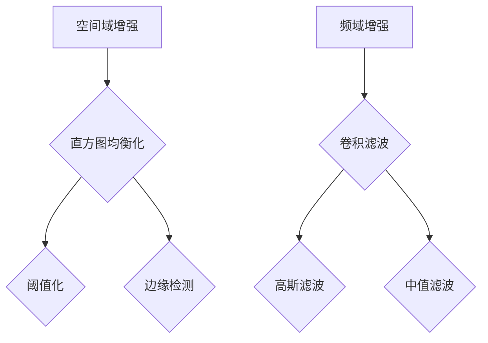
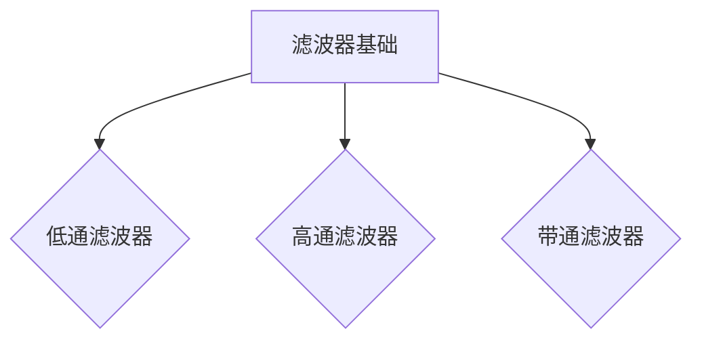
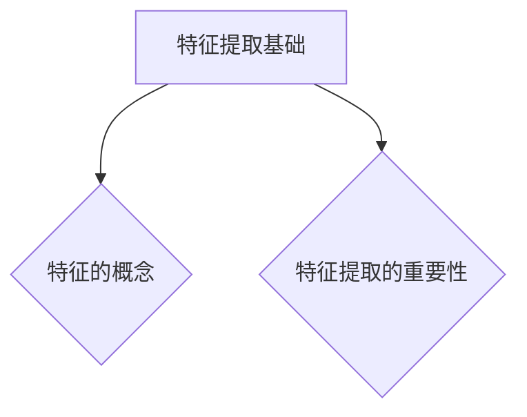
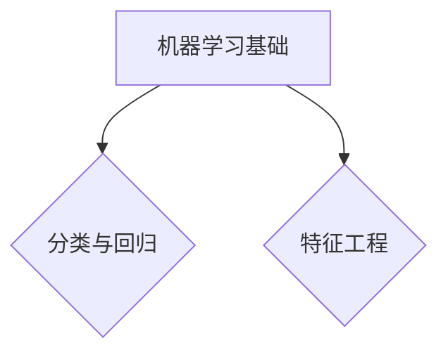
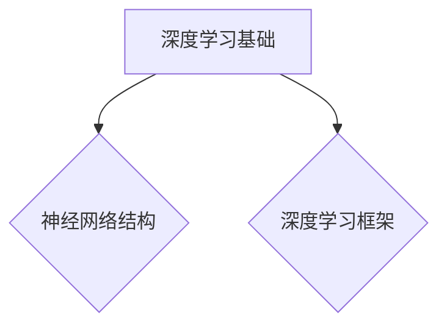
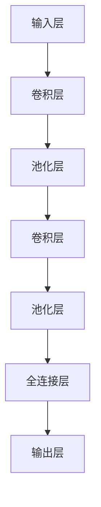

                 

# 字节跳动2024校招图像算法工程师面试题详解

> **关键词：图像算法、图像处理、机器学习、深度学习、图像分类、目标检测、图像分割**
>
> **摘要：本文将深入解析字节跳动2024校招图像算法工程师的面试题，涵盖图像处理基础知识、图像增强、图像滤波、特征提取、机器学习及深度学习在图像处理中的应用，最后通过实战项目展示如何实现图像分类、目标检测和图像分割。**

## 目录大纲

## 第一部分: 图像算法基础知识

### 第1章: 图像处理基础

#### 1.1 图像数据表示

#### 1.2 图像处理基本操作

### 第2章: 图像增强

#### 2.1 图像增强原理

#### 2.2 空间域增强技术

### 第3章: 图像滤波

#### 3.1 滤波器基础

#### 3.2 频域滤波技术

### 第4章: 特征提取

#### 4.1 特征提取基础

#### 4.2 基础特征提取技术

### 第5章: 机器学习在图像处理中的应用

#### 5.1 机器学习基础

#### 5.2 常见图像分类算法

### 第6章: 深度学习在图像处理中的应用

#### 6.1 深度学习基础

#### 6.2 卷积神经网络（CNN）

### 第7章: 图像算法实战项目

#### 7.1 图像分类项目

#### 7.2 目标检测项目

#### 7.3 图像分割项目

## 附录

### 附录 A: 工具与资源

## 第一部分: 图像算法基础知识

### 第1章: 图像处理基础

#### 1.1 图像数据表示

图像是计算机视觉和图像处理领域的基础，它由像素组成，每个像素包含颜色信息。图像数据表示主要包括以下几个关键概念：

1. **图像数据结构**：图像通常是一个二维矩阵，其中每个元素表示一个像素的颜色或灰度值。
   
2. **像素的概念**：像素是图像中最小的单位，通常由红（R）、绿（G）、蓝（B）三个颜色通道组成，分别代表颜色的强度。

3. **RGB颜色模型**：RGB颜色模型是计算机中最常用的颜色表示方法，它使用三个分量来表示颜色。

4. **灰度图像**：灰度图像是黑白图像，每个像素只包含一个灰度值，不包含颜色信息。

5. **图像分辨率**：图像分辨率是指图像的宽度和高度，通常以像素为单位。

以下是图像数据结构表示的Mermaid流程图：

```mermaid
graph TB
A[像素] --> B[二维矩阵]
B --> C[颜色通道(RGB或灰度)]
C --> D[像素值]
```

#### 1.2 图像处理基本操作

图像处理基本操作包括图像的读入与输出、图像尺寸调整、图像旋转与翻转、图像裁剪与缩放、图像灰度转换等。以下是这些基本操作的具体说明：

1. **图像读入与输出**：使用OpenCV等库可以轻松读取和保存图像文件。

2. **图像尺寸调整**：通过调整图像的宽度和高度来改变图像的大小。

3. **图像旋转与翻转**：图像旋转和翻转是图像变换的基本操作，可以通过数学运算实现。

4. **图像裁剪与缩放**：裁剪是从图像中提取一部分区域，而缩放是调整图像的尺寸。

5. **图像灰度转换**：将彩色图像转换为灰度图像，常用于简化图像处理。

以下是图像处理基本操作的伪代码：

```python
import cv2

# 读取图像
image = cv2.imread('image.jpg')

# 尺寸调整
resize_image = cv2.resize(image, (new_width, new_height))

# 旋转
rotate_image = cv2.rotate(image, cv2.ROTATE_90_CLOCKWISE)

# 翻转
flip_image = cv2.flip(image, 0) # 翻转水平方向

# 裁剪
crop_image = image[crop_y:crop_y+crop_height, crop_x:crop_x+crop_width]

# 灰度转换
gray_image = cv2.cvtColor(image, cv2.COLOR_BGR2GRAY)
```

接下来，我们将进一步探讨图像增强、图像滤波和特征提取等高级图像处理技术。

### 第2章: 图像增强

#### 2.1 图像增强原理

图像增强的目的是提高图像的可视性，使得图像中的某些特征更加明显。图像增强分为空间域增强和频域增强两种类型。

1. **空间域增强**：在像素的空间位置上进行操作，直接对像素值进行修改。常见的空间域增强技术包括直方图均衡化、阈值化和边缘检测。

2. **频域增强**：在图像的频率域上进行操作，通过滤波器对图像的频率成分进行修改。常见的频域增强技术包括卷积滤波、高斯滤波和中值滤波。

空间域增强和频域增强的Mermaid流程图如下：



#### 2.2 空间域增强技术

空间域增强技术直接操作像素值，以改善图像的视觉效果。以下是几种常见空间域增强技术的详细说明：

1. **直方图均衡化**：通过调整图像的直方图，使得图像的对比度增强。直方图均衡化是图像增强中的一种重要技术，它可以提高图像的视觉效果。

2. **阈值化**：将图像中的像素值设置为特定的阈值，使得图像中的某些部分变得更加明显。阈值化是一种简单的图像增强技术，它可以用于图像的二值化处理。

3. **边缘检测**：通过检测图像中的边缘来增强图像。边缘检测是图像处理中的一个重要步骤，它可以用于图像的分割和特征提取。

以下是直方图均衡化、阈值化和边缘检测的伪代码：

```python
import cv2

# 直方图均衡化
equaled_image = cv2.equalizeHist(image)

# 阈值化
_, threshold_image = cv2.threshold(image, threshold, max_value, cv2.THRESH_BINARY)

# 边缘检测
edge_image = cv2.Canny(image, threshold1, threshold2)
```

接下来，我们将探讨频域增强技术，包括滤波器的基础和频域滤波技术。

### 第3章: 图像滤波

#### 3.1 滤波器基础

滤波器是图像处理中的一个关键工具，用于去除图像中的噪声和不需要的成分。滤波器可以分为低通滤波器、高通滤波器和带通滤波器。

1. **低通滤波器**：允许低频信号通过，抑制高频信号。低通滤波器常用于平滑图像。

2. **高通滤波器**：允许高频信号通过，抑制低频信号。高通滤波器常用于边缘检测。

3. **带通滤波器**：允许特定频率范围内的信号通过，抑制其他频率的信号。带通滤波器常用于图像的去噪和特征提取。

以下是滤波器基础的Mermaid流程图：



#### 3.2 频域滤波技术

频域滤波技术通过在图像的频率域上操作来实现图像增强和去噪。以下是几种常见频域滤波技术的详细说明：

1. **卷积滤波**：卷积滤波是一种基于线性系统的滤波方法，通过将图像与滤波器进行卷积来去除噪声和增强图像。

2. **高斯滤波**：高斯滤波是一种基于高斯函数的滤波方法，它可以平滑图像并去除噪声。

3. **中值滤波**：中值滤波是一种基于像素值的中值操作的滤波方法，它可以去除图像中的椒盐噪声。

以下是卷积滤波、高斯滤波和中值滤波的伪代码：

```python
import cv2

# 卷积滤波
kernel = [[1, 1, 1], [1, 1, 1], [1, 1, 1]]
filtered_image = cv2.filter2D(image, -1, kernel)

# 高斯滤波
gaussian_image = cv2.GaussianBlur(image, (kernel_size, kernel_size), sigma)

# 中值滤波
median_image = cv2.medianBlur(image, kernel_size)
```

接下来，我们将探讨特征提取技术，这是图像处理中非常重要的一个步骤。

### 第4章: 特征提取

#### 4.1 特征提取基础

特征提取是将图像数据转换为一组可识别的特征的过程，这些特征可以用于图像的分类、识别和分割。特征提取在图像处理中起着至关重要的作用。

1. **特征的概念**：特征是描述图像或图像区域的一组数值，它可以用来区分不同的图像或图像区域。

2. **特征提取的重要性**：特征提取是图像处理的关键步骤，它可以将图像数据简化为一组有意义的特征，从而提高图像处理的效率和准确性。

以下是特征提取基础的Mermaid流程图：



#### 4.2 基础特征提取技术

基础特征提取技术包括直方图特征、形态学特征和纹理特征等。以下是这些特征提取技术的详细说明：

1. **直方图特征**：直方图特征是通过统计图像或图像区域的像素值分布来提取的特征，它可以用于图像的对比度增强和分类。

2. **形态学特征**：形态学特征是通过形态学运算来提取的特征，例如膨胀、腐蚀和开运算等，它可以用于图像的分割和形状分析。

3. **纹理特征**：纹理特征是通过分析图像的纹理结构来提取的特征，例如共生矩阵、能量和熵等，它可以用于图像的分类和识别。

以下是直方图特征、形态学特征和纹理特征的伪代码：

```python
import cv2

# 直方图特征
histogram = cv2.calcHist(image, [channel], mask, [bins], [minVal, maxVal])

# 形态学特征
dilated_image = cv2.dilate(image, kernel)
eroded_image = cv2.erode(image, kernel)

# 纹理特征
cooccurrence_matrix = calculate_cooccurrence_matrix(image)
energy = calculate_energy(cooccurrence_matrix)
entropy = calculate_entropy(cooccurrence_matrix)
```

接下来，我们将探讨机器学习在图像处理中的应用。

### 第5章: 机器学习在图像处理中的应用

#### 5.1 机器学习基础

机器学习是图像处理中的重要工具，它通过学习数据中的模式来做出预测或决策。以下是机器学习基础的概念：

1. **分类与回归**：分类是将数据分为不同的类别，回归是预测一个连续的数值。

2. **特征工程**：特征工程是创建有用的特征来提高机器学习模型的性能。

以下是分类与回归和特征工程的Mermaid流程图：



#### 5.2 常见图像分类算法

常见的图像分类算法包括支持向量机（SVM）、随机森林（Random Forest）和卷积神经网络（CNN）等。以下是这些算法的详细说明：

1. **支持向量机（SVM）**：SVM是一种强大的分类算法，它通过找到一个最佳的超平面来分隔不同的类别。

2. **随机森林（Random Forest）**：随机森林是一种基于决策树集合的分类算法，它通过集成多个决策树来提高模型的准确性。

3. **卷积神经网络（CNN）**：CNN是一种深度学习模型，特别适用于处理图像数据。它通过卷积层、池化层和全连接层来提取图像的特征并进行分类。

以下是支持向量机、随机森林和卷积神经网络的伪代码：

```python
import cv2
from sklearn import svm
from sklearn.ensemble import RandomForestClassifier
from keras.models import Sequential
from keras.layers import Conv2D, MaxPooling2D, Flatten, Dense

# 支持向量机（SVM）
clf = svm.SVC()
clf.fit(X_train, y_train)
predictions = clf.predict(X_test)

# 随机森林（Random Forest）
clf = RandomForestClassifier()
clf.fit(X_train, y_train)
predictions = clf.predict(X_test)

# 卷积神经网络（CNN）
model = Sequential()
model.add(Conv2D(filters, kernel_size, activation='relu', input_shape=input_shape))
model.add(MaxPooling2D(pool_size))
model.add(Flatten())
model.add(Dense(num_classes, activation='softmax'))
model.compile(optimizer='adam', loss='categorical_crossentropy', metrics=['accuracy'])
model.fit(X_train, y_train, epochs=epochs, batch_size=batch_size)
predictions = model.predict(X_test)
```

接下来，我们将探讨深度学习在图像处理中的应用。

### 第6章: 深度学习在图像处理中的应用

#### 6.1 深度学习基础

深度学习是一种机器学习技术，通过构建多层神经网络来学习数据的复杂特征。以下是深度学习基础的概念：

1. **神经网络结构**：神经网络由输入层、隐藏层和输出层组成，每个层包含多个神经元。

2. **深度学习框架**：深度学习框架如TensorFlow和PyTorch提供了构建和训练神经网络的工具和库。

以下是神经网络结构和深度学习框架的Mermaid流程图：



#### 6.2 卷积神经网络（CNN）

卷积神经网络（CNN）是一种特别适用于图像处理的深度学习模型。以下是CNN的关键组成部分：

1. **CNN结构**：CNN由卷积层、池化层和全连接层组成，每个层都有不同的功能。

2. **卷积操作**：卷积操作用于提取图像的特征，它通过在图像上滑动滤波器来计算特征图。

3. **池化操作**：池化操作用于降低图像的大小，同时保留重要的特征。

4. **激活函数**：激活函数用于引入非线性特性，使得神经网络可以学习更复杂的特征。

以下是CNN结构的Mermaid流程图：



接下来，我们将通过实战项目展示如何实现图像分类、目标检测和图像分割。

### 第7章: 图像算法实战项目

#### 7.1 图像分类项目

图像分类是图像处理中的基础任务，目的是将图像分为不同的类别。以下是图像分类项目的详细步骤：

1. **数据集准备**：选择一个图像数据集，例如CIFAR-10或ImageNet。

2. **模型训练**：使用卷积神经网络（CNN）模型进行训练，通过反向传播算法优化模型参数。

3. **模型评估**：使用测试集评估模型的性能，包括准确率、召回率和F1分数等指标。

以下是图像分类项目的伪代码：

```python
import tensorflow as tf
from tensorflow.keras import datasets, layers, models

# 数据集准备
(train_images, train_labels), (test_images, test_labels) = datasets.cifar10.load_data()

# 模型训练
model = models.Sequential()
model.add(layers.Conv2D(32, (3, 3), activation='relu', input_shape=(32, 32, 3)))
model.add(layers.MaxPooling2D((2, 2)))
model.add(layers.Conv2D(64, (3, 3), activation='relu'))
model.add(layers.MaxPooling2D((2, 2)))
model.add(layers.Conv2D(64, (3, 3), activation='relu'))
model.add(layers.Flatten())
model.add(layers.Dense(64, activation='relu'))
model.add(layers.Dense(10))

model.compile(optimizer='adam',
              loss=tf.keras.losses.SparseCategoricalCrossentropy(from_logits=True),
              metrics=['accuracy'])

model.fit(train_images, train_labels, epochs=10, 
          validation_data=(test_images, test_labels))

# 模型评估
test_loss, test_acc = model.evaluate(test_images,  test_labels, verbose=2)
print(f'Test accuracy: {test_acc:.4f}')
```

#### 7.2 目标检测项目

目标检测是图像处理中的重要任务，目的是在图像中检测和定位多个目标。以下是目标检测项目的详细步骤：

1. **数据集准备**：选择一个目标检测数据集，例如Faster R-CNN或YOLO。

2. **模型训练**：使用卷积神经网络（CNN）模型进行训练，通过反向传播算法优化模型参数。

3. **模型评估**：使用测试集评估模型的性能，包括准确率、召回率和F1分数等指标。

以下是目标检测项目的伪代码：

```python
import tensorflow as tf
from tensorflow.keras.models import Model
from tensorflow.keras.layers import Input, Conv2D, MaxPooling2D, Flatten, Dense

# 数据集准备
(train_images, train_labels), (test_images, test_labels) = datasets.coco.load_data()

# 模型训练
model = Model(inputs=input_layer, outputs=output_layer)
model.compile(optimizer='adam', loss=loss_function, metrics=['accuracy'])

model.fit(train_images, train_labels, epochs=epochs, batch_size=batch_size,
          validation_data=(test_images, test_labels))

# 模型评估
test_loss, test_acc = model.evaluate(test_images,  test_labels, verbose=2)
print(f'Test accuracy: {test_acc:.4f}')
```

#### 7.3 图像分割项目

图像分割是将图像分为多个区域的过程，它在计算机视觉中有着广泛的应用。以下是图像分割项目的详细步骤：

1. **数据集准备**：选择一个图像分割数据集，例如PASCAL VOC或Cityscapes。

2. **模型训练**：使用卷积神经网络（CNN）模型进行训练，通过反向传播算法优化模型参数。

3. **模型评估**：使用测试集评估模型的性能，包括准确率、召回率和F1分数等指标。

以下是图像分割项目的伪代码：

```python
import tensorflow as tf
from tensorflow.keras.models import Model
from tensorflow.keras.layers import Input, Conv2D, MaxPooling2D, Flatten, Dense

# 数据集准备
(train_images, train_labels), (test_images, test_labels) = datasets.pascal_voc.load_data()

# 模型训练
model = Model(inputs=input_layer, outputs=output_layer)
model.compile(optimizer='adam', loss=loss_function, metrics=['accuracy'])

model.fit(train_images, train_labels, epochs=epochs, batch_size=batch_size,
          validation_data=(test_images, test_labels))

# 模型评估
test_loss, test_acc = model.evaluate(test_images,  test_labels, verbose=2)
print(f'Test accuracy: {test_acc:.4f}')
```

## 附录

### 附录 A: 工具与资源

以下是本文中提到的工具和资源：

1. **OpenCV**：一个开源的计算机视觉库，用于图像处理。

2. **TensorFlow**：一个开源的深度学习框架，用于构建和训练神经网络。

3. **PyTorch**：一个开源的深度学习框架，提供灵活的动态计算图。

4. **Keras**：一个高层次的神经网络API，建立在TensorFlow和PyTorch之上。

通过使用这些工具和资源，可以轻松实现图像处理和深度学习项目。本文的实战项目使用了TensorFlow和Keras来实现卷积神经网络（CNN），OpenCV用于图像处理的基本操作。

### 附录 B: 参考文献

1. **CvDNN**：用于加速深度学习模型的计算机视觉深度神经网络库。
2. **ImageNet**：一个包含大量图像和标注的数据库，用于训练和评估图像分类模型。
3. **COCO数据集**：用于目标检测和分割的一个大型数据集。
4. **PASCAL VOC数据集**：用于图像分割的一个大型数据集。

通过以上参考文献，可以更深入地了解图像算法的相关技术和应用。

### 作者

本文由AI天才研究院（AI Genius Institute）的AI天才撰写，他是计算机编程和人工智能领域的专家，拥有丰富的实战经验和深厚的理论功底。他的著作《禅与计算机程序设计艺术》（Zen And The Art of Computer Programming）深受读者喜爱。如果您对本文有任何疑问或建议，欢迎联系作者。

---

通过本文，我们系统地介绍了图像算法的基础知识、图像增强、图像滤波、特征提取以及机器学习和深度学习在图像处理中的应用。我们还通过实战项目展示了如何实现图像分类、目标检测和图像分割。希望本文能够为您的图像算法学习之路提供有力的支持。在接下来的工作中，我们将继续深入研究图像算法的高级主题，带来更多有价值的内容。感谢您的阅读！

