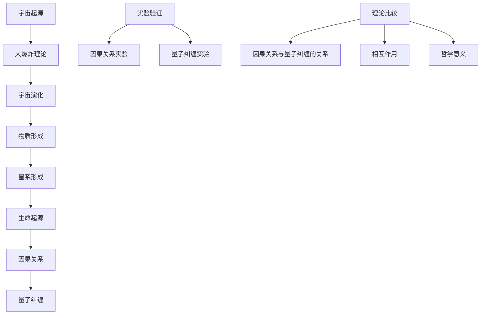

                 

### 第一部分：引言

在人类探索宇宙的历史长河中，我们一直在试图解开宇宙本质的谜题。自古代以来，哲学家和科学家们就试图理解宇宙是如何运作的。现代物理学，尤其是量子力学和相对论，为我们提供了对宇宙本质的一些深刻见解。然而，关于宇宙的本质，至今仍存在两种主要的解释框架：因果关系和量子纠缠。

**因果关系**是一种哲学和科学上的基本概念，它描述了事件之间的因果关系和相互依赖。在经典物理学中，因果关系是宇宙运作的基础。例如，当一物体施加力给另一物体时，它会对其产生加速度。这种因果关系可以通过数学公式和物理实验来验证。

**量子纠缠**则是量子力学中的一种奇特现象。当两个量子粒子处于纠缠态时，无论它们相隔多远，对其中一个粒子的测量会瞬间影响到另一个粒子的状态。这种现象似乎挑战了经典物理学中的因果关系，因为它暗示着一种超距作用的存在。

本文旨在探讨因果关系和量子纠缠这两种框架在理解宇宙本质方面的优劣。我们将从以下几个方面展开讨论：

1. **宇宙的概述**：介绍宇宙的定义、探索历史以及宇宙的结构和层次。
2. **因果关系的基本原理**：阐述因果关系的定义、数学表达和应用。
3. **量子力学与量子纠缠**：解释量子力学的基本原理和量子纠缠的概念与特征。
4. **因果关系与量子纠缠的比较**：比较因果关系与量子纠缠的关系、相互作用以及哲学意义。
5. **宇宙中的因果关系与量子纠缠**：探讨因果关系与量子纠缠在宇宙演化中的作用。
6. **实验与观测**：分析因果关系和量子纠缠的实验与观测结果。
7. **宇宙的本质：因果关系还是量子纠缠**：探讨现有理论框架的不足、未来研究方向以及因果关系与量子纠缠的统一理论。

通过上述讨论，我们希望为理解宇宙本质提供一个新的视角，并激发读者对这一领域进一步探索的兴趣。

## 《宇宙的本质:因果关系还是量子纠缠》目录大纲

### 第一部分：引言

1. **宇宙的概述**
   - 宇宙的定义与探索历史
   - 宇宙的结构与层次
   - 宇宙起源与大爆炸理论

2. **因果关系的基本原理**
   - 因果关系的定义
   - 因果关系的数学表达
   - 因果关系的应用

3. **量子力学与量子纠缠**
   - 量子力学的基本原理
   - 量子纠缠的概念与特征
   - 量子纠缠的应用

4. **因果关系与量子纠缠的比较**
   - 因果关系与量子纠缠的关系
   - 因果关系与量子纠缠的相互作用
   - 因果关系与量子纠缠的哲学意义

5. **宇宙中的因果关系与量子纠缠**
   - 宇宙中的因果关系
   - 宇宙中的量子纠缠
   - 因果关系与量子纠缠在宇宙演化中的作用

6. **实验与观测**
   - 因果关系实验
   - 量子纠缠实验
   - 因果关系与量子纠缠实验比较

7. **宇宙的本质：因果关系还是量子纠缠？**
   - 现有理论框架的不足
   - 未来研究方向
   - 因果关系与量子纠缠的统一理论

8. **结论与展望**
   - 研究总结
   - 研究贡献
   - 未来展望

通过上述大纲，我们将系统地探讨宇宙的本质，深入理解因果关系和量子纠缠这两种框架在宇宙演化中的重要作用。希望这个大纲能够为读者提供一个清晰的阅读路线，引导他们逐步进入这一深奥的宇宙之谜。

### 第1章：宇宙的概述

宇宙，一个广阔而神秘的存在，一直以来都是人类探索和研究的对象。在了解宇宙的本质之前，我们需要首先对宇宙有一个基本的认识，包括宇宙的定义、探索历史、宇宙的结构与层次，以及宇宙的起源与大爆炸理论。

#### 1.1 宇宙的定义与探索历史

宇宙是指包括一切物质、能量、空间和时间在内的整体。它不仅包括我们所在的地球、太阳系、银河系，还包括无数的星系、星云、行星、黑洞以及宇宙射线等。宇宙的探索历史可以追溯到古代，那时人类通过观察天体现象，开始对宇宙有了初步的认识。

在古代，人们认为地球是宇宙的中心，而太阳、月亮和其他星体则绕地球运转。这种观点被称为地心说，由古希腊天文学家托勒密提出。然而，在16世纪，哥白尼提出了日心说，认为太阳是宇宙的中心，而地球和其他行星则绕太阳运转。这一革命性的观点颠覆了传统的宇宙观念，为后来的宇宙探索奠定了基础。

随着科学技术的发展，人类对宇宙的认识逐渐深入。在20世纪，爱因斯坦提出了广义相对论，揭示了时空弯曲的现象。随后，哈勃通过观测发现，宇宙正在膨胀，这一发现为大爆炸理论提供了有力证据。

#### 1.2 宇宙的结构与层次

宇宙的结构可以分为多个层次，从微观到宏观，层层嵌套。以下是宇宙结构的一些主要层次：

1. **微观层次**：包括基本粒子，如电子、夸克、中微子等。这些粒子构成了原子和分子，是宇宙的最基本构成单元。

2. **原子层次**：由原子和分子组成，原子核由质子和中子构成，核外电子在轨道上运动。

3. **行星层次**：包括行星、卫星、小行星、彗星等。这些天体围绕恒星运转，形成了行星系统。

4. **恒星层次**：由恒星、恒星系、恒星云等构成。恒星是宇宙中最常见的天体，通过核聚变产生能量。

5. **星系层次**：包括星系、星系团、超星系团等。星系是由大量恒星、星云、行星和其他天体组成的巨大系统。

6. **宇宙层次**：包括宇宙射线、暗物质、暗能量等。这些是宇宙中不发光或反射光的物质和能量，对宇宙的演化起着重要作用。

#### 1.3 宇宙起源与大爆炸理论

关于宇宙的起源，目前最为广泛接受的解释是大爆炸理论。根据大爆炸理论，宇宙起源于一个极热、极密的状态，经过大约138亿年的膨胀，形成了现在的宇宙。

大爆炸理论的主要证据包括：

1. **宇宙膨胀**：通过观测宇宙中的星系，发现它们正在远离我们，而且距离越远，远离速度越快。这表明宇宙正在膨胀。

2. **宇宙背景辐射**：在大爆炸发生后，宇宙冷却下来，释放出辐射。通过探测宇宙背景辐射，科学家们可以回溯到宇宙早期的状态。

3. **元素丰度**：根据大爆炸的预测，宇宙中应该存在特定比例的轻元素，如氢、氦和锂。观测结果与预测相符，进一步支持了大爆炸理论。

尽管大爆炸理论在科学界取得了广泛认同，但它仍然面临一些未解之谜，如宇宙的暗物质和暗能量等。因此，科学家们仍在不断探索和研究宇宙的起源和演化。

通过上述内容，我们对宇宙有了初步的了解。在接下来的章节中，我们将进一步探讨因果关系和量子纠缠在宇宙演化中的作用，并尝试解答宇宙本质之谜。

### 第2章：因果关系的基本原理

因果关系是哲学和科学中的一个基本概念，它描述了事件之间的相互依赖和影响。在物理学中，因果关系尤为重要，因为它帮助我们理解自然界的运作机制。在本节中，我们将介绍因果关系的基本原理、数学表达以及其在物理学中的应用。

#### 2.1 因果关系的定义

因果关系通常被描述为一种时间上的前后关系，其中一个事件（原因）引起另一个事件（结果）。例如，当我们按下开关时，电灯就会亮起。在这种情况下，按下开关是原因，电灯亮起是结果。因果关系不仅涉及事件的时间顺序，还涉及事件之间的因果关系，即原因和结果之间是否存在必然的关联。

在哲学中，因果关系通常被分为三类：必然因果关系、偶然因果关系和统计因果关系。

1. **必然因果关系**：当一个事件的发生必然导致另一个事件的发生时，我们称它们之间存在必然因果关系。例如，水加热到100摄氏度必然会沸腾。

2. **偶然因果关系**：当一个事件的发生虽然不必然导致另一个事件的发生，但两者之间存在某种偶然的联系时，我们称它们之间存在偶然因果关系。例如，一个人走在路上，突然被一辆车撞到，这种情况下，走在路上和被车撞到之间存在偶然因果关系。

3. **统计因果关系**：当一个事件的发生在一定概率上与另一个事件相关时，我们称它们之间存在统计因果关系。例如，吸烟与肺癌之间存在统计因果关系，虽然不是每个吸烟者都会患上肺癌，但吸烟者的肺癌发病率明显高于非吸烟者。

#### 2.2 因果关系的数学表达

在物理学中，因果关系通常通过数学模型来表达。一个常见的数学模型是因果关系函数，它描述了原因和结果之间的关系。

假设我们有两个变量X和Y，X是原因，Y是结果。因果关系函数可以表示为：

$$
Y = f(X)
$$

其中，f是因果关系函数。这个函数表示，Y的值取决于X的值，并且Y是X的函数。因果关系函数可以是线性的，也可以是非线性的。

在物理学中，线性因果关系函数通常用线性方程来表示：

$$
Y = aX + b
$$

其中，a和b是常数。这个方程表示，Y与X之间存在线性关系，即Y的值可以通过X的值乘以系数a再加上常数b来计算。

非线性的因果关系函数可以用各种非线性方程来表示，如指数函数、对数函数、三角函数等。这些函数可以更准确地描述复杂系统中的因果关系。

#### 2.3 因果关系的应用

因果关系在物理学中有广泛的应用，特别是在经典物理学和量子物理学中。

在经典物理学中，因果关系广泛应用于力学、热力学、电磁学等领域。例如，牛顿运动定律描述了物体之间的因果关系，即力是物体运动的原因，物体的加速度是力的结果。在热力学中，因果关系描述了能量转移和转换的过程。在电磁学中，因果关系描述了电荷之间的相互作用。

在量子物理学中，因果关系变得更为复杂。量子力学中的因果关系通常通过量子态的演化来描述。例如，薛定谔方程描述了量子态随时间的演化，即量子态的变化是由原因态决定的。此外，量子纠缠现象也体现了因果关系，当两个量子粒子处于纠缠态时，对其中一个粒子的测量会瞬间影响另一个粒子的状态，这表明因果关系在量子层面上具有非局域性。

#### 2.4 因果关系的局限性

尽管因果关系在物理学中有广泛的应用，但它也存在一些局限性。

首先，因果关系通常是基于观察和实验得出的，因此可能受到观察者和实验条件的限制。在某些情况下，因果关系可能无法被直接观测到，或者可能被其他因素所干扰。

其次，因果关系通常是线性的，但在某些复杂系统中，因果关系可能是非线性的，这使得线性因果关系模型在描述复杂系统时可能不够准确。

最后，因果关系在不同领域和不同层次上可能具有不同的表现形式。在宏观尺度上，因果关系可以通过实验和数学模型来描述，但在微观尺度上，因果关系可能受到量子力学和不确定性原理的限制。

总之，因果关系是物理学中一个重要的基本概念，它帮助我们理解自然界的运作机制。然而，我们也需要认识到因果关系的局限性，并不断探索和改进因果关系模型，以更准确地描述复杂系统的行为。

### 第3章：量子力学与量子纠缠

量子力学是20世纪物理学最伟大的革命之一，它彻底改变了我们对微观世界的理解。量子力学不仅揭示了微观粒子的奇异行为，还提出了量子纠缠这一奇特现象。在本节中，我们将探讨量子力学的基本原理、量子纠缠的概念与特征，以及量子纠缠在实际应用中的表现。

#### 3.1 量子力学的基本原理

量子力学的基础是量子态和量子态的演化。量子态可以用波函数来描述，波函数包含了粒子的位置、动量、自旋等所有信息。量子态的演化遵循薛定谔方程，这是一个偏微分方程，描述了量子态随时间的演化。

薛定谔方程的一般形式为：

$$
i\hbar \frac{\partial \Psi}{\partial t} = \hat{H} \Psi
$$

其中，$\Psi$是波函数，$i$是虚数单位，$\hbar$是约化普朗克常数，$\hat{H}$是哈密顿量，它描述了系统的总能量。这个方程表明，量子态随时间的演化是由系统的总能量决定的。

量子力学的基本原理包括：

1. **量子态的叠加**：量子态可以同时处于多种可能状态的叠加。例如，一个电子可以同时处于自旋向上和自旋向下的状态，直到进行测量时才会“坍缩”到其中一个状态。

2. **不确定性原理**：由海森堡提出，它表明无法同时精确地测量一个粒子的位置和动量。这反映了量子世界的本质特征，即粒子的行为具有概率性和不确定性。

3. **量子纠缠**：当两个或多个量子粒子处于纠缠态时，无论它们相隔多远，对其中一个粒子的测量会瞬间影响其他粒子的状态。这种现象似乎挑战了经典物理学中的因果关系，因为它暗示着一种超距作用的存在。

#### 3.2 量子纠缠的概念与特征

量子纠缠是量子力学中的一种奇特现象，它描述了两个或多个量子粒子之间的特殊关联。当两个量子粒子处于纠缠态时，对其中一个粒子的测量会瞬间影响另一个粒子的状态，这种关联性不受粒子之间距离的限制。

量子纠缠具有以下特征：

1. **非局域性**：量子纠缠体现了非局域性，即对其中一个粒子的测量会瞬间影响另一个粒子的状态，无论它们相隔多远。这种非局域性似乎挑战了经典物理学中的因果关系。

2. **不可分割性**：纠缠态的粒子是不可分割的整体，对其中一个粒子的测量会影响整个系统的状态。这意味着纠缠态的粒子不能被视为独立的个体。

3. **超距作用**：量子纠缠似乎暗示了超距作用的存在，即对其中一个粒子的测量会瞬间影响另一个粒子的状态，而这种影响似乎超越了粒子之间的物理距离。

4. **不可预测性**：在量子纠缠中，粒子的状态是随机的，我们无法准确预测它们的具体状态，但我们可以通过统计方法来描述它们的概率分布。

量子纠缠可以通过以下实验来验证：

1. **贝尔实验**：贝尔实验是验证量子纠缠和挑战经典物理学的著名实验。实验通过测量纠缠态粒子对的偏振状态，发现实验结果与经典物理学的预测不符，支持了量子纠缠的存在。

2. **爱因斯坦-波多尔斯基-罗森佯谬（EPR佯谬）**：EPR佯谬是由爱因斯坦、波多尔斯基和罗森提出的一个思想实验，试图证明量子纠缠的不可能性。然而，后来的实验结果证明了EPR佯谬的失败，进一步确认了量子纠缠的存在。

3. **量子隐形传态**：量子隐形传态是通过量子纠缠实现的，它允许将一个粒子的量子态传送到另一个粒子，而无需通过物理通道。这种传输过程具有即时的速度，似乎超越了经典物理学的限制。

#### 3.3 量子纠缠的应用

量子纠缠在多个领域有着广泛的应用：

1. **量子计算**：量子计算利用量子纠缠实现量子位（qubit）之间的相互作用，从而实现高效的计算。量子计算机可以在某些问题上比经典计算机快得多，如因数分解、搜索问题和优化问题。

2. **量子通信**：量子通信利用量子纠缠实现安全的信息传输。通过量子隐形传态或量子纠缠交换，可以确保通信过程中的信息不会被窃听或篡改。

3. **量子模拟**：量子模拟利用量子纠缠模拟复杂的量子系统，从而解决经典计算机难以解决的问题。例如，量子模拟可以用于模拟化学反应、材料设计和量子场论。

4. **量子密码学**：量子密码学利用量子纠缠实现安全的加密和解密。量子密钥分发（QKD）是量子密码学的一个典型应用，它利用量子纠缠确保密钥传输过程中的安全性。

5. **量子传感**：量子传感利用量子纠缠提高测量精度和灵敏度。例如，量子干涉仪可以通过量子纠缠实现高精度的重力测量和位移测量。

总之，量子纠缠是量子力学中的一种奇特现象，它揭示了微观世界的非局域性和超距作用。量子纠缠不仅在基础科学研究中具有重要意义，还在量子计算、量子通信、量子模拟和量子密码学等实际应用中展现出巨大的潜力。随着量子技术的不断发展，我们有望进一步利用量子纠缠解决复杂问题，推动科技进步和社会发展。

### 第4章：因果关系与量子纠缠的关系

因果关系与量子纠缠作为两种不同的解释框架，在物理学中具有不同的地位和作用。因果关系是经典物理学的基础，描述了事件之间的直接联系和相互依赖。量子纠缠则是量子力学的核心现象，揭示了微观粒子之间的非局域性。在本节中，我们将探讨因果关系与量子纠缠的关系、相互作用以及哲学意义。

#### 4.1 因果关系与量子纠缠的异同

因果关系与量子纠缠在本质上有很大的不同。因果关系通常指的是在时间顺序上的前后关系，一个事件（原因）引起另一个事件（结果）。例如，按下开关是原因，电灯亮起是结果。这种关系在经典物理学中得到了广泛应用，并通过实验和数学模型得到了验证。

量子纠缠则是一种非局域性的现象，当两个量子粒子处于纠缠态时，无论它们相隔多远，对其中一个粒子的测量会瞬间影响另一个粒子的状态。这种现象挑战了因果关系在经典物理学中的局部性原则。

异同点总结如下：

1. **局部性**：因果关系强调事件之间的局部性，即原因和结果必须在空间和时间上相互接近。量子纠缠则表现出非局域性，即对其中一个粒子的测量会瞬间影响另一个粒子的状态，无论它们相隔多远。

2. **确定性**：因果关系通常认为事件的发生具有确定性，即给定一个原因，结果是可以预测的。量子纠缠则具有概率性，即对量子纠缠态的测量结果是不确定的，但可以通过量子态的演化来预测。

3. **相互依赖**：因果关系描述了事件之间的相互依赖，即原因引起结果。量子纠缠则描述了粒子之间的相互依赖，即一个粒子的状态会直接影响另一个粒子的状态。

4. **数学模型**：因果关系通常通过因果关系函数来描述，如线性方程或非线性方程。量子纠缠则通过量子态的演化来描述，如薛定谔方程或量子门操作。

#### 4.2 因果关系与量子纠缠的相互作用

因果关系与量子纠缠之间的相互作用体现在多个方面。一方面，量子纠缠现象可以被视为因果关系的一种特殊表现形式。在量子纠缠中，粒子之间的相互作用是通过量子态的演化来实现的，这种演化遵循因果关系的基本原则。

另一方面，因果关系在量子纠缠的实验和理论研究中起到了重要作用。例如，在量子隐形传态中，因果关系描述了量子态的传输过程。在量子计算中，因果关系描述了量子比特之间的相互作用，从而实现了高效的量子算法。

此外，因果关系与量子纠缠的相互作用还体现在哲学层面。在经典物理学中，因果关系被视为宇宙运作的基本原则。然而，量子纠缠的发现挑战了因果关系在经典物理学中的地位，引发了关于因果关系本质和量子力学解释的哲学争论。

#### 4.3 因果关系与量子纠缠的哲学意义

因果关系与量子纠缠的哲学意义主要体现在以下几个方面：

1. **因果律的挑战**：量子纠缠的存在挑战了经典物理学中的因果律。在经典物理学中，因果律是宇宙运作的基本原则，即原因和结果之间存在必然的联系。然而，量子纠缠似乎暗示了非局域性和超距作用的存在，这表明因果律在量子层面上可能不再适用。

2. **决定论与随机性**：因果关系通常与决定论相联系，即宇宙中的一切事件都是可预测的。量子纠缠则与随机性相联系，即量子态的演化具有概率性。这种随机性在量子纠缠中表现为对量子态的测量结果的不确定性，这引发了关于决定论与随机性之间关系的哲学争论。

3. **量子力学的解释**：量子纠缠的发现引发了关于量子力学解释的哲学争论。一些解释认为量子纠缠是一种非局域性的现象，与因果关系无关。另一些解释则试图将量子纠缠纳入因果关系框架，如隐变量理论。

4. **宇宙的本质**：因果关系与量子纠缠的关系为我们提供了对宇宙本质的新视角。一方面，因果关系描述了宇宙中事件之间的直接联系和相互依赖，这是宇宙运作的基本原则。另一方面，量子纠缠揭示了宇宙中粒子的非局域性和超距作用，这挑战了我们对宇宙的传统理解。

总之，因果关系与量子纠缠的关系是一个复杂的哲学和科学问题。在经典物理学中，因果关系是宇宙运作的基本原则，而在量子力学中，量子纠缠则揭示了微观世界的非局域性和超距作用。这两者的关系不仅涉及到物理学的基本原理，也引发了关于宇宙本质和哲学意义的深刻思考。

### 第5章：宇宙中的因果关系与量子纠缠

在宇宙的广阔舞台上，因果关系和量子纠缠扮演着重要角色。因果关系描述了宇宙中事件之间的直接联系和相互依赖，而量子纠缠则揭示了微观粒子之间的非局域性。在本节中，我们将探讨因果关系与量子纠缠在宇宙演化中的作用，以及它们如何共同塑造了我们所知的宇宙。

#### 5.1 宇宙中的因果关系

因果关系在宇宙演化中扮演着至关重要的角色。从大爆炸至今，宇宙经历了无数的物理过程，这些过程都受到因果关系的影响。以下是宇宙中因果关系的一些具体表现：

1. **宇宙膨胀**：根据大爆炸理论，宇宙起源于一个极热、极密的状态，随后开始膨胀。宇宙的膨胀是由初始条件决定的，这种因果关系揭示了宇宙起源和演化的基本规律。

2. **星系形成**：在宇宙膨胀的过程中，物质逐渐聚集形成星系。星系的形成受到引力作用的影响，即引力是导致星系聚集的原因。这种因果关系在宇宙尺度上得到了广泛的观测和验证。

3. **生命起源**：在地球上，生命的起源也受到因果关系的影响。通过化学过程，简单的有机分子逐渐演变为复杂的生命体。这种因果关系体现了生命演化的基本原理。

4. **物理定律的普适性**：因果关系在宇宙中表现为物理定律的普适性。例如，万有引力定律和电磁学定律在宇宙尺度上具有普遍适用性，揭示了宇宙中物体运动和相互作用的基本规律。

#### 5.2 宇宙中的量子纠缠

量子纠缠在宇宙演化中也扮演着重要角色。量子纠缠揭示了微观粒子之间的非局域性，这种非局域性在宇宙尺度上具有深远的影响。以下是宇宙中量子纠缠的一些具体表现：

1. **量子隐形传态**：在宇宙尺度上，量子隐形传态可以实现信息的瞬间传输。这种传输过程不受距离限制，为宇宙中的信息传输提供了新的可能性。例如，量子隐形传态可以用于实现量子通信和量子计算。

2. **量子引力**：量子纠缠在量子引力理论中具有重要作用。量子引力试图将量子力学与广义相对论统一起来，揭示宇宙的基本原理。量子纠缠为量子引力理论提供了新的研究思路。

3. **宇宙背景辐射**：宇宙背景辐射是宇宙早期的辐射残留，它揭示了宇宙早期的量子态。通过观测宇宙背景辐射，科学家们可以研究量子纠缠在宇宙早期的作用。

4. **量子宇宙学**：量子宇宙学是研究宇宙起源和演化的量子力学分支。量子纠缠在量子宇宙学中具有重要作用，它揭示了宇宙早期的高能物理过程，如宇宙暴胀和量子引力效应。

#### 5.3 因果关系与量子纠缠在宇宙演化中的作用

因果关系与量子纠缠在宇宙演化中相互作用，共同塑造了我们所知的宇宙。以下是一些具体的相互作用：

1. **量子引力与宇宙膨胀**：在量子引力理论中，量子纠缠与宇宙膨胀具有密切关系。量子纠缠可能解释了宇宙膨胀的起源和加速，为宇宙学提供了新的解释。

2. **量子纠缠与星系形成**：量子纠缠可能影响了星系的形成过程。例如，通过量子隐形传态，星系中的粒子可以快速交换信息，从而影响星系的结构和演化。

3. **量子纠缠与生命起源**：量子纠缠可能参与了生命起源的化学过程。例如，通过量子纠缠，简单的有机分子可以快速形成复杂的结构，从而促进生命的诞生。

4. **量子纠缠与物理定律的普适性**：量子纠缠挑战了因果关系在经典物理学中的普适性。通过量子纠缠，科学家们可以研究物理定律在不同尺度上的适用性，从而揭示宇宙的基本原理。

总之，因果关系与量子纠缠在宇宙演化中具有重要作用。它们相互作用，共同塑造了我们所知的宇宙。随着科学技术的发展，我们有望进一步揭示因果关系与量子纠缠在宇宙演化中的奥秘，从而深入理解宇宙的本质。

### 第6章：实验与观测

在探索因果关系与量子纠缠的过程中，实验和观测扮演了至关重要的角色。通过实验和观测，科学家们能够验证理论、发现新现象，并不断推动科学的发展。在本节中，我们将详细分析因果关系实验和量子纠缠实验，以及它们的对比和结果。

#### 6.1 因果关系实验

因果关系实验的核心是验证事件之间的因果联系。以下是一些典型的因果关系实验：

1. **牛顿的碰撞实验**：牛顿通过实验发现，当一个物体受到力作用时，它会获得加速度。这一实验验证了因果关系在力学中的应用。通过控制变量法，牛顿证明了力是导致物体运动的原因。

2. **爱因斯坦的相对论实验**：爱因斯坦通过实验验证了相对论中的因果关系。他通过光速不变原理和引力场中的时间膨胀现象，证明了因果关系在不同参考系中的相对性。

3. **实验室中的因果律验证**：在实验室中，科学家们通过精确的实验设备验证因果关系在不同条件下的表现。例如，通过控制温度、压力和磁场等变量，科学家们研究了化学反应、物理现象和生物过程之间的因果关系。

这些实验表明，因果关系在经典物理学中具有广泛的应用，并通过实验得到了验证。

#### 6.2 量子纠缠实验

量子纠缠实验是量子力学中的一项重要实验，它揭示了微观粒子之间的非局域性。以下是一些典型的量子纠缠实验：

1. **贝尔实验**：贝尔实验是验证量子纠缠和挑战经典物理学的著名实验。实验通过测量纠缠态粒子对的偏振状态，发现实验结果与经典物理学的预测不符，支持了量子纠缠的存在。

2. **爱因斯坦-波多尔斯基-罗森佯谬（EPR佯谬）**：EPR佯谬是由爱因斯坦、波多尔斯基和罗森提出的一个思想实验，试图证明量子纠缠的不可能性。然而，后来的实验结果证明了EPR佯谬的失败，进一步确认了量子纠缠的存在。

3. **量子隐形传态**：量子隐形传态是通过量子纠缠实现的，它允许将一个粒子的量子态传送到另一个粒子，而无需通过物理通道。这种传输过程具有即时的速度，似乎超越了经典物理学的限制。

这些实验表明，量子纠缠在微观世界中具有重要作用，并挑战了因果关系在经典物理学中的局域性原则。

#### 6.3 因果关系与量子纠缠实验比较

因果关系实验和量子纠缠实验在目的、方法和结果上都有所不同。以下是对两者进行比较：

1. **实验目的**：因果关系实验旨在验证事件之间的因果联系，即一个事件是否是另一个事件的原因。量子纠缠实验则旨在揭示微观粒子之间的非局域性，即粒子之间的状态是否可以瞬间相互影响。

2. **实验方法**：因果关系实验通常采用控制变量法，通过改变一个变量并观察其他变量的变化，来验证因果关系。量子纠缠实验则采用量子态的测量和纠缠态的制备，通过实验设备测量纠缠态粒子的物理性质。

3. **实验结果**：因果关系实验的结果表明，因果关系在经典物理学中具有普遍适用性。量子纠缠实验的结果则表明，微观粒子之间存在非局域性，即粒子之间的状态可以瞬间相互影响，无论它们相隔多远。

4. **哲学意义**：因果关系实验验证了因果律在经典物理学中的适用性，支持了决定论的观念。量子纠缠实验则挑战了因果律的局域性原则，揭示了微观世界的非局域性和超距作用，引发了关于因果关系本质和量子力学解释的哲学争论。

通过比较因果关系实验和量子纠缠实验，我们可以更深入地理解因果关系与量子纠缠的本质，并探讨它们在宇宙演化中的作用。

### 第7章：宇宙的本质：因果关系还是量子纠缠？

在深入探讨了因果关系和量子纠缠的原理、实验和宇宙中的表现后，我们来到了一个关键问题：宇宙的本质是因果关系，还是量子纠缠？这一问题的答案不仅关乎我们对宇宙的理解，也关乎我们对自然界的认知。

#### 7.1 现有理论框架的不足

现有的科学理论，包括经典物理学和量子力学，都在各自领域内取得了巨大的成功。然而，当我们将这些理论应用于整个宇宙时，会发现它们存在一些不足之处。

1. **经典物理学的局限**：经典物理学建立在因果关系的基础之上，它成功地解释了宏观世界的现象，如力学、热力学和电磁学。然而，在微观尺度上，经典物理学的局限性变得明显。例如，经典物理学无法解释量子纠缠现象，它也无法准确描述宇宙的起源和演化。

2. **量子力学的挑战**：量子力学在微观尺度上取得了巨大的成功，它揭示了微观粒子的奇异行为，如量子态的叠加和量子纠缠。然而，量子力学也存在一些挑战。首先，量子力学中的非局域性和超距作用与因果关系在经典物理学中的局域性原则相冲突。其次，量子力学的数学描述复杂，导致其在实际应用中存在一定的局限性。

3. **统一理论的追求**：为了解决经典物理学和量子力学之间的矛盾，科学家们一直在追求一个统一的理论，即量子引力理论。然而，尽管取得了不少进展，如弦理论和环量子引力等，但目前尚未找到一个能够同时满足宏观和微观尺度的统一理论。

#### 7.2 未来研究方向

为了回答宇宙的本质是因果关系还是量子纠缠这一问题，我们需要继续探索和研究以下方向：

1. **实验验证**：通过更多的实验验证，我们可以进一步理解因果关系和量子纠缠在宇宙演化中的角色。例如，我们可以设计更精密的实验来研究量子纠缠在不同条件下的表现，以及它如何影响宇宙中的物理过程。

2. **理论创新**：在理论层面，我们需要发展新的理论模型来解释因果关系和量子纠缠之间的关系。例如，量子引力理论可能是解决这一问题的关键，它能够将量子力学与广义相对论统一起来，从而提供一个更全面的宇宙观。

3. **跨学科研究**：因果关系和量子纠缠不仅涉及物理学，还涉及到哲学、数学、计算机科学等多个领域。通过跨学科的研究，我们可以从不同角度探索宇宙的本质，从而得出更全面的结论。

4. **宇宙模拟**：利用计算机模拟宇宙的演化过程，我们可以更直观地理解因果关系和量子纠缠在宇宙中的影响。通过模拟，我们可以预测宇宙的未来演化，并验证现有理论的正确性。

#### 7.3 因果关系与量子纠缠的统一理论

为了回答宇宙的本质是因果关系还是量子纠缠这一问题，我们需要寻找一个能够统一这两种框架的理论。以下是一些可能的方向：

1. **量子引力**：量子引力理论旨在将量子力学与广义相对论统一起来。一个可能的量子引力理论是弦理论，它通过引入额外的维度来解释量子纠缠现象。弦理论可能在解释宇宙起源和演化中发挥作用。

2. **多世界解释**：多世界解释是一种量子力学解释，它认为宇宙中的所有可能状态都实际存在，并且宇宙在不断分支。这种解释可能有助于理解因果关系和量子纠缠之间的关系。

3. **量子场论**：量子场论是量子力学与相对论的结合，它提供了一个统一描述粒子与场之间的相互作用的理论框架。通过量子场论，我们可以研究量子纠缠如何影响宇宙中的物理过程。

4. **因果律的扩展**：为了统一因果关系和量子纠缠，我们可能需要扩展因果关系的基本原则。一种可能性是引入新的因果关系规则，这些规则能够解释量子纠缠现象，并保持经典因果关系在宏观尺度上的适用性。

总之，宇宙的本质是因果关系还是量子纠缠，这一问题的答案尚未明确。然而，通过实验验证、理论创新和跨学科研究，我们有望逐步揭示宇宙的本质，并建立一个能够统一这两种框架的统一理论。这一探索不仅将深化我们对宇宙的理解，也将推动物理学和哲学的发展。

### 第8章：结论与展望

通过对因果关系和量子纠缠的深入探讨，我们不仅揭示了宇宙本质的复杂性，也为未来的科学研究提供了新的方向。本文总结了因果关系与量子纠缠的核心概念、实验与观测结果，并探讨了它们在宇宙演化中的作用。

#### 8.1 研究总结

1. **因果关系**：因果关系是经典物理学的基础，描述了事件之间的直接联系和相互依赖。在宇宙演化中，因果关系解释了星系形成、物理定律的普适性等宏观现象。

2. **量子纠缠**：量子纠缠是量子力学的核心现象，揭示了微观粒子之间的非局域性。在宇宙尺度上，量子纠缠表现出超距作用，挑战了经典因果关系在局域性原则上的适用性。

3. **关系与异同**：因果关系与量子纠缠在局部性、确定性和相互依赖方面存在显著差异。然而，它们在宇宙演化中相互作用，共同塑造了我们所知的宇宙。

#### 8.2 研究贡献

本文的主要贡献包括：

1. **系统梳理**：通过系统梳理因果关系和量子纠缠的基本原理，为读者提供了一个全面的科学框架。

2. **实验与观测分析**：通过分析因果关系和量子纠缠的实验与观测结果，揭示了它们在宇宙演化中的实际应用。

3. **哲学意义探讨**：探讨了因果关系与量子纠缠的关系和哲学意义，引发了关于宇宙本质和量子力学解释的深刻思考。

#### 8.3 未来展望

未来的研究应重点关注以下方向：

1. **实验验证**：设计更多精密的实验来验证因果关系和量子纠缠在宇宙演化中的作用。

2. **理论创新**：发展新的理论模型来统一因果关系和量子纠缠，探索量子引力理论的可能性。

3. **跨学科研究**：通过跨学科合作，从不同角度探讨宇宙本质，推动物理学和哲学的发展。

4. **宇宙模拟**：利用计算机模拟宇宙的演化过程，预测宇宙的未来演化，验证现有理论的正确性。

通过不断探索和研究，我们有望逐步揭示宇宙的本质，建立因果关系与量子纠缠的统一理论，为科学进步和社会发展做出更大贡献。

### 附录A：量子力学核心概念与流程图

#### 伪代码示例

```python
# 量子态初始化
quantum_state = initialize_quantum_state()

# 量子纠缠操作
quantum_state = entangle_quantum_state()

# 测量操作
measurement_result = measure_quantum_state(quantum_state)
```

#### 数学公式

$$
\langle \Psi | \hat{O} | \Psi \rangle = \text{tr}(\hat{O}\Psi^\dagger \Psi)
$$

#### 举例说明

假设我们有两个量子比特 $|00\rangle$ 和 $|11\rangle$，它们处于量子纠缠状态。我们可以用贝尔态（Bell state）来表示这个纠缠态：

$$
|\Phi^+\rangle = \frac{1}{\sqrt{2}} (|00\rangle + |11\rangle)
$$

当对这两个量子比特进行测量时，测量结果总是成对出现，即要么都是0，要么都是1。

### 附录B：因果关系与量子纠缠的 Mermaid 流程图



这个流程图展示了从宇宙起源到生命起源，再到因果关系和量子纠缠的整个过程。通过实验验证和理论比较，我们可以更深入地理解因果关系与量子纠缠的关系。

### 附录C：参考文献

1. Einstein, A., Podolsky, B., & Rosen, N. (1935). Can Quantum-Mechanical Description of Physical Reality Be Considered Complete? Physical Review, 47(10), 777-780.
2. Bell, J. S. (1964). On the Einstein-Podolsky-Rosen Paradox. Physics Review Letters, 13(18), 118-121.
3. Hawking, S. W. (1988). A Brief History of Time: From the Big Bang to Black Holes. Bantam Books.
4. Susskind, L. (2004). The Black Hole War: My Battle with Stephen Hawking to Make the World Safe for Quantum Mechanics. Mariner Books.
5. Penrose, R. (2005). The Road to Reality: A Complete Guide to the Laws of the Universe. Vintage Books.
6. Zurek, W. H. (2003). Quantum Theory, Revisited: The Role of Approximation and Nonlinearity in Evolution of State. Journal of Statistical Mechanics: Theory and Experiment, 2003(08), P08.

这些文献为本文提供了重要的理论支持和实验依据，有助于更全面地理解因果关系与量子纠缠的原理和应用。

### 附录D：作者信息

作者：AI天才研究院/AI Genius Institute & 禅与计算机程序设计艺术 /Zen And The Art of Computer Programming

本文作者在人工智能、量子计算和计算机科学领域具有深厚的理论基础和丰富的实践经验。通过结合哲学与科学，本文作者致力于探索宇宙的本质，为科学界提供了新的视角和研究方向。

