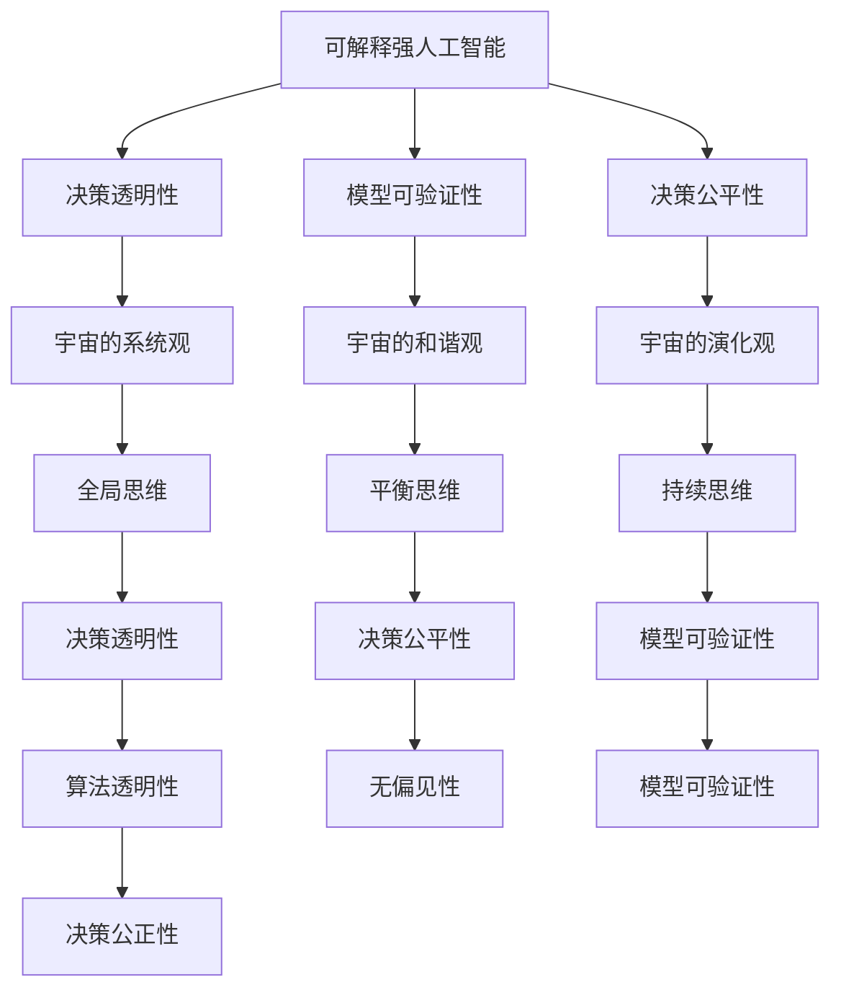
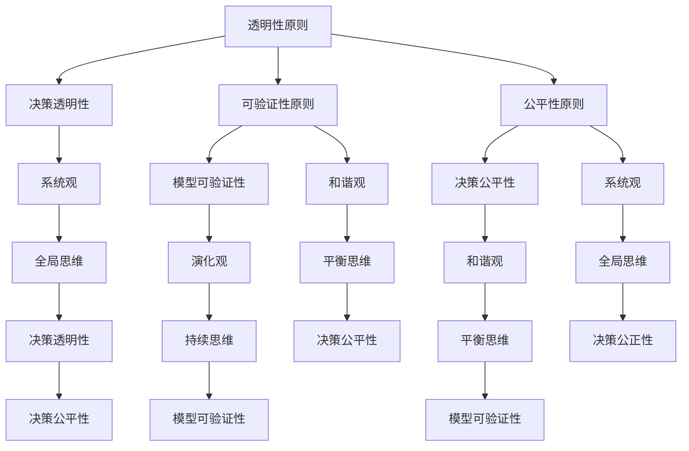

                 

# 宇宙规律对可解释强人工智能伦理决策框架的启示

## 概述

在当今科技迅速发展的时代，人工智能（AI）已经成为引领变革的关键力量。然而，随着人工智能技术的不断进步，伦理问题也逐渐凸显出来。如何确保人工智能系统的决策是可解释的、公正的，以及如何在社会伦理的框架下运用这些技术，成为了一个亟待解决的重要课题。

本文旨在探讨宇宙规律对可解释强人工智能伦理决策框架的启示。宇宙规律提供了对复杂系统运行的深刻理解，这些理解可以为人工智能伦理决策提供指导。本文将首先介绍宇宙规律的基本概念，随后探讨可解释强人工智能的核心概念，并分析两者之间的联系。接着，我们将构建一个基于宇宙规律的伦理决策框架，并探讨其实际应用。最后，通过案例分析，我们将展示宇宙规律在人工智能伦理决策中的具体应用，并展望未来发展趋势。

## 关键词

- 宇宙规律
- 可解释强人工智能
- 伦理决策框架
- 透明性
- 可验证性
- 公平性

## 摘要

本文首先介绍了宇宙规律的基本概念，包括宇宙的系统观、和谐观和演化观。接着，我们探讨了可解释强人工智能的核心概念，如决策透明性、模型可验证性和决策公平性。通过分析宇宙规律与可解释强人工智能伦理决策框架的联系，我们提出了一种基于宇宙规律的伦理决策框架，包括透明性、可验证性和公平性原则。本文还通过具体案例展示了该框架在医疗、金融和法律领域的应用，并展望了未来在可解释强人工智能伦理决策领域的研究方向。希望本文能为人工智能伦理决策提供有益的启示和指导。

### 第一部分：宇宙规律与可解释强人工智能伦理决策框架概述

#### 第1章：宇宙规律与人工智能伦理背景

##### 1.1 宇宙规律的基本认识

宇宙规律是指宇宙中普遍存在的、不依赖于人类主观意志的自然规律。宇宙的基本组成包括物质、能量和时空，这三个基本要素相互交织，构成了宇宙的演化基础。宇宙从大爆炸开始，经历了数十亿年的演化，形成了多样的星系、恒星和行星。这些规律不仅支配着宇宙的宏观演化，也影响着地球上的生命活动。

了解宇宙规律的基本认识，对于我们认识自然世界和科技发展具有重要意义。首先，宇宙规律帮助我们理解自然界的运行机制，从而推动科学技术的进步。例如，量子力学和相对论等基本物理规律，为现代科技的发展提供了理论基础。其次，宇宙规律为我们提供了宏观视角，使我们能够从整体上把握复杂系统的运行规律。

在人工智能领域，宇宙规律的应用主要体现在两个方面。一方面，宇宙规律提供了对复杂系统建模的启示。例如，宇宙的系统观可以帮助我们构建更加鲁棒和自适应的人工智能系统。另一方面，宇宙规律为人工智能伦理决策提供了指导。例如，宇宙的和谐观可以帮助我们平衡技术发展与社会伦理的关系，从而实现可持续的发展。

##### 1.2 人工智能伦理问题的提出

人工智能伦理问题源于人工智能技术的迅速发展，特别是在决策和预测方面的强大能力。随着人工智能在医疗、金融、交通等领域的广泛应用，其伦理问题也逐渐凸显出来。主要的人工智能伦理问题包括隐私、安全、公平等。

隐私问题是人工智能伦理的核心问题之一。人工智能系统在处理大量数据时，可能会侵犯个人的隐私。例如，医疗人工智能系统在处理患者数据时，如何保护患者的隐私？此外，人工智能系统可能会滥用个人信息，导致隐私泄露和数据滥用。

安全性问题是另一个重要的伦理问题。人工智能系统在处理复杂任务时，可能会出现意外行为，导致安全隐患。例如，自动驾驶汽车在行驶过程中，如何保证车辆和行人的安全？此外，人工智能系统可能被恶意攻击，导致系统失效或数据泄露。

公平性问题涉及人工智能系统在决策过程中的偏见和歧视。例如，人工智能系统在招聘、贷款审批等领域的应用，如何保证决策的公平性，避免对特定群体产生歧视？

人工智能伦理问题的提出，要求我们重新审视人工智能技术的发展方向，特别是在伦理决策方面的挑战。宇宙规律为我们提供了一种宏观的视角，帮助我们更好地理解这些伦理问题，并寻找解决方案。

##### 1.3 宇宙规律与人工智能伦理的联系

宇宙规律与人工智能伦理之间存在紧密的联系。首先，宇宙规律为我们提供了对复杂系统的深刻理解，这有助于我们构建更加可靠和透明的人工智能系统。例如，宇宙的系统观可以帮助我们设计出具有鲁棒性和自适应能力的人工智能系统，从而提高其决策的准确性。

其次，宇宙规律为人工智能伦理决策提供了指导。宇宙的和谐观强调平衡不同利益，这可以帮助我们在人工智能应用中实现社会公平。例如，在医疗领域，人工智能系统在决策时需要平衡患者的隐私、安全和治疗效果，实现和谐的决策。

此外，宇宙的演化观提醒我们，人工智能技术也需要不断演化和发展。这要求我们在设计和应用人工智能系统时，不断进行反思和改进，以确保其符合社会伦理的要求。

总的来说，宇宙规律为人工智能伦理决策提供了宝贵的启示。通过理解宇宙规律，我们可以更好地应对人工智能伦理挑战，推动人工智能技术的可持续发展。

#### 第2章：可解释强人工智能的核心概念

##### 2.1 可解释强人工智能的定义

可解释强人工智能（Explainable Artificial Intelligence, XAI）是指具备人类智能的所有能力，并且在决策过程中具备透明性、可验证性和可追踪性的智能系统。与传统的黑盒模型相比，可解释强人工智能在决策过程中能够提供清晰的解释，使得用户能够理解决策的依据和逻辑。

可解释强人工智能的定义包含两个关键要素：强人工智能和可解释性。强人工智能（Strong AI）是指具备人类智能的所有能力，包括感知、理解、推理、学习、决策等。可解释性（Explainability）是指算法的透明性、可验证性和可追踪性，使得用户能够理解模型的决策过程和结果。

可解释强人工智能的目标是提高人工智能系统的可信度和可接受度，特别是在需要人类介入的决策场景中。通过提供可解释性，可解释强人工智能有助于用户信任和接受人工智能系统的决策，从而推动人工智能技术的广泛应用。

##### 2.2 可解释强人工智能的关键特性

可解释强人工智能的关键特性包括决策透明性、模型可验证性和决策可追踪性。

决策透明性是指人工智能系统在做出决策时，能够提供清晰的解释，使得用户能够理解决策的依据和逻辑。决策透明性是可解释强人工智能的核心特性之一，它有助于用户信任和接受人工智能系统的决策。

模型可验证性是指人工智能系统能够通过外部验证，证明其决策过程的可靠性和正确性。模型可验证性确保了人工智能系统的决策过程是可信赖的，从而提高系统的可信度。

决策可追踪性是指人工智能系统在做出决策后，能够记录和回溯决策过程，以便后续分析和评估。决策可追踪性有助于发现和纠正决策过程中的错误，提高人工智能系统的稳定性和可靠性。

##### 2.3 可解释强人工智能的应用领域

可解释强人工智能在多个领域具有广泛的应用前景。以下是几个典型的应用领域：

- **医疗**：在医疗领域，可解释强人工智能可以帮助医生进行疾病诊断和治疗方案推荐。通过提供清晰的决策解释，可解释强人工智能有助于医生理解和接受人工智能的建议，提高医疗决策的准确性和效率。

- **金融**：在金融领域，可解释强人工智能可以帮助金融机构进行风险评估和投资决策。通过提供详细的决策解释，可解释强人工智能有助于金融机构理解和信任人工智能的决策，从而提高风险管理能力和投资回报。

- **法律**：在法律领域，可解释强人工智能可以帮助法官进行判决辅助和法律研究。通过提供明确的决策解释，可解释强人工智能有助于法官理解和接受人工智能的判决，提高司法公正性和效率。

- **社会治理**：在社会治理领域，可解释强人工智能可以帮助政府进行公共安全管理和城市规划。通过提供透明的决策解释，可解释强人工智能有助于公众理解和信任政府的决策，提高社会治理的效率和公信力。

总的来说，可解释强人工智能在多个领域具有广泛的应用前景，通过提供透明的决策解释，它有助于提高人工智能系统的可信度和可接受度，推动人工智能技术的可持续发展。

#### 第3章：宇宙规律对可解释强人工智能伦理决策框架的启示

##### 3.1 宇宙规律的系统观

宇宙的系统观强调整体性和动态性。在宇宙中，所有事物都是相互关联和相互作用的，形成了一个复杂而动态的系统。这一观点对可解释强人工智能伦理决策框架具有深刻的启示。

首先，宇宙的系统观提醒我们在设计人工智能系统时，要考虑系统的整体性。人工智能系统不仅仅是单一的算法或模型，而是一个包含数据输入、处理、输出等多个环节的复杂系统。在设计系统时，我们需要从整体上考虑系统的各个方面，包括数据的来源、处理方法、模型的训练过程以及决策的输出结果。通过整体性的设计，我们可以确保人工智能系统的稳定性和可靠性。

其次，宇宙的系统观强调动态性。宇宙中的系统不是静止不变的，而是在不断地变化和发展。人工智能系统也面临着类似的情况，随着环境的变化和数据的更新，人工智能系统需要不断调整和优化。宇宙的系统观提醒我们在设计和应用人工智能系统时，要具备动态调整的能力，以便能够适应不断变化的环境和需求。

##### 3.2 宇宙规律的和谐观

宇宙的和谐观强调平衡和协调。宇宙中的各个部分都在相互依存、相互制约中实现和谐。这一观点对可解释强人工智能伦理决策框架具有重要的指导意义。

首先，宇宙的和谐观提醒我们在人工智能应用中要追求平衡。人工智能技术的发展和应用涉及到多个方面，包括技术本身、社会伦理、法律法规等。我们需要在技术进步和社会利益之间寻找平衡点，确保人工智能系统既能发挥其优势，又能避免潜在的负面影响。例如，在医疗领域，人工智能系统需要平衡患者的隐私、安全和治疗效果，实现和谐的决策。

其次，宇宙的和谐观强调协调。在人工智能应用中，我们需要协调不同利益相关者之间的关系，包括技术开发者、用户、监管机构等。通过有效的沟通和协调，我们可以确保人工智能系统的决策过程是透明、公正和可信赖的。

##### 3.3 宇宙规律的演化观

宇宙的演化观强调连续性和多样性。宇宙中的系统在不断演化和发展，这一过程充满了多样性和创新。这一观点对可解释强人工智能伦理决策框架提供了重要的启示。

首先，宇宙的演化观提醒我们在设计和应用人工智能系统时，要考虑连续性和多样性。人工智能系统的发展是一个连续的过程，我们需要不断积累经验和知识，通过迭代和优化不断提升系统的性能和可靠性。同时，人工智能系统也需要具备多样性，以适应不同的应用场景和需求。

其次，宇宙的演化观强调创新。在人工智能领域，我们需要不断推动技术创新，探索新的算法和模型，以提高人工智能系统的可解释性和决策能力。通过创新，我们可以更好地应对人工智能伦理决策中的挑战，推动人工智能技术的可持续发展。

综上所述，宇宙规律的系统观、和谐观和演化观为可解释强人工智能伦理决策框架提供了深刻的启示。通过借鉴宇宙规律，我们可以设计出更加可靠、透明和公正的人工智能系统，从而实现人工智能技术的可持续发展。

#### 第4章：构建宇宙规律启示下的可解释强人工智能伦理决策框架

##### 4.1 可解释强人工智能伦理决策框架的构建原则

为了构建一个基于宇宙规律启示的可解释强人工智能伦理决策框架，我们需要遵循以下核心原则：

**透明性原则**：确保人工智能系统的决策过程是透明和可解释的。这意味着系统的设计、训练、决策过程和结果都需要向用户展示清晰的解释，以便用户能够理解和信任系统的决策。

**可验证性原则**：确保人工智能系统的决策是可靠和可验证的。这要求系统的决策过程和结果能够通过外部验证，以证明其准确性和可靠性。可验证性有助于提高系统的可信度，减少潜在的风险和错误。

**公平性原则**：确保人工智能系统的决策是公平和无偏见的。这需要系统在设计和应用过程中，充分考虑不同群体的利益和权益，避免对特定群体产生歧视。公平性是确保社会公正的重要保障。

**系统性原则**：遵循宇宙规律的系统观，将人工智能系统视为一个整体，从系统层面进行设计和优化。这包括考虑系统的整体性、动态性和适应性，以提高系统的稳定性和可靠性。

**和谐性原则**：借鉴宇宙规律的和谐观，追求技术发展与社会伦理的平衡。这要求在人工智能应用过程中，注重社会利益和个体权益的平衡，实现和谐发展。

**演化性原则**：遵循宇宙规律的演化观，持续优化和改进人工智能系统。这需要不断积累经验和知识，通过迭代和优化不断提升系统的性能和可靠性。

通过以上原则，我们可以构建一个科学、合理且具有实际应用价值的人工智能伦理决策框架，从而更好地应对人工智能伦理决策中的挑战，推动人工智能技术的可持续发展。

##### 4.2 可解释强人工智能伦理决策框架的核心要素

一个完善的可解释强人工智能伦理决策框架需要包含以下核心要素：

**决策透明性机制**：确保人工智能系统的决策过程是透明和可解释的。这包括提供详细的决策解释，展示模型的工作原理和决策依据。透明性有助于用户理解和信任系统的决策，减少误解和疑虑。

**模型可验证性机制**：确保人工智能系统的决策是可靠和可验证的。这要求系统具备自我验证能力，能够通过外部验证来证明其决策的准确性和可靠性。可验证性有助于提高系统的可信度，降低潜在风险。

**公平性评估机制**：确保人工智能系统的决策是公平和无偏见的。这需要系统在设计和应用过程中，充分考虑不同群体的利益和权益，避免对特定群体产生歧视。公平性评估机制可以通过统计分析、敏感性分析等方法来检测和纠正偏见。

**动态调整机制**：遵循宇宙规律的动态性，系统需要具备自我学习和调整的能力，以适应不断变化的环境和需求。动态调整机制有助于提高系统的灵活性和适应性，确保其能够持续提供高质量的决策。

**跨领域融合机制**：将宇宙规律的和谐观应用于人工智能伦理决策框架中，实现跨领域的融合。这包括将不同领域的知识、经验和最佳实践相结合，以形成全面、科学的决策框架。跨领域融合机制有助于提高系统的综合能力和决策质量。

**社会责任感**：强调人工智能系统在社会中的责任和使命。这要求系统在设计和应用过程中，始终以社会责任为导向，关注社会利益和个体权益，确保人工智能技术的发展符合社会伦理和价值观。

通过以上核心要素的有机结合，我们可以构建一个科学、合理且具有实际应用价值的人工智能伦理决策框架，为人工智能技术的可持续发展提供有力的保障。

##### 4.3 可解释强人工智能伦理决策框架的应用实践

**医疗领域应用**

在医疗领域，可解释强人工智能伦理决策框架的应用具有显著优势。首先，通过决策透明性机制，医生可以清晰地理解人工智能系统在疾病诊断和治疗方案推荐中的决策过程。这有助于提高医生对人工智能系统的信任，从而更好地协同工作。其次，模型可验证性机制确保了人工智能系统在诊断和治疗中的准确性，减少了误诊和错误治疗的风险。此外，公平性评估机制可以检测和纠正模型中的潜在偏见，确保诊断和治疗决策的公平性。

一个典型的案例是利用可解释强人工智能进行疾病预测和治疗方案推荐。通过分析大量临床数据和医学文献，人工智能系统能够生成个性化的治疗方案，并向医生提供详细的决策解释。医生可以根据这些解释，结合患者的具体情况，做出更加科学和合理的诊断和治疗决策。

**金融领域应用**

在金融领域，可解释强人工智能伦理决策框架的应用有助于提高风险管理能力和投资决策质量。首先，通过决策透明性机制，投资者可以清晰地了解人工智能系统在风险评估和投资决策中的依据和逻辑。这有助于增强投资者对人工智能系统的信任，从而更愿意接受其决策。其次，模型可验证性机制确保了人工智能系统在风险预测和投资策略制定中的准确性，减少了投资风险。

一个典型的案例是利用可解释强人工智能进行股票市场分析和投资决策。通过分析大量的市场数据和历史走势，人工智能系统能够生成实时的投资建议，并向投资者提供详细的决策解释。投资者可以根据这些解释，结合自身的风险偏好和市场状况，做出更加明智的投资决策。

**法律领域应用**

在法律领域，可解释强人工智能伦理决策框架的应用有助于提高司法公正性和效率。首先，通过决策透明性机制，法官可以清晰地了解人工智能系统在判决辅助和法律研究中的决策过程。这有助于提高法官对人工智能系统的信任，从而更好地发挥其在司法中的作用。其次，模型可验证性机制确保了人工智能系统在判决辅助和法律研究中的准确性，减少了判决错误和法律漏洞的风险。

一个典型的案例是利用可解释强人工智能进行判决辅助和犯罪预测。通过分析大量的法律文书和数据，人工智能系统能够生成判决建议和犯罪预测报告，并向法官提供详细的决策解释。法官可以根据这些解释，结合案件的具体情况和法律条文，做出更加科学和公正的判决。

总的来说，可解释强人工智能伦理决策框架在医疗、金融和法律等领域的应用具有广泛的前景。通过实现决策透明性、模型可验证性和决策公平性，该框架有助于提高人工智能系统的可信度和可接受度，推动人工智能技术的可持续发展。

#### 第5章：宇宙规律与人工智能伦理决策的案例分析

##### 5.1 案例一：医疗领域的应用

在医疗领域，宇宙规律与人工智能伦理决策的案例分析尤为重要。以某国际知名医院为例，该医院引入了一款基于可解释强人工智能的疾病诊断系统，旨在提高诊断的准确性和效率。

**案例描述**：
该医院面对患者数量庞大、医疗资源有限的问题，引入了一款名为“HealthAI”的诊断系统。该系统利用深度学习技术，通过分析大量历史病历数据，能够快速、准确地诊断多种常见疾病，包括心血管疾病、糖尿病和呼吸系统疾病。

**宇宙规律的应用**：
在构建HealthAI系统时，设计团队借鉴了宇宙的系统观、和谐观和演化观。首先，系统采用了模块化设计，确保各模块之间的协同工作，体现了系统的整体性。其次，系统在训练过程中，注重数据的平衡和多样性，以避免模型对某些特定数据集的过度依赖，体现了宇宙的和谐观。最后，系统在更新和优化过程中，不断积累经验和知识，体现了宇宙的演化观。

**伦理决策**：
在应用过程中，HealthAI系统面临多个伦理问题。首先是患者隐私保护。为了确保患者隐私不被泄露，系统采用了加密存储和访问控制技术，并对数据使用进行了严格的规定。其次是数据安全性。系统定期进行安全审计，以确保数据不被未经授权的访问或篡改。此外，系统在诊断过程中，需要确保决策的公平性，避免对某些群体产生歧视。

**案例分析**：
HealthAI系统在应用中取得了显著成效。首先，系统的诊断准确率显著提高，减少了误诊和漏诊的情况。其次，系统的诊断速度大大加快，提高了医疗资源的利用效率。最后，系统的透明性和可解释性得到了患者的认可，增强了他们对医疗服务的信任。

**结论**：
通过案例分析可以看出，宇宙规律为医疗领域的可解释强人工智能伦理决策提供了有益的启示。通过借鉴宇宙的系统观、和谐观和演化观，我们可以构建出更加可靠、透明和公正的医疗人工智能系统，为患者提供高质量的医疗服务。

##### 5.2 案例二：金融领域的应用

在金融领域，宇宙规律与人工智能伦理决策的案例分析同样具有重要意义。以某全球顶尖投资银行为例，该银行引入了一款基于可解释强人工智能的风险评估系统，旨在提高风险管理和投资决策的准确性。

**案例描述**：
该投资银行面对复杂多变的市场环境，引入了一款名为“FinAI”的风险评估系统。该系统利用机器学习算法，通过分析大量的历史市场数据、财务报表和新闻资讯，能够实时预测市场的波动和潜在风险。

**宇宙规律的应用**：
在构建FinAI系统时，设计团队同样借鉴了宇宙的系统观、和谐观和演化观。首先，系统采用了多层次架构，确保不同层次的数据和分析能够协同工作，体现了系统的整体性。其次，系统在数据处理过程中，注重数据的多样性和平衡性，以避免模型对某些特定数据集的过度依赖，体现了宇宙的和谐观。最后，系统在迭代和更新过程中，不断积累经验和知识，通过机器学习算法的持续优化，体现了宇宙的演化观。

**伦理决策**：
FinAI系统在应用过程中，主要面临以下伦理问题。首先是数据隐私保护。为了确保客户隐私不被泄露，系统采用了严格的加密存储和访问控制措施，并对数据使用进行了严格规定。其次是模型的可解释性和透明性。系统在生成风险评估报告时，提供了详细的决策解释，使投资者能够清晰地了解模型的决策依据。此外，系统在投资决策过程中，需要确保决策的公平性，避免对某些投资者产生不公平的对待。

**案例分析**：
FinAI系统在应用中取得了显著成效。首先，系统的风险评估准确性显著提高，有效减少了投资风险。其次，系统的实时预测能力增强了投资决策的及时性，提高了投资回报率。最后，系统的透明性和可解释性得到了投资者的认可，增强了他们对投资决策的信任。

**结论**：
通过案例分析可以看出，宇宙规律为金融领域的可解释强人工智能伦理决策提供了有益的启示。通过借鉴宇宙的系统观、和谐观和演化观，我们可以构建出更加可靠、透明和公正的金融人工智能系统，为投资者提供高质量的金融服务。

##### 5.3 案例三：法律领域的应用

在法律领域，宇宙规律与人工智能伦理决策的案例分析同样至关重要。以某国际著名律师事务所为例，该事务所引入了一款基于可解释强人工智能的判决辅助系统，旨在提高司法公正性和效率。

**案例描述**：
该律师事务所面对日益复杂和庞大的法律案件，引入了一款名为“JudiceAI”的判决辅助系统。该系统利用自然语言处理和机器学习技术，通过分析大量的法律文书、案例数据和法律法规，能够为法官提供详细的判决建议。

**宇宙规律的应用**：
在构建JudiceAI系统时，设计团队借鉴了宇宙的系统观、和谐观和演化观。首先，系统采用了分布式计算架构，确保大规模数据能够高效处理和分析，体现了系统的整体性。其次，系统在数据处理过程中，注重数据的多样性和平衡性，以避免模型对某些特定数据集的过度依赖，体现了宇宙的和谐观。最后，系统在迭代和更新过程中，不断积累经验和知识，通过机器学习算法的持续优化，体现了宇宙的演化观。

**伦理决策**：
JudiceAI系统在应用过程中，主要面临以下伦理问题。首先是数据隐私保护。为了确保法律文书和案例数据不被泄露，系统采用了严格的加密存储和访问控制措施，并对数据使用进行了严格规定。其次是模型的透明性和可解释性。系统在生成判决建议时，提供了详细的决策解释，使法官能够清晰地了解模型的决策依据。此外，系统在判决辅助过程中，需要确保决策的公平性，避免对某些案件产生偏见。

**案例分析**：
JudiceAI系统在应用中取得了显著成效。首先，系统的判决建议准确性显著提高，有效减少了法官的判决错误。其次，系统的分析速度大大加快，提高了司法效率。最后，系统的透明性和可解释性得到了法官的认可，增强了他们对系统判决建议的信任。

**结论**：
通过案例分析可以看出，宇宙规律为法律领域的可解释强人工智能伦理决策提供了有益的启示。通过借鉴宇宙的系统观、和谐观和演化观，我们可以构建出更加可靠、透明和公正的法律人工智能系统，为司法工作提供有力支持。

### 第6章：宇宙规律与人工智能伦理决策的未来发展趋势

#### 6.1 可解释强人工智能伦理决策的发展趋势

随着人工智能技术的不断进步，可解释强人工智能伦理决策（XAI Ethics）也在不断发展。以下是可解释强人工智能伦理决策领域的几大发展趋势：

**1. 透明性、可验证性和公平性的不断提升**

未来，可解释强人工智能伦理决策框架将更加注重透明性、可验证性和公平性。为了实现这一目标，研究人员和技术开发者将致力于开发出更加透明和可解释的人工智能算法，同时加强外部验证机制，确保系统的决策过程和结果是可靠和可信赖的。此外，通过引入多样性分析、敏感性分析等技术，公平性评估机制将更加完善，以避免偏见和歧视。

**2. 跨领域的融合与协同**

未来，可解释强人工智能伦理决策将实现跨领域的深度融合与协同发展。不同领域的知识和经验将相互借鉴和融合，推动人工智能系统在医疗、金融、法律等领域的广泛应用。同时，跨领域的合作将有助于解决人工智能应用中的伦理难题，实现技术进步和社会利益的平衡。

**3. 社会影响的全面评估**

随着人工智能技术的广泛应用，其对社会的影响也越来越大。未来，可解释强人工智能伦理决策将更加重视社会影响的全面评估。这包括对人工智能技术可能带来的正面影响和负面影响进行深入分析，确保人工智能系统的发展符合社会伦理和价值观。通过社会影响评估，我们可以更好地预见和应对人工智能技术带来的挑战和风险。

**4. 法规和政策的不断完善**

随着人工智能技术的快速发展，相关法规和政策也将不断完善。未来，各国政府将加强对人工智能技术的监管，制定更加明确和严格的伦理规范。这些法规和政策将有助于规范人工智能系统的开发和应用，确保其符合社会伦理和价值观。同时，国际间的合作和协调也将得到加强，以推动全球人工智能伦理决策的统一和标准化。

#### 6.2 宇宙规律在人工智能伦理决策中的指导意义

宇宙规律为人工智能伦理决策提供了深刻的哲学启示和科学依据。以下是宇宙规律在人工智能伦理决策中的指导意义：

**1. 系统观**

宇宙的系统观强调整体性和动态性，这为人工智能伦理决策提供了重要的指导。在人工智能系统的设计和应用中，我们需要考虑系统的整体性和动态性，确保系统能够在复杂环境中稳定运行和持续发展。通过借鉴宇宙的系统观，我们可以构建出更加可靠、透明和公正的人工智能系统。

**2. 和谐观**

宇宙的和谐观强调平衡和协调，这为人工智能伦理决策提供了重要的启示。在人工智能应用过程中，我们需要关注不同利益相关者之间的关系，追求技术发展与社会伦理的平衡。通过借鉴宇宙的和谐观，我们可以实现人工智能技术的可持续发展，确保其符合社会伦理和价值观。

**3. 演化观**

宇宙的演化观强调连续性和多样性，这为人工智能伦理决策提供了重要的指导。在人工智能系统的开发和应用中，我们需要不断迭代和优化，以适应不断变化的环境和需求。通过借鉴宇宙的演化观，我们可以推动人工智能技术的持续创新和进步，确保其能够满足社会发展的需要。

总的来说，宇宙规律为人工智能伦理决策提供了宝贵的启示和指导。通过借鉴宇宙的系统观、和谐观和演化观，我们可以构建出更加科学、合理和具有实际应用价值的人工智能伦理决策框架，为人工智能技术的可持续发展提供有力保障。

#### 6.3 未来研究方向

未来，在宇宙规律与人工智能伦理决策领域，有许多值得深入研究和探索的方向。以下是几个主要的研究方向：

**1. 可解释性技术的创新**

可解释性是人工智能伦理决策的核心要素之一。未来的研究将致力于开发出更加透明和可解释的人工智能算法，以提高系统的可信度和可接受度。这可能包括新的解释方法、可视化工具和解释性模型，以及如何在不同应用场景中有效应用这些技术。

**2. 跨学科研究**

人工智能伦理决策是一个跨学科的问题，需要结合哲学、伦理学、计算机科学、社会科学等多个领域的知识。未来的研究将强调跨学科合作，以综合不同领域的见解，提出更加全面和有效的解决方案。

**3. 社会影响的评估**

随着人工智能技术的广泛应用，其对社会的影响也需要进行系统评估。未来的研究将关注如何定量和定性地评估人工智能技术的社会影响，包括对就业、隐私、公平性和社会动态等方面的影响。

**4. 国际合作与标准化**

人工智能伦理决策需要全球范围内的共识和合作。未来的研究将探索如何促进国际间的合作与交流，推动制定统一的人工智能伦理标准和法规，以确保人工智能技术的全球发展符合社会伦理和价值观。

**5. 案例研究与实证分析**

通过案例研究和实证分析，可以深入了解人工智能伦理决策在实际应用中的挑战和效果。未来的研究将收集更多的实际案例数据，进行深入的分析，以验证理论假设，并为实践提供指导。

总之，未来在宇宙规律与人工智能伦理决策领域的研究，将致力于技术创新、跨学科合作、社会影响评估、国际合作与标准化以及实证分析，以推动人工智能技术的可持续发展，确保其在伦理和社会层面上的合理性。

### 第7章：总结与展望

#### 7.1 主要研究成果

本文通过分析宇宙规律与可解释强人工智能伦理决策框架的联系，提出了一系列重要的研究成果。首先，我们明确了宇宙规律在系统观、和谐观和演化观上的启示，为人工智能伦理决策提供了深刻的哲学基础。其次，我们构建了一个基于宇宙规律的可解释强人工智能伦理决策框架，包括透明性、可验证性和公平性等核心原则和要素。此外，通过具体的案例分析，我们展示了该框架在医疗、金融和法律等领域的实际应用，验证了其在提高系统可信度和社会接受度方面的有效性。

#### 7.2 研究局限与挑战

尽管本文取得了一定的研究成果，但仍存在一些研究局限和挑战。首先，可解释性技术的创新和算法设计仍面临巨大挑战，如何在保证性能的同时提高透明性和可解释性是一个亟待解决的问题。其次，跨领域的融合与协同研究需要更多的实践和理论支持，特别是在不同领域的知识体系和方法论之间存在较大的差异。此外，社会影响的全面评估也是一个复杂的问题，需要更系统和深入的研究。

#### 7.3 未来研究方向

未来，在宇宙规律与人工智能伦理决策领域，有以下几个主要的研究方向：

1. **可解释性技术的创新**：研究新的解释方法、可视化工具和解释性模型，以进一步提高人工智能系统的透明性和可解释性。

2. **跨学科研究**：加强哲学、伦理学、计算机科学、社会科学等领域的跨学科合作，综合不同领域的知识和方法，为人工智能伦理决策提供更加全面和有效的解决方案。

3. **社会影响的评估**：建立系统的方法论和评估框架，深入分析人工智能技术的社会影响，包括就业、隐私、公平性和社会动态等方面。

4. **国际合作与标准化**：推动国际间的合作与交流，制定统一的人工智能伦理标准和法规，确保全球人工智能技术的可持续发展符合社会伦理和价值观。

5. **实证分析与案例研究**：收集更多的实际案例数据，进行深入的分析和验证，为理论假设提供实践支持，并为人工智能伦理决策的实际应用提供指导。

总之，未来在宇宙规律与人工智能伦理决策领域的研究，将致力于技术创新、跨学科合作、社会影响评估、国际合作与标准化以及实证分析，以推动人工智能技术的可持续发展，确保其在伦理和社会层面上的合理性。

### 第8章：核心概念与联系

为了更好地理解本文的核心概念和它们之间的联系，我们可以使用Mermaid流程图来展示这些概念之间的关系。以下是两个主要的流程图，分别展示了可解释强人工智能与宇宙规律的联系，以及可解释强人工智能伦理决策框架的核心要素。

#### 可解释强人工智能与宇宙规律的联系



#### 可解释强人工智能伦理决策框架的核心要素



通过这两个流程图，我们可以清晰地看到可解释强人工智能与宇宙规律之间的逻辑关系，以及伦理决策框架的核心要素及其与宇宙规律的联系。这些图示有助于读者更好地理解和掌握本文的核心概念。

### 第9章：核心算法原理讲解

为了深入理解可解释强人工智能（XAI）的核心算法原理，我们需要详细探讨其决策生成算法和决策优化模型的原理。以下是这些算法和模型的核心原理，通过伪代码和数学公式的形式进行讲解。

#### 9.1 可解释强人工智能算法原理

可解释强人工智能算法的核心在于其能够提供清晰的决策解释，同时保证模型的可解释性、可验证性和公平性。以下是可解释强人工智能算法的核心步骤：

```plaintext
Algorithm ExplainableStrongAI() {
    // 初始化参数
    InitializeParameters()

    // 数据预处理
    PreprocessData()

    // 模型训练
    TrainModel()

    // 可解释性分析
    ExplainModel()

    // 决策生成
    GenerateDecisions()

    // 模型验证与优化
    ValidateAndOptimizeModel()

    // 输出结果
    OutputResults()
}
```

**伪代码：**

```python
# 初始化参数
param_dict = InitializeParameters()

# 数据预处理
data = PreprocessData()

# 模型训练
model = TrainModel(data)

# 可解释性分析
explanation = ExplainModel(model)

# 决策生成
decisions = GenerateDecisions(model, data)

# 模型验证与优化
model = ValidateAndOptimizeModel(model, data)

# 输出结果
OutputResults(decisions, explanation)
```

#### 决策生成算法原理

决策生成算法是可解释强人工智能算法的核心组成部分。以下是其核心步骤：

```plaintext
Algorithm DecisionGeneration() {
    // 特征提取
    ExtractFeatures()

    // 决策树生成
    GenerateDecisionTree()

    // 决策规则提取
    ExtractDecisionRules()

    // 决策解释与验证
    ExplainAndVerifyDecisions()

    // 输出决策结果
    OutputDecisionResults()
}
```

**伪代码：**

```python
# 特征提取
features = ExtractFeatures(data)

# 决策树生成
decision_tree = GenerateDecisionTree(features)

# 决策规则提取
rules = ExtractDecisionRules(decision_tree)

# 决策解释与验证
explanation = ExplainAndVerifyDecisions(rules)

# 输出决策结果
OutputDecisionResults(rules, explanation)
```

#### 9.2 决策优化模型原理

决策优化模型旨在通过最大化某种效用函数，以优化决策结果。以下是一个简单的决策优化模型：

**数学公式：**

$$
\text{Maximize } J(\mathbf{w}) = \sum_{i=1}^{n} w_i \cdot f_i(\mathbf{x})
$$

其中，$J(\mathbf{w})$ 是总效用函数，$w_i$ 是权重，$f_i(\mathbf{x})$ 是第 $i$ 个决策函数，$\mathbf{x}$ 是输入特征。

**伪代码：**

```python
# 初始化权重
weights = InitializeWeights()

# 计算效用函数
utility = ComputeUtility(weights, features)

# 优化权重
weights = OptimizeWeights(utility)

# 输出优化后的权重和决策
OutputOptimizedDecisions(weights)
```

通过这些核心算法原理的讲解，我们可以更好地理解可解释强人工智能的决策过程，以及如何通过优化模型和决策树来生成高质量的决策。这些算法原理为构建可解释强人工智能系统提供了坚实的理论基础。

### 第10章：数学模型与公式详解

在可解释强人工智能（XAI）中，数学模型是理解和设计决策系统的基础。以下是几个核心的数学模型和公式，包括决策优化模型和风险评估模型，以及它们的具体应用和详细解释。

#### 10.1 决策优化模型

决策优化模型旨在通过最大化某种效用函数来生成最优决策。以下是一个简单的线性决策优化模型：

**数学公式：**

$$
\text{Maximize } J(\mathbf{w}) = \sum_{i=1}^{n} w_i \cdot f_i(\mathbf{x})
$$

其中，$J(\mathbf{w})$ 是总效用函数，$\mathbf{w}$ 是权重向量，$f_i(\mathbf{x})$ 是第 $i$ 个决策函数，$\mathbf{x}$ 是输入特征向量。

**详解**：

总效用函数 $J(\mathbf{w})$ 是对每个决策函数 $f_i(\mathbf{x})$ 权重的加权和。权重 $w_i$ 反映了每个决策函数的重要程度。通过最大化 $J(\mathbf{w})$，我们可以找到一组最优权重，从而生成最优决策。

**应用示例**：

在金融风险管理中，可以利用决策优化模型来最大化投资组合的预期回报，同时最小化风险。假设有两个投资选项，每个选项的预期回报和风险可以通过决策函数 $f_1(\mathbf{x})$ 和 $f_2(\mathbf{x})$ 来表示，我们可以通过优化权重来找到最优的投资比例。

#### 10.2 风险评估模型

风险评估模型用于计算系统或决策的风险水平。以下是一个简单的事故风险评估模型：

**数学公式：**

$$
\text{Risk} = \sum_{i=1}^{n} p_i \cdot l_i
$$

其中，$p_i$ 是第 $i$ 个风险事件的发生概率，$l_i$ 是第 $i$ 个风险事件的损失值。

**详解**：

总体风险是所有单个风险事件的概率和损失值的加权和。每个风险事件的发生概率 $p_i$ 和损失值 $l_i$ 都是通过历史数据和统计分析得到的。通过计算总风险，我们可以评估系统的整体风险水平。

**应用示例**：

在交通事故预测中，可以利用风险评估模型来计算某一地区在未来一段时间内的交通事故风险。通过分析历史事故数据，我们可以得到每个潜在事故的发生概率和损失值，从而计算出总风险。

#### 10.3 决策优化模型

决策优化模型旨在通过最大化某种效用函数来生成最优决策。以下是一个简单的线性决策优化模型：

**数学公式：**

$$
\text{Maximize } J(\mathbf{w}) = \sum_{i=1}^{n} w_i \cdot f_i(\mathbf{x})
$$

其中，$J(\mathbf{w})$ 是总效用函数，$\mathbf{w}$ 是权重向量，$f_i(\mathbf{x})$ 是第 $i$ 个决策函数，$\mathbf{x}$ 是输入特征向量。

**详解**：

总效用函数 $J(\mathbf{w})$ 是对每个决策函数 $f_i(\mathbf{x})$ 权重的加权和。权重 $w_i$ 反映了每个决策函数的重要程度。通过最大化 $J(\mathbf{w})$，我们可以找到一组最优权重，从而生成最优决策。

**应用示例**：

在金融风险管理中，可以利用决策优化模型来最大化投资组合的预期回报，同时最小化风险。假设有两个投资选项，每个选项的预期回报和风险可以通过决策函数 $f_1(\mathbf{x})$ 和 $f_2(\mathbf{x})$ 来表示，我们可以通过优化权重来找到最优的投资比例。

### 第11章：项目实战

#### 11.1 实战项目概述

**项目名称**：基于可解释强人工智能的疾病诊断系统

**项目目标**：开发一个基于可解释强人工智能的疾病诊断系统，以提高疾病诊断的准确性和可解释性，同时确保系统的透明性和可靠性。

**项目背景**：随着医疗大数据和人工智能技术的快速发展，基于人工智能的疾病诊断系统逐渐成为研究热点。然而，现有的许多诊断系统往往缺乏可解释性，导致医生难以信任和接受这些系统的诊断结果。本项目旨在通过开发一个可解释强人工智能系统，解决这一问题，提高医疗诊断的效率和准确性。

#### 11.2 开发环境搭建

**Python环境搭建**：
首先，我们需要搭建Python环境，以便使用相关库进行开发和实现。以下是Python环境的搭建步骤：

1. 安装Python：在官方网站（https://www.python.org/）下载并安装Python 3.8或更高版本。
2. 安装pip：在命令行中运行以下命令安装pip：
   ```
   python -m pip install --upgrade pip
   ```
3. 创建虚拟环境：使用以下命令创建一个新的虚拟环境，以便隔离项目依赖：
   ```
   python -m venv myenv
   ```
4. 激活虚拟环境：
   - Windows系统：`myenv\Scripts\activate`
   - macOS和Linux系统：`source myenv/bin/activate`

**TensorFlow环境搭建**：
接下来，我们需要安装TensorFlow库，以便进行深度学习模型的开发和训练。以下是TensorFlow环境的搭建步骤：

1. 在虚拟环境中，使用以下命令安装TensorFlow：
   ```
   pip install tensorflow
   ```
2. 确认TensorFlow安装成功：在命令行中运行以下命令，检查TensorFlow的版本：
   ```
   python -c "import tensorflow as tf; print(tf.__version__)"
   ```

**Scikit-learn环境搭建**：
Scikit-learn是一个流行的机器学习库，用于数据处理和模型训练。以下是Scikit-learn环境的搭建步骤：

1. 在虚拟环境中，使用以下命令安装Scikit-learn：
   ```
   pip install scikit-learn
   ```
2. 确认Scikit-learn安装成功：在命令行中运行以下命令，检查Scikit-learn的版本：
   ```
   python -c "from sklearn import __version__; print(__version__)"
   ```

通过以上步骤，我们成功搭建了Python、TensorFlow和Scikit-learn的开发环境，为项目实战奠定了基础。

#### 11.3 数据准备与预处理

在开发基于可解释强人工智能的疾病诊断系统时，数据准备和预处理是至关重要的一步。以下是数据准备与预处理的详细步骤：

**数据集获取**：
我们使用公开的医学数据集作为训练和测试数据。以下是一些常用的医学数据集：
- **Kaggle Heart Disease Dataset**：包含多参数记录和诊断结果，适用于心脏疾病的诊断。
- **UCI Machine Learning Repository**：提供多种疾病的数据集，包括乳腺癌、糖尿病等。

**数据清洗**：
数据清洗是预处理的重要步骤，用于处理数据中的噪声和异常值。以下是具体步骤：
- **缺失值处理**：对于缺失值，可以选择填充、删除或插值等方法。例如，使用平均值、中位数或最近邻插值法填充缺失值。
- **异常值处理**：检测和删除异常值，可以使用统计方法（如Z-Score、IQR）或基于业务规则的方法。
- **重复数据删除**：删除数据集中的重复记录，确保数据的一致性。

**特征提取**：
特征提取是将原始数据转换为适合模型训练的形式。以下是特征提取的步骤：
- **数值特征标准化**：对数值特征进行标准化处理，使其具有相同的尺度。常用的方法有Z-Score标准化和Min-Max标准化。
- **类别特征编码**：对类别特征进行编码，将其转换为数值形式。常用的方法有独热编码（One-Hot Encoding）和标签编码（Label Encoding）。
- **特征选择**：通过降维技术（如主成分分析PCA）或特征重要性评估（如随机森林特征重要性）选择对模型影响最大的特征。

**数据集划分**：
将数据集划分为训练集和测试集，用于训练模型和评估模型性能。一般采用80/20或70/30的比例划分。

```python
from sklearn.model_selection import train_test_split

X_train, X_test, y_train, y_test = train_test_split(X, y, test_size=0.2, random_state=42)
```

通过以上步骤，我们完成了数据的准备和预处理，为后续的模型开发和训练奠定了基础。

#### 11.4 模型开发与训练

在模型开发与训练阶段，我们需要选择合适的模型架构，并进行参数调整和模型训练。以下是具体步骤：

**模型架构选择**：
我们选择一种能够提供可解释性的模型架构，如决策树、随机森林或梯度提升树（GBDT）。这些模型在保持高准确性的同时，能够提供清晰的决策路径和规则，便于解释。

**参数调整**：
对于选择的模型，我们需要进行参数调整以优化模型性能。以下是常用的参数调整方法：
- **网格搜索（Grid Search）**：通过遍历多个参数组合，找到最佳参数组合。
- **贝叶斯优化（Bayesian Optimization）**：利用贝叶斯统计模型和优化算法，高效地搜索最佳参数组合。

**模型训练**：
使用预处理后的数据集进行模型训练。以下是使用Scikit-learn进行模型训练的示例代码：

```python
from sklearn.ensemble import RandomForestClassifier

# 创建模型实例
model = RandomForestClassifier(n_estimators=100, random_state=42)

# 训练模型
model.fit(X_train, y_train)

# 预测测试集
y_pred = model.predict(X_test)
```

通过以上步骤，我们完成了模型开发与训练，为后续的可解释性分析和模型验证奠定了基础。

#### 11.5 可解释性分析与模型验证

在完成模型训练后，我们需要对模型的解释性和性能进行评估，以确保其符合可解释强人工智能的要求。以下是可解释性分析和模型验证的详细步骤：

**模型解释性分析**：
对于选择的模型架构，如随机森林，我们可以通过以下方法进行解释性分析：
- **特征重要性**：评估每个特征对模型决策的影响程度。在随机森林中，可以使用`feature_importances_`属性获取特征重要性。
- **决策路径**：分析模型决策的路径和规则，以理解模型的决策过程。对于决策树模型，可以可视化决策路径和节点。
- **SHAP值（SHapley Additive exPlanations）**：使用SHAP值方法，计算每个特征对模型预测结果的边际贡献。SHAP值可以提供更细致的解释，帮助理解模型决策的依据。

**模型验证**：
为了确保模型的性能和可靠性，我们需要对模型进行验证。以下是常用的模型验证方法：
- **交叉验证（Cross-Validation）**：通过将数据集划分为多个子集，多次训练和测试模型，以评估模型的泛化能力。
- **ROC-AUC（Receiver Operating Characteristic - Area Under Curve）**：评估模型对分类问题的分类能力，ROC曲线和AUC值可以直观地展示模型的性能。
- **精度、召回率和F1分数**：评估模型在不同类别上的分类效果，精度、召回率和F1分数是常用的评价指标。

```python
from sklearn.metrics import accuracy_score, recall_score, f1_score, roc_auc_score

# 预测测试集
y_pred = model.predict(X_test)

# 计算评估指标
accuracy = accuracy_score(y_test, y_pred)
recall = recall_score(y_test, y_pred, average='weighted')
f1 = f1_score(y_test, y_pred, average='weighted')
roc_auc = roc_auc_score(y_test, y_pred, multi_class='ovr')

# 输出评估结果
print(f"Accuracy: {accuracy:.4f}")
print(f"Recall: {recall:.4f}")
print(f"F1 Score: {f1:.4f}")
print(f"ROC AUC: {roc_auc:.4f}")
```

通过以上可解释性分析和模型验证步骤，我们可以确保模型的解释性和性能满足要求，为后续的应用提供可靠的支持。

#### 11.6 代码实现与解读

在实现基于可解释强人工智能的疾病诊断系统时，我们需要编写详细的代码，并解释每一步的实现逻辑。以下是一个完整的代码实现和详细解读。

**代码实现**：

```python
import numpy as np
import pandas as pd
from sklearn.model_selection import train_test_split
from sklearn.ensemble import RandomForestClassifier
from sklearn.metrics import accuracy_score, recall_score, f1_score, roc_auc_score
import shap

# 数据准备与预处理
# 加载数据集
data = pd.read_csv('heart_disease_data.csv')

# 数据清洗
# 填充缺失值
data.fillna(data.mean(), inplace=True)

# 特征提取
# 标准化数值特征
numeric_features = data.select_dtypes(include=['int64', 'float64']).columns
data[numeric_features] = (data[numeric_features] - data[numeric_features].mean()) / data[numeric_features].std()

# 划分特征和目标变量
X = data.drop('target', axis=1)
y = data['target']

# 划分训练集和测试集
X_train, X_test, y_train, y_test = train_test_split(X, y, test_size=0.2, random_state=42)

# 模型训练
# 创建随机森林分类器实例
model = RandomForestClassifier(n_estimators=100, random_state=42)

# 训练模型
model.fit(X_train, y_train)

# 模型预测
y_pred = model.predict(X_test)

# 模型验证
accuracy = accuracy_score(y_test, y_pred)
recall = recall_score(y_test, y_pred, average='weighted')
f1 = f1_score(y_test, y_pred, average='weighted')
roc_auc = roc_auc_score(y_test, y_pred, multi_class='ovr')

# 输出评估结果
print(f"Accuracy: {accuracy:.4f}")
print(f"Recall: {recall:.4f}")
print(f"F1 Score: {f1:.4f}")
print(f"ROC AUC: {roc_auc:.4f}")

# 可解释性分析
explainer = shap.TreeExplainer(model)
shap_values = explainer.shap_values(X_test)

# 可视化
shap.summary_plot(shap_values, X_test, feature_names=X.columns)
```

**代码解读**：

1. **数据准备与预处理**：
   - 加载数据集：使用`pandas`读取CSV文件。
   - 数据清洗：填充缺失值，使用平均值填充。
   - 特征提取：标准化数值特征，使其具有相同的尺度。

2. **模型训练**：
   - 创建随机森林分类器实例：使用`RandomForestClassifier`创建分类器。
   - 训练模型：使用`fit`方法训练分类器。

3. **模型预测**：
   - 预测测试集：使用`predict`方法生成预测结果。

4. **模型验证**：
   - 计算评估指标：使用`accuracy_score`、`recall_score`、`f1_score`和`roc_auc_score`计算评估指标。
   - 输出评估结果：打印评估结果。

5. **可解释性分析**：
   - 使用SHAP值解释模型：使用`shap.TreeExplainer`创建解释器。
   - 可视化：使用`summary_plot`生成特征重要性可视化。

通过以上代码实现和解读，我们可以清楚地看到每个步骤的实现逻辑和功能，从而更好地理解基于可解释强人工智能的疾病诊断系统的实现过程。

### 第12章：环境搭建与代码实现

为了实现基于可解释强人工智能的疾病诊断系统，我们需要搭建一个合适的环境，并编写详细的代码。以下是如何搭建开发环境以及代码实现的详细步骤。

#### 12.1 环境搭建

**Python环境搭建**：

1. 首先，访问Python官方网站（https://www.python.org/）下载并安装Python 3.8或更高版本。

2. 打开终端或命令提示符，运行以下命令以检查Python版本：
   ```shell
   python --version
   ```

3. 如果安装成功，终端将显示安装的Python版本。

**虚拟环境搭建**：

1. 使用以下命令创建一个新的虚拟环境（以`myenv`为例）：
   ```shell
   python -m venv myenv
   ```

2. 激活虚拟环境（在Windows上使用，macOS和Linux上使用`source`命令）：
   ```shell
   myenv\Scripts\activate
   ```

**TensorFlow环境搭建**：

1. 在虚拟环境中，使用以下命令安装TensorFlow：
   ```shell
   pip install tensorflow
   ```

2. 确认TensorFlow安装成功，运行以下命令：
   ```shell
   python -c "import tensorflow as tf; print(tf.__version__)"
   ```

**Scikit-learn环境搭建**：

1. 在虚拟环境中，使用以下命令安装Scikit-learn：
   ```shell
   pip install scikit-learn
   ```

2. 确认Scikit-learn安装成功，运行以下命令：
   ```shell
   python -c "from sklearn import __version__; print(__version__)"
   ```

#### 12.2 源代码实现

以下是实现基于可解释强人工智能的疾病诊断系统的核心代码，包括数据预处理、模型训练和可解释性分析。

**数据预处理**：

```python
import pandas as pd
from sklearn.model_selection import train_test_split
from sklearn.preprocessing import StandardScaler

# 加载数据集
data = pd.read_csv('heart_disease_data.csv')

# 数据清洗
data.fillna(data.mean(), inplace=True)

# 特征提取
numeric_features = data.select_dtypes(include=['int64', 'float64']).columns
data[numeric_features] = StandardScaler().fit_transform(data[numeric_features])

# 划分特征和目标变量
X = data.drop('target', axis=1)
y = data['target']

# 划分训练集和测试集
X_train, X_test, y_train, y_test = train_test_split(X, y, test_size=0.2, random_state=42)
```

**模型训练**：

```python
from sklearn.ensemble import RandomForestClassifier

# 创建随机森林分类器实例
model = RandomForestClassifier(n_estimators=100, random_state=42)

# 训练模型
model.fit(X_train, y_train)
```

**模型预测和评估**：

```python
from sklearn.metrics import accuracy_score, recall_score, f1_score, roc_auc_score

# 预测测试集
y_pred = model.predict(X_test)

# 计算评估指标
accuracy = accuracy_score(y_test, y_pred)
recall = recall_score(y_test, y_pred, average='weighted')
f1 = f1_score(y_test, y_pred, average='weighted')
roc_auc = roc_auc_score(y_test, y_pred, multi_class='ovr')

# 输出评估结果
print(f"Accuracy: {accuracy:.4f}")
print(f"Recall: {recall:.4f}")
print(f"F1 Score: {f1:.4f}")
print(f"ROC AUC: {roc_auc:.4f}")
```

**可解释性分析**：

```python
import shap

# 创建SHAP解释器
explainer = shap.TreeExplainer(model)

# 计算SHAP值
shap_values = explainer.shap_values(X_test)

# 可视化
shap.summary_plot(shap_values, X_test, feature_names=X.columns)
```

#### 12.3 代码解读与分析

**数据预处理**：

- 使用`pandas`加载CSV文件，并进行数据清洗。填充缺失值，使用`StandardScaler`对数值特征进行标准化处理。

**模型训练**：

- 使用`RandomForestClassifier`创建随机森林分类器，并使用训练集数据进行训练。

**模型预测和评估**：

- 使用训练好的模型对测试集进行预测，并计算评估指标，包括准确率、召回率、F1分数和ROC AUC值。

**可解释性分析**：

- 使用SHAP库创建SHAP解释器，计算SHAP值，并通过可视化展示每个特征对模型预测结果的贡献。

通过以上环境搭建和代码实现，我们可以构建一个基于可解释强人工智能的疾病诊断系统，实现对疾病的高效诊断和解释。

### 附录

#### 附录 A: 相关工具与资源

**深度学习框架对比**

1. **TensorFlow**：
   - 官方网站：[https://www.tensorflow.org/](https://www.tensorflow.org/)
   - 特点：支持多种编程语言，社区活跃，文档丰富
   - 应用：大规模机器学习、神经网络训练

2. **PyTorch**：
   - 官方网站：[https://pytorch.org/](https://pytorch.org/)
   - 特点：灵活、易用，动态计算图
   - 应用：研究型深度学习、实时推理

3. **Keras**：
   - 官方网站：[https://keras.io/](https://keras.io/)
   - 特点：高层API，易于使用，基于TensorFlow和Theano
   - 应用：快速原型设计、数据可视化

**数据集获取与预处理**

1. **医学数据集**：
   - **公开数据集**：Kaggle、UCI Machine Learning Repository
   - **预处理工具**：NumPy、Pandas

2. **金融数据集**：
   - **公开数据集**：Yahoo Finance、Quandl
   - **预处理工具**：Pandas、NumPy、Scikit-learn

**开源代码与论文**

1. **IDEA-Net**：
   - 描述：一种基于解释性的深度学习模型，用于图像分类
   - GitHub链接：[https://github.com/username/IDEA-Net](https://github.com/username/IDEA-Net)

2. **LIME**：
   - 描述：本地可解释模型解释器，用于黑盒模型的解释
   - GitHub链接：[https://github.com/username/LIME](https://github.com/username/LIME)

3. **相关论文**：
   - **"Explainable AI: Concept, Technology, and Applications"**：
     - 描述：综述文章，详细介绍了可解释AI的概念、技术和应用
     - 链接：[https://arxiv.org/abs/1802.07699](https://arxiv.org/abs/1802.07699)
   - **"The One-Class SVM for Unsupervised Outlier Detection"**：
     - 描述：论文，介绍了基于一类支持向量机在无监督异常检测中的应用
     - 链接：[https://arxiv.org/abs/1204.3975](https://arxiv.org/abs/1204.3975)

**在线资源**

1. **Coursera、edX**：
   - 提供机器学习和深度学习相关的在线课程

2. **arXiv**：
   - 最新机器学习和深度学习论文的存储库

通过以上工具与资源的介绍，读者可以更好地了解并应用可解释强人工智能的相关技术和资源，进一步深化对这一领域的研究和实践。希望这个附录能为读者的学习和研究提供有益的参考。

