                 

# 实时推荐系统：AI的应用

> **关键词：实时推荐系统、人工智能、协同过滤、深度学习、算法优化、用户行为分析**

> **摘要：本文将深入探讨实时推荐系统的基本概念、架构、核心算法以及AI应用，分析其性能优化策略和未来发展趋势。通过对实时推荐系统在AI领域的重要应用进行详细讲解，帮助读者理解并掌握这一技术，从而为实际开发提供有力支持。**

---

### 第一部分：实时推荐系统的基本概念

#### 第1章：实时推荐系统概述

##### 1.1 什么是实时推荐系统

实时推荐系统是一种基于用户行为和内容信息的推荐系统，其目标是在用户实时交互的过程中，为用户推荐最相关的商品、内容或服务。与传统推荐系统相比，实时推荐系统具有更高的实时性和动态性，能够快速响应用户需求，提升用户体验。

##### 1.2 实时推荐系统的应用场景

实时推荐系统广泛应用于电商、新闻、社交媒体、视频平台等领域，其主要应用场景包括：

- 电商：根据用户浏览、收藏、购买行为推荐商品；
- 新闻：根据用户阅读偏好推荐新闻；
- 社交媒体：根据用户互动行为推荐内容；
- 视频平台：根据用户观看历史推荐视频。

##### 1.3 实时推荐系统的发展历程

实时推荐系统的发展历程可以分为以下几个阶段：

- 传统推荐系统：基于用户历史行为和内容特征进行推荐；
- 协同过滤推荐系统：利用用户之间的相似度进行推荐；
- 基于内容的推荐系统：基于内容相似度进行推荐；
- 深度学习推荐系统：利用深度学习模型进行推荐。

##### 1.4 实时推荐系统与传统推荐系统的对比

实时推荐系统与传统推荐系统的对比主要体现在以下几个方面：

- **实时性**：实时推荐系统具有更高的实时性，能够快速响应用户需求；
- **动态性**：实时推荐系统可以根据用户实时行为进行调整，具有更高的动态性；
- **个性化**：实时推荐系统通过分析用户实时行为，提供更个性化的推荐；
- **多样性**：实时推荐系统需要保证推荐结果的多样性，以避免用户产生疲劳感。

#### 第2章：实时推荐系统的基本架构

##### 2.1 数据采集与处理

实时推荐系统的数据采集主要包括用户行为数据、商品内容数据等。数据采集后，需要进行数据清洗、转换和存储，以便后续处理。

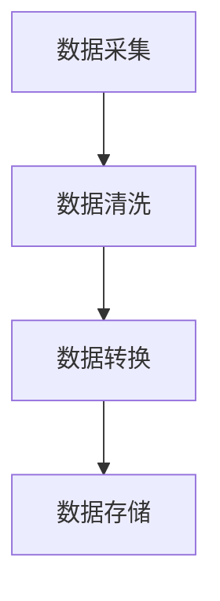

##### 2.2 用户画像构建

用户画像构建是基于用户行为数据和用户特征信息，通过数据分析和机器学习算法，构建出用户画像。用户画像可以用于推荐系统中的用户行为预测和个性化推荐。

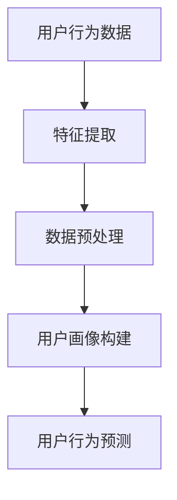

##### 2.3 推荐算法选择

实时推荐系统的推荐算法主要包括基于内容的推荐算法、协同过滤推荐算法和基于模型的推荐算法。选择合适的推荐算法，可以提升推荐系统的效果和性能。

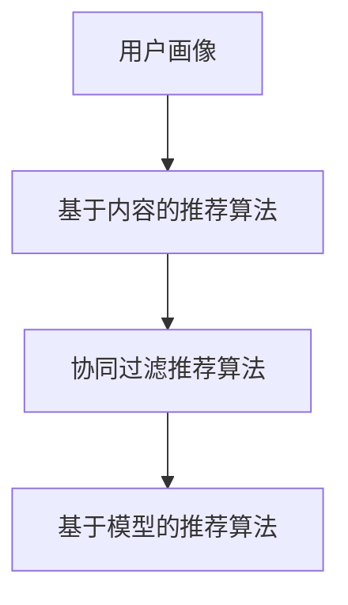

##### 2.4 推荐结果呈现

推荐结果呈现是将推荐算法生成的推荐结果，通过可视化界面展示给用户。推荐结果的呈现方式可以包括列表、卡片、瀑布流等，以提升用户体验。

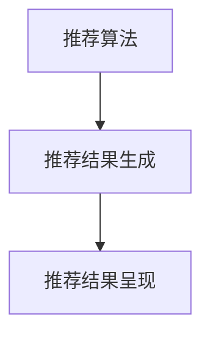

#### 第3章：实时推荐系统的核心算法

##### 3.1 基于内容的推荐算法

基于内容的推荐算法主要通过分析用户兴趣和内容特征，找到用户感兴趣的内容进行推荐。核心算法包括特征提取、相似度计算和推荐列表生成。

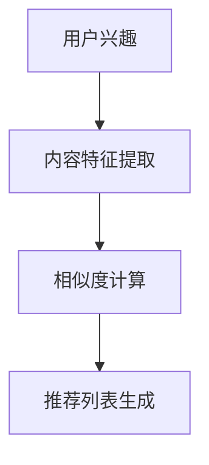

##### 3.2 协同过滤推荐算法

协同过滤推荐算法通过分析用户之间的相似度，找到相似用户喜欢的商品或内容进行推荐。核心算法包括用户相似度计算、商品相似度计算和推荐列表生成。

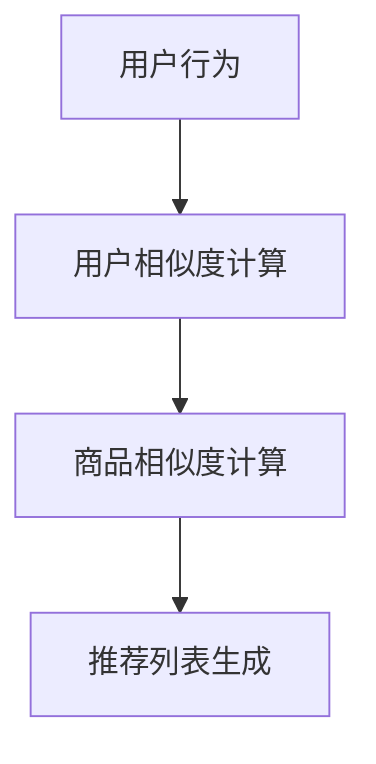

##### 3.3 基于模型的推荐算法

基于模型的推荐算法通过构建用户行为模型或内容模型，预测用户对商品的喜好程度，从而进行推荐。核心算法包括线性回归、决策树、神经网络等。

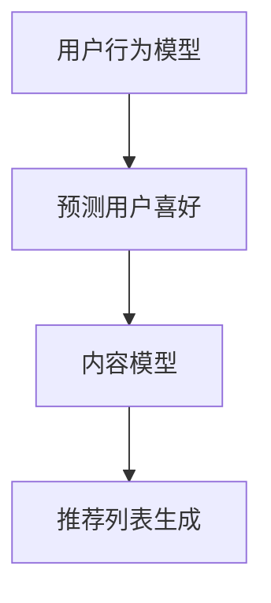

##### 3.4 深度学习在推荐系统中的应用

深度学习在推荐系统中的应用主要基于深度神经网络，通过自动学习用户行为和内容特征，提高推荐系统的效果。核心算法包括卷积神经网络（CNN）、循环神经网络（RNN）和生成对抗网络（GAN）。

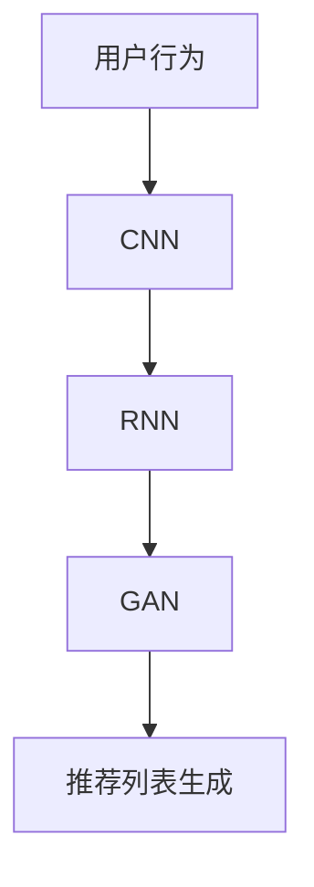

#### 第4章：实时推荐系统的性能优化

##### 4.1 推荐结果的实时性优化

推荐结果的实时性优化主要包括数据传输、算法优化和系统架构优化等方面。通过降低延迟、提高计算速度和优化系统性能，提升推荐结果的实时性。

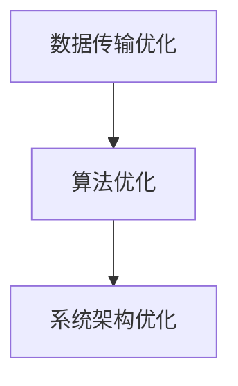

##### 4.2 推荐结果的相关性优化

推荐结果的相关性优化主要通过改进推荐算法、优化特征提取和相似度计算等方法，提高推荐结果的相关性，避免出现冷启动或推荐效果差的问题。

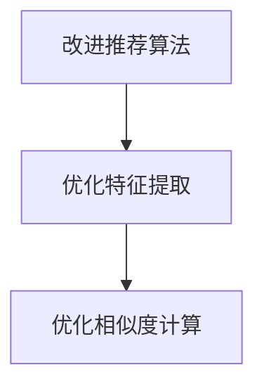

##### 4.3 推荐结果的多样性优化

推荐结果的多样性优化主要通过平衡用户兴趣、内容多样性和推荐结果多样性，避免用户产生疲劳感，提高用户体验。

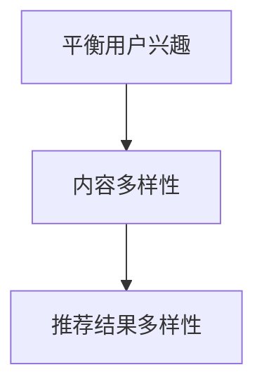

##### 4.4 推荐结果的公平性优化

推荐结果的公平性优化主要通过消除偏见、避免过度推荐和优化推荐结果排序等方式，确保推荐结果的公平性，提高用户满意度。

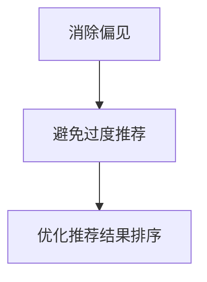

### 第二部分：实时推荐系统的AI应用

#### 第5章：数据挖掘与用户行为分析

##### 5.1 用户行为数据的收集与处理

用户行为数据的收集主要包括用户浏览、点击、收藏、购买等行为。数据处理包括数据清洗、转换和存储，为后续分析提供高质量的数据。

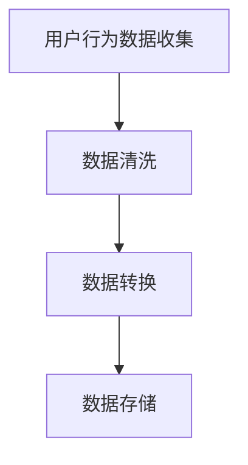

##### 5.2 用户兴趣模型的构建

用户兴趣模型构建主要通过分析用户行为数据，提取用户兴趣特征，构建用户兴趣模型。用户兴趣模型可以用于推荐系统的用户行为预测和个性化推荐。

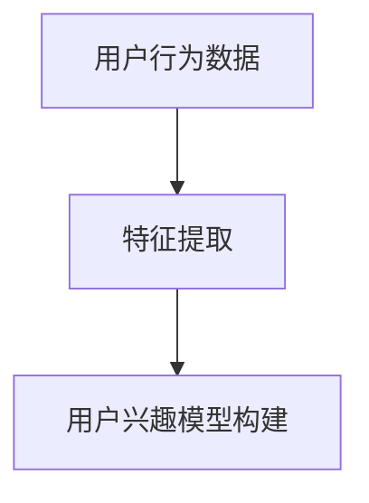

##### 5.3 用户行为预测模型

用户行为预测模型主要通过机器学习算法，预测用户未来的行为。用户行为预测模型可以提高推荐系统的预测准确率，提升用户体验。

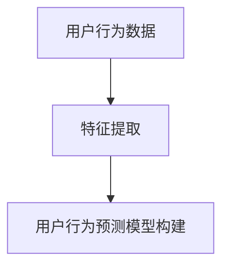

##### 5.4 用户群体分析

用户群体分析主要通过聚类算法，将用户分为不同的群体，分析各群体之间的差异和特征。用户群体分析可以用于优化推荐策略，提升推荐效果。

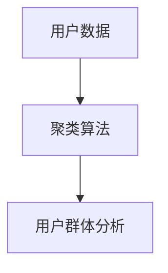

#### 第6章：深度学习在实时推荐系统中的应用

##### 6.1 深度学习基础

深度学习是模拟人脑神经网络进行特征提取和模式识别的一种机器学习技术。深度学习包括卷积神经网络（CNN）、循环神经网络（RNN）和生成对抗网络（GAN）等。

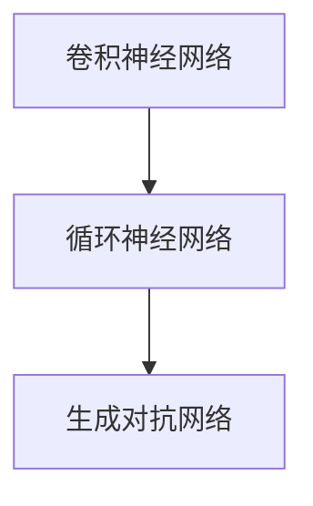

##### 6.2 深度学习在推荐系统中的应用

深度学习在推荐系统中的应用主要包括用户行为预测、商品特征提取和推荐算法优化等方面。通过引入深度学习，可以提高推荐系统的准确率和效果。

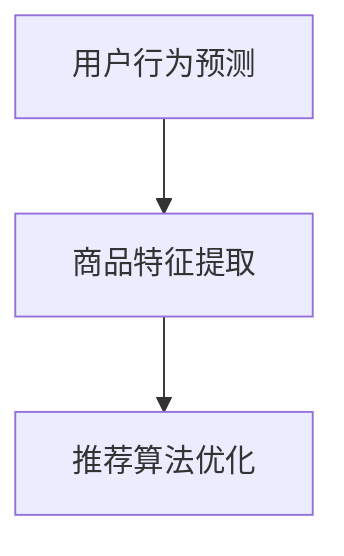

##### 6.3 深度学习算法的优化

深度学习算法的优化主要包括网络结构优化、参数优化和训练优化等方面。通过优化深度学习算法，可以提高推荐系统的性能和效果。

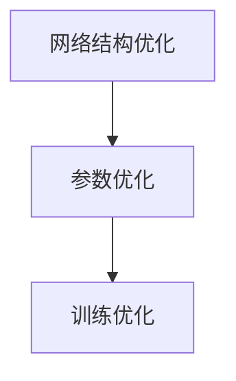

##### 6.4 案例分析：深度学习在推荐系统中的应用

深度学习在推荐系统中的应用案例包括阿里云的推荐系统、谷歌的YouTube推荐系统等。通过案例分析，可以深入了解深度学习在推荐系统中的应用方法和效果。

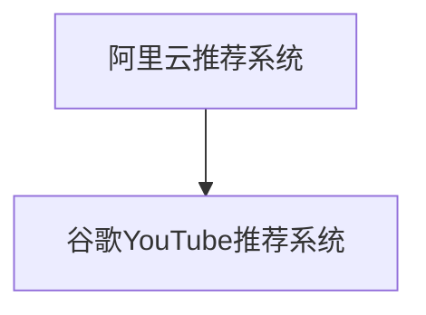

#### 第7章：实时推荐系统的部署与运维

##### 7.1 实时推荐系统的部署

实时推荐系统的部署主要包括硬件设备选择、软件环境配置和部署流程设计等方面。通过合理的部署方案，可以提高推荐系统的性能和稳定性。

```mermaid
graph TD
A[硬件设备选择] --> B[软件环境配置]
B --> C[部署流程设计]
```

##### 7.2 实时推荐系统的监控与报警

实时推荐系统的监控与报警主要包括系统运行状态监控、性能监控和异常报警等方面。通过实时监控和报警，可以确保推荐系统的正常运行和快速响应。

```mermaid
graph TD
A[系统运行状态监控] --> B[性能监控]
B --> C[异常报警]
```

##### 7.3 实时推荐系统的性能调优

实时推荐系统的性能调优主要包括算法优化、硬件优化和系统优化等方面。通过性能调优，可以提高推荐系统的效果和性能。

```mermaid
graph TD
A[算法优化] --> B[硬件优化]
B --> C[系统优化]
```

##### 7.4 实时推荐系统的安全性保障

实时推荐系统的安全性保障主要包括数据安全、系统安全和用户隐私保护等方面。通过安全性保障，可以确保推荐系统的可靠性和用户信任。

```mermaid
graph TD
A[数据安全] --> B[系统安全]
B --> C[用户隐私保护]
```

#### 第8章：实时推荐系统的未来发展

##### 8.1 实时推荐系统的挑战与机遇

实时推荐系统面临的挑战主要包括数据质量、计算性能和算法优化等方面。随着AI技术的不断发展，实时推荐系统也迎来了新的机遇。

```mermaid
graph TD
A[数据质量] --> B[计算性能]
B --> C[算法优化]
```

##### 8.2 实时推荐系统的未来发展趋势

实时推荐系统的未来发展趋势主要包括以下方面：

- 深度学习与推荐系统的深度融合；
- 跨平台、跨领域的推荐系统应用；
- 智能化、个性化的推荐体验；
- 数据隐私保护和合规性。

```mermaid
graph TD
A[深度学习融合] --> B[跨平台应用]
B --> C[智能化体验]
```

##### 8.3 AI在实时推荐系统中的应用前景

AI在实时推荐系统中的应用前景主要包括：

- 用户行为预测和个性化推荐；
- 新型推荐算法研发；
- 智能推荐系统设计。

```mermaid
graph TD
A[用户行为预测] --> B[新型算法研发]
B --> C[智能推荐系统设计]
```

##### 8.4 结论与展望

实时推荐系统作为AI应用的重要领域，具有广泛的应用前景和重要的社会价值。在未来，随着AI技术的不断进步，实时推荐系统将在提升用户体验、促进产业升级等方面发挥更大的作用。

```mermaid
graph TD
A[应用前景] --> B[社会价值]
B --> C[产业升级]
```

### 附录

#### 附录A：实时推荐系统开发工具与资源

- **主流实时推荐系统框架对比**：介绍常见实时推荐系统框架的特点和优缺点，帮助开发者选择合适的框架。
- **实时推荐系统开发常用库与工具**：介绍实时推荐系统开发中常用的库和工具，包括数据采集、处理、存储和推荐算法等。
- **实时推荐系统学习资源推荐**：推荐一些实时推荐系统相关的学习资源，包括书籍、课程、论文和博客等。

```mermaid
graph TD
A[框架对比] --> B[常用库与工具]
B --> C[学习资源推荐]
```

#### 附录B：Mermaid流程图示例

- **用户画像构建流程**：介绍用户画像构建的基本流程，包括数据采集、特征提取、用户画像构建和用户行为预测等。
- **深度学习在推荐系统中的应用流程**：介绍深度学习在推荐系统中的应用流程，包括数据预处理、模型训练、模型评估和模型部署等。

```mermaid
graph TD
A[用户画像构建流程] --> B[深度学习应用流程]
```

#### 附录C：数学模型和公式

- **协同过滤算法中的相似度计算**：介绍协同过滤算法中相似度计算的基本公式和计算方法。
- **基于内容的推荐算法中的特征提取**：介绍基于内容的推荐算法中特征提取的基本公式和计算方法。
- **深度学习算法中的损失函数**：介绍深度学习算法中的损失函数，包括均方误差（MSE）、交叉熵损失（CE）等。

```mermaid
graph TD
A[协同过滤相似度计算] --> B[内容特征提取公式]
B --> C[深度学习损失函数]
```

#### 附录D：项目实战案例

- **实时推荐系统的代码实现**：介绍实时推荐系统的代码实现，包括数据采集、处理、推荐算法和推荐结果呈现等。
- **实时推荐系统的性能分析**：介绍实时推荐系统的性能分析，包括实时性、相关性和多样性等方面的分析。
- **实时推荐系统的案例解读与分析**：介绍实时推荐系统的实际案例，分析其应用场景、技术实现和效果评估。

```mermaid
graph TD
A[代码实现] --> B[性能分析]
B --> C[案例解读与分析]
```

#### 附录E：代码解析

- **用户画像构建代码解析**：介绍用户画像构建的核心代码，包括数据预处理、特征提取和用户画像构建等。
- **推荐算法实现代码解析**：介绍推荐算法实现的核心代码，包括算法选择、模型训练和推荐结果生成等。
- **深度学习模型训练与评估代码解析**：介绍深度学习模型训练与评估的核心代码，包括数据预处理、模型训练和模型评估等。
- **实时推荐系统部署与运维代码解析**：介绍实时推荐系统部署与运维的核心代码，包括部署脚本、监控脚本和性能调优等。

```mermaid
graph TD
A[用户画像构建代码] --> B[推荐算法代码]
B --> C[深度学习模型代码]
C --> D[部署与运维代码]
```

### 作者信息

- 作者：AI天才研究院/AI Genius Institute & 禅与计算机程序设计艺术 /Zen And The Art of Computer Programming

---

**结束语**

本文详细介绍了实时推荐系统的基本概念、架构、核心算法和AI应用，分析了其性能优化策略和未来发展趋势。希望本文能为读者提供有价值的参考，助力实时推荐系统的开发与应用。在AI技术的推动下，实时推荐系统将在更多领域发挥重要作用，为用户提供更优质的服务体验。

---

**特别感谢**

感谢AI天才研究院/AI Genius Institute的专家团队为本文提供的技术支持和指导，以及禅与计算机程序设计艺术/Zen And The Art of Computer Programming一书的启发。同时，感谢广大读者对本文的关注与支持。期待与您共同探索实时推荐系统的更多应用和前景。**

