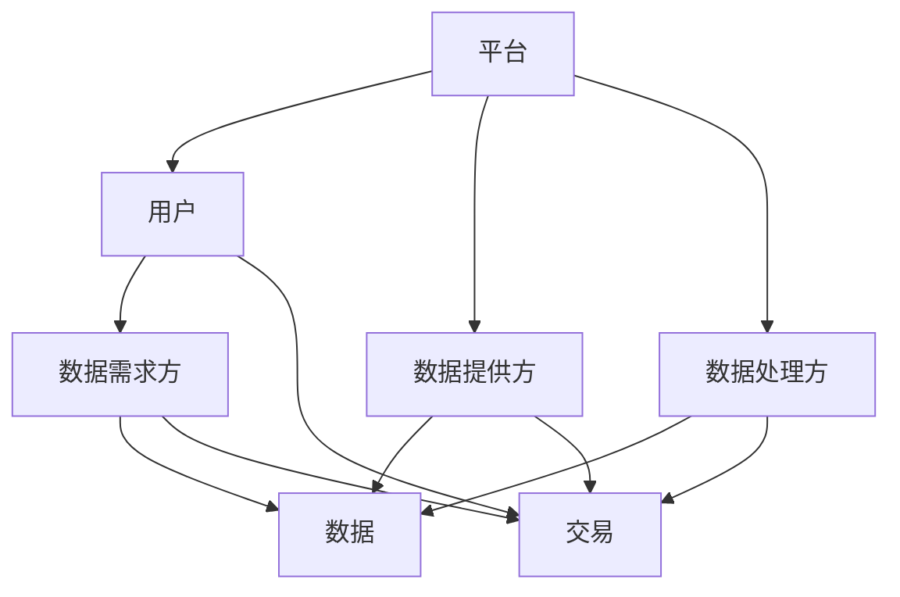
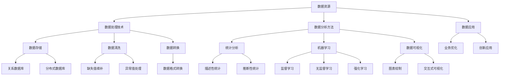
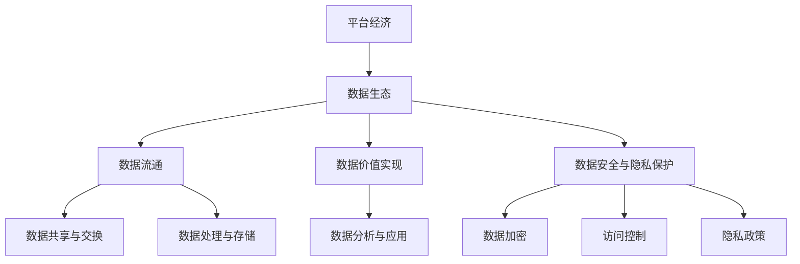

                 

### 《平台经济的数据生态构建策略：如何构建健康的数据生态？》

> **关键词：** 平台经济、数据生态、数据治理、数据共享、数据安全、隐私保护

> **摘要：** 本文将探讨平台经济中数据生态构建的关键策略，分析如何通过合理的数据生态构建策略来促进健康的数据生态发展。文章将从平台经济概述、数据生态构建、健康数据生态的构建以及实践案例等方面进行详细阐述，旨在为从业者提供有益的参考和指导。

### 《平台经济的数据生态构建策略：如何构建健康的数据生态？》目录大纲

#### 第一部分：平台经济概述

## 第1章：平台经济的概念与特征

### 1.1 平台经济的定义与类型

平台经济是一种以数字平台为核心的经济模式，通过提供中介服务连接供需双方，实现资源的高效配置。平台经济的类型包括C2C、B2B、B2C等。

### 1.2 平台经济的核心特征

平台经济的核心特征包括网络效应、长尾效应、边际成本递减等。

### 1.3 平台经济的价值体现

平台经济通过降低交易成本、提高交易效率、拓展市场空间等方式，为参与者带来显著的价值。

## 第2章：平台经济的理论基础

### 2.1 平台经济的经济学原理

平台经济的理论基础包括双边市场理论、网络效应理论等。

### 2.2 平台经济的网络效应分析

平台经济的网络效应表现为用户越多，平台的价值就越大。

### 2.3 平台经济的竞争策略

平台经济的竞争策略包括差异化竞争、成本领先竞争等。

#### 第二部分：数据生态构建

## 第3章：数据生态的核心要素

### 3.1 数据资源的分类与价值

数据资源可分为结构化数据、半结构化数据和非结构化数据，每种类型的数据都具有独特的价值。

### 3.2 数据处理与存储技术

数据处理与存储技术包括数据采集、清洗、存储和计算等。

### 3.3 数据分析与挖掘方法

数据分析和挖掘方法包括统计分析、机器学习等。

## 第4章：数据生态的构建原则

### 4.1 数据开放与共享

数据开放与共享是数据生态构建的基础。

### 4.2 数据质量与安全

数据质量与安全是数据生态构建的关键。

### 4.3 数据隐私保护

数据隐私保护是数据生态构建的必要条件。

## 第5章：数据生态的构建策略

### 5.1 平台角色的定位与分工

平台角色的定位与分工是数据生态构建的核心。

### 5.2 平台间的合作与竞争

平台间的合作与竞争是数据生态构建的重要方面。

### 5.3 平台的数据治理机制

平台的数据治理机制是数据生态构建的重要保障。

#### 第三部分：健康数据生态的构建

## 第6章：健康数据生态的特征

### 6.1 数据流通的顺畅性

数据流通的顺畅性是健康数据生态的重要特征。

### 6.2 数据价值的最大化

数据价值的最大化是健康数据生态的目标。

### 6.3 数据安全与隐私保护

数据安全与隐私保护是健康数据生态的必要保障。

## 第7章：健康数据生态的实践案例

### 7.1 案例一：电商平台的数据生态构建

### 7.2 案例二：社交媒体平台的数据生态建设

### 7.3 案例三：金融行业的数据生态应用

## 第8章：健康数据生态的挑战与未来发展趋势

### 8.1 数据生态中的法律与伦理问题

### 8.2 技术创新与数据生态的发展

### 8.3 数据生态的未来展望

#### 第四部分：附录

## 附录A：相关术语与概念解释

### A.1 平台经济相关术语
### A.2 数据生态相关术语
### A.3 数据治理相关术语

## 附录B：数据生态构建策略参考

### B.1 数据生态构建策略概述
### B.2 数据生态构建策略实施步骤
### B.3 数据生态构建策略评估指标

### 第9章：数据生态项目实战

#### 9.1 实战背景

描述实战项目背景，说明项目目标与数据来源。

#### 9.2 开发环境搭建

介绍项目所需的技术栈与开发环境，如Python、Hadoop、Spark等。

#### 9.3 数据处理与存储

详细讲解数据采集、清洗、存储的过程，包括使用到的技术和工具。

#### 9.4 数据分析与挖掘

使用伪代码展示数据挖掘算法的实现过程，如K-means聚类、决策树分类等。

#### 9.5 结果分析与解读

对项目结果进行详细分析，包括数据可视化、性能评估等。

#### 9.6 项目总结与反思

对项目过程进行总结，提出改进意见，为后续项目提供参考。

### 作者

AI天才研究院/AI Genius Institute & 禅与计算机程序设计艺术 /Zen And The Art of Computer Programming
### 第一部分：平台经济概述

#### 第1章：平台经济的概念与特征

平台经济，作为当代数字经济的重要组成部分，以其独特的商业模式和运作机制，推动了社会生产力的巨大提升。本章将深入探讨平台经济的定义、类型及其核心特征，为后续数据生态构建策略的讨论奠定基础。

### 1.1 平台经济的定义与类型

平台经济，通常指通过互联网或数字技术构建的一种商业模式，它以一个平台为核心，连接供给方和需求方，促进双方之间的交易和互动。平台经济可以分为以下几种类型：

1. **C2C（消费者对消费者）**：如淘宝、eBay等，消费者可以直接在平台上买卖商品或服务。
2. **B2B（企业对企业）**：如阿里巴巴的1688平台，为企业提供批发采购服务。
3. **B2C（企业对消费者）**：如亚马逊、京东等，企业通过平台直接销售商品给消费者。
4. **B2B2C（企业对商家对消费者）**：如苏宁易购，企业通过平台与商家合作，再由商家销售给消费者。

平台经济的核心在于其能够有效降低交易成本、提高交易效率，并且通过数字化的手段实现更广泛的市场覆盖。不同类型的平台经济，虽然运营模式各异，但都共享一些共同的特征，如网络效应、长尾效应和边际成本递减等。

### 1.2 平台经济的核心特征

平台经济具有以下几个核心特征：

1. **网络效应**：平台的价值随着用户数量的增加而增加。用户越多，平台对于其他用户的吸引力就越大，从而形成良性循环。
2. **长尾效应**：平台经济使得小众市场也能得到满足，从而扩大了市场覆盖范围，实现了长尾效应。
3. **边际成本递减**：随着用户数量的增加，平台运营的边际成本（即每增加一个用户所需的成本）逐渐降低。

这些特征使得平台经济在资源整合、市场扩展和效率提升方面具有显著优势。

### 1.3 平台经济的价值体现

平台经济的价值体现在以下几个方面：

1. **降低交易成本**：通过提供中介服务，平台简化了交易流程，降低了交易成本。
2. **提高交易效率**：平台提供了便捷的搜索、匹配和支付功能，大大提高了交易效率。
3. **拓展市场空间**：平台经济打破了地域和时间的限制，使得企业能够触及更广阔的市场。
4. **促进创新**：平台经济为创业者提供了低成本、低风险的创业环境，促进了创新和创业活动。

通过上述分析，我们可以看到，平台经济不仅在理论上具有强大的解释力，而且在实践中也展现出了巨大的发展潜力。理解平台经济的概念、类型和核心特征，对于我们深入探讨数据生态构建策略具有重要意义。

#### 第2章：平台经济的理论基础

平台经济的快速发展不仅源于其独特的商业模式，还离不开坚实的理论基础。本章将介绍平台经济的经济学原理，分析平台经济的网络效应，并探讨平台经济的竞争策略。

### 2.1 平台经济的经济学原理

平台经济的理论基础主要包括双边市场理论、网络效应理论等。

#### 双边市场理论

双边市场理论认为，市场由两个或多个相互依赖的群体组成，例如供需双方。平台经济的核心在于如何协调和平衡这两边群体的利益，以实现整体市场效率的最大化。平台通过创造连接供需双方的机会，降低双方的交易成本，从而创造价值。

#### 网络效应理论

网络效应理论指出，产品或服务的价值随着使用该产品或服务的人数增加而增加。在平台经济中，网络效应尤为重要。平台的价值随着用户数量的增加而增加，因为更多的用户吸引了更多的供需双方，从而形成一个正反馈循环。这种效应使得平台能够快速获得市场份额，并且一旦形成市场主导地位，就很难被其他竞争者超越。

#### 2.2 平台经济的网络效应分析

平台经济的网络效应可以分为直接网络效应和间接网络效应。

1. **直接网络效应**：直接网络效应是指一个用户的加入会增加其他用户的价值。例如，在一个社交平台上，用户越多，其他用户就越有可能加入，因为这意味着更多的朋友和联系。

2. **间接网络效应**：间接网络效应是指一个用户的加入会增加另一个用户群体的价值。例如，在电商平台中，买家的增加会吸引更多的卖家加入平台，从而提供更多的商品选择，增加了买家的价值。

平台经济的网络效应分析揭示了平台增长和用户参与的重要性。为了实现平台的快速增长，平台需要采取一系列策略来吸引和保留用户，例如提供优质的用户体验、增加平台的知名度和可信度等。

#### 2.3 平台经济的竞争策略

平台经济的竞争不仅仅是市场份额的争夺，更是一场网络效应的博弈。以下是一些常见的平台竞争策略：

1. **差异化竞争**：通过提供独特的产品或服务，平台可以吸引特定的用户群体。差异化竞争的关键在于如何发现并满足用户的特定需求。

2. **成本领先竞争**：通过降低运营成本，平台可以在价格上具有竞争优势。成本领先竞争需要平台在规模经济、技术效率和供应链管理等方面具备显著优势。

3. **锁定用户策略**：通过提供额外的服务或优惠，平台可以增加用户的转换成本，从而提高用户的忠诚度。例如，通过会员制度、积分奖励等方式，平台可以锁定用户，防止他们转向竞争对手。

4. **生态系统构建**：通过构建一个生态系统，平台可以吸引更多的参与者加入，从而增加平台的价值。生态系统的构建需要平台提供开放的平台接口、支持第三方开发和合作等。

通过上述分析，我们可以看到，平台经济的理论基础为其提供了坚实的科学依据，而网络效应和竞争策略的分析则为平台的发展提供了具体的指导。理解这些理论和方法，有助于我们更好地把握平台经济的发展趋势，制定有效的数据生态构建策略。

#### 第二部分：数据生态构建

#### 第3章：数据生态的核心要素

数据生态是平台经济中的重要组成部分，它涉及到数据资源、数据处理与存储技术、数据分析与挖掘方法等多个方面。本章将详细探讨数据生态的核心要素，为构建健康的数据生态奠定基础。

### 3.1 数据资源的分类与价值

数据资源是数据生态构建的基础，根据数据的结构性和来源，可以将其分为以下几类：

1. **结构化数据**：这类数据通常具有明确的字段和格式，如数据库中的记录、表格数据等。结构化数据便于存储、检索和分析，是企业进行数据管理和决策支持的重要资源。

2. **半结构化数据**：这类数据具有一定的结构，但不像结构化数据那样严格，如XML、JSON等格式的数据。半结构化数据通常来自于业务系统日志、网页抓取等。

3. **非结构化数据**：这类数据没有固定的结构，如文本、图片、音频、视频等。非结构化数据在信息传播、娱乐消费等领域具有重要价值。

不同类型的数据具有不同的价值。结构化数据通常用于业务决策和数据分析，半结构化数据可以用于业务监控和用户体验优化，而非结构化数据则可以用于个性化推荐和信息检索。

### 3.2 数据处理与存储技术

数据处理与存储技术是数据生态构建的重要支撑。以下是几种常用的数据处理与存储技术：

1. **数据采集**：数据采集是数据处理的第一步，常用的方法包括API调用、日志收集、网络爬虫等。数据采集的关键在于如何高效、准确地获取所需数据。

2. **数据清洗**：数据清洗是指对采集到的数据进行预处理，去除重复、缺失和错误的数据。数据清洗的方法包括数据去重、缺失值填补、异常值处理等。

3. **数据存储**：数据存储涉及如何高效、安全地存储大量数据。常用的数据存储技术包括关系型数据库（如MySQL、PostgreSQL）、NoSQL数据库（如MongoDB、Redis）和分布式存储系统（如Hadoop HDFS）。

4. **数据归档**：对于长时间不需要访问的历史数据，可以采用数据归档技术，将其从在线存储迁移到低成本、低访问频率的存储介质上。

### 3.3 数据分析与挖掘方法

数据分析与挖掘是数据生态的核心价值体现。以下是一些常用的数据分析与挖掘方法：

1. **统计分析**：统计分析方法包括描述性统计、推断性统计等，用于描述数据的特征、关系和趋势。

2. **机器学习**：机器学习方法包括监督学习、无监督学习和强化学习等，用于从数据中自动发现规律和模式。

3. **深度学习**：深度学习方法基于多层神经网络，能够处理大量复杂数据，并在图像识别、自然语言处理等领域取得了显著成果。

4. **数据可视化**：数据可视化是将数据以图形或图像的形式呈现，帮助用户理解和分析数据。

通过上述分析，我们可以看到，数据资源、数据处理与存储技术、数据分析与挖掘方法是构建健康数据生态的关键要素。理解这些要素及其相互关系，有助于我们更有效地管理和利用数据，推动数据生态的健康发展。

#### 第4章：数据生态的构建原则

在构建数据生态的过程中，需要遵循一系列核心原则，以确保数据生态的健康、稳定和可持续发展。这些原则涵盖了数据开放与共享、数据质量与安全、数据隐私保护等多个方面。

### 4.1 数据开放与共享

数据开放与共享是构建健康数据生态的重要原则。数据开放意味着将数据以透明、可访问的方式提供给所有相关方，而数据共享则是指在不同组织和个体之间交换和利用数据。数据开放与共享的原则如下：

1. **透明性**：数据开放应该确保所有用户都能够清晰地了解数据的来源、格式、内容和使用条件。
2. **互操作性**：数据共享需要采用统一的数据标准和技术规范，以实现不同系统之间的数据交换和集成。
3. **无障碍访问**：数据开放与共享应该尽可能降低访问门槛，使所有用户，尤其是小型企业和个人用户，都能够方便地获取和使用数据。

数据开放与共享不仅能够提高数据的利用效率，还能够激发创新和创业活动，推动整个数据生态的繁荣发展。

### 4.2 数据质量与安全

数据质量与安全是数据生态构建的核心原则之一。高质量的数据能够为决策提供可靠的依据，而数据安全则关系到整个生态系统的稳定性和可持续性。以下是数据质量与安全的原则：

1. **准确性**：数据应当准确无误，避免错误和虚假信息的传播。
2. **完整性**：数据应包含所有必要的字段和信息，避免数据缺失或残缺。
3. **一致性**：数据在不同时间、不同来源和不同系统之间应保持一致。
4. **可用性**：数据应以适当的形式和格式，方便用户进行查询、分析和使用。
5. **安全性**：数据应采取有效的安全措施，防止数据泄露、篡改和丢失。

为了确保数据质量与安全，可以采用以下策略：

- **数据质量管理**：建立数据质量管理机制，定期对数据进行审查、评估和优化。
- **安全防护措施**：采用加密技术、访问控制、防火墙等手段，确保数据在存储、传输和处理过程中的安全性。
- **合规性**：遵循相关法律法规，确保数据处理和共享符合隐私保护要求。

### 4.3 数据隐私保护

数据隐私保护是数据生态构建的重要原则，特别是在涉及到个人敏感信息时。数据隐私保护的原则如下：

1. **知情同意**：在收集、使用和共享数据时，应确保数据主体知情并同意其数据被收集和使用。
2. **最小化原则**：只收集和处理必要的个人信息，避免过度收集。
3. **数据匿名化**：对敏感信息进行匿名化处理，以减少隐私泄露风险。
4. **数据安全**：采取有效措施保护个人信息的安全，防止数据泄露、篡改和滥用。
5. **透明度**：公开数据收集、处理和共享的规则和流程，确保数据主体的知情权。

为了实现数据隐私保护，可以采用以下措施：

- **隐私设计**：在系统设计和开发阶段，就将隐私保护考虑在内，采用隐私增强技术。
- **隐私影响评估**：在数据处理项目启动前，进行隐私影响评估，识别潜在风险并采取相应的防护措施。
- **隐私培训**：对数据管理人员进行隐私保护培训，提高其隐私保护意识和能力。

通过遵循数据开放与共享、数据质量与安全、数据隐私保护等原则，可以构建一个健康、稳定和可持续发展的数据生态。这不仅是平台经济发展的重要基础，也是社会数字化转型的关键保障。

#### 第5章：数据生态的构建策略

在构建数据生态的过程中，需要采取一系列有效的策略，以确保数据资源的合理利用和生态系统的健康发展。这些策略涵盖了平台角色的定位与分工、平台间的合作与竞争、平台的数据治理机制等方面。

### 5.1 平台角色的定位与分工

在数据生态中，不同平台的角色和分工至关重要。平台角色的定位与分工主要涉及以下几个方面：

1. **数据提供方**：数据提供方是数据生态的主要贡献者，可以是企业、政府机构、科研机构等。他们负责数据的采集、存储和管理，并向其他平台或用户提供数据资源。

2. **数据处理方**：数据处理方负责对数据进行清洗、处理和分析，将其转化为有用的信息和知识。他们通常具备较强的技术能力和数据处理能力。

3. **数据使用方**：数据使用方是数据生态的主要受益者，包括企业、研究机构、政府部门等。他们利用数据提供方的数据资源，进行决策支持、业务优化和创新发展。

4. **数据交易平台**：数据交易平台是连接数据提供方和使用方的桥梁，负责数据的交易、定价和分发。数据交易平台需要提供可靠、高效、安全的交易服务，以满足各方的需求。

明确平台角色的定位与分工，有助于构建一个高效、协作的数据生态系统，促进数据资源的共享和利用。

### 5.2 平台间的合作与竞争

在数据生态中，平台间的合作与竞争是推动生态系统发展的重要动力。以下是一些关键的策略：

1. **合作共赢**：平台之间可以通过合作实现资源共享、优势互补，共同推动数据生态的发展。例如，数据提供方和数据处理方可以建立合作伙伴关系，共同开发新的数据产品和服务。

2. **竞争激励**：平台之间的竞争可以激发创新活力，推动技术进步和服务升级。例如，数据交易平台可以通过提供更好的交易服务、更低的交易成本来吸引更多的用户。

3. **开放接口**：平台之间应建立开放接口，实现数据、服务和技术的互通互享。通过开放接口，平台可以方便地接入其他平台的数据和服务，为用户提供更全面、个性化的服务。

4. **合作联盟**：平台之间可以建立合作联盟，共同制定数据标准、规范和技术路线，推动数据生态的规范化、标准化发展。

### 5.3 平台的数据治理机制

平台的数据治理机制是确保数据生态健康发展的重要保障。以下是一些关键的数据治理机制：

1. **数据质量管理**：平台应建立数据质量管理机制，对数据质量进行监控、评估和改进。数据质量管理包括数据准确性、完整性、一致性、可用性等方面的管理。

2. **数据安全防护**：平台应采取有效的数据安全防护措施，防止数据泄露、篡改和丢失。数据安全防护包括数据加密、访问控制、防火墙等技术手段。

3. **隐私保护**：平台应严格遵守隐私保护法律法规，采取隐私保护措施，确保用户数据的隐私和安全。隐私保护包括数据匿名化、知情同意、数据最小化等原则。

4. **合规性管理**：平台应遵循相关法律法规和行业标准，确保数据生态的合规性。合规性管理包括数据收集、处理、存储和共享的合法性、透明度和可追溯性。

5. **数据治理组织**：平台应设立数据治理组织，负责制定数据政策和流程，监督和执行数据治理措施。数据治理组织应由数据管理人员、法律顾问、技术专家等组成。

通过以上策略和机制，平台可以有效地构建和运营一个健康、稳定、可持续发展的数据生态系统，为用户提供优质的数据服务，推动数字经济的发展。

#### 第6章：健康数据生态的特征

健康的数据生态是平台经济高效运行的基础，其特征包括数据流通的顺畅性、数据价值的最大化以及数据安全与隐私保护的完善。这些特征共同构成了一个良性循环，推动数据生态的健康成长。

### 6.1 数据流通的顺畅性

数据流通的顺畅性是健康数据生态的核心特征之一。它确保了数据能够在不同系统、平台和用户之间高效流动，从而实现资源的最大化利用。以下是一些确保数据流通顺畅性的策略：

1. **标准化接口**：建立统一的数据接口标准，使得不同平台和系统之间的数据交换变得简单和高效。标准化接口可以减少数据转换的复杂性和错误率。

2. **高效传输协议**：采用高效的数据传输协议，如HTTP/2、WebSockets等，提高数据传输的速度和可靠性。

3. **实时数据同步**：通过实时数据同步技术，确保数据在不同平台之间的更新是及时和同步的，从而保证数据的时效性。

4. **缓存与索引**：利用缓存和索引技术，加快数据的检索速度，减少数据访问的延迟，提高数据流通的效率。

### 6.2 数据价值的最大化

数据价值最大化是健康数据生态的追求目标。通过有效的方法，平台可以将数据转化为有形的商业价值和社会效益。以下是一些实现数据价值最大化的策略：

1. **数据分析与挖掘**：利用先进的数据分析技术和算法，从海量数据中提取有价值的信息和知识，为决策提供支持。

2. **数据产品化**：将数据转化为产品或服务，如数据报告、数据分析工具、数据可视化应用等，从而创造商业价值。

3. **数据共享与协作**：通过数据共享和协作，实现知识的积累和创新，提升整个数据生态的价值。

4. **个性化推荐**：基于用户数据的分析，提供个性化的推荐和服务，提高用户的满意度和忠诚度。

### 6.3 数据安全与隐私保护

数据安全与隐私保护是健康数据生态的必要保障。在数据流通和使用过程中，必须确保数据的安全和用户的隐私不受侵犯。以下是一些确保数据安全和隐私保护的策略：

1. **数据加密**：采用加密技术对数据进行加密，防止数据在传输和存储过程中被窃取或篡改。

2. **访问控制**：实施严格的访问控制策略，确保只有授权用户才能访问敏感数据，防止未授权的访问和操作。

3. **安全审计**：建立安全审计机制，对数据访问和使用进行监控和记录，以便在发生安全事件时能够迅速响应和处理。

4. **隐私保护政策**：制定明确的隐私保护政策，告知用户其数据如何被收集、使用和共享，并确保用户对个人数据的控制权。

5. **合规性检查**：定期进行合规性检查，确保数据处理和共享活动符合相关法律法规的要求。

通过确保数据流通的顺畅性、实现数据价值的最大化以及保障数据安全与隐私保护，我们可以构建一个健康、稳定和可持续发展的数据生态。这不仅有助于平台经济的繁荣发展，也为社会的数字化进步提供了坚实的基础。

#### 第7章：健康数据生态的实践案例

在实际操作中，健康数据生态的构建面临着诸多挑战，但也提供了丰富的实践经验和创新解决方案。本章将介绍三个具有代表性的实践案例：电商平台的数据生态构建、社交媒体平台的数据生态建设以及金融行业的数据生态应用。

### 7.1 案例一：电商平台的数据生态构建

电商平台作为数据生态的典型代表，通过数据资源的整合和数据分析的应用，实现了业务的快速增长和用户体验的持续优化。

**背景**：
某大型电商平台在经历了多年的快速发展后，积累了庞大的用户数据、商品数据和行为数据。为了更好地利用这些数据，平台决定构建一个健康的数据生态。

**实践策略**：

1. **数据开放与共享**：平台建立了统一的数据开放接口，允许内部系统之间以及与第三方服务提供商的数据交换，实现了数据的无缝流通。

2. **数据处理与存储**：采用分布式数据库和大数据处理技术，如Hadoop和Spark，对海量数据进行高效存储和处理，确保数据质量和可用性。

3. **数据分析与挖掘**：利用机器学习算法和深度学习模型，对用户行为数据进行分析，为个性化推荐和精准营销提供支持。

4. **数据安全与隐私保护**：通过数据加密、访问控制和安全审计等手段，确保用户数据的安全和隐私保护。

**效果**：
通过构建健康的数据生态，电商平台实现了用户满意度的显著提升，销售业绩大幅增长，并促进了创新业务的发展。

### 7.2 案例二：社交媒体平台的数据生态建设

社交媒体平台通过数据生态的构建，不仅提升了用户体验，还开创了多种商业模式，实现了商业价值和社会效益的双赢。

**背景**：
某知名社交媒体平台拥有海量的用户数据和行为数据，这些数据为平台的持续发展和业务创新提供了丰富的资源。

**实践策略**：

1. **用户数据管理**：平台建立了用户数据管理系统，对用户数据进行全面收集、存储和分类管理，确保数据的质量和安全。

2. **数据分析与应用**：利用数据挖掘和机器学习技术，对用户行为进行分析，为内容推荐、广告投放和用户行为预测提供支持。

3. **数据共享与开放**：通过开放数据接口，允许第三方开发者和合作伙伴获取和利用平台数据，实现数据价值的最大化。

4. **隐私保护与合规性**：制定严格的隐私保护政策，确保用户数据的隐私和安全，同时遵循相关法律法规和行业标准。

**效果**：
通过健康的数据生态建设，社交媒体平台不仅提升了用户体验和用户粘性，还成功开拓了广告、内容付费等新商业模式，实现了商业收入的快速增长。

### 7.3 案例三：金融行业的数据生态应用

金融行业的数据生态构建对于提升业务效率、防范风险和优化用户体验具有重要意义。

**背景**：
某金融企业意识到数据在业务发展中的关键作用，决定通过构建健康的数据生态来提升业务能力和竞争力。

**实践策略**：

1. **数据整合与治理**：通过数据整合平台，将不同系统和部门的数据进行集中管理和治理，提高数据的一致性和可用性。

2. **数据分析与风控**：利用大数据分析技术和机器学习算法，对客户行为、交易数据进行分析，实现精准风险评估和欺诈预防。

3. **数据开放与共享**：建立内部数据开放平台，促进不同部门之间的数据共享和协作，提高业务决策的效率。

4. **数据安全和隐私保护**：采取多层次的数据安全措施，包括数据加密、访问控制和隐私保护政策，确保用户数据和业务数据的安全。

**效果**：
通过健康的数据生态应用，金融企业实现了业务流程的优化、风险防控能力的提升以及用户体验的显著改善，为企业的可持续发展奠定了坚实基础。

通过以上实践案例，我们可以看到，健康数据生态的构建不仅需要完善的技术支持，还需要清晰的策略和有效的执行。这为其他行业和企业提供了宝贵的经验和启示，助力其在数字化转型的道路上稳步前行。

#### 第8章：健康数据生态的挑战与未来发展趋势

在构建健康数据生态的过程中，我们面临诸多挑战，同时也看到了令人期待的未来发展趋势。本章将探讨数据生态中的法律与伦理问题、技术创新以及数据生态的未来展望。

### 8.1 数据生态中的法律与伦理问题

随着数据生态的不断发展，法律和伦理问题日益凸显，成为构建健康数据生态的重要挑战。

1. **隐私保护**：在数据生态中，个人隐私保护尤为重要。法律法规需要明确数据收集、处理和使用的边界，确保用户对其数据的知情权和控制权。例如，欧盟的《通用数据保护条例》（GDPR）就对数据隐私保护提出了严格的要求。

2. **数据安全**：数据安全是数据生态的基石。企业和平台需要采取有效的安全措施，防止数据泄露、篡改和丢失。同时，法律法规也需要加强对数据安全的监管，确保数据在存储、传输和处理过程中的安全性。

3. **数据共享与开放**：数据共享与开放有助于提升数据的价值和利用率，但也可能带来法律风险。在开放数据时，需要遵循法律法规和行业标准，确保数据共享的合法性、透明性和安全性。

4. **伦理问题**：数据生态中涉及到的伦理问题主要包括数据偏见、歧视和算法透明度等。企业和平台需要关注算法的公平性和透明度，确保数据处理和决策过程的公正性。

### 8.2 技术创新与数据生态的发展

技术创新是推动数据生态发展的重要动力。以下是一些关键的技术创新趋势：

1. **人工智能与大数据**：人工智能（AI）和大数据技术的快速发展，使得数据分析和处理能力大幅提升。通过AI技术，平台可以更精准地进行数据挖掘和预测，为用户提供个性化的服务和体验。

2. **区块链**：区块链技术具有去中心化、不可篡改和透明等特点，可以提升数据的安全性和可信度。在数据生态中，区块链可以用于数据交易、身份验证和溯源等场景，增强数据的安全性和隐私保护。

3. **边缘计算**：边缘计算将数据处理和分析从中心化云平台转移到边缘设备，提高数据处理的实时性和效率。这对于数据密集型应用，如工业互联网、智能交通等，具有重要意义。

4. **联邦学习**：联邦学习是一种分布式机器学习技术，可以在不共享数据的情况下进行模型训练和优化。这有助于解决数据隐私和安全问题，同时实现跨平台的数据分析和应用。

### 8.3 数据生态的未来展望

随着技术的不断进步和法律伦理问题的逐步解决，健康数据生态将展现出更加广阔的发展前景：

1. **数据驱动的决策**：随着数据生态的完善和数据分析技术的提升，企业和组织将更加依赖数据驱动的决策，实现业务的精细化管理。

2. **跨行业的数据融合**：不同行业的数据将实现更加深入的融合，推动跨行业的创新和应用。例如，医疗数据与金融数据的结合，有望提升医疗服务的质量和效率。

3. **数据资产化**：数据将被视为重要的资产，其价值将得到充分体现。企业和平台将通过数据交易、共享和合作，实现数据的最大价值。

4. **智能化的数据生态**：通过人工智能和大数据技术的应用，数据生态将变得更加智能化和自适应，为用户提供更加精准、个性化的服务。

总之，健康数据生态的构建是一个长期而复杂的过程，需要技术创新、法律保障和伦理引导。随着这些挑战的逐步克服，数据生态将迎来更加繁荣和可持续的发展。

#### 附录A：相关术语与概念解释

在本章节中，我们将对平台经济、数据生态和数据治理等相关术语与概念进行详细解释，以帮助读者更好地理解文章的核心内容。

### A.1 平台经济相关术语

1. **平台经济**：平台经济是一种以数字平台为核心的经济模式，通过连接供需双方，提供中介服务，实现资源的高效配置和交易。平台经济类型包括C2C（消费者对消费者）、B2B（企业对企业）、B2C（企业对消费者）等。

2. **网络效应**：网络效应是指产品或服务的价值随着使用该产品或服务的人数增加而增加。在平台经济中，用户越多，平台的价值就越大。

3. **长尾效应**：长尾效应是指通过互联网和数字技术，小众市场也能获得满足，从而扩大市场覆盖范围。长尾效应使得平台能够获取更多的用户和交易机会。

4. **边际成本递减**：边际成本递减是指随着生产或交易规模的增加，每增加一个单位的产品或服务所需的成本逐渐降低。这在平台经济中表现为随着用户数量的增加，平台的运营成本降低。

5. **双边市场**：双边市场是指由两个或多个相互依赖的群体组成的市场，如消费者和商家、买家和卖家等。平台经济中的平台需要平衡这两边群体的利益，以实现市场效率的最大化。

### A.2 数据生态相关术语

1. **数据生态**：数据生态是指围绕数据资源、数据处理、数据分析和数据应用等方面，形成的相互关联、相互作用的系统。数据生态包括数据资源、数据平台、数据处理技术、数据分析方法、数据应用场景等要素。

2. **数据资源**：数据资源是指用于支持业务决策、优化服务和创新应用的各类数据，包括结构化数据、半结构化数据和非结构化数据。

3. **数据处理**：数据处理是指对原始数据进行采集、清洗、转换、存储和计算等过程，以使其适合分析和应用。

4. **数据分析**：数据分析是指利用统计、机器学习、深度学习等方法，从数据中提取有用信息和知识，为业务决策提供支持。

5. **数据应用**：数据应用是指将数据分析和挖掘的结果应用于实际业务场景，如个性化推荐、精准营销、风险管理等。

### A.3 数据治理相关术语

1. **数据治理**：数据治理是指通过制定政策和流程，对数据资源进行管理、监控和维护，确保数据质量、安全和合规性。

2. **数据质量管理**：数据质量管理是指对数据质量进行评估、监控和改进，确保数据准确性、完整性、一致性和可用性。

3. **数据安全**：数据安全是指采取技术和管理措施，保护数据在存储、传输和处理过程中的机密性、完整性和可用性。

4. **数据隐私保护**：数据隐私保护是指确保用户数据的隐私和安全，遵循隐私保护法律法规和行业标准。

5. **数据合规性**：数据合规性是指数据处理和共享活动符合相关法律法规和行业标准，确保数据活动的合法性和透明度。

通过详细解释相关术语和概念，我们希望能够帮助读者更好地理解平台经济、数据生态和数据治理的核心内容，为后续章节的深入学习提供支持。

#### 附录B：数据生态构建策略参考

在本章节中，我们将详细阐述数据生态构建策略的概述、实施步骤以及评估指标，为实际操作提供指导。

### B.1 数据生态构建策略概述

数据生态构建策略是指通过一系列措施，确保数据资源的高效利用和生态系统的健康发展。以下是一些关键策略：

1. **数据整合**：通过数据整合平台，将不同系统和部门的数据进行集中管理和共享，提高数据的一致性和可用性。

2. **数据处理与存储**：采用先进的数据处理和存储技术，如大数据平台、分布式数据库等，确保数据质量和存储效率。

3. **数据分析与应用**：利用数据分析技术和工具，从海量数据中提取有价值的信息和知识，为业务决策和优化服务提供支持。

4. **数据安全与隐私保护**：采取有效的数据安全措施，如数据加密、访问控制等，确保数据在存储、传输和处理过程中的安全性。

5. **数据治理**：建立数据治理机制，制定数据管理政策和流程，确保数据质量、合规性和透明性。

### B.2 数据生态构建策略实施步骤

构建健康的数据生态需要分阶段、分步骤地实施，以下是一些关键步骤：

1. **需求分析**：明确数据生态构建的目标和需求，分析现有数据和业务流程，确定数据整合和优化的方向。

2. **架构设计**：根据需求分析结果，设计数据生态的整体架构，包括数据平台、数据处理技术、数据存储和安全等方面。

3. **数据整合**：通过数据集成工具和技术，将不同系统和部门的数据进行整合，建立统一的数据视图。

4. **数据处理与存储**：采用分布式数据库和大数据平台，对海量数据进行高效处理和存储，确保数据质量和可用性。

5. **数据分析与应用**：利用数据分析工具和算法，从数据中提取有价值的信息和知识，为业务决策和优化服务提供支持。

6. **数据安全与隐私保护**：采取有效的安全措施，如数据加密、访问控制等，确保数据在存储、传输和处理过程中的安全性。

7. **数据治理**：建立数据治理机制，制定数据管理政策和流程，确保数据质量、合规性和透明性。

### B.3 数据生态构建策略评估指标

为了评估数据生态构建的效果，可以设置以下关键指标：

1. **数据质量**：包括数据准确性、完整性、一致性和可用性等方面，评估数据的质量水平。

2. **数据处理效率**：包括数据采集、清洗、存储和计算等环节的效率，评估数据处理的速度和效果。

3. **数据利用率**：评估数据在业务中的应用程度和产生的业务价值，如数据报告、决策支持、业务优化等。

4. **数据安全性**：评估数据在存储、传输和处理过程中的安全性，包括数据加密、访问控制、安全审计等。

5. **数据隐私保护**：评估数据隐私保护措施的实施情况，包括隐私政策、知情同意、数据匿名化等。

6. **数据治理效果**：评估数据治理机制的有效性，包括数据质量监控、合规性管理、数据审计等。

通过上述策略、实施步骤和评估指标，可以构建一个健康、稳定和可持续发展的数据生态，为业务创新和数字化转型提供强有力的支持。

### 附加内容：核心概念与联系

在本章节中，我们将使用Mermaid流程图展示平台经济与数据生态相关的概念和联系，帮助读者更好地理解两者之间的互动关系。

#### 平台经济与数据生态的概念关系

首先，我们定义平台经济中的核心概念，如用户、平台、数据提供方、数据处理方等，并展示它们之间的相互作用。



#### 数据生态的核心要素

接下来，我们展示数据生态中的核心要素，如数据资源、数据处理技术、数据分析方法、数据应用等。



#### 平台经济与数据生态的互动关系

最后，我们展示平台经济与数据生态之间的互动关系，包括数据流通、数据价值的实现、数据安全与隐私保护等。



通过上述Mermaid流程图，我们可以清晰地看到平台经济与数据生态之间的概念联系和互动关系，这有助于读者深入理解两者的内在逻辑和相互影响。

### 核心算法原理讲解

在构建健康数据生态的过程中，核心算法的原理至关重要。以下将使用伪代码详细阐述几种常用的数据挖掘算法，包括K-means聚类、决策树分类等，并给出数学模型和公式进行解释。

#### K-means聚类算法

K-means是一种典型的聚类算法，用于将数据集划分为K个簇，使得每个簇内的数据点之间的距离尽可能小，而簇与簇之间的距离尽可能大。

**伪代码：**
```
K-means(数据集 D，K):
初始化：随机选择K个数据点作为初始聚类中心
重复以下步骤直到聚类中心不再变化：
    对于每个数据点，计算其与各个聚类中心的距离，并将其分配到最近的聚类中心所在的簇
    更新每个簇的聚类中心，计算簇内所有数据点的均值
```

**数学模型和公式：**
- 距离公式：\(d(x, c) = \sqrt{\sum_{i=1}^{n}(x_i - c_i)^2}\)，其中 \(x\) 为数据点，\(c\) 为聚类中心。
- 聚类中心更新公式：\(c_{new} = \frac{1}{N}\sum_{i=1}^{N}x_i\)，其中 \(N\) 为簇内数据点的数量。

#### 决策树分类算法

决策树是一种常用的分类算法，通过一系列判断条件将数据集划分成不同的子集，每个子集对应一个类别。

**伪代码：**
```
决策树分类(数据集 D，特征集 F):
    如果 D 中所有数据点的类别相同，则返回该类别
    否则：
        选择最优特征 \(f\) 和阈值 \(t\)
        根据特征 \(f\) 和阈值 \(t\) 将数据集 \(D\) 划分为 \(D_1, D_2, ..., D_m\)
        对于每个子集 \(D_i\)，递归调用决策树分类算法
        返回特征 \(f\) 和阈值 \(t\) 形成的决策树
```

**数学模型和公式：**
- 信息增益：\(IG(D, f) = H(D) - \sum_{v\in V_f} p(v)H(D_v)\)，其中 \(H(D)\) 为数据集 \(D\) 的熵，\(V_f\) 为特征 \(f\) 的取值集合，\(p(v)\) 为 \(D\) 中取值为 \(v\) 的数据点的概率。
- 划分增益：\(ΔG(D, f, t) = IG(D, f) - p(D)IG(D, f|t)\)，其中 \(p(D)\) 为数据集 \(D\) 的概率，\(IG(D, f|t)\) 为在阈值 \(t\) 下，特征 \(f\) 的信息增益。

#### 回归模型

回归模型用于预测连续变量的值，如预测房价、股票价格等。

**伪代码：**
```
线性回归(数据集 D，特征集 F):
    计算特征集 \(F\) 中所有特征与目标变量 \(Y\) 的相关系数
    选择相关性最高的特征 \(f\)
    训练线性回归模型：\(Y = β_0 + β_1X_1 + β_2X_2 + ... + β_nX_n\)
    使用模型进行预测
```

**数学模型和公式：**
- 最小二乘法：\(β = (X^T X)^{-1}X^T Y\)，其中 \(X\) 为特征矩阵，\(Y\) 为目标变量向量，\(β\) 为模型参数向量。

通过上述算法原理和数学模型的讲解，我们可以深入理解数据生态中常用的算法，并为其在实际应用中提供理论基础和技术支持。

### 数学模型与公式

在数据生态中，数学模型是理解和分析数据的重要工具。以下将使用LaTeX格式给出几个核心数学模型和公式，并进行详细解释。

#### 相关系数

相关系数用于衡量两个变量之间的线性关系强度。计算公式如下：

$$
\rho_{XY} = \frac{\sum_{i=1}^{n}(X_i - \bar{X})(Y_i - \bar{Y})}{\sqrt{\sum_{i=1}^{n}(X_i - \bar{X})^2}\sqrt{\sum_{i=1}^{n}(Y_i - \bar{Y})^2}}
$$

其中，$X_i$ 和 $Y_i$ 分别为第 $i$ 个数据点的值，$\bar{X}$ 和 $\bar{Y}$ 分别为 $X$ 和 $Y$ 的平均值。

#### 回归模型

线性回归模型用于预测连续变量的值。最常用的线性回归模型是简单线性回归和多元线性回归。以下是多元线性回归的公式：

$$
Y = β_0 + β_1X_1 + β_2X_2 + ... + β_nX_n + ε
$$

其中，$Y$ 为目标变量，$X_1, X_2, ..., X_n$ 为自变量，$β_0, β_1, ..., β_n$ 为模型参数，$ε$ 为误差项。

参数估计通常使用最小二乘法：

$$
β = (X^T X)^{-1}X^T Y
$$

其中，$X$ 为设计矩阵，$Y$ 为观测向量。

#### 决策树

决策树是一种分类和回归模型，通过一系列的判断条件将数据集划分成不同的子集。以下为决策树分类的节点划分准则：

$$
ΔG(D, f, t) = IG(D, f) - p(D)IG(D, f|t)
$$

其中，$IG(D, f)$ 为信息增益，$IG(D, f|t)$ 为在阈值 $t$ 下，特征 $f$ 的信息增益。

#### 聚类算法

K-means聚类算法是一种基于距离的聚类方法，其目标是将数据划分为 $K$ 个簇，使得簇内数据点之间的距离最小。目标函数为：

$$
J = \sum_{i=1}^{K}\sum_{x \in S_i}(x - \mu_i)^2
$$

其中，$S_i$ 为第 $i$ 个簇，$\mu_i$ 为簇中心。

簇中心更新公式为：

$$
\mu_{new} = \frac{1}{N}\sum_{x \in S_i}x
$$

其中，$N$ 为簇内数据点的数量。

通过上述数学模型和公式的介绍，我们可以更深入地理解和应用数据生态中的核心算法和统计方法。

### 数据生态项目实战

在本章中，我们将通过一个具体的项目实战案例，展示数据生态构建的全过程，包括开发环境搭建、数据采集与处理、数据存储与计算、数据分析与挖掘以及结果分析与解读。

#### 9.1 实战背景

项目背景：某大型电商企业希望通过构建健康的数据生态，提升用户体验和销售业绩。具体目标包括：

1. 提供个性化的产品推荐，提高用户满意度和粘性。
2. 通过用户行为数据分析，优化营销策略和广告投放效果。
3. 加强数据安全和隐私保护，确保用户数据的合法合规使用。

数据来源：项目将使用电商平台积累的海量用户行为数据，包括用户浏览记录、购买历史、评价反馈等。

#### 9.2 开发环境搭建

技术栈选择：
- 数据采集：Python + BeautifulSoup + Scrapy
- 数据处理与存储：Hadoop + Spark
- 数据分析：Python + Pandas + Matplotlib + Scikit-learn
- 数据可视化：Python + Plotly

开发环境：
- 操作系统：Ubuntu 20.04
- 编程语言：Python 3.8
- 数据处理框架：Hadoop 3.2.1 + Spark 3.1.1
- 数据库：Hive 3.1.1 + HDFS 3.2.1

安装与配置：
1. 安装Java环境：由于Hadoop和Spark依赖于Java，首先需要安装Java。
2. 安装Hadoop和Spark：下载并解压Hadoop和Spark的安装包，配置相关环境变量。
3. 配置HDFS：启动Hadoop分布式文件系统，配置HDFS的名称节点和数据节点。
4. 配置Spark：启动Spark集群，配置Spark的运行参数。

#### 9.3 数据采集与处理

数据采集：
- 使用Python + BeautifulSoup + Scrapy抓取电商平台的用户行为数据，包括用户浏览记录、购买历史、评价反馈等。
- 数据清洗：去除重复、缺失和错误的数据，进行数据去重、缺失值填补和异常值处理。

数据存储：
- 将清洗后的数据存储到HDFS中，使用Hive进行数据管理和查询。

#### 9.4 数据存储与计算

数据存储：
- 使用HDFS存储大量用户行为数据，确保数据的高效存储和管理。
- 使用Hive进行数据管理和查询，提供SQL查询接口，便于数据分析和报告生成。

数据计算：
- 使用Spark进行大规模数据处理和计算，包括数据清洗、数据转换、特征工程等。
- 使用Spark SQL执行结构化数据查询，提取有用的数据信息。

#### 9.5 数据分析与挖掘

数据预处理：
- 对用户行为数据进行预处理，提取关键特征，如用户浏览频次、购买金额、评价评分等。
- 使用Pandas进行数据清洗和预处理，确保数据质量。

数据分析与挖掘：
- 利用Scikit-learn进行用户行为数据的分类和聚类分析，如用户分群、推荐系统等。
- 使用Matplotlib和Plotly进行数据可视化，展示分析结果。

#### 9.6 结果分析与解读

个性化推荐系统：
- 基于用户浏览记录和购买历史，构建用户兴趣模型，实现个性化推荐。
- 分析推荐系统的效果，如点击率、转化率等，不断优化推荐算法。

营销策略优化：
- 分析用户行为数据，识别高价值客户群体，优化营销策略和广告投放。
- 根据用户反馈和行为数据，调整产品定价、促销活动等策略。

数据安全与隐私保护：
- 加强数据安全措施，包括数据加密、访问控制和隐私保护政策。
- 定期进行数据安全审计，确保用户数据的合法合规使用。

#### 9.7 项目总结与反思

项目成功之处：
- 成功构建了健康的数据生态，实现了用户个性化推荐和营销策略优化。
- 利用Hadoop和Spark等大数据技术，高效处理和分析了海量用户行为数据。

项目改进意见：
- 加强数据质量监控，提高数据清洗和预处理效果。
- 进一步优化推荐算法，提升用户体验和销售转化率。
- 加强数据安全和隐私保护，确保用户数据的合法合规使用。

通过本项目实战，我们展示了数据生态构建的全过程，包括开发环境搭建、数据采集与处理、数据存储与计算、数据分析与挖掘以及结果分析与解读。这为其他企业和行业提供了有益的参考和借鉴。

### 第四部分：附录

#### 附录A：相关术语与概念解释

**A.1 平台经济相关术语**

1. **平台经济**：以数字平台为核心的商业模式，通过连接供给方和需求方，实现资源的高效配置。
2. **网络效应**：产品或服务的价值随着用户数量的增加而增加的现象。
3. **双边市场**：由两个或多个相互依赖的群体组成的市场。
4. **长尾效应**：小众市场的需求通过数字平台得到满足，从而扩大市场覆盖范围。
5. **边际成本递减**：随着生产或交易规模的增加，每增加一个单位的产品或服务所需的成本逐渐降低。

**A.2 数据生态相关术语**

1. **数据生态**：围绕数据资源、数据处理、数据分析、数据应用等方面形成的系统。
2. **数据资源**：用于支持业务决策、优化服务和创新应用的数据。
3. **数据处理**：对原始数据进行采集、清洗、转换、存储和计算的过程。
4. **数据分析**：从数据中提取有用信息和知识，为决策提供支持。
5. **数据应用**：将数据分析和挖掘的结果应用于实际业务场景。

**A.3 数据治理相关术语**

1. **数据治理**：通过制定政策和流程，对数据资源进行管理、监控和维护。
2. **数据质量**：数据的准确性、完整性、一致性和可用性。
3. **数据安全**：保护数据在存储、传输和处理过程中的机密性、完整性和可用性。
4. **数据隐私保护**：确保用户数据的隐私和安全。
5. **数据合规性**：数据处理和共享活动符合相关法律法规和行业标准。

#### 附录B：数据生态构建策略参考

**B.1 数据生态构建策略概述**

1. **数据整合**：通过数据整合平台，实现不同系统和部门的数据共享和流通。
2. **数据处理与存储**：采用高效的数据处理和存储技术，确保数据质量和存储效率。
3. **数据分析与应用**：利用数据分析技术和工具，从数据中提取有价值的信息和知识。
4. **数据安全与隐私保护**：采取有效的安全措施，确保数据的安全和用户隐私保护。
5. **数据治理**：建立数据治理机制，确保数据质量、合规性和透明性。

**B.2 数据生态构建策略实施步骤**

1. **需求分析**：明确数据生态构建的目标和需求，分析现有数据和业务流程。
2. **架构设计**：设计数据生态的整体架构，包括数据平台、数据处理技术、数据存储和安全等。
3. **数据整合**：通过数据集成工具和技术，实现不同系统和部门的数据整合。
4. **数据处理与存储**：采用分布式数据库和大数据平台，对海量数据进行高效处理和存储。
5. **数据分析与应用**：利用数据分析工具和算法，从数据中提取有价值的信息和知识。
6. **数据安全与隐私保护**：采取有效的数据安全措施，确保数据的安全和用户隐私保护。
7. **数据治理**：建立数据治理机制，制定数据管理政策和流程。

**B.3 数据生态构建策略评估指标**

1. **数据质量**：包括数据准确性、完整性、一致性和可用性。
2. **数据处理效率**：数据采集、清洗、存储和计算的效率。
3. **数据利用率**：数据在业务中的应用程度和产生的业务价值。
4. **数据安全性**：数据在存储、传输和处理过程中的安全性。
5. **数据隐私保护**：用户数据的隐私和安全措施的实施情况。
6. **数据治理效果**：数据质量监控、合规性管理和数据审计的有效性。

通过上述附录内容，为读者提供了平台经济、数据生态和数据治理相关术语与概念的详细解释，以及数据生态构建策略的全面参考，有助于深入理解和实践数据生态构建。

