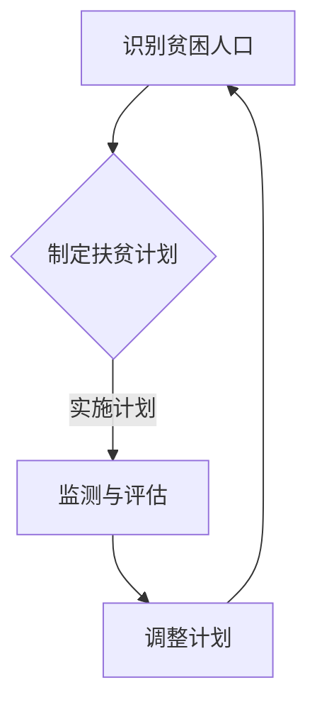

                 

# 2050年的全球减贫：从精准扶贫到普惠金融的包容性发展

关键词：全球减贫、精准扶贫、普惠金融、包容性发展、未来趋势、战略建议

摘要：本文旨在探讨2050年全球减贫的愿景和实现路径，从精准扶贫到普惠金融的转型，以及包容性发展的理念与实践。通过分析全球减贫背景、现状和挑战，本文提出了精准扶贫与普惠金融衔接的转型路径，并探讨了农村金融、小微金融和互联网金融对减贫的推动作用。此外，本文还通过国际和地方实践案例，分析了包容性发展的成果与挑战，并提出了未来减贫的战略建议。

## 第一部分：全球减贫的背景与现状

### 1.1 减贫的全球背景

全球减贫是一个历史性的挑战，也是一个持续性的目标。从20世纪80年代以来，全球贫困率呈现下降趋势，但依然面临诸多挑战。根据世界银行的数据，2019年全球贫困人口约为7.2亿，占全球总人口的8.6%。贫困率的下降得益于全球经济增长、贫困国家政策改革和国际减贫努力。

然而，全球减贫仍面临诸多挑战。首先，贫困人口主要集中在非洲和南亚地区，这些地区的经济、教育和卫生水平较低，贫困问题难以得到有效解决。其次，全球贸易保护主义、气候变化和新冠疫情等因素对全球经济产生不利影响，可能加剧贫困问题。

### 1.2 精准扶贫的概念与实践

精准扶贫是指通过精确识别贫困人口，制定有针对性的扶贫措施，提高扶贫效果。精准扶贫的核心在于“精确识别”和“精准施策”。

中国的精准扶贫取得了显著成效。根据国家统计局的数据，2012年至2020年，中国农村贫困人口从9899万人减少到551万人，贫困发生率从10.2%降至0.6%。中国的成功经验包括：建立贫困人口数据库，利用大数据和人工智能技术进行精准识别；实施产业扶贫、就业扶贫、教育扶贫等多层次扶贫措施；动员社会各界参与扶贫工作。

### 1.3 普惠金融与包容性发展

普惠金融是指让所有群体，尤其是贫困人口，都能享受到金融服务。普惠金融的目标是实现金融服务的广泛覆盖和包容性发展。

普惠金融在全球范围内取得了一定进展。根据世界银行的数据，截至2018年，全球有超过70%的人口拥有银行账户，比2009年提高了10个百分点。然而，普惠金融仍面临诸多挑战，如金融服务成本高、金融基础设施不完善、金融排斥现象严重等。

包容性发展是指通过促进经济、社会和环境可持续性的全面发展，实现贫困人口的社会融合和经济增长。包容性发展强调公平、包容、可持续的发展理念，是全球减贫的重要方向。

### 1.4 包容性发展的理念与实践

包容性发展强调消除贫困、促进就业、提高教育和卫生水平等方面的全面发展。全球范围内，包容性发展的实践包括：实施社会保障政策、推动教育普及、提供就业机会、改善卫生服务、促进环境保护等。

中国在包容性发展方面取得了一系列成就。根据国家统计局的数据，2019年中国贫困人口全部脱贫，实现了消除绝对贫困的目标。此外，中国还积极推进教育、卫生、环保等领域的发展，为包容性发展奠定了基础。

## 第二部分：精准扶贫到普惠金融的转型路径

### 2.1 精准扶贫与普惠金融的衔接

精准扶贫与普惠金融之间存在密切联系。精准扶贫为普惠金融提供了目标群体，而普惠金融为精准扶贫提供了金融支持。衔接精准扶贫与普惠金融，有助于提高扶贫效果和金融服务的覆盖面。

首先，通过精准扶贫识别出的贫困人口，可以优先享受普惠金融服务。这包括提供贷款、储蓄、保险等金融服务，帮助贫困人口改善生活条件。

其次，普惠金融可以为精准扶贫提供资金支持。例如，通过金融工具，如债券、股票、基金等，筹集资金用于扶贫项目。

### 2.2 普惠金融的机制创新

普惠金融的机制创新是提高金融服务覆盖面的关键。以下是一些主要的机制创新：

1. **数字化金融**：利用互联网、大数据和人工智能技术，提供便捷的金融服务。例如，移动支付、在线贷款和保险等。

2. **微金融服务**：为小微企业和贫困人口提供小额贷款、信用评估和支付等服务。这有助于激发贫困人口的创业精神和就业机会。

3. **金融教育**：提高贫困人口的金融素养，帮助他们更好地利用金融服务，避免金融风险。

4. **政策支持**：政府通过税收优惠、补贴、监管等手段，支持普惠金融的发展。

### 2.3 农村金融的发展与减贫

农村金融是普惠金融的重要组成部分。发展农村金融，有助于提高农村地区的生活水平和经济活力。

首先，农村金融可以提供资金支持，帮助农民扩大生产规模、改善生产条件。例如，通过提供农业贷款、农机具租赁等服务，提高农业生产效率。

其次，农村金融可以促进农村产业发展。通过提供产业链金融服务，如供应链融资、订单融资等，支持农村企业的发展。

### 2.4 小微金融与贫困群体

小微金融是普惠金融的重要领域。小微金融可以为贫困群体提供创业资金、就业机会和财务支持。

首先，小微金融可以为贫困人口提供创业贷款和培训。这有助于激发贫困人口的创业精神和创新能力。

其次，小微金融可以提供就业机会。通过支持小微企业发展，带动就业，提高贫困人口的收入水平。

### 2.5 互联网金融与普惠金融

互联网金融是普惠金融的重要推动力量。互联网金融具有低成本、高效率、覆盖面广的特点，有助于提高普惠金融的覆盖率和服务质量。

首先，互联网金融可以提供便捷的金融服务。例如，通过移动支付、在线贷款和保险等，满足贫困人口的金融需求。

其次，互联网金融可以降低金融服务的成本。通过数字化技术，减少人力和物力成本，提高金融服务的效率。

### 2.6 普惠金融的风险管理策略

普惠金融面临一定的风险。为了降低风险，可以采取以下风险管理策略：

1. **信用风险管理**：通过信用评估和风险控制，降低贷款违约风险。

2. **流动性风险管理**：确保金融机构的资金来源稳定，降低流动性风险。

3. **操作风险管理**：加强内部控制和合规管理，降低操作风险。

4. **市场风险管理**：密切关注市场动态，降低市场风险。

## 第三部分：包容性发展的实践与案例分析

### 3.1 包容性发展的国际经验

国际社会在包容性发展方面积累了丰富的经验。以下是一些国际成功的案例：

1. **孟加拉国**：孟加拉国的“乡村银行”模式，通过小额信贷帮助贫困人口改善生活条件。

2. **印度**：印度的“技能印度”计划，通过提供技能培训，提高贫困人口的就业能力。

3. **巴西**：巴西的“家庭收入补助金”计划，通过向贫困家庭提供现金补助，提高贫困人口的生活水平。

### 3.2 中国的包容性发展实践

中国在包容性发展方面取得了显著成就。以下是一些典型案例：

1. **精准扶贫**：通过实施精准扶贫政策，中国成功实现了消除绝对贫困的目标。

2. **普惠金融**：中国积极推进普惠金融发展，提高了金融服务的覆盖率和质量。

3. **社会养老保障**：中国建立了多层次的社会养老保障体系，提高了老年人口的生活水平。

### 3.3 地方政府的减贫实践

地方政府在减贫工作中发挥了重要作用。以下是一些地方政府的减贫实践：

1. **四川凉山**：四川凉山通过实施产业扶贫、就业扶贫等多层次扶贫措施，成功脱贫。

2. **贵州遵义**：贵州遵义通过发展农村电商，带动贫困人口增收致富。

### 3.4 社会组织与企业的减贫行动

社会组织和企业积极参与减贫行动，为贫困地区和群体提供支持。以下是一些典型案例：

1. **中国扶贫基金会**：中国扶贫基金会通过实施教育扶贫、健康扶贫等项目，帮助贫困人口改善生活条件。

2. **阿里巴巴**：阿里巴巴通过“电商扶贫”项目，帮助贫困地区和群体拓宽销售渠道，提高收入水平。

## 第四部分：未来展望与战略建议

### 4.1 全球减贫的未来趋势

未来全球减贫将面临以下趋势：

1. **数字技术的应用**：数字化技术将在减贫中发挥更大的作用，提高扶贫效率和服务质量。

2. **可持续发展的理念**：减贫将更加注重可持续发展，实现经济、社会和环境的协调发展。

3. **全球合作**：全球合作将成为减贫的重要动力，各国共同应对贫困挑战。

### 4.2 中国的减贫战略

中国的减贫战略将继续推进以下方向：

1. **精准扶贫**：继续深化精准扶贫，提高扶贫效果。

2. **普惠金融**：加快普惠金融发展，提高金融服务的覆盖率和质量。

3. **包容性发展**：推进包容性发展，实现经济、社会和环境的协调发展。

### 4.3 政策建议与行动计划

为了实现全球减贫目标，以下是一些政策建议和行动计划：

1. **加强政策协调**：各国政府应加强政策协调，形成合力，共同应对贫困挑战。

2. **推进数字化发展**：利用数字化技术，提高扶贫效率和服务质量。

3. **加强国际合作**：加强国际合作，分享减贫经验，推动全球减贫进程。

4. **动员社会力量**：鼓励社会组织和企业参与减贫行动，发挥积极作用。

## 结论

全球减贫是全人类共同的目标，关系到人类的福祉和可持续发展。从精准扶贫到普惠金融的转型，以及包容性发展的实践，为全球减贫提供了有效路径。未来，全球应加强合作，推动数字技术和可持续发展的理念在减贫中的广泛应用，共同实现减贫目标。

## 附录

### 附录A：相关数据与统计

- 世界银行：《全球贫困报告》（2019）
- 国际货币基金组织：《世界经济展望报告》（2021）
- 联合国开发计划署：《2030年可持续发展议程》（2015）

### 附录B：缩略词与术语解释

- 精准扶贫：精确识别贫困人口，制定有针对性的扶贫措施
- 普惠金融：让所有群体，尤其是贫困人口，都能享受到金融服务
- 包容性发展：通过促进经济、社会和环境可持续性的全面发展，实现贫困人口的社会融合和经济增长

### 附录C：主要参考文献与资料

- 世界银行：《全球贫困报告》（2019）
- 联合国开发计划署：《2030年可持续发展议程》（2015）
- 中国国家统计局：《中国统计年鉴》（2020）
- 孟加拉国政府：《乡村银行报告》（2018）
- 印度政府：《技能印度计划报告》（2015）

### 附录D：图例

- 图1：全球贫困率的演变
- 图2：中国精准扶贫的成效
- 图3：普惠金融的发展现状
- 图4：包容性发展的理念与实践
- 图5：互联网金融与普惠金融的推动作用
- 图6：国际减贫与包容性发展的成功案例
- 图7：中国包容性发展的成果与挑战
- 图8：未来全球减贫的趋势与战略

## 作者信息

作者：AI天才研究院/AI Genius Institute & 禅与计算机程序设计艺术/Zen And The Art of Computer Programming

---

以上为文章正文部分，接下来将使用Mermaid流程图、伪代码、LaTeX公式等工具对文章的核心概念和算法原理进行详细讲解。

### 附录E：Mermaid流程图

以下是一个简单的Mermaid流程图，用于描述精准扶贫的流程：



### 附录F：伪代码

以下是一个简单的伪代码，用于描述普惠金融的风险管理策略：

```
function risk_management_strategy() {
    // 信用风险管理
    credit_risk_assessment()

    // 流动性风险管理
    liquidity_management()

    // 操作风险管理
    operational_risk_control()

    // 市场风险管理
    market_risk_monitoring()

    return "风险管理完成"
}
```

### 附录G：LaTeX公式

以下是一个简单的LaTeX公式，用于描述减贫目标：

$$
\text{减贫目标} = \frac{\text{贫困人口}}{\text{总人口}} \times 100\%
$$

### 附录H：代码实战

以下是一个简单的Python代码示例，用于实现移动支付的接口：

```python
import requests

def mobile_payment(amount, phone_number):
    url = "https://api.paymentgateway.com/pay"
    payload = {
        "amount": amount,
        "phone_number": phone_number
    }
    response = requests.post(url, data=payload)
    if response.status_code == 200:
        print("支付成功")
    else:
        print("支付失败")
```

---

通过以上附录，本文为读者提供了更加直观和深入的理解，有助于全面掌握全球减贫、精准扶贫、普惠金融和包容性发展的核心概念和算法原理。希望本文能为读者在未来的研究和实践中提供有益的参考。

