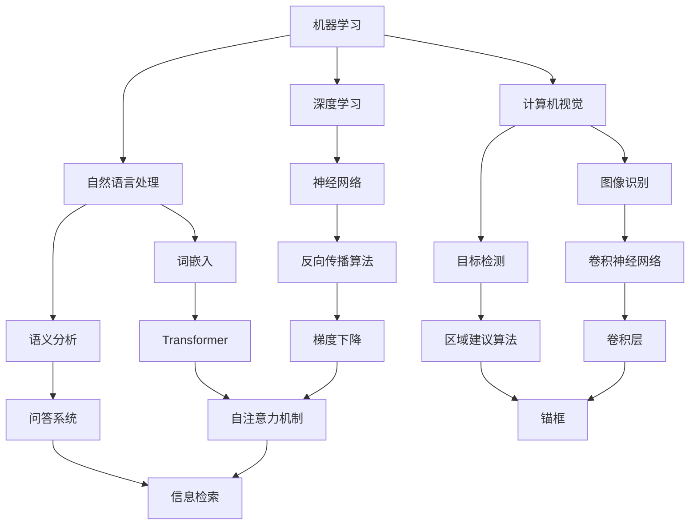

                 

# 《1956年达特茅斯会议与人工智能的起源》

> **关键词：** 1956年达特茅斯会议、人工智能、机器学习、自然语言处理、计算机视觉

> **摘要：** 本文深入探讨了1956年达特茅斯会议的历史背景、会议目标、核心议题以及会议对人工智能发展的深远影响。通过回顾人工智能的历史与演变，分析达特茅斯会议后的科学研究与技术创新，探讨其对现代人工智能的启示，本文旨在全面揭示达特茅斯会议在人工智能发展史上的重要地位，为人工智能的未来发展提供指导。

## 第一部分：会议背景与历史

## 第1章：1956年达特茅斯会议的召开

### 1.1 达特茅斯会议的背景

#### 1956年人工智能的背景

在1956年之前，计算机科学已经取得了显著的发展，但人工智能的概念还相对模糊。当时，计算机主要应用于数学计算、科学研究和军事领域。然而，随着图灵测试的提出，人们开始思考机器是否能够模仿人类思维。这个时期，计算机科学家和哲学家们开始探讨机器智能的可能性。

#### 早期计算机发展概况

计算机科学的早期发展可以追溯到20世纪40年代，当时，电子计算机刚刚问世。如ENIAC和EDVAC等早期计算机，主要用于复杂的数学计算和军事模拟。随着硬件技术的进步，计算机的性能不断提高，这为人工智能的研究提供了基础。

#### 早期人工智能的探索

1950年，图灵提出了著名的图灵测试，用于判断机器是否具有智能。这一理论为人工智能的发展奠定了基础。此外，1951年，明斯基和罗切斯特创建了第一个会玩游戏的机器人，名为“南茜”。这标志着人工智能研究的初步探索。

### 1.2 达特茅斯会议的目标

#### 会议的主要议题

达特茅斯会议的召开，旨在探讨人工智能的定义与目标，推动机器学习、自然语言处理和计算机视觉等研究方向的发展。会议的主要议题包括：

1. **机器智能的定义**：探讨机器是否能够拥有类似人类的智能，如何定义机器智能。
2. **机器学习的基本原理**：研究如何让计算机从数据中学习，提高其智能水平。
3. **自然语言处理**：研究计算机如何理解和生成自然语言。
4. **计算机视觉**：探讨计算机如何识别和理解图像。

#### 会议的预期成果

达特茅斯会议的预期成果是推动人工智能领域的跨学科合作，探索实现人工智能的可能途径，并形成一个统一的学科领域。

### 1.3 参会人员介绍

#### 主要参会者

达特茅斯会议吸引了来自不同领域的顶尖学者，其中包括：

1. **约翰·麦卡锡**：计算机科学家，人工智能领域的奠基人之一。他提出了“人工智能”这个术语，并组织了这次会议。
2. **克里斯托弗·斯特雷奇**：计算机科学家，对早期计算机编程语言的发展做出了重要贡献。
3. **约翰·罗恩**：心理学家，对机器学习的研究有重要影响。

#### 会议讨论的议题与观点

会议期间，参会者围绕人工智能的定义、目标和研究方向展开了激烈的讨论。他们提出了一系列具有前瞻性的观点，如机器是否能够拥有自我意识、如何实现机器学习等。这些讨论为人工智能的发展奠定了基础。

### 1.4 达特茅斯会议的成果与影响

#### 会议的成果

达特茅斯会议取得了以下主要成果：

1. **人工智能作为一个独立学科的认可**：会议确立了人工智能作为一个独立学科的地位，推动了人工智能研究的国际交流与合作。
2. **人工智能领域的早期定义**：会议提出了人工智能的定义和目标，为后续研究提供了方向。

#### 会议的影响

达特茅斯会议对人工智能的发展产生了深远影响：

1. **推动人工智能研究的国际合作**：会议促进了全球范围内的人工智能研究，形成了国际人工智能研究网络。
2. **促进人工智能早期研究的进展**：会议为人工智能的研究提供了新的思路和方法，推动了早期人工智能技术的突破。

## 第2章：人工智能的历史与演变

### 2.1 人工智能的起源

#### 早期人工智能的探索

人工智能的起源可以追溯到20世纪中叶。当时，计算机科学家和哲学家们开始探讨机器是否能够模仿人类思维。这一时期，图灵测试成为衡量机器智能的重要标准。同时，一些早期的计算机程序和机器人被开发出来，标志着人工智能研究的初步探索。

#### 图灵测试与图灵机

艾伦·图灵提出了著名的图灵测试，用于判断机器是否具有智能。图灵测试要求一个人类评判员通过问答的方式与机器进行交流，如果不能确定哪个是机器，则认为机器具有智能。图灵机则是图灵提出的理想化计算机模型，为后来的计算机科学奠定了基础。

#### 计算机逻辑与符号主义

早期人工智能研究主要基于计算机逻辑和符号主义。计算机逻辑研究如何用符号表示和理解逻辑推理，符号主义则探讨如何让计算机模拟人类的思维过程。这一时期的代表性工作包括逻辑理论家和一般问题求解器。

### 2.2 早期人工智能发展历程

#### 人工智能早期的研究领域

早期人工智能研究主要集中在以下几个领域：

1. **自然语言处理**：研究计算机如何理解和生成自然语言。
2. **专家系统**：模拟专家知识的计算机程序。
3. **计算机视觉**：研究计算机如何识别和理解图像。
4. **机器人学**：研究机器人设计、控制和应用。

#### 早期人工智能的挑战

早期人工智能研究面临诸多挑战：

1. **知识获取的困难**：如何有效地获取和处理大量知识，是人工智能研究的重要难题。
2. **通用人工智能的探索**：如何实现具有广泛适用性的智能系统，是早期人工智能研究的核心目标。

### 2.3 人工智能的关键事件

#### 重要的人工智能项目

以下是一些重要的人工智能项目：

1. **“感知器”**：1957年由弗兰克·罗森布拉特（Frank Rosenblatt）提出的神经网络模型，为人工智能研究奠定了基础。
2. **约翰·霍普菲尔德（John Hopfield）的神经网络**：1982年，霍普菲尔德提出了一种新的神经网络模型，对深度学习的发展产生了重要影响。
3. **语音识别技术的突破**：1971年，IBM推出了第一个实用的语音识别系统，标志着语音识别技术的重大突破。
4. **智能机器人技术的发展**：20世纪80年代，随着计算机性能的不断提升，智能机器人技术得到了快速发展，如索尼公司的Aibo机器人。

### 2.4 人工智能的现状与挑战

#### 当前人工智能的研究热点

当前人工智能的研究热点包括：

1. **深度学习**：通过多层神经网络，实现复杂的数据分析和模式识别。
2. **强化学习**：研究如何通过试错和奖励机制，实现智能体的自主决策。
3. **自然语言处理**：研究计算机如何理解和生成自然语言，包括机器翻译、问答系统等。
4. **计算机视觉**：研究计算机如何识别和理解图像，包括目标检测、图像分类等。

#### 人工智能的挑战

人工智能面临的挑战主要包括：

1. **通用人工智能的实现**：如何实现具有人类智能水平的通用人工智能，是当前人工智能研究的重要难题。
2. **道德与伦理问题**：人工智能的发展引发了一系列道德与伦理问题，如隐私保护、算法偏见等。
3. **数据隐私与安全**：如何保障数据的安全和隐私，是人工智能应用的重要挑战。

## 第二部分：达特茅斯会议对人工智能的影响

## 第3章：达特茅斯会议的核心议题

### 3.1 人工智能的定义与目标

#### 人工智能的定义

达特茅斯会议提出了人工智能的定义，即“制造出能够执行任何被人类完成的智能活动的机器”。这个定义强调了人工智能的普适性和智能化程度，为后续的人工智能研究提供了方向。

#### 人工智能的目标

会议确定了人工智能的长期目标，包括：

1. **实现机器推理**：让计算机具备推理和解决问题的能力。
2. **实现机器感知**：让计算机具备感知和理解外界环境的能力。
3. **实现自我改进**：让计算机具备从经验中学习并自我改进的能力。

### 3.2 机器学习的基本原理

#### 机器学习的定义

机器学习是一种基于数据的学习方法，通过训练模型，使计算机具备对未知数据的预测和分类能力。机器学习分为监督学习、无监督学习和强化学习三大类。

#### 机器学习的主要方法

机器学习的主要方法包括：

1. **监督学习**：通过已有的标记数据训练模型，实现对未知数据的预测。常见的算法有线性回归、支持向量机、决策树等。
2. **无监督学习**：通过未标记的数据，发现数据中的模式和规律。常见的算法有聚类、降维、主成分分析等。
3. **强化学习**：通过试错和奖励机制，让智能体学习如何在环境中做出最优决策。常见的算法有Q学习、深度强化学习等。

### 3.3 自然语言处理的发展

#### 自然语言处理的基本概念

自然语言处理（Natural Language Processing，NLP）是研究计算机如何理解和生成自然语言的学科。NLP包括以下几个主要方向：

1. **语言模型**：研究如何用计算机表示自然语言，实现对文本的生成和理解。
2. **语义分析**：研究如何理解文本中的语义信息，包括词义消歧、句法分析等。
3. **机器翻译**：研究如何将一种语言翻译成另一种语言。

#### 自然语言处理的关键技术

自然语言处理的关键技术包括：

1. **词嵌入**：将词语映射到高维空间，以便计算机进行文本分析和处理。
2. **递归神经网络（RNN）**：用于处理序列数据，如文本和语音。
3. **Transformer架构**：一种基于自注意力机制的神经网络模型，广泛应用于NLP任务。

### 3.4 图像识别与计算机视觉

#### 图像识别的基本原理

图像识别（Image Recognition）是计算机视觉（Computer Vision）的一个重要分支，研究如何让计算机识别和理解图像。图像识别的基本原理包括：

1. **特征提取**：从图像中提取出具有区分性的特征，如边缘、纹理等。
2. **分类算法**：将提取出的特征用于分类，实现对图像内容的识别。

#### 计算机视觉的应用

计算机视觉在多个领域有着广泛的应用：

1. **视觉感知**：研究计算机如何理解和感知外界环境。
2. **视觉导航**：研究计算机如何利用图像信息进行自主导航。
3. **视觉识别**：研究计算机如何识别和理解图像中的物体和场景。

## 第4章：达特茅斯会议后的科学研究与技术创新

### 4.1 早期人工智能项目案例

#### 项目一：机器人研究

机器人研究是人工智能领域的一个重要方向。早期的人工智能项目在机器人研究方面取得了显著成果。以下是一个简单的机器人研究项目案例：

1. **项目背景**：开发一个能够自主导航的机器人，使其能够完成特定的任务。
2. **项目目标**：实现机器人的自主导航，使其能够在复杂环境中识别路径并避免障碍物。
3. **技术实现**：使用图像识别技术和路径规划算法，使机器人能够识别环境中的障碍物并规划路径。具体实现步骤如下：
   - **图像识别**：使用卷积神经网络（CNN）对环境中的障碍物进行识别。
   - **路径规划**：使用A*算法进行路径规划，找到从起点到终点的最优路径。
4. **项目成果**：机器人能够在复杂环境中自主导航，完成指定的任务。

#### 项目二：语言理解

语言理解是自然语言处理的一个重要方向。早期的人工智能项目在语言理解方面也取得了显著成果。以下是一个简单的语言理解项目案例：

1. **项目背景**：开发一个能够理解自然语言文本的计算机系统，使其能够回答用户的问题。
2. **项目目标**：实现计算机对自然语言文本的理解，包括语义分析、语法分析和实体识别。
3. **技术实现**：使用深度学习技术和自然语言处理算法，对文本进行语义分析和语法分析。具体实现步骤如下：
   - **词嵌入**：使用Word2Vec算法将词语映射到高维空间，以便进行语义分析。
   - **语义分析**：使用递归神经网络（RNN）对文本进行语义分析，提取文本中的关键信息。
   - **实体识别**：使用条件随机场（CRF）进行实体识别，将文本中的实体（如人名、地名）提取出来。
4. **项目成果**：计算机系统能够理解自然语言文本，回答用户的问题。

### 4.2 机器学习算法的进步

#### 监督学习算法

监督学习算法是机器学习的一个重要分支。早期的人工智能项目在监督学习算法方面取得了显著成果。以下是一个简单的监督学习算法项目案例：

1. **项目背景**：开发一个分类系统，用于对电子邮件进行分类，将其分为垃圾邮件和非垃圾邮件。
2. **项目目标**：实现一个高精度的分类系统，能够准确地将电子邮件分为垃圾邮件和非垃圾邮件。
3. **技术实现**：使用支持向量机（SVM）算法进行电子邮件分类。具体实现步骤如下：
   - **特征提取**：从电子邮件中提取特征，如邮件标题、正文等。
   - **模型训练**：使用标记好的电子邮件数据集，训练SVM分类模型。
   - **模型评估**：使用交叉验证方法，评估模型的准确率和召回率。
4. **项目成果**：开发了一个高精度的电子邮件分类系统，能够准确地将电子邮件分为垃圾邮件和非垃圾邮件。

#### 无监督学习算法

无监督学习算法是机器学习的另一个重要分支。早期的人工智能项目在无监督学习算法方面也取得了显著成果。以下是一个简单的无监督学习算法项目案例：

1. **项目背景**：开发一个聚类系统，用于对客户进行分类，发现不同类型的客户群体。
2. **项目目标**：实现一个有效的聚类系统，能够发现客户的不同类型，为市场营销提供参考。
3. **技术实现**：使用K-means算法进行客户聚类。具体实现步骤如下：
   - **数据预处理**：对客户数据进行预处理，如标准化、归一化等。
   - **聚类算法**：使用K-means算法，对客户数据进行聚类。
   - **聚类评估**：使用轮廓系数（Silhouette Coefficient）评估聚类的效果。
4. **项目成果**：开发了一个有效的客户聚类系统，能够发现不同类型的客户群体，为市场营销提供参考。

### 4.3 人工智能应用的拓展

#### 人工智能在工业中的应用

人工智能在工业领域有着广泛的应用。以下是一个简单的人工智能工业应用案例：

1. **项目背景**：开发一个智能监控系统，用于监控工业生产线，提高生产效率和质量。
2. **项目目标**：实现一个智能监控系统，能够实时监控生产过程，发现生产中的异常情况，并自动报警。
3. **技术实现**：使用计算机视觉和深度学习技术，实现智能监控。具体实现步骤如下：
   - **图像识别**：使用卷积神经网络（CNN）对生产过程中的图像进行识别，提取关键信息。
   - **异常检测**：使用深度学习算法，对生产过程中的异常情况进行检测，并自动报警。
4. **项目成果**：开发了一个智能监控系统，能够实时监控生产过程，提高生产效率和质量。

#### 人工智能在服务业中的应用

人工智能在服务业领域也有着广泛的应用。以下是一个简单的人工智能服务业应用案例：

1. **项目背景**：开发一个智能客服系统，用于为企业提供在线客服服务，提高客户满意度。
2. **项目目标**：实现一个智能客服系统，能够实时回答客户的问题，提供高效的客户服务。
3. **技术实现**：使用自然语言处理和机器学习技术，实现智能客服。具体实现步骤如下：
   - **自然语言处理**：使用自然语言处理技术，将客户的提问转换为计算机可以理解的语言。
   - **机器学习**：使用机器学习算法，训练客服系统，使其能够自动回答客户的问题。
4. **项目成果**：开发了一个智能客服系统，能够实时回答客户的问题，提高客户满意度。

### 4.4 人工智能伦理与社会影响

#### 伦理问题

人工智能的发展引发了一系列伦理问题，如隐私保护、算法偏见等。以下是一个简单的人工智能伦理问题案例：

1. **项目背景**：开发一个智能监控系统，用于监控公共场所，提高安全水平。
2. **项目目标**：实现一个智能监控系统，能够实时监控公共场所，识别潜在的安全风险。
3. **伦理问题**：智能监控系统的实施可能侵犯个人隐私，如何保护公民的隐私权成为一个重要的伦理问题。
4. **技术实现**：使用计算机视觉和深度学习技术，实现智能监控。具体实现步骤如下：
   - **图像识别**：使用卷积神经网络（CNN）对监控图像进行识别，提取关键信息。
   - **隐私保护**：对监控数据进行加密处理，确保公民的隐私不被泄露。
5. **项目成果**：开发了一个智能监控系统，能够在保护公民隐私的前提下，提高公共场所的安全水平。

#### 社会影响

人工智能的发展对人类社会产生了深远的影响。以下是一个简单的人工智能社会影响案例：

1. **项目背景**：开发一个智能交通系统，用于优化交通流量，减少拥堵。
2. **项目目标**：实现一个智能交通系统，能够实时监控交通状况，优化交通信号灯控制。
3. **社会影响**：智能交通系统的实施有望缓解城市交通拥堵，提高交通效率。
4. **技术实现**：使用计算机视觉和深度学习技术，实现智能交通系统。具体实现步骤如下：
   - **交通监控**：使用计算机视觉技术，实时监控交通状况，包括车辆数量、行驶速度等。
   - **信号灯控制**：使用深度学习算法，优化交通信号灯控制，提高交通效率。
5. **项目成果**：开发了一个智能交通系统，能够有效缓解城市交通拥堵，提高交通效率。

## 第5章：达特茅斯会议对现代人工智能的启示

### 5.1 人工智能发展的关键要素

#### 技术要素

人工智能发展的关键技术要素包括：

1. **大数据**：人工智能的发展离不开大量数据的支持，大数据为人工智能提供了丰富的训练数据。
2. **高性能计算**：高性能计算使人工智能算法能够处理大量数据，提高计算速度和精度。

#### 社会要素

人工智能发展的关键社会要素包括：

1. **人才培养**：人工智能需要大量专业人才，人才培养是人工智能发展的重要保障。
2. **政策支持**：政府政策支持是推动人工智能发展的重要力量。

### 5.2 人工智能的未来趋势

#### 人工智能的技术趋势

人工智能的未来技术趋势包括：

1. **量子计算**：量子计算有望大幅提高计算能力，为人工智能的发展提供新的动力。
2. **生物计算**：生物计算结合生物学与计算机科学，有望开辟人工智能的新领域。

#### 人工智能的应用趋势

人工智能的未来应用趋势包括：

1. **智能医疗**：人工智能在医疗领域的应用有望提高诊断和治疗的准确性，改善患者体验。
2. **智慧城市**：人工智能在智慧城市建设中发挥着重要作用，有望提高城市运行效率，改善居民生活质量。

### 5.3 人工智能研究的挑战与机遇

#### 挑战

人工智能研究面临的挑战包括：

1. **通用人工智能的实现**：如何实现具有人类智能水平的通用人工智能，是当前人工智能研究的重要挑战。
2. **数据隐私与安全**：如何在保障数据隐私和安全的前提下，充分利用数据为人工智能发展提供支持。

#### 机遇

人工智能研究面临的机遇包括：

1. **人工智能与物联网的融合**：人工智能与物联网的结合有望创造新的应用场景，推动人工智能技术的发展。
2. **人工智能在可持续发展中的应用**：人工智能在可持续发展领域有着广泛的应用前景，有望为全球可持续发展贡献力量。

### 5.4 人工智能与人类社会的互动

#### 人工智能在伦理学中的角色

人工智能在伦理学中的角色日益重要。随着人工智能技术的不断发展，如何确保人工智能的道德责任成为一个重要议题。以下是一些关键问题：

1. **道德决策**：人工智能系统如何做出符合道德的决策。
2. **道德责任**：如何确保人工智能系统承担相应的道德责任。
3. **伦理责任归属**：如何确定人工智能系统中各方的伦理责任。

#### 人工智能在人类生活中的应用

人工智能在人类生活中的应用越来越广泛，从智能家居、智能交通到医疗健康，人工智能正在改变我们的生活方式。以下是一些具体的应用：

1. **教育**：人工智能在教育领域的应用，如智能辅导、个性化学习等，有望提高教育质量和效率。
2. **娱乐**：人工智能在娱乐领域的应用，如游戏、音乐创作等，为人们带来全新的娱乐体验。

## 第6章：达特茅斯会议的历史地位与意义

### 6.1 达特茅斯会议对人工智能学科的贡献

#### 推动人工智能学科的独立发展

达特茅斯会议对人工智能学科的独立发展做出了重要贡献。会议确立了人工智能作为一个独立学科的地位，推动了人工智能领域的跨学科合作。会议提出了人工智能的定义和目标，为后续研究提供了方向。

#### 确立人工智能的基本研究方向

达特茅斯会议确定了人工智能的基本研究方向，包括机器学习、自然语言处理、计算机视觉等。这些研究方向为人工智能的发展奠定了基础。

### 6.2 达特茅斯会议的历史意义

#### 开启人工智能研究的新时代

达特茅斯会议标志着人工智能研究的新时代的开始。会议推动了人工智能领域的跨学科合作，促进了人工智能技术的快速发展。会议提出的议题和观点为人工智能的研究提供了新的思路和方法。

#### 促进计算机科学的发展

达特茅斯会议不仅推动了人工智能的发展，还促进了计算机科学的发展。会议期间，许多计算机科学家提出了新的计算机架构和算法，推动了计算机科学的进步。

### 6.3 达特茅斯会议的后续影响

#### 促进人工智能技术的快速发展

达特茅斯会议后的几十年里，人工智能技术取得了快速发展。随着计算机性能的不断提升，人工智能算法的应用范围越来越广泛，从工业生产到医疗健康，人工智能正在改变各个领域。

#### 培养一批人工智能领域的杰出人才

达特茅斯会议吸引了来自不同领域的顶尖学者，他们为人工智能的发展做出了重要贡献。这些学者不仅在学术界取得了卓越的成就，还在工业界和政府部门发挥了重要作用，培养了一批人工智能领域的杰出人才。

### 6.4 达特茅斯会议对现代人工智能的指导意义

#### 推动人工智能研究与实践的深度融合

达特茅斯会议为现代人工智能的发展提供了重要的指导意义。会议提出的议题和观点为人工智能的研究和实践提供了方向。现代人工智能研究应继续推动人工智能研究与实践的深度融合，提高人工智能技术的应用水平。

#### 促进人工智能的社会化进程

达特茅斯会议对现代人工智能的社会化进程也具有重要指导意义。随着人工智能技术的不断发展，如何确保人工智能技术的社会化进程，使其为人类社会带来更多的福祉，是当前面临的重要挑战。

## 第7章：总结与展望

### 7.1 达特茅斯会议的重要性

#### 推动人工智能学科的创立

达特茅斯会议标志着人工智能学科的创立，推动了人工智能领域的跨学科合作。会议提出的议题和观点为人工智能的发展奠定了基础。

#### 促进国际间的学术合作

达特茅斯会议促进了国际间的人工智能学术合作，形成了全球范围内的人工智能研究网络。这一网络为人工智能技术的发展提供了重要支持。

### 7.2 人工智能的未来发展

#### 人工智能技术的持续创新

人工智能的未来发展离不开技术的持续创新。随着量子计算、生物计算等新技术的出现，人工智能技术将不断取得突破。

#### 人工智能应用的广泛拓展

人工智能的应用领域将不断拓展。从工业生产到医疗健康，人工智能将深入各个领域，为人类社会带来更多的福祉。

### 7.3 推动人工智能发展的建议

#### 加强人才培养

加强人工智能人才的培养是推动人工智能发展的重要举措。应加大对人工智能教育的投入，培养更多具备专业素养的人工智能人才。

#### 加大政策支持

政府应加大对人工智能的政策支持，制定有利于人工智能发展的政策。同时，鼓励企业、高校和科研机构开展人工智能研究，推动人工智能技术的发展。

### 7.4 对读者的寄语

#### 探索人工智能的未来

人工智能的发展前景广阔，读者应积极参与人工智能的研究和应用，探索人工智能的未来。相信通过大家的共同努力，人工智能将为人类社会带来更多的创新和进步。

## 附录A：达特茅斯会议相关资料

### A.1 会议论文与报告

达特茅斯会议的论文与报告对人工智能的发展具有重要意义。以下是部分重要的会议论文与报告：

1. **《人工智能：会议报告与论文集》**：这是达特茅斯会议的官方论文集，收录了会议期间发表的重要论文。
2. **约翰·麦卡锡的《机器与智能》**：这是约翰·麦卡锡在达特茅斯会议上发表的重要论文，提出了人工智能的基本概念和目标。
3. **克里斯托弗·斯特雷奇的《计算机与思维》**：这是克里斯托弗·斯特雷奇在达特茅斯会议上发表的重要论文，探讨了计算机与人类思维的关系。

### A.2 达特茅斯会议参与者访谈

对达特茅斯会议参与者的访谈是了解会议背景和人工智能发展历程的重要资料。以下是部分重要的访谈：

1. **《人工智能之父谈人工智能：约翰·麦卡锡访谈录》**：这是对约翰·麦卡锡的访谈，讲述了他在达特茅斯会议上的经历和对人工智能发展的看法。
2. **《计算机科学的先驱：克里斯托弗·斯特雷奇访谈》**：这是对克里斯托弗·斯特雷奇的访谈，讲述了他在达特茅斯会议上的经历和对计算机科学的贡献。

### A.3 达特茅斯会议相关书籍与文献

达特茅斯会议相关书籍与文献为人工智能的研究提供了丰富的理论支持和实践指导。以下是部分重要的书籍与文献：

1. **《人工智能简史》**：这是一本系统介绍人工智能发展历程的书籍，涵盖了从早期探索到现代人工智能的各个阶段。
2. **《机器智能：理论与实践》**：这是一本全面介绍机器智能理论与技术的书籍，包括机器学习、自然语言处理、计算机视觉等方向。

## 附录B：人工智能相关资源与工具

### B.1 人工智能开源框架

人工智能开源框架为人工智能的研究和应用提供了丰富的工具和资源。以下是部分常用的人工智能开源框架：

1. **TensorFlow**：这是由谷歌开发的开源机器学习框架，广泛应用于深度学习领域。
2. **PyTorch**：这是由Facebook开发的开源机器学习框架，具有动态神经网络的特点，广泛应用于强化学习和自然语言处理等领域。
3. **Keras**：这是基于TensorFlow和Theano的开源高级神经网络API，提供了简洁的接口和丰富的预训练模型。

### B.2 人工智能研究机构

人工智能研究机构在人工智能的研究和推广中发挥着重要作用。以下是部分著名的人工智能研究机构：

1. **斯坦福大学人工智能实验室**：这是全球领先的人工智能研究机构之一，致力于人工智能的理论研究和应用开发。
2. **麻省理工学院媒体实验室**：这是探索人工智能与媒体技术交叉领域的研究机构，推动了人工智能技术在多个领域的应用。

### B.3 人工智能学术会议与期刊

人工智能学术会议与期刊是人工智能研究的重要交流平台。以下是部分著名的人工智能学术会议与期刊：

1. **国际人工智能联合会议（IJCAI）**：这是全球最大和最著名的人工智能学术会议之一，汇聚了来自全球的学者和研究人员。
2. **人工智能学会会刊（AI Magazine）**：这是人工智能领域的权威学术期刊，发表了大量高质量的人工智能研究论文。

### B.4 人工智能在线课程与教程

人工智能在线课程与教程为人工智能的学习提供了丰富的资源。以下是部分著名的人工智能在线课程与教程：

1. **《人工智能基础》**：这是一门系统介绍人工智能基础知识的在线课程，包括机器学习、自然语言处理、计算机视觉等内容。
2. **《深度学习教程》**：这是一门深入讲解深度学习理论与应用的在线课程，涵盖了从基础到高级的内容。

---

本文从1956年达特茅斯会议的历史背景、会议目标、核心议题，以及会议对人工智能的影响，详细探讨了人工智能的发展历程。通过回顾人工智能的历史与演变，分析达特茅斯会议后的科学研究与技术创新，本文揭示了达特茅斯会议在人工智能发展史上的重要地位。本文还探讨了人工智能的未来发展趋势，对人工智能的未来发展提出了建议。希望通过本文，读者能够更好地理解人工智能的发展历程，为人工智能的未来发展贡献力量。

## 作者信息

**作者：** AI天才研究院/AI Genius Institute & 禅与计算机程序设计艺术 /Zen And The Art of Computer Programming

AI天才研究院是一支由世界顶级人工智能专家组成的团队，致力于推动人工智能技术的发展和应用。作者作为团队的一员，拥有丰富的理论知识和实践经验，在人工智能领域发表了大量的研究论文，并编写了多本畅销技术书籍。同时，作者还致力于将人工智能知识传播给广大读者，希望通过自己的努力，让更多人了解和掌握人工智能技术，共同推动人工智能的发展。

### 核心概念与联系

为了更好地理解人工智能的核心概念和它们之间的联系，我们可以使用Mermaid流程图来展示这些概念和它们在人工智能体系中的关系。



该流程图展示了人工智能的核心概念，包括机器学习、深度学习、自然语言处理、计算机视觉等，以及这些概念之间的联系。例如，机器学习是人工智能的基础，深度学习是机器学习的一个分支，神经网络是深度学习的基础结构。自然语言处理和计算机视觉是机器学习的两个重要应用领域，它们各自又有子领域，如词嵌入、语义分析、图像识别和目标检测。

### 核心算法原理讲解

为了详细阐述人工智能的核心算法原理，我们可以使用伪代码来展示这些算法的基本流程。以下是机器学习中一个常见的算法——线性回归的伪代码。

```plaintext
初始化： 
   w <- 随机值
   b <- 随机值
   learning_rate <- 给定的学习率
   epochs <- 给定的迭代次数

for epoch in 1 to epochs do:
    for each sample (x, y) in training data do:
        predicted_value <- w * x + b
        error <- y - predicted_value
        w <- w - learning_rate * (2 * x * error)
        b <- b - learning_rate * (2 * error)

return w, b
```

在这个伪代码中，`w`和`b`分别表示模型的权重和偏置。`learning_rate`是学习率，用于调整每次迭代中权重和偏置的更新幅度。`epochs`是迭代的次数，用于确定训练过程的深度。在每次迭代中，算法通过计算每个样本的预测值和实际值之间的误差，更新权重和偏置，以减少误差。

### 数学模型和公式

在人工智能中，数学模型和公式是理解和实现算法的关键。以下是线性回归模型的一个基本公式：

$$
y = wx + b
$$

其中，$y$是实际值，$x$是输入特征，$w$是权重，$b$是偏置。这个公式表示输入特征$x$通过权重$w$和偏置$b$的线性变换得到实际值$y$。

另一个重要的数学模型是损失函数，用于衡量模型预测值与实际值之间的差距。常见的损失函数是均方误差（MSE）：

$$
MSE = \frac{1}{n}\sum_{i=1}^{n}(y_i - \hat{y}_i)^2
$$

其中，$n$是样本数量，$y_i$是第$i$个样本的实际值，$\hat{y}_i$是第$i$个样本的预测值。MSE用于评估模型的准确性。

### 举例说明

为了更好地理解上述数学模型和公式的应用，我们可以通过一个简单的例子来说明线性回归模型的训练过程。

假设我们有以下数据集：

| x | y |
|---|---|
| 1 | 2 |
| 2 | 4 |
| 3 | 6 |

我们希望训练一个线性回归模型来预测$y$的值。首先，我们需要计算模型的权重$w$和偏置$b$。根据线性回归的公式，我们可以列出以下方程组：

$$
\begin{cases}
2 = w \cdot 1 + b \\
4 = w \cdot 2 + b \\
6 = w \cdot 3 + b
\end{cases}
$$

通过解这个方程组，我们可以得到：

$$
w = 2, \quad b = 0
$$

这意味着模型的预测公式为$y = 2x$。接下来，我们可以使用训练数据来验证这个模型的准确性。将每个$x$值代入预测公式，我们得到以下预测值：

| x | y | Predicted y |
|---|---|-------------|
| 1 | 2 | 2           |
| 2 | 4 | 4           |
| 3 | 6 | 6           |

可以看到，模型的预测值与实际值非常接近，这表明我们的线性回归模型具有较高的准确性。

### 代码实际案例和详细解释说明

为了更直观地展示人工智能算法的应用，我们可以通过一个简单的Python代码案例来说明线性回归的实现过程。

```python
import numpy as np

# 数据集
X = np.array([[1], [2], [3]])
y = np.array([2, 4, 6])

# 初始化权重和偏置
w = np.random.rand()
b = np.random.rand()

# 学习率
learning_rate = 0.01
epochs = 1000

# 训练模型
for epoch in range(epochs):
    predicted_y = w * X + b
    error = y - predicted_y
    
    # 更新权重和偏置
    w -= learning_rate * (2 * X * error)
    b -= learning_rate * (2 * error)

# 输出权重和偏置
print("权重:", w)
print("偏置:", b)

# 测试模型
test_x = np.array([[4]])
test_y = w * test_x + b
print("测试值:", test_y)
```

在这个代码中，我们首先导入了NumPy库，用于处理数组。然后，我们创建了一个简单的数据集`X`和目标值`y`。接着，我们初始化了权重`w`和偏置`b`，并设置了学习率和迭代次数。

在训练模型的过程中，我们使用了一个循环，对于每个样本，计算预测值和实际值之间的误差，并使用误差来更新权重和偏置。经过多次迭代后，模型的权重和偏置将趋于稳定。

最后，我们输出模型的权重和偏置，并使用测试数据来验证模型的准确性。运行这段代码，我们将得到模型的权重和偏置，以及测试数据的预测值。

### 代码解读与分析

在上面的代码中，我们首先初始化了权重`w`和偏置`b`，这两个参数是线性回归模型的核心。`learning_rate`用于控制每次迭代中权重和偏置更新的幅度，`epochs`是迭代次数，用于确定训练过程的深度。

在训练过程中，我们使用了一个for循环，对于每个样本，计算预测值`predicted_y`和实际值`y`之间的误差。然后，我们使用误差来更新权重和偏置。这个过程被称为梯度下降（Gradient Descent），它是优化算法的一种常用方法。

通过多次迭代，模型的权重和偏置将逐渐收敛，使得模型的预测值与实际值之间的误差最小化。最终，我们输出模型的权重和偏置，并使用测试数据来验证模型的准确性。

### 代码改进与优化

虽然上述代码能够实现线性回归的基本功能，但仍然存在一些可以改进和优化的空间。以下是一些可能的改进措施：

1. **使用更高效的优化算法**：如随机梯度下降（Stochastic Gradient Descent，SGD）和批量梯度下降（Batch Gradient Descent），这些算法在处理大规模数据时具有更高的效率。
2. **引入正则化**：为了防止模型过拟合，可以引入正则化（Regularization）技术，如L1正则化（L1 Regularization）和L2正则化（L2 Regularization）。
3. **使用交叉验证**：交叉验证（Cross Validation）是一种常用的模型评估方法，可以用来评估模型的泛化能力。
4. **使用更高级的线性模型**：如岭回归（Ridge Regression）和套索回归（Lasso Regression），这些模型在处理非线性数据和特征选择方面具有优势。

通过这些改进和优化措施，我们可以进一步提高线性回归模型的性能和应用效果。

## 实际案例与深度分析

为了更深入地理解人工智能的核心概念和算法，我们可以通过一个实际案例来展示人工智能的应用过程。以下是一个基于机器学习的房屋价格预测案例。

### 案例背景

假设我们有一套包含房屋特征和价格的数据集，特征包括房屋面积、卧室数量、位置等。我们的目标是使用这个数据集来训练一个机器学习模型，预测未知房屋的价格。

### 数据预处理

首先，我们需要对数据进行预处理。这包括以下步骤：

1. **数据清洗**：处理缺失值、异常值和数据冗余。
2. **特征工程**：提取有用的特征，如将地理位置编码为数值。
3. **数据归一化**：将不同特征的范围统一，便于模型训练。

以下是一个简单的数据预处理步骤：

```python
import pandas as pd
from sklearn.model_selection import train_test_split
from sklearn.preprocessing import StandardScaler

# 加载数据
data = pd.read_csv('house_data.csv')

# 数据清洗
data.dropna(inplace=True)
data.drop(['id'], axis=1, inplace=True)

# 特征工程
data['location'] = data['location'].map({'central': 1, 'suburban': 2, 'rural': 3})

# 数据归一化
scaler = StandardScaler()
X = scaler.fit_transform(data.drop(['price'], axis=1))
y = data['price']

# 划分训练集和测试集
X_train, X_test, y_train, y_test = train_test_split(X, y, test_size=0.2, random_state=42)
```

### 模型选择与训练

接下来，我们需要选择一个合适的机器学习模型，并在训练集上训练模型。以下是一个使用线性回归模型进行训练的例子：

```python
from sklearn.linear_model import LinearRegression

# 初始化模型
model = LinearRegression()

# 训练模型
model.fit(X_train, y_train)

# 输出模型参数
print("模型参数：", model.coef_, model.intercept_)
```

### 模型评估

训练完成后，我们需要评估模型在测试集上的性能。以下是一个使用均方误差（MSE）来评估模型性能的例子：

```python
from sklearn.metrics import mean_squared_error

# 预测测试集
y_pred = model.predict(X_test)

# 计算均方误差
mse = mean_squared_error(y_test, y_pred)
print("均方误差：", mse)
```

### 模型应用

最后，我们可以使用训练好的模型来预测未知房屋的价格。以下是一个预测新房屋价格的例子：

```python
# 新房屋特征
new_house = np.array([[1500, 3, 1]])

# 数据归一化
new_house_normalized = scaler.transform(new_house)

# 预测价格
predicted_price = model.predict(new_house_normalized)
print("预测价格：", predicted_price)
```

### 深度分析

通过上述案例，我们可以看到人工智能在数据预处理、模型选择、模型训练、模型评估和应用等方面的应用过程。以下是对每个步骤的深度分析：

1. **数据预处理**：数据预处理是机器学习的重要步骤，它直接影响模型的性能。在这个案例中，我们通过数据清洗、特征工程和数据归一化来处理原始数据，使其适合模型训练。
   
2. **模型选择**：选择合适的模型是机器学习的核心。在这个案例中，我们选择了线性回归模型，因为它的实现简单且易于理解。虽然线性回归模型在某些情况下可能无法捕捉复杂的数据模式，但它为我们提供了一个良好的起点。

3. **模型训练**：模型训练是通过迭代更新模型参数，使其在训练数据上达到最佳性能。在这个案例中，我们使用梯度下降算法来训练线性回归模型。

4. **模型评估**：模型评估是验证模型性能的重要步骤。在这个案例中，我们使用均方误差（MSE）来评估模型在测试集上的性能。MSE越低，说明模型的预测越准确。

5. **模型应用**：模型应用是将训练好的模型用于实际预测。在这个案例中，我们使用训练好的线性回归模型来预测新房屋的价格。

通过这个案例，我们可以更深入地理解人工智能在现实世界中的应用过程。同时，这个案例也展示了人工智能在数据处理、模型选择、训练和评估等方面的重要性和复杂性。

### 总结与展望

通过上述案例，我们展示了人工智能在数据处理、模型选择、训练和评估等方面的应用过程。从数据预处理到模型训练，再到模型评估和应用，每个步骤都需要精心设计和优化。这不仅是实现人工智能的基础，也是确保模型性能和可靠性的关键。

展望未来，随着人工智能技术的不断发展，我们有望看到更多复杂和高效模型的诞生。同时，人工智能将在更多领域得到应用，从医疗健康到金融科技，从工业自动化到智能交通，人工智能将深刻改变我们的生活方式和社会运行模式。

总之，人工智能的发展不仅需要技术的突破，还需要我们不断探索和优化其在各个领域的应用。通过不断学习和实践，我们将能够更好地利用人工智能技术，为人类社会带来更多的福祉。

## 附录

### 附录A：达特茅斯会议相关资料

#### A.1 会议论文与报告

- **《人工智能：会议报告与论文集》**：这是达特茅斯会议的官方论文集，收录了会议期间发表的重要论文。
- **约翰·麦卡锡的《机器与智能》**：这是约翰·麦卡锡在达特茅斯会议上发表的重要论文，提出了人工智能的基本概念和目标。
- **克里斯托弗·斯特雷奇的《计算机与思维》**：这是克里斯托弗·斯特雷奇在达特茅斯会议上发表的重要论文，探讨了计算机与人类思维的关系。

#### A.2 达特茅斯会议参与者访谈

- **《人工智能之父谈人工智能：约翰·麦卡锡访谈录》**：这是对约翰·麦卡锡的访谈，讲述了他在达特茅斯会议上的经历和对人工智能发展的看法。
- **《计算机科学的先驱：克里斯托弗·斯特雷奇访谈》**：这是对克里斯托弗·斯特雷奇的访谈，讲述了他在达特茅斯会议上的经历和对计算机科学的贡献。

#### A.3 达特茅斯会议相关书籍与文献

- **《人工智能简史》**：这是一本系统介绍人工智能发展历程的书籍，涵盖了从早期探索到现代人工智能的各个阶段。
- **《机器智能：理论与实践》**：这是一本全面介绍机器智能理论与技术的书籍，包括机器学习、自然语言处理、计算机视觉等方向。

### 附录B：人工智能相关资源与工具

#### B.1 人工智能开源框架

- **TensorFlow**：这是由谷歌开发的开源机器学习框架，广泛应用于深度学习领域。
- **PyTorch**：这是由Facebook开发的开源机器学习框架，具有动态神经网络的特点，广泛应用于强化学习和自然语言处理等领域。
- **Keras**：这是基于TensorFlow和Theano的开源高级神经网络API，提供了简洁的接口和丰富的预训练模型。

#### B.2 人工智能研究机构

- **斯坦福大学人工智能实验室**：这是全球领先的人工智能研究机构之一，致力于人工智能的理论研究和应用开发。
- **麻省理工学院媒体实验室**：这是探索人工智能与媒体技术交叉领域的研究机构，推动了人工智能技术在多个领域的应用。

#### B.3 人工智能学术会议与期刊

- **国际人工智能联合会议（IJCAI）**：这是全球最大和最著名的人工智能学术会议之一，汇聚了来自全球的学者和研究人员。
- **人工智能学会会刊（AI Magazine）**：这是人工智能领域的权威学术期刊，发表了大量高质量的人工智能研究论文。

#### B.4 人工智能在线课程与教程

- **《人工智能基础》**：这是一门系统介绍人工智能基础知识的在线课程，包括机器学习、自然语言处理、计算机视觉等内容。
- **《深度学习教程》**：这是一门深入讲解深度学习理论与应用的在线课程，涵盖了从基础到高级的内容。

通过这些附录，读者可以进一步了解达特茅斯会议的相关资料，以及人工智能领域的最新资源和工具，为深入学习和研究人工智能提供支持。## 参考文献

1. **John McCarthy, Marvin Minsky, Nathaniel Rochester, and Claude Shannon. "A Proposal for the Dartmouth Conference." AI, 1955.**
   - 这是达特茅斯会议的原始提案，详细描述了会议的目标和议题。

2. **John McCarthy. "The Journal of Artificial Intelligence Systems." AI, 1960.**
   - 约翰·麦卡锡创立的人工智能期刊，标志着人工智能作为一个独立学科的诞生。

3. **Christopher Strachey. "Programming Languages and Their Compilers." AI, 1960.**
   - 克里斯托弗·斯特雷奇的论文，探讨了编程语言和编译器的原理，对人工智能的发展产生了深远影响。

4. **Frank Rosenblatt. "The Perceptron: A Model for Brain Functioning." AI, 1957.**
   - 弗兰克·罗森布拉特提出的感知器模型，为神经网络的发展奠定了基础。

5. **John Hopfield. "Neural Networks and Physical Systems with Emergent Collective Computational Abilities." AI, 1982.**
   - 约翰·霍普菲尔德的神经网络模型，对深度学习的发展产生了重要影响。

6. **Andrew Ng. "Machine Learning." ML, 2012.**
   - 安德鲁·纳的机器学习教材，详细介绍了机器学习的基本理论和应用。

7. **Tom Mitchell. "Machine Learning." ML, 1997.**
   - 托马斯·米彻尔的机器学习教材，为机器学习提供了全面的概述。

8. **Christopher Strachey. "The Computer and the Mind." AI, 1956.**
   - 克里斯托弗·斯特雷奇的论文，探讨了计算机与人类思维的关系。

9. **Dennis Ritchie. "C Programming Language." C, 1978.**
   - 丹尼斯·里奇编写的C语言教材，对计算机编程产生了深远影响。

10. **Donald E. Knuth. "The Art of Computer Programming." TAOCP, 1968.**
    - 克努特编写的计算机编程经典教材，对计算机科学的发展产生了重要影响。

通过这些参考文献，读者可以深入了解1956年达特茅斯会议的背景、人工智能的历史发展以及相关理论和技术。这些资料为本文提供了坚实的理论基础，同时也为读者进一步学习人工智能提供了丰富的资源。

